# 期中考整理

## 考古題題目

https://drive.google.com/file/d/1jW3ZWd3jyXJPkjxMPVnw2AYy-jaIqaO9/view?usp=sharing


## 容易忘記的


### 路徑小結論
1.找 quartus 的 drivers
```
C:\altera\13.0sp1\quartus\drivers
```
2.找 modelsim_ase ， 注意是 ase !!! ，然後再找有寫 32 的
```
C:\altera\13.0sp1\modelsim_ase\win32aloem\
```
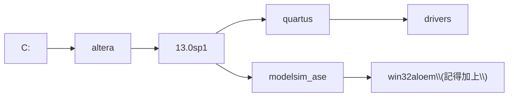

### 安裝 USB

```
C:\altera\13.0sp1\quartus\drivers
```

訣竅： 找 altera -> quartus -> 

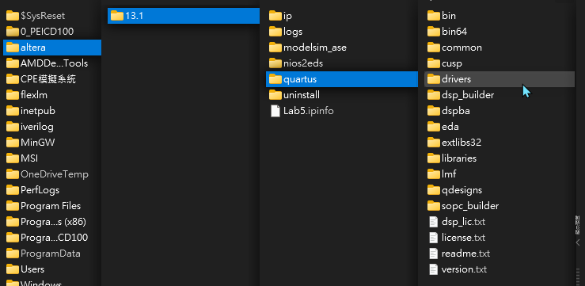

### testbench 路徑設定

在 ModeSim-Altera 填上：
```
C:\altera\13.0sp1\modelsim_ase\win32aloem\
```


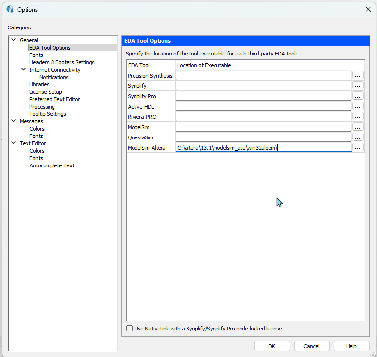
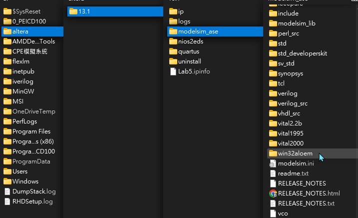

### 畫波形圖如果遇到 Error occur

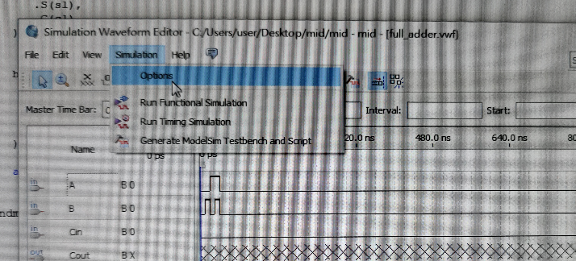


>要選 Quartus II !!

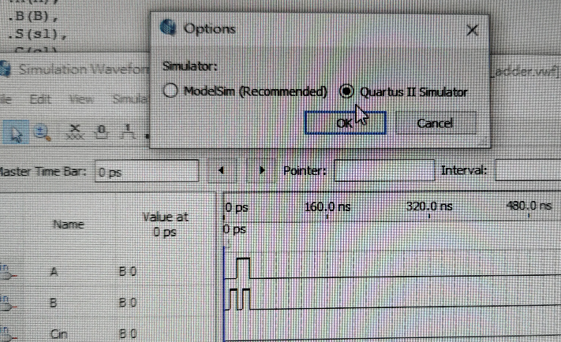


### 一般 .v 跑合成

用 "Start Analysis & Synthesis" (開始分析與合成)


>error 、 warning 都要看！！


像下面就找出了 s1 有問題。

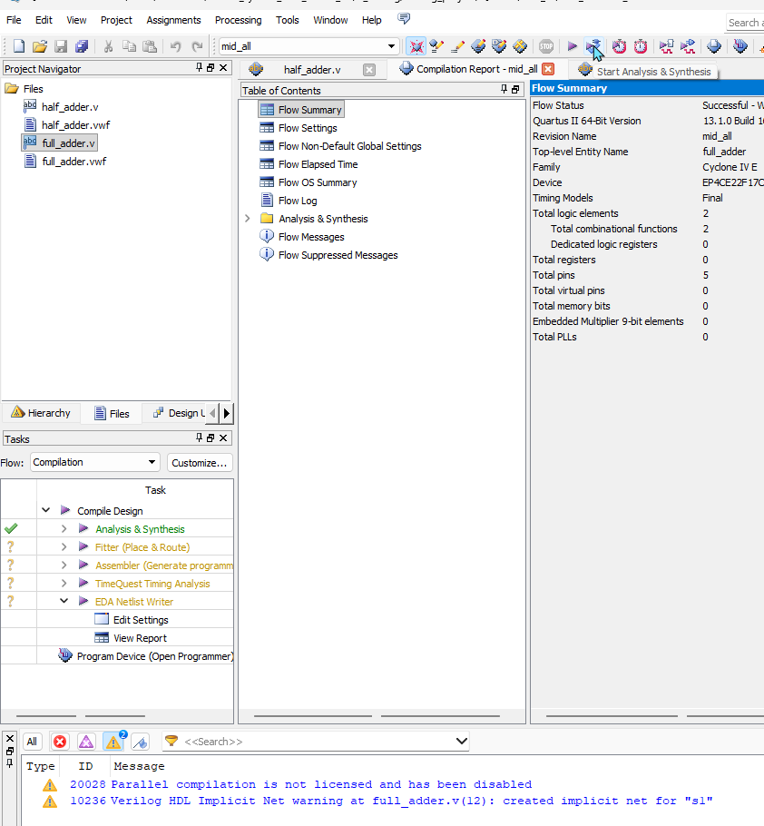

要長這樣才是對的，只剩下一個 warning ，並且寫 Parallel compilation is not licensed and has been disabled (平行編譯功能沒有授權，所以被關閉了)

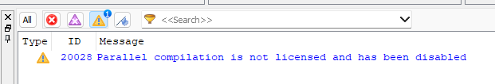

### tb.v 跑合成

像下面那樣就是代表沒有語法錯誤，因為 tb 不能 synthesize(合成)


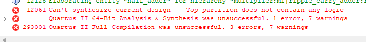

### 上傳電路板

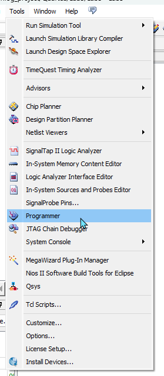
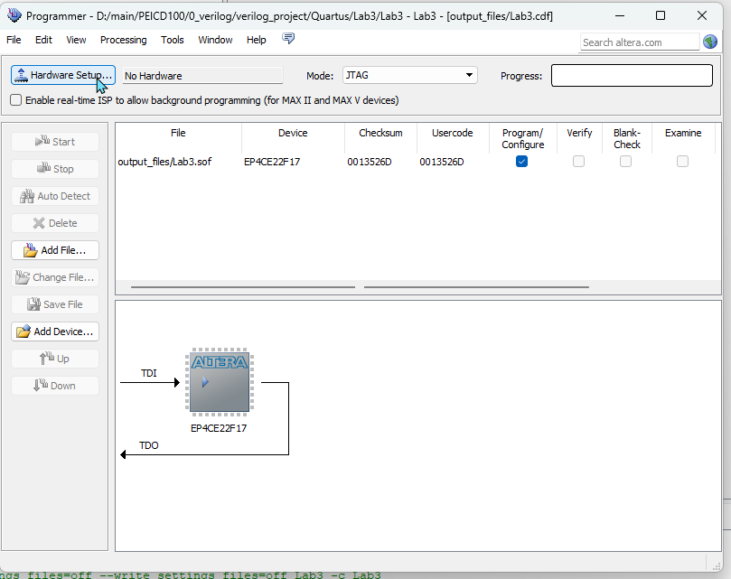
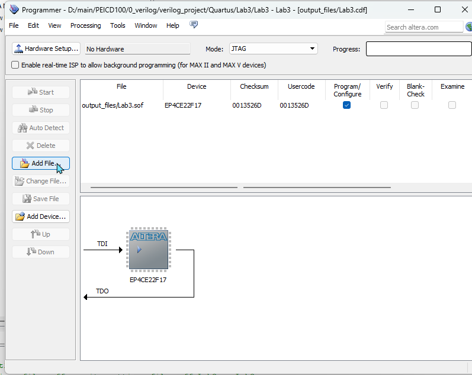
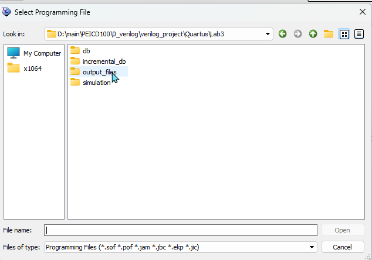

選 sof 檔案

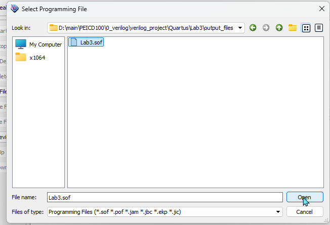


## 代碼整理

### 第一題

#### half_adder.v
```verilog
module half_adder(
    input A,B,
    output S,C
);

    assign S = A ^ B;
    assign C = A & B;

endmodule
```

#### full_adder.v
```verilog
module full_adder (
    input A,B,Cin,
    output S,Cout
);
    wire s1,c1,c2;

    half_adder h1 (
        .A(A),
        .B(B),
        .S(s1),
        .C(c1)
    );

    half_adder h2 (
        .A(s1),
        .B(Cin),
        .S(S),
        .C(c2)
    );

    assign Cout = c1 | c2;

endmodule
```

#### ripple_carry_adder.v
```verilog
module ripple_carry_adder (
    input [3:0] A,B,
    input Cin,
    output [3:0]S,
    output Cout
);
    wire c1,c2,c3;

    full_adder f1 (
        .A   (A[0]),
        .B   (B[0]),
        .Cin (Cin),
        .S   (S[0]),
        .Cout(c1)
    );

    full_adder f2 (
        .A   (A[1]),
        .B   (B[1]),
        .Cin (c1),
        .S   (S[1]),
        .Cout(c2)
    );

    full_adder f3 (
        .A   (A[2]),
        .B   (B[2]),
        .Cin (c2),
        .S   (S[2]),
        .Cout(c3)
    );

    full_adder f4 (
        .A   (A[3]),
        .B   (B[3]),
        .Cin (c3),
        .S   (S[3]),
        .Cout(Cout)
    );

endmodule
```

#### multiplier.v
```verilog
module multiplier (
    input [2:0] A,
    input [3:0] B,
    output [6:0] S
);

    wire [3:0] a0b = {4{A[0]}} & {B};
    wire [3:0] a1b = {4{A[1]}} & {B};
    wire [3:0] a2b = {4{A[2]}} & {B};
    wire [3:0] w;


    assign S[0] = a0b[0];

    ripple_carry_adder r1 (
        .A  ({1'b0,a0b[3:1]}),
        .B  (a1b),
        .Cin(1'b0),
        .S  ({w[2:0],S[1]}),
        .Cout(w[3])
    );

    ripple_carry_adder r2 (
        .A  (w),
        .B  (a2b),
        .Cin(1'b0),
        .S  (S[5:2]),
        .Cout(S[6])
    );

endmodule
```

#### tb_multiplier.v
```verilog
module tb_multiplier ();
    reg [2:0] A;
    reg [3:0] B;
    wire [6:0] S;

    multiplier m1 (
        .A(A),
        .B(B),
        .S(S)
    );

    integer i, j;

    initial begin
        for (i = 0; i < 8; i = i + 1) begin
            for (j = 0; j < 16; j = j + 1) begin
                A = i;
                B = j;
                #10;
            end
        end
    end

    initial begin
        $monitor($time, (" A: %d | B: %d | S: %d "), A, B, S);
    end
endmodule
```

### 第二題

#### three_bits_decoder_enable.v
```verilog
module three_bits_decoder_enable(
    input [2:0] I,
    input En,
    output reg [7:0] Y
);

    always @(*)begin
        Y = 8'b00000000;  //預設輸出為 0，不要放在 Enable 裡面
        if(En)begin
            case(I)
                3'd0: Y = 8'b00000001;
                3'd1: Y = 8'b00000010;
                3'd2: Y = 8'b00000100;
                3'd3: Y = 8'b00001000;
                3'd4: Y = 8'b00010000;
                3'd5: Y = 8'b00100000;
                3'd6: Y = 8'b01000000;
                3'd7: Y = 8'b10000000;
            endcase
        end
    end
endmodule
```

#### decoder_4_to_16.v
```verilog
module decoder_4_to_16 (
    input [3:0] I,
    output [15:0] Y
);

    three_bits_decoder_enable t1(
        .I(I[2:0]),
		.En(~I[3]),      //記得 ~
        .Y(Y[7:0])
    );
    three_bits_decoder_enable t2(
        .I(I[2:0]),
        .En(I[3]),
        .Y(Y[15:8])
    );

endmodule
```

#### Bin2Gray.v
```verilog
module Bin2Gray(
    input [3:0] I,
    output [3:0] Y
);

    wire [15:0] m;

    decoder_4_to_16 d1(
        .I(I),
        .Y(m)
    );

    assign Y[3] = m[8] | m[9] | m[10] | m[11] |
                      m[12] | m[13] | m[14] | m[15];

    assign Y[2] = m[4] | m[5] | m[6] | m[7] |
                      m[8] | m[9] | m[10] | m[11];

    assign Y[1] = m[2] | m[3] | m[4] | m[5] |
                      m[10] | m[11] | m[12] | m[13];

    assign Y[0] = m[1] | m[2] | m[5] | m[6] |
                      m[9] | m[10] | m[13] | m[14];


endmodule
```

#### tb_Bin2Gray.v
```verilog
module tb_Bin2Gray();

    reg [3:0] I;
    wire [3:0] Y;

    Bin2Gray b1(
        .I(I),
        .Y(Y)
    );

    integer i;

    initial begin
        for(i=0;i<=15;i=i+1)begin

            I = i;

            #10;

        end
    end

    initial begin
        $monitor($time," B: %b | G: %b",I,Y);
    end


endmodule
```
