1.把 design cources 設定成 top ，不要用 simulation sources
2.按下 “Run Synthesis”

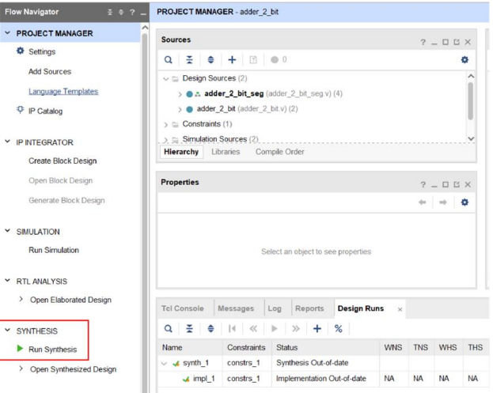

3.按下 ok

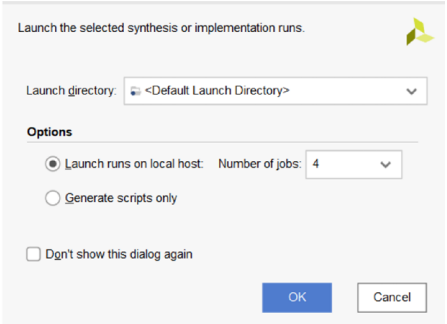

4.按下 “Open Synthesized Design”

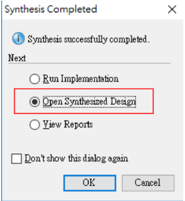

5.開啟腳位設定

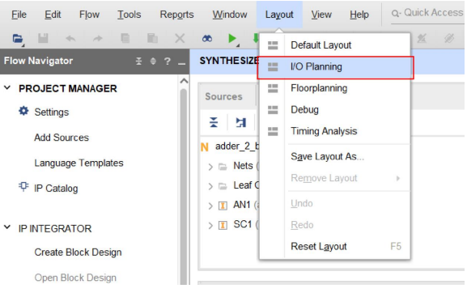

6.先選 LVCMOS33 ，全部設定 3.3 v

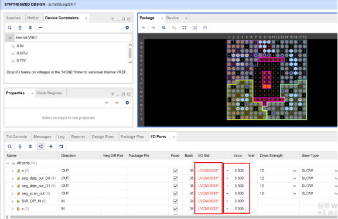

7.設定腳位

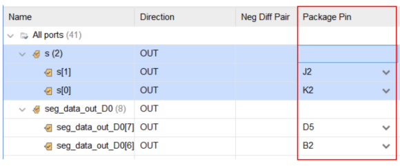

8.按下 ctrl + s，命名檔案(盡量以 top 檔案命名)

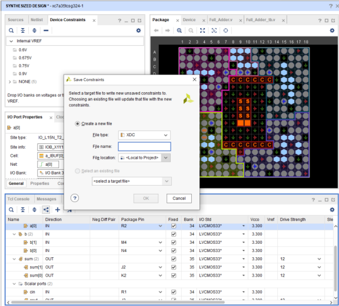

9.(非必要) sources -> constraints -> constrs_1 -> top 檔案名.xdc

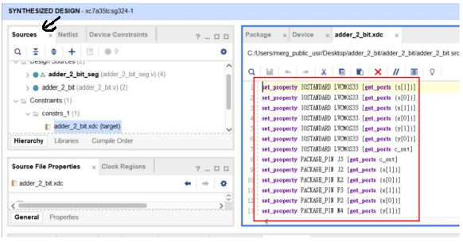

10.點 "Run Implementation"

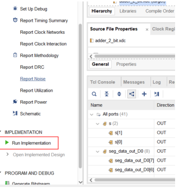

11.都按 ok 直到出線以下兩種

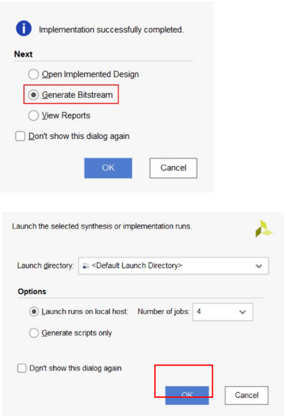

12.點 "Open Hardware Manager."

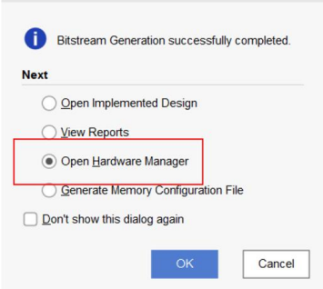

13.打開 FPGA 開關

14.Click Open target

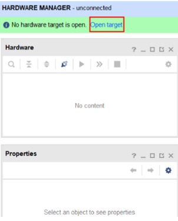

15.Click Program device

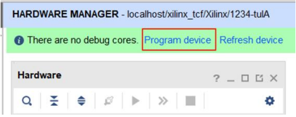

16.Click Program.

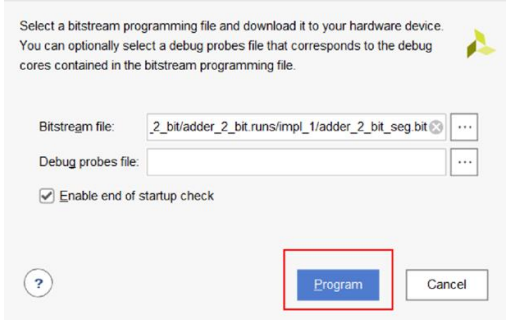

17.完成