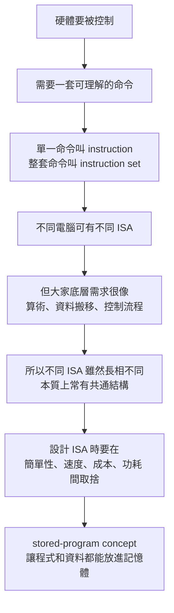
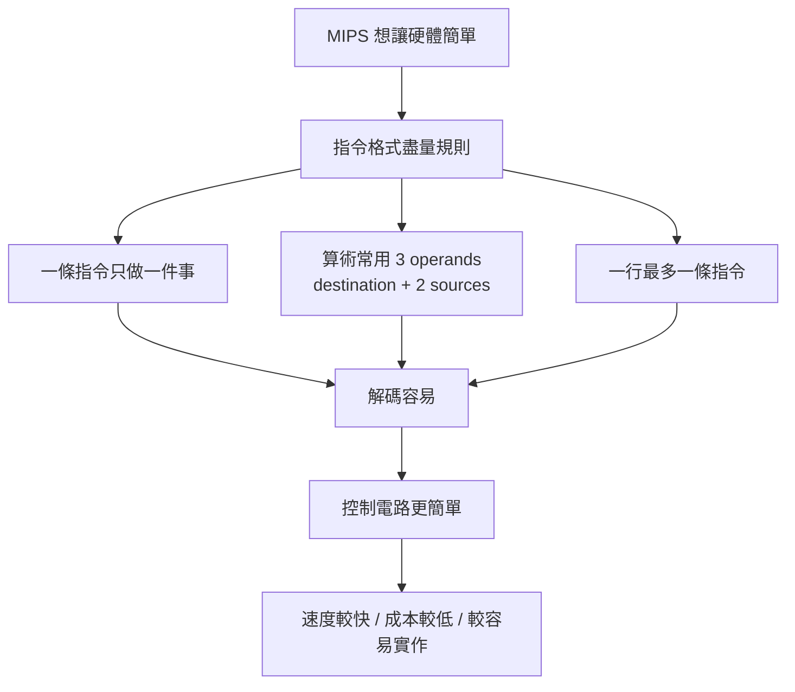

## 2.1 介紹


### 講解

已啟用教學模式

我們先抓這 4 頁其實在回答什麼問題：

**「電腦為什麼需要指令集(Instruction Set)？」**
以及
**「設計一套指令集時，到底在追求什麼？」**

這四頁不是在教你背一堆指令，而是在先建立整章的世界觀。投影片第 3 頁先定義「指令」與「指令集」，第 4 頁說明為什麼課堂選 MIPS，第 5 頁補充其他常見 ISA(Instruction Set Architecture, 指令集架構)，第 6 頁則講設計指令集時的核心目標。 

---

#### 1. 這段在回答什麼問題

你可以把 CPU(中央處理器) 想成一個**只聽得懂非常有限命令的人**。

你平常寫 C、Java、Python，看起來像是在「跟電腦講話」，但其實那是高階語言(High-Level Language, 高階語言)。
真正硬體最後聽懂的，是更低層的命令集合，也就是：

* instruction(指令)：單一命令
* instruction set(指令集)：所有可用命令的全集

投影片第 3 頁就是在講這件事：
**要指揮硬體，必須使用它的語言；那個語言的單字叫 instruction，整套字彙叫 instruction set。** 

生活化一點：

* 一句話「把 A 和 B 相加」＝ 一條 instruction(指令)
* 一本「這台機器所有合法命令手冊」＝ instruction set(指令集)

---

#### 2. 核心概念

##### (a) Instruction(指令) 是硬體可執行的最小命令

像後面你會看到的：

* `add`
* `sub`
* `lw`
* `sw`

這些都不是隨便取的名字，而是 CPU 真正能辨識、執行的操作類型。

---

##### (b) Instruction Set(指令集) 是 CPU 的「語言規格」

它定義了：

* 有哪些指令能用
* 指令格式長怎樣
* 資料怎麼搬
* 能不能跳躍(branch/jump)
* 如何存取記憶體(memory)

這其實就是 ISA(Instruction Set Architecture, 指令集架構) 的核心精神：
**ISA 是 software(軟體) 與 hardware(硬體) 之間的抽象介面。** ([維基百科][1])

你可以把 ISA 想成：

* 軟體對硬體下命令的「契約」
* 編譯器(compiler) 必須遵守的目標格式
* CPU 設計者必須實作的行為規範

---

##### \(c) 為什麼課本用 MIPS？

第 4 頁寫得很直接：
本章選的指令集源自 MIPS Technologies。

原因不是因為現代桌機主要跑 MIPS，而是因為 **MIPS 非常適合教學**：

* 規則整齊
* 格式乾淨
* RISC(Reduced Instruction Set Computer, 精簡指令集電腦) 風格鮮明
* 很容易拿來理解指令格式、暫存器(register)、記憶體(memory)、分支(branch) 這些基礎概念

MIPS 本身確實屬於 RISC 家族。([維基百科][2])

---

#### 3. 關係 / 流程 / 因果

我把第 3～6 頁整理成下面這條邏輯鏈：



這就是第 4～6 頁真正想建立的架構。 

---

#### 4. 第 4 頁：為什麼不同計算機語言會「看起來有點像」

這頁有一個很重要但很容易被忽略的點：

投影片說，計算機語言間的相似性，來自於所有計算機都：

* 建構在相同基礎原則的硬體技術上
* 必須提供的基本運算其實不多
* 要找一種讓硬體與編譯器容易建構、又有高效能低成本低電耗的語言
* 遵循 stored-program concept(內儲程式觀念) 

直覺講：

你以為世界上 CPU 千奇百怪，但它們都逃不掉幾件事：

* 要加減乘除
* 要搬資料
* 要比較大小
* 要跳到別的地方執行
* 要讀記憶體、寫記憶體

所以不管是 MIPS、ARM、x86，表面不同，骨架常常很像。

就像不同語言都有：

* 名詞
* 動詞
* 條件句
* 迴圈

不是巧合，而是因為它們都要解決類似問題。

---

#### 5. 第 5 頁：不只 MIPS，還有 ARM、x86、ARMv8

這頁是在提醒你：

**MIPS 只是教材用的代表，不是唯一答案。**

投影片列了三個其他常見指令集：

* ARMv7
* Intel x86
* ARMv8 

你可以先這樣理解：

* **MIPS**：教學很常用，規則清楚
* **x86**：個人電腦/伺服器世界很重要
* **ARM/ARMv8**：手機、嵌入式、很多現代裝置很重要

但要注意一件事：
投影片把 ARMv7「2011 年 90 億顆」這種數字拿來當例子，這是**歷史時間點的教材敘述**，你不要把它誤認成今天最新市場現況。這頁重點不是最新市占，而是讓你知道：
**真實世界存在很多 ISA，而 MIPS 是我們用來學原理的模型。** 

---

#### 6. 第 6 頁：選指令集時，真正決定性的考量是什麼

這頁最重要。

投影片引用 1947 年 Burks、Goldstine、von Neumann 的觀點：
選定一個指令集時，真正決定性的考慮，基本上是**可行性(feasibility)**，包括：

* 設備的簡單性
* 要處理問題的明確性
* 處理該問題的速度 

這句話翻成白話就是：

> 指令集不是越花俏越好，
> 而是要「做得出來、跑得動、夠快、成本合理」。

這是計算機結構整門課一直在談的主旋律。

不是「能不能做」，而是：

* 能不能簡單地做
* 能不能有效率地做
* 能不能便宜地做
* 能不能省電地做

---

#### 7. stored-program concept(內儲程式觀念) 到底是什麼

第 4 頁最後一點提到 stored-program concept。這個觀念非常重要。

直覺版：

以前的機器常常像專用工具，做不同事要重新接線或重新配置。
stored-program concept 的突破在於：

**把「程式」本身也當成資料，放進記憶體(memory) 裡。**

這樣 CPU 就可以：

1. 從記憶體讀出 instruction(指令)
2. 解讀它
3. 執行它
4. 再讀下一條

這就是現代電腦的基礎模式。
Britannica 與 Von Neumann architecture 的資料都指出，stored-program computer(內儲程式電腦) 的核心，就是把 instructions 與 data 一起存入可存取記憶體，讓同一台機器能透過載入不同程式完成不同任務。([Encyclopedia Britannica][3])

生活化例子：

* **非內儲程式機器**像一台只能做珍珠奶茶的機器
* **內儲程式電腦**像一台萬用廚房，只要換食譜，就能做炒飯、義大利麵、蛋糕

食譜 = 程式
食材 = 資料
廚房 = 硬體

---

#### 8. 為什麼會這樣

因為計算機設計永遠在做 trade-off(取捨)。

你可能會直覺覺得：

* 指令越多越好
* 越複雜越方便
* 一條指令做越多事越厲害

但實際上常常相反。

指令太多、格式太亂，會讓：

* 硬體解碼更複雜
* 控制邏輯更難做
* 時脈可能拉不高
* 功耗上升
* 編譯器最佳化更麻煩

所以第 6 頁才會強調「簡單性 + 明確性 + 速度」。

這也是 RISC 思想後來很重要的原因之一：
**用比較少、比較規則、比較簡單的指令，換硬體的效率與清楚性。** ([維基百科][4])

---

#### 9. 最容易考 / 最容易混淆

這幾個地方最容易混：

##### (1) instruction set ≠ 一支程式

不是。

* 一支程式：某個具體的指令序列
* instruction set：CPU 所支援的全部指令規格

像英文單字表 ≠ 你寫的一篇作文。

---

##### (2) MIPS 這裡是指 ISA，不是效能單位 MIPS

這超容易混。

* **MIPS 架構**：一種指令集架構
* **MIPS 效能單位**：Million Instructions Per Second，每秒百萬指令

這兩個只是剛好縮寫一樣，不是同一件事。

---

##### (3) 第 5 頁列 ARM/x86，不代表它們「本質完全不同」

其實它們都是在解決同樣的基本問題，只是設計哲學、歷史包袱、指令格式不同。

---

##### (4) stored-program concept 不只是「程式存在記憶體」

更精確地說，是：

* 程式和資料都能放在記憶體
* CPU 能從記憶體取出程式來執行
* 因而同一套硬體可以透過更換程式完成不同任務

---

#### 10. 你可以怎麼記這 4 頁

我建議你用這 4 句背：

1. **instruction(指令)** 是 CPU 能執行的單一命令。
2. **instruction set(指令集)** 是 CPU 全部合法命令的集合。
3. 課本用 **MIPS** 來教，是因為它規則清楚、適合看懂 ISA。
4. 設計 ISA 的核心不是炫技，而是 **簡單、可行、快速、成本合理**。 

---

#### 11. 小結

第 3～6 頁本質上是在替整章鋪路：

* 第 3 頁：先定義什麼叫 instruction / instruction set
* 第 4 頁：說明為什麼大家底層其實很像，並引入 MIPS 與 stored-program concept
* 第 5 頁：提醒你真實世界有很多 ISA，不只 MIPS
* 第 6 頁：點出 ISA 設計最重要的是 feasibility(可行性) 與設計取捨  

你如果把這四頁看懂，後面學：

* 暫存器(register)
* 載入/儲存(load/store)
* 分支(branch)
* 指令格式(format)

就會知道它們不是零散知識，而都是在回答同一件事：

**「我們怎麼設計一種讓硬體好做、軟體好編譯、執行又夠快的機器語言？」**

下一則我可以接著用同樣方式講 **第 7～9 頁**，那幾頁就會正式開始進入 MIPS 指令總覽。

[1]: https://en.wikipedia.org/wiki/Instruction_set_architecture?utm_source=chatgpt.com "Instruction set architecture"
[2]: https://en.wikipedia.org/wiki/MIPS_architecture?utm_source=chatgpt.com "MIPS architecture"
[3]: https://www.britannica.com/technology/stored-program-concept?utm_source=chatgpt.com "Stored-program computer | Definition, History, & Facts"
[4]: https://en.wikipedia.org/wiki/Reduced_instruction_set_computer?utm_source=chatgpt.com "Reduced instruction set computer"


## 2.2 計算機硬體的運作

### 講解

已啟用教學模式

#### 這張投影片在回答什麼問題

這張圖在回答的是：

**MIPS(一種 Instruction Set Architecture，指令集架構) 的算術指令，為什麼長得這麼規則？這種規則對硬體有什麼好處？**

投影片用最基本的例子：

```asm
add a, b, c
```

來說明 MIPS 的核心設計思想：**指令格式規則、簡單、固定，讓硬體更容易做、也更快。** 這正是課本第 2.2 節的重點：`add a, b, c` 代表把 `b` 和 `c` 相加，結果放進 `a`，而且這種寫法體現了「simplicity favors regularity」這個設計原則。 ([training.mips.com][1])

---

#### 先用直覺理解

把 CPU 想成一個很死板但很快的工人。

它最喜歡這種命令：

* 你要做什麼：`add`
* 第一個材料：`b`
* 第二個材料：`c`
* 結果放哪裡：`a`

也就是：

> 做一件事、吃固定數量的輸入、把結果放到固定位置。

這種格式很像你每次都填同一種表單。表單固定，機器就能很快掃描，不用每次猜「你這行到底想幹嘛」。

---

#### 核心概念

這張圖有 4 個重點。

##### 1. `add a, b, c` 的意思

```asm
add a, b, c
```

表示：

```text
a = b + c
```

也就是把 `b` 與 `c` 的和，存到 `a`。這正是課本第 2.2 節在說的內容。

---

##### 2. 一條 MIPS 算術指令只做一件事

投影片紅字寫：

* 每一道 MIPS 算術指令只能執行一種運算
* 永遠一定使用三個變數
* 每行最多包含一道指令

這是在強調 **RISC(Reduced Instruction Set Computer，精簡指令集電腦)** 風格：
指令功能單純，盡量不要一條指令包太多事。MIPS 教材與 MIPS 官方訓練文件都把這點講得很清楚：MIPS 指令常採三個運算元，通常是兩個來源暫存器加一個目的暫存器。([training.mips.com][1])

---

##### 3. 三個運算元格式

這個格式通常是：

```text
add destination, source1, source2
```

也就是：

* `a`：destination(目的地)
* `b`：source1(來源1)
* `c`：source2(來源2)

所以：

```asm
add a, b, c
```

不是「把 a 加到 b 和 c」，而是：

```text
a ← b + c
```

這是初學者很容易看反的地方。

---

##### 4. 設計原則一：simplicity favors regularity

中文是：

**規律性易導致簡單的設計**

意思是：

> 如果每條指令都長得很像，硬體就比較好設計。

例如 MIPS 很多基本指令都維持固定風格，甚至整體 instruction format(指令格式) 也盡量固定成 32 bits，這能降低解碼(decoding) 的複雜度。Cornell 的課程資料也把這點列為 MIPS 的核心設計原則之一。([cs.cornell.edu][2])

---

#### 關係 / 流程 / 因果

我們可以把這張圖的邏輯整理成下面這樣：



---

#### 生活化例子

假設你要叫一個完全不會變通的機器人做菜。

你有兩種命令方式：

##### 方式 A：很規則

* 切 蘋果 胡蘿蔔 放進碗A
* 加 鹽 胡椒 放進碗B
* 混合 碗A 碗B 放進盤子C

##### 方式 B：很自由

* 幫我把蘋果和胡蘿蔔切一切，順便拌一下，然後看情況放盤子裡

對人類來說，方式 B 比較自然。
但對硬體來說，方式 A 比較好，因為它每次都知道：

* 動作在哪裡
* 輸入有幾個
* 輸出放哪裡

MIPS 就偏向方式 A。

---

#### 為什麼會這樣

因為 CPU 真的很在意這些事情：

* **解碼(decoding) 要快**
* **控制電路(control logic) 要簡單**
* **硬體面積(area) 不要太大**
* **功耗(power) 不要太高**

如果每條指令格式都差很多，CPU 在讀指令時就要花更多邏輯判斷。
反過來，若指令夠規則，CPU 可以更快速決定：

* 這是什麼操作
* 哪些暫存器(registers) 要讀
* 結果寫回哪裡

這也是為什麼 MIPS 被拿來當教學 ISA：它的規則非常清楚。MIPS 文件指出典型三運算元格式是「2 個 source registers + 1 個 destination register」，而學術課程也常用它來說明固定長度指令與少量格式的優點。([training.mips.com][1])

---

#### 最容易考 / 最容易混淆

##### 容易混淆 1：是不是所有 MIPS 指令都一定三個變數？

**不是。**

這張投影片比較精確地說，應該理解成：

* **基本算術指令** 很常是三個 operands
* 但 **不是所有 MIPS 指令** 都這樣

例如：

```asm
addi $s1, $s2, 20
lw   $t0, 32($s3)
j    10000
```

這些就不是單純的「三個變數」格式。MIPS 也有 R-type、I-type、J-type 三種主要格式。 ([cs.cornell.edu][2])

所以如果考試寫成：

> 「所有 MIPS 指令都永遠使用三個變數」

這句話就太絕對，**應判成不精確甚至錯誤**。
比較正確的說法是：

> 「MIPS 的基本算術指令常採固定的三運算元格式。」

---

##### 容易混淆 2：`add a, b, c` 誰是結果？

是 **第一個**。

```text
a = b + c
```

不是 `c = a + b`，也不是 `b = a + c`。

---

##### 容易混淆 3：一行最多一條指令 是什麼意思？

意思是組合語言(Assembly Language，組合語言) 通常一行就對應一條 machine instruction(機器指令)。
這樣翻譯、閱讀、除錯都比較直接。

---

#### 你可以怎麼背

你可以把這頁濃縮成一句口訣：

> **MIPS 算術：一條只做一件事，兩個輸入，一個輸出，格式固定。**

或者再短一點：

> **規則固定，硬體輕鬆。**

---

#### 小結

這張投影片的重點不是只有 `add` 這條指令本身，而是它背後代表的設計哲學：

1. `add a, b, c` 表示 `a = b + c`
2. MIPS 喜歡讓算術指令格式固定、規則明確
3. 常見模式是 2 個來源 + 1 個目的地
4. 這樣能讓 CPU 的硬體設計更簡單
5. 這就是 **simplicity favors regularity**

---

#### 補一個你現在就該會的例子

若題目是：

```c
a = b + c;
d = a - e;
```

對應的 MIPS 基本寫法會是：

```asm
add a, b, c
sub d, a, e
```

因為 MIPS 傾向把複雜工作拆成多條簡單指令，而不是一條全包。這也是第 2.2 節下一頁的延伸例子。

---

#### 我直接幫你糾正一個常見誤解

這頁投影片如果你照字面背，很容易背成：

> 「MIPS 全部指令都只能三個變數」

這樣會出事。
**正確觀念是：這頁在講的是 MIPS 的算術指令風格與設計原則，不是整個 MIPS 所有指令的唯一格式。**

---

這頁對應教材檔案：

若你要，我下一則可以直接接著幫你講這一頁後面的 **11~13 頁**，也就是：

* 為什麼 `a=b+c+d+e` 不能一條做完
* C 程式怎麼一步步翻成 MIPS
* 為什麼組合語言行數通常比 C 多

[1]: https://training.mips.com/basic_mips/PDF/Instruction_Set.pdf?utm_source=chatgpt.com "1 This section covers the MIPS instruction set."
[2]: https://www.cs.cornell.edu/courses/cs3410/2012sp/lecture/12-risc-cisc-and-assemblers-i.pdf?utm_source=chatgpt.com "RISC, CISC, and Assemblers - Cornell: Computer Science"


