## 2.1 介紹


### 講解

已啟用教學模式

我們先抓這 4 頁其實在回答什麼問題：

**「電腦為什麼需要指令集(Instruction Set)？」**
以及
**「設計一套指令集時，到底在追求什麼？」**

這四頁不是在教你背一堆指令，而是在先建立整章的世界觀。投影片第 3 頁先定義「指令」與「指令集」，第 4 頁說明為什麼課堂選 MIPS，第 5 頁補充其他常見 ISA(Instruction Set Architecture, 指令集架構)，第 6 頁則講設計指令集時的核心目標。 

---

#### 1. 這段在回答什麼問題

你可以把 CPU(中央處理器) 想成一個**只聽得懂非常有限命令的人**。

你平常寫 C、Java、Python，看起來像是在「跟電腦講話」，但其實那是高階語言(High-Level Language, 高階語言)。
真正硬體最後聽懂的，是更低層的命令集合，也就是：

* instruction(指令)：單一命令
* instruction set(指令集)：所有可用命令的全集

投影片第 3 頁就是在講這件事：
**要指揮硬體，必須使用它的語言；那個語言的單字叫 instruction，整套字彙叫 instruction set。** 

生活化一點：

* 一句話「把 A 和 B 相加」＝ 一條 instruction(指令)
* 一本「這台機器所有合法命令手冊」＝ instruction set(指令集)

---

#### 2. 核心概念

##### (a) Instruction(指令) 是硬體可執行的最小命令

像後面你會看到的：

* `add`
* `sub`
* `lw`
* `sw`

這些都不是隨便取的名字，而是 CPU 真正能辨識、執行的操作類型。

---

##### (b) Instruction Set(指令集) 是 CPU 的「語言規格」

它定義了：

* 有哪些指令能用
* 指令格式長怎樣
* 資料怎麼搬
* 能不能跳躍(branch/jump)
* 如何存取記憶體(memory)

這其實就是 ISA(Instruction Set Architecture, 指令集架構) 的核心精神：
**ISA 是 software(軟體) 與 hardware(硬體) 之間的抽象介面。** ([維基百科][1])

你可以把 ISA 想成：

* 軟體對硬體下命令的「契約」
* 編譯器(compiler) 必須遵守的目標格式
* CPU 設計者必須實作的行為規範

---

##### \(c) 為什麼課本用 MIPS？

第 4 頁寫得很直接：
本章選的指令集源自 MIPS Technologies。

原因不是因為現代桌機主要跑 MIPS，而是因為 **MIPS 非常適合教學**：

* 規則整齊
* 格式乾淨
* RISC(Reduced Instruction Set Computer, 精簡指令集電腦) 風格鮮明
* 很容易拿來理解指令格式、暫存器(register)、記憶體(memory)、分支(branch) 這些基礎概念

MIPS 本身確實屬於 RISC 家族。([維基百科][2])

---

#### 3. 關係 / 流程 / 因果

我把第 3～6 頁整理成下面這條邏輯鏈：

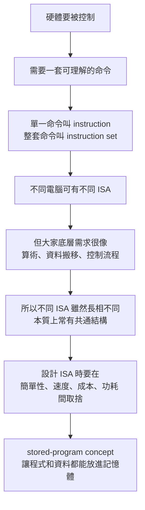

這就是第 4～6 頁真正想建立的架構。 

---

#### 4. 第 4 頁：為什麼不同計算機語言會「看起來有點像」

這頁有一個很重要但很容易被忽略的點：

投影片說，計算機語言間的相似性，來自於所有計算機都：

* 建構在相同基礎原則的硬體技術上
* 必須提供的基本運算其實不多
* 要找一種讓硬體與編譯器容易建構、又有高效能低成本低電耗的語言
* 遵循 stored-program concept(內儲程式觀念) 

直覺講：

你以為世界上 CPU 千奇百怪，但它們都逃不掉幾件事：

* 要加減乘除
* 要搬資料
* 要比較大小
* 要跳到別的地方執行
* 要讀記憶體、寫記憶體

所以不管是 MIPS、ARM、x86，表面不同，骨架常常很像。

就像不同語言都有：

* 名詞
* 動詞
* 條件句
* 迴圈

不是巧合，而是因為它們都要解決類似問題。

---

#### 5. 第 5 頁：不只 MIPS，還有 ARM、x86、ARMv8

這頁是在提醒你：

**MIPS 只是教材用的代表，不是唯一答案。**

投影片列了三個其他常見指令集：

* ARMv7
* Intel x86
* ARMv8 

你可以先這樣理解：

* **MIPS**：教學很常用，規則清楚
* **x86**：個人電腦/伺服器世界很重要
* **ARM/ARMv8**：手機、嵌入式、很多現代裝置很重要

但要注意一件事：
投影片把 ARMv7「2011 年 90 億顆」這種數字拿來當例子，這是**歷史時間點的教材敘述**，你不要把它誤認成今天最新市場現況。這頁重點不是最新市占，而是讓你知道：
**真實世界存在很多 ISA，而 MIPS 是我們用來學原理的模型。** 

---

#### 6. 第 6 頁：選指令集時，真正決定性的考量是什麼

這頁最重要。

投影片引用 1947 年 Burks、Goldstine、von Neumann 的觀點：
選定一個指令集時，真正決定性的考慮，基本上是**可行性(feasibility)**，包括：

* 設備的簡單性
* 要處理問題的明確性
* 處理該問題的速度 

這句話翻成白話就是：

> 指令集不是越花俏越好，
> 而是要「做得出來、跑得動、夠快、成本合理」。

這是計算機結構整門課一直在談的主旋律。

不是「能不能做」，而是：

* 能不能簡單地做
* 能不能有效率地做
* 能不能便宜地做
* 能不能省電地做

---

#### 7. stored-program concept(內儲程式觀念) 到底是什麼

第 4 頁最後一點提到 stored-program concept。這個觀念非常重要。

直覺版：

以前的機器常常像專用工具，做不同事要重新接線或重新配置。
stored-program concept 的突破在於：

**把「程式」本身也當成資料，放進記憶體(memory) 裡。**

這樣 CPU 就可以：

1. 從記憶體讀出 instruction(指令)
2. 解讀它
3. 執行它
4. 再讀下一條

這就是現代電腦的基礎模式。
Britannica 與 Von Neumann architecture 的資料都指出，stored-program computer(內儲程式電腦) 的核心，就是把 instructions 與 data 一起存入可存取記憶體，讓同一台機器能透過載入不同程式完成不同任務。([Encyclopedia Britannica][3])

生活化例子：

* **非內儲程式機器**像一台只能做珍珠奶茶的機器
* **內儲程式電腦**像一台萬用廚房，只要換食譜，就能做炒飯、義大利麵、蛋糕

食譜 = 程式
食材 = 資料
廚房 = 硬體

---

#### 8. 為什麼會這樣

因為計算機設計永遠在做 trade-off(取捨)。

你可能會直覺覺得：

* 指令越多越好
* 越複雜越方便
* 一條指令做越多事越厲害

但實際上常常相反。

指令太多、格式太亂，會讓：

* 硬體解碼更複雜
* 控制邏輯更難做
* 時脈可能拉不高
* 功耗上升
* 編譯器最佳化更麻煩

所以第 6 頁才會強調「簡單性 + 明確性 + 速度」。

這也是 RISC 思想後來很重要的原因之一：
**用比較少、比較規則、比較簡單的指令，換硬體的效率與清楚性。** ([維基百科][4])

---

#### 9. 最容易考 / 最容易混淆

這幾個地方最容易混：

##### (1) instruction set ≠ 一支程式

不是。

* 一支程式：某個具體的指令序列
* instruction set：CPU 所支援的全部指令規格

像英文單字表 ≠ 你寫的一篇作文。

---

##### (2) MIPS 這裡是指 ISA，不是效能單位 MIPS

這超容易混。

* **MIPS 架構**：一種指令集架構
* **MIPS 效能單位**：Million Instructions Per Second，每秒百萬指令

這兩個只是剛好縮寫一樣，不是同一件事。

---

##### (3) 第 5 頁列 ARM/x86，不代表它們「本質完全不同」

其實它們都是在解決同樣的基本問題，只是設計哲學、歷史包袱、指令格式不同。

---

##### (4) stored-program concept 不只是「程式存在記憶體」

更精確地說，是：

* 程式和資料都能放在記憶體
* CPU 能從記憶體取出程式來執行
* 因而同一套硬體可以透過更換程式完成不同任務

---

#### 10. 你可以怎麼記這 4 頁

我建議你用這 4 句背：

1. **instruction(指令)** 是 CPU 能執行的單一命令。
2. **instruction set(指令集)** 是 CPU 全部合法命令的集合。
3. 課本用 **MIPS** 來教，是因為它規則清楚、適合看懂 ISA。
4. 設計 ISA 的核心不是炫技，而是 **簡單、可行、快速、成本合理**。 

---

#### 11. 小結

第 3～6 頁本質上是在替整章鋪路：

* 第 3 頁：先定義什麼叫 instruction / instruction set
* 第 4 頁：說明為什麼大家底層其實很像，並引入 MIPS 與 stored-program concept
* 第 5 頁：提醒你真實世界有很多 ISA，不只 MIPS
* 第 6 頁：點出 ISA 設計最重要的是 feasibility(可行性) 與設計取捨  

你如果把這四頁看懂，後面學：

* 暫存器(register)
* 載入/儲存(load/store)
* 分支(branch)
* 指令格式(format)

就會知道它們不是零散知識，而都是在回答同一件事：

**「我們怎麼設計一種讓硬體好做、軟體好編譯、執行又夠快的機器語言？」**

下一則我可以接著用同樣方式講 **第 7～9 頁**，那幾頁就會正式開始進入 MIPS 指令總覽。

[1]: https://en.wikipedia.org/wiki/Instruction_set_architecture?utm_source=chatgpt.com "Instruction set architecture"
[2]: https://en.wikipedia.org/wiki/MIPS_architecture?utm_source=chatgpt.com "MIPS architecture"
[3]: https://www.britannica.com/technology/stored-program-concept?utm_source=chatgpt.com "Stored-program computer | Definition, History, & Facts"
[4]: https://en.wikipedia.org/wiki/Reduced_instruction_set_computer?utm_source=chatgpt.com "Reduced instruction set computer"


## 2.2 計算機硬體的運作

### 講解

已啟用教學模式

#### 這張投影片在回答什麼問題

這張圖在回答的是：

**MIPS(一種 Instruction Set Architecture，指令集架構) 的算術指令，為什麼長得這麼規則？這種規則對硬體有什麼好處？**

投影片用最基本的例子：

```asm
add a, b, c
```

來說明 MIPS 的核心設計思想：**指令格式規則、簡單、固定，讓硬體更容易做、也更快。** 這正是課本第 2.2 節的重點：`add a, b, c` 代表把 `b` 和 `c` 相加，結果放進 `a`，而且這種寫法體現了「simplicity favors regularity」這個設計原則。 ([training.mips.com][1])

---

#### 先用直覺理解

把 CPU 想成一個很死板但很快的工人。

它最喜歡這種命令：

* 你要做什麼：`add`
* 第一個材料：`b`
* 第二個材料：`c`
* 結果放哪裡：`a`

也就是：

> 做一件事、吃固定數量的輸入、把結果放到固定位置。

這種格式很像你每次都填同一種表單。表單固定，機器就能很快掃描，不用每次猜「你這行到底想幹嘛」。

---

#### 核心概念

這張圖有 4 個重點。

##### 1. `add a, b, c` 的意思

```asm
add a, b, c
```

表示：

```text
a = b + c
```

也就是把 `b` 與 `c` 的和，存到 `a`。這正是課本第 2.2 節在說的內容。

---

##### 2. 一條 MIPS 算術指令只做一件事

投影片紅字寫：

* 每一道 MIPS 算術指令只能執行一種運算
* 永遠一定使用三個變數
* 每行最多包含一道指令

這是在強調 **RISC(Reduced Instruction Set Computer，精簡指令集電腦)** 風格：
指令功能單純，盡量不要一條指令包太多事。MIPS 教材與 MIPS 官方訓練文件都把這點講得很清楚：MIPS 指令常採三個運算元，通常是兩個來源暫存器加一個目的暫存器。([training.mips.com][1])

---

##### 3. 三個運算元格式

這個格式通常是：

```text
add destination, source1, source2
```

也就是：

* `a`：destination(目的地)
* `b`：source1(來源1)
* `c`：source2(來源2)

所以：

```asm
add a, b, c
```

不是「把 a 加到 b 和 c」，而是：

```text
a ← b + c
```

這是初學者很容易看反的地方。

---

##### 4. 設計原則一：simplicity favors regularity

中文是：

**規律性易導致簡單的設計**

意思是：

> 如果每條指令都長得很像，硬體就比較好設計。

例如 MIPS 很多基本指令都維持固定風格，甚至整體 instruction format(指令格式) 也盡量固定成 32 bits，這能降低解碼(decoding) 的複雜度。Cornell 的課程資料也把這點列為 MIPS 的核心設計原則之一。([cs.cornell.edu][2])

---

#### 關係 / 流程 / 因果

我們可以把這張圖的邏輯整理成下面這樣：

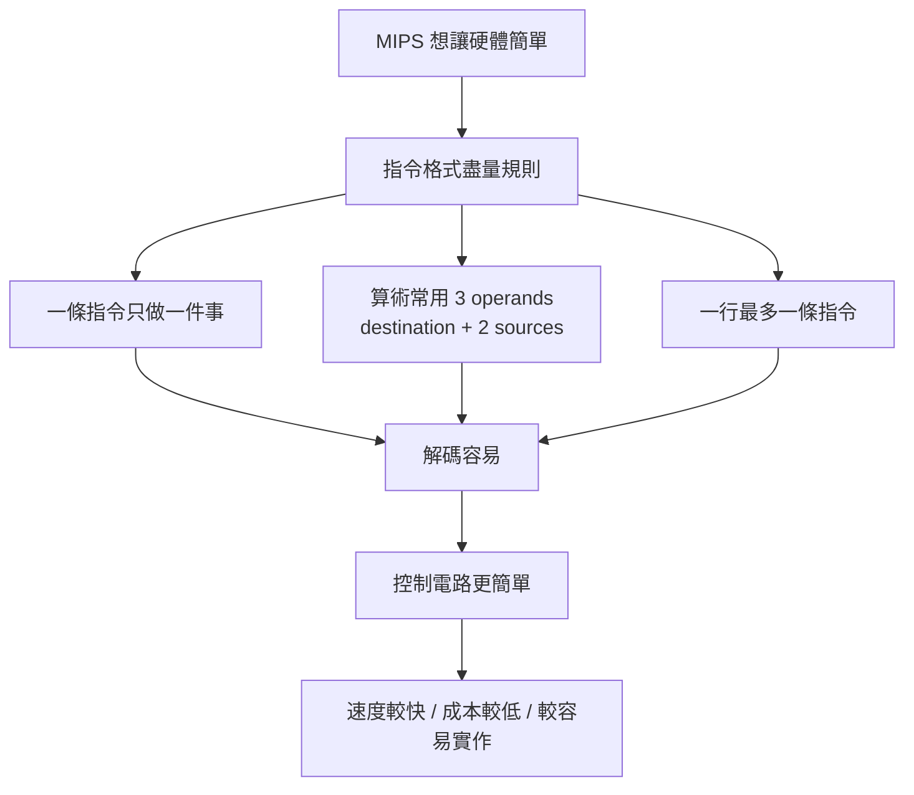

---

#### 生活化例子

假設你要叫一個完全不會變通的機器人做菜。

你有兩種命令方式：

##### 方式 A：很規則

* 切 蘋果 胡蘿蔔 放進碗A
* 加 鹽 胡椒 放進碗B
* 混合 碗A 碗B 放進盤子C

##### 方式 B：很自由

* 幫我把蘋果和胡蘿蔔切一切，順便拌一下，然後看情況放盤子裡

對人類來說，方式 B 比較自然。
但對硬體來說，方式 A 比較好，因為它每次都知道：

* 動作在哪裡
* 輸入有幾個
* 輸出放哪裡

MIPS 就偏向方式 A。

---

#### 為什麼會這樣

因為 CPU 真的很在意這些事情：

* **解碼(decoding) 要快**
* **控制電路(control logic) 要簡單**
* **硬體面積(area) 不要太大**
* **功耗(power) 不要太高**

如果每條指令格式都差很多，CPU 在讀指令時就要花更多邏輯判斷。
反過來，若指令夠規則，CPU 可以更快速決定：

* 這是什麼操作
* 哪些暫存器(registers) 要讀
* 結果寫回哪裡

這也是為什麼 MIPS 被拿來當教學 ISA：它的規則非常清楚。MIPS 文件指出典型三運算元格式是「2 個 source registers + 1 個 destination register」，而學術課程也常用它來說明固定長度指令與少量格式的優點。([training.mips.com][1])

---

#### 最容易考 / 最容易混淆

##### 容易混淆 1：是不是所有 MIPS 指令都一定三個變數？

**不是。**

這張投影片比較精確地說，應該理解成：

* **基本算術指令** 很常是三個 operands
* 但 **不是所有 MIPS 指令** 都這樣

例如：

```asm
addi $s1, $s2, 20
lw   $t0, 32($s3)
j    10000
```

這些就不是單純的「三個變數」格式。MIPS 也有 R-type、I-type、J-type 三種主要格式。 ([cs.cornell.edu][2])

所以如果考試寫成：

> 「所有 MIPS 指令都永遠使用三個變數」

這句話就太絕對，**應判成不精確甚至錯誤**。
比較正確的說法是：

> 「MIPS 的基本算術指令常採固定的三運算元格式。」

---

##### 容易混淆 2：`add a, b, c` 誰是結果？

是 **第一個**。

```text
a = b + c
```

不是 `c = a + b`，也不是 `b = a + c`。

---

##### 容易混淆 3：一行最多一條指令 是什麼意思？

意思是組合語言(Assembly Language，組合語言) 通常一行就對應一條 machine instruction(機器指令)。
這樣翻譯、閱讀、除錯都比較直接。

---

#### 你可以怎麼背

你可以把這頁濃縮成一句口訣：

> **MIPS 算術：一條只做一件事，兩個輸入，一個輸出，格式固定。**

或者再短一點：

> **規則固定，硬體輕鬆。**

---

#### 小結

這張投影片的重點不是只有 `add` 這條指令本身，而是它背後代表的設計哲學：

1. `add a, b, c` 表示 `a = b + c`
2. MIPS 喜歡讓算術指令格式固定、規則明確
3. 常見模式是 2 個來源 + 1 個目的地
4. 這樣能讓 CPU 的硬體設計更簡單
5. 這就是 **simplicity favors regularity**

---

#### 補一個你現在就該會的例子

若題目是：

```c
a = b + c;
d = a - e;
```

對應的 MIPS 基本寫法會是：

```asm
add a, b, c
sub d, a, e
```

因為 MIPS 傾向把複雜工作拆成多條簡單指令，而不是一條全包。這也是第 2.2 節下一頁的延伸例子。

---

#### 我直接幫你糾正一個常見誤解

這頁投影片如果你照字面背，很容易背成：

> 「MIPS 全部指令都只能三個變數」

這樣會出事。
**正確觀念是：這頁在講的是 MIPS 的算術指令風格與設計原則，不是整個 MIPS 所有指令的唯一格式。**

---

這頁對應教材檔案：

若你要，我下一則可以直接接著幫你講這一頁後面的 **11~13 頁**，也就是：

* 為什麼 `a=b+c+d+e` 不能一條做完
* C 程式怎麼一步步翻成 MIPS
* 為什麼組合語言行數通常比 C 多

[1]: https://training.mips.com/basic_mips/PDF/Instruction_Set.pdf?utm_source=chatgpt.com "1 This section covers the MIPS instruction set."
[2]: https://www.cs.cornell.edu/courses/cs3410/2012sp/lecture/12-risc-cisc-and-assemblers-i.pdf?utm_source=chatgpt.com "RISC, CISC, and Assemblers - Cornell: Computer Science"


## 暫存器


### 講解

已啟用教學模式

#### 這幾張圖在回答什麼問題

這一串投影片其實是在回答同一件事：

**CPU 為什麼這麼在意暫存器(Register)，以及當暫存器不夠、或放得不好時，會出什麼問題？**

整體脈絡是這樣：

```mermaid
flowchart TB
A[通用暫存器<br>很快、很少、很珍貴] --> B[暫存器規劃<br>先把資料放進哪個暫存器]
B --> C[暫存器配置<br>Compiler(編譯器)決定誰住哪]
C --> D[暫存器溢出<br>不夠放就搬去 Memory(記憶體)]
C --> E[暫存器庫/Register File Bank<br>把暫存器分組方便平行存取]
E --> F[暫存器衝突/Register Conflict<br>想同時用，但位置安排卡住]
F --> G[重新分配、copy、stack/memory 暫存]
```

這個鏈條正是你貼的幾頁內容：通用暫存器、暫存器規劃、暫存器術語、暫存器庫、暫存器衝突與解決。

---

#### 先講直覺：把暫存器想成「CPU 手邊的小抽屜」

生活化例子：

你在桌上算數學題時，不會每寫一步都跑去樓下倉庫拿紙。

你會把現在最常用的東西，先放在桌上。

在電腦裡：

* **Register(暫存器)** 像桌面小抽屜，超快，但很少
* **Memory(記憶體)** 像書櫃，容量大，但比較慢
* **Disk(磁碟)** 更像倉庫，更大但更慢

所以 CPU 會盡量把「現在馬上要算的值」放進 Register(暫存器)。這也是投影片先介紹通用暫存器的原因：它是高速、暫時、數量不多的儲存位置。

另外，MIPS 屬於典型的 **load-store architecture(載入/儲存架構)**，也就是算術運算大多在暫存器之間做，記憶體資料要先 `load` 進暫存器，算完再 `store` 回去；MIPS 也有 32 個 general-purpose registers(通用暫存器)。([維基百科][1])

---

#### 核心概念 1：通用暫存器是什麼

>其實就是前面章節講到的「一般用途暫存器」

投影片「通用暫存器」那頁重點是：

* 它很快
* 它是處理器的一部分
* 它是暫時儲存裝置
* 數量不大
* 用來裝目前運算要用的值 

正式一點說：

**General-purpose register(通用暫存器)** 是 CPU 內部可被一般指令直接讀寫的高速儲存位置。

為什麼重要？

因為在 MIPS 這種 **register-register(暫存器對暫存器)** 風格裡，像 `add` 這類算術指令，來源和目的地通常都是 register，不是直接在 memory 上算。 ([維基百科][1])

---

#### 核心概念 2：暫存器規劃(Register Planning)

投影片用一個最簡單的例子：

`Z = X + Y`

流程是：

1. 把 `X` 載入某個暫存器
2. 把 `Y` 載入另一個暫存器
3. 相加
4. 結果放到第三個暫存器
5. 再把結果寫回 `Z` 

這頁真正想講的是：

**CPU 不會直接對變數名字 X、Y、Z 運算。它實際上只認得「哪個 register 裡面有值」。**

所以「程式看起來是變數在運算」，但「硬體實際上是 register 在運算」。

生活化說法就是：

你嘴巴說「幫我算 X + Y」，
但助教真正做的是：

* 左手拿第 3 格抽屜的東西
* 右手拿第 6 格抽屜的東西
* 算完先放第 7 格抽屜

---

#### 核心概念 3：暫存器配置(Register Allocation) 與暫存器溢出(Register Spilling)

投影片「暫存器術語」那頁講了兩個非常常考的詞：

##### 1. Register Allocation(暫存器配置)

就是：

**決定哪個值要放到哪個 register。** 

通常這件事主要由 Compiler(編譯器) 做。

##### 2. Register Spilling(暫存器溢出/外溢)

當 register 不夠用時，只好把原本在 register 裡的某些值暫時搬去 memory，等之後需要再載回來。投影片就是這樣定義的。

GCC 的文件也說得很接近：當編譯器可用的 machine registers(硬體暫存器) 不夠時，會把某些值改放到 stack slot(堆疊空間) 或其他位置，這就是 spilling。([GCC][2])

生活化例子：

你桌上只有 3 個小抽屜，但現在要同時算 6 個中間結果。
那就只能把暫時用不到的結果，先拿去旁邊櫃子放一下。
這個「先搬出去」就是 spill。

---

#### 核心概念 4：暫存器庫(Register File / Register Bank)

你貼的「暫存器庫」和「暫存器庫圖」兩頁，重點不是說突然多了一套新暫存器概念，而是在講：

**暫存器可以再被硬體切成不同組，讓硬體同時從不同組拿資料。** 

圖上左邊是暫存器庫 A，右邊是暫存器庫 B。
圖的文字也明講：把 8 個暫存器分成兩個暫存器庫，處理器可以同時存取這兩個暫存器庫。

這在直覺上很好懂：

* 如果兩個加法輸入值分別放在 A、B 兩邊
* ALU(算術邏輯單元) 就能同時抓到兩個值
* 平行度更高，速度更好

---

#### 核心概念 5：暫存器衝突(Register Conflict) 到底是什麼

這裡最容易混淆，我們要特別拆開。

投影片說的重點是：

* 在 RISC 這類 register-register 設計中，運算元必須先放進暫存器
* 但你**無法保證每個指令的運算元都剛好來自不同暫存器庫**
* 如果變數很多、暫存器有限，就會出現暫存器衝突

##### 直覺版

你有兩個抽屜櫃 A、B，
老師規定做加法時要同時從 A 和 B 各拿一個值。

但你現在偏偏把 `X` 和 `Y` 都塞在 A 裡，
那這一拍就沒辦法很順地同時拿到兩個輸入。

這就卡住了。

##### 正式版

這裡投影片的「Register Conflict(暫存器衝突)」其實混合了兩個很接近的概念：

一個是 **register pressure(暫存器壓力)**
也就是活躍變數太多，register 數量不夠。

另一個比較像 **register bank conflict(暫存器庫衝突)**
也就是硬體想平行讀多個 operand(運算元)，但它們被放到不利的 bank(庫) 裡。這點從投影片一直強調「不同暫存器庫」可以看出來。

所以我幫你校正一下：

* ✅ **這份投影片的脈絡下**，這樣講「暫存器衝突」是可以理解的
* ❌ **但若放到更嚴格的 Computer Architecture(計算機結構) 術語**，它不完全等於我們常在 pipeline(管線) 裡講的 data hazard(資料冒險)

這是很容易考混的地方。

---

#### 為什麼例子 `R ← X + Y`、`S ← Z - X`、`T ← Y + Z` 會出事

投影片給的例子很重要。

表面上只看到 3 條式子，但硬體角度會想：

* `X`、`Y`、`Z` 現在各住哪裡？
* 這三條指令執行時，哪些值需要同時活著？
* 兩個來源 operand 能不能在同一拍被 ALU 順利讀出？

如果：

* 暫存器數量很少
* 或者 register bank 分配得不好
* 或者同時活躍的值太多

就可能發生：

* 有些值得先 spill 到記憶體
* 要多插幾條 move/load/store
* 執行變慢
* 安排錯還可能導致結果錯誤或程式不順 

---

#### 為什麼會這樣

根本原因只有一句：

**因為快的資源很少。**

Register 很快，但數量有限。
Memory 很大，但比較慢。

所以整個 Compiler + Hardware 的工作，就是在做一個折衷：

* 盡量多把常用值留在 register
* 但 register 不夠時要決定誰先出去
* 還要考慮硬體是不是有 bank 分組、哪些指令需要哪些暫存器格式

這也是為什麼教材前面一直強調 RISC 設計追求簡單、固定格式、register-to-register。 ([維基百科][1])

---

#### 解決方法：你貼的最後一張在說什麼

投影片列了 3 大方向：

##### 1. 編譯器或組譯器警告

系統先提醒你：「這裡 register 配置可能有風險。」

##### 2. 重新指定暫存器

把不同變數改放到不同 register。

##### 3. 插入 Move/Copy

先把某個值複製到另一個 register，避開卡住的位置。

##### 4. 用 Stack(堆疊) 或 Memory(記憶體) 暫存

減輕 register 壓力。這其實就是 spilling 的實務做法。 ([GCC][2])

---

#### 最容易考 / 最容易混淆

##### 容易混淆 1：暫存器溢出 ≠ 算術 overflow(溢位)

* **Register spilling(暫存器溢出/外溢)**：register 不夠，值搬去 memory
* **Arithmetic overflow(算術溢位)**：數值太大，位元表示不下

這兩個中文都常被翻成「溢出」，很容易混。

##### 容易混淆 2：暫存器衝突 ≠ pipeline data hazard

這份投影片的「衝突」重點比較偏向：

* register 不夠
* register bank 分配不佳
* operand 無法理想平行取出

不是在講 `add` 後面馬上 `sub` 讀到舊值那種經典 RAW hazard。

##### 容易混淆 3：暫存器庫 ≠ cache

Register file(暫存器庫/暫存器集合) 是 CPU 內部的 register 組織方式。
它不是 L1/L2 cache。

---

#### 小結

你這幾張圖可以濃縮成一句話：

**CPU 想快，就要盡量在 Register(暫存器) 裡算；但 Register 很少，所以必須做精細的配置。配置不好，就會發生暫存器壓力、暫存器庫衝突，於是只好重新分配、複製資料，或把資料暫時丟回 Stack/Memory。**

---

#### 我幫你再壓成超短版背誦口訣

你可以背這個：

> **暫存器很快但很少，先配置；不夠就 spill；有分庫時還要避衝突。**

---

#### 你現在最應該記住的 4 句

1. **Register(暫存器)** 是 CPU 裡最快、最少的暫存空間。
2. **Register Allocation(暫存器配置)** 是決定值要放哪個暫存器。
3. **Register Spilling(暫存器外溢)** 是暫存器不夠時，把值暫時搬去記憶體。 ([GCC][2])
4. **Register Conflict(這份投影片的用法)** 比較接近「暫存器壓力 + 暫存器庫分配衝突」，不是單純 pipeline hazard。

下一步我建議我們直接把這幾頁內容，改寫成「考試版筆記 + 例題版」，你會更好背。

[1]: https://en.wikipedia.org/wiki/MIPS_architecture?utm_source=chatgpt.com "MIPS architecture"
[2]: https://gcc.gnu.org/news/spill.html?utm_source=chatgpt.com "Localized Register Spilling - GNU Project"

## CISC and RISC summary


  

### 講解

已啟用教學模式

#### 這三頁在回答什麼問題

這三頁是在做一個收尾：

**前面介紹了 instruction set(指令集) 的各種概念後，最後把處理器大方向分成 CISC 與 RISC，並告訴你它們各自偏好的設計哲學。**

先講最重要結論：

* 第 41、42 頁是在做 **CISC vs RISC 對照整理**
* 第 43 頁是在給你 **非常簡化的分類口訣**
* 但第 43 頁那句「RISC 每個指令都只要 1 個時脈週期」要小心，**拿來入門可以，拿來當絕對定義就太粗了**。IBM 與 Arm 的官方說明都把 RISC 描述成「較精簡、較規則、利於 pipeline(管線) 與 register(暫存器) 使用」；但並不是說現代所有 RISC 指令都永遠固定 1 cycle。社群討論也常特別提醒這點。([IBM][1])

---

#### 先講直覺

你可以先把它想成兩種做事風格：

* **CISC(Complex Instruction Set Computer)**：一條指令想包比較多事情
* **RISC(Reduced Instruction Set Computer)**：把事情拆成比較簡單、比較規則的小步驟

生活化例子：

* CISC 像「一鍵完成」的多功能機器
* RISC 像「每一步都簡單明確」的流水線工作台

所以這不是單純在比誰高級，而是在比：

**複雜度是放在 instruction(指令) 本身，還是放在 compiler(編譯器) 與規則化設計上。** IBM 對 RISC 的歷史說明，就是把它描述成用簡化指令換取更快執行；Arm 也把 RISC 描述成小而優化的指令集合。([IBM][1])

---

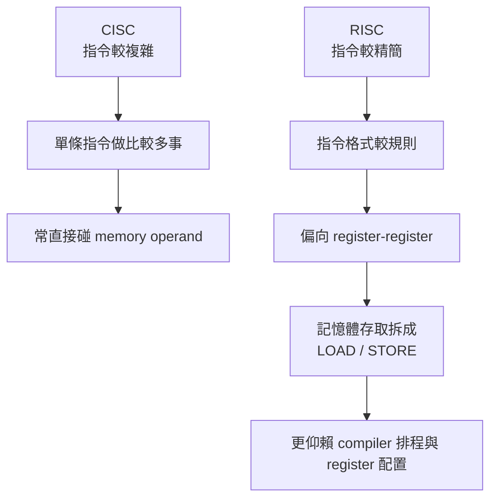

---

#### 第 41 頁：英文總表到底在說什麼

這張表的核心你可以這樣讀。

##### 1. Emphasis on hardware / Emphasis on software

這不是說：

* CISC 只有硬體
* RISC 只有軟體

真正意思是：

* **CISC** 歷史上常把較多複雜度放進硬體解碼、控制邏輯，甚至 microcode(微碼)
* **RISC** 則傾向把 ISA(Instruction Set Architecture，指令集架構) 設計得比較規則，讓 compiler 比較容易最佳化

所以這句最好改背成：

> **CISC 比較把複雜度做進硬體；RISC 比較把規則化設計交給編譯器去善用。**

這和 IBM、Arm 的官方描述一致。([IBM][1])

##### 2. Many transistors used for complex instructions / Spends more transistors on memory registers

這一列投影片原文其實寫得不夠好，尤其 `memory registers` 這個說法不太自然。

比較合理的理解是：

* **CISC**：硬體資源更多放在支援複雜 instruction 與解碼
* **RISC**：比較偏向規則執行結構、較多 registers、較簡單解碼與 pipeline

Arm 官方甚至直接提到：因為 RISC 缺少複雜解碼邏輯，所以能放進更多 **general-purpose registers(通用暫存器)**。所以這一列不是在說 RISC 一定「總電晶體數更多」，而是在說 **資源配置方向不同**。([Arm][2])

##### 3. Includes multi-clock complex operations / Single-clock, simple operations

這一列是很典型的教科書口訣，但要加註腳。

* **CISC**：常有較複雜、較重的指令
* **RISC**：傾向簡單、規則、易 pipeline 的指令

但你不能把它硬背成：

* CISC 一定多時脈
* RISC 一定每條都單時脈

因為真正需要幾個 cycles，還會受 microarchitecture(微架構)、pipeline stall、cache miss 等影響。社群常見的糾正就是：**不是所有 RISC 指令都花一樣時間**。([IBM][1])

##### 4. Memory-to-memory / Register-to-register

這一列是最值得記的。

* **CISC**：常允許 instruction 直接帶 memory operand(記憶體運算元)
* **RISC**：偏向先 `LOAD` 到 register，再在 register 間運算，最後必要時 `STORE` 回去

這就是你前面一直看到的 **load-store architecture(載入/儲存架構)**。RISC-V 官方文件就把 base ISA 分成 integer computational instructions、loads、stores、control-flow instructions，表示「運算」和「存取記憶體」是分開的。([RISC-V 文檔][3])

##### 5. Small code sizes / Variable length of instruction vs large code sizes / Fix length of instruction

這一列也是「大方向正確，但別背太死」。

* x86 類 CISC 的確常是 **variable-length instruction(可變長指令)**；Intel 官方 XED 文件明寫 x86 指令可為 **1 到 15 bytes**。([Intel][4])
* 經典 RISC 常強調 **fixed-length instruction(固定長度指令)**；RISC-V base ISA 官方也明寫是 **fixed-length 32-bit instructions**。([RISC-V 文檔][3])

但要注意：

* RISC-V 也支援 compressed extension(壓縮指令延伸)，會有 16-bit 指令
* 所以「RISC 永遠固定長度」不是無條件真理，只是在基礎教材層次上很好用的口訣。([RISC-V 文檔][3])

---

#### 第 42 頁：中文表格其實是在幫你更好背

這頁其實只是把第 41 頁改成比較適合考前複習的表。

你可以直接背成這一版：

| 項目    | CISC                 | RISC                |
| ----- | -------------------- | ------------------- |
| 設計哲學  | 複雜指令較多               | 簡單規則指令較多            |
| 週期傾向  | 常見較重、較長              | 常見較簡單、利於 pipeline   |
| 指令格式  | 常可變長                 | 基礎教材常記固定長           |
| 資料運算  | 常可直接碰 memory operand | 偏 register-register |
| 程式碼長度 | 常較短                  | 常較長                 |

這個版本比原投影片更安全，因為它保留了趨勢，但沒有講得太死。官方文件和社群經驗都支持這種「看成趨勢，不看成鐵律」的讀法。([IBM][1])

---

#### 第 43 頁：這頁是考試口訣，但你要知道哪裡被簡化了

第 43 頁大意是：

* 指令很多、複雜、通常較耗時 → CISC
* 指令較少、每個指令執行時間很短 → RISC

這樣教在入門時很好，因為它把重點抓出來了。IBM 歷史頁面也確實說，RISC 的出發點就是精簡 instruction set，讓執行更快、更容易做 pipeline。([IBM][1])

但你要知道它有兩個被簡化的地方：

##### 簡化 1：RISC 不是「只要少數指令」就夠了

RISC 真正重點不是單純「指令數量少」，而是：

* 指令**規則化**
* 功能**簡單化**
* 適合 **register-oriented(以暫存器為中心)** 的設計
* 記憶體操作與運算分開

所以如果考試問你「RISC 的核心精神是什麼」，不要只答「指令少」，要答得更完整。([IBM][1])

##### 簡化 2：RISC 不是所有指令都保證 1 個 clock

這句最容易誤會。

教科書常把 RISC 簡化成「single-clock simple operations」，是因為它想強調「簡單、規則、利 pipeline」。但實際上：

* 現代 RISC CPU 仍可能遇到 stall
* 某些指令本來就不會和最基本的整數加法同樣成本
* cache miss、branch、浮點、SIMD 等都會影響實際延遲

社群上這點是常見糾正：**RISC 不等於所有 instruction latency 完全一致**。([Computer Science Stack Exchange][5])

---

#### 為什麼你們課本這樣教，仍然是有價值的

因為在大一大二這種入門階段，老師先要你抓到的是：

* CISC：複雜指令、常直接碰 memory、指令編碼可較複雜
* RISC：簡單規則、重 register、load/store 分離、較利 pipeline

這個骨架先建立起來，你之後學：

* pipeline(管線)
* register allocation(暫存器配置)
* load/store
* fixed vs variable-length encoding(固定長與可變長編碼)

才不會散掉。IBM、Arm、RISC-V 官方文件都可以拿來支撐這個骨架。([IBM][1])

---

#### 最容易考 / 最容易混淆

##### 1. RISC 不等於「一定比較快」

真正效能還跟微架構、快取、分支預測、編譯器品質有關，不是光看 RISC/CISC 四個字就能下結論。社群也常提醒：現代 CPU 的界線其實比教科書模糊。([Computer Science Stack Exchange][5])

##### 2. CISC 不等於「可以完全 memory-to-memory 做所有事」

比較精確的說法是：**CISC 常支援 memory operand**，不是說所有複雜操作都可以任意「記憶體對記憶體」完成。這點教材會簡化。([Intel][4])

##### 3. RISC 不等於「永遠固定長度、永遠單時脈」

RISC-V base ISA 確實是固定 32-bit，但擴充後可以有 16-bit 指令；而且 single-cycle 也只是入門口訣。([RISC-V 文檔][3])

---

#### 小結

這三頁你可以濃縮成一句話：

> **CISC 傾向把更多功能塞進單條指令；RISC 傾向把操作拆成簡單、規則、以 register 為中心的步驟，並用 load/store 分離記憶體存取。**

而第 43 頁的定義，你考試可以先這樣寫，但心裡要知道它是**簡化版**，不是完整版。([IBM][1])

---

#### 考試版超短背法

**CISC：指令較複雜、常可直接用 memory operand、可變長、程式較短**
**RISC：指令較簡單規則、偏 register-register、load/store 分離、基礎教材常記固定長** ([Intel][4])

---

#### 你現在最該記住的 3 句

1. **CISC 與 RISC 比的是設計哲學，不只是比誰指令多誰指令少。** ([IBM][1])
2. **RISC 的核心是簡單規則、register-oriented、load/store 分離。** ([Arm][2])
3. **「RISC 每條都 1 個 clock」是教學簡化，不是嚴格定義。** ([Computer Science Stack Exchange][5])

下一張你貼上來，我們可以繼續照這個方式拆。

[1]: https://www.ibm.com/history/risc?utm_source=chatgpt.com "RISC | IBM"
[2]: https://www.arm.com/ja/glossary/risc?utm_source=chatgpt.com "What is RISC? – Arm®"
[3]: https://docs.riscv.org/reference/isa/v20240411/unpriv/intro.html?utm_source=chatgpt.com "Introduction :: RISC-V Ratified Specifications Library"
[4]: https://www.intel.com/content/www/us/en/developer/articles/tool/xed-x86-encoder-decoder-software-library.html?utm_source=chatgpt.com "Intel® X86 Encoder Decoder Software Library"
[5]: https://cs.stackexchange.com/questions/48515/cisc-and-risc-synchronous-and-asynchronous?utm_source=chatgpt.com "computer architecture - CISC and RISC - synchronous and asynchronous - Computer Science Stack Exchange"

### CISC 如何 memory to memory

已啟用教學模式

#### 這段在回答什麼問題

你問的是：

**CISC(複雜指令集) 所謂的 Memory-to-Memory(記憶體到記憶體) 到底是怎麼做的？**

---

#### 先直接回答

可以先記這一句：

> **CISC 的 Memory-to-Memory，不是說 CPU 完全不用暫存器，而是說 ISA(Instruction Set Architecture，指令集架構) 允許某些指令直接把記憶體當成運算或搬移的對象。**

也就是說，在 **RISC** 裡常常要：

1. 先 `LOAD` 從記憶體把資料載進 Register(暫存器)
2. 在 Register 裡運算
3. 再 `STORE` 回記憶體

但在 **CISC** 裡，有些指令可以把這幾步「包成一條或少數幾條」來做。Oracle 的 x86 手冊就列出 string instructions(字串指令)；例如 `MOVS` 會把 `DS:[(E)SI]` 的資料直接搬到 `ES:[(E)DI]`，`CMPS` 則直接比較兩個記憶體位置的內容。([Oracle Docs][1])

---

#### 先講直覺

把它想成兩種搬箱子方式。

##### RISC 的做法

像這樣：

* 先把 A 倉庫的箱子搬到你手上
* 再把 B 倉庫的箱子搬到你另一隻手
* 你手上處理完
* 再放回某個位置

也就是 **Memory → Register → 運算 → Register/Memory**

##### CISC 的做法

比較像：

* 指令直接說「把這邊記憶體的一段資料搬去那邊記憶體」
* 或「直接比較兩塊記憶體內容」

所以它在語意上比較接近：

**Memory ↔ Memory**

但這是 **ISA 層級的表達方式**，不代表硬體內部真的完全沒有經過暫存或內部資料通路。([Oracle Docs][1])

---

#### 核心概念

**Memory-to-Memory** 的重點是：

* 指令的 **source operand(來源運算元)** 可以在記憶體
* 指令的 **destination operand(目的運算元)** 也可以在記憶體
* 有時兩個都明寫
* 有時一個或兩個是 **implicit operand(隱含運算元)**

x86 的經典例子就是字串指令：

* `MOVS`：把一個記憶體位置的資料搬到另一個記憶體位置
* `CMPS`：直接比較兩個記憶體位置的資料
* 而且 `REP` 前綴可以讓這個動作重複很多次，做整段區塊處理。([Oracle Docs][1])

---

#### 具體怎麼做：以 x86 的 `MOVS` 為例

Oracle x86 手冊寫得很直接：

* `MOVS` 的操作是把 `DS:[(E)SI]` 搬到 `ES:[(E)DI]`
* 做完後，`SI` 和 `DI` 會自動遞增或遞減
* 如果前面加 `REP`，就可以重複搬很多個 byte/word/long。([Oracle Docs][1])

你可以把它理解成這個流程：

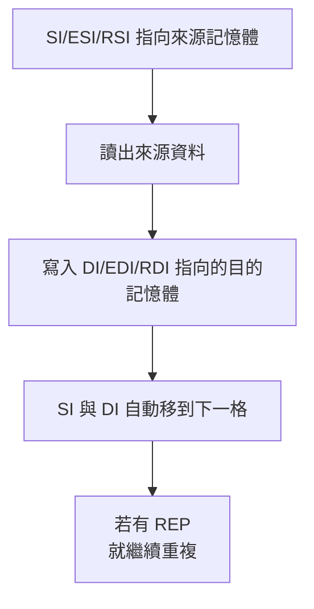

所以像：

```asm
rep movsb
```

意思很接近：

> 把來源記憶體的一串 byte，一個一個搬到目的記憶體。([Oracle Docs][1])

---

#### 再看一個例子：`CMPS`

`CMPS` 不是先把兩邊都載到通用暫存器再比較，而是直接比較：

* `DS:[(E)SI]`
* `ES:[(E)DI]`

這兩個記憶體位置的內容，然後更新 flags(旗標)。Oracle 手冊就是這樣描述的。([Oracle Docs][2])

也就是說，這條指令的語意本身就是：

**memory vs memory compare**

---

#### 但這裡有一個非常重要的修正

你投影片把 CISC 寫成 **Memory-to-Memory**，這在**教材簡化層級**可以接受；但如果你把它理解成：

> **CISC 的一般算術都可以隨便寫成 `Memory[A] = Memory[B] + Memory[C]`**

那就太粗了，這樣不精確。

以 **x86** 為例，社群整理指出：

* 一般 x86 指令通常 **最多只有一個 explicit memory operand(顯式記憶體運算元)**
* 真正有兩個 memory operands 的情況非常少
* 常見的例外多半是 **string instructions**，像 `movs`、`cmps`，而且至少有一個是 **implicit memory operand**。([Stack Overflow][3])

所以更精準地講應該是：

> **CISC 常支援直接對 memory operand 操作；某些指令甚至能呈現 memory-to-memory 的效果，但不是所有一般算術都能任意雙記憶體運算。** ([Stack Overflow][3])

---

#### 為什麼教材還是會寫成 Memory-to-Memory

因為老師在這一頁是在抓大方向，不是在講 x86 編碼細節。

它想對比的是：

* **RISC**：大多數運算先進 Register，再運算
* **CISC**：比較常允許 instruction 直接碰記憶體，甚至能有近似 memory-to-memory 的指令語意

所以這一頁真正想讓你記的是：

> **CISC 對記憶體操作比較直接；RISC 對記憶體操作比較嚴格，通常要走 load/store。**

這樣背就對了。

---

#### 生活化例子

假設你要把倉庫 A 的一排貨品搬到倉庫 B。

##### RISC 思路

像一個規定很嚴格的流程：

* 先從 A 拿一件到手上
* 手上處理
* 再放到 B
* 每一步都分開寫

##### CISC 思路

像直接下指令給搬運機：

* 「把 A 那一排搬到 B」
* 或「比較 A 那一排跟 B 那一排是不是一樣」

這就是為什麼 CISC 常讓人覺得「單條指令做比較多事」。

---

#### 最容易混淆

##### 1. Memory-to-Memory 不等於完全沒有暫存器

不是。
這是在講 **ISA 表面上允許的操作形式**，不是說 CPU 內部資料路徑完全不碰任何暫存結構。

##### 2. CISC 不等於所有指令都能雙記憶體算術

這個很重要。
**x86 的一般整數指令大多不是任意雙記憶體運算**；真正雙記憶體情況很少，常見是字串指令或帶 implicit memory 的特例。([Stack Overflow][3])

##### 3. RISC 也不是完全不能碰記憶體

RISC 當然可以碰記憶體，只是通常要用獨立的 `LOAD/STORE` 指令，不把一般算術和記憶體存取混成同一種風格。

---

#### 小結

你可以把答案濃縮成這一句：

> **CISC 的 Memory-to-Memory，意思是某些指令可以直接以記憶體作來源與目的地來搬移、比較，甚至部分操作；典型例子是 x86 的 `MOVS`、`CMPS`。但在 x86 裡，這種真正雙記憶體形式並不普遍，所以教材這句話是概括化、簡化過的說法。** ([Oracle Docs][1])

---

#### 考試版一句話

**CISC 的 Memory-to-Memory 是指指令可直接操作記憶體中的資料，不一定要先全部載入暫存器；但這是概括說法，實際如 x86 真正雙記憶體指令並不多。** ([Oracle Docs][1])

你如果要，我下一則可以直接幫你畫出
**RISC 的 `LOAD-ADD-STORE`**
對比
**CISC 的 `MOVS/CMPS`**
的指令流程圖。

[1]: https://docs.oracle.com/cd/E19620-01/805-4693/6j4emccqo/index.html "docs.oracle.com"
[2]: https://docs.oracle.com/cd/E19620-01/805-4693/instructionset-59/index.html "docs.oracle.com"
[3]: https://stackoverflow.com/questions/52573554/what-x86-instructions-take-two-or-more-memory-operands "assembly - What x86 instructions take two (or more) memory operands? - Stack Overflow"

### 所以 CISC 比較沒有暫存器衝突的問題嗎


已啟用教學模式

#### 直接回答

❌ **不能直接說「CISC 比較沒有暫存器衝突」**。
✅ **比較精準的說法是：CISC 在某些情況下可以減輕「表面上的 register pressure(暫存器壓力)」，但不會消除暫存器衝突或暫存器配置問題。** RISC-V 的 base ISA 明確是 **load-store architecture(載入/儲存架構)**，只有 load/store 會碰記憶體，算術指令只在 registers 上運作；相對地，x86 類 CISC 的一般指令常允許其中一個運算元來自記憶體。([RISC-V 文檔][1])

---

#### 先講直覺

把它想成：

* **RISC**：做菜前，材料都要先拿到桌上
* **CISC**：有些步驟可以直接去櫃子拿一樣材料來用，不用全部先搬到桌上

所以在你這份投影片那種簡化模型裡，**CISC 確實比較不容易立刻出現「每個 operand(運算元) 都得先卡住一個 register」的壓力**。

例如同樣做 `Z = X + Y`：

RISC 風格常像這樣：

```asm
lw   t0, X
lw   t1, Y
add  t2, t0, t1
sw   t2, Z
```

x86 這類 CISC 常可以寫成：

```asm
mov  eax, [X]
add  eax, [Y]
mov  [Z], eax
```

這裡的差別是：RISC 的 `add` 只吃 register；x86 的 `ADD` 可以有一個 memory operand。這會讓「同時需要多少顯性暫存器」變少一些。([RISC-V 文檔][1])

---

#### 但為什麼答案還是不是「比較沒有」？

因為你要分成兩層看。

##### 1. 以投影片那種入門定義來看

如果「暫存器衝突」是指：

> 運算前，很多資料都必須先塞進 register，導致 register 不夠

那麼 **CISC 常常會比 RISC 輕一點**，因為它有些指令可以直接讀 memory operand，不必所有來源都先進 register。RISC-V 官方規格就明寫算術只在 CPU registers 上做；x86 的 `ADD` 也允許其中一個 operand 是 memory。([RISC-V 文檔][1])

##### 2. 以比較正式的 compiler / architecture 觀點來看

**CISC 一樣會有很明顯的 register pressure(暫存器壓力)**，而且有時候還不小。GCC 內部文件直接把 **i386** 這類機器稱為 **generally register-starved(暫存器偏吃緊)**；GCC 也特別提到 AMD x86-64 的一些 legacy x86 integer instructions(舊式 x86 整數指令) 會要求特定 registers。這代表編譯器在 x86/CISC 上，照樣要做 register allocation(暫存器配置)、spilling(外溢到 stack)、以及避開特定 register 限制。([GCC][2])

---

#### 這裡最容易誤會的一點

很多人一看到教材寫：

**CISC = memory-to-memory**

就會以為：

> 那 CISC 幾乎都不用 register 了

這是不對的。

x86 雖然有一些真正呈現 **memory-to-memory 效果** 的字串指令，像 `MOVS` 會把 `DS:[SI/ESI]` 複製到 `ES:[DI/EDI]`，`CMPS` 會直接比較兩個記憶體位置；但這類例子多半是**特殊或隱含 operand 的指令**。社群整理也指出，x86 沒有「兩個任意 explicit memory operands(顯式記憶體運算元)」的一般指令形式，常見的 memory-to-memory 例子通常至少有一個是 implicit operand(隱含運算元)。

所以更精準地說：

> **CISC 不是不用 register，而是比較常允許「register + memory」混合運算，或提供少數特殊的 memory-to-memory 指令。**

---

#### 生活化例子

假設你桌上只有 2 個空位。

##### RISC

老師規定：

* 兩個材料都要先放桌上
* 才能開始算

那你很容易桌面不夠用。

##### CISC

老師允許：

* 一個材料放桌上
* 另一個材料可以邊從櫃子拿邊用

那桌面壓力就比較小。

但是：

* 你還是需要桌面
* 有些工具還是只能放特定位置
* 有些步驟還是得先把東西搬到桌上

所以 **CISC 是「壓力可能較小」，不是「沒有壓力」**。

---

#### 最容易考 / 最容易混淆

##### 1. 「CISC 比較少 register conflict」只能算半對

如果老師是在講 **所有 operand 都要先進 register** 這種入門模型，那可以說 **相對較不容易**。
但如果你是在講 **compiler 的 register allocation 問題**，那 x86/CISC 一樣很常遇到，而且 GCC 還直接把 i386 視為 register-starved。([GCC][2])

##### 2. memory-to-memory 不等於一般算術都能直接雙記憶體

x86 的一般 `ADD` 明確說 **two memory operands cannot be used in one instruction**。也就是說，你不能把它想成 `[Z] = [X] + [Y]` 這種任意雙記憶體加法隨便都能寫。([felixcloutier.com][3])

##### 3. CISC 的壓力有時只是被「轉移」

它可能把一部分壓力從「顯性 GPR 數量」轉成：

* 特定 register 限制
* instruction encoding(指令編碼) 限制
* compiler spill/reload 成本
  這些在 GCC 的內部說明都看得到。([GCC][4])

---

#### 小結

你可以把正確答案背成這一句：

> **CISC 不是比較沒有暫存器衝突，而是因為它常能直接使用 memory operand，所以在教材那種「所有資料都得先進 register」的模型下，暫存器壓力通常比純 register-register 的 RISC 輕一些；但在真正的編譯器與硬體實作中，CISC 一樣有 register allocation、spilling、特定寄存器限制等問題。** ([RISC-V 文檔][1])

#### 一句超短版

**CISC 不是沒衝突，而是比較常「少用一點顯性暫存器」，但衝突仍然存在。**

下一步我們可以直接把
**RISC 的 `load-load-add-store`**
和
**x86/CISC 的 `mov-add-mov`**
逐行對照，你會更清楚。

[1]: https://docs.riscv.org/reference/isa/unpriv/rv32.html?utm_source=chatgpt.com "Untitled :: RISC-V Ratified Specifications Library"
[2]: https://gcc.gnu.org/onlinedocs/gccint/Register-Classes.html?utm_source=chatgpt.com "Register Classes (GNU Compiler Collection (GCC) Internals)"
[3]: https://www.felixcloutier.com/x86/add?utm_source=chatgpt.com "ADD — Add"
[4]: https://gcc.gnu.org/news/spill.html?utm_source=chatgpt.com "Localized Register Spilling - GNU Project"


## 2.3 計算機硬體的運算元

      

### 講解

已啟用教學模式

#### 這幾頁在回答什麼問題

這一段其實在回答同一個核心問題：

**MIPS(RISC) 為什麼這麼在意 Register(暫存器)，以及資料如果不在 Register 裡，要怎麼搬進來算。**

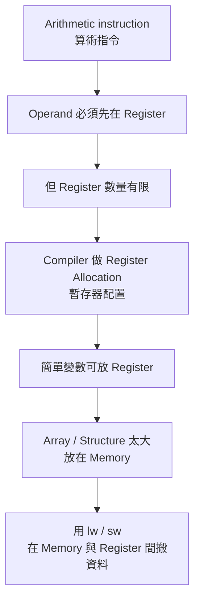

MIPS32 的一般事實是：有 32 個 general-purpose registers(通用暫存器)，算術運算在整個 register 上進行，而且 load/store 的位移量是用 **bytes(位元組)** 表示。([MIPS Training][1])

---

#### 先講直覺

你可以把：

* **ALU(算術邏輯單元)** 想成「工作台」 (Arithmetic Logic Unit(算術邏輯單元))
* **Register(暫存器)** 想成「工作台旁邊的小抽屜」
* **Memory(記憶體)** 想成「外面的倉庫」

MIPS 的規則是：

> **要在工作台上算，材料要先放進旁邊的小抽屜。**

也就是說，MIPS 的算術指令不是直接對記憶體做一般運算，而是先把資料放進 register，再做加減等運算；這正是典型的 load/store 風格。([MIPS Training][1])

---

#### 第 44 頁：為什麼投影片一直強調「運算元必須來自暫存器」

這頁的重點是：

1. 算術指令的 operand(運算元) 受限制
2. 這些 operand 必須來自硬體內建、數量有限的 register
3. 在 MIPS32 裡，register 大小是 **32 bits**
4. 這個 32-bit 的自然資料單位叫做 **word(字組/字)**

更正式地說，Patterson/Hennessy 直接指出：MIPS 算術指令的運算元必須從 **32 個 32-bit registers** 中取出，而且在 MIPS 中，register 的大小是 32 bits，因此 **word** 這個自然單位也對應到 32 bits。MIPS 官方訓練教材也寫明：MIPS32 有 32 個 GPRs，算術指令在整個 register 上操作。([studylib.net][2])

所以你可以把這頁濃縮成一句話：

> **MIPS 要算東西，先看 register，不先看 memory。**

---

#### 第 45 頁：為什麼偏偏是 32 個暫存器

這頁不是在說「技術上只能做 32 個」，而是在說：

**設計上常選 32，是一個速度與編碼格式的折衷。**

Patterson/Hennessy 提到兩個關鍵理由：

* **Smaller is faster(愈小愈快)**：register 太多，內部訊號要跑更遠，可能拉長 clock cycle time(時脈週期時間)
* register 數量變多，也會吃掉 instruction format(指令格式) 更多 bit，讓編碼更難設計

也就是說，不是「32 神奇」，而是「太多不划算」。([studylib.net][2])

---

#### 這頁還有一個很值得你順手修正的地方

投影片把：

* `$s0, $s1, ...` 說成對應 C/Java 變數
* `$t0, $t1, ...` 說成編譯需要的暫時暫存器

**入門這樣記可以。**

但更正式的 ABI(Application Binary Interface) / calling convention(呼叫慣例) 說法是：

* `$t0-$t9` 是 **temporary registers(暫時暫存器)**，函式呼叫後不保證保留
* `$s0-$s8` 是 **saved registers(保存暫存器)**，被呼叫函式若要用，必須先保存再恢復

所以投影片是「教學簡化版」，不是最完整的定義。([MIPS Training][3])

---

#### 第 46–47 頁：Compiler(編譯器) 怎麼把 C 式子翻成 MIPS

題目是：

```c
f = (g + h) - (i + j);
```

投影片把變數先配置到：

* `f -> $s0`
* `g -> $s1`
* `h -> $s2`
* `i -> $s3`
* `j -> $s4`

然後編成：

```asm
add $t0, $s1, $s2
add $t1, $s3, $s4
sub $s0, $t0, $t1
```

直覺上就是：

1. 先算 `g+h`，先放進暫時抽屜 `$t0`
2. 再算 `i+j`，先放進暫時抽屜 `$t1`
3. 最後做 `$t0 - $t1`，放回 `f` 對應的 `$s0`

Patterson/Hennessy 也明確說：把程式變數關聯到 registers 是 compiler 的工作，並用同一個 `f=(g+h)-(i+j)` 例子說明。([studylib.net][2])

---

#### 這裡最重要的理解不是背指令，而是背流程

你要抓到的是：

**高階語言的變數名稱，最後都會被編譯器映射成某些 register 名稱。**

所以 CPU 並不是在理解 `f、g、h` 這些字母。
CPU 真正在處理的是：

* 哪個值現在在 `$s1`
* 哪個中間結果要暫放在 `$t0`
* 最後結果要寫回哪個 register

---

#### 第 48 頁：為什麼還需要 Memory(記憶體)

因為程式不只有簡單變數，還有：

* array(陣列)
* structure(結構)

這些資料結構通常比 register 數量大得多，不可能整坨都塞進 32 個 registers。

所以大原則就是：

* **常算的、眼前要用的** → 放 register
* **大量資料、結構化資料** → 放 memory

Patterson/Hennessy 直接說：複雜資料結構比 register 數目多得多，因此它們保存在 memory；MIPS 因為算術只在 registers 上做，所以一定需要在 memory 和 registers 之間搬資料的 **data transfer instructions(資料轉移指令)**。([studylib.net][2])

---

#### 第 49 頁：這張圖很容易讓人誤會，我們要特別校正

圖上寫：

* 第三個資料元素位址為 2
* `Memory[2] = 10`

這張圖**是概念示意圖**，不是嚴格的真實 MIPS byte addressing(位元組定址) 圖。

Patterson/Hennessy 其實在同一段文字裡就提醒了：

* 若把 memory 想成一個大陣列，第三個元素位址可以示意成 2
* **但如果元素是 word，這在真正的 MIPS 是不對的**
* 因為 MIPS 使用 **byte addressing**
* 一個 word 是 4 bytes，所以連續 word 的位址會差 4，而不是差 1

也就是說：

* 概念圖的第三個元素可寫成 `Memory[2]`
* 但真正 MIPS 若是第三個 **word**，位址應該是 **8**，不是 2

這點你一定要分清楚，因為它正好就是很多人會搞混的地方。([studylib.net][2])

---

#### 第 50 頁：`lw $t0, 32($s3)` 到底是什麼意思

這一頁超重要，而且剛好對應你之前問過的問題。

`lw $t0, 32($s3)` 的意思不是：

* `$s3[32]`
* 第 32 個元素

而是：

> **從位址 = `內容($s3) + 32` 的記憶體位置，載入一個 word 到 `$t0`**

MIPS 官方教材寫得很清楚：

* load/store 的 addressing mode(定址模式) 是 **base register + signed immediate offset**
* **offset 值的單位是 bytes**
* `lw` 會把一個 word 從 word-aligned address 載入 destination register。([MIPS Training][1])

所以如果：

* `$s3` 存的是陣列 `A` 的 base address(基底位址)
* `A` 的元素型別是 `int` / word
* 每個元素 4 bytes

那麼：

* `32($s3)` = 基底位址往後 **32 bytes**
* `32 / 4 = 8`

所以它剛好對應：

```c
A[8]
```

這就是為什麼教材後面會把 `lw $t0, 32($s3)` 解釋成抓 `A[8]`。([MIPS Training][1])

---

#### 用生活化例子再講一次 `lw`

假設：

* `$s3` 是書櫃起點
* 每本書厚度固定 4 公分
* 你要拿第 8 本書

那你不會說「往後第 8 個 byte」，你會說：

* 從起點往後 `8 × 4 = 32` bytes

所以：

```asm
lw $t0, 32($s3)
```

直覺上就是：

> **從陣列基底往後 32 bytes 的地方，把那個 word 載入 `$t0`。**

---

#### 這幾頁其實把前面所有內容串起來了

你前面問過：

* 通用暫存器是什麼
* RISC 為什麼比較在意 register
* CISC 與 RISC 的差別
* CISC 跟 register conflict 的關係

現在這幾頁就是把答案收斂成一條主線：

1. **MIPS 的算術運算主要在 register 上做**
2. **register 數量有限，所以 compiler 要精打細算**
3. **大量資料放 memory，不夠時就要用 `lw/sw` 搬來搬去**
4. **因此在 RISC/MIPS 裡，register allocation(暫存器配置) 特別重要**

這也是為什麼我們前面一直說：
RISC 不是「比較討厭記憶體」，而是 **把 memory access 和 arithmetic 分開管理**。([studylib.net][2])

---

#### 最容易考 / 最容易混淆

1. **word 在這裡是 32 bits，不是 16 bits。** 在 MIPS32，register 與 word 都是 32 bits。([studylib.net][2])

2. **`lw $t0, 32($s3)` 的 32 是 byte offset，不是陣列索引。** 所以若元素是 word，`32($s3)` 對應 `A[8]`。([MIPS Training][1])

3. **第 49 頁的 `Memory[2]` 是示意圖，不是嚴格 MIPS word address。** 真正 MIPS 是 byte-addressed。([studylib.net][2])

4. **`$s` 與 `$t` 不只是「變數用 / 暫時用」而已。** 更正式地是 saved vs temporary 的 calling convention 分工。([MIPS Training][3])

---

#### 小結

把這 7 頁壓成一句話就是：

> **MIPS 的算術要先在 Register 裡做；因為 Register 只有 32 個而且每個是 32-bit，所以 Compiler 必須做配置；當資料在 Memory 裡時，就用 `lw/sw` 透過 base+offset 的方式搬進來再算。** ([studylib.net][2])

#### 超短背法

* **算術先進 Register**
* **Register 只有 32 個**
* **Array 太大放 Memory**
* **`lw/sw` 負責搬資料**
* **`32($s3)` 是 byte offset，不是索引**

下一步我們最適合直接接著講 `lw/sw + array` 的例題，因為這正好會把 `32($s3)`、`A[8]`、byte addressing 一次全部打通。

[1]: https://training.mips.com/basic_mips/PDF/Instruction_Set.pdf "Microsoft PowerPoint - 020 Instruction Set overview preR6.pptx"
[2]: https://studylib.net/doc/27618414/david-a.-patterson--john-l.-hennessy---computer-organizat... "Computer Organization and Design: Hardware/Software Interface"
[3]: https://training.mips.com/basic_mips/PDF/Assemble_Language.pdf "Microsoft PowerPoint - 021 Assemble Language.pptx"

## 硬體 ∕ 軟體介面

      

### 講解

已啟用教學模式

#### 這幾頁在回答什麼問題

這一段其實是在把前面的觀念收束成一條完整流程：

> **高階語言的變數和陣列，最後怎麼被放到 Register(暫存器) 與 Memory(記憶體)；而 MIPS 又怎麼用 `lw` / `sw` 去搬資料。**

```mermaid
flowchart TB
A[C / Java 變數與陣列] --> B[Compiler(編譯器) 分配位置]
B --> C[簡單且常用的值<br>放 Register]
B --> D[Array / Structure<br>放 Memory]
D --> E[MIPS 用 byte addressing<br>以位元組定址]
E --> F[word = 4 bytes<br>位址需 4-byte 對齊]
F --> G[lw / sw 用 base + offset]
G --> H[先 load 進 Register]
H --> I[ALU 運算]
I --> J[需要時再 store 回 Memory]
```

MIPS32 的一般規則是：有 32 個 general-purpose registers(通用暫存器)；word 是 32 bits；記憶體採 byte addressing(位元組定址)；word access 要對齊到 4-byte 邊界；`lw/sw` 的 offset 單位是 byte，不是陣列索引。([MIPS Training][1])

---

#### 先講直覺

你可以把整件事想成：

* **Register**：桌上小抽屜，快，但很少
* **Memory**：外面大倉庫，慢，但很大
* **Compiler**：幫你決定哪些東西放抽屜，哪些放倉庫
* **`lw/sw`**：搬運工
* **ALU**：工作台

所以這幾頁不是各講各的，而是在講：

> **MIPS 不能直接隨便在 memory 上做一般算術，所以資料要先搬到 register，算完再決定要不要搬回 memory。** ([MIPS Training][1])

---

#### 第 51 頁：硬體 / 軟體介面在講什麼

這頁有三個關鍵。

##### 1. 編譯器不只分配暫存器，也要分配記憶體位置

投影片第一點是在說：

* 一般變數可能被配置到 register
* 陣列、結構這種大資料通常配置到 memory

這很合理，因為 register 數量很少，但 array / structure 可能非常大。MIPS 的 load/store 設計就是建立在這件事上。([MIPS Training][1])

##### 2. MIPS 是 byte addressing(位元組定址)

這句非常重要。

**byte addressing** 的意思是：
記憶體的地址是以 **1 byte** 為最小編號單位，不是以 1 word 為單位。

所以位址是：

* 0
* 1
* 2
* 3
* 4
* 5
* ...

不是：

* 第 0 個 word
* 第 1 個 word
* 第 2 個 word

MIPS 官方資料明確說明 word、halfword、doubleword 都是用 **byte addressing** 來存取。([MIPS Training][1])

##### 3. word 要從 4 的倍數位址開始

因為：

* 1 word = 4 bytes
* 所以 word access 必須對齊到 4-byte boundary

也就是合法 word 位址通常是：

* 0
* 4
* 8
* 12
* 16
* ...

這叫 **alignment restriction(對齊限制)**。MIPS 官方文件明講：word access 必須落在可被 4 整除的 byte boundary。([MIPS Training][1])

---

#### 第 52 頁：這張圖在修正你前面那張示意圖

這頁圖的重點是：

* 真正的 MIPS 記憶體位址不是 `0,1,2,3` 代表第幾個 word
* 而是 `0,4,8,12` 這樣跳

所以「第三個 word」的起始位址是 **8**，不是 2。

因為：

* 第 1 個 word 起始於 0
* 第 2 個 word 起始於 4
* 第 3 個 word 起始於 8

這正是 byte addressing + word 對齊的直接結果。([studylib.net][2])

---

#### 第 53 頁：MSB / LSB 在講什麼

這頁是在講 **bit significance(位元的重要性)**，不是在講記憶體位址。

以 16-bit 數字來看：

* 最左邊是 bit 15
* 最右邊是 bit 0
* bit 15 是 **MSB(Most Significant Bit，最高有效位元)**
* bit 0 是 **LSB(Least Significant Bit，最低有效位元)**

MIPS 官方文件也明講：**bit 0 永遠是 least-significant bit**。([studylib.net][2])

##### 這裡最容易混淆

很多人會把：

* **MSB/LSB**
* **big-endian / little-endian**

混在一起。

這兩件事其實不同：

* **MSB / LSB**：在講「一個數字內部，哪個 bit 權重大」
* **Endianness(端序)**：在講「多個 bytes 放進記憶體時，哪個 byte 先放低位址」

所以：

> **bit 15 是 MSB、bit 0 是 LSB，這件事本身不因 big-endian 或 little-endian 改變。** ([studylib.net][2])

---

#### 第 54 頁：big-endian / little-endian 在講什麼

這頁在講的是：

* 一個 32-bit word 有 4 個 bytes
* 這 4 個 bytes 放進記憶體時，有兩種主要順序：

  * **big-endian**：最高有效 byte 放在最低位址
  * **little-endian**：最低有效 byte 放在最低位址

這是端序的標準定義。([Intel][3])

##### 這頁有一個你一定要修正的地方

投影片寫：

> **MIPS 屬於 big-endian 陣營**

這句 **不夠精確，甚至可以說在一般化表述下是錯的**。

更正確的說法是：

> **MIPS 可以配置成 big-endian，也可以配置成 little-endian。**

MIPS 官方文件明確寫到：bytes within larger CPU data formats **can be configured in either big-endian or little-endian order**。MIPS 訓練教材也直接寫：**MIPS cores can be set to run in big-endian or little-endian**。([studylib.net][2])

所以這頁你要這樣理解：

* 教材可能**用 big-endian 當示意**
* 但 **MIPS 不是只能 big-endian**

這個修正很重要。


| 位置 | 1000 | 1001 | 1002 | 1003 |
| ---- | ---: | ---: | ---: | ---: |
| Big-endian(大端序) |   12 |   34 |   56 |   78 |
| Little-endian(小端序) |   78 |   56 |   34 |   12 |


---

#### 第 55 頁：`g = h + A[8];` 怎麼翻成 MIPS

投影片給的條件是：

* `g` 在 `$s1`
* `h` 在 `$s2`
* 陣列 `A` 的 base address(基底位址) 在 `$s3`

然後它寫：

```asm
lw  $t0, 32($s3)
add $s1, $s2, $t0
```

##### 先講直覺

這兩行在做：

1. 先把 `A[8]` 從 memory 搬進 `$t0`
2. 再把 `h` 和 `$t0` 相加，放進 `g`

##### 為什麼是 `32($s3)` 不是 `8($s3)`？

因為：

* `A` 是 word array
* 1 個 word = 4 bytes
* `A[8]` 的位址 = base + `8 × 4` = base + 32

所以：

```asm id="h4t1x9"
lw $t0, 32($s3)
```

意思就是：

> 從位址 `內容($s3) + 32` 載入一個 word 到 `$t0`

MIPS 官方教材明講：load/store 的 addressing mode 是 **register + signed immediate offset**，而且 **offset values are in bytes**。([MIPS Training][1])

---

#### 第 56 頁：`sw` 是什麼

這頁是在講和 `lw` 相反的東西。

* `lw` = **load word(載入字組)**
* `sw` = **store word(儲存字組)**

意思是把 register 裡的 32-bit 內容寫回 memory。MIPS 官方教材明確寫：store word 會把 source register 的內容存到 word-aligned address。([MIPS Training][1])

例如：

```asm id="r9ppzm"
sw $t0, 48($s3)
```

表示：

> 把 `$t0` 的內容，存到位址 `內容($s3) + 48` 的那個 word 位置。

---

#### 第 57 頁：`A[12] = h + A[8];` 怎麼翻

投影片答案是：

```asm id="4qy2cw"
lw  $t0, 32($s3)
add $t0, $s2, $t0
sw  $t0, 48($s3)
```

這三行超值得你背，因為它把 **load → compute → store** 完整串起來了。

##### 第一步

```asm id="3ix0ch"
lw $t0, 32($s3)
```

把 `A[8]` 載入 `$t0`

##### 第二步

```asm id="hizbjj"
add $t0, $s2, $t0
```

算 `h + A[8]`

##### 第三步

```asm id="y0iugl"
sw $t0, 48($s3)
```

把結果存回 `A[12]`

##### 為什麼是 48？

因為：

* `A[12]`
* 每個元素 4 bytes
* `12 × 4 = 48`

所以 `48($s3)` 對應的就是 `A[12]`。這完全符合 MIPS 的 base+offset 位址公式。([MIPS Training][1])

---

#### 你現在應該建立的真正公式

如果 `A` 是 word array，base address 在 `$s3`，那麼：

```text
A[i] 的位址 = $s3 + 4*i
```

所以：

* `A[8]` → `32($s3)`
* `A[12]` → `48($s3)`

這就是這幾頁所有例題背後的共同骨架。MIPS 的 word 對齊與 byte offset 規則正是這個公式的基礎。([MIPS Training][1])

---

#### 這幾頁最容易考 / 最容易混淆

##### 1. `32($s3)` 不是第 32 個元素

❌ 不是。
✅ 它是 **base + 32 bytes**。如果元素是 word，才剛好對應 `A[8]`。([MIPS Training][1])

##### 2. Endianness 不是 bit 左右顛倒

❌ 不是 bit 順序變了。
✅ 是 **byte 在記憶體中的排列順序** 變了。bit 0 還是 least-significant bit。([studylib.net][2])

##### 3. 「MIPS 屬於 big-endian」不能死背

❌ 不能當絕對真理。
✅ 更精確是：**MIPS 可為 big-endian 或 little-endian。** ([studylib.net][2])

##### 4. word 的位址不是 0、1、2、3…

如果你在講 **真實 MIPS byte address**，word 的起始位址是 0、4、8、12…，不是把每個 word 自己再編成 0、1、2、3。([studylib.net][2])

##### 5. `$s` 和 `$t` 不只是名字好看

更正式地說：

* `$t0-$t9` 是 **temporary registers**
* `$s0-$s8` 是 **saved registers**

這是 MIPS 慣例，不只是教材隨便命名。([MIPS Training][4])

---

#### 小結

這 7 頁你可以濃縮成一句話：

> **MIPS 用 byte addressing 管理 memory，word 是 4 bytes 且要 4-byte 對齊；陣列元素通常在 memory 中，編譯器再用 `lw/sw` 搭配 base+offset，把資料搬進 register 做運算，再視需要存回去。** ([MIPS Training][1])

---

#### 超短背法

* **記憶體用 byte 定址**
* **word = 4 bytes**
* **word 位址要是 4 的倍數**
* **`lw/sw` 的 offset 是 byte**
* **`A[i]` 位址 = base + 4*i**
* **MIPS 不是只支援 big-endian**

---

#### 你這段最該死記的兩條

```asm id="mw50rn"
lw $t0, 32($s3)   # A[8]
sw $t0, 48($s3)   # A[12]
```

因為只要你記住：

* `8 × 4 = 32`
* `12 × 4 = 48`

後面陣列題就會順很多。

下一步最適合做的是，我直接帶你手算 3 題：
`A[3]`、`A[i]`、`A[i+1]` 要怎麼翻成 MIPS。

[1]: https://training.mips.com/basic_mips/PDF/Instruction_Set.pdf "Microsoft PowerPoint - 020 Instruction Set overview preR6.pptx"
[2]: https://studylib.net/doc/26277216/mips-architecture-for-programmers-volume-i-a-introduction...?utm_source=chatgpt.com "MIPS32 Architecture: A Programmer's Introduction"
[3]: https://www.intel.com/content/www/us/en/docs/programmable/683689/current/endianness.html?utm_source=chatgpt.com "3.4.1. Endianness"
[4]: https://training.mips.com/basic_mips/PDF/Assemble_Language.pdf?utm_source=chatgpt.com "Welcome to the MIPS Assemble language section of the MIPS Software Training"


### 實際上這一格是4byte(32bit)嗎


已啟用教學模式

#### 直接答案

✅ **就這張圖的畫法來說，你看到的每一橫格可以理解成 1 個 word，也就是 4 bytes = 32 bits。**
因為旁邊標的位址是 **0、4、8、12**，每次都差 4，這正是 **word-aligned(字組對齊)** 的畫法；MIPS 的 `word` 是 4 bytes，而且 word 要放在 4-byte 邊界上。([MIPS Training][1])

---

#### 但要特別分清楚：圖上的一格 vs 真實記憶體定址

這裡最容易搞混。

**圖上的一格**

* 是在用「**word 視角**」畫圖
* 所以一格代表一個 32-bit word
* 旁邊才會寫 0、4、8、12

**真實 MIPS 記憶體**

* 是 **byte-addressed(位元組定址)**
* 也就是 **1 個位址對應 1 byte**
* 所以在真實記憶體裡，0 和 4 中間其實還有 **1、2、3** 這三個 byte 位址，只是這張圖把它們省略了。MIPS 教材明確寫到，所有 offset 都是以 **bytes** 為單位，且 word/int 是 **4 bytes**、必須對齊到 **4-byte boundary**。([MIPS Training][1])

---

#### 你可以這樣理解這張圖

這張圖比較像是在說：

| 起始位址 | 這一格代表的資料大小         |
| ---- | ------------------ |
| 0    | 1 個 word = 4 bytes |
| 4    | 1 個 word = 4 bytes |
| 8    | 1 個 word = 4 bytes |
| 12   | 1 個 word = 4 bytes |

所以：

* 位址 `0` 這格，是「從 byte 位址 0 開始的那個 word」
* 位址 `4` 這格，是「從 byte 位址 4 開始的那個 word」
* 位址 `8` 這格，是「從 byte 位址 8 開始的那個 word」

這也符合 MIPS 的 `lw` 規則：**load word** 會從 **word-aligned address** 載入一個 word。([MIPS Training][1])

---

#### 生活化例子

把記憶體想成一排小格子，每個小格子其實是 **1 byte**：

```text
位址: 0 1 2 3 4 5 6 7 8 9 10 11 ...
```

但這張投影片不是一格一格畫 byte，
而是把每 **4 個 byte 打包成一組** 來畫：

```text
word 0: 位址 0~3
word 1: 位址 4~7
word 2: 位址 8~11
word 3: 位址 12~15
```

所以你看到的「一格」，其實是這種打包後的 **word 格**。

---

#### 最容易混淆

1. **圖上一格是 4 bytes**
   ✅ 在這張圖裡是。

2. **MIPS 一個位址也是 4 bytes**
   ❌ 不是。MIPS 是 **byte-addressed**，一個位址是 1 byte。([MIPS Training][1])

3. **0、4、8、12 是第幾格的編號**
   ❌ 不只是編號。它們是 **word 的起始 byte 位址**。([MIPS Training][1])

---

#### 小結

你可以直接記這句：

> **這張圖裡的一格 = 1 個 word = 4 bytes = 32 bits；但真實 MIPS 記憶體仍然是以 1 byte 為位址單位，只是圖把中間的 byte 位址省略掉了。** ([MIPS Training][1])

我可以下一則直接幫你把這張圖改畫成「byte 版」和「word 版」對照，這樣你會完全看懂。

[1]: https://training.mips.com/basic_mips/PDF/Instruction_Set.pdf "Microsoft PowerPoint - 020 Instruction Set overview preR6.pptx"


## 暫存器(Registers) Vs. 記憶體(Memory) 、 常數/立即運算元(Immediate Operands)


   


### 講解


已啟用教學模式

#### 這幾頁在回答什麼問題

這一段是在回答：

**如果程式裡常常要用常數，例如 `+4`、`-1`、`+100`，MIPS 要怎麼做比較快？**

前面你學的是：

* 資料通常先放在 Register(暫存器)
* 不在 Register 的資料，要用 `lw` 從 Memory(記憶體) 載入
* 再用 `add` 之類的指令運算

但這樣遇到「常數」時會有點笨。
因為常數如果很小、很常見，其實沒必要每次都先去記憶體拿。MIPS 的基本算術指令有三個運算元，而 **immediate instructions(立即數指令)** 會把其中一個來源暫存器，改成指令內建的 **16-bit immediate value(16 位立即數)**。此外，MIPS 有 32 個 General Purpose Registers，其中 **GPR0 / `$zero` 永遠讀作 0**。([MIPS Training][1])

---

#### 核心概念：Immediate Operand(立即運算元) 是什麼

**Immediate Operand(立即運算元)** 就是：

> **常數直接寫在指令裡，不另外放在某個暫存器，也不先從記憶體載入。**

例如：

```asm
addi $s3, $s3, 4
```

這條的 `4` 就是 immediate。
MIPS 官方教材直接說：**add immediate** 會取一個 **16-bit immediate value**，加到某個暫存器內容上，再把結果寫進目的暫存器。([MIPS Training][1])

---

#### 先講直覺

把它想成做菜：

* **普通做法**：還要先去櫃子拿一包「鹽 4 克」，拿來桌上，再加進去
* **Immediate 做法**：食譜上直接寫「加 4 克」，你當場加

所以 Immediate(立即數) 的重點就是：

**把小常數直接塞進指令本身，省掉一次載入。**

---

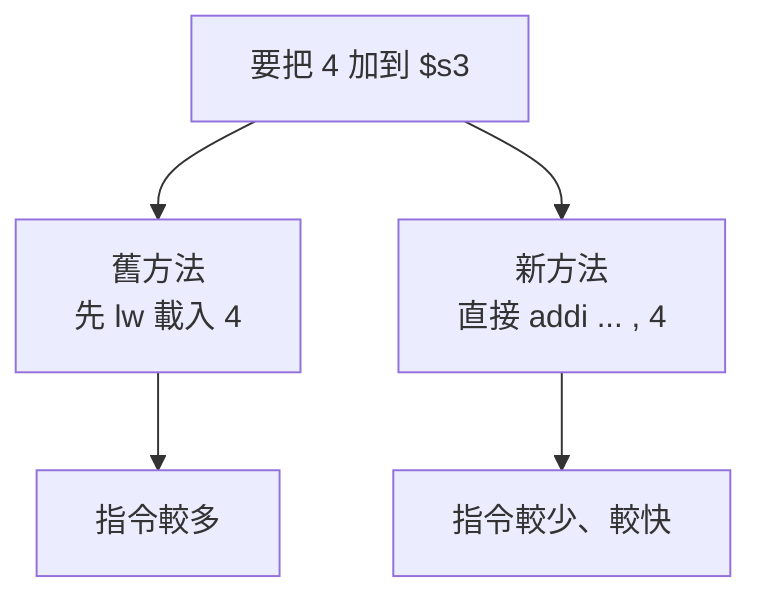

---

#### 第 59 頁：為什麼會需要常數 / 立即數

投影片第一頁在講兩件事。

第一，程式裡常常會出現常數。
最典型例子就是：

* 陣列索引加一
* 指標往下一格
* 計數器 `i = i + 1`
* 地址位移 `+4`

第二，**0 這個常數特別常用**，所以 MIPS 直接提供 `$zero` 這個硬體固定為 0 的暫存器，讓你不用再自己準備一個暫存器去裝 0。MIPS 官方教材明講：**GPR0 will always read 0**，而 immediate 指令則是用 **16-bit immediate value** 取代其中一個來源運算元。([MIPS Training][1])

---

#### 第 60 頁：為什麼這頁先教你「先從記憶體載入常數」

這頁其實是在鋪陳一個對比。

它先示範「沒有 immediate 指令」時，你會怎麼做：

```asm
lw  $t0, AddrConstant4($s1)
add $s3, $s3, $t0
```

意思是：

1. 先把記憶體中的常數 4 載入 `$t0`
2. 再把 `$t0` 加到 `$s3`

這種寫法不是錯，而是 **比較笨、比較舊的做法**。
因為它多做了一次 `lw`。而 MIPS 的 load 指令本來就需要經過記憶體存取，而且官方教材也特別提醒：load 之後常會帶來至少一個 cycle 的延遲風險。([MIPS Training][1])

---

#### 第 61 頁：真正更好的方法是 `addi`

這頁就是重點。

MIPS 提供：

* **`addi` = add immediate(加立即值)**

所以把常數 4 加到 `$s3`，其實更直接的寫法是：

```asm
addi $s3, $s3, 4
```

這樣就不用：

* 先把 4 放進記憶體
* 再 `lw` 載進暫存器
* 再 `add`

MIPS 官方教材明說：**add immediate** 會把 **16-bit immediate value** 加到 register 上。它也明說：**沒有 subtract immediate**，要減法時，直接用 `addi` 搭配負數就行，例如 `addi $s2, $s1, -1`。([MIPS Training][1])

---

#### 為什麼沒有 `subi`

這點很常考。

MIPS 教材已經直接講了：

> **沒有 subtract immediate；你可以用 add immediate 再給負數。**

例如：

```asm
addi $s2, $s1, -1
```

這其實就是：

```text
$s2 = $s1 - 1
```

所以：

* `addi ... , 4` = 加 4
* `addi ... , -1` = 減 1

這樣指令集比較簡潔。([MIPS Training][1])

---

#### 第 62 頁：`$zero` 到底有什麼用

這頁在講 **The Constant Zero(常數 0)**。

MIPS 的 `$zero` / `$0` 有一個非常重要的性質：

> **它永遠是 0。**

官方教材寫的是：**GPR0 will always read 0**。([MIPS Training][1])

這代表你可以隨時拿它當來源，例如：

```asm
add $s2, $s1, $zero
```

這條其實等價於：

```text
$s2 = $s1 + 0
```

也就是把 `$s1` 複製到 `$s2`。
所以投影片才會說，**register move(暫存器間搬移)** 可以看成「加上 0」。

---

#### 這裡我幫你校正一個細節

投影片寫：

* `$zero` 是常數 0
* cannot be overwritten

這個方向是對的。更精準地說：

> **你可以把 `$zero` 放在目的位置，但寫入它的結果不會留下來；讀它永遠得到 0。**

官方教材明確說的是 **GPR0 永遠讀作 0**。在 MIPS 官方架構手冊的引述中，也常把它描述成 **hard-wired to a value of zero**。([MIPS Training][1])

所以你可以把它理解成：

* 讀 `$zero`：一定是 0
* 寫 `$zero`：等於白寫，最後它還是 0

---

#### 把這四頁串起來看

這四頁真正的主線是：

1. 常數很常見
2. 如果每次都先從 Memory 載入常數，很浪費
3. 所以 MIPS 提供 **Immediate Instructions(立即數指令)**，把常數直接塞進指令
4. 而 **0** 太常見了，所以乾脆給你一個永遠是 0 的 `$zero`

---

#### 生活化例子

假設你每天都要做這件事：

* 讓計數器加 1
* 讓位址加 4
* 比較某值是不是 0

如果沒有 immediate / `$zero`：

* 你要先準備一個「1」
* 再準備一個「4」
* 再準備一個「0」
* 全部都要放暫存器或記憶體

這很麻煩。

有了 immediate / `$zero`：

* `addi $t0, $t0, 1`
* `addi $s3, $s3, 4`
* `beq  $s1, $zero, label`

整個就乾淨很多。

---

#### 最容易考 / 最容易混淆

##### 1. `addi` 的 4 不是來自記憶體

❌ 不是先存在某個位址再載入。
✅ 是 **直接編在指令裡的 immediate value**。([MIPS Training][1])

##### 2. 第 60 頁的做法不是最佳解

✅ 它是故意先示範「若沒有 immediate，你得多做一次 load」。
真正更好的寫法是第 61 頁的 `addi`。

##### 3. 沒有 `subi`

✅ MIPS 基本教學裡直接用 `addi` 加負數取代。([MIPS Training][1])

##### 4. `$zero` 不是「慣例上等於 0」

❌ 不是只是大家約定。
✅ 是硬體層面固定讀作 0。([MIPS Training][1])

---

#### 小結

你可以把這段濃縮成一句話：

> **Immediate Operand(立即運算元) 就是把常數直接寫進指令，避免多一次載入；而 `$zero` 則是 MIPS 內建的固定常數 0，用來讓常見操作更快、更省指令。** ([MIPS Training][1])

---

#### 超短背法

* **`addi`：把常數直接加進暫存器**
* **沒有 `subi`：減法用負的 immediate**
* **`$zero`：永遠是 0**
* **`add $d, $s, $zero`：等於 move**

---

#### 幫你直接整理成對照表

| 情況              | 較笨的做法                                | 較好的做法                 |
| --------------- | ------------------------------------ | --------------------- |
| `$s3 = $s3 + 4` | `lw $t0, ...`<br>`add $s3, $s3, $t0` | `addi $s3, $s3, 4`    |
| `$s2 = $s1 - 1` | 先準備常數 1 再減                           | `addi $s2, $s1, -1`   |
| `$s2 = $s1`     | 想辦法做複製                               | `add $s2, $s1, $zero` |

如果你要，我下一則可以直接幫你把 **`add`、`addi`、`lw`、`sw`** 四種格式畫成一張總表。

[1]: https://training.mips.com/basic_mips/PDF/Instruction_Set.pdf "Microsoft PowerPoint - 020 Instruction Set overview preR6.pptx"


## 2 的補數(two's complement)表示法


### 給我一些例子

已啟用教學模式

#### 先講直覺

在 **4-bit two's complement(4 位元二補數)** 裡，可表示的範圍是：

* 最小：`1000 = -8`
* 最大：`0111 = +7`

也就是說，**真正答案如果超出 `-8 ~ +7`，就一定會 overflow(溢位)**。另外，two's complement 的加法本身和一般二進位加法一樣做即可。([康奈爾計算機科學系][1])

---

#### 最好記的判斷規則

對加法來說，你可以先背這句：

> **兩個同號數相加，結果如果變成異號，就 overflow。**

例如：

* 正 + 正，結果卻變負 → overflow
* 負 + 負，結果卻變正 → overflow
* 正 + 負 → 通常不會因為「符號規則」而 overflow

這也是硬體裡常用的判斷方式。([維基百科][2])

---

#### 例子 1：正數加正數，結果變負數

我們用 4-bit：

```text
  0101   (+5)
+ 0011   (+3)
------
  1000
```

表面算出來是 `1000`，但在 4-bit two's complement 裡：

* `1000 = -8`

所以電腦得到的是 `-8`，但真正數學答案應該是：

* `5 + 3 = 8`

問題在於 **+8 超出 4-bit 可表示的最大值 +7**，所以這是 **overflow**。([康奈爾計算機科學系][1])

---

#### 例子 2：負數加負數，結果變正數

```text
  1011   (-5)
+ 1010   (-6)
------
  0101
```

在 4-bit two's complement 裡：

* `1011 = -5`
* `1010 = -6`
* `0101 = +5`

但真正數學答案是：

* `-5 + -6 = -11`

而 4-bit 的最小值只有 `-8`，放不下 `-11`，所以發生 **overflow**。
這就是典型的：

> **負 + 負，結果卻變正**

所以一定有問題。([康奈爾計算機科學系][1])

---

#### 例子 3：正負相加，通常不會 overflow

```text
  0011   (+3)
+ 1101   (-3)
------
  0000
```

結果是 `0000 = 0`，這是正確的，沒有 overflow。

這也剛好對應那個規則：

* **異號相加**，通常不會因為符號位出錯而 overflow。([維基百科][2])

---

#### 例子 4：看起來有進位，但其實沒有 overflow

這個超容易考。

```text
  1111   (-1)
+ 0001   (+1)
------
1 0000
```

如果只保留 4 bit，結果是：

```text
0000
```

也就是 `0`。

這題有一個 **carry out(最左邊多跑出去的進位)**，但它**不是** signed overflow。
因為真正答案 `-1 + 1 = 0` 完全在範圍內。two's complement 加法本來就會把超出位數的最高位進位丟掉。([維基百科][3])

---

#### 例子 5：負數加負數，但這次沒有 overflow

```text
  1011   (-5)
+ 1101   (-3)
------
  1000
```

結果 `1000 = -8`。

真正答案：

* `-5 + -3 = -8`

剛好還在 4-bit 範圍內，所以 **沒有 overflow**。
這題很重要，因為它告訴你：

> **不是看到負 + 負就一定 overflow，要看結果有沒有超出範圍。**([康奈爾計算機科學系][1])

---

#### 我幫你整理成一個表

| 運算            | 4-bit 結果 |         真正十進位答案 | 有沒有 overflow |
| ------------- | -------- | --------------: | ------------ |
| `0101 + 0011` | `1000`   |     `5 + 3 = 8` | ✅ 有          |
| `1011 + 1010` | `0101`   | `-5 + -6 = -11` | ✅ 有          |
| `0011 + 1101` | `0000`   |  `3 + (-3) = 0` | ❌ 沒有         |
| `1111 + 0001` | `0000`   |    `-1 + 1 = 0` | ❌ 沒有         |
| `1011 + 1101` | `1000`   |  `-5 + -3 = -8` | ❌ 沒有         |

這個表的判斷，都是根據 4-bit two's complement 的表示範圍 `-8 ~ +7` 與加法規則來看的。([康奈爾計算機科學系][1])

---

#### 為什麼投影片說「符號位元不正確時就 overflow」

你投影片那句話，其實可以翻成更好懂的版本：

* 你原本期待一個 **正數**
* 結果最高位卻變成 **1**，看起來像負數

或是：

* 你原本期待一個 **負數**
* 結果最高位卻變成 **0**，看起來像正數

這就是「**符號延伸(sign extension) 應該長什麼樣，卻沒有長對**」的意思。

所以：

* 正 + 正 → 結果若是負 → overflow
* 負 + 負 → 結果若是正 → overflow

---

#### 小結

你可以先死記這三句：

1. **4-bit two's complement 範圍是 `-8 ~ +7`。** ([康奈爾計算機科學系][1])
2. **同號相加，結果變異號，就是 overflow。** ([維基百科][2])
3. **有 carry out 不一定 overflow。** ([維基百科][3])

#### 下一步最適合做的事

我可以直接再幫你畫成「逐位相加」版，把 carry 一格一格標出來，讓你看懂為什麼例子 1 和例子 4 一個有 overflow、一個沒有。

[1]: https://www.cs.cornell.edu/courses/cs3410/2024fa/notes/numbers.html?utm_source=chatgpt.com "Switches & Numbers - CS 3410"
[2]: https://en.wikipedia.org/wiki/Overflow_flag?utm_source=chatgpt.com "Overflow flag"
[3]: https://en.wikipedia.org/wiki/Two%27s_complement?utm_source=chatgpt.com "Two's complement"


## MIPS 指令種類 、 MISP 轉機器語言

         


### 講解


#### 1. 先講這 10 張投影片背後真正要處理的規則

這一段不是在叫我們死背 `R / I / J` 三種長相，而是在處理一個核心限制：

**CPU 最後只吃固定長度的位元欄位，所以我們必須把「人看得懂的組合語言」翻成「硬體看得懂的 32-bit 欄位」**。

MIPS32 的指令固定是 **32 bit**，而且有 **32 個 general-purpose registers**；其中 **GPR0 固定為 0**，**GPR31 常用來放 return address**。R 型通常是 **2 個來源 + 1 個目的**，I 型則是把其中一個來源位置換成 **16-bit immediate**。這就是為什麼投影片一直在講欄位、位數、暫存器編號，而不是只講語法。 ([MIPS訓練][1])

---

#### 2. 這幾頁其實在教你一個轉換流程

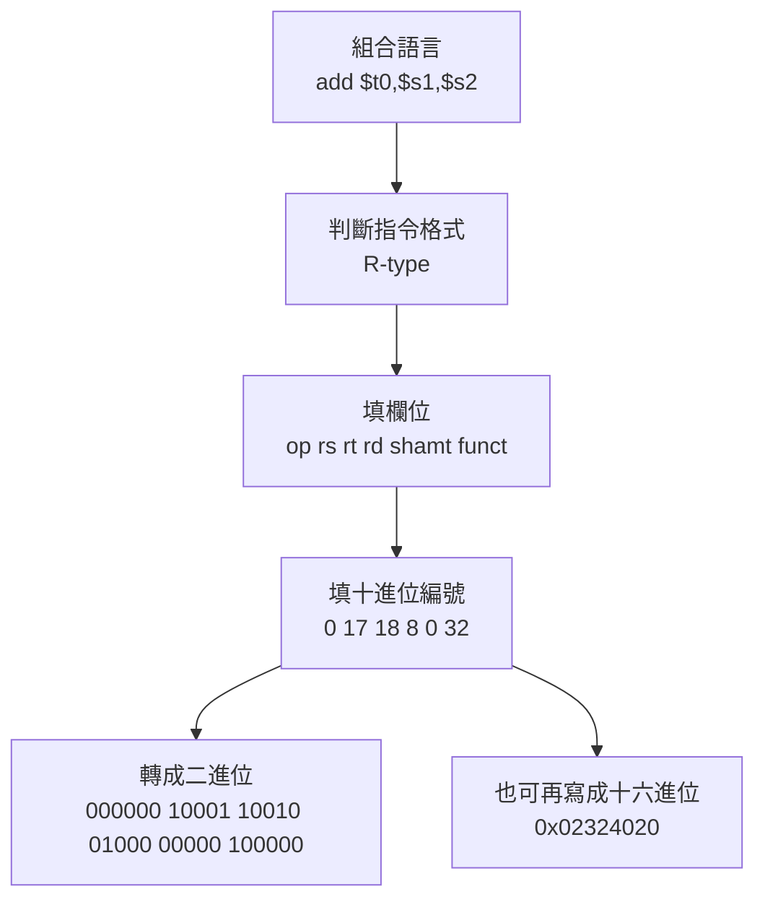

你可以把它想成「寄包裹」：

* `add` 告訴 CPU：你要做哪種事
* `$s1`、`$s2` 告訴 CPU：資料從哪來
* `$t0` 告訴 CPU：結果要放哪
* 最後把這些資訊塞進固定格式的欄位中

---

#### 3. 三種格式，重點不是背圖，而是知道它們各自解決什麼問題

**3.1 R(Register) 型**
適合「資料都在暫存器裡」的運算，像 `add`、`sub`、`and`、`or`、`slt`、`sll`。
欄位是：

`op | rs | rt | rd | shamt | funct`

這代表：

* `rs`：第一個來源
* `rt`：第二個來源
* `rd`：目的地
* `shamt`：給 shift 類指令用
* `funct`：因為很多 R 型指令的 `op` 都一樣，所以再靠 `funct` 細分

你現在要抓一個最重要的不變量：

> **組合語言的書寫順序，不等於機器欄位的排列順序。**

例如：

`add $t0, $s1, $s2`

組合語言順序是：

`目的地, 來源1, 來源2`

但機器欄位是：

`op, rs, rt, rd, shamt, funct`

所以 `$t0` 雖然寫在最前面，**它進的是 `rd`，不是 `rs`**。這是很多人第一次最容易搞混的地方。

---

#### 4. 你這組例子 `add $t0,$s1,$s2` 怎麼一步一步轉

從你投影片第 112、113 頁直接讀：

* `$s1 = 17`
* `$s2 = 18`
* `$t0 = 8`
* `add` 的 R 型欄位是
  `op=0, shamt=0, funct=32`

所以欄位值就是：

`0 | 17 | 18 | 8 | 0 | 32`

轉二進位：

* `0` → `000000`
* `17` → `10001`
* `18` → `10010`
* `8` → `01000`
* `0` → `00000`
* `32` → `100000`

合起來就是：

`000000 10001 10010 01000 00000 100000`

再轉十六進位會是：

`0x02324020`

這一題最該會的不是答案本身，而是這個因果鏈：

> `add` 是 R 型
> → R 型格式固定
> → 查暫存器編號
> → 非 shift，所以 `shamt=0`
> → `add` 的功能碼是 `funct=32`
> → 拼成 32 bit 機器碼

---

#### 5. 這幾頁裡你要特別小心的觀念

**5.1 為什麼 R 型的 opcode 常常是 0？**
因為 MIPS 想把所有指令都維持成 32-bit 固定長度，所以做了折衷：
R 型先用共同的 `op=0`，再靠 `funct` 去區分到底是 `add`、`sub`、`and`、`or` 還是別的。這樣硬體和解碼都比較規律。

**5.2 為什麼 `rs/rt/rd` 都是 5 bit？**
因為 5 bit 最多表示 `2^5 = 32` 種可能，剛好對應 32 個暫存器。

**5.3 為什麼所有 MIPS 指令都做成 32 bit？**
因為固定長度解碼比較簡單，硬體也比較快。這正是你投影片一直在呼應的設計原則：**regularity favors simplicity**。 ([MIPS訓練][1])

---

#### 6. 你第 106 頁那張 R 型指令表，有幾個地方要改

這頁有幾個明顯錯誤，你報告或筆記最好修掉：

**6.1 `nor` 不是異或(XOR)**
`nor` 是 **NOT OR**，也就是：

`~($2 | $3)`

不是 XOR。官方訓練教材對 `NOR` 的描述是：只有兩個輸入位元都為 0，輸出位元才會是 1。 ([MIPS訓練][1])

**6.2 `if($2<$3) $1=1 else $1=0` 不是 `nor`，那其實是 `slt`**
`set on less than` 的意思是：
如果第一個來源 < 第二個來源，就把目的暫存器設成 1，否則設成 0。官方教材也是這樣說的。 ([MIPS訓練][1])

**6.3 `sll / srl` 不是「迴圈左移 / 迴圈右移」**
它們是 **logical shift(邏輯位移)**。
`sll` 左移時右邊補 0；`srl` 右移時左邊補 0。
真正的 rotate 是另一類指令，不應直接把 `sll/srl` 說成迴圈位移。官方教材把 `Shift Left Logical` 和 rotate 類指令分開講。 ([MIPS訓練][1])

所以你那張表至少要改成：

* `nor`：反或(NOR)，不是異或
* `slt`：小於則設 1，不是三目運算
* `sll/srl`：邏輯左移/邏輯右移，不是 rotate

---

#### 7. I 型、J 型你現在先抓到這樣就夠了

**7.1 I(Immediate) 型**
當你需要常數、offset、位址差量時，用 I 型。
格式：

`op | rs | rt | immediate`

所以像：

* `addi`
* `lw`
* `sw`
* `beq`
* `bne`

都常放在這類。

**7.2 J(Jump) 型**
當你要大範圍跳轉，就把大部分空間留給位址。
`j` 用 **26-bit immediate target**，而 `jal` 除了跳轉，還會把 **return address 存到 R31**。 ([MIPS訓練][1])

---

#### 8. 你可以怎麼記，最不容易忘

直接記這一句：

> **R 型：三個暫存器做運算**
> **I 型：有立即值/位址差量**
> **J 型：專心拿去跳**

再補一句：

> **組語看起來是「目的地先寫」，但機器碼不是照這個順序排。**

---

#### 9. 這段最容易出的考題型

最常考三種：

**9.1 給你組語，問你是哪一型**
例如 `add` → R 型，`lw` → I 型，`j` → J 型

**9.2 給你組語，叫你填欄位**
像你這題 `add $t0,$s1,$s2`

**9.3 給你欄位，反推組語**
例如看到：
`op=0, rs=17, rt=18, rd=8, shamt=0, funct=32`
就要能反推是：

`add $t0,$s1,$s2`

---

#### 10. 一句總結

這幾頁真正要你學會的是：

**同一條指令，同時有三種樣子：**

1. 人看的：`add $t0,$s1,$s2`
2. 欄位看的：`0 | 17 | 18 | 8 | 0 | 32`
3. 位元看的：`000000 10001 10010 01000 00000 100000`

只要這三層你能互相來回轉換，這段就算真的學會了。

如果你要，我下一則可以直接帶你做 3 題練習，包含：
`sub`、`lw`、`j`，我們一題一題手算欄位。

[1]: https://training.mips.com/basic_mips/PDF/Instruction_Set.pdf "Microsoft PowerPoint - 020 Instruction Set overview preR6.pptx"


       


### 講解

#### 1. 這幾頁在講什麼

這一組圖主要是在講 **I-type(立即值型)** 指令格式，以及怎麼把 MIPS assembly language(組合語言) 轉成 machine language(機器語言)，再從機器語言反解回組合語言。MIPS 的基本設計是：**所有指令固定都是 32-bit，而且主要分成 R-type、I-type、J-type 三種格式**。I-type 的欄位排列是 `op | rs | rt | immediate`。 ([CS Home Page][1])

---

#### 2. I-type 的核心規則

I-type 的重點不是「有個 immediate 欄位」而已，而是：

* `op`：這是哪一種指令
* `rs`：通常是來源暫存器，或 base register(基底暫存器)
* `rt`：依指令不同，可能是 destination register(目的暫存器)，也可能是 source register(來源暫存器)
* `immediate`：16-bit 的立即值、位移量、或 branch offset(分支位移)

所以你不能把 `rt` 永遠理解成「目的地」。在 `addi`、`lw` 裡，`rt` 常是目的地；但在 `sw`、`beq`、`bne` 裡，`rt` 不是目的地，而是拿來提供資料或比較的暫存器。這也是很多初學者最容易卡住的地方。 ([CS Home Page][1])

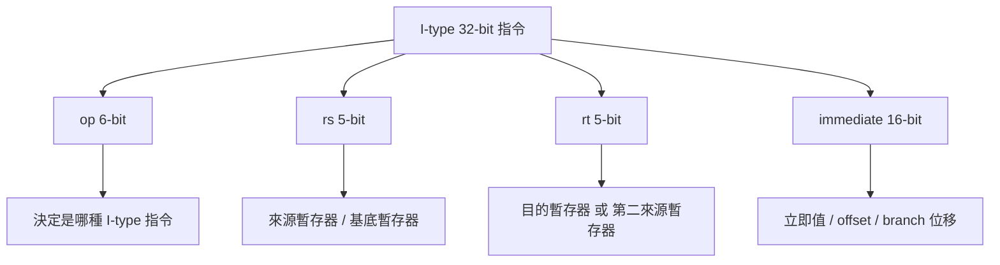

---

#### 3. 用 `lw $t0, 32($s3)` 來看最清楚

你第 114 頁那張圖的例子其實很好，因為它把 I-type 的典型用法直接展示出來了：

`lw $t0, 32($s3)`

它的意思不是「把位址 32 載入 `$t0`」，而是：

**從 memory[$s3 + 32] 讀一個 word(字)，放進 `$t0`**。
所以這裡：

* `rs = $s3`：base register(基底位址)
* `rt = $t0`：destination register(接收載入資料)
* `immediate = 32`：offset(位移量)

如果 `$s3` 裡存的是陣列 `A` 的起始位址，那 `32` 代表偏移 32 bytes，而因為一個 word 是 4 bytes，所以 `32 = 8 × 4`，也就是 `A[8]`。這正是投影片上寫的 `lw $t0,32($s3) # 暫時暫存器$t0 得到 A[8]`。 ([凱斯西儲大學計算機科學部][2])

---

#### 4. 為什麼第 114 頁標成 `19($s3)`、`8($t0)` 是對的

MIPS 有 32 個通用暫存器，所以每個 register 欄位要用 5-bit 表示，因為 `2^5 = 32`。而常見暫存器編號中：

* `$t0 = 8`
* `$s2 = 18`
* `$s3 = 19`
* `$t1 = 9`

所以第 114 頁把 `lw $t0,32($s3)` 對應成：

* `rs = 19`
* `rt = 8`
* `immediate = 32`

這是正確的。 ([CS Home Page][1])

---

#### 5. 第 115 頁有一個地方要修正

第 115 頁把 `immediate` 寫成「立即數（最大可到 `2^16`）」這句話**不夠精確，嚴格說有問題**。正確講法應該是：

**I-type 有一個 16-bit immediate field(立即值欄位)**。
但它能表示的數值範圍，要看指令怎麼解讀它：

* `addi` 這類 arithmetic immediate(算術立即值) 會做 sign extension(符號延伸)，所以可表示的 signed 範圍是 `-2^15 ~ 2^15-1`
* `andi`、`ori` 這類 logical immediate(邏輯立即值) 用的是 zero extension(零延伸)，所以 16-bit 欄位可表示 `0 ~ 2^16-1`

所以不能直接籠統地說「最大可到 `2^16`」，比較正確應該說：
**欄位寬度是 16-bit；實際可表示範圍依指令的 sign-extension / zero-extension 規則而定。**  ([Stack Overflow][3])

| 指令      | immediate 怎麼延伸 | 用途重點                               |
| ------- | -------------- | ---------------------------------- |
| `addi`  | sign extension | 算術加法，可處理負數                         |
| `addiu` | sign extension | 算術加法，可處理負數，不做 signed overflow trap |
| `andi`  | zero extension | 位元 AND                             |
| `ori`   | zero extension | 位元 OR                              |
| `xori`  | zero extension | 位元 XOR                             |

---

#### 6. 第 114 頁「32 置入位址欄位」也需要改一下

這句也容易讓人誤會。對 `lw $t0,32($s3)` 來說，最後那 16-bit 欄位不是「完整位址(address)」，而是 **offset/displacement(位移量)**。真正的 effective address(有效位址) 是：

`$s3 + 32`

所以更好的講法應該是：

**32 置入 immediate / offset 欄位，不是直接當成完整記憶體位址。** ([凱斯西儲大學計算機科學部][2])

---

#### 7. 第 116 頁那張分類圖，概念上是對的

你第 116 頁把 I-type 圈出來，包含：

* `addi rt, rs, imm`
* `slti rt, rs, imm`
* `lw rt, imm(rs)`
* `sw rt, imm(rs)`
* `beq rs, rt, imm`

這個分類方向是對的，因為 **I-type 的確常用在立即值運算、load/store(載入/儲存)、branch(分支)**。前面第 114 頁第一句只寫「立即值及資料轉移指令」，其實不夠完整，因為 **分支指令像 `beq`、`bne` 也是 I-type**。第 116 頁反而把這件事補齊了。 ([CS Home Page][1])

---

#### 8. 第 117~119 頁的例題，其實是在教你「同一段程式裡 R-type 與 I-type 混用」

例題是：

`A[300] = h + A[300];`

已知：

* `$t1` 放陣列 `A` 的 base address(基底位址)
* `$s2` 放 `h`

編譯後：

* `lw  $t0, 1200($t1)`
* `add $t0, $s2, $t0`
* `sw  $t0, 1200($t1)`

這裡最重要的不是背答案，而是看出：

* 第 1 行 `lw`：I-type
* 第 2 行 `add`：R-type
* 第 3 行 `sw`：I-type

也就是說，一個真實的小段程式，本來就會混合不同 instruction format(指令格式)。

---

#### 9. 為什麼 offset 是 1200

因為 `A[300]` 是第 300 個 word，而 MIPS 的 `lw/sw` 對 word array(字組陣列) 取元素時，offset 要用 **byte address(位元組位址)** 算：

`300 × 4 = 1200`

所以：

`lw $t0, 1200($t1)`

表示從 `A` 的基底位址再往後偏移 1200 bytes 的地方取出 `A[300]`。這也是 slide 118、119 上為什麼 immediate 欄位填 1200，而不是 300。 ([凱斯西儲大學計算機科學部][2])

---

#### 10. 第 118 頁表格怎麼讀

你那張表其實是在把三條指令拆欄位：

##### 10.1 `lw $t0,1200($t1)`

* `op = 35`
* `rs = 9` (`$t1`)
* `rt = 8` (`$t0`)
* `immediate = 1200`

##### 10.2 `add $t0,$s2,$t0`

* `op = 0`
* `rs = 18` (`$s2`)
* `rt = 8` (`$t0`)
* `rd = 8` (`$t0`)
* `shamt = 0`
* `funct = 32`

##### 10.3 `sw $t0,1200($t1)`

* `op = 43`
* `rs = 9` (`$t1`)
* `rt = 8` (`$t0`)
* `immediate = 1200`

其中 `lw` 的 opcode 是 35，`sw` 是 43，`add` 這種 R-type 指令 `op = 0`、`funct = 32`，這些都和標準 MIPS encoding(編碼) 一致。 ([凱斯西儲大學計算機科學部][4])

---

#### 11. 第 119 頁的二進位結果也是對的

`1200₁₀ = 0000 0100 1011 0000₂`

所以兩條 I-type 指令會變成：

* `lw` → `100011 01001 01000 0000 0100 1011 0000`
* `sw` → `101011 01001 01000 0000 0100 1011 0000`

中間那條 `add` 是 R-type：

* `000000 10010 01000 01000 00000 100000`

這和 slide 119 的排列一致。 ([CS Home Page][1])

---

#### 12. 這裡最容易混淆的一點：assembly order(組語順序) 和 field order(欄位順序) 不同

這點你一定要特別抓住。

例如：

* `add $t0,$s2,$t0` 的 assembly syntax(組語語法) 看起來像 `rd, rs, rt`
* 但 R-type 欄位順序是 `op rs rt rd shamt funct`

同理：

* `lw $t0,1200($t1)` 的 assembly syntax 是 `rt, imm(rs)`
* 但 I-type 欄位順序是 `op rs rt immediate`

也就是說：

**人類寫指令的順序，不等於機器欄位擺放的順序。**

這正是解題時最常出錯的地方。([CS Home Page][1])

---

#### 13. 第 120 頁「反解碼」講得方向正確

第 120 頁說要把機器語言逆向工程回組合語言，這在概念上是對的。實作上就是：

1. 先看前 6-bit 的 `opcode`
2. 判斷它是 R-type、I-type、還是 J-type
3. 再按對應格式切欄位
4. 最後把 register number(暫存器編號) 查回 `$t0`、`$s2` 這些名字

所以第 123 頁整理成：

* R-format：`op rs rt rd shamt funct`
* I-format：`op rs rt address / immediate`
* J-format：`op target`

這張總表是正確的總結。 ([CS Home Page][1])

---

#### 14. 幫你總結：這幾張圖哪些地方正確，哪些地方要改

##### 14.1 正確的地方

* I-type 基本格式 `op rs rt immediate` 正確。([CS Home Page][1])
* `lw $t0,32($s3)` 對應 `rs=19, rt=8, imm=32` 正確。([凱斯西儲大學計算機科學部][2])
* `A[300]=h+A[300]` 例題的三條指令與其欄位值正確。 ([凱斯西儲大學計算機科學部][4])
* 第 123 頁三大格式總表正確。 ([CS Home Page][1])

##### 14.2 要修正或補強的地方

* 第 114 頁「I型用於立即值及資料轉移」太窄，還應包含 branch instructions(分支指令)。([凱斯西儲大學計算機科學部][2])
* 第 114 頁「32 置入位址欄位」應改成「32 置入 offset / immediate 欄位」。([凱斯西儲大學計算機科學部][2])
* 第 115 頁「立即數最大可到 `2^16`」不精確；應講成「16-bit 欄位，範圍依 sign/zero extension 而定」。([Stack Overflow][3])
* 第 115 頁把 `rt` 直接寫成目的地暫存器，對 `addi`、`lw` 可以，但對 `sw`、`beq`、`bne` 會誤導。([凱斯西儲大學計算機科學部][2])

---

#### 15. 你現在最該真正記住的不是表，而是這一句

**I-type 的真正精神是：CPU 先用 `op` 判斷指令種類，再把 `rs`、`rt`、`immediate` 依照那條指令的語意去解讀；同樣叫 I-type，不代表 `rt` 和 `immediate` 在每條指令裡都扮演完全相同的角色。** ([CS Home Page][1])

---

#### 16. 你下一步最值得做的練習

建議我們下一題直接手算這三種：

1. `addi $t0,$s1,4`
2. `lw $t0,32($s3)`
3. `beq $s0,$s1,8`

這樣你會一次把 **I-type 的三種常見語意：算術、訪存、分支** 全部打通。

[1]: https://max.cs.kzoo.edu/cs230/Resources/MIPS/MachineXL/InstructionFormats.html?utm_source=chatgpt.com "MIPS Instruction Formats"
[2]: https://www.cs.kzoo.edu/cs230/lectures/MIPS/MachineXL/FormatExceptions.html?utm_source=chatgpt.com "MIPS Format Exceptions"
[3]: https://stackoverflow.com/questions/55290060/what-does-extend-immediate-to-32-bits-mean-in-mips?utm_source=chatgpt.com "cpu architecture - What does \"extend immediate to 32 bits\" mean in MIPS? - Stack Overflow"
[4]: https://www.cs.kzoo.edu/cs230/Resources/MIPS/MachineXL/mipsOpFunctCodes.html?utm_source=chatgpt.com "MIPS Op/Funct Codes"


/// details | 簡報


                  

///
### 講解 

#### 1. 這一串圖，其實是在把整個 Chapter 2 串起來

你這次貼的第 126～144 頁，不是在講一堆分散的小知識；它其實是在講同一條主線：

> **程式會被翻成數字形式的 instruction(指令)，放進 memory(記憶體)；CPU 再依照 instruction format(指令格式) 解碼，最後完成 arithmetic(算術)、logic(邏輯)、branch(分支) 這些行為。**

而且你剛剛卡住的那個問題，也在第 140 頁被正式收束了：
**`andi` / `ori` 是 zero-extend(零延伸)，`addi` 是 sign-extend(符號延伸)。** 這和教學資料、編碼表與社群常見解釋是一致的。([max.cs.kzoo.edu][1])

---

#### 2. 先抓這章背後的核心規則

你不要把它背成：

* 第 126 頁是編碼
* 第 131 頁是 AND
* 第 144 頁是 beq

這樣會很碎。

你應該把它抓成 3 個核心規則：

1. **所有 MIPS instruction(指令) 都是 32-bit。**
2. **前面的欄位先決定格式，後面的欄位再照格式解讀。**
3. **同樣是 I-type(立即值型)，immediate(立即值欄位) 的語意不一定一樣。**

這三條一抓住，後面幾十張投影片其實都在展開它。MIPS 教學資料也明確說明：所有指令 32-bit、第一個 6-bit 是 opcode(運作碼)、整體主要分成 R-format、I-format、J-format 三類。([max.cs.kzoo.edu][1])

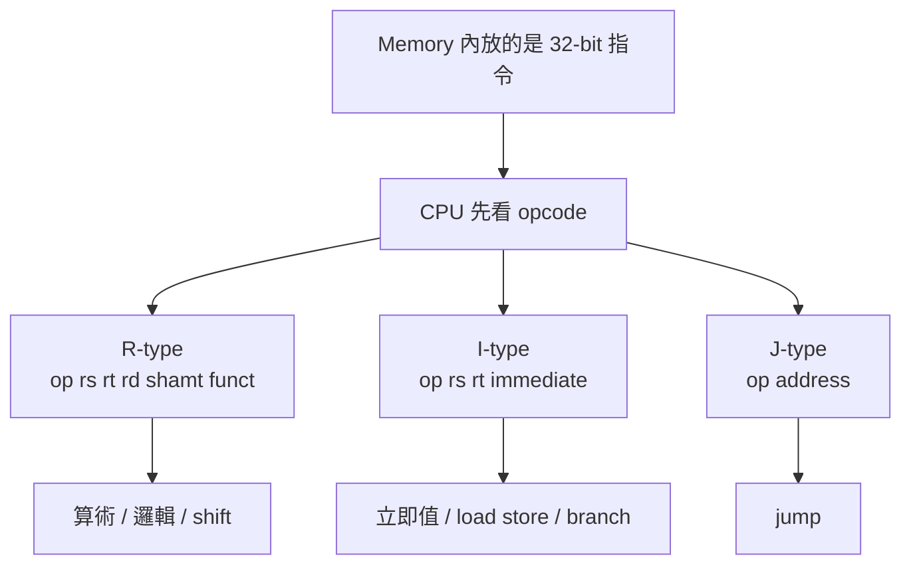

---

#### 3. 第 126～127 頁：這兩張是「解碼規則總表」

這兩張的主要內容是對的：

* `add/sub` 是 R-type
* `addi/lw/sw` 是 I-type
* `add` 的 `funct = 32`
* `sub` 的 `funct = 34`
* `addi` 的 `opcode = 8`
* `lw` 的 `opcode = 35`
* `sw` 的 `opcode = 43` ([cs.kzoo.edu][2])

但這兩頁有一個地方你要主動修正，不然後面很容易學歪：

> 投影片把 I-type 最後一欄常寫成「address(位址)」，這不夠精確。

更精確的說法應該是：

* 對 `addi/andi/ori`，那 16-bit 是 **immediate value(立即值)**
* 對 `lw/sw`，那 16-bit 是 **offset(位移量)**
* 對 `beq/bne`，那 16-bit 是 **branch offset(分支位移)**

也就是說，**I-type 最後 16-bit 不是永遠都叫位址。** 教學參考資料也特別把 I-format exceptions(例外) 分開講，因為 `lw/sw/beq` 的 immediate 是 offset，不是單純常數，更不是完整記憶體位址。([cs.kzoo.edu][3])

---

#### 4. 第 128～129 頁：這是在講 stored-program(內儲程式) 的真正意思

這兩頁的重點不是背名詞，而是理解：

> **程式本身也只是記憶體裡的一串資料。**

所以同一塊 memory(記憶體) 裡，可以放：

* compiler(編譯器)
* editor(編輯器)
* document text(文字)
* payroll data(薪資資料)
* executable machine code(可執行機器碼)

這就是 stored-program concept(內儲程式概念)，也就是 von Neumann style(馮紐曼式) 的核心想法：**程式和資料都能存在記憶體裡，由 CPU 依序取出處理。** 這也是為什麼電腦不是「一出生就只能做一件事」；換一段 machine code(機器碼)，它就表現成另一個程式。([遊戲駭客][4])

你可以把它想成：

* 手機的儲存空間裡既可以放照片
* 也可以放 App
* CPU 並不是天生知道「這是記事本還是遊戲」
* 它只是根據目前取到的 bit pattern(位元樣式) 去執行

這樣看第 129 頁那張圖就會很自然了。

---

#### 5. 第 130 頁：這題你要學的是「assembly order(組語順序) 和 field order(欄位順序) 不一樣」

題目給的是：

* `op = 0`
* `rs = 8`
* `rt = 9`
* `rd = 10`
* `shamt = 0`
* `funct = 34`

因為：

* `op = 0` 代表 R-type
* `funct = 34` 代表 `sub`
* register 8 是 `$t0`
* register 9 是 `$t1`
* register 10 是 `$t2` ([cs.kzoo.edu][2])

所以答案是：

```text
sub $t2, $t0, $t1
```

也就是你投影片勾的第 4 個。這題最重要的不是背答案，而是記住：

* 機器碼欄位順序：`op rs rt rd shamt funct`
* 組語寫法順序：`sub rd, rs, rt`

所以 `rd = 10` 才是第一個寫出來的 `$t2`。這是初學者最容易出錯的地方。([max.cs.kzoo.edu][1])

---

#### 6. 第 131～139 頁：這一段其實都在講 bitwise logic(逐位元邏輯)

這一串頁面可以用一句話統整：

> **ALU(算術邏輯單元) 不只會做整數加減，也會對每個 bit 逐位處理。**

常見的就是：

* `sll/srl`：位移
* `and`：遮罩
* `or`：設定位元
* `nor`：OR 後再取反
* `xor`：不同為 1，相同為 0

這些都屬於標準 MIPS 邏輯/位移指令家族。常見編碼表中，`sll` 的 funct 是 0，`srl` 是 2，`and` 是 36，`or` 是 37，`nor` 是 39，而 `xor` 也確實存在於標準 MIPS R-format 裡。([cs.kzoo.edu][2])

---

#### 7. 第 131～133 頁：`sll/srl` 的本質不是數學，而是「位元搬家」

這幾頁在講 shift(位移)。
像：

```text
sll $t2, $s0, 4
```

意思不是神祕公式，而是：

> 把 `$s0` 的 bit pattern(位元樣式) 全部往左移 4 格，右邊補 0，結果放進 `$t2`。

教學資料也把 `sll` / `srl` 歸在 R-format 的 shift 指令，`shamt` 欄位就是 shift amount(位移量)。([student.cs.uwaterloo.ca][5])

投影片說「左移 4 位等於乘以 16」，這句**在這個例子裡是對的**，但你心裡要加上一個隱藏前提：

> **在沒有高位被丟掉、沒有 overflow(溢出) 問題時，左移 n 位可以視為乘上 `2^n`。**

所以用小正數 9 當例子很合理；但不是所有情況都能無腦把 shift 當乘法。這個細節你要比投影片再多懂一步。

---

#### 8. 第 134～136 頁：`AND` 和 `OR` 最常見的真正用途

這幾頁講得方向是對的，而且很實用。

`AND` 的核心用途是 **masking(遮罩)**：
你拿一個 mask(遮罩) 去和原數做 AND，mask 裡是 0 的位置會被強制清成 0。這也是 slide 135 在講的內容。社群和教材都把 AND 視為典型的 bit mask 工具。([max.cs.kzoo.edu][1])

`OR` 的核心用途是 **bit set(設定位元)**：
你想把某幾個位置打開成 1，就用 OR。只要遮罩某位是 1，結果那位就會變成 1。這也是 `ori` 很常見的用途。([max.cs.kzoo.edu][1])

所以你可以這樣記：

* `AND` 像濾網，把不要的位元蓋掉
* `OR` 像開關，把某些位元打開

---

#### 9. 第 137～138 頁：為什麼 MIPS 用 `NOR` 來做 `NOT`

這兩頁的觀念是對的：

* Base MIPS(基礎 MIPS) 沒有獨立的 `not` 指令
* 但可以用 `nor` 搭配 `$zero` 來實作 NOT

因為：

```text
A NOR 0 = NOT(A OR 0) = NOT(A)
```

這就是第 137 頁那句的數學理由，而且和標準指令參考一致。([student.cs.uwaterloo.ca][5])

所以像：

```text
nor $t0, $t1, $zero
```

本質上就是把 `$t1` 每一個 bit 全部反相後放進 `$t0`。

這其實很漂亮，因為 MIPS 想維持簡潔的 R-type 格式，所以寧可少放一條專門的 `not`，而用現有的 `nor` 去表達。

---

#### 10. 第 139～140 頁：這兩頁正好回答你剛剛的疑問

第 140 頁是這一串圖裡最重要的一頁之一，因為它把剛剛我們討論的 extension(延伸) 問題正式寫清楚了：

* `andi` / `ori`：**zero-extend**
* `addi`：**sign-extend** ([max.cs.kzoo.edu][1])

這個差別不是死背規則，而是由「用途」決定的：

##### 10.1 `andi` / `ori`

它們是 logic instruction(邏輯指令)，重點是處理 bit pattern(位元樣式)。
所以 immediate 要 zero-extend，避免高 16 位被亂補成 1，破壞 mask 或 bit-set 的意義。這也是很多社群解答反覆強調的原因。([Stack Overflow][6])

##### 10.2 `addi`

它是 arithmetic instruction(算術指令)，重點是處理 signed integer(有號整數) 的加減。
所以 immediate 要 sign-extend，這樣像 `-1`、`-4` 這種負數才有意義。`addi` 可直接編碼的 immediate 範圍也是有號 16-bit，也就是 `-32768 ~ 32767`。([Stack Overflow][7])

所以你剛剛那個問題，現在可以完全定案：

> **不是 `addi` 做零延伸；是 `ori/andi` 做零延伸。**

而第 140 頁這個表，整體上是正確的。([Stack Overflow][6])

---

#### 11. 第 141～144 頁：這一段在講 control flow(控制流程)

這幾頁的主題是：

> **電腦不是只能一條路一直往下跑，它可以根據比較結果改變下一條要執行的指令位置。**

這就是 conditional branch(條件式分支)，典型就是：

* `beq`：branch if equal
* `bne`：branch if not equal

而它們都屬於 I-type。標準編碼表裡 `beq` 的 opcode 是 4，`bne` 是 5。([cs.kzoo.edu][2])

---

#### 12. 但第 144 頁有一個很重要的錯誤，你一定要修正

第 144 頁寫：

> 「後面是 16bits 的儲存器位址」

這句**不對**，或至少是嚴重不精確。

對 `beq reg1, reg2, L1` 而言，最後 16-bit 不是完整的 memory address(記憶體位址)，而是：

> **PC-relative signed offset(相對於 PC 的有號位移)**

MIPS 分支的語意是：

```text
if (reg1 == reg2)
    PC = PC + 4 + (offset << 2)
else
    PC = PC + 4
```

也就是說，branch immediate 表示的是「從下一條指令開始，要往前或往後跳幾個 word」，不是直接把 `L1` 的完整位址硬塞進那 16-bit。這點在教學網站與社群解釋都很一致。([Stack Overflow][8])

所以第 144 頁應該改成：

> **前兩個欄位是暫存器，後面 16-bit 是 branch offset(分支位移)。**

這是這串圖裡我最建議你立刻修掉的一個地方。

---

#### 13. 第 143 頁也有一個小地方要精確一點

第 143 頁把 `jr rs`、`beq rs,rt,imm`、`j addr` 全都放在「分支指令」那一列，這樣做在教學上可以接受，因為它們都會改變 control flow(控制流程)。([cs.kzoo.edu][3])

但如果你要講得更精確：

* `beq` / `bne` 是 **conditional branch(條件分支)**
* `j` 是 **jump(跳躍)**
* `jr` 是 **jump register(暫存器間接跳躍)**

所以 `jr` 不算條件分支，它只是另一種 jump。這是分類精度的問題，不是大錯，但你知道這層會更紮實。

---

#### 14. 幫你把這一大段濃縮成一張腦中地圖

你現在可以把這一整段想成：

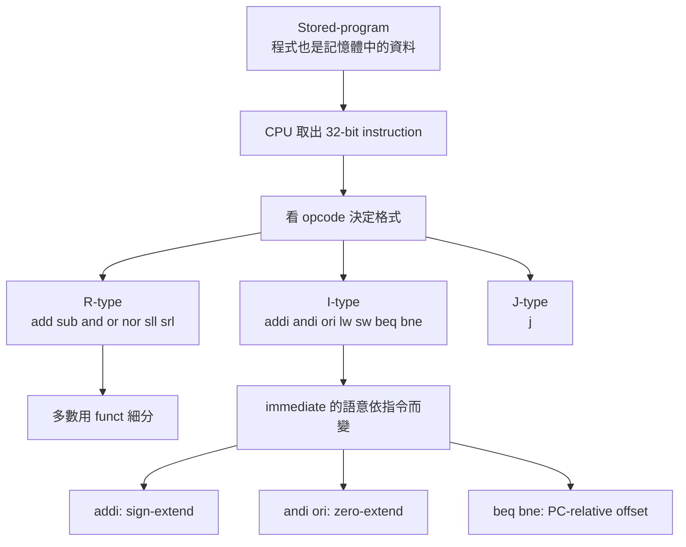

這張圖其實就是第 126～144 頁最應該留下來的主骨架。

---

#### 15. 我幫你做最後的「正確 / 要修正」總表

##### 15.1 這幾頁整體正確的地方

* MIPS 指令固定 32-bit，分 R / I / J 三大格式。([max.cs.kzoo.edu][1])
* `add/sub` 用 R-type，`addi/lw/sw/beq/bne` 用 I-type。([cs.kzoo.edu][2])
* `AND/OR/NOR/XOR/shift` 這串邏輯操作的基本語意方向是對的。([student.cs.uwaterloo.ca][5])
* `andi/ori` zero-extend、`addi` sign-extend，這點是對的。([Stack Overflow][6])
* 第 130 頁練習題答案 `sub $t2,$t0,$t1` 是對的。([cs.kzoo.edu][2])

##### 15.2 你要主動修正的地方

* I-type 最後 16-bit 不能一律叫「位址」；應視指令叫 immediate / offset / branch offset。([cs.kzoo.edu][3])
* 第 133 頁「左移 4 位等於乘以 16」要補上前提：在沒有高位截斷/溢出的情況下成立。這是數學理解上的精化。([student.cs.uwaterloo.ca][5])
* 第 144 頁把 `beq` 的 16-bit 說成「儲存器位址」是錯的；正確是 PC-relative offset。([Stack Overflow][8])
* 第 143 頁把 `jr` 放在「分支」那列可以接受，但更精確它是 jump register，不是 conditional branch。([cs.kzoo.edu][2])

---

#### 16. 一句話收掉這整段

**這一大段不是在教你背指令表，而是在教你：CPU 如何把「記憶體中的 32-bit 數字」解讀成可執行的運算、邏輯操作與控制流程。**

下一步最有幫助的是，我直接帶你手算兩題：
一題 `ori` / `addi` 比較 zero-extend 與 sign-extend，另一題 `beq` 算 branch offset。

[1]: https://max.cs.kzoo.edu/cs230/Resources/MIPS/MachineXL/InstructionFormats.html?utm_source=chatgpt.com "MIPS Instruction Formats"
[2]: https://www.cs.kzoo.edu/cs230/Resources/MIPS/MachineXL/mipsOpFunctCodes.html?utm_source=chatgpt.com "MIPS Op/Funct Codes"
[3]: https://www.cs.kzoo.edu/cs230/lectures/MIPS/MachineXL/FormatExceptions.html?utm_source=chatgpt.com "MIPS Format Exceptions"
[4]: https://gamehacking.org/faqs/MIPS_Instruction_Reference.html?utm_source=chatgpt.com "MIPS Instruction Reference"
[5]: https://student.cs.uwaterloo.ca/~isg/res/mips/opcodes?utm_source=chatgpt.com "MIPS Encoding Reference"
[6]: https://stackoverflow.com/questions/29284428/in-mips-when-to-use-a-signed-extend-when-to-use-a-zero-extend?utm_source=chatgpt.com "assembly - In MIPS, when to use a signed-extend, when to use a zero-extend? - Stack Overflow"
[7]: https://stackoverflow.com/questions/22960392/about-addi-instruction-in-mips?utm_source=chatgpt.com "sign extension - About addi instruction in MIPS - Stack Overflow"
[8]: https://stackoverflow.com/questions/38473218/mips32-assembly-beq-instruction-explanation?utm_source=chatgpt.com "mips - MIPS32 assembly beq instruction explanation - Stack Overflow"


/// details | 簡報

            

///


### 講解

#### 1. 這一段的主軸是什麼

這組投影片的主軸，已經從前面的「指令格式」往前走到 **control flow(控制流程)** 了。
也就是說，前面在學的是：

* 一條指令長什麼樣
* CPU 怎麼解碼

而這一段在學的是：

* **CPU 怎麼改變「下一條要執行哪一行」**

所以這裡主要在講 3 件事：

1. **J-type(J 型指令)**：無條件跳躍
2. **beq / bne**：條件式分支
3. **if / while** 這些高階語言控制流程，怎麼翻成 MIPS 組合語言

這正是 MIPS 裡 branch(分支) 與 jump(跳躍) 的基本內容。([asimplecpu.com][1])

---

#### 2. J 型指令到底在處理什麼

J-type 最核心的概念是：

> **不管條件，直接把 PC(program counter，程式計數器) 改成另一個目標位置。**

所以 `j Exit` 的語意就是：

* 不再往下一行
* 直接去 `Exit` 那個 label(標籤)

你可以把它想成走路時的兩種情況：

* **branch**：如果下雨才右轉
* **jump**：不管怎樣，直接右轉

這就是 slide 145~147 在講的事。J-format 只有兩個欄位：

* `op`
* `address`

也就是說，它把大部分空間都留給「目標位置」，因為它不像 `beq/bne` 那樣還要放兩個要比較的 register。([max.cs.kzoo.edu][2])

---

#### 3. 但這裡有一個很重要的修正：J 型不是「完整 32-bit 位址直接塞進去」

你投影片第 145 頁寫「理想情況當然是可以直接 32bits 拿來表示位址」，這句是在鋪陳觀念，可以接受。
但真正的 MIPS `j` 指令 **不是把完整 32-bit 位址原封不動塞進 instruction**。

實際上，J-type instruction 裡只有 **26-bit target field**。組合出真正跳躍位址時，會：

* 先把這 26-bit 左移 2 位，因為指令位址按 word 對齊，最低 2 bit 本來就是 `00`
* 再把高 4 bit 從 `PC+4` 那邊補回來

所以它不是「完整 absolute 32-bit address(絕對 32 位址)」，而是常說的 **pseudo-direct addressing(準直接定址)**。([維基百科][3])

所以第 147 頁那句：

```text
j 10000   # 前往位址10000
```

在入門教學上可以先這樣讀，但你心裡要知道：

> **instruction 裡存的不是完整 10000 這個 32-bit 位址本體，而是位址的一部分。**

---

#### 4. 分支指令和跳躍指令，最大的差別是什麼

`beq`、`bne` 是 **conditional branch(條件式分支)**。
它們會先比較兩個 register，再決定要不要改 PC。`j` 則是無條件直接改 PC。([cs.kzoo.edu][4])

所以：

* `beq $s0, $s1, L1`：如果相等，跳去 `L1`
* `bne $s0, $s1, L1`：如果不相等，跳去 `L1`
* `j Exit`：直接跳去 `Exit`

這也是 slide 148~150 在講的重點。

---

#### 5. 第 148 頁有一個關鍵錯誤，你一定要修正

第 148 頁下面那段話大意是：

> 如果程式位址要能放進這個 16 位元欄位，就代表程式大小不能超過 `2^16` 條指令

這句 **不對**。

因為 `beq/bne` 的最後 16-bit 不是「完整位址」，而是 **PC-relative offset(相對於 PC 的位移量)**。
也就是說，它不是在存「目的地完整地址」，而是在存：

> **從下一條指令開始，要往前或往後跳幾個 instruction word**

所以 branch 的核心公式，入門版可以記成：

```text
target = PC + 4 + (offset << 2)
```

因此 16-bit 的限制，不是「整個程式只能有 `2^16` 條指令」，而是：

> **單一 branch 指令能跳到的範圍有限，它只適合跳去附近的 label。**

這也是為什麼條件分支很適合 `if` 和 `while`，因為它們通常本來就只跳附近。([asimplecpu.com][1])

---

#### 6. 這組 if-then-else 範例其實很標準

第 149~150 頁的 C 程式是：

```c
if (i == j) 
    f = g + h;
else
    f = g - h;
```

投影片翻成：

```text
bne $s3, $s4, Else
add $s0, $s1, $s2
j Exit
Else: sub $s0, $s1, $s2
Exit:
```

這個寫法是對的，而且很典型。它不是先用 `beq` 去做 then，而是先用 **相反條件 `bne`** 直接跳去 `Else`。
原因很簡單：

> 這樣可以「跳過 then block」，控制流程比較乾淨。

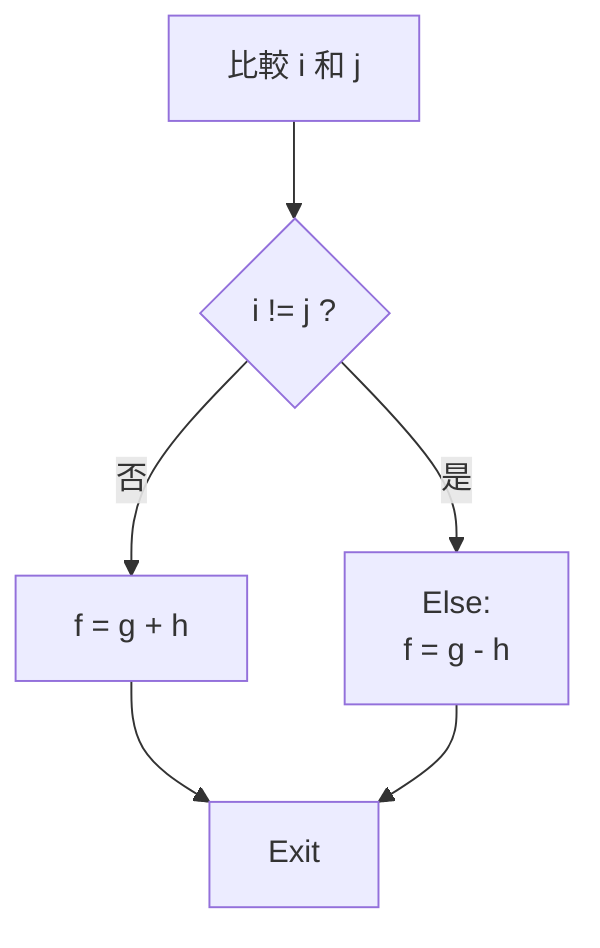

這種「先 branch 到 else，再用 `j Exit` 跳過 else」的寫法，是教材和常見教學裡非常標準的 if-else 編譯模式。([cs.kzoo.edu][4])

---

#### 7. while 迴圈那一題，你要看懂的是「控制流程骨架」

第 152~153 頁的題目是：

```c
while (save[i] == k)
    i = i + 1;
```

* $s3 放的是 i
* $s6 放的是 save 的基底位址
* $s5 放的是 k

翻成 MIPS：

```text
Loop: sll $t1, $s3, 2
      add $t1, $t1, $s6
      lw  $t0, 0($t1)
      bne $t0, $s5, Exit
      addi $s3, $s3, 1
      j Loop
Exit:
```

這段的骨架非常經典：

1. 先算 `save[i]` 的位址
2. 把 `save[i]` 載入
3. 如果 `save[i] != k`，跳出去
4. 否則 `i = i + 1`
5. 再跳回 `Loop`

也就是：

> **迴圈 = 條件判斷 + 回跳**

這正是 slide 151 在講的「if 與 loop 的基本建構指令很像」。([cs.kzoo.edu][4])

---

#### 8. 第 153 頁每一行在做什麼

這段你一定要真正拆懂，不然只是背答案。

```text
Loop: sll $t1, $s3, 2
```

因為 `i` 是 array index(陣列索引)，每個 word 4 bytes，所以 `i * 4`。([維基百科][3])

```text
add $t1, $t1, $s6
```

把 base address(基底位址) 加進去，得到 `save[i]` 的實際位址。([維基百科][3])

```text
lw $t0, 0($t1)
```

把 `save[i]` 取出來。`lw` 使用 base + displacement addressing。([維基百科][3])

```text
bne $t0, $s5, Exit
```

如果 `save[i] != k`，表示 while 條件失敗，跳去 `Exit`。([cs.kzoo.edu][4])

```text
addi $s3, $s3, 1
```

做 `i = i + 1`。`addi` 用來做整數加法。([max.cs.kzoo.edu][2])

```text
j Loop
```

回到迴圈開頭。([asimplecpu.com][1])

---

#### 9. 第 155 頁的 branch offset 範例，觀念上是對的

你投影片裡那題把指令從位址 `80000` 開始排。
`bne` 那一行在 `80012`，而 `Exit` 在 `80024`。

所以 branch 要跳的不是從自己位置開始算，而是從 **下一條指令 `80016`** 開始算：

* `80024 - 80016 = 8 bytes`
* `8 bytes / 4 = 2 instructions`

所以 offset = `2`

這就是第 155 頁紅框中的 `2`。這個觀念是對的：
**branch immediate 存的是相對位移，不是完整位址。** ([Stack Overflow][5])

---

#### 10. 同一頁的 `j Loop` 為什麼是 `20000`

這題裡 `Loop` 在位址 `80000`。
因為 jump target field 會省略最低 2 bit，所以：

```text
80000 / 4 = 20000   //  8000>>2=8000/4=2000
```

因此 instruction 裡的 26-bit 欄位會放對應的 index 值，也就是投影片寫的 `20000`。這和 J-type「低 2 bit 不存、由硬體補 `00`」的規則一致。([Stack Overflow][5])

---

#### 11. 第 156~157 頁在講什麼：`slt/slti` 是比較的積木

這兩頁其實非常重要。它們在講：

> **MIPS 不想把所有比較指令都硬做成很多種，而是提供一個基礎比較積木 `slt` / `slti`，再配合 `beq/bne` 去組出更多條件。**

`slt rd, rs, rt` 的意思是：

* 如果 `rs < rt`，則 `rd = 1`
* 否則 `rd = 0`

`slti rt, rs, imm` 則是和 immediate 比。這些都是標準 MIPS 指令。([維基百科][3])

例如：

```text
slt $t0, $s3, $s4
bne $t0, $zero, Less
```

意思就是：

* 先判斷 `$s3 < $s4` 嗎
* 如果是，`$t0 = 1`
* 再用 `bne` 看 `$t0` 是否不等於 0

所以 slide 157 那句話想表達的是：

> **MIPS 用少量簡單指令去組出比較複雜的條件判斷，這符合 RISC(精簡指令集) 的設計精神。**

這個方向是對的。([cs.kzoo.edu][6])

---

#### 12. 幫你把這整段濃縮成一張腦中地圖

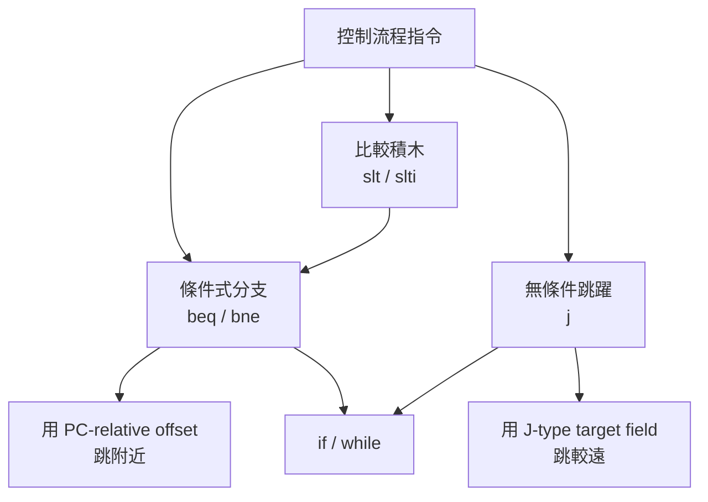

---

#### 13. 這幾頁中，哪些地方你要特別記住

最重要的不是背頁數，而是記這 4 句：

1. **`j` 是無條件跳躍，直接改 PC。** ([asimplecpu.com][1])
2. **`beq/bne` 用的是相對位移，不是完整絕對位址。** ([cs.kzoo.edu][7])
3. **if-else 和 while，本質上都是 branch + jump 的組合。** ([cs.kzoo.edu][4])
4. **`slt/slti` 是比較的基礎零件，配合 `beq/bne` 可以組出更多條件。** ([cs.kzoo.edu][6])

---

#### 14. 最後一句總結

**這一段真正要你學會的，不是「哪條指令長什麼樣」而已，而是：CPU 如何用 branch、jump、slt 這些基本零件，把 if、else、while 這些程式控制流程跑出來。**

下一步最值得做的是把第 155 頁手算一次：先算 `bne` 的 offset，再算 `j Loop` 的 26-bit target。

[1]: https://asimplecpu.com/Mips/jump?utm_source=chatgpt.com "Conditional and Unconditional Jumps"
[2]: https://max.cs.kzoo.edu/cs230/Resources/MIPS/MachineXL/InstructionFormats.html?utm_source=chatgpt.com "MIPS Instruction Formats"
[3]: https://en.wikipedia.org/wiki/MIPS_architecture?utm_source=chatgpt.com "MIPS architecture"
[4]: https://www.cs.kzoo.edu/cs230/Resources/MIPS/Conditions/ConditionsInMIPS.html?utm_source=chatgpt.com "MIPS Conditions"
[5]: https://stackoverflow.com/questions/23727105/mips-how-to-find-the-address-value-of-branch-and-jump-instructions?utm_source=chatgpt.com "addressing - MIPS - How to find the address value of branch and jump instructions - Stack Overflow"
[6]: https://www.cs.kzoo.edu/cs315/Resources/MIPS/Conditions/ConditionsInMIPS.html?utm_source=chatgpt.com "MIPS Conditions"
[7]: https://www.cs.kzoo.edu/cs230/lectures/MIPS/MachineXL/FormatExceptions.html?utm_source=chatgpt.com "MIPS Format Exceptions"


----------

[檔案](file:///D:/%E6%88%91%E7%9A%84%E9%9B%B2%E7%AB%AF%E7%A1%AC%E7%A2%9F%20(peicd100@gmail.com)/0_%E5%A4%A7%E5%AD%B8/0_%E7%AD%86%E8%A8%98/0_%E5%B8%AB%E5%A4%A7114-2/%E7%A7%91%E6%8A%80_%E8%A8%88%E7%AE%97%E6%A9%9F%E7%B5%90%E6%A7%8B/%E8%AC%9B%E7%BE%A9/2026.3.20,27%20CH-02_%E5%85%A8.pdf)


file:///D:/%E6%88%91%E7%9A%84%E9%9B%B2%E7%AB%AF%E7%A1%AC%E7%A2%9F%20(peicd100@gmail.com)/0_%E5%A4%A7%E5%AD%B8/0_%E7%AD%86%E8%A8%98/0_%E5%B8%AB%E5%A4%A7114-2/%E7%A7%91%E6%8A%80_%E8%A8%88%E7%AE%97%E6%A9%9F%E7%B5%90%E6%A7%8B/%E8%AC%9B%E7%BE%A9/2026.3.20,27%20CH-02_%E5%85%A8.pdf

期中考到157(153/163)

