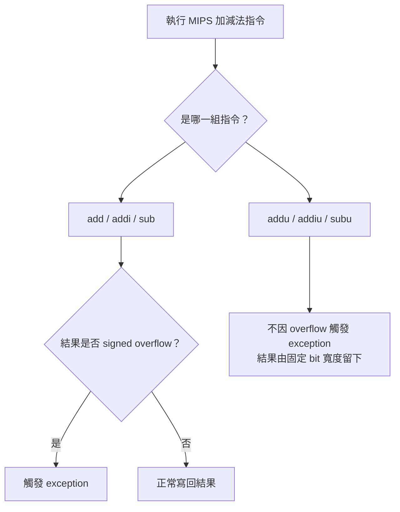
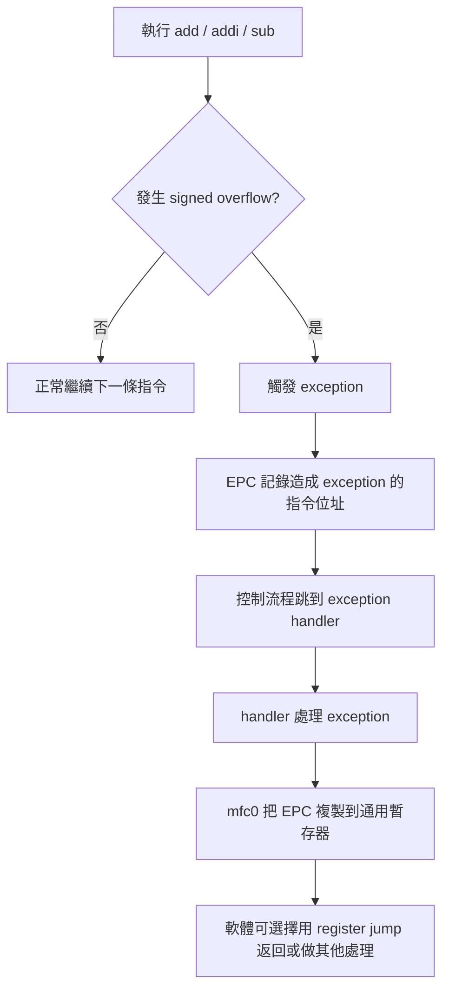
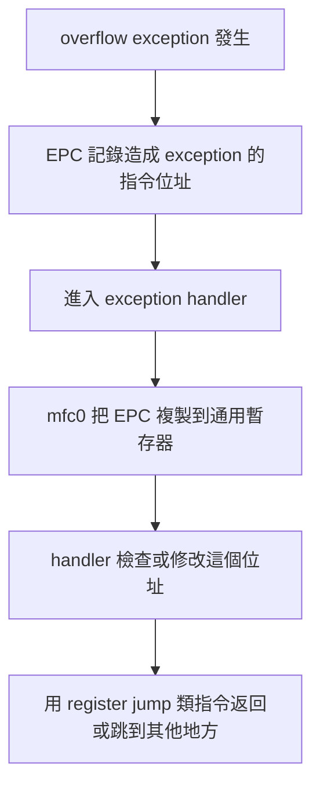
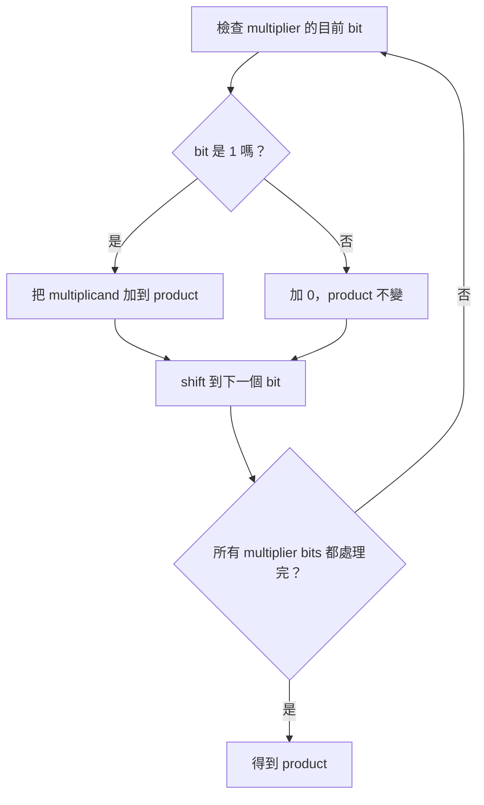
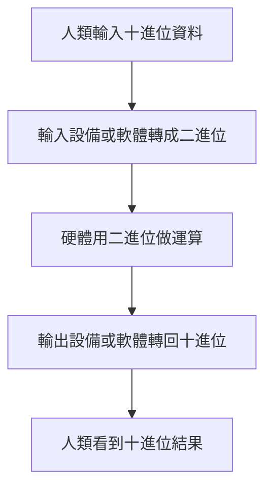
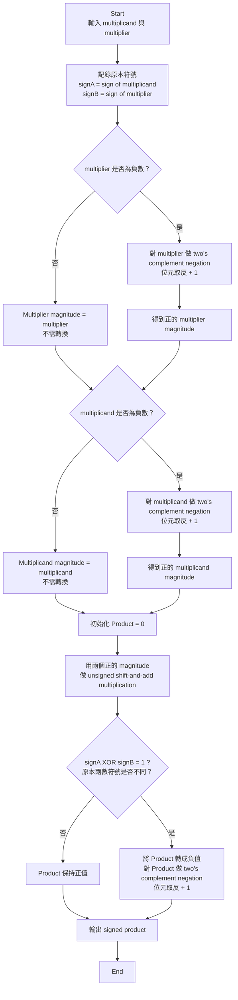
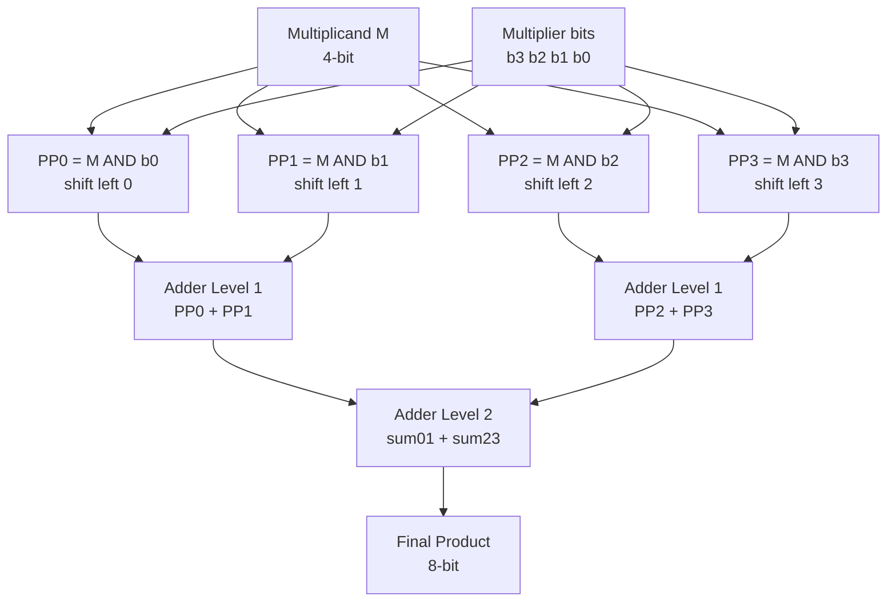
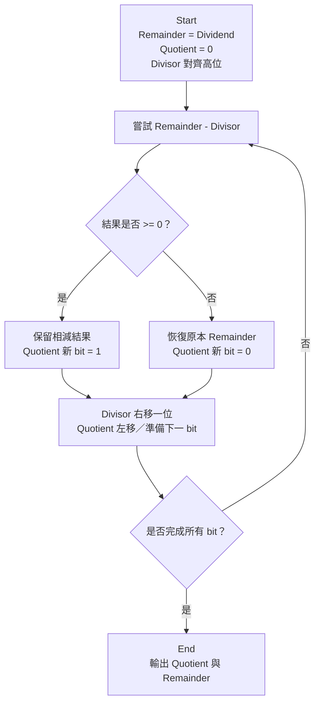
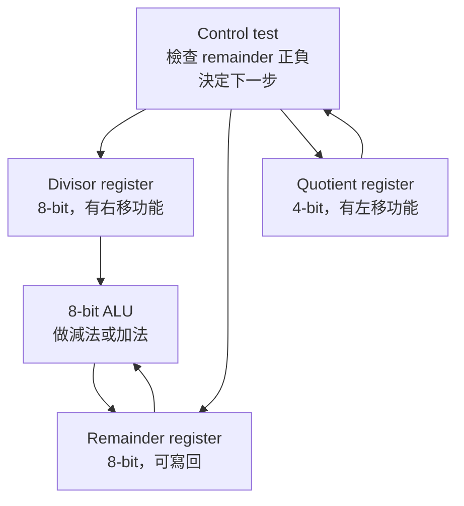
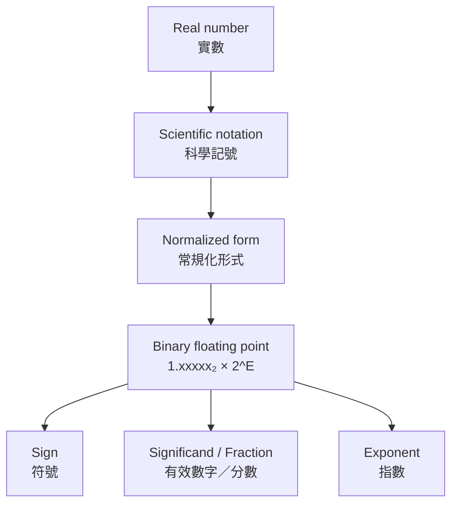

# ch 3


## 第 3 章到底在處理什麼問題？

這章的主問題是：

**電腦只會操作固定長度的 bit pattern(位元樣式)，那它要怎麼可靠地表示數字、做加減乘除、處理小數，並把這些運算做成硬體與指令？**

生活化地說，電腦像是一台只能用固定格子填 0/1 的計算機。
假設只有 4 個格子，那最多只有 16 種圖案：

`0000` 到 `1111`

但問題來了：

同一個圖案可以有不同解讀。
例如 `1111`：

* 當作 Unsigned Integer(無號整數)：它是 15。
* 當作 Two’s Complement Signed Integer(二補數有號整數)：它是 -1。

所以這章不是只教「二進位怎麼算」，而是在教：

1. **Representation(表示法)**：同一串 bits 要怎麼解讀成數字？
2. **Algorithm(演算法)**：加、減、乘、除怎麼用 bit operations 完成？
3. **Hardware(硬體)**：這些演算法要怎麼做成 adder(加法器)、multiplier(乘法器)、divider(除法器)？
4. **ISA Impact(對指令集的影響)**：例如 MIPS 為什麼有 `add`、`addu`、`mult`、`mflo`、`mfhi` 這些不同指令？


## 二補數讓「減法」變成「加法」

Two’s Complement(二補數) 最核心的目的不是讓你多背一種轉換法，而是解決硬體設計問題：

**CPU 已經有 adder(加法器)，那可不可以不要再做一套很麻煩的 subtractor(減法器)？**

答案是可以。方法是：

```text
A - B = A + (-B)
```

所以問題變成：
我們要怎麼用固定 n-bit 的 bit pattern 表示 `-B`？

Two’s Complement(二補數) 的規則是：

```text
Step 1: invert all bits
Step 2: add 1
```

也就是：

```text
2's complement = 1's complement + 1
```

講義 PDF page 11 也是先列出 1 補數，再說「再加上 1」得到 2 補數。

---

### 先看一個 8-bit 例子：10 變成 -10

`10₁₀` 的 8-bit binary 是：

```text
00001010
```

Step 1：取 1’s complement(一補數)，也就是每個 bit 反相：

```text
11110101
```

Step 2：加 1：

```text
11110101
+       1
--------
11110110
```

所以在 8-bit Two’s Complement 中：

```text
11110110 = -10
```

這就是講義 PDF page 13 裡 `88 - 10` 會使用 `-10` 的二補數表示的原因。

---

### 用二補數做 88 - 10

直接想是：

```text
88 - 10 = 78
```

硬體想的是：

```text
88 + (-10)
```

8-bit 表示：

```text
  01011000   =  88
+ 11110110   = -10
-----------
1 01001110
```

因為我們固定只看 8-bit，所以最左邊多出來的 carry-out 丟掉：

```text
01001110 = 78
```

這裡有一個重要觀念：
**丟掉最高位 carry-out 不等於「隨便忽略錯誤」；它是在固定 n-bit arithmetic(固定寬度算術) 的規則下，只保留 n 個 bits。** 社群討論中也常提醒，Two’s Complement 裡 carry-out 和 signed overflow(有號滿溢) 不是同一件事；有號滿溢要看結果是否超出可表示範圍，或同號相加卻得到相反符號。([Stack Overflow][1])

---

### 為什麼「反相加 1」會得到負數？

用 4-bit 比較直觀。

假設：

```text
x = 0011 = 3
```

先反相：

```text
1100
```

`0011 + 1100 = 1111`

也就是所有 bits 都變成 1。
再加 1：

```text
1111 + 1 = 1 0000
```

固定 4-bit 只留下：

```text
0000
```

所以：

```text
0011 + 1101 = 0000   固定 4-bit 下
```

因此：

```text
1101 可以代表 -3
```

核心直覺是：

**一個數加上自己的二補數，會在固定 bit 寬度下回到 0。**

這也是講義 PDF page 12「二補數的秘密」在展示的重點：原數加上一補數會得到全 1；再加 1 後會回到全 0。

---

### 快速技巧：從右往左找第一個 1


講義 PDF page 14 給了一個常用 shortcut(捷徑)：
計算二補數時，從右邊開始掃：

1. 從最右邊開始，直到遇到第一個 `1`，包含這個 `1` 之前都照抄。
2. 第一個 `1` 左邊的所有 bits 反相。

例子：

```text
原數：10101000
二補：01011000
```

檢查方式：

* 從右邊開始：`000` 照抄
* 第一個 `1` 照抄
* 左邊 `1010` 反相成 `0101`

所以得到：

```text
01011000
```

---

### 常見錯法

第一個錯法：只反相，忘記加 1。
這只得到 1’s complement(一補數)，不是 Two’s Complement(二補數)。

第二個錯法：沒有固定 bit width(位寬)。
例如 `1010` 到底是 4-bit 的 -6，還是 8-bit 的 +10？沒有指定位寬與解讀方式，答案不完整。

第三個錯法：把 carry-out 當成一定是 overflow。
Two’s Complement 中，最高位 carry-out 可能被丟掉，但 signed overflow 要看符號與可表示範圍。Stack Overflow 上的常見討論也指出，兩個正數相加變負數，或兩個負數相加變非負數，才是典型 signed overflow 判斷。([Stack Overflow][2])


## Instruction Set Architecture, ISA(指令集架構) 對 overflow(滿溢) 的政策

### 會檢查 overflow 並呼叫 exception 的指令

`add`、`addi`、`sub` 這組指令，重點是 checked arithmetic(會檢查的算術)。
當結果超出 32-bit two’s complement signed integer(32 位元二補數有號整數) 可表示範圍時，它們會觸發 exception(例外)。

也就是：

* `add`：register + register，檢查 overflow
* `addi`：register + immediate，檢查 overflow
* `sub`：register - register，檢查 overflow

這組適合「程式希望系統幫我抓錯」的情況。

---

### 不呼叫 exception 的指令

`addu`、`addiu`、`subu` 這組指令，重點是 unchecked arithmetic(不檢查的算術)。
==就算產生 overflow，也不觸發 exception== ；硬體結果會像固定寬度位元運算一樣留下可表示的部分。

也就是：

* `addu`：register + register，不因 overflow exception
* `addiu`：register + immediate，不因 overflow exception
* `subu`：register - register，不因 overflow exception

常見陷阱：
`addu` 的 `u` 很容易被理解成「只能做 unsigned number(無號數)」。但在這頁考點裡，更重要的是「不呼叫 overflow exception」。也就是說，考試問差異時，不要只寫「一個 signed、一個 unsigned」，要寫出「是否偵測／觸發 overflow exception」。

---

### 用一張流程圖記住



---

### 最短記法

`add/addi/sub`：overflow → exception
`addu/addiu/subu`：overflow → no exception

中文理解版：
MIPS 提供兩套加減法指令；一套幫你抓 signed overflow，另一套不抓，讓軟體自己負責。

英文考試版：

`add`, `addi`, and `sub` raise an exception on overflow, while `addu`, `addiu`, and `subu` do not raise an overflow exception. The key distinction is overflow trapping behavior, not merely whether the programmer thinks of the operands as signed or unsigned.


### Overflow 是啥？

overflow(滿溢) 不是單純「位元超過」；它是「數學上的正確結果超出目前資料格式可表示的範圍，所以固定位寬留下來的 bit pattern 已經不能代表原本想要的數值」。

### 兩種指令都會判斷 Overflow 嗎？

對於這兩種指令，底層硬體通常可以產生 overflow 訊號；但在 MIPS ISA 語意上，add/addi/sub 會把 signed overflow 轉成 exception，addu/addiu/subu 則忽略 overflow，不產生 exception。


### 差別到底是啥？

add/addi/sub：在發生 signed overflow(有號滿溢) 時會呼叫 exception(例外)。
addu/addiu/subu：即使發生 overflow，也不會呼叫 overflow exception。


## Exception Handling — CPU 如何知道是哪條指令造成 overflow？

第 19 頁先說：`add/addi/sub` 發生 signed overflow(有號滿溢) 時會觸發 exception。
第 20 頁接著問：**觸發 exception 之後，CPU／作業系統要怎麼知道是哪一條指令出事？**

生活化例子：
想像你在跑一長串指令，像老師在批改一整疊考卷。某一題爆掉了，老師不能只知道「有錯」，還要知道「是哪一題錯」。EPC 就像是那個「錯題頁碼標籤」。

---

### EPC 是什麼？

`EPC(exception program counter，例外程式計數器)` 是一個特殊暫存器。
它的工作是：

**當 exception 發生時，記錄造成 exception 的指令位址。**

所以如果某條 `add` 指令發生 overflow，MIPS 會跳去 exception handler，同時 EPC 會保留「剛剛是哪條指令造成 exception」。

這很重要，因為 exception handler 處理完之後，軟體可能需要：

1. 回到原本出事的地方重新處理。
2. 跳過那條指令。
3. 印出錯誤訊息或終止程式。
4. 做某種補救動作。

沒有 EPC，exception handler 就只知道「有錯」，但不知道「錯在哪」。

---

### `mfc0` 是什麼？

`mfc0` 是 `move from system control`，也常理解成 `move from coprocessor 0`。
在這頁講義裡，我們先用最小必要理解：

**`mfc0` 可以把 EPC 這種系統控制暫存器的內容，複製到一般通用暫存器。**

也就是：

```mips
mfc0  general_register, EPC
```

概念上是在做：

```text
general_register = EPC
```

重點：
`mfc0` 本身不是「返回」指令。它只是把 EPC 的值拿出來。
真的要回去，還需要後續用 jump register 類的控制流程，例如講義說的「經由暫存器跳躍指令返回造成例外的指令」。

---

### 整個流程怎麼串起來？



把它想成一句話：

**overflow exception 發生時，EPC 記住「哪條指令出事」，`mfc0` 讓軟體把這個位址讀出來使用。**

---

### 常見錯法

第一個錯法：
把 EPC 說成「存 overflow 的結果」。
錯。EPC 存的是造成 exception 的 instruction address(指令位址)，不是運算結果。

第二個錯法：
把 `mfc0` 說成「處理 overflow 的指令」。
不精準。`mfc0` 是把 EPC 從系統控制暫存器複製到通用暫存器，讓 exception handler 的軟體能使用那個位址。

第三個錯法：
以為 exception handler 自動知道要回哪裡。
不完整。它需要 EPC 這類資訊來知道原本發生 exception 的位置。

---

### 四件套暫存筆記

中文理解版：
MIPS 發生 overflow exception 時，會用 EPC 記錄造成例外的指令位址；`mfc0` 可以把 EPC 的內容搬到一般暫存器，讓軟體決定如何返回或處理。

英文考試版：
When an overflow exception occurs in MIPS, the EPC register stores the address of the instruction that caused the exception. The `mfc0` instruction can copy the EPC value into a general-purpose register so that software can use it to return to or handle the faulting instruction.

最短記法：
`EPC = faulting instruction address`
`mfc0 = copy EPC to GPR`

常見錯法：
EPC 不是存運算結果；`mfc0` 不是 exception handler 本身；`mfc0` 只是把系統控制暫存器的值搬出來。

---

### 本輪練習題

請用中文或英文回答 1～5。

1. What problem does the EPC register solve when an overflow exception occurs in MIPS?
   [Source: ch3.pdf／PDF viewer page 20]

2. In the lecture slide, what information is stored in the EPC register? Be precise: is it the overflow result, the exception type, or the instruction address?
   [Source: ch3.pdf／PDF viewer page 20]

3. Explain the role of `mfc0` in the exception-handling process described on the slide.
   [Source: ch3.pdf／PDF viewer page 20]

4. A student says: “When overflow happens, `mfc0` fixes the overflow and returns the correct arithmetic result.” Identify what is wrong with this statement.
   [Generated: based on ch3.pdf／PDF viewer page 20]

5. Connect page 19 and page 20 in one explanation: What happens when a MIPS `add` instruction causes signed overflow, and why is EPC needed afterward?
   [Source: ch3.pdf／PDF viewer pages 19–20]


[1]: https://benhadid.github.io/l2ado/docs/en/Exceptions?utm_source=chatgpt.com "Exception mechanisms in MIPS - Computer Design / Fall 2025"


### 為何要 mfc0 複製到一般暫存器

#### 直接原因

因為 `EPC(exception program counter，例外程式計數器)` 是**特殊控制暫存器**，一般程式的普通指令不方便直接拿它來做運算、判斷或跳躍；所以要用 `mfc0` 把 EPC 的值搬到 `general-purpose register(通用暫存器)`，讓軟體可以使用它。

講義第 20 頁的說法是：`mfc0` 用來將 EPC 複製到通用暫存器，讓 MIPS 軟體可以經由 register jump(暫存器跳躍指令) 選擇返回造成 exception 的指令。

---

#### 生活化理解

把 `EPC` 想成「事故紀錄本」：它記著哪一條指令造成 exception。
但 exception handler(例外處理程式) 真正要做事時，不能只把紀錄本放在櫃子裡，它要把地址抄到工作桌上。

這個「抄到工作桌上」就是 `mfc0`。

* `EPC`：特殊位置，存出事指令位址。
* `mfc0`：把 EPC 的內容讀出來。
* 通用暫存器：軟體真正方便操作的地方。
* register jump：可以用通用暫存器裡的位址決定跳回哪裡。

---

#### 為什麼不直接用 EPC 跳回去？

在這張投影片的模型裡，重點是：**返回動作需要一般指令流程配合，而一般 jump register 類指令使用的是通用暫存器中的位址。**

所以流程是：


### register jump 是指 J 型指令嗎

不是。這裡講義第 20 頁的 **register jump(暫存器跳躍)** 比較像是指 `jr` / `jalr` 這類「跳到某個暫存器裡存的位址」的指令，不是一般說的 J-type instruction(J 型指令)。講義原文是：`mfc0` 把 EPC 複製到通用暫存器，讓 MIPS 軟體可以經由 register jump 返回造成 exception 的指令。

---

#### 差異一看就懂

| 類型          | 例子                           | 目標位址從哪裡來？                 | 指令格式                        |
|---------------|--------------------------------|-----------------------------------|---------------------------------|
| J-type jump   | `j label`, `jal label`         | 指令裡面的 target address / label | J-type                          |
| register jump | `jr $t0`, `jr $ra`, `jalr $t0` | 暫存器裡面的位址                  | 通常是 R-type / register format |

MIPS 官方手冊對 `JR rs` 的描述是：跳到某個 register 裡的 instruction address，操作概念是 `PC ← GPR[rs]`；格式欄位也顯示它用 `SPECIAL` opcode 與 function code，不是 J-type 的 26-bit target 欄位。([studylib.net][1]) 其他教學資料也直接列出 `j` 是 J Type，而 `jr` 是 R Type。([維基教科書][2])

---

#### 放回第 20 頁流程

第 20 頁的意思是：

1. overflow exception 發生。
2. 硬體把造成 exception 的指令位址放進 `EPC`。
3. exception handler 用 `mfc0` 把 `EPC` 複製到 general-purpose register(通用暫存器)。
4. 軟體可以用 `jr $某暫存器` 這種 register jump 跳回去或跳到調整後的位置。

所以這裡的 register jump 強調的是：

**target address(目標位址) 在 register 裡，不是寫死在 J-type 指令的 target field 裡。**

---

#### 最短記法

`j label`：J-type，跳到指令內指定的 label/target。
`jr $reg`：register jump，跳到 `$reg` 裡存的位址，通常屬於 R-type。

所以你的問題答案是：

**register jump 不是指 J 型指令；它是 jump 類功能，但格式通常是 R-type，例如 `jr`。**

【學習進度摘要｜精簡版】
目前主線：ch3.pdf／第 3 章／3.2 加法與減法
講義位置：PDF viewer page 20／投影片頁碼 20
目前知識點：EPC、`mfc0`、register jump 的分工
狀態：已釐清 register jump 不是 J-type，而是像 `jr` 這類用暫存器內位址跳躍的指令
待回補：第 20 頁練習題 1～5 尚未作答；考古題／作業題目前未提供
下一步：回到第 20 頁練習題，確認你能完整說出 EPC → `mfc0` → register jump 的流程

[1]: https://studylib.net/doc/10957651/mips%C2%AE-architecture-for-programmers-volume-ii-a--the-mips3...?utm_source=chatgpt.com "MIPS32 Instruction Set Technical Manual for Programmers"
[2]: https://en.wikibooks.org/wiki/MIPS_Assembly/Control_Flow_Instructions?utm_source=chatgpt.com "MIPS Assembly/Control Flow Instructions - Wikibooks, open books for an open world"


## Saturating Operation — overflow 時不要繞回，而是卡在最大或最小值

!!! danger
    英文：Saturating Operation (飽和運算)

前面我們講過一般 fixed-width arithmetic(固定位寬算術) 發生 overflow 時，常見結果可能會變成看起來「繞回去」的 bit pattern。

例如 4-bit unsigned(無號數)：

15 + 1 的真實數學結果是 16。
但 4-bit unsigned 只能表示 0 到 15。
一般 wraparound(繞回) 結果會變成 0。

saturating operation(飽和運算) 的想法不一樣：

**結果太大，就卡在最大值；結果太小，就卡在最小值。**

所以同樣 4-bit unsigned：

15 + 1 不會變成 0。
它會被設為 15。

生活化例子：
音量最大只能到 100。你現在音量 95，再加 10。一般數學是 105，但系統不會讓音量變成奇怪的 5，也不會報錯；它直接卡在 100。這就是 saturating 的精神。

---

### 三種 overflow 處理方式對比

| 處理方式                     | overflow 時做什麼                                                                                                                      | 例子：4-bit unsigned 的 15 + 1 |
|------------------------------|----------------------------------------------------------------------------------------------------------------------------------------|-------------------------------|
| exception                    | 停下來，交給 exception handler                                                                                                          | 觸發例外                      |
| wraparound / ignore overflow | 留下固定位寬結果(一般的 overflow，在硬體固定位元運算裡，若不做 exception、不做 saturation，常見結果就是 wraparound，也就是只留下低 n bits。) | 0000，也就是 0                 |
| saturating operation         | 卡在最大或最小可表示值 (不會觸發 saturating operation)                                                                                 | 1111，也就是 15                |

這頁的 saturating operation 和第 19 頁的 `addu` 不一樣：

`addu`：overflow ignored，結果照 bit pattern 留下。
saturating operation：overflow 時把結果設成最大正值或最負值。

## Binary Multiplication — 為什麼乘法可以變成 shift-and-add？

二進位乘法比十進位乘法簡單很多，因為二進位每一位只可能是 `0` 或 `1`。

十進位乘法要背很多結果，例如 `7 × 8 = 56`。
但二進位只有四種基本規則：

| 規則    | 結果 |
|---------|-----:|
| `0 × 0` |  `0` |
| `0 × 1` |  `0` |
| `1 × 0` |  `0` |
| `1 × 1` |  `1` |

所以乘法的核心變成：

**看 multiplier(乘數) 的每一個 bit；如果該 bit 是 1，就把 multiplicand(被乘數) 放到對應位置；如果該 bit 是 0，就放 0；最後把所有 partial products(部分乘積) 加起來。**

外部資料也用同樣方式說明 binary multiplication(二進位乘法)：每個 multiplier bit 若為 1，就加入 shifted multiplicand；若為 0，就加入 0；最後把 partial products 相加。這和講義第 29–36 頁的展示一致。([ChipVerify][1])

---

### 用講義例子看：`1000₂ × 1001₂`

講義第 22 頁開始的例子是：

```text
   1000
×  1001
```

我們先看數值：

`1000₂ = 8₁₀`
`1001₂ = 9₁₀`
所以結果應該是：

`8 × 9 = 72₁₀ = 1001000₂`

但重點不是直接換十進位算，而是理解二進位乘法流程。

---

### 逐位元看 multiplier

這裡：

* `1000` 是 multiplicand(被乘數)
* `1001` 是 multiplier(乘數)
* 最後答案是 product(乘積)

從 multiplier 的最低位開始看：

```text
multiplier = 1001
             ↑  ↑
             高位 低位
```

由右往左看：

#### 第 0 位是 `1`

所以放一份 multiplicand：

```text
1000
```

#### 第 1 位是 `0`

所以放 0，並往左 shift 一格：

```text
0000
```

#### 第 2 位是 `0`

所以再放 0，並往左 shift 兩格：

```text
0000
```

#### 第 3 位是 `1`

所以放一份 multiplicand，但要往左 shift 三格：

```text
1000
```

整體可以想成：

```text
       1000
×      1001
------------
       1000      ← multiplier bit 0 是 1
      0000       ← multiplier bit 1 是 0
     0000        ← multiplier bit 2 是 0
+   1000         ← multiplier bit 3 是 1
------------
    1001000
```

---

### 為什麼要 shift？

因為每個 bit 的位置代表不同的 power of 2(2 的次方)。

`1001₂` 其實是：

```text
1001₂ = 1×2³ + 0×2² + 0×2¹ + 1×2⁰
```

所以：

```text
1000₂ × 1001₂
= 1000₂ × (2³ + 1)
= (1000₂ << 3) + 1000₂
= 1000000₂ + 1000₂
= 1001000₂
```

也就是說：

**shift left(左移) 不是裝飾，它代表乘上 2 的次方。**

---

### 這一段和硬體有什麼關係？

這一段是後面乘法器硬體的基礎。

硬體不需要真的「背乘法表」。它只需要重複做三件事：



所以乘法器後面會變成一個很典型的程序：

**check bit → add or not add → shift → repeat**

---

### 常見錯法

第一個錯法：
把 multiplier 和 multiplicand 搞混。
雖然數學上 `A × B = B × A`，但硬體流程裡，multiplier 是被檢查 bit 的那個數；multiplicand 是被加進 product 的那個數。

第二個錯法：
看到 multiplier bit 是 0 時，以為要停止。
不是。bit 是 0 只代表該列 partial product 是 0，下一個 bit 還是要繼續看。

第三個錯法：
忘記 shift。
如果 multiplier 的高位是 1，不能只加原本的 multiplicand，必須加 shifted multiplicand。

第四個錯法：
以為乘法結果還是 n bits。
兩個 n-bit 數相乘，結果最多需要 2n bits。這就是後面 MIPS 乘法會用 `Hi` 和 `Lo` 放 64-bit product 的原因，但這是後面頁面才會正式處理。

---

### 四件套暫存筆記

中文理解版：
二進位乘法就是看 multiplier 的每一個 bit；bit 為 1 就把 shifted multiplicand 加進 product，bit 為 0 就加 0，最後把所有 partial products 加起來。

英文考試版：
Binary multiplication uses a shift-and-add method. For each bit of the multiplier, if the bit is 1, the shifted multiplicand is added to the product; if the bit is 0, zero is added. The sum of all partial products gives the final product.

最短記法：
`multiplier bit = 1 → add shifted multiplicand`
`multiplier bit = 0 → add 0`

常見錯法：
不要忘記 shift；不要把 bit = 0 當成停止；不要以為 n-bit × n-bit 一定仍是 n-bit。


## Binary vs Decimal Hardware — 為什麼硬體偏愛二進位？

第 37–38 頁在回答一個很核心的問題：

**既然人習慣用十進位，為什麼計算機硬體內部反而用二進位？**

答案不是「二進位比較高級」，而是：

**二進位比較符合硬體元件的自然狀態。**

早期電子計算機使用很多電子管。電子管這類元件很適合做成兩種狀態：

* on / off
* high voltage / low voltage
* 有電流 / 沒電流
* 1 / 0

這就是講義說的 `all-or-none(全或無)`。
硬體最容易穩定區分兩種狀態，所以二進位自然適合硬體。

---

### 為什麼十進位對硬體比較麻煩？

十進位每一位有 10 種可能：

0, 1, 2, 3, 4, 5, 6, 7, 8, 9

這代表硬體要可靠地分辨 10 種狀態。
但二進位每一位只有 2 種可能：

0, 1

這對硬體比較簡單。

生活化例子：
如果你要設計一盞燈來傳訊息，最簡單就是「亮」和「不亮」。
如果你要它精準表示 10 種亮度，硬體設計和錯誤判斷就麻煩很多。

所以二進位不是因為人類比較愛看，而是因為硬體比較容易做、比較穩定。

---

### 為什麼二進位可以簡化乘法？

十進位乘法需要乘法表。
例如：

`7 × 8 = 56`
`9 × 6 = 54`

每一位相乘都可能產生不同結果。

但二進位乘法只有：

| binary digit multiplication | result |
|-----------------------------|-------:|
| `0 × 0`                     |    `0` |
| `0 × 1`                     |    `0` |
| `1 × 0`                     |    `0` |
| `1 × 1`                     |    `1` |

所以每次看 multiplier bit 時，只有兩種情況：

* bit = 0 → 加 0
* bit = 1 → 加 shifted multiplicand

這就是前面你已經練過的 `shift-and-add(移位加法)`。工程實作教材也用同樣方式說明：binary multiplication 每一列 partial product 不是 0，就是一份位移後的 multiplicand，因此比 decimal long multiplication 更適合硬體。([ChipVerify][2])

---

### 那為什麼人還是用十進位？

講義第 38 頁也提醒：**十進位才是適合人使用的表示法。**

人類日常使用：

* 10 元、100 元
* 2026 年
* 3.14
* 80 分

這些都是十進位比較直覺。

所以真正的系統分工是：



一句話：

**人喜歡十進位，硬體喜歡二進位，所以 I/O 負責轉換。**

---

### 常見錯法

第一個錯法：
說「二進位比十進位數學上更正確」。
不對。它們都能表示數字，只是硬體實作成本不同。

第二個錯法：
說「十進位不能做電腦」。
不對。講義就提到 ENIAC 採用十進位。更精準是：十進位硬體通常較複雜，而二進位更符合 all-or-none 電子元件。

第三個錯法：
以為二進位只影響儲存，不影響運算。
不對。二進位也簡化了乘法與除法，尤其是乘法可以變成 shift-and-add。

---

### 四件套暫存筆記

中文理解版：
二進位適合硬體，因為電子元件容易表示兩種狀態；二進位乘法也比較簡單，multiplier bit 只會決定加 0 或加 shifted multiplicand。十進位適合人使用，所以輸入輸出需要做十進位與二進位轉換。

英文考試版：
Binary arithmetic is preferred in hardware because electronic devices naturally represent two stable states. Binary multiplication is also simpler than decimal multiplication because each multiplier bit is either 0 or 1, so each partial product is either zero or a shifted copy of the multiplicand. Decimal notation is more convenient for humans, so I/O systems convert between decimal and binary.

最短記法：
**hardware likes binary; humans like decimal; I/O converts.**

常見錯法：
不要說十進位不能做電腦；要說二進位更適合硬體、更能簡化運算。


### ENIAC 和 EDVAC 是啥

#### 1\. ENIAC 是什麼？

`ENIAC(Electronic Numerical Integrator and Computer，電子數值積分器與計算機)` 是早期的大型電子計算機，約 1945–1946 年完成，主要為美國軍方計算 artillery firing tables(砲彈射表) 之類的大量數值問題。它很有名，因為它是早期 electronic general-purpose digital computer(電子通用數位計算機) 的代表。Britannica 也提到 ENIAC 安裝於賓州大學 Moore School，使用大量 vacuum tubes(真空管)，而且原本目標和砲彈射表計算有關。[Encyclopedia Britannica](https://www.britannica.com/technology/computer/ENIAC?utm_source=chatgpt.com)

在我們這張投影片的重點不是要背 ENIAC 的完整歷史，而是：

**ENIAC 採用 decimal arithmetic(十進位運算)。**

也就是說，它比較接近人類日常用的 0～9 十進位數字系統。

---

#### 2\. EDVAC 是什麼？

`EDVAC(Electronic Discrete Variable Automatic Computer，電子離散變數自動計算機)` 是 ENIAC 之後的早期電子計算機之一。它常被拿來和 ENIAC 對比，因為 EDVAC 的設計採用 binary(二進位)，而且和 stored-program computer(儲存程式計算機) 的概念密切相關。資料也整理成：EDVAC 是 ENIAC 的 successor(後繼者) 之一，和 ENIAC 不同，它是 binary rather than decimal(二進位而非十進位)，並設計為 stored-program computer。[維基百科](https://en.wikipedia.org/wiki/EDVAC?utm_source=chatgpt.com)

在這張投影片的重點是：

**EDVAC 採用 binary arithmetic(二進位運算)。**

也就是硬體內部用 0 / 1 來表示與運算。


## Hardware Multiplication Flow — 為什麼不要先列完所有 partial products？

!!! danger
    英文：
    Multiplication 乘法
    Multiplicand 被乘數    (and：來自 Latin gerundive，表示「將被……的」，被動型態)
    Multiplier 乘數

前面你做的手算乘法是這樣：

1. 先把每一列 partial product(部分乘積) 都寫出來。
2. 最後一次把所有 partial products 加總。

這很適合人手算，因為版面上可以排整齊。
但硬體不喜歡「先列一堆東西再全部加」。硬體更適合重複做固定的小步驟。

所以講義把流程改成：

**Product 一開始是 0；每次看一個 multiplier bit，若需要就把目前的 multiplicand 加到 Product，然後 multiplicand 左移，繼續下一輪。**

生活化例子：
你不用先把所有購物明細都寫完再一次總和；你可以每掃一個商品，就把金額加到目前總額。這個「目前總額」就是 Product。

---

### 從手算版改成硬體版

手算版像這樣：

```text
先產生所有 partial products
再全部相加
```

硬體版更像這樣：

```text
Product = 0
每一輪：
  看 multiplier 目前 bit
  如果 bit = 1，Product = Product + Multiplicand
  如果 bit = 0，Product 不變
  Multiplicand 左移一位
  Multiplier 移到下一個 bit
```

這其實還是你前面學過的 shift-and-add，只是角度不同：

| 角度     | 做法                                                        |
|----------|-------------------------------------------------------------|
| 人手算   | 先列出所有 partial products，再加總                          |
| 硬體流程 | 每產生一個 partial product，就立刻加進 Product               |
| 共同核心 | multiplier bit = 1 就加 shifted multiplicand；bit = 0 就不加 |

ChipVerify 的二進位乘法教學也用相同的核心演算法：逐 bit 檢查 multiplier，bit 為 1 就寫入／加入 multiplicand，bit 為 0 就寫 0，每列向左 shift，最後加總。([ChipVerify][2])

---

### 為什麼 Multiplicand 要左移？

因為我們每次往 multiplier 的更高位走一格，位權就乘上 2。

例如 multiplier 的：

* bit 0 代表 `2^0`
* bit 1 代表 `2^1`
* bit 2 代表 `2^2`
* bit 3 代表 `2^3`

所以每往左看下一個 multiplier bit，multiplicand 也要左移一位，代表乘上 2。

---

### 常見錯法

第一個錯法：
以為 Product 一開始就是 multiplicand。
不對。硬體流程中 Product 一開始是 0，之後逐輪累加。

第二個錯法：
以為每一輪都一定要加 multiplicand。
不對。只有當目前 multiplier bit 是 1 時才加；bit 是 0 時 Product 不變。

第三個錯法：
忘記 multiplicand 每輪要左移。
不左移就會把不同位權的 partial product 全部加在同一個位置，結果會錯。


## Multiplier Hardware Structure — shift-and-add 要用哪些硬體元件實作？


前面你已經會「流程」。現在要把流程對應到硬體元件。

一個硬體乘法器最少要能做四件事：

| 需求                      | 對應硬體                              |
|---------------------------|---------------------------------------|
| 記住目前被加的數          | `Multiplicand register(被乘數暫存器)` |
| 記住還沒檢查完的乘數 bits | `Multiplier register(乘數暫存器)`     |
| 記住目前累加到哪裡        | `Product register(乘積暫存器)`        |
| 需要時做加法              | `Adder / ALU(加法器／算術邏輯單元)`    |

所以這一段不是在換一個新乘法規則，而是在回答：

**剛剛那個 shift-and-add 流程，如果真的做成硬體，需要哪些 register 和控制動作？**

---

### 每一輪硬體做什麼？

!!! danger
    least significant bit ： LSB，

最小流程可以記成：

```text
1. Check the least significant bit of the Multiplier register.
2. If it is 1, add the Multiplicand register to the Product register.
3. Shift the Multiplicand register left by 1 bit.
4. Shift the Multiplier register right by 1 bit.
5. Repeat for N cycles.
```

中文理解：

1. 看 `Multiplier register` 的最低位。
2. 如果最低位是 `1`，代表這一輪要把目前的 `Multiplicand` 加進 `Product`。
3. 如果最低位是 `0`，Product 不變。
4. `Multiplicand` 左移，準備對應下一個更高位權。
5. `Multiplier` 右移，讓下一個 multiplier bit 進到最低位，方便下一輪檢查。

---

### 常見錯法

第一個錯法：
以為 `Multiplier register` 左移。
這個版本的流程是：**Multiplier 右移**，因為每輪都要檢查最低位。

第二個錯法：
以為 `Multiplicand register` 右移。
這個版本的流程是：**Multiplicand 左移**，因為越高位的 multiplier bit 對應越大的 `2^n` 位權。

第三個錯法：
以為每輪都會加。
錯。只有 multiplier LSB = 1 時才加。


## Multiplier Optimization 1 — 為什麼加法和移位可以並行？


原本的想法像這樣：

1. 先做加法。
2. 再讓 multiplicand 左移。
3. 再讓 multiplier 右移。

所以一輪要 3 個 cycle。

但硬體裡的 register(暫存器) 通常不是你一改輸入，它的內容就馬上改掉；而是在 clock edge(時脈邊緣) 來的時候，才一起更新內容。

生活化例子：
像老師收作業。你可以在上課時間同時讓大家寫不同部分，但真正「收上來記錄成績」是在鐘響那一刻一起收。暫存器也是類似：加法器可以先算好結果，shift 的輸入也可以先準備好，等時脈邊緣來時一起寫入。

所以優化 1 的核心是：

**加法結果、multiplicand 左移結果、multiplier 右移結果，可以在同一個 cycle 裡準備好，然後同一個 clock edge 一起更新。**

這樣流程就從：

```text
add → shift left → shift right
三個 cycle
```

變成：

```text
add / shift left / shift right 並行
一個 cycle
```

---

### 這個優化沒有改變乘法邏輯

很重要：
優化 1 不是改變乘法答案，而是改變硬體排程。

原本是「一件做完再做下一件」。
優化後是「能同時準備的事情一起準備，到 clock edge 一起更新」。

所以結果一樣，但速度更快。

---

### 常見錯法

第一個錯法：
以為優化後不用檢查 multiplier LSB。
錯。仍然要檢查 LSB，LSB = 1 才做有效加法。

第二個錯法：
以為優化後不用 shift。
錯。multiplicand 仍左移，multiplier 仍右移，只是和加法並行。

第三個錯法：
以為並行代表 register 內容會在 cycle 中間一直變。
不精準。更好的理解是：cycle 中間組合邏輯可以先算，register 在 clock edge 才更新。


## Improved Multiplication Hardware — 為什麼乘數和乘積可以共用暫存器？

前面的版本比較直覺，但硬體有點浪費。它把 multiplicand、multiplier、product 分開放，而且 product 通常要能容納 2n-bit 結果。

改良版本的核心觀察是：

**乘法進行時，multiplier 的 bits 會一個一個被消耗掉；被用過的 multiplier bits 其實不需要再保留。**

所以那塊空出來的位置，可以慢慢拿來放 product 的低位部分。這就是「multiplier 與 product 共用 register」的直覺。

生活化例子：
你有一張待辦清單。每完成一項，就把那一格劃掉。既然那格已經不用保存原本任務，就可以在旁邊寫上目前累積成果。這不是改變工作內容，而是更省紙。

---

### 這個改良到底省在哪？

改良版主要省兩個地方：

!!! danger

    | 硬體項目                | 原本版本                        | 改良版本                     | 為什麼可以省                                                                |
    |-------------------------|---------------------------------|------------------------------|-----------------------------------------------------------------------------|
    | `Adder / ALU`           | 2n-bit                          | n-bit                        | 每輪只把 multiplicand 加到 product 高半部                                   |
    | `Multiplicand register` | 2n-bit，因為 multiplicand 要左移 | n-bit，固定不左移             | 改良版改成 product register 右移，所以 multiplicand 不必用 2n-bit 空間來左移 |
    | `Multiplier register`   | 獨立 n-bit                      | 併入 product register 右半部 | multiplier bits 被逐步消耗，可以和 product 共用空間                          |
    | `Product register`      | 2n-bit                          | 仍是 2n-bit                  | 最後仍要保存完整 2n-bit product，不是縮半                                    |


所以它不是讓乘法變成「不用加」或「不用移位」，而是讓同樣的 shift-and-add 流程用更少硬體完成。

---

### 和前一個優化的差異

| 項目     | Optimization 1                  | Improved hardware version                       |
|----------|---------------------------------|-------------------------------------------------|
| 主要目標 | 減少 clock cycles               | 減少硬體資源                                    |
| 方法     | add、left shift、right shift 並行 | adder/register 寬度縮小，multiplier/product 共用 |
| 乘法邏輯 | 不變                            | 不變                                            |
| 重點     | 速度                            | 硬體面積／資源                                   |

一句話：

**Optimization 1 是把時間壓短；improved hardware 是把硬體用少。**

---

### 常見錯法

第一個錯法：
以為改良版本改變了乘法規則。
錯。它仍然是 shift-and-add，只是資料放的位置更省。

第二個錯法：
以為 multiplier 和 product 一開始就是同一個值。
錯。它們是共用硬體空間，不是數學意義上相等。

第三個錯法：
以為 adder 縮半代表只能算一半答案。
錯。完整 product 仍然會產生，只是每輪只需要對相關半部做加法。


### 可不可以給我一個 9*10 小舉例，比較硬體優化前後的資料變化流程

可以。我們用 **4-bit unsigned** 小例子：

`9 × 10`

也就是：

`9 = 1001₂`
`10 = 1010₂`
正確答案：

`90₁₀ = 01011010₂`

這剛好可以看出「優化前」和「改良版硬體」的差異。講義第 64–65 頁的原始流程是檢查 `Multiplier` 最低位、必要時把 `Multiplicand` 加到 `Product`，再讓 `Multiplicand` 左移、`Multiplier` 右移；第 74–75 頁則說改良版會把加法器與部分暫存器縮成一半寬，並讓 `Multiplier` 與 `Product` 共用 register。  外部教材也用相同方式說明 refined multiplication hardware：把 multiplier 放在 product register 的右半部，並讓 product register 右移，最後 product register 中形成完整乘積。([studylib.net][1])

---

#### 優化前：三個東西分開放

優化前比較直覺：

* `Multiplicand register` 放被乘數，而且每輪左移。
* `Multiplier register` 放乘數，而且每輪右移。
* `Product register` 放目前累加結果。

設定：

| 暫存器         | 初始值     |
|----------------|------------|
| `Product`      | `00000000` |
| `Multiplicand` | `00001001` |
| `Multiplier`   | `1010`     |

流程如下：

| 輪次 | 看 `Multiplier LSB` | 動作                | Product 變化                     | 下一輪 Multiplicand | 下一輪 Multiplier |
|-----:|--------------------:|---------------------|----------------------------------|---------------------|-------------------|
| 初始 |                   - | -                   | `00000000`                       | `00001001`          | `1010`            |
|    1 |                 `0` | 不加                | `00000000`                       | `00010010`          | `0101`            |
|    2 |                 `1` | 加目前 Multiplicand | `00000000 + 00010010 = 00010010` | `00100100`          | `0010`            |
|    3 |                 `0` | 不加                | `00010010`                       | `01001000`          | `0001`            |
|    4 |                 `1` | 加目前 Multiplicand | `00010010 + 01001000 = 01011010` | `10010000`          | `0000`            |

最後：

`Product = 01011010₂ = 90₁₀`

---

#### 優化後：Multiplier 和 Product 共用暫存器

改良版的重點是：

**不要另外放一個 Multiplier register；把 multiplier 放在 Product register 的右半部。**

所以一開始：

| 暫存器             | 初始值      |
|--------------------|-------------|
| `Multiplicand`     | `1001`      |
| `Product register` | `0000 1010` |

這裡 `Product register` 分成兩半看：

`0000 1010`

左半 `0000`：目前 product 的高半部。
右半 `1010`：原本的 multiplier。

每輪做：

1. 看整個 `Product register` 的最低位。
2. 如果最低位是 `1`，把 `Multiplicand` 加到左半部。
3. 把整個 `Product register` 右移一位。

流程：

| 輪次 | Product register 起始 | 看最低位 | 若為 1，左半部加 `1001`              | 整體右移後  |
|-----:|-----------------------|---------:|-------------------------------------|-------------|
| 初始 | `0000 1010`           |        - | -                                   | -           |
|    1 | `0000 1010`           |      `0` | 不加                                | `0000 0101` |
|    2 | `0000 0101`           |      `1` | `0000 + 1001 = 1001`，變 `1001 0101` | `0100 1010` |
|    3 | `0100 1010`           |      `0` | 不加                                | `0010 0101` |
|    4 | `0010 0101`           |      `1` | `0010 + 1001 = 1011`，變 `1011 0101` | `0101 1010` |

最後：

`Product register = 0101 1010₂ = 90₁₀`

---

#### 兩者到底差在哪？

!!! danger

    | 比較點                 | 優化前                                | 改良版硬體                        |
    |------------------------|---------------------------------------|-----------------------------------|
    | `Multiplier` 放哪裡？   | 獨立 `Multiplier register`            | 放在 `Product register` 右半部    |
    | `Product` 放哪裡？      | 獨立 `Product register`               | 與 multiplier 共用同一個 register |
    | `Multiplicand` 怎麼動？ | 每輪左移                              | 通常固定不動                      |
    | 誰在 shift？            | `Multiplicand` 左移、`Multiplier` 右移 | ==整個 `Product register` 右移==  |
    | 省了什麼？              | 沒有特別省                            | 省 register 寬度與 adder 寬度     |
    | 結果有沒有變？          | 沒有                                  | 沒有                              |

---

#### 最重要的直覺

優化前像是：

**我把 multiplicand 一直往左搬，對齊 multiplier 的每個 bit。**

改良後像是：

**我不搬 multiplicand，而是讓 product/multiplier 共用的 register 往右移，慢慢把結果長出來。**

所以一句話記：

**優化前：Multiplicand 左移。
改良後：Product register 右移，Multiplier 被慢慢消耗，Product 慢慢形成。**

這就是為什麼講義說 `Multiplier` 和 `Product` 可以共用 register：因為 multiplier 的 bit 用過後就不需要保留，右半部空間可以逐漸變成 product 的一部分。


### 為何 adder 要縮成一半寬


2. 每輪右移後，慢慢保存已形成的 product 低位。
3. 提供目前要檢查的 LSB。

真正要加的是左半部：

```text
Product register = [ 高半部 ][ 低半部 ]
                    ↑
             只有這半部進 adder
```

所以改良版做的是：

```text
Product_high = Product_high + Multiplicand
Product_register 整體右移
```

不是：

```text
Product_full = Product_full + Multiplicand_full
```

這就是 adder 可以縮成一半寬的原因。

---

#### 為什麼結果不會少一半？

因為完整結果還是存在整個 `Product register` 裡，只是**加法只發生在需要加的那一半**。

用生活化例子：

你有一張 8 格表格，但每次只需要修改左邊 4 格。右邊 4 格不是消失，而是用來保存其他資訊。你不需要一支 8 格寬的修改工具，只需要能改左邊 4 格的工具。

在乘法器裡也是：

* `Product register` 還是 2n-bit，用來保存完整乘積。
* `Adder` 只需要 n-bit，因為每輪只加 `Multiplicand` 到 Product 的高半部。
* 低半部靠 shifting(移位) 逐步形成，不需要每輪進 adder。

---

#### 最短記法

**Product 是 2n-bit，但每輪只把 n-bit multiplicand 加到 Product 的高 n bits，所以 adder 只需要 n-bit。**

或更短：

**完整 product 要 2n-bit；每次加法只算高半部，所以 adder 可縮半。**

第 5 次對話

[1]: https://studylib.net/doc/27050886/cs422-computer-architecture-computerorganizationanddesign...?utm_source=chatgpt.com "Computer Organization and Design Textbook"


## Left Shift Multiplication — 為什麼左移可以取代乘以 2 的次方？

左移的核心很簡單：

**每往左移 1 bit，數值通常等於乘以 2。**

例如講義第 77 頁：

`0110₂ = 6₁₀`
左移 1 bit：

`1100₂ = 12₁₀`

所以：

`0110₂ << 1 = 1100₂`
也就是：

`6 × 2 = 12`

更一般地說：

| 操作     | 意義      |
|----------|-----------|
| `x << 1` | `x × 2`   |
| `x << 2` | `x × 4`   |
| `x << 3` | `x × 8`   |
| `x << n` | `x × 2^n` |

這也是 compiler optimization(編譯器最佳化) 裡的 `strength reduction(強度減弱)`：把比較昂貴的 multiplication(乘法) 換成較簡單的 shift(移位)。外部資料也把 strength reduction 定義為用等價但成本較低的運算取代昂貴運算；社群討論也常提醒，左移可直接處理乘以 2 的次方，若乘以不是 2 的次方，則要拆成多個 shift 與 add。([維基百科][1])

---

### 但要注意 overflow

左移不代表結果永遠正確地保留完整數學值。

講義第 78 頁的例子是 4-bit：

`1111₂ = 15`

左移 1 bit，數學上應該是：

`15 × 2 = 30`

但 4-bit 只能表示 `0` 到 `15`。所以只留下低 4 bits：

`1110₂ = 14`

也就是：

`30 mod 16 = 14`

所以考試要分清楚：

**左移的數學意義是乘以 2；但在固定位寬硬體中，若超出範圍，結果會被截斷成低 n bits。**

---

### 乘以 7 怎麼辦？

講義第 79 頁用 4-bit 說明：如果要乘以 7，可以拆成 shift 與 add。

因為：

`7 = 4 + 2 + 1`

所以：

`x × 7 = x × 4 + x × 2 + x`

用 shift 表示：

`x × 7 = (x << 2) + (x << 1) + x`

但同樣要小心固定位寬 overflow。講義第 79 頁的例子中，`3 × 7 = 21`，但 4-bit 裝不下 21，所以最後以 `21 mod 16 = 5` 的形式留下 `0101₂`。

---

### 常見錯法

第一個錯法：
說「左移永遠等於正確乘法結果」。
不精準。左移的數學意義是乘以 2 的次方，但固定位寬下可能 overflow，只留下低 n bits。

第二個錯法：
說「乘以任何數都可以只用一次左移」。
不對。只有乘以 `2^n` 才能一次左移完成；乘以 3、5、7 這類常數，需要拆成 shift 加 add。社群討論也常用 `x * 3 = (x << 1) + x`、`x * 5 = (x << 2) + x` 這類拆法說明。([Stack Overflow][2])

第三個錯法：
忘記有 signed / unsigned 與 overflow 差異。
目前講義第 77–79 頁主要用 unsigned / fixed-width 直覺說明 left shift 與 overflow；若進到 signed number(有號數)，還要另外小心符號位與語言定義。


## Signed Multiplication — 有號乘法先處理「大小」，最後處理「正負」

前面我們做的乘法大多先假設數字都是非負數，例如：

`8 × 9`
`9 × 10`
`2 × 3`

這時候只要看 multiplier bit 是 0 還是 1，決定要不要加 shifted multiplicand。

但如果遇到：

`-5 × 3`
`5 × -3`
`-5 × -3`

就多了一個問題：

**乘法流程本身可以算大小，但還要知道最後答案是正還是負。**

所以 page 80 的簡單方法可以想成兩段式：

| 階段    | 做什麼                        | 目的                                           |
|---------|-------------------------------|------------------------------------------------|
| 第 1 段 | 把兩個 operands 都轉成正數    | 讓原本的 unsigned shift-and-add 流程可以直接用 |
| 第 2 段 | 根據原本符號決定 product 正負 | 補回 signed result                             |

---

### 為什麼要先轉成正數？

因為前面學的硬體乘法流程比較直覺地處理「正的 magnitude(大小)」。


!!! danger
    英文：
    magnitude(大小／絕對值) 在這裡可以先理解成：
    先不看正負號，只看這個數的大小。

例如要算：

`-5 × 3`

最簡單做法不是直接讓乘法器一直處理負號，而是：

1. 先記住 `-5` 是負的，`3` 是正的。
2. 把 `-5` 的大小拿出來，變成 `5`。
3. 算 `5 × 3 = 15`。
4. 因為原本一負一正，符號不同，所以最後答案改成 `-15`。

生活化例子：
你要算欠款金額，可能先算「數量大小」：5 個商品 × 3 元 = 15 元。最後再看這筆是收入還是支出。如果是欠錢，就把結果標成負數。

---

### 符號規則

signed multiplication 的符號規則就是一般數學乘法規則：

| 原本符號 | 結果符號 |
|----------|----------|
| 正 × 正  | 正       |
| 負 × 負  | 正       |
| 正 × 負  | 負       |
| 負 × 正  | 負       |

更短地說：

**兩個 operands 符號相同，product 為正；符號不同，product 為負。**

這也可以寫成：

`product sign = signA XOR signB`

因為只有一正一負時，XOR 才會是 1，也就是結果為負。UCSD 的電腦架構投影片也用這個規則描述 signed multiplication：先把 operands 轉正，product sign 等於兩個 operand sign 做 XOR，最後如果結果應為負就 negate(取負)。([cseweb.ucsd.edu][2])

---

### 為什麼講義寫「31 個反覆」？

因為在 32-bit signed integer(有號整數) 中，最高位 MSB 通常用來表示 sign bit(符號位)，剩下 31 bits 表示 magnitude 或有效數值部分。

所以這個簡單版本的想法是：

**先把符號另外記起來，真正拿去做乘法反覆處理的是剩下的 31-bit 大小。**

這不是說 product 只會有 31 bits。兩個 32-bit 數相乘，完整 product 仍可能需要 64 bits。這裡的「31 個反覆」是在講 signed operand 轉正後，針對 magnitude 做乘法流程。

---

### 常見錯法

第一個錯法：
說「有號乘法就是直接用 unsigned multiplier 做，完全不用管符號」。
錯。大小可以用類似 unsigned 的流程算，但符號必須另外決定。

第二個錯法：
說「只要其中一個是負數，最後一定是正」。
錯。一正一負才是負；兩個都是負反而是正。

第三個錯法：
忘記最後要把 product 改成負值。
例如 `-5 × 3`，如果只算大小會得到 `15`，但正確 signed product 是 `-15`。

---

### 本輪練習題

請用中文或英文回答 1～5。

1. In the simple signed multiplication method described on page 80, why are both operands first converted to positive values?
   [Source: ch3.pdf／PDF viewer page 80]

2. How does the hardware or software decide whether the final product should be positive or negative?
   [Source: ch3.pdf／PDF viewer page 80]

3. Why does the lecture mention 31 iterations instead of 32 iterations for this simple signed multiplication method?
   [Source: ch3.pdf／PDF viewer page 80]

4. A student says: “If both operands are negative, the product should also be negative.” Identify what is wrong with this statement.
   [Generated: based on ch3.pdf／PDF viewer page 80]

5. Use the simple signed multiplication method to explain how to compute `-6 × 5`. Do not focus on the full binary trace; explain the sign handling and magnitude multiplication.
   [Generated: based on ch3.pdf／PDF viewer page 80]

第 1 次對話

[1]: https://www.geeksforgeeks.org/multiplication-algorithm-in-signed-magnitude-representation/?utm_source=chatgpt.com "Multiplication Algorithm in Signed Magnitude Representation - GeeksforGeeks"
[2]: https://cseweb.ucsd.edu/classes/su04/cse141/su04_03.pdf?utm_source=chatgpt.com "CSE 141 – Computer Architecture"


### 處理正負數的流程

【學習進度摘要｜精簡版】
目前主線：ch3.pdf／第 3 章／3.3 乘法
講義位置：PDF viewer page 80／有號乘法
目前知識點：signed multiplication(有號乘法)
狀態：正在補強流程圖，明確畫出「如何把 multiplier 轉成正數 magnitude」
待回補：page 80 練習題尚未作答；page 81–83 乘法演算法範例；page 84–85 faster multiplication；page 86 carry-save adder / pipeline
下一步：看完流程圖後，回到 page 80 練習題

---

可以，這次我把 **「multiplier 如何轉成正數 magnitude」** 明確畫進去。
這裡預設數字是用 `two’s complement(二補數)` 表示，所以：

* 如果 `multiplier` 是正數 → 直接當作 magnitude
* 如果 `multiplier` 是負數 → **取反 + 1**，變成正的 magnitude

講義 page 80 的核心是：先把 `multiplicand` 和 `multiplier` 轉成正數，記住原本符號，再做 magnitude multiplication，最後依符號決定 product 正負。

---

#### Mermaid 流程圖

!!! danger
    下面流程圖可以看



---

#### 這張圖你要抓的重點

##### `multiplier` 不是一律取反 + 1

只有在：

**`multiplier` 原本是負數**

時，才要做：

**位元取反 + 1**

如果 `multiplier` 原本就是正數，就直接拿來當 magnitude。

---

##### 「把 multiplier 轉成正數 magnitude」的意思

如果是 `two’s complement`：

* `+5 = 0101` → 已經是正數，不用動
* `-5 = 1011` → 要轉成 `+5`

  * 取反：`0100`
  * 加一：`0101`

所以：

`1011 (-5)` → `0101 (+5 magnitude)`

---

##### 整體流程其實是兩段

**第一段：處理 magnitude**

* 如果是負數，就先轉成正的 magnitude
* 然後用前面學過的 unsigned multiplication 流程去算

**第二段：處理符號**

* 若原本兩數符號相同 → product 為正
* 若原本兩數符號不同 → product 轉成負數

---

#### 最短記法

**負的 multiplier 若用 two’s complement 表示，轉成正數 magnitude 的方法就是：取反 + 1。**

如果你要，我下一則可以再幫你畫一個 **更細的版本**，把
`multiplier = 1011 (-5)` 如何一步一步變成 `0101 (+5)`
也畫成小流程圖。


### 31 個反覆的例外情況


講義說：「執行 31 個反覆」其實不夠精準，因為如果遇到轉為正數但還是 32 位元的情況就會需要額位處理，像是最小負數(基本上只有最小負數這了例外)。


`-2^31 = 10000000 00000000 00000000 00000000`

取反：

`01111111 11111111 11111111 11111111`

加一：

`10000000 00000000 00000000 00000000`

會回到自己。

不能只處理後面 31 個位元。


## Multiplication Algorithm Example — 用 `2 × 3` 追蹤三個 register 怎麼變

這一段不是新規則，而是把前面學過的 shift-and-add multiplication(移位加法乘法) 用具體例子跑一次。

我們用 4-bit 小例子：

`2 = 0010₂`
`3 = 0011₂`

初始化：

| Register       | 初始值      | 意義                  |
|----------------|-------------|-----------------------|
| `Product`      | `0000 0000` | 累積乘積，初始為 0     |
| `Multiplicand` | `0000 0010` | 被乘數 2，之後每輪左移 |
| `Multiplier`   | `0011`      | 乘數 3，之後每輪右移   |

每一輪的核心仍然是：

1. 看 `Multiplier` 的 LSB。
2. 如果 LSB = 1，把 `Multiplicand` 加到 `Product`。
3. `Multiplicand` 左移。
4. `Multiplier` 右移。

流程表如下：

| 輪次 | Multiplier LSB | 動作            | Product     | 下一輪 Multiplicand | 下一輪 Multiplier |
|-----:|---------------:|-----------------|-------------|---------------------|-------------------|
| 初始 |              - | -               | `0000 0000` | `0000 0010`         | `0011`            |
|    1 |            `1` | 加 multiplicand | `0000 0010` | `0000 0100`         | `0001`            |
|    2 |            `1` | 加 multiplicand | `0000 0110` | `0000 1000`         | `0000`            |
|    3 |            `0` | 不加            | `0000 0110` | `0001 0000`         | `0000`            |
|    4 |            `0` | 不加            | `0000 0110` | `0010 0000`         | `0000`            |

最後：

`Product = 0000 0110₂ = 6₁₀`

所以：

`2 × 3 = 6`

---

#### 這頁你要注意什麼？

這裡最重要的不是背表格，而是會看「哪個 bit 決定加不加」。

講義 page 81–82 說圈起來的 bit 是用來決定下一步動作的 bit。那個 bit 就是：

**Multiplier register 的最低位 LSB。**

如果是 `1`，就把目前的 `Multiplicand` 加到 `Product`。
如果是 `0`，就不加，直接進入移位。

---

#### 常見錯法

第一個錯法：
以為每一輪都會加。
錯。只有 `Multiplier LSB = 1` 才加。

第二個錯法：
以為加的是原始 multiplicand。
不精準。加的是「目前這一輪的 multiplicand register 內容」，它可能已經左移過。

第三個錯法：
以為 multiplier 右移只是為了變小。
不精準。它右移的主要目的，是讓下一個要檢查的 multiplier bit 移到 LSB。


## Faster Multiplication — 用更多加法器換更短等待時間

前面我們學的是 sequential multiplier(循序乘法器)：
用一個 adder(加法器)，一輪一輪處理 multiplier 的 bit。

這樣很省硬體，但慢，因為要等很多輪。

page 84–85 的想法是另一個方向：

**既然一開始就看得到 32-bit multiplier 的每一個 bit，那我們其實一開始就知道哪些 shifted multiplicand 應該被加。**

所以可以把迴圈展開：

| 做法     | 意義                                                 |
|----------|------------------------------------------------------|
| 原本     | 用 1 個 32-bit adder，重複很多次                      |
| 較快版本 | 用很多個 32-bit adders，平行處理多個 partial products |
| 代價     | 硬體變多                                             |
| 好處     | 延遲變短                                             |

講義 page 84 說，可以為乘數每一個 bit 配置 32-bit adder；其中一個輸入是 `multiplicand AND multiplier bit`，另一個輸入是前一個 adder 的輸出，並把這些 adders 組成 parallel tree(平行樹)。page 85 進一步說，這相當於把 loop unroll(迴圈展開)，相對於等待 32 個加法時間，只需要約 `log₂(32) = 5` 個 32-bit 加法時間。

---

### 為什麼平行樹會比較快？

假設有 32 個 partial products(部分乘積) 要加。

循序做法像排隊結帳：

第 1 個加完，才能加第 2 個；
第 2 個加完，才能加第 3 個；
一路等下去。

平行樹做法像分組合併：

先兩兩相加，得到 16 個結果；
再兩兩相加，得到 8 個結果；
再變 4、2、1。

所以時間不是 32 層，而是大約：

`log₂(32) = 5` 層。

這就是「用更多硬體換速度」。

---

### 常見錯法

第一個錯法：
說「較快乘法器是因為少算了某些 partial products」。
錯。它沒有少算，只是把很多加法平行化。

第二個錯法：
說「速度變快而且硬體也變少」。
錯。速度變快通常是因為用了更多 adder，硬體成本上升。

第三個錯法：
把 page 84–85 和前面的 optimization 1 混在一起。
前面的 optimization 1 是把同一輪中的 add / shift 平行化；page 84–85 是把多個 partial product additions 用 parallel tree 加速。


### 平行化流程圖

下面用 **4-bit multiplier** 畫簡化版 `parallel tree multiplier(平行樹乘法器)`。

假設：

* `M` = multiplicand(被乘數)，4-bit
* `b0 b1 b2 b3` = multiplier(乘數) 的 4 個 bits
* `PP0 ~ PP3` = partial product(部分乘積)
* 最後 product 是 8-bit

!!! danger
    下面圖表可以仔細看。
    
    為何是 `log₂(乘數的bit數)` ？ 因為就算全部展開了，還是需要全部加在一起，加法只能兩兩相加，所以就是兩個一組，再兩個一組，最後就變成了 Log₂。
    
    下圖之所以寫 AND 其實是 & 的意思，也就是 verilog 的 M & b1 。
    




## MIPS Multiplication — 為什麼乘法結果要放在 Hi/Lo？

MIPS 的一般暫存器是 32-bit。

但兩個 32-bit 數字相乘，完整結果最多需要：

**64-bit**

例如：

`32-bit × 32-bit → 64-bit product`

所以 MIPS 不能只把完整乘積塞進一個 32-bit general-purpose register(一般用途暫存器)。它另外準備 ==兩個特殊暫存器== ：

| 暫存器 | 放什麼               |
|--------|----------------------|
| `Lo`   | product 的低 32 bits |
| `Hi`   | product 的高 32 bits |

可以想成：

```text
64-bit product = Hi || Lo
```

也就是 `Hi` 接在前面，`Lo` 接在後面。

---

### `mult` 和 `multu` 的差異

這裡要特別小心，因為它跟 `add` / `addu` 的差異不完全一樣。

| 指令    | 意義                              | 是否檢查 overflow 並 exception |
|---------|-----------------------------------|--------------------------------|
| `mult`  | signed multiplication(有號乘法)   | 不會                           |
| `multu` | unsigned multiplication(無號乘法) | 不會                           |

重點：

**`mult` 和 `multu` 都不會因 overflow 呼叫 exception。**

它們真正的差異是：

* `mult`：把 operands 當 signed numbers 解讀。
* `multu`：把 operands 當 unsigned numbers 解讀。

這點跟之前的 `add` / `addu` 不一樣：

| 指令組            | 差異核心                                                  |
|-------------------|-----------------------------------------------------------|
| `add` vs `addu`   | 是否因 overflow trap / exception                          |
| `mult` vs `multu` | signed product vs unsigned product；兩者都不 trap overflow |

這個很容易考。

---

### `mflo` 和 `mfhi` 在做什麼？

因為乘法結果先放在特殊暫存器 `Hi/Lo`，所以如果程式想把結果拿到一般暫存器中使用，就需要搬移指令。

| 指令      | 全名             | 功能                        |
|-----------|------------------|-----------------------------|
| `mflo rd` | ==move from== Lo | 把 `Lo` 搬到一般暫存器 `rd` |
| `mfhi rd` | move from Hi     | 把 `Hi` 搬到一般暫存器 `rd` |


!!! danger

    常見流程：

    ```asm
    mult  $s0, $s1      # Hi:Lo = $s0 * $s1
    mflo  $t0           # $t0 = Lo，取得低 32-bit product
    mfhi  $t1           # $t1 = Hi，取得高 32-bit product
    ```

若你只想要 32-bit 乘積，通常會看 `Lo`。
但如果你要檢查結果是否超過 32-bit，就必須看 `Hi`。

---

### MIPS 乘法 overflow 怎麼檢查？

因為 `mult` / `multu` 不會自動 exception，所以 overflow 要靠軟體檢查。

#### unsigned multiplication：`multu`

如果結果真的放得進 32-bit unsigned integer，那高 32 bits 應該全部是 0。

所以：

**對 `multu`：如果 `Hi = 0`，代表沒有 overflow。**

如果 `Hi ≠ 0`，代表乘積需要超過 32 bits，放不進單一 32-bit register。

---

#### signed multiplication：`mult`

signed 的情況不能只看 `Hi = 0`。

因為 signed 32-bit 結果如果是負數，64-bit sign extension(符號延伸) 的高 32 bits 應該全部是 1。

所以 `mult` 沒有 overflow 的條件是：

**`Hi` 必須是 `Lo` sign bit 的 sign extension。**

也就是：

| `Lo` 的 sign bit | 沒 overflow 時，`Hi` 應該長怎樣 |
|------------------|--------------------------------|
| `Lo` MSB = 0     | `Hi = 0000...0000`             |
| `Lo` MSB = 1     | `Hi = 1111...1111`             |

如果 `Hi` 不是 `Lo` 符號位的延伸，就代表完整 64-bit product 不能用 32-bit signed integer 正確表示。

---

### 生活化例子

想像你用兩個盒子裝一個很長的答案：

* `Lo` 是下面的盒子，裝低 32 bits。
* `Hi` 是上面的盒子，裝高 32 bits。

如果你只看 `Lo`，可能會以為答案剛好放得下。
但如果 `Hi` 裡還有重要內容，就代表答案其實超過 32 bits。

所以 `mfhi` 的用途就是：

**把上半部拿出來檢查，看乘積是否真的能被壓成 32-bit。**

---

### 常見錯法

第一個錯法：
說 `mult` 會在 overflow 時呼叫 exception，`multu` 不會。
錯。**`mult` 和 `multu` 都不會 trap overflow。**

第二個錯法：
說 `mult` 和 `multu` 只是名字不同，運算完全一樣。
錯。它們對 operands 的解讀不同，一個是 signed，一個是 unsigned。

第三個錯法：
只用 `mflo` 拿結果，卻宣稱一定沒有 overflow。
不精準。若要判斷 64-bit product 能否放進 32-bit，還要看 `Hi`。


### Hi:Lo 的 hi 和 lo 是用固定的暫存器嗎

對，你的理解正確。

Hi 和 Lo 是 MIPS 裡固定的一組 special registers(特殊暫存器)，不是你可以任意指定的 \$t0、\$s0 那種 general-purpose registers(一般用途暫存器)。

### 一般來說要如何呼叫 hi，是寫 $hi 嗎還是只能用 mfhi 來呼叫

一般 MIPS 裡，不能像一般暫存器那樣寫 $hi 或 $lo 來直接當 operand 使用。

你通常要用：

```txt
mfhi  $t1     # $t1 = Hi
mflo  $t0     # $t0 = Lo
```


!!! danger


    ### 所以這邊講的 overflow 不是指計算有沒有錯誤，而是指計算有沒有超過 32 bit 嗎


    對，這裡講的 overflow(滿溢) 不是指乘法硬體算錯，而是指：

    完整 64-bit product 能不能被正確縮成一個 32-bit result。

    講義 page 87 說 MIPS 用 Hi 和 Lo 放 64-bit 乘積，mult / multu 兩道乘法指令都不理會 overflow；是否檢查乘積能否放進 32 bits，要由軟體決定。對 multu，如果 Hi = 0 就沒有 overflow；對 signed mult，如果 Hi 是 Lo 的符號延伸，就沒有 overflow。


### 那超過 64 bit 被截斷為 64 bit 的 overflow 會怎樣？

不會有「超過 64-bit 被截斷成 64-bit」的 overflow。

因為兩個 32-bit 數相乘，完整結果最多就是 64-bit，所以 MIPS 用 Hi 和 Lo 兩個 32-bit 暫存器就能完整存下乘積。

### 所以加、減法會有 overflow ，乘法不會(不會超過 2*n bit範圍)?

你的說法大方向對，但要補一個重要條件：

加、減、乘都可能有 overflow，重點是你用幾個 bit 來裝結果。

更精準是：

| 運算               | 如果只用 n-bit result 裝   | 如果用足夠寬度裝完整結果            |
|--------------------|----------------------------|-------------------------------------|
| n-bit 加法         | 可能 overflow              | n+1 bit 通常可裝完整 carry-out 結果 |
| n-bit 減法         | 可能 overflow              | 多一點位元可表示完整差值            |
| n-bit × n-bit 乘法 | 若只存 n-bit，可能 overflow | 用 2n-bit 可以完整表示乘積          |


## Division Identity — 除法其實是在找「商」和「餘數」

除法不是只是在算一個答案，它其實是在解這個問題：

**我能用多少個 divisor(除數) 去組成 dividend(被除數)，剩下多少 remainder(餘數)？**

例如：

`13 ÷ 4`

我們不是只說「答案是 3」。更完整地說：

`13 = 3 × 4 + 1`

所以：

| 名稱               | 值 |
|--------------------|---:|
| `Dividend(被除數)` | 13 |
| `Divisor(除數)`    |  4 |
| `Quotient(商)`     |  3 |
| `Remainder(餘數)`  |  1 |

這剛好符合：

`Dividend = Quotient × Divisor + Remainder`

也就是：

`13 = 3 × 4 + 1`

---

### 為什麼 remainder 必須小於 divisor？

如果餘數還大於或等於除數，代表你其實還可以再多拿一個除數出來，商還沒有算完。

例如有人說：

`13 ÷ 4 = 商 2，餘數 5`

檢查一下：

`13 = 2 × 4 + 5`

數學上等式成立，但這不是合法的除法結果，因為：

`5 >= 4`

餘數 5 裡面其實還可以再拿出一個 4，所以商應該再加 1：

`13 = 3 × 4 + 1`

因此合法的除法結果必須滿足：

**0 ≤ remainder < divisor**

這就是 page 89 寫「餘數需小於除數」的意思。

---

### 這頁為什麼先假設都是正數？

因為除法硬體演算法一開始要先處理「怎麼找 quotient bits(商的位元)」和「怎麼更新 remainder(餘數)」。

如果一開始就混入正負號，會讓流程變複雜。
所以講義先做簡化：

1. 先假設 dividend 和 divisor 都是正數。
2. 先學會 unsigned / nonnegative division 的流程。
3. 後面再討論 signed division(有號除法) 怎麼處理符號。

這和前面 signed multiplication 很像：先把符號問題拆開，再處理大小運算。

---

### 常見錯法

第一個錯法：
把 quotient 和 remainder 混在一起。
`Quotient` 是「可以拿幾個 divisor」，`Remainder` 是「剩下多少」。

第二個錯法：
只檢查等式成立，忘記檢查 `remainder < divisor`。
例如 `13 = 2 × 4 + 5` 等式成立，但不是合法除法結果。

第三個錯法：
看到 32-bit operands 就以為除法一定只產生一個 32-bit result。
不精準。整數除法有兩個結果：quotient 和 remainder。後面 MIPS 也會用 `Lo` 放 quotient、`Hi` 放 remainder；這點和其他 MIPS 教材對 `div/divu` 的說法一致。([Engineering LibreTexts][1])


## Division Layout — 直式除法圖裡四個角色各在哪裡？

page 90 要你把公式和直式除法位置對起來。

在一般直式除法中：

| 名稱               | 位置           | 意義                              |
|--------------------|----------------|-----------------------------------|
| `Dividend(被除數)` | 被放在除法框裡 | 要被分解的整體數                  |
| `Divisor(除數)`    | 除法框外左邊   | 每次拿來扣掉／比較的數             |
| `Quotient(商)`     | 除法框上方     | 可以拿出幾個 divisor              |
| `Remainder(餘數)`  | 最後剩下的數   | 不足以再拿出一個 divisor 的剩餘量 |

生活化例子：
你有 29 顆糖，每 5 顆裝一包。

* `Dividend = 29`：總共有 29 顆糖。
* `Divisor = 5`：每包 5 顆。
* `Quotient = 5`：可以裝 5 包。
* `Remainder = 4`：剩 4 顆，不夠再裝一包。

所以：

`29 = 5 × 5 + 4`

---

### page 90 的重點

page 90 不是要你背圖，而是要你建立一個 mental model(心智模型)：

**除法演算法其實是在反覆嘗試：目前的 remainder 能不能再扣掉 divisor？如果可以，就在 quotient 裡記一個 bit。**

後面 page 91 開始就會把這件事變成二進位硬體流程：
`Divisor` 會移動，`Quotient` 會逐 bit 產生，`Remainder` 會被更新。


## Binary Division Process — 除法硬體在反覆做「夠不夠減」


乘法前面是：

**看 multiplier bit，要不要加 shifted multiplicand。**

除法現在變成：

**看目前 remainder 夠不夠減 divisor，決定 quotient bit 是 1 還是 0。**

直覺上像這樣：

| 問題                             | 如果答案是 yes                 | 如果答案是 no          |
|----------------------------------|--------------------------------|------------------------|
| 目前 remainder 夠不夠減 divisor？ | 扣掉 divisor，quotient bit 填 1 | 不扣，quotient bit 填 0 |

所以除法硬體的核心不是「一直加」，而是：

**嘗試相減 → 判斷結果 → 產生商的一個 bit → 移位 → 下一輪。**

---

### page 91 三個移動方向

#### Divisor(除數)：視為不斷右移

一開始 divisor 會放在比較高的位置，對齊 dividend 的高位。
每一輪之後 divisor 往右移一位，意思是：

**下一輪改檢查更低位的位置。**

這很像手算除法時，除數的位置會跟著目前要處理的位數對齊。

---

#### Quotient(商)：每輪產生一個 bit，視為左移

page 91 說商的每個 bit 依次產生，可以視為不斷左移。

意思是：

* 每一輪決定一個 quotient bit。
* 若目前 remainder 夠減 divisor，該 bit 放 1。
* 若不夠減，該 bit 放 0。
* 商暫存器會往左移，準備放下一個 bit。

---

#### Remainder(餘數)：一開始可以視為 dividend

這點很重要：

**被除數可以視為初始時的 remainder。**

例如 `Dividend = 29`，一開始你還沒扣任何 divisor，所以目前剩下的就是整個 29。
之後每成功扣掉一次對齊後的 divisor，remainder 就會變小。

---

### 用流程圖看



這裡先看懂大方向就好：
**每一輪都在問「目前夠不夠減？」夠就記 1，不夠就記 0。**

後面如果講義繼續展開，就會把它變成更精確的 restoring division(回復型除法)流程。

---

### 常見錯法

第一個錯法：
以為 quotient 是最後一次才一次算出來。
錯。商的 bit 是一輪一輪產生的。

第二個錯法：
以為 divisor 一直固定不動。
不精準。page 91 的圖把 divisor 視為不斷右移，逐步和目前位置對齊。

第三個錯法：
以為 remainder 一開始是 0。
錯。除法中 remainder 可以視為一開始就是 dividend，因為還沒扣任何 divisor。


### 你的意思是說，硬體本來設計比較大小就是用先減。然後除法本來就是要減，就不用再重複用一次比較大小的減了

更精準地說：

**比較大小這件事，在硬體裡常常可以透過「相減後看 sign / borrow / carry-out」來完成。**

而除法本來每一輪就需要做：

`Remainder - Divisor`

所以如果我們先用一個獨立 comparator(比較器) 判斷大小，然後再做減法，就有可能變成：

1. comparator 內部先做類似 `Remainder - Divisor` 的判斷。
    
2. 判斷可以減之後，subtractor 又再做一次 `Remainder - Divisor`。
    

這就重複了。

所以 page 92 的 restoring division(回復型除法) 才採用：

**直接先試減一次，然後用相減結果判斷夠不夠減。** 講義流程圖也是先做 `Remainder = Remainder - Divisor`，再檢查 remainder；若非負就商補 1，若為負就 restore remainder 並商補 0。


### 那相減後的 >=0 會如何判斷，是判斷 MSB 嗎？有哪種方式？

對，在這個 restoring division(回復型除法) 流程裡，相減後的 >= 0 通常就是看 trial remainder(嘗試相減後的餘數) 的 MSB，也就是 sign bit(符號位元)。


| trial remainder 的 MSB | 意義                                | 動作                               |
|------------------------|-------------------------------------|------------------------------------|
| `0`                    | 結果非負，`Remainder - Divisor >= 0` | 保留結果，quotient bit = 1          |
| `1`                    | 結果為負，`Remainder - Divisor < 0`  | restore remainder，quotient bit = 0 |


但要補一個硬體細節

如果我們是用 unsigned subtraction(無號減法) 的角度看，也可以看：

borrow / carry-out

也就是：


| 判斷方式              | 用在哪種說法                                             |
|-----------------------|----------------------------------------------------------|
| 看 MSB / sign bit     | 把 trial remainder 當 two’s complement signed value 解讀 |
| 看 borrow / carry-out | 把 `A - B` 當 unsigned subtraction 判斷是否借位          |


### 餘數 = 餘數 - 除數， 所以除數實際上要右邊加上 0 對不對

對，**你的理解大方向是對的**。

因為在硬體流程裡做的是：

`Remainder = Remainder - Divisor`

但 `Remainder(餘數)` 通常是比較寬的暫存器，例如講義 page 92 的流程是 32-bit 除法器概念；`Divisor(除數)` 要能跟 remainder 對齊相減，所以 divisor 不能只保持原本最右邊的位置，而是要先放到較高位，也就是：

**把 divisor 左移，在右邊補 0。**

之後每一輪再把 divisor 右移一位，逐步嘗試更低位的位置。講義 page 92 的流程圖也寫出每輪會做 `Remainder = Remainder - Divisor`，接著檢查 remainder，最後 divisor 右移一位。


### 把餘數復原實際上是加回去還是直接拿原本的變數做賦值


在講義這種 restoring division(回復型除法) 流程裡，概念上是「把餘數恢復成相減前的值」。

實作上有兩種理解：

| 實作方式                                  | 怎麼做                                                                  | 意義                                                                                          |
|-------------------------------------------|-------------------------------------------------------------------------|-----------------------------------------------------------------------------------------------|
| sequential register style(循序暫存器風格) | `Remainder = Remainder + Divisor`                                       | 因為前面已經真的做了 `Remainder = Remainder - Divisor`，如果結果是負的，就加回 divisor 把它復原 |
| combinational trial style(組合試算風格)   | `trial = Remainder - Divisor`，若失敗就 `Remainder_next = old Remainder` | 相減結果只是候選值，還沒正式寫回；如果失敗，就直接保留舊值                                       |

所以你問「實際上是加回去還是直接拿原本的變數做 =」：

在講義 page 92 的流程圖語意裡，比較像是已經先更新成 Remainder - Divisor，如果發現負數，就用 Remainder = Remainder + Divisor 加回去。 講義流程圖先做 Remainder = Remainder - Divisor，若 Remainder < 0，就回復第一步操作，再讓 quotient 左移並補 0。


##  4-bit Divider Datapath — 除法器需要哪些硬體元件？


page 93 的重點是：
**如果要讓剛剛的 restoring division 流程真的跑起來，硬體至少要能存三種東西，並且能做加減法。**

| 元件                                      |  位寬 | 功能                                                              |
|-------------------------------------------|------:|-------------------------------------------------------------------|
| `Remainder register(餘數暫存器)`          | 8-bit | 存目前餘數；一開始放 dividend                                      |
| `Divisor register(除數暫存器)`            | 8-bit | 存對齊後的 divisor；每輪右移                                       |
| `Quotient register(商暫存器)`             | 4-bit | 逐輪產生商；每輪左移補 1 或 0 (實際上是左移之後視情況把 LSB換成 1) |
| `ALU` Arithmetic Logic Unit(算術邏輯單元) | 8-bit | 做 `Remainder - Divisor`，失敗時也可做加回復原                     |

為什麼 `Remainder` 和 `Divisor` 是 8-bit，但 `Quotient` 是 4-bit？

因為這是 **4-bit division example(4-bit 除法器範例)**。
被除數會放進 8-bit 餘數暫存器，除數也要能左移到高位再逐步右移，所以除數暫存器也用 8-bit。商的結果最多是 4-bit，所以商暫存器用 4-bit。

### 4bit除法器是指 8 bit 除以 4 bit 嗎

**在這份講義的例子裡，可以把它理解成：用 8-bit dividend(被除數) 除以 4-bit divisor(除數)，產生 4-bit quotient(商) 和 remainder(餘數)。**

但更精準地說，這裡的 **4-bit divider(4-bit 除法器)** 不是單純指「8-bit ÷ 4-bit」這句話而已，而是指這個簡化硬體範例主要在示範：

- `Divisor(除數)` 原本是 4-bit
    
- `Quotient(商)` 是 4-bit
    
- `Remainder register(餘數暫存器)` 用 8-bit
    
- `Divisor register(除數暫存器)` 也用 8-bit，因為除數要先放到高位再逐步右移
    
- `ALU` 用 8-bit 來做加減法
    

講義 page 93 寫的是：一個 8-bit 的餘數暫存器、一個有右移功能的 8-bit 除數暫存器、一個有左移功能的 4-bit 商暫存器，以及一個 8-bit ALU。

ch3

後面初始化頁也明確寫：將 8-bit 被除數放入餘數暫存器，將 4-bit 除數放入除數暫存器的高 4-bit，並將 4-bit 商暫存器設為 0。


## Divider Datapath Wiring — 除法器的元件如何互相配合？

page 93 先告訴我們有哪些硬體；page 94–95 則是在說：

**這些硬體不是各做各的，而是靠資料路徑與控制訊號連成一個反覆運作的除法器。**

核心資料流如下：



---

### 每個元件在迴圈裡做什麼？

| 元件                 | 角色                                                                     |
|----------------------|--------------------------------------------------------------------------|
| `Remainder register` | 存目前餘數；ALU 的結果會寫回這裡                                          |
| `Divisor register`   | 存目前對齊位置的除數；每輪右移一位                                        |
| `ALU`                | 做 `Remainder - Divisor`；若要 restore，就做 `Remainder + Divisor`         |
| `Quotient register`  | 每輪左移，新的 LSB 補 1 或 0                                              |
| `Control test`       | 看相減後的 remainder 是否為負，決定商補 1/0、是否 restore、是否右移 divisor |

所以整體不是單純「ALU 算完就結束」，而是：

**ALU 算出 trial remainder → control test 判斷結果 → 決定 quotient bit 與 remainder 是否保留／回復 → divisor 右移 → 下一輪。**

---

### 常見錯法

第一個錯法：
以為 `Control test` 是拿來做加減法。
不對。加減法是 ALU 做的；control test 是決定下一步控制訊號。

第二個錯法：
以為 ALU 結果一定會變成新的餘數。
不一定。如果相減結果是負數，就要 restore，不能保留負的 trial remainder。

第三個錯法：
以為 quotient register 只在最後才寫入。
不對。商的 bit 是每輪左移補 0 或 1 逐步形成的。


## Divider Initialization — 除法器一開始要先把三個暫存器放好

這頁在解決的問題是：

**除法器開始跑迴圈前，remainder、divisor、quotient 三個暫存器初始值要怎麼擺？**

講義的初始化規則是：

| 暫存器               | 初始化內容                      | 為什麼                                      |
|----------------------|---------------------------------|---------------------------------------------|
| `Remainder register` | 放 8-bit `Dividend`             | 一開始還沒減任何東西，所以目前餘數就是被除數 |
| `Divisor register`   | 把 4-bit `Divisor` 放到高 4-bit | 先對齊高位，之後每輪右移                     |
| `Quotient register`  | 設成 `0000`                     | 商的 bit 還沒產生，所以從 0 開始             |

以講義例子來看：

| 項目               | 初始值      |
|--------------------|-------------|
| Dividend           | `00000111₂` |
| Divisor            | `0010₂`     |
| Remainder register | `00000111`  |
| Divisor register   | `00100000`  |
| Quotient register  | `0000`      |

注意最容易錯的是 divisor：

`0010` 不是初始化成 `00000010`，而是放在高 4-bit，變成 `00100000`。

原因是除法一開始要從最高位對齊開始試減，之後再逐輪右移。


## First Iteration of Restoring Division — 第一輪為什麼會先失敗再回復？

以講義例子：

| 暫存器      | 初始化值   |
|-------------|------------|
| `Remainder` | `00000111` |
| `Divisor`   | `00100000` |
| `Quotient`  | `0000`     |

第一輪先做：

`Remainder - Divisor`

也就是：

`00000111 - 00100000`

十進位看就是：

`7 - 32 = -25`

結果是負數，所以代表：

**目前餘數不夠減這個高位對齊後的除數。**

因此這輪要走 2b：

1. 把除數加回餘數，也就是 restore(回復)。
2. 商左移，新的最右位補 0。
3. 除數暫存器右移 1 位。

所以第一輪結束後，概念上會變成：

| 暫存器      | 第一輪結束後                    |
|-------------|---------------------------------|
| `Remainder` | 回復成 `00000111`               |
| `Divisor`   | 從 `00100000` 右移成 `00010000` |
| `Quotient`  | 左移補 0，仍是 `0000`            |

這一輪的意義是：
**測試 `2 << 4 = 32` 能不能從 7 裡面扣掉。不能，所以商這個高位試探補 0。**

---

### 常見錯法

第一個錯法：
以為相減結果是負數也可以保留。
不行，因為這代表除數太大，這次扣錯了，必須 restore。

第二個錯法：
以為商補 0 就是什麼都不做。
不精準。硬體仍然會「商左移並補 0」，只是因為目前商是 `0000`，看起來沒有變。

第三個錯法：
以為第一輪完全沒意義。
對 `7 ÷ 2` 來說它必然失敗，但它仍是在測最高位對齊；若這輪成功，代表商可能超過 4-bit。


## Second to Fourth Iterations — 什麼時候商補 0，什麼時候商補 1？

page 104–105 把第二輪到第四輪整理成表格。核心仍然完全一樣：

**每一輪都先做 `Remainder - Divisor`。結果負數就 restore 並商補 0；結果非負就保留餘數並商補 1。**

目前第一輪結束後：

| Register    | Value      |
|-------------|------------|
| `Remainder` | `00000111` |
| `Divisor`   | `00010000` |
| `Quotient`  | `0000`     |

---

### 第二輪

做：

`00000111 - 00010000`

也就是：

`7 - 16 = -9`

結果是負數，所以：

| 動作              | 結果       |
|-------------------|------------|
| restore remainder | `00000111` |
| quotient 左移補 0 | `0000`     |
| divisor 右移      | `00001000` |

---

### 第三輪

做：

`00000111 - 00001000`

也就是：

`7 - 8 = -1`

結果還是負數，所以：

| 動作              | 結果       |
|-------------------|------------|
| restore remainder | `00000111` |
| quotient 左移補 0 | `0000`     |
| divisor 右移      | `00000100` |

---

### 第四輪

做：

`00000111 - 00000100`

也就是：

`7 - 4 = 3`

這次結果非負，所以：

| 動作              | 結果       |
|-------------------|------------|
| 保留新 remainder  | `00000011` |
| quotient 左移補 1 | `0001`     |
| divisor 右移      | `00000010` |

注意：這輪不用 restore，因為相減成功。也就是說，餘數真的從 7 變成 3。

---

### 整體表格

| 輪次 | 試減     | 結果 | Quotient 新 bit | 輪後 Remainder | 輪後 Divisor | 輪後 Quotient |
|-----:|----------|------|----------------:|----------------|--------------|---------------|
|    2 | `7 - 16` | 負數 |               0 | `00000111`     | `00001000`   | `0000`        |
|    3 | `7 - 8`  | 負數 |               0 | `00000111`     | `00000100`   | `0000`        |
|    4 | `7 - 4`  | 非負 |               1 | `00000011`     | `00000010`   | `0001`        |

page 105 的表格數值也呈現：第二、三輪相減後為負，所以 restore 並補 0；第四輪相減後得到 `00000011`，因此商補 1，除數再右移。

---

### 小提醒：page 105 的 2a 用語要以流程圖為準

如果你看 page 105 的表格文字覺得 2a 好像也寫到「加回除數」，那要小心。依 page 92 流程圖與 page 108 的 2a 說明，**相減結果非負時只需要商左移補 1，不需要 restore**。數值也證明第四輪是保留 `7 - 4 = 3`，不是加回去變 7。

所以正確規則仍是：

**負數才 restore；非負就保留相減結果。**


## Fifth Iteration — 最後一輪如何得到最終商與餘數？

第四輪結束後，我們已經有：

| Register    | Value      |
|-------------|------------|
| `Remainder` | `00000011` |
| `Divisor`   | `00000010` |
| `Quotient`  | `0001`     |

第五輪先做：

`00000011 - 00000010`

也就是：

`3 - 2 = 1`

結果非負，所以：

| 動作              | 結果       |
|-------------------|------------|
| 保留新 remainder  | `00000001` |
| quotient 左移補 1 | `0011`     |
| divisor 右移      | `00000001` |
| 檢查是否第五輪    | 是，Done    |

所以最後結果是：

| 結果      | 二進位     | 十進位 |
|-----------|------------|-------:|
| Quotient  | `0011`     |      3 |
| Remainder | `00000001` |      1 |

檢查：

`7 = 3 × 2 + 1`

所以這個除法器最後算出：

`00000111₂ ÷ 0010₂ = 0011₂ remainder 00000001₂`

講義 page 106–110 也顯示第五輪先相減、檢查餘數非負、商左移補 1，最後第五輪完成，商為 `0011`，餘數為 `00000001`。

## Restoring Division Rule — 負數補 0 並加回；非負補 1 並保留

page 112 是把前面 5 輪 trace 濃縮成一條規則。

每一輪都先做：

`Remainder = Remainder - Divisor`

接著看結果：

| 試減結果         | 意義   | 動作                               |
|------------------|--------|------------------------------------|
| `Remainder < 0`  | 不夠減 | 商補 0，並把 divisor 加回 remainder |
| `Remainder >= 0` | 夠減   | 商補 1，保留新的 remainder          |

這就是 `restoring division(回復型除法)` 的核心：

**先試減；減成負數就代表扣錯了，所以 restore；非負就代表扣成功，所以保留。**

用生活例子講：
你有 7 元，要測試能不能付 16 元。先扣會變 -9，代表不能付，所以要加回來，商補 0。
你有 7 元，要測試能不能付 4 元。先扣變 3，代表可以付，所以保留 3，商補 1。

## Division Algorithm Summary — 為什麼看 sign bit、為什麼是 n+1 步？

page 113 把前面幾頁收束成三個重點。

第一，**檢查餘數正負，其實就是看 sign bit(符號位元)**。
因為餘數暫存器用二補數形式表示相減結果，所以：

| 餘數暫存器 sign bit | 代表          | 動作           |
|--------------------:|---------------|----------------|
|                   0 | 非負，試減成功 | 商補 1         |
|                   1 | 負數，試減失敗 | restore，商補 0 |

第二，**這個 restoring division 需要 `n+1` 步**。
在 4-bit 範例裡，商是 4-bit，但流程跑 5 輪；在 32-bit 版本裡，流程圖寫 33 輪。原因是它先從最高對齊位置開始測試，再一路右移到原本除數位置。

第三，**這個硬體還可以改良**。
講義 page 113 說，演算法與硬體可以變得更快、更省：加速來自把運算元與商的移位和減法同時進行；而且暫存器與加法器有沒用到的部分，因此寬度可以減半。這會接到後面的改良除法硬體。


## Division Hardware Optimization and Signed Division — 為什麼除法器可以變快，但有號數要另外處理符號？

p.114 其實在收束前面 `Restoring Division(回復型除法)` 的硬體流程，並補上兩個問題：

1. **同一個除法流程，硬體可不可以做得更快、更省？**
2. **如果被除數或除數是負數，原本只假設正數的演算法怎麼辦？**

---

### 1. 除法硬體優化：把「移位」和「減法」盡量重疊做

前面除法流程大意是：

```text
Remainder = Remainder - Divisor
檢查 Remainder 正負
若負，restore：Remainder = Remainder + Divisor，商補 0
若非負，商補 1
Divisor 右移，準備下一輪
```

p.114 說這個演算法與硬體可以做得「更快及更省」，方法有兩個：

| 優化方向         | 中文意思                                                                | 核心直覺                                                           |
|------------------|-------------------------------------------------------------------------|--------------------------------------------------------------------|
| 同時做移位與減法 | 將 `operand(運算元)` 與 `quotient(商)` 的 shift 和 subtraction 同時進行 | 不要像排隊一樣「減完才移、移完才下一步」，能平行的動作一起做           |
| 減半硬體寬度     | 暫存器與加法器有些部分沒用到，所以寬度可減半                             | 原本像開 8 線道高速公路，但實際某些時候只用 4 線道，就可以省硬體面積 |

生活化比喻：
原本像你洗衣服時「洗完才曬、曬完才摺、摺完才收」，優化後是「洗衣機在洗下一批時，你同時摺上一批」。不是改變數學答案，而是把硬體中可以並行的動作排得更有效率。

---

### 2. 有號數除法：先算絕對值，最後再處理正負號

p.114 也說前面的除法流程「未考慮有號數的除法」。也就是說，前面比較像在處理：

```text
positive dividend ÷ positive divisor
```

但真正的電腦會遇到：

```text
-7 ÷ 2
7 ÷ -2
-7 ÷ -2
```

講義給的最簡單方法是：

1. 先記住 `Dividend(被除數)` 和 `Divisor(除數)` 原本的符號。
2. 把兩個數都轉成正數來做除法。
3. 如果兩個原始符號不同，最後把 `Quotient(商)` 改成負值。
4. 如果兩個原始符號相同，商保持正值。

用表格看最清楚：

| Dividend | Divisor | 符號是否相同 | Quotient sign |
|----------|---------|--------------|---------------|
| +        | +       | 相同         | +             |
| -        | -       | 相同         | +             |
| +        | -       | 不同         | -             |
| -        | +       | 不同         | -             |

注意：本頁只明確講「商數的正負號」處理；`Remainder(餘數)` 的符號規則本輪先不擴充，避免把講義這頁沒有明說的規則混進來。

## Faster Division — 為什麼除法不能像乘法一樣直接大量平行化？

p.115 的核心問題是：前面我們學到乘法可以用很多加法器把部分乘積平行加起來，那除法能不能也這樣加速？

答案是：**不能用同一招。**

原因在於除法每一步都要先知道「目前相減後的 remainder 是正還是負」，才能決定下一步要做什麼。換句話說，除法有很強的 `dependency(相依性)`：

```text
先做 Remainder - Divisor
→ 看結果正負
→ 才能決定 quotient bit 是 1 還是 0
→ 才能進入下一步
```

乘法比較像「先把所有可能要加的 partial product 準備好，再用樹狀加法器加起來」。但除法不是這樣，因為下一步依賴上一輪的正負結果。

---

### 1. 為什麼快速乘法那招不能直接搬到除法？

乘法中，看到 multiplier 的每個 bit 後，我們很早就知道哪些 `partial product(部分乘積)` 要加。
所以可以一次生出很多部分乘積，再用平行加法器樹加快。

除法中，商的每一個 bit 往往要等前一步 remainder 的符號出來才能決定。
所以不能一開始就可靠地算出全部 quotient bits。

生活化例子：
乘法像你已經知道要買哪些東西，可以請很多人分頭去拿；除法像走迷宮，每一步要看上一個路口走對還走錯，才能決定下一步往哪裡走。

---

### 2. `SRT Division(SRT 除法技術)` 在做什麼？

p.115 說另一種加速除法的方法是：**一步產生多個 quotient bits(商位元)**。

SRT division 的想法不是每次只產生 1 個商位元，而是根據：

* `Dividend(被除數)` 的高位元
* `Remainder(餘數)` 的高位元
* 查表 `lookup table(查詢表)`

來「猜」接下來幾個 quotient bits。講義提到目前典型數量是一次猜 4 個位元。若猜錯，後續步驟再修正。

核心差異如下：

| 方法                    | 每步做什麼                                    | 優點      | 風險                      |
|-------------------------|-----------------------------------------------|-----------|---------------------------|
| 一般 restoring division | 每輪根據 remainder 正負產生 1 個 quotient bit | 簡單、直覺 | 較慢                      |
| SRT division            | 用高位元與查表法猜多個 quotient bits          | 更快      | 查表要準，猜錯要靠後續修正 |


## MIPS Division — 除法為什麼要把結果放在 Hi 和 Lo？

除法跟加減法不一樣：
加法通常只有一個主要結果，但除法有兩個結果：

| 名稱 | English     | 意思             |
|------|-------------|------------------|
| 商   | `Quotient`  | 除完後的整數答案 |
| 餘數 | `Remainder` | 除不盡剩下的部分 |

所以 MIPS 需要地方同時放這兩個結果。講義說 MIPS 的乘法與除法都使用兩個 32-bit 暫存器：

| Register | Division result   |
|----------|-------------------|
| `Lo`     | `Quotient(商數)`  |
| `Hi`     | `Remainder(餘數)` |

例如做整數除法：

```text
$s2 / $s3
```

概念上結果會是：

```text
Lo = $s2 / $s3
Hi = $s2 mod $s3
```

---

### 1. `div` 和 `divu` 的差別

MIPS 提供兩種除法指令：

| 指令   | English           | 用途       |
|--------|-------------------|------------|
| `div`  | signed division   | 有號數除法 |
| `divu` | unsigned division | 無號數除法 |

差別在於它們如何解讀 bit pattern。
同一串 bits，如果當作 signed integer 和 unsigned integer，數值可能不同，所以除法結果也可能不同。

---

### 2. 為什麼需要 `mflo` 和 `mfhi`？

`div` 或 `divu` 做完後，結果不會直接放進一般暫存器 `$s0`, `$t0` 那類地方，而是先放在特殊暫存器 `Hi` / `Lo`。

所以程式師若要拿商數，要用：

```text
mflo
```

若要拿餘數，要用：

```text
mfhi
```

你可以把 `Hi` / `Lo` 想成「除法運算的收件匣」：CPU 先把商和餘數放進這兩個特殊信箱，之後程式再用 `mflo` / `mfhi` 把結果搬到一般暫存器。


### 為何是商數放在 Lo，餘數放在 Hi，有啥特別考量嗎


可以把它理解成：**不是因為 quotient(商數) 天生一定要在 Lo，而是 MIPS 為了和乘法共用 `Hi/Lo` 這組特殊暫存器，做出的一個一致性設計。**講義明確說：MIPS 的乘法與除法都使用 32-bit `Hi` 和 32-bit `Lo`；除法結束後，`Hi` 放 `remainder(餘數)`，`Lo` 放 `quotient(商數)`。

---

#### 最重要原因：沿用乘法的 Hi/Lo 慣例

在 MIPS 乘法中，兩個 32-bit 數相乘會產生 64-bit product(乘積)，所以自然拆成：

| 暫存器 | 乘法時         |
|--------|----------------|
| `Hi`   | 乘積高 32 bits |
| `Lo`   | 乘積低 32 bits |

而大多數程式只需要低 32-bit 結果，所以 `mflo` 很常用；若要檢查 overflow(滿溢) 或完整 64-bit 結果，才看 `Hi`。講義前面也說 MIPS 用 `Hi` / `Lo` 放 64-bit 乘積，並可用 `mflo` 取得 32-bit 整數乘積。

除法也有兩個 32-bit 結果：

| 暫存器 | 除法時          |
|--------|-----------------|
| `Lo`   | quotient(商數)  |
| `Hi`   | remainder(餘數) |

這樣設計的直覺是：**Lo 放主要結果，Hi 放額外／輔助結果。**
## MIPS Division Exceptions — 為什麼除法錯誤要交給軟體檢查？

p.118 這頁是 `Hardware/Software Interface(硬體／軟體介面)`。意思是：某些事情硬體指令本身不幫你處理，程式或編譯器必須自己檢查。

這頁有兩個錯誤風險：

| 風險     | English                  | 講義重點                                                   |
|----------|--------------------------|------------------------------------------------------------|
| 商數太大 | `Overflow(滿溢)`         | MIPS 的除法指令不處理滿溢偵測，所以軟體必須判斷商數是否太大 |
| 除數為 0 | `Divide by zero(除以 0)` | MIPS 軟體必須檢查除數，以發現除以 0 的狀況                  |

---

### 1. 為什麼除法也會有 overflow？

一般人容易以為 overflow 只出現在加法、減法、乘法。
但除法也可能有「結果放不下」的狀況，也就是商數太大。

這頁不要求我們展開所有 signed overflow 細節；講義主旨是：**MIPS 的 division instruction 本身不幫你偵測，所以 software 要負責。**

---

### 2. 為什麼 divide by zero 特別重要？

因為除法的基本式子是：

```text
Dividend = Quotient × Divisor + Remainder
```

如果 `Divisor = 0`，那 quotient 沒有正常定義。這不是「算出來很大」而已，而是 operation 本身不合法。

所以在寫程式時，安全流程通常會像這樣：

```text
if divisor == 0:
    handle divide-by-zero error
else:
    perform division
    check whether quotient is too large if needed
```

---

### 3. 這頁和前面加減法 overflow 的差別

前面加減法提過：MIPS 的 `add`、`addi`、`sub` 在 overflow 時會呼叫例外處理；但這頁說 MIPS 的除法指令**不處理 overflow detection**。所以不能把加減法的規則直接套到除法。

| 運算                        | MIPS 是否由指令處理 overflow？        |
|-----------------------------|--------------------------------------|
| `add/addi/sub`              | 會偵測 overflow 並呼叫 exception     |
| `addu/addiu/subu`           | 不呼叫 exception                     |
| `div/divu`                  | 不處理 overflow detection，軟體需檢查 |
| `div/divu` 遇到 divisor = 0 | 軟體也必須檢查 divisor               |

最短記法：**MIPS divide：商太大、除以 0，都靠 software check。**


### 所以除法到底會不會溢位造成 overflow

會，但要分清楚兩件事：

**1. 數學上的除法結果會不會太大？**
會，尤其是 `signed integer division(有號整數除法)` 可能發生。

**2. MIPS 的 `div/divu` 會不會自動偵測並丟 exception？**
講義 p.118 說：**MIPS 的除法指令不處理滿溢偵測，所以 software(軟體) 必須自己判斷商數是否太大**；同頁也說除法還要檢查 `divide by zero(除以 0)`。

---

#### 1. 最典型的 signed overflow 例子

假設 4-bit signed two’s complement 範圍是：

```text
-8 ~ +7
```

那：

```text
-8 ÷ -1 = +8
```

可是 `+8` 超過 4-bit signed 最大值 `+7`，所以這就是 `overflow(滿溢)`。

32-bit signed 也是同理：

```text
INT_MIN ÷ -1
= -2147483648 ÷ -1
= +2147483648
```

但 32-bit signed 最大只能到：

```text
+2147483647
```

所以 overflow。

---

#### 2. 那 unsigned division 呢？

如果是一般 `unsigned division(無號除法)`，而且 divisor 不是 0，通常 quotient 不會超過 dividend：

```text
quotient = dividend / divisor
divisor >= 1
所以 quotient <= dividend
```

既然 dividend 本來就是 32-bit unsigned 能表示的值，quotient 通常也放得下。

所以比較精準地說：

| 情況                               | 會不會 overflow                                             |
|------------------------------------|-------------------------------------------------------------|
| `unsigned division` 且 divisor ≠ 0 | 通常不會 quotient overflow                                  |
| `signed division`                  | 可能，例如 `INT_MIN / -1`                                    |
| divisor = 0                        | 不是 overflow，是 `divide by zero(除以 0)` invalid operation |
| MIPS `div/divu`                    | 不幫你處理 overflow detection；軟體要檢查                    |

---

#### 3. 你可以這樣記

**Division overflow 不是像 addition overflow 那麼常見，但它存在。**

最短記法：

```text
Signed division overflow: INT_MIN / -1
Divide by zero: divisor == 0
MIPS div/divu: hardware instruction does not trap; software checks
```

所以答案是：**除法會有 overflow，但在本章 MIPS 的重點不是「硬體會自動抓」，而是「MIPS 除法不幫你抓，software 要自己檢查」。**


### 整理一下一個表格，是加減乘除是否處理 overflow

| 運算 | 指令            | 是否由指令處理 overflow？ | overflow 發生時／結果太大時                                          | 誰負責檢查？                                 | 最短記法         |
|------|-----------------|-------------------------:|---------------------------------------------------------------------|---------------------------------------------|------------------|
| 加法 | `add`, `addi`   |                     ✅ 會 | 發生 overflow 時呼叫 `exception(例外)`                              | 硬體／指令本身                               | `add/addi` 會抓  |
| 加法 | `addu`, `addiu` |                   ❌ 不會 | 不呼叫 exception，結果照 bit pattern 留下                            | 軟體自行判斷                                | `u` 系列不抓     |
| 減法 | `sub`           |                     ✅ 會 | 發生 overflow 時呼叫 `exception(例外)`                              | 硬體／指令本身                               | `sub` 會抓       |
| 減法 | `subu`          |                   ❌ 不會 | 不呼叫 exception，結果照 bit pattern 留下                            | 軟體自行判斷                                | `subu` 不抓      |
| 乘法 | `mult`, `multu` |                   ❌ 不會 | 產生 64-bit product 放入 `Hi/Lo`，但不管是否能放進 32-bit            | 軟體檢查 `Hi`                               | 乘法不抓，看 `Hi` |
| 除法 | `div`, `divu`   |                   ❌ 不會 | 不處理 overflow detection；另外也不自動處理 `divide by zero(除以 0)` | 軟體檢查 quotient 是否太大、divisor 是否為 0 | 除法不抓，軟體查  |


##  Division Algorithm Variants — 為什麼 restoring division 不是唯一除法演算法？

p.119 是補充不同 division algorithm(除法演算法) 的差異。前面我們主要學的是 `Restoring Division(回復型除法)`。

核心差別可以這樣看：

| 演算法                   | 中文         | 主要想法                                    | 重點                         |
|--------------------------|--------------|---------------------------------------------|------------------------------|
| `Restoring Division`     | 回復型除法   | 先減，如果餘數變負，就把除數加回去 restore    | 前面主線教的版本             |
| `Nonrestoring Division`  | 非回復型除法 | 不一定每次負了都立刻加回去，而是讓下一步補償 | 每步只耗費 1 個 clock cycle  |
| `Nonperforming Division` | 非施行型除法 | 避免做某些不必要的算術運算                  | 平均可減少約三分之一算術運算 |

---

### 1. 為什麼叫 `Restoring(回復型)`？

因為它的流程是：

```text
Remainder = Remainder - Divisor
if Remainder < 0:
    Remainder = Remainder + Divisor   // restore
    quotient bit = 0
else:
    quotient bit = 1
```

也就是說，一旦減過頭，就把剛剛那次減法「復原」。
像你拿錢結帳，發現錢不夠，就把商品放回去，回到原本狀態。

---

### 2. `Nonrestoring(非回復型)` 在省什麼？

非回復型除法的直覺是：
不要每次一發現負數就馬上 restore，而是把這個狀態留到下一輪，用下一輪的加或減去補償。

它不是改變除法答案，而是改變「中間步驟怎麼排」。
講義重點只要求我們知道：`Nonrestoring Division` 每個步驟只耗費 1 個時脈週期。

---

### 3. `Nonperforming(非施行型)` 在省什麼？

`Nonperforming Division` 的重點是：
有些算術操作其實做了也會被復原或沒有幫助，所以乾脆不要做。

生活化例子：
如果你已經知道這次刷卡一定失敗，就不要真的刷卡再退款；直接跳過那個無效操作。
所以講義說它平均可減少三分之一的算術運算。


## Binary Arithmetic Summary — 加減乘除其實各自在重複什麼基本動作？

p.120 是 3.4 `Division(除法)` 結尾前的總結頁，把二進位四則運算壓成四句話：


!!! danger
    
    可以背下來 ↓
    
    | 運算                   | 講義規則              | 核心直覺                                                  |
    |------------------------|-----------------------|-----------------------------------------------------------|
    | `Addition(加法)`       | 逢二進一              | 1 + 1 不能寫 2，只能寫 0，然後 carry 1 到左邊               |
    | `Subtraction(減法)`    | 借一當二              | 不夠減時，從左邊借 1；在二進位中借來的 1 等於本位的 2       |
    | `Multiplication(乘法)` | 各數相乘，再作加法運算 | 看 multiplier bit 是 1 還是 0，產生 partial product，再加總 |
    | `Division(除法)`       | 各數相除，再作減法運算 | 反覆嘗試扣掉 divisor，依 remainder 正負決定 quotient bit   |

    這頁的核心不是新演算法，而是幫你把前面加、減、乘、除的共同結構收束起來：
    **加減是基本動作；乘法主要是重複加法；除法主要是重複減法。**

---

### 最短記法

| 運算 | 最短記法 |
|------|----------|
| 加   | 逢二進一 |
| 減   | 借一當二 |
| 乘   | 乘完再加 |
| 除   | 除完再減 |

但要注意：「除法各數相除」這句容易讓人誤會成普通十進位長除法。放回本章硬體流程來看，更精準是：**用減法試探 divisor 是否能扣掉，並逐步產生 quotient bit。**

## Floating Point — 為什麼整數表示法不夠？

到目前為止，我們大多在處理 `Integer(整數)`，像 7、-3、35 這種數。
但很多真實世界的數字不是整數，或範圍差非常大，例如：

| 例子              | 類型             | 為什麼整數不方便           |
|-------------------|------------------|----------------------------|
| π ≈ 3.14159265... | 有小數且無限延伸 | 不能只用整數精準表示       |
| e ≈ 2.71828...    | 有小數且無限延伸 | 同樣需要小數表示           |
| 0.000000001 秒    | 非常小的數       | 固定小數點會浪費很多前導 0 |
| 3,155,760,000 秒  | 非常大的數       | 需要很大的表示範圍         |

所以 `Floating Point(浮點)` 要解決的核心問題是：

**在有限 bit 數下，同時表示很小、很大、帶小數的 real numbers(實數)。**

---

### 1. 「浮」點到底浮在哪裡？

`Fixed Point(定點)` 像尺上的刻度：小數點位置固定。
例如你規定永遠保留 3 位小數，那所有數都長得像：

| 數值          | 固定小數點想法 |
|---------------|----------------|
| 12.345        | 可以           |
| 0.001         | 可以           |
| 123456789.000 | 很佔空間       |
| 0.000000001   | 很難有效率表示 |

`Floating Point(浮點)` 的想法比較像 scientific notation(科學記號)：

3,155,760,000 可以寫成 3.15576 × 10^9
0.000000001 可以寫成 1.0 × 10^-9

小數點不是固定在某個位置，而是靠 exponent(指數) 移動位置。這就是「浮」的意思。

---

### 2. 本章接下來會把十進位科學記號搬到二進位

十進位中我們用：

`1.23 × 10^4`

二進位浮點會用類似形式：

`1.xxxxx₂ × 2^yyyy`

現在先抓核心直覺即可：
`Sign(符號)` 決定正負，`Significand / Fraction(有效數／分數)` 決定有效數字，`Exponent(指數)` 決定小數點要往哪裡移。

##  Scientific Notation and Normalization — 為什麼浮點數通常寫成 1.x × 2^E？

這頁正式把 `Floating Point(浮點)` 定義出來。

### 1. `Scientific Notation(科學記號)`

科學記號的核心是：把一個數拆成兩部分：

| 部分     | 功能                   |
|----------|------------------------|
| 有效數字 | 表示「主要數字長什麼樣」 |
| 指數     | 表示「小數點移到哪裡」   |

例如十進位：

3,155,760,000 可以寫成 3.15576 × 10^9。
0.000000001 可以寫成 1.0 × 10^-9。

二進位浮點也是同一個精神，只是底數從 10 變成 2。

---

### 2. `Normalized(常規化)` 是什麼？

講義說：科學記號法在小數點左方具有一個位數；如果表示的數字不是以 0 開頭，就稱為 `normalized(常規化)` 的數。

在二進位中，常規化後的小數點左邊會有一個非零位元。
但二進位的非零位元只可能是 `1`，所以二進位常規化浮點通常長這樣：

`1.xxxxxxxxx₂ × 2^yyyy`

這就是為什麼你常看到浮點數寫成 `1.xxx × 2^E`。

---

### 3. 為什麼常規化有用？

常規化的好處是：表示方式比較唯一，也比較不浪費有效數字。

例如十進位的 123 可以寫成很多種：

| 寫法        | 是否標準                              |
|-------------|---------------------------------------|
| 123 × 10^0  | 不標準                                |
| 12.3 × 10^1 | 不標準                                |
| 1.23 × 10^2 | 較標準，因為小數點左邊只有一個非零位數 |

二進位也是類似：我們希望把數字整理成 `1.x × 2^E`，讓有效數字集中在重要的位置。



## Exponent — 為什麼浮點數要用 `2^n` 而不是只寫小數？

`Exponent(指數)` 的作用是控制小數點移動多少位。

在十進位科學記號裡，我們用 `10^n`：

| 數字    | 科學記號       | 意思              |
|---------|----------------|-------------------|
| 1230    | `1.23 × 10^3`  | 小數點往右移 3 位 |
| 0.00123 | `1.23 × 10^-3` | 小數點往左移 3 位 |

但電腦內部用 binary(二進位)，所以浮點數主要用 `2^n`：

| 二進位形式      | 意思                     |
|-----------------|--------------------------|
| `1.011₂ × 2²`   | binary point 往右移 2 位 |
| `1.011₂ × 2^-2` | binary point 往左移 2 位 |

---

### 1. 正指數：小數點往右移

例如：

`1.011₂ × 2²`

代表把 binary point 往右移 2 位：

`1.011₂ → 101.1₂`

所以指數 `+2` 代表數值變大。

---

### 2. 負指數：小數點往左移

例如：

`1.011₂ × 2^-2`

代表把 binary point 往左移 2 位：

`1.011₂ → 0.01011₂`

所以指數 `-2` 代表數值變小。

---

### 3. 考試最短記法

| 指數          | 小數點方向 | 數值變化 |
|---------------|------------|----------|
| `×2^positive` | 往右移     | 變大     |
| `×2^negative` | 往左移     | 變小     |
## Meaning of Floating Point — 「浮」不是數字亂飄，而是小數點由 exponent 控制

p.125 把前面幾頁的概念用一句話收束：二進位也可以像十進位科學記號一樣，用 `mantissa(尾數／有效數部分)` 加上 `exponent(指數)` 來表示數字。

核心規則：

| Exponent | Binary point movement | 數值效果 |
|----------|-----------------------|----------|
| 正指數   | binary point 往右移   | 數變大   |
| 負指數   | binary point 往左移   | 數變小   |

例如：

`1.001₂ × 2³`

binary point 往右移 3 位：

`1.001₂ → 1001₂`

所以它表示比較大的數。

反過來：

`1.001₂ × 2^-3`

binary point 往左移 3 位：

`1.001₂ → 0.001001₂`

所以它表示比較小的數。

---

### 容易錯的地方

| 錯誤說法                            | 修正                                                                                   |
|-------------------------------------|----------------------------------------------------------------------------------------|
| 「常規化時往右移，所以 exponent 是正」 | 不一定。要看你寫成 `normalized form` 後，乘上什麼才能回到原數。小於 1 的數通常會是負指數。 |
| 「浮點就是小數」                      | 不精準。浮點是用 `significand × base^exponent` 表示小數點可變位置的數。                  |
| 「2³ 是把數字本身右移」               | 更精準是：`×2³` 等價於把 binary point 往右移 3 位。                                      |


## IEEE 754 Format — 浮點數實際上怎麼塞進 32-bit 或 64-bit？

前面我們一直寫：

`1.xxxxx₂ × 2^E`

p.126 開始把它變成真正的 bit layout。浮點數不是直接把整串 `1.xxxxx × 2^E` 存進去，而是拆成三個欄位：

| 欄位     | English    | 功能                            |
|----------|------------|---------------------------------|
| 符號位元 | `Sign bit` | 決定正負號                      |
| 指數     | `Exponent` | 控制 binary point 移動多少      |
| 分數     | `Fraction` | 保存 `1.xxxxx` 小數點右邊的部分 |

---

### 1. Single Precision(單精確度)：32-bit

p.126 圖中 single precision 的欄位是：

| 欄位          |  bit 數 |
|---------------|--------:|
| `Sign bit`    |   1 bit |
| `Exponent, E` |  8 bits |
| `Fraction, F` | 23 bits |
| 總共          | 32 bits |

講義右邊公式寫成：

`(±)1.F × 2^(E−127)`

這裡的 `127` 是 `bias(偏移值)`。現在先記住：**Exponent 欄位存的不是直接的真實指數，而是加過 bias 的值。**

---

### 2. Double Precision(雙精確度)：64-bit

double precision 的欄位是：

| 欄位          |  bit 數 |
|---------------|--------:|
| `Sign bit`    |   1 bit |
| `Exponent, E` | 11 bits |
| `Fraction, F` | 52 bits |
| 總共          | 64 bits |

講義右邊公式寫成：

`(±)1.F × 2^(E−1023)`

double precision 有更多 exponent bits 與 fraction bits，所以能表示更大的範圍，也能保留更高精度。

---

### 3. 為什麼 Fraction 只存 `.F`，不是存完整 `1.F`？

因為 normalized binary number 的小數點左邊一定是 `1`。
既然永遠知道它是 `1`，就不用真的存，這個 1 之後會叫做 `implicit leading 1(隱含前導 1)`。

現在先抓住：

| 實際數學形式 | 儲存時                           |
|--------------|----------------------------------|
| `1.F`        | 只存 `F`                         |
| 前面的 `1`   | 由 normalized rule 隱含，不額外存 |


### 4. 要注意

!!! danger

    Sign,Exponent,Fraction
    1,8,23 = 32  ,-127  , (±)1.F × 2^(E−127)
    1,11,52 = 64  ,-1023 , (±)1.F × 2^(E−1023)
    
    要注意 Fraction 欄位是小數點後的，不包含 1 ，如：(±)1. ==F== × 2^(E−127)。因為小數點前面一定是 1 ，不需要寫。
    
    
    
    
    
## Floating-Point Decoding — 看到 32-bit 浮點數時，怎麼拆成 sign、exponent、fraction？

### 1. 先照 IEEE 754 single precision 切欄位

Single precision 的格式是：

| 欄位       | bit 數 |
|------------|-------:|
| `Sign`     |      1 |
| `Exponent` |      8 |
| `Fraction` |     23 |

所以看到 32-bit 浮點數時，第一步不是直接算，而是先切成：

| 欄位          | 位置       |
|---------------|------------|
| 第 1 bit      | `Sign`     |
| 接下來 8 bits | `Exponent` |
| 最後 23 bits  | `Fraction` |

以 p.127 的例子：

```text
11010110101101101011000000000000
```

切成：

```text
Sign     = 1
Exponent = 10101101
Fraction = 01101101011000000000000
```

---

### 2. Sign bit 決定正負

`Sign = 1` 代表這個數是負數。
`Sign = 0` 才是正數。

所以這題最後一定會是負值。

---

### 3. Exponent 欄位要扣掉 bias

Single precision 的公式是：

```text
value = (-1)^S × 1.F × 2^(E - 127)
```

這裡的 `E` 不是直接拿 bit pattern 當真實指數，而是要先把 exponent bits 轉成 unsigned integer。

本例：

```text
Exponent bits = 10101101₂
```

轉成十進位：

```text
10101101₂ = 173
```

所以真實指數是：

```text
173 - 127 = 46
```

---

### 4. Fraction 要補回隱含前導 1

Fraction 欄位是：

```text
01101101011000000000000
```

但 normalized floating point 的 significand 是：

```text
1.01101101011000000000000₂
```

注意：前面的 `1.` 沒有存，但解碼時要補回來。

所以這個數的形式是：

```text
-1.01101101011000000000000₂ × 2^46
```

這已經是正確的解碼形式。若題目要求十進位值，下一步才把 significand 和 `2^46` 展開。

---

### 5. 最短流程

| 步驟 | 做什麼                          |
|------|---------------------------------|
| 1    | 切成 `S / E / F`                |
| 2    | `S` 判斷正負                    |
| 3    | `E` 轉十進位後扣 bias           |
| 4    | `F` 前面補 `1.`                 |
| 5    | 寫成 `(-1)^S × 1.F × 2^(E−127)` |


### 為何要偏移 127 和 1023


對，`127` 和 `1023` 的核心目的就是：**用 unsigned bits(無號位元) 來方便地表示 signed exponent(有正負的真實指數)**。

講義後面會正式說這叫 `biased notation(偏移表示法)`，並提到 IEEE 754 single precision 使用 `127` 作為偏移值；前面 p.126 的公式也已經先出現 single 用 `E−127`、double 用 `E−1023`。 

---

#### 1. 為什麼 exponent 需要偏移？

浮點數的真實指數可能是正的，也可能是負的：

| 數字形式       | 真實指數 |
|----------------|---------:|
| `1.01₂ × 2³`   |     `+3` |
| `1.01₂ × 2⁰`   |      `0` |
| `1.01₂ × 2^-3` |     `-3` |

但硬體欄位裡的 `Exponent field(指數欄位)` 是一串 bits。如果直接用 signed representation(有號表示法)，比較與硬體處理會比較麻煩。

所以 IEEE 754 採用偏移表示法：

```text
stored exponent = true exponent + bias
true exponent = stored exponent - bias
```

這樣 exponent 欄位本身可以當作 unsigned integer 來存。

---

#### 2. 為什麼 single 是 127？

Single precision 的 exponent 欄位有 8 bits。

8 bits 可以表示：

```text
0 ~ 255
```

IEEE 754 選擇 bias：

```text
2^(8−1) − 1 = 2^7 − 1 = 127
```

所以：

| 真實指數 | 儲存的 E | E bits 概念 |
|---------:|---------:|-------------|
|     `-1` |    `126` | 比 127 小   |
|      `0` |    `127` | 中間基準點  |
|     `+1` |    `128` | 比 127 大   |

也就是說，`127` 讓真實指數 `0` 可以剛好落在 exponent 編碼範圍中間附近。

---

#### 3. 為什麼 double 是 1023？

Double precision 的 exponent 欄位有 11 bits。

11 bits 可以表示：

```text
0 ~ 2047
```

IEEE 754 選擇 bias：

```text
2^(11−1) − 1 = 2^10 − 1 = 1023
```

所以：

| 真實指數 | 儲存的 E |
|---------:|---------:|
|     `-1` |   `1022` |
|      `0` |   `1023` |
|     `+1` |   `1024` |

概念和 single 完全一樣，只是 double 的 exponent 欄位比較長，所以 bias 也比較大。

---

#### 4. 為什麼不是 128 或 1024？

因為 IEEE 754 通常用：

```text
bias = 2^(k−1) − 1
```

其中 `k` 是 exponent 欄位 bit 數。

| 格式   | exponent bits k |              bias |
|--------|----------------:|------------------:|
| Single |               8 |   `2^7 − 1 = 127` |
| Double |              11 | `2^10 − 1 = 1023` |

這樣做可以讓真實指數大致以 0 為中心，而且保留特殊 exponent 編碼：

| Exponent field | 用途                                       |
|----------------|--------------------------------------------|
| 全 0           | `zero(零)` 或 `subnormal number(非正規數)` |
| 一般值         | normalized number                          |
| 全 1           | `infinity(無限大)` 或 `NaN(Not a Number)`  |

所以正常 normalized single 的真實 exponent 範圍不是 `-127 ~ +128`，而是主要使用：

```text
1 ~ 254 stored exponent
=> 1 − 127 ~ 254 − 127
=> -126 ~ +127
```

Double 則是：

```text
1 ~ 2046 stored exponent
=> 1 − 1023 ~ 2046 − 1023
=> -1022 ~ +1023
```

---

#### 5. 最短記法

| 問題              | 答案                                    |
|-------------------|-----------------------------------------|
| 為什麼要 bias？    | 用 unsigned exponent field 表示正負指數 |
| single 為何 127？  | exponent 8 bits，所以 bias = `2^7 − 1`   |
| double 為何 1023？ | exponent 11 bits，所以 bias = `2^10 − 1` |
| 解碼怎麼做？       | `true exponent = stored E − bias`       |
| 直覺              | 把真實指數 0 放到編碼範圍中間附近       |

一句話：**127 和 1023 是 IEEE 754 用來把有正負的 exponent 平移成無號欄位的偏移量。**


## Floating-Point Encoding — 給你一個二進位小數時，怎麼編成 IEEE 754 single precision？

### 1. 編碼和解碼剛好反過來

剛剛 p.127 是 decoding(解碼)：
已知 32-bit pattern，拆成 `S / E / F`，再還原成數值。

p.128 開始是 encoding(編碼)：
已知一個二進位數，要把它塞進 single precision 的三個欄位：

| 欄位       | 要決定什麼                           |
|------------|--------------------------------------|
| `Sign`     | 正數還是負數                         |
| `Exponent` | 真實指數加上 bias 後的 8-bit 值      |
| `Fraction` | normalized form 中 `1.F` 的 `F` 部分 |

---

### 2. 第一步：先把原數常規化

講義給的數是：

`0.000000110110100101₂`

第一個 `1` 出現在小數點後第 7 位，所以要把 binary point 往右移 7 位，變成：

`1.10110100101₂ × 2^-7`

注意這裡最容易錯：
binary point「為了常規化」是往右移 7 位，但為了保持原值不變，指數要寫成 `−7`。

---

### 3. 第二步：決定 Sign 和 Exponent

這個數是正數，所以：

`Sign = 0`

真實指數是：

`−7`

single precision bias 是 `127`，所以 stored exponent 是：

`−7 + 127 = 120`

`120₁₀ = 01111000₂`

所以：

`Exponent = 01111000`

---

### 4. 第三步：決定 Fraction

常規化後是：

`1.10110100101₂ × 2^-7`

IEEE 754 normalized number 不存前面的 `1.`，只存小數點右邊的部分。

所以先拿：

`F = 10110100101`

但 single precision fraction 欄位要 23 bits，所以右邊補 0：

`Fraction = 10110100101000000000000`

---

### 5. 最後組合成 32 bits

| 欄位       | 結果                      |
|------------|---------------------------|
| `Sign`     | `0`                       |
| `Exponent` | `01111000`                |
| `Fraction` | `10110100101000000000000` |

所以完整 single precision bit pattern 是：

`00111100010110100101000000000000`


## Floating-Point Representation Advantages — 為什麼固定成標準浮點格式有幫助？

### 1. 第一個好處：簡化資料交換

如果每台機器都用自己的浮點格式，那同一串 bits 在不同電腦上可能代表不同數值。

IEEE 754 這類 standardized format(標準化格式) 的價值是：大家都知道 `sign / exponent / fraction` 怎麼切、bias 怎麼扣、fraction 怎麼補 implicit leading 1。

生活化例子：
就像大家約定身分證格式或日期格式。如果有人寫 `2026-05-13`，大家比較容易知道它是年月日；但如果每個國家、每個系統都自己定義格式，資料交換就會變得很麻煩。

### 2. 第二個好處：簡化浮點算術演算法

浮點數若都被整理成類似 `1.F × 2^E` 的 normalized form(常規化形式)，硬體做加、減、乘、除時就比較有固定流程可依循。

例如浮點加法通常要先對齊 exponent，再處理 significand。若格式固定，硬體不需要每次猜測「這串 bits 到底哪裡是指數、哪裡是有效數字」。

所以標準格式不是只為了儲存，也是在幫硬體演算法建立共同規則。

### 3. 第三個好處：提高字組中存放數字的準確度

講義說，因為不需要的 0 都被小數點右方的實際數字取代，所以能增加 word(字組) 中存放數字的 accuracy(準確度)。

直覺上，normalized form 會把有效數字盡量推到前面，例如：

| 未常規化       | 常規化          |
|----------------|-----------------|
| `0.000001101₂` | `1.101₂ × 2^-6` |

原本前面一堆 0 很浪費位置；常規化後，我們把真正有資訊量的 `1101...` 放進 fraction，讓有限 bits 儘量拿來存有效數字。


## Floating-Point Trade-off — 為什麼 exponent 和 fraction 不能都無限大？

### 1. 固定 word size(字組大小) 代表資源有限

浮點數通常要塞進固定長度的 word，例如 single precision 是 32 bits。
扣掉 `sign bit(符號位元)` 後，剩下的 bits 要分給：

| 欄位             | 作用                   |
|------------------|------------------------|
| `Exponent(指數)` | 決定可表示的數值範圍   |
| `Fraction(分數)` | 決定有效數字的精細程度 |

所以這是一個資源分配問題：
如果 exponent 多拿一些 bits，fraction 就會少一些；如果 fraction 多拿一些 bits，exponent 就會少一些。

### 2. 增加 fraction 會提高 precision(精度)

`Fraction(分數)` 越長，能保留的有效位元越多。
這代表數字可以表示得更細、更接近原本的實數。

例如你用尺量長度：

| 尺的刻度 | 效果   |
|----------|--------|
| 只有公分 | 粗略   |
| 有毫米   | 更精細 |
| 有微米   | 更精細 |

fraction bits 就像刻度細緻度。fraction 越多，數字越不容易因為位元不夠而被截斷或四捨五入得太粗。

### 3. 增加 exponent 會擴大 range(範圍)

`Exponent(指數)` 越長，可以表示的小數點移動範圍越大。
也就是可以表示更大的數，也可以表示更接近 0 的小數。

但 exponent 多不代表數字更精細；它只是讓可表示的尺度變廣。

| 增加欄位        | 主要改善       |
|-----------------|----------------|
| 增加 `fraction` | precision 更高 |
| 增加 `exponent` | range 更大     |

所以 single / double precision 的欄位配置本質上就是在問：我們要把有限 bits 拿去換更大的範圍，還是更高的精度？


## Floating-Point General Formula — `(-1)^S × F × 2^E` 在說什麼？

### 1. `(-1)^S` 負責正負號

公式中的 `S` 是 sign bit(符號位元)。

| S | `(-1)^S` | 數值符號 |
|--:|---------:|----------|
| 0 |       +1 | 正數     |
| 1 |       -1 | 負數     |

所以 `S` 不負責大小，也不負責小數點位置；它只負責正負號。

### 2. `F` 負責有效數字長什麼樣

公式中的 `F` 可以先理解成 significand(有效數字)。
它決定「這個數字本體長什麼樣」。

例如：

`1.101₂ × 2^3`

裡面的 `1.101₂` 就是有效數字部分。

這裡要小心：p.132 公式中的 `F` 是比較一般化的有效數字；但 IEEE 754 欄位中的 `Fraction` 是實際儲存的小數部分。對 normalized number 來說，真正的 significand 是 `1.Fraction`，前面的 `1` 是 implicit leading 1(隱含前導 1)。

### 3. `2^E` 負責尺度大小

`E` 是 exponent(指數)，負責控制 binary point 移動，也就是數字的尺度。

|  E | 效果                                    |
|---:|-----------------------------------------|
| 正 | binary point 往右移，數值 magnitude 變大 |
|  0 | 尺度不變                                |
| 負 | binary point 往左移，數值 magnitude 變小 |

所以這個公式可以用一句話記：

**Sign 決定正負，F 決定有效數字，E 決定尺度。**


## Floating-Point Overflow and Underflow — 浮點數什麼時候會太大或太小？

### 1. Overflow(滿溢)：指數太大，超出 exponent field 可表示範圍

浮點數的大小主要由 `exponent(指數)` 控制。
如果一個數太大，需要的 exponent 超過 exponent field 能表示的最大值，就會發生 `overflow(滿溢)`。

直覺例子：
如果格式只能表示到 `×2^127`，但計算結果需要 `×2^200`，那 exponent 欄位裝不下，這就是 overflow。

所以 floating-point overflow 不是 fraction 不夠精細，而是「尺度太大」。

### 2. Underflow(短值)：負指數太大，太接近 0 而裝不下

`Underflow(短值)` 是另一個方向：數字太小、太接近 0。
如果一個數需要非常大的負 exponent，例如 `×2^-200`，但 exponent field 最小只能表示到大約 `×2^-126`，那也裝不下。

講義中文寫「當負的指數大到指數欄位無法容納時」，意思就是：需要表示的負 exponent 太極端，導致數字小到格式無法正常表示。

生活化例子：
overflow 像水桶裝不下太多水；underflow 像秤太粗，輕到幾乎量不到。

### 3. 為什麼更大的 exponent field 可以降低 overflow / underflow？

因為 exponent field 越大，可表示的 exponent 範圍越廣。

| 增加的欄位           | 主要改善                                         |
|----------------------|--------------------------------------------------|
| 增加 `exponent bits` | 可表示更大與更小的尺度，降低 overflow / underflow |
| 增加 `fraction bits` | 可表示更多有效數字，提高 precision                |

這也呼應前一頁的 trade-off：
如果我們把更多 bits 給 exponent，就能擴大 range；如果把更多 bits 給 fraction，就能提高 precision。

### 4. Double precision(雙精確度) 的角色

講義 p.133 接著說，降低 short value 或 overflow 可能性的一種方式，是提供更大的 exponent field；C 語言中這類數字稱為 `double`，對應 `double precision floating-point arithmetic(雙精確度浮點算術)`。

重點不是「double 永遠不會 overflow / underflow」，而是：

**double 的 exponent field 比 single 大，所以能表示的 range 更廣，發生 overflow / underflow 的機率較低。**


## Binary Floating-Point Addition — 浮點加法為什麼要先對齊 exponent？

### 1. 浮點加法不是直接把兩個 significand 相加

!!! danger
    
    significand 翻譯成 「有效數字」
    
    就是 `-1.101 * 2^9` 的 `-1.101`
    也就是說科學記號可以寫成 `significand × 2^exponent`
    
    
浮點數長得像：

`significand × 2^exponent`

所以兩個浮點數相加前，必須先讓它們的 exponent 相同。
這就像十進位加法中，不能直接把「幾百」和「幾十分之一」的數字位數亂加；要先對齊位值。

p.137 的例子是：

`0.5₁₀ + (−0.4375₁₀)`

先轉成二進位 normalized form：

| 十進位      | 二進位浮點形式   |
|-------------|------------------|
| `0.5₁₀`     | `1.000₂ × 2^-1`  |
| `−0.4375₁₀` | `−1.110₂ × 2^-2` |

### 2. 對齊 exponent：把較小 exponent 的數右移

!!! danger
        
    兩個 exponent 分別是 `-1` 和 `-2`。
    加法時要對齊到較大的 exponent，也就是 `-1`。

所以把：

`−1.110₂ × 2^-2`

改寫成：

`−0.111₂ × 2^-1`

注意：這不是改變數值，而是換一種等價表示，讓兩個數都用 `2^-1` 作尺度。

### 3. 相加 significand，再 normalize

對齊後：

`1.000₂ × 2^-1 + (−0.111₂ × 2^-1)`

因為 exponent 相同，可以加 significand：

`1.000₂ + (−0.111₂) = 0.001₂`

所以得到：

`0.001₂ × 2^-1`

接著 normalize：

`0.001₂ × 2^-1 = 1.000₂ × 2^-4`

所以結果是：

`1.000₂ × 2^-4 = 0.0001₂ = 1/16 = 0.0625₁₀`

這也符合原本十進位：

`0.5 − 0.4375 = 0.0625`


## Floating-Point Addition Algorithm — 浮點加法的一般流程為什麼比整數加法麻煩？

### 1. 第一步：先比較 exponent，對齊尺度

浮點數不是單純的整數 bit string，而是：

`significand × 2^exponent`

所以加法第一步通常是比較兩個 exponent，把 exponent 較小的 operand 右移，直到兩個 exponent 相同。

直覺上，這像十進位加法要先對齊個位、十分位、百分位；沒有對齊就相加，位值會錯。


### 2. 第二步：帶著 sign 做 signed addition

當 exponent 對齊後，就可以處理 significand。

重點是：**不是把兩個正的 significand 直接相加，而是帶著 sign 做 signed addition**。

例如：

`(+1.000₂) + (−0.111₂) = +0.001₂`

得到結果後，再做 normalize / round。


### 3. 第三步：normalize 結果

相加後的結果可能不是 normalized form。

例如：

`0.001₂ × 2^-1`

小數點左邊不是 `1`，所以要 normalize 成：

`1.000₂ × 2^-4`

也就是把 significand 左移，同時調整 exponent。

若相加產生進位，例如 `1.111₂ + 1.001₂ = 11.000₂`，那也需要把 significand 右移並增加 exponent。

### 4. 第四步：round，必要時再次 normalize

實際硬體的 fraction bits 有限，所以結果可能需要 `rounding(捨入)`。

講義 p.143 的圖 3.14 提到，正常路徑會執行步驟三與步驟四各一次；但如果進位處理讓總和變成非常規化，就必須再重複 normalize。

所以浮點加法的最短流程可以記成：

| 步驟 | 動作                            |
|------|---------------------------------|
| 1    | Align exponents                 |
| 2    | Add / subtract significands     |
| 3    | Normalize result                |
| 4    | Round result，必要時再 normalize |


!!! danger
    
    round 指的是"捨入"，就像是二進制的四捨五入。
    
    假設原本是
    
    1.111 * 2^4，如果捨入(+0.001)之後變成了 10.000 * 2^4，這樣不是標準的，所以要再標準化一次，變成 1.0000 * 2^5

### 如果是 round 到 8 bit ，所以原本在 round 的之前會有更多空間的意思嗎？

假設是 float，計算過程中可能會產生超過 24-bit significand 能表示的中間結果；但最後 single precision 只能存回 1-bit sign、8-bit exponent、23-bit fraction，所以必須把中間結果 round 到 23-bit fraction 能存的長度。

### significand 是啥

Significand(有效數字) 可以理解成：浮點數裡真正拿來表示「數字長相」的那一段。

在浮點數形式：

±1.xxx₂ × 2^E

裡面：

| 部分                | 作用                      |
|---------------------|---------------------------|
| `±`                 | 正負號                    |
| `1.xxx₂` (包含`1.`) | `Significand(有效數字)`   |
| `2^E`               | 尺度，也就是小數點移動多少 |


例如：

1.101₂ × 2^3

其中 1.101₂ 就是 significand(有效數字)。


## Floating-Point Addition Datapath — 浮點加法流程怎麼變成硬體？

### 1. 先用小 ALU 比較兩個 exponent

浮點加法第一步是 align exponents(對齊指數)。
硬體要先知道兩個 operand 哪一個 exponent 比較大、差多少。

所以圖 3.15 先用一個小 `ALU(算術邏輯單元)` 去做：

`Exponent A − Exponent B`

這個差值有兩個用途：

| 差值用途            | 意思                                          |
|---------------------|-----------------------------------------------|
| 決定較大的 exponent | 最後結果通常先沿用較大的尺度                  |
| 決定要右移幾位      | 較小 exponent 那邊的 significand 要右移來對齊 |

生活化例子：
像你要把「公尺」和「公分」加起來，不能直接把數字相加，要先知道單位差多少，先換成同一個單位。

### 2. 差值控制 multiplexers(多工器)

講義說這個差值會控制三個 `multiplexer(多工器)`。
多工器可以想成「選擇器」，根據控制訊號選其中一路資料輸出。

三個多工器大致負責選：

| 多工器選什麼         | 目的             |
|----------------------|------------------|
| 較大的 exponent      | 決定共同尺度     |
| 較小數的 significand | 送去右移對齊     |
| 較大數的 significand | 直接送去準備相加 |

也就是說，硬體不是用人眼判斷誰大誰小，而是用 exponent subtraction 的結果控制資料走哪條路。

### 3. 將較小數的 significand 右移後再做 signed addition

前面我們已經修正過記法：
浮點加法不是永遠把兩個正的 significand 直接相加，而是：

**帶著 sign 做 signed significand addition。**

在硬體流程中，較小 exponent 的那個 significand 會先右移，對齊到較大的 exponent。
接著大 ALU 才處理 significand operation。

例如概念上是：

`(+1.000₂) + (−0.111₂)`

而不是：

`1.000₂ + 0.111₂`

### 4. 相加後還要 normalize / round

significand 做完 signed addition 後，結果可能不是 normalized form。

例如：

`0.001₂ × 2^-1`

這不是 normalized form，因為小數點左邊不是 `1`。
所以要 normalize 成：

`1.000₂ × 2^-4`

講義圖 3.15 也說，normalize 會把總和左移或右移，並對 exponent 做遞增或遞減；rounding 後得到最後結果，但如果 rounding 又讓結果變成非常規化，可能還需要再 normalize 一次。

---

### 最短記法

圖 3.15 的硬體流程可以記成：

| 階段 | 硬體在做什麼                                                   |
|------|----------------------------------------------------------------|
| 1    | 小 ALU 比較 exponent                                           |
| 2    | multiplexers 選較大 exponent、較小 significand、較大 significand |
| 3    | 右移較小 significand 來對齊                                    |
| 4    | 大 ALU 做 signed significand addition                          |
| 5    | normalize / round，必要時再 normalize                           |


### 三個多工器到底是啥


這三個多工器要來選擇誰是較大的 exponent 、較小數的 significand、較大數的 significand

#### 1. 多工器到底在幹嘛？

`Multiplexer(多工器)` 不是拿來算加法的。

它只是在做這件事：

```text
如果 A 的 exponent 比較大，就選 A
否則就選 B
```

所以你可以先記：

**多工器 = 硬體版的選擇器。**

---

#### 2. 用例子看會比較清楚

假設有兩個浮點數：

| operand | 數值            |
|---------|-----------------|
| A       | `+1.100₂ × 2^5` |
| B       | `+1.010₂ × 2^3` |

硬體先比較 exponent：

```text
5 > 3
```

所以 A 的 exponent 比較大，B 的 exponent 比較小。

接下來三個多工器要做的事情就是：

| 多工器選什麼         | 在這個例子選誰   | 為什麼                          |
|----------------------|------------------|---------------------------------|
| 較大的 exponent      | 選 `2^5`         | 最後先用大的尺度當共同 exponent |
| 較小數的 significand | 選 B 的 `1.010₂` | B 要右移 2 位來對齊 A           |
| 較大數的 significand | 選 A 的 `1.100₂` | A 已經是大 exponent，不用右移    |

所以 B 要被右移：

```text
+1.010₂ × 2^3
= +0.01010₂ × 2^5
```

然後才可以相加：

```text
(+1.100₂ × 2^5) + (+0.01010₂ × 2^5)
```

---

#### 3. 那張表其實可以改成這樣記

| 選擇器 | 它要選誰                        | 選完要幹嘛      |
|--------|---------------------------------|-----------------|
| MUX 1  | exponent 較大的那邊             | 當共同 exponent |
| MUX 2  | exponent 較小那邊的 significand | 送去右移對齊    |
| MUX 3  | exponent 較大那邊的 significand | 直接送去加法器  |

所以最重要的是：

**不是三個多工器各自亂選，而是同一個 exponent 比較結果，同時告訴三個多工器該選 A 還是 B。**

---

#### 4. 最短記法

圖 3.15 這段你可以只記：

> 先比較 exponent。
> exponent 大的那邊不用動；exponent 小的那邊 significand 要右移。
> 多工器只是負責幫硬體選出「誰大、誰小」。


## Floating-Point Multiplication — 浮點乘法和浮點加法到底差在哪？

### 1. 浮點加法要先 align exponents，但乘法不用

浮點加法麻煩在：兩個數要先對齊 exponent，significand 才能相加。

但浮點乘法不一樣。
如果兩個數是：

`A × 10^x` 和 `B × 10^y`

相乘時會變成：

`(A × B) × 10^(x+y)`

所以乘法的第一個核心規則是：

| 部分        | 浮點乘法怎麼做          |
|-------------|-------------------------|
| exponent    | 相加                    |
| significand | 相乘                    |
| sign        | 看兩個 operand 是否同號 |

講義範例第一步就是把指數相加：

`10 + (-5) = 5`

所以新 exponent 先得到 `5`。

---

### 2. 若用 biased exponent，要記得只扣一次 bias

這裡很容易錯。

如果你直接拿 true exponent 做乘法：

`10 + (-5) = 5`

很直覺。

但 IEEE 754 裡面 exponent field 存的是 biased exponent。以 single precision 為例：

`true exponent + 127`

所以：

`10` 存成 `10 + 127 = 137`
`-5` 存成 `-5 + 127 = 122`

如果直接相加：

`137 + 122 = 259`

這會多加了一次 bias，因為兩邊各自都已經含有 `+127`。

正確做法是：

`137 + 122 - 127 = 132`

而 `132 = 5 + 127`，代表 true exponent 還是 `5`。

最短記法：

| 情況               | exponent 怎麼算   |
|--------------------|-------------------|
| 用 true exponent   | 直接相加          |
| 用 biased exponent | 相加後扣一次 bias |

---

### 3. 接著把 significands 相乘

講義範例的有效數字相乘是：

`1.110 × 9.200 = 10.212000`

因為假設每個 operand 小數點右方都有三位，所以乘完後小數點右方會有六位。
如果只能保留小數點右方三位，會先寫成：

`10.212 × 10^5`

這時注意：`10.212` 還不是 normalized form，因為科學記號左邊應該只留一位非零數字。

---

### 4. Normalize：乘完後可能需要把 significand 右移

`10.212 × 10^5`

要 normalize 成：

`1.0212 × 10^6`

因為 significand 從 `10.212` 右移成 `1.0212`，所以 exponent 要加 `1`。

這和浮點加法一樣：最後結果必須回到 normalized form。

但乘法常見情況是：兩個 normalized significand 相乘後，結果可能介於 `1.x` 到接近 `4` 之間，所以有時需要右移一位並讓 exponent 加 1。

---

### 5. Round，再決定 sign

講義範例假設有效數字只保留四位，所以：

`1.0212 × 10^6`

round 成：

`1.021 × 10^6`

最後 sign 的規則和整數乘法一樣：

| 兩數符號 | 結果 |
|----------|------|
| 同號     | 正   |
| 異號     | 負   |

講義範例兩個 operand 都是正，所以結果是：

`+1.021 × 10^6`

---

### 最短記法

浮點乘法流程：

| 步驟 | 動作                  |
|------|-----------------------|
| 1    | Add exponents         |
| 2    | Multiply significands |
| 3    | Normalize             |
| 4    | Round                 |
| 5    | Determine sign        |

跟浮點加法最大的差異：

| 浮點加法                       | 浮點乘法                 |
|--------------------------------|--------------------------|
| exponent 要先對齊              | exponent 直接相加        |
| significand 做 signed addition | significand 相乘         |
| 結果再 normalize / round       | 結果再 normalize / round |


## Floating-Point Multiplication Datapath — 浮點乘法流程怎麼變成硬體？


### 1. Exponent path(指數路徑)：先加 exponent，再修正 bias

浮點乘法中，指數部分不是對齊，而是相加。

如果用 true exponent：

`E_result = E_A + E_B`

但 IEEE 754 exponent field 存的是 biased exponent，所以若直接拿 stored exponent 算，會多算一次 bias。以 single precision 為例：

`E_result_stored = E_A_stored + E_B_stored − 127`

所以硬體的 exponent path 需要做兩件事：

| 動作          | 意義                                 |
|---------------|--------------------------------------|
| add exponents | 乘法時尺度相乘，所以指數相加          |
| subtract bias | 修正 biased notation 多加的一次 bias |

### 2. Significand path(有效數字路徑)：把兩個 significands 相乘

浮點乘法的主體是：

`significand_A × significand_B`

這和浮點加法不同。加法是對齊後做 signed significand addition；乘法則是直接做 significand multiplication。

因為兩個 normalized binary significands 通常長得像：

`1.x₂`

所以兩個相乘後，結果可能落在：

`1.x₂` 到接近 `4.0₂`

如果乘完變成 `10.x₂` 或更高，就需要 normalize，讓它回到 `1.x₂ × 2^E`。

### 3. Sign path(符號路徑)：用 XOR 決定結果正負

乘法的 sign 很簡單：

`result sign = sign A xor sign B`

| sign A | sign B | result sign |
|-------:|-------:|------------:|
|      0 |      0 |        0，正 |
|      1 |      1 |        0，正 |
|      0 |      1 |        1，負 |
|      1 |      0 |        1，負 |

所以硬體可以一開始就算好 sign，只是最後才和 exponent、fraction 組合回完整 floating-point result。

### 4. Normalize / Round：最後仍然要塞回固定格式

乘完 significands 後，結果可能不是 normalized form，所以要 normalize。
Normalize 後，因為 fraction field 長度固定，所以還要 round。

講義圖 3.16 特別提醒：正常路徑會執行 normalize 與 round 各一次；但如果 rounding 造成結果又變成非常規化，就必須再次 normalize。

最短理解：

| 階段             | 硬體在做什麼                       |
|------------------|------------------------------------|
| exponent path    | exponent 相加，並扣 bias            |
| significand path | significand 相乘                   |
| sign path        | sign bits 做 XOR                   |
| final path       | normalize、round，必要時再 normalize |


## Accurate Arithmetic and Rounding — 為什麼浮點數還要額外位元幫忙捨入？

### 1. 浮點數常常只是近似值

很多 real numbers(實數) 沒辦法被有限 bits 完全表示。
例如十進位的 `0.1` 在二進位中通常無法有限表示，所以電腦裡存的會是很接近 `0.1` 的某個值，而不一定是數學上完全精確的 `0.1`。

所以浮點運算的核心問題不是只有「怎麼算」，還有：

**算完以後，如何把結果近似成格式能存的值，而且誤差盡量小。**

### 2. Guard bit 和 round bit 是中間計算用的額外位元

講義說，為了精準 rounding，硬體在計算中會使用額外 bits。
在加法過程中，右邊會多帶兩個額外位元：

| 額外位元    | 中文              | 作用                           |
|-------------|-------------------|--------------------------------|
| `guard bit` | 保護位元          | 保留被截掉區域的第一個重要 bit |
| `round bit` | 進位位元／捨入位元 | 幫助判斷是否要進位捨入         |

直覺例子：
你最後只能存到小數點後三位，但中間先多算到小數點後五位，這樣才能判斷 `1.2349` 應該存成 `1.235`，而不是粗暴切成 `1.234`。

在 IEEE 754 裡也是同樣概念，只是十進位小數位換成二進位 bits。

### 3. `ulp` 是用來衡量浮點誤差的單位

`ulp(units in the last place，最後位置的單元數)` 可以理解成：

**最後一個可儲存位元所代表的間距。**

如果兩個可表示浮點數很接近，它們之間的最小間距就和 ulp 有關。
講義說，在沒有 overflow(滿溢)、underflow(短值)、invalid operation exception(無效運算例外) 的情況下，IEEE 754 保證誤差在半個 `ulp` 之內。

最短理解：

| 概念                  | 重點                         |
|-----------------------|------------------------------|
| floating-point number | 通常是近似值                 |
| rounding modes        | 決定怎麼近似                 |
| guard / round bits    | 中間多算幾位，幫助精準捨入    |
| ulp                   | 衡量最後儲存位置誤差的單位   |
| half ulp guarantee    | 正常情況下誤差不超過半個 ulp |


## MIPS Floating-Point Instructions — MIPS 怎麼用指令操作浮點數？

講義位置：PDF viewer page 150／輔助：投影片內頁碼 154

### 1. 浮點加減乘除：用 `.s` 和 `.d` 區分精度

MIPS 的浮點指令會用 suffix(後綴) 來表示資料精度：

| 後綴 | English          | 中文     | 資料大小      |
|------|------------------|----------|---------------|
| `.s` | single precision | 單精確度 | 32-bit float  |
| `.d` | double precision | 雙精確度 | 64-bit double |

所以常見指令是：

| 運算 | Single precision | Double precision |
|------|------------------|------------------|
| 加法 | `add.s`          | `add.d`          |
| 減法 | `sub.s`          | `sub.d`          |
| 乘法 | `mul.s`          | `mul.d`          |
| 除法 | `div.s`          | `div.d`          |

最短記法：
**`.s` 是 float，`.d` 是 double。**

---

### 2. 浮點數不是放在一般 `$s0`、`$t0`，而是放在 `$f0`、`$f1`...

講義說 MIPS 另外加入 floating-point registers(浮點暫存器)：

`$f0, $f1, $f2, ...`

所以浮點加法通常長這樣：

```asm
add.s $f0, $f1, $f2   # $f0 = $f1 + $f2, single precision
add.d $f0, $f2, $f4   # $f0 = $f2 + $f4, double precision
```

注意：
這裡不能寫成：

```asm
add.s $s0, $s1, $s2
```

因為 `$s0`、`$s1`、`$s2` 是 general-purpose registers(一般用途暫存器)，不是浮點暫存器。


#### 為什麼要分開放到 f 暫存器？

核心原因是：**浮點運算硬體和整數運算硬體差很多。**

整數加法像是在做 32-bit 二補數加法。

浮點加法則要做：

1. 拆 sign / exponent / significand
    
2. 對齊 exponent
    
3. 做 signed significand addition
    
4. normalize
    
5. round
    
6. 檢查特殊值，例如 overflow、underflow、NaN、infinity
    

所以硬體通常會把它分成另一套 FPU。既然 FPU 是另一套運算硬體，讓它有自己的暫存器 `$f0 ~ $f31`，就可以讓資料直接待在 FPU 附近，不用每次都從一般 register 搬來搬去。


---

### 3. 浮點 load/store：用 `lwc1` 和 `swc1`

浮點資料如果在 memory(記憶體) 裡，要先載入到 floating-point register，算完再存回去。

| 指令   | 意思                                                                 |
|--------|----------------------------------------------------------------------|
| `lwc1` | load word to coprocessor 1，把 32-bit float 載入浮點暫存器            |
| `swc1` | store word from coprocessor 1，把 32-bit float 從浮點暫存器存回記憶體 |

簡單記：

| 你要做的事             | 指令   |
|------------------------|--------|
| memory → `$f` register | `lwc1` |
| `$f` register → memory | `swc1` |

---

### 4. 浮點比較與分支

講義列出 floating-point comparison(浮點比較) 指令，可以寫成：

| 類型              | 格式         | 意思                         |
|-------------------|--------------|------------------------------|
| single comparison | `c.<cond>.s` | 比較 single precision float  |
| double comparison | `c.<cond>.d` | 比較 double precision double |

其中 `<cond>` 是 condition(比較條件) 的佔位符，實際寫指令時要換成下面其中一種：

| `<cond>` | 意思                  | 範例      |
|----------|-----------------------|-----------|
| `eq`     | equal                 | `c.eq.s`  |
| `neq`    | not equal             | `c.neq.s` |
| `lt`     | less than             | `c.lt.s`  |
| `le`     | less than or equal    | `c.le.s`  |
| `gt`     | greater than          | `c.gt.s`  |
| `ge`     | greater than or equal | `c.ge.s`  |

比較完之後，再用：

| 指令   | 意思                                        |
|--------|---------------------------------------------|
| `bc1t` | branch if floating-point condition is true  |
| `bc1f` | branch if floating-point condition is false |

這裡的 `c1` 可以先記成：浮點相關的 coprocessor 1。

---

### 最短記法

| 功能            | 指令記法                        |
|-----------------|---------------------------------|
| float 加減乘除  | `add.s / sub.s / mul.s / div.s` |
| double 加減乘除 | `add.d / sub.d / mul.d / div.d` |
| 浮點暫存器      | `$f0, $f1, $f2, ...`            |
| 載入 float      | `lwc1`                          |
| 儲存 float      | `swc1`                          |
| 浮點比較        | `c.x.s / c.x.d`                 |
| 浮點分支        | `bc1t / bc1f`                   |


## 給我一串簡短的範例指令，把 PDF viewer page 150 提到的指令串起來(同種類的只要一個)

可以，下面這串用 **single precision(單精確度)** 示範，把 `PDF viewer page 150` 提到的同類指令各挑一個串起來：`lwc1`、`add.s`、`c.<cond>.s`、`bc1f`、`swc1`。講義這頁列出浮點加減乘除、浮點比較、浮點分支、`$f` 浮點暫存器，以及 `lwc1 / swc1`。

```asm
# 假設：
# $s0 = address of a
# $s1 = address of b
# $s2 = address of limit
# $s3 = address of result

lwc1  $f0, 0($s0)        # $f0 = a
lwc1  $f2, 0($s1)        # $f2 = b

add.s $f4, $f0, $f2      # $f4 = a + b

lwc1  $f6, 0($s2)        # $f6 = limit
c.lt.s $f4, $f6          # compare: is $f4 < $f6 ?

bc1f  done               # if comparison is false, skip storing

swc1  $f4, 0($s3)        # result = $f4

done:
```

這串的意思是：

| 指令     | 類型       | 做什麼                                 |
|----------|------------|----------------------------------------|
| `lwc1`   | 浮點 load  | 從 memory 載入 float 到 `$f` register  |
| `add.s`  | 浮點算術   | 做 single precision float 加法         |
| `c.lt.s` | 浮點比較   | 比較 `$f4 < $f6`                       |
| `bc1f`   | 浮點分支   | 如果剛才比較結果是 false，就跳到 `done` |
| `swc1`   | 浮點 store | 把 `$f4` 存回 memory                   |

最短理解：
**memory → `$f` 暫存器 → 浮點運算 → 浮點比較 → 浮點分支 → 存回 memory。**

