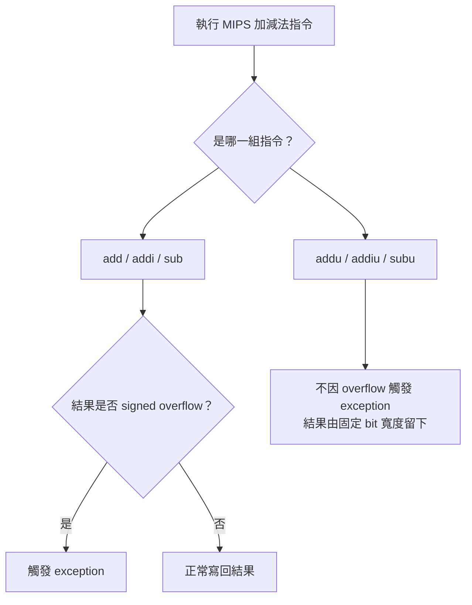
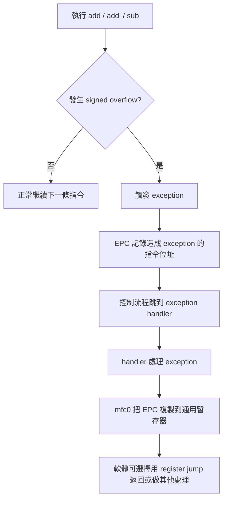
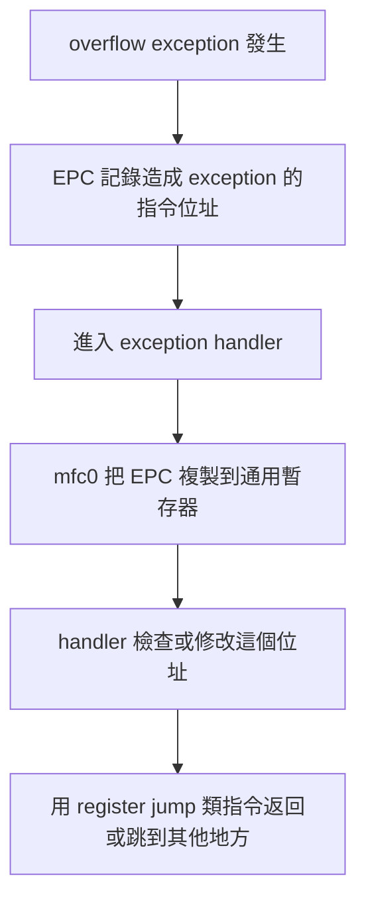
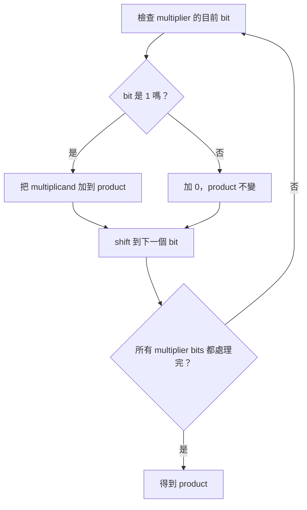
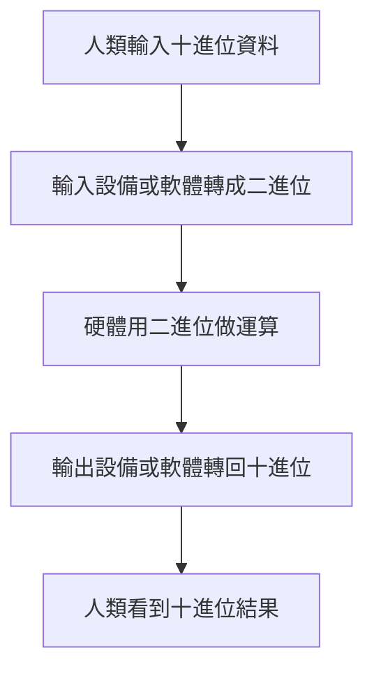
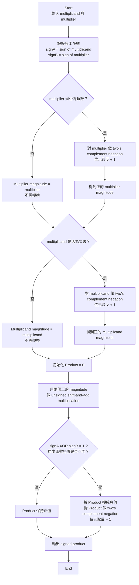
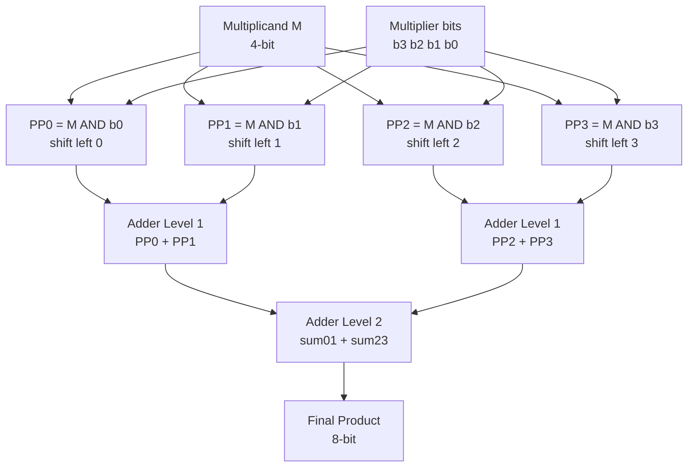

# ch 3


## 第 3 章到底在處理什麼問題？

這章的主問題是：

**電腦只會操作固定長度的 bit pattern(位元樣式)，那它要怎麼可靠地表示數字、做加減乘除、處理小數，並把這些運算做成硬體與指令？**

生活化地說，電腦像是一台只能用固定格子填 0/1 的計算機。
假設只有 4 個格子，那最多只有 16 種圖案：

`0000` 到 `1111`

但問題來了：

同一個圖案可以有不同解讀。
例如 `1111`：

* 當作 Unsigned Integer(無號整數)：它是 15。
* 當作 Two’s Complement Signed Integer(二補數有號整數)：它是 -1。

所以這章不是只教「二進位怎麼算」，而是在教：

1. **Representation(表示法)**：同一串 bits 要怎麼解讀成數字？
2. **Algorithm(演算法)**：加、減、乘、除怎麼用 bit operations 完成？
3. **Hardware(硬體)**：這些演算法要怎麼做成 adder(加法器)、multiplier(乘法器)、divider(除法器)？
4. **ISA Impact(對指令集的影響)**：例如 MIPS 為什麼有 `add`、`addu`、`mult`、`mflo`、`mfhi` 這些不同指令？


## 二補數讓「減法」變成「加法」

Two’s Complement(二補數) 最核心的目的不是讓你多背一種轉換法，而是解決硬體設計問題：

**CPU 已經有 adder(加法器)，那可不可以不要再做一套很麻煩的 subtractor(減法器)？**

答案是可以。方法是：

```text
A - B = A + (-B)
```

所以問題變成：
我們要怎麼用固定 n-bit 的 bit pattern 表示 `-B`？

Two’s Complement(二補數) 的規則是：

```text
Step 1: invert all bits
Step 2: add 1
```

也就是：

```text
2's complement = 1's complement + 1
```

講義 PDF page 11 也是先列出 1 補數，再說「再加上 1」得到 2 補數。

---

### 先看一個 8-bit 例子：10 變成 -10

`10₁₀` 的 8-bit binary 是：

```text
00001010
```

Step 1：取 1’s complement(一補數)，也就是每個 bit 反相：

```text
11110101
```

Step 2：加 1：

```text
11110101
+       1
--------
11110110
```

所以在 8-bit Two’s Complement 中：

```text
11110110 = -10
```

這就是講義 PDF page 13 裡 `88 - 10` 會使用 `-10` 的二補數表示的原因。

---

### 用二補數做 88 - 10

直接想是：

```text
88 - 10 = 78
```

硬體想的是：

```text
88 + (-10)
```

8-bit 表示：

```text
  01011000   =  88
+ 11110110   = -10
-----------
1 01001110
```

因為我們固定只看 8-bit，所以最左邊多出來的 carry-out 丟掉：

```text
01001110 = 78
```

這裡有一個重要觀念：
**丟掉最高位 carry-out 不等於「隨便忽略錯誤」；它是在固定 n-bit arithmetic(固定寬度算術) 的規則下，只保留 n 個 bits。** 社群討論中也常提醒，Two’s Complement 裡 carry-out 和 signed overflow(有號滿溢) 不是同一件事；有號滿溢要看結果是否超出可表示範圍，或同號相加卻得到相反符號。([Stack Overflow][1])

---

### 為什麼「反相加 1」會得到負數？

用 4-bit 比較直觀。

假設：

```text
x = 0011 = 3
```

先反相：

```text
1100
```

`0011 + 1100 = 1111`

也就是所有 bits 都變成 1。
再加 1：

```text
1111 + 1 = 1 0000
```

固定 4-bit 只留下：

```text
0000
```

所以：

```text
0011 + 1101 = 0000   固定 4-bit 下
```

因此：

```text
1101 可以代表 -3
```

核心直覺是：

**一個數加上自己的二補數，會在固定 bit 寬度下回到 0。**

這也是講義 PDF page 12「二補數的秘密」在展示的重點：原數加上一補數會得到全 1；再加 1 後會回到全 0。

---

### 快速技巧：從右往左找第一個 1


講義 PDF page 14 給了一個常用 shortcut(捷徑)：
計算二補數時，從右邊開始掃：

1. 從最右邊開始，直到遇到第一個 `1`，包含這個 `1` 之前都照抄。
2. 第一個 `1` 左邊的所有 bits 反相。

例子：

```text
原數：10101000
二補：01011000
```

檢查方式：

* 從右邊開始：`000` 照抄
* 第一個 `1` 照抄
* 左邊 `1010` 反相成 `0101`

所以得到：

```text
01011000
```

---

### 常見錯法

第一個錯法：只反相，忘記加 1。
這只得到 1’s complement(一補數)，不是 Two’s Complement(二補數)。

第二個錯法：沒有固定 bit width(位寬)。
例如 `1010` 到底是 4-bit 的 -6，還是 8-bit 的 +10？沒有指定位寬與解讀方式，答案不完整。

第三個錯法：把 carry-out 當成一定是 overflow。
Two’s Complement 中，最高位 carry-out 可能被丟掉，但 signed overflow 要看符號與可表示範圍。Stack Overflow 上的常見討論也指出，兩個正數相加變負數，或兩個負數相加變非負數，才是典型 signed overflow 判斷。([Stack Overflow][2])


## Instruction Set Architecture, ISA(指令集架構) 對 overflow(滿溢) 的政策

### 會檢查 overflow 並呼叫 exception 的指令

`add`、`addi`、`sub` 這組指令，重點是 checked arithmetic(會檢查的算術)。
當結果超出 32-bit two’s complement signed integer(32 位元二補數有號整數) 可表示範圍時，它們會觸發 exception(例外)。

也就是：

* `add`：register + register，檢查 overflow
* `addi`：register + immediate，檢查 overflow
* `sub`：register - register，檢查 overflow

這組適合「程式希望系統幫我抓錯」的情況。

---

### 不呼叫 exception 的指令

`addu`、`addiu`、`subu` 這組指令，重點是 unchecked arithmetic(不檢查的算術)。
==就算產生 overflow，也不觸發 exception== ；硬體結果會像固定寬度位元運算一樣留下可表示的部分。

也就是：

* `addu`：register + register，不因 overflow exception
* `addiu`：register + immediate，不因 overflow exception
* `subu`：register - register，不因 overflow exception

常見陷阱：
`addu` 的 `u` 很容易被理解成「只能做 unsigned number(無號數)」。但在這頁考點裡，更重要的是「不呼叫 overflow exception」。也就是說，考試問差異時，不要只寫「一個 signed、一個 unsigned」，要寫出「是否偵測／觸發 overflow exception」。

---

### 用一張流程圖記住



---

### 最短記法

`add/addi/sub`：overflow → exception
`addu/addiu/subu`：overflow → no exception

中文理解版：
MIPS 提供兩套加減法指令；一套幫你抓 signed overflow，另一套不抓，讓軟體自己負責。

英文考試版：

`add`, `addi`, and `sub` raise an exception on overflow, while `addu`, `addiu`, and `subu` do not raise an overflow exception. The key distinction is overflow trapping behavior, not merely whether the programmer thinks of the operands as signed or unsigned.


### Overflow 是啥？

overflow(滿溢) 不是單純「位元超過」；它是「數學上的正確結果超出目前資料格式可表示的範圍，所以固定位寬留下來的 bit pattern 已經不能代表原本想要的數值」。

### 兩種指令都會判斷 Overflow 嗎？

對於這兩種指令，底層硬體通常可以產生 overflow 訊號；但在 MIPS ISA 語意上，add/addi/sub 會把 signed overflow 轉成 exception，addu/addiu/subu 則忽略 overflow，不產生 exception。


### 差別到底是啥？

add/addi/sub：在發生 signed overflow(有號滿溢) 時會呼叫 exception(例外)。
addu/addiu/subu：即使發生 overflow，也不會呼叫 overflow exception。


## Exception Handling — CPU 如何知道是哪條指令造成 overflow？

第 19 頁先說：`add/addi/sub` 發生 signed overflow(有號滿溢) 時會觸發 exception。
第 20 頁接著問：**觸發 exception 之後，CPU／作業系統要怎麼知道是哪一條指令出事？**

生活化例子：
想像你在跑一長串指令，像老師在批改一整疊考卷。某一題爆掉了，老師不能只知道「有錯」，還要知道「是哪一題錯」。EPC 就像是那個「錯題頁碼標籤」。

---

### EPC 是什麼？

`EPC(exception program counter，例外程式計數器)` 是一個特殊暫存器。
它的工作是：

**當 exception 發生時，記錄造成 exception 的指令位址。**

所以如果某條 `add` 指令發生 overflow，MIPS 會跳去 exception handler，同時 EPC 會保留「剛剛是哪條指令造成 exception」。

這很重要，因為 exception handler 處理完之後，軟體可能需要：

1. 回到原本出事的地方重新處理。
2. 跳過那條指令。
3. 印出錯誤訊息或終止程式。
4. 做某種補救動作。

沒有 EPC，exception handler 就只知道「有錯」，但不知道「錯在哪」。

---

### `mfc0` 是什麼？

`mfc0` 是 `move from system control`，也常理解成 `move from coprocessor 0`。
在這頁講義裡，我們先用最小必要理解：

**`mfc0` 可以把 EPC 這種系統控制暫存器的內容，複製到一般通用暫存器。**

也就是：

```mips
mfc0  general_register, EPC
```

概念上是在做：

```text
general_register = EPC
```

重點：
`mfc0` 本身不是「返回」指令。它只是把 EPC 的值拿出來。
真的要回去，還需要後續用 jump register 類的控制流程，例如講義說的「經由暫存器跳躍指令返回造成例外的指令」。

---

### 整個流程怎麼串起來？



把它想成一句話：

**overflow exception 發生時，EPC 記住「哪條指令出事」，`mfc0` 讓軟體把這個位址讀出來使用。**

---

### 常見錯法

第一個錯法：
把 EPC 說成「存 overflow 的結果」。
錯。EPC 存的是造成 exception 的 instruction address(指令位址)，不是運算結果。

第二個錯法：
把 `mfc0` 說成「處理 overflow 的指令」。
不精準。`mfc0` 是把 EPC 從系統控制暫存器複製到通用暫存器，讓 exception handler 的軟體能使用那個位址。

第三個錯法：
以為 exception handler 自動知道要回哪裡。
不完整。它需要 EPC 這類資訊來知道原本發生 exception 的位置。

---

### 四件套暫存筆記

中文理解版：
MIPS 發生 overflow exception 時，會用 EPC 記錄造成例外的指令位址；`mfc0` 可以把 EPC 的內容搬到一般暫存器，讓軟體決定如何返回或處理。

英文考試版：
When an overflow exception occurs in MIPS, the EPC register stores the address of the instruction that caused the exception. The `mfc0` instruction can copy the EPC value into a general-purpose register so that software can use it to return to or handle the faulting instruction.

最短記法：
`EPC = faulting instruction address`
`mfc0 = copy EPC to GPR`

常見錯法：
EPC 不是存運算結果；`mfc0` 不是 exception handler 本身；`mfc0` 只是把系統控制暫存器的值搬出來。

---

### 本輪練習題

請用中文或英文回答 1～5。

1. What problem does the EPC register solve when an overflow exception occurs in MIPS?
   [Source: ch3.pdf／PDF viewer page 20]

2. In the lecture slide, what information is stored in the EPC register? Be precise: is it the overflow result, the exception type, or the instruction address?
   [Source: ch3.pdf／PDF viewer page 20]

3. Explain the role of `mfc0` in the exception-handling process described on the slide.
   [Source: ch3.pdf／PDF viewer page 20]

4. A student says: “When overflow happens, `mfc0` fixes the overflow and returns the correct arithmetic result.” Identify what is wrong with this statement.
   [Generated: based on ch3.pdf／PDF viewer page 20]

5. Connect page 19 and page 20 in one explanation: What happens when a MIPS `add` instruction causes signed overflow, and why is EPC needed afterward?
   [Source: ch3.pdf／PDF viewer pages 19–20]


[1]: https://benhadid.github.io/l2ado/docs/en/Exceptions?utm_source=chatgpt.com "Exception mechanisms in MIPS - Computer Design / Fall 2025"


### 為何要 mfc0 複製到一般暫存器

#### 直接原因

因為 `EPC(exception program counter，例外程式計數器)` 是**特殊控制暫存器**，一般程式的普通指令不方便直接拿它來做運算、判斷或跳躍；所以要用 `mfc0` 把 EPC 的值搬到 `general-purpose register(通用暫存器)`，讓軟體可以使用它。

講義第 20 頁的說法是：`mfc0` 用來將 EPC 複製到通用暫存器，讓 MIPS 軟體可以經由 register jump(暫存器跳躍指令) 選擇返回造成 exception 的指令。

---

#### 生活化理解

把 `EPC` 想成「事故紀錄本」：它記著哪一條指令造成 exception。
但 exception handler(例外處理程式) 真正要做事時，不能只把紀錄本放在櫃子裡，它要把地址抄到工作桌上。

這個「抄到工作桌上」就是 `mfc0`。

* `EPC`：特殊位置，存出事指令位址。
* `mfc0`：把 EPC 的內容讀出來。
* 通用暫存器：軟體真正方便操作的地方。
* register jump：可以用通用暫存器裡的位址決定跳回哪裡。

---

#### 為什麼不直接用 EPC 跳回去？

在這張投影片的模型裡，重點是：**返回動作需要一般指令流程配合，而一般 jump register 類指令使用的是通用暫存器中的位址。**

所以流程是：


### register jump 是指 J 型指令嗎

不是。這裡講義第 20 頁的 **register jump(暫存器跳躍)** 比較像是指 `jr` / `jalr` 這類「跳到某個暫存器裡存的位址」的指令，不是一般說的 J-type instruction(J 型指令)。講義原文是：`mfc0` 把 EPC 複製到通用暫存器，讓 MIPS 軟體可以經由 register jump 返回造成 exception 的指令。

---

#### 差異一看就懂

| 類型            | 例子                             | 目標位址從哪裡來？                    | 指令格式                         |
| ------------- | ------------------------------ | ---------------------------- | ---------------------------- |
| J-type jump   | `j label`, `jal label`         | 指令裡面的 target address / label | J-type                       |
| register jump | `jr $t0`, `jr $ra`, `jalr $t0` | 暫存器裡面的位址                     | 通常是 R-type / register format |

MIPS 官方手冊對 `JR rs` 的描述是：跳到某個 register 裡的 instruction address，操作概念是 `PC ← GPR[rs]`；格式欄位也顯示它用 `SPECIAL` opcode 與 function code，不是 J-type 的 26-bit target 欄位。([studylib.net][1]) 其他教學資料也直接列出 `j` 是 J Type，而 `jr` 是 R Type。([維基教科書][2])

---

#### 放回第 20 頁流程

第 20 頁的意思是：

1. overflow exception 發生。
2. 硬體把造成 exception 的指令位址放進 `EPC`。
3. exception handler 用 `mfc0` 把 `EPC` 複製到 general-purpose register(通用暫存器)。
4. 軟體可以用 `jr $某暫存器` 這種 register jump 跳回去或跳到調整後的位置。

所以這裡的 register jump 強調的是：

**target address(目標位址) 在 register 裡，不是寫死在 J-type 指令的 target field 裡。**

---

#### 最短記法

`j label`：J-type，跳到指令內指定的 label/target。
`jr $reg`：register jump，跳到 `$reg` 裡存的位址，通常屬於 R-type。

所以你的問題答案是：

**register jump 不是指 J 型指令；它是 jump 類功能，但格式通常是 R-type，例如 `jr`。**

【學習進度摘要｜精簡版】
目前主線：ch3.pdf／第 3 章／3.2 加法與減法
講義位置：PDF viewer page 20／投影片頁碼 20
目前知識點：EPC、`mfc0`、register jump 的分工
狀態：已釐清 register jump 不是 J-type，而是像 `jr` 這類用暫存器內位址跳躍的指令
待回補：第 20 頁練習題 1～5 尚未作答；考古題／作業題目前未提供
下一步：回到第 20 頁練習題，確認你能完整說出 EPC → `mfc0` → register jump 的流程

[1]: https://studylib.net/doc/10957651/mips%C2%AE-architecture-for-programmers-volume-ii-a--the-mips3...?utm_source=chatgpt.com "MIPS32 Instruction Set Technical Manual for Programmers"
[2]: https://en.wikibooks.org/wiki/MIPS_Assembly/Control_Flow_Instructions?utm_source=chatgpt.com "MIPS Assembly/Control Flow Instructions - Wikibooks, open books for an open world"


## Saturating Operation — overflow 時不要繞回，而是卡在最大或最小值

!!! danger "PEICD"
    英文：Saturating Operation (飽和運算)

前面我們講過一般 fixed-width arithmetic(固定位寬算術) 發生 overflow 時，常見結果可能會變成看起來「繞回去」的 bit pattern。

例如 4-bit unsigned(無號數)：

15 + 1 的真實數學結果是 16。
但 4-bit unsigned 只能表示 0 到 15。
一般 wraparound(繞回) 結果會變成 0。

saturating operation(飽和運算) 的想法不一樣：

**結果太大，就卡在最大值；結果太小，就卡在最小值。**

所以同樣 4-bit unsigned：

15 + 1 不會變成 0。
它會被設為 15。

生活化例子：
音量最大只能到 100。你現在音量 95，再加 10。一般數學是 105，但系統不會讓音量變成奇怪的 5，也不會報錯；它直接卡在 100。這就是 saturating 的精神。

---

### 三種 overflow 處理方式對比

| 處理方式                         | overflow 時做什麼            | 例子：4-bit unsigned 的 15 + 1 |
| ---------------------------- | ------------------------ | -------------------------- |
| exception                    | 停下來，交給 exception handler | 觸發例外                       |
| wraparound / ignore overflow | 留下固定位寬結果(一般的 overflow，在硬體固定位元運算裡，若不做 exception、不做 saturation，常見結果就是 wraparound，也就是只留下低 n bits。)                 | 0000，也就是 0                 |
| saturating operation         | 卡在最大或最小可表示值 (不會觸發 saturating operation)             | 1111，也就是 15                |

這頁的 saturating operation 和第 19 頁的 `addu` 不一樣：

`addu`：overflow ignored，結果照 bit pattern 留下。
saturating operation：overflow 時把結果設成最大正值或最負值。

## Binary Multiplication — 為什麼乘法可以變成 shift-and-add？

二進位乘法比十進位乘法簡單很多，因為二進位每一位只可能是 `0` 或 `1`。

十進位乘法要背很多結果，例如 `7 × 8 = 56`。
但二進位只有四種基本規則：

| 規則      |  結果 |
| ------- | --: |
| `0 × 0` | `0` |
| `0 × 1` | `0` |
| `1 × 0` | `0` |
| `1 × 1` | `1` |

所以乘法的核心變成：

**看 multiplier(乘數) 的每一個 bit；如果該 bit 是 1，就把 multiplicand(被乘數) 放到對應位置；如果該 bit 是 0，就放 0；最後把所有 partial products(部分乘積) 加起來。**

外部資料也用同樣方式說明 binary multiplication(二進位乘法)：每個 multiplier bit 若為 1，就加入 shifted multiplicand；若為 0，就加入 0；最後把 partial products 相加。這和講義第 29–36 頁的展示一致。([ChipVerify][1])

---

### 用講義例子看：`1000₂ × 1001₂`

講義第 22 頁開始的例子是：

```text
   1000
×  1001
```

我們先看數值：

`1000₂ = 8₁₀`
`1001₂ = 9₁₀`
所以結果應該是：

`8 × 9 = 72₁₀ = 1001000₂`

但重點不是直接換十進位算，而是理解二進位乘法流程。

---

### 逐位元看 multiplier

這裡：

* `1000` 是 multiplicand(被乘數)
* `1001` 是 multiplier(乘數)
* 最後答案是 product(乘積)

從 multiplier 的最低位開始看：

```text
multiplier = 1001
             ↑  ↑
             高位 低位
```

由右往左看：

#### 第 0 位是 `1`

所以放一份 multiplicand：

```text
1000
```

#### 第 1 位是 `0`

所以放 0，並往左 shift 一格：

```text
0000
```

#### 第 2 位是 `0`

所以再放 0，並往左 shift 兩格：

```text
0000
```

#### 第 3 位是 `1`

所以放一份 multiplicand，但要往左 shift 三格：

```text
1000
```

整體可以想成：

```text
       1000
×      1001
------------
       1000      ← multiplier bit 0 是 1
      0000       ← multiplier bit 1 是 0
     0000        ← multiplier bit 2 是 0
+   1000         ← multiplier bit 3 是 1
------------
    1001000
```

---

### 為什麼要 shift？

因為每個 bit 的位置代表不同的 power of 2(2 的次方)。

`1001₂` 其實是：

```text
1001₂ = 1×2³ + 0×2² + 0×2¹ + 1×2⁰
```

所以：

```text
1000₂ × 1001₂
= 1000₂ × (2³ + 1)
= (1000₂ << 3) + 1000₂
= 1000000₂ + 1000₂
= 1001000₂
```

也就是說：

**shift left(左移) 不是裝飾，它代表乘上 2 的次方。**

---

### 這一段和硬體有什麼關係？

這一段是後面乘法器硬體的基礎。

硬體不需要真的「背乘法表」。它只需要重複做三件事：



所以乘法器後面會變成一個很典型的程序：

**check bit → add or not add → shift → repeat**

---

### 常見錯法

第一個錯法：
把 multiplier 和 multiplicand 搞混。
雖然數學上 `A × B = B × A`，但硬體流程裡，multiplier 是被檢查 bit 的那個數；multiplicand 是被加進 product 的那個數。

第二個錯法：
看到 multiplier bit 是 0 時，以為要停止。
不是。bit 是 0 只代表該列 partial product 是 0，下一個 bit 還是要繼續看。

第三個錯法：
忘記 shift。
如果 multiplier 的高位是 1，不能只加原本的 multiplicand，必須加 shifted multiplicand。

第四個錯法：
以為乘法結果還是 n bits。
兩個 n-bit 數相乘，結果最多需要 2n bits。這就是後面 MIPS 乘法會用 `Hi` 和 `Lo` 放 64-bit product 的原因，但這是後面頁面才會正式處理。

---

### 四件套暫存筆記

中文理解版：
二進位乘法就是看 multiplier 的每一個 bit；bit 為 1 就把 shifted multiplicand 加進 product，bit 為 0 就加 0，最後把所有 partial products 加起來。

英文考試版：
Binary multiplication uses a shift-and-add method. For each bit of the multiplier, if the bit is 1, the shifted multiplicand is added to the product; if the bit is 0, zero is added. The sum of all partial products gives the final product.

最短記法：
`multiplier bit = 1 → add shifted multiplicand`
`multiplier bit = 0 → add 0`

常見錯法：
不要忘記 shift；不要把 bit = 0 當成停止；不要以為 n-bit × n-bit 一定仍是 n-bit。


## Binary vs Decimal Hardware — 為什麼硬體偏愛二進位？

第 37–38 頁在回答一個很核心的問題：

**既然人習慣用十進位，為什麼計算機硬體內部反而用二進位？**

答案不是「二進位比較高級」，而是：

**二進位比較符合硬體元件的自然狀態。**

早期電子計算機使用很多電子管。電子管這類元件很適合做成兩種狀態：

* on / off
* high voltage / low voltage
* 有電流 / 沒電流
* 1 / 0

這就是講義說的 `all-or-none(全或無)`。
硬體最容易穩定區分兩種狀態，所以二進位自然適合硬體。

---

### 為什麼十進位對硬體比較麻煩？

十進位每一位有 10 種可能：

0, 1, 2, 3, 4, 5, 6, 7, 8, 9

這代表硬體要可靠地分辨 10 種狀態。
但二進位每一位只有 2 種可能：

0, 1

這對硬體比較簡單。

生活化例子：
如果你要設計一盞燈來傳訊息，最簡單就是「亮」和「不亮」。
如果你要它精準表示 10 種亮度，硬體設計和錯誤判斷就麻煩很多。

所以二進位不是因為人類比較愛看，而是因為硬體比較容易做、比較穩定。

---

### 為什麼二進位可以簡化乘法？

十進位乘法需要乘法表。
例如：

`7 × 8 = 56`
`9 × 6 = 54`

每一位相乘都可能產生不同結果。

但二進位乘法只有：

| binary digit multiplication | result |
| --------------------------- | -----: |
| `0 × 0`                     |    `0` |
| `0 × 1`                     |    `0` |
| `1 × 0`                     |    `0` |
| `1 × 1`                     |    `1` |

所以每次看 multiplier bit 時，只有兩種情況：

* bit = 0 → 加 0
* bit = 1 → 加 shifted multiplicand

這就是前面你已經練過的 `shift-and-add(移位加法)`。工程實作教材也用同樣方式說明：binary multiplication 每一列 partial product 不是 0，就是一份位移後的 multiplicand，因此比 decimal long multiplication 更適合硬體。([ChipVerify][2])

---

### 那為什麼人還是用十進位？

講義第 38 頁也提醒：**十進位才是適合人使用的表示法。**

人類日常使用：

* 10 元、100 元
* 2026 年
* 3.14
* 80 分

這些都是十進位比較直覺。

所以真正的系統分工是：



一句話：

**人喜歡十進位，硬體喜歡二進位，所以 I/O 負責轉換。**

---

### 常見錯法

第一個錯法：
說「二進位比十進位數學上更正確」。
不對。它們都能表示數字，只是硬體實作成本不同。

第二個錯法：
說「十進位不能做電腦」。
不對。講義就提到 ENIAC 採用十進位。更精準是：十進位硬體通常較複雜，而二進位更符合 all-or-none 電子元件。

第三個錯法：
以為二進位只影響儲存，不影響運算。
不對。二進位也簡化了乘法與除法，尤其是乘法可以變成 shift-and-add。

---

### 四件套暫存筆記

中文理解版：
二進位適合硬體，因為電子元件容易表示兩種狀態；二進位乘法也比較簡單，multiplier bit 只會決定加 0 或加 shifted multiplicand。十進位適合人使用，所以輸入輸出需要做十進位與二進位轉換。

英文考試版：
Binary arithmetic is preferred in hardware because electronic devices naturally represent two stable states. Binary multiplication is also simpler than decimal multiplication because each multiplier bit is either 0 or 1, so each partial product is either zero or a shifted copy of the multiplicand. Decimal notation is more convenient for humans, so I/O systems convert between decimal and binary.

最短記法：
**hardware likes binary; humans like decimal; I/O converts.**

常見錯法：
不要說十進位不能做電腦；要說二進位更適合硬體、更能簡化運算。


### ENIAC 和 EDVAC 是啥

#### 1\. ENIAC 是什麼？

`ENIAC(Electronic Numerical Integrator and Computer，電子數值積分器與計算機)` 是早期的大型電子計算機，約 1945–1946 年完成，主要為美國軍方計算 artillery firing tables(砲彈射表) 之類的大量數值問題。它很有名，因為它是早期 electronic general-purpose digital computer(電子通用數位計算機) 的代表。Britannica 也提到 ENIAC 安裝於賓州大學 Moore School，使用大量 vacuum tubes(真空管)，而且原本目標和砲彈射表計算有關。[Encyclopedia Britannica](https://www.britannica.com/technology/computer/ENIAC?utm_source=chatgpt.com)

在我們這張投影片的重點不是要背 ENIAC 的完整歷史，而是：

**ENIAC 採用 decimal arithmetic(十進位運算)。**

也就是說，它比較接近人類日常用的 0～9 十進位數字系統。

---

#### 2\. EDVAC 是什麼？

`EDVAC(Electronic Discrete Variable Automatic Computer，電子離散變數自動計算機)` 是 ENIAC 之後的早期電子計算機之一。它常被拿來和 ENIAC 對比，因為 EDVAC 的設計採用 binary(二進位)，而且和 stored-program computer(儲存程式計算機) 的概念密切相關。資料也整理成：EDVAC 是 ENIAC 的 successor(後繼者) 之一，和 ENIAC 不同，它是 binary rather than decimal(二進位而非十進位)，並設計為 stored-program computer。[維基百科](https://en.wikipedia.org/wiki/EDVAC?utm_source=chatgpt.com)

在這張投影片的重點是：

**EDVAC 採用 binary arithmetic(二進位運算)。**

也就是硬體內部用 0 / 1 來表示與運算。


## Hardware Multiplication Flow — 為什麼不要先列完所有 partial products？

!!! danger "PEICD"
    英文：
    Multiplication 乘法
    Multiplicand 被乘數    (and：來自 Latin gerundive，表示「將被……的」，被動型態)
    Multiplier 乘數

前面你做的手算乘法是這樣：

1. 先把每一列 partial product(部分乘積) 都寫出來。
2. 最後一次把所有 partial products 加總。

這很適合人手算，因為版面上可以排整齊。
但硬體不喜歡「先列一堆東西再全部加」。硬體更適合重複做固定的小步驟。

所以講義把流程改成：

**Product 一開始是 0；每次看一個 multiplier bit，若需要就把目前的 multiplicand 加到 Product，然後 multiplicand 左移，繼續下一輪。**

生活化例子：
你不用先把所有購物明細都寫完再一次總和；你可以每掃一個商品，就把金額加到目前總額。這個「目前總額」就是 Product。

---

### 從手算版改成硬體版

手算版像這樣：

```text
先產生所有 partial products
再全部相加
```

硬體版更像這樣：

```text
Product = 0
每一輪：
  看 multiplier 目前 bit
  如果 bit = 1，Product = Product + Multiplicand
  如果 bit = 0，Product 不變
  Multiplicand 左移一位
  Multiplier 移到下一個 bit
```

這其實還是你前面學過的 shift-and-add，只是角度不同：

| 角度   | 做法                                                     |
| ---- | ------------------------------------------------------ |
| 人手算  | 先列出所有 partial products，再加總                             |
| 硬體流程 | 每產生一個 partial product，就立刻加進 Product                    |
| 共同核心 | multiplier bit = 1 就加 shifted multiplicand；bit = 0 就不加 |

ChipVerify 的二進位乘法教學也用相同的核心演算法：逐 bit 檢查 multiplier，bit 為 1 就寫入／加入 multiplicand，bit 為 0 就寫 0，每列向左 shift，最後加總。([ChipVerify][2])

---

### 為什麼 Multiplicand 要左移？

因為我們每次往 multiplier 的更高位走一格，位權就乘上 2。

例如 multiplier 的：

* bit 0 代表 `2^0`
* bit 1 代表 `2^1`
* bit 2 代表 `2^2`
* bit 3 代表 `2^3`

所以每往左看下一個 multiplier bit，multiplicand 也要左移一位，代表乘上 2。

---

### 常見錯法

第一個錯法：
以為 Product 一開始就是 multiplicand。
不對。硬體流程中 Product 一開始是 0，之後逐輪累加。

第二個錯法：
以為每一輪都一定要加 multiplicand。
不對。只有當目前 multiplier bit 是 1 時才加；bit 是 0 時 Product 不變。

第三個錯法：
忘記 multiplicand 每輪要左移。
不左移就會把不同位權的 partial product 全部加在同一個位置，結果會錯。


## Multiplier Hardware Structure — shift-and-add 要用哪些硬體元件實作？


前面你已經會「流程」。現在要把流程對應到硬體元件。

一個硬體乘法器最少要能做四件事：

| 需求              | 對應硬體                            |
| --------------- | ------------------------------- |
| 記住目前被加的數        | `Multiplicand register(被乘數暫存器)` |
| 記住還沒檢查完的乘數 bits | `Multiplier register(乘數暫存器)`    |
| 記住目前累加到哪裡       | `Product register(乘積暫存器)`       |
| 需要時做加法          | `Adder / ALU(加法器／算術邏輯單元)`       |

所以這一段不是在換一個新乘法規則，而是在回答：

**剛剛那個 shift-and-add 流程，如果真的做成硬體，需要哪些 register 和控制動作？**

---

### 每一輪硬體做什麼？

!!! danger "PEICD"
    least significant bit ： LSB，

最小流程可以記成：

```text
1. Check the least significant bit of the Multiplier register.
2. If it is 1, add the Multiplicand register to the Product register.
3. Shift the Multiplicand register left by 1 bit.
4. Shift the Multiplier register right by 1 bit.
5. Repeat for N cycles.
```

中文理解：

1. 看 `Multiplier register` 的最低位。
2. 如果最低位是 `1`，代表這一輪要把目前的 `Multiplicand` 加進 `Product`。
3. 如果最低位是 `0`，Product 不變。
4. `Multiplicand` 左移，準備對應下一個更高位權。
5. `Multiplier` 右移，讓下一個 multiplier bit 進到最低位，方便下一輪檢查。

---

### 常見錯法

第一個錯法：
以為 `Multiplier register` 左移。
這個版本的流程是：**Multiplier 右移**，因為每輪都要檢查最低位。

第二個錯法：
以為 `Multiplicand register` 右移。
這個版本的流程是：**Multiplicand 左移**，因為越高位的 multiplier bit 對應越大的 `2^n` 位權。

第三個錯法：
以為每輪都會加。
錯。只有 multiplier LSB = 1 時才加。


## Multiplier Optimization 1 — 為什麼加法和移位可以並行？


原本的想法像這樣：

1. 先做加法。
2. 再讓 multiplicand 左移。
3. 再讓 multiplier 右移。

所以一輪要 3 個 cycle。

但硬體裡的 register(暫存器) 通常不是你一改輸入，它的內容就馬上改掉；而是在 clock edge(時脈邊緣) 來的時候，才一起更新內容。

生活化例子：
像老師收作業。你可以在上課時間同時讓大家寫不同部分，但真正「收上來記錄成績」是在鐘響那一刻一起收。暫存器也是類似：加法器可以先算好結果，shift 的輸入也可以先準備好，等時脈邊緣來時一起寫入。

所以優化 1 的核心是：

**加法結果、multiplicand 左移結果、multiplier 右移結果，可以在同一個 cycle 裡準備好，然後同一個 clock edge 一起更新。**

這樣流程就從：

```text
add → shift left → shift right
三個 cycle
```

變成：

```text
add / shift left / shift right 並行
一個 cycle
```

---

### 這個優化沒有改變乘法邏輯

很重要：
優化 1 不是改變乘法答案，而是改變硬體排程。

原本是「一件做完再做下一件」。
優化後是「能同時準備的事情一起準備，到 clock edge 一起更新」。

所以結果一樣，但速度更快。

---

### 常見錯法

第一個錯法：
以為優化後不用檢查 multiplier LSB。
錯。仍然要檢查 LSB，LSB = 1 才做有效加法。

第二個錯法：
以為優化後不用 shift。
錯。multiplicand 仍左移，multiplier 仍右移，只是和加法並行。

第三個錯法：
以為並行代表 register 內容會在 cycle 中間一直變。
不精準。更好的理解是：cycle 中間組合邏輯可以先算，register 在 clock edge 才更新。


## Improved Multiplication Hardware — 為什麼乘數和乘積可以共用暫存器？

前面的版本比較直覺，但硬體有點浪費。它把 multiplicand、multiplier、product 分開放，而且 product 通常要能容納 2n-bit 結果。

改良版本的核心觀察是：

**乘法進行時，multiplier 的 bits 會一個一個被消耗掉；被用過的 multiplier bits 其實不需要再保留。**

所以那塊空出來的位置，可以慢慢拿來放 product 的低位部分。這就是「multiplier 與 product 共用 register」的直覺。

生活化例子：
你有一張待辦清單。每完成一項，就把那一格劃掉。既然那格已經不用保存原本任務，就可以在旁邊寫上目前累積成果。這不是改變工作內容，而是更省紙。

---

### 這個改良到底省在哪？

改良版主要省兩個地方：

!!! danger "PEICD"

    | 硬體項目                    | 原本版本                       | 改良版本                    | 為什麼可以省                                                     |
    | ----------------------- | -------------------------- | ----------------------- | ---------------------------------------------------------- |
    | `Adder / ALU`           | 2n-bit                     | n-bit                   | 每輪只把 multiplicand 加到 product 高半部                           |
    | `Multiplicand register` | 2n-bit，因為 multiplicand 要左移 | n-bit，固定不左移             | 改良版改成 product register 右移，所以 multiplicand 不必用 2n-bit 空間來左移 |
    | `Multiplier register`   | 獨立 n-bit                   | 併入 product register 右半部 | multiplier bits 被逐步消耗，可以和 product 共用空間                     |
    | `Product register`      | 2n-bit                     | 仍是 2n-bit               | 最後仍要保存完整 2n-bit product，不是縮半                               |


所以它不是讓乘法變成「不用加」或「不用移位」，而是讓同樣的 shift-and-add 流程用更少硬體完成。

---

### 和前一個優化的差異

| 項目   | Optimization 1                | Improved hardware version                 |
| ---- | ----------------------------- | ----------------------------------------- |
| 主要目標 | 減少 clock cycles               | 減少硬體資源                                    |
| 方法   | add、left shift、right shift 並行 | adder/register 寬度縮小，multiplier/product 共用 |
| 乘法邏輯 | 不變                            | 不變                                        |
| 重點   | 速度                            | 硬體面積／資源                                   |

一句話：

**Optimization 1 是把時間壓短；improved hardware 是把硬體用少。**

---

### 常見錯法

第一個錯法：
以為改良版本改變了乘法規則。
錯。它仍然是 shift-and-add，只是資料放的位置更省。

第二個錯法：
以為 multiplier 和 product 一開始就是同一個值。
錯。它們是共用硬體空間，不是數學意義上相等。

第三個錯法：
以為 adder 縮半代表只能算一半答案。
錯。完整 product 仍然會產生，只是每輪只需要對相關半部做加法。


### 可不可以給我一個 9*10 小舉例，比較硬體優化前後的資料變化流程

可以。我們用 **4-bit unsigned** 小例子：

`9 × 10`

也就是：

`9 = 1001₂`
`10 = 1010₂`
正確答案：

`90₁₀ = 01011010₂`

這剛好可以看出「優化前」和「改良版硬體」的差異。講義第 64–65 頁的原始流程是檢查 `Multiplier` 最低位、必要時把 `Multiplicand` 加到 `Product`，再讓 `Multiplicand` 左移、`Multiplier` 右移；第 74–75 頁則說改良版會把加法器與部分暫存器縮成一半寬，並讓 `Multiplier` 與 `Product` 共用 register。  外部教材也用相同方式說明 refined multiplication hardware：把 multiplier 放在 product register 的右半部，並讓 product register 右移，最後 product register 中形成完整乘積。([studylib.net][1])

---

#### 優化前：三個東西分開放

優化前比較直覺：

* `Multiplicand register` 放被乘數，而且每輪左移。
* `Multiplier register` 放乘數，而且每輪右移。
* `Product register` 放目前累加結果。

設定：

| 暫存器            | 初始值        |
| -------------- | ---------- |
| `Product`      | `00000000` |
| `Multiplicand` | `00001001` |
| `Multiplier`   | `1010`     |

流程如下：

| 輪次 | 看 `Multiplier LSB` | 動作               | Product 變化                       | 下一輪 Multiplicand | 下一輪 Multiplier |
| -: | -----------------: | ---------------- | -------------------------------- | ---------------- | -------------- |
| 初始 |                  - | -                | `00000000`                       | `00001001`       | `1010`         |
|  1 |                `0` | 不加               | `00000000`                       | `00010010`       | `0101`         |
|  2 |                `1` | 加目前 Multiplicand | `00000000 + 00010010 = 00010010` | `00100100`       | `0010`         |
|  3 |                `0` | 不加               | `00010010`                       | `01001000`       | `0001`         |
|  4 |                `1` | 加目前 Multiplicand | `00010010 + 01001000 = 01011010` | `10010000`       | `0000`         |

最後：

`Product = 01011010₂ = 90₁₀`

---

#### 優化後：Multiplier 和 Product 共用暫存器

改良版的重點是：

**不要另外放一個 Multiplier register；把 multiplier 放在 Product register 的右半部。**

所以一開始：

| 暫存器                | 初始值         |
| ------------------ | ----------- |
| `Multiplicand`     | `1001`      |
| `Product register` | `0000 1010` |

這裡 `Product register` 分成兩半看：

`0000 1010`

左半 `0000`：目前 product 的高半部。
右半 `1010`：原本的 multiplier。

每輪做：

1. 看整個 `Product register` 的最低位。
2. 如果最低位是 `1`，把 `Multiplicand` 加到左半部。
3. 把整個 `Product register` 右移一位。

流程：

| 輪次 | Product register 起始 | 看最低位 | 若為 1，左半部加 `1001`                   | 整體右移後       |
| -: | ------------------- | ---: | ---------------------------------- | ----------- |
| 初始 | `0000 1010`         |    - | -                                  | -           |
|  1 | `0000 1010`         |  `0` | 不加                                 | `0000 0101` |
|  2 | `0000 0101`         |  `1` | `0000 + 1001 = 1001`，變 `1001 0101` | `0100 1010` |
|  3 | `0100 1010`         |  `0` | 不加                                 | `0010 0101` |
|  4 | `0010 0101`         |  `1` | `0010 + 1001 = 1011`，變 `1011 0101` | `0101 1010` |

最後：

`Product register = 0101 1010₂ = 90₁₀`

---

#### 兩者到底差在哪？

!!! danger "PEICD"

    | 比較點                 | 優化前                               | 改良版硬體                       |
    | ------------------- | --------------------------------- | --------------------------- |
    | `Multiplier` 放哪裡？   | 獨立 `Multiplier register`          | 放在 `Product register` 右半部   |
    | `Product` 放哪裡？      | 獨立 `Product register`             | 與 multiplier 共用同一個 register |
    | `Multiplicand` 怎麼動？ | 每輪左移                              | 通常固定不動                      |
    | 誰在 shift？           | `Multiplicand` 左移、`Multiplier` 右移 | ==整個 `Product register` 右移==    |
    | 省了什麼？               | 沒有特別省                             | 省 register 寬度與 adder 寬度     |
    | 結果有沒有變？             | 沒有                                | 沒有                          |

---

#### 最重要的直覺

優化前像是：

**我把 multiplicand 一直往左搬，對齊 multiplier 的每個 bit。**

改良後像是：

**我不搬 multiplicand，而是讓 product/multiplier 共用的 register 往右移，慢慢把結果長出來。**

所以一句話記：

**優化前：Multiplicand 左移。
改良後：Product register 右移，Multiplier 被慢慢消耗，Product 慢慢形成。**

這就是為什麼講義說 `Multiplier` 和 `Product` 可以共用 register：因為 multiplier 的 bit 用過後就不需要保留，右半部空間可以逐漸變成 product 的一部分。


### 為何 adder 要縮成一半寬


2. 每輪右移後，慢慢保存已形成的 product 低位。
3. 提供目前要檢查的 LSB。

真正要加的是左半部：

```text
Product register = [ 高半部 ][ 低半部 ]
                    ↑
             只有這半部進 adder
```

所以改良版做的是：

```text
Product_high = Product_high + Multiplicand
Product_register 整體右移
```

不是：

```text
Product_full = Product_full + Multiplicand_full
```

這就是 adder 可以縮成一半寬的原因。

---

#### 為什麼結果不會少一半？

因為完整結果還是存在整個 `Product register` 裡，只是**加法只發生在需要加的那一半**。

用生活化例子：

你有一張 8 格表格，但每次只需要修改左邊 4 格。右邊 4 格不是消失，而是用來保存其他資訊。你不需要一支 8 格寬的修改工具，只需要能改左邊 4 格的工具。

在乘法器裡也是：

* `Product register` 還是 2n-bit，用來保存完整乘積。
* `Adder` 只需要 n-bit，因為每輪只加 `Multiplicand` 到 Product 的高半部。
* 低半部靠 shifting(移位) 逐步形成，不需要每輪進 adder。

---

#### 最短記法

**Product 是 2n-bit，但每輪只把 n-bit multiplicand 加到 Product 的高 n bits，所以 adder 只需要 n-bit。**

或更短：

**完整 product 要 2n-bit；每次加法只算高半部，所以 adder 可縮半。**

第 5 次對話

[1]: https://studylib.net/doc/27050886/cs422-computer-architecture-computerorganizationanddesign...?utm_source=chatgpt.com "Computer Organization and Design Textbook"


## Left Shift Multiplication — 為什麼左移可以取代乘以 2 的次方？

左移的核心很簡單：

**每往左移 1 bit，數值通常等於乘以 2。**

例如講義第 77 頁：

`0110₂ = 6₁₀`
左移 1 bit：

`1100₂ = 12₁₀`

所以：

`0110₂ << 1 = 1100₂`
也就是：

`6 × 2 = 12`

更一般地說：

| 操作       | 意義        |
| -------- | --------- |
| `x << 1` | `x × 2`   |
| `x << 2` | `x × 4`   |
| `x << 3` | `x × 8`   |
| `x << n` | `x × 2^n` |

這也是 compiler optimization(編譯器最佳化) 裡的 `strength reduction(強度減弱)`：把比較昂貴的 multiplication(乘法) 換成較簡單的 shift(移位)。外部資料也把 strength reduction 定義為用等價但成本較低的運算取代昂貴運算；社群討論也常提醒，左移可直接處理乘以 2 的次方，若乘以不是 2 的次方，則要拆成多個 shift 與 add。([維基百科][1])

---

### 但要注意 overflow

左移不代表結果永遠正確地保留完整數學值。

講義第 78 頁的例子是 4-bit：

`1111₂ = 15`

左移 1 bit，數學上應該是：

`15 × 2 = 30`

但 4-bit 只能表示 `0` 到 `15`。所以只留下低 4 bits：

`1110₂ = 14`

也就是：

`30 mod 16 = 14`

所以考試要分清楚：

**左移的數學意義是乘以 2；但在固定位寬硬體中，若超出範圍，結果會被截斷成低 n bits。**

---

### 乘以 7 怎麼辦？

講義第 79 頁用 4-bit 說明：如果要乘以 7，可以拆成 shift 與 add。

因為：

`7 = 4 + 2 + 1`

所以：

`x × 7 = x × 4 + x × 2 + x`

用 shift 表示：

`x × 7 = (x << 2) + (x << 1) + x`

但同樣要小心固定位寬 overflow。講義第 79 頁的例子中，`3 × 7 = 21`，但 4-bit 裝不下 21，所以最後以 `21 mod 16 = 5` 的形式留下 `0101₂`。

---

### 常見錯法

第一個錯法：
說「左移永遠等於正確乘法結果」。
不精準。左移的數學意義是乘以 2 的次方，但固定位寬下可能 overflow，只留下低 n bits。

第二個錯法：
說「乘以任何數都可以只用一次左移」。
不對。只有乘以 `2^n` 才能一次左移完成；乘以 3、5、7 這類常數，需要拆成 shift 加 add。社群討論也常用 `x * 3 = (x << 1) + x`、`x * 5 = (x << 2) + x` 這類拆法說明。([Stack Overflow][2])

第三個錯法：
忘記有 signed / unsigned 與 overflow 差異。
目前講義第 77–79 頁主要用 unsigned / fixed-width 直覺說明 left shift 與 overflow；若進到 signed number(有號數)，還要另外小心符號位與語言定義。


## Signed Multiplication — 有號乘法先處理「大小」，最後處理「正負」

前面我們做的乘法大多先假設數字都是非負數，例如：

`8 × 9`
`9 × 10`
`2 × 3`

這時候只要看 multiplier bit 是 0 還是 1，決定要不要加 shifted multiplicand。

但如果遇到：

`-5 × 3`
`5 × -3`
`-5 × -3`

就多了一個問題：

**乘法流程本身可以算大小，但還要知道最後答案是正還是負。**

所以 page 80 的簡單方法可以想成兩段式：

| 階段    | 做什麼                        | 目的                                           |
|---------|-------------------------------|------------------------------------------------|
| 第 1 段 | 把兩個 operands 都轉成正數    | 讓原本的 unsigned shift-and-add 流程可以直接用 |
| 第 2 段 | 根據原本符號決定 product 正負 | 補回 signed result                             |

---

### 為什麼要先轉成正數？

因為前面學的硬體乘法流程比較直覺地處理「正的 magnitude(大小)」。


!!! danger "PEICD"
    英文：
    magnitude(大小／絕對值) 在這裡可以先理解成：
    先不看正負號，只看這個數的大小。

例如要算：

`-5 × 3`

最簡單做法不是直接讓乘法器一直處理負號，而是：

1. 先記住 `-5` 是負的，`3` 是正的。
2. 把 `-5` 的大小拿出來，變成 `5`。
3. 算 `5 × 3 = 15`。
4. 因為原本一負一正，符號不同，所以最後答案改成 `-15`。

生活化例子：
你要算欠款金額，可能先算「數量大小」：5 個商品 × 3 元 = 15 元。最後再看這筆是收入還是支出。如果是欠錢，就把結果標成負數。

---

### 符號規則

signed multiplication 的符號規則就是一般數學乘法規則：

| 原本符號 | 結果符號 |
|----------|----------|
| 正 × 正  | 正       |
| 負 × 負  | 正       |
| 正 × 負  | 負       |
| 負 × 正  | 負       |

更短地說：

**兩個 operands 符號相同，product 為正；符號不同，product 為負。**

這也可以寫成：

`product sign = signA XOR signB`

因為只有一正一負時，XOR 才會是 1，也就是結果為負。UCSD 的電腦架構投影片也用這個規則描述 signed multiplication：先把 operands 轉正，product sign 等於兩個 operand sign 做 XOR，最後如果結果應為負就 negate(取負)。([cseweb.ucsd.edu][2])

---

### 為什麼講義寫「31 個反覆」？

因為在 32-bit signed integer(有號整數) 中，最高位 MSB 通常用來表示 sign bit(符號位)，剩下 31 bits 表示 magnitude 或有效數值部分。

所以這個簡單版本的想法是：

**先把符號另外記起來，真正拿去做乘法反覆處理的是剩下的 31-bit 大小。**

這不是說 product 只會有 31 bits。兩個 32-bit 數相乘，完整 product 仍可能需要 64 bits。這裡的「31 個反覆」是在講 signed operand 轉正後，針對 magnitude 做乘法流程。

---

### 常見錯法

第一個錯法：
說「有號乘法就是直接用 unsigned multiplier 做，完全不用管符號」。
錯。大小可以用類似 unsigned 的流程算，但符號必須另外決定。

第二個錯法：
說「只要其中一個是負數，最後一定是正」。
錯。一正一負才是負；兩個都是負反而是正。

第三個錯法：
忘記最後要把 product 改成負值。
例如 `-5 × 3`，如果只算大小會得到 `15`，但正確 signed product 是 `-15`。

---

### 本輪練習題

請用中文或英文回答 1～5。

1. In the simple signed multiplication method described on page 80, why are both operands first converted to positive values?
   [Source: ch3.pdf／PDF viewer page 80]

2. How does the hardware or software decide whether the final product should be positive or negative?
   [Source: ch3.pdf／PDF viewer page 80]

3. Why does the lecture mention 31 iterations instead of 32 iterations for this simple signed multiplication method?
   [Source: ch3.pdf／PDF viewer page 80]

4. A student says: “If both operands are negative, the product should also be negative.” Identify what is wrong with this statement.
   [Generated: based on ch3.pdf／PDF viewer page 80]

5. Use the simple signed multiplication method to explain how to compute `-6 × 5`. Do not focus on the full binary trace; explain the sign handling and magnitude multiplication.
   [Generated: based on ch3.pdf／PDF viewer page 80]

第 1 次對話

[1]: https://www.geeksforgeeks.org/multiplication-algorithm-in-signed-magnitude-representation/?utm_source=chatgpt.com "Multiplication Algorithm in Signed Magnitude Representation - GeeksforGeeks"
[2]: https://cseweb.ucsd.edu/classes/su04/cse141/su04_03.pdf?utm_source=chatgpt.com "CSE 141 – Computer Architecture"


### 處理正負數的流程

【學習進度摘要｜精簡版】
目前主線：ch3.pdf／第 3 章／3.3 乘法
講義位置：PDF viewer page 80／有號乘法
目前知識點：signed multiplication(有號乘法)
狀態：正在補強流程圖，明確畫出「如何把 multiplier 轉成正數 magnitude」
待回補：page 80 練習題尚未作答；page 81–83 乘法演算法範例；page 84–85 faster multiplication；page 86 carry-save adder / pipeline
下一步：看完流程圖後，回到 page 80 練習題

---

可以，這次我把 **「multiplier 如何轉成正數 magnitude」** 明確畫進去。
這裡預設數字是用 `two’s complement(二補數)` 表示，所以：

* 如果 `multiplier` 是正數 → 直接當作 magnitude
* 如果 `multiplier` 是負數 → **取反 + 1**，變成正的 magnitude

講義 page 80 的核心是：先把 `multiplicand` 和 `multiplier` 轉成正數，記住原本符號，再做 magnitude multiplication，最後依符號決定 product 正負。

---

#### Mermaid 流程圖

!!! danger "PEICD"
    下面流程圖可以看



---

#### 這張圖你要抓的重點

##### `multiplier` 不是一律取反 + 1

只有在：

**`multiplier` 原本是負數**

時，才要做：

**位元取反 + 1**

如果 `multiplier` 原本就是正數，就直接拿來當 magnitude。

---

##### 「把 multiplier 轉成正數 magnitude」的意思

如果是 `two’s complement`：

* `+5 = 0101` → 已經是正數，不用動
* `-5 = 1011` → 要轉成 `+5`

  * 取反：`0100`
  * 加一：`0101`

所以：

`1011 (-5)` → `0101 (+5 magnitude)`

---

##### 整體流程其實是兩段

**第一段：處理 magnitude**

* 如果是負數，就先轉成正的 magnitude
* 然後用前面學過的 unsigned multiplication 流程去算

**第二段：處理符號**

* 若原本兩數符號相同 → product 為正
* 若原本兩數符號不同 → product 轉成負數

---

#### 最短記法

**負的 multiplier 若用 two’s complement 表示，轉成正數 magnitude 的方法就是：取反 + 1。**

如果你要，我下一則可以再幫你畫一個 **更細的版本**，把
`multiplier = 1011 (-5)` 如何一步一步變成 `0101 (+5)`
也畫成小流程圖。


### 31 個反覆的例外情況


講義說：「執行 31 個反覆」其實不夠精準，因為如果遇到轉為正數但還是 32 位元的情況就會需要額位處理，像是最小負數(基本上只有最小負數這了例外)。


`-2^31 = 10000000 00000000 00000000 00000000`

取反：

`01111111 11111111 11111111 11111111`

加一：

`10000000 00000000 00000000 00000000`

會回到自己。

不能只處理後面 31 個位元。


## Multiplication Algorithm Example — 用 `2 × 3` 追蹤三個 register 怎麼變

這一段不是新規則，而是把前面學過的 shift-and-add multiplication(移位加法乘法) 用具體例子跑一次。

我們用 4-bit 小例子：

`2 = 0010₂`
`3 = 0011₂`

初始化：

| Register       | 初始值      | 意義                  |
|----------------|-------------|-----------------------|
| `Product`      | `0000 0000` | 累積乘積，初始為 0     |
| `Multiplicand` | `0000 0010` | 被乘數 2，之後每輪左移 |
| `Multiplier`   | `0011`      | 乘數 3，之後每輪右移   |

每一輪的核心仍然是：

1. 看 `Multiplier` 的 LSB。
2. 如果 LSB = 1，把 `Multiplicand` 加到 `Product`。
3. `Multiplicand` 左移。
4. `Multiplier` 右移。

流程表如下：

| 輪次 | Multiplier LSB | 動作            | Product     | 下一輪 Multiplicand | 下一輪 Multiplier |
|-----:|---------------:|-----------------|-------------|---------------------|-------------------|
| 初始 |              - | -               | `0000 0000` | `0000 0010`         | `0011`            |
|    1 |            `1` | 加 multiplicand | `0000 0010` | `0000 0100`         | `0001`            |
|    2 |            `1` | 加 multiplicand | `0000 0110` | `0000 1000`         | `0000`            |
|    3 |            `0` | 不加            | `0000 0110` | `0001 0000`         | `0000`            |
|    4 |            `0` | 不加            | `0000 0110` | `0010 0000`         | `0000`            |

最後：

`Product = 0000 0110₂ = 6₁₀`

所以：

`2 × 3 = 6`

---

#### 這頁你要注意什麼？

這裡最重要的不是背表格，而是會看「哪個 bit 決定加不加」。

講義 page 81–82 說圈起來的 bit 是用來決定下一步動作的 bit。那個 bit 就是：

**Multiplier register 的最低位 LSB。**

如果是 `1`，就把目前的 `Multiplicand` 加到 `Product`。
如果是 `0`，就不加，直接進入移位。

---

#### 常見錯法

第一個錯法：
以為每一輪都會加。
錯。只有 `Multiplier LSB = 1` 才加。

第二個錯法：
以為加的是原始 multiplicand。
不精準。加的是「目前這一輪的 multiplicand register 內容」，它可能已經左移過。

第三個錯法：
以為 multiplier 右移只是為了變小。
不精準。它右移的主要目的，是讓下一個要檢查的 multiplier bit 移到 LSB。


## Faster Multiplication — 用更多加法器換更短等待時間

前面我們學的是 sequential multiplier(循序乘法器)：
用一個 adder(加法器)，一輪一輪處理 multiplier 的 bit。

這樣很省硬體，但慢，因為要等很多輪。

page 84–85 的想法是另一個方向：

**既然一開始就看得到 32-bit multiplier 的每一個 bit，那我們其實一開始就知道哪些 shifted multiplicand 應該被加。**

所以可以把迴圈展開：

| 做法     | 意義                                                 |
|----------|------------------------------------------------------|
| 原本     | 用 1 個 32-bit adder，重複很多次                      |
| 較快版本 | 用很多個 32-bit adders，平行處理多個 partial products |
| 代價     | 硬體變多                                             |
| 好處     | 延遲變短                                             |

講義 page 84 說，可以為乘數每一個 bit 配置 32-bit adder；其中一個輸入是 `multiplicand AND multiplier bit`，另一個輸入是前一個 adder 的輸出，並把這些 adders 組成 parallel tree(平行樹)。page 85 進一步說，這相當於把 loop unroll(迴圈展開)，相對於等待 32 個加法時間，只需要約 `log₂(32) = 5` 個 32-bit 加法時間。

---

### 為什麼平行樹會比較快？

假設有 32 個 partial products(部分乘積) 要加。

循序做法像排隊結帳：

第 1 個加完，才能加第 2 個；
第 2 個加完，才能加第 3 個；
一路等下去。

平行樹做法像分組合併：

先兩兩相加，得到 16 個結果；
再兩兩相加，得到 8 個結果；
再變 4、2、1。

所以時間不是 32 層，而是大約：

`log₂(32) = 5` 層。

這就是「用更多硬體換速度」。

---

### 常見錯法

第一個錯法：
說「較快乘法器是因為少算了某些 partial products」。
錯。它沒有少算，只是把很多加法平行化。

第二個錯法：
說「速度變快而且硬體也變少」。
錯。速度變快通常是因為用了更多 adder，硬體成本上升。

第三個錯法：
把 page 84–85 和前面的 optimization 1 混在一起。
前面的 optimization 1 是把同一輪中的 add / shift 平行化；page 84–85 是把多個 partial product additions 用 parallel tree 加速。


### 平行化流程圖

下面用 **4-bit multiplier** 畫簡化版 `parallel tree multiplier(平行樹乘法器)`。

假設：

* `M` = multiplicand(被乘數)，4-bit
* `b0 b1 b2 b3` = multiplier(乘數) 的 4 個 bits
* `PP0 ~ PP3` = partial product(部分乘積)
* 最後 product 是 8-bit

!!! danger "PEICD"
    下面圖表可以仔細看。
    
    為何是 `log₂(乘數的bit數)` ？ 因為就算全部展開了，還是需要全部加在一起，加法只能兩兩相加，所以就是兩個一組，再兩個一組，最後就變成了 Log₂。
    
    下圖之所以寫 AND 其實是 & 的意思，也就是 verilog 的 M & b1 。
    




## MIPS Multiplication — 為什麼乘法結果要放在 Hi/Lo？

MIPS 的一般暫存器是 32-bit。

但兩個 32-bit 數字相乘，完整結果最多需要：

**64-bit**

例如：

`32-bit × 32-bit → 64-bit product`

所以 MIPS 不能只把完整乘積塞進一個 32-bit general-purpose register(一般用途暫存器)。它另外準備 ==兩個特殊暫存器== ：

| 暫存器 | 放什麼               |
|--------|----------------------|
| `Lo`   | product 的低 32 bits |
| `Hi`   | product 的高 32 bits |

可以想成：

```text
64-bit product = Hi || Lo
```

也就是 `Hi` 接在前面，`Lo` 接在後面。

---

### `mult` 和 `multu` 的差異

這裡要特別小心，因為它跟 `add` / `addu` 的差異不完全一樣。

| 指令    | 意義                              | 是否檢查 overflow 並 exception |
|---------|-----------------------------------|--------------------------------|
| `mult`  | signed multiplication(有號乘法)   | 不會                           |
| `multu` | unsigned multiplication(無號乘法) | 不會                           |

重點：

**`mult` 和 `multu` 都不會因 overflow 呼叫 exception。**

它們真正的差異是：

* `mult`：把 operands 當 signed numbers 解讀。
* `multu`：把 operands 當 unsigned numbers 解讀。

這點跟之前的 `add` / `addu` 不一樣：

| 指令組            | 差異核心                                                  |
|-------------------|-----------------------------------------------------------|
| `add` vs `addu`   | 是否因 overflow trap / exception                          |
| `mult` vs `multu` | signed product vs unsigned product；兩者都不 trap overflow |

這個很容易考。

---

### `mflo` 和 `mfhi` 在做什麼？

因為乘法結果先放在特殊暫存器 `Hi/Lo`，所以如果程式想把結果拿到一般暫存器中使用，就需要搬移指令。

| 指令      | 全名         | 功能                        |
|-----------|--------------|-----------------------------|
| `mflo rd` | ==move from== Lo | 把 `Lo` 搬到一般暫存器 `rd` |
| `mfhi rd` | move from Hi | 把 `Hi` 搬到一般暫存器 `rd` |


!!! danger "PEICD"

    常見流程：

    ```asm
    mult  $s0, $s1      # Hi:Lo = $s0 * $s1
    mflo  $t0           # $t0 = Lo，取得低 32-bit product
    mfhi  $t1           # $t1 = Hi，取得高 32-bit product
    ```

若你只想要 32-bit 乘積，通常會看 `Lo`。
但如果你要檢查結果是否超過 32-bit，就必須看 `Hi`。

---

### MIPS 乘法 overflow 怎麼檢查？

因為 `mult` / `multu` 不會自動 exception，所以 overflow 要靠軟體檢查。

#### unsigned multiplication：`multu`

如果結果真的放得進 32-bit unsigned integer，那高 32 bits 應該全部是 0。

所以：

**對 `multu`：如果 `Hi = 0`，代表沒有 overflow。**

如果 `Hi ≠ 0`，代表乘積需要超過 32 bits，放不進單一 32-bit register。

---

#### signed multiplication：`mult`

signed 的情況不能只看 `Hi = 0`。

因為 signed 32-bit 結果如果是負數，64-bit sign extension(符號延伸) 的高 32 bits 應該全部是 1。

所以 `mult` 沒有 overflow 的條件是：

**`Hi` 必須是 `Lo` sign bit 的 sign extension。**

也就是：

| `Lo` 的 sign bit | 沒 overflow 時，`Hi` 應該長怎樣 |
|------------------|--------------------------------|
| `Lo` MSB = 0     | `Hi = 0000...0000`             |
| `Lo` MSB = 1     | `Hi = 1111...1111`             |

如果 `Hi` 不是 `Lo` 符號位的延伸，就代表完整 64-bit product 不能用 32-bit signed integer 正確表示。

---

### 生活化例子

想像你用兩個盒子裝一個很長的答案：

* `Lo` 是下面的盒子，裝低 32 bits。
* `Hi` 是上面的盒子，裝高 32 bits。

如果你只看 `Lo`，可能會以為答案剛好放得下。
但如果 `Hi` 裡還有重要內容，就代表答案其實超過 32 bits。

所以 `mfhi` 的用途就是：

**把上半部拿出來檢查，看乘積是否真的能被壓成 32-bit。**

---

### 常見錯法

第一個錯法：
說 `mult` 會在 overflow 時呼叫 exception，`multu` 不會。
錯。**`mult` 和 `multu` 都不會 trap overflow。**

第二個錯法：
說 `mult` 和 `multu` 只是名字不同，運算完全一樣。
錯。它們對 operands 的解讀不同，一個是 signed，一個是 unsigned。

第三個錯法：
只用 `mflo` 拿結果，卻宣稱一定沒有 overflow。
不精準。若要判斷 64-bit product 能否放進 32-bit，還要看 `Hi`。


### Hi:Lo 的 hi 和 lo 是用固定的暫存器嗎

對，你的理解正確。

Hi 和 Lo 是 MIPS 裡固定的一組 special registers(特殊暫存器)，不是你可以任意指定的 \$t0、\$s0 那種 general-purpose registers(一般用途暫存器)。

### 一般來說要如何呼叫 hi，是寫 $hi 嗎還是只能用 mfhi 來呼叫

一般 MIPS 裡，不能像一般暫存器那樣寫 $hi 或 $lo 來直接當 operand 使用。

你通常要用：

```txt
mfhi  $t1     # $t1 = Hi
mflo  $t0     # $t0 = Lo
```


!!! danger "PEICD"


    ### 所以這邊講的 overflow 不是指計算有沒有錯誤，而是指計算有沒有超過 32 bit 嗎


    對，這裡講的 overflow(滿溢) 不是指乘法硬體算錯，而是指：

    完整 64-bit product 能不能被正確縮成一個 32-bit result。

    講義 page 87 說 MIPS 用 Hi 和 Lo 放 64-bit 乘積，mult / multu 兩道乘法指令都不理會 overflow；是否檢查乘積能否放進 32 bits，要由軟體決定。對 multu，如果 Hi = 0 就沒有 overflow；對 signed mult，如果 Hi 是 Lo 的符號延伸，就沒有 overflow。


### 那超過 64 bit 被截斷為 64 bit 的 overflow 會怎樣？

不會有「超過 64-bit 被截斷成 64-bit」的 overflow。

因為兩個 32-bit 數相乘，完整結果最多就是 64-bit，所以 MIPS 用 Hi 和 Lo 兩個 32-bit 暫存器就能完整存下乘積。

### 所以加、減法會有 overflow ，乘法不會(不會超過 2*n bit範圍)?

你的說法大方向對，但要補一個重要條件：

加、減、乘都可能有 overflow，重點是你用幾個 bit 來裝結果。

更精準是：

| 運算               | 如果只用 n-bit result 裝   | 如果用足夠寬度裝完整結果                |
| ---------------- | --------------------- | --------------------------- |
| n-bit 加法         | 可能 overflow           | n+1 bit 通常可裝完整 carry-out 結果 |
| n-bit 減法         | 可能 overflow           | 多一點位元可表示完整差值                |
| n-bit × n-bit 乘法 | 若只存 n-bit，可能 overflow | 用 2n-bit 可以完整表示乘積           |


## Division Identity — 除法其實是在找「商」和「餘數」

除法不是只是在算一個答案，它其實是在解這個問題：

**我能用多少個 divisor(除數) 去組成 dividend(被除數)，剩下多少 remainder(餘數)？**

例如：

`13 ÷ 4`

我們不是只說「答案是 3」。更完整地說：

`13 = 3 × 4 + 1`

所以：

| 名稱              |  值 |
| --------------- | -: |
| `Dividend(被除數)` | 13 |
| `Divisor(除數)`   |  4 |
| `Quotient(商)`   |  3 |
| `Remainder(餘數)` |  1 |

這剛好符合：

`Dividend = Quotient × Divisor + Remainder`

也就是：

`13 = 3 × 4 + 1`

---

### 為什麼 remainder 必須小於 divisor？

如果餘數還大於或等於除數，代表你其實還可以再多拿一個除數出來，商還沒有算完。

例如有人說：

`13 ÷ 4 = 商 2，餘數 5`

檢查一下：

`13 = 2 × 4 + 5`

數學上等式成立，但這不是合法的除法結果，因為：

`5 >= 4`

餘數 5 裡面其實還可以再拿出一個 4，所以商應該再加 1：

`13 = 3 × 4 + 1`

因此合法的除法結果必須滿足：

**0 ≤ remainder < divisor**

這就是 page 89 寫「餘數需小於除數」的意思。

---

### 這頁為什麼先假設都是正數？

因為除法硬體演算法一開始要先處理「怎麼找 quotient bits(商的位元)」和「怎麼更新 remainder(餘數)」。

如果一開始就混入正負號，會讓流程變複雜。
所以講義先做簡化：

1. 先假設 dividend 和 divisor 都是正數。
2. 先學會 unsigned / nonnegative division 的流程。
3. 後面再討論 signed division(有號除法) 怎麼處理符號。

這和前面 signed multiplication 很像：先把符號問題拆開，再處理大小運算。

---

### 常見錯法

第一個錯法：
把 quotient 和 remainder 混在一起。
`Quotient` 是「可以拿幾個 divisor」，`Remainder` 是「剩下多少」。

第二個錯法：
只檢查等式成立，忘記檢查 `remainder < divisor`。
例如 `13 = 2 × 4 + 5` 等式成立，但不是合法除法結果。

第三個錯法：
看到 32-bit operands 就以為除法一定只產生一個 32-bit result。
不精準。整數除法有兩個結果：quotient 和 remainder。後面 MIPS 也會用 `Lo` 放 quotient、`Hi` 放 remainder；這點和其他 MIPS 教材對 `div/divu` 的說法一致。([Engineering LibreTexts][1])


