## ⭐處理器設計主線 — CPU datapath(數據通路)不是背圖，而是從指令需求長出來的硬體

講義位置：PDF viewer page 1 ~ PDF viewer page 12／輔助：投影片頁碼 1–12

### 1. 這段在處理什麼問題？

這一段不是一開始就要你背完整 CPU 圖，而是在回答一個比較根本的問題：

我們要做一顆能執行幾種 MIPS 指令的 CPU，那硬體裡到底需要哪些元件、哪些線、哪些控制訊號？

講義給的設計流程是：

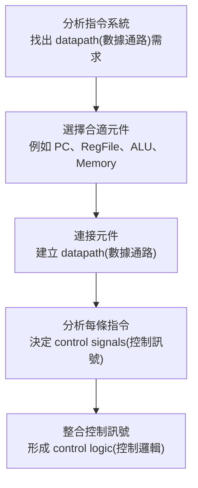

生活化一點講，這就像你不是先畫一間餐廳的平面圖，而是先問：「我要賣哪些餐點？」如果菜單需要煎、炸、烤、冷藏，廚房設備就會被菜單需求決定。CPU 也是一樣：不是先背硬體圖，而是由指令需求反推硬體。

講義 PDF viewer page 3 明確列出五步：分析指令需求、選元件、連數據通路、分析控制訊號、整合控制邏輯；到 PDF viewer page 12，前兩步已被標記完成，表示本輪自然收束點就在「需求分析＋元件需求」這一段。


---

### 2. 這份 ch4-1 先限制 CPU 要支援哪些 MIPS 指令？

本輪講義不是設計完整 MIPS，而是設計能支援這幾類指令的處理器：

| 指令類型                         | 指令                                    | 核心工作                                              |
| ---------------------------- | ------------------------------------- | ------------------------------------------------- |
| unsigned arithmetic(無號算術)    | `addu rd, rs, rt`、`subu rd, rs, rt`   | 讀兩個暫存器，ALU 做加或減，寫回 `rd`                           |
| immediate logical OR(立即數邏輯或) | `ori rt, rs, imm16`                   | 讀 `rs`，把 `imm16` zero extension(零擴展)，做 OR，寫回 `rt` |
| load/store(載入／儲存)            | `lw rt, imm16(rs)`、`sw rt, imm16(rs)` | 用 `R[rs] + SignExt(imm16)` 算記憶體位址                 |
| branch(條件分支)                 | `beq rs, rt, imm16`                   | 比較 `R[rs]` 和 `R[rt]`，相等時改 PC                      |

這裡最重要的不是記指令格式，而是看出「不同指令會逼 CPU 加不同硬體」。例如：

`addu` 需要 ALU 做加法，`ori` 需要立即數擴展，`lw` 和 `sw` 需要 Data Memory(資料記憶體)，`beq` 需要比較兩個暫存器並改變 PC。講義 PDF viewer page 4 ~ 7 就是用這些指令逐步導出硬體需求。

---

### 3. R-type 和 I-type 的差別，為什麼會影響 datapath？

講義在 PDF viewer page 5 先拆指令位元域：

| 格式     | 位元域                              | 用途                                                |
| ------ | -------------------------------- | ------------------------------------------------- |
| R-type | `{op, rs, rt, rd, shamt, funct}` | 多用於暫存器對暫存器運算，例如 `addu`、`subu`                     |
| I-type | `{op, rs, rt, imm16}`            | 多用於立即數、load/store、branch，例如 `ori`、`lw`、`sw`、`beq` |

關鍵差異是：R-type 的目的暫存器通常是 `rd`，但 I-type 的目的暫存器常常是 `rt`，例如 `ori` 和 `lw` 都寫回 `rt`。

這就會導出第一個很重要的硬體需求：CPU 不能永遠把寫入目標接死在 `rd`。它需要一個 multiplexer(多工器／多選器)，在 `rd` 和 `rt` 之間選一個送到 Register File(暫存器堆) 的寫入編號 `Rw`。

這就是後面 `RegDst` control signal(控制訊號) 的來源。

---

### 4. 從運算指令推出 ALU 和 Register File 的需求

以：

`addu rd, rs, rt`
`subu rd, rs, rt`

來看，講義把語意寫成：

`R[rd] ← R[rs] + R[rt]`
`R[rd] ← R[rs] - R[rt]`

所以硬體至少需要：

| 需求              | 對應硬體                                        |
| --------------- | ------------------------------------------- |
| 同時讀 `rs` 和 `rt` | Register File(暫存器堆) 要 two-read ports(兩個讀取埠) |
| 寫回 `rd`         | Register File 要 one-write port(一個寫入埠)       |
| 做加法／減法          | ALU(算術邏輯單元)                                 |
| 每條非分支指令後到下一條    | PC 要能做 `PC ← PC + 4`                        |

這裡有一個常見錯法：很多人看到 `rs`、`rt`、`rd` 會把它們當資料本身。其實它們是 register number(暫存器編號)，真正的資料在暫存器堆裡。`rs` 和 `rt` 是「地址／編號」，busA 和 busB 才是讀出來的 32-bit data(資料)。

---

### 5. 從 `ori` 推出 extender(擴展器)和 ALU input mux(輸入多選器)

`ori rt, rs, imm16` 的語意是：

`R[rt] ← R[rs] | zero_ext(Imm16)`

它和 `addu/subu` 最大差異有三個：

| 問題                  | 為什麼原本 R-type datapath 不夠              |
| ------------------- | ------------------------------------- |
| 寫入目標是 `rt` 不是 `rd`  | 需要在 `rt/rd` 中選目的暫存器                   |
| ALU 第二個輸入不是 `R[rt]` | 需要在 busB 和 immediate(立即數) 中選          |
| `imm16` 只有 16-bit   | ALU 要吃 32-bit，所以要 zero extension(零擴展) |

所以 `ori` 會逼我們增加：

1. `RegDst` mux：選 `rt` 或 `rd` 當寫入目標。
2. `ALUSrc` mux：選 busB 或擴展後立即數當 ALU 第二輸入。
3. Extender(擴展器)：把 16-bit 立即數變成 32-bit。

為什麼 `ori` 用 zero extension(零擴展)？因為邏輯 OR 通常把立即數當 bit pattern(位元樣式)，不是當有正負號的偏移量；保留位元意義就好。

---

### 6. 從 `lw/sw` 推出 sign extension(符號擴展)和 Data Memory(資料記憶體)

`lw rt, imm16(rs)` 的語意是：

`R[rt] ← MEM[R[rs] + SignExt(imm16)]`

`sw rt, imm16(rs)` 的語意是：

`MEM[R[rs] + SignExt(imm16)] ← R[rt]`

它們共同需求是：先算 effective address(有效位址)。

也就是：

`base register value + signed offset`

因此：

| 指令   | ALU 做什麼                  | Data Memory 做什麼 | 最後寫去哪裡           |
| ---- | ------------------------ | --------------- | ---------------- |
| `lw` | `R[rs] + SignExt(imm16)` | 讀出該位址資料         | 寫回 `R[rt]`       |
| `sw` | `R[rs] + SignExt(imm16)` | 把 `R[rt]` 寫入該位址 | 不寫 Register File |

常見錯法是把 `lw` 想成「ALU 算完就直接寫回」。不對。`lw` 的 ALU result(結果)是 address(位址)，不是最後資料。真正要寫回暫存器的是 Data Memory 讀出來的資料。

所以 `lw` 會導出 `MemtoReg` mux：寫回 Register File 的資料來源，要能在 ALU result 和 Memory output 中選一個。

`sw` 則導出 `MemWr` control signal(記憶體寫入控制)：只有 store 時才能寫 Data Memory，否則不能亂寫。

---

### 7. 從 `beq` 推出比較與 PC 更新需求

`beq rs, rt, imm16` 的語意是：

若 `R[rs] == R[rt]`，則：

`PC ← PC + 4 + (SignExt(imm16) || 00)`

否則：

`PC ← PC + 4`

這會導出兩個需求：

1. 要比較兩個暫存器是否相等。
2. PC 不能只會 `+4`，還要能選 branch target address(分支目標位址)。

因此 IFU(Instruction Fetch Unit，取指單元)裡面會需要 PC、Instruction Memory、Adder、以及選擇下一個 PC 的 mux。講義 PDF viewer page 16 ~ 19 後面會正式把這段展開成取指與 PC 更新；這屬於下一個相鄰知識點，不在本輪宣稱完成。

---

### 8. 本輪最短記法

這一段可以用一句話記：

CPU datapath 是由「指令語意」反推硬體需求；每多一種指令格式或資料來源，就通常需要新的 mux、extender、memory path 或 control signal。

更精簡地說：

| 指令需求              | 會長出什麼硬體／控制                          |
| ----------------- | ----------------------------------- |
| 讀兩個暫存器            | Register File 的 `Ra/Rb → busA/busB` |
| 寫回暫存器             | `Rw/busW/RegWr`                     |
| 算加減或邏輯            | ALU + `ALUCtr`                      |
| 立即數參與 ALU         | Extender + `ALUSrc`                 |
| `rd/rt` 都可能是目的暫存器 | `RegDst`                            |
| load 從記憶體拿資料      | Data Memory + `MemtoReg`            |
| store 寫資料記憶體      | Data Memory + `MemWr`               |
| branch 改 PC       | comparison(比較) + PC source mux      |


### 為何 RegDst 叫做 RegDst，為何 ALUSrc 叫做 ALUSrc

| 控制訊號     | 全名直覺                 | 它在選什麼                                 |
| -------- | -------------------- | ------------------------------------- |
| `RegDst` | Register Destination | 寫回目的暫存器是 `rd` 還是 `rt`                 |
| `ALUSrc` | ALU Source           | ALU 第二個輸入來源是 `busB` 還是 immediate(立即數) |


## ⭐取指與更新 PC — 每條指令執行前，CPU 如何知道要去哪裡拿下一條指令？

講義位置：PDF viewer page 13 ~ PDF viewer page 20／輔助：投影片頁碼 13–20

### 1. 這一段在解決什麼問題？

上一段我們是在問：「這些 MIPS 指令需要哪些元件？」

這一段開始問：「元件有了，要怎麼連起來，讓指令真的能流動？」

講義給的基本原則是：

> 根據指令需求，連接元件，建立 datapath(數據通路)。

也就是不要背圖，而是問每條指令需要資料怎麼走。先從所有指令都一定會做的事情開始：Fetch(取指令)。

所有指令，不管是 `addu`、`ori`、`lw`、`sw`、`beq`，第一步都一定要先從 Instruction Memory(指令記憶體) 取出 instruction word(指令編碼)。

生活化例子：你要做任何一道菜之前，第一步都要先讀食譜。不同菜後面流程不同，但「先拿到食譜」是共同需求。

---

### 2. PC 是什麼？它不是資料暫存器，而是「指令地址暫存器」

PC(Program Counter，程式計數器) 裡放的是 instruction address(指令位址)。

也就是：

`PC` 的內容告訴 CPU：「下一次要去哪個位址取指令。」

在 datapath 裡，PC 會接到 Instruction Memory 的 address input(位址輸入)。Instruction Memory 收到這個位址後，就輸出對應的 `Instruction Word`。

流程是：


講義 PDF viewer page 16 ~ 19 的共同需求就是這件事：PC 的內容是指令地址，用 PC 的內容作為位址，存取 Instruction Memory 取得指令編碼。

---

### 3. 為什麼一般情況是 `PC ← PC + 4`？

MIPS 一條指令是 32-bit，也就是 4 bytes。

Memory address(記憶體位址)通常以 byte(位元組)為單位編號，所以如果現在指令在位址 `PC`，下一條連續指令會在：

`PC + 4`

不是 `PC + 1`。

這裡很容易混淆：

| 錯誤直覺             | 正確觀念                            |
| ---------------- | ------------------------------- |
| 下一條指令所以 `PC + 1` | MIPS 指令長度是 4 bytes，所以是 `PC + 4` |
| PC 存第幾條指令        | PC 存的是 byte address(位元組位址)      |
| 所有指令都永遠 `PC+4`   | branch/jump 可能改成目標位址            |

所以一般循序執行：

`PC ← PC + 4`

這需要一個 Adder(加法器)，專門幫 PC 加 4。


---

### 4. 為什麼 PC 更新需要 mux？

如果程式完全沒有分支，PC 永遠 `+4` 就好。

但講義支援 `beq rs, rt, imm16`。`beq` 成立時，下一條指令不是 `PC+4`，而是 branch target address(分支目標位址)。

所以 PC 的下一個值有至少兩種來源：

| 情況                 | 下一個 PC                |
| ------------------ | --------------------- |
| 一般循序執行             | `PC + 4`              |
| branch taken(分支成立) | branch target address |

這就需要一個 mux(多選器) 來選：

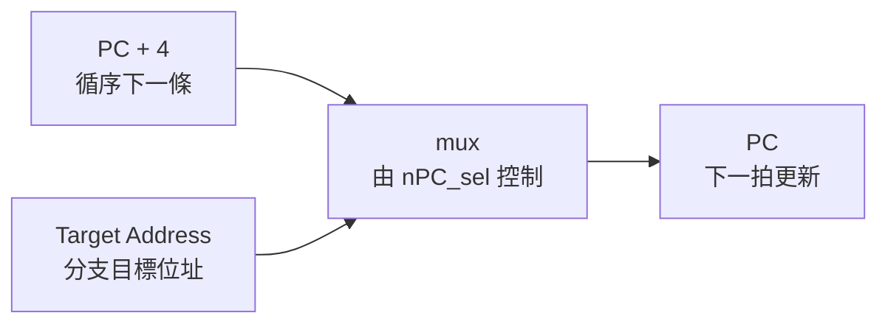

控制這個 mux 的訊號在講義圖上叫 `nPC_sel`，可理解為 next PC select(下一個 PC 選擇訊號)。

!!! danger 

    branch 存的 offset 是 `PC ← PC + 4 + (SignExt(imm16) || 00)` 裡面的 imm16，所以上面流程圖的 Target address 是 PC + 4 + (SignExt(imm16) << 2) 不是單純的 branch 的 offset
    
    這邊是先知道 PC 如何切換就好，所以沒有畫出 `PC ← PC + 4 + (SignExt(imm16) || 00)` 計算。


---

### 5. IFU 是什麼？

IFU(Instruction Fetch Unit，取指單元) 可以看成把「取指令＋更新 PC」包起來的一個小模組。

它裡面至少包含：

| 元件                 | 功能                                        |
| ------------------ | ----------------------------------------- |
| PC                 | 存目前指令位址                                   |
| Instruction Memory | 用 PC 當 address 取出 instruction word        |
| Adder              | 算 `PC + 4`                                |
| mux                | 在 `PC+4` 和 branch target address 中選下一個 PC |
| `nPC_sel`          | 控制下一個 PC 來源                               |

用圖表示：

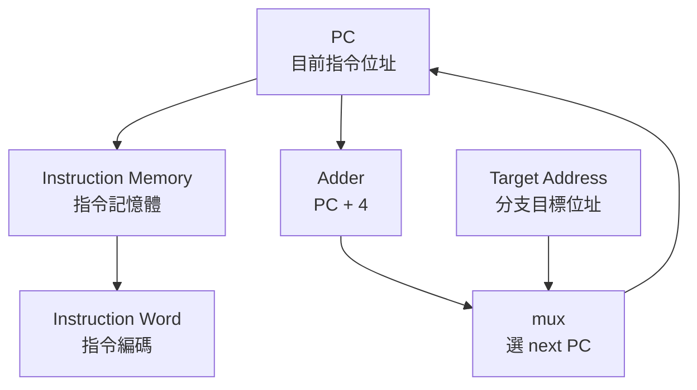

這就是為什麼講義在 PDF viewer page 19 把 PC、Instruction Memory、Adder、mux 包成 Instruction Fetch Unit, IFU。

---

### 6. 本輪最短記法

所有指令共同需求可以記成一句：

每條指令都先用 PC 去 Instruction Memory 取指令，然後 PC 根據 `nPC_sel` 選擇更新成 `PC+4` 或 branch target address。

再壓更短：

| 問題         | 硬體答案                             |
| ---------- | -------------------------------- |
| 要去哪裡取指令？   | PC 給 Instruction Memory 位址       |
| 取出什麼？      | Instruction Word                 |
| 下一條正常在哪？   | `PC + 4`                         |
| 分支成立去哪？    | Target Address                   |
| 誰決定下一個 PC？ | `nPC_sel` 控制 mux                 |
| 這組合稱什麼？    | IFU(Instruction Fetch Unit，取指單元) |


## ⭐`addu/subu` 的 datapath — R-type 運算指令如何從暫存器讀資料、經 ALU 運算、再寫回暫存器？

講義位置：PDF viewer page 21／輔助：投影片頁碼 21

### 1. 這一段在解決什麼問題？

現在我們已經知道所有指令都會先 Fetch(取指令)並更新 PC。接下來開始看「不同指令自己的資料路徑」。

`addu` 和 `subu` 是最單純的 R-type 運算指令，它們的共同形式是：

`R[rd] = R[rs] op R[rt]`

其中 `op` 可以是加法或減法。

也就是：

| 指令                | 實際語意                    |
| ----------------- | ----------------------- |
| `addu rd, rs, rt` | `R[rd] = R[rs] + R[rt]` |
| `subu rd, rs, rt` | `R[rd] = R[rs] - R[rt]` |

這類指令的資料流很單純：

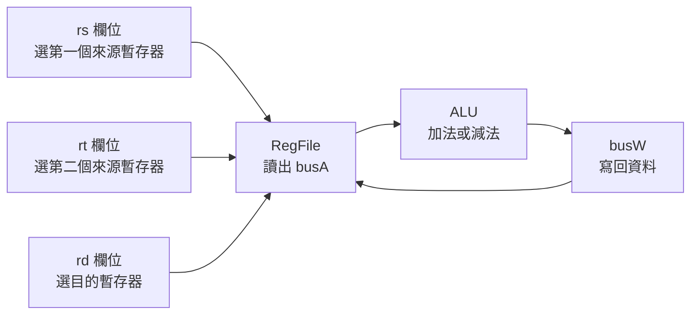

重點是：`rs`、`rt`、`rd` 都不是資料本身，而是 register number(暫存器編號)。

---

### 2. `rs`、`rt`、`rd` 分別接到哪裡？

對 `addu rd, rs, rt` 來說：

| 指令欄位 | 角色                          | 接到哪裡 |
| ---- | --------------------------- | ---- |
| `rs` | 第一個 source register(來源暫存器)  | `Ra` |
| `rt` | 第二個 source register(來源暫存器)  | `Rb` |
| `rd` | destination register(目的暫存器) | `Rw` |

RegFile(暫存器堆) 會做三件事：

1. 根據 `Ra = rs`，把 `R[rs]` 放到 `busA`。
2. 根據 `Rb = rt`，把 `R[rt]` 放到 `busB`。
3. 在 clock 上升沿，如果 `RegWr = 1`，就把 `busW` 的資料寫進 `Rw = rd` 指定的暫存器。

所以 `addu/subu` 的資料來源是兩個暫存器，目的地是 `rd`。

---

### 3. ALU 做加法還是減法，誰決定？

`addu` 和 `subu` 都用同一顆 ALU。

差別不是換硬體，而是給 ALU 不同的 control signal(控制訊號)：

| 指令     | `ALUCtr` |
| ------ | -------- |
| `addu` | ADD      |
| `subu` | SUB      |

所以：

`ALUCtr` 決定 ALU 這次要做什麼運算。

這也是為什麼講義說 `ALUCtr` 是由 instruction decode(指令解碼)產生的控制訊號：CPU 看到 instruction opcode/funct 後，就知道這次要叫 ALU 加還是減。

---

### 4. `RegWr` 為什麼要是 1？

因為 `addu/subu` 最後要把 ALU result(運算結果)寫回暫存器 `rd`。

如果 `RegWr = 0`，那就算 ALU 算出結果，也不會真的寫回 Register File。

所以對 `addu/subu`：

| 控制訊號       | 值            | 原因                   |
| ---------- | ------------ | -------------------- |
| `RegWr`    | 1            | 要寫回 `rd`             |
| `RegDst`   | 選 `rd`       | R-type 目的暫存器是 `rd`   |
| `ALUSrc`   | 選 `busB`     | ALU 第二輸入來自 `R[rt]`   |
| `ALUCtr`   | ADD 或 SUB    | 由 `addu/subu` 決定     |
| `MemWr`    | 0            | 不寫 Data Memory       |
| `MemtoReg` | 選 ALU result | 寫回資料來自 ALU，不是 Memory |

這一段最重要的是看出：控制訊號不是亂背，而是由「這條指令的資料要怎麼走」決定。

---

### 5. 本輪最短記法

`addu/subu` 的 datapath 可以記成：

`rs, rt → RegFile → busA, busB → ALU → busW → rd`

控制訊號最短記：

| 控制         | 對 `addu/subu` 的意思         |
| ---------- | ------------------------- |
| `RegDst`   | 寫到 `rd`                   |
| `ALUSrc`   | ALU 第二輸入選 `busB`          |
| `ALUCtr`   | `addu` 選 ADD，`subu` 選 SUB |
| `RegWr`    | 要寫回，所以 1                  |
| `MemWr`    | 不寫 memory，所以 0            |
| `MemtoReg` | 寫回 ALU result             |

## ⭐`ori` 的 datapath — 為什麼 R-type 的路徑不夠用？

講義位置：PDF viewer page 22 ~ PDF viewer page 23／輔助：投影片頁碼 22–23

### 1. 這一段在解決什麼問題？

上一頁 `addu/subu` 的資料流是：

`R[rd] = R[rs] op R[rt]`

所以很自然：

`rs → Ra → busA`
`rt → Rb → busB`
`rd → Rw`
`busA` 和 `busB` 進 ALU，結果寫回 `rd`

但 `ori` 不是這樣。

`ori rt, rs, imm16` 的語意是：

`R[rt] = R[rs] | ZeroExt(imm16)`

這句話直接造成三個 datapath(數據通路)問題：

| 問題                | 為什麼原本 `addu/subu` datapath 不夠 |
| ----------------- | ----------------------------- |
| 目的暫存器變成 `rt`      | 原本 R-type 寫回 `rd`             |
| ALU 第二輸入變成立即數     | 原本 ALU 第二輸入是 `busB = R[rt]`   |
| `imm16` 只有 16-bit | ALU 輸入需要 32-bit               |

所以 `ori` 的本質是：它把 R-type 的「兩個 register operand」改成「一個 register operand + 一個 immediate operand」。

---

### 2. 問題 1：為什麼需要 `RegDst` mux？

`addu/subu` 寫回 `rd`：

`R[rd] = R[rs] op R[rt]`

但 `ori` 寫回 `rt`：

`R[rt] = R[rs] | ZeroExt(imm16)`

所以 Register File 的 `Rw` 不能永遠接 `rd`。

它必須可以選：

| 指令類型        | 寫回目的地 |
| ----------- | ----- |
| `addu/subu` | `rd`  |
| `ori`       | `rt`  |

因此加一個 mux，由 `RegDst` 控制。

在講義這份 datapath 的標號中：

| `RegDst` | 選到   |
| -------- | ---- |
| `0`      | `rt` |
| `1`      | `rd` |

所以 `ori` 要 `RegDst = 0`，因為它寫回 `rt`。

---

### 3. 問題 2：為什麼需要 `ALUSrc` mux？

`addu/subu` 的 ALU 第二輸入是：

`busB = R[rt]`

但 `ori` 的 ALU 第二輸入是：

`ZeroExt(imm16)`

所以 ALU 第二輸入不能永遠接 `busB`。

它必須可以選：

| 指令          | ALU 第二輸入         |
| ----------- | ---------------- |
| `addu/subu` | `busB = R[rt]`   |
| `ori`       | `ZeroExt(imm16)` |

因此加一個 mux，由 `ALUSrc` 控制。

在講義這份 datapath 的標號中：

| `ALUSrc` | 選到             |
| -------- | -------------- |
| `0`      | `busB`         |
| `1`      | 擴展後的 immediate |

所以 `ori` 要 `ALUSrc = 1`，因為它要用 immediate 當 ALU 第二輸入。

---

### 4. 問題 3：為什麼需要 zero extension？

`imm16` 只有 16-bit，但 ALU 是處理 32-bit operand。

所以 `ori` 不能直接把 `imm16` 丟進 ALU，而要先變成 32-bit：

`ZeroExt(imm16)`

例如：

| `imm16`  | `ZeroExt(imm16)` |
| -------- | ---------------- |
| `0x00FF` | `0x000000FF`     |
| `0x8001` | `0x00008001`     |

這裡特別用 zero extension(零擴展)，不是 sign extension(符號擴展)，因為 `ori` 是 bitwise OR(位元 OR)邏輯運算，立即數被當作 bit pattern(位元樣式)，不是有正負號的數值偏移。

---

### 5. `ori` 的完整資料流

`ori rt, rs, imm16` 的資料流可以整理成：

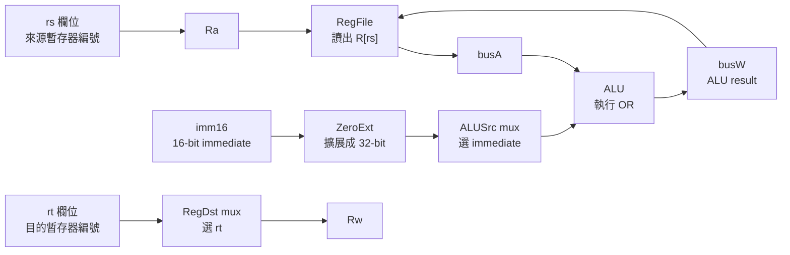

用一句話說：

`ori` 從 `rs` 讀出 `R[rs]`，把 `imm16` 零擴展成 32-bit，兩者做 OR，最後寫回 `rt`。

---

### 6. 本輪最短記法

`ori` 可以記成：

`rs → busA`
`imm16 → ZeroExt → ALU 第二輸入`
`ALU 做 OR`
`結果寫回 rt`

控制訊號最短記：

| 控制訊號       | `ori` 的設定       | 原因                         |
| ---------- | --------------- | -------------------------- |
| `RegDst`   | `0`，選 `rt`      | `ori` 寫回 `rt`              |
| `ALUSrc`   | `1`，選 immediate | ALU 第二輸入是 `ZeroExt(imm16)` |
| `ExtOp`    | zero            | `ori` 用零擴展                 |
| `ALUCtr`   | OR              | 執行 bitwise OR              |
| `RegWr`    | 1               | 結果要寫回 Register File        |
| `MemWr`    | 0               | 不寫 Data Memory             |
| `MemtoReg` | 0，選 ALU result  | 寫回資料來自 ALU                 |

講義 PDF viewer page 23 的解法正是：針對 `ori` 的三個問題，增加兩個多選器，並增加零擴展元件。


### Rw、Ra、Rb 本質上是什麼？

`Rw`、`Ra`、`Rb` 本質上是 **Register File(暫存器堆) 的 register number input signals(暫存器編號輸入訊號)**。

它們不是暫存器本身，也不是 32-bit 資料，而是用來告訴 Register File：

| 訊號   | 本質                             | 問題                   |
| ---- | ------------------------------ | -------------------- |
| `Ra` | 5-bit read address(讀取位址／讀取編號)  | 要把哪個暫存器的內容送到 `busA`？ |
| `Rb` | 5-bit read address(讀取位址／讀取編號)  | 要把哪個暫存器的內容送到 `busB`？ |
| `Rw` | 5-bit write address(寫入位址／寫入編號) | `busW` 的資料要寫進哪個暫存器？  |

## ⭐`lw` 的 datapath — 為什麼 ALU 算出來的是位址，不是最後寫回的資料？

講義位置：PDF viewer page 24 ~ PDF viewer page 25／輔助：投影片頁碼 24–25

### 1. 這一段在解決什麼問題？

前面的 `addu/subu/ori` 都有一個共同點：ALU 算出來的結果，就是最後要寫回 Register File(暫存器堆) 的值。

但 `lw` 不一樣。

`lw rt, imm16(rs)` 的語意是：

`R[rt] = MEM[R[rs] + SignExt(imm16)]`

這句要拆成兩層：

| 層次  | 做什麼                                                     |
| --- | ------------------------------------------------------- |
| 第一層 | ALU 計算 effective address(有效位址)：`R[rs] + SignExt(imm16)` |
| 第二層 | 用這個 address 去 Data Memory 讀資料                           |
| 第三層 | 把 Data Memory 讀出的資料寫回 `R[rt]`                           |

所以 `lw` 的關鍵不是「ALU 算完直接寫回」，而是：

ALU result 是 address；Memory output 才是要寫回的 data。

---

### 2. `lw` 為什麼需要 sign extension？

`lw rt, imm16(rs)` 裡的 `imm16` 是 offset(位移量)，可以是正的，也可以是負的。

例如：

`lw $t0, 8($sp)`
代表從 `R[$sp] + 8` 的位址載入資料。

`lw $t0, -4($sp)`
代表從 `R[$sp] - 4` 的位址載入資料。

所以這裡的 `imm16` 不是純 bit pattern，而是有正負號的 signed offset(有號位移量)。因此要用 sign extension(符號擴展)，不是 zero extension(零擴展)。

| 指令    | immediate 的角色        | 擴展方式           |
| ----- | -------------------- | -------------- |
| `ori` | bit pattern(位元樣式)    | zero extension |
| `lw`  | signed offset(有號位移量) | sign extension |

講義 PDF viewer page 24 也說 `lw` 的位址是由 `rs` 指定暫存器內容加上符號擴展後的立即數得到。

---

### 3. `lw` 為什麼需要 Data Memory？

因為 `lw` 的目標不是做一般 ALU 運算，而是從記憶體拿資料。

流程是：

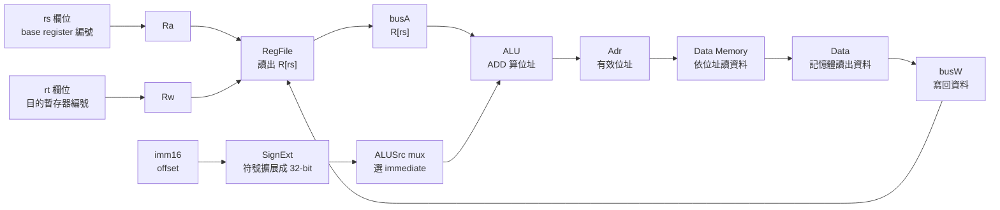

這裡最容易錯的點是：

`Adr = R[rs] + SignExt(imm16)`
但 `busW = DataMemory[Adr]`

所以 `Adr` 和 `busW` 不是同一個東西。

---

### 4. `lw` 為什麼需要 `MemtoReg`？

前面幾個運算指令：

| 指令     | 寫回 Register File 的資料來源 |
| ------ | ---------------------- |
| `addu` | ALU result             |
| `subu` | ALU result             |
| `ori`  | ALU result             |

但 `lw` 寫回的是：

`Data Memory` 讀出的資料

不是 ALU result。

所以 Register File 的 `busW` 前面需要一個 mux，選擇寫回資料來源：

| `MemtoReg` | 寫回資料來源             |
| ---------- | ------------------ |
| `0`        | ALU result         |
| `1`        | Data Memory output |

因此 `lw` 要 `MemtoReg = 1`。

講義後面的 `lw` datapath 圖也標出：`ALUSrc=1`、`RegDst=0`、`RegWr=1`、`ExtOp="sign"`、`ALUCtr="ADD"`、`MemtoReg=1`、`MemWr=0`。

---

### 5. `lw` 的控制訊號最短記法

| 控制訊號       | `lw rt, imm16(rs)` | 原因                         |
| ---------- | -----------------: | -------------------------- |
| `RegDst`   |                `0` | 寫回目的暫存器是 `rt`              |
| `ALUSrc`   |                `1` | ALU 第二輸入是 `SignExt(imm16)` |
| `ExtOp`    |       `1` 或 `sign` | offset 要符號擴展               |
| `ALUCtr`   |              `ADD` | base + offset 算位址          |
| `MemtoReg` |                `1` | 寫回資料來自 Data Memory         |
| `RegWr`    |                `1` | 要把載入資料寫回 `rt`              |
| `MemWr`    |                `0` | `lw` 是讀記憶體，不是寫記憶體          |
| `nPC_sel`  |         `0` 或 `+4` | 一般循序執行下一條                  |

一句話記：

`lw` 用 ALU 算 address，用 Data Memory 讀 data，再把 data 寫回 `rt`。


## ⭐`sw` Datapath — `sw` 為什麼是「把 rt 的資料寫進記憶體」？

講義位置：PDF viewer page 54 ~ PDF viewer page 55／輔助：Chapter 4 — The Processor — 54 ~ 55

### 1. `sw rt, imm16(rs)` 真正在做什麼？

`sw rt, imm16(rs)` 的意思是：

`DataMemory{R[rs] + SignExt[imm16]} = R[rt]`

也就是：

先用 `R[rs] + SignExt[imm16]` 算出一個 effective address(有效位址)，再把 `R[rt]` 的資料寫進 Data Memory(資料記憶體) 的那個位置。講義在 `sw` 操作步驟中就是這樣寫的：`DataMemory{R[rs]+SignExt[imm16]}=R[rt]`。

外部 MIPS32 指令手冊也用同樣概念描述 load/store 位址計算：16-bit signed offset 會加到 base register 內容上形成 effective address；所以這裡的 `imm16` 是 signed byte offset(有號位元組偏移量)，不是 word index(字索引)。([康奈爾大學計算機科學系][1])

---

### 2. `sw` 的資料流：誰提供 address？誰提供 data？

`sw` 有兩條重要資料線：

| 目的               | 來源                         | 到哪裡                                    |
| ---------------- | -------------------------- | -------------------------------------- |
| 算 memory address | `R[rs]` 與 `SignExt[imm16]` | ALU result → Data Memory 的 Address/Adr |
| 要被寫進 memory 的資料  | `R[rt]`                    | busB → Data Memory 的 Data In           |

所以 `rt` 在 `sw` 裡不是 destination register(目的暫存器)，而是 source register(資料來源暫存器)。

這和 `lw` 剛好相反：

| 指令                 | `rt` 的角色                   |
| ------------------ | -------------------------- |
| `lw rt, imm16(rs)` | `rt` 是被寫入的暫存器              |
| `sw rt, imm16(rs)` | `rt` 是要拿出資料、寫進 memory 的暫存器 |

---

### 3. `sw` 的控制信號為什麼是這樣？

講義頁面直接標出 `sw` 的控制信號：`RegDst=x`、`RegWr=0`、`ALUCtr=ADD`、`MemtoReg=x`、`MemWr=1`、`ExtOp=sign`、`ALUSrc=1`、`nPC_sel=+4`。

| Control signal(控制信號) | `sw` 的值 | 原因                                     |
| -------------------- | ------: | -------------------------------------- |
| `RegDst`             |     `x` | 不寫回暫存器，所以不用選 `rt` 或 `rd`               |
| `RegWr`              |     `0` | `sw` 不會寫入 Register File(暫存器堆)          |
| `ALUSrc`             |     `1` | ALU 第二個輸入要選 `SignExt[imm16]`           |
| `ExtOp`              |  `sign` | `imm16` 是有號偏移量，需要 sign extension(符號擴展) |
| `ALUCtr`             |   `ADD` | ALU 要算 `R[rs] + SignExt[imm16]`        |
| `MemWr`              |     `1` | 要把資料寫進 Data Memory                     |
| `MemtoReg`           |     `x` | 不寫回暫存器，所以 busW 來源不重要                   |
| `nPC_sel`            |    `+4` | `sw` 不是 branch，下一條指令照順序執行              |

`x` 的意思是 don’t care(不重要)，不是 `0`，也不是 `1`。因為這條控制線後面的結果根本不會被用到。

---

### 4. 用一個例子走一次

假設：

| 項目       |                 值 |
| -------- | ----------------: |
| 指令       | `sw $t0, 12($sp)` |
| `R[$sp]` |      `0x10010000` |
| `R[$t0]` |      `0xDEADBEEF` |
| `imm16`  |              `12` |

流程是：

1. `rs = $sp`，所以 `busA = R[$sp] = 0x10010000`
2. `rt = $t0`，所以 `busB = R[$t0] = 0xDEADBEEF`
3. `imm16 = 12`，經過 sign extension 仍是 `12`
4. ALU 做加法：`0x10010000 + 12 = 0x1001000C`
5. `ALU result = 0x1001000C` 送到 Data Memory 的 address
6. `busB = 0xDEADBEEF` 送到 Data Memory 的 Data In
7. `MemWr = 1`，所以 memory 在該 address 寫入 `0xDEADBEEF`
8. `RegWr = 0`，所以沒有任何 register 被寫回

也就是：

| 線路／元件                 |            值 |
| --------------------- | -----------: |
| `ALU result`          | `0x1001000C` |
| `Data Memory Address` | `0x1001000C` |
| `Data Memory Data In` | `0xDEADBEEF` |
| `busW`                |          不重要 |
| `Rw`                  |          不重要 |
| `RegWr`               |          `0` |
| `MemWr`               |          `1` |


!!! danger 

    ### R[$sp]是啥意思

    R[$sp] 的意思是：暫存器 $sp 裡面存的值。

    假設 `lw $t0, 12($sp)`：

    `R[$sp] = 0x10010000`

    那：

    `R[$sp] + 12 = 0x1001000C`

    這個 `0x1001000C` 是 effective address(有效位址)。

    如果是：

    `lw $t0, 12($sp)`

    意思是：

    從 `M[0x1001000C]` 讀資料，放進 `$t0`。

---

### 5. 最容易錯的地方

第一個錯法：把 `ALU result` 當成要存進 register 的資料。
這是 `lw` 也不對、`sw` 更不對。`ALU result` 在 load/store 裡是 memory address(記憶體位址)，不是資料本身。

第二個錯法：以為 `sw` 會寫回 `rt`。
`sw` 的 `rt` 是資料來源，不是目的地。`R[rt]` 的內容被拿出來，寫到 memory。

第三個錯法：把 `imm16` 乘以 4。
`lw/sw` 的 `imm16` 是 byte offset(位元組偏移)，不是第幾個 word。外部社群問答也常見這種 base+offset 尺度混淆；這裡我們以講義與 MIPS 手冊為主：effective address 是 base register 加 signed offset。([康奈爾大學計算機科學系][1])

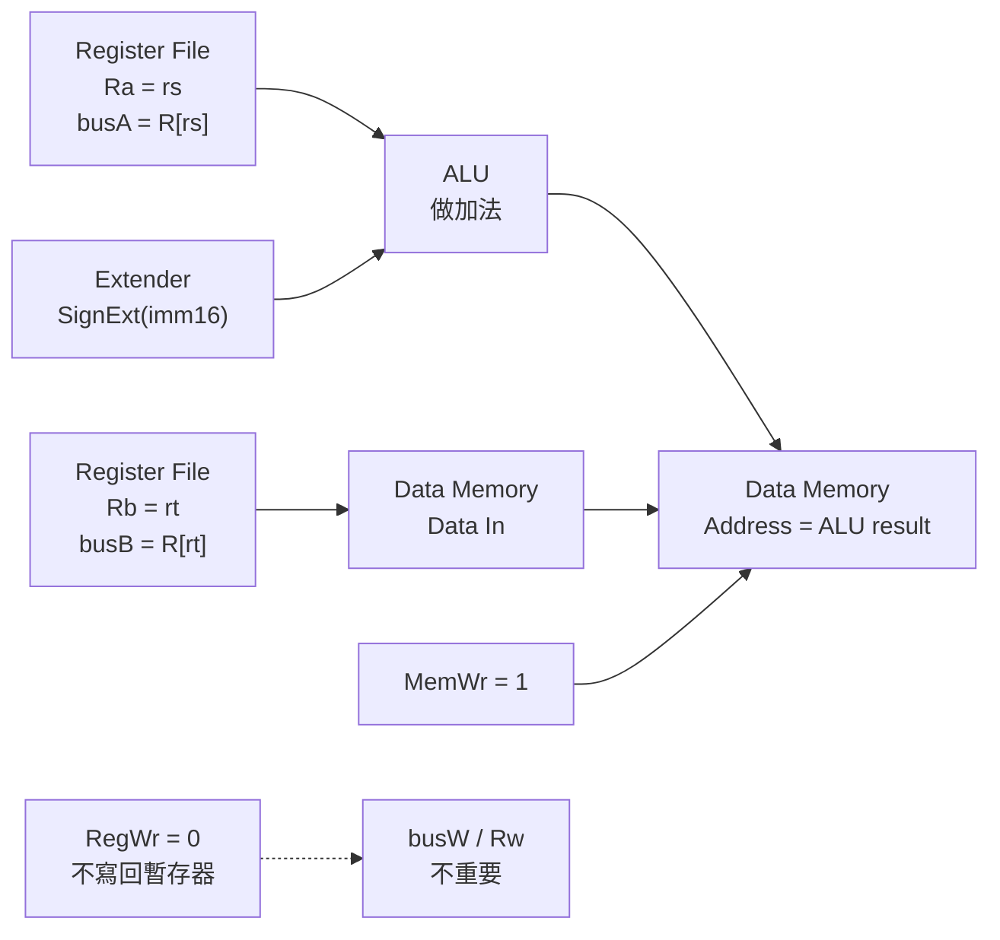

### 6. 最短記法

`sw` 的一句話版本：

`ALU 算位址，rt 提供資料，Memory 被寫入，Register 不被寫入。`

控制信號一句話版本：

`sw：RegWr=0、MemWr=1、ALUSrc=1、ExtOp=sign、ALUCtr=ADD、RegDst/MemtoReg=x。`


## ⭐控制訊號前的指令格式整理 — 為什麼控制器要先知道指令是哪一型？

講義位置：PDF viewer page 28 ~ PDF viewer page 33／輔助：投影片頁碼 28–33

### 1. Datapath(資料路徑) 接好，不代表 CPU 會自動知道怎麼走

前面我們已經把 `addu/subu/ori/lw/sw` 需要的 datapath 接出來了。可是硬體接好後，還需要有人告訴每個 mux(多工器)、Register File(暫存器堆)、Data Memory(資料記憶體)、ALU(算術邏輯單元)：

這一條指令要不要寫 register？
ALU 第二個輸入要選 `busB` 還是 `imm16`？
結果要從 ALU 回寫，還是從 memory 回寫？
Data Memory 要不要寫入？
Extender(擴展器) 要做 zero extension(零擴展) 還是 sign extension(符號擴展)？

這些答案就是 control signals(控制訊號)。

講義在 PDF viewer page 28 明確把前面三步打勾：分析需求、選元件、建立 datapath；接著進入第 4 步：分析每條指令的實現，以確定控制訊號。

---

### 2. 為什麼要先看 R 型、I 型、J 型？

因為 control unit(控制器) 不是看組合語言文字，而是看 instruction bits(指令位元)。

例如 CPU 不是真的看到這一行文字：

`sw $t0, 12($sp)`

CPU 看到的是 32-bit instruction word(指令字)。所以控制器要先知道：這 32-bit 裡面哪幾個 bit 是 `opcode`、哪幾個 bit 是 `rs`、哪幾個 bit 是 `rt`、哪幾個 bit 是 `rd` 或 `immediate`。

講義 page 29 說 MIPS 指令主要分為三種：`R(Register) 型`、`I(Immediate) 型`、`J(Jump) 型`。這個分類的目的，就是讓控制器知道欄位要怎麼解讀。

---

### 3. R 型指令的欄位怎麼看？

R 型格式是：

| 欄位      |  位元範圍 | 作用                |
| ------- | ----: | ----------------- |
| `op`    | 31–26 | 指令類型；R 型通常是 0     |
| `rs`    | 25–21 | 第一個來源暫存器          |
| `rt`    | 20–16 | 第二個來源暫存器          |
| `rd`    | 15–11 | 目的暫存器             |
| `shamt` |  10–6 | shift amount(位移量) |
| `funct` |   5–0 | 精確指定 R 型裡面是哪一種運算  |

重點是：R 型不是只靠 `opcode` 判斷 `add/sub/and/or`，因為很多 R 型指令的 `opcode` 都一樣，所以還要看 `funct` 欄位。

生活化說法：`opcode` 先告訴 CPU「這是一大類 R 型料理」，`funct` 再告訴 CPU「這道菜到底是加法、減法、AND 還是 OR」。

---

### 4. 目前這份講義主線中，哪些指令屬於哪一型？

目前我們正在追的這批指令可以先這樣分：

| 指令                  | 類型  | 為什麼                                         |
| ------------------- | --- | ------------------------------------------- |
| `addu rd, rs, rt`   | R 型 | 三個 register 欄位：`rs`、`rt`、`rd`               |
| `subu rd, rs, rt`   | R 型 | 三個 register 欄位：`rs`、`rt`、`rd`               |
| `ori rt, rs, imm16` | I 型 | 有 `rs`、`rt`、`imm16`                         |
| `lw rt, imm16(rs)`  | I 型 | 有 base register `rs`、目的 `rt`、offset `imm16` |
| `sw rt, imm16(rs)`  | I 型 | 有 base register `rs`、來源 `rt`、offset `imm16` |
| `beq rs, rt, imm16` | I 型 | 有兩個比較來源 `rs/rt` 和 branch offset `imm16`     |

`J 型`目前只是分類上會提到，還不是我們現在這條 datapath 主線的高優先級重點。

---

### 5. 這一頁真正要建立的觀念

接下來講 control signals 時，不要死背表格。你要先問：

這條指令是哪一型？
它要讀哪些 register？
它要不要寫 register？
它要不要使用 immediate？
它要不要讀或寫 Data Memory？
ALU 要做什麼？
PC 是 `PC + 4` 還是 branch target？

控制訊號表其實就是把這些問題全部變成 `0/1/x`。


## ⭐addu rd, rs, rt — R 型加法指令如何走完整 datapath？

講義位置：PDF viewer page 33 ~ PDF viewer page 40

### 1. `addu` 這條指令到底要完成什麼？

`addu rd, rs, rt` 的意思是：

`R[rd] = R[rs] + R[rt]`

也就是：

從 `rs` 指定的暫存器拿資料，從 `rt` 指定的暫存器拿資料，兩個資料進 ALU(Arithmetic Logic Unit，算術邏輯單元) 做加法，結果寫回 `rd` 指定的暫存器。講義在 PDF viewer page 33 明確列出三件事：取指令、執行 `R[rd]=R[rs]+R[rt]`、更新 `PC=PC+4`。

---

### 2. 第一段：Fetch(取指令)

這一步所有指令都會做：

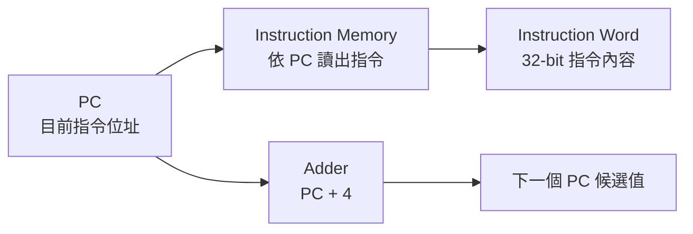

這裡重點不是加法資料運算，而是「拿到這條指令本身」。
所以此時：

| 訊號／元件                | 做什麼                                           |
| -------------------- | --------------------------------------------- |
| `PC`                 | 指向目前要取的 instruction(指令) 位址                    |
| `Instruction Memory` | 用 `PC` 當 address(位址)，讀出 instruction word(指令字) |
| `nPC_sel`            | 對 `addu` 來說，選 `PC+4`，因為不是 branch(分支)          |

---

### 3. 第二段：Decode / Register Read(解碼與讀暫存器)

`addu rd, rs, rt` 是 R 型格式：

| 欄位      | 作用                    |
| ------- | --------------------- |
| `rs`    | 第一個來源暫存器編號            |
| `rt`    | 第二個來源暫存器編號            |
| `rd`    | 目的暫存器編號               |
| `funct` | 告訴控制器這個 R 型指令實際要做哪種運算 |

Register File(暫存器堆) 的讀法是：

| Register File 輸入 | 接到哪個指令欄位 | 輸出             |
| ---------------- | -------- | -------------- |
| `Ra`             | `rs`     | `busA = R[rs]` |
| `Rb`             | `rt`     | `busB = R[rt]` |
| `Rw`             | `rd`     | 等一下寫回的目的暫存器    |

這裡你前面已經抓得很準：`rs/rt/rd` 不是資料本身，是 register number(暫存器編號)。真正的資料是 Register File 讀出來後放在 `busA` 和 `busB` 上。

---

### 4. 第三段：Execute(執行 ALU 加法)

`addu` 的兩個 ALU 輸入都來自暫存器：

| ALU 輸入 | 對 `addu` 來說是什麼 |
| ------ | -------------- |
| 第一個輸入  | `busA = R[rs]` |
| 第二個輸入  | `busB = R[rt]` |

所以 `ALUSrc = 0`，因為第二個 ALU input(輸入) 要選 `busB`，不是 immediate(立即數)。

ALU 要做加法，所以 `ALUCtr = ADD`。講義 PDF viewer page 38~39 的 datapath 標出 `ALUSrc=0`、`RegDst=1`、`RegWr=1`、`ALUCtr="ADD"`、`MemtoReg=0`、`MemWr=0`、`nPC_sel="+4"`。 

---

### 5. 第四段：Write-back(寫回)

`addu` 的 ALU result(運算結果) 要寫回 Register File。

所以：

| 控制訊號       |     值 | 原因                               |
| ---------- | ----: | -------------------------------- |
| `RegDst`   |   `1` | 目的暫存器選 `rd`                      |
| `ALUSrc`   |   `0` | ALU 第二個輸入選 `busB = R[rt]`        |
| `ALUCtr`   | `ADD` | 做加法                              |
| `MemtoReg` |   `0` | 寫回資料來自 ALU result，不是 Data Memory |
| `RegWr`    |   `1` | 要寫回暫存器                           |
| `MemWr`    |   `0` | 不寫 Data Memory                   |
| `ExtOp`    |   `x` | 不使用 immediate，所以不重要              |
| `nPC_sel`  |  `+4` | 下一條指令循序執行                        |

最重要的對照是：

| 名稱      | 是什麼                             |
| ------- | ------------------------------- |
| `Rw`    | 要寫入哪一個暫存器的編號，對 `addu` 是 `rd`    |
| `busW`  | 要寫進暫存器的資料，對 `addu` 是 ALU result |
| `RegWr` | 是否真的允許寫入 Register File          |

所以對 `addu` 來說：

`Rw = rd`
`busW = R[rs] + R[rt]`
`RegWr = 1`

這跟你前面釐清 `lw/sw` 時的觀念一致：`Rw` 是「位置編號」，`busW` 是「資料內容」。

---

### 6. 用一個完整例子跑一次

假設：

| 欄位／資料    |                    值 |
| -------- | -------------------: |
| 指令       | `addu $t2, $t0, $t1` |
| `rd`     |           `$t2 = 10` |
| `rs`     |            `$t0 = 8` |
| `rt`     |            `$t1 = 9` |
| `R[$t0]` |         `0x00000005` |
| `R[$t1]` |         `0x00000007` |
| `PC`     |         `0x00400020` |

流程如下：

| 步驟             | 結果                               |
| -------------- | -------------------------------- |
| `Ra = rs`      | `Ra = 8`                         |
| `Rb = rt`      | `Rb = 9`                         |
| `busA = R[rs]` | `busA = 0x00000005`              |
| `busB = R[rt]` | `busB = 0x00000007`              |
| `ALUSrc = 0`   | ALU 第二輸入選 `busB`                 |
| `ALUCtr = ADD` | ALU 做加法                          |
| `ALU result`   | `0x0000000C`                     |
| `RegDst = 1`   | `Rw = rd = 10`                   |
| `MemtoReg = 0` | `busW = ALU result = 0x0000000C` |
| `RegWr = 1`    | 寫入 `$t2`                         |
| `PC` 更新        | `0x00400024`                     |

最後結果：

`R[$t2] = 0x0000000C`

---

### 7. 最短記法

`addu` 的最短記法：

`rs, rt` 是來源。
`rd` 是目的地。
`busA = R[rs]`。
`busB = R[rt]`。
`ALU result = busA + busB`。
`Rw = rd`。
`busW = ALU result`。
`RegWr = 1`。
`MemWr = 0`。

---

### 8. 常見錯法

| 錯法                         | 為什麼錯                                      |
| -------------------------- | ----------------------------------------- |
| 說 `rt` 是目的地                | 對 `addu` 錯；`addu` 是 R 型，目的地是 `rd`         |
| 說 ALU result 進 Data Memory | 對 `addu` 錯；ALU result 直接走回 `busW`         |
| 說 `MemtoReg = 1`           | 錯；`addu` 寫回的是 ALU result，不是 memory output |
| 說 `MemWr = 1`              | 錯；`addu` 不寫 Data Memory                   |
| 把 `Rw` 當資料                 | 錯；`Rw` 是要寫入的暫存器編號                         |
| 把 `busW` 當暫存器編號            | 錯；`busW` 是要寫回的資料                          |


## ⭐I-type instruction 與指令分類 — 為什麼 `ori/lw/sw/beq` 都是 I 型但用途不同？

講義位置：PDF viewer page 41 ~ PDF viewer page 43

### 1. 這一段在解決什麼問題？

前面我們學 `addu rd, rs, rt`，它是 R-type instruction(R 型指令)，三個 operand(運算元) 都跟 register(暫存器) 有關：

`addu rd, rs, rt`

但有些指令需要直接在指令裡放一個數字，例如：

`ori rt, rs, imm16`

這個 `imm16` 就是 immediate(立即數)，也就是「直接寫在指令裡的 16-bit 數字」。

所以 I-type instruction(Immediate-type instruction，立即數型指令) 要解決的問題是：

「如果指令需要一個直接寫在 instruction word(指令字) 裡的數字，32-bit 指令格式要怎麼切欄位？」

---

### 2. I 型指令格式怎麼切？

I-type instruction 的 32-bit 格式是：

| 欄位          |    bit 範圍 |     長度 | 作用                                  |
| ----------- | --------: | -----: | ----------------------------------- |
| `opcode`    | `[31:26]` |  6-bit | 決定是哪一類主要指令                          |
| `rs`        | `[25:21]` |  5-bit | source register(來源暫存器) 編號           |
| `rt`        | `[20:16]` |  5-bit | target register(目標暫存器) 編號；實際角色依指令而定 |
| `immediate` |  `[15:0]` | 16-bit | immediate(立即數)                      |

最重要的是：I 型沒有 `rd` 欄位。

所以像 `ori` 和 `lw` 要寫回暫存器時，目的地通常會用 `rt`，不是 `rd`。

但不要背成「I 型的 `rt` 永遠是目的地」。這句會害你在 `sw` 出錯。

---

### 3. `rt` 的角色要看指令，不是只看 I 型格式

同樣都是 I-type instruction，`rt` 可能扮演不同角色：

!!! danger

    | 指令                  | `rt` 的角色                    | 原因                           |
    | ------------------- | --------------------------- | ---------------------------- |
    | `ori rt, rs, imm16` | destination register(目的暫存器) | ALU result(ALU 結果) 要寫回 `rt`  |
    | `lw rt, imm16(rs)`  | destination register(目的暫存器) | 從 memory(記憶體) 讀出的資料要寫回 `rt`  |
    | `sw rt, imm16(rs)`  | source register(來源暫存器)      | 要把 `R[rt]` 的資料寫到 memory(記憶體) |
    | `beq rs, rt, imm16` | comparison source(比較來源)     | 要比較 `R[rs]` 和 `R[rt]` 是否相等   |

所以我們要分清楚兩層：

「欄位名稱」是 instruction format(指令格式) 的固定切法。
「實際用途」是 instruction semantics(指令語意) 決定的。

---

### 4. PDF viewer page 42~43 的真正重點：分類有兩個維度

這裡很容易誤會，以為「R 型 = 運算」、「I 型 = 存取」、「J 型 = 分支」。這樣不對。

講義這裡其實在提醒：指令可以用不同維度分類。

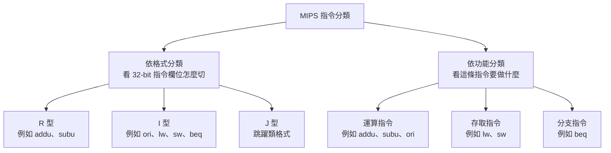

最關鍵的例子是 `ori`：

`ori` 是 I 型，因為它有 `imm16`。
但 `ori` 也是運算指令，因為它做 OR 運算。

所以「格式分類」和「功能分類」不是同一件事。

---

### 5. 最短記法

`R-type`：通常用 `rs`、`rt` 當來源，`rd` 當目的地。
`I-type`：有 `rs`、`rt`、`imm16`，沒有 `rd`。
`rt` 在 I 型裡不一定是目的地，要看指令語意。
`ori/lw/sw/beq` 都是 I 型，但功能不同。
`ori` 是 I 型運算指令。
`lw/sw` 是 I 型存取指令。
`beq` 是 I 型分支指令。

---

### 6. 常見錯法

| 錯法               | 修正                                     |
| ---------------- | -------------------------------------- |
| I 型一定是存取指令       | 錯，`ori` 和 `beq` 也是 I 型                 |
| 運算指令一定是 R 型      | 錯，`ori` 是 I 型運算指令                      |
| I 型的 `rt` 永遠是目的地 | 錯，`sw` 的 `rt` 是資料來源，`beq` 的 `rt` 是比較來源 |
| I 型有 `rd`        | 錯，I 型欄位是 `opcode/rs/rt/immediate`      |
| `imm16` 要自己去暫存器讀 | 錯，`imm16` 是 instruction word 裡直接帶的數字   |


## ⭐`ori` 指令操作步驟 — `imm16` 如何進 ALU，結果如何寫回 `rt`？

講義位置：PDF viewer page 44 ~ 47

### 1. `ori` 在解決什麼問題？

`ori rt, rs, imm16`

這條指令要做的是：

`R[rt] = R[rs] | ZeroExt(imm16)`

白話說：

從 `rs` 指定的暫存器拿出一個 32-bit 資料，
再把指令裡的 `imm16` 用 zero extension(零延伸) 變成 32-bit，
接著用 ALU 做 OR，
最後把結果寫回 `rt` 指定的暫存器。

---

### 2. 為什麼 `ori` 要用 `ZeroExt`？

因為 `ori` 是 bitwise OR(位元 OR) 指令，它把 `imm16` 當成 bit pattern(位元樣式)，不是當成有號數值。

所以 `imm16 = 0x00FF` 時：

`ZeroExt(0x00FF) = 0x000000FF`

不是：

`SignExt(0x00FF)`

更重要的是，如果 `imm16 = 0xFFFF`：

`ZeroExt(0xFFFF) = 0x0000FFFF`

不是：

`SignExt(0xFFFF) = 0xFFFFFFFF`

這就是 `ori` 和 `lw/sw/beq` 常見差異之一：
`ori` 用 zero extension；`lw/sw/beq` 的 offset 通常用 sign extension(符號延伸)。

---

### 3. `ori` 的 datapath 流程

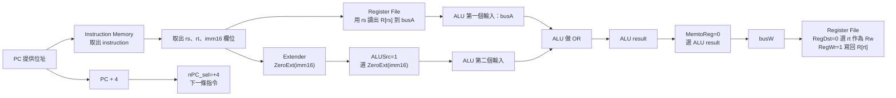

這張圖要你抓住三個 mux 選擇：

| 控制訊號           | 選什麼                  | 原因                   |
| -------------- | -------------------- | -------------------- |
| `RegDst = 0`   | 選 `rt` 當 `Rw`        | `ori` 寫回 `rt`        |
| `ALUSrc = 1`   | 選 extended immediate | 第二個 ALU 輸入不是 `busB`  |
| `MemtoReg = 0` | 選 `ALU result`       | `ori` 不讀 Data Memory |

---

### 4. `ori` 的完整 control signals

| 控制訊號       |    值 | 原因                               |
| ---------- | ---: | -------------------------------- |
| `RegDst`   |    0 | I 型沒有 `rd` 作為目的地，`ori` 寫回 `rt`   |
| `ALUSrc`   |    1 | ALU 第二個輸入選 `ZeroExt(imm16)`      |
| `ExtOp`    | zero | `ori` 用 zero extension           |
| `ALUCtr`   |   OR | ALU 執行 OR 運算                     |
| `MemtoReg` |    0 | 寫回資料來自 ALU result，不是 Data Memory |
| `RegWr`    |    1 | 要寫回暫存器 `R[rt]`                   |
| `MemWr`    |    0 | 不寫 Data Memory                   |
| `nPC_sel`  |   +4 | 非 branch/jump，下一個 PC 是 `PC + 4`  |

注意：`ori` 雖然有 `rt`，但 `rt` 在這裡是 destination register，不是 ALU 的第二個資料來源。
ALU 的兩個輸入是：

`busA = R[rs]`
第二輸入 = `ZeroExt(imm16)`

---

### 5. 小例子

假設：

`ori $t0, $t1, 0x00FF`

並且：

`R[$t1] = 0x12345600`

那麼：

`ZeroExt(0x00FF) = 0x000000FF`

ALU 做：

`0x12345600 OR 0x000000FF = 0x123456FF`

所以最後：

`R[$t0] = 0x123456FF`

這裡 `$t0` 是 `rt`，也就是寫回目的地。

---

### 6. 常見錯法

| 錯法                         | 修正                                     |
| -------------------------- | -------------------------------------- |
| `ori` 的第二個 ALU 輸入是 `R[rt]` | 錯，第二個輸入是 `ZeroExt(imm16)`              |
| `rt` 一定是來源                 | 錯，在 `ori` 裡 `rt` 是目的地                  |
| `ori` 使用 sign extension    | 錯，`ori` 使用 zero extension              |
| `ori` 會讀 Data Memory       | 錯，`ori` 不使用 Data Memory                |
| `MemtoReg=1`               | 錯，`ori` 要寫回 ALU result，所以 `MemtoReg=0` |
| `RegDst=1`                 | 錯，`ori` 沒有用 `rd` 當目的地，所以 `RegDst=0`    |


## ⭐beq Branch Instruction — CPU 怎麼知道下一個 PC 要走 PC+4 還是分支目標？

講義位置：PDF viewer page 56 ~ 71

### 1. `beq` 在解決什麼問題？

前面 `addu`、`subu`、`ori`、`lw`、`sw` 大多是「做完這條，下一條照順序執行」，所以 `PC ← PC + 4` 就好。

但 `beq rs, rt, imm16` 是 branch instruction(分支指令)，它要處理的是：

「如果 `R[rs]` 和 `R[rt]` 相等，就不要照順序走，而是跳到 branch target address(分支目標位址)。」

講義寫的語意是：

`beq rs, rt, imm16`
如果 `R[rs] - R[rt] == 0`，代表兩者相等，就走分支；否則走 `PC + 4`。講義也列出 `then PC = PC + 4 + SignExt[imm16] * 4; else PC = PC + 4`。

外部課程資料也用同樣的 PC-relative branch(PC 相對分支)概念：分支目標以目前指令後面的 `PC + 4` 為基準，再加上 immediate offset 乘以 4。([cs.nthu.edu.tw][1])

---

### 2. `beq` 的 ALU 不是拿來產生資料，而是拿來比較是否相等

`beq` 會讀兩個暫存器：

| 欄位   | 角色                          |
| ---- | --------------------------- |
| `rs` | 第一個 comparison source(比較來源) |
| `rt` | 第二個 comparison source(比較來源) |

資料路徑是：

| 訊號              | 內容                                         |
| --------------- | ------------------------------------------ |
| `busA`          | `R[rs]`                                    |
| `busB`          | `R[rt]`                                    |
| `ALU operation` | `SUB`，做 `R[rs] - R[rt]`                    |
| `zero`          | 如果 ALU result 是 0，`zero = 1`；否則 `zero = 0` |

所以 `beq` 的 ALU result 本身通常不是重點，重點是 ALU 額外輸出的 `zero` signal(零訊號)。講義說 ALU 增加一個功能：判斷目前運算結果是否為 0；如果結果為 0，`zero` 置為 1，否則置為 0。

生活化講法：
`beq` 像是問「這兩張學生證是不是同一個人？」
ALU 做減法只是檢查差異；如果差異是 0，就代表相等。

---

### 3. `beq` 的 PC 更新有兩層判斷

`beq` 的下一個 PC 不是只看 `zero`，而是看兩件事：

| 條件            | 意思                                |
| ------------- | --------------------------------- |
| `nPC_sel = 1` | 目前這條指令是 branch 類型，PC 有可能改走 target |
| `zero = 1`    | `R[rs] == R[rt]`，分支條件成立           |

所以真正選 branch target 的條件是：

`nPC_sel == 1` 且 `zero == 1`

講義 PDF viewer page 70 的表格是：

| `nPC_sel` | `zero` | 下一個 PC          |
| --------- | -----: | --------------- |
| `0`       |    `x` | `PC + 4`        |
| `1`       |    `0` | `PC + 4`        |
| `1`       |    `1` | `TargetAddress` |

這裡要特別注意：如果某段文字看起來寫成 `zero == 0` 時走 branch target，那會和 `beq` 的操作步驟及 page 70 表格衝突；本輪以 page 66 的操作步驟與 page 70 的表格為準。

---

### 4. Branch target address 怎麼算？

`beq` 的目標位址不是直接等於 `imm16`，而是：

`TargetAddress = PC + 4 + SignExt(imm16) * 4`

也可以寫成：

`TargetAddress = PC + 4 + (SignExt(imm16) << 2)`

為什麼要 `* 4`？因為 MIPS 一條 instruction(指令) 是 4 bytes，所以 `imm16` 表示的是「相對幾條指令」，換成 byte address(位元組位址) 時要乘以 4。講義也說分支目標位址由兩部分組成：一部分是 `PC + 4`，另一部分是把 `imm16` 做 sign extension(符號延伸) 後再乘以 4。

例子：

| 項目                   |                 值 |
| -------------------- | ----------------: |
| `PC`                 |      `0x00400020` |
| `PC + 4`             |      `0x00400024` |
| `imm16`              |               `3` |
| `SignExt(imm16) * 4` | `12 = 0x0000000C` |
| `TargetAddress`      |      `0x00400030` |

所以 `beq` 若成立，下一個 PC 會變成 `0x00400030`；若不成立，下一個 PC 會是 `0x00400024`。

---

### 5. `beq` 的控制訊號

講義控制表列出 `beq` 的控制訊號如下：

| 控制訊號          |  `beq` 的值 | 原因                                                                          |
| ------------- | --------: | --------------------------------------------------------------------------- |
| `RegDst`      |       `x` | 不寫回暫存器，所以選 `rt` 或 `rd` 都不重要                                                 |
| `ALUSrc`      |       `0` | 第二個 ALU input 要用 `busB = R[rt]`，不是 immediate                                |
| `MemtoReg`    |       `x` | 不寫回暫存器，所以 busW 來源不重要                                                        |
| `RegWr`       |       `0` | 不寫入暫存器                                                                      |
| `MemWr`       |       `0` | 不寫入 Data Memory                                                             |
| `nPC_sel`     |       `1` | 這是 branch 指令，PC 可能選 branch target                                           |
| `ExtOp`       |       `x` | 控制表標 `x`，因為主要 ALU 第二輸入不用 immediate；但 branch target 計算本身仍需要 `SignExt(imm16)` |
| `ALUctr<1:0>` | `01(SUB)` | 用減法判斷 `R[rs] - R[rt]` 是否為 0                                                 |

最容易錯的是 `ALUSrc`：
`beq` 雖然是 I-type instruction(I 型指令)，有 `imm16`，但 ALU 比較兩個暫存器時，第二個 ALU input 仍然是 `R[rt]`，所以 `ALUSrc = 0`。

---

### 6. 最短記法

`beq` 的核心不是「寫資料」，而是「決定下一個 PC」。

最短流程：

1. 讀 `R[rs]` 到 `busA`，讀 `R[rt]` 到 `busB`。
2. ALU 做 `busA - busB`。
3. 若結果為 0，`zero = 1`。
4. 若 `nPC_sel = 1` 且 `zero = 1`，PC 選 `TargetAddress`。
5. 否則 PC 選 `PC + 4`。

最短控制訊號：

`RegDst = x, ALUSrc = 0, MemtoReg = x, RegWr = 0, MemWr = 0, nPC_sel = 1, ExtOp = x, ALUctr = SUB`


### nPC_sel 為何叫做 nPC_sel


| 部分    | 可能原意                 | 中文意思                   |
| ----- | -------------------- | ---------------------- |
| `nPC` | `next PC` 或 `new PC` | 下一個要寫回 PC 的值           |
| `sel` | `select`             | 選擇訊號，通常是 mux(多工器) 的選擇端 |


###  ALUctr sub 是 01，那其他的呢？

!!! danger
    
    可以大概記一下：
    
    add 是 00(ADD)、sub 是 01(SUB)、ori 是 10(OR)、lw/sw 都是 00(ADD)、beq 是 01(SUB)。

### 為何 `beq` 的 `MemtoReg = x`？

!!! danger

    
    因為 RegWr = 0 ， 所以選 MemtoReg 完全沒有意義，MemtoReg = 0 時是把 AUL result 作為 busW，MemtoReg = 0 時是把 Data Memory out 作為 busW，但是用不到 busW，所以 MemtoReg = x (don't care)。
    
    
    
### 在 IFU 中，為何是 mux 前就 +4，為何不 mux 之後+4？這樣不是可以省一個 ALU 嗎？

因為 MUX 兩個候選位都會用到 PC+4 ，所以先算完之後比較省。流程如下：

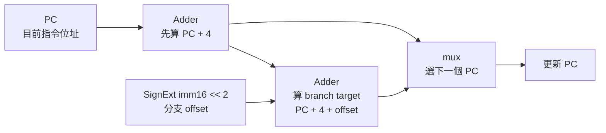


## ⭐控制訊號小整理


!!! danger 

    以下整理所有的訊號用途。

### 1. 先給你總覽：這張圖分成 5 類

這張 datapath(資料通路) 裡的名稱不要混在一起看，最好分成：

| 類別                              | 例子                                   | 本質                                  |
| ------------------------------- | ------------------------------------ | ----------------------------------- |
| Control signal(控制訊號)            | `RegDst`、`RegWr`、`ALUSrc`、`MemtoReg` | 控制某個硬體元件要不要動、或 mux 要選哪一路            |
| Status signal(狀態訊號)             | `zero`                               | ALU 回報比較結果給 IFU / branch decision 用 |
| Register number route(暫存器編號路線)  | `rs`、`rt`、`rd`、`Ra`、`Rb`、`Rw`        | 5-bit 編號，不是資料本身                     |
| Data bus(資料匯流排)                 | `busA`、`busB`、`busW`、ALU result      | 32-bit 資料本身或記憶體位址                   |
| Instruction field route(指令欄位路線) | `Instruction<31:0>`、`imm16`          | 從 instruction word(指令位元) 拆出來的欄位     |

---

### 2. Control signal(控制訊號)

| 名稱         | 控制哪裡                    | 作用                                                         | `0` 通常代表            | `1` 通常代表               | 常見用在哪些指令                                                 |
| ---------- | ----------------------- | ---------------------------------------------------------- | ------------------- | ---------------------- | -------------------------------------------------------- |
| `RegDst`   | 左上方選 `rt` 或 `rd` 的 mux  | 決定 Register File 的 `Rw` 要用哪個 destination register(目的暫存器編號) | 選 `rt`              | 選 `rd`                 | `0`：`ori`、`lw`；`1`：R-type 如 `addu`、`subu`                |
| `RegWr`    | Register File           | 決定這條指令是否要寫回暫存器                                             | 不寫 register         | 寫 register             | `1`：`addu`、`subu`、`ori`、`lw`；`0`：`sw`、`beq`              |
| `ExtOp`    | Extender                | 決定 `imm16` 要怎麼延伸成 32-bit                                   | zero extension(零延伸) | sign extension(符號延伸)   | `ori` 用 zero extension；`lw`、`sw`、`beq` 常用 sign extension |
| `ALUSrc`   | ALU 第二個輸入前的 mux         | 決定 ALU 第二個 input 來自 `busB` 還是 extended immediate           | 選 `busB`            | 選 `Extender` 輸出        | `0`：R-type、`beq`；`1`：`ori`、`lw`、`sw`                     |
| `ALUCtr`   | ALU                     | 決定 ALU 要做什麼運算                                              | 不是單純 0/1，而是多 bit 編碼 ==(add 是 00(ADD)、sub 是 01(SUB)、ori 是 10(OR)、lw/sw 都是 00(ADD)、beq 是 01(SUB)。)== | 不是單純 0/1，而是多 bit 編碼 ==(add 是 00(ADD)、sub 是 01(SUB)、ori 是 10(OR)、lw/sw 都是 00(ADD)、beq 是 01(SUB)。)==    | `ADD`：`addu`、`lw`、`sw`；`SUB`：`subu`、`beq`；`OR`：`ori`     |
| `MemWr`    | Data Memory 的 `WrEn` (Enable)    | 決定是否把資料寫入 Data Memory                                      | 不寫 Data Memory      | 寫 Data Memory          | `1`：`sw`；其他多數是 `0`                                       |
| `MemtoReg` | 右方寫回 mux                | ==決定 `busW` 來自 ALU result 還是 Data Memory output==              | 選 ALU result        | 選 Data Memory output   | `0`：R-type、`ori`；`1`：`lw`                                |
| `nPC_sel`  | IFU / next PC selection | 控制 next PC 的選擇邏輯，尤其是 branch 類指令                            | 一般順序執行 `PC + 4`     | 啟用 branch / next PC 選擇 | `beq` 會啟用；是否真的跳通常還要看 `zero`                              |

補一句很重要的：`nPC_sel = 1` 不一定代表「一定跳」。在 `beq` 裡，它通常代表「這是 branch 類指令，允許 IFU 根據 `zero` 判斷要不要跳」。真正是否跳到 target address，要看 `zero`。

---

### 3. Status signal(狀態訊號)

| 名稱     | 來源        | 送到哪裡                    | 作用                           | 常見情境                                        |
| ------ | --------- | ----------------------- | ---------------------------- | ------------------------------------------- |
| `zero` | ALU       | IFU / next PC decision  | 表示 ALU result 是否為 0          | `beq` 用 ALU 做 `R[rs] - R[rt]`，若結果是 0，代表兩者相等 |
| `clk`  | clock(時脈) | IFU、RegFile、Data Memory | 控制哪些元件在 clock edge(時脈邊緣)更新狀態 | PC 更新、暫存器寫入、記憶體寫入                           |

`zero` 不是 control signal(控制訊號)，它比較像 ALU 回報出來的 condition/status(條件狀態)。
例如 `beq`：ALU 做減法，若 `busA - busB = 0`，`zero = 1`，才代表 branch condition 成立。

---

### 4. Register number route(暫存器編號路線，5-bit)

這一類最容易和資料搞混。它們都是 5-bit register number(暫存器編號)，不是暫存器裡面的 32-bit 內容。

| 名稱   | bit 寬度 | 來源                   | 送到哪裡                                | 用途                                                    | 重點                      |
| ---- | -----: | -------------------- | ----------------------------------- | ----------------------------------------------------- | ----------------------- |
| `rs` |  5-bit | `Instruction<25:21>` | Register File 的 `Ra`                | 指定第一個要讀的 register                                     | `rs` 是編號，不是資料           |
| `rt` |  5-bit | `Instruction<20:16>` | Register File 的 `Rb`，也可經 mux 到 `Rw` | 可當第二個 source register，也可當 I-type destination register | `lw` / `ori` 的目的地是 `rt` |
| `rd` |  5-bit | `Instruction<15:11>` | 經 `RegDst` mux 到 `Rw`               | R-type 的 destination register                         | `addu`、`subu` 寫 `rd`    |
| `Ra` |  5-bit | `rs`                 | Register File 讀取 port A             | 告訴 RegFile 要讀哪個 register 到 `busA`                     | `Ra = rs`               |
| `Rb` |  5-bit | `rt`                 | Register File 讀取 port B             | 告訴 RegFile 要讀哪個 register 到 `busB`                     | `Rb = rt`               |
| `Rw` |  5-bit | `RegDst` mux 輸出      | Register File write register input  | 告訴 RegFile 要把 `busW` 寫到哪個 register                    | `Rw` 是目的暫存器編號，不是資料      |

最重要一句：`Rw` 決定「寫去哪個暫存器」，`busW` 決定「寫進去的 32-bit 資料是什麼」。

---

### 5. Data bus / data route(資料匯流排與資料路線，通常 32-bit)

| 名稱                    | bit 寬度 | 來源                       | 送到哪裡                               | 用途                                                                | 常見例子                                                 |
| --------------------- | -----: | ------------------------ | ---------------------------------- | ----------------------------------------------------------------- | ---------------------------------------------------- |
| `busA`                | 32-bit | Register File 讀出 `R[rs]` | ALU 第一個 input                      | ALU 的第一個運算資料                                                      | `lw`：base address；`addu`：第一個加數；`beq`：第一個比較值          |
| `busB`                | 32-bit | Register File 讀出 `R[rt]` | ALU 第二輸入 mux、Data Memory `Data In` | 可當 ALU 第二個資料，也可當 `sw` 要寫入 memory 的資料                              | `addu` 用它運算；`sw` 用它寫 memory                          |
| `busW`                | 32-bit | `MemtoReg` mux 輸出        | Register File write data input     | 真正要寫回 register 的資料                                                | `lw`：memory output；`addu`：ALU result                 |
| `imm16`               | 16-bit | `Instruction<15:0>`      | Extender                           | I-type immediate / offset                                         | `ori`、`lw`、`sw`、`beq` 都會用                            |
| Extended immediate    | 32-bit | Extender 輸出              | ALU 第二輸入 mux                       | 把 `imm16` 延伸成 ALU 可用的 32-bit 資料                                   | `ori`：zero-extended imm；`lw/sw`：sign-extended offset |
| ALU input A           | 32-bit | `busA`                   | ALU                                | ALU 第一輸入                                                          | 固定來自 `R[rs]`                                         |
| ALU input B           | 32-bit | `ALUSrc` mux 輸出          | ALU                                | ALU 第二輸入                                                          | 可能是 `busB` 或 extended immediate                      |
| ALU result            | 32-bit | ALU                      | Data Memory `Adr`、`MemtoReg` mux   | 運算結果；對 `lw/sw` 是 effective address(有效位址)，對 R-type / `ori` 是要寫回的結果 | `lw`：address；`addu`：加法結果                             |
| Data Memory `Adr`     | 32-bit | ALU result               | Data Memory address input          | 指定要讀/寫 Data Memory 的哪個位址                                          | `lw/sw` 都用 ALU result 當地址                            |
| Data Memory `Data In` | 32-bit | `busB`                   | Data Memory write data input       | `sw` 要寫進 memory 的資料                                               | `sw rt, imm(rs)` 會把 `R[rt]` 送到這裡                     |
| Data Memory output    | 32-bit | Data Memory              | `MemtoReg` mux                     | `lw` 從 memory 讀出的資料                                               | `lw` 會把它送到 `busW`                                    |
| Instruction<31:0>     | 32-bit | IFU                      | 指令欄位拆解線                            | 目前 fetch 到的整條指令                                                   | 再拆成 `rs`、`rt`、`rd`、`imm16`                           |

---

### 6. MUX(多工器)整理

| MUX 位置         | 控制訊號       | 輸入 0       | 輸入 1               | 輸出到哪裡                | 用途                 |
| -------------- | ---------- | ---------- | ------------------ | -------------------- | ------------------ |
| 左上 `Rw` 前的 mux | `RegDst`   | `rt`       | `rd`               | Register File 的 `Rw` | 選目的暫存器             |
| ALU 第二輸入前的 mux | `ALUSrc`   | `busB`     | Extended immediate | ALU input B          | 選 ALU 第二個資料來源      |
| 右方寫回 mux       | `MemtoReg` | ALU result | Data Memory output | `busW`               | 選寫回 register 的資料來源 |

最短判斷法：

| 問題                                     | 看哪個 mux / signal |
| -------------------------------------- | ---------------- |
| 要寫到 `rt` 還是 `rd`？                      | 看 `RegDst`       |
| ALU 第二個 input 是 register 還是 immediate？ | 看 `ALUSrc`       |
| 寫回 register 的資料來自 ALU 還是 memory？       | 看 `MemtoReg`     |

---

### 7. Functional unit(功能元件)

| 元件          | 輸入                                  | 輸出                        | 作用                            |
| ----------- | ----------------------------------- | ------------------------- | ----------------------------- |
| IFU         | `clk`、`nPC_sel`、`zero`，以及內部 PC      | `Instruction<31:0>`       | 取指令、更新 next PC                |
| RegFile     | `Ra`、`Rb`、`Rw`、`busW`、`RegWr`、`clk` | `busA`、`busB`             | 讀兩個 register，必要時寫回一個 register |
| Extender    | `imm16`、`ExtOp`                     | 32-bit extended immediate | 把 16-bit immediate 延伸成 32-bit |
| ALU         | `busA`、ALU input B、`ALUCtr`         | ALU result、`zero`         | 做加法、減法、OR、比較等運算               |
| Data Memory | `Adr`、`Data In`、`MemWr`、`clk`       | Data Memory output        | `lw` 讀資料，`sw` 寫資料             |

---

### 8. 依指令看路線：最容易記的版本

| 指令                            | 主要資料流                                                                                      |
| ----------------------------- | ------------------------------------------------------------------------------------------ |
| R-type `addu/subu rd, rs, rt` | `rs → Ra → busA → ALU`，`rt → Rb → busB → ALU`，ALU result → `busW` → `rd`                   |
| `ori rt, rs, imm16`           | `rs → busA`，`imm16 → ZeroExt → ALU`，ALU result → `busW` → `rt`                             |
| `lw rt, imm16(rs)`            | `rs → busA`，`imm16 → SignExt → ALU` 算 effective address，Data Memory output → `busW` → `rt` |
| `sw rt, imm16(rs)`            | `rs → busA`，`imm16 → SignExt → ALU` 算 effective address，`rt → busB → Data In` 寫入 memory    |
| `beq rs, rt, imm16`           | `rs → busA`，`rt → busB`，ALU 做 SUB，`zero` 回報是否相等，IFU 決定 next PC                             |

---

### 9. 最容易混淆的對照表

| 容易混的兩個東西                                      | 差異                                                                |
| --------------------------------------------- | ----------------------------------------------------------------- |
| `rt` vs `R[rt]`                               | `rt` 是 5-bit 編號；`R[rt]` 是該暫存器裡的 32-bit 資料                         |
| `Rw` vs `busW`                                | `Rw` 是要寫入哪個 register；`busW` 是要寫入的資料                               |
| `busB` vs `Data In`                           | `busB` 是 RegFile 讀出的 `R[rt]`；在 `sw` 時它會送到 Data Memory 的 `Data In` |
| ALU result in `lw/sw` vs ALU result in R-type | `lw/sw` 的 ALU result 是 memory address；R-type 的 ALU result 是計算結果   |
| `MemWr` vs `RegWr`                            | `MemWr` 寫 Data Memory；`RegWr` 寫 Register File                     |
| `RegDst` vs `MemtoReg`                        | `RegDst` 選寫到哪個 register；`MemtoReg` 選寫回 register 的資料來源             |
| `nPC_sel` vs `zero`                           | `nPC_sel` 表示 branch 類 next PC 控制；`zero` 表示 ALU 比較結果是否為 0          |


## ⭐Control Logic(控制邏輯) — CPU 如何從指令 bits 自動產生控制訊號？

講義位置：PDF viewer page 75 ~ 82

### 1. 這個知識點在解決什麼問題？

前面我們已經一條一條看過：

| 指令              | 需要哪些控制訊號                              |
| --------------- | ------------------------------------- |
| `addu` / `subu` | 寫 `rd`、ALU 用 `busB`、寫回 ALU result     |
| `ori`           | 寫 `rt`、ALU 用 immediate、zero extension |
| `lw`            | 寫 `rt`、ALU 算地址、從 memory 寫回 register   |
| `sw`            | ALU 算地址、把 `rt` 內容寫進 memory            |
| `beq`           | ALU 做比較、依 `zero` 決定 next PC           |

但 CPU 不可能靠人工說：「現在這條是 `lw`，請把 `RegWr` 打開。」
CPU 只能看 instruction word(指令位元) 裡的欄位，例如 `opcode` 和 `funct`。

所以本輪核心問題是：

CPU 要如何根據 `opcode` / `funct`，自動產生 `RegDst`、`ALUSrc`、`MemtoReg`、`RegWr`、`MemWr`、`nPC_sel`、`ExtOp`、`ALUctr`？

講義把這一步稱為把 control signals(控制訊號) 集成成完整 control logic(控制邏輯)。

---

### 2. 第一層：先判斷目前是哪一種指令

控制邏輯第一步不是直接算 `RegWr`，而是先根據 `opcode` / `funct` 判斷：

| 指令種類                        | 判斷來源                         |
| --------------------------- | ---------------------------- |
| `add` / `sub`               | `opcode = 000000`，再看 `funct` |
| `ori` / `lw` / `sw` / `beq` | 直接看 `opcode`                 |

講義列出的重點是：

| 指令    | `opcode` |  `funct` |
| ----- | -------: | -------: |
| `add` | `000000` | `100000` |
| `sub` | `000000` | `100010` |
| `ori` | `001101` |       不用 |
| `lw`  | `100011` |       不用 |
| `sw`  | `101011` |       不用 |
| `beq` | `000100` |       不用 |

所以 `R-type` 指令要多看 `funct`，但 I-type 指令大多只靠 `opcode` 就可以辨識。

---

### 3. 第二層：把「哪條指令會讓控制訊號等於 1」寫成邏輯式

講義的控制表已經告訴我們每條指令的控制訊號值，例如 `lw` 會讓 `MemtoReg = 1`，`sw` 會讓 `MemWr = 1`，`beq` 會讓 `nPC_sel = 1`。

接著把表格轉成 boolean equation(布林邏輯式)：

| 控制訊號        | 邏輯式                    | 直覺意思                                |
| ----------- | ---------------------- | ----------------------------------- |
| `RegDst`    | `add + sub`            | 只有 R-type 算術結果寫到 `rd`               |
| `ALUSrc`    | `ori + lw + sw`        | 這三個需要 immediate 當 ALU 第二輸入          |
| `MemtoReg`  | `lw`                   | 只有 `lw` 需要 memory output 寫回暫存器      |
| `RegWr`     | `add + sub + ori + lw` | 這四個會寫 register                      |
| `MemWr`     | `sw`                   | 只有 `sw` 會寫 Data Memory              |
| `nPC_sel`   | `beq`                  | 只有 branch 可能改變 next PC              |
| `ExtOp`     | `lw + sw`              | 講義表格中 `lw` / `sw` 需要 sign extension |
| `ALUctr[0]` | `sub + beq`            | `sub` 與 `beq` 都需要 ALU 做 SUB         |
| `ALUctr[1]` | `or`                   | `ori` 需要 OR 運算                      |

這裡的 `+` 不是加法，而是 OR(或閘)。
例如：

`RegWr = add + sub + ori + lw`

意思是：只要現在指令是 `add`、`sub`、`ori`、`lw` 任一種，`RegWr` 就要等於 1。講義也列出同樣的控制器邏輯運算式。

---

### 4. 第三層：把指令名稱本身也變成邏輯式

像 `lw`、`sw`、`beq` 不是 CPU 腦中真正存在的中文或英文單字。
硬體真正看到的是 bit pattern(位元樣式)。

例如 `beq` 的 `opcode = 000100`。

如果把 `opcode` 依序寫成：

| bit   |   值 |
| ----- | --: |
| `op5` | `0` |
| `op4` | `0` |
| `op3` | `0` |
| `op2` | `1` |
| `op1` | `0` |
| `op0` | `0` |

那 `beq` 這個偵測條件可以寫成：

`beq = ~op5 · ~op4 · ~op3 · op2 · ~op1 · ~op0`

這裡：

| 符號  | 意思      |
| --- | ------- |
| `~` | NOT(反相) |
| `·` | AND(及閘) |
| `+` | OR(或閘)  |

所以控制器實際上是兩層：

1. 用 AND / NOT 偵測「目前是哪條指令」。
2. 用 OR 把「哪些指令需要某控制訊號」合併起來。

講義在 PDF viewer page 80 ~ 81 正是在做這件事：先寫出 `add`、`sub`、`rtype`、`ori`、`lw`、`sw`、`beq` 的偵測式，再寫出 `RegDst`、`ALUSrc`、`MemtoReg` 等控制訊號的總邏輯式。

---

### 5. 生活化例子：控制器像「分類後自動開關」

你可以把 CPU 控制器想成捷運站閘門：

1. 先掃票卡，判斷你是哪種乘客：普通票、學生票、敬老票。
2. 再根據乘客類型，自動開不同通道或套用不同規則。

CPU 也是：

1. 先掃 `opcode` / `funct`，判斷現在是 `lw`、`sw`、`beq`、`ori`、`add`、`sub`。
2. 再根據指令類型，自動打開需要的控制訊號。

所以控制邏輯不是新資料路徑，而是「讓前面那些 mux、RegFile、Memory、ALU 自動選對路」。

---

### 6. 最短記法

控制邏輯的最短理解：

先偵測 instruction type(指令種類)，再用 OR gate(或閘) 合成控制訊號。

最重要的邏輯式先背這組：

| 控制訊號        | 最短記法                                             |
| ----------- | ------------------------------------------------ |
| `RegDst`    | R-type arithmetic：`add + sub`                    |
| `ALUSrc`    | 有 ALU immediate 或 address offset：`ori + lw + sw` |
| `MemtoReg`  | 只有 `lw`                                          |
| `RegWr`     | 會寫 register：`add + sub + ori + lw`               |
| `MemWr`     | 只有 `sw`                                          |
| `nPC_sel`   | 只有 `beq`                                         |
| `ALUctr[0]` | 做 SUB：`sub + beq`                                |
| `ALUctr[1]` | 做 OR：`ori`                                       |


### 結論

!!! danger

    

    

    /// collapse-code  
    ```v
    module Control_Logic (
        input  [5:0] opcode, func,
        output RegDst, ALUSrc, MemtoReg, RegWr, MemWr, nPC_sel, ExtOp, 
        output [1:0] ALUctr
    );

        wire rtype, add, sub, ori, lw, sw, beq;

        level_one g1 (opcode, func, rtype, add, sub, ori, lw, sw, beq);

        level_two g2 (add, sub, ori, lw, sw, beq, RegDst, ALUSrc, MemtoReg, RegWr, MemWr, nPC_sel, ExtOp, ALUctr);

    endmodule


    module level_one (
        input  [5:0] opcode, func,
        output rtype, add, sub, ori, lw, sw, beq
    );

        wire op5, op4, op3, op2, op1, op0;
        wire func5, func4, func3, func2, func1, func0;

        assign {op5, op4, op3, op2, op1, op0} = opcode;
        assign {func5, func4, func3, func2, func1, func0} = func;

        // rtype = ~op5 · ~op4 · ~op3 · ~op2 · ~op1 · ~op0
        assign rtype = (~op5) & (~op4) & (~op3) & (~op2) & (~op1) & (~op0);

        // add = rtype · func5 · ~func4 · ~func3 · ~func2 · ~func1 · ~func0
        assign add = rtype & func5 & (~func4) & (~func3) & (~func2) & (~func1) & (~func0);

        // sub = rtype · func5 · ~func4 · ~func3 · ~func2 · func1 · ~func0
        assign sub = rtype & func5 & (~func4) & (~func3) & (~func2) & func1 & (~func0);

        // ori = ~op5 · ~op4 · op3 · op2 · ~op1 · op0
        assign ori = (~op5) & (~op4) & op3 & op2 & (~op1) & op0;

        // lw = op5 · ~op4 · ~op3 · ~op2 · op1 · op0
        assign lw = op5 & (~op4) & (~op3) & (~op2) & op1 & op0;

        // sw = op5 · ~op4 · op3 · ~op2 · op1 · op0
        assign sw = op5 & (~op4) & op3 & (~op2) & op1 & op0;

        // beq = ~op5 · ~op4 · ~op3 · op2 · ~op1 · ~op0
        assign beq = (~op5) & (~op4) & (~op3) & op2 & (~op1) & (~op0);

    endmodule


    module level_two (
        input  add, sub, ori, lw, sw, beq,
        output RegDst, ALUSrc, MemtoReg, RegWr, MemWr, nPC_sel, ExtOp, 
        output [1:0] ALUctr
    );

        // RegDst = add + sub
        assign RegDst = add | sub;

        // ALUSrc = ori + lw + sw
        assign ALUSrc = ori | lw | sw;

        // MemtoReg = lw
        assign MemtoReg = lw;

        // RegWr = add + sub + ori + lw
        assign RegWr = add | sub | ori | lw;

        // MemWr = sw
        assign MemWr = sw;

        // nPC_sel = beq
        assign nPC_sel = beq;

        // ExtOp = lw + sw
        // 依照講義控制表，beq 的 ExtOp 是 x，所以這裡不放 beq
        assign ExtOp = lw | sw;

        // ALUctr[0] = sub + beq
        assign ALUctr[0] = sub | beq;

        // ALUctr[1] = ori
        assign ALUctr[1] = ori;

    endmodule
    ```
    ///


### "add/sub/ori/lw/sw/beq" 是實際上只有這些，還是因為這些較常見所以用這些舉例

不是實際 MIPS 只有 `add/sub/ori/lw/sw/beq`。

在**這份講義目前這個單週期 datapath(資料通路)／control logic(控制邏輯)範圍內**，老師只拿這幾個指令當作一個「最小教學子集合」來實作控制器。講義前面先列出本章要分析的指令需求，包括 `addu/subu/ori/lw/sw/beq`，後面控制表則用 `add/sub/ori/lw/sw/beq` 來列控制訊號與 Boolean equation(布林式)。

實際 MIPS ISA(Instruction Set Architecture，指令集架構)有很多更多指令，例如 `addi`、`andi`、`slt`、`j`、`jal`、`jr`、`bne`、`lb`、`sb`、`lui` 等；Waterloo 的 MIPS encoding reference 也明確說 opcode/funct 表列的是多個可用 operations(操作)，不只這六個。