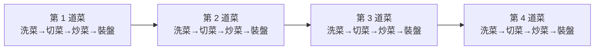
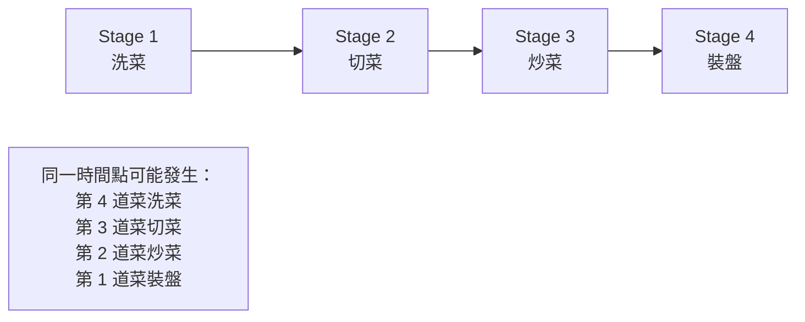
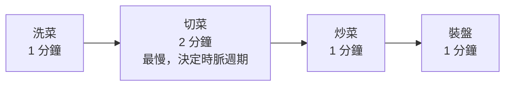
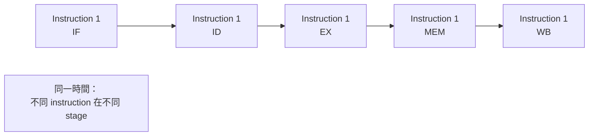

## ⭐Pipelining(管道化) — 為什麼一件事沒變快，整體卻變快？

講義位置：PDF viewer page 2 ~ PDF viewer page 23

### 1. 這個知識點在解決什麼問題？

Pipelining(管道化) 要解決的不是「把單一工作變得更快」，而是「讓很多工作可以重疊進行」。

生活化例子就是講義的做菜流程：

| 模式                  |                  做法 | 四道菜總時間 |
| ------------------- | ------------------: | -----: |
| Non-pipelined(非管道化) |      第一道菜完整做完，再做第二道 |  16 分鐘 |
| Pipelined(管道化)      | 第一道菜洗菜後，馬上讓第二道菜進入洗菜 |   7 分鐘 |

講義的非管道化例子把一道菜拆成 4 步：洗菜、切菜、炒菜、裝盤。若每步 1 分鐘，單一道菜要 4 分鐘；若四道菜完全一個接一個做，就是 16 分鐘。

---

### 2. Non-pipelined(非管道化)：像只有一個人從頭做到尾

非管道化的核心限制是：**同一時間只服務一個任務**。

做菜例子中，假設第 1 道菜正在洗菜，其他菜不能開始；第 1 道菜切菜時，洗菜區也閒著；第 1 道菜炒菜時，切菜區也閒著。也就是很多資源會空等。

用時間線看會像這樣：

這個模式的重點不是慢在某一步，而是慢在「不能重疊」。

---

### 3. Pipelined(管道化)：像廚房有四個工作站

管道化把一個工作拆成多個 stage(階段)，每個 stage 可以同時處理不同任務。

做菜例子：

| Stage(階段) | 工作 |
| --------- | -- |
| Stage 1   | 洗菜 |
| Stage 2   | 切菜 |
| Stage 3   | 炒菜 |
| Stage 4   | 裝盤 |

當第 1 道菜進入切菜時，洗菜區空出來，所以第 2 道菜可以開始洗菜。當第 1 道菜進入炒菜時，第 2 道菜可以切菜，第 3 道菜可以洗菜。

講義 PDF viewer page 5～13 就是在逐分鐘展示這件事：第 1 道菜先進入洗菜，之後每過一分鐘，新的一道菜進入前面的空階段，直到第 4 道菜完成。

---

### 4. 最重要的不變量：單一道菜沒有變快

這是很多人第一次學管道化最容易錯的地方。

管道化後：

| 問題               | 答案                                 |
| ---------------- | ---------------------------------- |
| 單一道菜從開始到完成有沒有變快？ | 沒有，還是 4 分鐘                         |
| 四道菜總時間有沒有變短？     | 有，從 16 分鐘變 7 分鐘                    |
| 管道化主要提升什麼？       | Throughput(吞吐率)，不是單一任務 latency(延遲) |

講義 PDF viewer page 14 也明確寫到：管道化填滿後，可以每 1 分鐘上一道菜；但單獨一道菜仍然需要 4 分鐘。

---

### 5. 套到 CPU：一道菜就像一條指令

在 CPU 中，一條 MIPS 指令也可以拆成多個 stage(階段)。講義列出五個主要步驟：

| Stage(階段) | 英文             | 做什麼                            |
| --------- | -------------- | ------------------------------ |
| 1         | Fetch(取指令)     | 從記憶體取出指令，更新 PC                 |
| 2         | Decode(解碼)     | 解碼指令，從 register file(暫存器堆) 讀資料 |
| 3         | Execute(執行)    | ALU 運算，或計算記憶體位址                |
| 4         | Memory(存取)     | load 讀記憶體，store 寫記憶體           |
| 5         | Write-back(寫回) | 把結果寫回 register file(暫存器堆)      |

講義 PDF viewer page 16 明確列出 MIPS 的五個主要步驟，PDF viewer page 17 則把它們對應到 datapath(資料通路) 上。

---

### 6. Pipeline register(管道化暫存器)：為什麼要加暫存器？

如果我們想讓多條指令同時在不同 stage 裡跑，就需要在 stage 之間加上 pipeline register(管道化暫存器)。

它的功能像「交接櫃台」：

| 沒有 pipeline register | 有 pipeline register   |
| -------------------- | --------------------- |
| 前後 stage 的資料容易混在一起   | 每個 stage 的輸出先被暫存      |
| 很難讓多條指令同時存在          | 可以每個 clock(時脈) 往下一站推進 |
| 像整間廚房只有一張工作桌         | 像每站都有自己的托盤            |

講義 PDF viewer page 18 的圖，就是在原本 datapath(資料通路) 中間加入多條垂直的 pipeline register(管道化暫存器)。

---

### 7. 管道化真正提升的是 Throughput(吞吐率)

我們把 CPU 版本跟做菜版本對齊：

| 做菜例子        | CPU 例子             |
| ----------- | ------------------ |
| 一道菜         | 一條指令               |
| 洗菜、切菜、炒菜、裝盤 | IF、ID、EX、MEM、WB    |
| 每 1 分鐘完成一道菜 | 每 1 個 clock 完成一條指令 |
| 第一道菜仍需 4 分鐘 | 單條指令仍需完整走完 5 stage |
| 多道菜總完成時間變短  | 多條指令總執行時間變短        |

講義 PDF viewer page 23 的結論是：管道化中的處理元件可以並行工作，使整體程序執行時間縮短；但管道化不會縮短單條指令的執行時間，甚至可能增加，真正提高的是 instruction throughput(指令吞吐率)。

---

### 8. Pipeline register delay(管道化暫存器延遲)：為什麼可能讓單條指令更慢？

理想情況下，如果五個 stage 各 200ps，單條指令經過五個 stage 是 1000ps。

但實際加入 pipeline register(管道化暫存器) 會有額外延遲。講義的例子是假設 pipeline register delay 為 50ps，因此每個 stage 的 clock cycle time(時脈週期) 從 200ps 變成 250ps。結果單條指令走完五個 stage 變成：

250ps × 5 = 1250ps

所以管道化後：

| 指標                   | 變化                            |
| -------------------- | ----------------------------- |
| 單條指令 latency(延遲)     | 可能變長                          |
| 多條指令 throughput(吞吐率) | 變好                            |
| 理想 speedup(加速比)      | 受 stage 平衡與 register delay 限制 |

講義 PDF viewer page 21～22 用 200ps 與 250ps 的例子比較「未考慮」與「考慮」管道化暫存器延遲的差異。

---

### 9. 最短記法

Pipelining(管道化) 的一句話：

**把一條工作切成多個 stage(階段)，讓不同工作同時待在不同 stage；它主要提升 throughput(吞吐率)，不保證降低單一工作 latency(延遲)。**

考試看到 pipeline，先問自己三件事：

1. 有幾個 stage？
2. 每個 stage 的 clock cycle time(時脈週期) 是多少？
3. 題目問的是 latency(單一任務時間) 還是 throughput(單位時間完成量)？

---

### 10. 常見錯法

| 錯誤說法                      | 為什麼錯                                                   |
| ------------------------- | ------------------------------------------------------ |
| 管道化會讓單條指令變快               | 不一定；單條指令還是要走完所有 stage，甚至可能因 pipeline register delay 變慢 |
| 五階段管道化一定快 5 倍             | 只有在大量指令、stage 平衡、沒有 hazard(危障)、暫存器延遲很小時才接近             |
| 管道化就是平行處理，所以每條指令同時做完      | 錯；是不同指令在不同 stage 同時前進，不是同一條指令同時完成所有 stage              |
| 第一條指令也會馬上享受 throughput 優勢 | 錯；pipeline 要先 fill(填滿)，第一條仍要走完整流程                      |

!!! danger

    ### 錯題

    latency 是單一任務時間，所以每一個 stage 如果是 200ps，共有 5 個 stage，那 latency 應該是 5 * 200 = 1000。

    然後如果 CPU pipeline has a 50 ps pipeline register delay，有 5 個 stage，那 latency 就是 250 * 5 = 1250 。

    然後 throughput 是單位時間完成量。
## ⭐Pipeline Optimization(管道化的優化) — 為什麼 pipeline 不是切越多越好？

講義位置：PDF viewer page 24 ~ PDF viewer page 30

### 1. 這個知識點在解決什麼問題？

上一輪我們學到：pipelining(管道化) 可以提升 throughput(吞吐率)，但不一定降低 latency(延遲)。

這一輪講義往前問一個更細的問題：

**既然管道化靠切 stage(階段) 變快，那是不是 stage 切越多越好？**

答案是：**不是。**

原因有兩個：

| 限制                                | 意思                                           |
| --------------------------------- | -------------------------------------------- |
| Stage imbalance(階段不平衡)            | 最慢的 stage 會決定 clock cycle time(時脈週期)         |
| Pipeline register delay(管道化暫存器延遲) | 切越多 stage，需要越多 pipeline registers，額外延遲比例可能變大 |

講義 PDF viewer page 25 先用平衡管道化複習：每階段 1 分鐘時，管道化連續工作可接近每 1 分鐘上一道菜；PDF viewer page 26 接著改成切菜需要 2 分鐘，整條 pipeline 的時脈週期就被拖成 2 分鐘。

---

### 2. Stage imbalance(階段不平衡)：最慢的一站會卡住全部

想像廚房有四站：

| Stage(階段) |   時間 |
| --------- | ---: |
| 洗菜        | 1 分鐘 |
| 切菜        | 2 分鐘 |
| 炒菜        | 1 分鐘 |
| 裝盤        | 1 分鐘 |

這時 pipeline 不能每 1 分鐘推進一次，因為「切菜」還沒做完。整條 pipeline 的 clock cycle time(時脈週期) 會被最慢 stage 決定，也就是 2 分鐘。

最短記法：

**Pipeline 的速度由最慢 stage 決定。**

所以，pipeline optimization(管道化優化) 的第一個方向就是：**讓每個 stage 盡量平衡。**

---

### 3. Pipeline balancing(管道化平衡)：把太慢的一站切開

講義 PDF viewer page 27 的做法是把「切菜」拆成：

| 原本      | 調整後       |
| ------- | --------- |
| 切菜：2 分鐘 | 切菜 1：1 分鐘 |
|         | 切菜 2：1 分鐘 |

這樣整條 pipeline 變成：

| Stage(階段) |   時間 |
| --------- | ---: |
| 洗菜        | 1 分鐘 |
| 切菜 1      | 1 分鐘 |
| 切菜 2      | 1 分鐘 |
| 炒菜        | 1 分鐘 |
| 裝盤        | 1 分鐘 |

結果 clock cycle time(時脈週期) 可以回到 1 分鐘；但單一道菜要經過 5 個 stage，所以單一道菜 latency(延遲) 變成約 5 分鐘。

這裡出現第一個 trade-off(取捨)：

| 優點                            | 代價                          |
| ----------------------------- | --------------------------- |
| stage 更平衡，clock cycle time 變短 | stage 數增加，單一任務 latency 可能增加 (因為 pipeline register delay) |
| throughput 變好                 | 控制與 pipeline register 成本增加  |

---

### 4. Super Pipelining(超級管道化)：把 stage 切得更細

Super Pipelining(超級管道化) 的想法是：

**把原本的 pipeline stage 切成更多、更短的 stage，藉此提高 clock frequency(時脈頻率)，進一步提高 throughput(吞吐率)。**

講義 PDF viewer page 28 的例子：

| 設計                | 每個邏輯 stage 延遲 | pipeline register delay | clock cycle time |
| ----------------- | ------------: | ----------------------: | ---------------: |
| 5-stage pipeline  |         200ps |                    50ps |            250ps |
| 10-stage pipeline |         100ps |                    50ps |            150ps |

所以 10-stage 的 clock cycle time 比 5-stage 短：150ps < 250ps。這代表理想情況下 throughput 可能提高。

---

### 5. 為什麼不是越深越好？

講義 PDF viewer page 29 直接問：「管道化的級數是越多越好嗎？」答案是否定的。原因是 pipeline register delay(管道化暫存器延遲) 的比例變大。

比較：

| 設計       | clock cycle time |        單條指令 latency | register delay 比例 |
| -------- | ---------------: | ------------------: | ----------------: |
| 5-stage  |            250ps |  5 × 250ps = 1250ps |    50 / 250 = 20% |
| 10-stage |            150ps | 10 × 150ps = 1500ps |    50 / 150 = 33% |

關鍵觀念：

**切 stage 可以讓每個 stage 的邏輯工作變短，但 pipeline register delay 不會跟著等比例變小。**

所以切太細時，很多時間都耗在「stage 之間的交接成本」，不是實際運算。

生活化例子：如果餐廳把「切菜」拆成太多小步，每一步本身很短，但每次交接都要登記、搬盤、確認，最後交接成本可能吃掉好處。

---

### 6. 本輪最重要的 mental model(心智模型)

可以把 pipeline 想成一條捷運線：

| CPU pipeline            | 捷運類比               |
| ----------------------- | ------------------ |
| stage                   | 車站                 |
| instruction             | 乘客                 |
| clock cycle             | 每班車發車間隔            |
| pipeline register delay | 乘客上下車、關門、確認安全的固定時間 |
| stage imbalance         | 某一站上下車特別慢，拖住整條線    |

因此：

1. 如果每站都差不多快，班距可以壓低，throughput 好。
2. 如果某站很慢，整條線都要等它。
3. 如果站切太多，每站之間的停靠與交接成本反而變高。
4. 所以 pipeline depth(管道化深度) 要平衡，不是越多越好。

---

### 7. 常見錯法

| 錯誤說法                                      | 修正                                                           |
| ----------------------------------------- | ------------------------------------------------------------ |
| stage 越多，CPU 一定越快                         | 不一定；register delay、hazard penalty、控制複雜度都會增加                  |
| 只要把最慢 stage 切開，就沒有代價                      | 有代價；stage 數增加，pipeline register 與控制成本增加                      |
| 10-stage clock 比 5-stage 短，所以單條指令一定更快     | 錯；講義例子中 10-stage 單條指令 latency 是 1500ps，比 5-stage 的 1250ps 更長 |
| pipeline optimization 只看 clock cycle time | 不夠；還要看 latency、throughput、register delay、stage balance       |

### 所以講義到底要表達什麼？他說"「管道化的級數是越多越好嗎？」答案是否定的"，到底為何否定？

#### 1. 講義真正要否定的是「只要級數越多，整體就一定越好」

講義不是說：

**「級數越多，throughput(吞吐率) 完全不會增加。」**

它真正否定的是：

**「只要把 pipeline depth(管道化深度) 一直加深，CPU 整體設計就一定越好。」**

也就是說，講義的「否！」是在否定 **越多越好** 這個單調結論，不是在否定 super pipelining(超級管道化) 可以提高 clock frequency(時脈頻率) 與 instruction throughput(指令吞吐率)。講義前一頁確實說，將五級管道化細分成更多階段，可以提升時脈頻率、提高指令吞吐率；但下一頁馬上用 5-stage 與 10-stage 的數字說明代價。

---

#### 2. 為什麼否定？因為它不是免費提高 throughput

講義給的關鍵數字是：

| 設計       |                 時脈週期 | 單條指令延遲 | pipeline register delay 比例 |
| -------- | -------------------: | -----: | -------------------------: |
| 5-stage  | 200ps + 50ps = 250ps | 1250ps |             50 / 250 = 20% |
| 10-stage | 100ps + 50ps = 150ps | 1500ps |             50 / 150 = 33% |

所以 10-stage 的確有較短 clock cycle time，理想 throughput 會比較高；但它同時讓單條指令 latency 從 **1250ps 變成 1500ps**，而且每個 cycle 裡面有更大比例是在付 pipeline register delay(管道化暫存器延遲)。

這就是講義否定的核心：

**級數變多會提高理想吞吐率，但會讓交接成本比例變大，單條指令延遲變長，所以不能說越多越好。**

---

#### 3. 最精準的一句話

講義想表達的是：

**Pipeline depth 有最佳化取捨點，不是越深越好。**

原因是：

1. stage 切更多，logic delay(邏輯延遲) 變短，所以 clock cycle time 可能下降。
2. 但每多切一段，就多一份 pipeline register overhead(管道化暫存器額外成本)。
3. register delay 不會跟著你切 stage 而等比例變小。
4. 所以 deeper pipeline(更深管線) 的 throughput improvement(吞吐率改善) 會越來越小。
5. 同時 single-instruction latency(單條指令延遲)、控制複雜度、hazard penalty(危障懲罰) 會變大。

---

#### 4. 你可以這樣理解講義的「否！」

它不是在說：

**10-stage 比 5-stage 的 throughput 一定比較差。**

而是在說：

**不能因為 10-stage 的 clock cycle time 比 5-stage 短，就推論 20-stage、50-stage、100-stage 一定越來越好。**

因為最後會變成：

| 變化                         | 結果                            |
| -------------------------- | ----------------------------- |
| clock cycle time           | 繼續下降，但越來越接近 register delay 下限 |
| ideal throughput           | 繼續上升，但邊際效益越來越小                |
| single-instruction latency | 越來越容易變高                       |
| pipeline register delay 比例 | 越來越大                          |
| 分支錯誤／stall 的代價             | 通常越深越痛                        |
| 設計複雜度與功耗                   | 增加                            |

---

#### 5. 考試版答案

中文考試版：

**管道化級數不是越多越好。增加級數可以把每個 stage 的邏輯延遲變短，降低 clock cycle time，進而提高理想 instruction throughput；但每個 stage 之間都需要 pipeline register，而 pipeline register delay 不會消失。當級數增加時，register overhead 的比例上升，單條指令 latency 可能增加，且控制複雜度與 hazard penalty 也會提高。因此 pipeline depth 存在取捨，不是越深越好。**

英文考試版：

**Pipeline depth is not always better when increased. A deeper pipeline can reduce the clock cycle time and improve ideal instruction throughput, but each additional stage introduces pipeline register overhead. As the number of stages increases, the register delay becomes a larger fraction of the cycle time, single-instruction latency may increase, and hazard penalties and control complexity also become worse. Therefore, pipeline depth involves a trade-off rather than a simple “more is better” rule.**

## ⭐Superscalar Pipeline(超標量管道化) — 除了把 pipeline 切更細，還能不能一次跑更多條指令？

講義位置：PDF viewer page 31 ~ PDF viewer page 44

### 1. 這個知識點在解決什麼問題？

前面我們學的是 scalar pipeline(標量管道化)：
一條 pipeline 被切成很多 stage，讓不同 instruction(指令) 可以在不同 stage 重疊執行。

但 scalar pipeline 的理想狀態通常是：

**每個 clock cycle 最多完成 1 條 instruction。**

Superscalar Pipeline(超標量管道化) 想解決的問題是：

**如果我不只切時間，還直接增加硬體資源，那能不能每個 clock cycle 發射／完成多條 instruction？**

講義 PDF viewer page 32 對 superscalar(超標量) 的定義是：具有兩條或兩條以上並行工作的管道化結構，稱為超標量結構；使用這種結構的處理器稱為 superscalar processor(超標量處理器)。

---

### 2. Scalar pipeline(標量管道化)：時間上的重疊

Scalar pipeline(標量管道化) 的核心是 ==**time parallelism(時間並行性)**==。

意思是：
同一份硬體流程被切成 stage，不同 instruction 分別卡在不同 stage 裡。

像這樣：

它像一條生產線：
每個時間點，這條線上可以有很多產品，但每個入口通常一次只放一個產品。

---

### 3. Superscalar pipeline(超標量管道化)：空間上的複製

Superscalar pipeline(超標量管道化) 的核心是 ==**space parallelism(空間並行性)**==。

意思是：
不只是把同一條 pipeline 切 stage，而是增加多條可以並行工作的 pipeline 或 functional units(功能單元)。

講義 PDF viewer page 43 的說法很精準：

| 轉換             | 本質                  |
| -------------- | ------------------- |
| 單週期 → 標量管道化    | 時間並行性的優化，主要是對現有硬體切分 |
| 標量管道化 → 超標量管道化 | 空間並行性的優化，需要成倍增加硬體資源 |

也就是說，super pipelining(超級管道化) 是「切更細」，superscalar(超標量) 是「開更多條線」。

---

### 4. 用做菜比喻比較

前面 scalar pipeline 像是：

| Stage |  人數 |
| ----- | --: |
| 洗菜    | 1 人 |
| 切菜    | 1 人 |
| 炒菜    | 1 人 |
| 裝盤    | 1 人 |

Pipeline 填滿後，每分鐘上一道菜。

Superscalar 則像是：

| Stage |  人數 |
| ----- | --: |
| 洗菜    | 2 人 |
| 切菜 1  | 2 人 |
| 切菜 2  | 2 人 |
| 炒菜    | 2 人 |
| 裝盤    | 2 人 |

如果每一站都有足夠人手，而且菜彼此不互相卡住，那每分鐘可以處理兩道菜。講義 PDF viewer page 33 ~ 35 就是在用做菜流程展示超標量：同一時間可以讓兩道菜一起往前推。

---

### 5. Super pipelining vs Superscalar：這兩個很容易混

| 技術               | 中文    | 做法                     | 主要改善                          |
| ---------------- | ----- | ---------------------- | ----------------------------- |
| Super pipelining | 超級管道化 | 把 pipeline 切成更多 stages | 降低 clock cycle time，提高時脈頻率    |
| Superscalar      | 超標量   | 增加多條 pipeline／功能單元     | 提高每個 cycle 可處理的 instruction 數 |
| Pipeline         | 管道化   | 把工作切 stage 並重疊         | 提高 throughput                 |

最短比較：

**Super pipelining 是「更細」；superscalar 是「更多條」。**

---

### 6. Pentium 例子：雙發射、兩條 pipeline

講義 PDF viewer page 39 用 Pentium 當例子：Pentium 是第一款 superscalar x86 CPU，具有 U pipeline(U 管道) 與 V pipeline(V 管道)，屬於 dual-issue(雙發射)、5-stage pipeline。講義也寫到：每條 pipeline 都有自己的位址產生邏輯、ALU 與 data cache interface，因此在一個 clock cycle 內可以同時發送兩條指令。

所以 superscalar 的代價很明顯：

**不是免費多跑一條指令，而是要多準備硬體資源。**

---

### 7. Superscalar 不等於永遠兩倍快

理想 dual-issue superscalar(雙發射超標量) 好像可以每 cycle 完成 2 條 instruction，但現實會被限制：

| 限制                      | 為什麼會卡住                   |
| ----------------------- | ------------------------ |
| Data dependency(資料相依)   | 第二條指令需要第一條指令結果，就不能真的同時執行 |
| Structural hazard(結構危障) | 兩條指令搶同一個硬體資源             |
| Control hazard(控制危障)    | 分支還沒確定，後面指令可能取錯          |
| Instruction mix(指令組合)   | 同一 cycle 可配對的指令類型有限      |
| Hardware cost(硬體成本)     | 多 ALU、多解碼器、多 ports，都很貴   |

所以考試看到 superscalar，要寫：

**它提高的是 peak throughput(峰值吞吐率)，但實際能不能達到，要看指令相依性、硬體資源與 hazard。**

---

### 8. 和 multi-core(多核心) 的關係

講義 PDF viewer page 44 說：現代 multi-core CPU(多核心 CPU) 通常是在一個 CPU chip 中整合多個 superscalar processor cores(超標量處理器核心)。

這句話的意思是：

| 層級               | 說明                      |
| ---------------- | ----------------------- |
| Superscalar core | 單一核心內部一次發射多條指令          |
| Multi-core CPU   | 一顆晶片裡有多個核心              |
| Modern CPU       | 常常是「多核心」加上「每個核心本身也是超標量」 |

生活化講法：

* superscalar：一間廚房裡每個工作站有兩組人馬。
* multi-core：有好幾間廚房。
* modern CPU：通常是好幾間廚房，而且每間廚房裡也有多組人馬。

---

### 9. 常見錯法

| 錯誤說法                              | 修正                                           |
| --------------------------------- | -------------------------------------------- |
| superscalar 就是 pipeline 切更多 stage | 錯，那是 super pipelining                        |
| superscalar 一定剛好快 2 倍             | 不一定，受資料相依、hazard、指令組合限制                      |
| pipeline 和 superscalar 是同一件事      | 不同；pipeline 是時間重疊，superscalar 是硬體資源並行        |
| multi-core 和 superscalar 一樣       | 不一樣；multi-core 是多核心，superscalar 是單核心內多發射／多管線 |

### time parallelism(時間並行性)為何叫做 時間，space parallelism(空間並行性)為何叫做 空間？

`time parallelism(時間並行性)` 叫「時間」，是因為它主要靠**把工作切成不同時間階段，讓多個工作在 ==時間軸上錯開重疊== (不同時進入)**。

`space parallelism(空間並行性)` 叫「空間」，是因為它主要靠**增加 ==硬體空間／硬體資源== ，例如多條 pipeline、多個 functional units(功能單元)，讓同一時間可以處理更多工作**。

!!! danger

    所以 `time parallelism(時間並行性)` 的"時間"是指"時間錯開"。
    所以 `space parallelism(空間並行性)` 的"空間"是指"硬體空間(硬體位置、硬體資源)"。

### superscalar(超標量) 實際上也有 time parallelism(時間並行性) 對不對，只是不是他出現的主要原因

對，你這句是**正確的**：

**superscalar(超標量) 實際上也有 time parallelism(時間並行性)，只是它相對於 scalar pipeline(標量管道化) 新增、強調的主要原因是 space parallelism(空間並行性)。**

講義說「標量管道化 → 超標量管道化：空間並行性的優化」，重點是在比較「從 scalar pipeline 進化到 superscalar」時，**新增的關鍵不是再把時間切 stage，而是增加硬體資源**。講義也定義 superscalar 是有兩條或兩條以上並行工作的 pipeline structure(管道化結構)。