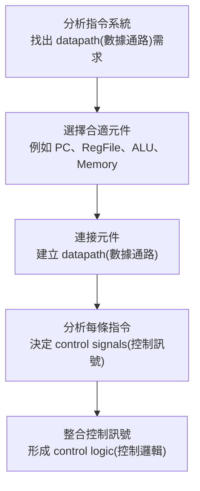
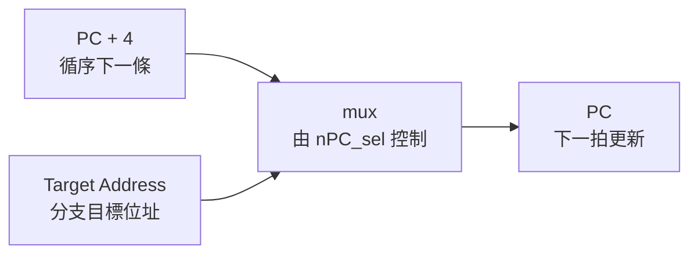
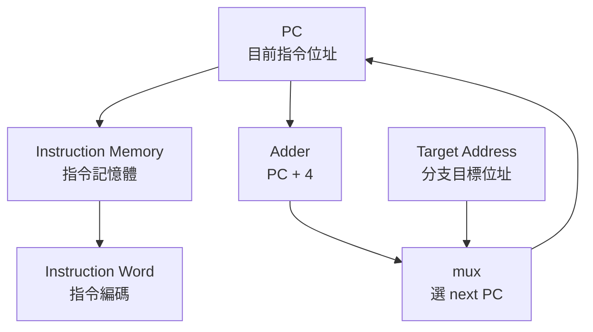
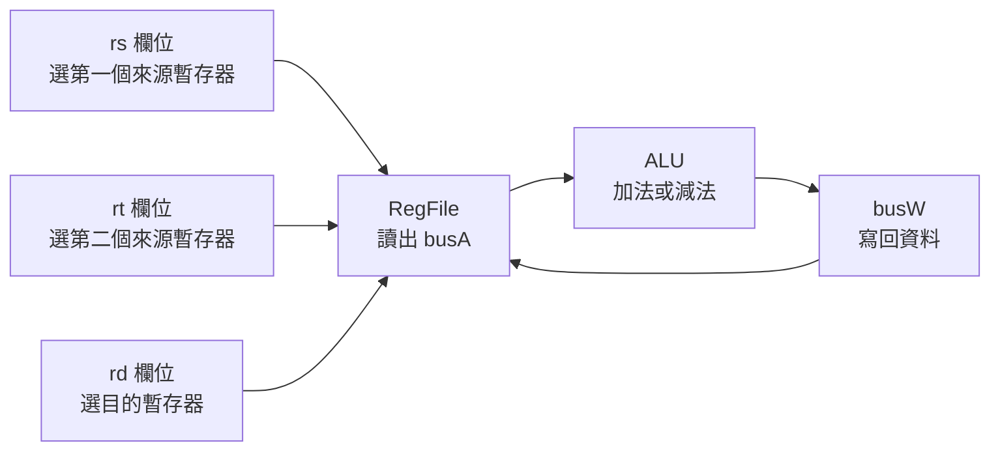
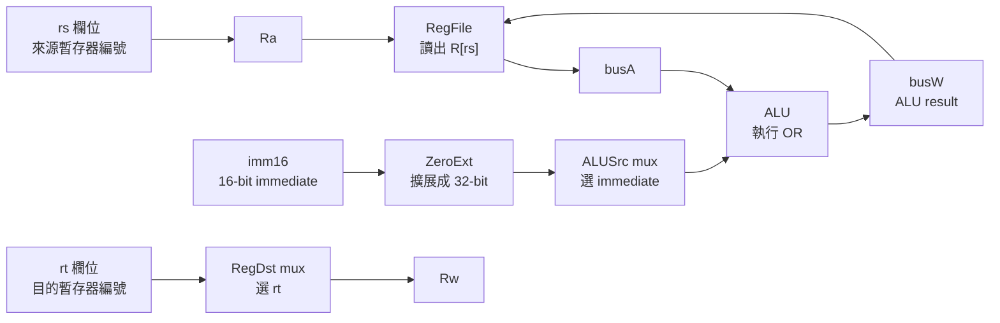
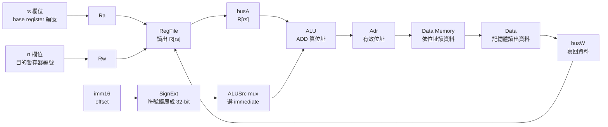

## ⭐處理器設計主線 — CPU datapath(數據通路)不是背圖，而是從指令需求長出來的硬體

講義位置：PDF viewer page 1 ~ PDF viewer page 12／輔助：投影片頁碼 1–12

### 1. 這段在處理什麼問題？

這一段不是一開始就要你背完整 CPU 圖，而是在回答一個比較根本的問題：

我們要做一顆能執行幾種 MIPS 指令的 CPU，那硬體裡到底需要哪些元件、哪些線、哪些控制訊號？

講義給的設計流程是：

生活化一點講，這就像你不是先畫一間餐廳的平面圖，而是先問：「我要賣哪些餐點？」如果菜單需要煎、炸、烤、冷藏，廚房設備就會被菜單需求決定。CPU 也是一樣：不是先背硬體圖，而是由指令需求反推硬體。

講義 PDF viewer page 3 明確列出五步：分析指令需求、選元件、連數據通路、分析控制訊號、整合控制邏輯；到 PDF viewer page 12，前兩步已被標記完成，表示本輪自然收束點就在「需求分析＋元件需求」這一段。

---

### 2. 這份 ch4-1 先限制 CPU 要支援哪些 MIPS 指令？

本輪講義不是設計完整 MIPS，而是設計能支援這幾類指令的處理器：

| 指令類型                         | 指令                                    | 核心工作                                              |
| ---------------------------- | ------------------------------------- | ------------------------------------------------- |
| unsigned arithmetic(無號算術)    | `addu rd, rs, rt`、`subu rd, rs, rt`   | 讀兩個暫存器，ALU 做加或減，寫回 `rd`                           |
| immediate logical OR(立即數邏輯或) | `ori rt, rs, imm16`                   | 讀 `rs`，把 `imm16` zero extension(零擴展)，做 OR，寫回 `rt` |
| load/store(載入／儲存)            | `lw rt, imm16(rs)`、`sw rt, imm16(rs)` | 用 `R[rs] + SignExt(imm16)` 算記憶體位址                 |
| branch(條件分支)                 | `beq rs, rt, imm16`                   | 比較 `R[rs]` 和 `R[rt]`，相等時改 PC                      |

這裡最重要的不是記指令格式，而是看出「不同指令會逼 CPU 加不同硬體」。例如：

`addu` 需要 ALU 做加法，`ori` 需要立即數擴展，`lw` 和 `sw` 需要 Data Memory(資料記憶體)，`beq` 需要比較兩個暫存器並改變 PC。講義 PDF viewer page 4 ~ 7 就是用這些指令逐步導出硬體需求。

---

### 3. R-type 和 I-type 的差別，為什麼會影響 datapath？

講義在 PDF viewer page 5 先拆指令位元域：

| 格式     | 位元域                              | 用途                                                |
| ------ | -------------------------------- | ------------------------------------------------- |
| R-type | `{op, rs, rt, rd, shamt, funct}` | 多用於暫存器對暫存器運算，例如 `addu`、`subu`                     |
| I-type | `{op, rs, rt, imm16}`            | 多用於立即數、load/store、branch，例如 `ori`、`lw`、`sw`、`beq` |

關鍵差異是：R-type 的目的暫存器通常是 `rd`，但 I-type 的目的暫存器常常是 `rt`，例如 `ori` 和 `lw` 都寫回 `rt`。

這就會導出第一個很重要的硬體需求：CPU 不能永遠把寫入目標接死在 `rd`。它需要一個 multiplexer(多工器／多選器)，在 `rd` 和 `rt` 之間選一個送到 Register File(暫存器堆) 的寫入編號 `Rw`。

這就是後面 `RegDst` control signal(控制訊號) 的來源。

---

### 4. 從運算指令推出 ALU 和 Register File 的需求

以：

`addu rd, rs, rt`
`subu rd, rs, rt`

來看，講義把語意寫成：

`R[rd] ← R[rs] + R[rt]`
`R[rd] ← R[rs] - R[rt]`

所以硬體至少需要：

| 需求              | 對應硬體                                        |
| --------------- | ------------------------------------------- |
| 同時讀 `rs` 和 `rt` | Register File(暫存器堆) 要 two-read ports(兩個讀取埠) |
| 寫回 `rd`         | Register File 要 one-write port(一個寫入埠)       |
| 做加法／減法          | ALU(算術邏輯單元)                                 |
| 每條非分支指令後到下一條    | PC 要能做 `PC ← PC + 4`                        |

這裡有一個常見錯法：很多人看到 `rs`、`rt`、`rd` 會把它們當資料本身。其實它們是 register number(暫存器編號)，真正的資料在暫存器堆裡。`rs` 和 `rt` 是「地址／編號」，busA 和 busB 才是讀出來的 32-bit data(資料)。

---

### 5. 從 `ori` 推出 extender(擴展器)和 ALU input mux(輸入多選器)

`ori rt, rs, imm16` 的語意是：

`R[rt] ← R[rs] | zero_ext(Imm16)`

它和 `addu/subu` 最大差異有三個：

| 問題                  | 為什麼原本 R-type datapath 不夠              |
| ------------------- | ------------------------------------- |
| 寫入目標是 `rt` 不是 `rd`  | 需要在 `rt/rd` 中選目的暫存器                   |
| ALU 第二個輸入不是 `R[rt]` | 需要在 busB 和 immediate(立即數) 中選          |
| `imm16` 只有 16-bit   | ALU 要吃 32-bit，所以要 zero extension(零擴展) |

所以 `ori` 會逼我們增加：

1. `RegDst` mux：選 `rt` 或 `rd` 當寫入目標。
2. `ALUSrc` mux：選 busB 或擴展後立即數當 ALU 第二輸入。
3. Extender(擴展器)：把 16-bit 立即數變成 32-bit。

為什麼 `ori` 用 zero extension(零擴展)？因為邏輯 OR 通常把立即數當 bit pattern(位元樣式)，不是當有正負號的偏移量；保留位元意義就好。

---

### 6. 從 `lw/sw` 推出 sign extension(符號擴展)和 Data Memory(資料記憶體)

`lw rt, imm16(rs)` 的語意是：

`R[rt] ← MEM[R[rs] + SignExt(imm16)]`

`sw rt, imm16(rs)` 的語意是：

`MEM[R[rs] + SignExt(imm16)] ← R[rt]`

它們共同需求是：先算 effective address(有效位址)。

也就是：

`base register value + signed offset`

因此：

| 指令   | ALU 做什麼                  | Data Memory 做什麼 | 最後寫去哪裡           |
| ---- | ------------------------ | --------------- | ---------------- |
| `lw` | `R[rs] + SignExt(imm16)` | 讀出該位址資料         | 寫回 `R[rt]`       |
| `sw` | `R[rs] + SignExt(imm16)` | 把 `R[rt]` 寫入該位址 | 不寫 Register File |

常見錯法是把 `lw` 想成「ALU 算完就直接寫回」。不對。`lw` 的 ALU result(結果)是 address(位址)，不是最後資料。真正要寫回暫存器的是 Data Memory 讀出來的資料。

所以 `lw` 會導出 `MemtoReg` mux：寫回 Register File 的資料來源，要能在 ALU result 和 Memory output 中選一個。

`sw` 則導出 `MemWr` control signal(記憶體寫入控制)：只有 store 時才能寫 Data Memory，否則不能亂寫。

---

### 7. 從 `beq` 推出比較與 PC 更新需求

`beq rs, rt, imm16` 的語意是：

若 `R[rs] == R[rt]`，則：

`PC ← PC + 4 + (SignExt(imm16) || 00)`

否則：

`PC ← PC + 4`

這會導出兩個需求：

1. 要比較兩個暫存器是否相等。
2. PC 不能只會 `+4`，還要能選 branch target address(分支目標位址)。

因此 IFU(Instruction Fetch Unit，取指單元)裡面會需要 PC、Instruction Memory、Adder、以及選擇下一個 PC 的 mux。講義 PDF viewer page 16 ~ 19 後面會正式把這段展開成取指與 PC 更新；這屬於下一個相鄰知識點，不在本輪宣稱完成。

---

### 8. 本輪最短記法

這一段可以用一句話記：

CPU datapath 是由「指令語意」反推硬體需求；每多一種指令格式或資料來源，就通常需要新的 mux、extender、memory path 或 control signal。

更精簡地說：

| 指令需求              | 會長出什麼硬體／控制                          |
| ----------------- | ----------------------------------- |
| 讀兩個暫存器            | Register File 的 `Ra/Rb → busA/busB` |
| 寫回暫存器             | `Rw/busW/RegWr`                     |
| 算加減或邏輯            | ALU + `ALUCtr`                      |
| 立即數參與 ALU         | Extender + `ALUSrc`                 |
| `rd/rt` 都可能是目的暫存器 | `RegDst`                            |
| load 從記憶體拿資料      | Data Memory + `MemtoReg`            |
| store 寫資料記憶體      | Data Memory + `MemWr`               |
| branch 改 PC       | comparison(比較) + PC source mux      |

### 為何 RegDst 叫做 RegDst，為何 ALUSrc 叫做 ALUSrc

| 控制訊號     | 全名直覺                 | 它在選什麼                                 |
| -------- | -------------------- | ------------------------------------- |
| `RegDst` | Register Destination | 寫回目的暫存器是 `rd` 還是 `rt`                 |
| `ALUSrc` | ALU Source           | ALU 第二個輸入來源是 `busB` 還是 immediate(立即數) |

## ⭐取指與更新 PC — 每條指令執行前，CPU 如何知道要去哪裡拿下一條指令？

講義位置：PDF viewer page 13 ~ PDF viewer page 20／輔助：投影片頁碼 13–20

### 1. 這一段在解決什麼問題？

上一段我們是在問：「這些 MIPS 指令需要哪些元件？」

這一段開始問：「元件有了，要怎麼連起來，讓指令真的能流動？」

講義給的基本原則是：

> 根據指令需求，連接元件，建立 datapath(數據通路)。

也就是不要背圖，而是問每條指令需要資料怎麼走。先從所有指令都一定會做的事情開始：Fetch(取指令)。

所有指令，不管是 `addu`、`ori`、`lw`、`sw`、`beq`，第一步都一定要先從 Instruction Memory(指令記憶體) 取出 instruction word(指令編碼)。

生活化例子：你要做任何一道菜之前，第一步都要先讀食譜。不同菜後面流程不同，但「先拿到食譜」是共同需求。

---

### 2. PC 是什麼？它不是資料暫存器，而是「指令地址暫存器」

PC(Program Counter，程式計數器) 裡放的是 instruction address(指令位址)。

也就是：

`PC` 的內容告訴 CPU：「下一次要去哪個位址取指令。」

在 datapath 裡，PC 會接到 Instruction Memory 的 address input(位址輸入)。Instruction Memory 收到這個位址後，就輸出對應的 `Instruction Word`。

流程是：

講義 PDF viewer page 16 ~ 19 的共同需求就是這件事：PC 的內容是指令地址，用 PC 的內容作為位址，存取 Instruction Memory 取得指令編碼。

---

### 3. 為什麼一般情況是 `PC ← PC + 4`？

MIPS 一條指令是 32-bit，也就是 4 bytes。

Memory address(記憶體位址)通常以 byte(位元組)為單位編號，所以如果現在指令在位址 `PC`，下一條連續指令會在：

`PC + 4`

不是 `PC + 1`。

這裡很容易混淆：

| 錯誤直覺             | 正確觀念                            |
| ---------------- | ------------------------------- |
| 下一條指令所以 `PC + 1` | MIPS 指令長度是 4 bytes，所以是 `PC + 4` |
| PC 存第幾條指令        | PC 存的是 byte address(位元組位址)      |
| 所有指令都永遠 `PC+4`   | branch/jump 可能改成目標位址            |

所以一般循序執行：

`PC ← PC + 4`

這需要一個 Adder(加法器)，專門幫 PC 加 4。

---

### 4. 為什麼 PC 更新需要 mux？

如果程式完全沒有分支，PC 永遠 `+4` 就好。

但講義支援 `beq rs, rt, imm16`。`beq` 成立時，下一條指令不是 `PC+4`，而是 branch target address(分支目標位址)。

所以 PC 的下一個值有至少兩種來源：

| 情況                 | 下一個 PC                |
| ------------------ | --------------------- |
| 一般循序執行             | `PC + 4`              |
| branch taken(分支成立) | branch target address |

這就需要一個 mux(多選器) 來選：

控制這個 mux 的訊號在講義圖上叫 `nPC_sel`，可理解為 next PC select(下一個 PC 選擇訊號)。

!!! danger 

    branch 存的 offset 是 `PC ← PC + 4 + (SignExt(imm16) || 00)` 裡面的 imm16，所以上面流程圖的 Target address 是 PC + 4 + (SignExt(imm16) << 2) 不是單純的 branch 的 offset
    
    這邊是先知道 PC 如何切換就好，所以沒有畫出 `PC ← PC + 4 + (SignExt(imm16) || 00)` 計算。

---

### 5. IFU 是什麼？

IFU(Instruction Fetch Unit，取指單元) 可以看成把「取指令＋更新 PC」包起來的一個小模組。

它裡面至少包含：

| 元件                 | 功能                                        |
| ------------------ | ----------------------------------------- |
| PC                 | 存目前指令位址                                   |
| Instruction Memory | 用 PC 當 address 取出 instruction word        |
| Adder              | 算 `PC + 4`                                |
| mux                | 在 `PC+4` 和 branch target address 中選下一個 PC |
| `nPC_sel`          | 控制下一個 PC 來源                               |

用圖表示：

這就是為什麼講義在 PDF viewer page 19 把 PC、Instruction Memory、Adder、mux 包成 Instruction Fetch Unit, IFU。

---

### 6. 本輪最短記法

所有指令共同需求可以記成一句：

每條指令都先用 PC 去 Instruction Memory 取指令，然後 PC 根據 `nPC_sel` 選擇更新成 `PC+4` 或 branch target address。

再壓更短：

| 問題         | 硬體答案                             |
| ---------- | -------------------------------- |
| 要去哪裡取指令？   | PC 給 Instruction Memory 位址       |
| 取出什麼？      | Instruction Word                 |
| 下一條正常在哪？   | `PC + 4`                         |
| 分支成立去哪？    | Target Address                   |
| 誰決定下一個 PC？ | `nPC_sel` 控制 mux                 |
| 這組合稱什麼？    | IFU(Instruction Fetch Unit，取指單元) |

## ⭐`addu/subu` 的 datapath — R-type 運算指令如何從暫存器讀資料、經 ALU 運算、再寫回暫存器？

講義位置：PDF viewer page 21／輔助：投影片頁碼 21

### 1. 這一段在解決什麼問題？

現在我們已經知道所有指令都會先 Fetch(取指令)並更新 PC。接下來開始看「不同指令自己的資料路徑」。

`addu` 和 `subu` 是最單純的 R-type 運算指令，它們的共同形式是：

`R[rd] = R[rs] op R[rt]`

其中 `op` 可以是加法或減法。

也就是：

| 指令                | 實際語意                    |
| ----------------- | ----------------------- |
| `addu rd, rs, rt` | `R[rd] = R[rs] + R[rt]` |
| `subu rd, rs, rt` | `R[rd] = R[rs] - R[rt]` |

這類指令的資料流很單純：

重點是：`rs`、`rt`、`rd` 都不是資料本身，而是 register number(暫存器編號)。

---

### 2. `rs`、`rt`、`rd` 分別接到哪裡？

對 `addu rd, rs, rt` 來說：

| 指令欄位 | 角色                          | 接到哪裡 |
| ---- | --------------------------- | ---- |
| `rs` | 第一個 source register(來源暫存器)  | `Ra` |
| `rt` | 第二個 source register(來源暫存器)  | `Rb` |
| `rd` | destination register(目的暫存器) | `Rw` |

RegFile(暫存器堆) 會做三件事：

1. 根據 `Ra = rs`，把 `R[rs]` 放到 `busA`。
2. 根據 `Rb = rt`，把 `R[rt]` 放到 `busB`。
3. 在 clock 上升沿，如果 `RegWr = 1`，就把 `busW` 的資料寫進 `Rw = rd` 指定的暫存器。

所以 `addu/subu` 的資料來源是兩個暫存器，目的地是 `rd`。

---

### 3. ALU 做加法還是減法，誰決定？

`addu` 和 `subu` 都用同一顆 ALU。

差別不是換硬體，而是給 ALU 不同的 control signal(控制訊號)：

| 指令     | `ALUCtr` |
| ------ | -------- |
| `addu` | ADD      |
| `subu` | SUB      |

所以：

`ALUCtr` 決定 ALU 這次要做什麼運算。

這也是為什麼講義說 `ALUCtr` 是由 instruction decode(指令解碼)產生的控制訊號：CPU 看到 instruction opcode/funct 後，就知道這次要叫 ALU 加還是減。

---

### 4. `RegWr` 為什麼要是 1？

因為 `addu/subu` 最後要把 ALU result(運算結果)寫回暫存器 `rd`。

如果 `RegWr = 0`，那就算 ALU 算出結果，也不會真的寫回 Register File。

所以對 `addu/subu`：

| 控制訊號       | 值            | 原因                   |
| ---------- | ------------ | -------------------- |
| `RegWr`    | 1            | 要寫回 `rd`             |
| `RegDst`   | 選 `rd`       | R-type 目的暫存器是 `rd`   |
| `ALUSrc`   | 選 `busB`     | ALU 第二輸入來自 `R[rt]`   |
| `ALUCtr`   | ADD 或 SUB    | 由 `addu/subu` 決定     |
| `MemWr`    | 0            | 不寫 Data Memory       |
| `MemtoReg` | 選 ALU result | 寫回資料來自 ALU，不是 Memory |

這一段最重要的是看出：控制訊號不是亂背，而是由「這條指令的資料要怎麼走」決定。

---

### 5. 本輪最短記法

`addu/subu` 的 datapath 可以記成：

`rs, rt → RegFile → busA, busB → ALU → busW → rd`

控制訊號最短記：

| 控制         | 對 `addu/subu` 的意思         |
| ---------- | ------------------------- |
| `RegDst`   | 寫到 `rd`                   |
| `ALUSrc`   | ALU 第二輸入選 `busB`          |
| `ALUCtr`   | `addu` 選 ADD，`subu` 選 SUB |
| `RegWr`    | 要寫回，所以 1                  |
| `MemWr`    | 不寫 memory，所以 0            |
| `MemtoReg` | 寫回 ALU result             |

## ⭐`ori` 的 datapath — 為什麼 R-type 的路徑不夠用？

講義位置：PDF viewer page 22 ~ PDF viewer page 23／輔助：投影片頁碼 22–23

### 1. 這一段在解決什麼問題？

上一頁 `addu/subu` 的資料流是：

`R[rd] = R[rs] op R[rt]`

所以很自然：

`rs → Ra → busA`
`rt → Rb → busB`
`rd → Rw`
`busA` 和 `busB` 進 ALU，結果寫回 `rd`

但 `ori` 不是這樣。

`ori rt, rs, imm16` 的語意是：

`R[rt] = R[rs] | ZeroExt(imm16)`

這句話直接造成三個 datapath(數據通路)問題：

| 問題                | 為什麼原本 `addu/subu` datapath 不夠 |
| ----------------- | ----------------------------- |
| 目的暫存器變成 `rt`      | 原本 R-type 寫回 `rd`             |
| ALU 第二輸入變成立即數     | 原本 ALU 第二輸入是 `busB = R[rt]`   |
| `imm16` 只有 16-bit | ALU 輸入需要 32-bit               |

所以 `ori` 的本質是：它把 R-type 的「兩個 register operand」改成「一個 register operand + 一個 immediate operand」。

---

### 2. 問題 1：為什麼需要 `RegDst` mux？

`addu/subu` 寫回 `rd`：

`R[rd] = R[rs] op R[rt]`

但 `ori` 寫回 `rt`：

`R[rt] = R[rs] | ZeroExt(imm16)`

所以 Register File 的 `Rw` 不能永遠接 `rd`。

它必須可以選：

| 指令類型        | 寫回目的地 |
| ----------- | ----- |
| `addu/subu` | `rd`  |
| `ori`       | `rt`  |

因此加一個 mux，由 `RegDst` 控制。

在講義這份 datapath 的標號中：

| `RegDst` | 選到   |
| -------- | ---- |
| `0`      | `rt` |
| `1`      | `rd` |

所以 `ori` 要 `RegDst = 0`，因為它寫回 `rt`。

---

### 3. 問題 2：為什麼需要 `ALUSrc` mux？

`addu/subu` 的 ALU 第二輸入是：

`busB = R[rt]`

但 `ori` 的 ALU 第二輸入是：

`ZeroExt(imm16)`

所以 ALU 第二輸入不能永遠接 `busB`。

它必須可以選：

| 指令          | ALU 第二輸入         |
| ----------- | ---------------- |
| `addu/subu` | `busB = R[rt]`   |
| `ori`       | `ZeroExt(imm16)` |

因此加一個 mux，由 `ALUSrc` 控制。

在講義這份 datapath 的標號中：

| `ALUSrc` | 選到             |
| -------- | -------------- |
| `0`      | `busB`         |
| `1`      | 擴展後的 immediate |

所以 `ori` 要 `ALUSrc = 1`，因為它要用 immediate 當 ALU 第二輸入。

---

### 4. 問題 3：為什麼需要 zero extension？

`imm16` 只有 16-bit，但 ALU 是處理 32-bit operand。

所以 `ori` 不能直接把 `imm16` 丟進 ALU，而要先變成 32-bit：

`ZeroExt(imm16)`

例如：

| `imm16`  | `ZeroExt(imm16)` |
| -------- | ---------------- |
| `0x00FF` | `0x000000FF`     |
| `0x8001` | `0x00008001`     |

這裡特別用 zero extension(零擴展)，不是 sign extension(符號擴展)，因為 `ori` 是 bitwise OR(位元 OR)邏輯運算，立即數被當作 bit pattern(位元樣式)，不是有正負號的數值偏移。

---

### 5. `ori` 的完整資料流

`ori rt, rs, imm16` 的資料流可以整理成：

用一句話說：

`ori` 從 `rs` 讀出 `R[rs]`，把 `imm16` 零擴展成 32-bit，兩者做 OR，最後寫回 `rt`。

---

### 6. 本輪最短記法

`ori` 可以記成：

`rs → busA`
`imm16 → ZeroExt → ALU 第二輸入`
`ALU 做 OR`
`結果寫回 rt`

控制訊號最短記：

| 控制訊號       | `ori` 的設定       | 原因                         |
| ---------- | --------------- | -------------------------- |
| `RegDst`   | `0`，選 `rt`      | `ori` 寫回 `rt`              |
| `ALUSrc`   | `1`，選 immediate | ALU 第二輸入是 `ZeroExt(imm16)` |
| `ExtOp`    | zero            | `ori` 用零擴展                 |
| `ALUCtr`   | OR              | 執行 bitwise OR              |
| `RegWr`    | 1               | 結果要寫回 Register File        |
| `MemWr`    | 0               | 不寫 Data Memory             |
| `MemtoReg` | 0，選 ALU result  | 寫回資料來自 ALU                 |

講義 PDF viewer page 23 的解法正是：針對 `ori` 的三個問題，增加兩個多選器，並增加零擴展元件。

### Rw、Ra、Rb 本質上是什麼？

`Rw`、`Ra`、`Rb` 本質上是 **Register File(暫存器堆) 的 register number input signals(暫存器編號輸入訊號)**。

它們不是暫存器本身，也不是 32-bit 資料，而是用來告訴 Register File：

| 訊號   | 本質                             | 問題                   |
| ---- | ------------------------------ | -------------------- |
| `Ra` | 5-bit read address(讀取位址／讀取編號)  | 要把哪個暫存器的內容送到 `busA`？ |
| `Rb` | 5-bit read address(讀取位址／讀取編號)  | 要把哪個暫存器的內容送到 `busB`？ |
| `Rw` | 5-bit write address(寫入位址／寫入編號) | `busW` 的資料要寫進哪個暫存器？  |

## ⭐`lw` 的 datapath — 為什麼 ALU 算出來的是位址，不是最後寫回的資料？

講義位置：PDF viewer page 24 ~ PDF viewer page 25／輔助：投影片頁碼 24–25

### 1. 這一段在解決什麼問題？

前面的 `addu/subu/ori` 都有一個共同點：ALU 算出來的結果，就是最後要寫回 Register File(暫存器堆) 的值。

但 `lw` 不一樣。

`lw rt, imm16(rs)` 的語意是：

`R[rt] = MEM[R[rs] + SignExt(imm16)]`

這句要拆成兩層：

| 層次  | 做什麼                                                     |
| --- | ------------------------------------------------------- |
| 第一層 | ALU 計算 effective address(有效位址)：`R[rs] + SignExt(imm16)` |
| 第二層 | 用這個 address 去 Data Memory 讀資料                           |
| 第三層 | 把 Data Memory 讀出的資料寫回 `R[rt]`                           |

所以 `lw` 的關鍵不是「ALU 算完直接寫回」，而是：

ALU result 是 address；Memory output 才是要寫回的 data。

---

### 2. `lw` 為什麼需要 sign extension？

`lw rt, imm16(rs)` 裡的 `imm16` 是 offset(位移量)，可以是正的，也可以是負的。

例如：

`lw $t0, 8($sp)`
代表從 `R[$sp] + 8` 的位址載入資料。

`lw $t0, -4($sp)`
代表從 `R[$sp] - 4` 的位址載入資料。

所以這裡的 `imm16` 不是純 bit pattern，而是有正負號的 signed offset(有號位移量)。因此要用 sign extension(符號擴展)，不是 zero extension(零擴展)。

| 指令    | immediate 的角色        | 擴展方式           |
| ----- | -------------------- | -------------- |
| `ori` | bit pattern(位元樣式)    | zero extension |
| `lw`  | signed offset(有號位移量) | sign extension |

講義 PDF viewer page 24 也說 `lw` 的位址是由 `rs` 指定暫存器內容加上符號擴展後的立即數得到。

---

### 3. `lw` 為什麼需要 Data Memory？

因為 `lw` 的目標不是做一般 ALU 運算，而是從記憶體拿資料。

流程是：

這裡最容易錯的點是：

`Adr = R[rs] + SignExt(imm16)`
但 `busW = DataMemory[Adr]`

所以 `Adr` 和 `busW` 不是同一個東西。

---

### 4. `lw` 為什麼需要 `MemtoReg`？

前面幾個運算指令：

| 指令     | 寫回 Register File 的資料來源 |
| ------ | ---------------------- |
| `addu` | ALU result             |
| `subu` | ALU result             |
| `ori`  | ALU result             |

但 `lw` 寫回的是：

`Data Memory` 讀出的資料

不是 ALU result。

所以 Register File 的 `busW` 前面需要一個 mux，選擇寫回資料來源：

| `MemtoReg` | 寫回資料來源             |
| ---------- | ------------------ |
| `0`        | ALU result         |
| `1`        | Data Memory output |

因此 `lw` 要 `MemtoReg = 1`。

講義後面的 `lw` datapath 圖也標出：`ALUSrc=1`、`RegDst=0`、`RegWr=1`、`ExtOp="sign"`、`ALUCtr="ADD"`、`MemtoReg=1`、`MemWr=0`。

---

### 5. `lw` 的控制訊號最短記法

| 控制訊號       | `lw rt, imm16(rs)` | 原因                         |
| ---------- | -----------------: | -------------------------- |
| `RegDst`   |                `0` | 寫回目的暫存器是 `rt`              |
| `ALUSrc`   |                `1` | ALU 第二輸入是 `SignExt(imm16)` |
| `ExtOp`    |       `1` 或 `sign` | offset 要符號擴展               |
| `ALUCtr`   |              `ADD` | base + offset 算位址          |
| `MemtoReg` |                `1` | 寫回資料來自 Data Memory         |
| `RegWr`    |                `1` | 要把載入資料寫回 `rt`              |
| `MemWr`    |                `0` | `lw` 是讀記憶體，不是寫記憶體          |
| `nPC_sel`  |         `0` 或 `+4` | 一般循序執行下一條                  |

一句話記：

`lw` 用 ALU 算 address，用 Data Memory 讀 data，再把 data 寫回 `rt`。
