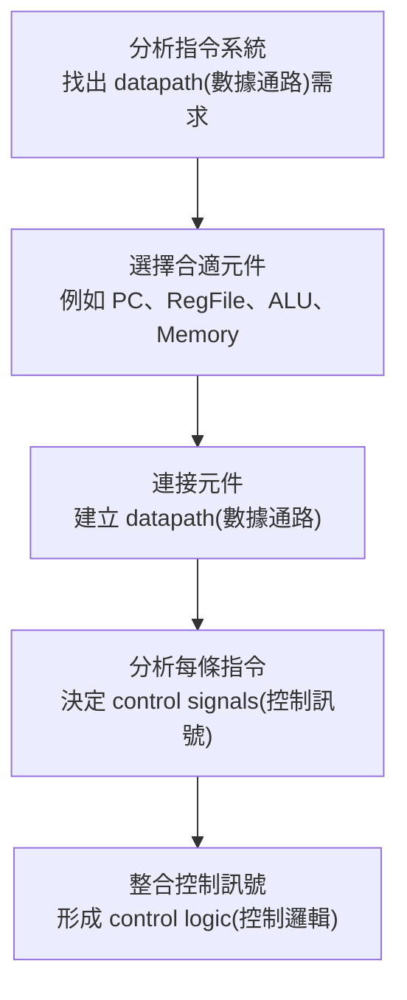

## ⭐處理器設計主線 — CPU datapath(數據通路)不是背圖，而是從指令需求長出來的硬體

講義位置：PDF viewer page 1 ~ PDF viewer page 12／輔助：投影片頁碼 1–12

### 1. 這段在處理什麼問題？

這一段不是一開始就要你背完整 CPU 圖，而是在回答一個比較根本的問題：

我們要做一顆能執行幾種 MIPS 指令的 CPU，那硬體裡到底需要哪些元件、哪些線、哪些控制訊號？

講義給的設計流程是：

生活化一點講，這就像你不是先畫一間餐廳的平面圖，而是先問：「我要賣哪些餐點？」如果菜單需要煎、炸、烤、冷藏，廚房設備就會被菜單需求決定。CPU 也是一樣：不是先背硬體圖，而是由指令需求反推硬體。

講義 PDF viewer page 3 明確列出五步：分析指令需求、選元件、連數據通路、分析控制訊號、整合控制邏輯；到 PDF viewer page 12，前兩步已被標記完成，表示本輪自然收束點就在「需求分析＋元件需求」這一段。

---

### 2. 這份 ch4-1 先限制 CPU 要支援哪些 MIPS 指令？

本輪講義不是設計完整 MIPS，而是設計能支援這幾類指令的處理器：

| 指令類型                         | 指令                                    | 核心工作                                              |
| ---------------------------- | ------------------------------------- | ------------------------------------------------- |
| unsigned arithmetic(無號算術)    | `addu rd, rs, rt`、`subu rd, rs, rt`   | 讀兩個暫存器，ALU 做加或減，寫回 `rd`                           |
| immediate logical OR(立即數邏輯或) | `ori rt, rs, imm16`                   | 讀 `rs`，把 `imm16` zero extension(零擴展)，做 OR，寫回 `rt` |
| load/store(載入／儲存)            | `lw rt, imm16(rs)`、`sw rt, imm16(rs)` | 用 `R[rs] + SignExt(imm16)` 算記憶體位址                 |
| branch(條件分支)                 | `beq rs, rt, imm16`                   | 比較 `R[rs]` 和 `R[rt]`，相等時改 PC                      |

這裡最重要的不是記指令格式，而是看出「不同指令會逼 CPU 加不同硬體」。例如：

`addu` 需要 ALU 做加法，`ori` 需要立即數擴展，`lw` 和 `sw` 需要 Data Memory(資料記憶體)，`beq` 需要比較兩個暫存器並改變 PC。講義 PDF viewer page 4 ~ 7 就是用這些指令逐步導出硬體需求。

---

### 3. R-type 和 I-type 的差別，為什麼會影響 datapath？

講義在 PDF viewer page 5 先拆指令位元域：

| 格式     | 位元域                              | 用途                                                |
| ------ | -------------------------------- | ------------------------------------------------- |
| R-type | `{op, rs, rt, rd, shamt, funct}` | 多用於暫存器對暫存器運算，例如 `addu`、`subu`                     |
| I-type | `{op, rs, rt, imm16}`            | 多用於立即數、load/store、branch，例如 `ori`、`lw`、`sw`、`beq` |

關鍵差異是：R-type 的目的暫存器通常是 `rd`，但 I-type 的目的暫存器常常是 `rt`，例如 `ori` 和 `lw` 都寫回 `rt`。

這就會導出第一個很重要的硬體需求：CPU 不能永遠把寫入目標接死在 `rd`。它需要一個 multiplexer(多工器／多選器)，在 `rd` 和 `rt` 之間選一個送到 Register File(暫存器堆) 的寫入編號 `Rw`。

這就是後面 `RegDst` control signal(控制訊號) 的來源。

---

### 4. 從運算指令推出 ALU 和 Register File 的需求

以：

`addu rd, rs, rt`
`subu rd, rs, rt`

來看，講義把語意寫成：

`R[rd] ← R[rs] + R[rt]`
`R[rd] ← R[rs] - R[rt]`

所以硬體至少需要：

| 需求              | 對應硬體                                        |
| --------------- | ------------------------------------------- |
| 同時讀 `rs` 和 `rt` | Register File(暫存器堆) 要 two-read ports(兩個讀取埠) |
| 寫回 `rd`         | Register File 要 one-write port(一個寫入埠)       |
| 做加法／減法          | ALU(算術邏輯單元)                                 |
| 每條非分支指令後到下一條    | PC 要能做 `PC ← PC + 4`                        |

這裡有一個常見錯法：很多人看到 `rs`、`rt`、`rd` 會把它們當資料本身。其實它們是 register number(暫存器編號)，真正的資料在暫存器堆裡。`rs` 和 `rt` 是「地址／編號」，busA 和 busB 才是讀出來的 32-bit data(資料)。

---

### 5. 從 `ori` 推出 extender(擴展器)和 ALU input mux(輸入多選器)

`ori rt, rs, imm16` 的語意是：

`R[rt] ← R[rs] | zero_ext(Imm16)`

它和 `addu/subu` 最大差異有三個：

| 問題                  | 為什麼原本 R-type datapath 不夠              |
| ------------------- | ------------------------------------- |
| 寫入目標是 `rt` 不是 `rd`  | 需要在 `rt/rd` 中選目的暫存器                   |
| ALU 第二個輸入不是 `R[rt]` | 需要在 busB 和 immediate(立即數) 中選          |
| `imm16` 只有 16-bit   | ALU 要吃 32-bit，所以要 zero extension(零擴展) |

所以 `ori` 會逼我們增加：

1. `RegDst` mux：選 `rt` 或 `rd` 當寫入目標。
2. `ALUSrc` mux：選 busB 或擴展後立即數當 ALU 第二輸入。
3. Extender(擴展器)：把 16-bit 立即數變成 32-bit。

為什麼 `ori` 用 zero extension(零擴展)？因為邏輯 OR 通常把立即數當 bit pattern(位元樣式)，不是當有正負號的偏移量；保留位元意義就好。

---

### 6. 從 `lw/sw` 推出 sign extension(符號擴展)和 Data Memory(資料記憶體)

`lw rt, imm16(rs)` 的語意是：

`R[rt] ← MEM[R[rs] + SignExt(imm16)]`

`sw rt, imm16(rs)` 的語意是：

`MEM[R[rs] + SignExt(imm16)] ← R[rt]`

它們共同需求是：先算 effective address(有效位址)。

也就是：

`base register value + signed offset`

因此：

| 指令   | ALU 做什麼                  | Data Memory 做什麼 | 最後寫去哪裡           |
| ---- | ------------------------ | --------------- | ---------------- |
| `lw` | `R[rs] + SignExt(imm16)` | 讀出該位址資料         | 寫回 `R[rt]`       |
| `sw` | `R[rs] + SignExt(imm16)` | 把 `R[rt]` 寫入該位址 | 不寫 Register File |

常見錯法是把 `lw` 想成「ALU 算完就直接寫回」。不對。`lw` 的 ALU result(結果)是 address(位址)，不是最後資料。真正要寫回暫存器的是 Data Memory 讀出來的資料。

所以 `lw` 會導出 `MemtoReg` mux：寫回 Register File 的資料來源，要能在 ALU result 和 Memory output 中選一個。

`sw` 則導出 `MemWr` control signal(記憶體寫入控制)：只有 store 時才能寫 Data Memory，否則不能亂寫。

---

### 7. 從 `beq` 推出比較與 PC 更新需求

`beq rs, rt, imm16` 的語意是：

若 `R[rs] == R[rt]`，則：

`PC ← PC + 4 + (SignExt(imm16) || 00)`

否則：

`PC ← PC + 4`

這會導出兩個需求：

1. 要比較兩個暫存器是否相等。
2. PC 不能只會 `+4`，還要能選 branch target address(分支目標位址)。

因此 IFU(Instruction Fetch Unit，取指單元)裡面會需要 PC、Instruction Memory、Adder、以及選擇下一個 PC 的 mux。講義 PDF viewer page 16 ~ 19 後面會正式把這段展開成取指與 PC 更新；這屬於下一個相鄰知識點，不在本輪宣稱完成。

---

### 8. 本輪最短記法

這一段可以用一句話記：

CPU datapath 是由「指令語意」反推硬體需求；每多一種指令格式或資料來源，就通常需要新的 mux、extender、memory path 或 control signal。

更精簡地說：

| 指令需求              | 會長出什麼硬體／控制                          |
| ----------------- | ----------------------------------- |
| 讀兩個暫存器            | Register File 的 `Ra/Rb → busA/busB` |
| 寫回暫存器             | `Rw/busW/RegWr`                     |
| 算加減或邏輯            | ALU + `ALUCtr`                      |
| 立即數參與 ALU         | Extender + `ALUSrc`                 |
| `rd/rt` 都可能是目的暫存器 | `RegDst`                            |
| load 從記憶體拿資料      | Data Memory + `MemtoReg`            |
| store 寫資料記憶體      | Data Memory + `MemWr`               |
| branch 改 PC       | comparison(比較) + PC source mux      |
