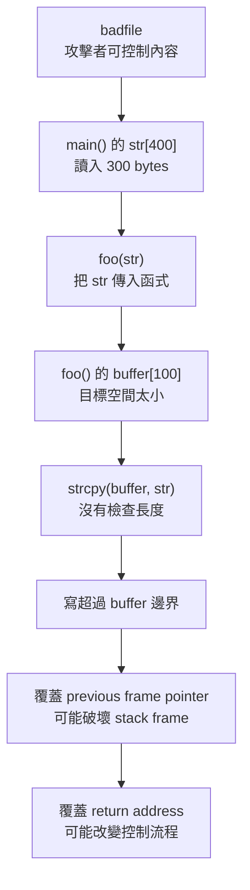
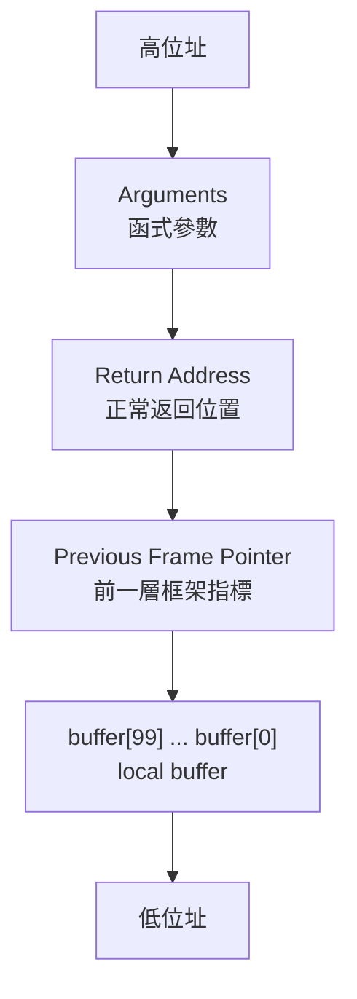
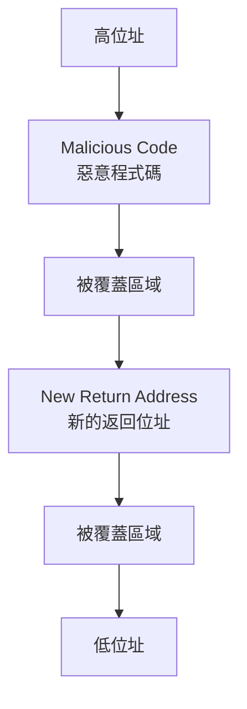
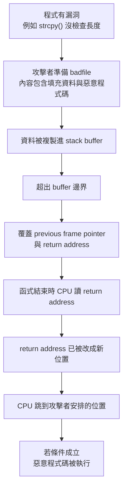

## ⭐Stack Layout — 為什麼 Buffer Overflow 會先從「記憶體長相」開始學？

講義位置：PDF viewer page 3 ~ PDF viewer page 6

### 1. 這個知識點在解決什麼問題？

`Buffer Overflow(緩衝區溢位)` 不是一開始就從「攻擊」開始理解，而是先問一個更底層的問題：

程式執行時，變數、函式參數、return address(返回位址)、local variable(區域變數) 到底放在記憶體哪裡？

因為 buffer overflow 的本質是：

資料寫超過原本 buffer(緩衝區) 的界線後，會覆蓋到旁邊的記憶體內容。

而在 `stack-based buffer overflow(堆疊型緩衝區溢位)` 中，最危險的是：如果寫超過 buffer 後蓋到 return address，函式結束時 CPU 可能就不回原本的位置，而是跳到攻擊者指定的位置。

所以本章第一步一定是先學 stack layout，不然後面 `return address overwrite(覆蓋返回位址)`、`NOP sled(NOP 雪橇)`、`shellcode` 都會變成硬背。

---

### 2. Program Memory Stack(程式記憶體配置)：不同變數放在不同區段

講義 PDF viewer page 3 用一段 C 程式搭配記憶體圖，說明程式的 memory layout(記憶體配置)。它把記憶體從低位址到高位址分成幾個常見區段：`Text segment(程式碼區段)`、`Data segment(資料區段)`、`BSS segment(未初始化靜態資料區段)`、`Heap(堆積區)`、`Stack(堆疊區)`。圖中也標出 `x`、`y`、`a,b,ptr` 與 `ptr` 指向的 heap 位置。

我們用生活化方式記：

`Text segment(程式碼區段)` 像「食譜本身」，放程式指令。
`Data segment(資料區段)` 像「一開始就貼好標籤、有初始值的公共物品」。例如全域變數 `int x = 100;`。
`BSS segment(未初始化靜態資料區段)` 像「已經保留位置但還沒填內容的公共物品」。例如 `static int y;`。
`Heap(堆積區)` 像「你執行中臨時租的倉庫」，通常由 `malloc()` 配出來。
`Stack(堆疊區)` 像「函式正在工作時的桌面」，放 local variable(區域變數)、function arguments(函式參數)、return address(返回位址) 等。

最重要的是：`ptr` 這種 pointer variable(指標變數) 本身可以放在 stack，但它指向的資料可能在 heap。不要把「指標變數的位置」和「指標指到的資料位置」混在一起。

---

### 3. Function Arguments in Stack(函式參數在堆疊中的位置)

PDF viewer page 4 進一步看函式參數。例如 `void func(int a, int b)` 裡面有 local variables `x, y`，講義圖中的 assembly 註解指出：`b` 可以在 `%ebp + 12`，`a` 可以在 `%ebp + 8`，而 local variable `x` 可以在 `%ebp - 8`。

這裡的核心規則不是要你背每個數字，而是要抓方向：

以 `ebp(frame pointer, 框架指標)` 當作目前 stack frame(堆疊框架) 的基準點時，function arguments(函式參數) 通常在 `ebp` 的上方，也就是比較高位址的 offset；local variables(區域變數) 通常在 `ebp` 的下方，也就是比較低位址的 offset。

可以把 `ebp` 想成書籤：
書籤上面放「呼叫者傳進來的東西」；
書籤下面放「這個函式自己臨時用的東西」。

這對 buffer overflow 很重要，因為 local buffer 通常在目前函式的 stack frame 裡。如果程式不檢查長度，buffer 往外寫，就可能一路蓋到 saved frame pointer(舊框架指標) 或 return address(返回位址)。

---

### 4. Function Call Stack(函式呼叫堆疊)：每次呼叫函式都會多一層 stack frame

PDF viewer page 5 用 `main()` 呼叫 `f(1,2)` 的例子，圖中顯示 `f()` 的 stack frame 裡有 `Value of b:2`、`Value of a:1`、`Return Address`、`Previous Frame Pointer`、`Value of x`。

這一頁要你理解：

當 `main()` 呼叫 `f(1,2)` 時，CPU 不能只跳去 `f()`，它還要記得「`f()` 執行完要回哪裡」。這個「回哪裡」就是 return address。

所以 stack frame 裡不只放變數，還放控制流程需要的資訊。
也就是說，stack 不是單純資料倉庫，它也影響程式之後會往哪裡執行。

這就是 buffer overflow 危險的根本原因：
如果攻擊者能改寫 stack 裡的 return address，就可能改變程式控制流程。

---

### 5. Function Call Chain(函式呼叫鏈)：目前函式會蓋在前一層函式下面

PDF viewer page 6 用 `main()` → `foo()` → `bar()` 說明 function call chain(函式呼叫鏈)。圖中 stack grows downward，也就是 stack 往低位址方向成長；目前正在執行的 `bar()` stack frame 位於比較下面的位置，並且保留 `foo()` 的 frame pointer；`foo()` 又保留 `main()` 的 frame pointer。

我們可以想成一疊便條紙：

`main()` 先貼一張。
`main()` 叫 `foo()`，`foo()` 再貼一張在上面／下面的 stack 方向位置。
`foo()` 叫 `bar()`，`bar()` 再貼一張。
目前 CPU 在 `bar()` 裡工作，但它要能沿著 previous frame pointer(前一個框架指標) 找回 `foo()`，再找回 `main()`。

所以 stack frame 不是孤立的，它們串成一條呼叫鏈。

---

### 6. 本輪最短記法

`Stack layout` 要抓三句：

第一，程式記憶體分區，不同變數不一定在同一區：global initialized data 在 `Data segment`，static uninitialized data 在 `BSS`，`malloc()` 配的資料在 `Heap`，函式內 local variables 與呼叫資訊在 `Stack`。

第二，function stack frame 裡通常有 arguments、return address、previous frame pointer、local variables。

第三，buffer overflow 之所以危險，是因為 local buffer 若寫超界，可能覆蓋 stack frame 裡的 control information(控制流程資訊)，尤其是 return address。

---

### 7. 常見錯法

常見錯法一：以為 pointer 在哪裡，資料就在哪裡。
修正：pointer variable 本身可能在 stack，但它指向的資料可能在 heap。

常見錯法二：以為 return address 是普通變數。
修正：return address 是函式返回時 CPU 要用來決定下一個執行位置的控制資訊。

常見錯法三：以為 stack 只存 local variables。
修正：stack frame 還會存 arguments、previous frame pointer、return address 等呼叫相關資訊。

常見錯法四：看到 stack grows downward 就以為所有圖都能直接用「上面／下面」判斷危險方向。
修正：考試回答要講「相對於 frame pointer 的 offset」與「覆蓋到 return address 的風險」，不要只說圖上的上下。

### previous frame pointer 和 return address 一樣嗎

#### 1. 直接答案

不一樣。

`previous frame pointer(前一層框架指標)` 和 `return address(返回位址)` 都放在 stack frame(堆疊框架) 裡，但用途完全不同。講義的 function call stack 圖把 `Return Address` 和 `Previous Frame Pointer` 畫成不同欄位；後面的 call chain 圖也用 previous frame pointer 把 `bar()`、`foo()`、`main()` 的 stack frame 串起來。

---

#### 2. 差異表

| 項目    | `previous frame pointer`                       | `return address`                               |
| ----- | ---------------------------------------------- | ---------------------------------------------- |
| 中文    | 前一層框架指標／舊 `ebp/rbp`                            | 返回位址                                           |
| 存的是什麼 | caller(呼叫者) 的 frame pointer                    | 函式結束後要跳回去的 instruction address(指令位址)           |
| 主要用途  | 恢復上一層 stack frame，讓程式或 debugger 可以找回呼叫鏈        | 決定 `ret` 之後 CPU 要繼續執行哪裡                        |
| 被破壞後  | stack frame chain 亂掉，可能 crash，也可能影響後續 stack 存取 | control flow(控制流程) 直接被改，buffer overflow 最常想蓋這個 |
| 危險程度  | 危險，但通常不是最直接的跳轉目標                               | 非常危險，因為可讓 CPU 跳到攻擊者指定位置                        |

外部交叉參考也有相同說法：在典型 frame pointer layout 中，caller 的 `%rbp` 和 return address 是相鄰但不同的位置；函式結束時會恢復 caller 的 `%rbp`，再用 `ret` 回到 return address。([CS 61][1])

---

#### 3. 用一句話記

`previous frame pointer` 是「我要怎麼回到上一層函式的 stack frame」。
`return address` 是「我要回到上一層函式的哪一行繼續執行」。

生活化比喻：

`previous frame pointer` 像「上一張工作桌的座標」。
`return address` 像「做完這件事之後，要回到哪個步驟繼續」。

---

#### 4. 為什麼 buffer overflow 特別盯上 return address？

因為 overwrite(覆蓋) `return address` 會改變 CPU 接下來執行的位置。講義後面也明確說，蓋掉 return address 可能導向 invalid instruction、non-existing address、access violation，或 attacker’s code(攻擊者程式碼)；badfile 結構那頁也把目標寫成覆蓋 `Return Address`。

## ⭐Vulnerable Program — 程式哪裡開始讓 buffer overflow 變成可能？

講義位置：PDF viewer page 7 ~ PDF viewer page 9

### 1. 這個知識點在解決什麼問題？

前面我們已經知道 stack frame 裡有 local buffer、previous frame pointer、return address。現在要問：

到底哪一種程式碼會讓使用者輸入「寫超過 buffer 邊界」，一路覆蓋到 stack frame 裡的 return address？

講義 PDF viewer page 7 先給 `main()`：它從 `badfile` 讀 300 bytes 到 `str[400]`，然後呼叫 `foo(str)`。這一步本身還沒有 overflow，因為 300 bytes 放進 400-byte 的 `str` 還放得下。真正危險發生在下一頁的 `foo()`。

---

### 2. 第一層：`main()` 讀入 attacker-controlled input(攻擊者可控輸入)

PDF viewer page 7 的重點是：`badfile` 是 user-created，也就是使用者可以控制內容。程式把 300 bytes 從 `badfile` 讀進 `str[400]`，再把 `str` 傳給 `foo(str)`。

這裡要分清楚：

`str[400]` 本身夠大，所以 `fread()` 讀 300 bytes 進 `str`，不是主要爆點。
真正問題是：這 300 bytes 之後會被傳進 `foo()`，而 `foo()` 裡面的目標 buffer 比較小。

所以考試看到這種題目，不要只看「第一個 buffer 夠不夠大」，還要追資料之後流到哪裡。

---

### 3. 第二層：`foo()` 裡的 `buffer[100]` 才是爆點

PDF viewer page 8 的 `foo(char *str)` 裡有：

`char buffer[100];`

然後：

`strcpy(buffer, str);`

這裡的危險點是 `strcpy()` 不知道 `buffer` 只有 100 bytes，它會一直複製直到遇到 string terminator(字串結束符號)。如果 `str` 的內容超過 `buffer` 能放的大小，就會繼續往 buffer 後面的 stack 空間寫。講義 page 8 的 stack 圖也畫出 `buffer copy` 會往上覆蓋到 `Previous Frame Pointer` 和 `Return Address`。

用生活化例子想：

`buffer[100]` 像一個只能裝 100 顆球的盒子。
`strcpy()` 像一個不看盒子容量的工人。
你給它 300 顆球，它不會停在 100 顆，而是繼續往盒子旁邊的桌面倒。
旁邊如果剛好放著 return address，就會被蓋掉。

---

### 4. 資料流圖：漏洞怎麼從 `badfile` 流到 return address

核心不是單一指令，而是整條 data flow(資料流)：

攻擊者可控輸入 → 傳入函式 → 複製到太小的 local buffer → 沒有長度檢查 → 覆蓋 stack frame 後方欄位。

---

### 5. 為什麼覆蓋 return address 是控制流程問題？

PDF viewer page 9 說，overwriting return address with some random address can point to invalid instruction、non-existing address、access violation，或 attacker’s code。

這表示 overflow 的後果分兩種：

第一種是 crash(崩潰)：return address 被亂蓋，CPU 跳到不存在或不能執行的位置。
第二種是 exploit(利用)：return address 被精心改成某個攻擊者想要的位置，CPU 跳去執行攻擊者安排的 code。

所以 buffer overflow 的重點不是「buffer 滿了」而已，而是「寫超界後剛好能碰到控制程式流向的資訊」。

---

### 6. 最短記法

本輪可以記成四段：

`badfile` 可控。
`str[400]` 先接住 300 bytes。
`foo()` 裡 `buffer[100]` 太小。
`strcpy()` 不檢查長度，所以可能覆蓋 `return address`。

考試版一句話：

`The vulnerability occurs because attacker-controlled input is copied by strcpy() into a smaller stack buffer without bounds checking, allowing data to overflow past the buffer and overwrite control data such as the return address.`

---

### 7. 常見錯法

常見錯法一：以為 `str[400]` 有 400 bytes，所以整個程式安全。
修正：要看資料最後被複製到哪裡；`foo()` 的 `buffer[100]` 才是危險位置。

常見錯法二：以為 overflow 一定會成功攻擊。
修正：overflow 可能只是 crash；要成功攻擊，還要讓 return address 指到可用位置，這是後面頁面的主題。

常見錯法三：以為 `strcpy()` 本身永遠錯。
修正：`strcpy()` 危險在於沒有 bounds checking(邊界檢查)；若來源長度確定小於目標空間，才不會 overflow。但在 attacker-controlled input 情境下，這很危險。

## ⭐How to Run Malicious Code — 覆蓋 return address 之後，CPU 為什麼會跑去執行攻擊者的 code？

講義位置：PDF viewer page 10 ~ PDF viewer page 17

### 1. 這個知識點在解決什麼問題？

上一段我們只知道：「`strcpy(buffer, str)` 可能把資料寫超過 `buffer[100]`，甚至蓋到 return address。」

現在要問更進一步的問題：

攻擊者不是只想讓程式 crash，而是想讓 CPU 跳去執行他放好的 code。那輸入資料要怎麼安排，才可能做到？

講義 PDF viewer page 10 用 stack before / after 圖說明：攻擊者準備一份 `badfile`，裡面同時放入 malicious code(惡意程式碼) 和 new address(新返回位址)；當 buffer copy 發生後，原本的 return address 被改成 new return address，讓函式返回時跳到被安排的位置。

這裡先抓概念，不背實作細節：

攻擊資料不是亂塞，而是有結構地塞。
它要同時做到兩件事：
第一，把 code 放進記憶體某處。
第二，把 return address 改成會跳到那個 code 附近。

---

### 2. Stack before / after：攻擊前後差在哪裡？

攻擊前，stack frame 大概像這樣：

攻擊後，buffer copy 寫超界，可能變成：

重點是：CPU 不知道這是攻擊。CPU 只照規則做事：函式結束時讀 return address，然後跳過去。若 return address 已經被攻擊者改掉，CPU 就會被導向新的位置。

---

### 3. badfile 的概念結構：不是只有垃圾資料

PDF viewer page 12 說明製作 malicious input 的兩個任務：Task A 是找出 buffer base address 到 return address 的 offset distance；Task B 是找出 shellcode 要放的位置。PDF viewer page 16 則把 badfile 結構畫成：前面有 NOP 區，中間有覆蓋 return address 的位置，後面有 malicious code。

概念上，badfile 可以分成三塊：

| 區塊                         | 目的                                   |
| -------------------------- | ------------------------------------ |
| padding / NOP sled         | 填滿 buffer，並增加跳到惡意程式碼附近的容錯率           |
| overwritten return address | 蓋掉原本 return address，讓 CPU 跳到攻擊者想要的位置 |
| malicious code / shellcode | 真正希望 CPU 執行的程式碼                      |

這裡的 `offset(偏移距離)` 很重要。攻擊者需要知道「從 buffer 開頭數幾個 bytes 會碰到 return address」。如果距離算錯，可能只會 crash，或根本蓋不到 return address。

---

### 4. NOP sled(NOP 雪橇)：為什麼不用跳得超精準？

PDF viewer page 15 說明：為了提高跳到正確位置的機率，可以在 badfile 中填入很多 NOP instructions，並把 malicious code 放在 buffer 後端。`NOP(No Operation)` 是 CPU 執行後什麼都不做的指令。

生活化想法：

你不用精準跳到滑水道的出口，只要跳到滑水道上，最後就會滑到出口。

在這裡：

CPU 如果跳到 NOP sled 中間，不會立刻出錯。
它會一路執行 NOP、NOP、NOP。
最後滑到 malicious code。

所以 NOP sled 的用途是增加容錯率，不是執行真正的攻擊邏輯。

---

### 5. 整個流程的安全理解版

PDF viewer page 17 把整個攻擊流程整理成：程式有漏洞、攻擊者輸入超過 buffer、覆蓋 return address、CPU 返回時讀取被改過的 return address、跳進 buffer，最後執行惡意程式碼。

整理成流程圖：

本章後面還會講為什麼這在現代系統比較不容易成功，因為會有 ASLR、NX/DEP、Stack Canary、safer functions 等 countermeasures(防禦措施)。那是下一個主線知識點。

---

### 6. 最短記法

這段可以記成一句：

`badfile` 的目標是「塞入 code，算準 offset，覆蓋 return address，讓 CPU return 時跳到攻擊者安排的位置」。

更考試版一點：

`The malicious input is structured to overflow the stack buffer, overwrite the return address with a new address, and place malicious code in a reachable memory region. When the function returns, control flow is redirected to that region.`

---

### 7. 常見錯法

常見錯法一：以為 overflow 只是在記憶體塞爆資料。
修正：真正危險的是覆蓋 control data(控制資料)，尤其是 return address。

常見錯法二：以為 malicious code 和 new return address 是同一個東西。
修正：malicious code 是要被執行的內容；new return address 是讓 CPU 跳過去的地址。

常見錯法三：以為 NOP sled 是惡意程式碼本體。
修正：NOP sled 只是容錯滑道，真正的 payload 在後面。

常見錯法四：以為只要覆蓋 return address 就一定成功。
修正：還需要位址猜得中、stack 可執行、防禦機制沒擋住等條件；這些會在下一段 countermeasures 處理。

### 所以意思是說會在原本的 return address 32 bit 換一個新的 return address 嗎？然後既然 new retrun address 是自己寫的，為何還是需要 nop？然後 nop 最後是會滑到惡意程式的 main 開頭對不對

#### 1. 你的理解大方向正確，但有三個小地方要修正

對，在這份講義的 32-bit x86 情境中，`return address(返回位址)` 通常是一個 4 bytes，也就是 32-bit 的欄位。Buffer overflow 發生後，不是 CPU 主動「換掉」它，而是攻擊輸入的 bytes 剛好寫到 stack frame 中原本存 return address 的位置，於是那 4 bytes 被覆蓋成另一個 address。講義 page 16 也寫到：原本 `Return Address = 正常程式位置`，攻擊後變成 `Return Address = buffer 裡的位置`。

---

#### 2. 為什麼 new return address 是自己寫的，還需要 NOP？

因為「自己寫 new return address」不代表「可以 100% 精準寫到 shellcode 的第一個 byte」。

原因是攻擊者通常只能估一個大概位置，例如：

`buffer` 的起始位址可能有誤差。
環境變數、stack alignment(堆疊對齊)、編譯器配置可能讓位置偏一點。
後面 ASLR(Address Space Layout Randomization，位址空間配置隨機化) 還會讓 stack address 更難猜。

所以 `NOP sled(NOP 雪橇)` 的作用是把「必須命中一個精準小點」變成「命中一整段可接受區域」。

如果沒有 NOP，new return address 必須非常精準地指到 shellcode 開頭；差一點可能就跳到亂碼或資料中間，直接 crash。講義 page 15 說 NOP 是什麼都不做的 instruction，放很多 NOP 是為了增加跳到正確位置的機率；page 16 也說只要 CPU 落在 NOP 區，就會一路往後滑到惡意程式碼。

外部交叉查證也一致：OWASP 說 buffer overflow 可能覆蓋本不該被修改的記憶體片段，造成 crash 或惡意程式碼執行；社群討論中也常把 NOP sled 解釋成「放大可命中的 landing area(落點區域)」，避免 return address 必須精準命中 shellcode 的起點。([OWASP Foundation][1])

---

#### 3. NOP 最後是滑到「惡意程式的 main 開頭」嗎？

不精準。應該說：

NOP 最後會滑到 `shellcode(殼程式碼)` 或 `malicious code(惡意程式碼)` 的第一個有效 machine instruction(機器指令)。

它通常不是 C 程式那種 `main()` 開頭。

原因是 shellcode 不是一般完整 C 程式，不會像正常程式一樣經過 loader(載入器)、runtime initialization(執行期初始化)，再進 `main()`。在這種 buffer overflow 教學情境中，shellcode 通常是一小段直接讓 CPU 執行的 machine code。講義 page 24–25 後面會接著說 shellcode 的目標是取得能執行更多 command 的 shell，並用 assembly code / machine instructions 來做。

所以你可以改成這樣記：

`NOP sled` 不是滑到「惡意程式的 main」，而是滑到「shellcode 的第一個有效指令」。

---

#### 4. 最短正確版

你的句子可以修成：

在 32-bit x86 的 stack buffer overflow 中，攻擊輸入會覆蓋原本 4-byte 的 `return address`，把它改成指向 buffer 附近的新位址。因為這個位址不一定能精準命中 shellcode 開頭，所以會放一段 `NOP sled` 當作容錯區。CPU 如果跳到 NOP sled 中，就會一路執行 NOP，最後滑到 shellcode 的第一個有效機器指令，而不是 C 程式的 `main()`。

[1]: https://owasp.org/www-community/attacks/Buffer_overflow_attack?utm_source=chatgpt.com "Buffer Overflow Attack"

### shellcode 是啥

第 7 次對話

#### 1. 直接答案

`shellcode` 就是「被攻擊者塞進記憶體、希望 CPU 直接執行的一小段 machine code(機器碼)」。

在這份講義的脈絡中，shellcode 的目的通常是啟動一個 shell，讓攻擊者可以執行更多 command(指令)。講義寫法是：它是用來 launching a shell 的 assembly code / machine instructions，目標是呼叫 `execve("/bin/sh", argv, 0)` 來跑 shell。

---

#### 2. 為什麼叫 shellcode？

因為早期典型目標是「開一個 shell」。
也就是讓被攻擊的程式變成可以執行命令的入口。

但現在廣義上，`shellcode` 不一定真的開 shell。只要是一段被拿來當 payload(酬載)、在漏洞利用後被執行的小型機器碼，也常被叫 shellcode。外部資料也採這個廣義定義：shellcode 是用來 exploit software vulnerability(利用軟體漏洞) 的 executable code payload(可執行酬載)。([維基百科][1])

---

#### 3. 它跟一般 C 程式差在哪？

| 比較   | 一般 C 程式             | shellcode                                 |
| ---- | ------------------- | ----------------------------------------- |
| 形式   | `.c` 原始碼，經過編譯、連結、載入 | 通常是一小段 machine code bytes                 |
| 進入點  | 常見是 `main()`        | 沒有正常 `main()`；CPU 直接跳到某個 instruction 開始執行 |
| 執行方式 | OS loader 正常載入程式    | 利用漏洞讓控制流程跳到它                              |
| 目的   | 正常程式功能              | 通常是取得控制、開 shell、執行命令、下載下一段 payload 等      |

所以你前面問的「NOP 最後滑到惡意程式的 main 開頭」要修正成：

`NOP sled` 最後滑到 `shellcode` 的第一個有效 machine instruction(機器指令)，不是滑到 C 程式的 `main()`。

---

#### 4. 用生活化比喻

可以把 stack 想成一張工作桌。

`buffer overflow` 是把東西倒太多，倒到桌上其他區域。
`new return address` 是把「下一步要去哪裡」的便條紙改掉。
`shellcode` 是攻擊者偷偷放在桌上的「新指令卡」。
`NOP sled` 是通往那張指令卡的滑道。

CPU 函式 return 時看到被改過的便條紙，就跳去滑道或 shellcode 附近，最後開始執行那段 shellcode。

---

#### 5. 最短考試版

中文：

`shellcode` 是一小段可直接被 CPU 執行的機器碼，通常作為 buffer overflow 等漏洞利用中的 payload。攻擊者會設法讓 return address 跳到這段 code，使程式改去執行攻擊者安排的動作，例如啟動 shell。

英文：

`Shellcode is a small piece of executable machine code used as the payload in an exploit. In a stack buffer overflow, the attacker tries to redirect control flow to the shellcode, often by overwriting the return address, so that the injected code is executed.`

---

#### 6. 社群常見講法

資安社群常把它簡化成：「shellcode 是 payload 的一種；payload 是你真正想讓目標執行的東西。」這個說法對初學者很好記，但考試要再補一句：shellcode 通常是 machine code，不是一般 C 程式碼。([reddit.com][2])

[1]: https://en.wikipedia.org/wiki/Shellcode?utm_source=chatgpt.com "Shellcode"
[2]: https://www.reddit.com/r/AskNetsec/comments/r21y1g/payload_vs_shellcode/?utm_source=chatgpt.com "Payload vs Shellcode : r/AskNetsec"

### 通常 new return address 是不是就是他自己的位置 + n ？

第 8 次對話

#### 1. 直接答案

對，但要把「他自己的位置 + n」講精準一點：

`new return address` 通常是「某個可估計的 base address(基準位址) + offset(偏移量)」，而這個結果要落在 attacker-controlled buffer(攻擊者可控緩衝區) 裡，最好落在 `NOP sled(NOP 雪橇)` 區間。

所以比較正確的說法是：

`new return address ≈ buffer 起始位址 + n`

或：

`new return address ≈ shellcode / NOP sled 所在區域的某個位址`

不是：

`new return address = return address 欄位自己的位置 + n`

講義 PDF viewer page 21 也用類似形式表示：function stack 裡的新返回位址可寫成 `[0xbffff188 + nnn]`，而且提醒這個位址的任何 byte 不應含有 zero，否則 `strcpy()` 會提前停止複製。

---

#### 2. 「base + n」的 base 通常是哪個？

在你目前這份講義脈絡，base 通常是「可控資料在 stack 上的大概位置」，例如：

| 寫法                     | 意思                                        |
| ---------------------- | ----------------------------------------- |
| `buffer_start + n`     | 從 buffer 開頭往後偏移，讓它落在 NOP sled 或 shellcode |
| `argument_address + n` | 從傳進來的輸入資料位置估一個落點                          |
| `stack_address + n`    | 從某個已觀察到的 stack 位址估一個落點                    |

但觀念上都一樣：
`new return address` 不是隨便填，它要指向「CPU 接下來可以執行到 shellcode 的地方」。

---

#### 3. 為什麼通常會讓它指到 NOP sled，而不是直接指到 shellcode 開頭？

因為直接命中 shellcode 第一個 byte 太難。`NOP sled` 的作用就是把可命中的目標區域放大：只要 return address 落在 NOP 區間，CPU 就會一路執行 NOP，最後滑到 shellcode。講義 PDF viewer page 20 說明 badfile 先填滿 `0x90`，也就是 x86 的 NOP；它的用途就是讓 return address 不需要超精準，只要 CPU 跳進 NOP 區，就會一路到 shellcode。

這點和社群常見解釋一致：NOP sled 常被叫做 landing pad(落點區)，目的就是讓執行流程即使沒有跳到精準 shellcode 起點，也能滑到 shellcode。([hg8的筆記][1])

---

#### 4. 最短正確記法

你可以這樣記：

`new return address` 通常不是「return address 自己的位置 + n」，而是「某個可估計的 buffer / stack base address + n」，讓結果落在 `NOP sled` 或 `shellcode` 附近。`NOP sled` 是容錯區，讓 address 不用精準命中 shellcode 開頭。

---

#### 5. 小圖

所以你這句如果改成「通常 new return address 是 buffer 或輸入資料所在位置 + n，目標是落在 NOP sled 裡」就很正確。

[1]: https://hg8.sh/posts/binary-exploitation/buffer-overflow-code-execution-by-shellcode-injection/?utm_source=chatgpt.com "Buffer Overflow: Code Execution By Shellcode Injection - hg8.sh"

### 圖中的 0xbffeaf8 + 8 是怎麼來的

#### 1. 直接答案

圖中的 `0xbfffeaf8 + 8` 是從 `ebp(frame pointer, 框架指標)` 算出來的。

在這張圖的例子裡：

`0xbfffeaf8` 是目前函式的 `ebp`。
`+8` 是指從 `ebp` 往高位址方向數 8 bytes。
所以：

`0xbfffeaf8 + 8 = 0xbfffeb00`

這個位置就是圖上 `RT` 後面第一段 `NOP sled(NOP 雪橇)` 開始附近的位置，也就是「CPU 可以跳進去、一路滑到 malicious code」的入口點。

---

#### 2. 最容易混淆的地方：RT 的位置 vs RT 裡面填的值

這裡有兩件事，不要混在一起：

| 問題              | 答案                                          |
| --------------- | ------------------------------------------- |
| `RT` 這個欄位本身在哪裡？ | 在原本 `Return Address` 欄位，也就是 `ebp + 4`       |
| `RT` 裡面要填什麼值？   | 填一個新位址，圖中選 `ebp + 8`，讓 CPU 跳到後面的 `NOP sled` |

也就是：

`RT` 的位置 ≠ `0xbfffeaf8 + 8`
`RT` 裡面放的目標位址 = `0xbfffeaf8 + 8`

講義前一頁先算出 buffer 開頭到 return address 的距離是 `108 + 4 = 112`，也就是 112 bytes 後會蓋到 return address；這張圖再說明 `RT` 旁邊填進去的值會覆蓋 return address，攻擊後讓 return address 變成 buffer 裡的位置。

---

#### 3. 為什麼是 `+8`，不是 `+4`？

在典型 32-bit x86 stack frame 裡，以 `ebp` 為基準：

| 位址        | 內容                              |
| --------- | ------------------------------- |
| `ebp`     | saved previous frame pointer    |
| `ebp + 4` | return address 欄位開始             |
| `ebp + 8` | return address 後面的下一個 4-byte 位置 |

因為 `return address` 本身是 4 bytes，所以：

`ebp + 4` 是 return address 欄位本身。
`ebp + 8` 是 return address 後面的位置。

圖中 `RT` 佔掉 return address 那 4 bytes。`RT` 後面接著放 `NOP NOP ... NOP Malicious Code`。所以如果把 `RT` 裡面填成 `ebp + 8`，CPU return 時就會跳到 `RT` 後面的 NOP 區，然後一路滑到 malicious code。

外部 x86 stack frame 資料也採同樣概念：`EBP+4` 通常是 return address，`EBP+8` 是下一個 slot，也常是第一個參數位置；這裡因 overflow 已經把後面也蓋成攻擊者資料，所以 `EBP+8` 變成 NOP sled 起點附近。([Varonis][1])

---

!!! danger

    #### 4. 用這張圖的數字完整串一次

    已知：

    `buffer start = 0xbfffea8c`
    `ebp = 0xbfffeaf8`

    所以：

    `ebp - buffer start = 0xbfffeaf8 - 0xbfffea8c = 108 bytes`

    而 return address 在 `ebp + 4`，所以：

    `buffer start 到 return address = 108 + 4 = 112 bytes`

    因此 `RT` 要放在 badfile 的 offset 112 那裡，去覆蓋原本 return address。

    接著，`RT` 裡面填的「新返回位址」可以選：

    `ebp + 8 = 0xbfffeaf8 + 8 = 0xbfffeb00`

    這樣函式 return 後，CPU 就跳到 `0xbfffeb00`，也就是 `RT` 後面的 `NOP sled` 區域。

---

#### 5. 最短記法

`112` 是「從 buffer 開頭走幾 bytes 會蓋到 return address」。
`0xbfffeaf8 + 8` 是「return address 被蓋掉後，CPU 要跳去的 NOP sled 入口位址」。

所以這張圖其實在講兩個座標：

`RT 放在哪裡：buffer + 112`
`RT 裡面填什麼：ebp + 8`

[1]: https://www.varonis.com/blog/stack-memory-3?utm_source=chatgpt.com "Stack Memory: An Overview (Part 3)"

### ebp 是啥

#### 1. 直接答案

`ebp` 是 x86 32-bit CPU 裡的一個 register(暫存器)，全名常理解成 `extended base pointer`，在這裡的用途是 `frame pointer(框架指標)`。

它的功能是：**當函式正在執行時，用來當作目前 stack frame(堆疊框架) 的固定參考點。**

你可以把 `ebp` 想成「目前函式工作區的定位尺」。有了這把尺，CPU 或 debugger 就可以用：

`ebp + 某個 offset` 找 function arguments(函式參數)、return address(返回位址)
`ebp - 某個 offset` 找 local variables(區域變數)

講義在算 buffer 開頭到 return address 的距離時，就是用 `%ebp` 當基準；也提到 ASLR 會讓 `%ebp address` 和惡意程式碼位址更難猜。 

---

#### 2. 為什麼需要 `ebp`？

因為 stack(堆疊) 會一直變動。

例如函式內部可能 `push` 東西、呼叫別的函式、暫時存資料，`esp(stack pointer, 堆疊指標)` 會一直動。
但 `ebp(frame pointer)` 通常在一個函式執行期間保持相對穩定，所以適合拿來定位：

!!! danger

    | 位置                       | 常見內容                                                     |
    | ------------------------ | -------------------------------------------------------- |
    | `[ebp]`                  | saved previous frame pointer(前一層框架指標)                    |
    | `[ebp + 4]`              | return address(返回位址)                                     |
    | `[ebp + 8]`              | 第一個 argument(參數) 或 return address 後面的下一個 4-byte 位置，依情境解讀 |
    | `[ebp - 4]`, `[ebp - 8]` | local variables(區域變數)                                    |

這就是為什麼前面我們說：

`return address` 的欄位通常在 `ebp + 4`。
`ebp + 8` 則是 return address 後面的位置，在你的圖中被拿來當作跳進 `NOP sled` 的目標位址附近。

---

#### 3. 用你的圖串起來

你的圖裡：

`ebp = 0xbfffeaf8`

`buffer start = 0xbfffea8c`

所以：

`0xbfffeaf8 - 0xbfffea8c = 108 bytes`

這表示：

從 buffer 開頭走 108 bytes，會到 `ebp` 附近。

但 return address 不在 `ebp`，而是在：

`ebp + 4`

所以 buffer 開頭到 return address 的距離是：

`108 + 4 = 112 bytes`

這就是圖上的 `Distance = 112`：badfile 前面填 112 bytes 後，就會碰到並覆蓋 return address。講義也明確寫出 Task A 的距離是 `108 + 4 = 112`。

---

#### 4. 最短記法

`ebp` 是目前函式 stack frame 的定位基準點。

考 buffer overflow 時，你可以這樣記：

`ebp`：目前函式 stack frame 的基準。
`ebp + 4`：return address。
`ebp + 8`：return address 後面的位置，或在一般函式呼叫中常是第一個參數位置。
`ebp - offset`：local variables，例如 local buffer。

但要注意：這是這份講義使用的 32-bit x86 教學模型；不同架構、不同 compiler optimization(編譯器最佳化) 可能會省略 frame pointer 或改變 layout。
