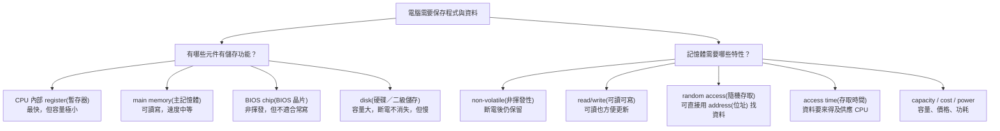
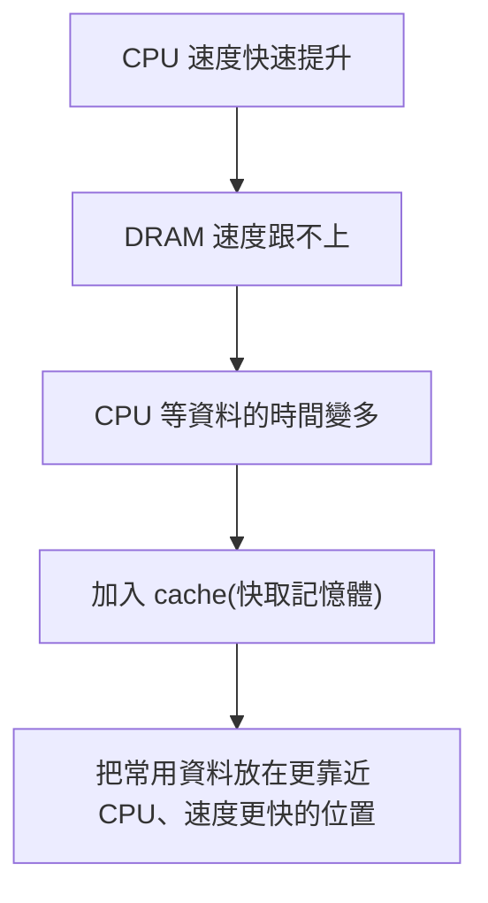
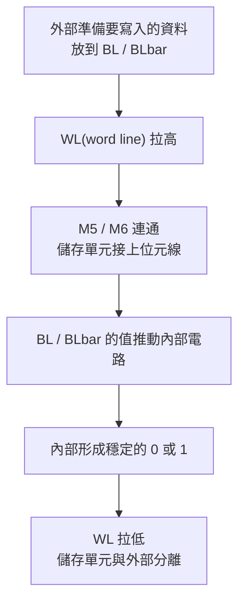
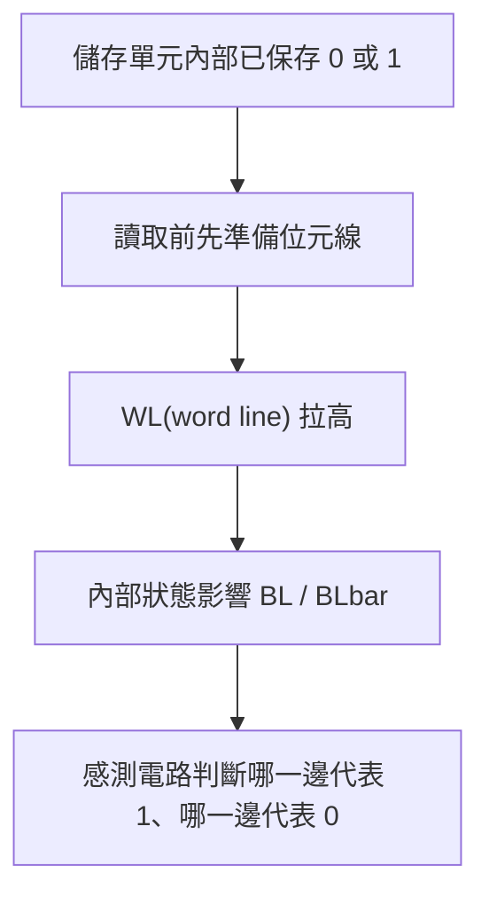

## ⭐記憶體在電腦中的角色 — 為什麼不能只說「記憶體就是 RAM」？

講義位置：PDF viewer page 3 ~ PDF viewer page 6／輔助：Chapter 5 — Memory — 3 ~ 6

### 1. 本輪核心問題：什麼東西算 Memory(記憶體)？

這章不是一開始就直接講 `cache(快取)`，而是先問一個更基本的問題：

**電腦裡面，到底哪些東西有「儲存功能」？**

在 `Von Neumann architecture(馮·諾依曼電腦結構)` 裡，講義列出五大部分：`central arithmetical(運算器)`、`central control(控制器)`、`memory(記憶體)`、`input(輸入裝置)`、`output(輸出設備)`。但講義特別補充：CPU 裡的 `general-purpose registers(通用暫存器)` 雖然屬於運算器內部，但它們也能暫時存資料，所以也可以視為一種記憶體；外部記錄介質也有儲存功能。

生活化一點講：

你的電腦不是只有一個「倉庫」。它比較像一間餐廳：

* `register(暫存器)` 像廚師手上正在拿的食材，最快，但能拿的很少。
* `main memory(主記憶體)` 像廚房旁邊的食材架，容量比較大，但拿取比手上慢。
* `disk(硬碟／SSD 類二級儲存)` 像地下倉庫，很多很便宜，但拿東西最慢。
* `BIOS chip(BIOS 晶片)` 像開店流程手冊，開機時先用，但平常不常改寫。

所以本章的 `memory(記憶體)` 不是只等於 RAM，而是泛指電腦中「能保存資料或程式狀態」的元件。

---

### 2. 第一個需求：Non-volatility(非揮發性)

講義的第一個需求是：系統通電啟動時，需要執行的程式與資料要已經存在，而且斷電後不會消失。這種斷電後仍能保留資訊的記憶體稱為 `non-volatile memory(非揮發性記憶體)`。講義同時指出，`main memory(主記憶體)` 與 CPU 中的通用暫存器通常是 `volatile memory(揮發性記憶體)`，斷電後資料會遺失；而 BIOS 晶片與硬碟是非揮發性的，所以 CPU 通電後要先從 BIOS 開始執行，再把更多程式與資料從硬碟搬到記憶體中。

核心原理是：

**電腦需要某些地方能在斷電後還記得「開機要怎麼開始」。**

如果所有記憶體都像 RAM 一樣斷電就忘光，電腦一開機會完全不知道第一條指令在哪裡。

---

### 3. 第二個需求：Read/Write(可讀可寫)

講義第二個需求是：記憶體最好能 `read(讀)` 又能 `write(寫)`。主記憶體和硬碟一般都可讀可寫；BIOS 晶片雖然不是完全不能寫，但寫入需要特殊設備或特殊流程，不適合經常性寫入。

生活化例子：

* 筆記本：你可以讀以前寫的，也可以隨時改，像 RAM 或硬碟。
* 印好的說明書：你可以讀，但不方便改，像 BIOS 晶片。

所以 `read/write(可讀可寫)` 不是在問「能不能存資料」而已，而是在問：**CPU 或系統能不能很方便地更新這份資料。**

---

### 4. 第三個需求：Random Access(隨機存取)

講義第三個需求是：記憶體必須支援 `random access(隨機存取)`。意思是：存取任何位置的資料，時間不應該強烈依賴它在第幾個位置。講義用磁帶作為反例：如果你要聽第十首歌，必須先快轉經過前九首，這就不是隨機存取；程式執行時常常會跳到任意位置讀資料，如果記憶體不能隨機存取，效能會很差。

這裡的關鍵不是「隨便亂存」，而是：

**Address(位址) 可以直接指定位置，而不是一定要從頭掃到那裡。**

這對 CPU 非常重要，因為程式不是永遠照順序讀資料。像 array、pointer、function call、branch、load/store 都可能要求 CPU 去某個特定位址拿資料。

---

### 5. 第四個需求：Access Time(存取時間)

講義第四個需求是速度，也就是 `access time(存取時間)`。CPU 運轉很快，因此當 CPU 要資料時，最好能在很短時間內拿到；如果記憶體太慢，CPU 就會等資料，後續操作會被阻塞。講義也指出主記憶體速度明顯高於硬碟速度。

這裡有一個很重要的不變量：

**CPU 不只是要資料正確，也要資料來得及。**

如果 CPU 一秒可以做很多次運算，但每次都要等很慢的硬碟，它就像一個超快廚師一直站在原地等倉庫搬食材。CPU 很快也沒用，因為資料供應跟不上。

---

### 6. 為什麼講義還列出 Capacity(容量)、Cost(價格)、Power(功耗)？

PDF viewer page 5 把記憶體特性整理成：非易失性、可讀可寫、隨機存取、存取時間、容量、價格、功耗，並用 CPU 通用暫存器、主記憶體、BIOS 晶片、硬碟作為對照物件。

這其實是在鋪陳後面的 `memory hierarchy(儲存層次結構)`：

!!! danger
    如果有一種記憶體同時具備：

    * 斷電不消失
    * 可讀可寫
    * 隨機存取
    * 跟 CPU 一樣快
    * 容量超大
    * 超便宜
    * 超省電
    
    ==以上是記憶體要求==

那我們就不需要分層了，全部都用那一種就好。

但現實是：越快的記憶體通常越貴、容量越小；越大越便宜的儲存通常越慢。這就是後面要進入 `CPU/DRAM/Disk comparison(CPU 和記憶體特性對比)` 與 `memory hierarchy(儲存層次結構)` 的原因。

---

### 7. 本輪概念圖

---

### 8. 最短記法

本輪你先抓住一句話就好：

**記憶體不是只有 RAM；只要能存資料或程式狀態，都可以納入記憶體／儲存系統的討論。而電腦真正想要的是：不會忘、可讀寫、能直接找、夠快、夠大、夠便宜、夠省電。**

但現實中沒有一種記憶體能全部做到，所以後面才需要 `memory hierarchy(儲存層次結構)`。

### 錯題

!!! danger

    Suppose a storage device has the following properties:

    - It can keep data after power is turned off.
        
    - It can be read and written.
        
    - To access item number 100, it must scan through items 1 to 99 first.
        
    - It has large capacity but slow access time.
        

    Which memory requirement from this lecture does it fail to satisfy most directly? Explain why that requirement matters for CPU execution.

    ==ANS:==

    隨機存取，因為他說要讀100 要先經過 1~99。對CPU很重要是因為如果每次都要從 1 開始會花很多時間，效率很低。

    ==注意==
    他要問的是哪一個講義中提到的"記憶體要求"不符合。
    
    
    

## ⭐Memory Hierarchy — 為什麼電腦不能只用一種超大的記憶體？

講義位置：PDF viewer page 7 ~ PDF viewer page 14／輔助：Chapter 5 — Memory — 7 ~ 14

### 1. 本輪核心問題：CPU 太快，記憶體跟不上怎麼辦？

上一輪我們整理出理想記憶體需要：不會斷電遺失、可讀可寫、隨機存取、夠快、夠大、夠便宜、夠省電。

這一輪講義開始用數據告訴你一件事：

**現實世界沒有一種記憶體同時滿足所有需求。**

講義在 PDF viewer page 7 用 CPU、DRAM、Disk 的歷史資料對比速度、容量與價格。CPU 的 cycle time(週期時間)從 1980 年的 1000 ns 到 2010 年的 0.4 ns，速度進步非常快；DRAM access time(存取時間)從 375 ns 到 40 ns，雖然也變快，但遠遠追不上 CPU；Disk 的 access time 用 ms(毫秒) 當單位，和 CPU 的 ns(奈秒) 差距更大。

生活化例子：

CPU 像一個超快廚師，一秒可以切很多菜；DRAM 像廚房旁邊的冰箱；Disk 像地下倉庫。
廚師越來越快，但冰箱和倉庫送食材的速度沒有等比例變快，結果廚師常常不是在做菜，而是在等食材。

---

### 2. 為什麼 Disk(硬碟)不能直接當 CPU 的主要工作記憶體？

Disk 的優點是容量大、單位價格低、斷電不會消失；但它的缺點是太慢。講義在 PDF viewer page 7 特別強調，硬碟的 access time 單位是 ms，而 CPU 與 DRAM 的比較常用 ns；ms 和 ns 差了非常多個數量級。

所以 disk 適合當「大倉庫」，不適合直接當 CPU 每個 cycle 都要碰的工作區。

用一句話記：

**Disk 很會存，但不會快。**

---

### 3. 為什麼 Main Memory(主記憶體/DRAM)也不夠？

DRAM 比 disk 快很多，也可以和 CPU 直接交換資料；但 CPU 進步得更快。講義說 1980 年時 DRAM 甚至還比 CPU 需求快一些，因此不用太擔心資料供應；到了 1990 年，DRAM 速度已經比 CPU 慢，而且差距越來越大。

這就是常見的 `memory wall(記憶體牆)` 直覺：
CPU 很快，但它需要的資料在慢很多的記憶體裡，於是 CPU 效能被資料供應卡住。

---

### 4. Cache(快取記憶體)為什麼出現？

講義在 PDF viewer page 13 用 1980 年代 x86 CPU 的 cache 設計說明這個演化：早期 8088、80286 還不需要 cache；到了 80386，DRAM 已明顯慢於 CPU，因此用片外 SRAM 作為 cache；到了 80486，cache 被設計到 CPU 晶片內部。

這裡的核心不是背年份，而是理解因果：

`cache(快取記憶體)` 的角色像「廚師手邊的小食材盒」：
不是把整個倉庫搬到手邊，而是把最近常用、可能再用到的東西先放近一點，減少每次都跑去慢速記憶體拿資料。

---

### 5. Memory Hierarchy(儲存層次結構)的核心規則

PDF viewer page 14 把儲存層次結構整理成由上到下：

1. `general-purpose registers(通用暫存器)`：Byte 量級
2. `cache memory(快取記憶體)`：KB ~ MB 量級
3. `main memory(主記憶體)`：MB ~ GB 量級
4. `local secondary storage(本地二級儲存)`：GB ~ TB 量級

講義給出的關鍵規則是：越往上，容量越小、速度越快、單位位元組成本越高；越往下，容量越大、速度越慢、單位位元組成本越低。

所以 Memory Hierarchy(儲存層次結構)不是隨便排列，它是在解決一個 trade-off(取捨)：

**我們想讓 CPU 感覺資料很快就拿得到，同時又想讓系統真的能存很多資料，而且成本不能爆炸。**

---

### 6. 最短記法

這一輪先背這句就好：

**越靠近 CPU：越快、越小、越貴；越遠離 CPU：越慢、越大、越便宜。Memory Hierarchy 就是在用多層儲存，假裝我們同時擁有「很快」和「很大」。**

## ⭐SRAM vs DRAM — 為什麼 Cache 常用 SRAM，而 Main Memory 常用 DRAM？

講義位置：PDF viewer page 15 ~ PDF viewer page 29／輔助：Chapter 5 — Memory — 15 ~ 29

### 1. 本輪核心問題：快與便宜為什麼不能同時拿滿？

前面我們說 memory hierarchy(儲存層次結構)的上層比較快、比較小、比較貴；下層比較慢、比較大、比較便宜。這一輪講義開始追問更底層的原因：

**為什麼 cache(快取記憶體)常用 SRAM，而 main memory(主記憶體)常用 DRAM？**

PDF viewer page 15 先給結論：`SRAM(Static Random-access Memory，靜態隨機存取記憶體)` 比較快、比較貴；`DRAM(Dynamic Random-access Memory，動態隨機存取記憶體)` 比較慢、比較便宜。但講義也強調，不只要背結論，還要知道為什麼。

---

### 2. SRAM(靜態隨機存取記憶體)：通電時狀態可以穩定維持

`SRAM(靜態隨機存取記憶體)` 的「Static(靜態)」不是指斷電後資料還在，而是指：

**只要保持供電，資料狀態就能穩定維持，不需要像 DRAM 那樣週期性刷新。**

所以 SRAM 仍然是 `volatile memory(揮發性記憶體)`：一旦斷電，資料還是會消失。這點很容易跟 ROM、Flash 混淆，考試如果問「SRAM 是不是 non-volatile(非揮發性)？」答案是 **不是**。

生活化例子：

SRAM 像你用手一直穩穩拿著一張牌。只要你還醒著、手還有力氣，牌就不會掉；但你睡著或斷電，牌就沒了。

---

### 3. SRAM 為什麼快？因為它用電路狀態直接維持 0/1

講義中的 SRAM 基本儲存單元用 6 個 transistor(電晶體)保存 1 bit。它可以想成兩個互相支撐的反相器，形成穩定的 0/1 狀態。讀寫時會透過 `WL(word line，字元線)` 控制是否連接到外部，並透過 `BL/BLbar(bit line/反相位元線，位元線與反相位元線)` 傳送資料。

你先不用把每個 transistor 的開關細節全部背到會畫，但要抓住三個考點：

1. SRAM 一個 bit 需要較複雜的電路，常見是 6T cell(六電晶體儲存單元)。
2. 因為資料由穩定電路狀態維持，所以不需要 refresh(刷新)。
3. 電路複雜代表面積大、成本高、容量密度低，但速度快。

PDF viewer page 24 也收束 SRAM 的特點：速度較快，但集成度低、功耗較高、價格較高；現代 CPU 中的 cache 通常使用 SRAM。

---

### 4. SRAM 的寫入與讀取：先抓高層流程

SRAM 的寫入流程可以用這樣理解：

SRAM 的讀取流程則是：

用生活例子講，SRAM 像一個很穩的雙開關機構：
寫入時，是外部把開關推到指定狀態；讀取時，是看這組開關目前偏向哪一邊。

---

### 5. DRAM(動態隨機存取記憶體)：用電容存 0/1，所以要 refresh(刷新)

`DRAM(動態隨機存取記憶體)` 的「Dynamic(動態)」來自它需要週期性更新。DRAM 的基本概念是用 capacitor(電容)是否帶電來表示資料：

* 有電荷：可以代表 1
* 沒電荷：可以代表 0

問題是 capacitor(電容)會漏電。過一段時間後，原本代表 1 的電荷會慢慢流失，資料就可能錯掉。所以 DRAM 必須定期做 `refresh(刷新)`：把原本代表 1 的電容補電，讓資料維持住。PDF viewer page 27 明確說明電容漏電會導致資訊丟失，因此要定期 refresh。

生活化例子：

DRAM 像一個會漏水的小杯子。
杯子有水代表 1，沒水代表 0。
但杯子一直漏，所以你要定期補水，不然本來的 1 會慢慢變得看不出來。

---

### 6. DRAM 為什麼便宜、容量大，但比較慢？

DRAM 的 ==每個 bit 可以用很少的元件儲存== ，核心是 capacitor(電容)加上控制元件，所以 `integration density(集成度)` 高，也就是同樣晶片面積可以塞更多 bit。這讓 DRAM 容量大、成本低、功耗較低。

但缺點是：

1. 需要 refresh(刷新)，帶來額外時間與控制成本。
2. 讀取電容上的微小電荷需要 sense amplifier(感測／放大器)判斷。
3. 整體速度比 SRAM 慢。

PDF viewer page 28 收束 DRAM 的特點：集成度高、功耗較低、價格較低；缺點是速度較慢、需要定時刷新；現代 PC 多用 DRAM 作為主記憶體。

---

### 7. 最終比較表：考試最常要你輸出的版本

!!! danger

    PDF viewer page 29 用表格比較 DRAM 與 SRAM：DRAM 儲存單元是電容，SRAM 是雙穩態觸發器；DRAM 集成度高、功耗低、價格低、速度慢、需要刷新；SRAM 集成度低、功耗高、價格高、速度快、不需要刷新。

    | 比較項目           | DRAM              | SRAM                             |
    | -------------- | ----------------- | -------------------------------- |
    | 儲存單元           | capacitor(電容)     | bistable latch/flip-flop(雙穩態觸發器) |
    | 速度             | 慢                 | 快                                |
    | 集成度(==同一塊晶片面積可以塞多少 bit==)            | 高(==每個 bit 可以用很少的元件儲存==)                 | 低                                |
    | 容量潛力(==用合理成本、合理面積、合理功耗，能不能實際做成很大容量？==)          | 大                 | 小                                |
    | 成本             | 低                 | 高                                |
    | 功耗(==以大量記憶體、同容量或每 bit 的實務成本來看==)             | 較低(==每格小、比較省，但要一直補電==)                | 較高(==不用補電，但每格是一組比較大的電路，所以做很多格會比較耗。==)                               |
    | 是否 refresh(刷新) | 需要                | 不需要                              |
    | 常見用途           | main memory(主記憶體) | cache memory(快取記憶體)              |
    
    

---

### 8. 最短記法

**SRAM：快、貴、小、不用 refresh，所以適合 cache。**
**DRAM：慢、便宜、大、要 refresh，所以適合 main memory。**

再更短：

**SRAM 用電路穩住資料；DRAM 用電容暫存電荷。**

### SRAM 結構與原理

!!! danger

    #### 1. 口語化小整理

    6T SRAM 可以想成一個很小的「雙邊互鎖開關」。

    它裡面有兩個值：

    `Q` 和 `Q̅`

    這兩個一定相反：

    `Q = 0` 時，`Q̅ = 1`
    `Q = 1` 時，`Q̅ = 0`

    ---

    #### 2. 維持資料時
    
    

    假設現在存的是：

    `Q = 0`
    `Q̅ = 1`

    那可以口語化想成：

    `Q` 這邊被 `GND` 拉住，所以它維持 `0`。
    `Q̅` 這邊被 `VDD` 拉住，所以它維持 `1`。

    而且這兩邊不是各自獨立維持，而是互相鎖住。

    `Q = 0` 會讓左邊的某些開關狀態固定，讓 `Q̅` 繼續被拉到 `1`。
    `Q̅ = 1` 也會讓右邊的某些開關狀態固定，讓 `Q` 繼續被拉到 `0`。

    所以比較口語可以說：

    > `Q = 0` 被 `GND` 維持，`Q̅ = 1` 被 `VDD` 維持，兩邊互相確認對方的狀態，所以資料會被鎖住。

    ---

    #### 3. 修改資料時
    
    

    假設原本是：

    `Q = 0`
    `Q̅ = 1`

    現在想改成：

    `Q = 1`
    `Q̅ = 0`

    這時會打開 `WL`，讓外面的 `BL/BL̅` 接進來。

    你可以口語化記成：

    `WL = 1` 會打開 `M5/M6`。
    `BL = 1` 透過 `M6` 去拉高 `Q`。
    `BL̅ = 0` 透過 `M5` 去拉低 `Q̅`。

    所以寫入時是：

    > 外面的 `BL/BL̅` 進來「硬改」裡面的 `Q/Q̅`。

    但不要說「`BL` 電壓比 `GND` 大，所以一定壓過」。
    比較正確是：

    > 寫入電路夠強，所以可以暫時壓過原本 cell 裡面維持資料的力量。

    也就是：

    > 不是只比電壓大小，而是比誰比較有力。

    ---

    #### 4. 讀取資料時

    讀取跟寫入剛好反過來。

    寫入是：

    > `BL/BL̅` 改 `Q/Q̅`

    讀取是：

    > `Q/Q̅` 影響 `BL/BL̅`

    讀取前，會先把兩邊都拉高：

    `BL = 1`
    `BL̅ = 1`

    然後：

    `WL = 1`

    這時 `M5/M6` 打開，cell 連到 `BL/BL̅`。

    如果某一邊裡面存的是 `0`，那一邊就會有路徑通到 `GND`，所以那條 bitline 會被稍微拉低。

    例如：

    如果 `Q = 0`，那 `BL` 那邊會被稍微拉低。
    如果 `Q̅ = 0`，那 `BL̅` 那邊會被稍微拉低。

    所以讀取時可以口語化說：

    > 兩邊一開始都拉成 `1`，然後看哪一邊掉比較多。掉比較多的那邊，就是原本存 `0` 的那邊。

    ---

    #### 5. 最短總結

    維持資料：

    > `Q` 和 `Q̅` 一邊被 `GND` 拉住，一邊被 `VDD` 拉住，兩邊互相鎖住，所以資料不會自己變。

    寫入資料：

    > `WL = 1` 打開 `M5/M6`，讓 `BL/BL̅` 接進來。`BL/BL̅` 夠強時，就能把原本的 `Q/Q̅` 改掉。

    讀取資料：

    > 先把 `BL` 和 `BL̅` 都拉成 `1`，再打開 `WL`。哪一邊原本接到 `0`，哪一邊就會被 `GND` 稍微拉低。最後看哪邊掉比較多，就知道資料是 `0` 還是 `1`。

    最口語一句：

    > **維持是自己鎖住；寫入是外面硬改裡面；讀取是裡面讓外面其中一邊稍微掉下來。**

### 錯題

#### ==Q:==
refresh 為什麼會讓 DRAM 較慢？
==ANS:==
因為 refresh 會佔用時間和記憶體內部資源。

DRAM 一邊要服務 CPU 的讀寫要求，一邊還要抽時間去 refresh。  
所以有時候 CPU 想讀寫 DRAM，但 DRAM 正在 refresh，CPU 就可能要等一下。

因此 DRAM 的速度會被 refresh 拖慢。

SRAM 不用 refresh，所以可以比較直接地讀寫資料，速度通常比 DRAM 快。