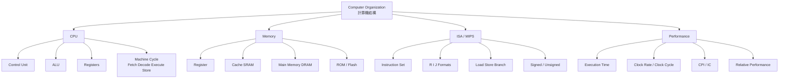

1. 快速定位：這次你最該先背什麼

---

如果你現在是要「短時間快速複習」，我建議優先順序是：

1. **效能 (Performance)**：因為 ch1、作業、Kahoot 都反覆出現，還牽涉到 clock rate、clock cycle、CPI、execution time、relative speed。 
2. **記憶體階層 (Memory Hierarchy)**：register、cache、DRAM、ROM、flash 的角色與差異很常考。 
3. **MIPS / ISA / 指令格式**：instruction set、R/I/J 型、register、load/store、branch、slt/slti、shamt 幾乎是 ch2 核心。  
4. **CPU 基本組成與機器週期**：control unit、ALU、register、PC、cache、fetch/decode/execute/store。
5. **CISC vs RISC**：Kahoot 與 ch2 都有，且非常容易混。 

---

2. 核心觀念地圖

---

---

3. 一頁看懂所有核心重點

---

### 3.1 CPU 與基本執行流程

CPU 的核心角色可以拆成：
**Control Unit(控制單元)** 負責解碼、發命令；
**ALU(Arithmetic Logic Unit，算術邏輯單元)** 負責算術與邏輯運算；
**Registers(暫存器)** 負責放目前最常用、最快要取的資料。PC(program counter) 負責指出下一個要執行的指令位址。

一個指令的大流程是：

**Fetch(擷取) → Decode(解碼) → Execute(執行) → Store(儲存)**。教材也把它拆成「指令週期 = 擷取 + 解碼；執行週期 = 執行 + 儲存」。

你可以把它想成餐廳出餐流程：
先拿單（fetch）→ 看懂單（decode）→ 做菜（execute）→ 送餐（store）。

---

### 3.2 記憶體階層一定要會

最重要的觀念不是背名字，而是背「**越靠近 CPU 越快、越小、越貴**」。

從快到慢大致可想成：

**Register → Cache(L1/L2/L3) → Main Memory(DRAM) → Secondary Storage**

教材明確指出：cache 通常用 **SRAM**，主記憶體通常是 **DRAM**；SRAM 比 DRAM 快，但更貴、容量更小。 

你至少要穩背這幾個：

* **RAM**：揮發性，關機資料消失。
* **DRAM**：主記憶體，要持續充電更新。
* **SRAM**：常拿來做 cache，不需像 DRAM 那樣持續更新，速度快、成本高。
* **ROM**：唯讀、非揮發性，常放 BIOS。
* **Flash memory**：非揮發性，常見於手機、隨身碟、記憶卡。

---

### 3.3 Instruction Set / ISA 是什麼

**Instruction Set(指令集)** 就是電腦能聽懂的全部指令集合。Kahoot 也直接考了這個定義。

**ISA (Instruction Set Architecture，指令集架構)** 是硬體和 low-level software(低階軟體) 之間的介面。它定義了機器語言程式要知道的規則：有什麼指令、怎麼用暫存器、如何存取記憶體。 

一句話記：

**ISA 是規則；implementation(實作) 是怎麼把規則真的做成硬體。** 

---

### 3.4 MIPS 的核心精神

這章最核心不是背很多指令，而是理解 MIPS 為什麼長這樣：

1. **Simplicity favors regularity**：規律性讓硬體更簡單。
2. **Smaller is faster**：越小越快，所以 register 不會無限制增加。
3. **Good design demands good compromises**：設計要取捨。
4. **Make the common case fast**：常見情況要特別優化，例如 immediate。

---

### 3.5 CISC vs RISC

這題超常混。

**CISC**

* 指令多
* 常有較多 addressing modes(定址模式)
* 指令可變長
* 硬體較複雜
* 想法是：用較少條指令做比較複雜的事。  

**RISC**

* 指令少
* 通常固定長
* 常見 register-to-register
* 每條指令盡量簡單，利於 pipeline 與高速實作
* 想法是：把複雜工作拆成較多條簡單指令。  

你可以這樣背：

* **CISC = 複雜靠硬體**
* **RISC = 簡單靠軟體**

---

### 3.6 Register 與 Memory 的關係

MIPS 很重視 register。原因很單純：
**register 比 memory 快、也更省能。** 所以編譯器會盡量把常用變數放在 register，不夠才 spill(溢出) 到 memory。

重點：

* MIPS 常見有 **32 個通用暫存器**。
* `$t` 常當 temporary；`$s` 常當 saved。
* `$zero` 永遠是 0。
* `$at` 保留給 assembler 使用，Kahoot 有考。

---

### 3.7 MIPS 指令格式：R / I / J

這裡是 ch2 最硬的主軸。

#### R-type

用在 register 間運算，例如 `add`, `sub`, `and`, `or`, `slt`, `sll`, `srl`。格式：

`op rs rt rd shamt funct`  

重點欄位：

* `rs`：來源暫存器 1
* `rt`：來源暫存器 2
* `rd`：目的暫存器
* `shamt`：位移量
* `funct`：功能碼 

#### I-type

用在 immediate、load/store、branch。格式：

`op rs rt immediate/address` 

#### J-type

用在 jump。格式：

`op address` 

---

### 3.8 最常見 MIPS 指令族

#### 算術

* `add rd, rs, rt`
* `sub rd, rs, rt`
* `addi rt, rs, imm`

`addi` 的存在就是教材說的 **make the common case fast**：常數很常用，直接放進指令更快，不用先從記憶體載入。

#### 資料轉移

* `lw rt, offset(rs)`：load word
* `sw rt, offset(rs)`：store word

這是 **register ↔ memory** 的橋樑。MIPS 是 load/store 架構，真正算術通常還是在 register 做。

#### 邏輯

* `and`
* `or`
* `nor`
* `sll`
* `srl`

其中 `shamt` 就是 shift amount(位移量)，Kahoot 也考過。

#### 條件判斷 / 分支

* `beq`
* `bne`
* `slt`
* `slti`
* `sltu`
* `sltiu`

`slt` / `slti` 是高頻題：
**差別不是 signed/unsigned，而是有沒有 immediate。**

* `slt`：跟 register 比
* `slti`：跟立即值比
  Kahoot 也直接考了。 

---

### 3.9 Signed / Unsigned 一定要分清楚

教材強調：

* 有號整數常用 **two’s complement(2 的補數)**。
* 比較大小時，有號和無號的意義不同。
  例如同一串 bit，當 signed 看可能是負數；當 unsigned 看可能是超大正數。

重點指令：

* `slt`, `slti`：**signed**
* `sltu`, `sltiu`：**unsigned** 

---

### 3.10 地址、對齊、陣列偏移

這裡很常出計算題。

MIPS 以 **byte 為定址單位**，但 `lw/sw` 操作的是 **word(4 bytes)**。所以：

* 一個 word = 4 bytes
* 連續 word 位址差 4
* word 對齊通常在 4 的倍數位址開始。

所以陣列位移公式很重要：

**A[i] 的位移 = i × 4**（假設每個元素是 1 word）
例如 `A[8]` 的 offset = `8 × 4 = 32`。教材例題就是這樣。

---

### 3.11 內儲程式 (Stored-program concept)

這個概念非常根本：

1. **程式和資料都存在記憶體裡**
2. **CPU 依序從記憶體取指令來執行**

這就是為什麼「換一個程式，電腦就像變成另一台機器」。

---

### 3.12 效能的真正核心

這部分是你最該背公式的地方。

**真正可靠的效能量測是時間。** 教材明講：execution time 才是最終標準。

要分兩種：

* **Response time / Execution time**：一個工作做完花多久
* **Throughput**：單位時間完成多少工作 

關係要記：

* **效能 ∝ 1 / 執行時間**
* 執行時間越短，效能越好。

---

4. 必背數學公式總整理

---

### 4.1 時脈與週期

**Clock cycle time = 1 / Clock rate**
例如 100 MHz = 100 × 10^6 Hz
所以 clock cycle time = 1 / (100 × 10^6) = 10 ns。教材也給了這個例子。 

---

### 4.2 CPU time 基本式

**CPU time = CPU clock cycles × Clock cycle time** 

---

### 4.3 Clock cycles 與 CPI

**CPU clock cycles = Instruction Count × CPI**
其中 CPI = cycles per instruction。

---

### 4.4 最常用總公式

把上面兩式合起來：

**CPU time = Instruction Count × CPI × Clock cycle time**

也可寫成：

**CPU time = (Instruction Count × CPI) / Clock rate**

這是 ch1、Assignment1 最核心的效能公式。 

---

### 4.5 相對效能

**Performance(X) = 1 / Execution time(X)** 

**X 比 Y 快 n 倍：**
**Performance(X) / Performance(Y) = Execution time(Y) / Execution time(X) = n** 

---

### 4.6 指令吞吐量

若題目問每秒執行多少 instructions：

**Instructions per second = Clock rate / CPI**

這是 Assignment1 第 6 題很明顯在考的。

---

### 4.7 內頻、外頻、倍頻

**內頻 = 外頻 × 倍頻係數**  

---

### 4.8 陣列位址 / word offset

若每個元素 1 word = 4 bytes：

**位移量 offset = index × 4**
**有效位址 = base address + offset**

---

### 4.9 2 的補數取負值

快速求 `-x`：

**所有 bit 反相，再 +1**。教材直接強調了這個捷徑。

---

### 4.10 Amdahl’s Law

作業有直接點名 Amdahl’s law，所以這個公式建議一起背。

**Speedup = 1 / ((1 - p) + p / s)**

其中：

* `p`：可被改善的比例
* `s`：該部分加速倍數

它的精神是：**局部再怎麼加速，整體加速有限**。

---

### 4.11 功耗相關

教材給的是比例式，不一定要求你代數硬算，但概念要背：

**Dynamic energy ∝ (1/2) × C × V²**
**Power ∝ (1/2) × C × V² × f** 

重點不是常數，而是知道：

* 電壓 V 影響很大，因為是平方
* 頻率 f 越高，功耗也越高

---

5. 最容易考錯、我幫你直接修正的點

---

### 5.1 `slt` 跟 `slti`

不是 signed vs unsigned。
真正差別是：

* `slt`：比的是 **register 與 register**
* `slti`：比的是 **register 與 immediate**  

---

### 5.2 `slt` 跟 `sltu`

這才是 signed vs unsigned：

* `slt`：signed
* `sltu`：unsigned 

---

### 5.3 `shamt`

`shamt = shift amount(位移量)`，不是暫存器編號。

---

### 5.4 clock speed 單位

常見單位是 **GHz**，不是 GB、MB。

---

### 5.5 cache 在哪裡

cache 是介於 register 和 RAM 之間的快記憶體。Kahoot 也有考。

---

### 5.6 `nor` 不是 XOR

我有幫你抓到教材裡一個容易誤導的地方：某張 R 型指令表把 **nor** 寫成「異或」，這是錯的。
**NOR = NOT OR**，不是 XOR。

* `OR`：任一位元有 1 就得 1
* `NOR`：OR 完再全部反相
* `XOR`：相異為 1，相同為 0
  你考試不要被那張表帶走。

---

### 5.7 電腦四大基本功能 vs 固定順序

Kahoot 裡有一題把電腦工作順序簡化成某個固定流程，但正式一點的講法其實是：
**電腦具備 input、output、processing、storage 四大基本功能**，不是所有情境都硬套成唯一順序。這裡你用「四大功能」去答比較穩。 

---

6. 考前 2 分鐘速背版

---

### 6.1 口訣版

* **效能看時間，不看感覺**
* **Clock cycle = 1 / Clock rate**
* **CPU time = IC × CPI × Clock cycle**
* **快的是 register，再來 cache，再來 DRAM**
* **Cache 用 SRAM，主記憶體用 DRAM**
* **R 型：op rs rt rd shamt funct**
* **I 型：op rs rt immediate**
* **J 型：op address**
* **MIPS 是 load/store 架構**
* **A[i] 位移 = i × 4**
* **slt 比 register；slti 比立即值**
* **slt/slti 是 signed；sltu/sltiu 是 unsigned**
* **$zero 永遠 0；$at 給 assembler**
* **CISC 複雜靠硬體；RISC 簡單靠軟體**
* **2’s complement 取負：反相 + 1**

---

### 6.2 真的只想背公式時

[
\text{Clock cycle time}=\frac{1}{\text{Clock rate}}
]

[
\text{CPU clock cycles}=\text{Instruction Count} \times \text{CPI}
]

[
\text{CPU time}=\text{CPU clock cycles} \times \text{Clock cycle time}
]

[
\text{CPU time}=\text{Instruction Count} \times \text{CPI} \times \text{Clock cycle time}
]

[
\text{CPU time}=\frac{\text{Instruction Count} \times \text{CPI}}{\text{Clock rate}}
]

[
\text{Performance}=\frac{1}{\text{Execution time}}
]

[
\frac{\text{Performance}_X}{\text{Performance}_Y}=\frac{\text{Execution time}_Y}{\text{Execution time}_X}
]

[
\text{Instructions/sec}=\frac{\text{Clock rate}}{\text{CPI}}
]

[
\text{內頻}=\text{外頻} \times \text{倍頻係數}
]

[
\text{Address}=\text{Base}+\text{Offset}, \quad \text{Offset}=i \times 4
]

[
\text{Speedup}=\frac{1}{(1-p)+p/s}
]

[
\text{Dynamic energy} \propto \frac12 CV^2
]

[
\text{Power} \propto \frac12 CV^2 f
]

---

1. 我幫你做的結論

---

這批資料整體看下來，**期中前最有投資報酬率的複習主線**是：

**效能公式 → 記憶體階層 → MIPS 指令格式與常用指令 → signed/unsigned → branch / array offset**

因為這幾塊同時被：

* ch0 基礎觀念
* ch1 效能
* ch2 指令
* Assignment1
* Kahoot 錯題

反覆交叉提到。 

你要的話，我下一則可以直接幫你再壓成一份 **「期中考前最後 10 分鐘 A4 版」**，只留最可能考的定義、公式和陷阱。
