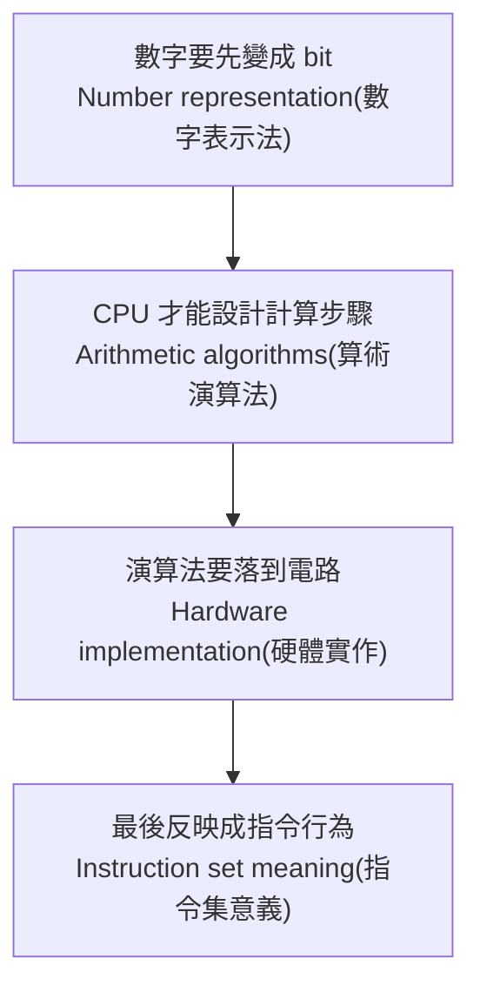
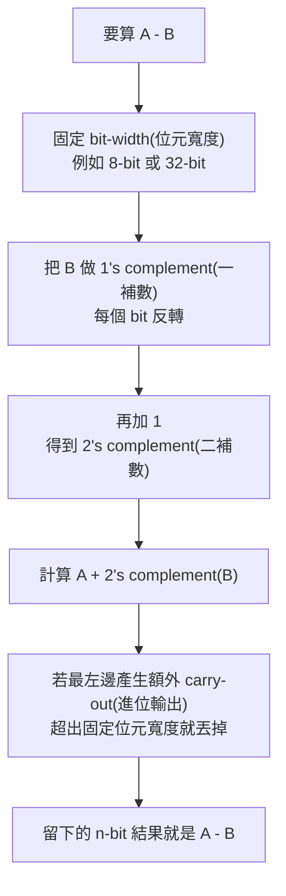
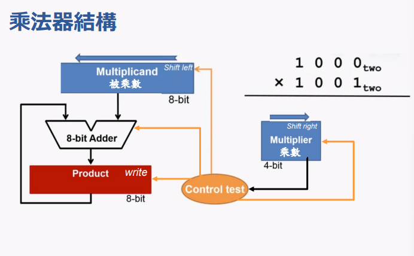
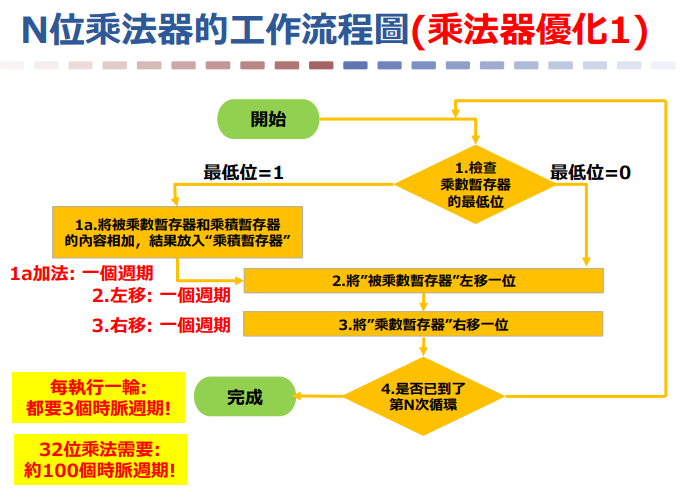
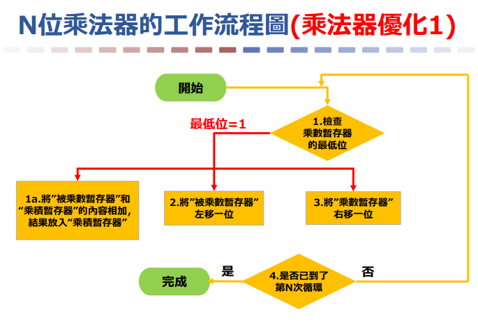
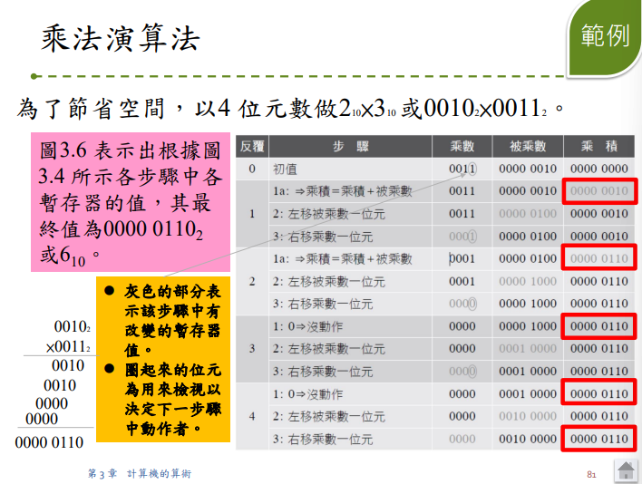

## ⭐第 3 章計算機的算術 — 這章到底在解決什麼問題？

講義位置：PDF viewer page 1 ~ PDF viewer page 2／輔助：第 3 章、3.1 介紹 

### 1. 這章不是只在算數字，而是在問「CPU 如何可靠地算數字？」

我們平常算 `7 + 6`、`88 - 10`、`1.5 × 2.0`，好像只是數學問題。

但在 `Computer Architecture(計算機結構)` 裡，這些問題會變成硬體問題：

CPU 不是拿紙筆算，它只能操作固定寬度的 bit。
例如 32-bit 暫存器就只有 32 格，算出來的結果如果塞不下，就可能發生 `overflow(滿溢)`。

所以第 3 章真正要處理的是：

「當所有數字都必須變成 bit，CPU 要如何表示、計算、偵測錯誤，並把這些能力反映到指令集？」

---

### 2. 本章四個主軸

講義 page 2 把本章目標列成四個方向：`real number representation(實數表示法)`、`arithmetic algorithms(算術演算法)`、`hardware for algorithms(演算法的硬體)`、以及這些內容對 `instruction set(指令集)` 的意義 。

可以把它想成四層：



生活化地說，這章像是在問：

我們不只是要會「算菜單價格」，還要設計一台收銀機。
收銀機要知道金額怎麼存、加減乘除怎麼做、超出顯示範圍怎麼辦，以及按下哪個鍵會觸發哪種硬體行為。

---

### 3. 第 3 章目錄告訴我們的主線順序

PDF viewer page 1 的章節目錄依序是：

1. `3.1 Introduction(介紹)`
2. `3.2 Addition and Subtraction(加法與減法)`
3. `3.3 Multiplication(乘法)`
4. `3.4 Division(除法)`
5. `3.5 Floating Point(浮點)`
6. 後面再接平行性、x86 SIMD、矩陣乘法、謬誤與陷阱、總結等內容 

我們會照這個 PDF viewer page 主線走，不先跳到浮點或乘法。

---

### 4. 先建立本章的核心心智模型

這章每個主題都可以用同一個框架理解：

| 層級    | 你要問的問題          | 之後會出現在哪                     |
| ----- | --------------- | --------------------------- |
| 表示法   | 這個數字怎麼用 bit 表示？ | 二補數、浮點                      |
| 演算法   | CPU 要怎麼一步一步算？   | 加減、乘法、除法、浮點運算               |
| 硬體    | 需要哪些電路元件？       | 加法器、乘法器、除法器                 |
| 例外／限制 | 算錯或塞不下時怎麼辦？     | overflow、exception、rounding |
| 指令集   | 程式設計師看到的是哪條指令？  | MIPS add/sub/addu/subu、浮點指令 |

最重要的是：
`Arithmetic(算術)` 在計算機結構裡不是純數學，而是「有限 bit + 有限硬體 + 指令行為」共同決定的結果。

---

### 5. 本輪最短記法

第 3 章主線可以先記成一句話：

CPU 算術 = 數字怎麼表示 + 怎麼用硬體演算法計算 + 超出範圍怎麼處理 + 指令集怎麼暴露這些行為。


## ⭐Binary Addition(二進位加法) — CPU 如何把加法拆成一個 bit 一個 bit 來做？

講義位置：PDF viewer page 3 ~ PDF viewer page 7／輔助：第 3 章第 3~7 頁 

### 1. 這個知識點在解決什麼問題？

我們平常寫：

`10010110 + 00101011`

看起來是一整串數字相加。

但硬體不會「一眼看懂整個數字」。CPU 的加法電路比較像一排工人，每個工人只負責一個 bit。每一位都做同一件事：

目前這一位的 bit 相加，算出本位結果，並把可能產生的 `carry(進位)` 傳給左邊下一位。

講義 page 3 也明確說，計算機中的加法是「各位數由右向左逐位元相加，進位則向左方一個位數傳遞」。

---

### 2. 一位元加法：Half Adder(半加器)

`Half Adder(半加器)` 處理的是最簡單情況：只加兩個 bit，沒有前一位傳來的 carry。

|  A |  B | A + B | 本位結果 sum | carry |
| -: | -: | ----: | -------: | ----: |
|  0 |  0 |     0 |        0 |     0 |
|  0 |  1 |     1 |        1 |     0 |
|  1 |  0 |     1 |        1 |     0 |
|  1 |  1 |   10₂ |        0 |     1 |

最重要的是最後一列：

`1 + 1 = 10₂`

這不是「二」，而是二進位中的 `10`。意思是：本位留下 `0`，往左邊進位 `1`。

生活化地說，就像十進位的 `9 + 1 = 10`：個位留下 0，十位進 1。二進位只是更容易進位，因為每一格只能放 0 或 1。

---

### 3. 為什麼需要 Full Adder(全加器)？

當加法不只一位時，某一位不只要加 A 和 B，還可能要加右邊傳來的 `carry-in(輸入進位)`。

所以 `Full Adder(全加器)` 的任務是：

`A + B + carry-in`

它的輸出仍然是兩個東西：

| 輸出                | 意義            |
| ----------------- | ------------- |
| `sum(本位和)`        | 這一位最後留下來的 bit |
| `carry-out(輸出進位)` | 要丟給左邊下一位的進位   |

例如：

`1 + 1 + 1 = 11₂`

意思是：本位留下 `1`，再往左進位 `1`。

---

### 4. 多位元加法：carry(進位) 是從右往左傳

假設我們要算：

`10010110 + 00101011`

講義 page 7 的圖就是這種多位元加法：從最右邊開始，一位一位往左算，若某位產生 carry，就傳給左邊下一位。

流程可以想成這樣：


這就是為什麼加法器的速度會被 carry 影響：如果每一位都要等右邊的 carry，最左邊最高位可能要等很久。後面講義 page 21 提到的 `carry lookahead(進位前瞻)`，就是想辦法更早知道高位的 carry，用來加速加法；但本輪先不展開。

---

### 5. 最小示範：用 full adder 追一個 4-bit 加法

我們算：

`1011 + 0110`

從右到左：

|  位元位置 |  A |  B | carry-in | A+B+carry-in | sum | carry-out |
| ----: | -: | -: | -------: | -----------: | --: | --------: |
| bit 0 |  1 |  0 |        0 |            1 |   1 |         0 |
| bit 1 |  1 |  1 |        0 |      2 = 10₂ |   0 |         1 |
| bit 2 |  0 |  1 |        1 |      2 = 10₂ |   0 |         1 |
| bit 3 |  1 |  0 |        1 |      2 = 10₂ |   0 |         1 |

所以 4-bit 內留下來的是 `0001`，最左邊還多出一個 carry-out `1`，完整結果是：

`10001₂`

檢查十進位：`1011₂ = 11`，`0110₂ = 6`，總和是 `17 = 10001₂`。

---

### 6. 常見錯法

第一個常見錯法是把 `1 + 1 = 10₂` 看成「結果是 10 兩位都直接塞在同一格」。不對。對單一 bit 來說，本位只能留下 0，另一個 1 必須變成 carry 傳出去。

第二個常見錯法是從左邊開始加。硬體邏輯與手算二進位加法都要從右邊低位元開始，因為左邊高位元可能需要等右邊來的 carry。

第三個常見錯法是分不清 `Half Adder(半加器)` 和 `Full Adder(全加器)`。半加器沒有 carry-in；全加器有 carry-in。多位元加法中，除了最右邊第一位以外，其他位通常都必須視為 full adder 的情境。

## ⭐Binary Subtraction(二進位減法) — 二進位不夠減時，CPU 要怎麼借位？

講義位置：PDF viewer page 8 ~ PDF viewer page 10／輔助：第 3 章第 8~10 頁 

### 1. 這個知識點在解決什麼問題？

剛剛加法是「從右到左，一位一位相加，carry(進位) 往左傳」。

減法也很像，只是傳遞的東西從 `carry(進位)` 變成 `borrow(借位)`。

減法的核心問題是：

如果某一位不夠減，要向左邊高位元借 `1`。但二進位借來的 `1` 不是十進位的 10，而是二進位的 `10₂`，也就是本位可以多出 `2` 來減。

---

### 2. 一位元減法：最重要的是 `0 - 1`

一位元二進位減法有幾種基本情況：

| 被減數 bit | 減數 bit | 結果 | 是否需要 borrow(借位) |
| ------: | -----: | -: | --------------: |
|       0 |      0 |  0 |               否 |
|       1 |      0 |  1 |               否 |
|       1 |      1 |  0 |               否 |
|       0 |      1 |  1 |               是 |

最容易錯的是最後一列：

`0 - 1`

在目前這一位不夠減，所以要向左邊借 `1`。借來後，目前這一位會變成 `10₂`，也就是十進位的 2。

所以：

`10₂ - 1₂ = 1₂`

也就是本位結果留下 `1`，但左邊那一位被借走 `1`。

---

### 3. borrow(借位) 和 carry(進位) 的方向一樣，但意義相反

`carry(進位)` 是加法中「本位太大，往左邊送一個」。

`borrow(借位)` 是減法中「本位不夠，向左邊拿一個」。

方向都跟左邊高位元有關，但含義相反：

| 名稱           | 出現在哪 | 直覺           |
| ------------ | ---- | ------------ |
| `carry(進位)`  | 加法   | 本位裝不下，多的送去左邊 |
| `borrow(借位)` | 減法   | 本位不夠用，從左邊借來  |

---

### 4. 多位元減法：借位會連鎖影響左邊

假設某一位做了借位，左邊那一位原本的值就會少 1。
這代表多位元減法不能只看單一欄，必須追蹤 borrow 對後續高位元的影響。

講義 PDF viewer page 10 的多位元減法圖就是在展示這件事：某些位元需要借位，借位後會改變左側位元的可用值。

生活化例子：
你手上這一格錢不夠找零，就跟左邊一格借。可是左邊借給你之後，左邊自己也變少了；如果左邊接下來也不夠，可能還要繼續往更左邊借。

---

### 5. 最小示範：`1000₂ - 0011₂`

我們算：

`1000₂ - 0011₂`

從右到左看：

|  位元位置 | 被減數 A | 減數 B | 狀況                | 本位結果 |
| ----: | ----: | ---: | ----------------- | ---: |
| bit 0 |     0 |    1 | 不夠減，要向左借          |    1 |
| bit 1 |     0 |    1 | 原本也不夠，且前面借位會牽動更左邊 |    0 |
| bit 2 |     0 |    0 | 被借位鏈影響            |    1 |
| bit 3 |     1 |    0 | 借出後剩下 0           |    0 |

最後結果是：

`0101₂`

檢查十進位：`1000₂ = 8`，`0011₂ = 3`，`8 - 3 = 5 = 0101₂`。

---

### 6. 重要銜接：為什麼下一頁要講 Binary Complements(二補數)？

直接做借位減法很直覺，但對硬體來說不一定最方便。

因為如果 CPU 已經有加法器，那我們會想問：

能不能把減法改寫成加法？

也就是：

`A - B = A + (-B)`

下一個主線 page 11 的 `Binary Complements(二補數)` 就是在解決這個問題：如何用 bit 表示 `-B`，讓減法可以透過加法器完成。

這也是為什麼講義在 Binary Subtraction 之後立刻接 Binary Complements。


## ⭐Binary Complements(二補數) — 為什麼電腦可以把減法改成加法？

講義位置：PDF viewer page 11 ~ PDF viewer page 16

### 1. 這個知識點在解決什麼問題？

前面我們做 Binary Subtraction(二進位減法)時，需要 borrow(借位)。人可以慢慢借，但硬體很不喜歡「一下加法、一下降法、還要一路借位」這種複雜流程。

所以電腦想要把：

A − B

改寫成：

A + negative B(B 的負數)

也就是講義前面提到的核心想法：減法會先把 subtrahend(減數)變號，再加到 minuend(被減數)上。

生活化來說，假設你欠我 10 元，我要算「88 − 10」，也可以說成「88 加上 -10」。
電腦的問題是：binary(二進位)裡面要怎麼表示 `-10`？答案就是 Two's Complement(二補數)。

---

### 2. 1's Complement(一補數)：先把每個 bit 反過來

講義 PDF viewer page 11 先講 1's complement(一補數)。規則很簡單：

| 原 bit | 1's complement |
| ----- | -------------- |
| 0     | 1              |
| 1     | 0              |

例如：

| Previous value | 1 | 0 | 0 | 1 | 0 | 1 | 1 | 1 |
| -------------- | - | - | - | - | - | - | - | - |
| 1's complement | 0 | 1 | 1 | 0 | 1 | 0 | 0 | 0 |

所以：

10010111 的 1's complement 是 01101000。

核心觀念是：一補數不是「真正完成變號」，它只是變號的第一步。

---

### 3. Two's Complement(二補數)：一補數再加 1

Two's Complement(二補數)的規則：

先做 1's complement(一補數)，再加上 1。

例如剛剛：

10010111
1's complement = 01101000
再加 1：

01101000 + 1 = 01101001

所以：

10010111 的 2's complement 是 01101001。

這個規則就是講義 PDF viewer page 11 的主線：先得到 1 補數，再加上 1，形成 2 補數。

!!! danger
    
    ### 一補數和二補數是啥？

    1's Complement(一補數)：所有 bit 反過來

    ex.10010111 的 1's complement 是 01101000。

    Two's Complement(二補數)：一補數+1 = 全部取反+1

    ex.10010111 的 2's complement 是 01101001。

---

### 4. 為什麼這樣可以代表「負數」？

關鍵在這個性質：

原數 + 1's complement = 全部都是 1
再 + 1 = 1 後面接一串 0

例如 8-bit：

| 項目                 | bit pattern |
| ------------------ | ----------- |
| 原數 X               | 10010110    |
| X 的 1's complement | 01101001    |
| 相加                 | 11111111    |
| 再加 1               | 1 00000000  |

但電腦如果是 8-bit hardware(8 位元硬體)，只能留下低 8 bits：

1 00000000
丟掉最左邊超出的 carry-out(進位輸出)後，留下：

00000000

所以：

X + X 的 2's complement = 0

這就是二補數的秘密：它讓「加上一個數的二補數」在固定 bit-width(位元寬度)下等價於「減掉那個數」。PDF viewer page 12 也用「該數與 1 補數相加」以及「該數與 2 補數相加」呈現這個核心現象。

---

### 5. 二補數減法流程：A − B 變成 A + 2's complement(B)

之後我們看到減法時，不要再用借位一路硬算，而是用這個流程：



講義 PDF viewer page 13 用 `88 - 10` 示範這件事：先把 `10` 轉成 `-10` 的二補數，再與 `88` 相加，最後得到 `78`。

我們重跑一次：

| 十進位 | 8-bit binary |
| --- | ------------ |
| 88  | 01011000     |
| 10  | 00001010     |

先求 `-10`：

| 步驟             | bit pattern |
| -------------- | ----------- |
| 10             | 00001010    |
| 1's complement | 11110101    |
| 2's complement | 11110110    |

所以：

01011000 + 11110110 = 1 01001110

固定 8-bit 只留下：

01001110

01001110₂ = 78₁₀

所以：

88 − 10 = 78

注意：這裡最左邊那個額外的 `1` 是超出 8-bit 的 carry-out(進位輸出)，在固定 8-bit 運算中會被丟掉。

---

!!! danger

    ### 6. 快速求 Two's Complement(二補數)的技巧

    講義 PDF viewer page 14 給了一個 shortcut(捷徑)：從右往左看，保留到第一個 `1` 為止，左邊剩下的 bits 全部反轉。

    例如要求：

    10101000 的 2's complement

    從右邊開始：

    10101000
    最右邊一路遇到 `0`，直到第一個 `1`：

    1010 1 000

    保留「第一個 1 和它右邊全部」：

    _ _ _ _ 1 000

    左邊剩下的 `1010` 反轉成 `0101`：

    0101 1000

    所以：

    10101000 的 2's complement 是 01011000。

    這個技巧本質上只是把「反轉全部 bits 再加 1」濃縮成比較快的手算方法。

---

### 7. 二補數的二補數會回到原本 bit pattern

講義 PDF viewer page 15 問：如果十進位中 `5` 取負變 `-5`，再取負會回到 `5`；那二進位二補數是不是也一樣？講義用 `45` 的例子展示：對一個數做 Two's Complement(二補數)，再做一次 Two's Complement(二補數)，會回到原本 bit pattern。

直覺上就是：

第一次：X → -X
第二次：-X → X

補充一個小陷阱：在固定 n-bit two's complement 表示法裡，最負數例如 4-bit 的 `1000` 比較特殊，因為 `+8` 無法用 4-bit signed two's complement 表示；但從「bit operation(位元操作)」角度看，對 `1000` 做二補數仍會得到 `1000`。這是因為它發生表示範圍上的特殊情況，後面講 Overflow(滿溢)時會更重要。

---

!!! danger

    ### 8. 最短記法

    看到 `A - B`：

    1. 固定位元寬度，例如 8-bit。
    2. 把 `B` 變成 2's complement：反轉 bits，再加 1。
    3. 做 `A + 2's complement(B)`。
    4. ==超出位元寬度的 carry-out(進位輸出)丟掉。==
    5. 剩下的 bits 就是結果。

    中文理解版：二補數讓「減 B」變成「加 -B」。
    英文考試版：Two's complement allows subtraction to be implemented as addition by adding the two's complement representation of the subtrahend.


## ⭐Overflow 與 MIPS Exception — CPU 怎麼知道「算出來的答案放不下」？

講義位置：PDF viewer page 17 ~ PDF viewer page 21

### 1. Overflow(滿溢) 不是「有 carry-out 就一定錯」

在固定 32-bit 或固定 n-bit 的硬體裡，數字能表示的範圍有限。講義說，當運算結果無法用硬體的 32-bit word 表示時，就發生 `overflow(滿溢)`。

這裡最容易錯的是：
`carry-out(最高位外進位)` 不等於 signed overflow。

例如你剛剛算：

`00110110 + 11110011 = 1 00101001`

如果是固定 8-bit，前面的 `1` 是 carry-out，丟掉後得到 `00101001 = 41`。這不代表 signed overflow。判斷 signed overflow 要看「符號邏輯」是否矛盾。

!!! danger

    ### 啥是 overflow ？

    也就是說有 carry-out 是允許的，就像 `00110110 + 11110011 = 1 00101001`( 54+(-13)=41 )。
    發生 overflow 要看符號是否合理，像是正+正要是正數，不能是負數，如果是負數就是 overflow 。
    也就是說如果沒有正負之分，就不用管 overflow。


---

### 2. 加法的 overflow 判斷：同號相加才可能滿溢

加法時：

| 運算元符號 | 是否可能 overflow | 原因                   |
| ----- | ------------- | -------------------- |
| 正 + 正 | 可能            | 理論上應該更正；若結果變負，代表超出範圍 |
| 負 + 負 | 可能            | 理論上應該更負；若結果變正，代表超出範圍 |
| 正 + 負 | 不會            | 方向互相抵銷               |
| 負 + 正 | 不會            | 方向互相抵銷               |

所以加法 overflow 的典型判斷是：

| 情況        | 結果符號     | 判斷 |
| --------- | -------- | -- |
| 正 + 正 = 負 | overflow |    |
| 負 + 負 = 正 | overflow |    |

這就是講義 page 17~18 的重點。

---

### 3. 減法的 overflow 判斷：異號相減才可能滿溢

減法其實會轉成加法：

`A - B = A + (-B)`

所以如果 `A` 和 `B` 本來符號相同，例如：

`正 - 正` 或 `負 - 負`

它比較像是在抵銷，不容易把數字推爆。

但如果是：

| 情況    | 為什麼危險        |
| ----- | ------------ |
| 正 - 負 | 等於正 + 正，可能太大 |
| 負 - 正 | 等於負 + 負，可能太小 |

所以減法 overflow 的典型判斷是：

| 情況        | 結果符號     | 判斷 |
| --------- | -------- | -- |
| 正 - 負 = 負 | overflow |    |
| 負 - 正 = 正 | overflow |    |

---

!!! danger

    ### 4. MIPS 怎麼處理 overflow？

    講義接著把 overflow 連到 instruction set(指令集)：


    | 指令      | 遇到 overflow 是否呼叫 exception？ |
    | ------- | --------------------------- |
    | `add`   | 會                           |
    | `addi`  | 會                           |
    | `sub`   | 會                           |
    | `addu`  | ==不會==                          |
    | `addiu` | ==不會==                          |
    | `subu`  | ==不會==                          |

    最短記法：

    `add / addi / sub`：有號數，會檢查 overflow。
    `addu / addiu / subu`：無號版本，不呼叫 overflow exception。

    ==注意：`addu` 裡面的 `u` 不是說 ALU 不做加法，而是說「不因 overflow 觸發 exception」。==

---

!!! danger

    ### 5. Exception(例外)、EPC、mfc0 是在幹嘛？

    當 MIPS 偵測到 overflow，它不是默默給錯答案，而是透過 `exception(例外)` 讓系統處理。講義說 MIPS 有一個 `EPC(exception program counter，例外程式計數器)`，用來存放造成 exception 的指令位址；`mfc0` 可以把 EPC 複製到一般暫存器，讓軟體有機會回到造成 exception 的地方。

    你可以把它想成：

    CPU 說：「這個加法結果放不下，我不能假裝沒事。」
    於是它記下「是哪一條指令出事」，交給 exception handler(例外處理程式)處理。

---

### 6. Saturating Operations 與 Carry Lookahead

page 21 是 3.2 的收束補充。講義提到兩件事：

第一，`saturating operations(飽和運算)`：
如果 overflow，不讓結果繞回奇怪的值，而是直接設成最大正值或最小負值。這常見於影像、音訊這種不想讓數值突然反向的情境。

第二，`carry lookahead(進位前瞻)`：
普通加法如果一直等 carry 從低位一路傳到高位，會慢。carry lookahead 的想法是提早判斷高位 carry，讓加法更快。

本輪先把它們當成 3.2 的補充觀念，不深入電路細節。


!!! danger

    ### 錯題


    #### ==Q:==
    In fixed-width two's complement arithmetic, explain why a carry-out from the most significant bit is not enough to conclude that signed overflow occurred. Use the difference between unsigned carry-out and signed overflow in your explanation.

    ==ANS==
    因為超出位元不一定是溢位，還要看看正負號對不對。


    #### ==Q:==

    Assume 8-bit two's complement numbers. For each operation below, decide whether signed overflow occurs and explain why.

    1. `01000000 + 01000000 = 10000000`
    2. `10000000 + 11111111 = 01111111`
    3. `00100000 - 11100000 = 01000000`

    ==ANS==

    1.signed overflow occurs，因為正+正變成負是錯的
    2.signed overflow occurs，因為負+負變成正是錯的
    3.正常，正減負是正的

    ==注意==

    ==我看到這題我要怎麼知道是有號數加法？有沒有可能是無號數加法？==


    1\. 直接判斷：這題已經明講是有號數

    你看到題目：

    > Assume 8-bit two's complement numbers.  
    > decide whether **signed overflow** occurs

    關鍵有兩個：

    1. **two's complement numbers(二補數數字)**  
        通常代表用二補數來表示 **signed integer(有號整數)**。
        
    2. 題目直接問 **signed overflow(有號滿溢)**  
        所以你要用 signed range 判斷：8-bit two's complement 的範圍是  
        `-128 ~ +127`
        

    所以這題不是要你判斷 unsigned overflow，而是要你判斷 **signed overflow**。
    
    


## ⭐Binary Multiplication — 乘法為什麼可以變成「看乘數位元，要不要加被乘數」？

講義位置：PDF viewer page 22 ~ 38

### 1. 這個知識點在解決什麼問題？

前面加減法已經知道 CPU 很擅長做兩件事：

1. `add(加法)`
2. `shift(位移)`

所以乘法的核心問題是：

**能不能把 multiplication(乘法) 拆成 CPU 比較容易做的 add + shift？**

答案是可以。這就是二進位乘法比十進位乘法適合硬體的原因。

講義從 PDF viewer page 22 開始進入 3.3 乘法，先用 `1000₂ × 1001₂` 作為二進位乘法例子。

---

### 2. 先回到手工乘法：乘法其實是在做 partial products(部分乘積)

你在十進位小學乘法看到的形式，其實是：

| 動作              | 意義                         |
| --------------- | -------------------------- |
| 拿乘數的某一位去乘被乘數    | 產生一列 partial product(部分乘積) |
| 每往左一位，部分乘積就左移一格 | 代表乘上 10、100、1000...        |
| 最後把所有部分乘積加起來    | 得到 product(乘積)             |

講義 PDF viewer page 23 ~ 28 用 `2345 × 9876` 類似的手工乘法過程展示 partial products 逐列產生。

所以乘法不是一個神秘的新運算，而是：

**乘法 = 產生很多列 partial products + 把它們加起來。**

---

### 3. 二進位乘法為什麼更簡單？

十進位乘法麻煩的地方是：每一位可能是 `0~9`，所以你需要知道：

* 被乘數 × 0
* 被乘數 × 1
* 被乘數 × 2
* ...
* 被乘數 × 9

這等於需要一張乘法表。

但二進位每一位只可能是：

| multiplier bit(乘數位元) | 對 partial product 的影響  |
| -------------------- | ---------------------- |
| `0`                  | 這一列放 0                 |
| `1`                  | 這一列放 multiplicand(被乘數) |

所以二進位乘法的核心規則是：

**看目前 multiplier bit：如果是 1，就加 shifted multiplicand；如果是 0，就加 0。**

講義後面也比較十進位與二進位計算機，指出二進位可簡化乘法與除法，特別是乘法不再需要十進位乘法表。

---

### 4. 例子：`1000₂ × 1001₂`

先標角色：

| 名稱                |       值 | 意義                        |
| ----------------- | ------: | ------------------------- |
| multiplicand(被乘數) | `1000₂` | 被拿去重複加的數                  |
| multiplier(乘數)    | `1001₂` | 決定哪些 partial products 要出現 |
| product(乘積)       |    最後結果 | 所有 partial products 加總    |

從 multiplier 的右邊最低位元開始看：

| multiplier bit 位置 | bit 值 | 產生的 partial product |
| ----------------- | ----: | ------------------- |
| 第 0 位             |   `1` | 加 `1000₂`           |
| 第 1 位             |   `0` | 加 `0000₂`，但左移一位     |
| 第 2 位             |   `0` | 加 `0000₂`，但左移兩位     |
| 第 3 位             |   `1` | 加 `1000₂`，但左移三位     |

用十進位理解：

* `1000₂ = 8`
* `1001₂ = 9`
* `8 × 9 = 72`
* `72₁₀ = 1001000₂`

所以：

`1000₂ × 1001₂ = 1001000₂`

重點不是背這個答案，而是理解：

**乘數哪一位是 1，就把被乘數移到那個位置後加進 product。乘數哪一位是 0，就不用加。**

!!! danger
    ### 英文單字

    multiplicand(被乘數) 
    multiplier(乘數)     
    product(乘積)        

---

### 5. 為什麼這會接到硬體？

到目前為止，我們還是在「手算」角度看乘法。

但硬體不喜歡一次排很多列 partial products，因為那需要很多加法器或很複雜的資料路徑。硬體比較喜歡反覆做簡單動作：

1. 看 multiplier 的某一個 bit。
2. 如果 bit 是 1，把 multiplicand 加到 product。
3. 移位。
4. 重複。

這就是 PDF viewer page 39 之後會開始處理的問題：**如何把手工乘法改寫成硬體友善的流程。**

---

### 6. 常見錯法

| 錯法                                    | 為什麼錯                                        |
| ------------------------------------- | ------------------------------------------- |
| 把 multiplier 和 multiplicand 混在一起      | multiplicand 是被加的數；multiplier 是決定哪些列要加的控制來源 |
| 忘記 shifted position(位移位置)             | 乘數的第 k 位代表要把 multiplicand 左移 k 位            |
| 看到 multiplier bit = 0 還加 multiplicand | bit = 0 時 partial product 應該是 0             |
| 以為二進位乘法不用加法                           | 其實二進位乘法更依賴加法，只是 partial product 變簡單         |

最短記法：

**Binary multiplication = for each multiplier bit, add shifted multiplicand if the bit is 1; otherwise add 0.**


!!! danger

    ## ⭐硬體化 Binary Multiplication — CPU 如何把手算乘法改成暫存器可執行的流程？

    講義位置：PDF viewer page 39 ~ PDF viewer page 49
    
    ==從下面開始比較重要，可以慢慢看~==

### 1. 這一段在解決什麼問題？

前面你會手算了：

先列出 partial products(部分乘積)，再全部加起來。

但 hardware(硬體) 不適合像人一樣把很多列 partial products 攤在紙上。硬體比較適合做這種重複流程：

1. 準備一個 product register(乘積暫存器)，一開始是 0。
2. 每次看一個 multiplier bit(乘數位元)。
3. 如果該 bit 是 `1`，就把目前的 multiplicand(被乘數) 加到 product。
4. 如果該 bit 是 `0`，就不加，或等價於加 0。
5. 下一輪讓 multiplicand 左移一位。

講義在後續頁面明確把 product 初始化為 0，並把中間結果直接累加到目前 product。 

### 2. 從「很多列相加」改成「product 一直累加」

你剛剛寫的是手算版：

| multiplier bit |           partial product |
| -------------: | ------------------------: |
|      bit 是 `1` | 寫下一列 shifted multiplicand |
|      bit 是 `0` |                 寫一列 0 或略過 |
|             最後 |                    把所有列加總 |

硬體版改成：

| 每一輪                     | hardware 做的事                               |
| ----------------------- | ------------------------------------------ |
| 目前 multiplier bit 是 `1` | `Product = Product + current Multiplicand` |
| 目前 multiplier bit 是 `0` | `Product` 不變                               |
| 進入下一輪                   | `Multiplicand` 左移一位                        |

重點是：**硬體不需要先把所有 partial products 存起來；它可以一邊產生 partial product，一邊直接加進 product register。**

這就是從「手算排列」變成「暫存器累加流程」。

### 3. 為什麼 multiplicand 要左移？

因為 multiplier bit 的位置代表權重。

以 `1000₂ × 1001₂` 為例：

| multiplier bit 位置 | bit 值 | 要加的東西        |
| ----------------: | ----: | ------------ |
|             bit 0 |     1 | `1000₂ << 0` |
|             bit 1 |     0 | 不加           |
|             bit 2 |     0 | 不加           |
|             bit 3 |     1 | `1000₂ << 3` |

所以每進入下一個 bit 位置，multiplicand 就要左移一位。講義這一段也明確寫到：每產生一個中間結果，被乘數向左移動一位。

### 4. 用你剛剛的例子改成 hardware-friendly trace

計算：

`00001000 × 00001001`

從 multiplier 的最低位開始看：`00001001` 的 bit pattern 從右到左是 `1, 0, 0, 1`。

| 輪次 | 目前 multiplier bit | 目前 multiplicand | 動作          |    product |
| -: | ----------------: | --------------: | ----------- | ---------: |
| 初始 |                 — |      `00001000` | product 初始化 | `00000000` |
|  1 |                 1 |      `00001000` | 加到 product  | `00001000` |
|  2 |                 0 |      `00010000` | 不加          | `00001000` |
|  3 |                 0 |      `00100000` | 不加          | `00001000` |
|  4 |                 1 |      `01000000` | 加到 product  | `01001000` |

最後 `01001000₂ = 72₁₀`。

這跟你手算的結果一樣，只是寫法更接近硬體：**product register 一直被更新，而不是最後才把所有列加起來。**

### 5. 常見錯法

第一個常見錯法：以為 multiplier bit 是 `0` 就停止。錯。bit 是 `0` 只是這一輪不加，下一輪還要繼續。

第二個常見錯法：只左移 product，不左移 multiplicand。這一段講義的調整重點是「每產生一個中間結果，被乘數左移一位」，product 則負責累加目前結果。

第三個常見錯法：以為這已經是完整 multiplier hardware(乘法器硬體)。還不是。PDF viewer page 50 才開始進入乘法器結構；本輪只是在把運算流程改造成適合硬體設計的形式。


## ⭐Multiplier Structure and First Multiplication Algorithm — 硬體到底怎麼一步一步做乘法？

講義位置：PDF viewer page 50 ~ 64／輔助：投影片頁碼 50–64

### 1. 這個知識點在解決什麼問題？

前面你已經會「硬體友善版」的乘法概念：

`Product` 從 0 開始。
如果 multiplier 某一位是 1，就把 shifted multiplicand 加進 Product。
如果 multiplier 某一位是 0，就不加。
每一輪 multiplicand 左移一位。

但 CPU 不能只停在「觀念」。CPU 需要一組硬體元件真的把這件事做出來，所以 PDF viewer page 50 開始進入 `Multiplier Structure(乘法器結構)`。

這一輪要學的是：
乘法器硬體裡有哪些暫存器？每一輪誰被檢查？誰被加？誰左移？誰右移？什麼時候停止？

### 2. 第一版乘法器需要哪些硬體角色？

你可以把第一版乘法器想成四個主要角色：

!!! danger "bit 數"

    | 硬體角色                | bit 數    | 中文意思     | 功能                                                       |
    | ----------------------- | --- | ------------ | ---------------------------------------------------------- |
    | `Multiplicand Register` | ==2n==    | 被乘數暫存器 | 放目前要加進 Product 的值；每輪左移一位                    |
    | `Multiplier Register`   |  ==n==   | 乘數暫存器   | 放 multiplier；每輪檢查最低位，然後右移一位                |
    | `Product Register`      | ==2n==    | 乘積暫存器   | 一開始是 0；累積目前已經加好的結果                         |
    | `Adder`                 | ==2n==    | 加法器       | 當 multiplier 最低位是 1 時，執行 `Product + Multiplicand` |

    

最重要的控制邏輯只有一句：

看 `Multiplier Register` 的最低位。
最低位是 `1`，就加。
最低位是 `0`，就不加。

### 3. 為什麼 multiplier 要右移？

因為硬體每一輪只想檢查同一個位置：最低位。

假設 multiplier 是：

| 原本 multiplier | 本輪檢查最低位           |
| ------------- | ----------------- |
| `1001`        | 檢查最右邊的 `1`        |
| 右移後 `0100`    | 檢查下一個 bit，也就是 `0` |
| 右移後 `0010`    | 檢查下一個 bit，也就是 `0` |
| 右移後 `0001`    | 檢查下一個 bit，也就是 `1` |

所以硬體不需要設計「第 0 位、第 1 位、第 2 位、第 3 位」各自不同的檢查電路。
它只要每輪看最低位，然後把 multiplier 右移，下一個 bit 自然就會跑到最低位。

這就是 `Shift right(右移)` 的意義。

### 4. 為什麼 multiplicand 要左移？

因為二進位乘法裡，不同 multiplier bit 代表不同權重。

以 `1000 × 1001` 為例：

| multiplier bit 位置 | bit 值 | 對應要加的值                 |
| ----------------- | ----: | ---------------------- |
| bit 0             |     1 | `1000 << 0 = 00001000` |
| bit 1             |     0 | 不加                     |
| bit 2             |     0 | 不加                     |
| bit 3             |     1 | `1000 << 3 = 01000000` |

所以每一輪把 multiplicand 左移，其實就是在準備下一個 bit 位置對應的 partial product。

### 5. 第一版乘法器的完整流程

!!! danger
    對 N-bit multiplier，流程是：


    | 步驟 | 動作                                                         |
    | -- | ---------------------------------------------------------- |
    | 1  | 檢查 `Multiplier Register` 的最低位                              |
    | 1a | 如果最低位是 `1`，把 `Multiplicand Register` 加到 `Product Register` |
    | 2  | 將 `Multiplicand Register` 左移一位                             |
    | 3  | 將 `Multiplier Register` 右移一位                               |
    | 4  | 檢查是否已經做完 N 輪；如果還沒，就回到步驟 1                                  |

注意：
不是看 multiplier 變成 0 就一定停。
第一版固定寬度硬體通常是做滿 N 輪，因為它處理的是 N-bit multiplier。

### 6. 用你剛剛的例子對照一次

題目：`00001000 × 1001`
也就是 `8 × 9`。
假設 Product 和 Multiplicand 用 8-bit 表示，Multiplier 用 4-bit 表示。

| 輪次 | Multiplier 最低位 | Product 加法前 | 是否加 Multiplicand | Product 加法後 | Multiplicand 左移後 | Multiplier 右移後 |
| -: | -------------: | ----------: | ---------------- | ----------: | ---------------: | -------------: |
| 初始 |              - |  `00000000` | -                |  `00000000` |       `00001000` |         `1001` |
|  1 |              1 |  `00000000` | 加 `00001000`     |  `00001000` |       `00010000` |         `0100` |
|  2 |              0 |  `00001000` | 不加               |  `00001000` |       `00100000` |         `0010` |
|  3 |              0 |  `00001000` | 不加               |  `00001000` |       `01000000` |         `0001` |
|  4 |              1 |  `00001000` | 加 `01000000`     |  `01001000` |       `10000000` |         `0000` |

最後 `Product = 01001000`，也就是十進位 72。

### 7. 常見錯法

第一個常見錯法是「每一輪都加」。
不對。每一輪都會 shift，但不一定會 add。只有 multiplier 最低位是 1 才加。

第二個常見錯法是「只左移 multiplicand，忘記右移 multiplier」。
這樣硬體就不知道下一輪要看哪一個 multiplier bit。右移 multiplier 的目的，就是讓下一個 bit 移到最低位給硬體檢查。

第三個常見錯法是「Product 重新算，而不是累加」。
硬體的 `Product Register` 是 running sum。它不是每輪清空，而是把新的 partial product 加到目前累積的 Product 裡。


## ⭐乘法器優化 1 — 為什麼乘法器可以從每輪 3 個 cycle 變成每輪 1 個 cycle？

講義位置：PDF viewer page 65 ~ PDF viewer page 75

### 1. 第一版乘法器慢在哪裡？

第一版乘法器每一輪做三件事：

| 步驟 | 動作                                                                | 直覺             |
| -- | ----------------------------------------------------------------- | -------------- |
| 1a | 如果 `multiplier` 的 LSB 是 `1`，就做 `Product = Product + Multiplicand` | 決定這一位要不要貢獻部分乘積 |
| 2  | `Multiplicand << 1`                                               | 讓被乘數移到下一個更高權重  |
| 3  | `Multiplier >> 1`                                                 | 讓下一個乘數位元跑到 LSB |

如果這三件事被當成「一件做完才做下一件」，那一輪大約需要 3 個 clock cycles。32-bit 乘法要做 32 輪，所以大約接近 100 個 cycles。

### 2. 優化的關鍵：這三件事其實可以同一個 cycle 準備好

硬體裡的 register(暫存器)通常不是你一算完就立刻改變，而是在 clock edge(時脈邊緣)一起更新。

所以一個 cycle 可以這樣想：

| 階段             | 發生什麼事                                                                                |
| -------------- | ------------------------------------------------------------------------------------ |
| clock edge 之前  | combinational logic(組合邏輯)根據舊的 `Product`、舊的 `Multiplicand`、舊的 `Multiplier` 算出下一輪要寫入的值 |
| clock edge 到來時 | ==`Product register`、`Multiplicand register`、`Multiplier register` 同時更新==                |




因此，加法、左移、右移不一定要拆成三個 cycle。只要硬體路徑設計好，它們可以在同一個 cycle 內「準備好下一狀態」，然後在同一個 clock edge 寫入。

### 3. 優化後一輪的正確 mental model

每一輪不是「先真的改掉 multiplicand，再用新的 multiplicand 加」。正確觀念是：

先讀舊值，算下一狀態，再一起寫入。

| 下一狀態                | 怎麼算                                                               |
| ------------------- | ----------------------------------------------------------------- |
| `Product_next`      | 若舊的 `Multiplier[0] = 1`，則 `Product + Multiplicand`；否則保持 `Product` |
| `Multiplicand_next` | 舊的 `Multiplicand << 1`                                            |
| `Multiplier_next`   | 舊的 `Multiplier >> 1`                                              |

最容易錯的地方是：加法用的是「移位前的 multiplicand」，不是左移後的 multiplicand。

!!! danger
    ### 4. 第一版和優化版差在哪裡？

    | 版本   | 每輪動作                            |  每輪 cycles | 結果是否改變 |
    | ---- | ------------------------------- | ---------: | ------ |
    | 第一版  | 可能加法、被乘數左移、乘數右移分開做              | 約 3 cycles | 不變     |
    | 優化 1 | 加法與兩個移位在同一輪並行準備，clock edge 一起寫入 |  約 1 cycle | 不變     |

所以這個優化不是改變數學，而是改變 hardware scheduling(硬體排程)。

數學上還是在做同一件事：看乘數每一個 bit，bit 是 `1` 就把對應位移後的被乘數加進 product。

### 5. 改良硬體還做了什麼？

講義後面接著說，硬體還可以利用「有些部分沒有用到」來改良：

| 改良方向                                 | 意義                                           |
| ------------------------------------ | -------------------------------------------- |
| 加法器寬度縮小                              | 第一版用了較寬的 64-bit 加法器，但實際每輪不是所有位元都需要完整加法       |
| 暫存器縮小或合併                             | 部分乘積與乘數可以共用空間                                |
| `Multiplier` 與 `Product` 共用 register | 因為 multiplier 每輪右移，低位元用完後空間可以逐漸交給 product 使用 |

這裡先抓大方向：第一版比較直覺、但硬體有浪費；改良版讓運算更快，也讓硬體使用更有效率。


## ⭐Shift/Add 取代乘法 — 編譯器為什麼可以把某些乘法改成左移和加法？

講義位置：PDF viewer page 76 ~ PDF viewer page 79

### 1. 這個概念在解決什麼問題？

乘法在硬體上通常比單純的 shift(位移) 和 add(加法) 更貴。
所以 compiler(編譯器) 會問一個問題：

「如果這個乘法的常數很簡單，我能不能不要真的用乘法器，而是改用更快、更便宜的 shift/add？」

講義 PDF viewer page 76 說，有些 compiler 會用幾個短常數配合一串 shift 和 add 來取代乘法；其中幾乎所有 compiler 都會做 `乘以 2 的次方` 的 strength reduction(強度減弱) 最佳化。

### 2. 為什麼 left shift 1 bit 等於乘以 2？

二進位每往左一位，位值就變成原本的 2 倍。

例如講義用：

`0110 = 6`

左移 1 bit 後：

`1100 = 12`

所以 `0110 << 1 = 1100`，也就是 `6 × 2 = 12`。講義 PDF viewer page 77 明確用這個例子說明 left shift 1 bit 會自動乘以 2。

直覺上可以想成：每個 `1` 都搬到更左邊的位置，而越左邊的 bit 權重越大，所以整體數值加倍。

### 3. 但 left shift 不是永遠等於「數學上的完整乘 2」

這裡最容易錯。

如果 bit width(位元寬度) 固定，左移可能會把最左邊的 bit 擠掉。
例如 4-bit unsigned 裡：

`1111 = 15`

數學上 `15 × 2 = 30`。
可是 4-bit 只能表示 `0 ~ 15`，放不下 30。

左移後：

`1111 << 1 = 1110`

`1110 = 14`

所以硬體得到的是 `30 mod 16 = 14`，不是完整數學整數的 30。

這不是 left shift 規則錯，而是 fixed-width arithmetic(固定位元寬度算術) 的結果。


!!! danger

    ### 4. 乘以不是 2 的次方時，可以拆成 shift/add

    例如要算 `3 × 7`。

    因為：

    `7 = 4 + 2 + 1`

    所以：

    `3 × 7 = 3 × 4 + 3 × 2 + 3 × 1`

    用 shift 表示：

    `3 × 4 = 3 << 2`
    `3 × 2 = 3 << 1`
    `3 × 1 = 3`

    所以可以改寫成：

    `3 × 7 = (3 << 2) + (3 << 1) + 3`

    這就是「用 shift/add 取代乘法」的核心。

    但如果只有 4-bit，`21` 放不下，所以最後可能只留下 `21 mod 16 = 5`，也就是 `0101`。這跟完整整數乘法不同；考試時一定要看題目有沒有指定 bit width 和 overflow 行為。

### 5. 最短記法

`x × 2^k = x << k`

`x × 7 = x × (4 + 2 + 1) = (x << 2) + (x << 1) + x`

但固定 n-bit 時，結果會被限制在 n-bit 範圍內；unsigned 情況可理解成 modulo `2^n`。


## ⭐有號乘法 — 負數參與乘法時，硬體要怎麼處理正負號？

講義位置：PDF viewer page 80

### 1. 這頁在解決什麼問題？

前面我們做的乘法，多半把 bit pattern(位元型態)當成非負數來看，例如 `0010 × 0011 = 2 × 3`。

但實際程式裡會有 signed integer(有號整數)，例如：

`-6 × 5`
`-6 × -5`
`7 × -3`

這時候問題變成：乘法硬體到底要不要直接拿負數的 two's complement(二補數) bit pattern 去跑原本的 unsigned-style shift/add algorithm(無號式移位加法演算法)？

講義 page 80 給的是一個最簡單的方法：先把符號拿出來處理，把數值本體轉成正數來乘，最後再決定乘積要不要變負。

### 2. 最簡單的 signed multiplication(有號乘法)流程

講義的流程可以整理成三步：

| 步驟 | 動作                                                                  | 目的                          |
| -- | ------------------------------------------------------------------- | --------------------------- |
| 1  | 先看 `multiplicand(被乘數)` 和 `multiplier(乘數)` 原本的符號                     | 記住最後答案應該是正還是負               |
| 2  | 把兩個 operand(運算元) 都轉成正數，用前面學過的乘法演算法做 magnitude multiplication(大小值乘法) | 避免直接把負數 bit pattern 當成普通正數乘 |
| 3  | 如果原本兩個符號不同，把 product(乘積) 改成負值；如果符號相同，乘積保持正值                         | 套用乘法正負號規則                   |

最短規則是：

| 原本符號  | 結果符號 |
| ----- | ---- |
| 正 × 正 | 正    |
| 負 × 負 | 正    |
| 正 × 負 | 負    |
| 負 × 正 | 負    |

也就是：符號相同，結果為正；符號不同，結果為負。

### 3. 為什麼講義說執行 31 個反覆？

講義是在 32-bit signed number(32 位元有號數)的背景下講這件事。

32-bit signed number 裡面，最高位元通常用來表示 sign(符號)。最簡單的 signed multiplication 方法會先把符號拿出來處理，剩下的 magnitude(大小值)再進入乘法流程。

所以講義寫「執行 31 個反覆」的意思是：不要把 sign bit(符號位元)當成普通 magnitude bit(數值位元)來跑，而是先處理符號，再對數值部分做乘法。

這是重點：
`sign bit(符號位元)` 不是一般的 `2^31` 正權重位元；在 two's complement 裡，它代表負權重或符號資訊。若你用不支援 signed arithmetic(有號算術)的普通 shift/add algorithm 直接處理負數 bit pattern，就容易得到錯誤解讀。

### 4. 範例：`-6 × 5`

用講義的最簡單方法：

| 步驟    | 內容                  |
| ----- | ------------------- |
| 原式    | `-6 × 5`            |
| 記錄符號  | 一負一正，符號不同，所以最後結果要是負 |
| 取正數大小 | `6 × 5`             |
| 做普通乘法 | `6 × 5 = 30`        |
| 套回符號  | `-30`               |

所以 `-6 × 5 = -30`。

### 5. 範例：`-6 × -5`

| 步驟    | 內容                   |
| ----- | -------------------- |
| 原式    | `-6 × -5`            |
| 記錄符號  | 兩個都是負，符號相同，所以最後結果要是正 |
| 取正數大小 | `6 × 5`              |
| 做普通乘法 | `6 × 5 = 30`         |
| 套回符號  | `+30`                |

所以 `-6 × -5 = +30`。

### 6. 常見錯法

第一個常見錯法是：直接把負數的 two's complement bit pattern 當成 unsigned number(無號數)來乘。
例如 4-bit 裡 `1110` 若當 signed 是 `-2`，但若當 unsigned 是 `14`。同一串 bits，用不同 interpretation(解讀方式)會代表不同數字。

第二個常見錯法是：只算出 magnitude product(大小值乘積)，忘記最後改符號。
例如 `-6 × 5`，如果只做 `6 × 5 = 30`，但忘記補負號，就會錯成 `+30`。

第三個常見錯法是：看到講義說 31 rounds，就誤以為乘法少算 1 bit。
更精準說法是：在這個簡單方法中，sign bit 先被拿出來處理，不當作一般 magnitude bit 參與同一個 unsigned-style loop。


## ⭐乘法演算法範例追蹤 — 怎麼讀出每一輪暫存器變化？

講義位置：PDF viewer page 81 ~ 83／輔助：投影片頁碼 81–83

### 1. 這三頁在解決什麼問題？

前面已經學過乘法演算法的規則：

1. 看 multiplier(乘數) 的 least significant bit(最低位元, LSB)。
2. 如果 LSB 是 `1`，就把 multiplicand(被乘數) 加到 product(乘積)。
3. 如果 LSB 是 `0`，product 不加東西。
4. 每輪結束後：

   * multiplicand 左移一位。
   * multiplier 右移一位。
   * product 保留累加結果。

PDF viewer page 81 ~ 83 做的事情不是發明新規則，而是用 `2 × 3` 的小例子讓你會讀 trace table(追蹤表)。

講義用 4-bit 數字是為了節省空間：

| 十進位 | 二進位     |
| --: | ------- |
| `2` | `0010₂` |
| `3` | `0011₂` |
| `6` | `0110₂` |

所以目標是：

`0010₂ × 0011₂ = 0000 0110₂`

也就是 `2 × 3 = 6`。

### 2. 三個主要暫存器各自負責什麼？

這個例子要追三個主要欄位：

| 欄位                  | 功能                               |
| ------------------- | -------------------------------- |
| `Multiplier(乘數)`    | 每輪看它的 LSB，決定這輪要不要加；每輪右移          |
| `Multiplicand(被乘數)` | 如果乘數 LSB 是 `1`，就被加到 product；每輪左移 |
| `Product(乘積)`       | 累積每輪該加的 shifted multiplicand     |

最重要的控制點是 multiplier 的 LSB。它像一個開關：

| multiplier LSB | 本輪動作                             |
| -------------: | -------------------------------- |
|            `1` | product = product + multiplicand |
|            `0` | product 不變                       |

### 3. 用 `2 × 3` 追一次流程

初始狀態可以理解成：

| 輪次 | Product    | Multiplicand | Multiplier | 這輪看哪個 bit      |
| -: | ---------- | ------------ | ---------- | -------------- |
| 初始 | `00000000` | `00000010`   | `0011`     | multiplier LSB |

第 1 輪：

* multiplier = `0011`
* LSB = `1`
* 所以要加：`Product = 00000000 + 00000010 = 00000010`
* 然後 multiplicand 左移：`00000010 → 00000100`
* multiplier 右移：`0011 → 0001`

| 輪次 | LSB | 是否加法 | Product after possible addition | Multiplicand after left shift | Multiplier after right shift |
| -: | --: | ---- | ------------------------------- | ----------------------------- | ---------------------------- |
|  1 | `1` | 加    | `00000010`                      | `00000100`                    | `0001`                       |

第 2 輪：

* multiplier = `0001`
* LSB = `1`
* 所以要加：`Product = 00000010 + 00000100 = 00000110`
* 然後 multiplicand 左移：`00000100 → 00001000`
* multiplier 右移：`0001 → 0000`

| 輪次 | LSB | 是否加法 | Product after possible addition | Multiplicand after left shift | Multiplier after right shift |
| -: | --: | ---- | ------------------------------- | ----------------------------- | ---------------------------- |
|  2 | `1` | 加    | `00000110`                      | `00001000`                    | `0000`                       |

最後 product 是：

`00000110₂ = 6₁₀`

所以演算法正確算出：

`2 × 3 = 6`

### 4. 圖中的灰色與圈起來的 bit 怎麼讀？

講義 page 81 ~ 82 提到：

* 灰色部分：表示該步驟中有改變的暫存器值。
* 圈起來的 bit：表示這輪要檢查的 multiplier LSB。

所以讀圖時不要一次看整張圖，應該照這個順序：

1. 先看圈起來的 multiplier LSB。
2. 判斷這輪 product 要不要加 multiplicand。
3. 看 product 有沒有變。
4. 看 multiplicand 是否左移。
5. 看 multiplier 是否右移。
6. 進入下一輪。

### 5. 最常見錯法

第一個錯法：以為每輪都要加 multiplicand。
不對。只有 multiplier LSB 是 `1` 才加；LSB 是 `0` 時，product 不變。

第二個錯法：先把 multiplicand 左移，再拿新 multiplicand 去加。
不對。這輪加法使用的是「本輪開始時的 multiplicand」。加完後，才準備下一輪，把 multiplicand 左移。

第三個錯法：忘記 product 通常需要比較寬的 bit width。
如果兩個 4-bit 數字相乘，結果最多可能需要 8-bit 才放得下，所以 product 通常用 8-bit 來追。

### 6. 考試最短記法

看到乘法演算法 trace 題，就照這句話：

先看 multiplier LSB；若為 `1`，product 加目前 multiplicand；若為 `0`，product 不變；然後 multiplicand 左移、multiplier 右移，進入下一輪。


## ⭐Faster Multiplication — 如何不用同一個加法器慢慢加 32 次？

講義位置：PDF viewer page 84 ~ 86／輔助：投影片頁碼 84–86

### 1. 原本慢在哪裡？

前面你學的 sequential multiplier(循序乘法器)核心做法是：

每一輪只看 Multiplier(乘數) 的一個 bit。
如果該 bit 是 1，就把目前的 Multiplicand(被乘數) 加到 Product(乘積)。
然後 Multiplicand 左移、Multiplier 右移，再處理下一個 bit。

這種做法的問題是：它把「每個 multiplier bit 對乘積的貢獻」一個一個慢慢算。

對 32-bit 乘法來說，概念上要處理 32 個 multiplier bits。若硬體只有一個主要 adder(加法器)，就像只有一個人排隊處理 32 個工作，速度會受限。

### 2. 較快乘法的核心想法：一開始就看完所有 multiplier bits

講義這裡的關鍵轉變是：

不要每輪才看一個 bit。
乘法一開始時，32-bit multiplier 的所有 bits 其實都已經在暫存器裡了。
所以硬體可以「同時知道」哪些 bit 是 1、哪些 bit 是 0。

如果某個 multiplier bit 是 1，那一個位置就需要一份 shifted multiplicand(位移後的被乘數)。
如果某個 multiplier bit 是 0，那一個位置就只會產生 0。

所以硬體可以先產生很多 partial products(部分乘積)，再把它們快速加起來。

例如 multiplier 是 `1010`，代表：

* bit 0 = 0：不需要 `A`
* bit 1 = 1：需要 `A << 1`
* bit 2 = 0：不需要 `A << 2`
* bit 3 = 1：需要 `A << 3`

所以乘法可以看成：

`A × 1010₂ = (A << 3) + (A << 1)`

這跟你前面做的 shift-and-add(移位與加法)是一樣的數學，只是硬體不要慢慢一輪一輪等。

### 3. 用更多 adder 換速度

Sequential multiplier(循序乘法器) 的策略是：

少量硬體，重複使用很多次。

Faster multiplier(較快乘法器) 的策略是：

使用更多硬體，讓很多工作並行。

講義說可以為 multiplier 的每個 bit 配置加法相關硬體。每個位置先用 AND(且閘) 判斷：

Multiplier bit 是 1 → 讓 shifted multiplicand 通過。
Multiplier bit 是 0 → 產生 0。

接著把這些 partial products 用一棵 parallel tree(平行樹) 加起來。

直覺上：

* 原本像是：32 份東西排成一條線慢慢加。
* 較快乘法像是：先兩兩相加，再四組合併，再八組合併，像淘汰賽樹狀結構一樣收斂。

所以 32 個部分乘積不一定要等 32 次加法延遲，而可以用大約 `log₂(32)=5` 層加法延遲完成。

!!! danger
    下面圖表可以仔細看。
    
    為何是 `log₂(乘數的bit數)` ？ 因為就算全部展開了，還是需要全部加在一起，加法只能兩兩相加，所以就是兩個一組，再兩個一組，最後就變成了 Log₂。
    
    下圖之所以寫 AND 其實是 & 的意思，也就是 verilog 的 M & b1 。
    


    ```mermaid
    flowchart TB
        A[Multiplicand M<br>4-bit] --> P0[PP0 = M AND b0<br>shift left 0]
        A --> P1[PP1 = M AND b1<br>shift left 1]
        A --> P2[PP2 = M AND b2<br>shift left 2]
        A --> P3[PP3 = M AND b3<br>shift left 3]

        B[Multiplier bits<br>b3 b2 b1 b0] --> P0
        B --> P1
        B --> P2
        B --> P3

        P0 --> ADD1[Adder Level 1<br>PP0 + PP1]
        P1 --> ADD1

        P2 --> ADD2[Adder Level 1<br>PP2 + PP3]
        P3 --> ADD2

        ADD1 --> ADD3[Adder Level 2<br>sum01 + sum23]
        ADD2 --> ADD3

        ADD3 --> OUT[Final Product<br>8-bit]
    ```


### 4. 這裡的 trade-off(取捨)

較快乘法不是免費的。

它的好處是：

* latency(延遲) 降低：不用等 32 次加法那麼久。
* throughput(吞吐量) 可以提高：如果後面再 pipeline(管線化)，可以同時處理多個乘法。

它的代價是：

* 硬體面積變大：要更多 adder、AND gates、連線。
* 電路更複雜：平行樹與進位處理都比單一循序加法器複雜。

所以這裡的考試重點通常不是背「多快」，而是要能說出：

較快乘法是用 hardware duplication / parallel reduction(硬體複製／平行歸約) 換取較低延遲。

### 5. Carry-save adder(進位保留加法器)與 pipelining(管線化)

講義接著補一句：乘法甚至可以比 5 個加法時間更快，因為可以使用 carry-save adder(進位保留加法器)。

你現在先抓核心直覺就好：

一般加法慢的原因之一是 carry(進位) 需要傳遞。
Carry-save adder 的想法是先不要急著把所有 carry 傳完，而是把 sum(和) 和 carry(進位) 分開保留，等最後再整合。

這讓很多 partial products 可以更快被壓縮。

講義也提到這種設計容易 pipeline(管線化)。意思是乘法器可以切成多個階段，讓不同乘法同時在不同階段中前進。這會讓 throughput 更好。

### 6. 最短記法

Sequential multiplier：少硬體，多輪重複，慢。
Faster multiplier：多硬體，平行產生 partial products，再用 tree 加總，快。
核心取捨：用硬體面積與複雜度換 latency / throughput。


## ⭐MIPS 中的乘法 — 32-bit 乘 32-bit 的 64-bit 乘積要放哪裡？

講義位置：PDF viewer page 87

### 1. 為什麼 MIPS 乘法不能只用一個普通 register(暫存器)？

MIPS 的一般整數 register 是 32-bit。可是兩個 32-bit 數字相乘，結果最多需要 64-bit 才放得下。

所以問題是：

一個 32-bit register 放不下完整乘積，MIPS 要把 64-bit product(乘積) 存到哪裡？

MIPS 的解法是：不用一般 register 直接接完整答案，而是使用兩個特殊 register：

| 特殊 register | 放什麼                       |
| ----------- | ------------------------- |
| `Hi`        | 64-bit product 的高 32 bits |
| `Lo`        | 64-bit product 的低 32 bits |

也就是：

`Hi:Lo` 合起來才是完整 64-bit product。

### 2. `mult` 和 `multu` 的差別

MIPS 提供兩種乘法指令：

| 指令             | 意思                            | 適用情況                           |
| -------------- | ----------------------------- | ------------------------------ |
| `mult rs, rt`  | signed multiplication(有號乘法)   | 把 operands 當 signed integers   |
| `multu rs, rt` | unsigned multiplication(無號乘法) | 把 operands 當 unsigned integers |

兩者都會把完整 64-bit 結果放進 `Hi:Lo`。

重點不是「結果直接回到 rd」，而是：

`mult` / `multu` 執行後，答案先進 `Hi` 和 `Lo`。


!!! danger

    ### 3. `mflo` 和 `mfhi`：怎麼把答案拿回一般 register？

    因為 `Hi` 和 `Lo` 不是一般-purpose registers(通用暫存器)，所以如果程式要用乘積，就要用搬移指令取出來。

    | 指令        | 意思                                     |
    | --------- | -------------------------------------- |
    | `mflo rd` | ==move from Lo==，把低 32-bit product 搬到 `rd` |
    | `mfhi rd` | ==move from Hi==，把高 32-bit product 搬到 `rd` |

    常見情況是你只需要 32-bit 結果，會用：

    ```asm
    mult $s0, $s1
    mflo $t0
    ```

    意思是：先做 signed multiplication，完整結果進 `Hi:Lo`，再把低 32-bit 從 `Lo` 搬到 `$t0`。

    但要小心：只拿 `Lo` 不代表一定沒有 overflow(滿溢)。如果完整 64-bit 結果放不進 32-bit，只拿 `Lo` 會丟掉高 32-bit。

    ### 4. MIPS 乘法不會自動處理 overflow

    這頁最容易考的陷阱是：

    `mult` 和 `multu` 都不理會 overflow。
    也就是說，MIPS 乘法不會像某些 signed add/sub 指令那樣自動丟 exception(例外)。

    所以 overflow 要由 software(軟體) 自己檢查。

    檢查方式：

    | 類型                              | 沒有 32-bit overflow 的條件                              |
    | ------------------------------- | --------------------------------------------------- |
    | unsigned multiplication `multu` | `Hi == 0`                                           |
    | signed multiplication `mult`    | `Hi` 必須是 `Lo` sign bit(符號位元) 的 sign extension(符號延伸) |

    unsigned 比較直覺：如果高 32-bit `Hi` 不是 0，代表完整乘積超過 32-bit，放不進一個 32-bit unsigned register。

    signed 則要看 `Lo` 的最高位，也就是 sign bit：

    | `Lo` 的 sign bit | 沒 overflow 時，`Hi` 應該長怎樣 |
    | --------------- | ----------------------- |
    | 0，結果是非負         | `Hi` 應全為 0              |
    | 1，結果是負          | `Hi` 應全為 1              |

    例如 signed product 是 `-2`，64-bit 形式會像：

    `Hi = 0xFFFFFFFF`，`Lo = 0xFFFFFFFE`

    這沒有 overflow，因為 `Lo` 的 sign bit 是 1，而 `Hi` 正好是全 1 的符號延伸。

    但如果：

    `Hi = 0x00000001`，`Lo = 0x00000000`

    那 signed 32-bit 來看就 overflow，因為 `Lo` 的 sign bit 是 0，沒有 overflow 時 `Hi` 應該全是 0，但現在 `Hi` 是 1。
    
    ### 所以這邊講的 overflow 不是指計算有沒有錯誤，而是指計算有沒有超過 32 bit 嗎
    
    對，這裡講的 overflow(滿溢) 不是指乘法硬體算錯，而是指：

    完整 64-bit product 能不能被正確縮成一個 32-bit result。

    講義 page 87 說 MIPS 用 Hi 和 Lo 放 64-bit 乘積，mult / multu 兩道乘法指令都不理會 overflow；是否檢查乘積能否放進 32 bits，要由軟體決定。對 multu，如果 Hi = 0 就沒有 overflow；對 signed mult，如果 Hi 是 Lo 的符號延伸，就沒有 overflow。

### 5. 最短考試記法

MIPS 乘法的最短記法可以背成：

`mult/multu` 不把答案直接放進一般 register，而是把 64-bit product 放進 `Hi:Lo`。
`mflo` 取低 32-bit，`mfhi` 取高 32-bit。
乘法不自動檢查 overflow；unsigned 看 `Hi==0`，signed 看 `Hi` 是否為 `Lo` sign bit 的 sign extension。


## ⭐Floating Point(浮點)入門 — 這個概念在解決什麼問題？

講義位置：PDF viewer page 121 ~ PDF viewer page 125／輔助：頁面右下角投影片頁碼約 122 ~ 126

### 1. 為什麼需要 Floating Point(浮點)？

前面加、減、乘、除主要都在處理 integer(整數)。可是程式語言也常需要表示 real numbers(實數)，例如：

3.14159265，也就是圓周率 π。
2.71828，也就是自然常數 e。
0.000000001，也就是非常小的數。
3,155,760,000，也就是非常大的數。

這些數的共同問題是：它們不一定剛好是整數，而且大小差距可能非常巨大。

如果只用 fixed-point(定點) 表示法，小數點的位置固定，那會很不方便。例如假設固定保留 6 位小數，那很小的數可能還是不夠精確；但如果固定保留很多小數，又會浪費很多位元在表示普通數字。

Floating point(浮點)的核心想法是：小數點的位置不要固定，讓它可以根據數字大小「浮動」。

### 2. Scientific Notation(科學記號法)：把數字拆成「有效數字 × 基底的次方」

十進位常見的科學記號法長這樣：

3.15576 × 10⁹

這裡有兩個部分：

| 部分      | 意義                                |
| ------- | --------------------------------- |
| 3.15576 | significant digits(有效數字)，也就是主要精確度 |
| 10⁹     | exponent(指數)，也就是小數點要移動多遠          |

所以科學記號法本質上是在說：

數字 = 有效數字 × 基底的指數次方

在十進位裡，基底是 10。
在二進位浮點裡，基底是 2。

所以二進位浮點的基本形狀會變成：

1.xxxxx₂ × 2^yyyy

這正是講義 PDF viewer page 122 的重點。

### 3. Normalized Number(常規化數)：小數點左邊只留一個非零位數

講義說：如果表示的數字不是以 0 開頭，稱為 normalized(常規化)。

在十進位科學記號法中，通常會寫成：

3.15576 × 10⁹

而不是：

3155.76 × 10⁶

因為前者小數點左邊只有一個位數，比較標準、比較好比較，也比較容易設計硬體演算法。

二進位也類似。因為二進位只有 0 和 1，所以 normalized binary number(常規化二進位數)的小數點左邊一定是 1：

1.xxxxx₂ × 2^E

注意這裡的 `1.` 很重要。只要不是 0，二進位常規化之後，小數點左邊的第一個非零位元必然是 1。

### 4. 指數其實是在控制「位值」

講義 PDF viewer page 124 用表格提醒你：

十進位的位值是：

10³, 10², 10¹, 10⁰, 10⁻¹, 10⁻², ...

也就是：

1000, 100, 10, 1, 0.1, 0.01, ...

二進位的位值是：

2², 2¹, 2⁰, 2⁻¹, 2⁻², 2⁻³, ...

也就是：

4, 2, 1, 0.5, 0.25, 0.125, ...

所以 binary point(二進位小數點)的左右移動，其實就是在改變每個 bit(位元)的 place value(位值)。

例如：

101.1₂ = 1×2² + 0×2¹ + 1×2⁰ + 1×2⁻¹
= 4 + 0 + 1 + 0.5
= 5.5₁₀

### 5. 「浮」點到底浮在哪裡？

講義 PDF viewer page 125 的例子是：

100101101.010110₂

它可以改寫成：

1.00101101010110₂ × 2⁸

這裡的意思是：

原本 binary point(二進位小數點)在 `100101101.010110` 中間。
為了變成 normalized form(常規化形式)，我們把小數點移到第一個 `1` 後面，變成 `1.00101101010110`。
因為小數點被往左移了 8 格，所以要乘上 2⁸，才能保持原本數值不變。

所以「浮點」不是說數值亂浮，而是說小數點的位置可以用 exponent(指數)記錄，不必固定死在某一格。

### 6. 本輪最短記法

浮點數的基本精神：

數值 ≈ sign(正負號) × significand(有效數字) × base^exponent(基底的指數)

在二進位浮點的入門型態：

1.xxxxx₂ × 2^E

常見判斷：

!!! danger

    | 原本數字                      | 常規化時小數點移動       | 指數  |
    | ------------------------- | --------------- | --- |
    | 很大的數，例如 100101101.010110₂ | 小數點往左移到第一個 1 後面 | 正指數(2^正) |
    | 很小的數，例如 0.000101₂         | 小數點往右移到第一個 1 後面 | 負指數(2^負) |


    要怎麼輕易的判斷正負？

    假設原本是 0.000101₂ ，變成 1.01₂ 他小數點往右邊，所以他變大了，所以就要讓他變小來平衡，所以是 2^(-4)。
    也就是說對於 A * B^n ，A 變大了，n 就要是負，A 變小了，n 就要是正的。

### 7. 常見錯法

第一個錯法：以為 floating point 一定很精準。
其實 floating point 是在「範圍」和「精度」之間取平衡。它可以表示很大或很小的數，但不代表所有小數都能精準表示。

第二個錯法：把 decimal point(十進位小數點)和 binary point(二進位小數點)混在一起。
十進位小數點移動是乘 10 的次方；二進位小數點移動是乘 2 的次方。

第三個錯法：看到 `1.xxxxx₂ × 2^E` 就忘記 `₂`。
這裡的 `1.xxxxx` 是二進位，不是十進位。


## ⭐IEEE 754 Floating-Point Encoding — 浮點數最後到底怎麼塞進 32-bit 或 64-bit？

講義位置：PDF viewer page 126 ~ 135

### 1. 這個知識點在解決什麼問題？

前面 PDF viewer page 121 ~ 125 先建立了直覺：浮點數可以寫成類似科學記號法的形式：

`1.xxxxx₂ × 2^e`

但電腦真正要存資料時，不能直接把「小數點會浮動」這句話塞進記憶體。它必須把一個浮點數拆成固定欄位，放進固定 bit 數裡。

所以本輪核心問題是：

一個浮點數要怎麼拆成 `Sign(符號)`、`Exponent(指數)`、`Fraction(分數欄位)`，再塞進 32-bit single precision(單精確度) 或 64-bit double precision(雙精確度)？

### 2. Single Precision(單精確度)：32-bit 怎麼切？

PDF viewer page 126 給的是 IEEE 754 的 single precision format(單精確度格式)。

| 欄位                     |   bit 數 | 功能                       |
| ---------------------- | ------: | ------------------------ |
| `S` / Sign bit(符號位元)   |   1 bit | 決定正負號，`0` 通常表示正，`1` 表示負  |
| `Exponent field`(指數欄位) |  8 bits | 存 biased exponent(偏移後指數) |
| `Fraction field`(分數欄位) | 23 bits | 存 `1.F` 中小數點後面的 `F`      |

對 normalized number(常規化數字)，single precision 的核心公式是：

`value = (-1)^S × (1.F) × 2^(E_field - 127)`

這裡最容易混淆的是 `E_field` 和真正的 exponent(指數) 不一樣。

| 名稱              | 意思                               |
| --------------- | -------------------------------- |
| `E_field`       | 8-bit 欄位實際存的 unsigned value(無號值) |
| `E_field - 127` | 真正拿來乘 `2` 的 exponent(指數)         |
| `127`           | single precision 的 bias(偏移值)     |

例如 exponent field 是 `10000010₂`，它的 unsigned value 是 `130`，真正 exponent 是：

`130 - 127 = 3`

所以它代表乘上 `2^3`，不是乘上 `2^130`。

### 3. 為什麼 Fraction(分數欄位)沒有存最前面的 `1`？

因為 normalized binary number(常規化二進位數)一定長得像：

`1.xxxxx₂`

小數點左邊固定就是 `1`。既然一定是 `1`，IEEE 754 就不把它真的存進 fraction field，而是把它當成 hidden bit / implicit bit(隱藏位元)。

所以如果 fraction field 是：

`01100000000000000000000`

它實際代表的 significand(有效數字)不是：

`0.011...`

而是：

`1.011...`

這就是 PDF viewer page 133 說的重點：IEEE 754 把常規化二進數中第一個 `1` 設為 implicit(隱藏)，讓 23-bit fraction 可以實際提供 24-bit significand 的效果。

注意三個常見名詞：

!!! danger

    | 名詞                  | 常見意思                         |
    | ------------------- | ---------------------------- |
    | `Fraction`(分數欄位)    | 實際存在格式裡的 23 bits 或 52 bits   |
    | ==`Significand`(有效數字)== | 隱藏的 `1` 加上 fraction，例如 `1.F` |
    | `Mantissa`(尾數)      | 很多教材會拿來接近 significand 使用     |

    ### 4. Double Precision(雙精確度)：64-bit 怎麼切？

    PDF viewer page 126 和 page 132 也列出 double precision(雙精確度)。

    | 格式               | 總 bit 數 | Sign | Exponent | Fraction | Bias |
    | ---------------- | ------: | ---: | -------: | -------: | ---: |
    | Single precision |      32 |    1 |        ==8== |       23 ==(F,不含小數點前的 1)== |  127 |
    | Double precision |      64 |    1 |       ==11== |       52 ==(F,不含小數點前的 1)== | 1023 |

    Double precision 的公式類似：

    `value = (-1)^S × (1.F) × 2^(E_field - 1023)`

    它的兩個好處是：

    | 增加的欄位             | 帶來的效果                                               |
    | ----------------- | --------------------------------------------------- |
    | Exponent field 變大 | 可表示的 range(範圍)更大，比較不容易 overflow(滿溢) 或 underflow(短值) |
    | Fraction field 變大 | precision(精確度)更高，可以保留更多有效位元                         |

    講義特別提醒：double precision 不只是範圍比較大，更重要的好處通常是有效數字變多，所以計算結果更精確。

### 5. Overflow(滿溢)、Underflow(短值)與欄位取捨

浮點格式的字組大小是固定的，所以設計者必須在 exponent(指數) 和 fraction(分數) 之間取捨。

| 想增加什麼     | 需要更多哪個欄位         | 代價                       |
| --------- | ---------------- | ------------------------ |
| 表示更大／更小的數 | 更多 exponent bits | fraction bits 可能變少，精確度下降 |
| 表示更精確的小數  | 更多 fraction bits | exponent bits 可能變少，範圍下降  |

Overflow(滿溢)是 exponent 太大，大到超過指數欄位能表示的範圍。

Underflow(短值)是數字太接近 0，負 exponent 太大，導致格式無法正常表示。

這跟 integer overflow(整數滿溢)不太一樣。整數 overflow 通常是「結果超出固定 bit 數能表示的整數範圍」；浮點 overflow / underflow 則主要和 exponent range(指數範圍)有關。

### 6. IEEE 754 的特殊編碼

PDF viewer page 134 給出 IEEE 754 的特殊情況。這裡先抓考試最常用的表格概念，不展開 denormalized number(非標準化數)的細節，因為講義也把更細節放到後續補充。

| Exponent 欄位  | Fraction 欄位 | 代表                                         |
| ------------ | ----------- | ------------------------------------------ |
| 全 0          | 全 0         | `0`                                        |
| 全 0          | 非 0         | denormalized number(非標準化數)                 |
| 不是全 0，也不是全 1 | 任意          | normalized floating-point number(一般常規化浮點數) |
| 全 1          | 全 0         | `±∞`                                       |
| 全 1          | 非 0         | `NaN(Not a Number，不是數字)`                   |

所以看到 exponent 全 0 或全 1 時，要先停下來，不要直接套一般公式。一般公式主要用在 normalized number，也就是 exponent 欄位不是全 0、也不是全 1 的情況。

### 7. 解碼示範：PDF viewer page 127 的 32-bit 浮點數

講義範例是：

`11010110101101101011000000000000`

先切成三段：

| 欄位             | bit pattern               |
| -------------- | ------------------------- |
| Sign bit       | `1`                       |
| Exponent field | `10101101`                |
| Fraction field | `01101101011000000000000` |

第一步，看 sign bit：

`S = 1`，所以這是負數。

第二步，把 exponent field 轉成十進位：

`10101101₂ = 173₁₀`

Single precision 的 bias 是 `127`，所以真正 exponent 是：

`173 - 127 = 46`

第三步，fraction field 前面補上 hidden leading 1：

`1.01101101011000000000000₂`

所以此浮點數代表：

`-1.01101101011000000000000₂ × 2^46`

講義把尾端不重要的 0 省略後，寫成：

`-1.01101101011₂ × 2^46`

這題的重點不是要你把它硬轉成十進位大整數，而是要會拆欄位、算 bias、補 hidden bit。

### 8. 編碼示範：PDF viewer page 128 的二進位小數

講義範例是把：

`0.000000110110100101₂`

編成 single precision 浮點格式。

第一步，先 normalized(常規化)：

`0.000000110110100101₂ = 1.10110100101₂ × 2^-7`

第二步，把真正 exponent `-7` 轉成 biased exponent：

`E_field = -7 + 127 = 120`

`120₁₀ = 01111000₂`

第三步，決定三個欄位：

| 欄位             | 結果                        |
| -------------- | ------------------------- |
| Sign bit       | `0`，因為原數是正數               |
| Exponent field | `01111000`                |
| Fraction field | `10110100101000000000000` |

注意 fraction field 只放 `1.10110100101₂` 小數點後面的部分，也就是 `10110100101...`，最前面的 hidden `1` 不放進去。

所以最後 32-bit single precision pattern 是：

`0 01111000 10110100101000000000000`

### 9. 最短記法

遇到 single precision decode / encode 題，照這個順序做：

| 任務         | 步驟                                                                                 |
| ---------- | ---------------------------------------------------------------------------------- |
| Decode(解碼) | 切 `1/8/23` → 看 sign → exponent 減 127 → fraction 前補 `1.` → 組成數值                     |
| Encode(編碼) | 先常規化成 `±1.F × 2^e` → sign bit → `e + 127` 變 exponent field → `F` 填進 fraction field |

最容易錯的三件事：

| 錯法                               | 為什麼錯                            |
| -------------------------------- | ------------------------------- |
| 把 exponent field 直接當真正 exponent  | single precision 要先減 bias `127` |
| 把 hidden leading `1` 存進 fraction | fraction 只存小數點後的 `F`            |
| exponent 全 0 或全 1 還直接套一般公式       | 那是 IEEE 754 special cases       |

!!! danger

    ### 小技巧

    如何快速把 10 進位 exponent 轉成 2 進位？
    exponent 是 8 bit，8 bit 可以表示 255(2^8-1)，7 bit 可以表示 127(2^7-1)。
    當要把 124 變成 2 進位時，可以先算 127-124 = 3，然後 3 = 1 + 2，所以 124 = 1111111(127) 拿掉 01(1) 和 10(2) 就是 1111100，湊成 8 bit = 01111100