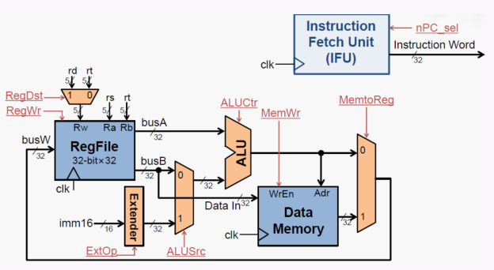
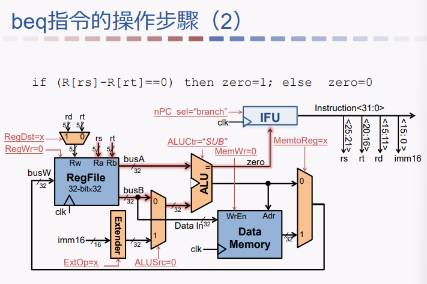
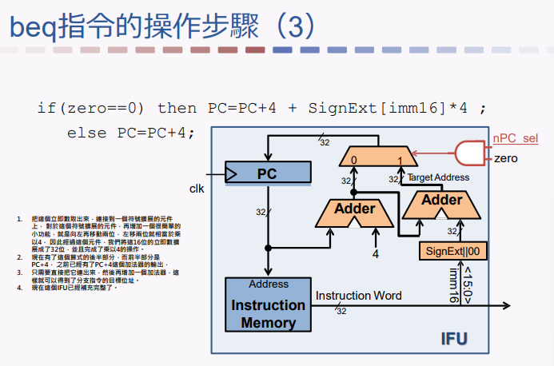
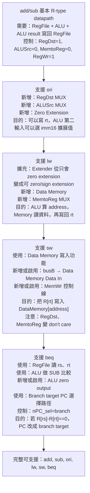

## ⭐Processor Design Overview — CPU 設計為什麼要先從「指令需求」開始？

講義位置：PDF viewer page 1 ~ 12

### 1. 這一章在解決什麼問題？

前面 Chapter 3 主要在看 arithmetic(算術)：加、減、乘、除、浮點數怎麼表示與計算。
Chapter 4 開始換成 processor(處理器)：CPU 要怎麼真的執行指令？

這章的核心問題不是「某一條指令語法是什麼」，而是：

CPU 裡面要有哪些硬體元件、這些元件要怎麼連起來、控制訊號要怎麼決定，才能讓 MIPS 指令真的被執行？

所以 Chapter 4 會把指令變成硬體設計問題。

### 2. 處理器設計的五個主要步驟

講義 PDF viewer page 3 給出五個步驟：

| 步驟                  | 意義                         |
| ------------------- | -------------------------- |
| ① 分析指令系統，得出對數據通路的需求 | 先看指令需要做什麼                  |
| ② 為數據通路選擇合適的元件      | 決定需要哪些硬體，例如 ALU、暫存器、記憶體    |
| ③ 連接元件建立數據通路        | 把硬體接起來，讓資料能流動              |
| ④ 分析每條指令的實現，以確定控制訊號 | 每條指令需要哪些 mux 選擇、寫入、讀記憶體等控制 |
| ⑤ 集成控制訊號，形成完整控制邏輯   | 把控制訊號整理成完整 controller      |

本輪 PDF viewer page 1 ~ 12 主要處理前兩步：

第一步：指令到底需要 CPU 做哪些事？
第二步：為了滿足這些需求，需要哪些元件？

### 3. 本段講義選用的 MIPS 指令

PDF viewer page 4 列出這一段要支援的指令。這不是完整 MIPS，而是設計處理器時先選一組代表性指令來建 datapath(數據通路)。

| 指令類型              | 指令                  | 功能直覺                         |
| ----------------- | ------------------- | ---------------------------- |
| R-type arithmetic | `addu rd, rs, rt`   | `rd = rs + rt`               |
| R-type arithmetic | `subu rd, rs, rt`   | `rd = rs - rt`               |
| Immediate logic   | `ori rt, rs, imm16` | `rt = rs OR zero_ext(imm16)` |
| Load              | `lw rt, imm16(rs)`  | 從記憶體讀一個 word 到 `rt`          |
| Store             | `sw rt, imm16(rs)`  | 把 `rt` 的資料寫到記憶體              |
| Branch            | `beq rs, rt, imm16` | 如果 `rs == rt`，就改變 PC         |

這些指令剛好涵蓋幾種 CPU 必須會做的事：

* 從 instruction memory(指令記憶體)取指令。
* 從 register file(暫存器堆)讀兩個暫存器。
* 用 ALU 做加法、減法、OR、比較相等。
* 對 16-bit immediate(立即數)做 zero extension(零擴展)或 sign extension(符號擴展)。
* 讀寫 data memory(資料記憶體)。
* 更新 PC(program counter，程式計數器)。

### 4. 從指令格式推導第一批硬體需求

PDF viewer page 5 先看 instruction bit fields(指令位元欄位)。

R-type 指令格式：

`{op, rs, rt, rd, shamt, funct}`

I-type 指令格式：

`{op, rs, rt, Imm16}`

這馬上推出兩個需求：

| 需求                           | 為什麼                            |
| ---------------------------- | ------------------------------ |
| 需要 PC(program counter，程式計數器) | CPU 要知道下一條指令在哪裡                |
| 需要 instruction memory(指令記憶體) | CPU 要用 PC 當地址去取出指令 bit pattern |

最短理解：

CPU 執行任何指令以前，都要先知道「去哪裡拿指令」，所以一定需要 PC 和 instruction memory。

### 5. 從運算指令推導 ALU 與 register file

PDF viewer page 6 看 `addu`、`subu`、`ori`。

例如：

`ADDU R[rd] ← R[rs] + R[rt]; PC ← PC + 4`

這行其實已經告訴你很多硬體需求：

| 指令語意          | 推出硬體需求                               |
| ------------- | ------------------------------------ |
| `R[rs]`       | 需要讀 register file 的 `rs`             |
| `R[rt]`       | 需要讀 register file 的 `rt`             |
| `R[rd] ← ...` | 需要把結果寫回 register file                |
| `+`、`-`、`OR`  | 需要 ALU                               |
| `imm16`       | 需要 immediate extension unit(立即數擴展元件) |
| `PC ← PC + 4` | 需要能讓 PC 加 4                          |

所以 register file 必須至少支援：

* 同時讀兩個暫存器：`rs` 和 `rt`。
* 寫回一個暫存器：可能是 `rd` 或 `rt`。

這就是 PDF viewer page 9 說的「兩讀一寫」register file。

### 6. 從 load/store 推導 data memory 與 sign extension

PDF viewer page 7 看 `lw` 和 `sw`。

`LOAD R[rt] ← MEM[R[rs] + sign_ext(Imm16)]; PC ← PC + 4`

這行可以拆成：

| 指令語意                      | 推出硬體需求                                 |
| ------------------------- | -------------------------------------- |
| `R[rs] + sign_ext(Imm16)` | ALU 要能算 memory address(記憶體位址)          |
| `sign_ext(Imm16)`         | 需要 sign extension(符號擴展)                |
| `MEM[...]`                | 需要 data memory(資料記憶體)                  |
| `R[rt] ← MEM[...]`        | load 要把 memory output 寫回 register file |

`STORE MEM[R[rs] + sign_ext(Imm16)] ← R[rt]`

則多了一個重點：

store 不寫 register file，而是寫 data memory。

所以之後控制訊號會需要分清楚：

* 這條指令要不要寫 register？
* 這條指令要不要寫 memory？
* 寫回 register 的資料是 ALU 結果，還是 memory 讀出的資料？

### 7. 從 beq 推導比較器與 PC 選擇

PDF viewer page 7 的 branch 指令是：

`BEQ if (R[rs] == R[rt]) then PC ← PC + 4 + (sign_ext(Imm16)||00) else PC ← PC + 4`

這裡有三個硬體需求：

| 需求                               | 原因                            |
| -------------------------------- | ----------------------------- |
| 比較 `R[rs]` 和 `R[rt]` 是否相等        | `beq` 要判斷 branch 是否成立         |
| 計算 branch target address(分支目標位址) | 成立時 PC 不是單純 `PC+4`            |
| PC 需要能在兩個來源中選一個                  | 不成立選 `PC+4`，成立選 branch target |

這會導向後面很重要的 multiplexer(mux，多工器)概念：當資料來源有多種可能時，需要 mux 由控制訊號決定選哪一路。

### 8. 本輪整理：目前已推出哪些元件？

PDF viewer page 8 ~ 11 把需求整理成元件。

| 元件                       | 功能                                                                |
| ------------------------ | ----------------------------------------------------------------- |
| ALU                      | 做加、減、OR、比較相等                                                      |
| Immediate extension unit | 把 16-bit immediate 擴展成 32-bit，可能是 zero extension 或 sign extension |
| PC                       | 存目前指令位址，並支援 `PC+4` 或 branch target                                |
| Register file            | 32 個 32-bit 暫存器，支援兩讀一寫                                            |
| Instruction memory       | 用 PC 當地址讀出指令                                                      |
| Data memory              | load/store 用，支援讀寫資料                                               |

其中 PDF viewer page 10 特別說 register file：

* 有 32 個 32-bit 暫存器。
* `busA`、`busB` 是兩個 32-bit 輸出。
* `busW` 是一個 32-bit 輸入。
* `Ra`、`Rb` 選擇要讀哪兩個暫存器。
* `Rw` 選擇要寫哪個暫存器。
* `WriteEnable == 1` 且 clock 上升沿到來時，才會寫入。
* 讀操作不受時脈控制。

PDF viewer page 11 則說 memory：

* `Address` 指定位置。
* `Data In` 是要寫入的資料。
* `Data Out` 是讀出的資料。
* `Write Enable` 有效且 clock 上升沿到來時，才會寫入。
* 讀操作不受時脈控制。

### 9. 最短記法

這段的核心不是背元件名字，而是建立一個推導方式：

先看指令語意，再問「為了完成這句語意，硬體要能做什麼？」

例如：

`R[rd] ← R[rs] + R[rt]`

推出：

讀 `rs`、讀 `rt`、ALU 加法、寫 `rd`。

`R[rt] ← MEM[R[rs] + sign_ext(Imm16)]`

推出：

讀 `rs`、sign extension、ALU 算地址、data memory 讀資料、寫 `rt`。

`if R[rs] == R[rt] then PC ← branch target`

推出：

讀 `rs`、讀 `rt`、比較相等、計算 branch target、選擇下一個 PC。

你之後看到 datapath 圖時，不要先背線路；要先問：這條線是在滿足哪一條指令需求？


## ⭐數據通路的建立：所有指令共同需求 — 這個概念在解決什麼問題？

講義位置：PDF viewer page 13 ~ PDF viewer page 20／輔助：Chapter 4 — The Processor — 13 ~ 20

### 1. 這一段在解決什麼問題？

前面我們已經知道：MIPS 指令會要求 CPU 具備很多元件，例如 `PC`、`Instruction Memory`、`Register File`、`ALU`、`Extender`、`Data Memory`。但知道「需要哪些元件」還不夠，CPU 真正要能執行指令，還要把這些元件接起來，讓資料可以照指令需求流動。

所以 `Datapath(數據通路)` 的核心問題是：

**一條指令進來之後，資料要從哪裡來、經過哪些元件、最後到哪裡去？**

講義在 PDF viewer page 14 ~ 15 給的基本原則是：根據指令需求，連接元件，建立數據通路。需求又分成兩類：所有指令的共同需求，以及不同指令的不同需求。

### 2. 所有指令的共同需求 1：Fetch(取指令)

不管是 `addu`、`ori`、`lw`、`sw` 還是 `beq`，CPU 第一件事都一定是：**把目前要執行的指令抓出來。**

這件事需要兩個核心元件：

| 元件                           | 功能                                  |
| ---------------------------- | ----------------------------------- |
| `PC(Program Counter, 程式計數器)` | 存放目前指令的位址                           |
| `Instruction Memory(指令記憶體)`  | 根據 PC 給的位址，輸出該位址中的 instruction word |

所以流程是：

`PC` 內的值是一個指令位址 → 用這個位址去讀 `Instruction Memory` → 得到 32-bit 的 instruction word。

這裡要特別修正一個常見說法：`PC` 不只是「找下一個指令」。更精準地說，`PC` 先提供**目前要取出的指令位址**，然後在取指令後被更新成下一個 PC。講義在 PDF viewer page 16 ~ 17 就是用這個順序建立共同需求。

### 3. 所有指令的共同需求 2：更新 PC

取完指令後，CPU 不能停在原地。它必須決定下一個 `PC` 是什麼。

在這份講義目前的範圍，下一個 PC 有兩種基本情況：

| 情況   | 下一個 PC                       |
| ---- | ---------------------------- |
| 循序執行 | `PC ← PC + 4`                |
| 發生分支 | `PC ← branch target address` |

為什麼是 `PC+4`？因為 MIPS 一條指令是 32-bit，也就是 4 bytes。若目前指令在位址 `PC`，下一條循序指令就在 `PC+4`。

所以 CPU 需要一個 `Adder(加法器)` 幫 PC 加 4。這就是 PDF viewer page 18 開始畫出 adder 的原因。

### 4. IFU(Instruction Fetch Unit) 是把取指令與 PC 更新包起來

PDF viewer page 19 把這一塊整理成 `Instruction Fetch Unit, IFU`。它大致包含：

| IFU 內部元件             | 負責的事                                   |
| -------------------- | -------------------------------------- |
| `PC`                 | 存目前指令位址                                |
| `Instruction Memory` | 用 PC 讀出 instruction word               |
| `Adder`              | 算出 `PC+4`                              |
| `MUX(多工器)`           | 在 `PC+4` 和 branch target address 之間選一個 |
| `nPC_sel`            | 控制 MUX 要選哪個 next PC                    |

你可以把 IFU 想成 CPU 的「取指令與決定下一站」模組。

每條指令都要經過 IFU，因為每條指令都必須被抓出來，也都必須讓 CPU 知道下一個要去哪裡。差別只是：大多數普通指令走 `PC+4`，branch 類指令可能走 branch target。

### 5. 最短記法與常見錯法

最短記法：

**所有指令共同需求 = 取指令 + 更新 PC。**
取指令需要 `PC → Instruction Memory → Instruction Word`。
更新 PC 需要在 `PC+4` 與 `branch target` 之間選擇。

常見錯法：

第一，說「PC 是找下一個指令」不夠精準。PC 先是目前指令的 address，更新後才變成下一個指令的 address。

第二，把 `Register File`、`ALU`、`Data Memory` 都說成「所有指令共同需求」會太粗。它們是很多指令會用，但不是所有指令都一定用。真正所有指令都一定需要的是 `Fetch` 和 `PC update`。

第三，branch target 不是單純等於 immediate。後面講 `beq` 細節時會正式算，但現在先記：branch target 會跟 `PC+4` 和 sign-extended immediate 有關。


## ⭐加法和減法指令的 Datapath — R-type 指令怎麼用 RegFile 和 ALU 完成運算？

講義位置：PDF viewer page 20 ~ 21

### 1. 這一頁在解決什麼問題？

前面 p16~19 講的是「所有指令共同需要什麼」：都要取指令、都要更新 PC。

現在 p20~21 開始問另一個問題：

**不同指令本身要做的事情不同，那 Datapath(資料通路) 要怎麼接，才能讓這些指令真的完成？**

本頁先處理最基本的 R-type arithmetic instruction(算術 R 型指令)：

`addu rd, rs, rt`
`subu rd, rs, rt`

它們共同的語意是：

`R[rd] = R[rs] op R[rt]`

其中 `op` 可能是加法，也可能是減法。

### 2. `rs`、`rt`、`rd` 各自扮演什麼角色？

對 `addu rd, rs, rt` 或 `subu rd, rs, rt` 來說：

| 欄位   | 角色       | 接到哪裡                      |
| ---- | -------- | ------------------------- |
| `rs` | 第一個來源暫存器 | RegFile 的 `Ra`，輸出到 `busA` |
| `rt` | 第二個來源暫存器 | RegFile 的 `Rb`，輸出到 `busB` |
| `rd` | 目的暫存器    | RegFile 的 `Rw`，最後寫回結果     |

所以資料流是：

| 步驟 | 發生的事                                                    |
| -- | ------------------------------------------------------- |
| 1  | instruction encoding(指令編碼) 裡的 `rs`、`rt`、`rd` 被拆出來       |
| 2  | `rs` 接到 `Ra`，RegFile 把 `R[rs]` 放到 `busA`                |
| 3  | `rt` 接到 `Rb`，RegFile 把 `R[rt]` 放到 `busB`                |
| 4  | `busA`、`busB` 進入 ALU                                    |
| 5  | ALU 根據 `ALUCtr` 做加法或減法                                  |
| 6  | ALU result(結果) 經由 `busW` 回到 RegFile                     |
| 7  | 若 `RegWr = 1`，在 clock rising edge(時脈上升沿) 寫入 `rd` 指定的暫存器 |

關鍵句：
**R-type add/sub 是「讀 rs、讀 rt、算 ALU、寫 rd」。**

### 3. 為什麼需要 `ALUCtr` 和 `RegWr`？

講義特別用紅色標出兩個 control signals(控制訊號)：`ALUCtr` 和 `RegWr`。

`ALUCtr` 控制 ALU 要做什麼：
對 `addu`，ALU 做 addition(加法)。
對 `subu`，ALU 做 subtraction(減法)。

`RegWr` 控制 RegFile 要不要寫回：
對 `addu` 和 `subu`，都需要把 ALU 結果寫進 `rd`，所以 `RegWr = 1`。
如果 `RegWr = 0`，ALU 可能算出結果，但結果不會被寫回 RegFile，這條加法／減法指令就沒有真正更新暫存器。

這就是 control signal(控制訊號) 的核心作用：
**Datapath 提供路，control signal 決定這條路現在怎麼用。**

### 4. 用一個例子追一次

假設指令是：

`addu $t0, $t1, $t2`

意思是：

`R[$t0] = R[$t1] + R[$t2]`

Datapath 走法如下：

| 欄位       | 值     | 動作                        |
| -------- | ----- | ------------------------- |
| `rs`     | `$t1` | 接到 `Ra`，讀出 `$t1` 到 `busA` |
| `rt`     | `$t2` | 接到 `Rb`，讀出 `$t2` 到 `busB` |
| `rd`     | `$t0` | 接到 `Rw`，準備寫回 `$t0`        |
| `ALUCtr` | add   | ALU 做加法                   |
| `RegWr`  | 1     | 允許寫回 RegFile              |

如果 `$t1 = 7`，`$t2 = 5`，ALU 輸出 `12`。
下一個時脈上升沿，如果 `RegWr = 1`，RegFile 會把 `12` 寫入 `$t0`。


### 5. 常見錯法

最常見錯法是把 `rt` 當成目的暫存器。

這在 `lw`、`ori` 這些 I-type instruction(立即數型指令) 裡常常會發生，但在 R-type add/sub 裡不是這樣。

對 `addu rd, rs, rt`、`subu rd, rs, rt`：

| 指令類型           | 目的暫存器 |
| -------------- | ----- |
| R-type add/sub | `rd`  |
| `ori`、`lw`     | `rt`  |

所以本頁 p21 的 add/sub Datapath 裡，RegFile 的 write address(寫入位址) 應該接 `rd`，也就是 `rd → Rw`。


## ⭐`ori` Datapath — 為什麼 R-type 加減法的資料通路不夠用？

講義位置：PDF viewer page 22 ~ PDF viewer page 23

### 1. `ori` 的核心需求是什麼？

講義這裡從 R-type 加減法往下一步推：前面 `addu/subu` 的格式是：

`R[rd] = R[rs] op R[rt]`

但 `ori` 這種邏輯立即數指令是：

`R[rt] = R[rs] op ZeroExt[imm16]`

以 `ori rt, rs, imm16` 來看，它的意思是：

`rt` 這個暫存器要接收結果。
第一個 ALU 運算元來自 `rs`。
第二個 ALU 運算元不是 `rt`，而是指令裡面的 `imm16` 立即數。
而且 `imm16` 只有 16-bit，ALU 輸入需要 32-bit，所以要先做 `Zero Extension(零擴展)`。

### 2. 第一個問題：目的暫存器變成 `rt`，不是 `rd`

前面 R-type 加減法的 Datapath 假設目的暫存器是 `rd`，所以 Register File 的 `Rw` 接的是 instruction 裡面的 `rd` 欄位。

但 `ori rt, rs, imm16` 的目的暫存器是 `rt`。

所以如果資料通路還是固定把 `rd` 接到 `Rw`，那 `ori` 就會寫錯地方。它應該寫回 `rt`，不是 `rd`。

解法是：在 Register File 的 `Rw` 前面加一個 `MUX(多工器)`，讓控制信號選擇目的暫存器來源：

| 指令類型               | `Rw` 應該選誰 |
| ------------------ | --------- |
| `addu/subu` R-type | `rd`      |
| `ori` I-type       | `rt`      |

這個想法之後會變成很重要的控制概念：不同指令需要不同的資料通路選擇。

### 3. 第二個問題：ALU 第二個輸入不再是 `busB`

前面 R-type 加減法中，Register File 會讀兩個暫存器：

| 輸入端    | 來源      |
| ------ | ------- |
| `busA` | `R[rs]` |
| `busB` | `R[rt]` |

然後 ALU 做 `busA op busB`。

但 `ori` 的第二個運算元不是 `R[rt]`，而是立即數 `imm16`。所以 ALU 第二個輸入不能永遠固定接 `busB`。

解法是：在 ALU 第二個輸入前面加一個 `MUX(多工器)`：

| 指令類型        | ALU 第二個輸入應該選誰    |
| ----------- | ---------------- |
| `addu/subu` | `busB = R[rt]`   |
| `ori`       | `ZeroExt[imm16]` |

所以 `ori` 不需要把 `rt` 當成 ALU 的輸入暫存器；`rt` 在這裡是目的暫存器。

### 4. 第三個問題：`imm16` 只有 16-bit，但 ALU 要 32-bit

MIPS 的 ALU 是 32-bit，所以它不能直接拿 16-bit immediate 當輸入。講義這裡的 `ori` 使用的是 `ZeroExt[imm16]`，也就是把 16-bit 立即數補成 32-bit。

例如：

| `imm16`  | `ZeroExt[imm16]` |
| -------- | ---------------- |
| `0x00FF` | `0x000000FF`     |
| `0x8001` | `0x00008001`     |

注意這裡是 `Zero Extension(零擴展)`，不是 `Sign Extension(符號擴展)`。因為 `ori` 是邏輯運算，立即數被當作 bit pattern(位元樣式)，不是有正負號的數值。

### 5. 本頁最短記法

`ori` 讓前面的 R-type Datapath 暴露三個不足：

| 問題           | 原本 R-type Datapath 的假設 | `ori` 的需求      | 解法                  |
| ------------ | ---------------------- | -------------- | ------------------- |
| 目的暫存器        | 寫回 `rd`                | 寫回 `rt`        | 在 `Rw` 前加 MUX       |
| ALU 第二輸入     | 來自 `busB = R[rt]`      | 來自 immediate   | 在 ALU 第二輸入前加 MUX    |
| immediate 位數 | 不需要 immediate          | `imm16` 要進 ALU | 加 Zero Extension 元件 |

最短背法：

`ori` = 寫 `rt`、讀 `rs`、ALU 吃 `ZeroExt[imm16]`。
所以要加：`Rw MUX`、`ALU input MUX`、`ZeroExt`。


## ⭐lw Instruction — CPU 怎麼從 memory 讀資料再放進 register？

講義位置：PDF viewer page 50 ~ 53

### 1. `lw` 在解決什麼問題？

`lw` 的完整形式是：

`lw rt, imm16(rs)`

它要解決的問題是：**資料原本在 Data Memory(資料記憶體) 裡，CPU 要把它載入到某個 register(暫存器) 裡。**

所以 `lw` 的目標不是做一般算術，而是完成這件事：

`R[rt] = DataMemory[R[rs] + SignExt(imm16)]`

拆開來看：

| 部分                       | 意思                                   |
| ------------------------ | ------------------------------------ |
| `rs`                     | base register(基底暫存器)，提供記憶體位址的基準      |
| `imm16`                  | offset(位移量)，用來加到 base address 上      |
| `R[rs] + SignExt(imm16)` | 真正要讀的 memory address(記憶體位址)          |
| `DataMemory[...]`        | 從這個位址讀出的 32-bit data                 |
| `rt`                     | 最後被寫入資料的 destination register(目的暫存器) |

最短理解：`lw` 先算地址，再去 memory 讀資料，最後寫回 `rt`。

### 2. 為什麼 `lw` 的 immediate 要用 sign extension？

這裡和 `ori` 不一樣。

`ori` 的 immediate 是拿來做 bitwise OR(位元 OR)，通常把 `imm16` 當成無號 bit pattern，所以用 zero extension(零擴展)。

但 `lw` 的 immediate 是 memory offset(記憶體位移量)。Offset 可能是正的，也可能是負的。

例如：

`lw $t0, -4($sp)`

意思是從 `$sp - 4` 這個位置讀資料。所以 `-4` 必須保留負數意義，因此要用 sign extension(符號擴展)。

所以：

| 指令    | immediate 的用途         | 擴展方式           |
| ----- | --------------------- | -------------- |
| `ori` | 邏輯 OR 的 bit pattern   | zero extension |
| `lw`  | memory address offset | sign extension |

這是很常考的差異。

### 3. `lw` 的 datapath 流程

以這條指令為例：

`lw $t0, 8($s1)`

意思是：

`R[$t0] = DataMemory[R[$s1] + 8]`

CPU 會做這些事：

| 步驟 | CPU 做什麼                                  | 對應硬體                     |
| -- | ---------------------------------------- | ------------------------ |
| 1  | 用 `PC` 到 instruction memory 取出指令         | IFU / Instruction Memory |
| 2  | 從 register file 讀出 `R[rs]`，也就是 `$s1` 的內容 | Register File            |
| 3  | 把 `imm16` 做 sign extension 成 32-bit      | Extender                 |
| 4  | ALU 做加法：`R[rs] + SignExt(imm16)`         | ALU                      |
| 5  | 用 ALU 算出的 address 去 Data Memory 讀資料      | Data Memory              |
| 6  | 把 memory 讀出的 data 寫回 `rt`，也就是 `$t0`      | Register File write-back |
| 7  | `PC = PC + 4`                            | IFU / PC logic           |

注意：`lw` 的 ALU 不是用來算最終資料值，而是用來算 memory address。

### 4. `lw` 的重要 control signals(控制信號)

對 `lw rt, imm16(rs)` 來說，控制信號通常是：

| Control signal |            值 | 原因                                          |
| -------------- | -----------: | ------------------------------------------- |
| `RegDst`       |          `0` | 寫回目的暫存器是 `rt`，不是 `rd`                       |
| `ALUSrc`       |          `1` | ALU 第二個輸入要選 `SignExt(imm16)`，不是 `busB`      |
| `ExtOp`        | `sign` / `1` | offset 要做 sign extension                    |
| `ALUCtr`       |        `ADD` | ALU 要算 `R[rs] + SignExt(imm16)`             |
| `MemtoReg`     |          `1` | 寫回 register 的資料來自 Data Memory，不是 ALU result |
| `RegWr`        |          `1` | `lw` 會寫回 register file                      |
| `MemWr`        |          `0` | `lw` 是讀 memory，不是寫 memory                   |
| `nPC_sel`      |   `+4` / `0` | 一般情況下一條指令是 `PC + 4`                         |

這裡最容易混的是 `MemtoReg`：

* `MemtoReg = 0`：寫回的是 ALU result。
* `MemtoReg = 1`：寫回的是 Data Memory 讀出來的資料。

`lw` 必須是 `MemtoReg = 1`，因為它真正要放進 register 的不是 address，而是 memory 裡面的 data。

### 5. 小例子：`lw $t0, -4($sp)`

假設：

* `R[$sp] = 0x00001000`
* `imm16 = -4`
* `DataMemory[0x00000FFC] = 0x12345678`

流程是：

| 步驟               | 結果                                     |
| ---------------- | -------------------------------------- |
| sign-extend `-4` | `0xFFFFFFFC`                           |
| ALU 計算 address   | `0x00001000 + 0xFFFFFFFC = 0x00000FFC` |
| Data Memory read | 讀出 `0x12345678`                        |
| Write-back       | `$t0 = 0x12345678`                     |

所以 `lw` 的重點不是「把 immediate 寫進 register」，而是「用 base + offset 算出 memory address，再把 memory 裡的資料寫回 register」。


!!! danger

    ### 為何 lw 的 imm 會需要是負數？

    #### 1\. 直接答案

    `negative offset(負位移)` 在 `lw/sw` 這種記憶體存取指令很有用，因為它可以讓 CPU 從 **base register(基底暫存器) 指向的位置往前／往低位址方向** 存取資料。

    `lw` 的有效位址是：

    `Effective Address = R[rs] + SignExt(immediate)`

    所以：

    `lw $t0, -4($s1)`

    意思是：

    `$t0 = Memory[$s1 - 4]`

    也就是從 `$s1` 所指位置的前 4 bytes 讀資料。

    #### 2\. 為什麼會需要往前拿資料？

    因為很多時候 base register 不是剛好指向你要的資料，而是指向某個「參考點」。你要的資料可能在這個參考點之前。

    最常見用途有兩種。

    第一種是 **stack frame(堆疊框架)**。  
    函式呼叫時，程式常用 `$fp` 或 `$sp` 當作固定參考點，而 local variables(區域變數)、saved registers(被保存的暫存器)、return address(返回位址) 可能分布在這個參考點的前後。因為 stack(堆疊) 通常往低位址成長，所以有些資料會在 base pointer 的低位址方向，這時就需要 negative offset。

    例如：

    `lw $t0, -8($fp)`

    意思是從 `$fp` 往低位址退 8 bytes 的位置讀資料，可能是在取某個 local variable。

    第二種是 **array / pointer traversal(陣列或指標往回走)**。  
    如果 `$s1` 目前指向陣列中的某個元素，而你想讀前一個元素，就可以用 negative offset。

    例如每個 `int` 是 4 bytes：

    `lw $t0, -4($s1)`

    如果 `$s1` 指向 `A[i]`，那這行可能是在讀 `A[i-1]`。

    #### 3\. 最重要的觀念

    `negative offset` 不是說資料本身是負數，也不是說 register 裡的值是負數。

    它只是在算 memory address(記憶體位址) 時做：

    `base address - 某個距離`

    所以它的用途是：**當你有一個 base register 當參考點，但目標資料在它前面時，就用 negative offset。**


### 6. 常見錯法

| 錯法                              | 為什麼錯                                                              |
| ------------------------------- | ----------------------------------------------------------------- |
| 說 `lw` 用 zero extension         | 錯。`lw` 的 immediate 是 offset，要用 sign extension。                    |
| 說 `lw` 把 ALU result 寫回 register | 不精確。ALU result 是 memory address；真正寫回 register 的是 Data Memory 的輸出。 |
| 說 `lw` 會寫 memory                | 錯。`lw` 是 load，讀 memory；`sw` 才是寫 memory。                           |
| 說 `rt` 是 source register        | 對 `lw` 來說，`rt` 是 destination register。                            |
| 忘記 `RegDst=0`                   | 因為 I-type 指令沒有真正使用 `rd` 當目的暫存器，`lw` 要寫回 `rt`。                     |


## ⭐Store 指令與數據通路初步完成 — 這個概念在解決什麼問題？

講義位置：PDF viewer page 26 ~ PDF viewer page 28

### 1. `sw` 在解決什麼問題？

前面 `lw` 是：

`Register ← Memory`

也就是從 `Data Memory` 讀資料，寫回 register。

現在 `sw` 剛好反過來：

`Memory ← Register`

也就是把 register 裡面的資料存進 `Data Memory`。

講義的 `sw` 指令格式是：

`sw rt, imm16(rs)`

它的語意是：

`Mem[R[rs] + SignExt(imm16)] = R[rt]`

這句話拆開有兩件事：

| 動作                       | 意思                              |
| ------------------------ | ------------------------------- |
| `R[rs] + SignExt(imm16)` | 算出 memory address(記憶體位址)        |
| `Mem[...] = R[rt]`       | 把 `rt` 暫存器裡的值寫進該 memory address |

所以 `sw` 需要的硬體路徑是：

`rs` 提供 base address(基底位址)
`imm16` 經過 sign extension 變成 32-bit offset(位移量)
ALU 做加法算出 address
`rt` 的內容從 register file 的 `busB` 出來
`busB` 連到 Data Memory 的 `Data In`
Data Memory 在 `MemWr=1` 時把資料寫進去

### 2. `sw` 和 `lw` 最大差別：資料方向相反

`lw`：

| 項目               | `lw rt, imm16(rs)`       |
| ---------------- | ------------------------ |
| Address 來源       | `R[rs] + SignExt(imm16)` |
| Data Memory 動作   | 讀 memory                 |
| Register file 動作 | 寫入 `rt`                  |
| 資料方向             | `Memory → Register`      |

`sw`：

| 項目               | `sw rt, imm16(rs)`       |
| ---------------- | ------------------------ |
| Address 來源       | `R[rs] + SignExt(imm16)` |
| Data Memory 動作   | 寫 memory                 |
| Register file 動作 | 不寫 register              |
| 資料方向             | `Register → Memory`      |

最容易錯的是：在 `sw rt, imm16(rs)` 裡，`rt` 不是 destination register(目的暫存器)，而是 source data register(來源資料暫存器)。

例如：

`sw $t2, 12($s3)`

意思不是把 memory 載入 `$t2`，而是：

把 `$t2` 裡面的值，存到 `R[$s3] + 12` 這個 memory address。

### 3. 為什麼 `sw` 需要 `MemWr`？

因為除了 `sw` 以外，大多數目前講義中的指令不應該寫入 Data Memory。

例如：

| 指令     | 是否應該寫 Data Memory？ |
| ------ | ------------------ |
| `addu` | 否                  |
| `subu` | 否                  |
| `ori`  | 否                  |
| `lw`   | 否，`lw` 是讀 memory   |
| `sw`   | 是                  |

所以 Data Memory 必須有一個控制訊號：`MemWr`。

`MemWr=1`：Data Memory 在 clock edge 時寫入資料。
`MemWr=0`：Data Memory 不寫入資料。

對 `sw` 來說：

`MemWr=1`

因為 `sw` 的本質就是：

`Data Memory[address] ← R[rt]`

### 4. `sw` 的 control signals 怎麼看？

以 `sw $t2, 12($s3)` 為例。

它的語意：

`Mem[R[$s3] + SignExt(12)] = R[$t2]`

控制訊號可以這樣判斷：

| Control signal |    `sw` 的值 | 原因                                  |
| -------------- | ---------: | ----------------------------------- |
| `RegDst`       | don't care | `sw` 不寫 register，所以選 `rd` 或 `rt` 沒差 |
| `RegWr`        |          0 | 不寫 register file                    |
| `ALUSrc`       |          1 | ALU 第二個輸入要用 sign-extended immediate |
| `ExtOp`        |          1 | offset 要做 sign extension            |
| `ALUCtr`       |        ADD | 要計算 `R[rs] + offset`                |
| `MemWr`        |          1 | 要寫入 Data Memory                     |
| `MemtoReg`     | don't care | 不寫 register，所以 write-back mux 選誰都沒用 |
| `nPC_sel`      |          0 | `sw` 不是 branch，下一個 PC 是 `PC+4`      |

注意：有些課堂或表格會把 don't care 寫成 `X`。如果考試要求只能填 0/1，通常可以依老師表格指定填；但概念上它們是 don't care，因為 `sw` 根本不寫回 register file。

!!! danger
    `RegWr` 和 `MemWr` (寫 Wr 的)是 register 和 memory 的 enable。
    `MemtoReg` 是用來選要把 ALU result 還是 memory out 給 busW 的，因為 RegDst = 0 ，用 MemtoReg 選了誰要當 busW 也沒用，根本不會存到 Reg，所以在 sw 是 don't care。

### 5. p27 的「數據通路初步完成」是什麼意思？

到這裡，講義前面選出的代表指令都已經有基本 datapath(數據通路) 可以支援：

| 指令類型                 | 代表指令           | 已補上的硬體需求                                           |
| -------------------- | -------------- | -------------------------------------------------- |
| R-type arithmetic    | `addu`, `subu` | RegFile → ALU → RegFile                            |
| Immediate arithmetic | `ori`          | immediate extension、ALU source mux、destination mux |
| Load                 | `lw`           | Data Memory read、MemtoReg mux                      |
| Store                | `sw`           | Data Memory write、`busB → Data In`、`MemWr`         |
| Branch               | `beq`          | IFU 裡支援 `PC+4` 或 branch target 選擇                  |

所以 p27 的意思不是「整個 CPU 完全完成」，而是：

目前這一版 datapath 已經有足夠的硬體路徑，可以支援前面列出的基本 MIPS 指令需求。

接下來 p29 開始，講義會進入下一個問題：

硬體路徑有了，但每一條指令到底要怎麼設定 control signals？

也就是從「接線」進入「控制」。

### 6. 最短記法

`lw`：address 用 ALU 算，memory 讀出來，寫回 `rt`。
`sw`：address 用 ALU 算，`rt` 的值寫進 memory，不寫 register。

一句話記：

`lw` 是 `Memory → Register`；`sw` 是 `Register → Memory`。


## ⭐Control Signals — 固定 datapath 要怎麼被不同指令「切換成不同路徑」？

講義位置：PDF viewer page 29 ~ PDF viewer page 55

### 1. 這個知識點在解決什麼問題？

前面 p21 ~ p28 我們做的是：把 `add/sub/ori/lw/sw` 需要的 hardware components(硬體元件) 接起來，形成一個初步 datapath(數據通路)。

但是接好 datapath 之後，CPU 還面臨一個問題：

同一套硬體要跑不同指令，可是每條指令需要走的路不一樣。

例如：

| 指令                  | 寫回 register file 嗎？ | 用 immediate 嗎？ | 讀／寫 memory 嗎？ | ALU 做什麼？    |
| ------------------- | ------------------: | -------------: | ------------: | ----------- |
| `addu rd, rs, rt`   |                   要 |             不用 |            不用 | add         |
| `subu rd, rs, rt`   |                   要 |             不用 |            不用 | subtract    |
| `ori rt, rs, imm16` |                   要 |              要 |            不用 | OR          |
| `lw rt, imm16(rs)`  |                   要 |              要 |      讀 memory | add address |
| `sw rt, imm16(rs)`  |                  不要 |              要 |      寫 memory | add address |

所以 control signals(控制信號) 就像是 datapath 上的「開關」和「選擇器控制線」。它們決定：

* MUX 要選哪一路。
* register file 要不要寫入。
* data memory 要不要寫入。
* ALU 要做哪一種運算。
* immediate 要 zero extension 還是 sign extension。
* PC 要不要正常走 `PC+4`。

### 2. 先記住每個 control signal 在控制什麼

| Control signal | 控制的東西                          | 核心意思                                      |
| -------------- | ------------------------------ | ----------------------------------------- |
| `RegDst`       | write register 的 MUX           | `1 → rd`，`0 → rt`                         |
| `ALUSrc`       | ALU 第二個輸入的 MUX                 | `0 → busB`，`1 → extended immediate`       |
| `ExtOp`        | extender 的擴張方式                 | `0 → zero extension`，`1 → sign extension` |
| `ALUctr`       | ALU operation                  | `ADD`、`SUB`、`OR`                          |
| `MemWr`        | Data Memory write enable       | `1` 才會寫入 memory                           |
| `MemtoReg`     | register write-back data 的 MUX | `0 → ALU result`，`1 → Data Memory output` |
| `RegWr`        | Register File write enable     | `1` 才會寫回 register                         |
| `nPC_sel`      | next PC 選擇                     | 本輪非分支指令都選 `PC+4`，所以是 `0`                  |

這裡最容易混淆的是 `ALUSrc` 和 `busB`。

`ALUSrc=1` 的意思不是 busB 變成 immediate，而是 **ALU 第二個輸入不選 busB，改選 extended immediate**。
對 `sw` 來說，`busB` 還是很重要，因為 `busB = R[rt]`，它要送到 Data Memory 的 `Data In`。

### 3. R-type add/sub：目的地是 `rd`，ALU 吃兩個 register

以 `addu rd, rs, rt` 為例，講義 p34 ~ p39 的核心流程是：

1. `Instruction = MEM[PC]`
2. `R[rd] = R[rs] + R[rt]`
3. `PC = PC + 4`

所以 control signals 是：

| Signal     | `addu` | 原因                           |
| ---------- | -----: | ---------------------------- |
| `RegDst`   |    `1` | 寫回目的地是 `rd`                  |
| `ALUSrc`   |    `0` | ALU 第二輸入來自 `busB = R[rt]`    |
| `ExtOp`    |    `x` | 沒有用 immediate，擴張方式不重要        |
| `ALUctr`   |  `ADD` | 做加法                          |
| `MemWr`    |    `0` | 不寫 data memory               |
| `MemtoReg` |    `0` | 寫回 register 的資料來自 ALU result |
| `RegWr`    |    `1` | 要寫回 register file            |
| `nPC_sel`  |    `0` | 非分支，下一個 PC 是 `PC+4`          |

`subu` 幾乎一樣，只是 `ALUctr = SUB`。

### 4. `ori`：目的地變 `rt`，immediate 要 zero extension

`ori rt, rs, imm16` 的語意是：

`R[rt] = R[rs] | ZeroExt(imm16)`

它和 R-type 最大差別有三個：

第一，目的地不是 `rd`，而是 `rt`，所以 `RegDst=0`。
第二，ALU 第二輸入不是 `R[rt]`，而是 immediate，所以 `ALUSrc=1`。
第三，`ori` 是 bitwise OR，immediate 要當作 bit pattern，所以用 `zero extension`，也就是 `ExtOp=0`。

| Signal     | `ori` | 原因                           |
| ---------- | ----: | ---------------------------- |
| `RegDst`   |   `0` | 寫回目的地是 `rt`                  |
| `ALUSrc`   |   `1` | ALU 第二輸入用 extended immediate |
| `ExtOp`    |   `0` | `ori` 使用 zero extension      |
| `ALUctr`   |  `OR` | 做 bitwise OR                 |
| `MemWr`    |   `0` | 不寫 memory                    |
| `MemtoReg` |   `0` | 寫回資料來自 ALU result            |
| `RegWr`    |   `1` | 要寫回 register                 |
| `nPC_sel`  |   `0` | 非分支，走 `PC+4`                 |

### 5. `lw`：ALU 算 address，memory data 寫回 register

`lw rt, imm16(rs)` 的語意是：

`R[rt] = DataMemory[R[rs] + SignExt(imm16)]`

它有兩段資料流：

第一段：ALU 算 effective address。
第二段：Data Memory 讀出資料，寫回 `rt`。

| Signal     |  `lw` | 原因                                |
| ---------- | ----: | --------------------------------- |
| `RegDst`   |   `0` | 寫回目的地是 `rt`                       |
| `ALUSrc`   |   `1` | ALU 第二輸入用 sign-extended immediate |
| `ExtOp`    |   `1` | offset 是有號位移量，要 sign extension    |
| `ALUctr`   | `ADD` | base + offset                     |
| `MemWr`    |   `0` | `lw` 是讀 memory，不是寫 memory         |
| `MemtoReg` |   `1` | 寫回 register 的資料來自 Data Memory     |
| `RegWr`    |   `1` | 要寫回 register                      |
| `nPC_sel`  |   `0` | 非分支，走 `PC+4`                      |

### 6. `sw`：ALU 算 address，register data 寫入 memory

`sw rt, imm16(rs)` 的語意是：

`DataMemory[R[rs] + SignExt(imm16)] = R[rt]`

它和 `lw` 很像，因為都要算 effective address：

`R[rs] + SignExt(imm16)`

但資料方向完全相反：

* `lw`：memory → register
* `sw`：register → memory

| Signal     |  `sw` | 原因                                    |
| ---------- | ----: | ------------------------------------- |
| `RegDst`   |   `x` | 不寫 register，所以目的地選誰都無所謂               |
| `ALUSrc`   |   `1` | ALU 第二輸入用 sign-extended immediate     |
| `ExtOp`    |   `1` | offset 是有號位移量，要 sign extension        |
| `ALUctr`   | `ADD` | base + offset                         |
| `MemWr`    |   `1` | 要寫入 Data Memory                       |
| `MemtoReg` |   `x` | 不寫 register，所以 write-back data 選誰都無所謂 |
| `RegWr`    |   `0` | 不寫回 register file                     |
| `nPC_sel`  |   `0` | 非分支，走 `PC+4`                          |

!!! danger


    ### 7. `x(don't care)` 的考試判斷法

    `x` 不是「不知道」，而是「這個信號在這條指令中不會影響結果」。

    最重要的判斷法：

    如果 `RegWr=0`，代表 register file 不會寫入。
    那麼和「寫回哪個 register」或「寫回什麼資料」有關的 MUX 就不重要。

    所以對 `sw`：

    * `RegDst=x`，因為根本不寫 register。
    * `MemtoReg=x`，因為根本沒有 write-back。
    * 但 `ALUSrc` 不能是 `x`，因為 ALU 必須正確算 address。
    * `ExtOp` 不能是 `x`，因為 immediate offset 必須 sign-extended。
    * `MemWr` 不能是 `x`，因為 `sw` 的核心就是寫 memory。
    
    而對於 `add`：
    
    ExtOp = x 因為沒有用 immediate，擴張方式不重要


## ⭐beq Branch Control Signals — CPU 怎麼「有條件地」改變下一個 PC？

講義位置：PDF viewer page 56 ~ 71

### 1. 這個知識點在解決什麼問題？

前面你已經學過：

`addu`、`subu`、`ori`、`lw`、`sw` 都是 **正常往下一行執行**，所以它們最後都是：

`PC = PC + 4`

但是 `beq` 不一樣。`beq rs, rt, imm16` 是 branch instruction(分支指令)，它要做的是：

如果 `R[rs] == R[rt]`，就跳到 branch target address(分支目標位址)。
如果 `R[rs] != R[rt]`，就不要跳，繼續走 `PC + 4`。

所以 `beq` 需要解決兩件事：

第一，CPU 要判斷兩個 register 的值是否相等。
第二，CPU 要根據判斷結果選擇 next PC(下一個 PC)。

這就是為什麼 `beq` 會比 `ori`、`lw`、`sw` 多出一個重要訊號：`zero`。

### 2. `beq` 的三個操作步驟

講義把 `beq rs, rt, imm16` 拆成三步：

第一步，取指令：

`Instruction = MEM[PC]`

這跟所有指令一樣，由 IFU(Instruction Fetch Unit，取指單元)完成。

第二步，比較兩個暫存器：

`if (R[rs] - R[rt] == 0)`

CPU 不是真的另外做一個「相等比較器」來比較，而是讓 ALU 做 subtraction(減法)：

`R[rs] - R[rt]`

如果結果是 `0`，代表兩個值相等，ALU 輸出：

`zero = 1`

如果結果不是 `0`，代表兩個值不相等，ALU 輸出：

`zero = 0`

第三步，決定下一個 PC：

如果 `zero = 1`，代表 branch condition(分支條件)成立：

`PC = PC + 4 + SignExt(imm16) * 4`

如果 `zero = 0`，代表條件不成立：

`PC = PC + 4`

這裡要注意：講義 PDF viewer page 69 上方公式疑似把 `zero` 條件寫反；但 PDF viewer page 65 的步驟、PDF viewer page 69 的表格與文字說明一致表示：`zero = 1` 才跳到 branch target address，`zero = 0` 則走 `PC + 4`。

### 3. `beq` 為什麼用 ALU 做 `SUB`？

`beq` 要判斷：

`R[rs] == R[rt]`

硬體上常用的做法是：

`R[rs] - R[rt]`

如果兩個值相等，減完一定是 `0`。
如果兩個值不相等，減完就不是 `0`。

所以 `beq` 的 ALU 控制訊號是：

`ALUCtr = SUB`

而且 ALU 的兩個輸入都來自 RegFile：

`busA = R[rs]`
`busB = R[rt]`

因此：

`ALUSrc = 0`

因為 ALU 第二個輸入不是 immediate，而是 `busB`。

### 4. `zero` 和 `nPC_sel` 怎麼一起決定下一個 PC？

`nPC_sel` 只表示「目前這條指令是不是 branch 類型」。

但是是不是 branch 類型，還不夠。因為 `beq` 是 conditional branch(條件式分支)，還要看條件有沒有成立。

所以 IFU 實際選擇 next PC 時，要同時看：

`nPC_sel` 和 `zero`

| `nPC_sel` | `zero` | 意義              | 下一個 PC           |
| --------: | -----: | --------------- | ---------------- |
|         0 |      x | 不是 branch 指令    | `PC + 4`         |
|         1 |      0 | 是 branch，但條件不成立 | `PC + 4`         |
|         1 |      1 | 是 branch，且條件成立  | `Target Address` |

最短記法：

`真正跳轉 = nPC_sel AND zero`

對 `beq` 來說：

`nPC_sel = 1`

但最後是否真的跳，要看：

`zero = 1` 還是 `zero = 0`

!!! danger

    
    
    
    這圖有三個重點：
    1. PC+4 是兩條路共用的。
    2. ==nPC_sel 和 zero 要做 and 運算。==
    3. imm 是直接進來 IFU，不是經過 busB，所以 ALUSrc 是 0。
    
!!! danger

    ### 5. Branch target address 怎麼算？

    `beq` 的 target address(目標位址)不是單純 `imm16`。

    講義的公式是：

    ==`Target Address = PC + 4 + SignExt(imm16) << 2`==

    為什麼要 `PC + 4`？

    因為 branch offset(分支位移)是相對於下一條指令的位置來算，不是相對於目前 PC 直接算。

    為什麼 `imm16` 要 sign extension(有號擴張)？

    因為 branch 可以往前跳，也可以往後跳。往後跳是正 offset，往前跳是負 offset，所以要保留正負號。

    為什麼要乘以 4？

    因為 MIPS 指令一條是 4 bytes，而且 branch immediate 是以 instruction word(指令字)為單位，不是 byte 為單位。硬體上通常做成：

    `SignExt(imm16) << 2`

    也就是左移 2 bits，等於乘以 4。

    小例子：

    目前 `PC = 0x00400020`，`imm16 = 0x0003`，且 `R[rs] == R[rt]`。

    先算：

    `PC + 4 = 0x00400024`

    再算：

    `SignExt(0x0003) * 4 = 3 * 4 = 12 = 0x0000000C`

    所以 branch target：

    `0x00400024 + 0x0000000C = 0x00400030`

    如果 `zero = 1`，下一個 PC 是 `0x00400030`。
    如果 `zero = 0`，下一個 PC 是 `0x00400024`。

!!! danger

    ### 6. `beq` 的控制訊號總整理

    對 `beq rs, rt, imm16`：

    | 控制訊號       |          值 | 原因                                                                             |
    | ---------- | ---------: | ------------------------------------------------------------------------------ |
    | `RegDst`   |          x | 不寫回 register，所以不用選目的 register                                                  |
    | ==`ALUSrc`==   |          ==0== | ALU 第二個輸入要用 `R[rt]`，不是 immediate                                               |
    | ==`ExtOp`==    |          ==x== | ALU operand path 沒有用 immediate；但 branch target address ==仍需要 `SignExt(imm16)<<2`== |
    | `ALUCtr`   |      `SUB` | 用 `R[rs] - R[rt]` 判斷是否相等                                                       |
    | `MemWr`    |          0 | 不寫 data memory                                                                 |
    | `MemtoReg` |          x | 不寫回 register，所以 busW 來源不重要                                                     |
    | `RegWr`    |          0 | `beq` 不寫 register                                                              |
    | `nPC_sel`  | 1 / branch | 表示目前是 branch 指令，是否跳轉還要看 `zero`                                                 |

    ==注意！ ALUSrc 是 0，他雖然有 imm，但是他的 imm 是給 IFU 的，不是連到 busB==

這裡最容易錯的是 `ExtOp`。

在 `lw` / `sw` 中，`ExtOp=sign` 是因為 sign-extended immediate 直接進 ALU，參與 address calculation。
但在講義 PDF viewer page 67 的 `beq` datapath 中，ALU 是拿 `R[rs]` 和 `R[rt]` 做 subtraction，不拿 immediate，所以 ALU-input 那條 Extender 對 ALU 來說是 don’t care。

可是 branch target address 仍然需要另外使用：

`SignExt(imm16) << 2`

所以要分清楚：

`ExtOp` 作為 ALU operand extender：don’t care。
branch target address 產生器：必須 sign-extend `imm16` 並左移 2 bits。

### 7. 和 C 語言 if-else 的關係

講義中也用 C 的 `if-then-else` 來說明 branch。

例如：

`if (i == j) f = g + h; else f = g - h;`

可以用 `beq` 或 `bne` 這類 conditional branch(條件式分支)來決定走哪一段程式。

這裡要先掌握的不是完整 compiler translation(編譯器翻譯)，而是：

branch instruction 會改變 control flow(控制流程)。
改不改變，要看 register 比較結果。
在 datapath 裡，這個比較結果就是 `zero`。

PDF viewer page 60 提到 J-type jump instruction(跳躍指令)，它是 unconditional branch(無條件改變流程)的背景對照；本輪主線真正展開的是 `beq` 的 conditional branch datapath。


## ⭐控制信號的集成 — CPU 怎麼從 instruction bits 自動產生所有控制訊號？

講義位置：PDF viewer page 73 ~ 82

### 1. 這一段在解決什麼問題？

前面我們是一條一條指令看：

`add` 要哪些控制訊號？
`ori` 要哪些控制訊號？
`lw` 要哪些控制訊號？
`sw` 要哪些控制訊號？
`beq` 要哪些控制訊號？

可是 CPU 不可能靠人手動告訴它：「現在這條是 `lw`，請你把 `RegWr` 設成 1、`MemtoReg` 設成 1……」

真正的 CPU 需要一個 `Control Logic(控制邏輯)`：

它讀 instruction 裡面的 `opcode` 和必要時的 `funct`，自動判斷現在是哪一種 instruction，然後輸出所有 control signals(控制訊號)。

所以這一段的核心問題是：

**給 CPU 一個 instruction encoding，它怎麼自動產生 datapath 需要的控制訊號？**

### 2. Control Logic(控制邏輯) 的輸入與輸出

控制邏輯的 input(輸入) 主要來自 instruction bits：

| 來源欄位             | 用途                                       |
| ---------------- | ---------------------------------------- |
| `opcode <31:26>` | 判斷主要指令類型，例如 R-type、`ori`、`lw`、`sw`、`beq` |
| `funct <5:0>`    | R-type 時進一步判斷是 `add` 還是 `sub`            |

控制邏輯的 output(輸出) 是 datapath 上的控制訊號：

| 控制訊號       | 控制什麼                                         |
| ---------- | -------------------------------------------- |
| `RegDst`   | Register File 的寫入目標選 `rd` 還是 `rt`            |
| `ALUSrc`   | ALU 第二個 operand 選 `busB` 還是 immediate        |
| `MemtoReg` | 寫回 register 的資料選 ALU result 還是 memory data   |
| `RegWr`    | 是否寫入 Register File                           |
| `MemWr`    | 是否寫入 Data Memory                             |
| `nPC_sel`  | 是否為 branch 類型的 PC 更新                         |
| `ExtOp`    | immediate 做 zero extension 還是 sign extension |
| `ALUctr`   | ALU 要做 ADD、SUB、OR 等哪種操作                      |

最重要的觀念是：

**datapath 是硬體路線，control signals 是開關。控制器根據 instruction bits 決定哪些開關要打開。**

### 3. 控制訊號總表怎麼看？

講義把目前這些指令的控制訊號整理成一張表。核心可以整理如下：

!!! danger

    ==可以看一下這表格哪些有 don't care==

    | 指令  | `RegDst` | `ALUSrc` | `MemtoReg` | `RegWr` | `MemWr` | `nPC_sel` | `ExtOp` | `ALUctr` |
    | ----- | -------: | -------: | ---------: | ------: | ------: | --------: | ------: | -------- |
    | `add` |        1 |        0 |          0 |       1 |       0 |         0 |   ==x== | ADD      |
    | `sub` |        1 |        0 |          0 |       1 |       0 |         0 |   ==x== | SUB      |
    | `ori` |        0 |        1 |          0 |       1 |       0 |         0 |       0 | OR       |
    | `lw`  |        0 |        1 |          1 |       1 |       0 |         0 |       1 | ADD      |
    | `sw`  |    ==x== |        1 |      ==x== |       0 |       1 |         0 |       1 | ADD      |
    | `beq` |    ==x== |        0 |      ==x== |       0 |       0 |         1 |   ==x== | SUB      |

這張表不是要你死背每一格，而是要你看出原因：

`add/sub`：register → ALU → register，所以寫 `rd`，ALU 第二個 input 是 `rt`，寫回 ALU result。

`ori`：register + zero-extended immediate → ALU OR → register，所以寫 `rt`，`ALUSrc=1`，`ExtOp=0`。

`lw`：register + sign-extended offset → memory address → memory data → register，所以 `ALUSrc=1`、`ExtOp=1`、`MemtoReg=1`、`RegWr=1`。

`sw`：register + sign-extended offset → memory address，然後把 `rt` 的資料寫進 memory，所以 `MemWr=1`、`RegWr=0`。

`beq`：讀兩個 register，ALU 做 subtraction，只用 zero 判斷是否 branch，不寫 register、不寫 memory。

### 4. `don't care(x)` 的本質

`x` 不是「不知道」，而是「這個訊號即使選了某個值，也不會影響最後結果」。

例如 `sw`：

`RegWr=0`，所以 Register File 根本不會寫入。既然不會寫入，那 `RegDst` 選 `rd` 還是 `rt` 都沒有作用，因此 `RegDst=x`。

同理，`sw` 不會把資料寫回 register，所以 `MemtoReg` 選 ALU result 還是 memory data 都不重要，因此 `MemtoReg=x`。

但不是所有看起來不直接產生資料的訊號都能設成 `x`。例如 `sw` 的 `ALUSrc`、`ExtOp`、`ALUctr`、`MemWr` 都不能亂設，因為它們真的會影響 memory address 是否算對、以及 memory 是否被寫入。

### 5. 從控制表變成邏輯運算式

講義接著把控制表轉成 Boolean logic(布林邏輯)。

先定義幾個 instruction detector(指令偵測器)：

`add`：目前指令是 add
`sub`：目前指令是 sub
`ori`：目前指令是 ori
`lw`：目前指令是 lw
`sw`：目前指令是 sw
`beq`：目前指令是 beq

那控制訊號就可以寫成：

| 控制訊號        | 邏輯式                    | 意思                                  |
| ----------- | ---------------------- | ----------------------------------- |
| `RegDst`    | `add + sub`            | 只有 R-type 的 add/sub 寫 `rd`          |
| `ALUSrc`    | `ori + lw + sw`        | 這三種指令 ALU 第二個 input 需要 immediate    |
| `MemtoReg`  | `lw`                   | 只有 `lw` 把 memory data 寫回 register   |
| `RegWr`     | `add + sub + ori + lw` | 這些指令會寫 Register File                |
| `MemWr`     | `sw`                   | 只有 `sw` 寫 Data Memory               |
| `nPC_sel`   | `beq`                  | 只有 `beq` 是條件式 branch                |
| `ExtOp`     | `lw + sw`              | `lw/sw` 的 offset 需要 sign extension  |
| `ALUctr[0]` | `sub + beq`            | `sub` 和 `beq` 都需要 ALU 做 subtraction |
| `ALUctr[1]` | `ori`                  | `ori` 需要 ALU 做 OR                   |

這裡的 `+` 是 OR(或)，不是加法。
例如：

`RegWr = add + sub + ori + lw`

意思是：只要目前指令是 `add`、`sub`、`ori`、`lw` 其中之一，`RegWr` 就要是 1。

### 6. 控制器硬體怎麼實現？

控制器可以拆成兩層：

第一層：用 `opcode` 和 `funct` 偵測目前是哪一條 instruction。
這一層常用 AND gates(及閘) 和 NOT gates(反相器) 做出 `add`、`sub`、`ori`、`lw`、`sw`、`beq` 這些 detector signals。

第二層：把 detector signals 用 OR gates(或閘) 組合成控制訊號。
例如：

如果 `ALUSrc = ori + lw + sw`，那硬體上就是把 `ori`、`lw`、`sw` 三條 detector signal 接到 OR gate，OR gate 的 output 就是 `ALUSrc`。

所以整個控制器的核心精神是：

instruction bits → instruction detector → control signals

也就是：

`opcode/funct` 先告訴控制器「這是哪條指令」，再由控制器輸出「這條指令需要哪些 datapath 開關」。

### 7. 最短記法

這一段你要記成一句話：

**控制邏輯就是把 `opcode/funct` 解碼成 instruction type，再把 instruction type 轉成 datapath control signals。**

考試最容易考三件事：

第一，給你一條 instruction，問你控制訊號。
第二，給你控制表，問你某個訊號的 Boolean expression。
第三，問你為什麼某些訊號是 `don't care(x)`。


!!! danger

    ### 結論-控制信號


    

    

    /// collapse-code  
    ```v
    module Control_Logic (
        input  [5:0] opcode, func,
        output RegDst, ALUSrc, MemtoReg, RegWr, MemWr, nPC_sel, ExtOp, 
        output [1:0] ALUctr
    );

        wire rtype, add, sub, ori, lw, sw, beq;

        level_one g1 (opcode, func, rtype, add, sub, ori, lw, sw, beq);

        level_two g2 (add, sub, ori, lw, sw, beq, RegDst, ALUSrc, MemtoReg, RegWr, MemWr, nPC_sel, ExtOp, ALUctr);

    endmodule


    module level_one (
        input  [5:0] opcode, func,
        output rtype, add, sub, ori, lw, sw, beq
    );

        wire op5, op4, op3, op2, op1, op0;
        wire func5, func4, func3, func2, func1, func0;

        assign {op5, op4, op3, op2, op1, op0} = opcode;
        assign {func5, func4, func3, func2, func1, func0} = func;

        // rtype = ~op5 · ~op4 · ~op3 · ~op2 · ~op1 · ~op0
        assign rtype = (~op5) & (~op4) & (~op3) & (~op2) & (~op1) & (~op0);

        // add = rtype · func5 · ~func4 · ~func3 · ~func2 · ~func1 · ~func0
        assign add = rtype & func5 & (~func4) & (~func3) & (~func2) & (~func1) & (~func0);

        // sub = rtype · func5 · ~func4 · ~func3 · ~func2 · func1 · ~func0
        assign sub = rtype & func5 & (~func4) & (~func3) & (~func2) & func1 & (~func0);

        // ori = ~op5 · ~op4 · op3 · op2 · ~op1 · op0
        assign ori = (~op5) & (~op4) & op3 & op2 & (~op1) & op0;

        // lw = op5 · ~op4 · ~op3 · ~op2 · op1 · op0
        assign lw = op5 & (~op4) & (~op3) & (~op2) & op1 & op0;

        // sw = op5 · ~op4 · op3 · ~op2 · op1 · op0
        assign sw = op5 & (~op4) & op3 & (~op2) & op1 & op0;

        // beq = ~op5 · ~op4 · ~op3 · op2 · ~op1 · ~op0
        assign beq = (~op5) & (~op4) & (~op3) & op2 & (~op1) & (~op0);

    endmodule


    module level_two (
        input  add, sub, ori, lw, sw, beq,
        output RegDst, ALUSrc, MemtoReg, RegWr, MemWr, nPC_sel, ExtOp, 
        output [1:0] ALUctr
    );

        // RegDst = add + sub
        assign RegDst = add | sub;

        // ALUSrc = ori + lw + sw
        assign ALUSrc = ori | lw | sw;

        // MemtoReg = lw
        assign MemtoReg = lw;

        // RegWr = add + sub + ori + lw
        assign RegWr = add | sub | ori | lw;

        // MemWr = sw
        assign MemWr = sw;

        // nPC_sel = beq
        assign nPC_sel = beq;

        // ExtOp = lw + sw
        // 依照講義控制表，beq 的 ExtOp 是 x，所以這裡不放 beq
        assign ExtOp = lw | sw;

        // ALUctr[0] = sub + beq
        assign ALUctr[0] = sub | beq;

        // ALUctr[1] = ori
        assign ALUctr[1] = ori;

    endmodule
    ```
    ///


## ⭐控制訊號小整理


!!! danger 

    以下整理所有的訊號用途。

    ### 1. 先給你總覽：這張圖分成 5 類

    這張 datapath(資料通路) 裡的名稱不要混在一起看，最好分成：

    | 類別                              | 例子                                   | 本質                                  |
    | ------------------------------- | ------------------------------------ | ----------------------------------- |
    | Control signal(控制訊號)            | `RegDst`、`RegWr`、`ALUSrc`、`MemtoReg` | 控制某個硬體元件要不要動、或 mux 要選哪一路            |
    | Status signal(狀態訊號)             | `zero`                               | ALU 回報比較結果給 IFU / branch decision 用 |
    | Register number route(暫存器編號路線)  | `rs`、`rt`、`rd`、`Ra`、`Rb`、`Rw`        | 5-bit 編號，不是資料本身                     |
    | Data bus(資料匯流排)                 | `busA`、`busB`、`busW`、ALU result      | 32-bit 資料本身或記憶體位址                   |
    | Instruction field route(指令欄位路線) | `Instruction<31:0>`、`imm16`          | 從 instruction word(指令位元) 拆出來的欄位     |

    ---

    ### 2. Control signal(控制訊號)

    | 名稱         | 控制哪裡                    | 作用                                                         | `0` 通常代表            | `1` 通常代表               | 常見用在哪些指令                                                 |
    | ---------- | ----------------------- | ---------------------------------------------------------- | ------------------- | ---------------------- | -------------------------------------------------------- |
    | `RegDst`   | 左上方選 `rt` 或 `rd` 的 mux  | 決定 Register File 的 `Rw` 要用哪個 destination register(目的暫存器編號) | 選 `rt`              | 選 `rd`                 | `0`：`ori`、`lw`；`1`：R-type 如 `addu`、`subu`                |
    | `RegWr`    | Register File           | 決定這條指令是否要寫回暫存器                                             | 不寫 register         | 寫 register             | `1`：`addu`、`subu`、`ori`、`lw`；`0`：`sw`、`beq`              |
    | `ExtOp`    | Extender                | 決定 `imm16` 要怎麼延伸成 32-bit                                   | zero extension(零延伸) | sign extension(符號延伸)   | `ori` 用 zero extension；`lw`、`sw`、`beq` 常用 sign extension |
    | `ALUSrc`   | ALU 第二個輸入前的 mux         | 決定 ALU 第二個 input 來自 `busB` 還是 extended immediate           | 選 `busB`            | 選 `Extender` 輸出        | `0`：R-type、`beq`；`1`：`ori`、`lw`、`sw`                     |
    | `ALUCtr`   | ALU                     | 決定 ALU 要做什麼運算                                              | 不是單純 0/1，而是多 bit 編碼 ==(add 是 00(ADD)、sub 是 01(SUB)、ori 是 10(OR)、lw/sw 都是 00(ADD)、beq 是 01(SUB)。)== | 不是單純 0/1，而是多 bit 編碼 ==(add 是 00(ADD)、sub 是 01(SUB)、ori 是 10(OR)、lw/sw 都是 00(ADD)、beq 是 01(SUB)。)==    | `ADD`：`addu`、`lw`、`sw`；`SUB`：`subu`、`beq`；`OR`：`ori`     |
    | `MemWr`    | Data Memory 的 `WrEn` (Enable)    | 決定是否把資料寫入 Data Memory                                      | 不寫 Data Memory      | 寫 Data Memory          | `1`：`sw`；其他多數是 `0`                                       |
    | `MemtoReg` | 右方寫回 mux                | ==決定 `busW` 來自 ALU result 還是 Data Memory output==              | 選 ALU result        | 選 Data Memory output   | `0`：R-type、`ori`；`1`：`lw`                                |
    | `nPC_sel`  | IFU / next PC selection | 控制 next PC 的選擇邏輯，尤其是 branch 類指令                            | 一般順序執行 `PC + 4`     | 啟用 branch / next PC 選擇 | `beq` 會啟用；是否真的跳通常還要看 `zero`                              |

    補一句很重要的：`nPC_sel = 1` 不一定代表「一定跳」。在 `beq` 裡，它通常代表「這是 branch 類指令，允許 IFU 根據 `zero` 判斷要不要跳」。真正是否跳到 target address，要看 `zero`。

    ---

    ### 3. Status signal(狀態訊號)

    | 名稱     | 來源        | 送到哪裡                    | 作用                           | 常見情境                                        |
    | ------ | --------- | ----------------------- | ---------------------------- | ------------------------------------------- |
    | `zero` | ALU       | IFU / next PC decision  | 表示 ALU result 是否為 0          | `beq` 用 ALU 做 `R[rs] - R[rt]`，若結果是 0，代表兩者相等 |
    | `clk`  | clock(時脈) | IFU、RegFile、Data Memory | 控制哪些元件在 clock edge(時脈邊緣)更新狀態 | PC 更新、暫存器寫入、記憶體寫入                           |

    `zero` 不是 control signal(控制訊號)，它比較像 ALU 回報出來的 condition/status(條件狀態)。
    例如 `beq`：ALU 做減法，若 `busA - busB = 0`，`zero = 1`，才代表 branch condition 成立。

    ---

    ### 4. Register number route(暫存器編號路線，5-bit)

    這一類最容易和資料搞混。它們都是 5-bit register number(暫存器編號)，不是暫存器裡面的 32-bit 內容。

    | 名稱   | bit 寬度 | 來源                   | 送到哪裡                                | 用途                                                    | 重點                      |
    | ---- | -----: | -------------------- | ----------------------------------- | ----------------------------------------------------- | ----------------------- |
    | `rs` |  5-bit | `Instruction<25:21>` | Register File 的 `Ra`                | 指定第一個要讀的 register                                     | `rs` 是編號，不是資料           |
    | `rt` |  5-bit | `Instruction<20:16>` | Register File 的 `Rb`，也可經 mux 到 `Rw` | 可當第二個 source register，也可當 I-type destination register | `lw` / `ori` 的目的地是 `rt` |
    | `rd` |  5-bit | `Instruction<15:11>` | 經 `RegDst` mux 到 `Rw`               | R-type 的 destination register                         | `addu`、`subu` 寫 `rd`    |
    | `Ra` |  5-bit | `rs`                 | Register File 讀取 port A             | 告訴 RegFile 要讀哪個 register 到 `busA`                     | `Ra = rs`               |
    | `Rb` |  5-bit | `rt`                 | Register File 讀取 port B             | 告訴 RegFile 要讀哪個 register 到 `busB`                     | `Rb = rt`               |
    | `Rw` |  5-bit | `RegDst` mux 輸出      | Register File write register input  | 告訴 RegFile 要把 `busW` 寫到哪個 register                    | `Rw` 是目的暫存器編號，不是資料      |

    最重要一句：`Rw` 決定「寫去哪個暫存器」，`busW` 決定「寫進去的 32-bit 資料是什麼」。

    ---

    ### 5. Data bus / data route(資料匯流排與資料路線，通常 32-bit)

    | 名稱                    | bit 寬度 | 來源                       | 送到哪裡                               | 用途                                                                | 常見例子                                                 |
    | --------------------- | -----: | ------------------------ | ---------------------------------- | ----------------------------------------------------------------- | ---------------------------------------------------- |
    | `busA`                | 32-bit | Register File 讀出 `R[rs]` | ALU 第一個 input                      | ALU 的第一個運算資料                                                      | `lw`：base address；`addu`：第一個加數；`beq`：第一個比較值          |
    | `busB`                | 32-bit | Register File 讀出 `R[rt]` | ALU 第二輸入 mux、Data Memory `Data In` | 可當 ALU 第二個資料，也可當 `sw` 要寫入 memory 的資料                              | `addu` 用它運算；`sw` 用它寫 memory                          |
    | `busW`                | 32-bit | `MemtoReg` mux 輸出        | Register File write data input     | 真正要寫回 register 的資料                                                | `lw`：memory output；`addu`：ALU result                 |
    | `imm16`               | 16-bit | `Instruction<15:0>`      | Extender                           | I-type immediate / offset                                         | `ori`、`lw`、`sw`、`beq` 都會用                            |
    | Extended immediate    | 32-bit | Extender 輸出              | ALU 第二輸入 mux                       | 把 `imm16` 延伸成 ALU 可用的 32-bit 資料                                   | `ori`：zero-extended imm；`lw/sw`：sign-extended offset |
    | ALU input A           | 32-bit | `busA`                   | ALU                                | ALU 第一輸入                                                          | 固定來自 `R[rs]`                                         |
    | ALU input B           | 32-bit | `ALUSrc` mux 輸出          | ALU                                | ALU 第二輸入                                                          | 可能是 `busB` 或 extended immediate                      |
    | ALU result            | 32-bit | ALU                      | Data Memory `Adr`、`MemtoReg` mux   | 運算結果；對 `lw/sw` 是 effective address(有效位址)，對 R-type / `ori` 是要寫回的結果 | `lw`：address；`addu`：加法結果                             |
    | Data Memory `Adr`     | 32-bit | ALU result               | Data Memory address input          | 指定要讀/寫 Data Memory 的哪個位址                                          | `lw/sw` 都用 ALU result 當地址                            |
    | Data Memory `Data In` | 32-bit | `busB`                   | Data Memory write data input       | `sw` 要寫進 memory 的資料                                               | `sw rt, imm(rs)` 會把 `R[rt]` 送到這裡                     |
    | Data Memory output    | 32-bit | Data Memory              | `MemtoReg` mux                     | `lw` 從 memory 讀出的資料                                               | `lw` 會把它送到 `busW`                                    |
    | Instruction<31:0>     | 32-bit | IFU                      | 指令欄位拆解線                            | 目前 fetch 到的整條指令                                                   | 再拆成 `rs`、`rt`、`rd`、`imm16`                           |

    ---

    ### 6. MUX(多工器)整理

    | MUX 位置         | 控制訊號       | 輸入 0       | 輸入 1               | 輸出到哪裡                | 用途                 |
    | -------------- | ---------- | ---------- | ------------------ | -------------------- | ------------------ |
    | 左上 `Rw` 前的 mux | `RegDst`   | `rt`       | `rd`               | Register File 的 `Rw` | 選目的暫存器             |
    | ALU 第二輸入前的 mux | `ALUSrc`   | `busB`     | Extended immediate | ALU input B          | 選 ALU 第二個資料來源      |
    | 右方寫回 mux       | `MemtoReg` | ALU result | Data Memory output | `busW`               | 選寫回 register 的資料來源 |

    最短判斷法：

    | 問題                                     | 看哪個 mux / signal |
    | -------------------------------------- | ---------------- |
    | 要寫到 `rt` 還是 `rd`？                      | 看 `RegDst`       |
    | ALU 第二個 input 是 register 還是 immediate？ | 看 `ALUSrc`       |
    | 寫回 register 的資料來自 ALU 還是 memory？       | 看 `MemtoReg`     |

    ---

    ### 7. Functional unit(功能元件)

    | 元件          | 輸入                                  | 輸出                        | 作用                            |
    | ----------- | ----------------------------------- | ------------------------- | ----------------------------- |
    | IFU         | `clk`、`nPC_sel`、`zero`，以及內部 PC      | `Instruction<31:0>`       | 取指令、更新 next PC                |
    | RegFile     | `Ra`、`Rb`、`Rw`、`busW`、`RegWr`、`clk` | `busA`、`busB`             | 讀兩個 register，必要時寫回一個 register |
    | Extender    | `imm16`、`ExtOp`                     | 32-bit extended immediate | 把 16-bit immediate 延伸成 32-bit |
    | ALU         | `busA`、ALU input B、`ALUCtr`         | ALU result、`zero`         | 做加法、減法、OR、比較等運算               |
    | Data Memory | `Adr`、`Data In`、`MemWr`、`clk`       | Data Memory output        | `lw` 讀資料，`sw` 寫資料             |

    ---

    ### 8. 依指令看路線：最容易記的版本

    | 指令                            | 主要資料流                                                                                      |
    | ----------------------------- | ------------------------------------------------------------------------------------------ |
    | R-type `addu/subu rd, rs, rt` | `rs → Ra → busA → ALU`，`rt → Rb → busB → ALU`，ALU result → `busW` → `rd`                   |
    | `ori rt, rs, imm16`           | `rs → busA`，`imm16 → ZeroExt → ALU`，ALU result → `busW` → `rt`                             |
    | `lw rt, imm16(rs)`            | `rs → busA`，`imm16 → SignExt → ALU` 算 effective address，Data Memory output → `busW` → `rt` |
    | `sw rt, imm16(rs)`            | `rs → busA`，`imm16 → SignExt → ALU` 算 effective address，`rt → busB → Data In` 寫入 memory    |
    | `beq rs, rt, imm16`           | `rs → busA`，`rt → busB`，ALU 做 SUB，`zero` 回報是否相等，IFU 決定 next PC                             |

    ---

    ### 9. 最容易混淆的對照表

    | 容易混的兩個東西                                      | 差異                                                                |
    | --------------------------------------------- | ----------------------------------------------------------------- |
    | `rt` vs `R[rt]`                               | `rt` 是 5-bit 編號；`R[rt]` 是該暫存器裡的 32-bit 資料                         |
    | `Rw` vs `busW`                                | `Rw` 是要寫入哪個 register；`busW` 是要寫入的資料                               |
    | `busB` vs `Data In`                           | `busB` 是 RegFile 讀出的 `R[rt]`；在 `sw` 時它會送到 Data Memory 的 `Data In` |
    | ALU result in `lw/sw` vs ALU result in R-type | `lw/sw` 的 ALU result 是 memory address；R-type 的 ALU result 是計算結果   |
    | `MemWr` vs `RegWr`                            | `MemWr` 寫 Data Memory；`RegWr` 寫 Register File                     |
    | `RegDst` vs `MemtoReg`                        | `RegDst` 選寫到哪個 register；`MemtoReg` 選寫回 register 的資料來源             |
    | `nPC_sel` vs `zero`                           | `nPC_sel` 表示 branch 類 next PC 控制；`zero` 表示 ALU 比較結果是否為 0          |


### 幫我用 mermaid 或是表格畫一張流程圖，從 add 到 beq，增加了哪些硬體，因為老師會給不同程度的硬體，讓我們分辨識哪一個指令會需要的。


#### 1. 核心判斷法

你可以把這段想成：

> 每新增一種指令，CPU datapath 就被迫新增一點硬體或控制路徑。
> 老師如果給「不同程度的硬體圖」，你就看它**最遠支援到哪一類指令**。

最重要的順序是：

`add/sub` → `ori` → `lw` → `sw` → `beq`

不是每一步都新增大量硬體；有些步驟是「已有硬體換成更通用」或「多一條控制線」。

#### 2. Mermaid 流程圖：從 add 到 beq 硬體逐步增加



#### 3. 表格版：每個階段新增了什麼硬體？

| 階段 | 新支援的指令       | 原本硬體不夠的原因                                                   | 新增／擴充硬體                                                     | 最重要控制訊號                                                                                          |
| -- | ------------ | ----------------------------------------------------------- | ----------------------------------------------------------- | ------------------------------------------------------------------------------------------------ |
| 1  | `add`, `sub` | 只需要 register 讀兩個值、ALU 運算、寫回 register                        | `RegFile`、`ALU`、ALU result → `busW`                         | `RegDst=1`, `ALUSrc=0`, `MemtoReg=0`, `RegWr=1`, `ALUCtr=ADD/SUB`                                |
| 2  | `ori`        | 目的暫存器是 `rt`，不是 `rd`；ALU 第二輸入來自 immediate；`imm16` 需要變 32-bit | `RegDst MUX`、`ALUSrc MUX`、`Zero Extender`                   | `RegDst=0`, `ALUSrc=1`, `ExtOp=0`, `ALUCtr=OR`, `RegWr=1`                                        |
| 3  | `lw`         | ALU result 不是最終要寫回的資料，而是 memory address；需要從 data memory 讀資料 | `Extender` 改成可 zero/sign、加入 `Data Memory`、加入 `MemtoReg MUX` | `RegDst=0`, `ALUSrc=1`, `ExtOp=1`, `ALUCtr=ADD`, `MemtoReg=1`, `RegWr=1`, `MemWr=0`              |
| 4  | `sw`         | 要把 `R[rt]` 寫進 memory，不是寫回 register                          | `busB → Data Memory Data In`、`MemWr` 控制 memory write        | `ALUSrc=1`, `ExtOp=1`, `ALUCtr=ADD`, `MemWr=1`, `RegWr=0`, `RegDst=x`, `MemtoReg=x`              |
| 5  | `beq`        | 要比較 `R[rs]` 和 `R[rt]` 是否相等，並可能改變 PC                         | ALU 的 `zero` 輸出、branch target 選擇路徑、`nPC_sel` 控制             | `ALUSrc=0`, `ALUCtr=SUB`, `RegWr=0`, `MemWr=0`, `nPC_sel=1`, `RegDst=x`, `MemtoReg=x`, `ExtOp=x` |

!!! danger

    #### 4. 考試辨識口訣

    | 看到硬體圖有什麼                                   | 你可以判斷它至少支援 |
    | ------------------------------------------ | ---------- |
    | 只有 `RegFile + ALU + ALU result 寫回 RegFile` | `add/sub`  |
    | 看到 `RegDst MUX`、`ALUSrc MUX`、`ZeroExt`     | 可以支援 `ori` |
    | 看到 `Data Memory`、`MemtoReg MUX`、`SignExt`  | 可以支援 `lw`  |
    | 看到 `busB 接到 Data Memory Data In`、`MemWr`   | 可以支援 `sw`  |
    | 看到 ALU 有 `zero`，而且 PC 可以選 branch target    | 可以支援 `beq` |

#### 5. 最容易考錯的地方

`sw` 和 `lw` 很像，因為兩個都用：

`R[rs] + SignExt(imm16)`

來算 memory address。

但差別是：

| 指令   | Memory 動作 | Register 動作                                        |
| ---- | --------- | -------------------------------------------------- |
| `lw` | 讀 memory  | 寫入 `rt`，所以 `RegWr=1`, `MemtoReg=1`                 |
| `sw` | 寫 memory  | 不寫 register，所以 `RegWr=0`, `RegDst=x`, `MemtoReg=x` |

`beq` 則完全不同：它不碰 Data Memory，也不寫 RegFile；它主要用 ALU 做比較，然後決定 PC 要不要改成 branch target。

#### 6. 最短判斷版

看到題目給硬體圖時，可以照這個順序掃：

1. 有沒有 `RegFile + ALU + 寫回`？有 → `add/sub`
2. 有沒有 immediate 進 ALU 的 MUX？有 → `ori/lw/sw`
3. 有沒有 `ZeroExt`？有 → `ori`
4. 有沒有 `SignExt + Data Memory + MemtoReg`？有 → `lw`
5. 有沒有 `busB → Data Memory Data In + MemWr`？有 → `sw`
6. 有沒有 `zero + branch PC path`？有 → `beq`

最短一句話：

> `ori` 多 immediate 路徑；`lw` 多 memory read + writeback；`sw` 多 memory write；`beq` 多 zero 比較 + branch PC。
