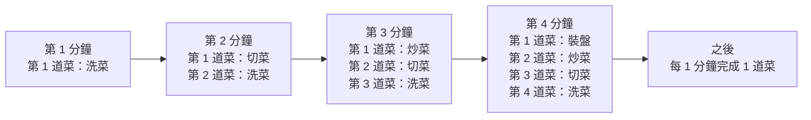
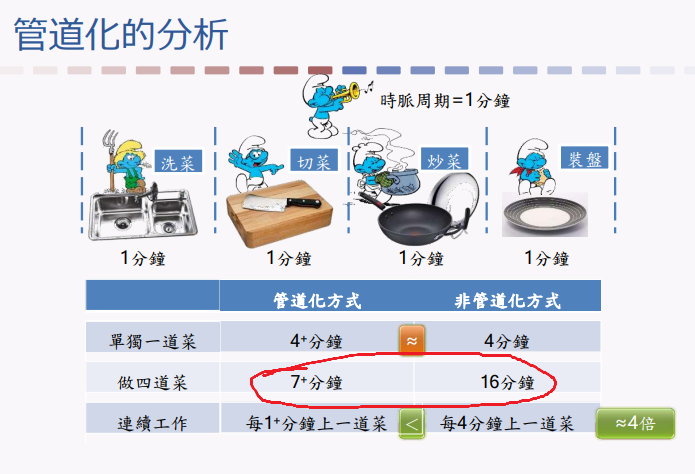
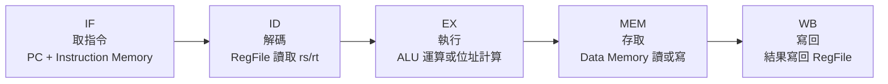
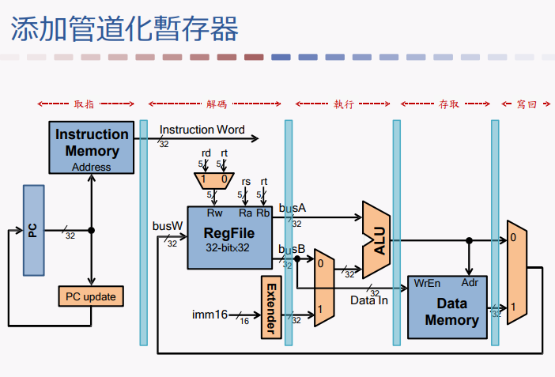

## ⭐Pipeline(管道化) — 為什麼「單件事情沒變快」，整體卻變快？

講義位置：PDF viewer page 2 ~ PDF viewer page 14

### 1. 這一段在處理什麼問題？

Pipeline(管道化) 要解決的不是「一條指令本身怎麼變超快」，而是「很多條指令連續執行時，怎麼讓硬體不要閒著」。

講義用做菜當例子。非管道化時，一道菜要依序完成 4 步：洗菜、切菜、炒菜、裝盤。若每步 1 分鐘，做一道菜要 4 分鐘，做四道菜就是 16 分鐘。這對應到 CPU 裡「一條指令做完，下一條才開始」的直覺模型。

關鍵問題是：洗第 1 道菜時，切菜區、炒菜區、裝盤區都在等；切第 1 道菜時，洗菜區又空下來。這就是資源沒有重疊使用。

---

### 2. 非管道化：一次只做一道菜

Non-pipelined(非管道化) 的概念像這樣：

|         時間 | 動作           |
| ---------: | ------------ |
|   0 ~ 1 分鐘 | 第 1 道菜洗菜     |
|   1 ~ 2 分鐘 | 第 1 道菜切菜     |
|   2 ~ 3 分鐘 | 第 1 道菜炒菜     |
|   3 ~ 4 分鐘 | 第 1 道菜裝盤     |
|   4 ~ 8 分鐘 | 第 2 道菜重複完整流程 |
|  8 ~ 12 分鐘 | 第 3 道菜重複完整流程 |
| 12 ~ 16 分鐘 | 第 4 道菜重複完整流程 |

所以非管道化的特徵是：

| 指標                     | 結果         |
| ---------------------- | ---------- |
| 單一道菜 latency(延遲)       | 4 分鐘       |
| 四道菜總時間                 | 16 分鐘      |
| 穩定上菜間隔 throughput(吞吐率) | 每 4 分鐘 1 道 |

Latency(延遲) 是「一個任務從開始到完成花多久」。Throughput(吞吐率) 是「長時間連續工作時，單位時間完成多少任務」。

---

### 3. 管道化：每個階段同時處理不同道菜

Pipeline(管道化) 的核心是：把一個任務切成多個 stage(階段)，不同 stage 同時處理不同任務。

在講義 PDF viewer page 5 ~ 13，圖上每一欄是階段：洗菜、切菜、炒菜、裝盤；每一列是第幾道菜。時間往右推進時，第 1 道菜進到切菜，第 2 道菜就可以開始洗菜。最後 Pipeline 填滿後，可以每 1 分鐘完成一道菜。

這張圖要抓住一件事：Pipeline 不是把洗菜、切菜、炒菜、裝盤壓縮成 1 分鐘，而是讓不同道菜同時佔用不同階段。

---

### 4. 最重要的不變量：單一道菜沒有變快

講義 PDF viewer page 14 明確說：管道化做四道菜用了 7 分鐘，平均每道菜不到 2 分鐘；Pipeline 填滿後，可以每 1 分鐘上一道菜；但「單獨一道菜仍然需要 4 分鐘」。

這就是考試最常考的核心句：

| 觀念     | 正確說法                                         |
| ------ | -------------------------------------------- |
| 單一任務時間 | 不一定變短，甚至後面加 pipeline registers(管道化暫存器) 後可能變長 |
| 整體完成速度 | 多個任務連續執行時變快                                  |
| 變快的原因  | stage overlap(階段重疊)                          |
| 主要提升   | throughput(吞吐率)，不是 latency(延遲)               |

外部課程資料也用同樣方向描述 MIPS Pipeline：五階段通常是 IF、ID、EX、MEM、WB，Pipeline 的重點是不同指令可以分別位於不同階段，以提高整體 throughput(吞吐率)；這裡只作交叉理解，不取代講義主線。([OpenALG][1])

---

### 5. 用公式看為什麼四道菜是 7 分鐘

假設：

| 符號  | 意義                |
| --- | ----------------- |
| `k` | Pipeline stage 數量 |
| `n` | 任務數量              |
| `T` | 每個 stage 的時間      |

理想、平衡 Pipeline 的總時間是：

!!! danger "這個公式可以記一下"

    `(k + n - 1) × T`

在講義做菜例子：

| 參數  |                 值 |
| --- | ----------------: |
| `k` | 4 個 stage：洗、切、炒、裝 |
| `n` |              4 道菜 |
| `T` |              1 分鐘 |

所以：

`(4 + 4 - 1) × 1 = 7 分鐘`

這就是 PDF viewer page 14 說「做四道菜用了 7 分鐘」的來源。

---

### 6. 為什麼理想提升是 4 倍？

非管道化時，穩定狀態是每 4 分鐘完成 1 道菜。
管道化填滿後，穩定狀態是每 1 分鐘完成 1 道菜。

所以理想 throughput speedup(吞吐率加速比) 是：

| 模式                  |     穩定完成間隔 |
| ------------------- | ---------: |
| Non-pipelined(非管道化) | 每 4 分鐘 1 道 |
| Pipelined(管道化)      | 每 1 分鐘 1 道 |

因此性能提升接近原本的 4 倍；講義 PDF viewer page 14 也直接標示性能提升到原先的 4 倍。

但注意：這個 4 倍是理想狀況。後面講義會繼續處理為什麼實際上會被 pipeline register delay(管道化暫存器延遲)、stage imbalance(階段不平衡)、hazard(危障) 影響。

---

### 7. 對應回 CPU 指令

做菜只是類比。真正放回 CPU 時，一條 MIPS 指令常被拆成五個 stage(階段)：

| Stage | 中文                     | 做什麼                              |
| ----- | ---------------------- | -------------------------------- |
| IF    | Instruction Fetch(取指令) | 從 Instruction Memory(指令記憶體) 取出指令 |
| ID    | Instruction Decode(解碼) | 解碼、讀 register(暫存器)               |
| EX    | Execute(執行)            | ALU 運算或計算記憶體位址                   |
| MEM   | Memory Access(記憶體存取)   | load/store 存取 Data Memory(資料記憶體) |
| WB    | Write Back(寫回)         | 把結果寫回 Register File(暫存器堆)        |

這五個 stage 在 ch4-2 的 PDF viewer page 16 ~ 17 會正式出現；本輪先只建立 Pipeline 的基本直覺，不提前把後續硬體細節全部講完。

---

### 8. 常見錯法

| 錯誤說法                         | 為什麼錯                             |
| ---------------------------- | -------------------------------- |
| Pipeline 會讓單一指令變快            | 不一定；單一指令還是要走完所有 stage            |
| Pipeline 的加速來自每個 stage 做得比較快 | 不是；主要來自不同指令／任務重疊執行               |
| 做四道菜 7 分鐘，所以每道菜只要 1.75 分鐘    | 這是平均值，不代表單一道菜 latency 變成 1.75 分鐘 |
| Pipeline 一定能達到 stage 數量倍速    | 只有理想平衡、沒有額外延遲、沒有 hazard 時才接近     |

社群問答中常見的混淆也集中在 pipeline register(管道化暫存器) 到底保存「值」還是「欄位編號」等實作細節；我們後面講到 PDF viewer page 18 之後才會正式處理這類問題，現在先不要把它和本輪基本直覺混在一起。([Stack Overflow][2])

---

### 9. 本輪最短記法

Pipeline(管道化) 的一句話：

Pipeline does not necessarily reduce the latency of a single task; it overlaps different stages of multiple tasks to increase throughput.

中文理解版：

管道化不是讓「一道菜」本身變快，而是讓廚房每個工作站都不要閒著，所以連續很多道菜時，上菜速度變快。

## ⭐MIPS Pipeline 五階段 — 單週期處理器要怎麼切成可重疊的五段？

講義位置：PDF viewer page 15 ~ PDF viewer page 18

### 1. 這一段在解決什麼問題？

上一輪我們知道 Pipeline(管道化) 的核心是「把任務切階段，讓不同任務重疊」。現在講義把做菜類比拉回 CPU：一條 MIPS 指令不是魔法瞬間完成，而是會經過一串固定工作。

PDF viewer page 15 先給一張 Single-cycle Processor(單週期處理器) 的完整 datapath(資料通路)：Instruction Memory(指令記憶體)、RegFile(暫存器堆)、ALU、Data Memory(資料記憶體)、多工器與控制訊號都在同一張圖裡。這張圖代表：一條指令在一個很長的 clock cycle(時脈週期) 內走完整條路。

問題是：如果一條指令要一次走完整條 datapath，下一條指令就只能等。Pipeline 的做法是把這條長路切成幾段，中間加 pipeline registers(管道化暫存器)，讓不同指令可以卡在不同段落。

---

### 2. MIPS 指令的五個主要 stage(階段)

講義 PDF viewer page 16 把 MIPS 指令執行拆成五步：Fetch(取指令)、Decode(解碼)、Execute(執行)、Memory(存取)、Write-back(寫回)。

| Stage | 中文                     | 核心工作                                         |
| ----- | ---------------------- | -------------------------------------------- |
| IF    | Instruction Fetch(取指令) | 從 Instruction Memory(指令記憶體) 取出指令，並更新 PC      |
| ID    | Instruction Decode(解碼) | 解碼指令，從 RegFile(暫存器堆) 讀出暫存器值                  |
| EX    | Execute(執行)            | R-type 做 ALU 運算；load/store 計算記憶體位址           |
| MEM   | Memory Access(記憶體存取)   | `lw` 從 Data Memory 讀資料；`sw` 寫資料到 Data Memory |
| WB    | Write Back(寫回)         | 把結果寫回 RegFile(暫存器堆)                          |

這五個 stage 就像做菜的「洗、切、炒、裝盤」。不同的是，CPU 裡每個 stage 對應的是硬體路徑與資料狀態。

---

### 3. 五階段怎麼對應到 datapath？

PDF viewer page 17 把單週期 datapath 切成五段，從左到右大致是：PC/Instruction Memory、RegFile、ALU、Data Memory、寫回路徑。

對初學者來說，最重要的是不要把五階段背成空名詞，而是要知道每個 stage 在「搬什麼資料」：

!!! danger "ID 和 WB 會碰暫存器堆"

    | Stage | 主要資料                                  |
    | ----- | ------------------------------------- |
    | IF    | 目前 PC、取出的 instruction ==(讀取指令記憶體)==                |
    | ID    | instruction 欄位、 從暫存器讀出的 register values  ==(讀取暫存器堆)==   |
    | EX    | ALU input、ALU result                  |
    | MEM   | memory address、store data、load result ==(寫入/讀取資料記憶體)==|
    | WB    | 要寫回哪個 register 、寫回什麼 value ==(寫入暫存器堆)==            |
    
    
    | 階段  | 這一階段像什麼 | CPU 真的在做什麼                                          |
    | --- | ------- | --------------------------------------------------- |
    | IF  | 拿工單     | 用 PC 去 Instruction Memory(指令記憶體) 取出 instruction(指令) |
    | ID  | 看懂工單    | 解碼 opcode/rs/rt/rd/imm，並從 RegFile(暫存器堆) 讀資料         |
    | EX  | 實際計算    | ALU 做運算，或算出 memory address(記憶體位址)                   |
    | MEM | 去倉庫讀寫   | `lw` 讀 Data Memory，`sw` 寫 Data Memory               |
    | WB  | 寫回結果    | 把 ALU 結果或 memory 讀出的資料寫回 RegFile                    |

---

### 4. 為什麼要加 Pipeline Registers(管道化暫存器)？

PDF viewer page 18 的重點是「添加管道化暫存器」。圖中的直立淺藍色區塊就是切段邊界。

Pipeline register(管道化暫存器) 的功能像接力賽的交接棒：每個 stage 做完自己的部分後，把下一段需要的資訊暫時存起來，下一個 clock cycle 再交給下一個 stage。

如果沒有 pipeline register，資料會在整條 combinational path(組合邏輯路徑) 裡一路流，無法穩定切成「這一拍做 IF、下一拍做 ID、再下一拍做 EX」。

所以 pipeline register 至少要保存兩類東西：

| 類型                        | 例子                                                   |
| ------------------------- | ---------------------------------------------------- |
| Data values(資料值)          | instruction、PC、register value、ALU result、memory data |
| Control information(控制資訊) | 這條指令後面要不要寫回、要不要讀記憶體、ALU 要做什麼                         |

現在先建立概念即可。後面遇到 hazard(危障) 時，這件事會變得非常重要，因為控制訊號與資料如果沒有跟著同一條指令走，就會寫錯 register 或存錯 memory。

---

### 5. 修正你剛剛那句「一個硬體處理一個指令」

更精準的模型是：

| 說法                               | 判斷                                    |
| -------------------------------- | ------------------------------------- |
| 整個 CPU 一次只處理一條指令                 | 對 single-cycle processor(單週期處理器) 比較接近 |
| Pipeline 裡整個 CPU 同時只有一條指令        | 錯                                     |
| Pipeline 裡每個 stage 同一拍處理一條指令的一部分 | 正確                                    |
| Pipeline 裡多條指令同時位於不同 stage       | 正確                                    |

你可以把它想成便利商店結帳流程：
一位店員掃商品、一位店員裝袋、一位店員收錢。每個工作站一次處理一位客人的一部分流程，但整家店同時服務多位客人。Pipeline 也是這樣。

---

### 6. 本輪最短記法

Single-cycle processor(單週期處理器)：一條指令在一個長週期內走完整條 datapath。
Pipelined processor(管道化處理器)：把 datapath 切成 IF、ID、EX、MEM、WB，中間加 pipeline registers，讓多條指令在不同 stage 重疊執行。

## ⭐Pipeline Performance Analysis — 為什麼管道化提高 throughput，卻可能讓單條指令更慢？

講義位置：PDF viewer page 19 ~ PDF viewer page 23

### 1. 這一段在解決什麼問題？

前面你已經知道 pipeline(管道化) 是把 datapath(資料通路) 切成 IF、ID、EX、MEM、WB 五個 stage(階段)，讓多條指令重疊執行。

現在講義 PDF viewer page 19 ~ 23 要回答更精準的效能問題：

管道化到底是讓「單條指令」變快，還是讓「連續很多條指令」完成得更快？

答案是：主要讓連續指令的 throughput(吞吐率) 變好，不一定讓單條指令的 latency(延遲) 變短。講義 PDF viewer page 23 明確寫到：管道化不會縮短單條指令執行時間，甚至會增加時間，而是提高指令吞吐率。

---

### 2. Single-cycle Processor(單週期處理器)：一條指令吃掉一整個長週期

PDF viewer page 19 左上方比較 single-cycle processor(單週期處理器) 與 pipelined processor(管道化處理器)。在單週期處理器中，講義用 `lw` 指令做例子，每一條 `lw` 都要在一個 1000ps 的 clock cycle(時脈週期) 內完成 IF、ID、EX、MEM、WB 全部工作。

你可以把它想成：一條指令要一次走完整條生產線，所以 clock cycle 必須夠長，長到能容納最慢、最完整的指令路徑。

| 模式                | 一條 `lw` 需要經過                             | clock cycle |
| ----------------- | ---------------------------------------- | ----------: |
| Single-cycle(單週期) | IF + ID + EX + MEM + WB 全部在同一個 cycle 內完成 |      1000ps |

所以連續三條 `lw` 大概會是：

| 指令              |   開始時間 |   完成時間 |
| --------------- | -----: | -----: |
| `lw $1,100($0)` |    0ps | 1000ps |
| `lw $2,100($0)` | 1000ps | 2000ps |
| `lw $3,100($0)` | 2000ps | 3000ps |

單週期的問題是：下一條指令不能在前一條還沒結束時進來重疊工作。

---

### 3. Pipelined Processor(管道化處理器)：每 200ps 推進一個 stage

PDF viewer page 19 的下半部顯示 pipelined processor(管道化處理器)：假設 IF、ID、EX、MEM、WB 每個 stage 都是 200ps，則 clock cycle 可以設成 200ps。

一條指令仍然要走五個 stage，所以單條指令完整走完仍是：

| 計算                 |       結果 |
| ------------------ | -------: |
| `5 stages × 200ps` | `1000ps` |

但差別在於：pipeline 每 200ps 就可以讓下一條指令進入 IF。

|            時間 | 第 1 條 `lw` | 第 2 條 `lw` | 第 3 條 `lw` |
| ------------: | ---------- | ---------- | ---------- |
|     0 ~ 200ps | IF         |            |            |
|   200 ~ 400ps | ID         | IF         |            |
|   400 ~ 600ps | EX         | ID         | IF         |
|   600 ~ 800ps | MEM        | EX         | ID         |
|  800 ~ 1000ps | WB         | MEM        | EX         |
| 1000 ~ 1200ps |            | WB         | MEM        |
| 1200 ~ 1400ps |            |            | WB         |

這就是 pipeline 的核心：第一條指令還沒完成時，第二條、第三條已經進來使用不同 stage。

---

### 4. 重要區分：latency 沒變，但 throughput 變好

在「不考慮 pipeline register delay(管道化暫存器延遲)」時：

| 指標               | Single-cycle(單週期) |   Pipeline(管道化) |
| ---------------- | ----------------: | --------------: |
| 單條指令 latency(延遲) |            1000ps |          1000ps |
| 新指令開始間隔          |            1000ps |           200ps |
| 穩定完成間隔           |   每 1000ps 完成 1 條 |  每 200ps 完成 1 條 |
| 主要改善             |               無重疊 | throughput(吞吐率) |

所以 pipeline 的「看起來變快」不是因為第 1 條 `lw` 只花 200ps 完成，而是因為 pipeline 填滿後，每 200ps 就能完成一條指令。

這和做菜例子完全一樣：單獨一道菜還是要經過洗、切、炒、裝盤，但廚房填滿後可以每隔一段時間上一道菜。

---

### 5. Pipeline Register Delay(管道化暫存器延遲)：為什麼單條指令可能變慢？

PDF viewer page 20 開始提醒：pipeline registers(管道化暫存器) 自身也有 delay(延遲)。PDF viewer page 21 ~ 22 進一步比較：未考慮管道化暫存器延遲時，clock cycle 是 200ps，單條指令是 1000ps；若假設 pipeline register delay 是 50ps，clock cycle 會變成 250ps，單條指令就變成 1250ps。

原因是每一段 stage 不是只有「計算邏輯」本身，還要加上 pipeline register 的保存與傳遞成本。

!!! danger "clock cycle 會加上 pipeline register delay"

    | 情況                 | 每個 stage 邏輯時間 | pipeline register delay | clock cycle |     單條指令 latency |
    | ------------------ | ------------: | ----------------------: | ----------: | ---------------: |
    | 未考慮 register delay |         200ps |                     0ps |       200ps | `5×200 = 1000ps` |
    | 考慮 register delay  |         200ps |                    50ps |       ==250ps== | `5×250 = 1250ps` |

所以 pipeline 有一個很重要的代價：切段後雖然能重疊，但每段之間多了暫存器延遲。

---

### 6. 這裡最容易考的判斷

| 說法                                        | 判斷 | 原因                                             |
| ----------------------------------------- | -- | ---------------------------------------------- |
| Pipeline 一定讓單條指令更快                        | 錯  | 單條指令仍要走完所有 stage，而且可能多 pipeline register delay |
| Pipeline 主要提升 throughput                  | 對  | 填滿後可用更短間隔完成連續指令                                |
| Pipeline clock cycle 通常可以比 single-cycle 短 | 對  | 因為單週期要容納完整 datapath，管道化只需容納單一 stage 加暫存器延遲     |
| Pipeline register 完全沒有成本                  | 錯  | 講義明確討論 pipeline register 自身延遲                  |
| Pipeline 中各個處理元件可以並行工作                    | 對  | 講義 PDF viewer page 23 明確指出各個處理元件可並行工作          |

---

### 7. 最短記法

Pipeline(管道化) 的效能重點可以背成一句：

管道化把 clock cycle 從「整條指令路徑時間」縮成「最慢 stage 時間 + pipeline register delay」，因此提高 throughput；但單條指令仍要走完整個 pipeline，所以 latency 不一定降低，甚至可能增加。

英文考試版：

Pipelining reduces the clock cycle time by dividing the datapath into stages, so it improves instruction throughput. However, a single instruction still passes through all stages, and pipeline register delay may even increase its latency.

## ⭐Pipeline Balance and Adjustment — 為什麼最慢的 stage 會拖慢整條 pipeline？

講義位置：PDF viewer page 24 ~ PDF viewer page 27

### 1. 這一段在解決什麼問題？

前面我們假設五個 stage(階段) 都一樣快，所以 pipeline clock cycle(管道化時脈週期) 可以很漂亮地設定成每個 stage 的時間。

但現實常常不是這樣。有些 stage 可能比較慢。講義 PDF viewer page 24 ~ 27 要解決的問題是：

如果每個 stage 花的時間不一樣，pipeline 的速度到底看誰？

答案是：看最慢的 stage。
因為 pipeline 是一拍一拍往前推，每一拍都要等所有 stage 都完成目前這一格工作，才能一起進到下一格。

這就像全班換教室：不是最快的人決定全班何時到齊，而是最慢的人決定整隊前進速度。

---

### 2. 平衡 pipeline：每個 stage 都是 1 分鐘

PDF viewer page 25 先回到理想情況：洗菜、切菜、炒菜、裝盤各 1 分鐘，所以 pipeline clock cycle 是 1 分鐘。講義表格顯示，單獨一道菜約 4 分鐘；做四道菜約 7+ 分鐘；連續工作時，pipeline 可以每 1+ 分鐘上一道菜，而非管道化是每 4 分鐘上一道菜，約 4 倍改善。

| Stage(階段) |   時間 |
| --------- | ---: |
| 洗菜        | 1 分鐘 |
| 切菜        | 1 分鐘 |
| 炒菜        | 1 分鐘 |
| 裝盤        | 1 分鐘 |

理想公式可以這樣看：

| 項目           | 計算                       |
| ------------ | ------------------------ |
| stage 數      | 4                        |
| dish 數       | 4                        |
| clock cycle  | 1 分鐘                     |
| pipeline 總時間 | `(4 + 4 - 1) × 1 = 7 分鐘` |

講義寫 `7+`，這個 `+` 可以理解成實務上的額外切換／暫存／交接成本；考試若只照理想模型算，就是 7 分鐘。

---

### 3. 不平衡 pipeline：切菜變成 2 分鐘

PDF viewer page 26 把切菜改成 2 分鐘，其他 stage 仍是 1 分鐘。這時 pipeline clock cycle 不能設成 1 分鐘，因為切菜還沒完成，下一拍就不能一起推進。講義直接標出：不平衡 pipeline 的時脈週期是 2 分鐘。

| Stage(階段) |   時間 |
| --------- | ---: |
| 洗菜        | 1 分鐘 |
| 切菜        | 2 分鐘 |
| 炒菜        | 1 分鐘 |
| 裝盤        | 1 分鐘 |

所以：

| 項目                     | 計算                         |
| ---------------------- | -------------------------- |
| clock cycle            | `max(1, 2, 1, 1) = 2 分鐘`   |
| 單獨一道菜 pipeline latency | `4 stages × 2 = 8+ 分鐘`     |
| 四道菜 pipeline 總時間       | `(4 + 4 - 1) × 2 = 14+ 分鐘` |
| 非管道化四道菜                | `4 dishes × 5 分鐘 = 20 分鐘`  |
| 穩定 throughput          | 每 2+ 分鐘上一道菜                |

這裡非常重要：
雖然洗菜、炒菜、裝盤都只要 1 分鐘，但它們不能自己每 1 分鐘推進一次，因為整條 pipeline 的 cycle 要配合最慢 stage。

---

### 4. 為什麼不平衡會浪費硬體？

在不平衡 pipeline 裡，洗菜只要 1 分鐘，但 clock cycle 是 2 分鐘。這代表洗菜 stage 做完後，可能還要等切菜 stage 做完，才能進入下一拍。

| Stage(階段) | 實際工作時間 | 每拍長度 | 浪費感       |
| --------- | -----: | ---: | --------- |
| 洗菜        |   1 分鐘 | 2 分鐘 | 做完後等 1 分鐘 |
| 切菜        |   2 分鐘 | 2 分鐘 | 剛好滿       |
| 炒菜        |   1 分鐘 | 2 分鐘 | 做完後等 1 分鐘 |
| 裝盤        |   1 分鐘 | 2 分鐘 | 做完後等 1 分鐘 |

所以 pipeline optimization(管道化優化) 的第一個方向就是：讓各 stage 盡量平衡。

---

### 5. Pipeline adjustment(管道化調整)：把慢 stage 拆開

PDF viewer page 27 的做法是把原本 2 分鐘的「切菜」拆成兩個 1 分鐘 stage：切菜1、切菜2。這樣原本的 4-stage pipeline 變成 5-stage pipeline，但每個 stage 都接近 1 分鐘。講義稱這是平衡的管道化。

!!! danger "不平衡的解決方法要記下來，==就是把他切開=="

    | 調整前 |   時間 | 調整後 |   時間 |
    | --- | ---: | --- | ---: |
    | 洗菜  | 1 分鐘 | 洗菜  | 1 分鐘 |
    | 切菜  | 2 分鐘 | 切菜1 | 1 分鐘 |
    | 炒菜  | 1 分鐘 | 切菜2 | 1 分鐘 |
    | 裝盤  | 1 分鐘 | 炒菜  | 1 分鐘 |
    |     |      | 裝盤  | 1 分鐘 |

調整後：

| 項目                     | 計算                        |
| ---------------------- | ------------------------- |
| stage 數                | 5                         |
| clock cycle            | 1 分鐘                      |
| 單獨一道菜 pipeline latency | `5 stages × 1 = 5+ 分鐘`    |
| 四道菜 pipeline 總時間       | `(5 + 4 - 1) × 1 = 8+ 分鐘` |
| 非管道化四道菜                | `4 dishes × 5 分鐘 = 20 分鐘` |
| 穩定 throughput          | 每 1+ 分鐘上一道菜               |

所以調整 pipeline 的重點不是「隨便切更多段一定比較好」，而是「把太慢的 stage 切成比較平均的小 stage」，讓 clock cycle 不被單一慢 stage 拖住。

---

### 6. 這裡最容易考的判斷

| 說法                                     | 判斷 | 原因                                                 |
| -------------------------------------- | -- | -------------------------------------------------- |
| Pipeline clock cycle 由所有 stage 的平均時間決定 | 錯  | 由最慢 stage 決定                                       |
| 有一個 stage 比較慢，整條 pipeline 都會被拖慢        | 對  | 每一拍要等最慢 stage 完成                                   |
| 把慢 stage 拆成兩個較短 stage 可能提高 throughput  | 對  | clock cycle 可能縮短                                   |
| stage 越多一定越好                           | 錯  | 之後 page 28 ~ 30 會講 pipeline register delay 佔比與深度限制 |
| 平衡 pipeline 的目標是讓每個 stage 時間接近         | 對  | 避免快 stage 等慢 stage                                 |

---

### 7. 最短記法

Pipeline clock cycle(管道化時脈週期) 由最慢的 stage 決定。
若 stage 不平衡，快 stage 會被迫等待慢 stage。
Pipeline adjustment(管道化調整) 的核心是把慢 stage 拆開，讓各 stage 更平均，進而降低 clock cycle 並提高 throughput。

英文考試版：

The pipeline clock cycle is determined by the slowest stage. If the stages are unbalanced, faster stages must wait for the slowest one. Pipeline adjustment improves performance by splitting slow stages into smaller balanced stages, reducing the clock cycle time and increasing throughput.

## ⭐Super Pipelining and Pipeline Depth — stage 切越多，pipeline 就一定越快嗎？

講義位置：PDF viewer page 28 ~ PDF viewer page 30

### 1. 這一段在解決什麼問題？

前面 page 24 ~ 27 教的是：如果某個 stage(階段) 太慢，可以把它拆開，讓各 stage 更平衡。

現在 PDF viewer page 28 ~ 30 要問更進一步的問題：

既然把慢 stage 拆開有用，那能不能一直切、一直切，把 pipeline 切成更多 stage，讓 clock cycle(時脈週期) 越來越短？

這就是 Super Pipelining(超級管道化) 的核心想法：把原本的五級 pipeline 細分成更多階段，增加 pipeline depth(管道化深度)，藉此提高 clock frequency(時脈頻率)，進而提高 instruction throughput(指令吞吐率)。講義 PDF viewer page 28 明確列出：五級 pipeline 的 clock cycle 是 `200ps + 50ps = 250ps`，十級 pipeline 的 clock cycle 是 `100ps + 50ps = 150ps`。

---

### 2. Super Pipelining(超級管道化)：把 stage 切得更細

可以把它想成原本一個工作站做 200ps 的工作，現在拆成兩個小工作站，各做 100ps。

| 設計          | stage 數 | 每個 stage 的邏輯時間 | pipeline register delay | clock cycle |
| ----------- | ------: | -------------: | ----------------------: | ----------: |
| 五級 pipeline |       5 |          200ps |                    50ps |       250ps |
| 十級 pipeline |      10 |          100ps |                    50ps |       150ps |

從 throughput(吞吐率) 角度看，十級 pipeline 比五級 pipeline 好，因為 pipeline 填滿後：

| 設計          |           穩定完成間隔 |
| ----------- | ---------------: |
| 五級 pipeline | 每 250ps 完成 1 條指令 |
| 十級 pipeline | 每 150ps 完成 1 條指令 |

所以 Super Pipelining(超級管道化) 的優點是：clock cycle 變短，穩定狀態下完成指令的間隔變短，throughput 變高。

---

### 3. 但 stage 不是越多越好：pipeline register delay 會變重

PDF viewer page 29 直接問：「管道化的級數是越多越好嗎？」答案是否定的。講義比較五級與十級 pipeline：五級 pipeline 的單條指令 latency 是 1250ps，pipeline register delay 比例是 `50ps / 250ps = 20%`；十級 pipeline 的單條指令 latency 是 1500ps，pipeline register delay 比例是 `50ps / 150ps = 33%`。

重點是：你把 stage 切細後，logic delay(邏輯延遲) 變短了，但每一級之間仍然要付 pipeline register delay(管道化暫存器延遲)。

/// danger|計算方法要記

| 設計          | clock cycle | stage 數 |        單條指令 latency | register delay 比例 |
| ----------- | ----------: | ------: | ------------------: | ----------------: |
| 五級 pipeline |       250ps |       5 |  `5 × 250 = 1250ps` |  ==`50 / 250 = 20%`== |
| 十級 pipeline |       150ps |      10 | `10 × 150 = 1500ps` |  ==`50 / 150 = 33%`== |

///

所以十級 pipeline 的 throughput 可能比較好，但單條指令 latency 反而更長。

---

### 4. 為什麼 register delay 比例會變大？

這裡的直覺很重要。

假設每切一段都要放一個「交接站」。當工作本身很大時，交接成本看起來還好；但工作切得越小，交接成本就越明顯。

| 情況          |  工作本身 | 交接成本 | 感覺        |
| ----------- | ----: | ---: | --------- |
| 五級 pipeline | 200ps | 50ps | 交接成本佔 20% |
| 十級 pipeline | 100ps | 50ps | 交接成本佔 33% |

所以 stage 切越細，clock cycle 不會無限縮小，因為 pipeline register delay 不會跟著等比例消失。

這也是為什麼「切更多 stage」不是免費的。

---

### 5. PDF viewer page 30 的意義：真實處理器也不會固定一種深度

PDF viewer page 30 列出不同年代處理器的 pipeline depth(管道化深度)變化，例如 R2000、R3000 是 5 級，R4000 是 8 級，Pentium Pro 是 12 級，Pentium 4 Prescott 是 31 級，Core i7 Haswell 是 14 級，Cortex-A15 與 Cortex-A57 是 15 級。

這頁不是要你背所有年份，而是要你看懂一個現象：

/// danger| 結論
處理器設計不是「越深越好」，而是要在 throughput(吞吐率)、latency(延遲)、pipeline register overhead(管道化暫存器成本)、hazard penalty(危障懲罰)與實作複雜度之間取平衡。
///

其中 hazard penalty(危障懲罰)後面講義會再正式進入；這裡先不要提前展開，只需要知道：pipeline 越深，錯一次或停一次可能浪費更多 stage。

---

### 6. 最容易考的判斷

| 說法                                      | 判斷       | 原因                             |
| --------------------------------------- | -------- | ------------------------------ |
| Super Pipelining 是把 pipeline 切成更多 stage | 對        | 講義定義就是增加管道化深度                  |
| 十級 pipeline 的 clock cycle 一定比五級短        | 在本講義例子中對 | 例子是 150ps vs 250ps             |
| stage 越多，單條指令 latency 一定越短              | 錯        | 十級例子單條指令是 1500ps，比五級 1250ps 更長 |
| stage 越多越好                              | 錯        | pipeline register delay 比例會變大  |
| Super Pipelining 主要改善 throughput        | 對        | clock cycle 變短後，填滿時完成間隔變短      |

---

### 7. 最短記法

Super Pipelining(超級管道化) 是把 pipeline 切成更多 stage，讓 clock cycle 變短，進而提高 throughput(吞吐率)。但是 stage 越多，pipeline register delay(管道化暫存器延遲)的比例越高，單條指令 latency(延遲)可能變長，所以 pipeline depth(管道化深度)不是越多越好。

英文考試版：

Super pipelining increases the pipeline depth by dividing the datapath into more stages. This can reduce the clock cycle time and improve throughput. However, deeper pipelines increase the relative overhead of pipeline register delay, and the latency of a single instruction may increase. Therefore, more pipeline stages are not always better.

/// danger
### 錯題

==Q:==
A student says: “A processor should always use as many pipeline stages as possible, because more stages always means better performance.” Diagnose this statement and rewrite it correctly.

==ME:==
錯，雖然效能會更好，但是 throughput 的收益會越來越少，還要衡量硬體資源和設計難度，所以不是越多 stage 越好

==ANS:==
✅方向正確，但有一句要修正：「雖然效能會更好」不要寫太滿。更精準是：stage(階段) 變多可能改善 throughput，但不一定改善 overall performance(整體效能)，因為 pipeline register delay(管道化暫存器延遲)、hazard penalty(危障懲罰)、硬體成本與設計複雜度都會上升。講義 PDF viewer page 29 直接問「管道化的級數是越多越好嗎？」答案是否定的。

///

## ⭐Superscalar Pipelining — 除了把 pipeline 切更深，能不能同時跑多條 pipeline？

講義位置：PDF viewer page 31 ~ PDF viewer page 44

### 1. 這一段在解決什麼問題？

前面 Super Pipelining(超級管道化) 是把同一條 pipeline 切成更多 stage(階段)，讓 clock cycle(時脈週期) 變短。這是「把同一條生產線切更細」。

現在 Superscalar Pipelining(超標量管道化) 問的是另一個問題：

如果一條 pipeline 填滿後，每個 cycle 通常只能完成一條指令，那能不能放兩條以上 pipeline，讓同一個 cycle 可以處理兩條以上指令？

講義 PDF viewer page 32 定義 Superscalar(超標量)：通常具有兩條或兩條以上並行工作的管道化結構，稱為超標量結構；使用這種結構的處理器稱為超標量處理器。

---

### 2. Scalar Pipeline(標量管道化) vs Superscalar Pipeline(超標量管道化)

Scalar Pipeline(標量管道化) 可以想成只有一條生產線。

/// danger | ==2-issue 是雙發射的意思==

| 類型                          | 直覺            | 一個 cycle 穩定狀態下能完成 |
| --------------------------- | ------------- | ----------------- |
| Scalar pipeline(標量管道化)      | 一條 pipeline   | 通常最多 1 條指令        |
| ==2-issue== superscalar(雙發射超標量) | 兩條並行 pipeline | 理想上最多 2 條指令       |
| 4-issue superscalar(四發射超標量) | 四條並行 pipeline | 理想上最多 4 條指令       |

///

這裡的 issue(發射) 可以先理解成：CPU 在同一個 cycle 能把幾條指令送進可並行工作的 pipeline。

所以「雙發射」不是把 clock cycle 砍半，而是同一個 cycle 有機會同時送出兩條指令。

---

### 3. 用做菜例子理解雙發射

講義 PDF viewer page 33 ~ 38 繼續用做菜例子。原本一個 stage 只有一個人，例如一個人洗菜、一個人切菜1、一個人切菜2、一個人炒菜、一個人裝盤。Superscalar 的做法是：每個 stage 都放兩套人力／硬體，所以同一個 stage 可以同時處理兩道菜。PDF viewer page 35 ~ 38 顯示每個階段都有兩道菜同時並行向前，到了五分鐘時可以同時完成兩道菜。 

用 CPU 的話說：

| 做菜例子        | CPU 對應                |
| ----------- | --------------------- |
| 同時洗兩道菜      | 同時 fetch / issue 兩條指令 |
| 同時有兩個切菜1    | 同一 stage 有兩套硬體資源      |
| 五分鐘時同時完成兩道菜 | 同一 cycle 可能完成兩條指令     |
| 再多加一條生產線    | 變成 3-issue 或 4-issue  |

所以 Superscalar(超標量) 的核心不是「stage 更細」，而是「硬體變多，空間上並行」。

---

### 4. 和 Super Pipelining(超級管道化) 的差別

這是這段最容易考的比較。

| 比較點  | Super Pipelining(超級管道化) | Superscalar(超標量)           |
| ---- | ----------------------- | -------------------------- |
| 優化方向 | 把一條 pipeline 切成更多 stage | 放多條可並行工作的 pipeline         |
| 並行類型 | Time parallelism(時間並行性) | Spatial parallelism(空間並行性) |
| 主要改變 | clock cycle 可能變短        | 同一 cycle 可處理多條指令           |
| 硬體資源 | 主要是切分既有 datapath 並增加暫存器 | 需要成倍增加硬體資源                 |
| 典型說法 | 更深的 pipeline            | 多發射 pipeline               |

講義 PDF viewer page 43 也明確比較：單週期到標量管道化是時間並行性的優化，主要是對現有硬體的切分；標量管道化到超標量管道化是空間並行性的優化，需要成倍增加硬體資源。

---

### 5. Pentium、Cortex-A9、Core i7 的例子

講義接著給實際處理器例子：

| 處理器       | 講義描述                                                   | 重點                                    |
| --------- | ------------------------------------------------------ | ------------------------------------- |
| Pentium   | 雙發射，5 級管道化；U pipeline 和 V pipeline；一個 cycle 可以同時發送兩條指令 | 早期 x86 superscalar 範例                 |
| Cortex-A9 | 4 發射，8~11 級管道                                          | 例子顯示 superscalar 可搭配不同 pipeline depth |
| Core i7   | 4 發射，16 級管道                                            | 現代處理器可同時有較深 pipeline 與多發射             |

Pentium 那頁特別重要：它有兩條 pipeline，稱為 U pipeline 與 V pipeline，每條 pipeline 都有自己的位址產生邏輯、ALU 及 Data Cache 介面，因此一個 clock cycle 內可以同時發送兩條指令。 Cortex-A9 與 Core i7 的投影片則分別標示 4 發射、8~11 級管道，以及 4 發射、16 級管道。 

---

### 6. Superscalar 不是 Multi-core(多核心)

PDF viewer page 44 把 Superscalar Pipelining(超標量管道化) 和 Multi-core CPU(多核心 CPU) 放在一起比較。講義說現代多核心 CPU 通常是在一個 CPU chip(晶片)中整合多個 superscalar processor core(超標量處理器核心)。

所以層級要分清楚：

| 層級                       | 意思                               |
| ------------------------ | -------------------------------- |
| Superscalar core(超標量核心)  | 一個 CPU core 裡面有多條可並行工作的 pipeline |
| Multi-core CPU(多核心 CPU)  | 一顆晶片裡有多個 CPU core                |
| Multi-core + superscalar | 每個 core 自己可能又是 superscalar       |

簡單說：
Superscalar 是「一個核心裡面有多條管線」。
Multi-core 是「一顆 CPU 裡面有多個核心」。

---

### 7. 最容易考的判斷

| 說法                             | 判斷 | 原因                                    |
| ------------------------------ | -- | ------------------------------------- |
| Superscalar 是把 pipeline 切得更深   | 錯  | 那是 Super Pipelining                   |
| Superscalar 是多條 pipeline 並行工作  | 對  | 講義定義為兩條或兩條以上並行工作的管道化結構                |
| 雙發射代表同一 cycle 理想上可發射兩條指令       | 對  | 需要足夠硬體與可並行指令                          |
| Superscalar 不需要增加硬體            | 錯  | 講義說需要成倍增加硬體資源                         |
| Multi-core 和 superscalar 是同一件事 | 錯  | multi-core 是多核心；superscalar 是單一核心內多管線 |

---

### 8. 最短記法

Super Pipelining(超級管道化) 是「一條 pipeline 切更細」，主要是時間並行性；Superscalar(超標量) 是「多條 pipeline 並行」，主要是空間並行性。雙發射代表同一個 cycle 理想上可以送出兩條指令，但需要更多硬體資源，而且不是所有指令都一定能同時並行。

英文考試版：

Super pipelining divides one pipeline into more stages to improve time parallelism. Superscalar execution uses two or more parallel pipelines to improve spatial parallelism. A 2-issue superscalar processor can ideally issue two instructions per cycle, but it requires additional hardware resources and sufficient instruction-level parallelism.

## ⭐Pipeline Hazards(管道化危障) — 為什麼 pipeline 明明能重疊執行，卻還是會被迫停下來？

講義位置：PDF viewer page 45 ~ PDF viewer page 55

### 1. Hazard(危障) 是什麼？

`Hazard(危障)` 指的是：某種情況阻止下一條 instruction(指令) 在下一個 clock cycle(時脈週期) 正常開始執行。講義把 hazard 分成三類：`Structural Hazard(結構危障)`、`Data Hazard(資料危障／數據危障)`、`Control Hazard(控制危障)`。

直覺上，pipeline 像很多人分工做菜：洗菜、切菜、炒菜、裝盤本來可以重疊。但如果「刀只有一把」、「前一道菜的材料還沒準備好」、「下一道菜要不要做還不知道」，整條流程就會卡住。

---

### 2. Structural Hazard(結構危障)：硬體資源不夠用

/// danger | 為何結構危障叫做"結構"危障
Structural hazard(結構危障) 叫「結構」危障，是因為問題出在 CPU 硬體結構／硬體資源配置本身，不是出在資料相依，也不是出在分支方向不確定。
///

`Structural Hazard(結構危障)` 發生在「所需的硬體元件正在為之前的 instruction 工作」，導致後面的 instruction 也想用同一個硬體時發生衝突。

講義示例 1 是 memory conflict(記憶體衝突)：如果 instruction(指令) 和 data(資料) 放在同一個 memory(記憶體) 中，某條 `lw` 在 `MEM` stage 要讀資料，同時下一條 instruction 在 `IF` stage 也要讀 instruction memory。若只有一個 memory，就不能同時讀兩邊。

兩種解法：

第一種是 `stall(停頓)`，也就是讓 pipeline 暫停，插入 `bubble(空泡)`。bubble 不是有用的 instruction，而是為了避免衝突而浪費掉的 pipeline slot。

第二種是把 instruction memory 和 data memory 分開，也就是讓取指令和資料存取使用不同硬體資源，避免搶同一個 memory。

講義示例 2 是 register file(暫存器堆) 的讀寫衝突：如果同一個 cycle 有 instruction 要 write register(寫暫存器)，另一條 instruction 要 read register(讀暫存器)，就要設計讀寫時序。講義給的解法是前半個 clock cycle 寫，後半個 clock cycle 讀，並設置獨立讀寫口。

---

### 3. Data Hazard(資料危障／數據危障)：需要的資料還沒準備好

`Data Hazard(資料危障)` 發生在：某條 instruction 需要使用前面 instruction 的結果，但前面 instruction 還沒把結果寫回。講義的例子是：

`sub $t0,$s1,$s2`
`add $s3,$t0,$s4`

第二條 `add` 需要讀 `$t0`，可是 `$t0` 是第一條 `sub` 算出來的結果。如果 `sub` 還沒到 `WB` stage 完成 write back(寫回)，`add` 就會讀到舊資料或資料尚未可用。這就是 data hazard。

講義目前明示的解法是 `stall(停頓)` 並產生 `bubble(空泡)`，讓後面的 `add` 等到前面的 `sub` 結果可用後再繼續。

注意：這裡不要把 data hazard 誤判成 control hazard。只要問題是「operand(運算元) 還沒準備好」，就是 data hazard。

---

### 4. Control Hazard(控制危障)：下一條 instruction 要去哪裡取還不知道

`Control Hazard(控制危障)` 發生在：CPU 需要根據之前 instruction 的結果，才能決定下一步要執行哪一條 instruction。講義的例子是 `beq`。`beq` 還沒有確定 branch(分支) 是否成立時，CPU 就不知道下一次 `IF` 到底該取 branch target(分支目標) 還是 sequential next instruction(下一條順序指令)。

講義目前明示的解法也是 `stall(停頓)`，插入 `bubble(空泡)`，等 branch result(分支結果) 確定後再繼續取正確的 instruction。

注意：這裡不要把 control hazard 誤判成 data hazard。只要問題是「下一個 PC / 下一條 instruction 還不能決定」，就是 control hazard。

---

### 5. 三種 hazard 的最短判斷法

| 類型                        | 卡住原因                               | 典型問法                                  | 最短判斷 |
| ------------------------- | ---------------------------------- | ------------------------------------- | ---- |
| `Structural Hazard(結構危障)` | 硬體資源被搶用                            | 同一個 memory、同一個 register file port 不夠用 | 硬體不夠 |
| `Data Hazard(資料危障)`       | 需要前一條 instruction 的資料，但資料尚未寫回或尚未可用 | `sub` 算出 `$t0`，後面 `add` 馬上用 `$t0`     | 資料沒好 |
| `Control Hazard(控制危障)`    | 還不知道下一條 instruction 要去哪裡取          | `beq` 還沒判斷完是否 branch                  | 路線未定 |

最重要的考試版句子是：Pipeline hazard is a situation that prevents the next instruction from starting in the next clock cycle. Structural hazards come from hardware resource conflicts, data hazards come from data dependences, and control hazards come from unresolved control-flow decisions.

/// danger | 三種 hazard 與解決方法
| 危障類型                      | 為什麼會發生                        | 講義例子                                                                   | 講義提到的解決方法                                                                                                  | 考試記法                       |
| ------------------------- | ----------------------------- | ---------------------------------------------------------------------- | ---------------------------------------------------------------------------------------------------------- | -------------------------- |
| `Structural hazard(結構危障)` | 硬體資源不夠，同一個 cycle 有多條指令要搶同一個硬體 | 指令和資料放同一個記憶體時，IF 要讀 instruction，MEM 也要讀／寫 data，不能同時讀記憶體                | ① `stall(管道化停頓)`，產生 `bubble(空泡)`；② 把 instruction 和 data 放在不同記憶體，也就是分開 `Instruction Memory` 和 `Data Memory` | 資源衝突 → 停等，或增加／拆開硬體資源       |
| `Structural hazard(結構危障)` | RegFile 同時要讀又要寫，也是一種硬體使用衝突    | ID 和 WR 同一個 cycle 發生讀暫存器和寫暫存器                                                  | 前半個 clock cycle 寫，後半個 clock cycle 讀，並且設置獨立的讀寫口                                                             | RegFile 衝突 → 前半寫、後半讀、獨立讀寫口 |
| `Data hazard(數據危障)`       | 後一條指令需要前一條指令的結果，但前一條還沒寫回      | `sub $t0,$s1,$s2` 後面接 `add $s3,$t0,$s4`，`add` 需要 `$t0`，但 `sub` 的結果還沒寫回 | `stall(管道化停頓)`，產生 `bubble(空泡)`                                                                             | 資料還沒準備好 → 等                |
| `Control hazard(控制危障)`    | 還不知道分支結果，所以不知道下一次 IF 該抓哪一條指令  | `beq ...` 尚未確定是否發生分支，因此不知道下一次取指要怎麼做                                    | `stall(管道化停頓)`，產生 `bubble(空泡)`                                                                             | 下一個 PC 還不知道 → 等            |

///

### 錯題

/// danger | 錯題

==Q==

2. 針對一段程式碼，沒有管線化（pipeline）執行跟有管線化執行的差別，下列敘述何者錯誤？

(A) ==沒有管線化執行不會發生危障（hazard）==
(B) 沒有管線化執行的效能較差
(C) 管線化執行能增加指令同時執行的數量
(D) 管線化執行能縮短單一指令執行的時間

==ANS==

(D) 管線化執行能縮短單一指令執行的時間
要注意選項 B ，非管線化就不會有危障是對的

---
==Q==

5. 針對單一週期（single cycle）、多重週期（multicycle）和管線化（pipelined）實作 MIPS 機器，下列敘述何者正確？

(A) 單一週期的時脈週期最短
(B) 多重週期的時脈頻率最慢
(C) 管線化有最小的 CPI
(D) 單一週期所需的硬體最簡單

==ANS==

(D) 單一週期所需的硬體最簡單

為什麼第 5 題不能選 C？

你選 C：
「管線化有最小的 CPI」

這句容易被騙，因為 pipeline 理想狀態下 CPI 接近 1。可是：

Single-cycle(單一週期) 的 CPI 也是 1，因為每條指令就是一個 cycle 做完。
Pipeline 理想 CPI 約 1，但遇到 hazard、stall、bubble 時 CPI 可能大於 1。

所以「管線化有最小的 CPI」不是最穩的正確敘述。

這題投影片要選 D：

單一週期所需的硬體最簡單。

這裡的「最簡單」主要是在這題的考試語境下指：single-cycle 的概念與控制流程最直觀，不需要 multicycle control，也不需要 pipeline registers、hazard detection、stall / bubble 等機制。

---

CPI 是什麼？

`CPI(Cycles Per Instruction，每條指令平均需要幾個 clock cycles)`。

也就是：

**平均執行一條 instruction(指令) 要花幾個 clock cycle(時脈週期)。**

///

/// danger | 解釋一下題目中的"多重週期的時脈頻率最慢"裡面的"多重週期"是啥

「多重週期 multicycle」是什麼？

`Multicycle(多重週期)` 的意思是：**一條 instruction(指令) 不在一個 clock cycle(時脈週期) 內做完，而是拆成多個 clock cycles 分段完成。**

例如一條 `lw` 可以拆成：

| cycle | 做的事情 |
| --- | --- |
| 第 1 個 cycle | IF / Instruction Fetch(取指令) |
| 第 2 個 cycle | ID / Instruction Decode(解碼、讀暫存器) |
| 第 3 個 cycle | EX / Execute(算位址或做 ALU 運算) |
| 第 4 個 cycle | MEM / Memory Access(存取記憶體) |
| 第 5 個 cycle | WB / Write Back(寫回暫存器) |

所以 multicycle 的核心是：

**同一條指令分好幾個週期做完。**

這跟 single-cycle(單一週期) 相反。Single-cycle 是：

**一條指令全部工作都塞在同一個 clock cycle 內完成。**

---

「多重週期的時脈頻率最慢」這句在講什麼？

Clock frequency(時脈頻率) 跟 clock cycle time(時脈週期時間) 是反比：

頻率越高，週期越短。
頻率越低，週期越長。

所以「多重週期的時脈頻率最慢」意思是：

Multicycle 的 clock cycle time 最長。

但這個敘述在這題裡不是正確答案。一般觀念上，multicycle 把一條指令拆成多個較小步驟，所以它的 clock cycle 通常不需要像 single-cycle 那麼長；single-cycle 必須讓一個 cycle 長到足以完成最慢、最複雜的指令。前面講義也用 single-cycle 1000ps、pipeline 200ps 的對比說明：把工作切成階段後，clock cycle 可以變短。

///