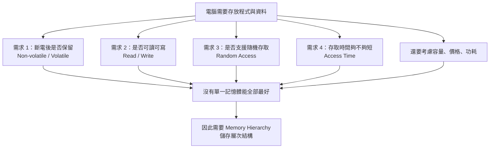
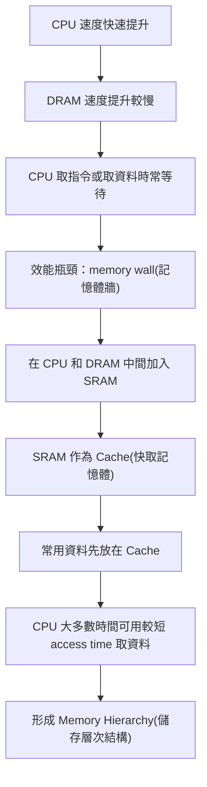

## ⭐記憶體的需求與特性 — 為什麼電腦不能只靠一種記憶體？

講義位置：PDF viewer page 2 ~ PDF viewer page 6／輔助：Chapter 5 — Memory — 2 ~ 6 

### 1. Ch5 一開始真正想解決的問題

Ch5 不是只在背 `SRAM`、`DRAM`、`Disk` 這些名詞。它真正想問的是：

電腦需要「放資料」的地方，但為什麼不能只買一種超大、超快、斷電不會不見、又便宜的記憶體，全部事情都靠它？

答案是：現實世界沒有這種完美記憶體。每種儲存元件都在 `speed(速度)`、`capacity(容量)`、`cost(成本)`、`volatility(揮發性)`、`power(功耗)` 之間取捨。所以電腦才會做成 `Memory Hierarchy(儲存層次結構)`。

---

### 2. 馮·諾依曼架構裡，記憶體不是只有主記憶體

講義先用 `Von Neumann Architecture(馮·諾依曼電腦結構)`提醒你：電腦有五大部分：`CA(運算器)`、`CC(控制器)`、`M(記憶體)`、`I(輸入裝置)`、`O(輸出設備)`。圖中也補充：CPU 裡面的 `general-purpose registers(通用暫存器)`雖然屬於運算器，但它也暫時存放資料，所以也可看成一種記憶體；外部記錄介質也有儲存功能。

用生活例子講：

| 電腦元件                 | 像生活中的什麼   | 用途       |
| -------------------- | --------- | -------- |
| `Register(暫存器)`      | 手上正在拿的便條紙 | 最快，但容量極小 |
| `Main Memory(主記憶體)`  | 書桌桌面      | 放正在用的資料  |
| `BIOS chip(BIOS 晶片)` | 開機說明書     | 斷電後仍保留   |
| `Disk(硬碟／儲存裝置)`      | 書櫃或倉庫     | 很大，但慢    |

所以從 Ch5 開始，我們不要把「記憶體」只理解成 RAM。廣義上，只要能存資料，都可放到這個討論裡。

---

### 3. 記憶體的第一個需求：斷電後資料是否還在

講義說，系統通電啟動時，需要有程式和資料已經存在某些記憶體中，而且斷電後也不能遺失，這種叫 `Non-volatile Memory(非揮發性記憶體／非易失性記憶體)`。相反地，斷電後資料會不見的叫 `Volatile Memory(揮發性記憶體)`。主記憶體和 CPU 通用暫存器屬於揮發性；BIOS 晶片和硬碟屬於非揮發性。

最重要的考試句：

| 類型                             | 斷電後資料 | 例子                                       |
| ------------------------------ | ----: | ---------------------------------------- |
| `Volatile Memory(揮發性記憶體)`      |   會消失 | `Register(暫存器)`、`Main Memory(主記憶體／DRAM)` |
| `Non-volatile Memory(非揮發性記憶體)` |  不會消失 | `BIOS chip(BIOS 晶片)`、`Disk(硬碟／儲存裝置)`     |

開機流程的直覺是：CPU 不能一開機就從主記憶體拿完整作業系統，因為主記憶體斷電後是空的；所以它要先從 BIOS 這類非揮發性記憶體開始執行，再把更多程式和資料從硬碟搬到主記憶體。

---

### 4. 第二個需求：可讀可寫，不只是能讀

講義說，電腦中的記憶體最好能 `read and write(可讀又可寫)`。硬碟和主記憶體通常可讀可寫；BIOS 晶片比較接近唯讀，並不是完全不能寫，而是寫入需要特殊設備或特殊流程，不適合頻繁寫入。

考試容易考的陷阱是：

不要把「BIOS 是唯讀」理解成物理上永遠不能改。比較精確的說法是：它不支援一般程式頻繁、方便地寫入。

---

### 5. 第三個需求：Random Access(隨機存取)

`Random Access(隨機存取)`的意思是：存取某個資料所花的時間，理想上不應該跟資料放在哪個位置有關。講義用磁帶當反例：如果要聽第十首歌，必須快轉跳過前九首，這就是位置會影響存取時間。講義也說，硬碟因為有旋轉碟片與機械讀寫頭，尋找資料位置會很慢，所以不像主記憶體那樣適合作為 CPU 直接工作的快速記憶體。

這裡要小心講法：

硬碟在作業系統層面可以指定某個 block 去讀，但物理上讀取時間會受到磁頭位置、旋轉延遲影響。因此在這份講義語境中，它被拿來當「不像 RAM 那樣真正快速隨機存取」的例子。

---

### 6. 第四個需求：Access Time(存取時間)

`Access Time(存取時間)`就是從 CPU 想要資料，到記憶體把資料拿出來所需的時間。講義強調：CPU 很快，所以如果每次存取資料都要等很久，CPU 後續操作就會被卡住。

直覺例子：

CPU 像一個算很快的同學；記憶體像他翻資料的地方。如果資料就在手邊便條紙上，他可以馬上算；如果資料在桌上，還算快；如果資料在地下室倉庫，每算一步都要跑去地下室，整體速度就崩了。

所以 Ch5 後面才會引出 `cache(快取記憶體)`：把常用資料放在比較靠近 CPU、比較快但比較小的地方。

---

### 7. 本輪必背表：記憶體特性七件事

講義 page 5 列出記憶體特性：非易失性、可讀可寫、隨機存取、存取時間、容量、價格、功耗。

| 特性 | English(中文)           | 你要會說的重點           |
| -- | --------------------- | ----------------- |
| 1  | `Volatility(揮發性)`     | 斷電後資料會不會消失        |
| 2  | `Read/Write(可讀可寫)`    | 能不能讀，也能不能方便寫      |
| 3  | `Random Access(隨機存取)` | 存取時間是否與資料位置無關     |
| 4  | `Access Time(存取時間)`   | CPU 要等多久才能拿到資料    |
| 5  | `Capacity(容量)`        | 能放多少資料            |
| 6  | `Cost(價格／成本)`         | 每 byte 或每 MB 成本多少 |
| 7  | `Power(功耗)`           | 使用時耗電多少           |

最短記法：

> 記憶體設計不是只問「多大」，而是同時問：會不會斷電消失、能不能讀寫、能不能快速隨機存取、夠不夠快、夠不夠大、夠不夠便宜、功耗能不能接受。

---

### 8. 本輪核心流程圖

---

### 9. 常見錯法

| 錯誤說法                  | 為什麼錯 | 正確修正                        |
| --------------------- | ---- | --------------------------- |
| 記憶體就是 RAM             | 太窄   | 暫存器、主記憶體、BIOS、硬碟都可從儲存功能角度討論 |
| 主記憶體斷電後資料還在           | 錯    | 主記憶體通常是揮發性                  |
| BIOS 完全不能寫            | 太絕對  | 講義說 BIOS 寫入麻煩，不支援經常性寫入      |
| 硬碟跟 RAM 一樣適合 CPU 直接存取 | 錯    | 硬碟機械延遲高，存取時間遠慢於主記憶體         |
| 只要容量大就是好記憶體           | 錯    | 還要看速度、成本、功耗、揮發性等取捨          |

## ⭐CPU 和記憶體速度落差 — 為什麼需要 Cache 和 Memory Hierarchy？

講義位置：PDF viewer page 7 ~ PDF viewer page 14／輔助：Chapter 5 — Memory — 7 ~ 14

### 1. 這一段真正想解決什麼問題？

上一段我們知道：理想記憶體要快、要大、要便宜、要可讀寫、最好還不要斷電消失。

但現實是：

| 元件                       | 優點         | 缺點                 |
| ------------------------ | ---------- | ------------------ |
| `CPU register(暫存器)`      | 超快         | 超小、昂貴              |
| `SRAM(Cache 用)`          | 很快         | 比 DRAM 貴很多、容量不可能太大 |
| `DRAM(Main Memory 主記憶體)` | 容量較大、價格可接受 | 比 CPU 慢很多          |
| `Disk(硬碟／儲存裝置)`          | 超大、便宜、非揮發  | 慢非常多               |

所以這一段的核心問題是：

> CPU 越來越快，但 DRAM 和 Disk 沒有跟上 CPU 速度。那 CPU 要怎麼避免一直等記憶體？

答案就是：**在 CPU 和慢速大容量記憶體之間，加上比較快但比較小的中間層，也就是 `Cache(快取記憶體)`，最後形成 `Memory Hierarchy(儲存層次結構)`。**

---

### 2. CPU 速度成長遠快於 DRAM 和 Disk

講義 page 7 的表格把 CPU、DRAM、Disk 從 1980 到 2010 的變化放在一起比較。CPU 的 `cycle time(時脈週期時間)` 從 1000 ns 變成 0.4 ns；如果考慮 2010 年四核心，`effective cycle time(有效週期時間)` 甚至可看成 0.1 ns。相對地，DRAM access time 從 375 ns 變成 40 ns，只提升 9 倍；Disk access time 從 87 ms 變成 3 ms，只提升 29 倍，而且毫秒和奈秒差了 100 萬倍。

這裡最容易考的是「倍數落差」：

| 項目                       |    1980 |   2010 |    改善倍率 |
| ------------------------ | ------: | -----: | ------: |
| CPU cycle time           | 1000 ns | 0.4 ns |  2500 倍 |
| CPU effective cycle time | 1000 ns | 0.1 ns | 10000 倍 |
| DRAM access time         |  375 ns |  40 ns |     9 倍 |
| Disk access time         |   87 ms |   3 ms |    29 倍 |

注意：
CPU 的速度提升是「週期時間變短」。DRAM/Disk 的速度提升是「access time 變短」。講義重點不是要你死背所有數字，而是要你看出：**CPU 進步太快，記憶體跟不上。**

---

### 3. 為什麼 CPU 會被記憶體拖慢？

假設 CPU 執行一條指令，需要：

1. `Fetch(取指令)`：從記憶體拿指令。
2. `Decode(解碼)`：CPU 內部解碼。
3. `Address generation(位址生成)`：算資料在哪裡。
4. `Execute(執行)`：做運算或取資料。
5. `Write-back(回寫)`：結果寫回。

如果沒有 `Cache(快取記憶體)`，CPU 直接去等 DRAM。講義用例子說：如果 DRAM 需要約 100 個 CPU cycle 才回資料，那取指令等一次、讀 operand 又等一次，一條指令大部分時間都在等記憶體。這就是 `memory wall(記憶體牆)` 的直覺：CPU 很會算，但一直在等資料。

生活化例子：

CPU 像很快的廚師，DRAM 像倉庫。如果每炒一道菜都要跑到倉庫拿蔥、拿鹽、拿鍋子，廚師再快也沒用。`Cache` 就像把常用食材先放在料理台旁邊。

---

### 4. Cache 的角色：用 SRAM 擋在 CPU 和 DRAM 中間

`Cache(快取記憶體)` 通常由 `SRAM(Static RAM，靜態隨機存取記憶體)` 做成。SRAM 比 DRAM 快很多，所以適合放在 CPU 附近，存放 CPU 最近或最常用的資料與指令。

但 SRAM 不能直接取代 DRAM，原因不是速度，而是：

| 比較   | SRAM  | DRAM        |
| ---- | ----- | ----------- |
| 速度   | 快     | 慢           |
| 成本   | 高     | 低           |
| 容量密度 | 低     | 高           |
| 常見用途 | Cache | Main Memory |

講義後面在 page 14 收束成 `Memory Hierarchy(儲存層次結構)`：越往上容量越小、速度越快、單位成本越高；越往下容量越大、速度越慢、單位成本越低。

---

### 5. Memory Hierarchy 的核心不變量

你可以把 `Memory Hierarchy(儲存層次結構)` 背成這個方向：

| 層級  | 典型技術                | 容量 | 速度 | 單位成本 |
| --- | ------------------- | -: | -: | ---: |
| 最上層 | `Register(暫存器)`     | 最小 | 最快 |   最高 |
| 中上層 | `Cache(SRAM)`       |  小 |  快 |    高 |
| 中下層 | `Main Memory(DRAM)` | 中大 | 中慢 |   中低 |
| 最下層 | `Disk/SSD(本地二級儲存)`  | 最大 | 最慢 |   最低 |

///danger|上面表格容量的意思是同體積的記憶體容量嗎？
這裡的 `capacity(容量)` 指的是該記憶體層級通常能提供的總儲存量，不是嚴格的同體積容量。若討論同體積或同面積能放多少資料，應稱為 `density(密度)`。Memory hierarchy 越往上容量小、速度快、單位成本高；越往下容量大、速度慢、單位成本低。
///

最重要的規則：

> 往上：更快、更小、更貴。
> 往下：更慢、更大、更便宜。

所以現代電腦不是選一種完美記憶體，而是用很多層記憶體合作：常用資料放上面，不常用資料放下面。

---

### 6. 本輪核心流程圖

---

### 7. 考試最短記法

這一段你最少要會輸出：

> CPU 速度提升遠快於 DRAM 和 Disk，導致 CPU 存取記憶體時會大量等待。為了縮短平均存取時間，系統在 CPU 和 DRAM 之間加入較快但較小、較貴的 SRAM 作為 Cache；再往下用較慢但較大、較便宜的 DRAM 和 Disk，形成 Memory Hierarchy。

英文考試版：

> CPU speed has improved much faster than DRAM and disk access time, so the CPU may spend many cycles waiting for memory. To reduce the average memory access time, computers place a small and fast SRAM cache between the CPU and DRAM, while using larger and cheaper but slower memories at lower levels. This forms a memory hierarchy.

---

### 8. 常見錯法

| 錯誤說法                      | 為什麼錯                  | 正確觀念                         |
| ------------------------- | --------------------- | ---------------------------- |
| DRAM 比 CPU 慢一點而已          | 錯，差距可能是數十到上百個 cycle   | CPU 速度成長遠快於 DRAM             |
| Disk 慢但容量大，所以可以直接餵 CPU    | 錯，Disk access time 太長 | Disk 適合大量長期儲存，不適合 CPU 直接高頻存取 |
| SRAM 很快，所以應該全部主記憶體都用 SRAM | 忽略成本與容量               | SRAM 適合做小容量 Cache            |
| Memory hierarchy 只是容量排序   | 不完整                   | 它同時是速度、容量、成本的取捨              |
| Cache 是為了讓容量變大            | 錯                     | Cache 主要是為了降低平均存取時間          |

## ⭐SRAM 和 DRAM — 為什麼 Cache 用 SRAM，主記憶體用 DRAM？

講義位置：PDF viewer page 15 ~ PDF viewer page 29／輔助：Chapter 5 — Memory — 15 ~ 29

### 1. 這一段真正想解決什麼問題？

前面你已經知道結論：

| 記憶體                           | 速度 | 價格 | 常見用途        |
| ----------------------------- | -: | -: | ----------- |
| `SRAM(Static RAM，靜態隨機存取記憶體)`  |  快 |  貴 | Cache       |
| `DRAM(Dynamic RAM，動態隨機存取記憶體)` |  慢 | 便宜 | Main Memory |

但講義 page 15 說得很清楚：只背「SRAM 快、DRAM 慢；SRAM 貴、DRAM 便宜」很容易，真正重要的是知道**為什麼**。所以這一段開始從電路等級解釋差異。

核心答案是：

> SRAM 用比較複雜的電路穩定保存 1 bit，所以快，但佔面積、成本高；DRAM 用電容存 1 bit，所以密度高、便宜，但電容會漏電，需要 refresh，因此比較慢。

---

### 2. SRAM 的「Static」是什麼意思？

`Static(靜態)`不是指斷電後資料還在。這是最容易錯的地方。

講義 page 15 說，SRAM 的「靜態」是指：**只要保持通電，裡面的資料就可以恆常保持**；但如果電力供應停止，SRAM 裡的資料還是會消失，所以 SRAM 仍然是 `volatile memory(揮發性記憶體)`。

所以正確觀念是：

| 問題                   | SRAM 的答案 |
| -------------------- | -------- |
| 通電時資料是否穩定？           | 是        |
| 是否需要定期 refresh？      | 不需要      |
| 斷電後資料是否保留？           | 不保留      |
| 是否為 volatile memory？ | 是        |

最短記法：

> Static 只表示「通電時不用 refresh 就能維持」，不表示「斷電不會消失」。

///danger|DRAM 需要 refresh，refresh 是啥？
refresh(刷新) 是指 DRAM 定期把原本儲存的 0/1 資料重新恢復／寫回，特別是把快漏電的 1 重新補電，避免資料因電容漏電而消失。
///

---

### 3. SRAM 為什麼快但貴？

SRAM 的 1 bit 儲存單元通常需要多個電晶體。講義 page 16~17 強調：SRAM 的優點是通電狀況下資料不會消失；缺點是需要六個電晶體合在一起才能保存 1 bit，並且它的基本單元有 `standby(閒置)`、`reading(讀取)`、`writing(寫入)`三種狀態。 

直覺可以這樣想：

SRAM 像是用一組穩固的機械夾子夾住資料。夾得很穩，所以讀寫快、不用一直補救；但每個 bit 都要很多零件，所以很佔空間，也很貴。

因此 SRAM 的結果是：

| 特性         | 原因            |
| ---------- | ------------- |
| 速度快        | 電路可以穩定且快速讀寫   |
| 不需 refresh | 通電時狀態可維持      |
| 集成度低       | 1 bit 需要較多電晶體 |
| 價格高        | 同容量需要更多硬體資源   |
| 功耗較高       | 電晶體數多、電路較複雜   |

講義 page 24 直接整理 SRAM 的特點：優點是速度較快；缺點是集成度低、功耗較高、價格較高；現代 CPU 中的快取記憶體通常使用 SRAM。

---

### 4. DRAM 的「Dynamic」是什麼意思？

`Dynamic(動態)`的意思是：資料不能安安穩穩一直放著，必須週期性維護。

DRAM 用 `capacitor(電容)`表示 1 bit：有電荷代表一種值，沒有電荷代表另一種值。但電容會漏電，所以經過一段時間後，原本代表資料的電荷會流失；因此 DRAM 必須定期 `refresh(刷新)`，把原本代表 1 的電容重新補電。講義 page 27 就是在說這個 refresh 機制。

直覺例子：

DRAM 像一個會漏水的水杯。杯子有水代表 1，沒水代表 0。因為水會慢慢漏掉，所以系統要定期巡一遍，把應該有水的杯子補滿。這個「補水」就是 `refresh(刷新)`。

---

### 5. DRAM 為什麼慢但便宜？

DRAM 的 1 bit 儲存單元比 SRAM 簡單很多，主要靠電容儲存電荷，所以可以做得很密、很大、很便宜；但因為電容漏電，必須 refresh，而且讀寫機制也比較受限制，所以速度較慢。

///danger|為何 refresh 會使 RAM 速度變慢？

refresh(刷新) 會讓 DRAM 變慢，是因為 DRAM 必須定期花時間去維護原本資料；在某些 refresh 時段，記憶體不能正常服務 CPU 的讀寫請求，等於佔用了記憶體頻寬與時間。

///

講義 page 28 整理 DRAM：優點是集成度高、功耗較低、價格較低；缺點是速度較慢、需要定時刷新；現代 PC 大多採用 DRAM 作為主記憶體。

| 特性         | 原因                 |
| ---------- | ------------------ |
| 集成度高       | 1 bit 儲存單元簡單       |
| 容量容易做大     | 同面積可塞更多 bit        |
| 價格低        | 同容量成本較低            |
| 功耗較低       | 儲存單元較簡單            |
| 速度較慢       | 存取與 refresh 造成額外負擔 |
| 需要 refresh | 電容會漏電              |

---

### 6. SRAM vs DRAM：考試必背表

講義 page 29 的總表非常重要：DRAM 的儲存單元是電容，SRAM 是雙穩態觸發器；DRAM 集成度高、功耗低、價格低、速度慢、需要刷新；SRAM 集成度低、功耗高、價格高、速度快、不需要刷新。

| 比較項目 | `DRAM(動態 RAM)` | `SRAM(靜態 RAM)` |
| ---- | -------------- | -------------- |
| 儲存單元 | 電容             | 雙穩態觸發器／多電晶體電路  |
| 集成度  | 高              | 低              |
| 功耗   | 低              | 高              |
| 價格   | 低              | 高              |
| 速度   | 慢              | 快              |
| 刷新   | 有              | 無              |
| 常見用途 | 主記憶體           | Cache          |

你考試時可以這樣寫：

> SRAM is fast but expensive and low-density, so it is used for cache. DRAM is slower but cheaper and high-density, so it is used for main memory. DRAM needs refresh because it stores data as charge in capacitors, while SRAM can keep its state as long as power is supplied.

---

### 7. 最容易錯的三句話

| 錯誤說法                    | 錯在哪          | 正確說法                            |
| ----------------------- | ------------ | ------------------------------- |
| SRAM 是 non-volatile     | 錯，SRAM 斷電會消失 | SRAM 是 volatile，只是通電時不用 refresh |
| DRAM 慢是因為容量大            | 不精確          | DRAM 慢主要和電容儲存、漏電、refresh、讀寫機制有關 |
| SRAM 比較好，所以主記憶體都該用 SRAM | 忽略成本與密度      | SRAM 快但貴且容量密度低，只適合做小容量 Cache    |

### SRAM 結構與原理

///danger|SRAM 結構與原理

#### 1. 口語化小整理

6T SRAM 可以想成一個很小的「雙邊互鎖開關」。

它裡面有兩個值：

`Q` 和 `Q̅`

這兩個一定相反：

`Q = 0` 時，`Q̅ = 1`
`Q = 1` 時，`Q̅ = 0`

---

#### 2. 維持資料時

假設現在存的是：

`Q = 0`
`Q̅ = 1`

那可以口語化想成：

`Q` 這邊被 `GND` 拉住，所以它維持 `0`。
`Q̅` 這邊被 `VDD` 拉住，所以它維持 `1`。

而且這兩邊不是各自獨立維持，而是互相鎖住。

`Q = 0` 會讓左邊的某些開關狀態固定，讓 `Q̅` 繼續被拉到 `1`。
`Q̅ = 1` 也會讓右邊的某些開關狀態固定，讓 `Q` 繼續被拉到 `0`。

所以比較口語可以說：

> `Q = 0` 被 `GND` 維持，`Q̅ = 1` 被 `VDD` 維持，兩邊互相確認對方的狀態，所以資料會被鎖住。

---

#### 3. 修改資料時

假設原本是：

`Q = 0`
`Q̅ = 1`

現在想改成：

`Q = 1`
`Q̅ = 0`

這時會打開 `WL`，讓外面的 `BL/BL̅` 接進來。

你可以口語化記成：

`WL = 1` 會打開 `M5/M6`。
`BL = 1` 透過 `M6` 去拉高 `Q`。
`BL̅ = 0` 透過 `M5` 去拉低 `Q̅`。

所以寫入時是：

> 外面的 `BL/BL̅` 進來「硬改」裡面的 `Q/Q̅`。

但不要說「`BL` 電壓比 `GND` 大，所以一定壓過」。
比較正確是：

> 寫入電路夠強，所以可以暫時壓過原本 cell 裡面維持資料的力量。

也就是：

> 不是只比電壓大小，而是比誰比較有力。

---

#### 4. 讀取資料時

讀取跟寫入剛好反過來。

寫入是：

> `BL/BL̅` 改 `Q/Q̅`

讀取是：

> `Q/Q̅` 影響 `BL/BL̅`

讀取前，會先把兩邊都拉高：

`BL = 1`
`BL̅ = 1`

然後：

`WL = 1`

這時 `M5/M6` 打開，cell 連到 `BL/BL̅`。

如果某一邊裡面存的是 `0`，那一邊就會有路徑通到 `GND`，所以那條 bitline 會被稍微拉低。

例如：

如果 `Q = 0`，那 `BL` 那邊會被稍微拉低。
如果 `Q̅ = 0`，那 `BL̅` 那邊會被稍微拉低。

所以讀取時可以口語化說：

> 兩邊一開始都拉成 `1`，然後看哪一邊掉比較多。掉比較多的那邊，就是原本存 `0` 的那邊。

---

#### 5. 最短總結

維持資料：

> `Q` 和 `Q̅` 一邊被 `GND` 拉住，一邊被 `VDD` 拉住，兩邊互相鎖住，所以資料不會自己變。

寫入資料：

> `WL = 1` 打開 `M5/M6`，讓 `BL/BL̅` 接進來。`BL/BL̅` 夠強時，就能把原本的 `Q/Q̅` 改掉。

讀取資料：

> 先把 `BL` 和 `BL̅` 都拉成 `1`，再打開 `WL`。哪一邊原本接到 `0`，哪一邊就會被 `GND` 稍微拉低。最後看哪邊掉比較多，就知道資料是 `0` 還是 `1`。

最口語一句：

> **維持是自己鎖住；寫入是外面硬改裡面；讀取是裡面讓外面其中一邊稍微掉下來。**

///