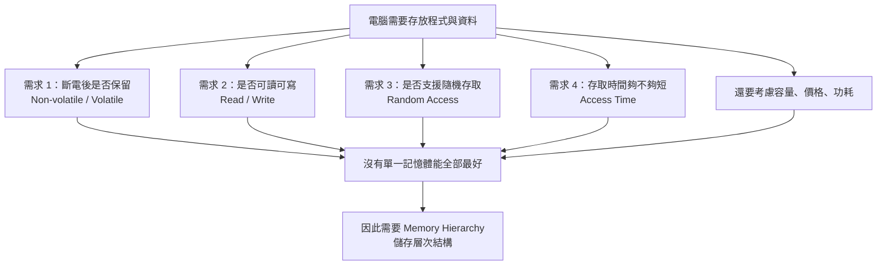

## ⭐記憶體的需求與特性 — 為什麼電腦不能只靠一種記憶體？

講義位置：PDF viewer page 2 ~ PDF viewer page 6／輔助：Chapter 5 — Memory — 2 ~ 6 

### 1. Ch5 一開始真正想解決的問題

Ch5 不是只在背 `SRAM`、`DRAM`、`Disk` 這些名詞。它真正想問的是：

電腦需要「放資料」的地方，但為什麼不能只買一種超大、超快、斷電不會不見、又便宜的記憶體，全部事情都靠它？

答案是：現實世界沒有這種完美記憶體。每種儲存元件都在 `speed(速度)`、`capacity(容量)`、`cost(成本)`、`volatility(揮發性)`、`power(功耗)` 之間取捨。所以電腦才會做成 `Memory Hierarchy(儲存層次結構)`。

---

### 2. 馮·諾依曼架構裡，記憶體不是只有主記憶體

講義先用 `Von Neumann Architecture(馮·諾依曼電腦結構)`提醒你：電腦有五大部分：`CA(運算器)`、`CC(控制器)`、`M(記憶體)`、`I(輸入裝置)`、`O(輸出設備)`。圖中也補充：CPU 裡面的 `general-purpose registers(通用暫存器)`雖然屬於運算器，但它也暫時存放資料，所以也可看成一種記憶體；外部記錄介質也有儲存功能。

用生活例子講：

| 電腦元件                 | 像生活中的什麼   | 用途       |
| -------------------- | --------- | -------- |
| `Register(暫存器)`      | 手上正在拿的便條紙 | 最快，但容量極小 |
| `Main Memory(主記憶體)`  | 書桌桌面      | 放正在用的資料  |
| `BIOS chip(BIOS 晶片)` | 開機說明書     | 斷電後仍保留   |
| `Disk(硬碟／儲存裝置)`      | 書櫃或倉庫     | 很大，但慢    |

所以從 Ch5 開始，我們不要把「記憶體」只理解成 RAM。廣義上，只要能存資料，都可放到這個討論裡。

---

### 3. 記憶體的第一個需求：斷電後資料是否還在

講義說，系統通電啟動時，需要有程式和資料已經存在某些記憶體中，而且斷電後也不能遺失，這種叫 `Non-volatile Memory(非揮發性記憶體／非易失性記憶體)`。相反地，斷電後資料會不見的叫 `Volatile Memory(揮發性記憶體)`。主記憶體和 CPU 通用暫存器屬於揮發性；BIOS 晶片和硬碟屬於非揮發性。

最重要的考試句：

| 類型                             | 斷電後資料 | 例子                                       |
| ------------------------------ | ----: | ---------------------------------------- |
| `Volatile Memory(揮發性記憶體)`      |   會消失 | `Register(暫存器)`、`Main Memory(主記憶體／DRAM)` |
| `Non-volatile Memory(非揮發性記憶體)` |  不會消失 | `BIOS chip(BIOS 晶片)`、`Disk(硬碟／儲存裝置)`     |

開機流程的直覺是：CPU 不能一開機就從主記憶體拿完整作業系統，因為主記憶體斷電後是空的；所以它要先從 BIOS 這類非揮發性記憶體開始執行，再把更多程式和資料從硬碟搬到主記憶體。

---

### 4. 第二個需求：可讀可寫，不只是能讀

講義說，電腦中的記憶體最好能 `read and write(可讀又可寫)`。硬碟和主記憶體通常可讀可寫；BIOS 晶片比較接近唯讀，並不是完全不能寫，而是寫入需要特殊設備或特殊流程，不適合頻繁寫入。

考試容易考的陷阱是：

不要把「BIOS 是唯讀」理解成物理上永遠不能改。比較精確的說法是：它不支援一般程式頻繁、方便地寫入。

---

### 5. 第三個需求：Random Access(隨機存取)

`Random Access(隨機存取)`的意思是：存取某個資料所花的時間，理想上不應該跟資料放在哪個位置有關。講義用磁帶當反例：如果要聽第十首歌，必須快轉跳過前九首，這就是位置會影響存取時間。講義也說，硬碟因為有旋轉碟片與機械讀寫頭，尋找資料位置會很慢，所以不像主記憶體那樣適合作為 CPU 直接工作的快速記憶體。

這裡要小心講法：

硬碟在作業系統層面可以指定某個 block 去讀，但物理上讀取時間會受到磁頭位置、旋轉延遲影響。因此在這份講義語境中，它被拿來當「不像 RAM 那樣真正快速隨機存取」的例子。

---

### 6. 第四個需求：Access Time(存取時間)

`Access Time(存取時間)`就是從 CPU 想要資料，到記憶體把資料拿出來所需的時間。講義強調：CPU 很快，所以如果每次存取資料都要等很久，CPU 後續操作就會被卡住。

直覺例子：

CPU 像一個算很快的同學；記憶體像他翻資料的地方。如果資料就在手邊便條紙上，他可以馬上算；如果資料在桌上，還算快；如果資料在地下室倉庫，每算一步都要跑去地下室，整體速度就崩了。

所以 Ch5 後面才會引出 `cache(快取記憶體)`：把常用資料放在比較靠近 CPU、比較快但比較小的地方。

---

### 7. 本輪必背表：記憶體特性七件事

講義 page 5 列出記憶體特性：非易失性、可讀可寫、隨機存取、存取時間、容量、價格、功耗。

| 特性 | English(中文)           | 你要會說的重點           |
| -- | --------------------- | ----------------- |
| 1  | `Volatility(揮發性)`     | 斷電後資料會不會消失        |
| 2  | `Read/Write(可讀可寫)`    | 能不能讀，也能不能方便寫      |
| 3  | `Random Access(隨機存取)` | 存取時間是否與資料位置無關     |
| 4  | `Access Time(存取時間)`   | CPU 要等多久才能拿到資料    |
| 5  | `Capacity(容量)`        | 能放多少資料            |
| 6  | `Cost(價格／成本)`         | 每 byte 或每 MB 成本多少 |
| 7  | `Power(功耗)`           | 使用時耗電多少           |

最短記法：

> 記憶體設計不是只問「多大」，而是同時問：會不會斷電消失、能不能讀寫、能不能快速隨機存取、夠不夠快、夠不夠大、夠不夠便宜、功耗能不能接受。

---

### 8. 本輪核心流程圖

---

### 9. 常見錯法

| 錯誤說法                  | 為什麼錯 | 正確修正                        |
| --------------------- | ---- | --------------------------- |
| 記憶體就是 RAM             | 太窄   | 暫存器、主記憶體、BIOS、硬碟都可從儲存功能角度討論 |
| 主記憶體斷電後資料還在           | 錯    | 主記憶體通常是揮發性                  |
| BIOS 完全不能寫            | 太絕對  | 講義說 BIOS 寫入麻煩，不支援經常性寫入      |
| 硬碟跟 RAM 一樣適合 CPU 直接存取 | 錯    | 硬碟機械延遲高，存取時間遠慢於主記憶體         |
| 只要容量大就是好記憶體           | 錯    | 還要看速度、成本、功耗、揮發性等取捨          |

///danger|重點
PEICD100
///