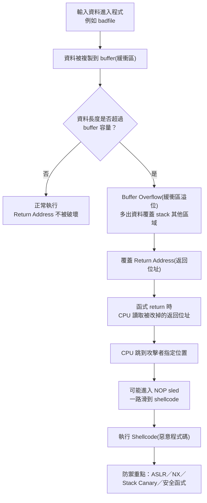

## ⭐Buffer Overflow Attack — 這個 Lab 在解決什麼問題？

講義位置：PDF viewer page 1 ~ PDF viewer page 2

### 1. 這章真正想問的是什麼？

`Buffer Overflow Attack(緩衝區溢位攻擊)` 這個 Lab 的核心問題是：

程式把太多資料塞進太小的記憶體空間時，為什麼不只是「資料壞掉」，而是可能讓 CPU 跳去執行攻擊者準備的程式碼？

用生活例子想：你有一個只能放 100 張紙的抽屜，但有人硬塞 300 張紙。多出來的 200 張不會消失，而是擠到隔壁抽屜。如果隔壁抽屜剛好放的是「等等要去哪裡」的紙條，那攻擊者就能把那張紙條改成：「不要回原本地方，跳去我指定的地方。」

在程式裡，這張「等等要去哪裡」的紙條就是 `Return Address(返回位址)`。

---

### 2. 這個 Lab 的五段主線

PDF viewer page 2 的 Outline(大綱) 把整個 Lab 分成五段：`Understanding of Stack Layout`、`Vulnerable code`、`Challenges in exploitation`、`Shellcode`、`Countermeasures` 

| 順序 | 講義主題                            | 中文理解              | 這段在回答什麼問題？                                                           |
| -: | ------------------------------- | ----------------- | -------------------------------------------------------------------- |
|  1 | `Understanding of Stack Layout` | 先看 stack(堆疊) 長什麼樣 | `buffer`、local variable(區域變數)、old frame pointer、return address 各在哪裡？ |
|  2 | `Vulnerable code`               | 找出有漏洞的程式          | 哪一行程式讓資料可能超出 buffer？                                                 |
|  3 | `Challenges in exploitation`    | 攻擊不是只要塞爆就會成功      | 要算 offset(偏移距離)、找 shellcode address(惡意程式碼位址)、避開 `0x00` 等問題           |
|  4 | `Shellcode`                     | 攻擊者想讓 CPU 執行的程式碼  | CPU 被導去執行什麼？為什麼會放在輸入資料裡？                                             |
|  5 | `Countermeasures`               | 防禦方法              | ASLR、NX/DEP、Stack Canary、安全函式如何讓攻擊失敗？                                |

考試最可能考的不是「背攻擊程式」，而是要你看懂：資料怎麼從 `buffer` 溢出去、怎麼覆蓋 `Return Address`、為什麼 `NOP sled` 增加命中率、以及防禦機制各自擋哪一步。

---

### 3. 整章流程圖

這張圖先當整章地圖。接下來我們會依講義主線，從 PDF viewer page 3 的 `Program Memory Stack` 開始，逐步補上每一格的細節。

---

### 4. 這章必背的最短主線

`Buffer Overflow Attack(緩衝區溢位攻擊)` 的最短考試版邏輯是：

資料太長 → 超過 `buffer` → 覆蓋 stack 上的 `Return Address` → 函式結束時 CPU 依照被覆蓋的 `Return Address` 跳轉 → 若跳到 `NOP sled` 或 `shellcode`，就可能執行攻擊者程式碼 → 防禦靠 ASLR、NX/DEP、Stack Canary、安全函式降低或阻止成功率。

---

### 5. 本輪先不要混淆的三件事

第一，`Buffer Overflow(緩衝區溢位)` 本身只是「資料寫超界」。它不等於攻擊一定成功。

第二，覆蓋 `Return Address(返回位址)` 是控制 CPU 下一步去哪裡的關鍵，但就算蓋到 return address，也可能因為地址猜錯、跳到非法位置、NX 禁止執行等原因失敗。

第三，`NOP sled(NOP 雪橇)` 的作用不是惡意程式本身，而是提高跳轉命中率。真正要執行的是後面的 `Shellcode(殼層碼／攻擊程式碼)`。
