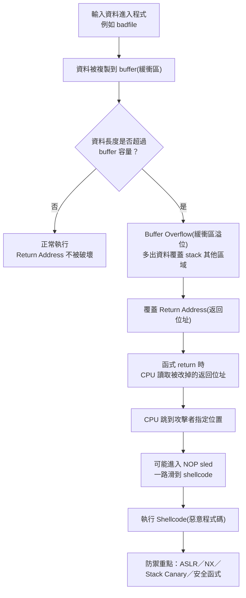
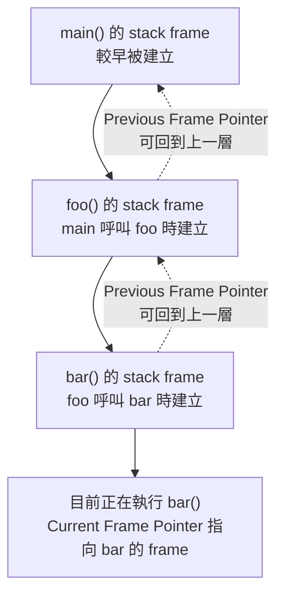
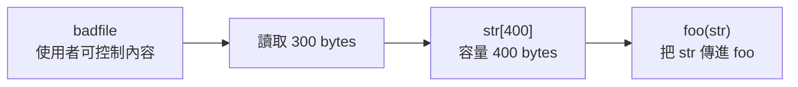
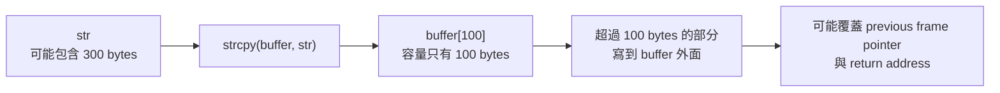

## ⭐如果考試問"buffer overflow 是什麼"，要怎麼回答

///danger|如果考試問"buffer overflow 是什麼"，要怎麼回答
Buffer overflow(緩衝區溢位) 是指程式把超過 buffer(緩衝區) 容量的資料寫進固定大小的記憶體區塊，導致多出來的資料覆蓋到相鄰的記憶體內容。
///


## ⭐Buffer Overflow Attack — 這個 Lab 在解決什麼問題？

講義位置：PDF viewer page 1 ~ PDF viewer page 2

### 1. 這章真正想問的是什麼？

`Buffer Overflow Attack(緩衝區溢位攻擊)` 這個 Lab 的核心問題是：

程式把太多資料塞進太小的記憶體空間時，為什麼不只是「資料壞掉」，而是可能讓 CPU 跳去執行攻擊者準備的程式碼？

用生活例子想：你有一個只能放 100 張紙的抽屜，但有人硬塞 300 張紙。多出來的 200 張不會消失，而是擠到隔壁抽屜。如果隔壁抽屜剛好放的是「等等要去哪裡」的紙條，那攻擊者就能把那張紙條改成：「不要回原本地方，跳去我指定的地方。」

在程式裡，這張「等等要去哪裡」的紙條就是 `Return Address(返回位址)`。

---

### 2. 這個 Lab 的五段主線

PDF viewer page 2 的 Outline(大綱) 把整個 Lab 分成五段：`Understanding of Stack Layout`、`Vulnerable code`、`Challenges in exploitation`、`Shellcode`、`Countermeasures` 

| 順序 | 講義主題                            | 中文理解              | 這段在回答什麼問題？                                                           |
| -: | ------------------------------- | ----------------- | -------------------------------------------------------------------- |
|  1 | `Understanding of Stack Layout` | 先看 stack(堆疊) 長什麼樣 | `buffer`、local variable(區域變數)、old frame pointer、return address 各在哪裡？ |
|  2 | `Vulnerable code`               | 找出有漏洞的程式          | 哪一行程式讓資料可能超出 buffer？                                                 |
|  3 | `Challenges in exploitation`    | 攻擊不是只要塞爆就會成功      | 要算 offset(偏移距離)、找 shellcode address(惡意程式碼位址)、避開 `0x00` 等問題           |
|  4 | `Shellcode`                     | 攻擊者想讓 CPU 執行的程式碼  | CPU 被導去執行什麼？為什麼會放在輸入資料裡？                                             |
|  5 | `Countermeasures`               | 防禦方法              | ASLR、NX/DEP、Stack Canary、安全函式如何讓攻擊失敗？                                |

考試最可能考的不是「背攻擊程式」，而是要你看懂：資料怎麼從 `buffer` 溢出去、怎麼覆蓋 `Return Address`、為什麼 `NOP sled` 增加命中率、以及防禦機制各自擋哪一步。

---

### 3. 整章流程圖



這張圖先當整章地圖。接下來我們會依講義主線，從 PDF viewer page 3 的 `Program Memory Stack` 開始，逐步補上每一格的細節。

---

### 4. 這章必背的最短主線

`Buffer Overflow Attack(緩衝區溢位攻擊)` 的最短考試版邏輯是：

資料太長 → 超過 `buffer` → 覆蓋 stack 上的 `Return Address` → 函式結束時 CPU 依照被覆蓋的 `Return Address` 跳轉 → 若跳到 `NOP sled` 或 `shellcode`，就可能執行攻擊者程式碼 → 防禦靠 ASLR、NX/DEP、Stack Canary、安全函式降低或阻止成功率。

---

### 5. 本輪先不要混淆的三件事

第一，`Buffer Overflow(緩衝區溢位)` 本身只是「資料寫超界」。它不等於攻擊一定成功。

第二，覆蓋 `Return Address(返回位址)` 是控制 CPU 下一步去哪裡的關鍵，但就算蓋到 return address，也可能因為地址猜錯、跳到非法位置、NX 禁止執行等原因失敗。

第三，`NOP sled(NOP 雪橇)` 的作用不是惡意程式本身，而是提高跳轉命中率。真正要執行的是後面的 `Shellcode(殼層碼／攻擊程式碼)`。


## ⭐Program Memory Stack — 為什麼 buffer overflow 會碰到 Return Address？

講義位置：PDF viewer page 3 ~ PDF viewer page 6

### 1. 先看整個程式的記憶體地圖

PDF viewer page 3 的圖把一個程式的記憶體大致分成幾段：`Text segment(程式碼區段)`、`Data segment(資料區段)`、`BSS segment(未初始化資料區段)`、`Heap(堆積區)`、`Stack(堆疊區)`。講義圖中也用 `x`、`y`、`a, b, ptr`、以及 `ptr points to the memory here` 來示範不同變數會落在哪裡。

最重要的對應如下：

| 記憶體區段                   | 放什麼                                                     | 講義例子                          | 考試直覺                    |
| ----------------------- | ------------------------------------------------------- | ----------------------------- | ----------------------- |
| `Text segment(程式碼區段)`   | 編譯後的 machine code(機器碼)                                  | 程式指令本身                        | CPU 要執行的「劇本」            |
| `Data segment(資料區段)`    | 已初始化的 global/static 變數                                  | `int x = 100;`                | 一開始就有值的全域資料             |
| `BSS segment(未初始化資料區段)` | 未初始化或預設為 0 的 global/static 變數                           | `static int y;`               | 有保留空間，但還沒明確給值           |
| `Heap(堆積區)`             | 動態配置的記憶體                                                | `malloc(2*sizeof(int))` 配出的空間 | 程式執行中向系統借的空間            |
| `Stack(堆疊區)`            | function call(函式呼叫)、local variable(區域變數)、return address | `a`、`b`、`ptr`                 | buffer overflow 最常攻擊的地方 |

這裡最容易搞混的是 `ptr`：`ptr` 這個指標變數本身是 local variable，所以在 `Stack(堆疊區)`；但是 `ptr` 指到的那塊 `malloc` 出來的記憶體在 `Heap(堆積區)`。社群討論中，stack、heap 等記憶體位置的用途也常是初學者卡住的點；我們這裡以講義圖為準，不用外部文章取代講義。([Stack Overflow][2])

---

### 2. Stack 為什麼特別危險？

`Stack(堆疊區)` 特別危險，是因為它不只放普通變數，還放「函式結束後要回哪裡」這種控制流程資料。

用生活例子想：
一個 function(函式) 像你去辦公室處理一件事。進辦公室前，你會留一張紙條：「辦完回原本教室。」這張紙條就是 `Return Address(返回位址)`。如果有人把辦公室桌上的資料塞爆，剛好把那張紙條改掉，你辦完後就不是回教室，而是去攻擊者指定的位置。

所以 stack overflow 的真正危險點不是「區域變數壞掉」而已，而是可能改到 `Return Address(返回位址)`。

---

### 3. Function Call Stack 的基本版：`f(1,2)`

PDF viewer page 5 的例子是：

```c
void f(int a, int b)
{
    int x;
}

void main()
{
    f(1,2);
    printf("hello world");
}
```

這段程式呼叫 `f(1,2)` 時，stack 裡會有 `f()` 的 stack frame(堆疊框架)。講義圖顯示 `f()` 的 frame 裡包含：

| 從高位址到低位址的相對順序 | 內容                       | 意義                                        |
| ------------: | ------------------------ | ----------------------------------------- |
|             1 | `Value of b: 2`          | argument(參數) `b`                          |
|             2 | `Value of a: 1`          | argument(參數) `a`                          |
|             3 | `Return Address`         | `f()` 結束後要回 `main()` 的哪一行；圖上指向 `printf()` |
|             4 | `Previous Frame Pointer` | 前一層 function frame 的基準點                   |
|             5 | `Value of x`             | `f()` 的 local variable(區域變數)              |

這張圖是後面 buffer overflow 的核心前置知識：如果 `x` 或某個 local buffer 被寫爆，資料可能往上覆蓋 `Previous Frame Pointer`，再覆蓋 `Return Address`。講義圖明確把 `Return Address` 放在 local variable 上方，並標示它指向 `main()` 裡的 `printf()`。

---

### 4. `%ebp` 是什麼？為什麼參數是 `+8`、`+12`，local variable 是負的？

PDF viewer page 4 用 assembly(組合語言) 形式標出：

```c
void func(int a, int b)
{
    int x, y;

    x = a + b;
    y = a - b;
}
```


| 位置          | 內容  |
| ----------- | --- |
| `%ebp + 12` | `b` |
| `%ebp + 8`  | `a` |
| `%ebp - 8`  | `x` |

`%ebp` 可以先理解成 `base pointer(基準指標)`：它像 stack frame 裡的一條水平基準線。CPU 用它當作參考點，去找「參數在哪裡」與「區域變數在哪裡」。

為什麼參數是正的、local variable 是負的？因為在講義這個 layout 裡：

* argument(參數) 在 `%ebp` 的上方，所以用 `+ offset`。
* local variable(區域變數) 在 `%ebp` 的下方，所以用 `- offset`。
* `Return Address` 通常就在參數與 previous frame pointer 附近，是攻擊者想覆蓋的控制流程資料。

最短記法：

| 問題                     | 答案                                        |
| ---------------------- | ----------------------------------------- |
| `a`、`b` 在哪裡？           | 在 `%ebp` 上方，用正 offset                     |
| `x` 在哪裡？               | 在 `%ebp` 下方，用負 offset                     |
| `Return Address` 有什麼用？ | function return 時決定 CPU 下一步回哪裡            |
| buffer overflow 為什麼危險？ | 因為 local buffer 寫爆後可能覆蓋到 `Return Address` |

///danger|%ebp 到底是啥？

%ebp 是目前 function 的 frame pointer register，通常指向目前 stack frame 中 Previous Frame Pointer 那個位置；而 Previous Frame Pointer 裡存的是上一層 caller function 的 %ebp 值。

---

最直覺圖

```text
高位址
│
│  參數 b                 ← %ebp + 12
│  參數 a                 ← %ebp + 8
│  Return Address         ← %ebp + 4
│  Previous Frame Pointer ← %ebp + 0，也就是 %ebp 指到的基準附近
│  local variable / buffer← %ebp - offset
│
低位址
```

所以它不放在「開頭」，是因為它像尺的 0 點，不一定放在物件最左邊；有時把 0 點放在中間，左右都能量，反而更好用。

---

最短記法

`%ebp` 不是 frame 的起點，而是 frame 的定位基準點。

它通常靠近 `Previous Frame Pointer` 那格；
`%ebp + offset` 找參數和 `Return Address`；
`%ebp - offset` 找 local variable 和 buffer。

///

### 為何需要 Previous Frame Pointer

///danger|為何需要 Previous Frame Pointer

#### 1. 直接答案

需要 `Previous Frame Pointer(前一層框架指標)` 的原因是：**現在這個 function 結束時，要能把 `%ebp` 恢復成 caller(呼叫者) 的 stack frame 基準點**。

也就是說，`Previous Frame Pointer` 是「回上一層 function frame 的路標」。

講義 PDF viewer page 5 的 `Function Call Stack` 圖裡，`f()` 的 stack frame 裡同時放了 `Return Address` 和 `Previous Frame Pointer`；PDF viewer page 6 進一步畫出 `main()` → `foo()` → `bar()` 的 function call chain，顯示目前 frame 會透過 frame pointer 串回上一層 frame。

---

#### 2. 為什麼只有 Return Address 不夠？

`Return Address(返回位址)` 只回答一件事：

「這個 function 結束後，CPU 下一條 instruction(指令) 要去哪裡執行？」

但它沒有回答：

「回去上一層 function 後，上一層 function 的 local variables、arguments 要怎麼找？」

這個工作就是 `Previous Frame Pointer` 的用途。

所以兩個東西分工不同：

| stack 裡的資料               | 解決的問題                                  |
| ------------------------ | -------------------------------------- |
| `Return Address`         | function 結束後，程式碼要跳回哪一行                 |
| `Previous Frame Pointer` | function 結束後，`%ebp` 要恢復成上一層 frame 的基準點 |

---

#### 3. 用 `main()` → `foo()` → `bar()` 想

假設現在正在執行 `bar()`：

* `%ebp` 目前指向 `bar()` 的 frame。
* `bar()` 的 stack frame 裡會存著 `foo()` 的 frame pointer，也就是 `Previous Frame Pointer`。
* 當 `bar()` 結束時，CPU 需要：

  1. 用 `Return Address` 回到 `foo()` 裡呼叫 `bar()` 之後的位置。
  2. 用 `Previous Frame Pointer` 把 `%ebp` 恢復成 `foo()` 的 frame 基準點。

如果沒有 `Previous Frame Pointer`，回到 `foo()` 之後，CPU 可能知道「要執行 foo 的哪一行」，但不知道「foo 的 frame 基準點在哪裡」。這樣 `foo()` 裡的 local variable 和 argument 就不好穩定定位。

---

#### 4. 生活化比喻

`Return Address` 像是：

「我要回到哪個房間？」

`Previous Frame Pointer` 像是：

「回到那個房間後，桌子的基準位置在哪裡？」

只知道房間不夠，因為你還要知道桌上每個抽屜的位置，才能繼續找資料。

---

#### 5. 最短記法

`Previous Frame Pointer` 是用來保存 caller 的 `%ebp`。

當目前 function 結束時：

* `Return Address` 讓 CPU 回到 caller 的程式碼位置。
* `Previous Frame Pointer` 讓 `%ebp` 回到 caller 的 stack frame 基準位置。

所以它的用途不是「決定下一條指令去哪裡」，而是「恢復上一層 function 的 stack frame 定位能力」。

///


///danger|用表格比較一下 return address 和 Previous Frame Pointer 用途


| 比較項目                    | `Return Address(返回位址)`                                                          | `Previous Frame Pointer(前一層框架指標)`                                                          |
| --------------------------- | ----------------------------------------------------------------------------------- | ------------------------------------------------------------------------------------------------- |
| 放在哪裡                    | 放在目前 function 的 `stack frame(堆疊框架)` 裡                                     | 也放在目前 function 的 `stack frame` 裡                                                           |
| 裡面存什麼                  | caller 裡「呼叫完目前 function 後，要回去繼續執行的 instruction address(指令位址)」 | caller 的 `%ebp` 值，也就是上一層 function 的 frame 基準點                                        |
| 主要用途                    | 控制「function return 後，CPU 下一步要去哪裡執行」==也就是"目前函式 return 後要回去執行的下一個位置"==                                  | 恢復「上一層 function 的 stack frame 定位基準」                                                   |
| 解決的問題                  | 程式流程要回到哪一行？ ==(要知道要執行哪一個指令)==                                 | 回到上一層後，要怎麼繼續用 `%ebp + offset` / `%ebp - offset` 找資料？==(要知道拿資料的方式)== |
| 如果被破壞                  | CPU 可能跳到錯誤位置、非法位置，甚至攻擊者的 malicious code(惡意程式碼)             | 上一層 frame 定位會壞掉，可能導致 local variable / argument 定位錯誤、程式崩潰                    |
| 對 buffer overflow 的重要性 | 最關鍵攻擊目標；覆蓋它可以改變 control flow(控制流程)                               | 常會被一起覆蓋，但主要效果是破壞 frame chain(框架鏈)                                              |
| 簡單比喻                    | 「回哪個教室繼續上課」                                                              | 「回到教室後，講桌基準點在哪裡」                                                                  |


///

---

### 5. 多層 function call：`main()` → `foo()` → `bar()`

PDF viewer page 6 顯示 `main()` 呼叫 `foo()`，`foo()` 再呼叫 `bar()` 的 stack layout。圖中每一層 function 都有自己的 stack frame，而且 `Current Frame Pointer(目前 frame pointer)` 指向目前正在執行的那一層。

///danger|`Current Frame Pointer(目前 frame pointer)` 用來存現在函數的 %ebp。
///




這個概念對 buffer overflow 很重要：
每個 function 都像一層便當盒。你在最上層的 function 裡寫爆 buffer，不一定只壞自己的資料；如果寫超過邊界，就可能破壞這層便當盒裡控制「回上一層」的資訊。

---

### 6. 本頁到後面攻擊流程的關係

目前我們還沒有正式進入 `Vulnerable Program(有漏洞的程式)`，所以先不要急著背 `badfile`、`shellcode`、`NOP sled` 的細節。

這一輪你只要先建立以下因果鏈：


考試看到 stack 圖時，要先找三個東西：`buffer`、`Previous Frame Pointer`、`Return Address`。只要你能說出它們的相對位置，就能解釋為什麼 overflow 會變成控制流程攻擊。

### function arguments、local variables 有差嗎？

///danger|function arguments、local variables 有差嗎？

| 比較項目                  | `function arguments(函式參數)`                   | `local variables(區域變數)`              |
| --------------------- | -------------------------------------------- | ------------------------------------ |
| 是誰建立／傳進來的             | caller(呼叫者) 傳給目前 function                    | 目前 function 自己宣告                     |
| 例子                    | `void f(int a, int b)` 裡的 `a`、`b`            | `void f(...) { int x; }` 裡的 `x`      |
| 對目前 function 的角色      | 外面給我的輸入資料                                    | 我自己在 function 裡暫時使用的資料               |
| 相對 `%ebp` 的位置         | 通常在 `%ebp` 上方，用 `+ offset` 找                 | 通常在 `%ebp` 下方，用 `- offset` 找         |
| 講義例子                  | `a = %ebp + 8`，`b = %ebp + 12`               | `x = %ebp - 8`                       |
| buffer overflow 中的重要性 | 可能保存傳進來的 pointer 或資料，例如後面 `foo(str)` 的 `str` | 常是 overflow 起點，例如 `char buffer[100]` |


///


///danger|這裡指的 Frame 和 page/frame 的 Frame 不一樣對不對，這邊指的 Frame 是整個函數資料的範圍？
對，完全不一樣。

| 名詞                               | 中文        | 所屬章節概念                  | 意思                                  |
| -------------------------------- | --------- | ----------------------- | ----------------------------------- |
| `stack frame` / `function frame` | 堆疊框架／函數框架 | ch6-Lab buffer overflow | 一次 function call 在 stack 上建立的一塊資料範圍 |
| `page frame`                     | 頁框／實體頁框   | 記憶體管理／virtual memory    | physical memory(實體記憶體) 中固定大小的一頁空間   |

所以你現在這裡看到的 `Frame Pointer`、`Previous Frame Pointer`、`Current Frame Pointer`，全部都是在講 **function call stack(函式呼叫堆疊)**，不是在講 virtual memory 的 page frame。

講義這裡的圖是 `Function Call Stack` 與 `Stack Layout for Function Call Chain`，內容是 `main()`、`foo()`、`bar()` 這種 function call chain，不是 page table 或 physical frame。

///


## ⭐Vulnerable Program — 哪一行程式真的造成 buffer overflow？

講義位置：PDF viewer page 7 ~ PDF viewer page 8

### 1. 這兩頁在解決什麼問題？

前面我們已經知道 stack frame 裡有 local variables、previous frame pointer、return address。現在講義要回答下一個問題：

「哪一種程式寫法，會讓輸入資料從普通資料變成可以覆蓋 stack frame 的危險資料？」

答案就是：把外部可控資料複製進比它小的 local buffer，而且沒有做長度檢查。

在這份 lab 裡，外部資料來自 `badfile`。講義 page 7 說明：程式會從 `badfile` 讀 300 bytes，存進大小為 400 bytes 的 `str`，然後呼叫 `foo(str)`；而且 `badfile` 是由使用者建立，所以內容由使用者控制。

### 2. Page 7：目前還沒有 overflow，因為 `str[400]` 裝得下 300 bytes

PDF viewer page 7 的 main 程式做的事情可以簡化成這條資料流：



這一頁最重要的陷阱是：`fread` 讀 300 bytes 到 `str[400]`，這裡本身不是 overflow，因為 300 bytes 小於 400 bytes。

真正危險的是：這 300 bytes 後面被傳進 `foo(str)`。也就是說，page 7 是「把可控資料送進危險函式」的前半段，不是 overflow 發生的那一行。

### 3. Page 8：真正危險點是 `strcpy(buffer, str)`

PDF viewer page 8 的 `foo()` 裡有：

```c
int foo(char *str)
{
    char buffer[100];

    strcpy(buffer, str);

    return 1;
}
```

這裡 `buffer` 只有 100 bytes，但 `str` 可能帶著從 `badfile` 讀進來的 300 bytes。`strcpy(buffer, str)` 的問題是：它會一直複製字串內容到 `buffer`，但這個語句本身沒有保證只複製 100 bytes 以內。

所以資料流變成：



講義 page 8 的 stack 圖也把 `buffer[0]` 到 `buffer[99]` 放在 `foo()` 的 stack frame 裡，並顯示 buffer copy 的方向會往上覆蓋到 `Previous Frame Pointer`、`Return Address`，甚至 argument pointer。

### 4. 一句話抓住漏洞本質

這個漏洞不是因為「有 `badfile`」就一定危險，也不是因為「有 `foo(str)`」就一定危險，而是因為：

`badfile` 的內容可控，而且可控資料最後被 `strcpy` 複製進太小的 `buffer[100]`，沒有做長度檢查。

考試看到類似程式時，要照這個順序找：

| 檢查點 | 問自己                | 本講義對應                               |
| --- | ------------------ | ----------------------------------- |
| 1   | 外部輸入是否可控？          | `badfile` 由使用者建立                    |
| 2   | 外部輸入是否被讀進程式？       | 讀 300 bytes 到 `str[400]`            |
| 3   | 這份資料是否被傳進其他函式？     | `foo(str)`                          |
| 4   | 是否複製到較小 buffer？    | `buffer[100]`                       |
| 5   | 是否缺少長度檢查？          | `strcpy(buffer, str)`               |
| 6   | 是否在 stack frame 裡？ | `buffer` 是 `foo()` 的 local variable |

### 5. 常見錯法

第一個常見錯法：以為 page 7 的 `str[400]` 是漏洞。
不精準。`str[400]` 接收 300 bytes 目前裝得下，真正漏洞在 page 8 的 `buffer[100]`。

第二個常見錯法：以為 `strcpy` 一定危險。
不精準。`strcpy` 的危險來自「來源資料可能比目的 buffer 大，而且沒有長度檢查」。如果來源一定很短，或改用安全長度限制，風險才會下降。

第三個常見錯法：只說「buffer overflow 會發生」，但說不出資料路徑。
考試要能講出完整路徑：`badfile → str[400] → foo(str) → buffer[100] → strcpy → overflow`。


## ⭐Consequences of Buffer Overflow — 覆蓋 Return Address 之後一定會攻擊成功嗎？

講義位置：PDF viewer page 9 ~ PDF viewer page 10

### 1. 這兩頁在解決什麼問題？

前面你已經知道漏洞點是 `strcpy(buffer, str)`，它可能讓資料超過 `buffer[100]`，往 stack 上方覆蓋到 `Return Address(返回位址)`。

現在 page 9 ~ 10 要回答的是：

「Return Address 被覆蓋之後，CPU 真的會照攻擊者想要的方式執行嗎？」

答案是：不一定。
Buffer overflow 只是讓你有機會改到 return address；但 return address 被改成什麼，才決定後果。

講義 page 9 說，如果 return address 被某個 random address(隨機位址) 覆蓋，可能導向 invalid instruction、non-existing address、access violation，或者 attacker’s code。

---

### 2. 覆蓋 Return Address 的四種可能結果

| Return Address 被改到哪裡          | 會發生什麼                        | 考試理解        |
| ----------------------------- | ---------------------------- | ----------- |
| `Invalid instruction(非法指令)`   | CPU 跳到某個位置，但那裡的 bytes 不是合法指令 | 程式通常 crash  |
| `Non-existing address(不存在位址)` | CPU 嘗試跳到不存在或未配置的記憶體          | 程式通常 crash  |
| `Access violation(存取違規)`      | CPU 嘗試執行或讀取沒有權限的區域           | 作業系統阻止，程式終止 |
| `Attacker’s code(攻擊者程式碼)`     | CPU 跳到攻擊者準備的 code            | 這才是攻擊者想要的結果 |

所以這裡要修正一個很重要的觀念：

Buffer overflow 成功覆蓋 return address，不代表攻擊一定成功。
它只代表「控制流程可能被改變」。如果改到錯的地方，程式可能只是 crash；如果改到攻擊者準備的 code，才可能變成 code execution(程式碼執行)。

---

### 3. Page 10：攻擊者真正想做的是改變 CPU 下一步

正常情況下，function return 時 CPU 會讀取 stack 裡的 `Return Address`，回到 caller(呼叫者) 的下一行繼續執行。

可以想成：

| 狀態    | Return Address 的內容 | function return 後 CPU 做什麼 |
| ----- | ------------------ | ------------------------- |
| 正常程式  | 原本 ==caller== 的下一行位址   | 回到正常程式流程                  |
| 亂數覆蓋  | 無意義或不能用的位址         | crash 或 access violation  |
| 攻擊者控制 | 指向攻擊者準備的 code 附近   | 可能執行攻擊者程式碼                |


///danger|caller 是啥？
caller(呼叫者) 就是「發出 function call 的那個函式」。
///

這就是 page 10 的核心：不是「buffer 裡有惡意資料」就會自動執行，而是要讓 `Return Address` 在 function return 時指到那份資料附近。講義後面會再處理 `badfile` 的結構、offset、NOP sled 等細節；現在先只掌握高層邏輯。

---

### 4. 用一個非操作型例子理解

假設原本 `foo()` 結束後應該回到 `main()` 的下一行：

| Stack 欄位               | 正常內容            |
| ---------------------- | --------------- |
| local buffer           | 一般資料            |
| Previous Frame Pointer | 上一層 frame 的基準位置 |
| Return Address         | 回到 `main()` 下一行 |

發生 overflow 後，太長的輸入可能把 `Return Address` 改掉：

| Stack 欄位               | overflow 後可能內容 |
| ---------------------- | -------------- |
| local buffer           | 攻擊者控制的資料       |
| Previous Frame Pointer | 被覆蓋            |
| Return Address         | 被改成新的位址        |

接著 `foo()` return 時，CPU 不會「記得原本該回哪裡」；它只會相信 stack 裡目前的 `Return Address`。
所以如果那個新位址是亂的，程式 crash；如果那個新位址剛好指到攻擊者準備的 code，才可能執行 malicious code(惡意程式碼)。

---

### 5. 這一輪最短考試版

`Buffer overflow` 可以覆蓋 stack 上的 `Return Address`。當 function returns，CPU 會根據被覆蓋後的 return address 決定下一個執行位置。如果 return address 指到 invalid instruction、non-existing address 或 forbidden memory area，程式通常會 crash 或 access violation；如果它指到 attacker’s code，則可能執行 malicious code。因此，覆蓋 return address 是控制流程攻擊的關鍵，但不保證攻擊一定成功。


## ⭐Environment Setup — 為什麼這個 Lab 要刻意關掉一些防護？

講義位置：PDF viewer page 11

### 1. 這頁在解決什麼問題？

前面 page 9 ~ 10 已經說明：如果 `Return Address` 被改到正確位置，CPU 可能去執行 malicious code。

但現代系統通常不會讓這件事那麼容易發生。原因是作業系統、compiler(編譯器)、硬體會有很多防護機制，例如：

| 防護方向                                 | 目的                                  |
| ------------------------------------ | ----------------------------------- |
| Address randomization(位址隨機化)         | 讓攻擊者很難猜到 stack 或 malicious code 的位置 |
| Stack protector / stack canary(堆疊保護) | 偵測 return address 附近是否被覆蓋           |
| Non-executable stack(不可執行 stack)     | 不讓 stack 上的資料被當成 code 執行            |
| 權限限制                                 | 即使程式被控制，也不一定能取得高權限                  |

所以 page 11 的重點不是「正常系統都應該這樣設定」，而是：為了讓學生在受控 lab 裡看懂 buffer overflow 的基本機制，講義刻意建立一個比較脆弱、比較容易觀察攻擊效果的實驗環境。

### 2. 為什麼要提到 address randomization(位址隨機化)？

攻擊者要讓 return address 指到 malicious code，通常需要猜某個 memory address(記憶體位址)。

但如果系統每次執行時 stack 起始位置都不同，那攻擊者就很難猜到：

| 有沒有位址隨機化 | 攻擊者面臨的狀況            |
| -------- | ------------------- |
| 有        | stack 位置每次可能不同，不容易猜 |
| 沒有       | stack 位置比較固定，比較容易推測 |

所以 lab 會提到關閉 address randomization，是為了降低不確定性，讓學生能看見「return address 被改到某個位置」這件事的效果。

安全理解版：真實系統中，address randomization 是防禦；lab 裡關掉它，是為了教學觀察，不是安全建議。

### 3. 為什麼要讓 stack 可執行？

前面我們一直說「把 malicious code 放到 buffer 附近，讓 CPU 跳過去執行」。但注意：buffer 在 stack 上，而現代系統通常不允許 stack 上的資料被當成 code 執行。

這就是 `Non-executable stack(不可執行 stack)` 的防禦概念：

| Stack 狀態   | CPU 跳到 stack 上資料時       |
| ---------- | ----------------------- |
| 可執行 stack  | 可能把 stack 上資料當成 code 執行 |
| 不可執行 stack | 系統阻止執行，通常造成錯誤或終止        |

所以 lab 若要示範「跳到 buffer 裡的 malicious code」這種古典 stack-based buffer overflow，就會刻意設定成 stack 可執行。這也是為什麼後面 countermeasures 會再講 `NX bit / Non-Executable Stack`。

### 4. 為什麼要關掉 stack protector？

`Stack protector(堆疊保護)` 或 `Stack Canary(堆疊金絲雀)` 的概念是：在 return address 附近放一個檢查值。function return 前會檢查這個值有沒有被改掉。

如果 buffer overflow 覆蓋到了 return address，通常也會破壞 canary。程式在 return 前發現 canary 不對，就會先終止，不讓 CPU 使用被覆蓋後的 return address。

| 有沒有 stack protector | 結果                           |
| ------------------- | ---------------------------- |
| 有                   | overflow 可能被偵測，程式先終止         |
| 沒有                  | 更容易觀察 return address 被覆蓋後的效果 |

所以 lab 提到關掉 stack protector，是為了讓教學實驗更容易展示「覆蓋 return address → 控制流程改變」這條主線。

### 5. 這頁的考試重點

這頁最容易考的是「為什麼 lab 要關掉防護？」而不是要你背操作指令。

你要會說：

| Lab 設定                   | 概念作用                                 |
| ------------------------ | ------------------------------------ |
| 關掉 address randomization | 讓 stack / code address 較容易預測         |
| 讓 stack 可執行              | 讓 stack 上的 injected code 有機會被 CPU 執行 |
| 關掉 stack protector       | 避免 overflow 在 return 前被 canary 偵測並終止 |
| set-uid root 版本          | 用來展示若有漏洞的高權限程式被攻擊，後果會更嚴重             |

安全版總結：page 11 的環境設定是在「降低防禦、放大漏洞效果」，讓學生看懂 buffer overflow 的攻擊鏈；真實系統則應該反過來啟用這些防護。


## ⭐Task A: Offset Distance — 為什麼要知道 buffer 開頭到 Return Address 的距離？

講義位置：PDF viewer page 12 ~ PDF viewer page 13

### 1. 這個知識點在解決什麼問題？

前面我們已經知道：buffer overflow 真正危險的地方，是資料超出 local buffer 後，可能覆蓋到 stack frame 裡的 `Return Address(返回位址)`。

但現在有一個很實際的問題：

攻擊輸入是一長串 bytes。那要放多少 bytes，才會剛好碰到 `Return Address`？

這就是 page 12 的 Task A：找出 `buffer base address(buffer 起始位址)` 到 `return address` 之間的 `offset distance(偏移距離)`。講義 page 12 把 malicious input 的建立拆成兩件事：Task A 找 offset distance，Task B 找 shellcode 要放的位置。

本輪只處理 Task A。

### 2. Offset distance 是什麼？

`Offset distance(偏移距離)` 可以想成：

///danger|Offset distance 是什麼？
從 `buffer[0]` 開始往後數，數到第幾個 byte 會碰到 `Return Address` 欄位。
///
用圖像想像：

| Stack 裡的位置          | 意義                           |
| ------------------- | ---------------------------- |
| `buffer[0]`         | buffer 的起點                   |
| buffer 內部           | 正常可寫區域                       |
| buffer 後面的 stack 資料 | 可能包含 saved frame pointer 等資料 |
| `Return Address`    | function return 時 CPU 要跳回的位置 |

所以 offset distance 的核心意義是：
我要知道輸入資料中哪一段會覆蓋普通 buffer，哪一段會開始覆蓋 return address。

### 3. 為什麼講義是 `108 + 4 = 112`？

講義 page 13 的結論是：

`distance = 108 + 4 = 112`。

這個式子的概念可以這樣理解：

| 部分    | 意義                                              |
| ----- | ----------------------------------------------- |
| `108` | 從 buffer 起點走到 %ebp 的距離            |
| `+ 4` | 再跨過一個 4-byte 欄位(跨過 %ebp)，才到 return address 的位置           |
| `112` | 從 buffer 起點到 return address 欄位的 offset distance |

///danger|108 是不是 buffer 到 %ebp 的距離？
對，**可以這樣理解：`108` 是從 `buffer` 起點到 saved `%ebp` / `Previous Frame Pointer(前一個 frame pointer)` 起點的距離**。

但講義真正要找的是：

`buffer base address → Return Address`

所以最後距離不是 108，而是：

`108 + 4 = 112`

講義 page 13 的標題就是在找 `Distance Between Buffer Base Address and Return Address`，並給出結論 `108 + 4 = 112`。
///

這裡的 `4 bytes` 很常見，因為在 32-bit stack frame 裡，一個 address 或 saved frame pointer 通常是 4 bytes。考試如果問 `108 + 4`，重點不是死背數字，而是要知道：

`+4` 是為了跨過 return address 前面的那個 4-byte stack 欄位，使距離定位到 `Return Address` 欄位。

### 4. 為什麼 offset 太短或太長都不行？

這一頁最重要的直覺是：overflow 不是只要很長就好，而是要知道「哪一段資料會蓋到哪個 stack 欄位」。

| 輸入長度／位置            | 可能結果                                   |
| ------------------ | -------------------------------------- |
| 太短                 | 只覆蓋 buffer 內部或附近資料，還沒碰到 return address |
| 剛好到 return address | 可以改變 return address 欄位                 |
| 太長但位置沒控制好          | 可能蓋壞其他欄位，程式 crash 或結果不可預測              |

所以 `112` 的意義不是「輸入總長一定只要 112 bytes」，而是：

從 buffer 起點算起，第 112 bytes 附近會到達 return address 欄位；因此這個 offset 是理解覆蓋位置的關鍵。

### 5. 最短考試版

`Offset distance` is the number of bytes from the beginning of the local buffer to the saved return address in the stack frame. It tells us where the return address is located relative to the buffer. In the lecture example, the distance is `108 + 4 = 112`, meaning that after 112 bytes from the buffer base, the input reaches the return address field. This distance is important because overwriting the wrong location may only corrupt data or crash the program, while overwriting the return address can change the control flow.


## ⭐Task B: Address of Malicious Code — Return Address 要指到哪裡才有意義？

講義位置：PDF viewer page 14 ~ PDF viewer page 18

### 1. Task A 和 Task B 的差別

Task A 解決的是「我要在輸入的第幾個 byte 開始覆蓋 Return Address？」
答案是 offset distance，例如講義中的 `112 bytes`。

Task B 解決的是另一個問題：

覆蓋 Return Address 之後，要讓它變成什麼位址？

這兩件事不同：

| 任務     | 問題                             | 答案型態                                        |
| ------ | ------------------------------ | ------------------------------------------- |
| Task A | Return Address 在輸入的哪個 offset？  | `112 bytes` 這種距離                            |
| Task B | Return Address 要被改成哪個 address？ | 指向 buffer / NOP sled / malicious code 附近的位址 |

所以你剛剛說「知道 offset 之後就可以修改 Return Address」是對的；但更完整地說是：

知道 Task A 的 offset 後，才知道輸入中哪裡會蓋到 Return Address；接著 Task B 還要決定新的 Return Address 要指到哪個 stack address。

### 2. 為什麼講義 page 14 提到 function argument 的 address？

講義 page 14 說 malicious code 被寫在 `badfile` 裡，而 `badfile` 的內容會作為 argument 傳入 vulnerable function；因此可以調查 function argument 在記憶體中的 address。

用概念講就是：

資料流大概是：

`badfile → function argument → buffer`

如果 badfile 裡面包含 NOP sled 和 malicious code，那當它被 copy 進 buffer 後，buffer 附近就可能有攻擊者準備的 bytes。

所以 Task B 想知道的是：

這些 bytes 被 copy 進 stack 之後，大概會落在哪個記憶體位置？

這樣新的 Return Address 才有可能指到它們附近。

### 3. 為什麼不要求 Return Address 精準指到 malicious code 第一個 byte？

因為實際上很難精準猜中 malicious code 的第一個 byte。
所以講義 page 15 引入 `NOP(No Operation)`：CPU 執行 NOP 時什麼都不做，然後繼續往下一個 instruction 前進。講義也說可以用很多 NOP instructions 填滿 badfile 的一段，並把 malicious code 放在 buffer 的後端，用來提高跳到正確位置的機率。

這一大段 NOP 就叫：

`NOP sled(NOP 雪橇)`

直覺像這樣：

| CPU 落點                 | 結果                                              |
| ---------------------- | ----------------------------------------------- |
| 精準落在 malicious code 開頭 | 直接執行 malicious code                             |
| 落在 NOP sled 中間         | 先一路執行 NOP，最後滑到 malicious code                   |
| 落在完全錯誤的位置              | 可能 crash、invalid instruction 或 access violation |

所以 NOP sled 的作用是：降低 Return Address 必須精準命中的難度。

### 4. Page 16 的 badfile structure 怎麼看？

page 16 的圖可以拆成四塊：

| badfile 區塊     | 作用                                          |
| -------------- | ------------------------------------------- |
| 前段 NOP         | 當作 NOP sled，讓 CPU 落進來後一路滑向後方                |
| RT             | 放在 offset distance 對應位置，用來覆蓋 Return Address |
| 後段 NOP         | 增加可命中區域                                     |
| Malicious Code | 真正想讓 CPU 最後執行的 code                         |

其中 `Distance = 112` 的意思是：從 buffer 起點算起，112 bytes 後會碰到 Return Address 欄位。
`RT` 的意思是：這裡放的值會覆蓋 Return Address。講義 page 16 的圖也寫到，RT 位置的 value 會 overwrite Return Address field。

重點不是背圖，而是理解這個對應關係：

| 你控制的輸入位置                   | 對應到 stack 的結果             |
| -------------------------- | ------------------------- |
| offset 前面的 bytes           | 進入 buffer / NOP sled      |
| offset = 112 的位置           | 覆蓋 Return Address         |
| Return Address 的新值         | 決定 CPU return 後跳去哪裡       |
| Return Address 指到 NOP sled | CPU 可能一路滑到 malicious code |

### 5. 為什麼圖中會有「某個 stack 位址 + offset」？

page 18 用 `某個 stack 位址 + 偏移量` 來說明：實際 malicious code 可能不是剛好在 buffer 的第一個 byte，而是在 buffer 後面某個位置。
所以新的 Return Address 可能會估在「buffer 起始附近，再往後加一點」的位置，增加落到 NOP sled 或 malicious code 附近的機率。

概念上可以記成：

`目標位址 ≈ buffer 附近的 stack address + 一小段 offset`

這裡的 offset 跟 Task A 的 `112 bytes` 不完全是同一件事：

| 名稱                       | 問題                                    |
| ------------------------ | ------------------------------------- |
| Task A 的 offset distance | 輸入中第幾個 byte 會覆蓋 Return Address？       |
| target address + offset  | Return Address 的新值要指向 buffer 裡偏後的位置嗎？ |

所以不要混淆：

`112` 是「覆蓋位置」的 offset。
`target address + offset` 是「跳轉目標」的估計方式。

### 6. 最短考試版

Task B is to decide what address should be written into the overwritten Return Address field. The attacker does not only need the offset to the Return Address; they also need a target address that points to attacker-controlled data, such as a NOP sled or malicious code inside the buffer. A NOP sled increases the chance of success because the CPU can land anywhere in the NOP area and continue executing until it reaches the malicious code. Therefore, Task A finds where to overwrite, while Task B decides where the overwritten Return Address should jump.


### NOP 和 shell code 到底如何配置？

/// danger | NOP 和 shell code 到底如何配置？

==Q==

所以你的意思是說其實有兩種版本的，第一種是把shell code 放到後段的 NOP 後面，像是：

| buffer begin | NOP | saved %ebp | return address | NOP(return address target) | shell code |

第二種是放在前面的 NOP 位置：

| buffer begin | NOP(return address target) | shell code | NOP | saved %ebp | return address |

是這個意思嗎？

==response==


#### 1. 對，你的理解方向是對的：確實可以有兩種配置思路

但我會把你的兩種版本修正成更精準的說法：

**核心不是 shellcode 一定在 Return Address 前面或後面，而是：Return Address 裡的 target address 必須跳到某段 NOP sled，且那段 NOP sled 後面要能順著執行到 shellcode。**

因為 CPU 執行 instruction 時，通常是往**較高位址**前進，所以：

`NOP sled` 必須在 shellcode 的前面，也就是較低位址端。
CPU 落在 NOP sled 後，才會一路往較高位址滑到 shellcode。

---

#### 2. 版本 A：講義這張圖的版本，shellcode 在 Return Address 後方較高位址

這比較像你寫的第一種：

```text
較低位址 ─────────────────────────────────────────→ 較高位址

| buffer begin | NOP sled | saved %ebp | Return Address / RT | NOP sled(target 可落點) | shellcode |
```

更精準畫法：

```text
較低位址 ─────────────────────────────────────────→ 較高位址

| NOP 前段 | overwritten saved %ebp | RT 覆蓋 Return Address | NOP 後段 / target landing zone | shellcode |
```

這個版本裡：

| 元件                    | 位置                               |
| --------------------- | -------------------------------- |
| `RT`                  | 放在 offset 112，覆蓋 Return Address  |
| `shellcode`           | 在 Return Address 的較高位址方向         |
| Return Address target | 通常指到 Return Address 後方的 NOP sled |
| CPU 流程                | target → NOP 後段 → shellcode      |

所以這份講義圖的核心是：

**Return Address 被 RT 覆蓋後，CPU 可能跳到 RT 後面的 NOP sled，然後往較高位址滑到 shellcode。**

---

#### 3. 版本 B：另一種常見版本，shellcode 在 Return Address 前方較低位址

你寫的第二種概念也可以，但要改得更準一點：

你寫的是：

```text
| buffer begin | NOP(return address target) | shell code | NOP | saved %ebp | return address |
```

比較精準應該是：

```text
較低位址 ─────────────────────────────────────────→ 較高位址

| buffer begin | NOP sled(target 可落點) | shellcode | padding / overflow bytes | saved %ebp | Return Address / RT |
```

這個版本裡：

| 元件                            | 位置                            |
| ----------------------------- | ----------------------------- |
| `shellcode`                   | 在 Return Address 的較低位址方向      |
| Return Address target         | 指回前面的 NOP sled                |
| CPU 流程                        | target → NOP sled → shellcode |
| saved `%ebp` / Return Address | 仍然會被後面的 overflow bytes 蓋掉     |

這是我前面簡化說「Return Address 指回較低位址 buffer / NOP sled」時比較接近的版本。

---

#### 4. 兩種版本真正共同的規則

不管 shellcode 放在 Return Address 前面或後面，都要符合這個規則：

```text
CPU 落點 → NOP sled → shellcode
```

而且這個順序必須沿著 CPU 正常執行方向，也就是通常往較高位址前進。

所以可以整理成：

| 版本     | shellcode 相對 Return Address     | Return Address target 指向哪裡     | CPU 執行方向          |
| ------ | ------------------------------- | ------------------------------ | ----------------- |
| 講義版    | shellcode 在 Return Address 較高位址 | 指到 Return Address 後方的 NOP sled | 往較高位址滑到 shellcode |
| 另一種常見版 | shellcode 在 Return Address 較低位址 | 指回 buffer 前方的 NOP sled         | 往較高位址滑到 shellcode |

---

#### 5. 你兩個圖的修正版

你的第一種，修成這樣是對的：

```text
較低位址 ─────────────────────────────────────────→ 較高位址

| buffer begin | NOP 前段 | saved %ebp | Return Address / RT | NOP(target landing zone) | shellcode |
```

這是講義圖比較像的版本。

你的第二種，修成這樣比較準：

```text
較低位址 ─────────────────────────────────────────→ 較高位址

| buffer begin | NOP(target landing zone) | shellcode | padding / overflow bytes | saved %ebp | Return Address / RT |
```

這是 shellcode 放在 Return Address 前方的版本。

---

#### 6. 最短記法

你可以這樣背：

**有兩種配置思路。講義版是把 shellcode 放在 Return Address 後方的較高位址，Return Address 跳到後方 NOP sled 再滑到 shellcode。另一種常見版是把 shellcode 放在 Return Address 前方的 buffer 區，Return Address 指回前方 NOP sled，再滑到 shellcode。共同規則是：Return Address 裡放 target address，不是 shellcode；target address 要指到 NOP sled，且 NOP sled 後面要接 shellcode。**


///


///danger|如何確定 Return Address 欄位的位置、確定 RT 內容，以及到底如何寫出 Bad file？
### 如何確定 Return Address 欄位的位置、確定 RT 內容，以及到底如何寫出 Bad file？

我們先執行指令：

```c
(gdb) p $ebp
$1 = (void *) 0xbffeaf8

(gdb) p &buffer
$2 = (char (*)[100]) 0xbffeae8c

(gdb) p/d 0xbffeaf8 - 0xbffeae8c
$3 = 108

(gdb) quit
```

由上面程式碼可以知道：

* `$ebp = 0xbffeaf8`
* `buffer begin = 0xbffeae8c`
* `buffer begin` 和 `$ebp` 之間的距離是 `108`

此時就可以知道，在這份程式、這次編譯與這個 stack layout 下，`buffer begin` 和 `$ebp` 之間的距離是 `108`。
注意：不是所有 `buffer[100]` 都一定會得到 `108`，因為 compiler 可能會加入 padding / alignment。

#### 1. 如何確定 Return Address 欄位的位置

因為 `buffer begin` 和 `$ebp` 之間的距離是 `108`，而 Return Address 欄位在 `$ebp + 4`，所以：

```text
Return Address offset from buffer begin
= 108 + 4
= 112
```

也就是說，從 `buffer begin` 開始算，第 `112` byte 會開始覆蓋到 Return Address 欄位。

另外，Return Address 欄位的實際記憶體位址是：

```text
$ebp + 4
= 0xbffeaf8 + 4
= 0xbffeafc
```

所以要分清楚：

```text
112       = 從 buffer begin 開始算的 input offset
0xbffeafc = Return Address 欄位本身的實際記憶體位址
```

#### 2. 如何確定 RT 內容

因為 Return Address 欄位的位置會在 `$ebp + 4`，如果要跳到後面的 NOP sled，並且講義圖中 RT 後面接著 NOP，那就可以讓 RT 指到 `$ebp + 8` 附近。

```text
$ebp + 8
= 0xbffeaf8 + 8
= 0xbffeb00
```

所以在這個例子中，可以把：

```text
RT ≈ 0xbffeb00
```

理解成：RT 指向 Return Address 後面的 NOP sled 附近。

但要注意，RT 不是一定永遠等於 `0xbffeb00`。更精準地說：

```text
RT 是要寫進 Return Address 欄位的 target address，
而這個 target address 應該落在 NOP sled 裡。
```

#### 3. 到底如何寫出 Bad file：

其實 Bad file 自己做就好。

先做全部的 NOP：

```text
0     300
| NOP |
```

在後面放上 shellcode：

```text
0     300-len(shellcode)    300
| NOP |       shellcode     |
```

然後在 offset `112 ~ 115` 的位置放入 RT，讓 RT 覆蓋 Return Address 欄位：

```text
0     112             115        300-len(shellcode)    300
| NOP | RT(0xbffeb00) |    NOP   |       shellcode     |
```

這樣的意思是：

* offset `0` 開始的 NOP 是前段 NOP sled。
* offset `112 ~ 115` 的 RT 會覆蓋 Return Address 欄位。
* RT 的內容是 target address，不是 shellcode 本體。
* 這裡的 `0xbffeb00` 是指向後段 NOP sled 附近的 address。
* CPU return 後會跳到 RT 指向的位置，也就是 NOP sled 附近，然後一路滑到 shellcode。

這樣就完成了。

///