[GPT Link](https://chatgpt.com/g/g-p-69fc58032e8c819194f20729f254f929-peicd-re-ji-suan-ji-jie-gou/c/6a2a7669-75ec-83aa-a1e1-f2ddf84f241f)

第 2 次對話

#### 1. 來源狀態與使用方式

我把這份整理做成「期末考前總覽」：重點是讓你不用再回頭翻講義與筆記，也能快速掃完 `ch3 ~ ch6-Lab` 的核心概念、必背表格、常見陷阱與你在 `danger admonition block` 標出的高風險點。

來源狀態：已核對你給的 PEICD100 網站索引，該網站在「科技_計算機結構」底下有 `ch 3`、`Ch 4.1`、`Ch 4.2`、`Ch 5`、`ch 6 Lab` 與期末複習頁面。([peicd100.github.io][1]) 同時也參考目前對話中已上傳的講義 PDF：`ch3.pdf`、`ch4-1.pdf`、`ch4-2.pdf`、`ch5.pdf`、`ch6-Lab.pdf`。    

---

#### 2. 全部章節的核心地圖

```mermaid
flowchart TD
    A["期末範圍<br>ch3 ~ ch6-Lab"] --> B["ch3 計算機的算術<br>整數、乘除法、浮點數"]
    A --> C["ch4.1 單週期處理器<br>Datapath + Control"]
    A --> D["ch4.2 管道化處理器<br>Performance + Hazards"]
    A --> E["ch5 記憶體<br>Hierarchy + SRAM/DRAM"]
    A --> F["ch6-Lab Buffer Overflow<br>Stack + Return Address + badfile"]

    B --> B1["二補數：減法變加法"]
    B --> B2["Overflow：何時發生、MIPS 如何處理"]
    B --> B3["乘法：shift-and-add、Hi/Lo"]
    B --> B4["除法：quotient/remainder、restoring division"]
    B --> B5["Floating point：IEEE 754、align、normalize、round"]

    C --> C1["指令需求決定硬體"]
    C --> C2["add/sub → ori → lw → sw → beq"]
    C --> C3["控制訊號表必背"]

    D --> D1["Pipeline 提升 throughput<br>不一定降低單指令 latency"]
    D --> D2["Pipeline register delay"]
    D --> D3["Super pipelining vs superscalar"]
    D --> D4["Structural/Data/Control hazards"]

    E --> E1["沒有一種記憶體同時又快又大又便宜"]
    E --> E2["Cache 解決 CPU 等記憶體問題"]
    E --> E3["SRAM 快貴小；DRAM 慢便宜大"]

    F --> F1["Stack frame：ebp、return address"]
    F --> F2["strcpy 無邊界檢查造成 overflow"]
    F --> F3["badfile：NOP sled + overwritten return address + shellcode"]
    F --> F4["Distance = 108 + 4 = 112"]
```

---

#### 3. 期末最重要必背表

| 章節      | 必背核心                   | 最短記法                                                   |
| ------- | ---------------------- | ------------------------------------------------------ |
| ch3     | Two’s complement(二補數)  | `A - B = A + (-B)`，`-B` 用反相加 1                         |
| ch3     | Signed overflow(有號滿溢)  | 加法：同號加出異號；減法：異號相減出錯號                                   |
| ch3     | MIPS overflow policy   | `add/addi/sub` 會 exception；`addu/addiu/subu` 不會        |
| ch3     | EPC / mfc0             | EPC 存造成 exception 的指令位址；`mfc0` 把 EPC 搬到一般暫存器           |
| ch3     | 乘法                     | 看 multiplier 的 bit；bit=1 才加 shifted multiplicand       |
| ch3     | MIPS 乘法                | 64-bit product 放 `Hi:Lo`；用 `mfhi/mflo` 取               |
| ch3     | MIPS 乘法 overflow       | `mult/multu` 不 trap；軟體檢查 `Hi`                          |
| ch3     | 除法                     | `Dividend = Quotient × Divisor + Remainder`            |
| ch3     | MIPS 除法                | `Hi = remainder`，`Lo = quotient`                       |
| ch3     | Floating-point add     | Align exponents → add significands → normalize → round |
| ch4.1   | Datapath               | Datapath 是路；control signals 決定路怎麼走                     |
| ch4.1   | 指令支援順序                 | `add/sub → ori → lw → sw → beq`                        |
| ch4.1   | `rt` vs `R[rt]`        | `rt` 是編號；`R[rt]` 是暫存器內容                                |
| ch4.1   | `RegDst` vs `MemtoReg` | 前者選寫到哪個 register；後者選寫回資料來源                             |
| ch4.2   | Pipeline               | 提升 throughput，不保證縮短單一指令 latency                        |
| ch4.2   | Super pipelining       | 切更多 stage，clock 可能更短，但 register overhead 更重            |
| ch4.2   | Superscalar            | 同一 cycle 發射多條 instruction，不是 clock 變短                  |
| ch4.2   | Hazard                 | Structural 硬體不夠；Data 資料還沒好；Control 路線未定                |
| ch5     | Memory hierarchy       | 越靠近 CPU：越快、越小、越貴                                       |
| ch5     | SRAM vs DRAM           | SRAM：快貴小不用 refresh；DRAM：慢便宜大要 refresh                  |
| ch6-Lab | Buffer overflow        | 蓋掉 return address，讓 CPU return 到攻擊者安排的位置               |
| ch6-Lab | NOP sled               | 讓 return address 不必精準命中 shellcode                      |
| ch6-Lab | `112`                  | buffer start 到 return address 的 offset                 |
| ch6-Lab | `ebp + 4` / `ebp + 8`  | return address / return address 後方位置                   |

---

#### 4. ch3 計算機的算術

##### 4.1 二補數與加減法

`Two’s complement(二補數)` 的核心目的：讓硬體用同一個 adder(加法器) 處理加法和減法。

最重要公式：

| 操作      | 硬體想法          |
| ------- | ------------- |
| `A + B` | 直接相加          |
| `A - B` | 改成 `A + (-B)` |
| 求 `-B`  | 對 `B` 反相，再加 1 |

`carry(進位)` 和 `borrow(借位)` 都往高位元方向牽動，但意義相反：carry 是本位太大送出去，borrow 是本位不夠向左借；多位元減法會因借位連鎖影響左邊，所以硬體才偏好把減法改成加法。([peicd100.github.io][2])

必背例子：

| 十進位       | 8-bit 二進位                             |
| --------- | ------------------------------------- |
| `10`      | `00001010`                            |
| `-10`     | `11110110`                            |
| `88`      | `01011000`                            |
| `88 - 10` | `01011000 + 11110110 = 01001110 = 78` |

最短記法：
二補數不是「魔法負號」，它是讓固定 bit 數下的加法器自然產生減法效果。

---

##### 4.2 Overflow(滿溢)

`Overflow(滿溢)` 是「數學答案超出目前硬體 bit 數能表示的範圍」。

Signed addition(有號加法)：

| 情況    | 可能 overflow？ | 判斷              |
| ----- | -----------: | --------------- |
| 正 + 正 |           可能 | 結果變負就是 overflow |
| 負 + 負 |           可能 | 結果變正就是 overflow |
| 正 + 負 |           不會 | 方向抵銷            |
| 負 + 正 |           不會 | 方向抵銷            |

Signed subtraction(有號減法)：

| 情況    | 可能 overflow？ | 判斷              |
| ----- | -----------: | --------------- |
| 正 - 負 |           可能 | 結果變負就是 overflow |
| 負 - 正 |           可能 | 結果變正就是 overflow |
| 正 - 正 |           不會 | 方向抵銷            |
| 負 - 負 |           不會 | 方向抵銷            |

MIPS 必背：

| 指令      | 有無檢查 overflow | overflow 時 |
| ------- | ------------- | ---------- |
| `add`   | 有             | exception  |
| `addi`  | 有             | exception  |
| `sub`   | 有             | exception  |
| `addu`  | 無             | 不 trap     |
| `addiu` | 無             | 不 trap     |
| `subu`  | 無             | 不 trap     |

`EPC(Exception Program Counter，例外程式計數器)` 用來存造成 exception 的 instruction address；`mfc0(move from coprocessor 0)` 把 EPC 搬到 general-purpose register(一般用途暫存器)，讓軟體能決定如何回去處理。講義也提到 saturating operation(飽和運算) 是 overflow 時卡在最大正值或最小負值，而 carry lookahead(進位前瞻) 是用更早決定高位元 carry 的方式加速加法。

---

##### 4.3 乘法：shift-and-add

乘法核心不是「背直式乘法」，而是：

| Multiplier bit | 動作                                |
| -------------- | --------------------------------- |
| `0`            | 不加 multiplicand                   |
| `1`            | 把 shifted multiplicand 加進 product |

講義例子 `1000₂ × 1001₂`：multiplier 的第 0 位與第 3 位是 1，所以加 `1000₂` 和左移三位後的 `1000₂`，結果是 `1001000₂`。這個 danger block 的重點是：multiplier 哪一位是 1，就把 multiplicand 移到那個位置後加進 product；哪一位是 0 就不用加。([peicd100.github.io][2])

硬體版最小流程：

1. 看 `Multiplier register` 的 LSB(最低有效位元)。
2. 如果 LSB = 1，把 `Multiplicand register` 加到 `Product register`。
3. 移位。
4. 重複 N 次。

改良版乘法硬體的重點：

| 比較               | 原始版                           | 改良版                     |
| ---------------- | ----------------------------- | ----------------------- |
| Multiplier 放哪    | 獨立 register                   | 放在 Product 右半部          |
| Multiplicand 怎麼動 | 每輪左移                          | 通常固定                    |
| 誰 shift          | Multiplicand 左移、Multiplier 右移 | Product register 整體右移   |
| 省什麼              | 沒省很多                          | 省 register 寬度與 adder 寬度 |

---

##### 4.4 Signed multiplication(有號乘法)

最簡單規則：先處理 sign(正負號)，再處理 magnitude(大小值)。

| 原本符號  | 結果符號 |
| ----- | ---- |
| 正 × 正 | 正    |
| 負 × 負 | 正    |
| 正 × 負 | 負    |
| 負 × 正 | 負    |

流程：

1. 先記住兩個 operand 的符號。
2. 取 magnitude，用無號式 shift-and-add 做乘法。
3. 若原本符號不同，最後 product 取負；若相同，保持正。

講義寫 32-bit signed multiplication 時做 `31` 個反覆，是因為 sign bit 不應被當成普通 magnitude bit 直接跑；sign bit 在 two’s complement 裡代表符號／負權重，不是普通的 `2^31` 正權重。([peicd100.github.io][2])

---

##### 4.5 MIPS multiplication：Hi / Lo

MIPS 乘法重點：

| 指令 / register | 意義                        |
| ------------- | ------------------------- |
| `mult`        | signed multiplication     |
| `multu`       | unsigned multiplication   |
| `Hi`          | 64-bit product 的高 32 bits |
| `Lo`          | 64-bit product 的低 32 bits |
| `mfhi rd`     | 把 Hi 搬到一般 register        |
| `mflo rd`     | 把 Lo 搬到一般 register        |

`mult` 和 `multu` 都不會在 overflow 時 trap。這裡的 overflow 不是乘法硬體算錯，而是完整 64-bit product 能不能被安全縮成 32-bit result。Unsigned multiplication 若 `Hi = 0`，表示低 32 bits 夠放；signed multiplication 則要求 `Hi` 是 `Lo` sign bit 的 sign extension。([peicd100.github.io][3])

必背錯法：

| 錯法                          | 修正                     |
| --------------------------- | ---------------------- |
| `mult` overflow 會 exception | 錯，`mult/multu` 都不 trap |
| 只看 `Lo` 就能判斷沒 overflow      | 錯，要檢查 `Hi`             |
| `Hi/Lo` 可以像 `$t0` 一樣直接用     | 錯，要用 `mfhi/mflo`       |

---

##### 4.6 除法：restoring division

除法核心恆等式：

`Dividend = Quotient × Divisor + Remainder`

而且通常要求：

`0 ≤ Remainder < Divisor`

Restoring division(回復型除法) 最短流程：

| 步驟 | 動作                                               |
| -- | ------------------------------------------------ |
| 1  | 先嘗試 `Remainder = Remainder - Divisor`            |
| 2  | 若結果 ≥ 0，代表夠減，商的該 bit 放 1                         |
| 3  | 若結果 < 0，代表不夠減，把 Remainder 加回 Divisor，商的該 bit 放 0 |
| 4  | shift，進下一輪                                       |

MIPS 除法：

| 指令 / register | 意義                |
| ------------- | ----------------- |
| `div`         | signed division   |
| `divu`        | unsigned division |
| `Hi`          | remainder(餘數)     |
| `Lo`          | quotient(商數)      |
| `mfhi`        | 取 remainder       |
| `mflo`        | 取 quotient        |

講義明確整理 MIPS 乘法與除法都使用 32-bit `Hi` 與 32-bit `Lo`，除法結束後 `Hi` 內含 remainder，`Lo` 內含 quotient。

---

##### 4.7 Floating point(浮點數)

浮點數核心形式：

`significand × 2^exponent`

`significand(有效數字)` 是像 `1.101₂` 這種主要有效位；`exponent(指數)` 決定小數點尺度。

IEEE 754 必背：

| 格式                     | 總位元 | Sign | Exponent | Fraction | Bias |
| ---------------------- | --: | ---: | -------: | -------: | ---: |
| Single precision(單精確度) |  32 |    1 |        8 |       23 |  127 |
| Double precision(雙精確度) |  64 |    1 |       11 |       52 | 1023 |

Double 的 exponent field 比 single 大，所以可表示 range 更廣，overflow / underflow 機率較低，但不是永遠不會 overflow / underflow。([peicd100.github.io][3])

Floating-point addition(浮點加法) 必背四步：

| 步驟 | 動作                                              |
| -- | ----------------------------------------------- |
| 1  | Align exponents：對齊 exponent                     |
| 2  | Add/subtract significands：帶 sign 加減 significand |
| 3  | Normalize result：正規化                            |
| 4  | Round result：捨入；必要時再 normalize                  |

你 danger block 的核心雷點：浮點加法不能直接把兩個 significand 相加，必須先讓 exponent 相同。若一個是 `1.000₂ × 2^-1`，另一個是 `-1.110₂ × 2^-2`，要先把後者改成 `-0.111₂ × 2^-1`，這不是改變數值，而是換成同一尺度。([peicd100.github.io][3])

Floating-point multiplication(浮點乘法) 必背流程：

| 步驟 | 動作                                      |
| -- | --------------------------------------- |
| 1  | sign = 兩個 sign XOR                      |
| 2  | exponent = exponent1 + exponent2 - bias |
| 3  | significand 相乘                          |
| 4  | normalize                               |
| 5  | round                                   |
| 6  | 檢查 overflow / underflow                 |

---

#### 5. ch4.1 單週期處理器與 Datapath

##### 5.1 這章在處理什麼問題？

ch4.1 的主軸是：給一組 MIPS instructions，CPU datapath 要怎麼接，control signals 要怎麼設定，才能讓每條指令正確完成。

處理器設計主流程：

1. 分析 instruction set(指令系統)，得到 datapath 需求。
2. 選元件。
3. 連接元件建立 datapath。
4. 分析每條 instruction 的控制訊號。
5. 整合成完整 control logic。

講義的 MIPS subset 包含 `addu/subu/ori/lw/sw/beq`，並把 R-type 與 I-type 欄位拆開。R-type 有 `{op, rs, rt, rd, shamt, funct}`；I-type 有 `{op, rs, rt, imm16}`。

---

##### 5.2 Datapath 元件必背

| 元件                   | 功能                                   |
| -------------------- | ------------------------------------ |
| `PC`                 | 存目前 instruction address              |
| `Instruction Memory` | 用 PC 取 instruction                   |
| `RegFile`            | 32 個 32-bit registers，兩讀一寫           |
| `Extender`           | `imm16 → 32-bit`，zero/sign extension |
| `ALU`                | 加、減、OR、比較相等                          |
| `Data Memory`        | `lw/sw` 讀寫資料                         |
| `MUX`                | 根據 control signal 選資料來源              |
| `IFU`                | Instruction Fetch Unit，處理取指與 next PC |

最核心一句：
Datapath(資料通路) 提供「資料可以走的路」，Control signals(控制訊號) 決定「這條 instruction 這次走哪條路」。

---

##### 5.3 從 add/sub 到 beq：硬體逐步增加

你一定要記這個順序：

`add/sub → ori → lw → sw → beq`

這是期末很可能用來看硬體圖判斷「目前支援到哪類指令」的順序。你的網站筆記也把這個順序列為最重要：每新增一種指令，CPU datapath 就被迫新增硬體或控制路徑；看硬體圖時就看它最遠支援到哪類指令。([peicd100.github.io][4])

| 支援到哪      | 新增或啟用什麼                                | 目的                                |
| --------- | -------------------------------------- | --------------------------------- |
| `add/sub` | `RegFile + ALU + write back`           | 讀 `rs/rt`，ALU 算，寫 `rd`            |
| `ori`     | `RegDst MUX`、`ALUSrc MUX`、`ZeroExt`    | 目的 register 改成 `rt`；ALU 第二輸入可選立即數 |
| `lw`      | `SignExt`、`Data Memory`、`MemtoReg MUX` | ALU 算 address，memory 讀資料，寫回 `rt`  |
| `sw`      | `busB → Data Memory Data In`、`MemWr`   | 把 `R[rt]` 寫進 memory               |
| `beq`     | `zero`、branch target、`nPC_sel`         | 比較 `R[rs] == R[rt]`，決定 PC         |

---

##### 5.4 控制訊號表必背

| Instruction       | RegDst | ALUSrc | ExtOp | ALUCtr | MemtoReg | RegWr | MemWr | nPC_sel        |
| ----------------- | -----: | -----: | ----- | ------ | -------: | ----: | ----: | -------------- |
| `addu rd,rs,rt`   |      1 |      0 | x     | ADD    |        0 |     1 |     0 | +4             |
| `subu rd,rs,rt`   |      1 |      0 | x     | SUB    |        0 |     1 |     0 | +4             |
| `ori rt,rs,imm16` |      0 |      1 | zero  | OR     |        0 |     1 |     0 | +4             |
| `lw rt,imm16(rs)` |      0 |      1 | sign  | ADD    |        1 |     1 |     0 | +4             |
| `sw rt,imm16(rs)` |      x |      1 | sign  | ADD    |        x |     0 |     1 | +4             |
| `beq rs,rt,imm16` |      x |      0 | sign  | SUB    |        x |     0 |     0 | branch if zero |

`x` = don’t care(不重要)，因為那條 instruction 不使用該結果。
例如 `beq` 不寫 register，所以 `RegWr = 0`；既然不寫回，`MemtoReg` 選 ALU result 或 memory data 都不會真的被使用。

---

##### 5.5 ch4.1 最容易混的東西

| 容易混                                         | 正確區分                                                            |
| ------------------------------------------- | --------------------------------------------------------------- |
| `rt` vs `R[rt]`                             | `rt` 是 5-bit register number；`R[rt]` 是該 register 裡的 32-bit data |
| `Rw` vs `busW`                              | `Rw` 是要寫入哪個 register；`busW` 是要寫入的資料                             |
| `busB` vs `Data In`                         | `busB` 是從 RegFile 讀出的 `R[rt]`；`sw` 時送到 Data Memory 的 `Data In`  |
| `lw/sw` 的 ALU result vs R-type 的 ALU result | `lw/sw` 是 memory address；R-type 是計算結果                           |
| `MemWr` vs `RegWr`                          | 前者寫 Data Memory；後者寫 Register File                               |
| `RegDst` vs `MemtoReg`                      | 前者選 destination register；後者選 write-back data                    |
| `nPC_sel` vs `zero`                         | `zero` 是比較結果；`nPC_sel` 是 next PC 選擇控制                           |

這張表本身就是你筆記中的高價值 danger-style 整理。([peicd100.github.io][4])

---

#### 6. ch4.2 管道化處理器

##### 6.1 Pipeline 的核心

Pipeline(管道化) 解決的是 throughput(吞吐率)，不是單一 instruction latency(延遲)。

用洗菜、切菜、炒菜、裝盤的例子：

| 模式            | 4 道菜總時間 | 單一道菜時間 | 穩定後產出                |
| ------------- | ------: | -----: | -------------------- |
| Non-pipelined |   16 分鐘 |   4 分鐘 | 每 4 分鐘一道             |
| Pipelined     |    7 分鐘 |   4 分鐘 | pipeline 填滿後每 1 分鐘一道 |

所以：

* Pipeline 不一定讓「單一 instruction」變快。
* Pipeline 讓多條 instruction overlap(重疊執行)，提高 throughput。
* 考題若說「pipeline 縮短單一 instruction latency」通常是陷阱。

---

##### 6.2 五階段 MIPS pipeline

| Stage | 名稱                 | 做什麼                    |
| ----- | ------------------ | ---------------------- |
| IF    | Instruction Fetch  | 取 instruction，更新 PC    |
| ID    | Instruction Decode | 解碼，讀 RegFile           |
| EX    | Execute            | ALU 運算／算 address／比較    |
| MEM   | Memory Access      | `lw/sw` 存取 data memory |
| WB    | Write Back         | 寫回 RegFile             |

Pipeline registers(管道化暫存器) 放在 stages 中間，用來保存上一 stage 的輸出，讓下一 cycle 的下一 stage 可以接著用。

---

##### 6.3 Performance 必背公式

| 名稱                         | 公式                                           |
| -------------------------- | -------------------------------------------- |
| Pipeline clock cycle       | `max(stage delay) + pipeline register delay` |
| Single instruction latency | `number of stages × clock cycle`             |
| Ideal throughput           | `1 / clock cycle`                            |
| Long sequence total time   | `fill time + steady-state issue time`        |

最常考觀念：

| 說法                                   | 對錯                         |
| ------------------------------------ | -------------------------- |
| Pipeline 提高 throughput               | 對                          |
| Pipeline 一定降低單指令 latency             | 錯                          |
| Pipeline stage 越多一定越好                | 錯                          |
| Pipeline register delay 會限制 clock 變短 | 對                          |
| Pipeline ideal CPI 約 1               | 對，但不是永遠；有 hazard 會變大       |
| Single-cycle CPI = 1                 | 對，所以不能說 pipeline 一定 CPI 最小 |

---

##### 6.4 Super pipelining vs Superscalar

| 類型               | 核心方法                            | 直覺              |
| ---------------- | ------------------------------- | --------------- |
| Pipelining       | 把工作切 stages，時間重疊                | 一條生產線分站         |
| Super pipelining | 把 pipeline 切更多 stages           | 站切更細，clock 可能更短 |
| Superscalar      | 增加硬體資源，同 cycle 發射多條 instruction | 多條生產線並行         |

Super pipelining 的陷阱：stage 變多，clock cycle 可能變短，但 pipeline register delay 比例會變大；五級例子 `250ps × 5 = 1250ps`，十級例子 `150ps × 10 = 1500ps`，所以十級 throughput 可能較好，但單條 instruction latency 反而更長。深度設計要在 throughput、latency、pipeline register overhead、hazard penalty 與複雜度之間取平衡。([peicd100.github.io][5])

Superscalar 的陷阱：`2-issue` 是雙發射，同一 cycle 有機會送兩條 instruction，不是 clock cycle 砍半。([peicd100.github.io][5])

---

##### 6.5 三種 hazard 必背

| Hazard            | 中文   | 卡住原因                         | 最短判斷 | 解法                                 |
| ----------------- | ---- | ---------------------------- | ---- | ---------------------------------- |
| Structural Hazard | 結構危障 | 硬體資源衝突                       | 硬體不夠 | stall / bubble，或增加／拆開硬體            |
| Data Hazard       | 資料危障 | 需要前一條 instruction 的結果，但資料還沒好 | 資料沒好 | stall / forwarding                 |
| Control Hazard    | 控制危障 | branch/jump 尚未決定下一個 PC       | 路線未定 | stall / bubble，或 branch prediction |

你網站筆記的考試版句子很值得背：Pipeline hazard 是讓下一條 instruction 無法在下一個 clock cycle 開始的情況；structural 來自 hardware resource conflicts，data 來自 data dependences，control 來自 unresolved control-flow decisions。([peicd100.github.io][5])

---

#### 7. ch5 記憶體

##### 7.1 記憶體不是只有 RAM

這章先建立一個觀念：只要能保存資料或程式狀態，都可以放進 memory / storage system 的討論。例子：register、main memory、BIOS chip、disk。網站筆記用生活化例子整理：register 像手上食材，最快但少；main memory 像旁邊食材架；disk 像地下倉庫，容量大但慢；BIOS 像開店流程手冊。([peicd100.github.io][6])

---

##### 7.2 記憶體的需求

| 需求                   | 意思                | 反例／例子                         |
| -------------------- | ----------------- | ----------------------------- |
| Non-volatility(非揮發性) | 斷電後資料仍保留          | BIOS、disk 是；RAM/register 通常不是 |
| Read/Write(可讀可寫)     | 可讀，也方便更新          | BIOS 不適合常寫                    |
| Random Access(隨機存取)  | 可用 address 直接指定位置 | 磁帶要從前面掃，不是 random access      |
| Access Time(存取時間)    | CPU 要資料時要來得及      | disk 太慢                       |
| Capacity(容量)         | 能放多少資料            | register 很小，disk 很大           |
| Cost(價格)             | 單位容量成本            | 越快通常越貴                        |
| Power(功耗)            | 能耗是否可接受           | 大量 SRAM 成本與功耗高                |

你的 danger block 核心：如果有一種 memory 同時「不會忘、可讀寫、隨機存取、跟 CPU 一樣快、容量超大、超便宜、超省電」，我們就不需要 memory hierarchy；但現實沒有這種東西，所以才要分層。([peicd100.github.io][6])

最短記法：
記憶體真正想要的是：不會忘、可讀寫、能直接找、夠快、夠大、夠便宜、夠省電；現實中不能全部拿滿，所以要 hierarchy。([peicd100.github.io][6])

---

##### 7.3 Memory hierarchy

Memory hierarchy(儲存層次結構) 的核心規則：

| 越靠近 CPU            | 越遠離 CPU        |
| ------------------ | -------------- |
| 越快                 | 越慢             |
| 越小                 | 越大             |
| 越貴                 | 越便宜            |
| 常用 SRAM / register | 常用 DRAM / disk |

典型階層：

`Register → Cache → Main Memory(DRAM) → Secondary Storage(Disk/SSD)`

Cache(快取記憶體) 出現的原因：CPU 速度進步太快，DRAM 跟不上；早期 x86 到 80386 時 DRAM 已明顯慢於 CPU，所以用 SRAM 當 cache，80486 之後 cache 進到 CPU 晶片內。重點不是背年份，而是理解因果：CPU 等資料太久 → 加 cache → 把常用資料放在更近、更快的位置。([peicd100.github.io][6])

---

##### 7.4 SRAM vs DRAM

| 比較項目    | SRAM                       | DRAM          |
| ------- | -------------------------- | ------------- |
| 全名      | Static RAM                 | Dynamic RAM   |
| 儲存單元    | bistable latch / flip-flop | capacitor     |
| 速度      | 快                          | 慢             |
| 集成度     | 低                          | 高             |
| 容量潛力    | 小                          | 大             |
| 成本      | 高                          | 低             |
| 功耗      | 較高                         | 較低，但需 refresh |
| Refresh | 不需要                        | 需要            |
| 常見用途    | cache                      | main memory   |

最短記法：
SRAM：快、貴、小、不用 refresh，所以適合 cache。
DRAM：慢、便宜、大、要 refresh，所以適合 main memory。([peicd100.github.io][6])

6T SRAM 的直覺：裡面有 `Q` 和 `Q̅`，兩者一定相反，靠兩邊互相鎖住狀態保存 0/1；DRAM 則像用小電容暫存電荷，所以資料會漏，要 refresh。([peicd100.github.io][6])

---

#### 8. ch6-Lab Buffer Overflow

##### 8.1 Stack layout 必背

典型 32-bit x86 stack frame，用 `ebp` 當 frame pointer(框架指標)：

| 位置               | 常見內容                                       |
| ---------------- | ------------------------------------------ |
| `[ebp]`          | saved previous frame pointer               |
| `[ebp + 4]`      | return address                             |
| `[ebp + 8]`      | 第一個 argument，或 return address 後方 4-byte 位置 |
| `[ebp - offset]` | local variables，例如 local buffer            |

`ebp` 像目前函式 stack frame 的定位尺；`esp` 會因 push/pop 變動，但 `ebp` 通常在函式期間比較穩定，所以可以用 offset 找 arguments、return address、local variables。([peicd100.github.io][7])

---

##### 8.2 Vulnerability 的核心

漏洞程式的核心問題不是 `str[400]`，而是 `foo()` 裡面把 attacker-controlled input 用 `strcpy()` 複製到比較小的 `buffer[100]`。

最短流程：

1. `badfile` 是 attacker-controlled input。
2. `main()` 讀 300 bytes 進 `str[400]`。
3. `foo(str)` 被呼叫。
4. `foo()` 裡有 `buffer[100]`。
5. `strcpy(buffer, str)` 不做 bounds checking。
6. 300 bytes 可能寫爆 100 bytes buffer。
7. 超出的資料覆蓋 saved frame pointer、return address 等 control data。

考試版英文句子：
`The vulnerability occurs because attacker-controlled input is copied by strcpy() into a smaller stack buffer without bounds checking, allowing data to overflow past the buffer and overwrite control data such as the return address.`
這句也出現在你的 ch6-Lab 筆記中。([peicd100.github.io][7])

---

##### 8.3 badfile 的結構

`badfile` 不是亂塞垃圾，而是有結構：

| 區塊                         | 目的                                |
| -------------------------- | --------------------------------- |
| padding / NOP sled         | 填滿 buffer，增加 return address 跳入成功率 |
| overwritten return address | 蓋掉原本 return address               |
| shellcode / malicious code | 真正希望 CPU 執行的 machine code         |

整個攻擊概念：把 code 放進 memory，再把 return address 改成會跳到那段 code 或 NOP sled 附近。CPU 不知道這是攻擊，它只是在函式 return 時讀 return address，然後照著跳。([peicd100.github.io][7])

---

##### 8.4 NOP sled

`NOP(No Operation)` 是 CPU 執行後什麼都不做的 instruction。
`NOP sled(NOP 雪橇)` 的用途是容錯：return address 不必精準命中 shellcode 第一個 byte，只要跳進 NOP 區，CPU 就會一路執行 NOP，最後滑到 shellcode。

你 danger block 的最短正確版：
在 32-bit x86 stack buffer overflow 中，攻擊輸入會覆蓋原本 4-byte return address，把它改成指向 buffer 附近的新位址。因為這個位址不一定能精準命中 shellcode 開頭，所以放一段 NOP sled 當容錯區；CPU 跳到 NOP sled 後，最後滑到 shellcode 的第一個有效 machine instruction，而不是 C 程式的 `main()`。([peicd100.github.io][7])

---

##### 8.5 Shellcode

`shellcode` 是被攻擊者塞進記憶體、希望 CPU 直接執行的一小段 machine code(機器碼)。
在這份 lab 的脈絡中，它通常用來 launch a shell，例如執行 `execve("/bin/sh", argv, 0)`；但廣義上 shellcode 不一定真的開 shell，只要是 exploit payload(漏洞利用酬載) 都可能被叫 shellcode。([peicd100.github.io][7])

最短英文版：
`Shellcode is a small piece of executable machine code used as the payload in an exploit. In a stack buffer overflow, the attacker tries to redirect control flow to the shellcode, often by overwriting the return address, so that the injected code is executed.`

---

##### 8.6 Distance = 112 必背

講義數字：

| 已知                            | 值                     |
| ----------------------------- | --------------------- |
| `buffer start`                | `0xbfffea8c`          |
| `ebp`                         | `0xbfffeaf8`          |
| `ebp - buffer start`          | `108 bytes`           |
| return address 位置             | `ebp + 4`             |
| buffer start 到 return address | `108 + 4 = 112 bytes` |

所以：

| 問題               | 答案                                                                              |
| ---------------- | ------------------------------------------------------------------------------- |
| `RT` 放在哪裡？       | `buffer + 112`，也就是 badfile offset 112                                           |
| `RT` 裡面填什麼？      | new return address，例如 `ebp + 8`                                                 |
| 為什麼不是 `ebp + 4`？ | `ebp + 4` 是 return address 欄位本身；`ebp + 8` 是 return address 後方位置，可跳進 NOP sled 附近 |

你網站 danger block 已經完整串起來：`buffer start 到 return address = 108 + 4 = 112 bytes`，所以 `RT` 要放在 badfile offset 112；`RT` 裡的新返回位址可以填 `ebp + 8 = 0xbfffeaf8 + 8 = 0xbfffeb00`，讓 CPU return 後跳到 RT 後面的 NOP sled。([peicd100.github.io][7])

最短記法：
`112` 是「RT 放在哪裡」。
`ebp + 8` 是「RT 裡面填什麼」。([peicd100.github.io][7])

---

#### 9. 最後一頁考前速背版

##### 9.1 ch3 速背

| 題目看到                    | 你要想到                                            |
| ----------------------- | ----------------------------------------------- |
| `A - B`                 | `A + two's complement(B)`                       |
| `add/addi/sub`          | signed overflow 會 exception                     |
| `addu/addiu/subu`       | 不 trap overflow                                 |
| EPC                     | 存造成 exception 的 instruction address             |
| `mfc0`                  | 從 system control register 搬資料到 general register |
| `mult/multu`            | 64-bit product 放 `Hi:Lo`                        |
| `mfhi/mflo`             | 取 Hi / Lo                                       |
| multiplication overflow | 不是硬體算錯，是 64-bit 能否縮成 32-bit                     |
| division                | `Hi = remainder`，`Lo = quotient`                |
| float add               | 先 align exponent，不是直接加 significand              |
| round 後變 `10.000`       | 要再 normalize                                    |

---

##### 9.2 ch4.1 速背

| 指令          | 最短資料流                                                           |
| ----------- | --------------------------------------------------------------- |
| `addu/subu` | 讀 `rs, rt` → ALU → 寫 `rd`                                       |
| `ori`       | 讀 `rs` → zero-extend imm → ALU OR → 寫 `rt`                      |
| `lw`        | 讀 `rs` → sign-extend imm → ALU 算 address → Memory read → 寫 `rt` |
| `sw`        | 讀 `rs, rt` → ALU 算 address → 把 `R[rt]` 寫進 memory                |
| `beq`       | 讀 `rs, rt` → ALU SUB 比較 → zero 決定 branch                        |

---

##### 9.3 ch4.2 速背

| 關鍵詞                     | 最短答案                         |
| ----------------------- | ---------------------------- |
| Pipeline                | overlap stages，提高 throughput |
| Latency                 | 單條 instruction 從開始到結束的時間     |
| Throughput              | 單位時間完成多少 instruction         |
| Pipeline register delay | stage 之間的交接成本                |
| Super pipelining        | 切更多 stage                    |
| Superscalar             | 多發射、多硬體資源                    |
| Structural hazard       | 硬體資源衝突                       |
| Data hazard             | 前面資料還沒好                      |
| Control hazard          | 下一個 PC 還不知道                  |
| Bubble                  | 空轉的 pipeline slot            |

---

##### 9.4 ch5 速背

| 關鍵詞              | 最短答案                         |
| ---------------- | ---------------------------- |
| Volatile         | 斷電資料消失                       |
| Non-volatile     | 斷電資料保留                       |
| Random access    | 用 address 直接找，不用從頭掃          |
| Access time      | CPU 等資料多久                    |
| Memory hierarchy | 快小貴靠近 CPU；慢大便宜遠離 CPU         |
| Cache            | 用快的小記憶體存常用資料                 |
| SRAM             | 快、貴、小、不 refresh、cache        |
| DRAM             | 慢、便宜、大、要 refresh、main memory |

---

##### 9.5 ch6-Lab 速背

| 關鍵詞                      | 最短答案                                   |
| ------------------------ | -------------------------------------- |
| Buffer overflow          | 寫超過 buffer，覆蓋旁邊 stack 資料               |
| Return address           | 函式結束後 CPU 要回去的位置                       |
| Overwrite return address | 改掉 CPU 下一步要去哪                          |
| NOP sled                 | 增加跳入 shellcode 的容錯範圍                   |
| Shellcode                | 攻擊者希望 CPU 執行的小段 machine code           |
| `ebp`                    | stack frame 的定位基準                      |
| `[ebp + 4]`              | return address                         |
| `[ebp + 8]`              | return address 後方位置／常見第一個參數位置          |
| Distance 112             | buffer start 到 return address 的 offset |
| `RT`                     | 放在 offset 112，覆蓋 return address        |

---

#### 10. 你最容易忘的 danger 重點總表

| 危險點                          | 正確記法                                              |
| ---------------------------- | ------------------------------------------------- |
| Pipeline 會讓單一 instruction 變快 | 不一定；主要提升 throughput                               |
| Pipeline CPI 一定最小            | 不一定；single-cycle CPI 也是 1，pipeline 遇 hazard 會 > 1 |
| Super pipelining 越深越好        | 錯；register delay、hazard penalty、複雜度都會上升           |
| Superscalar 是 clock 變短       | 錯；是同 cycle 可發射多條 instruction                      |
| `rt` 就是資料                    | 錯；`rt` 是 register 編號，`R[rt]` 才是資料                 |
| `lw/sw` 的 ALU result 是算術答案   | 錯；它是 memory address                               |
| `beq` 的 `MemtoReg` 要精準選      | 不用；`RegWr=0`，所以 don’t care                        |
| `str[400]` 夠大所以安全            | 錯；危險在 `foo()` 裡的 `buffer[100]`                    |
| Overflow 一定能攻擊成功             | 錯；可能只是 crash，還要正確覆蓋 return address                |
| NOP sled 是攻擊邏輯               | 錯；它只是容錯滑道，真正 payload 是 shellcode                  |
| `112` 是新 return address      | 錯；`112` 是 RT 放在 badfile 的 offset                  |
| `ebp + 8` 是 offset           | 錯；它是可填進 RT 的新跳轉位址附近                               |
| `mult` overflow 會 exception  | 錯；`mult/multu` 不 trap，要軟體檢查 `Hi`                  |
| 浮點加法直接加 fraction             | 錯；先 align exponent                                |

---

#### 11. 建議考前複習順序

1. 先背第 3 節「期末最重要必背表」。
2. 接著背 ch4.1 控制訊號表，這是最容易直接考表格與硬體判斷的地方。
3. 再掃 ch4.2 pipeline 的 latency / throughput / hazard。
4. 回來補 ch3 的 multiplication、division、floating point。
5. 最後看 ch6-Lab 的 `112`、`ebp+4`、`ebp+8`、NOP sled、shellcode，這部分很適合考簡答與圖解。

[1]: https://peicd100.github.io/university-notes/ "PEICD100"
[2]: https://peicd100.github.io/university-notes/md/114-2/%E7%A7%91%E6%8A%80_%E8%A8%88%E7%AE%97%E6%A9%9F%E7%B5%90%E6%A7%8B/%E6%9C%9F%E6%9C%AB%E8%80%83%E8%A4%87%E7%BF%92-ch3.html "期末考複習 ch3 - PEICD100"
[3]: https://peicd100.github.io/university-notes/md/114-2/%E7%A7%91%E6%8A%80_%E8%A8%88%E7%AE%97%E6%A9%9F%E7%B5%90%E6%A7%8B/ch%203.html "ch 3 - PEICD100"
[4]: https://peicd100.github.io/university-notes/md/114-2/%E7%A7%91%E6%8A%80_%E8%A8%88%E7%AE%97%E6%A9%9F%E7%B5%90%E6%A7%8B/%E6%9C%9F%E6%9C%AB%E8%80%83%E8%A4%87%E7%BF%92-ch4.1.html "期末考複習 ch4.1 - PEICD100"
[5]: https://peicd100.github.io/university-notes/md/114-2/%E7%A7%91%E6%8A%80_%E8%A8%88%E7%AE%97%E6%A9%9F%E7%B5%90%E6%A7%8B/%E6%9C%9F%E6%9C%AB%E8%80%83%E8%A4%87%E7%BF%92-ch4.2.html "期末考複習 ch4.2 - PEICD100"
[6]: https://peicd100.github.io/university-notes/md/114-2/%E7%A7%91%E6%8A%80_%E8%A8%88%E7%AE%97%E6%A9%9F%E7%B5%90%E6%A7%8B/ch%205.html "Ch 5 - PEICD100"
[7]: https://peicd100.github.io/university-notes/md/114-2/%E7%A7%91%E6%8A%80_%E8%A8%88%E7%AE%97%E6%A9%9F%E7%B5%90%E6%A7%8B/ch%206-Lab.html "ch 6 Lab - PEICD100"
