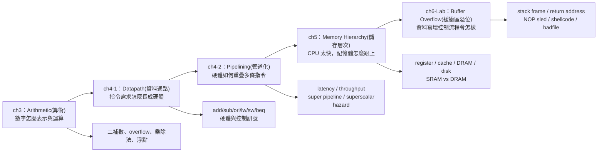

[GPT Link](https://chatgpt.com/g/g-p-69fc58032e8c819194f20729f254f929-peicd-re-ji-suan-ji-jie-gou/c/6a2a7669-75ec-83aa-a1e1-f2ddf84f241f)

#### 1. 來源狀態與整理原則

我把這份整理定位成「期末考前高密度總覽」：主線依你上傳的 `ch3.pdf`、`ch4-1.pdf`、`ch4-2.pdf`、`ch5.pdf`、`ch6-Lab.pdf`，再參考你網站中 `科技_計算機結構` 的 `ch 3`、`Ch 4.1`、`Ch 4.2`、`Ch 5`、`ch 6 Lab` 與期末複習頁；你的網站目錄也明確列出這幾份作為本課程複習材料。([PEICD100][1]) ([PEICD100][2])

我特別把你網站裡的 `Danger` 易忘點納入，例如：ch3 的 multiplicand / multiplier / product、IEEE 754 欄位、floating-point addition 對齊 exponent；ch4.1 的 control signal；ch4.2 的 pipeline register delay、pipeline depth 不是越深越好、hazard；ch5 的 memory hierarchy 與 SRAM/DRAM；ch6-Lab 的 return address、NOP sled、EBP 等。([PEICD100][2])

---

#### 2. 全部章節一張總圖

---

#### 3. 最高優先級：期末前必背心智模型

| 章節      | 你要先背的核心句                                                                 |
| ------- | ------------------------------------------------------------------------ |
| ch3     | CPU 算術不是只算答案，而是要在有限 bit 數中表示、運算、偵測錯誤與決定硬體流程。                             |
| ch4-1   | Datapath(資料通路) 不是背圖；每多支援一種指令，就會多出對應硬體路徑、MUX(多工器) 或 control signal(控制訊號)。 |
| ch4-2   | Pipeline(管道化) 主要改善 throughput(吞吐率)，不保證降低單條 instruction latency(延遲)。      |
| ch5     | Memory hierarchy(儲存層次) 是因為快、便宜、大、省電、非揮發不可能同時全部拿滿。                        |
| ch6-Lab | Buffer overflow(緩衝區溢位) 的本質是「資料寫超界」變成「控制流程被改寫」。                           |

---

#### 4. ch3 計算機的算術：必背總覽

##### 4.1 Binary Addition / Subtraction(二進位加減法)

二進位加法從 LSB(最低有效位元) 往 MSB(最高有效位元) 加，carry(進位) 往左傳。Subtraction(減法) 可以直接 borrow(借位)，但硬體更喜歡把減法轉成加法，所以後面才會進入 two’s complement(二補數)。期末看到加減法題，不要只算結果，要能說明 carry、borrow、overflow 的差別。([PEICD100][2])

| 概念              | 必背                                |
| --------------- | --------------------------------- |
| Half Adder(半加器) | 只加兩個 bit，沒有 carry-in。             |
| Full Adder(全加器) | 加兩個 bit 加上一個 carry-in。            |
| 多位元加法           | 把很多 full adders 串起來，carry 一路往高位傳。 |
| borrow(借位)      | 不夠減時向高位借，方向也是往左影響，但語意不是 carry。    |

---

##### 4.2 Two’s Complement(二補數)

必背流程：`A - B = A + two’s complement(B)`。Two’s complement 的求法是「bitwise invert(逐位元反相) + 1」。快速技巧是：從右往左找到第一個 `1`，這個 `1` 以及它右邊照抄，左邊全部反相。你網站的期末複習也把二補數列為 ch3 主軸之一。([PEICD100][2])

| 題型         | 作法                         |
| ---------- | -------------------------- |
| 求 `+B` 的負數 | 對 `B` 做 two’s complement。  |
| 做 `A - B`  | 改成 `A + (-B)`。             |
| 判斷答案       | 固定位寬下，最高位是 sign bit(符號位元)。 |
| 最常錯        | 忘記固定 bit 數；二補數不是無限長。       |

【必背／易忘】
Two’s complement 的重點不是「負號長怎樣」，而是讓硬體可以用同一套 adder(加法器) 同時做加法與減法。

---

##### 4.3 Overflow(滿溢) 與 MIPS exception(例外)

Overflow(滿溢) 是結果超出固定位寬可表示範圍，不是「有 carry-out 就一定 overflow」。期末最容易考 signed overflow 判斷。你網站的期末複習明確把 overflow、MIPS exception、EPC、mfc0 放在同一個重點群。([PEICD100][2])

| 運算       | 何時可能 overflow | 判斷法                |
| -------- | ------------- | ------------------ |
| `A + B`  | A、B 同號才可能     | 正 + 正 得負，或負 + 負 得正 |
| `A - B`  | A、B 異號才可能     | 正 - 負 得負，或負 - 正 得正 |
| A、B 異號相加 | 不會 overflow   | 兩邊互相抵銷             |
| A、B 同號相減 | 不會 overflow   | 等於一正一負相加           |

MIPS 指令政策要背清楚：

| 會檢查 overflow 並 exception | 不呼叫 exception           |
| ------------------------ | ----------------------- |
| `add`, `addi`, `sub`     | `addu`, `addiu`, `subu` |

`EPC(Exception Program Counter，例外程式計數器)` 會存造成 exception 的 instruction address；`mfc0(move from coprocessor 0)` 用來把系統控制暫存器的值搬到 general-purpose register(一般用途暫存器)，讓軟體能處理例外後決定怎麼回去。

---

##### 4.4 Multiplication(乘法)：從手算到硬體

Binary multiplication(二進位乘法) 的核心是：看 multiplier(乘數) 的每一個 bit；如果該 bit 是 `1`，就把 multiplicand(被乘數) 左移對應位置後加進 product(乘積)；如果是 `0`，就加 0。你的 Danger block 特別標出 multiplicand、multiplier、product 三個字要分清楚。([PEICD100][2])

| English      | 中文  | 角色                           |
| ------------ | --- | ---------------------------- |
| multiplicand | 被乘數 | 被拿去重複加的數                     |
| multiplier   | 乘數  | 決定哪些 shifted multiplicand 要加 |
| product      | 乘積  | 最後累加結果                       |

硬體版最小流程如下：

| 步驟 | 動作                                  |
| -- | ----------------------------------- |
| 1  | Check LSB of Multiplier register。   |
| 2  | 如果 LSB 是 1，Product += Multiplicand。 |
| 3  | Multiplicand 左移 1 bit。              |
| 4  | Multiplier 右移 1 bit。                |
| 5  | Repeat for N cycles。                |

【必背／易忘】
不是 multiplier 左移，而是第一版硬體中 multiplicand 左移、multiplier 右移；每輪看 multiplier 的 LSB 決定要不要加。你網站 Danger block 也把這個流程列成最小流程。([PEICD100][3])

---

##### 4.5 Improved Multiplication Hardware(改良乘法器)

改良版不是改變乘法邏輯，而是省硬體。原本 multiplicand 需要 2n-bit register 來左移，multiplier 也獨立放；改良後通常讓 multiplicand 固定不動，Product register 右移，並把 multiplier 放到 product register 的右半部。這樣 adder 可以縮成 n-bit，但最後 product 仍然是 2n-bit。你網站的 Danger block 對這點有完整比較。([PEICD100][3])

| 比較           | 原本版本              | 改良版本           |
| ------------ | ----------------- | -------------- |
| Multiplicand | 會左移，可能需要 2n-bit   | 通常固定不動         |
| Multiplier   | 獨立 n-bit register | 併入 Product 右半部 |
| Product      | 獨立 2n-bit         | 仍是 2n-bit      |
| Adder        | 2n-bit            | n-bit          |
| 結果           | 正確                | 一樣正確           |

【必背／易忘】
Adder 縮成一半寬，不代表答案少一半；完整乘積還是存在 2n-bit Product register，只是每輪只對高半部做加法再整體右移。

---

##### 4.6 Signed Multiplication(有號乘法)

有號乘法最安全記法：先記錄兩個 operand(運算元) 的 sign(符號)，把它們轉成 magnitude(大小／絕對值) 做 unsigned multiplication，最後依符號規則決定 product 正負。你網站 Danger block 也把 magnitude 定義成「先不看正負號，只看大小」。([PEICD100][3])

| 符號組合  | 結果 |
| ----- | -- |
| 正 × 正 | 正  |
| 負 × 負 | 正  |
| 正 × 負 | 負  |
| 負 × 正 | 負  |

---

##### 4.7 MIPS Multiplication：Hi / Lo

MIPS 中 32-bit × 32-bit 會得到 64-bit product，所以不能只放在一個普通 32-bit register。結果放在特殊暫存器 `Hi:Lo`：`Lo` 通常放低 32-bit，`Hi` 放高 32-bit。要搬回一般 register 必須用 `mflo`、`mfhi`。你的筆記也特別標出 `mflo`、`mfhi` 的常見流程。([PEICD100][3])

| 指令             | 意義                                  |
| -------------- | ----------------------------------- |
| `mult rs, rt`  | signed multiplication，結果進 `Hi:Lo`   |
| `multu rs, rt` | unsigned multiplication，結果進 `Hi:Lo` |
| `mflo rd`      | 把 `Lo` 搬到 `rd`                      |
| `mfhi rd`      | 把 `Hi` 搬到 `rd`                      |

【必背／易忘】
`Hi`、`Lo` 是固定 special registers(特殊暫存器)，不是 `$hi`、`$lo` 那種可直接當 operand 寫的普通暫存器；通常要靠 `mfhi`、`mflo` 取出來。

---

##### 4.8 Division(除法)：Restoring Division

Division(除法) 本質是在找 quotient(商) 與 remainder(餘數)，滿足：

| 身分式                                         | 必背意義              |
| ------------------------------------------- | ----------------- |
| `Dividend = Divisor × Quotient + Remainder` | 被除數 = 除數 × 商 + 餘數 |
| `0 ≤ Remainder < Divisor`                   | 餘數必須比除數小          |

Restoring division(恢復除法) 的核心是每輪試減：如果 remainder - divisor 非負，就保留結果、quotient bit 補 1；如果結果為負，就 restore(加回去恢復)、quotient bit 補 0。你網站的 ch3 目錄把 division identity、binary division process、divider datapath、restoring division rule、MIPS division 都列為主線。([PEICD100][3])

| 判斷                         | 動作                         |
| -------------------------- | -------------------------- |
| `Remainder - Divisor >= 0` | 保留相減結果，quotient 補 1        |
| `Remainder - Divisor < 0`  | 加回 divisor 恢復，quotient 補 0 |

MIPS 除法：

| 指令            | 意義                |
| ------------- | ----------------- |
| `div rs, rt`  | signed division   |
| `divu rs, rt` | unsigned division |
| `mflo rd`     | 取 quotient(商)     |
| `mfhi rd`     | 取 remainder(餘數)   |

---

##### 4.9 Floating Point(浮點數) 與 IEEE 754

Floating point(浮點) 的「浮」是 binary point(二進位小數點) 的位置由 exponent(指數) 控制，不是數字亂飄。Normalized form(常規化形式) 通常寫成 `±1.F × 2^E`。你網站對 IEEE 754 single/double 的 Danger block 明確列出欄位配置與公式。([PEICD100][3])

| 格式               | Sign | Exponent | Fraction | Bias | 公式                          |
| ---------------- | ---: | -------: | -------: | ---: | --------------------------- |
| Single precision |    1 |        8 |       23 |  127 | `(-1)^S × 1.F × 2^(E-127)`  |
| Double precision |    1 |       11 |       52 | 1023 | `(-1)^S × 1.F × 2^(E-1023)` |

【必背／易忘】
Fraction 欄位只存小數點後面的 `F`，不存前面的 `1`；解碼時要把 implicit leading 1(隱含前導 1) 補回去。([PEICD100][3])

IEEE 754 exponent field 特殊值：

| Exponent field | 用途                                    |
| -------------- | ------------------------------------- |
| 全 0            | zero 或 subnormal number(非正規數)         |
| 一般值            | normalized number(正規化數)               |
| 全 1            | infinity(無限大) 或 NaN(Not a Number，非數值) |

Bias 要背：single 是 `127`，double 是 `1023`；真實指數是 `stored E - bias`。([PEICD100][3])

---

##### 4.10 Floating-Point Addition(浮點加法)

Floating-point addition 比 integer addition 麻煩，因為要先對齊 exponent。你的 Danger block 特別提醒：significand(有效數字) 就是科學記號中的有效數字部分，例如 `-1.101 × 2^9` 的 `-1.101`，兩個浮點數相加前要讓 exponent 相同。([PEICD100][3])

| 步驟 | 動作                                             |
| -- | ---------------------------------------------- |
| 1  | Align exponents：把較小 exponent 的 significand 右移。 |
| 2  | Add / subtract significands：帶 sign 做加減。        |
| 3  | Normalize result：讓結果回到 `1.F × 2^E`。            |
| 4  | Round result：依有限 fraction bits 捨入。             |
| 5  | 必要時再次 normalize。                               |

【必背／易忘】
浮點加法不是直接把兩個 fraction 欄位相加；一定要先對齊 exponent。捨入後如果變成 `10.000 × 2^E`，還要再 normalize 成 `1.000 × 2^(E+1)`。([PEICD100][3])

---

##### 4.11 MIPS Floating-Point Instructions(浮點指令)

MIPS 浮點運算常用 `$f0, $f1, ...` 這種 floating-point registers(浮點暫存器)，不是 `$s0`、`$t0`。指令 suffix(後綴) `.s` 表 single precision，`.d` 表 double precision。你網站整理了 `add.s / sub.s / mul.s / div.s`、`lwc1 / swc1`、`c.x.s / c.x.d`、`bc1t / bc1f`。([PEICD100][3])

| 類型          | 指令                                 |
| ----------- | ---------------------------------- |
| float 加減乘除  | `add.s`, `sub.s`, `mul.s`, `div.s` |
| double 加減乘除 | `add.d`, `sub.d`, `mul.d`, `div.d` |
| load float  | `lwc1`                             |
| store float | `swc1`                             |
| comparison  | `c.eq.s`, `c.lt.s`, `c.le.s` 等     |
| branch      | `bc1t`, `bc1f`                     |

---

#### 5. ch4-1 Processor Datapath：必背總覽

##### 5.1 處理器設計主線

處理器設計不是一開始背一張大圖，而是從 instruction requirements(指令需求) 推出 datapath(資料通路)。ch4-1 的期末複習頁把主線整理成：從 MIPS 指令、指令格式、ALU/Register File、load/store、beq，一路推出硬體元件。([PEICD100][4])

處理器設計五步驟：

| 步驟 | 意義                                      |
| -- | --------------------------------------- |
| 1  | 分析 instruction set(指令集)，得到 datapath 需求。 |
| 2  | 選擇 datapath components(元件)。             |
| 3  | 連接元件形成 datapath。                        |
| 4  | 分析每條指令需要哪些 control signals。             |
| 5  | 集成 control logic(控制邏輯)。                 |

本章支援的指令：

| 類型                | 指令             |
| ----------------- | -------------- |
| R-type arithmetic | `addu`, `subu` |
| Immediate logic   | `ori`          |
| Memory access     | `lw`, `sw`     |
| Branch            | `beq`          |

---

##### 5.2 指令格式與基本硬體需求

| 指令型態   | 欄位                                 |
| ------ | ---------------------------------- |
| R-type | `opcode, rs, rt, rd, shamt, funct` |
| I-type | `opcode, rs, rt, immediate`        |

最重要觀念：`rt` 的角色不是固定的。
在 `ori/lw` 裡，`rt` 是目的暫存器；在 `sw` 裡，`rt` 是要寫入 memory 的資料來源；在 `beq` 裡，`rt` 是拿來比較的 operand。

---

##### 5.3 每種指令推導出的硬體

| 指令          | 原本不夠的地方                                        | 需要的硬體／路徑                                |
| ----------- | ---------------------------------------------- | --------------------------------------- |
| `addu/subu` | 要讀兩個 register、ALU 運算、寫回 `rd`                   | RegFile、ALU、RegWr、RegDst=1              |
| `ori`       | 目的暫存器是 `rt`；第二 operand 是 `imm16`；要 zero extend | RegDst MUX、ALUSrc MUX、ZeroExt           |
| `lw`        | ALU 算出的是 memory address，不是寫回資料                 | SignExt、Data Memory、MemtoReg MUX        |
| `sw`        | 要把 `R[rt]` 寫進 memory，不寫 register               | busB → Data Memory Data In、MemWr        |
| `beq`       | 要比較 `rs`、`rt`，並可能改 PC                          | ALU SUB、zero、branch target path、nPC_sel |

你之前問過「從 add 到 beq 增加哪些硬體」，你網站期末整理的表格版正好就是這個考點：`ori` 多 immediate 路徑；`lw` 多 memory read + writeback；`sw` 多 memory write；`beq` 多 zero 比較 + branch PC。([PEICD100][4])

---

##### 5.4 Control Signals(控制訊號) 必背表

| 指令     | RegDst | ALUSrc | ExtOp               | ALUCtr | MemtoReg | RegWr | MemWr | nPC_sel        |
| ------ | -----: | -----: | ------------------- | ------ | -------: | ----: | ----: | -------------- |
| `addu` |      1 |      0 | x                   | ADD    |        0 |     1 |     0 | +4             |
| `subu` |      1 |      0 | x                   | SUB    |        0 |     1 |     0 | +4             |
| `ori`  |      0 |      1 | zero                | OR     |        0 |     1 |     0 | +4             |
| `lw`   |      0 |      1 | sign                | ADD    |        1 |     1 |     0 | +4             |
| `sw`   |      x |      1 | sign                | ADD    |        x |     0 |     1 | +4             |
| `beq`  |      x |      0 | x / sign for target | SUB    |        x |     0 |     0 | branch if zero |

【必背／易忘】
`x` 是 don’t care(不在乎)，不是 0。像 `sw` 不寫 register，所以 `RegDst`、`MemtoReg` 都沒意義；`beq` 不寫 register、不讀 Data Memory 寫回，所以 `RegDst`、`MemtoReg` 也沒意義。你網站 Danger block 也特別提醒 `beq` 的 `MemtoReg = x` 是因為 `RegWr=0`，busW 用不到。([PEICD100][5])

ALUCtr 最短背法：`add/lw/sw = ADD`，`sub/beq = SUB`，`ori = OR`。([PEICD100][5])

---

##### 5.5 `lw` vs `sw` vs `beq` 最容易混

| 指令                | Memory 動作      | Register 動作                                        |
| ----------------- | -------------- | -------------------------------------------------- |
| `lw rt, imm(rs)`  | 讀 memory       | 寫入 `rt`，所以 `RegWr=1`, `MemtoReg=1`                 |
| `sw rt, imm(rs)`  | 寫 memory       | 不寫 register，所以 `RegWr=0`, `RegDst=x`, `MemtoReg=x` |
| `beq rs, rt, imm` | 不碰 Data Memory | 不寫 register，只用 ALU 比較與改 PC                         |

---

#### 6. ch4-2 Pipelining：必背總覽

##### 6.1 Pipeline 的本質：提升 throughput，不一定降 latency

Pipeline(管道化) 把一條指令拆成 IF、ID、EX、MEM、WB 等 stage(階段)，讓不同指令在不同 stage 上重疊。重點是：單一 instruction 仍要走完全部 stage，所以 latency 不一定變短；pipeline 真正改善的是 throughput，也就是填滿後可以更密集完成指令。你的期末整理用 `lw` 範例指出，pipeline 每 200ps 可讓下一條指令進入 IF，但單條指令仍要走 5 stages。([PEICD100][6])

| 指標           | Single-cycle          | Pipeline     |
| ------------ | --------------------- | ------------ |
| 單條指令 latency | 一個長 cycle             | 所有 stages 加總 |
| 穩定完成間隔       | 慢                     | 快            |
| 主要改善         | 無重疊                   | throughput   |
| 常見錯法         | 以為 pipeline 一定讓單條指令更快 | 錯            |

【必背／易忘】
Pipeline 類似做菜：單獨一道菜仍要洗、切、炒、裝盤；但廚房填滿後，可以每隔一段時間出一道菜。([PEICD100][6])

---

##### 6.2 Pipeline Register Delay(管道化暫存器延遲)

Pipeline register(管道化暫存器) 是每個 stage 之間的交接站，本身有 delay。你網站 Danger block 明確提醒：clock cycle 會加上 pipeline register delay；例子中原本每 stage 200ps，若 register delay 50ps，clock cycle 變 250ps，單條指令 latency 變成 `5 × 250ps = 1250ps`。([PEICD100][6])

| 情況                 | Stage logic | Register delay | Clock cycle | 單條指令 latency |
| ------------------ | ----------: | -------------: | ----------: | -----------: |
| 未考慮 register delay |       200ps |            0ps |       200ps |       1000ps |
| 考慮 register delay  |       200ps |           50ps |       250ps |       1250ps |

---

##### 6.3 Pipeline 不是切越多越好

Super Pipelining(超級管道化) 是把 pipeline 切成更多 stages，使 clock cycle 變短、throughput 可能提升；但每切一段都要多付 pipeline register overhead，而且 hazard penalty 也可能變大。你的網站指出五級 pipeline 和十級 pipeline 的例子：十級 clock cycle 較短，但單條指令 latency 可能更長，且 register delay 比例更大。([PEICD100][6])

| 說法                               | 判斷 |
| -------------------------------- | -- |
| Stage 越多，clock cycle 可能越短        | 對  |
| Stage 越多，單條指令 latency 一定越短       | 錯  |
| Stage 越多越好                       | 錯  |
| Super pipelining 主要改善 throughput | 對  |

最短考試版：
Super pipelining increases pipeline depth and may reduce clock cycle time, but deeper pipelines increase pipeline register overhead and hazard penalty, so more stages are not always better.

---

##### 6.4 Superscalar(超標量) vs Super Pipelining(超級管道化)

| 概念                      | 核心                           | 直覺          |
| ----------------------- | ---------------------------- | ----------- |
| Super Pipelining        | 把一條 pipeline 切更細             | 同一條產線分更多站   |
| Superscalar             | 複製硬體資源，一個 cycle 可 issue 多條指令 | 多條產線同時做     |
| Time parallelism(時間並行)  | 時間錯開重疊                       | pipeline    |
| Space parallelism(空間並行) | 增加硬體空間／資源                    | superscalar |

【必背／易忘】
`2-issue` 不是 clock cycle 砍半，而是同一 cycle 理想上可以發射兩條 instruction。你網站 ch4.2 的 Danger block 也提醒：time parallelism 的「時間」是時間錯開；space parallelism 的「空間」是硬體資源。([PEICD100][7])

---

##### 6.5 Hazard(危障)

Pipeline hazard 是讓下一條 instruction 不能在下一個 clock cycle 正常開始或前進的情況。三種 hazard 最短判斷如下；你的期末整理 Danger block 也把三種 hazard 與解法整理成表。([PEICD100][6])

| Hazard            | 中文        | 發生原因              | 典型例子                                                 | 解法                                       |
| ----------------- | --------- | ----------------- | ---------------------------------------------------- | ---------------------------------------- |
| Structural Hazard | 結構危障      | 硬體資源不夠，被多條指令搶用    | IF 要讀 instruction memory，同時 MEM 要讀/write data memory | stall/bubble，或分開 instruction/data memory |
| Data Hazard       | 資料危障／數據危障 | 後一條指令需要前一條尚未寫回的結果 | `sub $t0,...` 後面馬上 `add ..., $t0, ...`               | stall/bubble                             |
| Control Hazard    | 控制危障      | 分支結果未確定，不知道下一個 PC | `beq` 尚未知道 branch taken/not taken                    | stall/bubble                             |

【必背／易忘】
Data hazard 問的是「資料準備好了沒」；control hazard 問的是「下一條指令去哪裡抓」。不要看到 `beq` 就亂判 data hazard，也不要看到 register 就亂判 structural hazard。

---

##### 6.6 CPI 與考古題常見陷阱

`CPI(Cycles Per Instruction，每條指令平均 clock cycles 數)` 是平均一條 instruction 花幾個 clock cycles。Pipeline 理想 CPI 約 1，但 single-cycle 的 CPI 也是 1；pipeline 遇到 hazard、stall、bubble 後 CPI 會大於 1。所以「pipeline 有最小 CPI」不一定是最穩正確敘述。你的網站期末題目也指出，single-cycle 所需硬體／控制概念最簡單，而 pipeline 需要額外 pipeline registers、hazard detection、stall/bubble 機制。([PEICD100][6])

---

#### 7. ch5 Memory：必背總覽

##### 7.1 Memory 不是只有 RAM

Memory(記憶體) 在這章包含所有「帶儲存功能的元件」：CPU register、cache、main memory、BIOS、disk 等。你網站 ch5 主線從 memory 的角色開始，強調不能只把 memory 等同於 RAM。([PEICD100][8])

記憶體需求：

| 需求                   | 意義            |
| -------------------- | ------------- |
| Non-volatility(非揮發性) | 斷電後資料不消失      |
| Read/Write(可讀可寫)     | 能讀也能修改        |
| Random Access(隨機存取)  | 存取時間不應依位置大幅改變 |
| Access Time(存取時間)    | CPU 希望越快越好    |
| Capacity(容量)         | 要裝得下程式與資料     |
| Cost(價格)             | 每 bit 成本不能太高  |
| Power(功耗)            | 大量使用時不能太耗電    |

【必背／易忘】
如果有一種記憶體同時「不揮發、可讀寫、隨機存取、跟 CPU 一樣快、容量超大、超便宜、超省電」，就不需要 memory hierarchy；現實是越快通常越貴、容量越小，越大越便宜通常越慢。你網站 Danger block 明確把這點列為 memory hierarchy 的前提。([PEICD100][8])

---

##### 7.2 Memory Hierarchy(儲存層次結構)

| 層級            | 典型技術          | 速度 | 容量 | 成本/byte | 常見角色         |
| ------------- | ------------- | -- | -- | ------- | ------------ |
| CPU registers | Register file | 最快 | 最小 | 最高      | ALU 直接操作     |
| Cache         | SRAM          | 很快 | 小  | 高       | 緩衝 CPU 與主記憶體 |
| Main memory   | DRAM          | 中等 | 大  | 中低      | 程式執行主要工作區    |
| Disk / SSD    | 外部儲存          | 慢  | 最大 | 低       | 長期保存資料       |

最短記法：越靠近 CPU，越快、越小、越貴；越遠離 CPU，越慢、越大、越便宜。ch5 講義也用 register/cache/DRAM/disk 的階層說明容量、速度與成本的取捨。

---

##### 7.3 SRAM vs DRAM

你的網站與講義都把 SRAM/DRAM 比較列成 ch5 高優先重點；Danger block 指出 DRAM 用 capacitor(電容)，SRAM 用 bistable latch/flip-flop(雙穩態觸發器)，並比較速度、集成度、成本、功耗、refresh 與用途。([PEICD100][8]) 

| 比較      | SRAM                       | DRAM                   |
| ------- | -------------------------- | ---------------------- |
| 全名      | Static RAM(靜態隨機存取記憶體)      | Dynamic RAM(動態隨機存取記憶體) |
| 儲存單元    | bistable latch / flip-flop | capacitor              |
| 速度      | 快                          | 慢                      |
| 集成度     | 低                          | 高                      |
| 容量      | 小                          | 大                      |
| 成本      | 高                          | 低                      |
| 功耗      | 較高                         | 較低，但要 refresh          |
| Refresh | 不需要                        | 需要                     |
| 常見用途    | Cache                      | Main memory            |

【必背／易忘】
SRAM：快、貴、小、不用 refresh，所以適合 cache。
DRAM：慢、便宜、大、要 refresh，所以適合 main memory。

---

##### 7.4 6T SRAM 基本概念

6T SRAM 可以想成兩個互鎖 inverter 加兩個 access transistor。核心狀態是 `Q` 與 `Q̅`，兩者必定相反。你的網站 Danger block 用「雙邊互鎖開關」說明這點。([PEICD100][8])

| 狀態                      | 意義        |
| ----------------------- | --------- |
| `Q = 1, Q̅ = 0`         | 存 1       |
| `Q = 0, Q̅ = 1`         | 存 0       |
| Word Line               | 選擇這個 cell |
| Bit Line / Bit Line Bar | 讀寫資料的線    |

---

#### 8. ch6-Lab Buffer Overflow：必背總覽

##### 8.1 Program Memory Layout(程式記憶體配置)

ch6-Lab 從 stack layout 開始，是因為 buffer overflow 要理解「資料在記憶體中放在哪裡」才知道為什麼會蓋到 return address。你網站 ch6-Lab 也把 Program Memory Stack、Function Arguments、Function Call Stack、Function Call Chain 列為第一組主線。([PEICD100][9])

| 區段           | 放什麼                                                   |
| ------------ | ----------------------------------------------------- |
| Text segment | 程式機器碼                                                 |
| Data segment | 已初始化 global/static 變數                                 |
| BSS segment  | 未初始化 global/static 變數                                 |
| Heap         | `malloc` 等動態配置                                        |
| Stack        | 函式呼叫、local variables、return address、old frame pointer |

---

##### 8.2 Stack Frame(堆疊框架)

每次 function call(函式呼叫) 都會形成一個 stack frame。常見 x86 觀念：

| 位置             | 常見內容                      |
| -------------- | ------------------------- |
| `EBP + 8`      | 第一個參數                     |
| `EBP + 4`      | return address            |
| `EBP`          | previous frame pointer    |
| `EBP - offset` | local variables，例如 buffer |

【必背／易忘】
Previous frame pointer 不是 return address。Previous frame pointer 用來回到上一層 stack frame；return address 用來決定 function return 後 CPU 要跳回哪一條 instruction。

---

##### 8.3 Vulnerable Program(有漏洞程式)

Buffer overflow 的爆點不是「有 input」本身，而是把攻擊者可控輸入複製進太小的 local buffer，且沒有檢查長度。ch6-Lab 的主線明確列出：`main()` 讀入 attacker-controlled input，`foo()` 裡的 `buffer[100]` 才是爆點，資料會從 badfile 流到 return address。([PEICD100][9])

最短流程：

| 步驟 | 發生什麼                                       |
| -- | ------------------------------------------ |
| 1  | badfile 由攻擊者控制                             |
| 2  | 程式把 badfile 內容讀到較大的 `str`                  |
| 3  | `foo(str)` 把 str 傳進 vulnerable function    |
| 4  | `strcpy(buffer, str)` 沒檢查長度                |
| 5  | `buffer[100]` 被寫爆                          |
| 6  | 覆蓋 previous frame pointer / return address |
| 7  | function return 時 CPU 跳到攻擊者指定位置            |

---

##### 8.4 Return Address 為什麼重要

Return address 是 function 結束時 CPU 要回去執行的位置。攻擊者如果把 return address 改成指向 buffer 中某個位置，CPU return 時就會跳到 buffer 裡執行資料；如果 buffer 裡有 NOP sled + shellcode，就可能執行 malicious code。ch6-Lab 的 PDF 也把「The value placed here will overwrite the Return Address field」與「原本 return address 變成 buffer 裡的位置」列為核心結構。

【必背／易忘】
覆蓋 return address 本身只是「改下一個跳轉位置」；要成功攻擊還需要跳進有效區域，例如 NOP sled，最後滑到 shellcode。

---

##### 8.5 NOP Sled 與 Shellcode

`NOP(No Operation)` 是 CPU 執行後什麼都不做的指令；x86 中常見 `0x90`。NOP sled 是鋪一大段 NOP，讓 return address 不需要精準指到 shellcode 開頭，只要落在 NOP 區，CPU 就會一路執行 NOP，最後滑到 shellcode。ch6-Lab PDF 與你網站都把 NOP sled 作為核心易忘點。 ([PEICD100][9])

| 元件                 | 作用                                          |
| ------------------ | ------------------------------------------- |
| NOP sled           | 提高跳轉命中率                                     |
| Shellcode          | 真正要執行的惡意機器碼                                 |
| New return address | 覆蓋原 return address，讓 CPU 跳進 buffer/NOP sled |
| Offset distance    | buffer base 到 return address 的距離            |

---

##### 8.6 badfile 結構

badfile 通常不是單純一串垃圾資料，而是刻意排列：

| 區塊        | 內容                              |
| --------- | ------------------------------- |
| 前段        | NOP sled，例如很多 `0x90`            |
| 後段        | shellcode                       |
| 指定 offset | 覆蓋 return address 的 new address |

ch6-Lab PDF 中 badfile construction 的重點是：建立 300 bytes，預設填滿 `0x90` NOP，將 shellcode 放到尾端，再在正確 offset 覆蓋 return address。

【必背／易忘】
`Distance = 112` 的意思是 buffer 開頭到 return address 的距離是 112 bytes；也就是填滿 112 bytes 後，接下來的 4 bytes 會蓋掉 32-bit return address。

---

##### 8.7 `0xbffeaf8 + 8` 與 EBP

你網站 ch6-Lab 的追問整理指出，`0xbffeaf8 + 8` 這類式子要分清楚「return address 欄位本身的位置」與「return address 裡面填入的新值」。`EBP` 是 current stack frame 的 base pointer，用固定基準去找參數、return address、local variables。你網站也把 `EBP+4`、`EBP+8` 與 return address / 第一個參數的常見位置連起來說明。([PEICD100][9])

最短記法：

| 名稱                   | 你要記                         |
| -------------------- | --------------------------- |
| `EBP`                | 目前 stack frame 的定位基準        |
| `EBP+4`              | 通常是 return address          |
| `EBP+8`              | 通常是第一個 argument             |
| `EBP-offset`         | 通常是 local variable / buffer |
| `new return address` | 要讓 CPU return 後跳去的位置        |

---

#### 9. 考前最後 30 分鐘速背版

##### 9.1 ch3 速背

| 題目看到                  | 立刻想到                                                 |
| --------------------- | ---------------------------------------------------- |
| `A - B`               | `A + two’s complement(B)`                            |
| overflow              | signed 才特別判斷；不是 carry-out 等於 overflow                |
| `add/addi/sub`        | overflow 會 exception                                 |
| `addu/addiu/subu`     | overflow 不 exception                                 |
| binary multiplication | 看 multiplier bit；1 加 shifted multiplicand，0 加 0      |
| improved multiplier   | Product 和 Multiplier 共用 register；adder 可縮成 n-bit     |
| `mult/multu`          | 64-bit 結果放 Hi:Lo                                     |
| `mflo/mfhi`           | 從 Lo/Hi 搬到一般 register                                |
| division              | quotient 在 Lo，remainder 在 Hi                         |
| IEEE 754 single       | 1 / 8 / 23，bias 127                                  |
| IEEE 754 double       | 1 / 11 / 52，bias 1023                                |
| FP add                | align exponent → add significand → normalize → round |

---

##### 9.2 ch4-1 速背

| 指令          | 最短資料流                                                     |
| ----------- | --------------------------------------------------------- |
| `addu/subu` | RegFile 讀 `rs/rt` → ALU → 寫 `rd`                          |
| `ori`       | RegFile 讀 `rs` + ZeroExt imm → ALU OR → 寫 `rt`            |
| `lw`        | `R[rs] + SignExt(imm)` 算 address → Data Memory 讀 → 寫 `rt` |
| `sw`        | `R[rs] + SignExt(imm)` 算 address → 把 `R[rt]` 寫入 memory    |
| `beq`       | `R[rs] - R[rt]` 看 zero → 決定 PC+4 或 branch target          |

---

##### 9.3 ch4-2 速背

| 關鍵字                     | 最短答案                                      |
| ----------------------- | ----------------------------------------- |
| Pipeline                | 提高 throughput，不保證降低單條 latency             |
| Pipeline register delay | clock cycle 要加 register delay             |
| Stage imbalance         | 最慢 stage 決定 clock cycle                   |
| Super pipelining        | 切更多 stages，clock cycle 可能更短，但 overhead 更高 |
| Superscalar             | 複製硬體，多 issue，不是把 clock 砍半                 |
| Structural hazard       | 硬體不夠                                      |
| Data hazard             | 資料還沒好                                     |
| Control hazard          | 下一個 PC 還不知道                               |
| Bubble                  | pipeline 裡的空轉格                            |
| Stall                   | 故意停下等待                                    |

---

##### 9.4 ch5 速背

| 關鍵字              | 最短答案                              |
| ---------------- | --------------------------------- |
| Memory hierarchy | 快/大/便宜/省電不能全拿，所以分層                |
| Register         | 最快最小最貴                            |
| Cache            | SRAM，快但貴小                         |
| Main memory      | DRAM，便宜大但慢，要 refresh              |
| Disk             | 最大最便宜但很慢                          |
| SRAM             | latch/flip-flop，快，不 refresh，cache |
| DRAM             | capacitor，慢，要 refresh，main memory |

---

##### 9.5 ch6-Lab 速背

| 關鍵字             | 最短答案                                     |
| --------------- | ---------------------------------------- |
| Buffer overflow | 寫超過 buffer 邊界                            |
| Return address  | function return 後 CPU 要跳回的位置             |
| Exploit 核心      | 覆蓋 return address，讓 CPU 跳到 attacker code |
| NOP             | no operation，什麼都不做                       |
| NOP sled        | 不需精準跳 shellcode，落在 NOP 區就能滑過去            |
| Shellcode       | 真正要執行的機器碼                                |
| EBP             | stack frame 定位基準                         |
| `EBP+4`         | return address                           |
| `EBP+8`         | 第一個 argument                             |
| Distance 112    | buffer base 到 return address 的 offset    |

---

#### 10. 最容易考錯的總表

| 錯誤說法                           | 正確說法                                              |
| ------------------------------ | ------------------------------------------------- |
| Pipeline 會讓單條指令變快              | Pipeline 主要提高 throughput；單條 latency 不一定降低。        |
| Stage 越多越好                     | 不一定，pipeline register delay 與 hazard penalty 會增加。 |
| `sw` 會寫 register               | 錯，`sw` 寫 memory，所以 `RegWr=0`。                     |
| `lw` 和 `sw` control signal 差不多 | address 算法像，但資料方向完全相反。                            |
| `beq` 需要 MemtoReg              | 錯，`beq` 不寫 register，`MemtoReg=x`。                 |
| Carry-out 就是 overflow          | 錯，signed overflow 要看 operand sign 與 result sign。  |
| `mult` 結果直接在 `$t0`             | 錯，先進 Hi:Lo，要用 `mflo/mfhi` 搬出來。                    |
| Fraction 存完整 `1.F`             | 錯，只存 F，前面的 1 是 implicit leading 1。                |
| SRAM/DRAM 都不用 refresh          | 錯，DRAM 要 refresh，SRAM 不需要。                        |
| NOP sled 是惡意程式本體               | 錯，NOP sled 是滑道，shellcode 才是本體。                    |
| 改 return address 就一定成功         | 錯，還要跳到有效 NOP/shellcode 區域。                        |

---

#### 11. 你考前最該優先背的 12 句

1. `A - B` 在硬體中可做成 `A + two’s complement(B)`。
2. Signed addition overflow：同號相加，結果變異號。
3. Signed subtraction overflow：異號相減，結果符號不合理。
4. `add/addi/sub` 會對 overflow exception；`addu/addiu/subu` 不會。
5. Binary multiplication：multiplier bit 決定要不要加 shifted multiplicand。
6. MIPS 乘除法結果用 `Hi/Lo`；`mflo` 取低半／商，`mfhi` 取高半／餘數。
7. IEEE single 是 `1/8/23`、bias 127；double 是 `1/11/52`、bias 1023。
8. Floating-point addition 一定先 align exponent。
9. Datapath 是從指令需求推導硬體，不是背圖。
10. Pipeline 提升 throughput，不保證降低單條 latency。
11. Hazard 三分法：硬體不夠是 structural，資料沒好是 data，PC 不知道是 control。
12. Buffer overflow 攻擊核心：overflow 覆蓋 return address，CPU return 後跳到 NOP sled / shellcode。

[1]: https://peicd100.github.io/university-notes/ "PEICD100"
[2]: https://peicd100.github.io/university-notes/md/114-2/%E7%A7%91%E6%8A%80_%E8%A8%88%E7%AE%97%E6%A9%9F%E7%B5%90%E6%A7%8B/%E6%9C%9F%E6%9C%AB%E8%80%83%E8%A4%87%E7%BF%92-ch3.html "期末考複習 ch3 - PEICD100"
[3]: https://peicd100.github.io/university-notes/md/114-2/%E7%A7%91%E6%8A%80_%E8%A8%88%E7%AE%97%E6%A9%9F%E7%B5%90%E6%A7%8B/ch%203.html "ch 3 - PEICD100"
[4]: https://peicd100.github.io/university-notes/md/114-2/%E7%A7%91%E6%8A%80_%E8%A8%88%E7%AE%97%E6%A9%9F%E7%B5%90%E6%A7%8B/%E6%9C%9F%E6%9C%AB%E8%80%83%E8%A4%87%E7%BF%92-ch4.1.html "期末考複習 ch4.1 - PEICD100"
[5]: https://peicd100.github.io/university-notes/md/114-2/%E7%A7%91%E6%8A%80_%E8%A8%88%E7%AE%97%E6%A9%9F%E7%B5%90%E6%A7%8B/ch%204.1.html "Ch 4.1 - PEICD100"
[6]: https://peicd100.github.io/university-notes/md/114-2/%E7%A7%91%E6%8A%80_%E8%A8%88%E7%AE%97%E6%A9%9F%E7%B5%90%E6%A7%8B/%E6%9C%9F%E6%9C%AB%E8%80%83%E8%A4%87%E7%BF%92-ch4.2.html "期末考複習 ch4.2 - PEICD100"
[7]: https://peicd100.github.io/university-notes/md/114-2/%E7%A7%91%E6%8A%80_%E8%A8%88%E7%AE%97%E6%A9%9F%E7%B5%90%E6%A7%8B/ch%204.2.html "Ch 4.2 - PEICD100"
[8]: https://peicd100.github.io/university-notes/md/114-2/%E7%A7%91%E6%8A%80_%E8%A8%88%E7%AE%97%E6%A9%9F%E7%B5%90%E6%A7%8B/ch%205.html "Ch 5 - PEICD100"
[9]: https://peicd100.github.io/university-notes/md/114-2/%E7%A7%91%E6%8A%80_%E8%A8%88%E7%AE%97%E6%A9%9F%E7%B5%90%E6%A7%8B/ch%206-Lab.html "ch 6 Lab - PEICD100"
