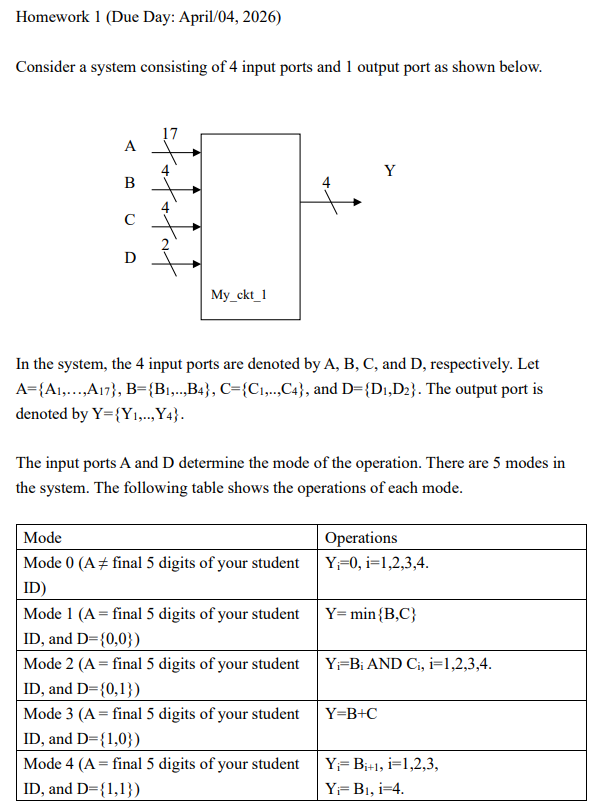
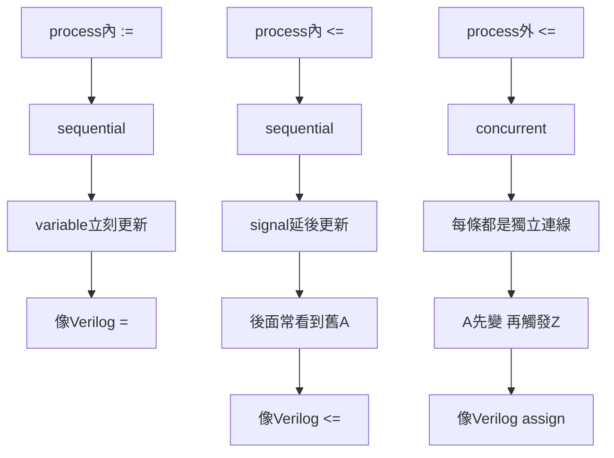

# 期中考

## 1. 英文/術語

- 3-input NOR gate：3 輸入 NOR 閘
- algorithmic state machine (ASM) chart：演算法狀態機圖；常簡稱 ASM 圖
- case statement：case 敘述、case 陳述
- component：元件
- D-type FF / D-type flip-flop：D 型正反器
- declared：宣告
- declared explicitly：明確宣告
- denote：表示
- drain：汲極；在 MOS 電晶體中是 drain 端
- entity declaration：實體宣告
- fabrication：製造
- false：錯的
- finite state machine (FSM)：有限狀態機
- floating type：小數型別；更完整可理解為浮點型別
- gate：閘極；也可指邏輯閘，需看語境
- higher area efficiency：面積效率較高
- in：輸入
- incorrect：錯、不正確
- inverter：反相器
- labeled：被標記、被標出來的
- Mask generation：光罩生成
- NOT case-sensitive：不區分大小寫
- NOT gate：反相器、非閘
- NOT required：不需要、不用
- NRE：非重複性工程成本
- out：輸出
- pre-defined data type：預先定義型別、VHDL 內建型別
- pull-down：下拉
- pull-down network：下拉網路
- pull-up：上拉
- pull-up network：上拉網路
- required：需要、要
- respectively：分別地
- serial-in shift register：串列輸入移位暫存器
- shift register：移位暫存器
- source：來源；也可指 MOS 的 source 端（源極）
- statements：陳述、敘述
- static CMOS：靜態 CMOS
- such as：例如
- Two-input OR gate：二輸入 OR 閘
- variable：變數
- with select：with...select... 選擇訊號指定

## 2. 作業範例




```vhdl
library ieee;
use ieee.std_logic_1164.all;
use ieee.numeric_std.all;

entity My_ckt_1 is
    port(
        A : in  std_logic_vector(16 downto 0);
        B : in  std_logic_vector(3 downto 0);
        C : in  std_logic_vector(3 downto 0);
        D : in  std_logic_vector(1 downto 0);
        Y : out std_logic_vector(3 downto 0)
    );
end My_ckt_1;

architecture simple of My_ckt_1 is
begin
    process(A,B,C,D)
    begin
        if unsigned(A) /= to_unsigned(47038,17) then
            Y <= "0000";
        elsif D = "00" then
            if unsigned(B) <= unsigned(C) then
                Y <= B;
            else
                Y <= C;
            end if;
        elsif D = "01" then
            Y <= B and C;
        elsif D = "10" then
            Y <= std_logic_vector(unsigned(B) + unsigned(C));
        else
            Y <= B(2 downto 0) & B(3);
        end if;
    end process;
end simple;
```


## 3. 函數呼叫

完整範例
```vhdl
entity test is
    port(
        A, B : in bit;
        Y    : out std_logic
    );
end test;

architecture behavior of test is

    function my_fnc(A, B : bit) return std_logic is
    begin
        if A = '1' and B = '1' then
            return '1';
        else
            return '0';
        end if;
    end function;

begin

    Y <= my_fnc(A, B);  // 呼叫函數

end behavior;
```


可多載
```vhdl
function my_fnc(A,B: bit) return std_logic;
function my_fnc(A,B,C: bit) return std_logic;
function my_fnc(A,B,C,D: bit) return std_logic;
```

## 4. 呼叫電路


### 4.1 小電路：AND_2

```vhdl
entity AND_2 is
    port(
        X, Y : in bit;
        Z    : out bit
    );
end AND_2;

architecture dataflow of AND_2 is
begin
    Z <= X and Y;
end dataflow;
```

### 4.2 大電路：TOP，裡面呼叫 AND_2

```vhdl
entity TOP is
    port(
        A, B : in bit;
        F    : out bit
    );
end TOP;

architecture STRUCTURE of TOP is

    component AND_2
        port(
            X, Y : in bit;
            Z    : out bit
        );
    end component;

begin

    -- 以下兩種方法只會出現一個。

    -- 方法1. 元件標籤 : component名稱 port map(...);
    U1: AND_2 port map (A, B, F);
    -- 方法2.
    U1: AND_2 port map (X => A, Y => B, Z => F);

end STRUCTURE;
```


## 5. sequential、concurrent

### 5.1 講解

#### 5.1.1 先給你一張超短整理

| 情況             | VHDL 寫法                        | `A / Z` 是什麼                             | 性質                            | 這次觸發時 `Z` 看到的是誰                   | 最像的 Verilog                           |
| -------------- | ------------------------------ | --------------------------------------- | ----------------------------- | --------------------------------- | ------------------------------------- |
| process 內 `:=` | `A_var := B;`<br>`Z <= A_var;` | `A_var` 是 **variable**，`Z` 是 **signal** | **sequential**                | **新的 `A_var`**，也就是 `B`            | `always @(*)` 裡的 **blocking** `=`     |
| process 內 `<=` | `A <= B;`<br>`Z <= A;`         | `A`、`Z` 都是 **signal**                   | **sequential**（但 signal 更新延後） | **舊的 `A`**                        | `always @(*)` 裡的 **nonblocking** `<=` |
| process 外 `<=` | `A <= B;`<br>`Z <= A;`         | `A`、`Z` 都是 **signal**                   | **concurrent**                | `Z` 最後會拿到 **新的 `A`**，但要再多一拍 delta | 兩條 `assign`                           |

你這三種差異，課本剛好就是拿來對照講的：

* variable assignment 是「executed and updated at the same time」
* signal assignment 是先執行，之後在 `Δ` 才更新 
* `A <= B; Z <= A;` 放在 process 內外，時間行為不同 

---

#### 5.1.2 先提醒一個小地方

你說想用 `A<=B, Z<=A` 來看三種情況，這在 **process 內 `:=`** 那一種要稍微改一下，因為：

* `:=` 是給 **variable**
* `<=` 是給 **signal**

所以第一種不能原封不動寫成：

```vhdl id="bad_example_1"
A := B;
Z := A;
```

我們要改成：

```vhdl id="fix_example_1"
A_var := B;
Z <= A_var;
```

這樣才合法。

---

#### 5.1.3 process 內 `:=`：variable assignment

##### 5.1.3.1 VHDL 寫法

```vhdl id="vhdl_var_case"
process(B)
    variable A_var : bit;
begin
    A_var := B;
    Z <= A_var;
end process;
```

##### 5.1.3.2 怎麼運作

當 `B` 在時間 `T` 改變時：

1. process 被叫醒
2. `A_var := B;`
   `A_var` **立刻**變成 `B`
3. `Z <= A_var;`
   這時讀到的是**新的 `A_var`**
4. 所以 `Z` 會在 `T + Δ` 更新成 `B`

##### 5.1.3.3 重點

這裡的關鍵是：

**variable 在 process 裡是立刻更新的，所以後面那行看得到新值。**

##### 5.1.3.4 Verilog 類比

最像 Verilog 的 **blocking assignment**：

```verilog id="verilog_var_case"
always @(*) begin
    A_var = B;
    Z     = A_var;
end
```

這裡也是：

* `A_var = B;` 先立刻生效
* 下一行 `Z = A_var;` 看到的是新 `A_var`

##### 5.1.3.5 一句話記

**process 內 `:=` 像 Verilog 的 `=`，後面馬上看得到新值。**

---

#### 5.1.4 process 內 `<=`：sequential signal assignment

##### 5.1.4.1 VHDL 寫法

```vhdl id="vhdl_seq_sig_case"
process(B)
begin
    A <= B;
    Z <= A;
end process;
```

##### 5.1.4.2 怎麼運作

當 `B` 在時間 `T` 改變時：

1. process 被叫醒
2. `A <= B;` 被執行
   但 `A` **不會立刻更新**
3. `Z <= A;` 被執行
   這時讀到的還是**舊的 `A`**
4. 到 `T + Δ`：

   * `A` 更新成 `B`
   * `Z` 更新成**舊的 `A`**

##### 5.1.4.3 重點

這裡最容易搞混：

* 這兩行是 **sequential**
* 但 `signal` 更新不是立刻發生

所以雖然第二行寫在後面，
它還是只看到**舊的 `A`**。

##### 5.1.4.4 Verilog 類比

最像 Verilog 在 `always` 裡用 **nonblocking assignment**：

```verilog id="verilog_seq_sig_case"
always @(*) begin
    A <= B;
    Z <= A;
end
```

它的語意重點是：

* 先排程更新 `A`
* 再排程更新 `Z`
* 但 `Z` 讀到的還是舊的 `A`

##### 5.1.4.5 一句話記

**process 內 `<=` 雖然是 sequential，但後面那行看到的通常還是舊 signal 值。**

---

#### 5.1.5 process 外 `<=`：concurrent signal assignment

##### 5.1.5.1 VHDL 寫法

```vhdl id="vhdl_con_sig_case"
A <= B;
Z <= A;
```

這是寫在 `architecture ... begin` 後、**process 外面**。

##### 5.1.5.2 怎麼運作

當 `B` 在時間 `T` 改變時：

1. 第一條 `A <= B;` 因 `B` 的 event 被觸發
2. `A` 在 `T + Δ` 更新成 `B`
3. 因為 `A` 在 `T + Δ` 發生 event
4. 第二條 `Z <= A;` 才被觸發
5. 所以 `Z` 在 `T + 2Δ` 更新成**新的 `A`**

##### 5.1.5.3 重點

這裡和 process 內最大差別是：

**這兩條不是同一個 sequential block 裡的兩行，而是兩個獨立的 concurrent 敘述。**

所以第二條要等第一條真的把 `A` 改掉、產生 event，才會跟著動。

##### 5.1.5.4 Verilog 類比

最像兩條 **continuous assignment**：

```verilog id="verilog_con_sig_case"
assign A = B;
assign Z = A;
```

你可以把它想成兩段連線串起來：

```text id="chain_view_1"
B -> A -> Z
```

##### 5.1.5.5 一句話記

**process 外 `<=` 像兩條 `assign`，前一條輸出變了，下一條才跟著反應。**

---

#### 5.1.6 三種放在一起看

##### 5.1.6.1 process 內 `:=`

```vhdl id="all_case_v1"
process(B)
    variable A_var : bit;
begin
    A_var := B;
    Z <= A_var;
end process;
```

```verilog id="all_case_v1_v"
always @(*) begin
    A_var = B;
    Z     = A_var;
end
```

結果：
`Z` 拿到 **B**

---

##### 5.1.6.2 process 內 `<=`

```vhdl id="all_case_v2"
process(B)
begin
    A <= B;
    Z <= A;
end process;
```

```verilog id="all_case_v2_v"
always @(*) begin
    A <= B;
    Z <= A;
end
```

結果：
`Z` 拿到 **舊的 A**

---

##### 5.1.6.3 process 外 `<=`

```vhdl id="all_case_v3"
A <= B;
Z <= A;
```

```verilog id="all_case_v3_v"
assign A = B;
assign Z = A;
```

結果：
`A` 先變，之後 `Z` 才跟著變成**新的 A**

---

#### 5.1.7 最後幫你濃縮成背誦版

##### 5.1.7.1 `:=`

* 給 **variable**
* 在 process 內
* **sequential**
* **立刻更新**
* 最像 Verilog `=`

##### 5.1.7.2 process 內 `<=`

* 給 **signal**
* 在 process 內
* **sequential**
* **不立刻更新**
* 後面常看到**舊值**
* 最像 Verilog `<=`

##### 5.1.7.3 process 外 `<=`

* 給 **signal**
* 在 process 外
* **concurrent**
* 每條都是獨立電路
* 前一條輸出 event 會再觸發下一條
* 最像 Verilog `assign`

---

#### 5.1.8 一張圖收尾



#### 5.1.9 你考前只要記這一句

**`:=` 看成 Verilog `=`，process 內 `<=` 看成 Verilog `<=`，process 外 `<=` 看成 Verilog `assign`。**

⭐ 你如果要，我下一則可以直接幫你把這份整理壓成「考前 10 秒速記版」。

### 5.2 提問

>"always @(*) begin
    A <= B;
    Z <= A;
end"之所以是sequential是因為他先執行A<=B，再執行Z<=A，但是最後再一起更新，這個"先執行A<=B，再執行Z<=A"就是sequential對不對


#### 5.2.1 對，你這句理解是對的，但要補兩個限定

你這句：

> 「先執行 `A <= B;`，再執行 `Z <= A;`，但是最後再一起更新，這個『先執行…再執行…』就是 sequential 對不對」

**對。**

這裡的 **sequential**，就是指：

**在同一個 `process` / `always` 區塊裡，敘述是按照程式書寫順序，一句一句執行。**

所以在

```verilog
always @(*) begin
    A <= B;
    Z <= A;
end
```

裡面，的確是：

1. 先執行 `A <= B;`
2. 再執行 `Z <= A;`

這個「先後執行順序」就是你說的 **sequential**。

---

#### 5.2.2 但要非常小心：這裡的 sequential 不是「sequential circuit（時序電路）」那個 sequential

這是最容易混的地方。

你現在這裡的 **sequential** 指的是：

* **statement execution order（敘述執行順序）**

不是指：

* **flip-flop / register / clocked circuit（時序電路）**

也就是說：

```verilog
always @(*) begin
    ...
end
```

裡面的敘述可以是 **sequential 執行**
但整段邏輯仍然可能是 **combinational logic（組合邏輯）**

---

#### 5.2.3 為什麼它又是 sequential，又可能是 combinational

因為這是兩個不同層面的詞。

##### 5.2.3.1 sequential

講的是：
**區塊裡面的語句，是不是照順序跑**

##### 5.2.3.2 combinational / sequential logic

講的是：
**這個硬體是不是有記憶、有 clock、有 FF**

所以：

```verilog
always @(*) begin
    A = B;
    Z = A;
end
```

這段：

* 語句執行方式是 **sequential**
* 但硬體類型通常是 **combinational**

---

#### 5.2.4 回到你這個 nonblocking 例子

```verilog
always @(*) begin
    A <= B;
    Z <= A;
end
```

這段的意思是：

* 先執行第一句，排程 `A` 要更新成 `B`
* 再執行第二句，排程 `Z` 要更新成「目前看到的 `A`」
* 因為 `A` 還沒真的更新，所以第二句看到的還是 **舊的 `A`**
* 最後這兩個更新在區塊跑完後一起生效

所以你這句話可以改寫成更精確版：

> **這個 block 之所以是 sequential，是因為 block 內的 statements 依照程式順序執行；至於最後一起更新，則是因為 `<=` 是 nonblocking assignment 的語意。**

---

#### 5.2.5 把兩件事拆開你就不會混了

##### 5.2.5.1 「先執行再執行」

這是 **sequential**

##### 5.2.5.2 「最後一起更新」

這是 **nonblocking assignment (`<=`) 的特性**

這兩件事是**同時成立**的，但不是同一件事。

---

#### 5.2.6 最好這樣記

你可以把它拆成這個公式：

```text
always block 裡：
先後執行順序  -> sequential
更新時機      -> 看你用 = 還是 <=
```

---

#### 5.2.7 用 `=` 和 `<=` 對照一次

##### 5.2.7.1 blocking `=`

```verilog
always @(*) begin
    A = B;
    Z = A;
end
```

* 先執行 `A = B`
* `A` 立刻變成 `B`
* 再執行 `Z = A`
* 所以 `Z` 拿到新的 `A`

##### 5.2.7.2 nonblocking `<=`

```verilog
always @(*) begin
    A <= B;
    Z <= A;
end
```

* 先執行 `A <= B`
* 只是先排程，不立刻改
* 再執行 `Z <= A`
* `Z` 看到的是舊的 `A`
* 最後一起更新

這兩段 **都是 sequential 執行**
差別只在：

* `=` 立刻更新
* `<=` 延後更新

---

#### 5.2.8 對應回 VHDL 也是同一套邏輯

你之前學的：

```vhdl
process(B)
begin
    A <= B;
    Z <= A;
end process;
```

也是一樣：

* process 裡面是 **sequential**
* `<=` 是 signal assignment
* 所以 `Z` 看到舊的 `A`

所以你現在這句理解，跟你前面 VHDL 筆記其實是同一件事。

---

#### 5.2.9 最後幫你濃縮成一句最準的版本

**對，`先執行 A<=B，再執行 Z<=A` 這個「按順序執行 statements」就是 sequential；而「最後再一起更新」則是 nonblocking assignment `<=` 的語意。**

---

#### 5.2.10 你可以直接背這兩句

* **sequential 看執行順序**
* **nonblocking 看更新時機**

⭐ 你如果要，我下一則可以直接幫你畫一張
**`=` vs `<=` 在 `always` 裡的時間線圖**，你會一眼看懂。

## 6. vector

左邊的數字一定是 MSB ，右邊的數字一定是 LSB。
to 、 downto 只是配合左右數字的大小而已，左邊小用 to ，左邊大用 downto。

```vhdl
signal A : bit_vector(0 to 3);      
signal B : bit_vector(3 downto 0);

A <= "1000";
B <= "1000";

A(0) A(1) A(2) A(3)
 1    0    0    0
B(3) B(2) B(1) B(0)
 1    0    0    0

```
