## 3.1.1 行程(Process)

### 講解

#### 這張投影片在回答什麼

這張圖在回答一個很核心的問題：

**行程(Process) 到底只是「程式碼」嗎？**

答案是不是。
教材明確說，行程是「正在執行的程式」，除了程式碼本身，還包含目前執行位置的 **Program counter(程式計數器)**、CPU 的 **registers(暫存器)**、以及執行時會用到的 **stack(堆疊)**、**data section(資料區)**、**heap(堆積)**。

---

#### 先看右邊那張記憶體圖

右圖是在畫一個 process 的**典型記憶體配置(memory layout)**：

* 最下面是 **text**
* 上面是 **data**
* 再上面是 **heap**
* 最上面是 **stack**
* 左邊的 `0` 到 `max` 表示位址從低位址(low address)到高位址(high address)

而且圖上兩個箭頭很重要：

* **heap 向上長**
* **stack 向下長**

這種「兩邊往中間長」的配置，是常見的作法。教材後面也有更完整的圖，直接寫出 **heap 向上增長、stack 向下增長**。
Intel 文件也描述了常見配置裡 stack 往低位址成長、heap 往高位址成長；社群討論也提醒這是 **typical(典型)** 但不是所有架構都必然完全一樣。([Intel][1])

---

#### 四個區塊各自在做什麼

##### 1. text section(程式碼區／本文區)

這裡放的是**可執行的機器指令(machine instructions)**，也就是 CPU 真正要跑的程式內容。教材說 text section 就是 executable code，通常是唯讀(read-only)，而且同一支程式的多個執行個體有時可以共享這一段。

你可以把它想成：

* 食譜本身
* 程式步驟本身
* 「要做什麼」的指令

不是資料，而是**操作規則**。

---

##### 2. data section(資料區)

這裡主要放：

* **global variable(全域變數)**
* **static variable(靜態變數)**

教材明講，已初始化的全域與靜態變數會放在 data section。

例如：

```c
int g = 10;
static int s = 20;
```

這類通常就在 data 區。

補充一個考試常見點：
教材其他頁還把資料再細分成 **BSS**，也就是「未初始化的全域／靜態變數區」。所以這張圖是**簡化版**，正式一點常會拆成：

* `.text`
* `.data`
* `.bss`
* `heap`
* `stack` 

---

##### 3. heap(堆積／堆區)

這裡放的是**動態配置(dynamic allocation)**的記憶體。
像 C 的 `malloc()`、C++ 的 `new` 申請出來的空間，通常就在 heap。教材也明確這樣寫。

特性是：

* 執行期間才決定要多少空間
* 大小可動態改變
* 存活時間常比單一函式呼叫更久
* 要自己管理回收，不然容易 **memory leak(記憶體洩漏)** 或 **fragmentation(碎裂)** 

生活化來說，heap 很像：

> 你去倉庫臨時租一塊空地放東西。
> 要多大自己決定，但用完要記得退租。

---

##### 4. stack(堆疊區)

這裡放的是函式呼叫過程中的暫時資料，例如：

* **local variable(區域變數)**
* **function parameter(函式參數)**
* **return address(返回位址)**

教材明確指出 stack 用來存放副程式參數、返回位址、暫時性變數，並且具有 **LIFO(Last-In First-Out，後進先出)** 特性。

例如：

```c
void f() {
    int x = 5;
}
```

這個 `x` 通常就在 stack。

生活化來看，stack 很像一疊餐盤：

* 最後放上去的，最先拿走
* 函式一層一層呼叫，就像一層一層疊上去
* 函式結束，最上面那層先彈掉

---

#### 為什麼 heap 跟 stack 要往相反方向長？

因為這樣可以**最大化利用中間那塊空間**。

中間藍色那塊可以理解成目前尚未使用的位址空間：

* heap 需要更多動態記憶體時，就往上擴
* stack 函式呼叫變深時，就往下擴

兩邊互相逼近，能把可用空間撐到最大。這也是教材與外部資料都常用的示意方式。 ([Intel][1])

---

#### 這張圖最容易考的重點

##### 第一個重點：行程不只是程式碼

行程還包含：

* code/text
* data
* heap
* stack
* program counter
* registers 

也就是說，**program(程式)** 比較像靜態檔案；
**process(行程)** 是那個檔案「跑起來之後」的完整執行狀態。

---

##### 第二個重點：哪種變數放哪裡

你可以這樣記：

* **global / static** → data
* **local variable** → stack
* **malloc/new 出來的** → heap
* **程式指令本身** → text

教材範例也正是在強調這件事。

---

##### 第三個重點：stack 與 heap 的差別

最簡單的對照：

* **stack**

  * 自動配置／回收
  * 快
  * 空間通常較小
  * 適合函式內短生命週期資料

* **heap**

  * 手動或由 runtime(執行期系統)管理
  * 較彈性
  * 可放較大型、較長生命週期資料
  * 容易 memory leak / fragmentation  

---

#### 你可以這樣一句話背起來

**Process = text + data + heap + stack + CPU 執行狀態(PC、registers)**。

其中，CPU 執行狀態(PC、registers)是放在CPU中。

---

#### 我幫你整理成一張小圖

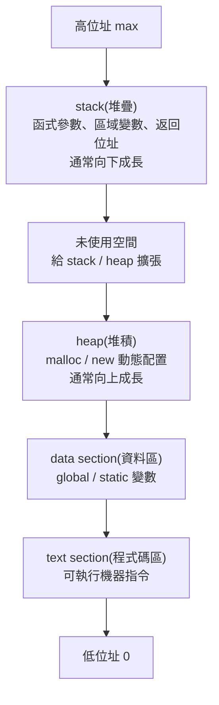

---

#### 再補一個你之後很常連到的觀念

到了多執行緒(multithread)時，常見情況是：

* **code / data / heap** 共享
* **每個 thread 有自己的 stack**

這也是為什麼 thread 跟 process 的記憶體模型不一樣。教材第 4 章有直接畫出這件事。

---

#### 一句話總結

這張投影片的核心是在告訴你：

**行程(Process)不是只有程式碼，而是一個正在執行中的完整記憶體與 CPU 狀態集合；右圖則是在畫它典型的記憶體配置：text、data、heap、stack。** 

若你要，我下一則可以直接幫你做一份「text / data / bss / heap / stack 一次分清楚」的超好背表格。

[1]: https://www.intel.com/content/www/us/en/docs/programmable/743810/24-1/placement-of-the-heap-and-stack.html?utm_source=chatgpt.com "6.13.3. Placement of the Heap and Stack"


### 請講解、比較、舉例"global / static、local variable、malloc/new"

#### 先給你一個總圖

最容易背的方式不是先背「在 stack 還是 heap」，而是先背 **storage duration(儲存期)**：

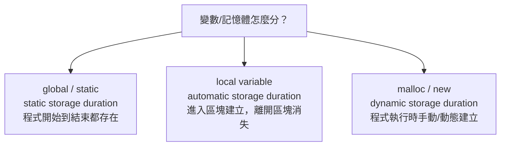

更精確地說，C/C++ 標準主要談的是 **automatic / static / dynamic storage duration(自動／靜態／動態儲存期)**；而「stack(堆疊) / heap(堆積)」是非常常見的實作模型。你的課內教材也是用 data section、stack、heap 來教，這樣考試最好記，但寫程式時要知道那是常見實作，不是語言標準逐字保證。 ([cppreference.com][1])

#### 1. global / static 是什麼？

這一類的共同點是：**活得很久**。
它們通常有 **static storage duration(靜態儲存期)**，也就是程式開始時就存在，到程式結束才消失。教材也把 **initialized global and static variables(已初始化的全域與靜態變數)** 放在 **data section(data segment，資料區段)**，未初始化的通常在 **BSS**。 ([cppreference.com][1])

先看最普通的 **global variable(全域變數)**：

```c
int g = 10;   // global variable
```

這個 `g` 寫在所有函式外面，整個程式都能用，生命週期是整個程式。社群上最常見的說法是：**global 也是 static duration，只是它的可見範圍比較大**。([cppreference.com][1])

再看 **static**，它最容易讓人混亂，因為它有兩種常見用法。

第一種是 **file-scope static(檔案層級的 static)**：

```c
static int secret = 99;
```

這個也是活到程式結束，但它只在**這個 `.c` 檔案內可見**，也就是 **internal linkage(內部連結)**。你可以把它想成「公司公告欄」和「部門內部便條紙」的差別：
普通 global 像公司公告欄，別的檔案可用 `extern` 看到；
file-scope static 像部門內部便條紙，只有本檔案看得到。([Cppreference][2])

第二種是 **static local variable(靜態區域變數)**：

```c
void f(void) {
    static int count = 0;
    count++;
    printf("%d\n", count);
}
```

這個 `count` 很特別：
它的 **scope(作用域)** 只在 `f()` 裡，所以「看起來像 local」；
但它的 **lifetime(生命週期)** 卻是整個程式，所以每次呼叫 `f()` 時，它都會保留上一次的值。教材也直接用這個例子說明，並指出這類會放在 data segment。 ([Cppreference][3])

所以一句話整理：

**global / static 的核心不是「在哪宣告」，而是它們通常有 static storage duration(靜態儲存期)。**
只是普通 global 可見範圍大，`static` 會改變它的可見性，或讓函式內變數變成「值會保留」。([cppreference.com][1])

---

#### 2. local variable 是什麼？

**local variable(區域變數)** 是你在函式或區塊裡直接宣告、而且沒有加 `static` 的變數。
這類通常有 **automatic storage duration(自動儲存期)**：進入那個區塊時建立，離開就消失。cppreference 對 C 的說法很明確：所有函式參數和 non-static 的 block-scope objects 都屬於 automatic storage duration。教材則用比較直觀的說法：這類通常放在 **stack memory**，用來存 local variables、function parameters、return addresses。([cppreference.net][4]) 

例如：

```c
void f(void) {
    int x = 5;
    int a[100];
}
```

這裡的 `x` 和 `a` 都是 local variable。
你前一題問的「local variable 包不包括陣列」，答案就是：**包括，只要它是函式內直接宣告、又不是 `static`**。教材也直接寫到 stack 用來放 local variables。 ([cppreference.net][4])

但這裡有一個非常值得你現在就建立的精確觀念：

**local ≠ 一定在 stack**。
在課堂和實作裡，我們通常先記成「local 通常在 stack」完全沒問題；但更嚴格地說，語言標準保證的是它有 automatic storage duration，不是逐字保證一定在某種實體區域。社群上也常有人特別提醒這個 distinction(區分)。([cppreference.net][4])

---

#### 3. malloc / new 是什麼？

這一類的共同點是：**執行到那行程式時，才動態要一塊記憶體**。
它們對應的是 **dynamic storage duration(動態儲存期)**。教材把這塊記憶體叫做 **heap memory**，並指出它適合那些要超過單次函式呼叫還繼續存在的資料。 ([cppreference.com][1])

##### malloc(動態配置，C 常見)

```c
int *p = malloc(10 * sizeof(int));
```

`malloc()` 會配置一塊大小為 `10 * sizeof(int)` 的記憶體，回傳指標。Linux man page 明確說這塊記憶體 **不會初始化(not initialized)**，所以你配置完最好自己填值；而且用完要 `free(p)`。([man7.org][5])

```c
int *p = malloc(10 * sizeof(int));
if (p == NULL) {
    /* allocation failed */
}
for (int i = 0; i < 10; i++) p[i] = 0;
free(p);
```

你可以把 `malloc` 想成：
不是在家裡櫃子裡拿一個抽屜，而是臨時去倉庫租一塊空地。你要自己記得租多少、怎麼用、什麼時候歸還。([man7.org][5])

##### new(C++ 常見)

```cpp
int* p = new int[10];
delete[] p;
```

C++ 的 **new-expression** 是建立 **dynamic storage duration** 物件或物件陣列的標準方式。cppreference 明講，`new-expression` 會取得儲存空間並建立 object / array of objects；配對要用 `delete` 或 `delete[]`。一般情況下，配置失敗會以 `std::bad_alloc` 回報，而不是回傳 `NULL`。([Cppreference][6])

所以：

* `malloc`：偏 C 風格，拿到的是一塊原始記憶體(raw storage)，預設不初始化。([man7.org][5])
* `new`：偏 C++ 風格，建立的是物件(object)或物件陣列，並有對應的 `delete` / `delete[]`。([Cppreference][6])

---

#### 4. 三者最核心的比較

##### A. 活多久？

* **global / static**：從程式開始活到程式結束。([cppreference.com][1])
* **local variable**：進入區塊建立，離開區塊消失。([cppreference.net][4])
* **malloc / new**：你配置後一直存在，直到 `free` / `delete` / `delete[]`。([man7.org][5])

##### B. 誰幫你回收？

* **global / static**：不用你手動回收，程式結束才消失。([cppreference.com][1])
* **local variable**：離開函式或區塊，自動回收。([cppreference.net][4])
* **malloc / new**：通常要你自己回收，不然容易 **memory leak(記憶體洩漏)**。教材與 Linux 手冊都提醒 heap 類錯誤常跟釋放不正確有關。 ([man7.org][7])

##### C. 常見放哪裡？

* **global / static**：通常在 data / bss。 ([Stack Overflow][8])
* **local variable**：通常在 stack。 ([cppreference.net][4])
* **malloc / new**：通常在 heap。 ([man7.org][5])

##### D. 最常犯的錯

* **global / static**：共享狀態太多，程式邏輯容易亂，尤其多執行緒下更危險。教材也提到 shared-memory programming 要小心同步。
* **local variable**：把它的位址回傳出去，函式結束後就變成無效位址。教材直接把這列成常見記憶體錯誤。
* **malloc / new**：忘記釋放、重複釋放、越界寫入、`malloc/free` 與 `new/delete` 配錯。Valgrind 的 Memcheck 也特別會抓這些配對和非法存取問題。([man7.org][7])

---

#### 5. 一次看懂的例子

##### 例子一：global / static / local 同時出現

```c
#include <stdio.h>

int g = 10;          // global
static int sg = 20;  // file-scope static

void f(void) {
    int x = 1;            // local variable
    static int cnt = 0;   // static local variable
    cnt++;
    printf("x=%d, cnt=%d\n", x, cnt);
}

int main(void) {
    f();
    f();
    printf("g=%d, sg=%d\n", g, sg);
}
```

執行重點是：

* `x` 每次進 `f()` 都重新建立，所以每次都是 `1`。
* `cnt` 只初始化一次，之後會保留，所以輸出會是 `1`、`2`、`3` 這樣累加。
* `g` 和 `sg` 也是整個程式期間都存在。教材和 cppreference 對這三種行為的描述是一致的。 ([cppreference.com][1])

##### 例子二：malloc

```c
#include <stdlib.h>
#include <stdio.h>

int main(void) {
    int n = 5;
    int *a = malloc(n * sizeof(int));
    if (a == NULL) return 1;

    for (int i = 0; i < n; i++) a[i] = i * 10;

    for (int i = 0; i < n; i++) printf("%d ", a[i]);

    free(a);
    return 0;
}
```

這裡 `a` 這個指標變數本身是 **local variable**，通常在 stack；
但 `a` 指到的那塊陣列記憶體是 **dynamic storage**，通常在 heap。這正是很多初學者第一次會混淆的地方。([cppreference.net][4])

##### 例子三：new

```cpp
#include <iostream>
using namespace std;

int main() {
    int* a = new int[5];
    for (int i = 0; i < 5; i++) a[i] = i * 100;

    for (int i = 0; i < 5; i++) cout << a[i] << " ";

    delete[] a;
}
```

這和 `malloc` 的概念很像：
`a` 是 local variable；
`new int[5]` 建出的陣列是動態儲存期；
配對釋放必須用 `delete[]`，不能用 `free()`。Valgrind 文件和 GCC/編譯器文件都提醒 mismatched deallocation 會出問題。([Cppreference][6])

---

#### 6. 社群上最常搞混的點

##### 混淆 1：static local 算不算 local？

**看哪個面向。**

* 以 **scope(作用域)** 來說，它是 local，因為只能在那個函式裡用。([Stack Overflow][9])
* 以 **storage duration(儲存期)** 來說，它不是 automatic，而是 static。([cppreference.com][1])

所以你如果考試回答：

> static local variable「作用域是 local，但生命週期是整個程式」

這句很漂亮，也很精確。([Stack Overflow][9])

##### 混淆 2：指標是 local，指到的資料也一定是 local 嗎？

**不一定。**

```c
void f() {
    int *p = malloc(sizeof(int));
}
```

`p` 是 local variable；
但 `*p` 所在的那塊記憶體是 heap/dynamic storage。
這就像你手上拿著一張倉庫租約：租約紙在你手上，但貨物在倉庫。([cppreference.net][4])

##### 混淆 3：global 跟 static 哪個比較「大」？

如果是指**可見範圍**：

* 普通 global 比較大，可跨檔案。([Stack Overflow][10])
* file-scope static 比較小，只限本檔案。([Stack Overflow][10])

如果是指**活多久**：

* 兩者通常都活到程式結束。([cppreference.com][1])

---

#### 7. 你可以這樣背，最不容易錯

我建議你背這三句：

1. **global / static：活整個程式。** ([cppreference.com][1])
2. **local variable：活一個區塊或一次函式呼叫。** ([cppreference.net][4])
3. **malloc / new：活到你把它 free / delete 為止。** ([man7.org][5])

再補一個超常考的例外句：

> **static local：看起來在函式裡，但不會跟著函式結束而消失。**  ([Cppreference][3])

---

#### 8. 如果你要自己在 Ubuntu VM 驗證，最可靠的方法

你這種題目，光背還不夠，**自己跑一次最穩**。
在你的 Ubuntu VM 上，C/C++ 記憶體錯誤最實用的兩套工具是：

* **AddressSanitizer(位址消毒器, ASan)**：GCC 官方文件說它能抓 out-of-bounds(越界) 與 use-after-free(釋放後再用) 這類錯誤。([GCC][11])
* **Valgrind Memcheck**：官方文件會攔截 `malloc/new/new[]/free/delete/delete[]`，用來抓記憶體錯誤與錯誤配對。([Valgrind][12])

你之後寫作業時，C 可以這樣編：

```bash
gcc -g -O0 -fsanitize=address your_file.c -o a.out
./a.out
```

或用 Valgrind：

```bash
gcc -g -O0 your_file.c -o a.out
valgrind --leak-check=full ./a.out
```

這比只靠肉眼看 code 可靠很多，尤其在 `malloc/new` 題目上。([GCC][11])

---

#### 最後幫你濃縮成一句話

**global / static**：像「固定放在家裡的家具」，一直都在。
**local variable**：像「借你這次上課用的白板筆」，下課就收走。
**malloc / new**：像「你臨時租的倉庫空間」，不用時要自己退租。([cppreference.com][1])

下一則我可以直接幫你整理成「宣告方式 → 放哪裡 → 活多久 → 誰釋放 → 常見錯誤」的超好背考前表。

[1]: https://cppreference.com/book/storage_durations.html?utm_source=chatgpt.com "storage durations - cppreference.com"
[2]: https://en.cppreference.com/w/c/language/storage_duration.html?utm_source=chatgpt.com "Storage-class specifiers - cppreference.com"
[3]: https://en.cppreference.com/w/c/language/static_storage_duration.html?utm_source=chatgpt.com "Static storage duration - cppreference.com"
[4]: https://cppreference.net/c/language/storage_duration.html?utm_source=chatgpt.com "Storage-class specifiers - cppreference.net"
[5]: https://man7.org/linux/man-pages/man3/malloc.3.html?utm_source=chatgpt.com "malloc(3) - Linux manual page"
[6]: https://www.en.cppreference.com/w/cpp/memory/new.html?utm_source=chatgpt.com "Low level memory management - cppreference.com"
[7]: https://man7.org/linux/man-pages/man3/free.3.html?utm_source=chatgpt.com "malloc(3) - Linux manual page"
[8]: https://stackoverflow.com/questions/44359953/are-global-variables-in-c-stored-on-the-stack-heap-or-neither-of-them?utm_source=chatgpt.com "Are global variables in C++ stored on the stack, heap or neither of them? - Stack Overflow"
[9]: https://stackoverflow.com/questions/15134916/is-it-correct-to-call-a-static-variable-local?utm_source=chatgpt.com "c - Is it correct to call a static variable local? - Stack Overflow"
[10]: https://stackoverflow.com/questions/51329671/difference-between-static-global-variable-and-non-static-global-variable-in-c?utm_source=chatgpt.com "Difference between static global variable and non-static global variable in C - Stack Overflow"
[11]: https://gcc.gnu.org/onlinedocs/gcc/Instrumentation-Options.html?utm_source=chatgpt.com "Instrumentation Options (Using the GNU Compiler Collection (GCC))"
[12]: https://valgrind.org/docs/manual/mc-manual.html/?utm_source=chatgpt.com "Valgrind"


## Text Section(程式碼區／文字區／text segment)

#### 這張圖在講什麼？

這張投影片是在專講 **Text Section(程式碼區／文字區／text segment)**。
核心意思只有一句：

**Text section 就是放「可執行機器指令(machine instructions)」的地方。**
教材直接寫它包含程式的 **executable code(可執行程式碼)**，也就是處理器可以直接執行的指令序列。

---

#### 一句話先懂

你可以把整個程式想成一本食譜：

* **text section** = 食譜上的「步驟」
* **data section** = 食材的固定資料
* **stack / heap** = 做菜過程中臨時拿來放東西的工作區

所以 **text section 不是拿來放變數值的**，而是拿來放「CPU 要做哪些動作」。

---

#### 逐點翻譯＋講解

投影片的五點其實可以拆成下面這樣：

##### 1. contains the executable code

意思是：

**這裡放的是程式真正要執行的程式碼。**
不是原始碼 `.c`、`.cpp` 那種人看的文字，而是編譯後的 **machine instructions(機器指令)**。

例如你寫：

```c
int add(int a, int b) {
    return a + b;
}
```

CPU 不會直接看懂這段 C 程式。
編譯器會把它翻成機器指令，最後那些指令就會進到 **text section**。這點也符合一般 object file / executable 的 code segment 定義。([Oracle Docs][1])

---

##### 2. stores the machine instructions

這句是在強調：

**text section 放的是 CPU 可以直接跑的低階指令。**
也就是像 `load`、`add`、`jump`、`call` 這類最終處理器理解的內容，而不是單純「程式文字」。教材原文就是這樣寫的。

這也是為什麼在作業系統課講 process layout 時，會把 **text** 跟 **data / stack / heap** 分開看：
因為它們用途根本不同。

---

##### 3. specifies the sequence of operations

這句是在說：

**text section 裡的指令，決定了程式執行的流程。**
例如先做加法、再呼叫函式、再判斷 if、再跳到某個位址繼續跑，這些「執行步驟順序」都是靠 text section 裡的指令定義的。

你可以把它記成：

> **text section = 行為規則**
>
> **data / stack / heap = 被操作的資料**

---

##### 4. usually read-only

這句非常重要。

教材說 **text section 通常是 read-only(唯讀)**。
這樣設計的好處有兩個：

第一，**保護程式碼不被意外改壞**。
如果程式跑一跑可以隨便把自己的指令覆寫掉，那非常容易壞掉，安全性也很差。

第二，**比較容易共享(shared)**。
因為既然不會改，作業系統就可以讓多個正在執行的相同程式，共用同一份 code pages，而不用每個 process 都複製一份。教材也直接寫「shared among multiple instances of the same program」。
ELF / linker 文件也把 text segment 描述成 **read-only executable loadable segment**。([Oracle Docs][1])

但這裡有一個精確但書：
投影片寫的是 **usually read-only**，不是「永遠絕對」。在某些特殊情況，像 JIT(即時編譯) 或 `mprotect` 改頁面權限，確實可以讓某些區域變成可執行甚至可修改；只是那不是你現在這張基礎投影片的主軸。([Oracle Docs][2])

---

##### 5. mapped into memory from the program's executable file

這句很多同學第一次看會卡住，我幫你翻成白話：

**程式執行時，作業系統會把可執行檔(executable file)裡面屬於 code 的那一部分，對映(mapped)到這個 process 的記憶體空間。** 

也就是說，不是你一按執行，系統就「手抄一份原始碼到 RAM」；
而是 loader / OS 依照 executable 格式，把對應的 segment 載入或映射到 process 的虛擬位址空間。Program loading 文件也說明了系統會把檔案中的 segment 對應到 process image 的 virtual memory segment。([Oracle Docs][3])

這和你們後面第 9 章的 **memory-mapped file(記憶體映射檔案)** 觀念其實有呼應：
「把檔案內容對映到虛擬記憶體」本來就是 OS 很核心的技巧，教材後面也有講。

---

#### 為什麼 text section 常常可以被多個 process 共用？

因為它通常是**唯讀**。
如果你今天同時開了 3 個 `/bin/ls`，它們的 **code** 大致相同，OS 沒必要浪費記憶體複製 3 份完全一樣的機器指令。唯讀頁面很適合共享，這也是教材說它可被 multiple instances 共用的原因。
Linker 文件也提到 text segment 的共享性與唯讀屬性密切相關。([Oracle Docs][4])

不過要注意：

* **共享的是 code / read-only 部分**
* **不是每個 process 的全部記憶體都共享**

像 stack、很多 writable data，通常還是各自獨立。這也是你前面學到 process 彼此有自己 address space 的原因。

---

#### text section 和其他區塊怎麼比？

##### text section

* 放 **machine instructions(機器指令)**
* 通常 **read-only**
* 常可被相同程式的多個實例共享 

##### data section

* 放 initialized **global / static variables**
* 通常可寫入(writable) 

##### stack

* 放 **local variables、function parameters、return addresses**
* 函式呼叫時自動管理 

##### heap

* 放 `malloc/free`、`new/delete` 那種動態配置資料
* 存活期可跨函式呼叫 

---

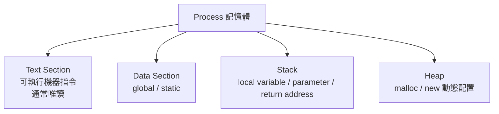

---

#### 最容易考的觀念

##### Q1：text section 裡放的是不是 C 原始碼？

不是。
放的是編譯後的 **machine instructions(機器指令)**。

##### Q2：text section 為什麼常是唯讀？

為了**保護程式碼**、也為了讓相同程式的多個實例能**共享同一份 code**。

##### Q3：text section 是不是變數區？

不是。
變數通常在 **data / stack / heap**，不是 text。

##### Q4：text section 從哪裡來？

通常是從 **program’s executable file(可執行檔)** 映射進 process 的記憶體空間。

---

#### 你可以直接這樣背

**Text section = executable code = machine instructions = 通常 read-only = 可由多個相同程式實例共享 = 來自 executable file 的映射。**

如果你要，我下一則可以直接幫你接著講 **Data section / BSS / Text section 三者差異**，這個很容易一起考。

[1]: https://docs.oracle.com/cd/E23824_01/html/819-0690/gjpww.html?utm_source=chatgpt.com "Predefined Segments - Linker and Libraries Guide"
[2]: https://docs.oracle.com/cd/E26505_01/html/E26506/gjpky.html?utm_source=chatgpt.com "Mapfile Directives - Linker and Libraries Guide"
[3]: https://docs.oracle.com/cd/E19957-01/806-0641/chapter6-34713/index.html?utm_source=chatgpt.com "Program Loading (Processor-Specific) (Linker and Libraries Guide)"
[4]: https://docs.oracle.com/cd/E19683-01/816-1386/6m7qcobl6/index.html?utm_source=chatgpt.com "Performance Considerations (Linker and Libraries Guide)"


### 映射是啥

#### 什麼叫「映射」？

最生活化的比喻：

你有一本很厚的書放在圖書館（檔案在磁碟）。
你桌上有一份索引卡（虛擬位址空間）。
映射不是把整本書先影印到你桌上，而是先在索引卡寫：

桌上第 A 區 → 書的第 1 章

桌上第 B 區 → 書的第 2 章

之後你真的翻到 A 區時，館員才把那幾頁送來。
這就是「先建立對應，再按需載入」的感覺。


#### 為什麼要用「映射」，不要每次都整份複製？

因為映射有幾個很大的好處：

1. 省時間

不必一開始就把整個檔案都搬進 RAM (也就是說這些 text + data + heap + stack是在 RAM 中)。很多程式碼頁面可能根本不會執行到。官方文件明講，很多 pages 可能永遠不會被 referenced，所以延後實體讀取能提升效能。

2. 省記憶體

相同程式的 read-only text pages 可以共享。這也是教材說 text section 常可被多個相同程式實例共享的原因。

3. 權限清楚

mmap() 可以指定 PROT_READ、PROT_WRITE、PROT_EXEC，所以 code 頁通常可執行但不可改，data 頁通常可讀寫。


#### mmap() 的「映射」跟「複製」差在哪？

這裡最容易誤解，我直接對比：

複製(copy)

你真的把檔案內容讀出來，放進一塊新記憶體裡。
之後那塊記憶體和原檔案可以完全脫鉤。

映射(map)

你建立「這段虛擬位址對應到那個檔案 offset」的關係。
Linux mmap(2) 手冊明講：file mapping 的內容，是由檔案中某個 offset 開始的 length bytes 來初始化。

所以映射比較像：

- 不是先整份搬家
- 是先建立地址翻譯規則
- 真正碰到頁面時再處理


#### 再問一個你現在很該懂的問題：text section 是「被載入」還是「被映射」？

兩個都可以講，但精確度不同。

課堂口語講法：
text section 被載入到記憶體

更精確的 OS / VM 講法：
text section 常是從 executable file 映射到 process 的虛擬位址空間中，再由 demand paging 視需要把頁面帶進 RAM。

所以你看到教材寫 mapped into memory from the executable file，就是在用比較精確的講法。


## Data Section(資料區 / data segment)


#### 這張圖在講什麼？

這張投影片是在講 **Data Section(資料區 / data segment)**。
最核心一句話是：

**Data section 主要放的是具有 static storage duration(靜態儲存期) 的資料，也就是 global variable(全域變數) 與 static variable(靜態變數)；其中已初始化的通常在 `.data`，未初始化的通常在 `.bss`。** 教材也明確寫到：initialized global/static 在 data section，而 uninitialized global/static 常稱為 **bss/common section**，會在程式執行前被系統設成 0。 

---

#### 先講白話版

你可以把 **data section** 想成：

> 程式一啟動，就已經先幫你準備好的「固定資料櫃」

這個櫃子裡放的，不是函式裡臨時用一下就消失的東西，
而是那種：

* 程式一開始就存在
* 不會因為函式結束就消失
* 整個程式執行期間都會在

的資料。這也是為什麼它和 **stack**、**heap** 分開講。

---

#### 投影片每一點在說什麼

##### 1. initialized global and static variables

教材這句的重點是：

* **global variable(全域變數)**：函式外宣告
* **static variable(靜態變數)**：包含函式內的 `static` 區域變數，或檔案層級的 `static`

只要它們是**已初始化(initialized)**，通常就會放在 **initialized data segment**。 

例如：

```c
int g = 10;          // global，已初始化
static int s = 20;   // static，已初始化
```

這兩個都屬於教材說的 data section 典型成員。

---

##### 2. global scope 與 static local

這句是在提醒你：

**不是只有函式外面的變數才可能進 data section。**

函式裡面如果有：

```c
void f() {
    static int cnt = 0;
}
```

`cnt` 雖然**作用域(scope)** 在函式內，
但它的**生命週期(lifetime)** 是整個程式期間，所以教材也特別說它會放在 data segment。

這個是超常考點：

* `int x = 3;` → 普通 local variable，通常在 stack
* `static int x = 3;` → static local variable，通常在 data section

也就是說，**你不能只看它寫在函式裡還是外面，還要看有沒有 `static`。**

---

##### 3. initialized arrays 也可能在 data section

教材這句是說：

像這種已初始化的全域陣列，也會在 data section：

```c
int arr[3] = {1, 2, 3};
```

因為它是**全域 + 已初始化**。

但你要小心不要一看到陣列就以為都在 data section。
陣列放哪裡，要看它是哪一種宣告方式：

* `int a[100];` 在函式裡 → 通常 stack
* `static int a[100];` 在函式裡 → data / bss
* `int a[100] = {...};` 在函式外 → data
* `malloc(...)` 配出來的陣列 → heap

---

##### 4. data section is writable

這點也很重要。

教材說 **data section 是 writable(可寫的)**，代表程式執行中可以修改它的值。

例如：

```c
int g = 10;

int main() {
    g = 99;
}
```

這種修改是合理的，因為 `g` 在 writable data section。

這也剛好和你前一張投影片的 **text section** 形成對比：

* **text section**：通常 read-only，放指令
* **data section**：通常 writable，放可修改資料 

---

##### 5. uninitialized global/static 其實多半是 `.bss`

這張投影片寫得有一點容易讓初學者誤會，我幫你精確化：

教材說未初始化的 global / static variables 常稱為 **bss** 或 **common section**，並在程式開始前被設成 0。 

更精確地講，在 ELF 裡通常會分成：

* **`.data`**：initialized data
* **`.bss`**：uninitialized data，執行前視為 0 初始化

Oracle 的 ELF 文件也是這樣定義：`.data` 是 initialized data；`.bss` 是 uninitialized data，系統在程式開始執行時以 0 初始化，而且 `.bss` 不佔用檔案空間。([Oracle 文檔][1])

所以考試背法可以是：

* **已初始化全域 / 靜態變數** → `.data`
* **未初始化全域 / 靜態變數** → `.bss`

有些老師或教材會把 `.data + .bss` 口語合稱成「data segment」，但嚴格一點它們是不同 section。

---

##### 6. constants 這句要保留但不要背太死

投影片最後一句寫：

> Constants defined in the source code, such as const variables, may also be stored in the data section. 

這句**不能說完全錯**，但你不要背成「所有 const 一定都在 data section」。

更精確地說：

* 很多 **read-only data(唯讀資料)** 會被放在 **`.rodata`**
* `.rodata` 是 read-only data section，通常屬於 non-writable segment
  Oracle 文件直接把 `.rodata` 定義成 read-only data。([Oracle 文檔][2])

而且 Oracle 也舉例說明：

* `char *rdstr = "..."` 這種，指標本身可能在 writable `.data`
* `const char *rdstr = "..."` 裡的字串常會在 `.rodata` ([Oracle 文檔][3])

所以這裡你要學會一個很重要的觀念：

> **「const」不等於一定在 `.data`，很多時候反而更可能在 `.rodata`。**

也就是說，這張投影片這一句適合先理解成「常數資料可能在靜態區域的一部分」，但做 ELF / 編譯器 / linker 題時，最好進一步區分 `.data` 與 `.rodata`。

---

#### 我幫你整理成一張你現在最好背的表

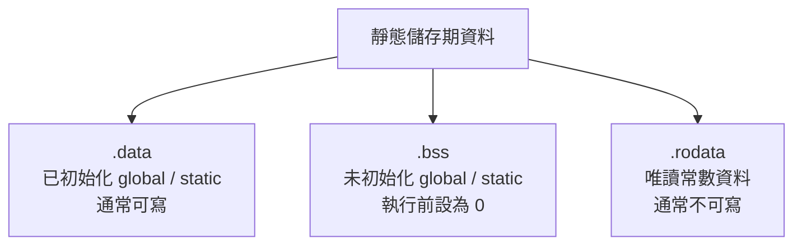

---

#### 用程式直接對照最清楚

```c
#include <stdio.h>
#include <stdlib.h>

int g1 = 10;          // .data
int g2;               // .bss
static int s1 = 20;   // .data
static int s2;        // .bss
const char *msg = "Hi"; // 指標本身常在 .data，字串常在 .rodata

void f() {
    int x = 5;              // stack
    static int cnt = 0;     // .data 或 .bss（看初始化）
    int *p = malloc(100);   // p 在 stack，malloc 出來的空間在 heap
}
```

你應該這樣讀：

* `g1`、`s1`：已初始化靜態資料 → `.data`
* `g2`、`s2`：未初始化靜態資料 → `.bss`
* `x`：普通 local variable → stack
* `p` 指到的空間 → heap
* `"Hi"` 這種字串常值通常是唯讀資料 → 常在 `.rodata`   ([Oracle 文檔][2])

---

#### 這張投影片最容易考的 5 件事

##### 1. Data section 放誰？

主要放 **global / static variables**。

##### 2. local variable 在不在 data section？

普通 local variable 不在。教材範例也直接說 local variables 在 stack，不在 data section。

##### 3. static local variable 在哪？

雖然寫在函式裡，但因為值要跨函式呼叫保留，所以在 data segment。

##### 4. uninitialized global/static 在哪？

更精確地說通常在 **`.bss`** (Data section裡面)，並且執行前被設成 0。 ([Oracle 文檔][1])

##### 5. const 一定在 data section 嗎？

不一定。很多唯讀常數會在 **`.rodata`** (Text section裡面)，不要背死。([Oracle 文檔][2])

---

#### 跟前一張 Text Section 一起比較

##### Text Section

* 放 machine instructions(機器指令)
* 通常 read-only
* 給 CPU 執行程式碼用 

##### Data Section

* 放 initialized global/static
* 通常 writable
* 給程式存取與修改靜態資料用 

##### BSS

* 放 uninitialized global/static
* 執行前設成 0
* 通常不佔 executable 的實際檔案內容空間  ([Oracle 文檔][1])

---

#### 一句話總結

**Data section 不是放函式裡臨時變數，而是放程式整個生命週期都存在的靜態資料；其中已初始化的通常在 `.data`，未初始化的通常在 `.bss`，而很多唯讀常數其實更常在 `.rodata`。**   ([Oracle 文檔][2])

你若要，我下一則我可以直接幫你做一張 **Text / Data / BSS / Stack / Heap** 的總整理對照表。

[1]: https://docs.oracle.com/cd/E19683-01/817-1974/817-1974.pdf?utm_source=chatgpt.com "Linker and Libraries Guide"
[2]: https://docs.oracle.com/cd/E23824_01/html/819-0690/chapter7-1.html?utm_source=chatgpt.com "Special Sections - Linker and Libraries Guide"
[3]: https://docs.oracle.com/cd/E19641-01/802-1955/802-1955.pdf?utm_source=chatgpt.com "Linker and Libraries Guide"


## Stack memory(堆疊記憶體)


### 講解
#### 這張投影片在講什麼

這張是在專講 **Stack memory(堆疊記憶體)**。
它想傳達的核心是：

**Stack 是專門服務「函式呼叫(function call)」的一塊記憶體區域。**
裡面通常放：

* **local variables(區域變數)**
* **function parameters(函式參數)**
* **return address(返回位址)**
* 其他和呼叫流程有關的資料

這也和你們教材前面整理的一致。 

---

#### 先用最白話方式理解

你可以把 stack 想成一疊托盤。

* 呼叫一個函式，就像**再疊上一個新托盤**
* 函式裡的區域變數、參數，就放在那個托盤上
* 函式結束，就把最上面那個托盤拿掉

所以它是 **LIFO(Last-In, First-Out，後進先出)**。
教材這張投影片也直接這樣寫。

---

#### 1. 為什麼函式呼叫會用 stack？

因為函式呼叫天然就很適合「後進先出」。

例如：

```c
void C() { }
void B() { C(); }
void A() { B(); }

int main() { A(); }
```

執行順序是：

* `main()` 呼叫 `A()`
* `A()` 呼叫 `B()`
* `B()` 呼叫 `C()`

那返回時一定是反過來：

* `C()` 先回去 `B()`
* `B()` 再回去 `A()`
* `A()` 再回去 `main()`

這就是標準的後進先出。
所以用 stack 來管理函式呼叫，非常自然。教材也把 stack 定義成用於 function calls 與 local variables 的區域。

---

#### 2. stack 裡面到底放什麼？

你現在先記這四種最重要：

##### local variables(區域變數)

例如：

```c
void f() {
    int x = 10;
    int arr[100];
}
```

這裡的 `x` 和 `arr`，在課堂簡化模型裡都屬於 stack 上的資料。教材也是這樣教。

##### function parameters(函式參數)

例如：

```c
int add(int a, int b) {
    return a + b;
}
```

`a`、`b` 是這次呼叫 `add()` 所需要的資料，通常和這次呼叫的 stack frame 一起管理。教材也列出 function parameters。

##### return address(返回位址)

函式跑完後，CPU 要知道「回哪一行繼續執行」。
這個位置資訊就是 **return address**。教材也明講 stack 會存 return addresses。

##### 其他 function-related data

例如某些暫存器保存值、對齊資訊、呼叫慣例需要的額外空間。這些細節會依 **calling convention(呼叫慣例)** 和架構不同而變。這屬於更底層的 ABI 細節。

---

#### 3. 什麼是 stack frame(堆疊框架)？

雖然你這張投影片沒直接寫這個詞，但它是理解 stack 最關鍵的概念之一。

每呼叫一次函式，通常就會建立一個 **stack frame(堆疊框架)**。
你可以把它想成：

> 這一次函式呼叫專屬的小工作區

裡面常放：

* 這次呼叫的參數
* 區域變數
* 返回位址
* 一些暫存資訊

所以 `main -> A -> B -> C` 時，stack 上常像這樣：

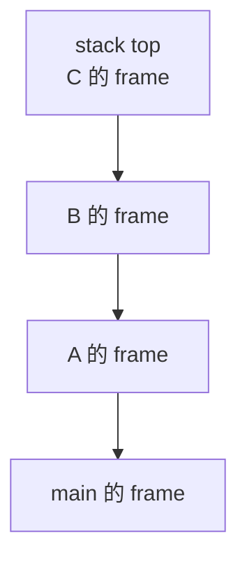

`C()` 結束時，最上面的 frame 先被移掉。
這就是 LIFO。

---

#### 4. 為什麼 stack 常被說「自動管理」？

因為和 heap 不同，stack 通常不需要你手動 `free()` 或 `delete()`。

教材寫的是：

> stack 的配置與釋放是由 compiler 或 runtime system 自動處理。

白話就是：

* 進入函式：系統幫你騰出一塊 stack 空間
* 離開函式：系統自動把那塊空間回收

所以像這樣：

```c
void f() {
    int x = 5;
}
```

`x` 不需要你自己回收。
`f()` 結束，`x` 對應的 stack 空間就自動失效了。

這也是為什麼 **返回 local variable 位址** 會出事。教材後面也特別把這列成常見記憶體錯誤。

---

#### 5. 為什麼 stack 通常比較快？

因為 stack 的管理方式很規律：

* 只要移動 **stack pointer(堆疊指標)**
* 幾乎不需要像 heap 那樣找零散可用區塊
* 不太會有 heap 那種 **fragmentation(碎裂)** 問題

教材也直接比較過：

* stack 是連續記憶體
* 自動配置 / 釋放
* access time 較快
* main issue 比較偏向空間不足，而不是碎裂 

所以你可以把它記成：

> **stack 快，是因為規則單純。**
> **heap 彈性大，但管理成本高。**

---

#### 6. 這張投影片哪裡要小心？有一點講得太簡化

投影片有一句：

> Stack memory is limited in size and fixed at compile time.

這句拿來教初學者方向上還可以，但**精確來說太粗略**。

更正確的說法是：

* **stack 通常有大小限制**
* 但這個限制往往是由 **作業系統 / 執行環境 / 執行檔設定 / thread attributes** 決定
* 不應該直接背成「一定在 compile time(編譯期) 固定」

在 Linux/NPTL 下，新 thread 的預設 stack size 會受到 **RLIMIT_STACK** 影響，也可以用 `pthread_attr_setstacksize()` 顯式設定；man page 也明講 **thread 的 stack size 是在 thread 建立時固定**，不是單純「編譯時固定」。([man7.org][1])

所以這裡你可以這樣修正背法：

* **教材簡化背法**：stack 較小、有限、通常比 heap 小
* **精確背法**：stack 大小通常受 OS / thread 建立設定限制，不是單靠編譯器決定 ([man7.org][1])

---

#### 7. local variable 一定「保證」在 stack 嗎？

在你這門課的簡化模型裡，先記：

* **local variable → stack**

這樣做題通常沒問題。教材也是這樣教。

但更精確地說，C/C++ 語言標準講的是 **automatic storage duration(自動儲存期)**：
區域變數在進入區塊時建立、離開時銷毀；至於底層實作是不是一定放在 stack，語言標準不直接強制。cppreference 也是這樣整理。([CPP參考][2])

所以考試通常答：

* **課堂講法**：local variable 在 stack
* **語言精確講法**：多半是 automatic storage duration，stack 是常見實作

---

#### 8. 為什麼 stack 容易 overflow(溢位)？

教材後面有直接點出兩個常見原因：

* **函式呼叫太深**，例如 recursion(遞迴) 太深
* **區域變數太大**，例如在函式裡宣告很大的陣列 

例如：

```c
void f() {
    int a[10000000];
}
```

這種就很容易把 stack 撐爆。

再例如：

```c
void recur() {
    recur();
}
```

沒有停止條件的遞迴，stack frame 會一直疊上去，也很容易 stack overflow。

---

#### 9. stack 和 heap 最重要的比較

##### stack

* 給函式呼叫用
* 自動配置 / 回收
* 後進先出
* 通常較快
* 空間通常較小
* 容易出現 stack overflow  

##### heap

* 給動態配置用
* `malloc/free`、`new/delete`
* 彈性大
* 管理成本較高
* 容易 memory leak / fragmentation  

---

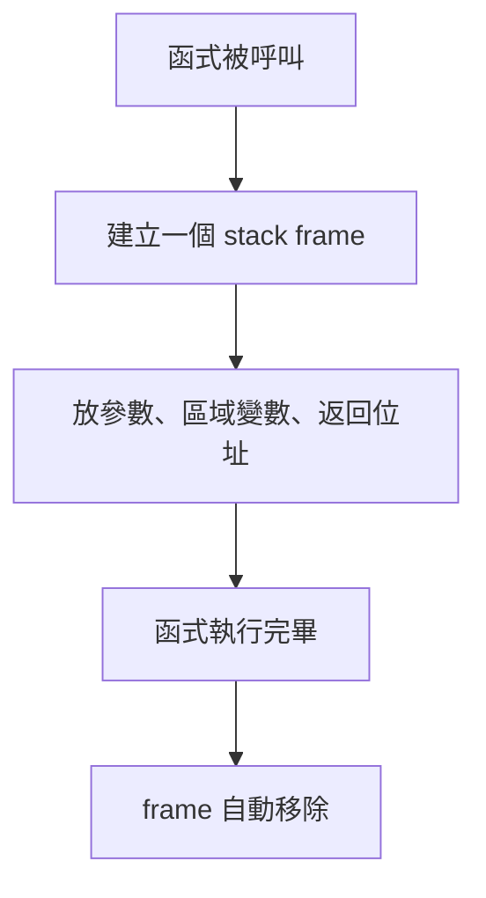

---

#### 10. 多執行緒時還要再補一個觀念

到了 thread(執行緒) 那章，這件事很重要：

**每個 thread 通常都有自己的 stack。**
教材在 pthread 那章也直接寫了：每個 pthread 都需要自己的 stack 來存 local variables 和 function call information；如果 thread 太多、stack 太大，會消耗很多記憶體，甚至造成 stack overflow。

所以：

* 同一個 process 的多個 thread 常會共享 code / heap / global data
* 但**各自有自己的 stack**

這點你之後學 race condition、thread-local 行為時會非常重要。

---

#### 這張投影片最容易考的重點

##### 第一個重點

**stack 用來管理 function calls。**
所以 local variables、parameters、return addresses 常在這裡。

##### 第二個重點

**stack 是 LIFO。**
最後進去的那層函式，最先返回。

##### 第三個重點

**stack 是自動管理。**
不像 heap 要自己 `free/delete`。

##### 第四個重點

**stack 通常較快，但比較小。**
而且容易因深遞迴或大區域變數而 overflow。 ([man7.org][1])

##### 第五個重點

投影片的「fixed at compile time」要保留但別背死；更精確是**受執行環境與 thread 建立設定影響**。([man7.org][1])

---

#### 一句話總結

**Stack memory 是用來支撐函式呼叫的自動管理記憶體區；它以 LIFO 方式運作，通常存放區域變數、參數與返回位址，速度快但空間有限，也因此特別怕深遞迴和大區域陣列。**  ([man7.org][1])

下一張如果你貼 **Heap memory**，我們就可以把兩者完整對照起來。

[1]: https://man7.org/linux/man-pages/man3/pthread_create.3.html?utm_source=chatgpt.com "pthread_create(3) - Linux manual page"
[2]: https://cppreference.com/book/storage_durations.html?utm_source=chatgpt.com "storage durations - cppreference.com"

#### main 也算是一種函數對不對，然後就算函數沒有新增任何變數(裡面的運算都用全域變數)，也會增加記憶體對不對
對，**`main` 也算函數(function)**。  
在 C 裡，`main` 是程式在 **hosted environment(有作業系統的執行環境)** 下的指定起點；C++ 也一樣把 `main` 視為全域命名空間中的那個特殊函數。[en.cppreference.com+1](https://en.cppreference.com/w/c/language/main_function.html?utm_source=chatgpt.com)


#### 第一個問題：`main` 算不算函數？

✅ 算。  
只是它是**很特殊的函數**：

- 程式不是從你自己手寫的其他函數開始，而是從 `main` 開始進入你的使用者程式邏輯
    
- 在 C/C++ 裡，`main` 都有特別規定的型態與行為[en.cppreference.com+1](https://en.cppreference.com/w/c/language/main_function.html?utm_source=chatgpt.com)
    

你可以先把它想成：

> `main` 就是「第一個被執行的使用者函數」。

---

#### 第二個問題：函數就算沒有新增任何區域變數，也會增加記憶體嗎？

✅ 一般來說，**會有一些額外成本**。  
因為函數呼叫不只是在跑程式碼，通常還要處理和呼叫流程有關的資料，例如：

- **return address(返回位址)**
    
- 可能需要保存的 **registers(暫存器)**
    
- 參數傳遞需要的空間
    
- 可能的 **stack frame(堆疊框架)** 管理資訊
    

所以即使函數裡**沒有宣告任何 local variable(區域變數)**，也不代表它是「零記憶體成本」。

```c
void recur() {  
    recur();  
}
```

這個例子很關鍵。  
就算你**完全沒有宣告區域變數**，只要每次呼叫都要保留「回來的位置」和呼叫狀態，遞迴還是會一層一層疊上去，最後可能 **stack overflow(堆疊溢位)**。


## Heap memory(堆積記憶體)


### 講解

#### 這張投影片在講什麼

這張是在講 **Heap memory(堆積記憶體)**。
最核心一句話：

**Heap 是給「執行期間動態配置(dynamic allocation)」用的記憶體區。**

也就是說，當你在程式跑到一半，才決定「我現在需要一塊空間」，這時常用的就是 heap。
在 C 裡常見是 `malloc()/free()`；在 C++ 裡常見是 `new/delete`。cppreference 將這類物件稱為 **dynamic storage duration(動態儲存期)** 物件；Linux 的 `malloc(3)` 也直接寫到 `malloc()` 通常從 heap 配置記憶體。([en.cppreference.com][1])

---

#### 先用白話理解

你可以把 heap 想成：

> 程式執行時，去倉庫臨時租空間。

跟 stack 不同，heap 不是「函式結束就自動回收」那種。
它比較像：

* 你要多少，執行時才去申請
* 你要用多久，自己決定
* 用完要記得還回去，不然就會變成 **memory leak(記憶體洩漏)** ([en.cppreference.com][2])

---

#### 1. 為什麼需要 heap？

因為有些資料：

* **大小執行前不知道**
* **要活得比單一函式更久**
* **可能很大，不適合放 stack**

例如：

* linked list(鏈結串列)
* tree(樹)
* dynamic array(動態陣列)
* 執行時才決定大小的 buffer(緩衝區)

這也是投影片最後一點在講的重點。
從語言角度看，這些通常屬於 **dynamic storage duration**。([en.cppreference.com][1])

---

#### 2. `malloc/free`、`new/delete` 在做什麼？

##### C 的 `malloc/free`

```c
int *p = malloc(10 * sizeof(int));
free(p);
```

`malloc()` 會配置一塊未初始化的儲存空間並回傳指標；
`free()` 則釋放先前配置的空間。Linux `malloc(3)` 與 cppreference 都是這樣定義的。([man7.org][3])

##### C++ 的 `new/delete`

```cpp
int* p = new int(42);
delete p;
```

`new` 建立的是 **dynamic storage duration** 物件；
`delete` 會銷毀該物件並呼叫對應的 deallocation。cppreference 也是這樣描述。([en.cppreference.com][4])

---

#### 3. 為什麼說 heap 適合「超過單一函式生命週期」的資料？

看這個例子：

```c
int* make_array(int n) {
    int *p = malloc(n * sizeof(int));
    return p;
}
```

這裡 `p` 這個指標變數本身是 **local variable(區域變數)**，通常在 stack。
但 `malloc()` 配出來的那塊空間在 heap，所以即使 `make_array()` 結束，那塊 heap 記憶體仍然存在，呼叫者還可以繼續使用它。這就是動態配置最典型的用途。([man7.org][3])

這也順便再提醒一次：

> **指標變數在哪裡**
> 跟
> **指標指向的資料在哪裡**
> 是兩件不同的事。

---

#### 4. 為什麼 heap 比 stack 更彈性？

因為 stack 的使用模式很固定，主要服務函式呼叫；
heap 則是「你要幾塊、要多大、要活多久」都可以執行時決定。

Linux `malloc(3)` 提到，`malloc()` 通常會調整 heap 大小；而在 glibc 裡，較大的配置甚至可能改用 `mmap()` 來做，不一定全都來自傳統意義上的單一 heap 區。這也說明了：**教材裡的 heap 圖是教學模型，實際 allocator 實作會更複雜。** ([man7.org][3])

所以你可以這樣背：

* **課堂簡化講法**：動態配置資料在 heap
* **精確系統講法**：動態配置通常由 allocator 管理，底層可能透過 heap 擴張、`mmap()` 等方式取得記憶體 ([man7.org][3])

---

#### 5. 為什麼 heap 容易出問題？

這張投影片提到兩個大坑，很重要：

##### memory leak(記憶體洩漏)

你申請了 heap 空間，但之後沒有正確釋放，或者把原本唯一能指向它的指標弄丟了。
cppreference 的 `new` 頁面直接舉了這種例子：指標丟失後，物件變成 unreachable(不可達)，就無法釋放，形成 memory leak。([en.cppreference.com][2])

##### fragmentation(碎裂)

heap 反覆配置與釋放後，可用空間可能被切成很多零碎小塊。
這不像 stack 那樣只要移動一下 stack pointer 就好，heap allocator 需要管理零散區塊，因此通常成本更高。`malloc_trim(3)` 與 `malloc(3)` 都反映了 glibc allocator 需要處理 heap 回收與管理的複雜性。([man7.org][5])

---

#### 6. heap 一定比 stack 大嗎？

這張投影片說 heap 通常比 stack 大，方向上沒問題，但不要背成「絕對永遠如此」。

更精確地說：

* **stack** 往往有較明確的大小限制
* **heap** 通常較彈性，能隨需求成長
* 但最終仍受 process 位址空間、OS 限制、allocator 行為影響

所以課堂上記成「heap 通常比 stack 大、比較不受單一函式呼叫模式限制」是合理的，但在真實系統裡它不是一條數學定律。`malloc(3)` 也說明了配置行為會受實作與系統限制影響。([man7.org][3])

---

#### 7. heap 跟 stack 最關鍵的差別

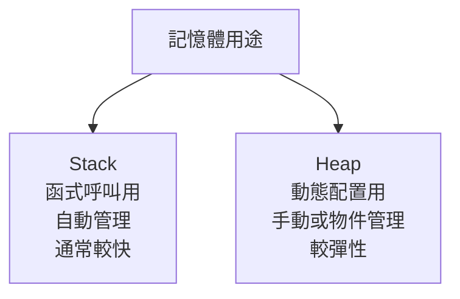

##### stack

* 放 local variables、parameters、return address
* 函式結束通常自動回收
* 配置 / 釋放規律，通常較快

##### heap

* 放動態配置資料
* 要 `free/delete`，或交給容器 / 智慧指標管理
* 較彈性，但容易 leak、碎裂、管理複雜 ([en.cppreference.com][1])

---

#### 8. C++ 實務上不要把「heap = 一定自己手寫 new/delete」背太死

這點很重要。
在現代 C++ 裡，雖然底層很多東西仍然用到 dynamic allocation，但實務上常建議：

* 動態陣列優先用 `std::vector`
* 單一擁有權物件優先用 `std::unique_ptr`
* 少直接裸寫 `new/delete`

原因很簡單：
這樣更不容易 memory leak，也更容易在例外情況下正確回收。cppreference 在 `new` 的 leak 說明後，也提到常把 `new` 結果放進 smart pointer。([en.cppreference.com][2])

如果你是在你自己的 Win11 + Python/C++ 學習環境做實驗，這種做法也比較可靠。

---

#### 9. 最容易考的觀念

##### heap 放什麼？

放 **執行時動態配置** 的資料。([en.cppreference.com][1])

##### 為什麼用 heap？

因為資料大小或存活時間要到執行時才知道，或要跨函式存在。([en.cppreference.com][4])

##### 誰管理 heap？

C 常是 `malloc/free`，C++ 常是 `new/delete`；實務上也常由容器與 smart pointer 代管。([man7.org][3])

##### heap 的風險？

最典型是 **memory leak** 與 **fragmentation**。([en.cppreference.com][2])

##### heap 一定是單一連續區塊嗎？

教材圖上會畫成一塊往上長的區域，但真實 allocator 可能透過 `sbrk()` 與 `mmap()` 等不同方式取得記憶體，所以那張圖是**概念圖**。([man7.org][3])

---

#### 一句話總結

**Heap memory 是程式執行期間用來做動態配置的記憶體區；它比 stack 更彈性，適合存活期較長或大小執行時才知道的資料，但因為管理較複雜，也更容易出現 memory leak 與 fragmentation。** ([en.cppreference.com][1])

下一步最適合的是，我幫你做一張 **Text / Data / BSS / Stack / Heap 總整理表**，把前面所有概念一次串起來。

[1]: https://en.cppreference.com/book/storage_durations "https://en.cppreference.com/book/storage_durations"
[2]: https://en.cppreference.com/w/cpp/language/new.html "https://en.cppreference.com/w/cpp/language/new.html"
[3]: https://man7.org/linux/man-pages/man3/malloc.3.html "https://man7.org/linux/man-pages/man3/malloc.3.html"
[4]: https://en.cppreference.com/w/cpp/memory/new.html "https://en.cppreference.com/w/cpp/memory/new.html"
[5]: https://www.man7.org/linux/man-pages/man3/malloc_trim.3.html "https://www.man7.org/linux/man-pages/man3/malloc_trim.3.html"


## 3.1.2 行程狀態


已啟用教學模式
### 講解

#### 這張圖在回答什麼

這張圖是在說明 **Process state(行程狀態)**：一個行程在作業系統裡，從被建立到結束，會在幾種狀態之間切換。你這張投影片採用的是最常見的 **five-state model(五狀態模型)**，也就是 **new、ready、running、waiting、terminated**。投影片上方文字也正是這樣列出五種狀態。 ([cs.cornell.edu][1])

很多教材會把 **waiting(等待)** 也叫做 **blocked(阻塞)**。意思幾乎一樣：不是單純在等 CPU，而是在等某個事件發生，例如 I/O 完成、訊號到來、資源可用。([維基百科][2])

#### 先用一張簡圖抓全貌

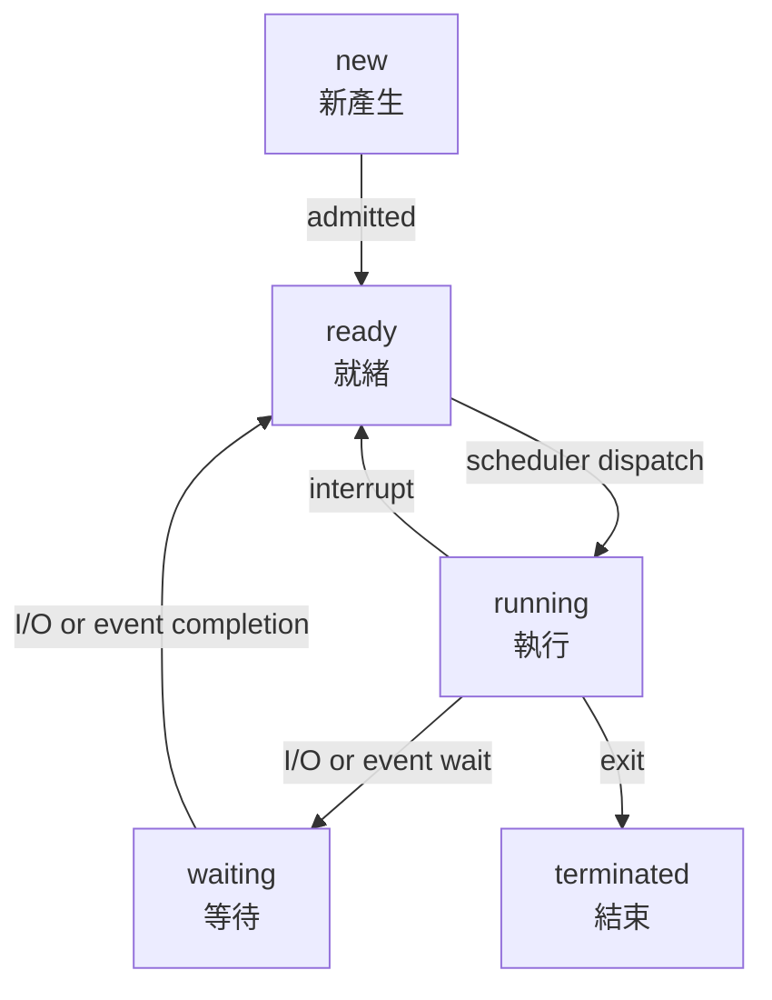

#### 五個狀態各代表什麼

**1. new(新產生)**
行程剛被建立，還在「出生階段」。你可以把它想成「剛報到、資料還在建立」。在較完整的說法裡，new 表示它還沒正式進入可執行池，還在等被系統接納。 ([維基百科][2])

**2. ready(就緒)**
行程已經「準備好跑了」，缺的只是一件事：**CPU 還沒輪到它**。也就是說，它不是不能跑，而是現在 CPU 正在忙別人，所以它先排隊。這是最容易和 waiting 搞混的地方。 ([維基百科][2])

**3. running(執行)**
CPU 正在真的執行這個行程。單核心 CPU 在同一瞬間通常只能有一個 running；多核心則可同時有多個 running，但每個核心同一時間仍只跑一個。 ([維基百科][2])

**4. waiting(等待)**
行程暫時不能往下做，因為它在等某個外部事件，例如磁碟 I/O 完成、鍵盤輸入、收到訊號、等某個子行程結束。重點是：**它不是在等 CPU，而是在等條件成立**。 ([維基百科][2])

**5. terminated(結束)**
行程執行完成，生命週期結束。基本五狀態圖通常畫成 running 直接走到 terminated。 ([維基百科][2])

#### 圖上的每一條箭頭怎麼讀

**new → ready：admitted**
表示這個新建立的行程，被系統正式接納，可以進入排隊等待 CPU 的階段。你可以把 admitted 想成「拿到入場資格」。([維基百科][2])

**ready → running：scheduler dispatch**
表示 **scheduler(排班器)** 選中它，把 CPU 派給它執行。就像排隊的人，終於輪到你進櫃檯辦事。 ([Department of Computer Science][3])

**running → ready：interrupt**
表示它原本在跑，但被中斷或被搶先，於是先回到 ready，等下一次再被排到。這常見於 **preemptive scheduling(可搶先排班)**，例如時間片用完。你的課本投影片也有明寫：執行狀態轉成就緒狀態，例子就是中斷發生。 ([Department of Computer Science][4])

**running → waiting：I/O or event wait**
表示它跑到一半，發現自己必須等某件事，例如讀硬碟、等網路封包、等使用者輸入，所以先停下來去等。([維基百科][2])

**waiting → ready：I/O or event completion**
表示原本在等的事情發生了，例如 I/O 做完了，所以它重新變成「可以執行」的狀態。但注意，這時它是回到 **ready**，不是直接回 **running**，因為還是要等排班器分配 CPU。 ([Stack Overflow][5])

**running → terminated：exit**
表示程式正常結束，或被要求結束。([維基百科][2])

#### 最容易考、也最容易混淆的兩組差別

**new vs ready**

* **new**：剛建立，還在建立／接納階段，還未進入 pool 。
* **ready**：已經具備執行條件，只差 CPU。

很多學生會把這兩個都看成「還沒開始跑」，但差別在於：**ready 已經可以隨時被 scheduler 選去跑，new 還沒到那一步。** 這也是社群討論最常問的點之一。([Stack Overflow][6])

**ready vs waiting**

* **ready**：萬事俱備，只欠 CPU。
* **waiting**：不是欠 CPU，而是欠事件。

生活化一點比喻：

* ready 像你已經到銀行抽號碼，資料都備妥，只是在等叫號。
* waiting 像你連資料都還沒拿到，正在等學校寄成績單，所以根本還不能去辦。([維基百科][2])

#### 這張圖要怎麼背

你可以用一句話背：

**出生 new → 排隊 ready → 上 CPU running → 不是做完就是去等 waiting → 等完再回 ready → 最後 terminated。**  ([cs.cornell.edu][1])

再抓三個關鍵轉移就很穩：

1. **等 CPU**：ready
2. **等事件**：waiting
3. **被搶先**：running 回 ready，不是回 waiting。 ([Department of Computer Science][4])

#### 補充：這張圖是基本版，不是完整版

這張圖是教學上最經典的簡化版。更細的模型還會加入 **suspended / swapped-out states(暫停／換出狀態)**，也就是行程不只在等，還可能被換到外部儲存體。你現在這張圖先把核心觀念講清楚：CPU 排班與 I/O 等待如何讓行程在五種狀態中流動。([維基百科][2])

#### 一句總結

**這張圖的核心不是背名詞，而是分清楚「在等 CPU」和「在等事件」：前者是 ready，後者是 waiting。** 一旦這個觀念清楚，整張圖就會突然很好懂。 ([cs.uic.edu][7])

下一張若你貼上來，我們可以接著對照 **五狀態模型** 和 **七狀態模型** 的差別。

[1]: https://www.cs.cornell.edu/courses/cs4410/2015su/lectures/lec03-processes.html?utm_source=chatgpt.com "Processes (CS 4410, Summer 2015)"
[2]: https://en.wikipedia.org/wiki/Process_state "Process state - Wikipedia"
[3]: https://www.cs.jhu.edu/~yairamir/cs418/os2/tsld004.htm?utm_source=chatgpt.com "Process State Transition Diagram"
[4]: https://www.cs.jhu.edu/~yairamir/cs418/os2/tsld005.htm?utm_source=chatgpt.com "Process State Transition Diagram"
[5]: https://stackoverflow.com/questions/36229228 "Operation Systems: How process move from device' queue(waiting) to ready queue? - Stack Overflow"
[6]: https://stackoverflow.com/questions/24999567/process-states-new-state-ready-state?utm_source=chatgpt.com "operating system - process states - new state & ready state - Stack Overflow"
[7]: https://www.cs.uic.edu/~jbell/CourseNotes/OperatingSystems/3_Processes.html?utm_source=chatgpt.com "Operating Systems: Processes"

## 3.1.3 行程控制表


已啟用教學模式

### 講解

#### 這三張圖在回答什麼

這三張其實是在講同一件事的前後兩面：

1. **作業系統怎麼記住一個行程(Process)**
   答案就是用 **PCB, Process Control Block(行程控制表)**。

2. **作業系統怎麼把 CPU 從一個行程切到另一個行程**
   答案就是先把目前行程的狀態存進它的 PCB，再把下一個行程的狀態從它的 PCB 載回來。這個動作叫 **context switch(內容轉換)**。 

你可以把它想成：

* **PCB** 像是每個行程的「個人資料夾」
* **context switch** 像是「先把甲同學做到一半的考卷夾進資料夾，再把乙同學做到一半的考卷拿出來繼續寫」

---

#### 第一張圖：PCB(Process Control Block，行程控制表) 是什麼？

每一個行程在作業系統裡，都有一份對應的 PCB。教材列出的核心內容包含：

* **Process Identifier (PID，行程識別碼)**：像身分證字號，用來唯一辨識這個行程。
* **Process State(行程狀態)**：例如 `new`、`ready`、`running`、`waiting`、`halted`。
* **Program Counter (PC，程式計數器)**：記錄「下一條要執行的指令在哪裡」。
* **CPU Registers(CPU 暫存器)**：像 accumulator(累加器)、index register(索引暫存器)、stack pointer(堆疊指標)、general-purpose register(一般用途暫存器) 等。教材特別強調：當中斷發生時，這些狀態資訊和 PC 都要先存起來，之後才能順利接著跑。

這一張右邊那個小方塊圖，就是把 PCB 畫成一個表格，裡面放了：

* process state
* process number
* program counter
* registers
* memory limits
* list of open files
* …（還有其他欄位）

#### 為什麼一定要記錄 PC 與 registers？

因為行程不只是「程式碼」而已，它還有「目前跑到哪裡、手上算到哪裡」。
例如你在算：

`a = b + c * d`

算到一半被切走，CPU 裡可能已經暫存了某些中間結果。
若不把這些 **registers(暫存器)** 和 **PC(下一條指令位置)** 存起來，之後切回來時就不知道：

* 原本算到哪一步
* 下一條該執行哪個 instruction(指令)
* 堆疊(stack)在什麼位置

那整個行程就接不回去了。

---

#### 第二張圖：PCB 裡還會放哪些東西？

第二張圖是第一張的延伸版本，補充 PCB 其他重要欄位：

* **Process Priority(行程優先權)**：包含 priority(優先順序)、scheduling queue(排班佇列)指標與其他排班參數。
* **Memory Management Information(記憶體管理資訊)**：例如 base register(基底暫存器)、limit register(限制暫存器)、page table(分頁表)、segment table(區段表)。
* **Pointer to the Parent Process(父行程指標)**：若有 parent process(父行程)，這裡會指到它的 PCB。
* **Accounting Information(帳務/統計資訊)**：例如 CPU 使用量、實際時間使用量、時限、帳號、工作或行程號碼。
* **Pointers to Open Files(開啟檔案指標)**：這個行程目前開了哪些檔案或 I/O devices(輸入輸出裝置)。
* **Interprocess Communication Information(行程間通訊資訊)**：例如 message queue(訊息佇列)、communication channel(通訊通道) 等。

#### 這些欄位各自是在幫誰？

可以這樣記：

* **排班器 scheduler** 主要看：priority、state、queue 指標
* **記憶體管理 memory management** 主要看：base/limit、page table、segment table
* **檔案系統 file system** 主要看：open files
* **行程管理 process management** 主要看：PID、parent pointer、accounting info
* **IPC(Interprocess Communication，行程間通訊)** 主要看：communication 資訊

也就是說，PCB 不是只給 CPU 用，它是整個 OS(作業系統) 管理這個行程的總檔案。

---

#### 第三張圖：CPU switch from process to process 到底在畫什麼？

這張圖是在畫 **P0** 和 **P1** 兩個行程，如何輪流使用 CPU。中間那條是 **operating system(作業系統)**。流程大致如下：

1. 一開始 **process P0** 正在執行。
2. 發生 **interrupt(中斷)** 或 **system call(系統呼叫)**，CPU 進入 OS。
3. OS 把 P0 現在的狀態 **save state into PCB₀**。
4. OS 決定換 P1 上來跑。
5. OS 從 **PCB₁** 把 P1 之前存好的狀態 **reload state from PCB₁**。
6. 然後 **P1** 開始執行。
7. 之後再次發生 interrupt 或 system call。
8. OS 再把 P1 狀態存回 **PCB₁**。
9. 再從 **PCB₀** 載回 P0 狀態。
10. P0 從上次停下的位置繼續執行。 

這就是 **context switch(內容轉換)**。教材也明確說明：當中斷發生時，系統需要先儲存目前行程的 context(內容/狀態)，之後再還原；把 CPU 從一個行程轉到另一個行程時，要先存舊行程狀態，再載入新行程狀態。

---

#### 這張圖最容易看錯的地方：idle 不一定等於 waiting

圖上在 P0、P1 旁邊有標 **idle**。
這裡你要很小心，不要直接把它解讀成教材前面那個 **waiting state(等待狀態)**。

這張圖裡的 **idle** 比較接近：

> 「這個行程此刻沒有在 CPU 上執行」

但它**不精確表示**它一定是在：

* ready(就緒)
* waiting(等待 I/O 或事件)
* 或其他更細的狀態

因為這張圖的重點是 **CPU ownership(誰拿到 CPU)**，不是完整狀態轉移圖。
所以這張圖比較像在表達：

* P0 現在沒跑，因為 CPU 給了 P1
* P1 現在沒跑，因為 CPU 給了 P0

而不是在嚴格分類它們是 ready 還是 waiting。

這個地方很常考文字陷阱。

---

#### 把三張圖串起來，你就懂了

整體邏輯其實很順：

* 行程執行到一半，可能因為中斷或系統呼叫被打斷
* OS 不能讓它的進度消失，所以要把當下狀態存到 **PCB**
* 之後想讓另一個行程執行，就從那個行程自己的 **PCB** 把先前狀態載回來
* 因此，**PCB 是 context switch 的基礎資料結構**。 

---

#### 用生活化例子記憶

想像有兩個人共用一張書桌：

* **P0** 在寫數學作業
* **P1** 在寫英文作業
* **CPU** 就是那張唯一的桌子
* **OS** 是管理員
* **PCB** 是每個人的資料夾

當管理員說：「P0 先停，換 P1。」

管理員會先做兩件事：

1. 把 P0 的進度記下來

   * 寫到第幾題
   * 筆停在哪裡
   * 草稿算到哪
     這就是 **save state into PCB₀**

2. 拿出 P1 上次的資料夾，照著上次停的位置接著做
   這就是 **reload state from PCB₁**

這樣來回切換，兩個人都能「接續上次進度」繼續做。

---

#### 一張圖記完整流程


---

#### 最容易考的觀念

1. **PCB 是什麼？**
   是 OS 用來保存某個行程所有管理資訊的資料結構。

2. **為什麼要存 PC 與 registers？**
   因為行程之後要從「中斷前的精確位置」接著執行。

3. **context switch 做了什麼？**
   存舊行程狀態，載入新行程狀態。

4. **context switch 有沒有成本？**
   有。教材說這是 **overhead(額外負擔)**，切換時系統沒有在做真正有用的工作。

5. **圖中的 idle 能不能直接當 waiting？**
   ❌ 不行。這張圖只是在表達「目前沒拿到 CPU」。

---

#### 你可以這樣背

一句話版本：

> **PCB 負責記住行程現在是誰、跑到哪、手上有哪些資源；context switch 就是把目前行程的狀態存進 PCB，再把下一個行程的狀態從 PCB 取出來。**  

下一則我幫你把這三張直接整理成「考試作答版」，你可以拿來背誦。

##  3.2 行程排班(Process Scheduling)


已啟用教學模式
### 講解

#### 這張圖在回答什麼

這張投影片其實在回答 3 個核心問題：

1. **為什麼作業系統需要排班(scheduling)**
2. **排班器(process scheduler)到底在做什麼**
3. **為什麼在單一處理器(single processor)裡，多個行程(process)看起來像同時跑，但其實不是同時跑**

你可以把這張圖當成前一張 **PCB(Process Control Block，行程控制表)** 與 **context switch(內容轉換)** 的下一步：
前面在講「怎麼保存行程狀態」，這一張在講「那保存好之後，CPU 接下來要輪到誰」。

---

#### 第一行：什麼是 Process Scheduling(行程排班)

投影片第一句在講：

* **multiprogramming(多元程式規劃)** 的目標：讓 **CPU 盡量不要閒著**
* **time sharing(分時)** 的目標：讓 **使用者感覺系統有反應、可以互動**

教材原文就是這樣切的：
multiprogramming 重點是「提高 CPU 使用率」；time sharing 重點是「CPU 在不同行程之間不斷切換，讓使用者能與執行中的程式互動」。 

---

#### multiprogramming(多元程式規劃) 到底是什麼意思？

先講最容易懂的版本：

> **記憶體裡先放多個行程，誰現在能跑，就先把 CPU 給誰，避免 CPU 發呆。**

生活化例子：

想像 CPU 是一位廚師，幾個行程是幾道菜。

* 菜 A 正在等烤箱 → 不能立刻用廚師
* 那廚師就先去做菜 B
* 菜 B 切完在等洗菜 → 廚師又去做菜 C

這樣做的重點不是「每道菜都很公平」，而是：

> **不要讓廚師閒著**

這就是 **CPU utilization(CPU 使用率)** 的核心精神。

---

#### time sharing / multitasking (分時) 又是什麼？

這個概念比較像：

> **把 CPU 時間切成很多很短的小片段，快速輪流分給不同的行程。**

目的是讓使用者覺得：

* 打字有回應
* 滑視窗有反應
* 指令打下去不用等很久

也就是說，**multiprogramming** 比較在意「CPU 不要閒」，
而 **time sharing** 比較在意「互動要順、反應要快」。 

---

#### 兩者差在哪裡？這裡最常考

你可以直接這樣背：

* **Multiprogramming**：重點是 **效率 efficiency**
  讓 CPU 有事做，減少空轉。
* **Time sharing**：重點是 **互動性 interactivity / response time(反應時間)**
  讓每個使用者或行程都能很快得到回應。

一句話版：

> **multiprogramming 偏「不浪費 CPU」；time sharing 偏「讓人感覺順」。**

你的投影片不是在說兩個完全沒關係的東西，
而是在說：

> **time sharing 可以看成是 multiprogramming 再往互動式系統延伸的一步。**

我也順手對照了大學課程講義與社群常見問答，這個切法是很標準的；很多人也正是卡在「兩者都在輪流執行，那差別到底在哪」這個點。UCSB 的課程講義直接把實際 CPU 在行程間切換描述成「multiprogramming with time-sharing」，而社群常見解釋也會把 time sharing 視為 multiprogramming 在互動式環境中的延伸。([sites.cs.ucsb.edu][1])

#### 結論
Multiprogramming：不同事情輪流做。
time sharing：每件事情只做一下下。

---

#### 第二行：process scheduler(行程排班程式) 在做什麼？

投影片第二句的意思很直接：

> **排班器(process scheduler) 的工作，就是幫 CPU 從「可執行的行程」裡挑一個出來跑。** 

注意這裡的重點不是「執行行程」，而是：

> **決定下一個是誰拿到 CPU**

也就是說，scheduler(排班器)像一個裁判或櫃台叫號系統：

* 誰現在 ready(就緒)
* 誰正在等 I/O
* 誰優先權高
* 誰已經跑太久了

它會根據規則選下一個。

---

#### 你可以把 scheduler 想成「發號碼牌的人」

例如有三個行程：

* P1：正在等磁碟 I/O
* P2：ready，可以立刻跑
* P3：ready，也可以跑

此時 scheduler 不會選 P1，因為它還在等。
它會在 P2、P3 之間挑一個。

也就是：

> **scheduler 只會從目前可執行的候選者中選。**

---

#### 第三行：單一處理器為什麼不能同時執行多個行程？

這一行超重要。

投影片在講：

> **單一處理器(single processor) 系統，不可能同時有一個以上的行程真正執行。**
> 如果有多個行程，其它的只能等 CPU 空出來。

這句話的關鍵字是：

* **同時 at the same time**
* **單一處理器 single processor**

意思是：

* 一顆 CPU 核心同一個瞬間，只能執行一條指令流
* 所以多個 process 在單核上，頂多只能 **輪流** 跑
* 因為切換得很快，人看起來才像同時

這跟你前面看到的 **context switch(內容轉換)** 正好接上：
就是因為不能真的同時跑，所以 OS 才要不斷：

1. 存下目前行程狀態
2. 載入下一個行程狀態
3. 讓 CPU 換人用

---

#### 最容易混淆的點：看起來同時，不代表真的同時

例如你開著：

* 瀏覽器
* 音樂播放器
* 編輯器
* 終端機

在單核心觀念下，並不是四個程式真的同時佔用同一顆 CPU。
而是 OS 很快地做：

* 跑一下瀏覽器
* 切去音樂播放器
* 再切去編輯器
* 再切去終端機

切得夠快時，人就會覺得「它們都在同時跑」。

所以考試很愛考這句：

> **concurrent(並行/交錯進行) 不等於 parallel(真正同時平行執行)。**

在這張投影片的語境裡，你至少要先牢記：

> **單一處理器下，多個 process 是交錯執行(interleaving)，不是同時執行。**

---

#### 這張圖和前一張 PCB / context switch 的關係

你可以把它們串成這樣：

* **PCB**：記錄每個行程現在的狀態
* **Scheduler**：決定下一個要跑誰
* **Context switch**：把 CPU 從 A 行程切到 B 行程

也就是：

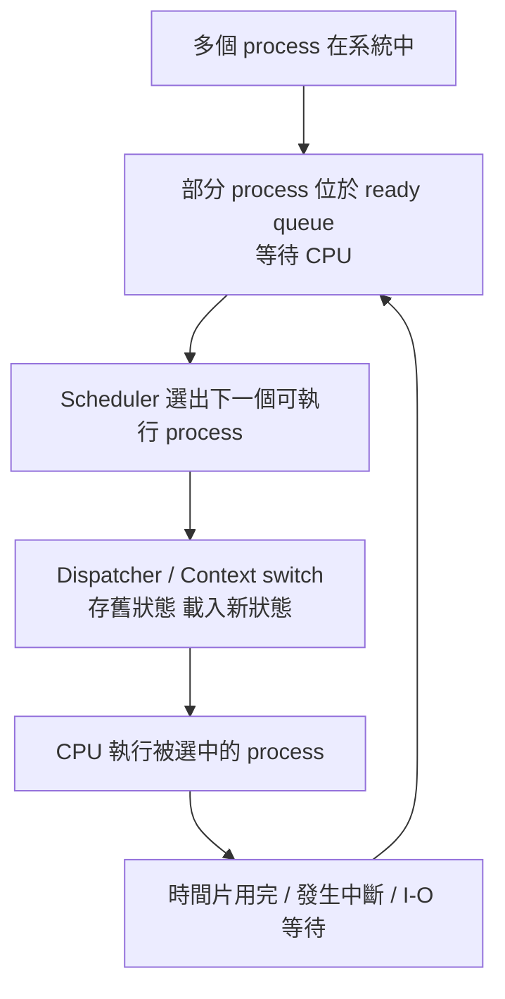

這樣你就會知道，這張投影片不是孤立的，它是在補上：

> **「PCB 幫你記住進度之後，接下來誰先跑？」**

答案就是：**scheduler 決定。**

---

#### 這張投影片每一句，我幫你翻成白話

##### 1. 多元程式規劃(multiprogramming)的目的

白話：

> 記憶體裡先放多個工作，哪個現在能跑就先跑，盡量別讓 CPU 閒著。

##### 2. 分時(time sharing)的目的

白話：

> CPU 很快地在多個行程間輪流切換，讓使用者覺得每個程式都有在回應我。

##### 3. 行程排班程式(process scheduler)的工作

白話：

> 決定「下一個誰用 CPU」。

##### 4. 單一處理器無法同時跑多個行程

白話：

> 同一瞬間只能有一個人真的站在 CPU 上做事，其它人只能排隊。

---

#### 自問自答：最容易卡住的地方

##### Q1：既然 multiprogramming 也是輪流跑，跟 time sharing 差在哪？

A：
差在**目標**。

* multiprogramming：偏重 **讓 CPU 忙碌**
* time sharing：偏重 **讓使用者感覺系統很快有回應**

##### Q2：scheduler 是不是負責存暫存器(register)？

A：
不是它本身在做全部細節。
它主要負責**選人**。
真正切換時，會牽涉到 **dispatcher(分派程式)** 與 **context switch**。你後面學到 CPU scheduling 章節會再看到。教材也把 dispatcher 的工作列成切換 context、切到 user mode、跳回正確執行位置。

##### Q3：單核電腦開很多程式，真的只有一個在跑？

A：
在「某個瞬間、某顆核心」的角度，是的。
只是 OS 切得很快，所以你感覺像大家一起跑。

---

#### 最容易考的觀念

1. **Process scheduling(行程排班)**
   就是從可執行行程中，選一個給 CPU。

2. **Multiprogramming 的目標**
   提高 **CPU utilization(CPU 使用率)**。

3. **Time sharing 的目標**
   提高 **互動性** 與 **response(回應感)**。

4. **單一處理器的事實**
   同一時間不會真的有多個 process 同時執行。

5. **為什麼會看起來像同時？**
   因為快速切換，也就是 context switch。

---

#### 你可以這樣背這一頁

> **行程排班(Process Scheduling) 的核心，是由 scheduler 從可執行行程中選出下一個使用 CPU 的行程。multiprogramming 著重提高 CPU 使用率，time sharing 著重互動與回應速度；在單一處理器中，多個行程不是同時執行，而是快速輪流執行。**

#### 這頁的超短口訣

> **多工為了不閒，分時為了好用，排班決定誰上 CPU。**

下一張如果你貼 **ready queue / job queue / scheduler 類型**，我們可以直接無縫接著講。

[1]: https://sites.cs.ucsb.edu/~chris/teaching/cs170/doc/cs170-03.pdf "cs170-03.ppt"


## 3.2.1 排班佇列(scheduling queue)


### 講解

這張投影片在講的核心，其實只有一句話：

**作業系統會把行程 (process) 依照目前「在等什麼」放進不同佇列 (queue) 裡，排班器 (scheduler) 再從適合的佇列挑行程出來跑。** 你的課本也明講：新進系統的行程先進 **工作佇列 (job queue)**，而已在主記憶體、且「只差 CPU 就能跑」的行程，會放在 **就緒佇列 (ready queue)**；這個 ready queue 常用 linked list 實作，前端會存第一個與最後一個 PCB 的指標。 ([Prexams][1])

####  先直接看圖在畫什麼

這張圖**真正畫出來的重點**是：

* 上面那一排是 **ready queue**
* 下面幾排是不同裝置的 **device queue / I/O queue**

  * mag tape unit 0
  * mag tape unit 1
  * disk unit 0
  * terminal unit 0
* 每個藍灰色方塊像 `PCB7`、`PCB2`、`PCB3`，都是 **PCB (Process Control Block，行程控制表)** 節點
* 左邊每個小框框的 `head / tail`，是該 queue 的表頭，指向 linked list 的開頭與結尾。這和課本文字說明一致。 ([Prexams][1])

####  為什麼 ready queue 在最上面？

因為 **ready queue 裡的行程是「已經在記憶體內，所有條件都差不多齊了，只差 CPU」**。
所以 CPU scheduler 每次要決定下一個誰跑，就是從這裡挑。課本也寫得很明白：**short-term scheduler / CPU scheduler** 會選一個 ready queue 裡的 process，把 CPU 配給它。

你可以把它想成醫院叫號：

* **job queue**：今天所有掛號的人
* **ready queue**：已經到診間外面坐好、等醫生叫號的人
* **device queue**：去抽血室、X 光室、心電圖室排隊的人

####  job queue、ready queue、device queue 三者差在哪？

**1. job queue（工作佇列）**
是「系統中的所有行程」的集合。投影片文字有寫，但圖裡沒有特別把它整個畫成一條獨立大佇列；圖比較聚焦在 ready queue 與各裝置 queue。 ([Prexams][1])

**2. ready queue（就緒佇列）**
行程已經在 RAM 裡，而且目前不等 I/O、不等事件，只是在等 CPU。

**3. device queue / I/O queue（裝置佇列）**
某行程如果發出 I/O 要求，例如要讀磁碟、等終端機、等磁帶，就先離開 CPU，去對應裝置的 queue 排隊。每個裝置通常有自己的 queue。 ([Prexams][1])

####  圖上的箭頭代表什麼？

箭頭不是資料流，而是 **linked list 指標**。

例如 ready queue 那一列：

* `head` 指向第一個 PCB
* 第一個 PCB 再指向下一個 PCB
* `tail` 會指到最後一個 PCB

也就是說，**queue 裡面實際串起來的是 PCB，不是整個行程本體**。

####  這裡的 PCB 是什麼？很容易考

圖上每個 `PCB7`、`PCB2` 裡面畫了 `registers ...`，那只是示意。
**PCB 不只是 registers**，它實際上還會記錄 PID、state、program counter、CPU registers、priority、memory management information、open files 等排班與管理資訊。

這點超容易和「process 本身的記憶體內容」搞混：

* **PCB**：是作業系統管理這個 process 的控制資料
* **text / data / heap / stack**：是這個 process 自己的位址空間內容

也就是說，**排在 queue 裡的是 PCB 節點，不是把整個 text/data/heap/stack 塞進 queue**。

####  一個行程怎麼在這些 queue 之間移動？

流程可以記成下面這張：

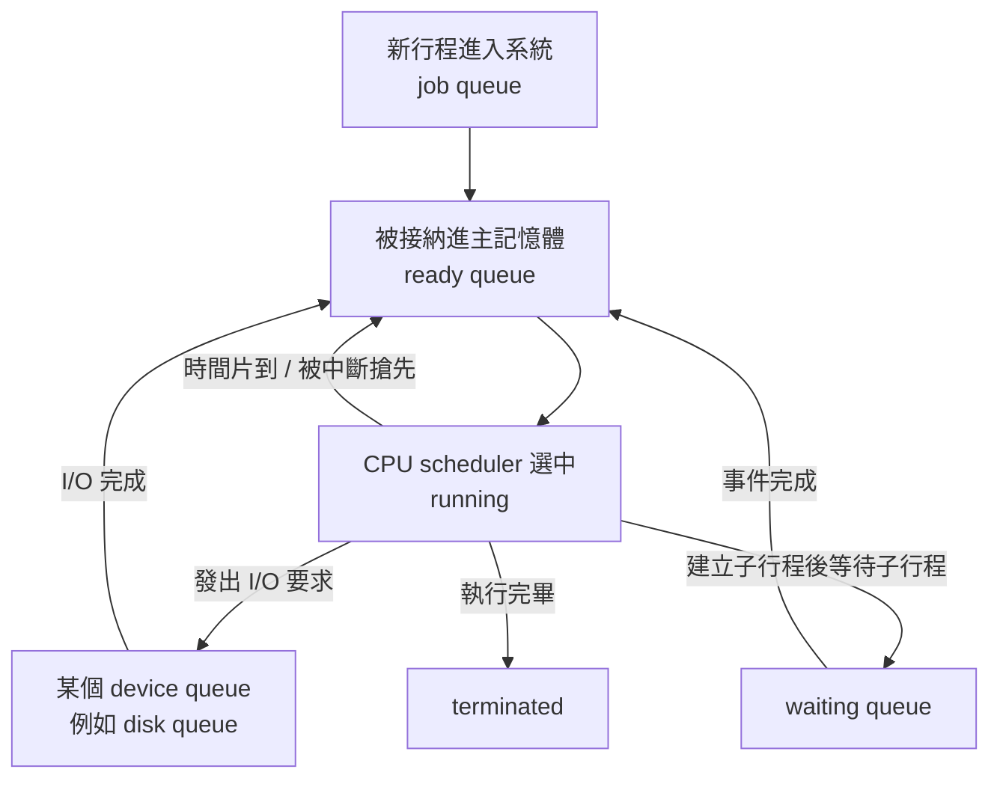

這和教科書的文字一致：process 被分派執行後，可能發 I/O 要求進 I/O queue、可能等待子行程、也可能因中斷被移出 CPU 再回到 ready queue。 ([全球村大學][2])

####  你這張圖最該抓住的 4 個考點

**第一，queue 裡面串的是 PCB。**
不是程式碼本體，也不是 text/data/stack/heap。

**第二，ready queue 是「等 CPU」，device queue 是「等 I/O / 等裝置」。**
等的東西不同，所以要分不同佇列。

**第三，job queue 範圍最大，ready queue 是其中更接近執行的那群。**
job queue 是進系統的所有行程；ready queue 是已在主記憶體、可執行但尚未拿到 CPU 的行程。 ([Prexams][1])

**第四，CPU scheduler 主要是從 ready queue 挑人。**
這就是排班的核心。

####  我幫你順手糾正一個常見誤解

很多人會把這張圖理解成：

> 「所有行程都在 ready queue 裡，只是有些暫時跑去 I/O」

這種講法不夠精確。更正確是：

* 行程整個生命週期會在**不同排班佇列之間遷移**
* 當它等待某個事件時，它**不屬於 ready queue**
* 只有當它再次具備執行條件、只差 CPU 時，才回到 ready queue。

####  一句話背法

**Ready queue = 等 CPU**
**Device queue = 等裝置 / 等 I/O**
**PCB = OS 用來管理 process 的控制表，不是 process 的程式內容**

你如果要，我們下一步可以直接把這張圖和 **new / ready / running / waiting / terminated 五狀態圖** 對起來，一次把「狀態」和「佇列」的關係整個串通。


### 講解

已啟用教學模式

#### 這張圖在回答什麼

這張圖是在畫 **一個行程(Process)** 拿到 CPU 之後，接下來可能往哪裡走。教材文字版已經直接寫出流程：新行程先進 **ready queue(就緒佇列)**，被選中並 **dispatched(分派)** 後拿到 CPU；之後可能發出 I/O 要求、產生子行程並等待，或被強制移出 CPU 再放回 ready queue。

你可以先把整張圖想成：

> **ready queue 是候位區，CPU 是服務台，右邊那些灰色框是「離開 CPU 的原因」，左邊再繞回來表示「之後有機會再回 ready queue 等待下一次執行」。**

---

#### 先看主幹：ready queue → CPU

* **ready queue(就緒佇列)**：代表這些行程已經「準備好可以跑」，只是現在還沒拿到 CPU。教材也寫得很明白：位於主記憶體中、就緒等待執行的行程會保存在 ready queue。
* **CPU**：代表目前這個行程正在 **running(執行)**。
* **dispatched(分派)**：不是「程式自己跑起來」，而是 **scheduler(排班器)** 選中某個 ready process 後，交給 **dispatcher(分派程式)** 做交接，包含 **context switch(內容轉換)**、切回使用者模式、跳到正確位置繼續執行。

這裡最容易考的一句是：

> **ready 不等於 running。**
> ready 是「已經能跑，只差 CPU」；running 才是「現在真的正在 CPU 上跑」。

---

#### 圖中第一條：I/O request → I/O queue → I/O

這條是在講：

1. 行程本來正在 CPU 上跑。
2. 它突然需要做 **I/O operation(輸入輸出操作)**，例如讀磁碟、等鍵盤、等網路。
3. 這時它不能繼續佔著 CPU 空等，所以會離開 CPU，進入 **I/O queue(裝置等待佇列)**。教材文字也寫了：行程可發出 I/O 要求，然後置於一個 I/O 佇列中。
4. 等 I/O 完成後，它才會再回到 ready queue，之後重新等 CPU。大學課程筆記與社群常見解釋也都是這樣描述：I/O 完成通常由中斷處理把原本等待的行程喚醒，放回 ready queue。([cs.uic.edu][1])

這裡你要分清楚兩件事：

* **I/O queue**：在排隊等某個裝置或 I/O 完成
* **ready queue**：I/O 已經好了，現在只是在等 CPU

所以：

> **等 I/O 的行程不是 ready，而是 waiting / blocked(等待/阻塞)。**  ([Stack Overflow][2])

---

#### 圖中第二條：time slice expired

這條超重要，因為它就是 **preemptive scheduling(可搶先排班)** 的代表情況。

* **time slice / time quantum(時間片/時間量)**：每個行程這次最多可以連續用 CPU 多久。
* 如果時間到了但行程還沒做完，OS 會把 CPU 收回來，這叫 **preempted(被搶先/被剝奪 CPU)**。
* 然後這個行程會被放回 **ready queue 的尾端**，等下一輪再執行。教材在 RR(Round Robin) 直接寫到：時間量結束時，行程會被 preempted 並加到 ready queue 的尾端。

也就是說，這條線表示的不是「它做不到了」，而是：

> **它其實還能跑，只是這一輪 CPU 使用額度用完了，所以先回 ready queue 排隊。**  ([操作系統][3])

很多同學會把這條和 I/O 搞混。差別是：

* **I/O request**：不能繼續跑，因為在等外部事件
* **time slice expired**：其實還能跑，只是被排班器暫停，先讓別人跑

---

#### 圖中第三條：fork a child → child executes

這條的意思是：

* 目前執行中的行程呼叫 **fork()** 產生一個 **child process(子行程)**。
* 這張投影片上方的文字說得更具體：
  **「行程可產生出一個新的子行程並等待後者的結束。」**
  所以這張圖的語境不是單純「生出 child 就各跑各的」，而是偏向「父行程建立 child，然後父行程等待 child 結束」這種教科書簡化情境。

所以圖上的 **child executes** 比較像在表達：

> **child 被建立後，也會進入系統排班，之後由 scheduler 選到它執行。**

同時，父行程因為在等 child 完成，通常就不會繼續佔著 CPU。教材在後面也有寫：父行程有可能等待直到子行程結束。

這一段你不用把圖看得太死。它是**示意圖**，重點是讓你知道：

* running process 可以 **fork()**
* 之後會牽涉到 parent / child 的排班與等待關係

而不是要把所有細節箭頭都畫完整。

---

#### 圖中第四條：wait for an interrupt → interrupt occurs

這條的核心意思是：

* 行程正在等某個 **event(事件)** 發生
* 這個事件到了，OS 透過 **interrupt(中斷)** 或相關喚醒機制讓它重新具備可執行條件
* 之後它會回到 **ready queue**，等待再次被排上 CPU。 ([Stack Overflow][4])

你可以把它想成：

* 我不是不想跑
* 我是「現在還不能跑」
* 等到我等待的訊號來了，才重新變成 ready

這和上面的 I/O 其實很像，只是 I/O 是特定的一種等待來源；**interrupt / event** 是比較一般化的說法。([Stack Overflow][2])

---

#### 這張圖最關鍵的二分法：ready vs waiting

這頁最值得你背的是這個：

* **ready(就緒)**：
  已經具備執行條件，**只差 CPU**
* **waiting / blocked(等待/阻塞)**：
  **連 CPU 給你也沒用**，因為你還在等 I/O、等 child、等事件

教材對 state 的定義也剛好就是這樣切：

* ready：等待指定一個處理器
* waiting：等待某件事件發生，例如 I/O 完成或收到信號。

社群問答裡，這也是大家最常搞混的點之一。常見的解釋也是：
**ready 是可以執行但未被排到；waiting 是目前根本不能執行。** ([Stack Overflow][2])

---

#### 把整張圖翻成白話

你可以直接背成這樣：

> 一個新行程先進 ready queue。
> 被 scheduler 選到後，經過 dispatcher 分派到 CPU 執行。
> 執行途中如果要做 I/O，就去 I/O queue 等；如果時間片到，就被移回 ready queue；如果 fork 出 child，可能會等待 child 完成；如果正在等某個事件或中斷，就等事件發生後再回 ready queue。 ([OMSCN Notes][5])

---

#### 你可以這樣看圖，不容易亂

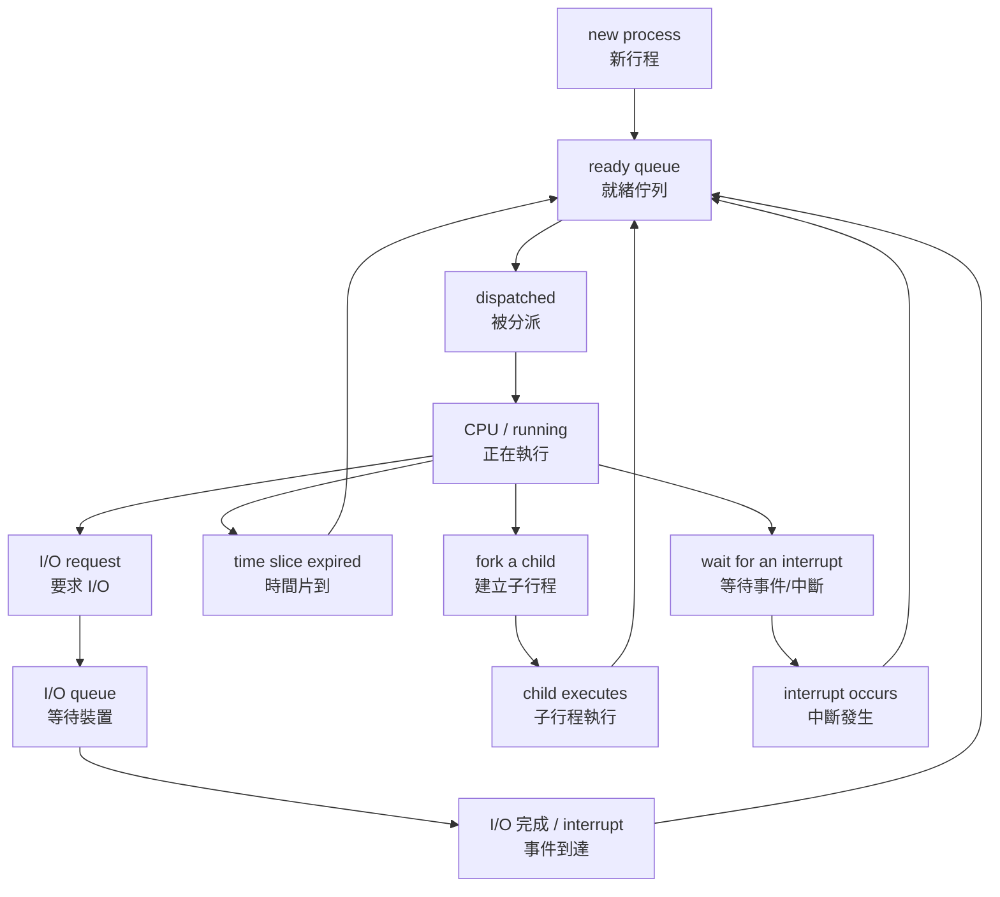

這張 mermaid 跟原圖不是逐像素重畫，而是把它的**邏輯骨架**整理出來。

---

#### 最容易考的觀念

1. **ready queue 裡的行程不是在跑**，只是已經能跑。
2. **dispatch** 是把被選中的 ready process 真正交給 CPU 去執行。
3. **I/O request** 會讓行程進入 waiting，不再佔 CPU。
4. **time slice expired** 代表被搶先，但行程仍是可執行的，所以回 ready queue。
5. **fork a child** 這條在本投影片是簡化圖，重點是 child 會進入排班，而 parent 可能等待 child。
6. **waiting 跟 ready 最大差別**：
   waiting 是還在等事件；ready 是事件都好了，只差 CPU。 ([Stack Overflow][2])

---

#### 一句話總結這張圖

> **這張圖是在畫：行程被 dispatch 到 CPU 後，可能因為 I/O、時間片到、建立子行程、或等待中斷而離開 CPU；等條件成熟後，再回 ready queue 等下一次執行。**  ([OMSCN Notes][5])

下一則我可以直接幫你把這張圖整理成「考試作答版」或「ready / running / waiting 狀態轉移對照表」。

[1]: https://www.cs.uic.edu/~jbell/CourseNotes/OperatingSystems/5_CPU_Scheduling?utm_source=chatgpt.com "Operating Systems: CPU Scheduling"
[2]: https://stackoverflow.com/questions/29586950/basic-cpu-scheduling-waiting-to-ready?utm_source=chatgpt.com "operating system - basic CPU scheduling \"waiting to ready\" - Stack Overflow"
[3]: https://os.cs.luc.edu/scheduling.html?utm_source=chatgpt.com "Process/Thread Scheduling | Operating Systems: updated 11 Jan 2024"
[4]: https://stackoverflow.com/questions/36227241/operation-systems-how-process-move-from-device-queuewaiting-to-ready-queue?utm_source=chatgpt.com "Operation Systems: How process move from device' queue(waiting) to ready queue? - Stack Overflow"
[5]: https://www.omscs-notes.com/operating-systems/scheduling/?utm_source=chatgpt.com "Scheduling - OMSCS Notes"


## Schedulers


### 講解

已啟用教學模式

#### 這張圖的核心在講什麼

這張投影片其實分成上下兩半，但核心只有一句話：

> **Long-term scheduler(長程排班器 / job scheduler)** 決定「哪些行程先被放進 ready queue(就緒佇列)」：誰放進 pool
> **Short-term scheduler(短程排班器 / CPU scheduler)** 決定「ready queue 裡下一個誰拿到 CPU」：pool 中誰先執行
> 而 long-term scheduler 還要顧整體搭配，避免系統裡全部都是 I/O-bound process 或全部都是 CPU-bound process。([cs.uic.edu][1])

---

#### 先用一張圖把整體關係看懂

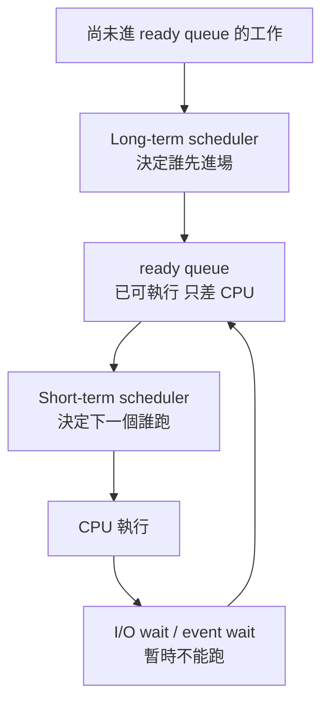

這張圖要你建立的不是某個公式，而是「兩層決策」的概念：
**先決定哪些工作進系統，再決定此刻 CPU 給誰。**([cs.uic.edu][1])

---

#### Long-term scheduler(長程排班器) 是做什麼的？

它也叫 **job scheduler(工作排班器)**。
它的工作不是每幾毫秒決定一次 CPU 要給誰，而是比較高層地決定：

* 哪些 process(行程) 先被帶進 **ready queue**
* 系統同時要放多少工作進來
* 進來的工作組合要不要平衡([cs.uic.edu][1])

教科書式理解可以把它想成「活動入場管制」：

* 外面很多人想進場
* 場內不能一次塞太多
* 也不能全部都是同一種類型的人

所以它比較像 **控制進場名單**，不是現場每秒鐘發言順序的人。([cs.uic.edu][1])

另外，長程排班器通常**執行頻率比較低**；課程講義常把它放在 batch system(批次系統) 或高負載系統的脈絡來講，因為它不需要像 short-term scheduler 那樣頻繁運作。([cs.uic.edu][1])

---

#### Short-term scheduler(短程排班器) 是做什麼的？

它也叫 **CPU scheduler(CPU 排班器)**。
它的工作很直接：

> **從 ready queue 裡，挑一個現在就能跑的 process，然後把 CPU 分給它。**([cs.uic.edu][2])

它運作得非常頻繁，因為只要出現這類情況，就可能需要它出手：

* CPU 變空
* 行程做 I/O 去了
* 時間片(time slice / quantum)用完
* 行程結束
* 某個等待中的行程重新變 ready([cs.uic.edu][2])

所以：

* **Long-term scheduler**：決定誰先進 ready queue
* **Short-term scheduler**：決定 ready queue 裡誰下一個跑

這兩個很容易混，但考試最愛考這個分工。([cs.uic.edu][1])

---

#### 「controls the degree of multiprogramming」到底是什麼意思？

這句是這頁最抽象、也最容易背不起來的地方。

**degree of multiprogramming(多元程式程度)**，你可以先把它想成：

> **系統裡同時放進來、一起競爭資源的工作量有多大。**

所以投影片說 long-term scheduler 控制它，意思就是：

> **long-term scheduler 在決定系統不要一次放太多或太少 process 進來。**([cs.uic.edu][1])

生活化一點：

* 放太少：CPU 可能常常閒著
* 放太多：ready queue 很擠、記憶體壓力大、切換成本也變高

因此它不是只在「有沒有工作」之間二選一，而是在做**整體負載控制**。([cs.uic.edu][1])

---

#### 為什麼 long-term scheduler 要管 I/O-bound 跟 CPU-bound 的比例？

這就是投影片下半部的重點。

教材模型會希望系統裡有一個**適當 mix(混合比例)** 的 I/O-bound 與 CPU-bound process，因為這樣 CPU 和 I/O device(輸入輸出裝置) 才比較不會互相閒置。UIC 的課程講義也直接寫到：有效率的排班系統會選擇好的 CPU-bound / I/O-bound process 組合。([cs.uic.edu][1])

直覺上：

* 如果幾乎全是 **I/O-bound process**，很多行程會一直去等磁碟、網路、鍵盤，CPU 反而可能常空著。
* 如果幾乎全是 **CPU-bound process**，CPU 會一直很忙，但 I/O 裝置可能不太有事做，而且別的短工作容易被拖住。([cs.uic.edu][1])

所以這頁不是單純在背定義，而是在告訴你：

> **long-term scheduler 其實在做系統層級的「工作組合管理」。**([cs.uic.edu][1])

---

#### I/O-bound process 是什麼？

**I/O-bound process(I/O 密集型行程)** 指的是：

* 花比較多時間在 **I/O(input/output，輸入輸出)** 上
* 花比較少時間在純計算上
* 因此常見特徵是 **many short CPU bursts(很多次、但很短的 CPU burst)**([Baeldung on Kotlin][3])

你可以把 **CPU burst** 想成：

> 「這個行程連續佔用 CPU 做計算的那一小段時間」

I/O-bound 的典型感覺就是：

* 算一下
* 等一下資料
* 再算一下
* 再等一下資料

所以它不是一直黏在 CPU 上。([Baeldung on Kotlin][4])

生活例子像：

* 下載檔案
* 讀寫大量檔案
* 等資料庫回應
* 網頁伺服器處理很多請求但常在等資料回來

這類工作常不是「算很久」，而是「常常在等」。([Baeldung on Kotlin][3])

---

#### CPU-bound process 是什麼？

**CPU-bound process(CPU 密集型行程)** 則相反：

* 大部分時間都在做 computation(計算)
* 比較少依賴 I/O
* 常見特徵是 **few very long CPU bursts(次數較少，但每次 CPU burst 很長)**([Baeldung on Kotlin][3])

也就是說，它一旦拿到 CPU，通常會持續算比較久。
典型例子像：

* 大量數值運算
* 影片轉碼
* 科學模擬
* 大型編譯工作([Baeldung on Kotlin][3])

---

#### 這裡最容易搞混的地方

##### 1. Long-term scheduler 不是在決定「下一個 CPU 給誰」

不是。
它是先做「誰可以進 ready queue」這種較高層的 admission(准入) 決策；真正從 ready queue 挑下一個上 CPU 的，是 short-term scheduler。([cs.uic.edu][1])

##### 2. Short-term scheduler 跟 dispatcher(分派程式) 不完全一樣

這是社群上很常混淆的點。
**scheduler** 負責「決定選誰」；**dispatcher** 則負責真的把控制權交出去，例如 context switch(內容轉換)、切回 user mode(使用者模式)、跳到正確的 program counter 位置。這個區分在教材講義與社群問答裡都很一致。([cs.uic.edu][2])

##### 3. I/O-bound 不是「比較弱」或「比較慢」

不是。
它只是表示瓶頸多半卡在 I/O，不是卡在 CPU。CPU-bound 則表示瓶頸多半在計算。這是在描述**資源瓶頸類型**，不是在給程式貼「好壞標籤」。([Baeldung on Kotlin][3])

---

#### 你可以這樣背這一頁

> **Long-term scheduler 先決定哪些 process 進入 ready queue，並控制系統中的工作量與工作組合；Short-term scheduler 再從 ready queue 裡挑出下一個拿 CPU 的 process。I/O-bound process 有很多短 CPU bursts，CPU-bound process 則有較少但較長的 CPU bursts。** ([cs.uic.edu][1])

---

#### 考試作答版

如果考題問你「說明 long-term scheduler、short-term scheduler，以及 I/O-bound / CPU-bound process 的差異」，你可以直接寫：

> Long-term scheduler(job scheduler) 負責選擇哪些 process 被帶入 ready queue，因此它控制 degree of multiprogramming，並應維持 I/O-bound 與 CPU-bound process 的適當比例。Short-term scheduler(CPU scheduler) 則從 ready queue 中選出下一個要執行的 process 並分配 CPU。I/O-bound process 花較多時間在 I/O，具有 many short CPU bursts；CPU-bound process 花較多時間在 computation，具有 few long CPU bursts。([cs.uic.edu][1])

下一張如果你貼的是 **medium-term scheduler(中程排班器 / swapper)**，我們就可以把三種 scheduler 一次串完整。

[1]: https://www.cs.uic.edu/~jbell/CourseNotes/OperatingSystems/3_Processes.html "Operating Systems: Processes"
[2]: https://www.cs.uic.edu/~jbell/CourseNotes/OperatingSystems/6_CPU_Scheduling.html "Operating Systems: CPU Scheduling"
[3]: https://www.baeldung.com/cs/cpu-io-bound "Guide to the “Cpu-Bound” and “I/O Bound” Terms | Baeldung on Computer Science"
[4]: https://www.baeldung.com/cs/cpu-io-burst-cycles "CPU and I/O Burst Cycles | Baeldung on Computer Science"


## 3.2.2 排班程式


### 講解

已啟用教學模式。

#### 這張圖在回答什麼？

這張投影片在回答：

**行程 (process) 在系統裡不是一直待在同一個地方，它會在不同佇列 (queue) 之間移動；而不同種類的排班程式 (scheduler) 會在不同時機決定它下一步去哪裡。**
你的課程投影片直接寫到：行程在整個生命週期會在各種排班佇列間遷移，系統會由適當的 scheduler 來選取；其中 **中程排班程式 medium-term scheduler** 的核心工作，是把行程暫時從記憶體移開、降低對 CPU 的競爭，這個動作就叫 **swapping(置換)**。

---

#### 先抓整張圖的主軸

你可以把圖看成 4 個區塊：

1. **ready queue(就緒佇列)**
   裡面放的是「已經在主記憶體裡，而且現在只差 CPU 就可以跑」的行程。短程排班程式 **short-term scheduler / CPU scheduler** 會從這裡挑一個去 CPU 執行。

2. **CPU**
   被選中的行程會到 CPU 上執行。

3. **I/O waiting queues(I/O 等待佇列)**
   如果執行中的行程發出 I/O 要求，例如讀磁碟、等鍵盤輸入，它就不能繼續占用 CPU，會先去 I/O waiting queues 等。I/O 完成後，再回到 ready queue。前一張投影片也寫得很清楚：行程執行中若發出 I/O 要求，就會進入 I/O queue；之後事件完成再回到 ready queue。

4. **partially executed swapped-out processes(部分已執行、但被換出的行程)**
   這些是「本來跑過一部分了，但暫時被移出主記憶體」的行程。

   * **swap out**：從記憶體移到磁碟
   * **swap in**：再從磁碟搬回記憶體，之後繼續執行
     這整件事就是 **swapping(置換)**。

---

#### 用一句話看懂這張流程圖

這張圖的邏輯其實是：

* 行程先在 **ready queue**
* 被選中後到 **CPU**
* 若要等 I/O，就先去 **I/O waiting queues**
* I/O 完成再回 **ready queue**
* 如果系統覺得記憶體壓力大，或想降低目前同時在記憶體中競爭的行程數，就可能把某些行程 **swap out**
* 等資源合適時，再 **swap in** 回來，繼續排班

我把它整理成簡化版：

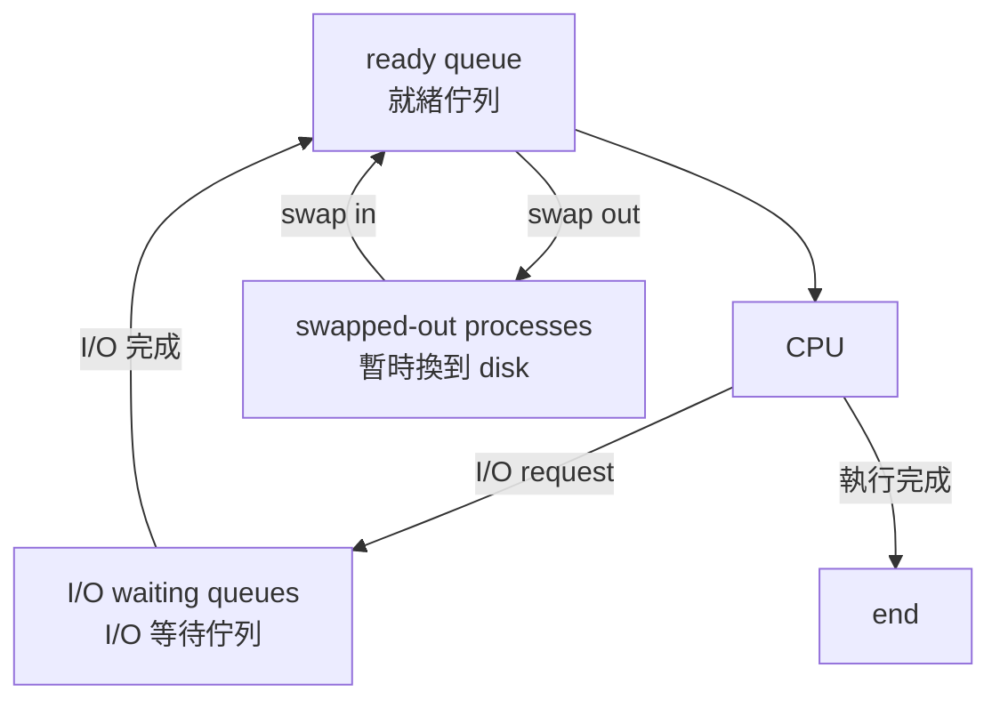

---

#### 每個 scheduler(排班程式) 到底在做什麼？

這裡最容易混的是三種 scheduler。

**long-term scheduler(長程排班程式 / job scheduler)**
決定哪些行程要被帶進 ready queue。投影片明寫：它控制 **degree of multiprogramming(多元程式規劃程度)**。

**short-term scheduler(短程排班程式 / CPU scheduler)**
這個最常出現。它從 ready queue 選一個行程，分配 CPU 給它。

**medium-term scheduler(中程排班程式)**
它不是在問「下一個誰用 CPU」，而是在問：

> 現在主記憶體是不是擠太多行程了？
> 要不要先把某些行程暫時搬出去，晚點再搬回來？

所以它管理的是 **swapping(置換)**。課程投影片在行程排班與記憶體管理兩章都一致寫到：行程可暫時被 swapped out 到 backing store(後備儲存體)，之後再回來繼續執行，而這由 **mid-term scheduler** 負責。

---

#### 什麼叫 degree of multiprogramming(多元程式規劃程度)？

這個名詞很抽象，我們把它講白一點：

就是「**同一時間有多少個行程一起待在主記憶體裡，準備競爭 CPU 與其他資源**」。

生活化例子：

* 你房間只能舒服坐 5 個人
* 現在硬塞了 12 個人
* 每個人都想用桌子、電風扇、插座

這時候如果先請幾個暫時出去，房間裡就比較不擠，剩下的人做事反而更順。

在作業系統裡，**swap out** 某些行程，就像把房間裡一部分人先請出去；
這樣主記憶體裡活躍的行程變少，系統壓力會下降。這正是投影片所說「減低多元程式規劃的程度」。

---

#### 這張圖最容易誤解的地方

**誤解 1：medium-term scheduler 也是在選下一個 CPU 使用者。**
不是。
選「下一個誰上 CPU」的是 **short-term scheduler**。
**medium-term scheduler** 管的是「要不要先把某些行程搬出記憶體」。

**誤解 2：swap out 就等於結束。**
不是。
被 swap out 的行程只是**暫時離開主記憶體**，之後還可以 **swap in** 回來，從原本進度繼續執行。投影片原文就寫：store on disk, bring back in from disk to continue execution。

**誤解 3：I/O waiting 和 swapped out 是同一件事。**
不是。

* **I/O waiting**：在等某個 I/O 事件完成
* **swapped out**：因系統策略或記憶體壓力，被暫時移出主記憶體
  兩者可能同時和「暫時不能跑」有關，但原因不同。

---

#### 你可以怎麼背

我建議背成這三句：

* **short-term scheduler**：從 **ready queue** 挑下一個用 CPU 的人。
* **medium-term scheduler**：負責 **swapping**，把行程從 memory 搬到 disk，再搬回來。
* **swapping 的目的**：降低 **degree of multiprogramming**，讓記憶體不要太擠。

---

#### 這張投影片和前一張 queue 圖要怎麼串起來？

前一張是告訴你：

* 有 **ready queue**
* 有 **I/O device queue**
* 行程會在它們之間移動

這一張再往前一步補上：

* 除了 long-term / short-term scheduler
* 在 **time-sharing(分時系統)** 下，還可能有 **medium-term scheduler**
* 它可以把某些行程暫時移出主記憶體，也就是 **swapping**。

所以兩張圖合起來看，概念才完整：

1. 行程在 queues 間流動
2. scheduler 決定何時挑人
3. medium-term scheduler 額外管理「要不要先搬出去」

---

#### 社群上最常卡住的點

我也查了社群討論，很多人最容易卡在：

> 「medium-term scheduler 是不是每次排 CPU 都會用到？」

不是。
Stack Overflow 上常見的回答是：它主要在**記憶體有限**、需要降低 multiprogramming 時才比較重要；若實體記憶體非常充足，它的重要性就會下降。社群也常順帶提到，現代系統很多時候更常看到的是 **paging(分頁)**，而不是傳統教材裡這種整個 process 為單位的 swapping。這是實務補充，你考試時還是要先以投影片定義為主。([Stack Overflow][1])

---

#### 這裡最容易考的觀念

1. **誰從 ready queue 挑 process 給 CPU？**
   是 **short-term scheduler / CPU scheduler**。

2. **誰負責 swapping？**
   是 **medium-term scheduler**。

3. **swapping 的效果是什麼？**
   暫時把行程移出主記憶體，降低 **degree of multiprogramming**。

4. **swapped out 的行程會不會直接消失？**
   不會，它之後可以 **swap in** 回來繼續執行。

---

#### 一句話總結

**這張圖的重點不是排班演算法本身，而是：除了從 ready queue 挑人給 CPU 的 short-term scheduler 之外，系統還可能用 medium-term scheduler 做 swapping，把部分行程暫時搬出記憶體，等之後再搬回來繼續跑。**

下一步我們可以直接把這張圖和 **new / ready / running / waiting / terminated 五狀態圖** 一起對照，這樣你會一次看懂「狀態」和「queue / scheduler」到底怎麼連起來。

[1]: https://stackoverflow.com/questions/11148419/medium-term-scheduler?utm_source=chatgpt.com "operating system - Medium term scheduler - Stack Overflow"


## 3.3 行程的操作(Process Operations)


### 講解

已啟用教學模式

#### 第 3.3 在講什麼

**3.3 行程的操作(Process Operations)** 在回答兩件事：

1. **行程怎麼被建立**
2. **行程怎麼結束**

教材原文先總結：系統中的行程可以並行執行，而且也要能動態地產生或刪除，所以作業系統必須提供**行程產生(process creation)**與**行程結束(process termination)** 的功能。

---

#### 先用一句話抓住整章

你可以先背這句：

> **3.3 就是在講：父行程(parent process) 可以生出子行程(child process)；子行程可能跟父行程一起跑，也可能讓父行程等它結束；最後行程用 exit() 結束，而父行程通常用 wait()/waitpid() 收屍(reap) 取得子行程的結束狀態。**  ([man7.org][1])

---

#### 3.3.1 行程的產生(Process Creation)

教材先說，一個行程在執行期間，可以利用系統呼叫產生新行程；原本那個叫 **parent process(父行程)**，新產生的叫 **child process(子行程)**。而且 child 還可以再生 child，所以整體可以形成 **process tree(行程樹)**。每個行程都有自己的 **PID(Process Identifier，行程識別碼)**。

你可以把它想成家譜：

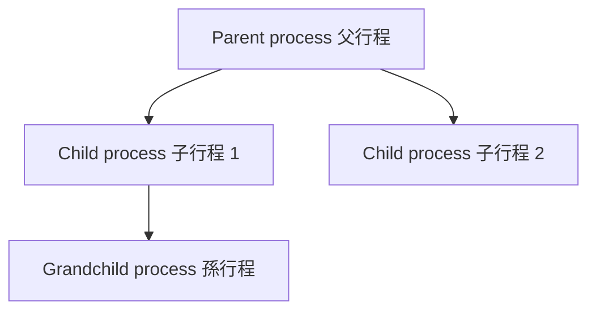

重點不是「樹很漂亮」，而是：

> **OS 不是只有一個程式從頭跑到尾，而是執行中還能再產生新行程。** 

---

#### 父行程生出子行程後，接下來會怎樣

教材列了兩種典型可能：

* **父行程與子行程同時執行**
* **父行程等待，直到子行程結束** 

這裡的「同時」在單一 CPU 語境下，通常是指 **concurrently(並行/交錯進行)**，也就是由排班器快速切換，不一定代表真正硬體上的平行。這點要跟你前面 3.2 的排班觀念一起看。

生活化一點：

* **同時執行**：爸媽跟小孩一起各做各的事
* **父行程等待**：爸媽先停下來，等小孩把任務做完再繼續

---

#### 父子行程的資源關係

教材也列了三種可能性：

* 父子共享所有資源
* 子行程共享父行程的部分資源
* 父子完全不共享資源 

這段你不用把它背成死定義，比較好的理解是：

> **child 並不是一定跟 parent 一模一樣，也不是一定完全獨立；資源共享可以有不同設計。** 

---

#### 記憶體空間(address space) 這裡最重要

教材在 UNIX 例子裡講得很清楚：

* `fork()` 用來建立新行程
* 新行程一開始是原行程 **address space(位址空間)** 的一份複本
* `exec` 會把目前行程的記憶體空間改成新的程式 

官方 Linux man page 也一致：`fork()` 會建立 child process，父子在**不同的記憶體空間**中執行；`execve()` 成功後，會用新程式直接**取代目前行程的程式映像(image)**，重新初始化 stack、heap、data segments，而且 `execve()` 成功時**不會返回**。([man7.org][1])

這裡有一個超常見誤解，我直接幫你拆掉：

> **fork 會建立新的 process；exec 不會再多生一個 process。**
> **exec 做的是「換腦袋」，不是「再生一個人」。**  ([man7.org][1])

---

#### fork() 到底在做什麼

教材給的 `fork()` 重點是：

* `#include <unistd.h>`
* `pid_t fork(void);`
* 回傳值有三種

  * `-1`：失敗
  * `0`：現在這段程式是在 **child**
  * `> 0`：現在這段程式是在 **parent**，而且這個值是 **child 的 PID** 

這是考試超愛考的地方。

你可以這樣記：

```c
pid_t pid = fork();

if (pid < 0) {
    // fork 失敗
} else if (pid == 0) {
    // child 走這裡
} else {
    // parent 走這裡，pid 是 child 的 PID
}
```

也就是說，**同一行 `fork()` 之後，程式分裂成兩條執行路徑**。 ([man7.org][1])

---

#### 為什麼教材常寫 fork() + exec()

因為這是 UNIX / Linux 非常典型的流程：

1. `fork()` 先生出 child
2. child 在自己的路徑中呼叫 `exec(...)`
3. child 的程式內容被新的程式取代
4. parent 可以選擇 `wait()` 等 child，也可以不等 

教材示範碼就是 child 去 `execlp("/bin/ls", "ls", NULL);`，parent 則 `wait(NULL);`，等 child 完成後再印出 `Child Complete`。

所以你可以把 `fork + exec` 想成：

> **先生一個孩子，再讓孩子去做另一份新工作。**

不是：

> **直接把爸爸變成另一個人。**

---

#### wait() 在幹嘛

教材寫到：

```c
pid_t pid;
int status;
pid = wait(&status);
```

它的意思是：parent 等 child 結束，並取得 child 的結束資訊。

官方 POSIX / Linux 文件也明確說明：

* `wait()` / `waitpid()` 用來等待 child 狀態改變
* 預設最常見的是等待 **child termination(子行程終止)**
* 如果 child 已經結束，呼叫會立即返回
* 如果 child 還沒結束，呼叫中的 thread 會被 block 住
* `waitpid()` 比 `wait()` 更精確，因為可以指定要等哪個 child，還可搭配 `WNOHANG` 等選項 ([man7.org][2])

這段的生活化版本：

> **wait() 像父行程去櫃台領「孩子的成績單與結業通知」。**
> 沒去領，就會留下後續問題。

---

#### 3.3.2 行程的結束(Process Termination)

教材說，行程在執行完最後一個敘述，或使用 `exit()` 要求 OS 把自己刪除時，就會結束。結束後，它的資源會被 OS 回收，包括：

* 實體記憶體
* 虛擬記憶體
* 開啟檔案
* I/O 緩衝區 

教材也補充，父行程有時也可以中止子行程，例如：

* 子行程超過資源限制
* 子行程的工作已不需要
* 父行程結束後，系統不允許子行程繼續執行 

---

#### Zombie Process(僵屍行程) 是什麼

這一段最容易混。

教材的定義是：

> **如果 child 已經結束，但 parent 沒有用 wait() 去取得它的狀態，process table 仍保留那筆 child 資訊，這個狀態就叫 zombie。** 

Linux man page 也一致指出：一個 child 終止後，如果還沒有被 `wait` 類系統呼叫處理，它就會變成 **zombie**；kernel 只保留最小必要資訊，例如 PID、termination status、resource usage，直到 parent 後續來 wait。若 zombie 長期不被清掉，會佔用 process table 的槽位。([man7.org][3])

所以你一定要記住：

> **zombie 不是「還在跑」的行程。**
> **它其實已經死了，只是戶籍還沒註銷。**  ([man7.org][3])

這也是社群最常出現的誤解之一；高票解釋通常也都會強調 zombie 幾乎不吃 CPU，也不是活著的工作，而是還沒被 reaped 的結束紀錄。([Stack Overflow][4])

---

#### Orphan Process(孤兒行程) 是什麼

教材說：

> **如果 parent 還沒等 child 結束就自己先結束，而 child 還活著，這個 child 就叫 orphan process。**
> 之後它很快會被 `init` 認養。

POSIX / Linux 文件也說，如果 parent process 終止時仍有 children，這些 child 會被指派新的 parent process。Linux 文件則進一步說，會被 `init(1)` 或最近的 subreaper 收養。([man7.org][2])

所以：

* **orphan 是還活著的 child**
* **zombie 是已經死掉、但尚未被 wait 的 child**  ([man7.org][3])

這兩個不要搞反。

---

#### Zombie 跟 Orphan 最簡單的差別

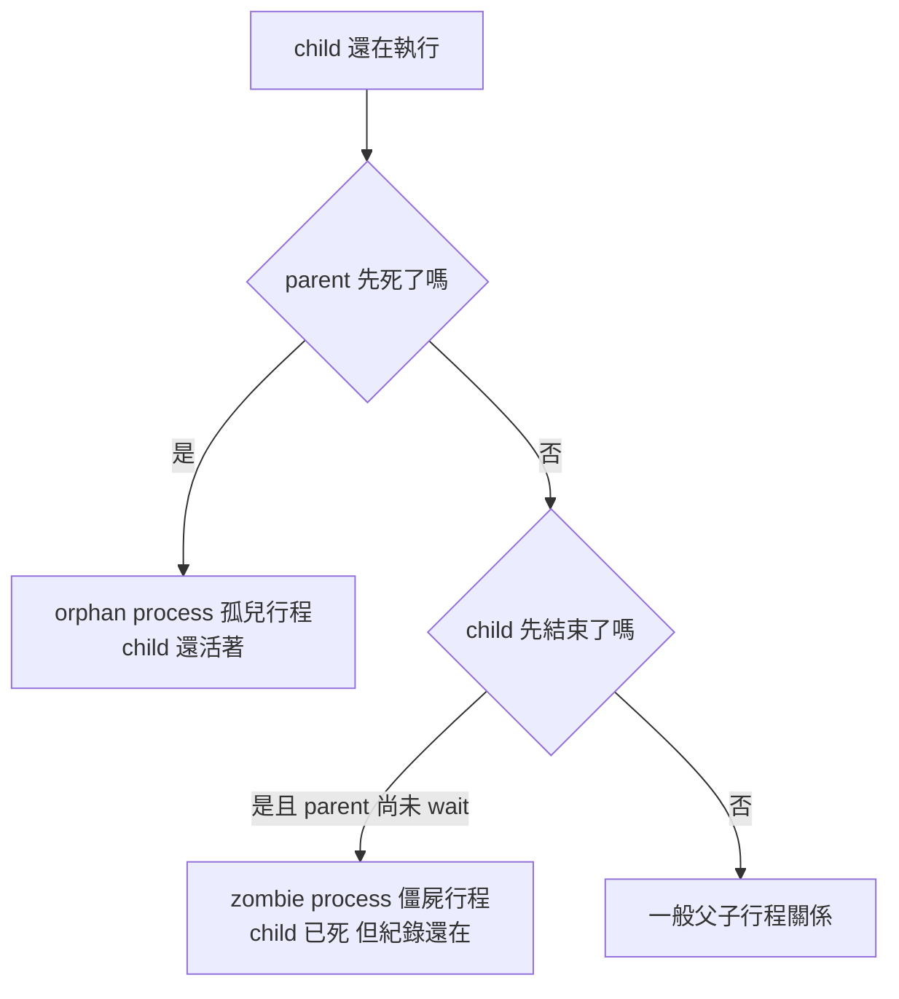

你可以背這句：

> **orphan 看的是 parent 先死；zombie 看的是 child 先死但 parent 還沒收尾。**

---

#### 這章最容易考的 4 個陷阱

#### 1. fork() 之後，父子變數會不會互相影響？

教材 Quiz 1 的答案已經告訴你：`value` 在 parent 印出來仍然是 5，不會因 child 把它加 15 就變成 20，因為 parent 和 child 各自有自己的 copy。

所以一般情況下：

> **fork 後是各自的位址空間副本，不是共用一般變數。**  ([man7.org][1])

#### 2. exec() 會不會建立新 process？

**不會。**
建立新 process 的是 `fork()`；`exec()` 是把目前 process 的記憶體映像換成新程式。 ([man7.org][5])

#### 3. zombie 會不會一直吃 CPU？

通常不會。
它重點是 process table 裡那個還沒回收的紀錄，不是持續執行中的工作。([man7.org][3])

#### 4. orphan 是不是壞事？

不一定。
它只是 parent 先結束、child 還活著；之後通常會被系統重新收養。 ([man7.org][2])

---

#### 我幫你整理成一張總表

| 主題                 | 你要記的核心                    |
| ------------------ | ------------------------- |
| `fork()`           | 建立新 child process         |
| `exec()`           | 用新程式取代目前 process image    |
| `wait()/waitpid()` | parent 等 child 結束並取得狀態    |
| `exit()`           | 行程主動結束                    |
| zombie             | child 已死，但 parent 還沒 wait |
| orphan             | parent 已死，但 child 還活著     |

教材對這整組流程的描述，和 Linux / POSIX 手冊的行為是一致的。 ([man7.org][1])

---

#### 考試作答版

如果老師問你「說明 3.3 行程的操作」，你可以直接寫：

> **作業系統必須提供行程的產生與結束功能。行程在執行期間可透過系統呼叫產生新行程，原行程稱為 parent process，新行程稱為 child process，並可形成 process tree。父子行程可能同時執行，或由父行程等待子行程結束。UNIX 中常以 fork() 建立新行程，再以 exec() 載入新程式。行程結束時可呼叫 exit()，其資源由作業系統回收；父行程通常以 wait()/waitpid() 取得子行程的結束狀態。若 child 結束但 parent 未 wait，則 child 成為 zombie；若 parent 先結束而 child 尚未結束，則 child 成為 orphan。**  ([man7.org][1])

---

#### 超短口訣

> **fork 生小孩，exec 換工作，wait 收結果，exit 結束；父不收屍是 zombie，父先死是 orphan。**

#### 最後給你一個學這章的最好方法

這章很適合在你的 Ubuntu VM 直接做小實驗，因為 **fork / exec / wait / ps** 這種主題，自己跑一次會比只看投影片穩很多。光靠背定義，最容易在 **fork 與 exec 的差別**、**zombie 與 orphan 的差別** 這兩個地方出錯。

下一步我們可以直接進入手把手模式，先只做 2 個最重要的小實驗：
**fork()+wait() 基本版**，以及 **zombie / orphan 觀察版**。

[1]: https://man7.org/linux/man-pages/man2/fork.2.html?utm_source=chatgpt.com "fork(2) - Linux manual page"
[2]: https://www.man7.org/linux/man-pages/man3/wait.3p.html?utm_source=chatgpt.com "wait(3p) - Linux manual page"
[3]: https://man7.org/linux/man-pages/man2/waitpid.2.html "wait(2) - Linux manual page"
[4]: https://stackoverflow.com/questions/20688982/zombie-process-vs-orphan-process?utm_source=chatgpt.com "c - Zombie process vs Orphan process - Stack Overflow"
[5]: https://man7.org/linux/man-pages/man2/execve.2.html?utm_source=chatgpt.com "execve(2) - Linux manual page"


### child 有啥東東

當 fork() 發生時，child 會得到 parent 在那一瞬間的整個位址空間(address space)內容副本。
所以不只程式碼，變數當下的值也會一起帶過去。fork(2) 的 Linux manual 明確寫到：在 fork() 當下，父子兩邊的 memory space 內容相同，而且之後一方的寫入不會影響另一方。
不只 global 變數，local 變數、heap 內容也會一起延續「當下狀態」
這裡你可以把 fork() 想成：
把 parent 在那一刻的執行現場整份複製給 child

### child 從哪裡開始

答案：子行程不是從 int main(){ 重新開始，也不是再去「執行一次 pid = fork();」；它是從 fork() 呼叫「返回之後」的狀態繼續往下跑

fork() 會把呼叫它的那個行程複製出一個 child process。複製完成後，parent 和 child 都會從同一個程式位置繼續執行，也就是 fork() 這個函式呼叫結束之後的下一步

### 如何一次有兩個直屬 child ？

```c
#include <sys/types.h>
#include <sys/wait.h>
#include <unistd.h>
#include <stdio.h>
#include <stdlib.h>

int main(void) {
    pid_t pid;

    pid = fork();
    if (pid < 0) {
        perror("fork");
        exit(1);
    }
    if (pid == 0) {
        printf("child 1: pid=%d, ppid=%d\n", getpid(), getppid());
        _exit(0);
    }

    pid = fork();
    if (pid < 0) {
        perror("fork");
        exit(1);
    }
    if (pid == 0) {
        printf("child 2: pid=%d, ppid=%d\n", getpid(), getppid());
        _exit(0);
    }

    wait(NULL); // 誰先結束就 wait 到誰
    wait(NULL);

    printf("parent: pid=%d\n", getpid());
    return 0;
}
```

1. 看到上面程式碼，要用 _exit(0); 來防止執行到第二個 pid = fork();。
2. 兩個 wait(NULL); ，哪個 child 先回來就找誰。

### 連續兩次 fork 會怎樣

例如這樣：
```c
fork();
fork();
```
最後會有 4 個 process，不是只有「1 父 + 2 子」：

- 原始 parent
- 第一個 child
- 第二個 child（parent 在第二次 fork 生的）
- 一個 grandchild（第一個 child 在第二次 fork 生的）

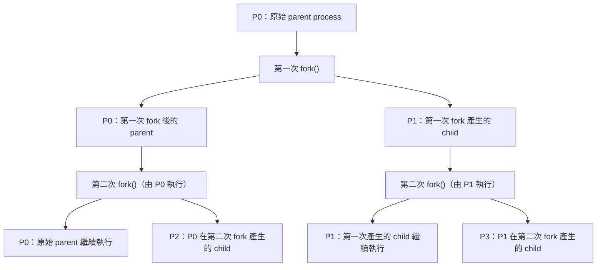


## 3.4 行程間通訊


已啟用教學模式

### 講解
#### 這張圖在回答什麼問題

這張投影片在回答：

**為什麼作業系統需要讓不同行程 process(行程)彼此合作，以及它們可以怎麼溝通？**

也就是說，不是每個行程都各做各的。有時候它們必須交換資料、共享資源，甚至一起完成一件大工作。這就是 **Interprocess Communication, IPC(行程間通訊)** 的核心。圖中列出合作理由，下面兩張小圖則在對比兩種主要 IPC 方式：

1. **message passing(訊息傳遞)**
2. **shared memory(共享記憶體)**  

---

#### 先用直覺理解

你可以把每個 process(行程)想成一個人在做事。

如果兩個人要合作，有兩種常見方法：

1. **傳紙條**
   你寫一張紙條給我，我看完再回你。
   這就是 **message passing(訊息傳遞)**。

2. **共用白板**
   我們兩個都可以看同一塊白板，也可以在上面寫東西。
   這就是 **shared memory(共享記憶體)**。

這張圖就是在說：

* 左圖：像傳紙條，中間有系統幫忙轉交
* 右圖：像共用白板，兩個行程直接看到同一塊資料區

---

#### 核心概念

投影片上半部先講 **process cooperation(行程合作)** 的理由，有四個：

1. **Information sharing(資訊共享)**
   多個使用者或多個程式可能都要用同一份資料，例如公用檔案。

2. **Computation speedup(加速運算)**
   一個大工作拆成很多小工作，交給不同 process(行程) 平行做。

3. **Modularity(模組化)**
   系統拆成多個模組，每個模組由不同 process(行程) 負責。

4. **Convenience(方便性)**
   就算只有一個使用者，也可能同時做很多事。
   例如一邊下載、一邊播放音樂、一邊編輯文件。 

這四個理由可以簡單記成：

**共享、加速、拆模組、方便多工**

---

#### 下方兩張圖在講什麼

#### (a) 左圖：message passing(訊息傳遞)

左邊那張圖中：

* process A 在上面
* process B 在上面
* 中間有一塊 **message queue(訊息佇列)**
* 最下面是 **kernel(核心)**

意思是：

* A 跟 B 不能直接碰彼此的資料
* 它們要溝通時，要把資料丟進 **message queue**
* 通常由 **kernel(核心)** 負責管理、轉送、同步

這種方式的直覺是：

> 你不能直接進我房間拿東西，你要先把訊息交給管理員，管理員再幫你轉交。

##### 特點

* 比較安全
* 比較容易管理權限
* process 彼此隔離比較好
* 但通常會比 shared memory 慢，因為要經過 kernel 幫忙

---

#### (b) 右圖：shared memory(共享記憶體)

右邊那張圖中：

* process A 在上面
* process B 在下面
* 中間有一塊 **shared memory(共享記憶體)**
* 最下面是 kernel

意思是：

* kernel 先建立一塊雙方都能存取的記憶體區域
* 建好之後，A 和 B 可以直接讀寫那塊 shared memory
* 不需要每次都透過 kernel 轉送資料

這種方式的直覺是：

> 管理員先給我們一塊共同白板，之後我們兩個自己在白板上寫資料。

##### 特點

* 通常速度比較快
* 適合大量資料交換
* 但比較危險，因為兩個 process 可能同時改同一塊資料
* 所以常常要搭配 **synchronization(同步機制)**，例如 semaphore(號誌) 或 mutex(互斥鎖)

---

#### 關係 / 流程 / 因果

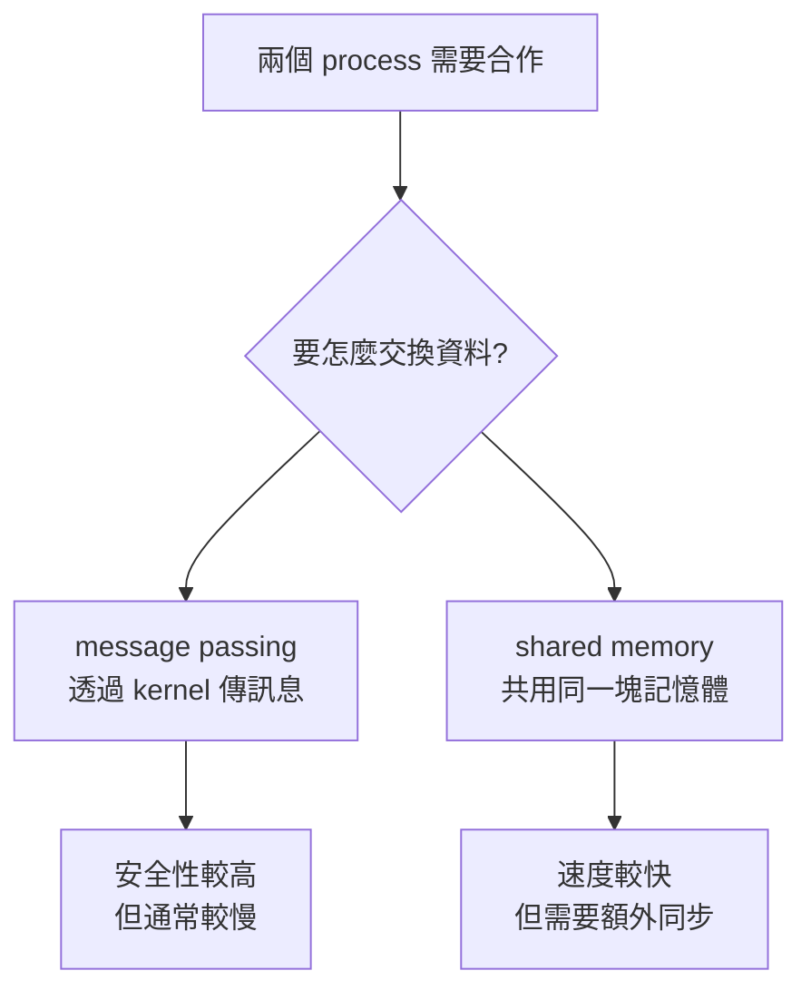

---

#### 生活化例子

#### 例子 1：聊天室伺服器

* 每個 client request(客戶端請求) 可由不同 process 處理
* 它們可能要把訊息交給另一個 process
* 這時可以用 **message passing**

像是：

* A process 收到使用者訊息
* 把訊息送給 B process 去存資料庫

---

#### 例子 2：瀏覽器 + 渲染器

有些系統會拆成多個 process：

* 一個負責 UI
* 一個負責網路下載
* 一個負責畫面渲染

如果它們需要大量共享資料，例如畫面 buffer(緩衝區)，就可能用 **shared memory**

---

#### 例子 3：Producer-Consumer(生產者消費者)

這章常見的經典題。

* producer(生產者) 負責放資料
* consumer(消費者) 負責拿資料

如果它們共用同一個 buffer(緩衝區)，那通常就是 **shared memory**
但這時就會遇到同步問題：

* 不能同時亂寫
* 不能讀到還沒寫好的資料
* 不能 overflow(塞爆) 或 underflow(讀空)

這也就是為什麼後面章節會接到 synchronization(同步)。

---

#### 為什麼會這樣

因為 **process(行程)** 本質上是彼此隔離的。

這種隔離有好處：

* 一個 process 壞掉，不容易直接拖垮別人
* 保護資料與記憶體安全

但壞處是：

* 如果要合作，就需要一套正式的溝通機制

所以作業系統才提供 IPC 兩大方向：

* **message passing**：讓大家透過 OS 幫忙傳遞
* **shared memory**：讓大家共用資料區，但自己要小心同步

---

#### 最容易考 / 最容易混淆

#### 1. cooperation(合作) 不是 thread 才有，process 也有

很多人會以為只有 thread(執行緒) 才會合作。不是。

process 也會合作，只是因為位址空間不同，合作通常需要 IPC。

---

#### 2. shared memory 不是「完全不用 kernel」

這很容易搞錯。

正確說法是：

* **建立 shared memory 時，通常還是要 kernel 幫忙**
* 但**建立完成後，資料交換本身可以直接在共享區做**
* 所以它通常比 message passing 更快

---

#### 3. message passing 不等於一定很慢

相對 shared memory 常常較慢，但它有優點：

* 設計清楚
* 邊界清楚
* 安全性高
* 分散式系統也很適合

所以不是誰絕對比較好，而是看需求。

---

#### 4. shared memory 幾乎一定會連到 synchronization(同步)

如果考題看到：

* shared buffer
* producer-consumer
* multiple processes access same data

那你就要立刻想到：

**race condition(競爭情況)**
以及需要
**mutex / semaphore / monitor** 等同步機制。

---

#### 用這張圖來做考試記憶

你可以這樣背：

* **上半部：為什麼要合作**

  * 共享資料
  * 加速運算
  * 模組化
  * 方便性

* **下半部：怎麼合作**

  * 左邊：message passing = 傳紙條
  * 右邊：shared memory = 共用白板

這樣通常就不會混掉。

---

#### 小結

這張圖的重點是：

1. **process cooperation(行程合作)** 有四大理由：共享、加速、模組化、方便。
2. 行程間通訊 **IPC(行程間通訊)** 主要有兩種典型方式：

   * **message passing(訊息傳遞)**
   * **shared memory(共享記憶體)**
3. **message passing** 比較像透過管理員傳紙條，安全、清楚，但通常較慢。
4. **shared memory** 比較像共用白板，快，但容易互相衝突，所以要搭配同步。 

#### 你現在最該抓住的一句話

**IPC 的本質，就是讓彼此隔離的 process 能安全地合作。**

如果你要，我下一步可以直接接著幫你講這張圖下面最重要的考點：
**message passing 和 shared memory 的比較表 + Producer-Consumer 為什麼會浪費一格空間。**


## 3.4.2 訊息傳遞系統 Message Passing


### 講解


已啟用教學模式

#### 這幾張圖在回答什麼問題

這三張圖其實在回答同一個核心問題：

**行程(Process)之間如果不能直接共用資料，還能怎麼互相合作？**

答案就是用 **Message Passing(訊息傳遞)**。
也就是說，不是兩邊一起摸同一塊記憶體，而是你送我一則訊息、我收你一則訊息，靠這種方式溝通與同步。這正是作業系統中另一大類的 IPC(Interprocess Communication，行程間通訊)方法。

---

#### 先講直覺：為什麼要有 Message Passing(訊息傳遞)

你可以把它想成：

* **Shared Memory(共享記憶體)**：像兩個人共用一塊白板，大家都能直接改上面的內容。
* **Message Passing(訊息傳遞)**：像兩個人傳紙條，一方寫好送出去，另一方收到再看。

白板方式速度常常比較快，但要很小心「同時改」造成混亂。
傳紙條方式比較有秩序，因為每次都是「送」與「收」，比較容易控制誰先做什麼。

所以投影片第一張才會說：

* 訊息傳遞可以讓行程彼此**通訊(communication)**
* 也可以達成**同步(synchronization)**
* 而且**不需要共享同一個位址空間(address space)**

這句話非常重要。

---

#### 核心概念 1：Message Passing 至少有兩個基本動作

投影片第一張最重要的句子就是：

* `send(message)`：送出訊息
* `receive(message)`：接收訊息

也就是說，Message Passing 的世界裡，最基本就這兩件事。

你可以把它想成快遞系統：

* 寄件人：`send`
* 收件人：`receive`

沒有 send，就沒東西送。
沒有 receive，訊息也沒人拿。

---

#### 核心概念 2：兩個行程要互傳，必須先「連得上」

第一張圖後半段說：

如果兩個行程 `P` 和 `Q` 要互相聯繫，它們必須有一條 **communication link(通訊鏈結)**。

這意思很像：

* 兩個人要講電話，先要有電話線或網路
* 兩個人要寄信，先要有郵局系統
* 兩個程式要傳訊息，先要有 OS 提供的通道

所以不是隨便一個 process 都能直接對任何 process 傳訊息，必須有某種機制把兩邊接起來。

---

#### 第二張圖：命名(Naming) 其實是在講「訊息到底寄給誰」

這張圖在區分兩種方式：

1. **Direct communication(直接通訊)**
2. **Indirect communication(間接通訊)**

這是很常考的分類。

---

#### 1. Direct communication(直接通訊)

投影片寫法大意是：

* `send(P, message)`：把訊息直接送給行程 `P`
* `receive(Q, message)`：由行程 `Q` 接收訊息

##### 直覺理解

這像你直接寄信給某個人：

* 收件人名字寫死
* 你很清楚要傳給誰

##### 特性

* 傳送端和接收端彼此要知道對方身份
* 耦合比較緊，因為雙方直接指定彼此

##### 生活化例子

你在 LINE 直接傳訊息給某個朋友。
你不是把訊息丟到某個公開信箱，而是明確傳給「小明」。

---

#### 2. Indirect communication(間接通訊)

投影片寫的是透過 **mailbox(信箱)**，也叫 **port(埠口)**。

例如：

* `send(A, message)`：把訊息送到信箱 `A`
* `receive(A, message)`：從信箱 `A` 取出訊息

##### 直覺理解

這像你不是直接交給某個人，而是放進某個信箱。

誰去信箱拿，就誰收到。

##### 特性

* 行程不一定要直接知道對方是誰
* 兩邊只要知道同一個 mailbox 即可
* 耦合比較鬆，設計上更彈性

##### 生活化例子

像公司內部的「客服信箱」：

* 客戶把信寄到 `support@...`
* 誰是實際處理的人，不重要
* 只要有人從這個信箱把信取出即可

---

#### 這兩種怎麼記

你可以這樣記：

* **Direct**：我知道「你是誰」，我直接傳給你
* **Indirect**：我只知道「信箱在哪」，我把東西放進去

---

#### 第三張圖：同步化(Synchronization) 在講 send / receive 會不會等

這張圖很重要，因為很多人第一次看會搞混。

它把訊息傳遞分成：

* **blocking(等待式)**
* **nonblocking(非等待式)**

也可稱為：

* **synchronous(同步式)**
* **asynchronous(非同步式)**

不過這裡你要注意一件事：

在這份投影片的脈絡裡，**blocking ≈ synchronous**；**nonblocking ≈ asynchronous**。
考試通常就是照老師投影片用法記，但在更廣泛系統領域中，這兩組詞有時不會被完全等號看待，所以這裡先以課堂版本理解。

---

#### 1. blocking send(等待傳送)

投影片意思是：

傳送者送出訊息後，要**等到接收者或信箱接收完成**，自己才繼續往下做。

##### 生活化例子

像你親手把文件交給對方，對方說「好，我收到了」，你才離開。

##### 重點

* sender 會卡住等一下
* 確定訊息真的被接住後才繼續

---

#### 2. nonblocking send(非等待傳送)

投影片意思是：

傳送者把訊息送出去後，**立刻繼續做別的事**，不等對方現在有沒有處理完。

##### 生活化例子

像你把包裹交給超商寄件櫃台，丟了就走，不等收件人真的拿到。

##### 重點

* sender 不會卡住
* 送完就繼續執行

---

#### 3. blocking receive(等待接收)

投影片意思是：

接收者如果現在還沒有有效訊息，就要**等到真的有訊息到來**。

##### 生活化例子

你站在門口等外送，外送沒來你就不能走。

##### 重點

* receiver 會卡住
* 一直到有資料才繼續

---

#### 4. nonblocking receive(非等待接收)

投影片意思是：

接收者去看看有沒有訊息：

* 有就拿到
* 沒有也直接返回，不會一直等

##### 生活化例子

像你打開信箱看一下：

* 有信就拿
* 沒信就先去做別的事，晚點再看

##### 重點

* receiver 不會卡住
* 可能拿到資料，也可能得到「目前沒有資料」

---

#### 四種組合怎麼看

你可以整理成這樣：

| 操作                  | 會不會等 | 意思            |
| ------------------- | ---- | ------------- |
| blocking send       | 會等   | 送的人等到訊息被接收    |
| nonblocking send    | 不等   | 送出去就走         |
| blocking receive    | 會等   | 收的人等到訊息出現     |
| nonblocking receive | 不等   | 看一下，有就拿，沒有就回來 |

---

#### 關係 / 流程 / 因果

我們把這三張圖串起來看，整體邏輯其實是：

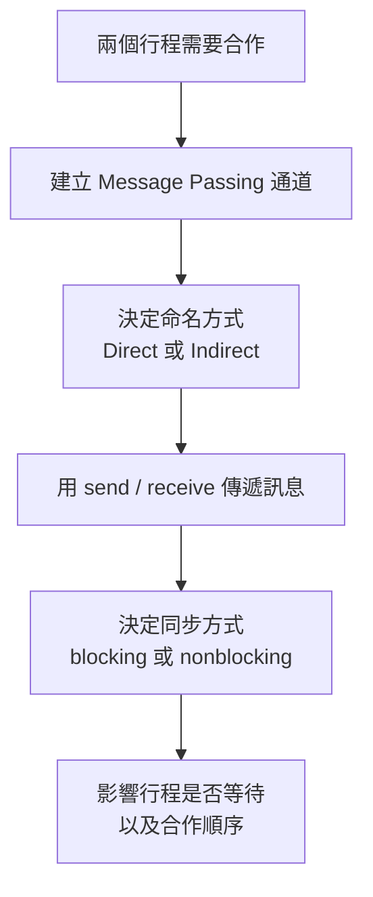

也就是：

1. 先決定不用 shared memory，而改用 message passing
2. 再決定訊息是直接送人，還是丟到 mailbox
3. 再決定 send / receive 遇到對方沒準備好時要不要等
4. 最後形成整個合作流程

---

#### 為什麼 Message Passing 也能做到同步？

這點很關鍵。

因為「等不等」本身就能控制先後順序。

例如：

* `P1` 先做某件事
* 做完後 `send(msg)`
* `P2` 先 `receive(msg)`
* 因為 `receive` 是 blocking，所以 `P2` 會卡住
* 直到 `P1` 真的送出訊息，`P2` 才能繼續

這就等於：

**P2 一定晚於 P1 的 send 之後才往下跑**

所以訊息不只是資料傳遞工具，也能當作同步工具。

---

#### 一個非常好懂的小例子

假設有兩個 process：

* `Producer(生產者)`：做好資料後通知別人
* `Consumer(消費者)`：等通知到了才開始拿資料

做法可能像這樣：

* Consumer 先呼叫 `receive()`
* 如果是 blocking receive，就會先停住
* Producer 完成工作後 `send("done")`
* Consumer 收到 `"done"` 才開始下一步

這就是最基本的「先做完再通知」。

---

#### 最容易考 / 最容易混淆

這裡我直接幫你抓重點。

##### 1. Message Passing 不等於只做通訊，也能做同步

很多人只記得「傳訊息」，忘記它也能控制先後順序。

##### 2. Direct communication 和 Indirect communication 差在「指定誰」

* **Direct**：指定 process
* **Indirect**：指定 mailbox / port

##### 3. blocking / nonblocking 是在講「呼叫之後會不會停下來等」

不是在講有沒有傳成功而已，而是在講**呼叫者會不會被卡住**

##### 4. blocking receive 很常出現在同步需求

因為它很好拿來做「等通知」

##### 5. mailbox(port) 是間接通訊的核心

這是第二張圖最該記住的字

---

#### 你可以這樣背整段

我幫你濃縮成考前版：

* **Message Passing**：行程不共享記憶體，也能靠 `send` / `receive` 溝通與同步
* **Direct communication**：直接指定對方 process
* **Indirect communication**：透過 mailbox(port) 傳訊息
* **blocking**：呼叫後要等
* **nonblocking**：呼叫後不等，立刻返回

---

#### 小結

這三張圖其實就是在建立 Message Passing 的完整骨架：

1. **它是什麼**：一種 IPC(行程間通訊)方法
2. **怎麼送**：`send` / `receive`
3. **送給誰**：direct 或 indirect
4. **要不要等**：blocking 或 nonblocking

如果你要，我下一步可以直接幫你把這三張整理成一份
**「考試背誦版 + 容易混淆比較表」**，讓你可以 1 分鐘快速複習。
