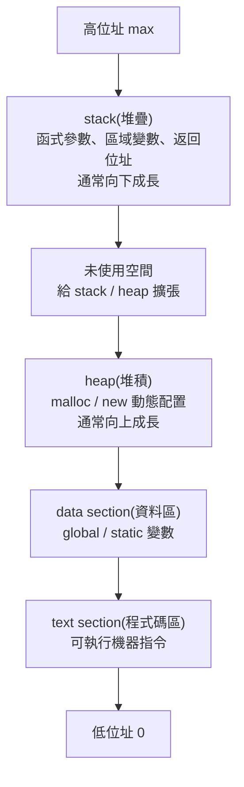
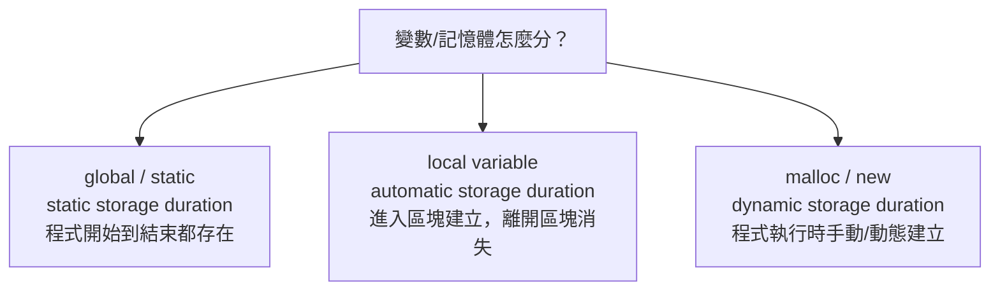
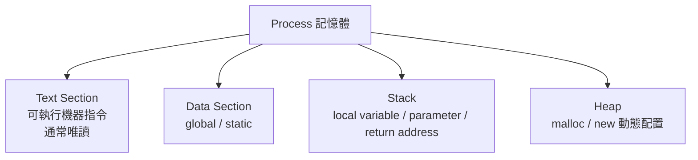

## 3.1.1 行程(Process)


### 講解

#### 這張投影片在回答什麼

這張圖在回答一個很核心的問題：

**行程(Process) 到底只是「程式碼」嗎？**

答案是不是。
教材明確說，行程是「正在執行的程式」，除了程式碼本身，還包含目前執行位置的 **Program counter(程式計數器)**、CPU 的 **registers(暫存器)**、以及執行時會用到的 **stack(堆疊)**、**data section(資料區)**、**heap(堆積)**。

---

#### 先看右邊那張記憶體圖

右圖是在畫一個 process 的**典型記憶體配置(memory layout)**：

* 最下面是 **text**
* 上面是 **data**
* 再上面是 **heap**
* 最上面是 **stack**
* 左邊的 `0` 到 `max` 表示位址從低位址(low address)到高位址(high address)

而且圖上兩個箭頭很重要：

* **heap 向上長**
* **stack 向下長**

這種「兩邊往中間長」的配置，是常見的作法。教材後面也有更完整的圖，直接寫出 **heap 向上增長、stack 向下增長**。
Intel 文件也描述了常見配置裡 stack 往低位址成長、heap 往高位址成長；社群討論也提醒這是 **typical(典型)** 但不是所有架構都必然完全一樣。([Intel][1])

---

#### 四個區塊各自在做什麼

##### 1. text section(程式碼區／本文區)

這裡放的是**可執行的機器指令(machine instructions)**，也就是 CPU 真正要跑的程式內容。教材說 text section 就是 executable code，通常是唯讀(read-only)，而且同一支程式的多個執行個體有時可以共享這一段。

你可以把它想成：

* 食譜本身
* 程式步驟本身
* 「要做什麼」的指令

不是資料，而是**操作規則**。

---

##### 2. data section(資料區)

這裡主要放：

* **global variable(全域變數)**
* **static variable(靜態變數)**

教材明講，已初始化的全域與靜態變數會放在 data section。

例如：

```c
int g = 10;
static int s = 20;
```

這類通常就在 data 區。

補充一個考試常見點：
教材其他頁還把資料再細分成 **BSS**，也就是「未初始化的全域／靜態變數區」。所以這張圖是**簡化版**，正式一點常會拆成：

* `.text`
* `.data`
* `.bss`
* `heap`
* `stack` 

---

##### 3. heap(堆積／堆區)

這裡放的是**動態配置(dynamic allocation)**的記憶體。
像 C 的 `malloc()`、C++ 的 `new` 申請出來的空間，通常就在 heap。教材也明確這樣寫。

特性是：

* 執行期間才決定要多少空間
* 大小可動態改變
* 存活時間常比單一函式呼叫更久
* 要自己管理回收，不然容易 **memory leak(記憶體洩漏)** 或 **fragmentation(碎裂)** 

生活化來說，heap 很像：

> 你去倉庫臨時租一塊空地放東西。
> 要多大自己決定，但用完要記得退租。

---

##### 4. stack(堆疊區)

這裡放的是函式呼叫過程中的暫時資料，例如：

* **local variable(區域變數)**
* **function parameter(函式參數)**
* **return address(返回位址)**

教材明確指出 stack 用來存放副程式參數、返回位址、暫時性變數，並且具有 **LIFO(Last-In First-Out，後進先出)** 特性。

例如：

```c
void f() {
    int x = 5;
}
```

這個 `x` 通常就在 stack。

生活化來看，stack 很像一疊餐盤：

* 最後放上去的，最先拿走
* 函式一層一層呼叫，就像一層一層疊上去
* 函式結束，最上面那層先彈掉

---

#### 為什麼 heap 跟 stack 要往相反方向長？

因為這樣可以**最大化利用中間那塊空間**。

中間藍色那塊可以理解成目前尚未使用的位址空間：

* heap 需要更多動態記憶體時，就往上擴
* stack 函式呼叫變深時，就往下擴

兩邊互相逼近，能把可用空間撐到最大。這也是教材與外部資料都常用的示意方式。 ([Intel][1])

---

#### 這張圖最容易考的重點

##### 第一個重點：行程不只是程式碼

行程還包含：

* code/text
* data
* heap
* stack
* program counter
* registers 

也就是說，**program(程式)** 比較像靜態檔案；
**process(行程)** 是那個檔案「跑起來之後」的完整執行狀態。

---

##### 第二個重點：哪種變數放哪裡

你可以這樣記：

* **global / static** → data
* **local variable** → stack
* **malloc/new 出來的** → heap
* **程式指令本身** → text

教材範例也正是在強調這件事。

---

##### 第三個重點：stack 與 heap 的差別

最簡單的對照：

* **stack**

  * 自動配置／回收
  * 快
  * 空間通常較小
  * 適合函式內短生命週期資料

* **heap**

  * 手動或由 runtime(執行期系統)管理
  * 較彈性
  * 可放較大型、較長生命週期資料
  * 容易 memory leak / fragmentation  

---

#### 你可以這樣一句話背起來

**Process = text + data + heap + stack + CPU 執行狀態(PC、registers)**。

---

#### 我幫你整理成一張小圖



---

#### 再補一個你之後很常連到的觀念

到了多執行緒(multithread)時，常見情況是：

* **code / data / heap** 共享
* **每個 thread 有自己的 stack**

這也是為什麼 thread 跟 process 的記憶體模型不一樣。教材第 4 章有直接畫出這件事。

---

#### 一句話總結

這張投影片的核心是在告訴你：

**行程(Process)不是只有程式碼，而是一個正在執行中的完整記憶體與 CPU 狀態集合；右圖則是在畫它典型的記憶體配置：text、data、heap、stack。** 

若你要，我下一則可以直接幫你做一份「text / data / bss / heap / stack 一次分清楚」的超好背表格。

[1]: https://www.intel.com/content/www/us/en/docs/programmable/743810/24-1/placement-of-the-heap-and-stack.html?utm_source=chatgpt.com "6.13.3. Placement of the Heap and Stack"


### 請講解、比較、舉例"global / static、local variable、malloc/new"

#### 先給你一個總圖

最容易背的方式不是先背「在 stack 還是 heap」，而是先背 **storage duration(儲存期)**：



更精確地說，C/C++ 標準主要談的是 **automatic / static / dynamic storage duration(自動／靜態／動態儲存期)**；而「stack(堆疊) / heap(堆積)」是非常常見的實作模型。你的課內教材也是用 data section、stack、heap 來教，這樣考試最好記，但寫程式時要知道那是常見實作，不是語言標準逐字保證。 ([cppreference.com][1])

#### 1. global / static 是什麼？

這一類的共同點是：**活得很久**。
它們通常有 **static storage duration(靜態儲存期)**，也就是程式開始時就存在，到程式結束才消失。教材也把 **initialized global and static variables(已初始化的全域與靜態變數)** 放在 **data section(data segment，資料區段)**，未初始化的通常在 **BSS**。 ([cppreference.com][1])

先看最普通的 **global variable(全域變數)**：

```c
int g = 10;   // global variable
```

這個 `g` 寫在所有函式外面，整個程式都能用，生命週期是整個程式。社群上最常見的說法是：**global 也是 static duration，只是它的可見範圍比較大**。([cppreference.com][1])

再看 **static**，它最容易讓人混亂，因為它有兩種常見用法。

第一種是 **file-scope static(檔案層級的 static)**：

```c
static int secret = 99;
```

這個也是活到程式結束，但它只在**這個 `.c` 檔案內可見**，也就是 **internal linkage(內部連結)**。你可以把它想成「公司公告欄」和「部門內部便條紙」的差別：
普通 global 像公司公告欄，別的檔案可用 `extern` 看到；
file-scope static 像部門內部便條紙，只有本檔案看得到。([Cppreference][2])

第二種是 **static local variable(靜態區域變數)**：

```c
void f(void) {
    static int count = 0;
    count++;
    printf("%d\n", count);
}
```

這個 `count` 很特別：
它的 **scope(作用域)** 只在 `f()` 裡，所以「看起來像 local」；
但它的 **lifetime(生命週期)** 卻是整個程式，所以每次呼叫 `f()` 時，它都會保留上一次的值。教材也直接用這個例子說明，並指出這類會放在 data segment。 ([Cppreference][3])

所以一句話整理：

**global / static 的核心不是「在哪宣告」，而是它們通常有 static storage duration(靜態儲存期)。**
只是普通 global 可見範圍大，`static` 會改變它的可見性，或讓函式內變數變成「值會保留」。([cppreference.com][1])

---

#### 2. local variable 是什麼？

**local variable(區域變數)** 是你在函式或區塊裡直接宣告、而且沒有加 `static` 的變數。
這類通常有 **automatic storage duration(自動儲存期)**：進入那個區塊時建立，離開就消失。cppreference 對 C 的說法很明確：所有函式參數和 non-static 的 block-scope objects 都屬於 automatic storage duration。教材則用比較直觀的說法：這類通常放在 **stack memory**，用來存 local variables、function parameters、return addresses。([cppreference.net][4]) 

例如：

```c
void f(void) {
    int x = 5;
    int a[100];
}
```

這裡的 `x` 和 `a` 都是 local variable。
你前一題問的「local variable 包不包括陣列」，答案就是：**包括，只要它是函式內直接宣告、又不是 `static`**。教材也直接寫到 stack 用來放 local variables。 ([cppreference.net][4])

但這裡有一個非常值得你現在就建立的精確觀念：

**local ≠ 一定在 stack**。
在課堂和實作裡，我們通常先記成「local 通常在 stack」完全沒問題；但更嚴格地說，語言標準保證的是它有 automatic storage duration，不是逐字保證一定在某種實體區域。社群上也常有人特別提醒這個 distinction(區分)。([cppreference.net][4])

---

#### 3. malloc / new 是什麼？

這一類的共同點是：**執行到那行程式時，才動態要一塊記憶體**。
它們對應的是 **dynamic storage duration(動態儲存期)**。教材把這塊記憶體叫做 **heap memory**，並指出它適合那些要超過單次函式呼叫還繼續存在的資料。 ([cppreference.com][1])

##### malloc(動態配置，C 常見)

```c
int *p = malloc(10 * sizeof(int));
```

`malloc()` 會配置一塊大小為 `10 * sizeof(int)` 的記憶體，回傳指標。Linux man page 明確說這塊記憶體 **不會初始化(not initialized)**，所以你配置完最好自己填值；而且用完要 `free(p)`。([man7.org][5])

```c
int *p = malloc(10 * sizeof(int));
if (p == NULL) {
    /* allocation failed */
}
for (int i = 0; i < 10; i++) p[i] = 0;
free(p);
```

你可以把 `malloc` 想成：
不是在家裡櫃子裡拿一個抽屜，而是臨時去倉庫租一塊空地。你要自己記得租多少、怎麼用、什麼時候歸還。([man7.org][5])

##### new(C++ 常見)

```cpp
int* p = new int[10];
delete[] p;
```

C++ 的 **new-expression** 是建立 **dynamic storage duration** 物件或物件陣列的標準方式。cppreference 明講，`new-expression` 會取得儲存空間並建立 object / array of objects；配對要用 `delete` 或 `delete[]`。一般情況下，配置失敗會以 `std::bad_alloc` 回報，而不是回傳 `NULL`。([Cppreference][6])

所以：

* `malloc`：偏 C 風格，拿到的是一塊原始記憶體(raw storage)，預設不初始化。([man7.org][5])
* `new`：偏 C++ 風格，建立的是物件(object)或物件陣列，並有對應的 `delete` / `delete[]`。([Cppreference][6])

---

#### 4. 三者最核心的比較

##### A. 活多久？

* **global / static**：從程式開始活到程式結束。([cppreference.com][1])
* **local variable**：進入區塊建立，離開區塊消失。([cppreference.net][4])
* **malloc / new**：你配置後一直存在，直到 `free` / `delete` / `delete[]`。([man7.org][5])

##### B. 誰幫你回收？

* **global / static**：不用你手動回收，程式結束才消失。([cppreference.com][1])
* **local variable**：離開函式或區塊，自動回收。([cppreference.net][4])
* **malloc / new**：通常要你自己回收，不然容易 **memory leak(記憶體洩漏)**。教材與 Linux 手冊都提醒 heap 類錯誤常跟釋放不正確有關。 ([man7.org][7])

##### C. 常見放哪裡？

* **global / static**：通常在 data / bss。 ([Stack Overflow][8])
* **local variable**：通常在 stack。 ([cppreference.net][4])
* **malloc / new**：通常在 heap。 ([man7.org][5])

##### D. 最常犯的錯

* **global / static**：共享狀態太多，程式邏輯容易亂，尤其多執行緒下更危險。教材也提到 shared-memory programming 要小心同步。
* **local variable**：把它的位址回傳出去，函式結束後就變成無效位址。教材直接把這列成常見記憶體錯誤。
* **malloc / new**：忘記釋放、重複釋放、越界寫入、`malloc/free` 與 `new/delete` 配錯。Valgrind 的 Memcheck 也特別會抓這些配對和非法存取問題。([man7.org][7])

---

#### 5. 一次看懂的例子

##### 例子一：global / static / local 同時出現

```c
#include <stdio.h>

int g = 10;          // global
static int sg = 20;  // file-scope static

void f(void) {
    int x = 1;            // local variable
    static int cnt = 0;   // static local variable
    cnt++;
    printf("x=%d, cnt=%d\n", x, cnt);
}

int main(void) {
    f();
    f();
    printf("g=%d, sg=%d\n", g, sg);
}
```

執行重點是：

* `x` 每次進 `f()` 都重新建立，所以每次都是 `1`。
* `cnt` 只初始化一次，之後會保留，所以輸出會是 `1`、`2`、`3` 這樣累加。
* `g` 和 `sg` 也是整個程式期間都存在。教材和 cppreference 對這三種行為的描述是一致的。 ([cppreference.com][1])

##### 例子二：malloc

```c
#include <stdlib.h>
#include <stdio.h>

int main(void) {
    int n = 5;
    int *a = malloc(n * sizeof(int));
    if (a == NULL) return 1;

    for (int i = 0; i < n; i++) a[i] = i * 10;

    for (int i = 0; i < n; i++) printf("%d ", a[i]);

    free(a);
    return 0;
}
```

這裡 `a` 這個指標變數本身是 **local variable**，通常在 stack；
但 `a` 指到的那塊陣列記憶體是 **dynamic storage**，通常在 heap。這正是很多初學者第一次會混淆的地方。([cppreference.net][4])

##### 例子三：new

```cpp
#include <iostream>
using namespace std;

int main() {
    int* a = new int[5];
    for (int i = 0; i < 5; i++) a[i] = i * 100;

    for (int i = 0; i < 5; i++) cout << a[i] << " ";

    delete[] a;
}
```

這和 `malloc` 的概念很像：
`a` 是 local variable；
`new int[5]` 建出的陣列是動態儲存期；
配對釋放必須用 `delete[]`，不能用 `free()`。Valgrind 文件和 GCC/編譯器文件都提醒 mismatched deallocation 會出問題。([Cppreference][6])

---

#### 6. 社群上最常搞混的點

##### 混淆 1：static local 算不算 local？

**看哪個面向。**

* 以 **scope(作用域)** 來說，它是 local，因為只能在那個函式裡用。([Stack Overflow][9])
* 以 **storage duration(儲存期)** 來說，它不是 automatic，而是 static。([cppreference.com][1])

所以你如果考試回答：

> static local variable「作用域是 local，但生命週期是整個程式」

這句很漂亮，也很精確。([Stack Overflow][9])

##### 混淆 2：指標是 local，指到的資料也一定是 local 嗎？

**不一定。**

```c
void f() {
    int *p = malloc(sizeof(int));
}
```

`p` 是 local variable；
但 `*p` 所在的那塊記憶體是 heap/dynamic storage。
這就像你手上拿著一張倉庫租約：租約紙在你手上，但貨物在倉庫。([cppreference.net][4])

##### 混淆 3：global 跟 static 哪個比較「大」？

如果是指**可見範圍**：

* 普通 global 比較大，可跨檔案。([Stack Overflow][10])
* file-scope static 比較小，只限本檔案。([Stack Overflow][10])

如果是指**活多久**：

* 兩者通常都活到程式結束。([cppreference.com][1])

---

#### 7. 你可以這樣背，最不容易錯

我建議你背這三句：

1. **global / static：活整個程式。** ([cppreference.com][1])
2. **local variable：活一個區塊或一次函式呼叫。** ([cppreference.net][4])
3. **malloc / new：活到你把它 free / delete 為止。** ([man7.org][5])

再補一個超常考的例外句：

> **static local：看起來在函式裡，但不會跟著函式結束而消失。**  ([Cppreference][3])

---

#### 8. 如果你要自己在 Ubuntu VM 驗證，最可靠的方法

你這種題目，光背還不夠，**自己跑一次最穩**。
在你的 Ubuntu VM 上，C/C++ 記憶體錯誤最實用的兩套工具是：

* **AddressSanitizer(位址消毒器, ASan)**：GCC 官方文件說它能抓 out-of-bounds(越界) 與 use-after-free(釋放後再用) 這類錯誤。([GCC][11])
* **Valgrind Memcheck**：官方文件會攔截 `malloc/new/new[]/free/delete/delete[]`，用來抓記憶體錯誤與錯誤配對。([Valgrind][12])

你之後寫作業時，C 可以這樣編：

```bash
gcc -g -O0 -fsanitize=address your_file.c -o a.out
./a.out
```

或用 Valgrind：

```bash
gcc -g -O0 your_file.c -o a.out
valgrind --leak-check=full ./a.out
```

這比只靠肉眼看 code 可靠很多，尤其在 `malloc/new` 題目上。([GCC][11])

---

#### 最後幫你濃縮成一句話

**global / static**：像「固定放在家裡的家具」，一直都在。
**local variable**：像「借你這次上課用的白板筆」，下課就收走。
**malloc / new**：像「你臨時租的倉庫空間」，不用時要自己退租。([cppreference.com][1])

下一則我可以直接幫你整理成「宣告方式 → 放哪裡 → 活多久 → 誰釋放 → 常見錯誤」的超好背考前表。

[1]: https://cppreference.com/book/storage_durations.html?utm_source=chatgpt.com "storage durations - cppreference.com"
[2]: https://en.cppreference.com/w/c/language/storage_duration.html?utm_source=chatgpt.com "Storage-class specifiers - cppreference.com"
[3]: https://en.cppreference.com/w/c/language/static_storage_duration.html?utm_source=chatgpt.com "Static storage duration - cppreference.com"
[4]: https://cppreference.net/c/language/storage_duration.html?utm_source=chatgpt.com "Storage-class specifiers - cppreference.net"
[5]: https://man7.org/linux/man-pages/man3/malloc.3.html?utm_source=chatgpt.com "malloc(3) - Linux manual page"
[6]: https://www.en.cppreference.com/w/cpp/memory/new.html?utm_source=chatgpt.com "Low level memory management - cppreference.com"
[7]: https://man7.org/linux/man-pages/man3/free.3.html?utm_source=chatgpt.com "malloc(3) - Linux manual page"
[8]: https://stackoverflow.com/questions/44359953/are-global-variables-in-c-stored-on-the-stack-heap-or-neither-of-them?utm_source=chatgpt.com "Are global variables in C++ stored on the stack, heap or neither of them? - Stack Overflow"
[9]: https://stackoverflow.com/questions/15134916/is-it-correct-to-call-a-static-variable-local?utm_source=chatgpt.com "c - Is it correct to call a static variable local? - Stack Overflow"
[10]: https://stackoverflow.com/questions/51329671/difference-between-static-global-variable-and-non-static-global-variable-in-c?utm_source=chatgpt.com "Difference between static global variable and non-static global variable in C - Stack Overflow"
[11]: https://gcc.gnu.org/onlinedocs/gcc/Instrumentation-Options.html?utm_source=chatgpt.com "Instrumentation Options (Using the GNU Compiler Collection (GCC))"
[12]: https://valgrind.org/docs/manual/mc-manual.html/?utm_source=chatgpt.com "Valgrind"


## Text Section(程式碼區／文字區／text segment)


#### 這張圖在講什麼？

這張投影片是在專講 **Text Section(程式碼區／文字區／text segment)**。
核心意思只有一句：

**Text section 就是放「可執行機器指令(machine instructions)」的地方。**
教材直接寫它包含程式的 **executable code(可執行程式碼)**，也就是處理器可以直接執行的指令序列。

---

#### 一句話先懂

你可以把整個程式想成一本食譜：

* **text section** = 食譜上的「步驟」
* **data section** = 食材的固定資料
* **stack / heap** = 做菜過程中臨時拿來放東西的工作區

所以 **text section 不是拿來放變數值的**，而是拿來放「CPU 要做哪些動作」。

---

#### 逐點翻譯＋講解

投影片的五點其實可以拆成下面這樣：

##### 1. contains the executable code

意思是：

**這裡放的是程式真正要執行的程式碼。**
不是原始碼 `.c`、`.cpp` 那種人看的文字，而是編譯後的 **machine instructions(機器指令)**。

例如你寫：

```c
int add(int a, int b) {
    return a + b;
}
```

CPU 不會直接看懂這段 C 程式。
編譯器會把它翻成機器指令，最後那些指令就會進到 **text section**。這點也符合一般 object file / executable 的 code segment 定義。([Oracle Docs][1])

---

##### 2. stores the machine instructions

這句是在強調：

**text section 放的是 CPU 可以直接跑的低階指令。**
也就是像 `load`、`add`、`jump`、`call` 這類最終處理器理解的內容，而不是單純「程式文字」。教材原文就是這樣寫的。

這也是為什麼在作業系統課講 process layout 時，會把 **text** 跟 **data / stack / heap** 分開看：
因為它們用途根本不同。

---

##### 3. specifies the sequence of operations

這句是在說：

**text section 裡的指令，決定了程式執行的流程。**
例如先做加法、再呼叫函式、再判斷 if、再跳到某個位址繼續跑，這些「執行步驟順序」都是靠 text section 裡的指令定義的。

你可以把它記成：

> **text section = 行為規則**
>
> **data / stack / heap = 被操作的資料**

---

##### 4. usually read-only

這句非常重要。

教材說 **text section 通常是 read-only(唯讀)**。
這樣設計的好處有兩個：

第一，**保護程式碼不被意外改壞**。
如果程式跑一跑可以隨便把自己的指令覆寫掉，那非常容易壞掉，安全性也很差。

第二，**比較容易共享(shared)**。
因為既然不會改，作業系統就可以讓多個正在執行的相同程式，共用同一份 code pages，而不用每個 process 都複製一份。教材也直接寫「shared among multiple instances of the same program」。
ELF / linker 文件也把 text segment 描述成 **read-only executable loadable segment**。([Oracle Docs][1])

但這裡有一個精確但書：
投影片寫的是 **usually read-only**，不是「永遠絕對」。在某些特殊情況，像 JIT(即時編譯) 或 `mprotect` 改頁面權限，確實可以讓某些區域變成可執行甚至可修改；只是那不是你現在這張基礎投影片的主軸。([Oracle Docs][2])

---

##### 5. mapped into memory from the program's executable file

這句很多同學第一次看會卡住，我幫你翻成白話：

**程式執行時，作業系統會把可執行檔(executable file)裡面屬於 code 的那一部分，對映(mapped)到這個 process 的記憶體空間。** 

也就是說，不是你一按執行，系統就「手抄一份原始碼到 RAM」；
而是 loader / OS 依照 executable 格式，把對應的 segment 載入或映射到 process 的虛擬位址空間。Program loading 文件也說明了系統會把檔案中的 segment 對應到 process image 的 virtual memory segment。([Oracle Docs][3])

這和你們後面第 9 章的 **memory-mapped file(記憶體映射檔案)** 觀念其實有呼應：
「把檔案內容對映到虛擬記憶體」本來就是 OS 很核心的技巧，教材後面也有講。

---

#### 為什麼 text section 常常可以被多個 process 共用？

因為它通常是**唯讀**。
如果你今天同時開了 3 個 `/bin/ls`，它們的 **code** 大致相同，OS 沒必要浪費記憶體複製 3 份完全一樣的機器指令。唯讀頁面很適合共享，這也是教材說它可被 multiple instances 共用的原因。
Linker 文件也提到 text segment 的共享性與唯讀屬性密切相關。([Oracle Docs][4])

不過要注意：

* **共享的是 code / read-only 部分**
* **不是每個 process 的全部記憶體都共享**

像 stack、很多 writable data，通常還是各自獨立。這也是你前面學到 process 彼此有自己 address space 的原因。

---

#### text section 和其他區塊怎麼比？

##### text section

* 放 **machine instructions(機器指令)**
* 通常 **read-only**
* 常可被相同程式的多個實例共享 

##### data section

* 放 initialized **global / static variables**
* 通常可寫入(writable) 

##### stack

* 放 **local variables、function parameters、return addresses**
* 函式呼叫時自動管理 

##### heap

* 放 `malloc/free`、`new/delete` 那種動態配置資料
* 存活期可跨函式呼叫 

---



---

#### 最容易考的觀念

##### Q1：text section 裡放的是不是 C 原始碼？

不是。
放的是編譯後的 **machine instructions(機器指令)**。

##### Q2：text section 為什麼常是唯讀？

為了**保護程式碼**、也為了讓相同程式的多個實例能**共享同一份 code**。

##### Q3：text section 是不是變數區？

不是。
變數通常在 **data / stack / heap**，不是 text。

##### Q4：text section 從哪裡來？

通常是從 **program’s executable file(可執行檔)** 映射進 process 的記憶體空間。

---

#### 你可以直接這樣背

**Text section = executable code = machine instructions = 通常 read-only = 可由多個相同程式實例共享 = 來自 executable file 的映射。**

如果你要，我下一則可以直接幫你接著講 **Data section / BSS / Text section 三者差異**，這個很容易一起考。

[1]: https://docs.oracle.com/cd/E23824_01/html/819-0690/gjpww.html?utm_source=chatgpt.com "Predefined Segments - Linker and Libraries Guide"
[2]: https://docs.oracle.com/cd/E26505_01/html/E26506/gjpky.html?utm_source=chatgpt.com "Mapfile Directives - Linker and Libraries Guide"
[3]: https://docs.oracle.com/cd/E19957-01/806-0641/chapter6-34713/index.html?utm_source=chatgpt.com "Program Loading (Processor-Specific) (Linker and Libraries Guide)"
[4]: https://docs.oracle.com/cd/E19683-01/816-1386/6m7qcobl6/index.html?utm_source=chatgpt.com "Performance Considerations (Linker and Libraries Guide)"
