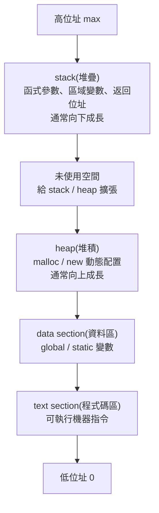

## 3.1.1 行程(Process)


### 這張投影片在回答什麼

這張圖在回答一個很核心的問題：

**行程(Process) 到底只是「程式碼」嗎？**

答案是不是。
教材明確說，行程是「正在執行的程式」，除了程式碼本身，還包含目前執行位置的 **Program counter(程式計數器)**、CPU 的 **registers(暫存器)**、以及執行時會用到的 **stack(堆疊)**、**data section(資料區)**、**heap(堆積)**。

---

### 先看右邊那張記憶體圖

右圖是在畫一個 process 的**典型記憶體配置(memory layout)**：

* 最下面是 **text**
* 上面是 **data**
* 再上面是 **heap**
* 最上面是 **stack**
* 左邊的 `0` 到 `max` 表示位址從低位址(low address)到高位址(high address)

而且圖上兩個箭頭很重要：

* **heap 向上長**
* **stack 向下長**

這種「兩邊往中間長」的配置，是常見的作法。教材後面也有更完整的圖，直接寫出 **heap 向上增長、stack 向下增長**。
Intel 文件也描述了常見配置裡 stack 往低位址成長、heap 往高位址成長；社群討論也提醒這是 **typical(典型)** 但不是所有架構都必然完全一樣。([Intel][1])

---

### 四個區塊各自在做什麼

#### 1. text section(程式碼區／本文區)

這裡放的是**可執行的機器指令(machine instructions)**，也就是 CPU 真正要跑的程式內容。教材說 text section 就是 executable code，通常是唯讀(read-only)，而且同一支程式的多個執行個體有時可以共享這一段。

你可以把它想成：

* 食譜本身
* 程式步驟本身
* 「要做什麼」的指令

不是資料，而是**操作規則**。

---

#### 2. data section(資料區)

這裡主要放：

* **global variable(全域變數)**
* **static variable(靜態變數)**

教材明講，已初始化的全域與靜態變數會放在 data section。

例如：

```c
int g = 10;
static int s = 20;
```

這類通常就在 data 區。

補充一個考試常見點：
教材其他頁還把資料再細分成 **BSS**，也就是「未初始化的全域／靜態變數區」。所以這張圖是**簡化版**，正式一點常會拆成：

* `.text`
* `.data`
* `.bss`
* `heap`
* `stack` 

---

#### 3. heap(堆積／堆區)

這裡放的是**動態配置(dynamic allocation)**的記憶體。
像 C 的 `malloc()`、C++ 的 `new` 申請出來的空間，通常就在 heap。教材也明確這樣寫。

特性是：

* 執行期間才決定要多少空間
* 大小可動態改變
* 存活時間常比單一函式呼叫更久
* 要自己管理回收，不然容易 **memory leak(記憶體洩漏)** 或 **fragmentation(碎裂)** 

生活化來說，heap 很像：

> 你去倉庫臨時租一塊空地放東西。
> 要多大自己決定，但用完要記得退租。

---

#### 4. stack(堆疊區)

這裡放的是函式呼叫過程中的暫時資料，例如：

* **local variable(區域變數)**
* **function parameter(函式參數)**
* **return address(返回位址)**

教材明確指出 stack 用來存放副程式參數、返回位址、暫時性變數，並且具有 **LIFO(Last-In First-Out，後進先出)** 特性。

例如：

```c
void f() {
    int x = 5;
}
```

這個 `x` 通常就在 stack。

生活化來看，stack 很像一疊餐盤：

* 最後放上去的，最先拿走
* 函式一層一層呼叫，就像一層一層疊上去
* 函式結束，最上面那層先彈掉

---

### 為什麼 heap 跟 stack 要往相反方向長？

因為這樣可以**最大化利用中間那塊空間**。

中間藍色那塊可以理解成目前尚未使用的位址空間：

* heap 需要更多動態記憶體時，就往上擴
* stack 函式呼叫變深時，就往下擴

兩邊互相逼近，能把可用空間撐到最大。這也是教材與外部資料都常用的示意方式。 ([Intel][1])

---

### 這張圖最容易考的重點

#### 第一個重點：行程不只是程式碼

行程還包含：

* code/text
* data
* heap
* stack
* program counter
* registers 

也就是說，**program(程式)** 比較像靜態檔案；
**process(行程)** 是那個檔案「跑起來之後」的完整執行狀態。

---

#### 第二個重點：哪種變數放哪裡

你可以這樣記：

* **global / static** → data
* **local variable** → stack
* **malloc/new 出來的** → heap
* **程式指令本身** → text

教材範例也正是在強調這件事。

---

#### 第三個重點：stack 與 heap 的差別

最簡單的對照：

* **stack**

  * 自動配置／回收
  * 快
  * 空間通常較小
  * 適合函式內短生命週期資料

* **heap**

  * 手動或由 runtime(執行期系統)管理
  * 較彈性
  * 可放較大型、較長生命週期資料
  * 容易 memory leak / fragmentation  

---

### 你可以這樣一句話背起來

**Process = text + data + heap + stack + CPU 執行狀態(PC、registers)**。

---

### 我幫你整理成一張小圖



---

### 再補一個你之後很常連到的觀念

到了多執行緒(multithread)時，常見情況是：

* **code / data / heap** 共享
* **每個 thread 有自己的 stack**

這也是為什麼 thread 跟 process 的記憶體模型不一樣。教材第 4 章有直接畫出這件事。

---

### 一句話總結

這張投影片的核心是在告訴你：

**行程(Process)不是只有程式碼，而是一個正在執行中的完整記憶體與 CPU 狀態集合；右圖則是在畫它典型的記憶體配置：text、data、heap、stack。** 

若你要，我下一則可以直接幫你做一份「text / data / bss / heap / stack 一次分清楚」的超好背表格。

[1]: https://www.intel.com/content/www/us/en/docs/programmable/743810/24-1/placement-of-the-heap-and-stack.html?utm_source=chatgpt.com "6.13.3. Placement of the Heap and Stack"
