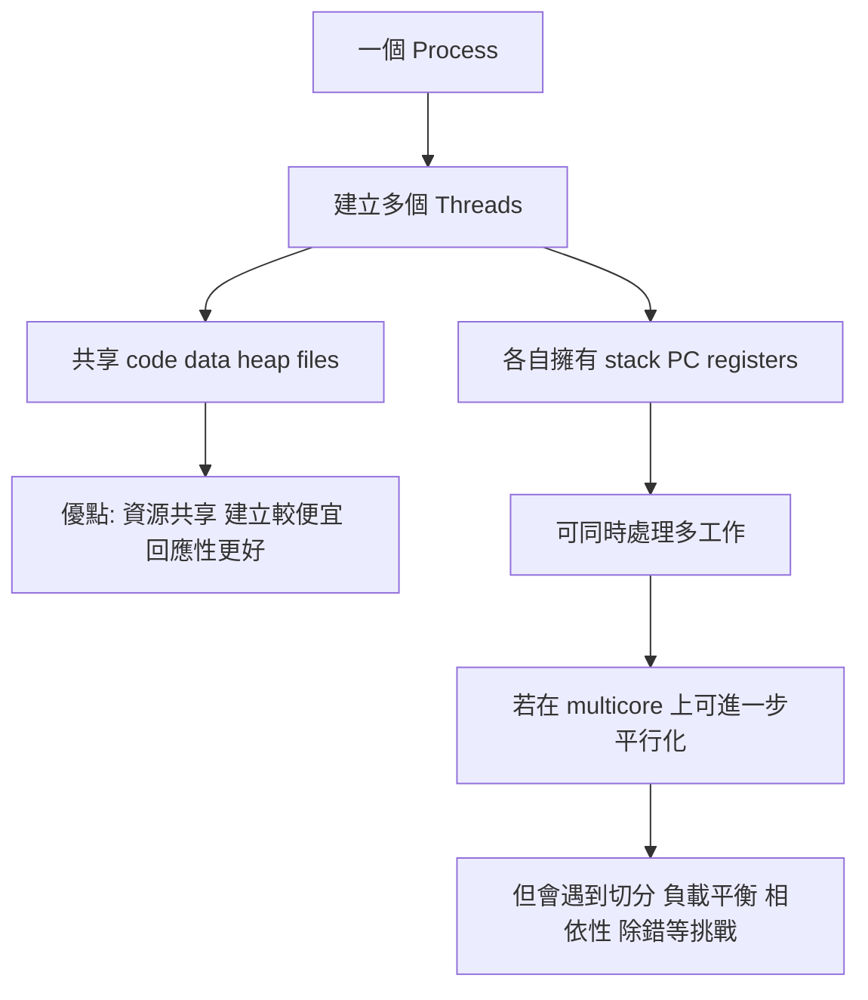
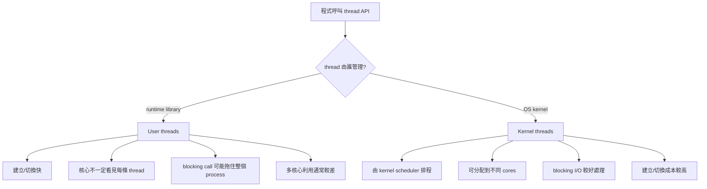

## 4 多執行緒 - 概論


### 講解
已啟用教學模式

#### 這幾張圖在回答什麼問題

這一組其實是在回答一個很重要的主題：

**為什麼我們需要 multithreading(多執行緒)？它有什麼好處？跟 process(行程)差在哪？放到 multicore(多核心) 上又會遇到什麼問題？**

你可以把這幾張圖看成第 4 章的一條主線：

```mermaid
flowchart TB
A[什麼是 Thread(執行緒)] --> B[為什麼要用多執行緒]
B --> C["多執行緒的好處"]
C --> D["Process 與 Thread 的差別"]
D --> E["放到多核心後的挑戰"]
E --> F["延伸到 Concurrency 與 Parallelism"]
```

---

#### 先講直覺：Thread(執行緒) 到底是什麼

最直覺的想法是：

* **Process(行程)**：像一間工作室
* **Thread(執行緒)**：像工作室裡的一位工作人員

同一間工作室裡可以有很多人一起工作。
他們共用同一個空間、工具、檔案，但每個人有自己的工作進度。

你這張「4.1 概論」投影片就是在講這件事：

* **Thread 是 CPU 使用的一個基本單位**
* 一個 thread 會有自己的：

  * thread ID
  * program counter(程式計數器)
  * register set(暫存器集合)
  * stack(堆疊)

而同一個 process 裡的多個 thread，會共享大部分 process 的資源。這和常見的 multithreading 定義一致：同一個 process 內的 threads 共享 address space(位址空間)、open files(開啟檔案) 等資源，但每個 thread 仍保有自己的 PC、registers、stack。([Oracle 文件][1])

---

#### 核心概念 1：單執行緒 vs 多執行緒

你圖中的左邊是 **single-threaded process(單執行緒行程)**，右邊是 **multithreaded process(多執行緒行程)**。

##### 單執行緒

整個程式只有一條執行路線。
就像只有一個人做事：

* 要讀資料
* 要計算
* 要輸出
* 要等 I/O

全部都同一個人做。

##### 多執行緒

同一個 process 裡有多條執行路線。
像同一個團隊中有多個人分工：

* 一個負責 UI(使用者介面)
* 一個負責網路下載
* 一個負責背景計算

這也是 Oracle 的 multithreading 說法：傳統 process 常只有一個 control flow(控制流)，而 multithreading 會把 process 分成多個彼此獨立前進的 execution threads(執行緒)。([Oracle 文件][2])

---

#### 4.1.1 動機：為什麼很多程式都做成多執行緒

這張「動機」圖在講的是：

**現代桌面應用程式，本來就很常同時做很多事，所以自然適合用 multithreading。**

投影片舉的例子都很好：

##### 例子 1：瀏覽器

* 一個 thread 顯示畫面
* 一個 thread 從網路抓資料

這樣畫面才不會卡死。
不然若只有單執行緒，抓資料一慢，整個畫面可能都凍住。

##### 例子 2：文書處理器

* 一個 thread 負責畫面更新
* 一個 thread 負責讀鍵盤輸入
* 一個 thread 在背景拼字檢查

這就是「同一個應用程式裡，有很多可以同時進行的工作」。

##### 例子 3：伺服器

你的圖下面還畫了一個伺服器例子：

1. client(客戶端)送 request(請求)
2. server(伺服器)產生新的 thread 來服務
3. server 本體繼續接其他 request

這就是典型的 **thread-per-request(每個請求一個執行緒)** 想法。
也就是說，不要讓主流程被單一客戶拖住。

---

#### 4.1.2 利益：多執行緒的四個主要好處

這張圖很重要，常常會考整理題。

---

#### 1. Responsiveness(回應性)

這是最容易懂的一個。

意思是：

即使程式某一部分被 block(阻塞) 住，其他部分還能繼續動，所以使用者會覺得系統比較「有反應」。

##### 生活化例子

你用瀏覽器下載大檔案時，頁面還是能滑、按鈕還是能按。
這就是 responsiveness。

Oracle 的 multithreading 文件也把 improving application responsiveness(提升應用回應性) 列為 multithreading 的重要好處之一。([Oracle 文件][3])

---

#### 2. Resource Sharing(資源分享)

這張圖寫得很關鍵：

**threads 屬於同一個 process，所以天然就比較容易共享記憶體與資源。**

同一個 process 內的 threads 共享：

* code
* data
* heap
* files / open files

但每個 thread 自己有：

* stack
* program counter
* registers

這也正是你那張英文圖在表達的重點，並且和官方文件一致。([Oracle 文件][1])

##### 直覺理解

同一間辦公室裡的員工，共用：

* 檔案櫃
* 影印機
* 文件
* 辦公室空間

但每個人有自己的：

* 桌面
* 手邊工作狀態
* 當前做事進度

---

#### 3. Economy(經濟性)

這個字很多人第一次看會覺得抽象，其實意思很簡單：

**建立 thread 的成本通常比建立 process 低，切換 thread 的成本通常也比較低。**

因為 thread 不需要像 process 那樣重建一整套獨立資源空間。
官方資料也明確提到 thread 有利於 using fewer system resources(使用較少系統資源)，以及 thread-based 架構能降低 resource consumption(資源消耗) 並讓 context switch(情境切換) 開銷較低。([Oracle 文件][4])

##### 直覺理解

* 開一家新公司 = 建立一個新 process
* 在原公司多請一個員工 = 建立一個 thread

通常後者便宜得多。

---

#### 4. Scalability(可擴展性)

意思是：

在 multiprocessor / multicore 系統上，多個 threads 可以分散到不同 CPU cores(核心) 上跑，所以比較容易把硬體能力吃滿。Oracle 文件也把 using multiprocessors efficiently(有效利用多處理器) 視為 multithreading 的重要利益。([Oracle 文件][3])

##### 直覺理解

如果你只有一條工作線，再多核心也很難同時忙起來。
但如果你有很多 threads，就比較有機會把工作分給多個核心一起做。

---

#### 4.1.2.5 Process 和 Thread 的差別

你那張英文圖超重要，因為它直接畫出最核心差異。

---

#### 先看 Process creation(建立行程)

左邊圖是：

* Process A 經過 `fork()`
* 變成 Process A 與 Process B

投影片要傳達的是：

**新的 process 會有自己獨立的一套資源空間。**

所以 Process A 和 Process B 不共享整份執行內容空間。
至少在概念上，你應該先把它記成：

* 各自有自己的 code / data / heap / stack 空間映像
* 資源彼此獨立
* 修改自己的資料，不會直接變成對方的資料

這正符合一般作業系統對 process 的理解：不同 processes 彼此隔離，擁有各自獨立的 memory space。([GeeksforGeeks][5])

---

#### 再看 Thread creation(建立執行緒)

右邊圖是：

* Thread A 呼叫 `pthread_create()`
* 產生 Thread B

這時候 **Thread B 不會複製整個 process 資源**，它只需要建立自己那份執行狀態，尤其是自己的 **stack**。而 code、data、BSS、heap、files 這些仍和同 process 的其他 threads 共享。([Oracle 文件][1])

---

#### 這張圖最該背的表

| 項目             | Process | Thread             |
| -------------- | ------- | ------------------ |
| 所屬             | 獨立執行單位  | process 內的一條執行路線   |
| 位址空間           | 通常彼此獨立  | 同 process 內共享      |
| code/data/heap | 不共享     | 共享                 |
| stack          | 各自有自己的  | 每個 thread 自己一份     |
| 建立成本           | 較高      | 較低                 |
| 切換成本           | 較高      | 較低                 |
| 溝通             | 常需 IPC  | 同 process 內可直接共享資料 |

---

#### 你一定要特別注意的一點

很多初學者會誤會：

> 「thread 就是比較小的 process」

這句話只能拿來幫助入門，**不能當正式定義**。

更精確地說：

* process 是 **resource container(資源容器)**
* thread 是 **execution unit(執行單位)**

也就是：

* process 比較像「裝資源的殼」
* thread 比較像「真正跑指令的人」

---

#### 4.1.3 多核心程式的挑戰：不是多執行緒就一定變快

這張圖非常重要，因為它是在打破一個常見迷思：

> 「我把程式切成多 thread，就一定自動加速」
> 這是 ❌

真正情況是：
多核心程式要變快，前提是你能把問題正確拆開，還要處理很多麻煩的同步與資料問題。

投影片列出五大挑戰：

---

#### 1. Dividing activities(切割活動)

問題是：

**哪些工作可以拆開，同時做？**

不是所有程式都能平行化。
有些事情天生要先做 A 才能做 B，就很難拆。

##### 生活化例子

做報告時：

* 查資料
* 做投影片
* 排版
* 練報告

有些能平行，但有些得等前一步完成。

---

#### 2. Balance(平衡)

即使你拆成很多工作，也要分得平均。
不然會變成：

* 核心 1 很忙
* 核心 2 很閒
* 核心 3 沒事做

這樣整體效率還是差。

##### 直覺

四個人搬貨，如果三個人只搬一箱，另一個人搬十箱，那不是有效平行。

---

#### 3. Data splitting(資料分割)

不只工作要切，**資料也要切**。

尤其在 data parallelism(資料平行) 裡，常見做法是把同一批資料切成多塊，交給不同核心做相同操作。這正是 data parallelism 的典型定義。([Oracle 文件][3])

##### 例子

你要處理一千萬筆資料：

* 核心 1 算前 250 萬筆
* 核心 2 算中間 250 萬筆
* 核心 3 算後面 250 萬筆
* 核心 4 算最後 250 萬筆

---

#### 4. Data dependency(資料相依)

這是最關鍵也最容易出錯的點。

如果任務 A 需要任務 B 的結果，或多個 threads 同時讀寫同一份資料，就會有 dependency(相依性) 問題。
因為 threads 共享資料，一個 thread 改了 shared data(共享資料)，其他 threads 可能立刻看見，所以常常需要 mutex(互斥鎖) 等同步機制來保護資料一致性。([Oracle 文件][1])

##### 生活化例子

兩個人同時改同一份 Excel：

* 一個改總價
* 一個改數量

如果沒有協調，結果就可能亂掉。

---

#### 5. Testing and debugging(測試與除錯)

這也是老師很愛考的觀念。

多執行緒 / 多核心程式常常比單執行緒難 debug，因為每次執行的 interleaving(交錯順序) 可能不同。某些 bug 可能今天出現、明天消失，這正是 concurrency 程式麻煩的地方。Oracle 的 multithreaded programming guide 也專門有 synchronization 與 compiling/debugging 章節，反映這類程式在除錯上的額外困難。([Oracle 文件][2])

##### 典型問題

* race condition(競爭條件)
* deadlock(死結)
* starvation(飢餓)
* ordering bug(順序錯誤)

---

#### Concurrency(並行性) 和 Parallelism(平行性) 不一樣

你最後那張英文圖有提到這組很常考的觀念。

##### Parallelism(平行)

**同一時間真的有多個工作一起執行。**

通常需要多核心硬體支援。
例如核心 1 與核心 2 同時各跑一個 thread。

##### Concurrency(並行性)

**不一定同一瞬間一起跑，但多個工作都有在推進(progress)。**

在單核心也能做到。
因為 scheduler(排程器) 可以快速切換，讓多個工作輪流前進。

##### 最好懂的記法

* **Parallelism**：真的同時做
* **Concurrency**：看起來一起做，或至少都在往前推進

---

#### Data parallelism 與 Task parallelism

這張英文圖也提到兩種平行方式：

##### Data parallelism(資料平行)

* 對**同一種操作**
* 套在**不同資料塊**

例子：
把一張大圖切四塊，四個核心一起做模糊處理。

##### Task parallelism(任務平行)

* 不同 threads 做**不同種類的工作**

例子：

* 一個 thread 負責接收資料
* 一個 thread 負責運算
* 一個 thread 負責寫檔

---

#### 這幾張圖的整體因果關係



---

#### 最容易考 / 最容易混淆

這裡我直接幫你抓高頻考點。

##### 1. Thread 不是完整的小 process

比較正確的說法是：

* process 是資源容器
* thread 是執行單位

##### 2. 同 process 的 threads 共享很多東西，但不是全部都共享

**共享：**

* code
* data
* heap
* files

**各自獨立：**

* stack
* program counter
* registers

##### 3. Responsiveness 跟 Scalability 不一樣

* **Responsiveness**：對使用者比較不卡
* **Scalability**：多核心時比較能放大效能

##### 4. Concurrency 不等於 Parallelism

* concurrency：多工作都在前進
* parallelism：真的同時跑

##### 5. 多核心程式最大難點常常不是「開 thread」，而是「正確同步」

真正難的是：

* 資料相依
* race condition
* 除錯困難

---

#### 小結

你這組投影片其實是在建立一個很完整的多執行緒觀念：

1. **Thread 是什麼**
   是 process 裡的基本執行單位，每個 thread 有自己的 stack / PC / registers，共享 process 的多數資源。([Oracle 文件][1])

2. **為什麼要用 multithreading**
   因為現代應用程式常同時處理 UI、I/O、背景工作，multithreading 能改善 responsiveness 並更有效利用多處理器。([Oracle 文件][3])

3. **它的好處是什麼**
   Responsiveness、Resource Sharing、Economy、Scalability。([Oracle 文件][3])

4. **它和 process 差在哪**
   Process 通常彼此隔離；threads 在同一 process 內共享大部分資源，只各自保有自己的執行狀態。([GeeksforGeeks][5])

5. **到了 multicore 為什麼反而更難**
   因為你得處理切分、平衡、資料相依、同步、測試與除錯。([Oracle 文件][2])

如果你要，我下一則可以直接幫你整理成一份
**「4.1 考前背誦版」**，把每一頁濃縮成最容易考的問答題格式。

[1]: https://docs.oracle.com/cd/E19120-01/open.solaris/816-5137/mtintro-95600/index.html "https://docs.oracle.com/cd/E19120-01/open.solaris/816-5137/mtintro-95600/index.html"
[2]: https://docs.oracle.com/cd/E37838_01/html/E61057/mtintro-75924.html "https://docs.oracle.com/cd/E37838_01/html/E61057/mtintro-75924.html"
[3]: https://docs.oracle.com/cd/E19683-01/806-6867/ "https://docs.oracle.com/cd/E19683-01/806-6867/"
[4]: https://docs.oracle.com/cd/E19455-01/806-5257/index.html "https://docs.oracle.com/cd/E19455-01/806-5257/index.html"
[5]: https://www.geeksforgeeks.org/thread-in-operating-system/ "https://www.geeksforgeeks.org/thread-in-operating-system/"

### 多執行緒的意思是多個core執行一個process嗎

不完全是。

多執行緒(multithreading) 的正確意思是：

同一個 process(行程) 裡面，有多個 thread(執行緒) 同時存在並推進工作。

它不一定代表一定有多個 core(核心)。
有多個 core 時，這些 threads 可以 分配到不同 core 上真的同時跑；
但如果只有一個 core，作業系統也可以靠快速切換，讓多個 threads 都在前進。這叫 concurrency(並行性)，不一定是 parallelism(平行性)。

也就是說原本以 process 為單位排程 ，變成分割以 thread 為單位排程。


### 為何 thread 獨立的只有 stack ，沒有 heap

這題在回答什麼問題

你問的是：

為什麼 thread(執行緒) 自己獨立的是 stack(堆疊)，而不是 heap(堆積)？

這其實是在問：

哪些資料天生屬於「這一條執行路線自己」？哪些資料比較適合屬於「整個 process 共享」？

結論先講：

stack 要獨立，因為每個 thread 都有自己的函式呼叫流程、區域變數、回傳位址、參數，這些東西如果共用，馬上就亂掉。
heap 通常共享，因為 heap 存的是同一個 process 想共同使用的動態資料；thread 的目的本來就是在同一個位址空間內合作工作，所以共享 heap 才有意義。

你可以把一個 process 想成一間辦公室。

heap：像辦公室的公共倉庫
stack：像每個員工自己的桌面草稿區

為什麼桌面要分開？

因為每個人正在做的事不一樣：

呼叫到哪個函式
目前參數是什麼
區域變數值是多少
做完要回到哪裡

這些都屬於「我這個人現在做到哪一步」。
如果大家共用同一張桌子，A 把紙攤開，B 又蓋上去，流程立刻毀掉。

但倉庫不一樣。
倉庫本來就是讓大家一起拿材料、一起放成品的地方，所以 heap 共享 反而合理。


## Amdahl’s Law、Gustafson's Law


### 講解

已啟用教學模式

#### 這兩張投影片在回答什麼問題

它們都在回答同一件事：

**「當我們把 CPU cores(核心) 變多時，程式到底能快多少？」**

但兩者看的角度不同：

* **Amdahl’s Law**：工作量固定不變時，加核心後最多能快多少？
* **Gustafson’s Law**：如果核心變多，我們也把問題規模放大，那在差不多同樣時間內，能做多大工作？

這兩張投影片本質上是在講 **parallel scalability(平行可擴展性)**。課堂投影片內容也正是在多核心程式設計脈絡下介紹這兩個模型。

---

#### 先講直覺版

想像你在搬書。

* 有些工作可以找很多人一起做，例如「把一堆書分批搬」
* 有些工作只能一個人做，例如「確認清單、開門、最後點收」

那麼就算你找再多人來，**那一小段只能單人做的部分，永遠卡在那裡**。

這就是 **Amdahl’s Law** 的核心直覺。

但如果今天你不是只想搬原本那 100 本書，而是想說：

**「既然人變多了，那我乾脆搬 1000 本書，而且希望總時間不要增加太多。」**

這就是 **Gustafson’s Law** 的想法。

所以：

* **Amdahl** 在乎「同一份工作，能快多少」
* **Gustafson** 在乎「同樣時間，能做多少更大的工作」

HPC Wiki 也把這個差異直接對應成 **strong scaling(固定問題大小)** 與 **weak scaling(隨資源放大問題大小)**。([HPC Wiki][1])

---

#### 關係圖

```mermaid
flowchart TB
    A[我們想評估加核心的效果] --> B{問題大小固定嗎?}
    B -->|是| C[Amdahl's Law]
    B -->|否，問題也跟著放大| D[Gustafson's Law]

    C --> C1[看同一份工作能加速多少]
    C --> C2[serial part(序列部分) 形成上限]

    D --> D1[看同樣時間內能做多大工作]
    D --> D2[parallel part(平行部分) 隨核心擴張]
```

---

#### 1. Amdahl’s Law(阿姆達爾定律)

投影片上的公式是：

\[
speedup \le \frac{1}{S + \frac{1-S}{N}}
\]

其中：

* **S** = serial portion(序列部分、不可平行化比例)
* **1-S** = parallel portion(可平行化比例)
* **N** = processing cores(處理核心數)

這表示：

1. 不可平行的那一段 **S**，不會因為加核心而變快
2. 可平行的那一段 **1-S**，理想上可以被 (N) 個核心分攤
3. 所以整體 speedup(加速比) 有天花板

HPC Wiki 對 Amdahl’s Law 的定義也是：對於 **fixed problem(固定問題大小)**，speedup 上限由 serial fraction(序列比例) 決定。([HPC Wiki][1])

---

#### 2. 用投影片的例子算一次

投影片寫：

* 75% parallel
* 25% serial
* 從 1 core 增加到 2 cores

也就是：

* (S = 0.25)
* (N = 2)

代進去：

[
speedup = \frac{1}{0.25 + \frac{0.75}{2}}
= \frac{1}{0.25 + 0.375}
= \frac{1}{0.625}
= 1.6
]

所以答案就是投影片寫的 **1.6 倍**。

---

#### 3. 為什麼它這麼重要

因為它告訴你：

> **只要 serial part(序列部分) 還在，核心再多也不可能無限加速。**

例如：

如果 (S = 0.1)，也就是 10% 完全不能平行化，

那麼就算 (N \to \infty)：

[
speedup \to \frac{1}{S} = \frac{1}{0.1} = 10
]

也就是說：

**你就算有無限多核心，理論上最多也只到 10 倍。**

這就是投影片那句：

**As N approaches infinity, speedup approaches 1/S**。

---

#### 4. Gustafson’s Law(古斯塔夫森定律)

投影片公式是：

[
Speedup(N)= s + p \cdot N
]

因為 (s+p=1)，所以也可寫成：

[
Speedup(N)= s + (1-s)N
]

再整理成：

[
Speedup(N)= N - s(N-1)
]

其中：

* **s** = serial fraction(序列比例)
* **p** = parallel fraction(平行比例)
* **N** = processors(處理器/核心數)

它的重點不是「同一份工作變多快」，而是：

> **當核心變多，我們把問題一起放大，看看能不能有效利用這些額外資源。**

HPC Wiki 明確寫到：Gustafson’s Law 針對的是 **scaled speedup(縮放後的加速)**，也就是問題規模跟著資源一起成長的情況。([HPC Wiki][1])

---

#### 5. 這個公式直覺上在說什麼

假設你原本用 1 個核心只能跑小型模擬。

現在你有 100 個核心，你不一定只想把原本那個小模擬跑得很快；你更可能想：

* 做更高解析度
* 模擬更久時間
* 處理更大資料集
* 跑更多粒子、更多格點、更多樣本

這時候你會發現：

雖然 serial part 還是存在，但 **整體工作量裡的 parallel work 變得非常大**，所以多核心就更有價值。

這也是為什麼 Gustafson’s Law 常被認為更符合很多 scientific computing(科學計算) 與 HPC(高效能運算) 的使用情境。([HPC Wiki][1])

---

#### 6. Amdahl 與 Gustafson 最大差別

最容易搞混的地方就在這裡。

**Amdahl 不是錯，Gustafson 也不是在推翻 Amdahl。**

它們只是回答不同問題。

**Amdahl’s Law**

* 固定工作量
* 問「同一件事能快多少」
* 對應 strong scaling(強擴展)

**Gustafson’s Law**

* 放大工作量
* 問「同樣時間能做多少更大的事」
* 對應 weak scaling(弱擴展)

HPC Wiki 與 Stack Overflow 的討論都強調這點：兩者是 **同一個 scalability 問題的兩種視角**，不是互相打臉。([HPC Wiki][1])

---

#### 7. 為什麼很多學生會覺得 Gustafson 很怪

因為你會想：

> 「執行時間都差不多，那 speedup 到底在哪裡？」

答案是：

在 Gustafson 的觀點裡，**speedup 不是只看時間縮短，而是看『同樣時間內完成的工作量增加多少』**。

生活化例子：

* Amdahl：原本 1 小時做完 100 題，現在 30 分鐘做完 100 題
* Gustafson：原本 1 小時做完 100 題，現在還是 1 小時，但能做 800 題

所以它看的是 **capacity(處理能力)** 的放大，不只是 wall-clock time(實際時間) 的縮短。這也是社群討論裡常見的解釋方式。([Stack Overflow][2])

---

#### 8. 用同一組數字比較一次

假設序列比例都是 25%，核心數 (N=2)

**Amdahl：**

[
\frac{1}{0.25 + 0.75/2} = 1.6
]

**Gustafson：**

[
2 - 0.25(2-1) = 1.75
]

你會看到 Gustafson 比較樂觀。

但這裡要非常小心：

**這兩個數字不能直接當成同一場比賽的比分。**

因為：

* Amdahl 假設的是 **固定問題大小**
* Gustafson 假設的是 **問題規模隨資源擴張**

所以這不是「1.75 比 1.6 更正確」，而是 **兩個模型根本在看不同情境**。這正是最常考、也最常被誤解的地方。([HPC Wiki][1])

---

#### 9. 那投影片最後那句「現代 multicore systems(多核心系統) 有算進去嗎？」

嚴格說：

**沒有完全算進去。**

因為這兩條 law 都是 **idealized model(理想化模型)**。它們通常沒有完整納入：

* synchronization overhead(同步開銷)
* communication overhead(通訊開銷)
* load imbalance(負載不均)
* memory bandwidth(記憶體頻寬限制)
* cache effects(快取效應)
* thread/process management overhead(執行緒/行程管理成本)

HPC Wiki 提到 strong scaling 在核心數變大時，很多演算法的 communication overhead 也會跟著上升；社群討論也常提醒，實務上平行化 overhead 甚至可能讓效能下降。([HPC Wiki][1])

所以在真實系統裡：

* **Amdahl/Gustafson 給你的是方向感**
* **不是保證值**

如果真的要評估你的程式，最可靠的方法還是：

1. profile(效能分析)
2. 找 serial bottleneck(序列瓶頸)
3. 量測不同核心數的 strong/weak scaling curve(擴展曲線)

---

#### 10. 最容易考、最容易混淆

1. **Amdahl 看固定問題大小**

   * 同一份工作，加核心後最多多快

2. **Gustafson 看放大後的問題大小**

   * 核心變多後，我們通常不會只做原本那點小事

3. **兩者不是互相否定**

   * 是不同 assumptions(假設) 下的模型

4. **Amdahl 的上限很重要**

   * (N \to \infty) 時，speedup 仍被 (1/S) 限制

5. **實務效能通常比公式更差**

   * 因為 overhead、memory、cache、同步都會吃掉理論值

---

#### 小結

你這兩張投影片的核心可以濃縮成一句話：

* **Amdahl’s Law**：固定工作量時，**不可平行部分決定加速上限**
* **Gustafson’s Law**：如果問題規模能跟著核心一起變大，多核心的價值就會更高

所以考試如果問：

**「Amdahl 與 Gustafson 差在哪？」**

最標準答案就是：

> **Amdahl 分析 fixed-size problem(固定大小問題) 的 speedup；Gustafson 分析 scaled-size problem(可擴張問題) 的 speedup。前者對應 strong scaling，後者對應 weak scaling。** ([HPC Wiki][1])

參考投影片：

下一則我可以直接幫你整理成「考試背誦版」或「一題一題帶你算例題版」。

[1]: https://hpc-wiki.info/hpc/Scaling "Scaling - HPC Wiki"
[2]: https://stackoverflow.com/questions/69557046/what-is-gustafsons-law-trying-to-argue "performance - What is Gustafson's law trying to argue? - Stack Overflow"


## User Threads and Kernel Threads


已啟用教學模式


### 講解

#### 這段在回答什麼問題

這三張投影片在回答的是：

**「執行緒(Thread)到底是誰在管理與排程？」**

也就是，執行緒可以主要由：

* 使用者空間(user space)的 thread library(執行緒函式庫) 管理
* 或由作業系統核心(kernel) 直接管理與排程

課程投影片本身就是先總覽，再分別介紹 user threads(使用者執行緒) 與 kernel threads(核心執行緒)，接著下一段再帶到 many-to-one、one-to-one、many-to-many 等對應模型。

---

#### 先講直覺

先用一個生活化比喻。

想像一家公司有很多工作要做。

* **User thread(使用者執行緒)**：像是「部門主管自己在公司內部分配工作」，老闆不一定知道每個小工作怎麼切。
* **Kernel thread(核心執行緒)**：像是「總公司人資直接知道每個工作單位，並決定誰用哪台機器、什麼時候跑」。

差別不在於「有沒有執行緒」而在於：

> **誰知道這些執行緒的存在，誰負責 scheduling(排程)。**

這正是投影片第二、三張在分別定義的內容。

---

#### 分區看這三張投影片

第 1 張是總覽：

* user threads：由 user-level thread library(使用者層執行緒函式庫) 管理
* kernel threads：由 kernel(核心) 支援

第 2 張補 user threads 的特性：

* 在 user space(使用者空間) 管理
* lightweight(輕量)
* 建立與管理通常較快

第 3 張補 kernel threads 的特性：

* 由 OS kernel(作業系統核心) 管理與排程
* 比較 heavyweight(重量級)
* 建立與管理通常較慢
* 但對 multicore(多核心)、blocking I/O(阻塞式 I/O)、preemptive multitasking(可搶先多工) 比較有利

這個脈絡和教材後面接著介紹的 one-to-one / many-to-many 模型是連在一起的。

---

#### 核心概念

先把最重要的概念講清楚：

**User thread(使用者執行緒)**
是由 application(應用程式) 或 runtime library(執行階段函式庫) 在 user space 管理的執行緒。核心不一定直接看見每一條 user thread。純 user-level model(純使用者層模型) 的優點是切換快、建立成本低；缺點是如果一條 thread 做了 blocking system call(阻塞系統呼叫)，可能整個 process(行程) 都被拖住，而且也不容易充分利用多核心。這和教材對 many-to-one 的描述一致：一條 blocking 會讓全部一起卡住，而且無法真正平行跑在多核心上。

**Kernel thread(核心執行緒)**
是由 OS kernel 直接管理與排程的執行實體。好處是 OS 看得到每一條可排程單位，所以可以把不同 thread 分配到不同 CPU core(核心) 上，也能比較自然地處理 blocking I/O 與 preemption(搶先)。Windows 官方文件明確說明 Windows 支援 preemptive multitasking(可搶先多工)，而在 multiprocessor(多處理器) 電腦上，系統可以同時執行多條 thread。([Microsoft Learn][1])

---

#### 關係 / 流程 / 因果



這也是為什麼教材下一頁會馬上接 many-to-one、one-to-one、many-to-many：因為真實系統往往不是「只有 user thread」或「只有 kernel thread」，而是兩者之間有 mapping(對映) 關係。

---

#### 你這組投影片有一個很重要的地方要修正

這裡要直接指出來：

**把 Pthreads、Win32 threads 直接當成「user threads 的例子」在現代系統脈絡下是不夠精確的。** ✅

原因是：

1. **Pthreads 是 API specification(規格)，不是唯一實作方式。**
   你的教材後面其實自己也有寫到：Pthreads 是規格，不是製作方式，而且 **may be provided either as user-level or kernel-level**。

2. **現代 Linux 的 Pthreads 通常是 kernel-supported(核心支援) 的 1:1 implementation(一對一實作)。**
   Linux `pthreads(7)` 官方手冊明確寫到：現代 Linux 使用的 NPTL(Native POSIX Threads Library) 是現代的 Pthreads implementation，而且 **1:1** 映射到 kernel scheduling entity(核心排程實體)；它透過 `clone(2)` 與 `futex(2)` 來實作。([man7.org][2])

3. **Win32 threads 也是 OS thread，不是純 user-level thread。**
   Microsoft 官方文件對 `CreateThread` 的描述就是：它會在 calling process(呼叫行程) 的 virtual address space(虛擬位址空間) 中建立一條 thread 來執行；Windows 也由 OS 進行 preemptive scheduling(搶先排程)。([Microsoft Learn][3])

所以更精確地說：

* **Pthreads / Win32 / Java Thread API** 比較適合被看成 **thread library / thread API(執行緒函式庫 / 介面)**
* 它們底下到底是 pure user-level、kernel-level、還是 hybrid(混合式)，要看具體作業系統與 runtime 的實作。 ([man7.org][2])

---

#### 再修正一個容易混淆的點

投影片第三張最後一句說 kernel threads 常用於：

* device drivers
* file system operations
* system-level services

這句**不是完全錯**，但它混進了另一個概念：

* **kernel-supported threads(由核心管理的執行緒)**
* **kernel-only threads(只執行核心程式碼的核心內部執行緒)**

你這章在談的其實主要是前者，也就是「由核心管理與排程的 thread model(執行緒模型)」。
但 device driver、filesystem service 這種說法，比較像在講 **kernel internal threads(核心內部執行緒)**。

我根據 Linux `pthreads(7)` 與 Windows `CreateThread` 官方文件做的推論是：

> 在多執行緒程式設計這一章裡，kernel threads 更精確的意思應該是「由 OS kernel 直接管理與排程的 thread」，不等於「只跑 kernel code 的背景核心工作者」。([man7.org][2])

這個地方非常容易考試寫歪。

---

#### 生活化例子

假設你寫一個下載器：

* 同時下載 8 個檔案
* 每個檔案一條 thread

**若是 pure user threads(純使用者執行緒)**
程式自己在 user space 安排誰先跑。切換很快，但如果某條 thread 卡在 blocking I/O，而核心根本不知道 process 裡還有其他可執行 thread，整體就可能一起停住。

**若是 kernel threads(核心執行緒)**
OS 知道這 8 條 thread 的存在。當某一條在等網路 I/O 時，kernel scheduler(核心排程器) 可以去跑別條 thread，甚至分散到不同核心。

所以 real-world(真實世界) 的網路伺服器、GUI 程式、多核心計算，比較偏好 kernel-supported threading(核心支援執行緒) 或混合模型。這也是教材接下來說現代系統多採用 one-to-one，因為 many-to-one 無法善用多核心。

---

#### 為什麼會這樣

因為 kernel(核心) 是真正掌握：

* CPU scheduling(處理器排程)
* blocking / wake-up(阻塞與喚醒)
* I/O completion(輸入輸出完成)
* 多核心分配

的那一層。

所以只要你希望：

* thread A 卡住時，thread B 還能繼續跑
* 不同 thread 能同時跑在不同 core
* OS 能公平地排程多個執行單位

那 kernel 就必須「看得到」這些 thread，或至少底下要有對應的 kernel schedulable entities(可被核心排程的實體)。Linux `clone(2)` 文件也說明了 thread group、TGID、TID 這些核心可見的 thread 組織方式。([man7.org][4])

---

#### Java threads(Java 執行緒) 要特別怎麼看

這張投影片把 Java threads 列進 thread library 範例，概念上可以，但現代語境要補一句：

**Java thread 不是單一固定模型。**

現在 Java 至少有兩種重要型態：

* **platform thread(平台執行緒)**：通常是 OS thread 的 thin wrapper(薄封裝)
* **virtual thread(虛擬執行緒)**：通常是 user-mode threads(使用者模式執行緒)，由 Java runtime 排程，再掛載到少量 platform threads 上

Oracle 官方文件明確這樣區分。也就是說，**Java 現代生態本身同時呈現了 kernel-supported 與 user-mode managed 的兩種味道**。([Oracle Docs][5])

所以如果老師是用比較傳統的 OS 課本分類，那你考試可以照課本寫；但如果問到實作細節，這裡就必須更精確。

---

#### 最容易考 / 最容易混淆

**1. User thread 與 kernel thread 的真正差別是誰管理、誰排程。**
不是只有「輕量」跟「重量」這麼表面。

**2. Pthreads 不等於一定是 user thread。**
Pthreads 是 POSIX API 規格；Linux 現代 NPTL 實作是 1:1 kernel-supported。✅  ([man7.org][2])

**3. Win32 threads 也不是純 user thread。**
`CreateThread` 建的是由 Windows 核心排程的 thread。✅ ([Microsoft Learn][3])

**4. many-to-one 會有 blocking 問題，且難以利用多核心。**
這是 user-level threading 的經典缺點，也是教材下一張會講的重點。

**5. 現代系統多半不是純理論上的單一模型。**
常見是 one-to-one，或 runtime 在上層再做一層更輕量的 user-mode scheduling。Java virtual threads 就是很好的現代例子。([man7.org][2])

---

#### 小結

這三張投影片你可以濃縮成下面這一段來背：

> **User threads(使用者執行緒)** 由 user-space library/runtime 管理，建立與切換較快，但遇到 blocking call 與多核心利用時有侷限。
> **Kernel threads(核心執行緒)** 由 OS kernel 管理與排程，成本較高，但比較能處理 blocking I/O、preemption 與 multicore parallelism。
> **真正要小心的是：Pthreads、Win32 threads、Java threads 是 API / library 層的名稱，不保證等於某一種固定實作；現代 Linux 的 pthreads 與 Windows threads 多半是 kernel-supported，而現代 Java 還額外有 virtual threads。**  ([man7.org][2])

---

#### 你現在最值得做的本機驗證

在你的 Ubuntu VM 裡，最有幫助的是直接驗證「Linux pthread 到底是不是核心可見」：

⭐ 先寫一個簡單的 `pthread_create()` 範例，建立幾條 thread。
⭐ 跑程式後，用 `ps -L -p <pid>` 或 `top -H -p <pid>` 觀察 thread。
⭐ 再用 `getconf GNU_LIBPTHREAD_VERSION` 看系統是不是 NPTL。

這樣你會把「課本分類」和「現代 Linux 實作」一次接起來。

下一步最適合的是把 **many-to-one / one-to-one / many-to-many** 接著講清楚，因為它正好是這三張投影片的下半場。

[1]: https://learn.microsoft.com/da-dk/windows/win32/procthread/about-processes-and-threads?utm_source=chatgpt.com "About Processes and Threads - Win32 apps | Microsoft Learn"
[2]: https://man7.org/linux/man-pages/man7/pthreads.7.html?utm_source=chatgpt.com "pthreads(7) - Linux manual page"
[3]: https://learn.microsoft.com/en-us/windows/win32/api/processthreadsapi/nf-processthreadsapi-createthread?utm_source=chatgpt.com "CreateThread function (processthreadsapi.h) - Win32 apps | Microsoft Learn"
[4]: https://man7.org/linux/man-pages/man2/clone.2.html?utm_source=chatgpt.com "clone(2) - Linux manual page"
[5]: https://docs.oracle.com/en/java/javase/25/core/virtual-threads.html?utm_source=chatgpt.com "Virtual Threads"
