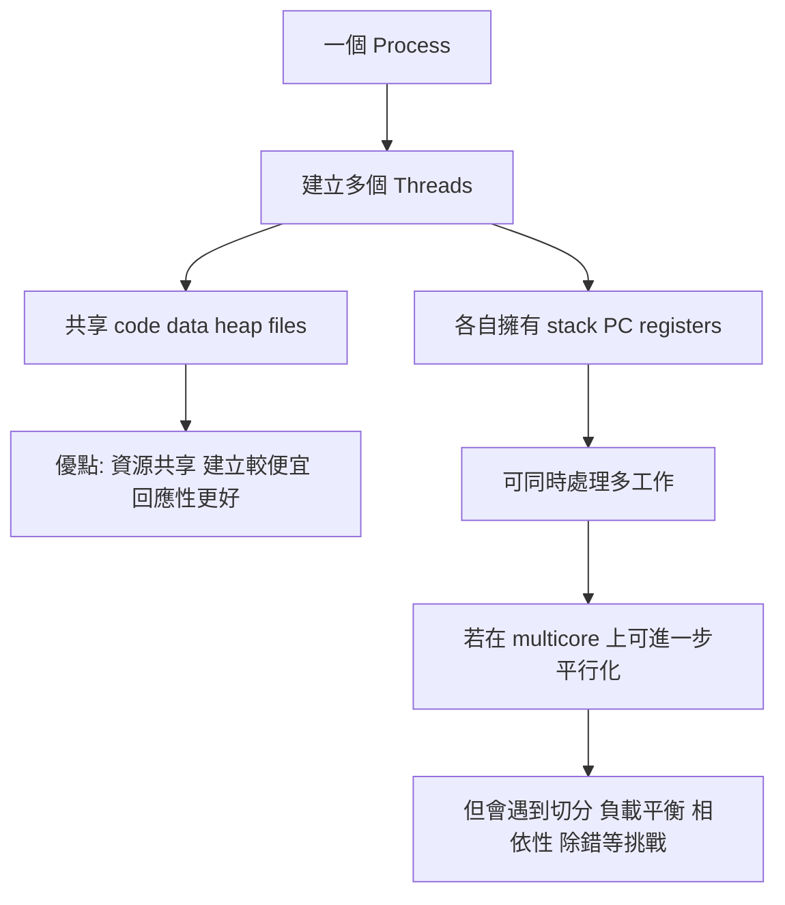

## 4 多執行緒 - 概論


### 講解
已啟用教學模式

#### 這幾張圖在回答什麼問題

這一組其實是在回答一個很重要的主題：

**為什麼我們需要 multithreading(多執行緒)？它有什麼好處？跟 process(行程)差在哪？放到 multicore(多核心) 上又會遇到什麼問題？**

你可以把這幾張圖看成第 4 章的一條主線：

```mermaid
flowchart TB
A[什麼是 Thread(執行緒)] --> B[為什麼要用多執行緒]
B --> C["多執行緒的好處"]
C --> D["Process 與 Thread 的差別"]
D --> E["放到多核心後的挑戰"]
E --> F["延伸到 Concurrency 與 Parallelism"]
```

---

#### 先講直覺：Thread(執行緒) 到底是什麼

最直覺的想法是：

* **Process(行程)**：像一間工作室
* **Thread(執行緒)**：像工作室裡的一位工作人員

同一間工作室裡可以有很多人一起工作。
他們共用同一個空間、工具、檔案，但每個人有自己的工作進度。

你這張「4.1 概論」投影片就是在講這件事：

* **Thread 是 CPU 使用的一個基本單位**
* 一個 thread 會有自己的：

  * thread ID
  * program counter(程式計數器)
  * register set(暫存器集合)
  * stack(堆疊)

而同一個 process 裡的多個 thread，會共享大部分 process 的資源。這和常見的 multithreading 定義一致：同一個 process 內的 threads 共享 address space(位址空間)、open files(開啟檔案) 等資源，但每個 thread 仍保有自己的 PC、registers、stack。([Oracle 文件][1])

---

#### 核心概念 1：單執行緒 vs 多執行緒

你圖中的左邊是 **single-threaded process(單執行緒行程)**，右邊是 **multithreaded process(多執行緒行程)**。

##### 單執行緒

整個程式只有一條執行路線。
就像只有一個人做事：

* 要讀資料
* 要計算
* 要輸出
* 要等 I/O

全部都同一個人做。

##### 多執行緒

同一個 process 裡有多條執行路線。
像同一個團隊中有多個人分工：

* 一個負責 UI(使用者介面)
* 一個負責網路下載
* 一個負責背景計算

這也是 Oracle 的 multithreading 說法：傳統 process 常只有一個 control flow(控制流)，而 multithreading 會把 process 分成多個彼此獨立前進的 execution threads(執行緒)。([Oracle 文件][2])

---

#### 4.1.1 動機：為什麼很多程式都做成多執行緒

這張「動機」圖在講的是：

**現代桌面應用程式，本來就很常同時做很多事，所以自然適合用 multithreading。**

投影片舉的例子都很好：

##### 例子 1：瀏覽器

* 一個 thread 顯示畫面
* 一個 thread 從網路抓資料

這樣畫面才不會卡死。
不然若只有單執行緒，抓資料一慢，整個畫面可能都凍住。

##### 例子 2：文書處理器

* 一個 thread 負責畫面更新
* 一個 thread 負責讀鍵盤輸入
* 一個 thread 在背景拼字檢查

這就是「同一個應用程式裡，有很多可以同時進行的工作」。

##### 例子 3：伺服器

你的圖下面還畫了一個伺服器例子：

1. client(客戶端)送 request(請求)
2. server(伺服器)產生新的 thread 來服務
3. server 本體繼續接其他 request

這就是典型的 **thread-per-request(每個請求一個執行緒)** 想法。
也就是說，不要讓主流程被單一客戶拖住。

---

#### 4.1.2 利益：多執行緒的四個主要好處

這張圖很重要，常常會考整理題。

---

#### 1. Responsiveness(回應性)

這是最容易懂的一個。

意思是：

即使程式某一部分被 block(阻塞) 住，其他部分還能繼續動，所以使用者會覺得系統比較「有反應」。

##### 生活化例子

你用瀏覽器下載大檔案時，頁面還是能滑、按鈕還是能按。
這就是 responsiveness。

Oracle 的 multithreading 文件也把 improving application responsiveness(提升應用回應性) 列為 multithreading 的重要好處之一。([Oracle 文件][3])

---

#### 2. Resource Sharing(資源分享)

這張圖寫得很關鍵：

**threads 屬於同一個 process，所以天然就比較容易共享記憶體與資源。**

同一個 process 內的 threads 共享：

* code
* data
* heap
* files / open files

但每個 thread 自己有：

* stack
* program counter
* registers

這也正是你那張英文圖在表達的重點，並且和官方文件一致。([Oracle 文件][1])

##### 直覺理解

同一間辦公室裡的員工，共用：

* 檔案櫃
* 影印機
* 文件
* 辦公室空間

但每個人有自己的：

* 桌面
* 手邊工作狀態
* 當前做事進度

---

#### 3. Economy(經濟性)

這個字很多人第一次看會覺得抽象，其實意思很簡單：

**建立 thread 的成本通常比建立 process 低，切換 thread 的成本通常也比較低。**

因為 thread 不需要像 process 那樣重建一整套獨立資源空間。
官方資料也明確提到 thread 有利於 using fewer system resources(使用較少系統資源)，以及 thread-based 架構能降低 resource consumption(資源消耗) 並讓 context switch(情境切換) 開銷較低。([Oracle 文件][4])

##### 直覺理解

* 開一家新公司 = 建立一個新 process
* 在原公司多請一個員工 = 建立一個 thread

通常後者便宜得多。

---

#### 4. Scalability(可擴展性)

意思是：

在 multiprocessor / multicore 系統上，多個 threads 可以分散到不同 CPU cores(核心) 上跑，所以比較容易把硬體能力吃滿。Oracle 文件也把 using multiprocessors efficiently(有效利用多處理器) 視為 multithreading 的重要利益。([Oracle 文件][3])

##### 直覺理解

如果你只有一條工作線，再多核心也很難同時忙起來。
但如果你有很多 threads，就比較有機會把工作分給多個核心一起做。

---

#### 4.1.2.5 Process 和 Thread 的差別

你那張英文圖超重要，因為它直接畫出最核心差異。

---

#### 先看 Process creation(建立行程)

左邊圖是：

* Process A 經過 `fork()`
* 變成 Process A 與 Process B

投影片要傳達的是：

**新的 process 會有自己獨立的一套資源空間。**

所以 Process A 和 Process B 不共享整份執行內容空間。
至少在概念上，你應該先把它記成：

* 各自有自己的 code / data / heap / stack 空間映像
* 資源彼此獨立
* 修改自己的資料，不會直接變成對方的資料

這正符合一般作業系統對 process 的理解：不同 processes 彼此隔離，擁有各自獨立的 memory space。([GeeksforGeeks][5])

---

#### 再看 Thread creation(建立執行緒)

右邊圖是：

* Thread A 呼叫 `pthread_create()`
* 產生 Thread B

這時候 **Thread B 不會複製整個 process 資源**，它只需要建立自己那份執行狀態，尤其是自己的 **stack**。而 code、data、BSS、heap、files 這些仍和同 process 的其他 threads 共享。([Oracle 文件][1])

---

#### 這張圖最該背的表

| 項目             | Process | Thread             |
| -------------- | ------- | ------------------ |
| 所屬             | 獨立執行單位  | process 內的一條執行路線   |
| 位址空間           | 通常彼此獨立  | 同 process 內共享      |
| code/data/heap | 不共享     | 共享                 |
| stack          | 各自有自己的  | 每個 thread 自己一份     |
| 建立成本           | 較高      | 較低                 |
| 切換成本           | 較高      | 較低                 |
| 溝通             | 常需 IPC  | 同 process 內可直接共享資料 |

---

#### 你一定要特別注意的一點

很多初學者會誤會：

> 「thread 就是比較小的 process」

這句話只能拿來幫助入門，**不能當正式定義**。

更精確地說：

* process 是 **resource container(資源容器)**
* thread 是 **execution unit(執行單位)**

也就是：

* process 比較像「裝資源的殼」
* thread 比較像「真正跑指令的人」

---

#### 4.1.3 多核心程式的挑戰：不是多執行緒就一定變快

這張圖非常重要，因為它是在打破一個常見迷思：

> 「我把程式切成多 thread，就一定自動加速」
> 這是 ❌

真正情況是：
多核心程式要變快，前提是你能把問題正確拆開，還要處理很多麻煩的同步與資料問題。

投影片列出五大挑戰：

---

#### 1. Dividing activities(切割活動)

問題是：

**哪些工作可以拆開，同時做？**

不是所有程式都能平行化。
有些事情天生要先做 A 才能做 B，就很難拆。

##### 生活化例子

做報告時：

* 查資料
* 做投影片
* 排版
* 練報告

有些能平行，但有些得等前一步完成。

---

#### 2. Balance(平衡)

即使你拆成很多工作，也要分得平均。
不然會變成：

* 核心 1 很忙
* 核心 2 很閒
* 核心 3 沒事做

這樣整體效率還是差。

##### 直覺

四個人搬貨，如果三個人只搬一箱，另一個人搬十箱，那不是有效平行。

---

#### 3. Data splitting(資料分割)

不只工作要切，**資料也要切**。

尤其在 data parallelism(資料平行) 裡，常見做法是把同一批資料切成多塊，交給不同核心做相同操作。這正是 data parallelism 的典型定義。([Oracle 文件][3])

##### 例子

你要處理一千萬筆資料：

* 核心 1 算前 250 萬筆
* 核心 2 算中間 250 萬筆
* 核心 3 算後面 250 萬筆
* 核心 4 算最後 250 萬筆

---

#### 4. Data dependency(資料相依)

這是最關鍵也最容易出錯的點。

如果任務 A 需要任務 B 的結果，或多個 threads 同時讀寫同一份資料，就會有 dependency(相依性) 問題。
因為 threads 共享資料，一個 thread 改了 shared data(共享資料)，其他 threads 可能立刻看見，所以常常需要 mutex(互斥鎖) 等同步機制來保護資料一致性。([Oracle 文件][1])

##### 生活化例子

兩個人同時改同一份 Excel：

* 一個改總價
* 一個改數量

如果沒有協調，結果就可能亂掉。

---

#### 5. Testing and debugging(測試與除錯)

這也是老師很愛考的觀念。

多執行緒 / 多核心程式常常比單執行緒難 debug，因為每次執行的 interleaving(交錯順序) 可能不同。某些 bug 可能今天出現、明天消失，這正是 concurrency 程式麻煩的地方。Oracle 的 multithreaded programming guide 也專門有 synchronization 與 compiling/debugging 章節，反映這類程式在除錯上的額外困難。([Oracle 文件][2])

##### 典型問題

* race condition(競爭條件)
* deadlock(死結)
* starvation(飢餓)
* ordering bug(順序錯誤)

---

#### Concurrency(並行性) 和 Parallelism(平行性) 不一樣

你最後那張英文圖有提到這組很常考的觀念。

##### Parallelism(平行)

**同一時間真的有多個工作一起執行。**

通常需要多核心硬體支援。
例如核心 1 與核心 2 同時各跑一個 thread。

##### Concurrency(並行性)

**不一定同一瞬間一起跑，但多個工作都有在推進(progress)。**

在單核心也能做到。
因為 scheduler(排程器) 可以快速切換，讓多個工作輪流前進。

##### 最好懂的記法

* **Parallelism**：真的同時做
* **Concurrency**：看起來一起做，或至少都在往前推進

---

#### Data parallelism 與 Task parallelism

這張英文圖也提到兩種平行方式：

##### Data parallelism(資料平行)

* 對**同一種操作**
* 套在**不同資料塊**

例子：
把一張大圖切四塊，四個核心一起做模糊處理。

##### Task parallelism(任務平行)

* 不同 threads 做**不同種類的工作**

例子：

* 一個 thread 負責接收資料
* 一個 thread 負責運算
* 一個 thread 負責寫檔

---

#### 這幾張圖的整體因果關係



---

#### 最容易考 / 最容易混淆

這裡我直接幫你抓高頻考點。

##### 1. Thread 不是完整的小 process

比較正確的說法是：

* process 是資源容器
* thread 是執行單位

##### 2. 同 process 的 threads 共享很多東西，但不是全部都共享

**共享：**

* code
* data
* heap
* files

**各自獨立：**

* stack
* program counter
* registers

##### 3. Responsiveness 跟 Scalability 不一樣

* **Responsiveness**：對使用者比較不卡
* **Scalability**：多核心時比較能放大效能

##### 4. Concurrency 不等於 Parallelism

* concurrency：多工作都在前進
* parallelism：真的同時跑

##### 5. 多核心程式最大難點常常不是「開 thread」，而是「正確同步」

真正難的是：

* 資料相依
* race condition
* 除錯困難

---

#### 小結

你這組投影片其實是在建立一個很完整的多執行緒觀念：

1. **Thread 是什麼**
   是 process 裡的基本執行單位，每個 thread 有自己的 stack / PC / registers，共享 process 的多數資源。([Oracle 文件][1])

2. **為什麼要用 multithreading**
   因為現代應用程式常同時處理 UI、I/O、背景工作，multithreading 能改善 responsiveness 並更有效利用多處理器。([Oracle 文件][3])

3. **它的好處是什麼**
   Responsiveness、Resource Sharing、Economy、Scalability。([Oracle 文件][3])

4. **它和 process 差在哪**
   Process 通常彼此隔離；threads 在同一 process 內共享大部分資源，只各自保有自己的執行狀態。([GeeksforGeeks][5])

5. **到了 multicore 為什麼反而更難**
   因為你得處理切分、平衡、資料相依、同步、測試與除錯。([Oracle 文件][2])

如果你要，我下一則可以直接幫你整理成一份
**「4.1 考前背誦版」**，把每一頁濃縮成最容易考的問答題格式。

[1]: https://docs.oracle.com/cd/E19120-01/open.solaris/816-5137/mtintro-95600/index.html "https://docs.oracle.com/cd/E19120-01/open.solaris/816-5137/mtintro-95600/index.html"
[2]: https://docs.oracle.com/cd/E37838_01/html/E61057/mtintro-75924.html "https://docs.oracle.com/cd/E37838_01/html/E61057/mtintro-75924.html"
[3]: https://docs.oracle.com/cd/E19683-01/806-6867/ "https://docs.oracle.com/cd/E19683-01/806-6867/"
[4]: https://docs.oracle.com/cd/E19455-01/806-5257/index.html "https://docs.oracle.com/cd/E19455-01/806-5257/index.html"
[5]: https://www.geeksforgeeks.org/thread-in-operating-system/ "https://www.geeksforgeeks.org/thread-in-operating-system/"

### 多執行緒的意思是多個core執行一個process嗎

不完全是。

多執行緒(multithreading) 的正確意思是：

同一個 process(行程) 裡面，有多個 thread(執行緒) 同時存在並推進工作。

它不一定代表一定有多個 core(核心)。
有多個 core 時，這些 threads 可以 分配到不同 core 上真的同時跑；
但如果只有一個 core，作業系統也可以靠快速切換，讓多個 threads 都在前進。這叫 concurrency(並行性)，不一定是 parallelism(平行性)。

也就是說原本以 process 為單位排程 ，變成分割以 thread 為單位排程。


### 為何 thread 獨立的只有 stack ，沒有 heap

這題在回答什麼問題

你問的是：

為什麼 thread(執行緒) 自己獨立的是 stack(堆疊)，而不是 heap(堆積)？

這其實是在問：

哪些資料天生屬於「這一條執行路線自己」？哪些資料比較適合屬於「整個 process 共享」？

結論先講：

stack 要獨立，因為每個 thread 都有自己的函式呼叫流程、區域變數、回傳位址、參數，這些東西如果共用，馬上就亂掉。
heap 通常共享，因為 heap 存的是同一個 process 想共同使用的動態資料；thread 的目的本來就是在同一個位址空間內合作工作，所以共享 heap 才有意義。

你可以把一個 process 想成一間辦公室。

heap：像辦公室的公共倉庫
stack：像每個員工自己的桌面草稿區

為什麼桌面要分開？

因為每個人正在做的事不一樣：

呼叫到哪個函式
目前參數是什麼
區域變數值是多少
做完要回到哪裡

這些都屬於「我這個人現在做到哪一步」。
如果大家共用同一張桌子，A 把紙攤開，B 又蓋上去，流程立刻毀掉。

但倉庫不一樣。
倉庫本來就是讓大家一起拿材料、一起放成品的地方，所以 heap 共享 反而合理。


