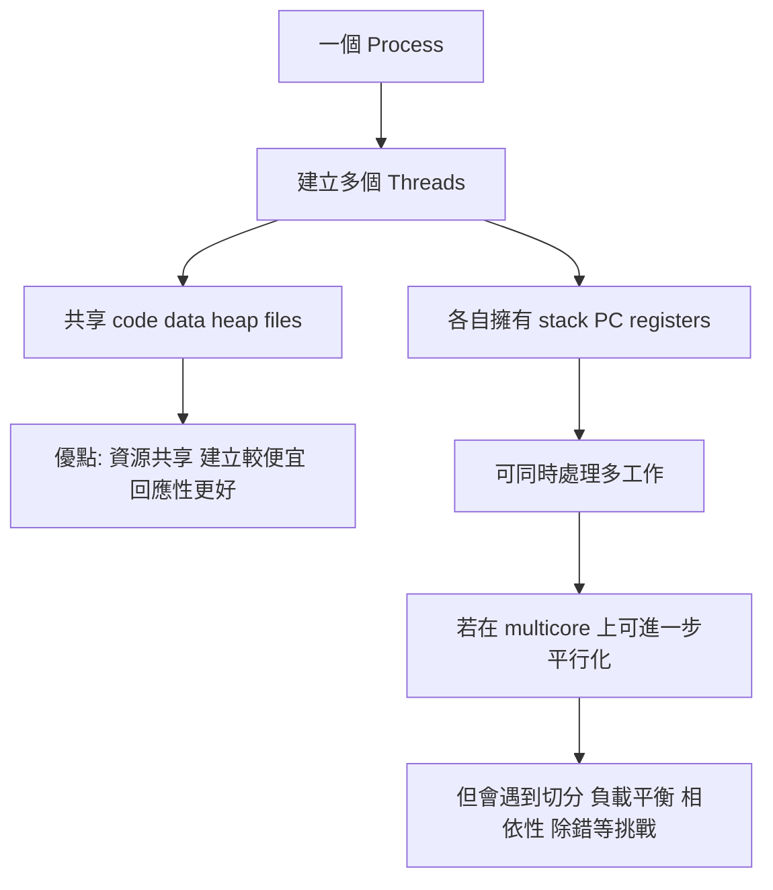
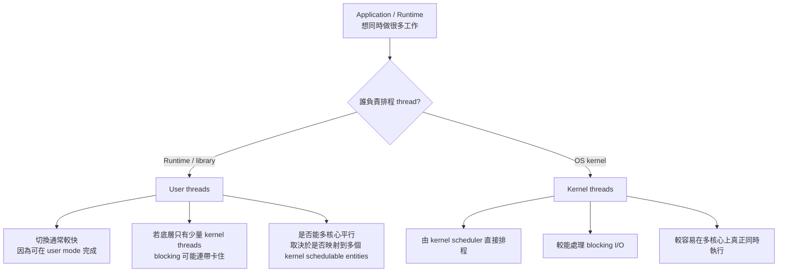
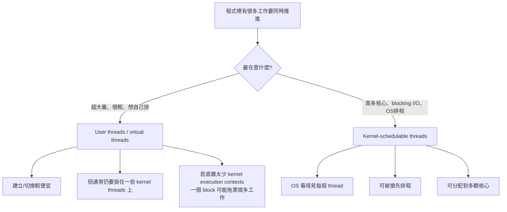
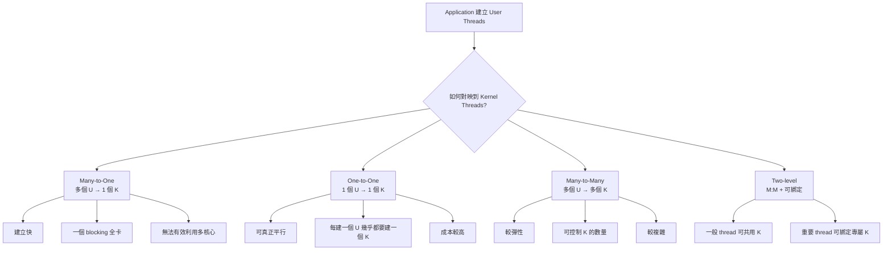
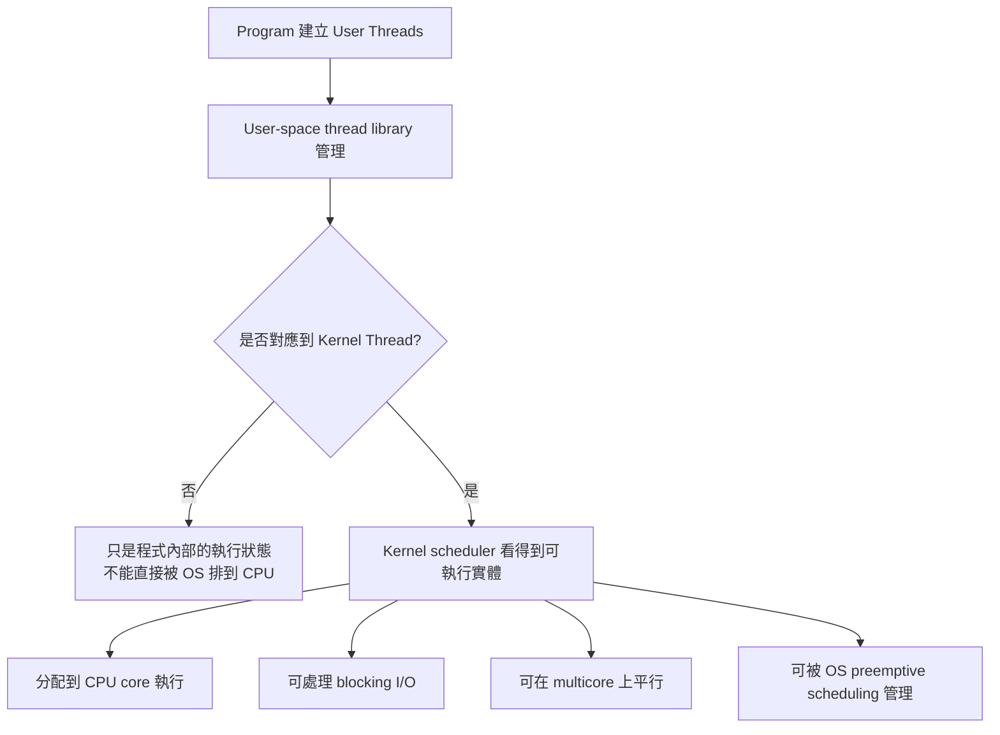
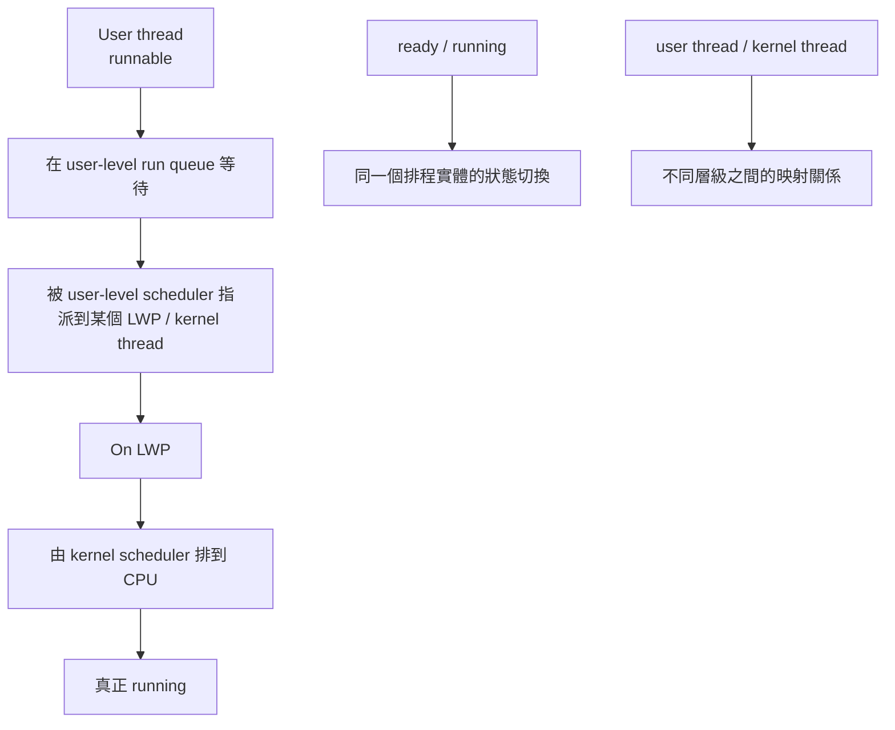
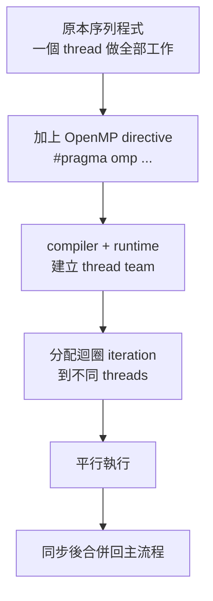
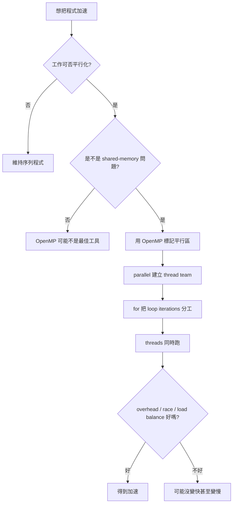
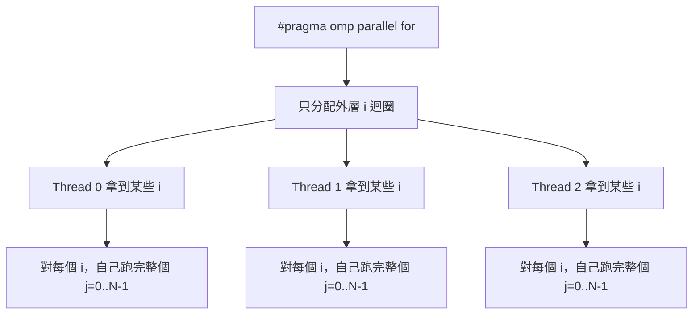

## 4 多執行緒 - 概論


### 講解
已啟用教學模式

#### 這幾張圖在回答什麼問題

這一組其實是在回答一個很重要的主題：

**為什麼我們需要 multithreading(多執行緒)？它有什麼好處？跟 process(行程)差在哪？放到 multicore(多核心) 上又會遇到什麼問題？**

你可以把這幾張圖看成第 4 章的一條主線：

```mermaid
flowchart TB
A[什麼是 Thread(執行緒)] --> B[為什麼要用多執行緒]
B --> C["多執行緒的好處"]
C --> D["Process 與 Thread 的差別"]
D --> E["放到多核心後的挑戰"]
E --> F["延伸到 Concurrency 與 Parallelism"]
```

---

#### 先講直覺：Thread(執行緒) 到底是什麼

最直覺的想法是：

* **Process(行程)**：像一間工作室
* **Thread(執行緒)**：像工作室裡的一位工作人員

同一間工作室裡可以有很多人一起工作。
他們共用同一個空間、工具、檔案，但每個人有自己的工作進度。

你這張「4.1 概論」投影片就是在講這件事：

* **Thread 是 CPU 使用的一個基本單位**
* 一個 thread 會有自己的：

  * thread ID
  * program counter(程式計數器)
  * register set(暫存器集合)
  * stack(堆疊)

而同一個 process 裡的多個 thread，會共享大部分 process 的資源。這和常見的 multithreading 定義一致：同一個 process 內的 threads 共享 address space(位址空間)、open files(開啟檔案) 等資源，但每個 thread 仍保有自己的 PC、registers、stack。([Oracle 文件][1])

---

#### 核心概念 1：單執行緒 vs 多執行緒

你圖中的左邊是 **single-threaded process(單執行緒行程)**，右邊是 **multithreaded process(多執行緒行程)**。

##### 單執行緒

整個程式只有一條執行路線。
就像只有一個人做事：

* 要讀資料
* 要計算
* 要輸出
* 要等 I/O

全部都同一個人做。

##### 多執行緒

同一個 process 裡有多條執行路線。
像同一個團隊中有多個人分工：

* 一個負責 UI(使用者介面)
* 一個負責網路下載
* 一個負責背景計算

這也是 Oracle 的 multithreading 說法：傳統 process 常只有一個 control flow(控制流)，而 multithreading 會把 process 分成多個彼此獨立前進的 execution threads(執行緒)。([Oracle 文件][2])

---

#### 4.1.1 動機：為什麼很多程式都做成多執行緒

這張「動機」圖在講的是：

**現代桌面應用程式，本來就很常同時做很多事，所以自然適合用 multithreading。**

投影片舉的例子都很好：

##### 例子 1：瀏覽器

* 一個 thread 顯示畫面
* 一個 thread 從網路抓資料

這樣畫面才不會卡死。
不然若只有單執行緒，抓資料一慢，整個畫面可能都凍住。

##### 例子 2：文書處理器

* 一個 thread 負責畫面更新
* 一個 thread 負責讀鍵盤輸入
* 一個 thread 在背景拼字檢查

這就是「同一個應用程式裡，有很多可以同時進行的工作」。

##### 例子 3：伺服器

你的圖下面還畫了一個伺服器例子：

1. client(客戶端)送 request(請求)
2. server(伺服器)產生新的 thread 來服務
3. server 本體繼續接其他 request

這就是典型的 **thread-per-request(每個請求一個執行緒)** 想法。
也就是說，不要讓主流程被單一客戶拖住。

---

#### 4.1.2 利益：多執行緒的四個主要好處

這張圖很重要，常常會考整理題。

---

#### 1. Responsiveness(回應性)

這是最容易懂的一個。

意思是：

即使程式某一部分被 block(阻塞) 住，其他部分還能繼續動，所以使用者會覺得系統比較「有反應」。

##### 生活化例子

你用瀏覽器下載大檔案時，頁面還是能滑、按鈕還是能按。
這就是 responsiveness。

Oracle 的 multithreading 文件也把 improving application responsiveness(提升應用回應性) 列為 multithreading 的重要好處之一。([Oracle 文件][3])

---

#### 2. Resource Sharing(資源分享)

這張圖寫得很關鍵：

**threads 屬於同一個 process，所以天然就比較容易共享記憶體與資源。**

同一個 process 內的 threads 共享：

* code
* data
* heap
* files / open files

但每個 thread 自己有：

* stack
* program counter
* registers

這也正是你那張英文圖在表達的重點，並且和官方文件一致。([Oracle 文件][1])

##### 直覺理解

同一間辦公室裡的員工，共用：

* 檔案櫃
* 影印機
* 文件
* 辦公室空間

但每個人有自己的：

* 桌面
* 手邊工作狀態
* 當前做事進度

---

#### 3. Economy(經濟性)

這個字很多人第一次看會覺得抽象，其實意思很簡單：

**建立 thread 的成本通常比建立 process 低，切換 thread 的成本通常也比較低。**

因為 thread 不需要像 process 那樣重建一整套獨立資源空間。
官方資料也明確提到 thread 有利於 using fewer system resources(使用較少系統資源)，以及 thread-based 架構能降低 resource consumption(資源消耗) 並讓 context switch(情境切換) 開銷較低。([Oracle 文件][4])

##### 直覺理解

* 開一家新公司 = 建立一個新 process
* 在原公司多請一個員工 = 建立一個 thread

通常後者便宜得多。

---

#### 4. Scalability(可擴展性)

意思是：

在 multiprocessor / multicore 系統上，多個 threads 可以分散到不同 CPU cores(核心) 上跑，所以比較容易把硬體能力吃滿。Oracle 文件也把 using multiprocessors efficiently(有效利用多處理器) 視為 multithreading 的重要利益。([Oracle 文件][3])

##### 直覺理解

如果你只有一條工作線，再多核心也很難同時忙起來。
但如果你有很多 threads，就比較有機會把工作分給多個核心一起做。

---

#### 4.1.2.5 Process 和 Thread 的差別

你那張英文圖超重要，因為它直接畫出最核心差異。

---

#### 先看 Process creation(建立行程)

左邊圖是：

* Process A 經過 `fork()`
* 變成 Process A 與 Process B

投影片要傳達的是：

**新的 process 會有自己獨立的一套資源空間。**

所以 Process A 和 Process B 不共享整份執行內容空間。
至少在概念上，你應該先把它記成：

* 各自有自己的 code / data / heap / stack 空間映像
* 資源彼此獨立
* 修改自己的資料，不會直接變成對方的資料

這正符合一般作業系統對 process 的理解：不同 processes 彼此隔離，擁有各自獨立的 memory space。([GeeksforGeeks][5])

---

#### 再看 Thread creation(建立執行緒)

右邊圖是：

* Thread A 呼叫 `pthread_create()`
* 產生 Thread B

這時候 **Thread B 不會複製整個 process 資源**，它只需要建立自己那份執行狀態，尤其是自己的 **stack**。而 code、data、BSS、heap、files 這些仍和同 process 的其他 threads 共享。([Oracle 文件][1])

---

#### 這張圖最該背的表

| 項目             | Process | Thread             |
| -------------- | ------- | ------------------ |
| 所屬             | 獨立執行單位  | process 內的一條執行路線   |
| 位址空間           | 通常彼此獨立  | 同 process 內共享      |
| code/data/heap | 不共享     | 共享                 |
| stack          | 各自有自己的  | 每個 thread 自己一份     |
| 建立成本           | 較高      | 較低                 |
| 切換成本           | 較高      | 較低                 |
| 溝通             | 常需 IPC  | 同 process 內可直接共享資料 |

---

#### 你一定要特別注意的一點

很多初學者會誤會：

> 「thread 就是比較小的 process」

這句話只能拿來幫助入門，**不能當正式定義**。

更精確地說：

* process 是 **resource container(資源容器)**
* thread 是 **execution unit(執行單位)**

也就是：

* process 比較像「裝資源的殼」
* thread 比較像「真正跑指令的人」

---

#### 4.1.3 多核心程式的挑戰：不是多執行緒就一定變快

這張圖非常重要，因為它是在打破一個常見迷思：

> 「我把程式切成多 thread，就一定自動加速」
> 這是 ❌

真正情況是：
多核心程式要變快，前提是你能把問題正確拆開，還要處理很多麻煩的同步與資料問題。

投影片列出五大挑戰：

---

#### 1. Dividing activities(切割活動)

問題是：

**哪些工作可以拆開，同時做？**

不是所有程式都能平行化。
有些事情天生要先做 A 才能做 B，就很難拆。

##### 生活化例子

做報告時：

* 查資料
* 做投影片
* 排版
* 練報告

有些能平行，但有些得等前一步完成。

---

#### 2. Balance(平衡)

即使你拆成很多工作，也要分得平均。
不然會變成：

* 核心 1 很忙
* 核心 2 很閒
* 核心 3 沒事做

這樣整體效率還是差。

##### 直覺

四個人搬貨，如果三個人只搬一箱，另一個人搬十箱，那不是有效平行。

---

#### 3. Data splitting(資料分割)

不只工作要切，**資料也要切**。

尤其在 data parallelism(資料平行) 裡，常見做法是把同一批資料切成多塊，交給不同核心做相同操作。這正是 data parallelism 的典型定義。([Oracle 文件][3])

##### 例子

你要處理一千萬筆資料：

* 核心 1 算前 250 萬筆
* 核心 2 算中間 250 萬筆
* 核心 3 算後面 250 萬筆
* 核心 4 算最後 250 萬筆

---

#### 4. Data dependency(資料相依)

這是最關鍵也最容易出錯的點。

如果任務 A 需要任務 B 的結果，或多個 threads 同時讀寫同一份資料，就會有 dependency(相依性) 問題。
因為 threads 共享資料，一個 thread 改了 shared data(共享資料)，其他 threads 可能立刻看見，所以常常需要 mutex(互斥鎖) 等同步機制來保護資料一致性。([Oracle 文件][1])

##### 生活化例子

兩個人同時改同一份 Excel：

* 一個改總價
* 一個改數量

如果沒有協調，結果就可能亂掉。

---

#### 5. Testing and debugging(測試與除錯)

這也是老師很愛考的觀念。

多執行緒 / 多核心程式常常比單執行緒難 debug，因為每次執行的 interleaving(交錯順序) 可能不同。某些 bug 可能今天出現、明天消失，這正是 concurrency 程式麻煩的地方。Oracle 的 multithreaded programming guide 也專門有 synchronization 與 compiling/debugging 章節，反映這類程式在除錯上的額外困難。([Oracle 文件][2])

##### 典型問題

* race condition(競爭條件)
* deadlock(死結)
* starvation(飢餓)
* ordering bug(順序錯誤)

---

#### Concurrency(並行性) 和 Parallelism(平行性) 不一樣

你最後那張英文圖有提到這組很常考的觀念。

##### Parallelism(平行)

**同一時間真的有多個工作一起執行。**

通常需要多核心硬體支援。
例如核心 1 與核心 2 同時各跑一個 thread。

##### Concurrency(並行性)

**不一定同一瞬間一起跑，但多個工作都有在推進(progress)。**

在單核心也能做到。
因為 scheduler(排程器) 可以快速切換，讓多個工作輪流前進。

##### 最好懂的記法

* **Parallelism**：真的同時做
* **Concurrency**：看起來一起做，或至少都在往前推進

---

#### Data parallelism 與 Task parallelism

這張英文圖也提到兩種平行方式：

##### Data parallelism(資料平行)

* 對**同一種操作**
* 套在**不同資料塊**

例子：
把一張大圖切四塊，四個核心一起做模糊處理。

##### Task parallelism(任務平行)

* 不同 threads 做**不同種類的工作**

例子：

* 一個 thread 負責接收資料
* 一個 thread 負責運算
* 一個 thread 負責寫檔

---

#### 這幾張圖的整體因果關係



---

#### 最容易考 / 最容易混淆

這裡我直接幫你抓高頻考點。

##### 1. Thread 不是完整的小 process

比較正確的說法是：

* process 是資源容器
* thread 是執行單位

##### 2. 同 process 的 threads 共享很多東西，但不是全部都共享

**共享：**

* code
* data
* heap
* files

**各自獨立：**

* stack
* program counter
* registers

##### 3. Responsiveness 跟 Scalability 不一樣

* **Responsiveness**：對使用者比較不卡
* **Scalability**：多核心時比較能放大效能

##### 4. Concurrency 不等於 Parallelism

* concurrency：多工作都在前進
* parallelism：真的同時跑

##### 5. 多核心程式最大難點常常不是「開 thread」，而是「正確同步」

真正難的是：

* 資料相依
* race condition
* 除錯困難

---

#### 小結

你這組投影片其實是在建立一個很完整的多執行緒觀念：

1. **Thread 是什麼**
   是 process 裡的基本執行單位，每個 thread 有自己的 stack / PC / registers，共享 process 的多數資源。([Oracle 文件][1])

2. **為什麼要用 multithreading**
   因為現代應用程式常同時處理 UI、I/O、背景工作，multithreading 能改善 responsiveness 並更有效利用多處理器。([Oracle 文件][3])

3. **它的好處是什麼**
   Responsiveness、Resource Sharing、Economy、Scalability。([Oracle 文件][3])

4. **它和 process 差在哪**
   Process 通常彼此隔離；threads 在同一 process 內共享大部分資源，只各自保有自己的執行狀態。([GeeksforGeeks][5])

5. **到了 multicore 為什麼反而更難**
   因為你得處理切分、平衡、資料相依、同步、測試與除錯。([Oracle 文件][2])

如果你要，我下一則可以直接幫你整理成一份
**「4.1 考前背誦版」**，把每一頁濃縮成最容易考的問答題格式。

[1]: https://docs.oracle.com/cd/E19120-01/open.solaris/816-5137/mtintro-95600/index.html "https://docs.oracle.com/cd/E19120-01/open.solaris/816-5137/mtintro-95600/index.html"
[2]: https://docs.oracle.com/cd/E37838_01/html/E61057/mtintro-75924.html "https://docs.oracle.com/cd/E37838_01/html/E61057/mtintro-75924.html"
[3]: https://docs.oracle.com/cd/E19683-01/806-6867/ "https://docs.oracle.com/cd/E19683-01/806-6867/"
[4]: https://docs.oracle.com/cd/E19455-01/806-5257/index.html "https://docs.oracle.com/cd/E19455-01/806-5257/index.html"
[5]: https://www.geeksforgeeks.org/thread-in-operating-system/ "https://www.geeksforgeeks.org/thread-in-operating-system/"

### 多執行緒的意思是多個core執行一個process嗎

不完全是。

多執行緒(multithreading) 的正確意思是：

同一個 process(行程) 裡面，有多個 thread(執行緒) 同時存在並推進工作。

它不一定代表一定有多個 core(核心)。
有多個 core 時，這些 threads 可以 分配到不同 core 上真的同時跑；
但如果只有一個 core，作業系統也可以靠快速切換，讓多個 threads 都在前進。這叫 concurrency(並行性)，不一定是 parallelism(平行性)。

也就是說原本以 process 為單位排程 ，變成分割以 thread 為單位排程。


### 為何 thread 獨立的只有 stack ，沒有 heap

這題在回答什麼問題

你問的是：

為什麼 thread(執行緒) 自己獨立的是 stack(堆疊)，而不是 heap(堆積)？

這其實是在問：

哪些資料天生屬於「這一條執行路線自己」？哪些資料比較適合屬於「整個 process 共享」？

結論先講：

stack 要獨立，因為每個 thread 都有自己的函式呼叫流程、區域變數、回傳位址、參數，這些東西如果共用，馬上就亂掉。
heap 通常共享，因為 heap 存的是同一個 process 想共同使用的動態資料；thread 的目的本來就是在同一個位址空間內合作工作，所以共享 heap 才有意義。

你可以把一個 process 想成一間辦公室。

heap：像辦公室的公共倉庫
stack：像每個員工自己的桌面草稿區

為什麼桌面要分開？

因為每個人正在做的事不一樣：

呼叫到哪個函式
目前參數是什麼
區域變數值是多少
做完要回到哪裡

這些都屬於「我這個人現在做到哪一步」。
如果大家共用同一張桌子，A 把紙攤開，B 又蓋上去，流程立刻毀掉。

但倉庫不一樣。
倉庫本來就是讓大家一起拿材料、一起放成品的地方，所以 heap 共享 反而合理。


## Amdahl’s Law、Gustafson's Law


### 講解


已啟用教學模式

#### 這段在回答什麼問題

這幾張圖其實在回答一個很核心的問題：

**「Thread(執行緒) 到底是誰在管理？是 application/runtime(應用程式／執行期函式庫) 自己管，還是 OS kernel(作業系統核心) 在管？」**

這個問題很重要，因為它直接影響三件事：

1. 建立與切換 thread 快不快
2. 遇到 blocking I/O(阻塞式輸入輸出) 時會不會整串卡住
3. 能不能有效利用 multicore(多核心) 平行執行。([man7.org][1])

---

#### 我先幫你修正一個最容易被投影片誤導的地方

你這組投影片把 **POSIX Pthreads、Win32 threads、Java threads** 放在 **User threads(使用者層執行緒)** 那一側，這個講法在今天的實作上**不夠精確**，甚至在考試以外的真實系統裡會讓你觀念歪掉。✅

原因是：

* 在現代 Linux，`pthreads` 的常見實作是 **1:1**，也就是每個 pthread 都對應到一個 **kernel scheduling entity(核心可排程實體)**。([man7.org][1])
* 在 Windows，普通的 thread 是系統直接排程的；真正比較接近 user-level scheduling(使用者層排程) 的反而是 **Fibers** 或 **UMS(User-Mode Scheduling)**。([Microsoft Learn][2])
* 在現代 Java，`Thread` 有兩種：**platform threads(平台執行緒)** 通常是 1:1 對應 kernel threads；**virtual threads(虛擬執行緒)** 才是比較接近 user-mode threads(使用者模式執行緒) 由 Java runtime 排程。([Oracle Docs][3])

所以如果你是為了考試背課本，我們可以照課本分類；但如果你是要真的理解 OS，**不要把 API 名字直接等同於 user thread 或 kernel thread**。要看的是：**誰排程、誰知道這個 thread 的存在、它跟 kernel schedulable entity 的 mapping(對映) 是什麼。** ([man7.org][1])

---

#### 核心概念

最核心的切法不是「這個 thread 叫什麼名字」，而是：

* **User threads(使用者層執行緒)**：主要由 user-space runtime/library(使用者空間的執行期／函式庫) 管理
* **Kernel threads(核心層執行緒)**：核心知道它們，並由 kernel scheduler(核心排程器) 直接排程。([Microsoft Learn][4])

你可以把它想成：

* **User threads**：像是班上小組自己排發言順序，老師不一定知道組內誰先講
* **Kernel threads**：像是老師直接點每個學生上台，誰先講由老師決定

這個差別，會一路影響效能與行為。

---

#### 關係 / 流程 / 因果



這張圖要表達的重點是：

**「快不快」不是唯一問題，真正關鍵是它跟 kernel 之間的關係。**

---

#### User threads(使用者層執行緒) 是什麼

直覺上，User threads 就是：

> **thread 的建立、切換、管理，主要在 user space 完成，不必每次都叫 kernel 介入。**

Windows 官方文件對 **UMS(User-Mode Scheduling)** 的描述很直接：application 可以在 **user mode** 內切換 threads，而不必每次都交給 system scheduler；這也是它比一般 thread pool 更輕量的原因之一。Windows 的 **fibers** 也明講了：fiber 不是由系統搶先式排程，而是由應用程式自己切換；系統真正排程的仍然是底下的 thread。([Microsoft Learn][4])

Java 的 **virtual threads** 也屬於這種思維。Oracle 文件寫得很清楚：virtual threads 通常是 **user-mode threads**，由 Java runtime 排程，而不是 OS；而且很多 virtual threads 可以映射到少量 platform threads 上。([Oracle Docs][3])

---

#### 為什麼 User threads 會比較輕

因為切換 thread 時，如果不用每次都進 kernel，就少了 kernel involvement(核心介入) 的成本。

Windows 對 UMS 的說法就是：在 user mode 切換能讓它更有效率，特別是大量、短時間、少 system call 的工作。Java 也指出 virtual threads 需要的資源通常比較少，一個 JVM 甚至可支援非常多個 virtual threads。([Microsoft Learn][4])

生活化一點講：

* **Kernel threads** 像你每次換人做事，都要去學校教務處登記
* **User threads** 像你們小組內自己換人，教務處根本不用知道

所以 user-level switch 會比較輕。

---

#### 但 User threads 的代價是什麼

代價在於：**kernel 可能看不到你 user-level 的細節。**

Solaris 文件對這點講得很經典：OS 只決定哪個 **LWP(Lightweight Process)** 在哪顆 processor 上跑、什麼時候跑；它**不知道**每個 process 裡有多少 user threads，也不知道它們各自的狀態。當某個 user thread 因同步而 block 時，LWP 會轉去另一個 runnable thread，但這取決於整個執行模型怎麼設計。([Oracle Docs][5])

這造成兩個常見問題：

1. **Blocking 問題**
   如果很多 user threads 只掛在少數底層 schedulable entities 上，那其中一個發生阻塞，影響可能會擴散。Windows fibers 也明白表示：系統排程的是 thread，不是 fiber。([Microsoft Learn][6])

2. **多核心平行度問題**
   純 user threads 並不保證你真的能同時吃到多顆核心；你要看它底下有沒有對應到足夠多的 kernel-schedulable entities。Solaris 的 M:N 架構、Java virtual threads 的 carrier threads 都是在解這件事。([Oracle Docs][5])

---

#### Kernel threads(核心層執行緒) 是什麼

Kernel threads 的直覺版定義是：

> **這個 thread 是 kernel 知道的，kernel scheduler 可以直接決定它何時執行、在哪顆 CPU 上執行。**

Windows 官方直接寫：thread 是 process 內可以被排程執行的實體；system scheduler 會決定哪個 thread 得到下一個 processor time slice(處理器時間片)。([Microsoft Learn][2])

Linux 的 `pthreads(7)` 也指出，現代 Linux 的 NPTL 與舊 LinuxThreads 都是 **1:1 implementation**，每個 thread 都對應到 kernel scheduling entity。([man7.org][1])

所以在現代 Linux/Windows 這種一般用途 OS 上，你平常寫的很多「thread」，其實背後都是 **kernel-schedulable threads**。

---

#### 為什麼 Kernel threads 比較「重」

這裡的「重」是**相對於純 user-level 管理**，不是說它跟 process 一樣重。

因為 kernel threads 牽涉到：

* kernel scheduler 的參與
* thread context(執行脈絡) 的保存與恢復
* OS 維護的 stack / priority / TLS / kernel data structures。([Microsoft Learn][2])

Java 官方文件就直接說，platform threads 通常有比較大的 stack 與其他由 OS 維護的資源，因此它們是有限資源。這正是為什麼 virtual threads 能大量擴張，但 platform threads 不適合無限制暴增。([Oracle Docs][3])

---

#### 三種最常考的 mapping(對映) 模型

這裡是考試很愛出的點，我幫你重組成最清楚的版本。

##### 1. Many-to-One(多對一)

很多 user threads 對到 **一個** kernel thread。

* 優點：user-level 管理很便宜
* 缺點：一旦底層那個 kernel thread block，整串可能受影響；也很難真正利用多核心。
  這類問題正是 user-level threading 的經典弱點。([Microsoft Learn][6])

##### 2. One-to-One(一對一)

每個 user-visible thread 對到一個 kernel thread。

* 優點：容易被 kernel 直接排程，可利用多核心
* 缺點：建立很多 thread 時，OS 成本較高
  現代 Linux 的 pthreads 就是典型 1:1。([man7.org][1])

##### 3. Many-to-Many(多對多)

很多 user threads 映射到較少或適量的 kernel schedulable entities。

* 優點：想兼顧 user-level 的輕量與 kernel-level 的平行度
* 代表概念：Solaris 的 user threads 對 LWPs、Java virtual threads 對 carrier threads。([Oracle Docs][5])

工程社群也常把這種 user-managed 的概念叫做 **green threads(綠色執行緒)**；例如討論中常用「很多 green threads 映射到少數 OS threads」來建立直覺。這是有用的直覺，但不同語言 runtime 的細節並不完全相同。([Stack Overflow][7])

---

#### 生活化例子

假設你開一家餐廳。

* **Kernel threads**：每位服務生都直接由店長排班，店長知道每個人現在在做什麼
* **User threads**：你只跟店長說「我這組有 3 個人會輪流做事」，至於誰現在端菜、誰現在收桌，是你們組內自己決定

如果只有一個服務生代表整組對外工作，那他一去廚房等菜，整組的對外進度就可能卡住。
如果你有多個被店長正式排班的服務生，就比較能在不同桌之間真正平行處理。

這就是 user threads 與 kernel threads 在 blocking 與 multicore 上差異的直覺來源。([Microsoft Learn][6])

---

#### 最容易考 / 最容易混淆

##### 1. Kernel thread 不是「永遠在 kernel mode 跑的 thread」

這是超常見誤解。
這裡的 kernel thread / kernel-supported thread，重點是 **kernel 知道它、會排程它**，不是說它整天都在 kernel mode 做 privileged work(特權工作)。Windows 對 thread 的定義就是「可被系統排程的實體」。([Microsoft Learn][2])

##### 2. `pthread` 不等於「user thread」

在現代 Linux，`pthreads` 常見實作是 1:1，所以它其實對應 kernel scheduling entity。
所以如果考試寫「pthread 是 user thread library」可能是照教材脈絡拿分；但在實作理解上，這句話要加很多條件。([man7.org][1])

##### 3. `Java thread` 也不能一概而論

* **platform thread**：通常 1:1 對應 kernel thread
* **virtual thread**：通常是 user-mode thread，由 Java runtime 排程。([Oracle Docs][3])

##### 4. User threads 不一定真的比較好

✅ 建立很多 concurrent tasks(並行任務) 時，它們常常更省
❌ 但它們不是「跑得比較快的 thread」本體

Oracle 對 virtual threads 甚至明講：它們**不是 faster threads**，它們主要帶來的是 **scale(可擴張性／吞吐量)**，不是單一工作 latency(延遲) 變短。([Oracle Docs][8])

##### 5. 投影片說 kernel threads「heavyweight」時，要知道它是相對說法

它是相對於純 user-level 切換較重，不是說它重到像 process。
這種題目如果你只背「user thread 快、kernel thread 慢」，很容易失分，因為老師下一題就會考你 **為什麼**。真正原因是：**kernel 參與程度、排程權限、blocking 行為、多核心利用方式** 不同。([Microsoft Learn][4])

---

#### 小結

你把這題濃縮成下面這段，考試會很好用：

> **User threads(使用者層執行緒)** 主要由 user-space runtime/library 管理，切換成本通常較低，但 kernel 不一定知道每個 user thread，因此在 blocking 與 multicore 利用上可能受限。
> **Kernel threads(核心層執行緒)** 是 kernel 可直接排程的執行實體，較容易支援 blocking I/O 與多核心平行，但建立與管理成本通常高於純 user-level 管理。
> 真正實作上還要看 mapping model(對映模型)：Many-to-One、One-to-One、Many-to-Many。([man7.org][1])

如果你要，我下一則可以直接幫你整理成：

**「考試背誦版 10 行」** 或 **「選擇題 / 申論題常見陷阱版」**。

[1]: https://man7.org/linux/man-pages/man7/pthreads.7.html "pthreads(7) - Linux manual page"
[2]: https://learn.microsoft.com/en-us/windows/win32/procthread/about-processes-and-threads?utm_source=chatgpt.com "About Processes and Threads - Win32 apps"
[3]: https://docs.oracle.com/en/java/javase/23/docs/api/java.base/java/lang/Thread.html "Thread (Java SE 23 & JDK 23)"
[4]: https://learn.microsoft.com/en-us/windows/win32/procthread/user-mode-scheduling "User-Mode Scheduling - Win32 apps | Microsoft Learn"
[5]: https://docs.oracle.com/cd/E19455-01/806-5257/guide-60747/index.html "Lightweight Processes (Multithreaded Programming Guide) "
[6]: https://learn.microsoft.com/en-us/windows/win32/procthread/fibers "Fibers - Win32 apps | Microsoft Learn"
[7]: https://stackoverflow.com/questions/15983872/difference-between-user-level-and-kernel-supported-threads "multithreading - Difference between user-level and kernel-supported threads? - Stack Overflow"
[8]: https://docs.oracle.com/en/java/javase/21/core/virtual-threads.html "Virtual Threads"


進度：
https://drive.google.com/file/d/1mBsJSbB-x89Bcnq0AE4FsK7zo2-Y8xfz/view
p.16


### 為何需要user threads、kernel threads，什麼情況會需要kernel threads，為何不全部都用user threads


已啟用教學模式

#### 這題在回答什麼問題

你在問的其實是這個：

**既然 User threads(使用者層執行緒) 比較輕，為什麼作業系統還需要 Kernel threads(核心可排程執行緒)？為什麼不全部都用 User threads？**

最核心的一句話是：

> **因為我們同時想要兩種東西：低開銷的「很多工作單位」，以及能被 OS 正確看見、阻塞、搶先、分配到多核心上的「真正執行單位」。單靠其中一種，很多情況都做不好。** 你的課堂投影片也是沿著這個取捨在講：User threads 較輕，Kernel threads 較重，但能更好支援 multicore(多核心)、blocking I/O(阻塞式 I/O)、以及 preemptive multitasking(可搶先多工)。 ([Microsoft Learn][1])

---

#### 先講直覺

把它想成一家公司：

* **User threads** 像是部門內自己排班的小任務
* **Kernel threads** 像是公司人資系統正式登記、可以被全公司排班的員工

如果你全部都只用部門內的小任務：

* 部門自己切換很快
* 但公司高層看不到每個小任務
* 一個小任務卡住時，整個部門可能一起受影響
* 公司也不容易把它們分散到不同 CPU cores(核心) 真正同時跑

所以我們才需要兩層概念，而不是只保留一層。這也是 Windows 對 fibers(纖程) 的描述：fiber 要由應用程式自己手動排程，系統真正排程的還是 thread。([Microsoft Learn][2])

---

#### 關係 / 流程 / 因果



這張圖最重要的意思是：

**User threads 常常是「管理策略」，Kernel threads 常常是「真正被 OS 排程的執行實體」。** ([Microsoft Learn][1])

---

#### 核心概念

你的課堂投影片把 User threads 說成由 user-level library(使用者層函式庫) 管理、Kernel threads 由 kernel(核心) 管理，這個大方向是對的。投影片也明講 Many-to-One(多對一) 會有「一個 blocking，全部跟著卡」以及「無法善用 multiple cores(多核心)」的問題。

而在現代系統裡，Linux 的 `pthreads` 常見實作是 **1:1**，也就是每個 thread 對應一個 kernel scheduling entity(核心排程實體)；Windows 也把 thread 定義成 process 內可被系統排程的實體。換句話說，今天很多你平常寫的「一般 thread」，本質上已經是 **kernel-schedulable**。([man7.org][3])

---

#### 為何需要 User threads(使用者層執行緒)

User threads 存在的理由，不是因為它「比較正統」，而是因為它能把很多很輕的小工作，用比較低的成本管理起來。課堂投影片說它們通常較輕、建立和管理較快；Java 官方對 virtual threads(虛擬執行緒) 也說得很直接：它們通常是 user-mode threads(使用者模式執行緒)，由 Java runtime 排程，資源需求低，一個 JVM 甚至可支援非常多個 virtual threads。 ([Oracle Docs][4])

最適合 User threads 的情況，通常是這種：

* 有**非常多個** concurrent tasks(並行任務)
* 每個任務都很輕
* 很多時間其實在等待，不是在狂吃 CPU
* 你希望 runtime(執行期) 自己安排切換策略

Java 官方甚至直接說，virtual threads 適合大多時間在等待 I/O 的任務，**不是**拿來跑長時間 CPU-intensive(高 CPU 密集) 工作的。([Oracle Docs][4])

---

#### 為何需要 Kernel threads(核心可排程執行緒)

這裡先糾正一個很容易混淆的點：

**對一般應用程式來說，需要 Kernel threads，不是因為應用程式 thread 本身要拿到 kernel privilege(核心權限)。**
真正的原因通常是：

1. **OS 要看得見它，才能排程它**
   Windows 官方定義 thread 就是 process 內可被排程執行的實體。([Microsoft Learn][1])

2. **要能真正利用 multicore(多核心)**
   Windows 官方寫得很清楚：在 multiprocessor computer(多處理器電腦) 上，系統可以同時執行與 processors 數量相同的 threads。Linux 的 NPTL 也明說 `pthread` 是 1:1 對應 kernel scheduling entity。([Microsoft Learn][1])

3. **遇到 blocking system call / blocking I/O 時，不能整串停住**
   如果 thread 做 `read()`、`recv()`、`open()` 這些可能阻塞的事，kernel 必須知道是哪個執行單位在等，才能讓別的可跑單位繼續。POSIX 也把許多 I/O 與等待函式列為 cancelation points(取消點)，反映這些操作本來就可能把 thread 卡住。([man7.org][3])

---

#### 什麼情況會需要 Kernel threads

如果你問的是「一般應用程式什麼時候需要 kernel-schedulable threads」，答案通常是下面三類。

第一類是 **CPU-bound parallelism(CPU 密集平行運算)**。
像矩陣乘法、影像處理、數值模擬這種想把工作真的分到不同核心同時跑，OS 必須能把不同執行單位放到不同 CPU 上。你的投影片也把 scalability(可擴展性) 直接跟多處理器上的多執行緒利益連在一起。 ([Microsoft Learn][1])

第二類是 **blocking I/O 很多的程式**。
如果你的 thread 會做檔案讀寫、網路收送、等待 socket、等待子程序，讓 OS 看得到每個 thread 會比較安全，因為一個 thread block 了，其他 kernel-schedulable threads 還能繼續被排程。這也是社群上常拿來解釋「為何純 user-level threads 會出事」的第一個原因。 ([Stack Overflow][5])

第三類是 **需要吃到 OS 排程功能**。
像 priority(優先權)、CPU affinity(CPU 親和性)、preemption(搶先)、system-wide competition(系統範圍競爭) 這些，都比較依賴 OS 直接管理那個執行單位。你的排班章節也把 System-contention scope(系統競爭範圍) 和 kernel-level scheduling 連在一起。

---

#### 為何不能全部都用 User threads

這題真正的考點就在這裡。

##### 1. 因為 OS 看不到每個 User thread

如果很多 User threads 只掛在一個 kernel-scheduled task 上，對 OS 來說，那整坨就像一個執行單位。結果就是：

* OS 不能對每個 user thread 個別排程
* OS 也不能把它們自然地分散到多顆核心
* OS 的 accounting(資源計算)、priority、debugging、signal handling 都比較難精準對到每個工作單位

這正是 User threads 天生的盲點。([Microsoft Learn][1])

##### 2. 因為一個 blocking call 可能拖累整批

你的課堂投影片已經很直白地寫出 Many-to-One 的問題：**One thread blocking causes all to block**。社群上的經驗說法也幾乎一樣：若所有 user threads 都跑在同一個 kernel-scheduled task 上，當其中一個做出 blocking system call 時，其他 user threads 也沒辦法被執行。 ([Stack Overflow][5])

##### 3. 因為很難真正吃滿多核心

Many-to-One 模型最典型的限制，就是明明你程式裡有很多 user threads，但底層只有一個真正被 OS 排程的東西，所以不可能在多核心上「真的同時」跑很多個。投影片也直接說 Few systems currently use this model, because it cannot take advantage of multiple processing cores。

##### 4. 因為「輕」不代表「永遠較好」

Microsoft 對 fibers 的說法很值得背：fiber 必須由應用程式手動排程，而且 **in general, fibers do not provide advantages over a well-designed multithreaded application**。也就是說，user-level scheduling 並不是免費午餐；你省下 kernel 介入，卻把很多複雜度搬回應用程式自己扛。([Microsoft Learn][2])

---

#### 那為什麼也不能全部都用 Kernel threads

你雖然沒有直接問這句，但這是這題最好的補強。

如果我們反過來「全部都用 kernel threads」，也不完美。
因為 platform threads(平台執行緒) 往往有較大的 stack 與 OS 維護的資源，數量本身就是有限資源。Java 官方就直接說 platform threads 通常 mapped 1:1 to kernel threads，而且是 limited resource(有限資源)；virtual threads 則可以很多、甚至到 millions(數百萬)。([Oracle Docs][4])

所以現代實務常見的做法不是二選一，而是：

> **底層用 kernel-schedulable threads 保證 OS 排程、blocking、multicore；上層再加 user-mode scheduling 或 virtual threads，去管理大量細小工作。**

Java virtual threads 就是這個思路的現代版本：virtual thread 由 runtime 排，底下仍然靠少量 platform threads(carrier threads) 真正被 OS 排程。([Oracle Docs][4])

---

#### 還有一種「真正的 Kernel thread」：OS 自己用的

如果你問的是更狹義的 **kernel-internal threads(核心內部執行緒)**，那它們通常是 OS 或 driver(驅動程式) 自己拿來做背景工作的。Linux kernel 的 workqueue 文件就寫得很明白：當 kernel 需要 asynchronous execution context(非同步執行脈絡) 時，會把 work item 放到 queue，然後由獨立的 worker thread 去執行。([Linux Kernel Documentation][6])

這種 thread 和一般應用程式 thread 不同；它們不是為了讓你寫 app 更方便，而是為了讓 kernel 本身也能把工作拆開、延後、背景化、避免死結或長時間卡在某個 context。([Linux Kernel Documentation][6])

---

#### 最容易考 / 最容易混淆

第一個混淆是：

> **Kernel threads 不是因為它「有系統權限」才需要。** ❌

更精確地說，對一般應用程式而言，Kernel threads 的價值主要在於 **kernel 可見、可排程、可阻塞、可分派到多核心**，不是因為每個應用程式 thread 自己拿到了核心特權。([Microsoft Learn][1])

第二個混淆是：

> **User threads 也不是老舊、沒用。** ❌

它們在需要超大量、輕量、等待型工作時仍然很有價值；只是它們通常不該「單獨統治整個系統」，而是跟 kernel-schedulable threads 搭配。Java virtual threads 就是非常典型的例子。([Oracle Docs][4])

第三個混淆是：

> **今天你在 Linux 寫 `pthread`，不代表你正在用「純 user threads」。**

Linux 的現代 `pthreads` 是 1:1 implementation，這是 man7 直接寫的。也就是說，今天很多課本上叫你背的分類，跟真實系統 API 名稱不能直接畫等號。([man7.org][3])

---

#### 小結

你把這題記成下面這段，最穩：

> **User threads(使用者層執行緒)** 的價值在於輕量、切換快、適合管理大量細小或等待型任務；
> **Kernel threads(核心可排程執行緒)** 的價值在於 OS 看得見它們，能正確處理 blocking I/O、preemption(搶先)、以及 multicore parallelism(多核心平行)。
> 不能全部都用 User threads，因為一旦 OS 看不到每個 thread，就容易出現「一個 block 全部卡住」和「無法真正吃滿多核心」的問題；
> 也不能只靠大量 Kernel threads，因為它們的 stack 與 OS 資源成本較高。
> 所以現代系統常採 **混合策略**：底層靠 kernel-schedulable threads，上層再疊 user-mode scheduling。 ([Microsoft Learn][1])

---

#### 考試背誦版

**為何需要兩種 thread？**
因為 User threads 提供低開銷與高數量的工作管理，而 Kernel threads 提供 OS 可見的排程、blocking I/O 處理與多核心平行能力。 ([Microsoft Learn][1])

**什麼情況需要 Kernel threads？**
當我們需要真正利用多核心、需要 OS 個別排程 thread、或 thread 可能進行 blocking system calls / blocking I/O 時。([Microsoft Learn][1])

**為何不能全部都用 User threads？**
因為 OS 看不到每個 user thread，可能造成一個 blocking call 讓整批停住，而且難以真正平行跑在多核心上。 ([Stack Overflow][5])

下一則我可以直接幫你整理成「User threads / Kernel threads / Many-to-One / One-to-One / Many-to-Many」一張總表。

[1]: https://learn.microsoft.com/da-dk/windows/win32/procthread/about-processes-and-threads "About Processes and Threads - Win32 apps | Microsoft Learn"
[2]: https://learn.microsoft.com/en-us/windows/win32/procthread/fibers "Fibers - Win32 apps | Microsoft Learn"
[3]: https://man7.org/linux/man-pages/man7/pthreads.7.html "pthreads(7) - Linux manual page"
[4]: https://docs.oracle.com/en/java/javase/24/docs/api/java.base/java/lang/Thread.html "Thread (Java SE 24 & JDK 24)"
[5]: https://stackoverflow.com/questions/34348095/why-cans-a-thread-make-a-blocking-system-call-user-level-threads "Why can's a thread make a blocking system call (user level threads)? - Stack Overflow"
[6]: https://docs.kernel.org/core-api/workqueue.html "Workqueue — The Linux Kernel  documentation"


## 多執行緒模式


### 講解

已啟用教學模式

#### 這段在回答什麼問題

這四種模型在回答的是同一件事：

**「使用者看到的 thread，最後到底怎麼對應到核心(kernel)能排程的 thread？」**

你可以把它想成：

* User thread(使用者執行緒) = 應用程式自己想切出來的工作單位
* Kernel thread(核心執行緒) = 作業系統真正能拿去排班到 CPU 上跑的單位

投影片的重點就是：**User thread 和 Kernel thread 的對映(mapping)方式不同，會直接影響平行度(parallelism)、blocking behavior(阻塞行為)、建立成本與實作複雜度**。你的課本明確列出四種：Many-to-One、One-to-One、Many-to-Many、Two-level model。

---

#### 先講直覺

把 User thread 想成「公司裡分出去的工作」，Kernel thread 想成「真正能開上高速公路的貨車」。

* 你有很多工作，但只有 **1 台貨車**：這就是 **Many-to-One**
* 每個工作都配 **1 台貨車**：這就是 **One-to-One**
* 很多工作共用 **幾台貨車**：這就是 **Many-to-Many**
* 平常很多工作共用幾台貨車，但**某些重要工作可以直接綁定專屬貨車**：這就是 **Two-level model**

所以你一看到這四種模型，腦中先不要背定義，先問：

**「到底有幾個 user threads？幾個 kernel threads？有沒有綁定？」**

---

#### 核心概念

先記一個最重要的判斷表：

| 模型           | 對映方式                                        | 優點                  | 缺點                        |
| ------------ | ------------------------------------------- | ------------------- | ------------------------- |
| Many-to-One  | 多個 user threads → 1 個 kernel thread         | 建立快、管理輕             | 一個 blocking 全卡住，不能真正多核心平行 |
| One-to-One   | 1 個 user thread → 1 個 kernel thread         | 可真正平行、blocking 影響較小 | 建立與切換成本較高，thread 數量受限制    |
| Many-to-Many | 多個 user threads → 多個 kernel threads         | 兼顧彈性與平行性            | 實作複雜                      |
| Two-level    | 類似 M:M，但允許某些 user thread 綁定某個 kernel thread | 比 M:M 更彈性           | 更複雜                       |

這些點在你的投影片中都有直接寫到：Many-to-One 會讓一個 thread blocking 導致全部卡住，且無法善用 multicore；One-to-One 是每個 user thread 對一個 kernel thread，支援 multiprocessors，但 thread 數受 kernel thread 成本限制；Many-to-Many 是 many user threads 對到較少或相等數量的 kernel threads；Two-level model 則是在 M:M 上額外允許綁定(bind)某個 user thread 到 kernel thread。

---

#### 關係 / 流程 / 因果



更正式一點講，因果是這樣：

1. **Kernel 才是最後真正排到 CPU 的那層**
2. 所以如果很多 user threads 最後只對到 **1 個 kernel thread**

   * 那 OS 其實只看到 **1 個可排程實體**
   * 因此無法在多核心上真正同時跑多個 thread
3. 如果每個 user thread 都有自己的 kernel thread

   * OS 可以直接把它們分散到不同 CPU
   * 但你付出的代價是 kernel thread 建立與管理成本
4. 如果改成 many-to-many

   * 就是在「效能」和「成本」中間折衷
5. Two-level model 再往前一步

   * 讓你在折衷架構裡，對少數重要 thread 保留專屬通道

這個理解也和 Oracle 舊版 Solaris/JDK 文件一致：Many-to-One 只能讓一個 schedulable entity(可排程實體)被 OS 看見，因此 concurrency 有限且無法有效利用 multiprocessor；One-to-One 則讓每個 user thread 都被 kernel 知道；Many-to-Many 由 user-level library 在 kernel threads 之上做排程。([Oracle Docs][1])

---

#### 四種模型逐一重講

#### 1. Many-to-One model(多對一模式)

**直覺：** 很多工作共用一台貨車。

投影片寫得很直接：

* many user-level threads 對到 single kernel-level thread
* one thread blocking causes all to block
* multicore 上不能真正 parallel
* 現在很少系統使用，因為不能利用 multiple processing cores
* 例子：Solaris Green Threads、GNU Portable Threads。

##### 為什麼會這樣

因為作業系統只看到 **1 個 kernel thread**。
所以即使你程式裡面開了 100 個 user threads，對 OS 來說仍然像只有 1 條真正可排程的執行路線。

##### 生活化例子

你在餐廳有 5 個服務生，但店裡只有 **1 台送餐機器人**能進廚房拿餐。
只要那台機器人卡住，5 個服務生全部都得等。

##### 最容易混淆

很多人會以為「很多 thread = 一定比較快」。
❌ 不一定。
如果它們最後只映射到 **1 個 kernel thread**，那只是**邏輯上很多條工作線**，不是**實體上真的平行**。

Oracle 對 Many-to-One 的說明也同樣指出：所有 thread activity 都侷限於 user space，且同一時間只有一個 thread 能接觸 kernel，因此 multiprocessors 無法被有效利用。([Oracle Docs][1])

---

#### 2. One-to-One model(一對一模式)

**直覺：** 每個工作都給一台貨車。

投影片的定義是：

* each user thread map to a kernel thread
* 建 user thread 也要建 kernel thread
* supporting multiprocessors
* 但 thread 數量會被 kernel thread 建立成本限制
* 例子：Windows NT/XP/2000、Linux、Solaris 9 之後。

##### 為什麼它常見

因為它很好理解，也比較符合現代多核心系統的需求。
每個 user thread 都有對應 kernel thread，OS 可以直接排程到不同 CPU 核心。

##### 生活化例子

你有 4 個外送訂單，就派 4 台機車。
這樣 4 個外送員可以同時跑不同路線。

##### 代價是什麼

每多一個 thread，就多一份 kernel 端管理成本。
這些成本包括建立、排程、context switch(內容切換)、stack 與 kernel bookkeeping(管理資料)。

##### 最容易考

老師很愛考：
**「為什麼 One-to-One 支援 multiprocessor，但數量受限？」**

答案就是：
因為每個 user thread 都對應一個 kernel thread，所以可被 OS 分散到多核心；但也因為每個 thread 都是 kernel 要管的實體，所以成本較高。

另外，Linux 現代執行緒實作通常以 POSIX threads 映射到 kernel schedulable entities，實務上屬於 One-to-One 類型；社群討論也普遍認為現代通用系統幾乎都不再採 Many-to-One。([Stack Overflow][2])

---

#### 3. Many-to-Many model(多對多模式)

**直覺：** 很多工作，共用幾台貨車。

投影片給的定義是：

* many user-level threads 對到 smaller or equal number of kernel threads
* kernel thread 數量可依 application 或 machine 決定
* 例子：Solaris prior to version 9、Windows NT/2000 搭配 ThreadFiber package。

##### 這模型想解決什麼

它想同時避開前兩者的缺點：

* 不想像 Many-to-One 一樣，全部卡在一條 kernel thread 上
* 也不想像 One-to-One 一樣，每開一條 user thread 都付一條 kernel thread 的成本

所以它的想法是：

* 應用程式可以開很多 user threads
* 但底層只維持一部分 kernel threads
* user-level library 再把 runnable user threads 排到這些 kernel threads 上

##### 生活化例子

你有 100 張訂單，但店裡不需要 100 台機車。
你可能只需要 8 台機車輪流送，就能讓整體效率很高。

##### 為什麼比較難

因為現在不只 OS 在排程，**user-level thread library 也在排程**。
也就是說你有兩層排程邏輯，實作和除錯都比較複雜。

Oracle 舊 Solaris 文件也描述了這一點：Many-to-Many 由 user-level thread library 在 kernel threads 之上進行排程，kernel 只管理目前活躍的那些 threads。([Oracle Docs][1])

---

#### 4. Two-level Model(二層模式)

**直覺：** 平常很多工作共用幾台貨車，但 VIP 工作可綁一台專車。

投影片寫的是：

* Similar to M:M
* except that it allows a user thread to be bound to a kernel thread
* 例子：IRIX、HP-UX、Tru64 UNIX、Solaris 8 and earlier。

##### 這句話的關鍵是什麼

關鍵字是 **bound**。

也就是：
雖然平常大部分 user threads 還是走 many-to-many 的共享模式，
但某些特殊 thread 可以直接綁定某個 kernel thread。

##### 為什麼要綁

因為某些 thread 可能：

* 對 latency(延遲) 很敏感
* 需要比較穩定的 scheduling behavior(排程行為)
* 常做 blocking system calls
* 需要比較可預期的執行資源

##### 生活化例子

平常員工搭公司共用車，但總經理、急件司機有專車。

##### 你要怎麼跟 M:M 分辨

這是最容易混淆的地方：

* **M:M**：很多 U 對很多 K，但通常沒有「保證這條 U 永遠對這條 K」
* **Two-level**：本質很像 M:M，但**允許特定 U 綁定特定 K**

這也是投影片唯一特別加粗的差異點。

---

#### 為什麼會這樣設計

其實這四種模型就是在拉扯三件事：

1. **效能(Performance)**
2. **平行性(Parallelism)**
3. **管理成本(Overhead / Complexity)**

你可以這樣記：

* Many-to-One：**最省 kernel 成本，但平行性最差**
* One-to-One：**平行性最好，但 kernel 成本高**
* Many-to-Many：**折衷**
* Two-level：**更彈性的折衷**

Solaris 內部設計文件也提到，舊版 two-level/M:M 設計的初衷是支援非常大量的 threads，而不必每次 thread 管理都進 kernel；但後來維護 user-level scheduler 與正確處理 signal 等問題非常複雜。這也是為什麼很多現代系統最後偏向 One-to-One。([Flylib][3])

---

#### 最容易考 / 最容易混淆

#### 1. Concurrency(並行進展) 不等於 Parallelism(真正平行)

Many-to-One 可以有 concurrency，因為多個 user threads 可以輪流前進。
但它不容易有真正的 multicore parallelism，因為底層只有 1 個 kernel thread。

#### 2. Blocking 問題最常考

* Many-to-One：一個 blocking，全部可能卡住
* One-to-One：通常只影響那條 thread
* Many-to-Many / Two-level：通常不會整批一起卡，因為有多個 kernel threads 可用。

#### 3. Two-level 不是全新第四種邏輯

它其實是：
**Many-to-Many + binding capability(綁定能力)**。

#### 4. 現代實務上常見的是什麼

就一般教材與現代通用 OS 實務來看，**One-to-One 最常見**。
你的投影片也把 Linux、Solaris 9+ 放在 One-to-One 那頁。
從官方與社群資料看，Many-to-One 多半是歷史教學模型，現代主流系統很少採用。([Oracle Docs][1])

---

#### 小結

你只要記住一句話，這題就穩很多：

**這四種模型的本質差別，就是 User thread(使用者執行緒) 到 Kernel thread(核心執行緒) 的對映方式。**

再配上這個口訣：

* **Many-to-One**：省，但會卡，不能善用多核心
* **One-to-One**：直觀，可平行，但成本高
* **Many-to-Many**：共享底層 kernel threads，折衷
* **Two-level**：M:M 再加上「可綁定」

---

#### 你現在可以怎麼背

最建議你用這個順序背，而不是照投影片原文死背：

1. 先背「誰對誰」
2. 再背「blocking 會不會整批卡」
3. 再背「能不能用多核心」
4. 最後背「成本 / 複雜度」

這樣考試看到敘述題，你比較容易自己推回答案。

你這張圖對應的教材是 Chapter 4 多執行緒。

如果你要，我下一則可以直接幫你整理成：
**「考試速記版 1 頁表格 + 4 題常見選擇題陷阱」**。

[1]: https://docs.oracle.com/cd/E19455-01/806-3461/6jck06gqk/index.html?utm_source=chatgpt.com "Multithreading Models (JDK 1.1 for Solaris Developer's Guide)"
[2]: https://stackoverflow.com/questions/12967327/multithreading-linux-vs-windows-one-one-many-many-one-one?utm_source=chatgpt.com "Multithreading Linux vs Windows One-One Many-Many One-One - Stack Overflow"
[3]: https://flylib.com/books/en/2.830.1.14/5/?utm_source=chatgpt.com "Section 1.4. Processes, Threads, and Scheduling | Solaris Internals: Solaris 10 and OpenSolaris Kernel Architecture (2nd Edition)"


### 為什麼user threads要對應到kernel thread


已啟用教學模式

#### 這段在回答什麼問題

你問的是：

**為什麼我們已經有 user thread(使用者執行緒) 了，還需要對應到 kernel thread(核心執行緒)？**

最核心的一句話是：

**因為真正能被作業系統排程到 CPU 上執行的，不是 user thread，而是 kernel thread。**
user thread 如果完全沒有對到任何 kernel thread，它本身就只是你程式裡的一份「執行狀態資料」，還不是真正會跑的實體。([Stack Overflow][1])

---

#### 先講直覺

你可以把它想成：

* User thread = 你自己在公司內部排的工作單
* Kernel thread = 真正拿到工廠機台使用權的人

你在紙上排了 10 張工作單，不代表機器就會自己開始做。
**一定要有真正被工廠主管承認、能排上機台的人去執行。**

在作業系統裡，這個「工廠主管」就是 **scheduler(排程器)**。
而 scheduler 真正認得、真正會分配 CPU 的對象，是 **kernel thread**。([Stack Overflow][1])

所以答案不是「user thread 沒用」，而是：

**user thread 想要真的往前跑，最後一定要落到某個 kernel thread 上。**

---

#### 核心概念

先把兩者角色分清楚：

##### User thread(使用者執行緒)

* 由 user-space(使用者空間) 的 thread library / runtime 管理
* 建立通常比較快、比較輕量
* kernel 不一定直接知道它的存在([Stack Overflow][2])

##### Kernel thread(核心執行緒)

* 由 OS kernel(作業系統核心) 管理
* 是 scheduler 真正拿來分配 CPU 的對象
* 能處理 blocking I/O、preemption(搶先式排程)、多核心分派等事情([Stack Overflow][1])

所以不是說 user thread 不重要，而是：

**user thread 比較像「程式層的工作抽象」，kernel thread 才是「系統層的可執行實體」。**

---

#### 為什麼一定要有對應關係

#### 1. 因為 CPU 排程是 kernel 在做，不是 application 在做

CPU 不會直接問你的程式：

> 你今天想跑哪個 user thread？

CPU 是由 kernel 排程器控制的。
所以如果一個 user thread 沒有落到某個 kernel thread 上，kernel 根本不知道要把哪個執行流送去 CPU。([Stack Overflow][1])

這就像：

* 你在 Notion 寫了很多待辦事項
* 但公司門禁系統只認員工卡

那待辦事項本身不會進辦公室。
**一定要綁到某個拿員工卡的人，事情才真的開始做。**

---

#### 2. 因為 user thread 自己不能直接取得 CPU

這是最容易忽略的一點。

User thread 只是 user-space 裡的一種執行模型。
它可以描述：

* 目前程式跑到哪
* stack(堆疊)
* register state(暫存器狀態)
* 下一步要做什麼

但它**不是 kernel scheduler 眼中的原生排程單位**。
所以它不能自己說「我要去 CPU core 2 跑」。
這件事必須透過 kernel thread 才行。([Stack Overflow][1])

---

#### 3. 因為 blocking system call(阻塞式系統呼叫) 需要 kernel 介入

像是：

* read()
* open()
* network I/O
* sleep()
* wait()

這些都會進 kernel。

如果你的 thread 模型是很多 user threads 共用 1 個 kernel thread，那麼只要其中一個 user thread 進入 blocking system call，**那個 kernel thread 被卡住時，其他映射在它上面的 user threads 也沒辦法前進**。([Stack Overflow][2])

所以我們需要 mapping(對應)，而且 mapping 方式會直接影響：

* 一個 thread 卡住時，會不會拖累其他 thread
* 系統能不能有效處理 I/O
* 整體 responsiveness(回應性) 好不好

---

#### 4. 因為多核心 parallelism(平行執行) 要靠 kernel thread

假設你有 8 核心 CPU。

如果你的程式裡有 100 個 user threads，但最後都只對到 **1 個 kernel thread**，那對 OS 來說，你仍然只有 **1 個真正可排程的實體**。
結果就是：

* 邏輯上好像很多 thread
* 實際上卻沒辦法同時跑在多個核心上

這就是為什麼 purely user-level threading(純使用者層執行緒) 很難充分利用 multicore(多核心)。([Stack Overflow][2])

你可以把它想成：

* 你有 8 個廚房爐口
* 但只有 1 個廚師能被廚房主管派工

那再多菜單都沒用，因為真正能站上爐口的人只有 1 個。

---

#### 關係 / 流程 / 因果



---

#### 生活化例子

假設你在玩一個餐廳模擬遊戲。

你在遊戲介面中開了很多「工作槽」：

* 一個切菜
* 一個煮麵
* 一個送餐
* 一個結帳

這些工作槽就像 **user threads**。

但真正能去碰實體廚具與收銀機的，是後台系統認可的「員工帳號」，這些像 **kernel threads**。

所以：

* 你可以在前台畫很多工作流程
* 但如果後台只給你 1 個員工帳號
* 那所有事情還是得輪流做

這就是「為什麼 user thread 最後要對應到 kernel thread」。

---

#### 為什麼不乾脆全部只用 user thread 就好

因為只用 user thread 雖然有優點，但也有硬傷。

##### 優點

* 建立快
* 切換快
* user-space 管理彈性大([Stack Overflow][2])

##### 缺點

* kernel 看不到它們
* 遇到 blocking system call 很麻煩
* 很難善用多核心([Stack Overflow][2])

所以系統設計才會出現：

* Many-to-One
* One-to-One
* Many-to-Many

本質上就是在回答：

**user threads 到底要怎麼接到 kernel threads，才能兼顧成本與效能。**([Stack Overflow][3])

---

#### 最容易混淆

#### 1. 「對應」不一定代表一對一

這點很重要。

你問「為什麼要對應」，不代表一定是：

* 1 個 user thread 對 1 個 kernel thread

也可以是：

* 多個 user threads 對 1 個 kernel thread
* 多個 user threads 對多個 kernel threads

重點不是一定要 one-to-one，
而是 **最終一定要有某種 relationship(關係)，讓 user thread 能透過 kernel thread 被 CPU 執行。**([Stack Overflow][1])

#### 2. user thread 不是假的，但它不是 OS 原生排程單位

很多人會誤會成：

* user thread 不是真 thread

這樣講不夠精確。

更準確的說法是：

* 它在程式層面是真正有意義的執行流
* 但在 OS 排程層面，通常需要透過 kernel thread 才能真正被 CPU 執行([Stack Overflow][1])

#### 3. kernel thread 比較重，不代表一定比較差

它比較重，是因為 kernel 要管它。
但也正因為 kernel 有管，它才能支援：

* blocking I/O
* preemption
* multicore scheduling([Stack Overflow][2])

所以不是誰絕對比較好，而是取捨不同。

---

#### 小結

你可以直接背這一句：

**因為 user thread 本身只是使用者空間中的執行抽象，真正能被作業系統排程到 CPU 的是 kernel thread，所以 user thread 想要真正執行，就必須和 kernel thread 建立對應關係。** ([Stack Overflow][1])

再壓縮成考試版：

* CPU 排程看的是 kernel thread
* blocking / I/O 要靠 kernel
* multicore 平行也要靠 kernel
* 所以 user thread 最後一定得映射到 kernel thread 上([Stack Overflow][2])

---

#### 你現在可以這樣理解這句話

不是：

> user thread 很弱，所以要靠 kernel thread

而是：

> user thread 負責「程式內部的工作切分」；kernel thread 負責「讓這些工作真的被系統排上 CPU 去跑」。

這樣就會通了。

如果你要，我下一則可以直接幫你畫一張：

**Many-to-One / One-to-One / Many-to-Many 到底怎麼對應的超直覺圖解**

[1]: https://stackoverflow.com/questions/14791278/threads-why-must-all-user-threads-be-mapped-to-a-kernel-thread?utm_source=chatgpt.com "multithreading - Threads: Why must all user threads be mapped to a kernel thread? - Stack Overflow"
[2]: https://stackoverflow.com/questions/15983872/difference-between-user-level-and-kernel-supported-threads?utm_source=chatgpt.com "multithreading - Difference between user-level and kernel-supported threads? - Stack Overflow"
[3]: https://stackoverflow.com/questions/14792428/mapping-user-level-threads-and-kernel-level-threads?utm_source=chatgpt.com "multithreading - Mapping User-level threads and Kernel-level threads - Stack Overflow"


### 他們兩個的關係就類似process在ready queue和正在被執行嗎

已啟用教學模式

#### 先直接回答

**部分像，但不完全對。** ✅

比較精確地說：

* **process 在 ready queue / running**
  這是在描述**同一個排程實體的狀態變化**：它現在是「準備跑」還是「正在跑」。

* **user thread / kernel thread**
  這不是在講同一個東西的兩種狀態，**而是在講兩個不同層級的執行單位之間的對應關係(mapping)**。在 many-to-many 的 Solaris 模型裡，user thread 先在 user-level run queue 等待，被分配到某個 LWP 後才可能真的往 CPU 前進；而「On LWP」也還不保證它此刻就在 CPU 上跑，因為底下的 LWP 自己還要等 kernel 排程。([布朗大學計算機科學系][1])

---

#### 這段在回答什麼問題

你其實是在問：

**「user thread 和 kernel thread 的關係，能不能類比成 process 的 ready / running？」**

答案是：

**只能類比一小部分，但不能直接畫等號。**
因為這兩組概念在回答的問題不一樣。([布朗大學計算機科學系][1])

---

#### 先講直覺

你可以這樣想：

* **ready / running**：是在問
  **「同一個人現在是在排隊，還是在工作？」**

* **user thread / kernel thread**：是在問
  **「前台登記的工作單，最後是交給哪位正式員工去做？」**

所以：

* ready / running = **狀態(state)**
* user thread / kernel thread = **層級關係 + 對映關係(mapping relationship)**

---

#### 正式概念

#### 1. Ready / Running 是「狀態」

以作業系統排程來看，ready 的意思是：

* 這個執行單位已經可以跑
* 但還沒拿到 CPU

running 的意思是：

* 它現在已經拿到 CPU 正在執行

這兩個是在描述**同一個 schedulable entity(可排程實體)** 的不同時刻。([Oracle][2])

---

#### 2. User thread / Kernel thread 是「兩層」

Oracle/Solaris 相關文件把 user thread 和底下的 LWP / kernel scheduling 分成兩層來看：

* user thread 可能在 user-level run queue 中等待
* 當 user-level scheduler 幫它找到一個 LWP，它就進入 **On LWP**
* 但即使 **On LWP**，也不代表已經真的在 CPU 上跑，因為那個 LWP 還可能在睡眠、等處理器、或被 kernel 排程器延後。([布朗大學計算機科學系][1])

這就表示：

**user thread → kernel thread/LWP → CPU**
中間其實有兩層排程，不是一個單純的 ready/run 狀態切換。([布朗大學計算機科學系][1])

---

#### 你這個類比哪裡像

像的地方在這裡：

如果我們只看 **某一條 user thread**，那它確實也可能有點像：

* 在 user-level run queue 裡等
* 被挑中後掛到某個 LWP 上
* 再由 kernel 排到 CPU

這裡面那個「等資源 → 真正拿到資源」的感覺，**跟 ready → running 有一點像**。([布朗大學計算機科學系][1])

也就是說，你的直覺**不是完全錯**。✅

---

#### 但關鍵差別在哪

差別在於：

#### A. ready / running 是同一層

這是排程器在描述**同一個排程對象**的狀態。

#### B. user thread / kernel thread 是跨層

這是在描述：

* user-space 的執行流
* 如何透過 kernel-visible 的執行實體去真的執行

它們不是同一個東西從 ready 變 running，
而是 **上層工作單位要先綁到底層可排程單位**。([布朗大學計算機科學系][1])

---

#### 用一個更準的比喻

這樣比喻會更準：

* **User thread** = 公司內部任務單
* **Kernel thread / LWP** = 有門禁卡、能進工廠的人
* **Running on CPU** = 真的站上機台開始加工

那流程就是：

1. 任務單先在公司內部排隊
2. 某張任務單被指派給一位有門禁卡的人
3. 那位人員再去排工廠機台
4. 排到了，事情才真的做起來

所以比較像的是這個：

* user thread 在 queue 裡等 **LWP**
* LWP 在 kernel 那邊等 **CPU**

這是**兩段等待**，不是單一 ready/running。Brown 的 Solaris threads 說得很清楚：user thread 若 runnable 但還沒在 LWP 上，會在 run queue；一旦被某個 LWP 接走才變成 On LWP，而 On LWP 仍不等於正在 CPU 上執行。([布朗大學計算機科學系][1])

---

#### 關係 / 流程 / 因果



---

#### 所以你這句話要怎麼修正才會變正確

你原本的說法：

> 他們兩個的關係就類似 process 在 ready queue 和正在被執行嗎

我會把它修成：

> **不完全是。ready queue 與 running 是同一個實體的狀態；user thread 與 kernel thread 則是不同層級執行單位之間的對映關係。**

如果你想保留你的直覺，也可以說成：

> **user thread 被掛到 kernel thread/LWP 上，這一步有點像「從等待可執行資源走向可真正執行」；但它不是單純的 ready → running，而是多了一層映射。**

這樣就非常準了。✅

---

#### 最容易混淆

#### 1. 不要把 mapping 當成 state

* mapping = 這條 user thread 由誰承載
* state = 它現在在等、在跑、還是被 block

這兩件事不同。

#### 2. 不要把 On LWP 當成已經在 CPU 上跑

Brown 的文件明確說：**thread cannot be actually running on a CPU unless it is On LWP, but being On LWP does not imply that a thread is running on a CPU**。也就是說，On LWP 是必要條件，但不是充分條件。([布朗大學計算機科學系][1])

#### 3. 在 one-to-one 模型裡，你的錯覺會更強

因為 one-to-one 時，一條 user thread 幾乎就對一條 kernel thread，所以你比較容易覺得它像同一個東西的狀態切換；但概念上仍然是**兩層**，只是它們綁得很緊。([Oracle Docs][3])

---

#### 小結

你的想法有抓到一部分直覺，但要修正成這句才精確：

**ready / running 是「狀態關係」；user thread / kernel thread 是「映射關係」。**

如果硬要類比：

* user thread 在 user run queue 等 LWP
  有點像 ready
* LWP 被 kernel 排到 CPU
  才比較接近真正 running

所以它不是一段，而是**兩段式排程**。([布朗大學計算機科學系][1])

---

#### 小考最安全寫法

你考試如果要寫一句最穩的：

**User thread 與 kernel thread 不是像 ready 與 running 那樣的狀態關係，而是上層執行流與下層可排程實體之間的對映關係；真正的 running 還要等 kernel thread/LWP 被排到 CPU。** ([布朗大學計算機科學系][1])

下一則我可以直接幫你畫出
**process、user thread、kernel thread、CPU、ready queue 這五個東西的同一張總圖**。

[1]: https://cs.brown.edu/research/thmon/thmon2.html "ThreadMon: The Solaris 2.5 Threads Library"
[2]: https://www.oracle.com/application-development/technologies/solarisstudio-documentation-multi-debug.html?utm_source=chatgpt.com "Debugging Multithreaded Programs"
[3]: https://docs.oracle.com/cd/E37838_01/html/E61057/gen-51573.html?utm_source=chatgpt.com "LWPs and Scheduling Classes - Multithreaded Programming Guide"


## Pthread 指令


已啟用教學模式

#### 這段在回答什麼問題

這三張投影片在回答的是：

1. **怎麼建立 thread**：`pthread_create()`
2. **怎麼等 thread 做完**：`pthread_join()`
3. **thread 怎麼結束**：`return` 或 `pthread_exit()`

但我先幫你抓一個很重要的點：

**第三張投影片那句「pthreads exist in user space and are seen by the kernel as a single process」在現代 Linux / POSIX 脈絡下，拿來教入門直覺可以，但如果當成精確敘述，容易誤導。**
現代 Linux 的 POSIX threads 一般是 **One-to-One model(一對一模型)**，kernel 會看見可排程的 thread；不是只有看到「單一 process」而完全不知道 thread。這和你前面那幾張 thread mapping 投影片也一致。([開放組織出版物][1])

---

#### 先講直覺

你可以把這三個 API 想成：

* `pthread_create()`：**找工讀生來做事**
* `pthread_join()`：**主管先不要下班，等工讀生把工作做完再說**
* `pthread_exit()`：**工讀生做完後，正式回報「我結束了，這是我的結果」**

所以整體流程其實很像：

```mermaid
flowchart TB
    A[main thread 主執行緒] --> B[pthread_create()<br>建立子執行緒]
    B --> C[child thread 開始執行 start routine]
    C --> D[return 或 pthread_exit()<br>子執行緒結束]
    D --> E[pthread_join()<br>主執行緒回收結果並確認對方已結束]
```

---

#### 1. `pthread_create()` 在做什麼

投影片上的 prototype 是：

```c
int pthread_create(
    pthread_t *thread,
    pthread_attr_t *attr,
    void *(*start_routine)(void *),
    void *arg
);
```

POSIX 的意思是：
`pthread_create()` 會建立一個新 thread，讓它從你給的 `start_routine` 開始跑，並把 `arg` 當參數傳進去；成功回傳 `0`。這和投影片列的四個參數用途一致。([開放組織出版物][2])

---

#### 核心概念

##### 第一個參數 `pthread_t *thread`

這是**輸出用**。
系統建立成功後，會把新 thread 的 ID 放進這裡，之後你要 `join` 它，就要用這個 ID。

##### 第二個參數 `pthread_attr_t *attr`

這是 thread attributes(執行緒屬性)。
最常見入門寫法都是傳 `NULL`，表示用預設值。像 stack size、detach state 之類才會用到自訂 attributes。這是 POSIX 與實務教學的一般用法。([開放組織出版物][2])

##### 第三個參數 `void *(*start_routine)(void *)`

這是**新 thread 真正要執行的函式**。

注意這個函式型別長這樣：

```c
void *func(void *arg)
```

意思是：

* 輸入：`void *`
* 輸出：`void *`

這樣設計是為了通用性。
你可以把任何資料地址塞進去，再在函式內自己轉型。

##### 第四個參數 `void *arg`

這是傳給 thread function 的參數。
通常是一個 pointer，常見是：

* 傳單一變數的位址
* 傳 struct(結構體) 的位址

---

#### 生活化例子

你叫一位助教去處理作業：

* `thread`：幫他辦員工編號
* `attr`：他的工作條件
* `start_routine`：叫他去做哪份工作
* `arg`：給他的那份資料夾

---

#### 2. 為什麼 thread function 一定長這樣

很多同學會問：

> 為什麼不是 `int func(int x)`？

因為 `pthread_create()` 需要一個**統一規格**的函式指標。
所以 POSIX 規定 thread start routine 形式為：

```c
void *(*)(void *)
```

這樣不管你實際想傳的是：

* 一個整數
* 一個字串
* 一個 struct

都可以先包成位址傳進去。([開放組織出版物][2])

---

#### 最容易混淆

#### A. 不要把整數直接硬塞進 `void *`

像這樣：

```c
pthread_create(&tid, NULL, worker, 5);   // 不好
```

這通常是不對的，因為第四個參數要的是 pointer。
應該傳位址，或明確做安全轉換。

#### B. 不要傳區域變數位址後又讓它太早失效

例如在某函式裡建 thread，卻把一個很快就離開 scope 的 local variable 位址傳進去，thread 之後再讀可能就出事。這和 `pthread_exit()` 回傳 local variable 位址會出問題的道理很像。([開放組織出版物][3])

---

#### 3. `pthread_join()` 在做什麼

投影片的 prototype：

```c
int pthread_join(pthread_t thread, void **thread_return);
```

POSIX 定義是：

* 目前呼叫 `pthread_join()` 的 thread 會被暫停
* 直到目標 thread 終止
* 如果第二個參數不是 `NULL`，會把目標 thread 的結束值交給你。([開放組織出版物][1])

---

#### 先講直覺

這就像：

> 主執行緒說：我先等你做完，你做完再把結果給我。

所以 `join` 的兩個作用是：

1. **等待 thread 結束**
2. **取得它的 return value / exit status**

這點你的投影片紅字講得方向是對的。([開放組織出版物][1])

---

#### `pthread_join()` 的第二個參數到底是什麼

這邊很容易卡住。

```c
void *ret;
pthread_join(tid, &ret);
```

你看到的是 `void **`，是因為：

* thread 結束時回傳的是 `void *`
* 你想把這個 `void *` 存進 `ret`
* 所以要把 `ret` 的位址 `&ret` 傳進去

也就是：

* thread 的回傳值型別：`void *`
* join 要幫你填入那個值
* 所以 join 參數是 `void **`

---

#### 為什麼要 join

因為如果不 join，一個 joinable thread(可被 join 的執行緒) 結束後，它的某些資源不會立刻完全回收；POSIX 甚至用 zombie thread(殭屍執行緒) 來描述已結束但尚未 join 的情況。([開放組織出版物][1])

所以比較精確的說法不是投影片紅字寫的：

> 不 join，thread 可能在 main 結束後繼續跑

而是：

* **如果 main thread 直接讓整個 process 結束，整個 process 內的 threads 都會一起被終止**
* **如果某個 thread 已經結束但你不 join，它可能留下未回收的 thread termination state**。([開放組織出版物][3])

也就是說，投影片這句話有點混了兩件事：

1. `main` 提早結束，整個 process 可能結束
2. thread 沒 join，資源可能沒被妥善回收

這兩件事不要混在一起背。

---

#### 4. Thread 怎麼結束：`return` 與 `pthread_exit()`

POSIX 明確說：

* 對於**不是 main 的 thread**
* 如果它從 start routine 直接 `return`
* 效果等同於隱含呼叫 `pthread_exit(return_value)`。([開放組織出版物][3])

所以這兩種寫法對一般 worker thread 來說，本質上很接近：

```c
void *worker(void *arg) {
    return some_ptr;
}
```

跟

```c
void *worker(void *arg) {
    pthread_exit(some_ptr);
}
```

---

#### 那為什麼還需要 `pthread_exit()`

因為有時候你想在函式中途就結束 thread，
不用一路寫到 `return`。

例如：

```c
if (error) {
    pthread_exit(NULL);
}
```

它提供的是一個「我現在就結束這條 thread」的明確 API。([開放組織出版物][3])

---

#### 很重要：`pthread_exit()` 傳回去的東西不能亂用

POSIX 特別提醒：

**不要把 exiting thread 的 local(auto) variable 位址當成 `pthread_exit()` 的值傳出去。**
因為 thread 一結束，那些區域變數就失效了，之後再取用是 undefined behavior(未定義行為)。([開放組織出版物][3])

例如這樣就危險：

```c
void *worker(void *arg) {
    int x = 42;
    pthread_exit(&x);   // 危險
}
```

因為 `x` 是 worker 的 local variable，thread 一結束它就沒了。

比較安全的是：

* 回傳 `malloc()` 配置的記憶體位址
* 或傳靜態 / 全域資料位址
* 或根本不要用 pointer 當回傳資料，改用共享資料結構加同步機制

---

#### 5. `main()` 結束、`exit()`、`pthread_exit()` 三者差在哪

這是這頁最容易考的地方。

##### 情況一：某個 worker thread return / `pthread_exit()`

只有那條 thread 結束。
其他 thread 還可以繼續。([開放組織出版物][3])

##### 情況二：任何 thread 呼叫 `exit()`

是**整個 process 結束**，不是只有一條 thread 結束。
因此所有 threads 都會一起被終止。這點和投影片的第一個小點方向一致。([開放組織出版物][3])

##### 情況三：`main()` 直接 `return`，通常等價於 process 結束

如果 `main` 直接結束，整個 process 一般就結束了，因此其他 threads 也會被一起帶走。這也是為什麼多執行緒程式常常在 `main` 內要 `join` 其他 threads。([開放組織出版物][3])

##### 情況四：`main` 呼叫 `pthread_exit()`

這個很關鍵。
如果 `main thread` 不想直接把整個 process 關掉，而是希望其他 threads 繼續跑，可以讓 `main thread` 呼叫 `pthread_exit()`；此時 process 會在**最後一個 thread 終止後**才真正結束。POSIX 明確寫到：當最後一個 thread 終止時，process 才像是被 `exit(0)` 一樣結束。([開放組織出版物][3])

所以這裡你可以看出投影片的第三頁其實寫得有點太粗：

* 「if the main() function exits, all other threads are terminated」
  方向上對
* 但它沒有補充
  **main thread 若改用 `pthread_exit()`，其他 threads 可以繼續活著**

這是考試和實作都很值得補上的修正。

---

#### 關係 / 流程 / 因果

```mermaid
flowchart TB
    A[main thread] --> B[pthread_create]
    B --> C[child thread 開始執行]

    C --> D1[return value]
    C --> D2[pthread_exit(value)]

    D1 --> E[thread terminated]
    D2 --> E

    E --> F[pthread_join]
    F --> G[主執行緒拿到 child 的結束值]

    A --> H[main return / exit()]
    H --> I[整個 process 結束<br>其他 threads 一起被終止]

    A --> J[main 呼叫 pthread_exit()]
    J --> K[main thread 結束<br>其他 threads 可繼續]
```

---

#### 最容易考 / 最容易混淆

#### 1. `pthread_join()` 等的是「thread」，不是「process」

它只是在等特定 thread 結束。([開放組織出版物][1])

#### 2. `return` 對 worker thread 幾乎等價於 `pthread_exit()`

這是 POSIX 明確定義的。([開放組織出版物][3])

#### 3. `exit()` 跟 `pthread_exit()` 完全不同

* `exit()`：整個 process 結束
* `pthread_exit()`：只有呼叫它的那條 thread 結束。([開放組織出版物][3])

#### 4. 不要回傳 local variable 位址

這是超常考、也超常出 bug 的點。([開放組織出版物][3])

#### 5. 投影片第三張不要硬背成「pthreads 都只存在 user space」

在現代 Linux / POSIX 實作裡，這種說法過度簡化；你前面學的 One-to-One model 才更接近現代系統。([開放組織出版物][1])

---

#### 小結

你這三張投影片最精華的考試版可以壓成這樣：

* `pthread_create()`：建立新 thread，指定它要跑的函式與參數，成功回傳 `0`。([開放組織出版物][2])
* `pthread_join()`：等待指定 thread 結束，並可取得其回傳值。([開放組織出版物][1])
* thread 結束可用 `return` 或 `pthread_exit()`；對一般 worker thread，`return` 等價於隱式 `pthread_exit()`。([開放組織出版物][3])
* `exit()` 會結束整個 process；`pthread_exit()` 只結束呼叫它的 thread。([開放組織出版物][3])

---

#### 你現在最適合接著學的下一步

下一步我們最適合做的是：

**直接寫一個最小可執行 pthread 範例，把 `create → join → exit` 串起來，並逐行解釋。**

這樣你會從「概念懂」直接變成「程式也會寫」。

[1]: https://pubs.opengroup.org/onlinepubs/9799919799.2024edition/functions/pthread_join.html?utm_source=chatgpt.com "pthread_join"
[2]: https://pubs.opengroup.org/onlinepubs/009695399/functions/pthread_join.html?utm_source=chatgpt.com "pthread_join"
[3]: https://pubs.opengroup.org/onlinepubs/009696899/functions/pthread_exit.html?utm_source=chatgpt.com "pthread_exit"


## 隱性線程(Implicit Threading)


### 講解

已啟用教學模式

#### 這段在回答什麼問題

這幾張投影片在回答的核心問題是：

**如果我們不想像 `pthread_create()` 那樣手動管理執行緒(Thread)，有沒有比較省力的方法，把原本的 C/C++ 程式平行化？**

答案就是 **Implicit Threading(隱性執行緒)**。也就是：**不是你自己一條一條建立 thread，而是交給 compiler(編譯器) + runtime library(執行期函式庫) 幫你建立、分工、回收。** OpenMP 就是這類方法裡最常見的一種。OpenMP 本質上是一套給 C/C++/Fortran 用的 API，包含 compiler directives(編譯器指示)、library routines(函式庫例程) 和 environment variables(環境變數)，目標是做 **shared-memory(共享記憶體)** 平行程式設計。([gcc.gnu.org][1])

---

#### 先講直覺

你可以把它想成：

你本來一個人做 100 題作業。
如果用 **explicit threads(顯性執行緒)**，你要自己去找 8 個同學、分配工作、處理誰先做誰後做、最後再合併答案。

如果用 **OpenMP**，你只要在程式前面寫一句像：

```c
#pragma omp parallel for
```

就像跟老師說：

**「這個 for 迴圈可以分給一組人一起做。」**

然後真正的分工、開幾個 worker、誰拿到哪幾次迭代(iteration)，交給 OpenMP runtime 去做。這就是「隱性」的意思。([OpenMP][2])



---

#### 核心概念

先把這三個指令分清楚，這是最容易考、也最容易搞混的地方。

**1. `#pragma omp parallel`**
它的意思不是「幫你平分 for 迴圈」，而是 **建立一個 parallel region(平行區域)**，遇到它時會建立一個 **team of threads(執行緒團隊)** 來一起執行後面的區塊。也就是說，**每個 thread 都會跑整個區塊內容**。([OpenMP][2])

**2. `#pragma omp for`**
它本身**不會新建 threads**。它只做一件事：**把 loop iterations 分給「已經存在」的 thread team**。OpenMP 規範明講，worksharing-loop construct 會把迴圈的 iterations 分配給 team 裡的 threads，而且 **同一個 iteration 只會由一個 thread 執行**。([OpenMP][3])

**3. `#pragma omp parallel for`**
這是結合寫法，可以把它看成：

```c
#pragma omp parallel
{
    #pragma omp for
    for (...) { ... }
}
```

也就是 **先建立 thread team，再把 for 迴圈切給它們做**。OpenMP 官方一直把這種 combined construct(組合式建構)視為 shortcut；社群實務上也普遍這樣理解與使用。([OpenMP][4])

---

#### 為什麼投影片先講 Implicit Threading，再講 OpenMP？

因為 **OpenMP 不是 thread 的底層原理，而是一種比較高階的使用方式**。

你前面學的 `Pthreads` 比較像是：

* 你自己開 thread
* 你自己 join
* 你自己管 mutex / condition variable

而這裡的 OpenMP 比較像是：

* 你只標記「這段可平行」
* compiler/runtime 幫你處理大部分 thread 管理工作

所以投影片第一張才會說：
隨著 thread 數量增加，手動管理越來越難，因此出現這些 **Implicit Threading** 方法，例如 Thread Pools、OpenMP、Grand Central Dispatch。這個脈絡是對的。([gcc.gnu.org][1])

---

#### 看你貼的程式：`#pragma omp parallel`

你那張程式大意是這樣：

```c
#include <stdio.h>
#include <omp.h>

int main() {
    omp_set_num_threads(16);

    #pragma omp parallel
    {
        printf("Hello world!\n");
    }

    return 0;
}
```

這段的意思是：

1. `omp_set_num_threads(16)`：設定之後遇到 parallel region 時，希望使用 16 個 threads。這個 routine 會影響後續沒有明寫 `num_threads` clause 的 parallel regions。([OpenMP][5])
2. `#pragma omp parallel`：建立一個 thread team。([OpenMP][2])
3. `{ printf(...); }` 這整個 block，**每個 thread 都會執行一次**。所以你看到終端機印出很多行 `Hello world!`。([OpenMP][2])

所以你那個輸出出現 16 行 `Hello world!`，直覺上就是：

**有 16 個 threads，每個人都印一次。**

但我也要幫你修正投影片上一個常見的過度簡化：

> `#pragma omp parallel` 不等於「一定建立跟 CPU cores 一樣多的 threads」。

更精確地說，是 **遇到 parallel construct 會建立一個 team**；實際 thread 數量會受 runtime 設定、`num_threads` clause、`omp_set_num_threads()` 等因素影響。你這個例子之所以是 16，比較直接的原因是你前面明確呼叫了 `omp_set_num_threads(16)`。([OpenMP][5])

---

#### 再看另一張：`#pragma omp parallel for`

你另一張程式大意是：

```c
omp_set_num_threads(16);

#pragma omp parallel for schedule(dynamic)
for (i = 0; i < 16; i++) {
    printf("%d ", i);
}
```

這裡跟上一段最大的差別是：

* `parallel`：建立 thread team
* `for`：把 `i=0~15` 這 16 次 iteration 分給 team 裡的 threads 做

所以每個數字只會被印一次，但**順序不一定是 0 1 2 3 ... 15**。OpenMP 規範指出 worksharing-loop 會依照 `schedule` 把 iterations 分成 chunks 再分配給 threads；你寫了 `schedule(dynamic)`，意思是 runtime 會**動態發工作**，誰先做完誰再拿下一塊，因此輸出順序通常會亂掉。([OpenMP][3])

所以你看到像：

```text
3 4 13 8 7 6 5 2 9 1 15 10 0 12 11 14
```

這不是錯，反而是 **平行執行很常見的正常現象**。
因為你印出的是「執行完成順序」，不是「迴圈邏輯順序」。([OpenMP][3])

---

#### 一個超容易踩雷的點

很多人第一次學 OpenMP 會以為：

```c
#pragma omp parallel
for (i = 0; i < N; i++) {
    ...
}
```

等同於：

```c
#pragma omp parallel for
for (i = 0; i < N; i++) {
    ...
}
```

**這是不對的。**

前者如果沒有 `omp for`，那是 **每個 thread 都各自把整個 for 迴圈跑完一次**。
後者才是 **把 for 迴圈切給不同 threads 分工**。這也是社群上最常見的新手錯誤之一。([Stack Overflow][6])

你可以把它記成：

* `parallel` = 大家都進來
* `for` = 大家分工做迴圈
* `parallel for` = 大家進來，順便分工做迴圈

---

#### 那為什麼還要分開寫 `parallel` 和 `for`？

因為分開寫有時候更有彈性。

例如你有兩個 for 迴圈，中間還有一段只想讓單一 thread 做的事情，那你可以：

```c
#pragma omp parallel
{
    #pragma omp for
    for (...) { ... }

    #pragma omp single
    { ... }

    #pragma omp for
    for (...) { ... }
}
```

這樣你只建立一次 parallel region，能包住多段工作。社群經驗上，這在需要多個 loops 共用同一組 threads 時很常用。([Stack Overflow][6])

---

#### Limitations(限制) 該怎麼理解？

你貼的幾張 limitation 投影片，其實可以濃縮成一句話：

> **OpenMP 很方便，但它不是免費午餐。**

我幫你把每個限制翻成更直覺的話。

**1. Limited to Shared-Memory Systems**
OpenMP 的核心模型是 shared-memory。也就是多個 threads 存取同一個 address space(位址空間)。所以它很適合單機多核心，不適合直接拿去做 distributed-memory(分散式記憶體) 或 cluster computing(叢集運算)。([gcc.gnu.org][1])

**2. Limited Task Granularity**
如果每個工作都小到只有一點點，thread 建立、同步、切換、分配工作的成本，可能比真正計算本身還大。這時平行化反而可能變慢。([OpenMP][3])

**3. Limited Control Over Scheduling**
OpenMP 提供 `static`、`dynamic` 等高階排程方式，但不像你自己手刻 thread pool 那樣完全掌控。方便的代價就是細節控制能力較少。([OpenMP][3])

**4. Data Races / Deadlocks**
因為 threads 共享資料，只要多個 threads 同時改同一份資料，就可能出現 race condition(競爭條件)。如果又加入 lock/synchronization，還可能寫出 deadlock(死結)。OpenMP 沒有消滅同步問題，它只是讓平行化入口更簡單。([OpenMP][7])

**5. Nested Parallelism 有額外成本**
在 parallel region 裡面再開 parallel region，常常會帶來更多 overhead，而且不一定每個 compiler/runtime 都會以你期待的方式擴展。([OpenMP][2])

**6. Performance Overhead / Portability**
OpenMP 很 portable(可攜)，而且很多 compiler 都支援；但不同 compiler / runtime 的最佳化程度、支援版本、效能表現並不完全一樣。GCC 官方也明講它是「大多數」支援 OpenMP 5.2，並帶有部分省略與額外功能。([gcc.gnu.org][1])

---

#### 你這幾張圖最重要的因果關係



---

#### 最容易考、最容易混淆

**混淆 1：`parallel` 跟 `parallel for` 一樣嗎？**
❌ 不一樣。
`parallel` 是「大家都跑這段」，`parallel for` 是「大家分工跑迴圈」。([OpenMP][2])

**混淆 2：輸出順序亂掉是不是錯？**
❌ 不一定。
平行程式只保證正確同步下的語意，不保證 `printf` 的顯示順序長得像序列執行。尤其 `schedule(dynamic)` 更常看到亂序。([OpenMP][3])

**混淆 3：OpenMP 一定比較快嗎？**
❌ 不一定。
工作太小、同步太多、資料相依太強、快取區域性不好，都可能讓 OpenMP 變慢。GCC 也提醒最佳化等級會影響效能，`-O2` 以上通常比沒開最佳化更適合做效能測試。([gcc.gnu.org][8])

**混淆 4：OpenMP 可以直接拿去做叢集嗎？**
❌ 不適合直接當成 distributed-memory 的主要模型。它原生強項是 shared-memory。([gcc.gnu.org][1])

---

#### 你現在實作時該怎麼記

在你的 Ubuntu / GCC 環境裡，最基本編譯方式是：

```bash
gcc omp1.c -o omp1 -fopenmp
```

因為 GCC 需要 `-fopenmp` 才會處理 `#pragma omp`，而且它也會自動連結 OpenMP runtime library。若你要認真比較效能，通常會再加 `-O2`。([gcc.gnu.org][1])

你可以先把 OpenMP 記成這三句：

1. **`parallel`：開一組人**
2. **`for`：把迴圈分給這組人**
3. **`schedule(dynamic)`：做完的人再領下一份工作**

這樣你就能讀懂你貼的所有範例圖了。([OpenMP][2])

---

#### 小結

這份投影片的主線其實很清楚：

* **Implicit Threading**：把 thread 管理交給 runtime
* **OpenMP**：用 pragma 很快把序列程式加上平行性
* **`parallel`**：建立 threads
* **`for`**：分配 loop iterations
* **`parallel for`**：最常見的組合寫法
* **限制**：只適合 shared-memory，而且要小心 overhead、race condition、排程與可攜性問題。([gcc.gnu.org][1])

下一步最適合的是：我直接用你這兩個範例，帶你逐行講解每一行在做什麼，順便補上 `omp_get_thread_num()` 和 `omp_get_num_threads()`，讓你看到每個 thread 到底做了哪些 iteration。

[1]: https://gcc.gnu.org/onlinedocs/gcc/OpenMP.html "OpenMP (Using the GNU Compiler Collection (GCC))"
[2]: https://www.openmp.org/spec-html/5.0/openmpse14.html?utm_source=chatgpt.com "parallel Construct"
[3]: https://www.openmp.org/spec-html/5.0/openmpsu41.html?utm_source=chatgpt.com "Worksharing-Loop Construct"
[4]: https://www.openmp.org/wp-content/uploads/cspec20.pdf?utm_source=chatgpt.com "OpenMP C and C++ Application Program Interface"
[5]: https://www.openmp.org/spec-html/5.0/openmpsu110.html?utm_source=chatgpt.com "omp_set_num_threads"
[6]: https://stackoverflow.com/questions/1448318/omp-parallel-vs-omp-parallel-for "multithreading - omp parallel vs. omp parallel for - Stack Overflow"
[7]: https://www.openmp.org/wp-content/uploads/OpenMP-API-Specification-6-0.pdf "OpenMP Application Programming Interface Specification Version 6.0 November 2024"
[8]: https://gcc.gnu.org/onlinedocs/gcc-9.4.0/gcc/Optimize-Options.html "Optimize Options (Using the GNU Compiler Collection (GCC))"


###  #pragma omp parallel、#pragma omp for、#pragma omp parallel for 這些是都只做用在下一個區塊嗎，如果下一個指令不是區塊，就只會作用一行對不對，不會作用後面所有的程式碼

已啟用教學模式

#### 先直接回答

✅ 對，你現在問的這幾個 OpenMP directive：

* `#pragma omp parallel`
* `#pragma omp for`
* `#pragma omp parallel for`

**都不是「從這一行開始一路影響後面全部程式碼」**。
它們只會作用在 **後面緊接著的 associated code**。OpenMP 規範把 directive 分成 block-associated 與 loop-associated；對 C/C++ 而言，block-associated 的格式就是「directive + 緊接著的一個 structured block」，而 loop-associated 則是「directive + 緊接著的一個 canonical loop nest」。([OpenMP][1])

---

#### 先講直覺

你可以把它想成：

`#pragma omp ...` 很像是在對「下一個動作」貼標籤，不是在對「後面整份程式」開全域設定。

所以：

```c
#pragma omp parallel
printf("A\n");

printf("B\n");
```

這裡 `parallel` 只會套到 **下一個 statement**，也就是 `printf("A\n");`。
後面的 `printf("B\n");` 已經不在那個 parallel region 裡了。OpenMP 對 C/C++ 的 `structured block` 定義包含「一個 executable statement」，不一定非得是 `{ ... }`。而 `parallel` 結束後，只有 primary thread 會繼續往下執行外面的程式。([OpenMP][2])

也就是說，上面那段通常會是：

* `A` 印很多次
* `B` 只印一次

([OpenMP][3])

---

#### 正式概念

`parallel` 是 **block-associated**。
OpenMP 規範明寫 `parallel construct` 的 association 是 `block`，而 directive format 又規定 block-associated directive 的語法是：

```text
directive
  structured-block
```

在 C/C++ 裡，`structured block` 可以是「單一可執行敘述」，也可以是 `{ ... }` 複合區塊。([OpenMP][3])

所以這兩段意思不同：

```c
#pragma omp parallel
{
    foo();
    bar();
}
```

這裡是 **`foo()` 和 `bar()` 都在 parallel region 裡**。([OpenMP][3])

```c
#pragma omp parallel
foo();
bar();
```

這裡只有 **`foo()` 在 parallel region 裡**，`bar()` 不在。([OpenMP][1])

---

#### `omp for` 要特別小心

你剛剛那句「如果下一個指令不是區塊，就只會作用一行」這句，對 `parallel` 很接近正確；但對 `omp for` 要修正一下：

`#pragma omp for` **不是「套下一行任意敘述」**，它是 **loop-associated directive**，後面必須接它的 associated loop。規範明寫 loop-associated directives 的 associated structured-block 是 `loop-nest`，而 worksharing-loop construct 會把 **associated loops 的 iterations 分給現有 thread team**。([OpenMP][1])

所以：

```c
#pragma omp for
for (int i = 0; i < N; ++i) {
    work(i);
}
```

這是合法而且正常的。`omp for` 只作用在 **這個 for 迴圈**，不會延伸到後面的其他程式碼。([OpenMP][4])

但如果你寫：

```c
#pragma omp for
printf("X\n");
```

這種就不是你以為的「只作用一行」，而是 **根本不符合 `omp for` 的用途**，因為它要接的是 loop，不是任意 statement。([OpenMP][1])

---

#### `parallel for` 呢？

`#pragma omp parallel for` 是 combined construct。
OpenMP 規範把 combined construct 定義成：它等價於把一個 construct 直接包住另一個 construct，而且中間沒有其他 statements。實務上：

```c
#pragma omp parallel for
for (int i = 0; i < N; ++i) {
    work(i);
}
```

等價於：

```c
#pragma omp parallel
{
    #pragma omp for
    for (int i = 0; i < N; ++i) {
        work(i);
    }
}
```

所以它也只會作用在 **緊接著的那個 for 迴圈**，不會作用到後面所有程式碼。([OpenMP][2])

---

#### 最容易混淆的例子

這段很常讓人誤會：

```c
#pragma omp parallel
for (int i = 0; i < 4; ++i) {
    printf("%d\n", i);
}
printf("end\n");
```

這裡因為 `parallel` 只關聯到「下一個 statement」，而下一個 statement 剛好就是整個 `for (...) { ... }`。
所以結果是：

* **每個 thread 都會各自跑完整個 `for`**
* `printf("end\n");` 在 parallel region 外，所以最後只會執行一次

這也是很多人會搞混 `parallel` 跟 `parallel for` 的原因。Stack Overflow 上就有很典型的討論：`parallel` 後面如果只是一般 loop，那個 loop 會被每個 thread 各自執行；只有 `omp for` 才是把 loop 分工成「整體只跑一次、迭代分給各 thread」。([OpenMP][3])

相對地：

```c
#pragma omp parallel for
for (int i = 0; i < 4; ++i) {
    printf("%d\n", i);
}
printf("end\n");
```

這裡整個 for-loop 的 iterations 會被 thread team 分掉；迴圈整體只跑一次，然後結束後再繼續執行 `end`。另外，worksharing-loop 在沒有 `nowait` 時，結尾還有 implied barrier。([OpenMP][4])

---

#### 為什麼會這樣

因為 OpenMP 不是「全域模式切換」，而是 **語法上有明確作用範圍的 construct**。
規範甚至直接把一個 construct 定義成「directive 加上它 associated 的 structured block」，也就是說，作用範圍本來就是語法結構的一部分，不是你想像中的「從這行開始直到檔案結尾」。([OpenMP][2])

---

#### 實作時最安全的寫法

雖然技術上可以只套單一 statement，但我很建議你：

**`omp parallel` 幾乎都加大括號。**

像這樣：

```c
#pragma omp parallel
{
    foo();
    bar();
}
```

這樣最不容易看錯，也最不容易把 `parallel`、`for`、後續 serial code 的範圍搞混。社群上很多 OpenMP 初學者的誤解，都是從省略 `{}` 開始的。([Stack Overflow][5])

---

#### 小結

你的理解可以整理成下面這樣：

* `#pragma omp parallel`
  只作用在 **後面緊接著的一個 structured block**；如果沒有 `{}`，那就可能只是一個 statement。([OpenMP][3])

* `#pragma omp for`
  只作用在 **後面緊接著的 loop**，不是任意一行。([OpenMP][4])

* `#pragma omp parallel for`
  只作用在 **後面緊接著的 for-loop**，不會影響整個後續程式。([OpenMP][1])

所以你最後那句話，修正版是：

**對，大致上就是只管緊接著的那個 block / loop，不會一路作用到後面所有程式碼；但 `omp for` 不是「任意一行」，它必須接 loop。** ([OpenMP][1])

#### 最後我幫你背成一句話

**OpenMP directive 看「下一個語法結構」，不是看「後面整份程式」。** ([OpenMP][1])

下一則我可以直接幫你畫一張「`parallel` / `for` / `parallel for` 作用範圍對照圖」。

[1]: https://www.openmp.org/spec-html/5.2/openmpse14.html "Directive Format"
[2]: https://www.openmp.org/spec-html/5.2/openmpsu2.html "OpenMP Language Terminology"
[3]: https://www.openmp.org/spec-html/5.2/openmpse57.html "parallel Construct"
[4]: https://www.openmp.org/spec-html/5.2/openmpse66.html "Worksharing-Loop Constructs"
[5]: https://stackoverflow.com/questions/27173809/the-difference-between-pragma-omp-parallel-and-pragma-omp-parallel-for "multithreading - Reduce OpenMP fork/join overhead by separating #omp parallel and #omp for - Stack Overflow"

### 這個的意思是每個 thread 只會拿到 for 的其中一個對不對

>#pragma omp parallel
{
    #pragma omp for
    for (...) { ... }
}

已啟用教學模式

#### 先直接糾正一個關鍵點

❌ **不對，不是每個 thread 只會拿到一個 for。**
✅ 正確說法是：

在這段程式裡

```c
#pragma omp parallel
{
    #pragma omp for
    for (...) { ... }
}
```

`parallel` 先建立一個 **thread team(執行緒團隊)**，然後 `for` 會把這個 **for loop(迴圈)** 的 **iterations(迭代次數)** 分配給團隊裡的 threads 去做。也就是說，每個 thread 通常拿到的是 **一部分 iterations**，不是「只拿到一個」；而且每個 thread 拿到多少，會受 **schedule(排程方式)**、迴圈總次數、thread 數量影響。OpenMP 官方參考卡直接寫的是：associated loops 的 iterations 會被 team 中的 threads 平行執行，而且每個 thread 所執行的 iterations 是它分到的那一部分。([OpenMP][1])

---

#### 直覺理解

你可以把它想成老師發考卷：

* `#pragma omp parallel` = 先叫 4 個同學進教室
* `#pragma omp for` = 把 100 題題目分給這 4 個同學做

這時候不是：

* 同學 A 做第 1 題
* 同學 B 做第 2 題
* 同學 C 做第 3 題
* 同學 D 做第 4 題
* 然後就結束

而比較像是：

* A 做第 0~24 題
* B 做第 25~49 題
* C 做第 50~74 題
* D 做第 75~99 題

這只是其中一種可能；如果用 `dynamic` 排程，就可能是誰先做完，誰再去拿下一批工作。OpenMP 的 `for` / worksharing-loop construct 本質就是「分 iterations」，不是「每個 thread 固定只跑一次」。([OpenMP][1])

---

#### 你這段程式真正的意思

```c
#pragma omp parallel
{
    #pragma omp for
    for (int i = 0; i < 8; i++) {
        work(i);
    }
}
```

如果有 4 個 threads，常見情況可能是：

* thread 0 做 `i = 0, 1`
* thread 1 做 `i = 2, 3`
* thread 2 做 `i = 4, 5`
* thread 3 做 `i = 6, 7`

但這**不是保證寫死**的分法。
OpenMP 規範允許依照排程策略去分配，因此實際分配方式可能不同。([OpenMP][1])

---

#### 最容易混淆的地方

很多人會把「每個 thread 只跑一次」和「每個 thread 跑多個 iteration」搞混。

其實這裡是：

* **thread 數量**：例如 4 個
* **iteration 數量**：例如 100 次
* `omp for` 做的事：把 100 次迭代切給 4 個 thread

所以 thread 執行的單位不是「整個 for」也不是「只一個 iteration」；而是 **某個 subset(子集合) / chunk(區塊)** 的 iterations。這也是很多社群回答一直在強調的重點。([Stack Overflow][2])

---

#### 什麼時候會「一個 thread 只拿到一個 iteration」？

只有在某些特定情況下才可能看起來像這樣，例如：

* iterations 數量剛好跟 threads 數量差不多
* 或者你明確設定很小的 `chunk size`
* 或者總工作量本來就很少

例如 4 個 threads、4 次迭代，那就可能一人一個。
但這是 **剛好這次分配長這樣**，不是 `omp for` 的一般定義。([Stack Overflow][3])

---

#### 還有一個你要特別記住

如果你寫的是：

```c
#pragma omp parallel
for (...) { ... }
```

那只是 `parallel` 作用在後面那個 `for statement` 上，意思通常是 **每個 thread 都各自跑完整個 for-loop**。
而你現在問的這種：

```c
#pragma omp parallel
{
    #pragma omp for
    for (...) { ... }
}
```

才是 **先建立 thread team，再把 iterations 分工**。這兩者差很多。這也是 OpenMP 初學者最常犯的誤解之一。([Stack Overflow][2])

---

#### 小結

你這段：

```c
#pragma omp parallel
{
    #pragma omp for
    for (...) { ... }
}
```

正確理解是：

* `parallel`：建立多個 threads
* `for`：把這個迴圈的 iterations 分給這些 threads
* 每個 thread 通常拿到的是 **多個 iteration**，不是只拿到一個
* 有些情況下也可能拿到 0 個、1 個、很多個，取決於排程和工作量分配 ([OpenMP][1])

你可以把它背成一句話：

**`omp for` 分的是 iteration，不是分 thread，也不是每個 thread 只做一次。`** ([OpenMP][1])

下一則我可以直接用 `i=0..15`、4 個 threads，幫你畫出 `static` 和 `dynamic` 兩種分配長什麼樣。

[1]: https://www.openmp.org/wp-content/uploads/OpenMPRefGuide-5.2-Web-2024.pdf?utm_source=chatgpt.com "OpenMP 5.2 API Syntax Reference Guide Directives and ..."
[2]: https://stackoverflow.com/questions/77603317/confusion-with-pragma-omp-for?utm_source=chatgpt.com "Confusion with #pragma omp for"
[3]: https://stackoverflow.com/questions/72824256/openmp-assign-threads-one-iteration-at-a-time?utm_source=chatgpt.com "OpenMP: Assign threads one iteration at a time - c++"


### 範例代碼

 


已啟用教學模式

#### 這兩張圖在教什麼

這兩張其實在講兩件不同的事：

1. **資料範圍(data-sharing / scoping)**：`j` 到底是不是每個 thread 各自一份
2. **平行化範圍(parallelization scope)**：到底只有外層 loop 平行，還是內外兩層都平行

所以不要把 `private(j)` 和 `collapse(2)` 當成同一件事。它們解決的問題不同。OpenMP 的 `for` 預設只把「associated loops」拿來分工；如果沒寫 `collapse(n)`，效果就像 `collapse(1)`，也就是只關聯最外層那一層。([OpenMP][1])

---

#### 先看這段

```c
#pragma omp parallel for
for(i=0; i<N; i++){
    for(j=0; j<N; j++){
        printf("i:%0d, j:%0d\n", i, j);
    }
}
```

它的意思是：

* OpenMP 只把**外層 `i` 迴圈**拿去分給 threads
* 每個 thread 拿到自己的幾個 `i`
* 然後在該 thread 裡，`j=0..N-1` 還是**照序自己跑完**

所以這段不是「兩層都平行」，而是：

**外層平行、內層序列。**

可以畫成這樣：



這正是 OpenMP `for` 與 `collapse` 的標準語意：`for` 會讓 associated loops 的 iterations 由 team threads 平行執行，而 `collapse(n)` 決定要把幾層 loop 視為同一個 iteration space；沒寫時等同 `collapse(1)`。

---

#### 那第一張說的「error」是什麼

這裡我先直接指出一個很重要的地方：

**如果用目前的 OpenMP 規範來看，投影片把這個說成 `j` 一定要補 `private(j)`，其實不夠精確。**

因為 OpenMP 規範現在明寫：

* 在 `for / parallel for` 的 associated loop 裡，loop iteration variable 有預設資料屬性
* 而且**在 parallel construct 裡的 sequential loop，其 loop iteration variable 也是 private**。([OpenMP][2])

規範原文的重點是：

* `parallel for` 的 associated `for` loop 迭代變數可以列在 `private`，表示它本來就有特殊的預設屬性
* **sequential loop in a parallel construct 的 loop iteration variable 是 private**。([OpenMP][2])

所以，**以現代 OpenMP 規範來說，這個例子裡的 `j` 本來就應該是 private，不一定非寫 `private(j)` 不可。** ([OpenMP][2])

---

#### 那投影片為什麼還寫 `private(j)`？

這比較像是**教學上把意圖寫明白**。

`private` clause 的語意就是：在 construct 裡，每個執行單位拿到自己獨立的新變數副本。([OpenMP][3])

所以寫成：

```c
#pragma omp parallel for private(j)
for(i=0; i<N; i++){
    for(j=0; j<N; j++){
        printf("i:%0d, j:%0d\n", i, j);
    }
}
```

它傳達的重點是：

* `i`：外層平行 loop 的 index
* `j`：每個 thread 自己內層跑時也要各自一份，不共用

雖然依現行規範 `j` 已經是 private，但**顯式寫出 `private(j)` 會讓讀程式的人一眼知道你的意圖**。這在平行程式裡其實很有價值，因為資料共享關係常常才是 bug 的來源。這也是很多社群實務回答會建議「能寫清楚就寫清楚」的原因。([OpenMP][3])

---

#### 所以第一張真正該怎麼理解

我會建議你把第一張改讀成：

**「這段程式只平行化 outer loop；如果你想把 `j` 的 thread-local 意圖寫得更清楚，可以加 `private(j)`。」**

而不是讀成：

**「不加 `private(j)` 程式一定錯。」**

這個差別很重要。
因為以目前 OpenMP 規範，後者不夠準確。([OpenMP][2])

---

#### 第二張 `collapse(2)` 在做什麼

這張才是在講：

**如果我不是只想平行外層，我想把內外兩層一起拿來分工，怎麼做？**

答案就是：

```c
#pragma omp parallel for collapse(2)
for(i=0; i<N; i++){
    for(j=0; j<N; j++){
        printf("i:%0d, j:%0d\n", i, j);
    }
}
```

`collapse(2)` 的官方定義是：

* 把 2 層 nested loops 關聯到 directive
* 將這幾層 loop 視為一個更大的 logical iteration space(邏輯迭代空間)。([OpenMP][1])

也就是本來是這樣看：

* `i = 0..3`
* 每個 `i` 裡面再跑 `j = 0..3`

加了 `collapse(2)` 後，OpenMP 會把它概念上攤平成 16 個 `(i,j)` 工作點，再分給 threads。這也是社群常用的解釋：`collapse` 會把巢狀 loop 合成一個大 iteration space，再依 schedule 分配。([OpenMP][1])

---

#### 用生活化例子看差異

假設 `N=4`、有 4 個 threads。

##### 情況 A：沒有 `collapse(2)`

```c
#pragma omp parallel for
for(i=0; i<4; i++){
    for(j=0; j<4; j++){
        ...
    }
}
```

可能像這樣分：

* Thread 0：`i=0`，自己跑 `j=0,1,2,3`
* Thread 1：`i=1`，自己跑 `j=0,1,2,3`
* Thread 2：`i=2`，自己跑 `j=0,1,2,3`
* Thread 3：`i=3`，自己跑 `j=0,1,2,3`

也就是：

**分的是 `i`，不是分 `(i,j)`。** ([OpenMP][1])

##### 情況 B：有 `collapse(2)`

```c
#pragma omp parallel for collapse(2)
for(i=0; i<4; i++){
    for(j=0; j<4; j++){
        ...
    }
}
```

這時可能變成：

* Thread 0：`(0,0) (0,1) (0,2) (0,3)`
* Thread 1：`(1,0) (1,1) (1,2) (1,3)`
* Thread 2：`(2,0) (2,1) (2,2) (2,3)`
* Thread 3：`(3,0) (3,1) (3,2) (3,3)`

這只是剛好整齊的例子；實際上也可能切得更碎。
重點是：

**這次分的是整個 `(i,j)` 二維空間。** ([OpenMP][4])

---

#### 為什麼 `collapse(2)` 常常比較有用

因為只平行 outer loop 時，平行度(parallelism) 上限常常就是外層迴圈次數。

例如：

```c
for(i=0; i<4; i++)
    for(j=0; j<1000000; j++)
```

如果你只有 outer loop 平行化，那最多就 4 份大工作。
假設你有 16 cores，其中 12 個可能很閒。

但如果 `collapse(2)`，就可以把更多 iteration 拆出來，讓工作更平均。這也是許多使用經驗裡 `collapse` 最常見的用途：**增加可分配的工作量，改善 load balance(負載平衡)**。不過也不是永遠更快，因為資料區域性(locality) 與排程成本也可能變差。社群討論裡就常看到 `collapse` 有時快、有時反而不划算。([OpenMP][1])

---

#### 你最應該記住的三句話

**第一句**
`#pragma omp parallel for`
**預設只平行最外層 loop。** 因為沒寫 `collapse` 時，效果等同 `collapse(1)`。([OpenMP][1])

**第二句**
`private(j)`
是資料範圍的事，表示**每個 thread 有自己的 `j` 副本**。([OpenMP][3])

**第三句**
`collapse(2)`
是平行範圍的事，表示**把兩層 loop 一起拿來分工**。([OpenMP][1])

---

#### 這頁投影片我會怎麼幫你修正版總結

你可以把它整理成下面這樣：

* 第一張想教的是：
  **「只加 `parallel for` 時，通常只 parallelize outer loop。」**
* `private(j)` 的作用是：
  **「讓 `j` 的 thread-private 意圖明確。」**
* 但依目前 OpenMP 規範，
  **把第一張說成『不加 `private(j)` 就錯』並不嚴謹。**
* 第二張 `collapse(2)` 才是在講：
  **「如果想把 inner + outer 都一起分工，要用 collapse。」** ([OpenMP][2])

---

#### 小結

你現在最容易混淆的是把這兩件事混在一起：

* `private(j)`：**變數是誰的**
* `collapse(2)`：**哪些 loop 參與分工**

所以答案濃縮成一句：

**第一張在講 scoping，第二張在講 loop association。前者是資料副本問題，後者是平行化層數問題。**

如果你要，我下一則可以直接幫你把這三種寫法並排比較：

```c
#pragma omp parallel for
#pragma omp parallel for private(j)
#pragma omp parallel for collapse(2)
```

我會逐一告訴你每個 thread 實際上在做什麼。

[1]: https://www.openmp.org/spec-html/5.2/openmpsu30.html "collapse Clause"
[2]: https://www.openmp.org/spec-html/5.0/openmpsu103.html "Data-Sharing Attribute Rules"
[3]: https://www.openmp.org/spec-html/5.2/openmpsu37.html "private Clause"
[4]: https://www.openmp.org/spec-html/5.2/openmpsu29.html "OpenMP Loop-Iteration Spaces and Vectors"


### 這幾個範例不用寫omp_set_num_threads嗎


已啟用教學模式

#### 先直接回答

✅ **不用一定寫 `omp_set_num_threads()`。**

你前面那些範例，即使沒寫 `omp_set_num_threads()`，`#pragma omp parallel` 或 `#pragma omp parallel for` 還是會正常建立 thread team(執行緒團隊) 並執行；只是**實際會開幾個 threads，不再由你明確寫死**，而是依 `num_threads` clause、目前的 `nthreads-var` 設定、動態調整等規則一起決定。([OpenMP][1])

---

#### 直覺上怎麼想

你可以把 `omp_set_num_threads()` 想成：

**「先跟 OpenMP runtime 說：後面如果遇到沒有特別指定人數的 parallel region，預設先用這麼多人。」**

OpenMP 規範明講，`omp_set_num_threads()` 影響的是**後續**那些**沒有寫 `num_threads` clause** 的 parallel regions。`OMP_NUM_THREADS` 環境變數也在做類似的事，它設定 parallel regions 的初始 thread 數預設值。([OpenMP][2])

---

#### 所以不寫時，會怎樣？

不寫時，程式還是能跑；只是 thread 數交給 runtime 自己決定。以 GCC 的 libgomp 文件來看，若 `OMP_NUM_THREADS` 沒設定，預設會用 **one thread per CPU online**。但 OpenMP 標準也提醒，實際 thread 數還會受 `dyn-var`、`thread-limit-var`、巢狀平行層數等因素影響，所以不是只看一個地方就能百分之百推定。([GCC][3])

---

#### 那教學範例為什麼常常還是會寫？

因為**語意教學**和**可重現結果**是兩件事。

如果你只是要教：

* `private(j)` 是什麼
* `collapse(2)` 是什麼
* `parallel for` 只平行外層還是內外層

那其實**不寫 `omp_set_num_threads()` 也完全可以**。
但如果你想要：

* 每次都固定看到 4 個 threads
* 投影片截圖穩定
* 不同電腦上結果比較一致
* 除錯時比較容易推理

那就建議你明確指定 thread 數。OpenMP 規範甚至特別提醒：如果程式正確性依賴特定 thread 數，應該**明確關閉動態調整**，不要只靠預設行為，因為 `dyn-var` 的初始值是 implementation-defined(實作決定)。([OpenMP][1])

---

#### 你這幾個範例，哪種寫法比較適合？

如果只是針對**某一個範例**想固定 4 個 threads，我會更推薦直接把數量寫在 pragma 上，而不是全域寫 `omp_set_num_threads()`：

```c
#pragma omp parallel for num_threads(4)
for (i = 0; i < N; i++) {
    ...
}
```

原因是 `num_threads` clause 是**局部、就地、好讀**的控制方式；而且 OpenMP 規範在決定 parallel region thread 數時，會先看這個 region 自己有沒有 `num_threads` clause。([OpenMP][1])

---

#### 什麼時候比較適合 `omp_set_num_threads()`？

如果你想表達的是：

**「我這支程式後面很多個 parallel regions，都先統一用 4 個 threads。」**

那就可以在前面先寫：

```c
omp_set_dynamic(0);
omp_set_num_threads(4);
```

這樣比較像設定整支程式後續的預設值。其中 `omp_set_num_threads(4)` 是設定後續沒有 `num_threads` clause 的 parallel regions；`omp_set_dynamic(0)` 則是避免 runtime 動態把 thread 數改來改去。([OpenMP][2])

---

#### 回到你這批投影片的範例，最實際的答案

對你那幾個範例來說：

* **只想講觀念**：不用寫 `omp_set_num_threads()` 也可以
* **想讓輸出更穩定、比較好教**：建議指定 thread 數
* **只影響單一範例**：優先用 `num_threads(4)`
* **整支程式很多段都想共用預設值**：再用 `omp_set_num_threads(4)`

---

#### 小結

一句話記住：

**`omp_set_num_threads()` 不是 OpenMP 範例的必需品，它只是「預設 thread 數控制器」；不寫也會跑，但寫了比較可控。** `omp_set_num_threads()` 只影響後續沒寫 `num_threads` 的 parallel regions，而若你要固定結果，還要留意動態調整可能改變實際 thread 數。([OpenMP][2])

下一步如果你要，我可以直接把你前面那三個範例各改成「固定 4 threads 的教學版」。

[1]: https://www.openmp.org/spec-html/5.0/openmpsu35.html "Determining the Number of Threads for a parallel Region"
[2]: https://www.openmp.org/spec-html/5.0/openmpsu110.html "omp_set_num_threads"
[3]: https://gcc.gnu.org/onlinedocs/libgomp/OMP_005fNUM_005fTHREADS.html "OMP_NUM_THREADS (GNU libgomp)"
