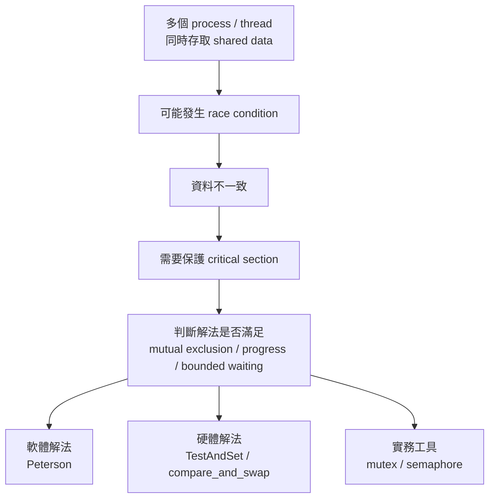
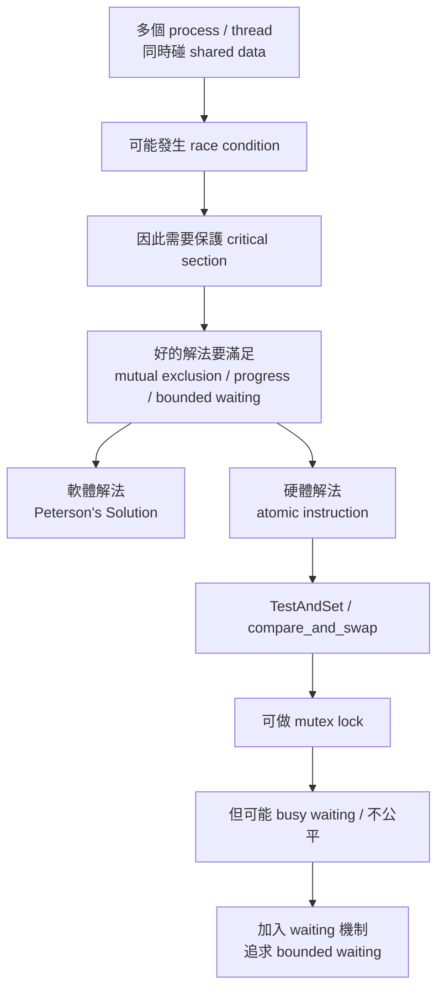

# ch 5


/// details | 簡報
                
///


## 同步(Synchronization)


### 講解

已啟用教學模式

#### 1. 這一章到底在回答什麼問題

這組投影片的核心問題只有一句話：

**當多個 process(行程) 或 thread(執行緒) 同時碰同一份 shared data(共享資料) 時，怎麼避免資料被弄壞。** 講義先用 producer / consumer(生產者／消費者) 舉例，說明共享變數 `count` 會因同時存取而造成 data inconsistency(資料不一致)，接著定義 race condition(競爭情況)，再一步步帶出 critical section problem(臨界區問題)、Peterson’s solution、硬體原子指令、mutex lock、semaphore 等同步工具。



---

#### 2. 先講直覺：為什麼明明只有 `count++` / `count--`，還會出事？

直覺上你可能會想：

* producer 生產一個東西，`count++`
* consumer 消費一個東西，`count--`
* 一加一減，不就剛好抵銷？

問題在於，`count++` 和 `count--` **不是一顆不可分的動作**。它通常會拆成：

1. 從記憶體把 `count` 讀進 register(暫存器)
2. 在 register 裡加一或減一
3. 再把結果寫回記憶體

如果 producer 和 consumer 同時做，就可能彼此覆蓋。講義就是用 producer/consumer 的共享 `count` 來展示這件事，因此才會引出 race condition。

生活化比喻：

兩個人共用一張白板，上面寫現在庫存是 5。

* 生產者看見 5，心裡算成 6
* 消費者也看見 5，心裡算成 4
* 生產者把 6 寫回去
* 消費者再把 4 寫回去

最後白板是 4。
但真實世界其實「先加一再減一」之後應該還是 5。

這就是 **結果取決於執行先後順序**，也就是講義定義的 race condition。

---

#### 3. 什麼是 critical section(臨界區)？

critical section 的直覺就是：

**一段不能讓兩個人同時進來操作共享資料的程式碼區。**

例如：

* `count++`
* 對 shared buffer 寫入
* 更新 linked list(鏈結串列)
* 修改 queue(佇列) 的 head/tail

這些都可能是 critical section。

講義說，任何能解決 critical-section problem 的方案，必須同時滿足三個條件：mutual exclusion(互斥)、progress(進行)、bounded waiting(有限等待)。

---

#### 4. 三個條件到底在說什麼

#### 4.1 mutual exclusion(互斥)

同一時間，**最多只能有一個** process 進入 critical section。
這是最基本的要求。

白話就是：
廁所一次只能一個人進去。

如果做不到 mutual exclusion，兩個人同時改共享資料，race condition 就回來了。

#### 4.2 progress(進行)

如果現在沒有人在臨界區裡，而有人想進去，
那就應該**讓某個符合資格的人趕快決定並進去**，不能無限拖延。

白話就是：

廁所明明空著，你也在排隊，但門口管理員一直不決定讓誰進，這就不行。

#### 4.3 bounded waiting(有限等待)

某個 process 已經表明「我想進 critical section」，
那它不能永遠被別人插隊，必須保證它等待次數有上限。

白話就是：

你排隊排到了，不能每次都被後面的人無限插隊。

---

#### 5. Peterson’s Solution 在幹嘛

這是講義中的**軟體解法**，而且是很經典的考題。它假設只有 **兩個 process**。講義明確寫出它共享兩個變數：

* `turn`
* `flag[2]`

其中：

* `flag[i] = true` 表示第 `i` 個 process 想進 critical section
* `turn` 表示現在「讓誰優先」

它的核心想法很漂亮：

1. 我先舉手：`flag[i] = true`
2. 我先禮讓對方：`turn = j`
3. 如果對方也想進，而且現在輪到對方，我就等
4. 否則我進 critical section

你可以把它想成兩個人站在單線橋兩端：

* `flag` = 我有沒有想過橋
* `turn` = 如果我們兩個都想過，那先讓誰

所以 Peterson 不是單純「搶鎖」，而是「**先表達需求，再用 turn 打破平手**」。這就是它能同時滿足互斥、進行、有限等待的原因，也是講義要求你證明的三點。


#### 5.1 通用模板

```c
/* Peterson's Solution for two processes */
/* textbook version */

#include <stdbool.h>

volatile bool flag[2] = {false, false};
volatile int turn = 0;

/* process Pi */
void process_i(int i)
{
    int j = 1 - i;   // the other process

    do {
        flag[i] = true;
        turn = j;
        while (flag[j] && turn == j)
            ;   // busy wait

        /* critical section */

        flag[i] = false;

        /* remainder section */

    } while (1);
}
```

#### 5.2 假設有兩個(這方法本來就是用在兩個 process)

```c
#include <stdbool.h>

volatile bool flag[2] = {false, false};
volatile int turn = 0;

void P0(void)
{
    do {
        flag[0] = true;
        turn = 1;
        while (flag[1] && turn == 1)
            ;

        /* critical section */

        flag[0] = false;

        /* remainder section */

    } while (1);
}

void P1(void)
{
    do {
        flag[1] = true;
        turn = 0;
        while (flag[0] && turn == 0)
            ;

        /* critical section */

        flag[1] = false;

        /* remainder section */

    } while (1);
}
```

---

#### 6. Peterson 最容易搞混的地方

很多人第一次看會以為：

> `turn` 是不是代表「只有 turn 那個人才能進」？

不完全是。

真正的等待條件是：

* **對方也想進**：`flag[j] == true`
* **而且目前輪到對方**：`turn == j`

這兩個要同時成立，我才等。

也就是說，`turn` **不是單獨決定權限**，它只是用來處理「雙方都想進」時的平手情況。
這是 Peterson 最容易考的點。

---

#### 7. Peterson 為什麼課堂上重要，但真實系統很少直接這樣用

就講義範圍來說，Peterson 是拿來教你理解：

* 什麼叫 mutual exclusion
* 什麼叫 progress
* 什麼叫 bounded waiting
* 軟體層面如何設計同步機制

但補充一個比較現代的背景：

講義裡假設 load/store 是 atomic(原子、不可中斷) 的。可是在現代多核心系統上，單靠程式表面順序不一定夠，因為 compiler(編譯器) 與 CPU 可能對 memory access(記憶體存取) 做 reordering(重排序)。Linux kernel 文件明講 memory barriers(記憶體屏障) 的用途就是限制這種重排序；社群討論也常指出 Peterson 在現代多處理器架構上若沒有適當的 memory ordering，就不保證正確。換句話說，**考試你照講義寫 Peterson；實作你通常用 mutex/atomic primitives，而不是手刻 Peterson。** ([Kernel Documentation][1])

---

#### 8. 為什麼要講硬體支援

講義接著說，很多系統會提供 synchronization hardware(同步硬體支援)。在單處理器上，可以靠 disable interrupts(關中斷) 暫時避免搶先，但在 multiprocessor(多處理器) 系統上通常效率差、可擴展性也不好；因此現代機器會提供 special atomic hardware instructions(特殊原子硬體指令)。

這裡的重點不是背硬體細節，而是理解：

**軟體想保證同步，最後常常要靠硬體幫你提供「不可分割」的操作。**


#### 8. TestAndSet 是怎麼工作的

投影片給的定義是：

```c
boolean TestAndSet(boolean *target) {
    boolean rv = *target;
    *target = true;
    return rv;
}
```

它最重要的不是程式長怎樣，而是：

**「讀舊值」與「把它設成 true」這兩件事，是一次做完的 atomic 動作。**

##### 8.1 直覺理解

假設 `lock` 一開始是 `false`，代表沒上鎖。

某個 process 呼叫：

`TestAndSet(&lock)`

會發生：

* 先把舊值取出
* 再立刻把 `lock` 設成 `true`
* 回傳原本那個舊值

所以：

* 如果回傳 `false`，代表你來的時候鎖是空的，你搶到了
* 如果回傳 `true`，代表別人已經先上鎖了，你沒搶到

##### 8.2 用它做 lock(鎖)

投影片的寫法是：

```c
while (TestAndSet(&lock))
    ;
/* critical section */
lock = false;
```

意思是：

* 一直嘗試搶鎖
* 搶到才進 critical section
* 離開時把 `lock = false`

這確實能做到 mutual exclusion，但有一個代價：

**busy waiting(忙等、自旋等待)**

也就是等的人不是睡著，而是在那邊一直檢查、一直空轉 CPU。

---

#### 9. compare_and_swap(CAS) 又是什麼

投影片也給了 compare_and_swap：

```c
int compare_and_swap(int *value, int expected, int new_value) {
    int temp = *value;
    if (*value == expected)
        *value = new_value;
    return temp;
}
```

直覺是：

> 只有當目前值等於我預期的值時，我才更新它。

這就像你說：

* 如果門現在是「沒鎖」
* 那我就把它改成「已鎖」

如果門早就被別人鎖了，我就不動它。

所以 CAS 也是一種「原子地檢查並更新」的工具。投影片用它做出的 lock，邏輯上跟 TestAndSet 很像，也能保證互斥。

---

#### 10. 為什麼單純的 TestAndSet / CAS 還不夠好

雖然它們能保證 mutual exclusion，但單純版本有兩個常見問題。

##### 10.1 busy waiting(忙等)

拿不到鎖的人會一直 spin(自旋)，浪費 CPU。

##### 10.2 可能不公平

你可能一直很倒楣，每次都搶輸，於是雖然系統一直在運作，但你可能長期進不去。這就碰到 bounded waiting 的要求了。

所以投影片才又放出一個比較進階的版本：

**Bounded-waiting Mutual Exclusion with TestAndSet()**

---

#### 11. 那張最難的圖：Bounded-waiting TestAndSet，到底在幹嘛

這一段很重要，因為它不是只求「鎖住」，而是還想求「不要讓人一直餓死」。

投影片的核心想法是：

* `lock`：全域鎖
* `waiting[i]`：記錄第 `i` 個 process 是不是正在排隊
* 離開 critical section 時，不是隨便放鎖，而是**明確把機會交給下一個等待者**

##### 11.1 進入前半段

```c
waiting[i] = true;
key = true;
while (waiting[i] && key)
    key = test_and_set(&lock);
waiting[i] = false;
```

直覺是：

* 我先登記：「我在等」
* 然後一直試著拿 lock
* 但只要有人把 `waiting[i]` 改成 `false`，我也會停下來

也就是說，**不一定非得自己搶到 lock，前一個人也可以直接把進入權交接給我。**

##### 11.2 離開後半段

```c
j = (i + 1) % n;
while ((j != i) && !waiting[j])
    j = (j + 1) % n;
if (j == i)
    lock = false;
else
    waiting[j] = false;
```

這一段是在找「下一個等待的人」。

* 如果繞一圈都沒人等，那就真的把 `lock = false`
* 如果找到有人在等，例如 `Pj`，那就把 `waiting[j] = false`

這個動作等於在說：

> 下一個輪到你，別再等了，直接進來。

##### 11.3 為什麼這樣會有 bounded waiting

因為它是按某種循環順序把機會往後傳，不會讓後來者一直插到你前面。

所以它不只是保證：

* 不會兩個一起進去

還進一步保證：

* 你不會無限期地等下去

這就是 bounded waiting 的本質。

---

#### 12. 這一段最容易混淆的地方

##### 12.1 race condition ≠ deadlock

很多人會把這兩個混掉。

**race condition(競爭條件)**
是大家都還在跑，但因為執行順序不同，結果錯了。
像 `count` 最後變 4 而不是 5。

**deadlock(死結)**
是大家互相等，最後誰都不動。

前者是「動了但結果錯」，後者是「根本動不了」。

##### 12.2 mutual exclusion 不等於 bounded waiting

有些解法能做到「一次只准一個人進」，但可能做不到「大家終究都等得到」。

所以看到一個 lock 解法時，不要只問：

* 有沒有互斥？

還要問：

* 會不會有人一直等不到？
* 有沒有 busy waiting？
* 是否滿足 progress 與 bounded waiting？

##### 12.3 `turn = j` 不是 bug

這真的是 Peterson 最常見誤解。
它不是寫反，而是**故意把平手裁決權讓給對方**，讓衝突有辦法被打破。

---

#### 13. 用一張圖把這批內容串起來



---

#### 14. 這一段你現在應該真正記住什麼

先不要背 code，先背下面這條主線：

1. **共享資料會因為同時修改而出錯**
2. 這種錯叫 **race condition(競爭條件)**
3. 所以碰共享資料的區域要當成 **critical section(臨界區)**
4. 好的同步解法要同時滿足
   **mutual exclusion、progress、bounded waiting**
5. **Peterson** 是經典兩行程軟體解法
6. 現代系統更常靠 **atomic hardware instruction**
   像 **TestAndSet / compare_and_swap**
7. 單純鎖住還不夠，還要考慮
   **busy waiting、公平性、是否會飢餓**

---

#### 15. 最後幫你做一句話版總結

這批投影片的本質就是：

> **為了讓共享資料保持正確，我們必須把「誰能在什麼時候碰共享資料」這件事管理起來；而同步機制，就是在做這件事。**

下一段最自然就是接著講 `mutex lock`、`semaphore(號誌)`、以及 bounded-buffer / readers-writers / dining philosophers 這些經典同步問題。


#### 1. 這段在回答什麼問題

這段其實是在回答：

**如果很多 process / thread 都想同時進入 critical section(臨界區)，怎麼保證一次只有一個能進去？**

講義前面先定義了 critical-section problem(臨界區問題)的三個要求：

1. mutual exclusion(互斥)
2. progress(進行)
3. bounded waiting(有限等待) 

而 `compare_and_swap` 就是硬體提供的一種 **atomic(原子化、不可中斷)** 指令，用來幫我們做 lock(鎖)。講義也明講現代機器會提供這類 atomic hardware instructions。

---

#### 2. 直覺理解：它到底在做什麼

你可以把 `lock` 想成廁所門牌：

* `0` = 沒人用，可以進
* `1` = 有人用，不可進

`compare_and_swap(&lock, 0, 1)` 的意思就是：

> 「幫我看一下 lock 現在是不是 0。
> 如果是 0，就立刻把它改成 1。
> 而且這整件事要一次做完，中間不能被別人插進來。」

這個「看是不是 0」加上「如果是就改成 1」必須綁成一個不可分割動作。
不然如果分兩步：

1. 我先看 lock 是不是 0
2. 我再把它改成 1

那兩個 process 可能都看到 0，最後兩個都進 critical section，就壞了。

---

#### 3. 正式概念：compare_and_swap Instruction 是什麼

講義的定義是：

```c
int compare_and_swap(int *value, int expected, int new_value) { 
    int temp = *value; 
    if (*value == expected) 
        *value = new_value; 
    return temp; 
}
```

#### 3.1 參數意思

* `value`：要檢查並可能修改的共享變數
* `expected`：我期待它現在是什麼值
* `new_value`：如果真的等於 expected，就把它改成這個新值

#### 3.2 回傳值是什麼

它回傳的是 **舊值 old value**，也就是 `*value` 原本的值，存在 `temp` 裡。

這點超重要。

---

#### 4. 一步一步拆解 compare_and_swap

假設現在：

```c
lock = 0;
```

然後某個 process 執行：

```c
compare_and_swap(&lock, 0, 1)
```

會發生：

1. `temp = lock`，所以 `temp = 0`
2. 檢查 `lock == 0`，成立
3. 把 `lock` 改成 `1`
4. 回傳 `temp`，也就是 `0`

所以：

* **回傳 0** 代表「原本沒鎖住，我成功搶到鎖了」
* **回傳 1** 代表「原本已經有人鎖住，我沒搶到」

---

#### 5. Solution using compare_and_swap 怎麼看

講義的解法是：

```c
do {
   while (compare_and_swap(&lock, 0, 1) != 0) ; /* do nothing */ 
      /* critical section */ 
   lock = 0; 
     /* remainder section */ 
} while (true); 
```

---

#### 6. 這段程式在幹嘛

#### 6.1 `while (compare_and_swap(&lock, 0, 1) != 0) ;`

意思是：

* 不斷嘗試把 `lock` 從 `0` 改成 `1`
* 如果回傳值不是 `0`，表示原本不是空的，沒搶到鎖
* 那就一直重試

也就是：

> **一直自旋(spin)等到鎖變空，然後原子化地把它搶下來**

所以這是一種 **spinlock(自旋鎖)** 寫法。

---

#### 6.2 `/* critical section */`

只要某個 process 成功把 `lock` 從 `0` 改成 `1`，它就能進 critical section。

---

#### 6.3 `lock = 0;`

離開 critical section 時，把鎖釋放掉，讓別人有機會進來。

---

#### 7. 兩個 process 同時搶鎖時，實際會怎樣

假設 `P0` 和 `P1` 同時跑到：

```c
compare_and_swap(&lock, 0, 1)
```

而一開始 `lock = 0`。

因為這個 instruction 是 atomic，所以不會真的「同時」改到同一個值，硬體一定會幫你序列化成某個先、某個後。

例如：

* `P0` 先執行

  * 看到 `lock = 0`
  * 改成 `1`
  * 回傳 `0`
  * `P0` 進入 critical section

* `P1` 後執行

  * 看到 `lock = 1`
  * 不改
  * 回傳 `1`
  * `P1` 留在 while 迴圈裡一直等

所以只會有一個 process 進 critical section。
這就是 **mutual exclusion(互斥)**。

---

#### 8. 用流程圖看比較直覺

```mermaid
flowchart TB
    A[開始嘗試進入 critical section] --> B[執行 compare_and_swap(&lock, 0, 1)]
    B --> C{回傳值是否為 0?}
    C -- 否 --> D[沒搶到鎖<br>繼續 busy waiting]
    D --> B
    C -- 是 --> E[成功把 lock 從 0 改成 1]
    E --> F[進入 critical section]
    F --> G[離開時 lock = 0]
    G --> H[進入 remainder section]
```

---

#### 9. 為什麼這能保證 mutual exclusion(互斥)

關鍵只有一句：

> **從「檢查 lock 是否為 0」到「把 lock 設成 1」是原子化的。**

所以不可能發生下面這種錯誤：

* `P0` 看見 lock=0
* `P1` 也看見 lock=0
* 兩個都進去

因為硬體保證這不是兩步，而是一個不可拆開的動作。
因此同一瞬間，最多只有一個人能把 `lock` 從 0 變成 1。

---

#### 10. 它有沒有滿足 progress(進行) 與 bounded waiting(有限等待)

這裡要小心，不能直接亂說「三個都滿足」。

#### 10.1 mutual exclusion

✅ 有

因為 CAS 是 atomic，所以一次只有一個 process 能成功把 lock 從 0 改成 1。

#### 10.2 progress

大致上可以運作。只要 lock 被釋放，某個等待中的 process 終究會搶到。

#### 10.3 bounded waiting

**這個簡單版通常不能保證。**

原因是它只是一直重試：

```c
while (compare_and_swap(&lock, 0, 1) != 0) ;
```

誰先搶到，取決於排程與時機。
有可能某個倒楣 process 一直搶輸，產生 starvation(飢餓)。

這也是為什麼講義後面另外給了 **Bounded-waiting Mutual Exclusion with TestAndSet()** 的版本，表示前面那種最簡單硬體鎖法，重點主要是先做到互斥，不一定保證有限等待。

---

#### 11. 這份投影片有一個小地方你要注意

投影片在 compare_and_swap 那頁寫：

> Each process has a local Boolean variable key

但下面這份 CAS 程式：

```c
do {
   while (compare_and_swap(&lock, 0, 1) != 0) ;
   /* critical section */
   lock = 0;
   /* remainder section */
} while (true);
```

**根本沒用到 `key`。**

所以這裡你不要硬背成「CAS 解法一定要有 key」。
這頁真正有在用的只有：

* shared `lock`
* atomic `compare_and_swap`

`key` 比較像是前一個 `TestAndSet` 或 bounded-waiting 版本殘留的描述。

---

#### 12. 它的缺點是什麼

#### 12.1 busy waiting(忙等)

在 while 裡什麼事都不做，一直重試：

```c
while (compare_and_swap(&lock, 0, 1) != 0) ;
```

這會一直吃 CPU。
所以這種 lock 叫 **spinlock(自旋鎖)**。講義後面也明講這類 lock 需要 busy waiting。

#### 12.2 不能保證公平

誰先搶到鎖，不一定公平。

#### 12.3 臨界區太長時不划算

如果 critical section 很長，別人一直 spin 會很浪費。
這時通常 semaphore / mutex with blocking 會更適合。

---

#### 13. 跟 TestAndSet 有什麼差別

兩者都屬於：

* hardware synchronization primitive(硬體同步原語)
* atomic instruction
* 可拿來做 lock

但差別在動作型態：

#### TestAndSet

比較像：

> 直接把 target 設成 true，然後回傳原本的值

#### compare_and_swap

比較像：

> 只有當目前值等於 expected 時，才改成 new_value

所以 CAS 比較一般化、比較靈活。
你可以把它理解成「帶條件的原子更新」。

---

#### 14. 你真正要記住的考點

#### 14.1 compare_and_swap 的本質

它是：

**比較 + 條件更新 + 整包原子化**

#### 14.2 回傳值要記

它回傳的是 **修改前的舊值**，不是成功或失敗的布林值。

#### 14.3 為什麼 while 裡判 `!= 0`

因為：

* 回傳 `0`：代表原本 lock 是 0，我成功搶到
* 回傳非 `0`：代表原本已被鎖住，繼續等

#### 14.4 這個簡單解法的性質

* ✅ 可保證互斥
* ❌ 不一定保證 bounded waiting
* ❌ 有 busy waiting

---

#### 15. 小結

一句話總結：

> `compare_and_swap` 是一個 atomic instruction，用來「原子化地檢查某值是否等於 expected，若是就改成 new value，並回傳舊值」；拿它做 lock 時，大家一直嘗試把 `lock` 從 `0` 改成 `1`，成功的人進 critical section，離開後再把 `lock` 設回 `0`。這能保證 mutual exclusion，但會 busy waiting，而且簡單版本不保證 bounded waiting。

如果你要，我下一則可以直接接著幫你講：
**「這題考試要怎麼手寫證明 mutual exclusion」**，或是 **「compare_and_swap、test_and_set、mutex、semaphore 四者差異表」**。


最後看到p.16

file:///D:/%E6%88%91%E7%9A%84%E9%9B%B2%E7%AB%AF%E7%A1%AC%E7%A2%9F%20(peicd100@gmail.com)/0_%E5%A4%A7%E5%AD%B8/0_%E7%AD%86%E8%A8%98/0_%E5%B8%AB%E5%A4%A7114-2/%E9%9B%BB%E6%A9%9F_%E4%BD%9C%E6%A5%AD%E7%B3%BB%E7%B5%B1/%E6%95%99%E6%9D%90/chapter%205_20240405.pdf