## ⭐CPU Scheduling — 為什麼作業系統需要替 CPU 決定下一個跑誰？

講義位置：PDF viewer page 1 ~ PDF viewer page 6／輔助：投影片 1 ~ 6

### 1. 這章真正處理的問題：CPU 不能空著，也不能同時跑所有 process

在單一處理器系統裡，同一瞬間只能有一個 Process(行程) 真正在 CPU 上 Running(執行)。如果有很多 process 都準備好了，它們不能全部同時跑，只能排隊等 CPU。講義的基本觀念是：Multiprogramming(多元程式規劃) 的目標，是盡量讓 CPU 一直有 process 可以執行，提高 CPU Utilization(CPU 使用率)。

生活化例子：
CPU 像一個只有一個窗口的便當店老闆。很多客人都準備點餐，但老闆一次只能服務一人。Scheduling(排班) 就是在決定：「下一個輪到誰？」

---

### 2. 為什麼 process 不是一直用 CPU？因為會在 CPU Burst 和 I/O Burst 之間交替

一個 process 的執行不是「從頭到尾都佔著 CPU」。它通常會在兩種時間段之間來回：

* CPU Burst(CPU 分割)：process 正在用 CPU 做計算
* I/O Burst(I/O 分割)：process 等待磁碟、鍵盤、網路、檔案、螢幕等 I/O


!!! danger
    
    Burst ： 爆裂
    
    Burst 之所以叫 **burst**，是因為它強調「一小段集中發生的活動」。

    在英文裡，**burst** 常有「突然出現、集中一陣子、然後停止或切換」的意思，例如：

    - a burst of rain：突然下一陣雨
        
    - a burst of activity：一小段密集活動
        
    - a burst of energy：突然一陣能量
        

    放到作業系統裡，**CPU Burst** 不是指 CPU 爆炸，也不是一定很快，而是指：

    > Process 連續使用 CPU 的那一段時間。

講義說明：行程執行由一個 CPU Burst 開始，接著是 I/O Burst，然後再回到 CPU Burst，再接 I/O Burst，如此交替。

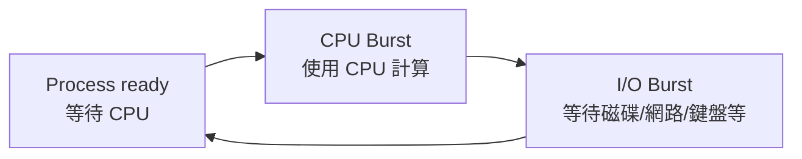

重點不是背名詞，而是理解：
當某個 process 進入 I/O waiting 時，CPU 如果繼續等它，就浪費了。所以 OS 會把 CPU 分給另一個 ready process。

---

### 3. I/O-bound 和 CPU-bound 的直覺差異

這裡講義用 CPU Burst duration(CPU 分割時間長度) 的分佈來暗示一件事：大部分 process 的 CPU burst 很短，尤其 I/O-bound process 很常出現短 CPU burst。


!!! danger
    
    **bound** 在這裡不是「綁定」的意思，而是比較接近：

    > **受限於、卡在、瓶頸在……**

    所以：

    - **I/O-bound Process(I/O 密集行程)**：這個 process 的速度主要被 I/O 限制住。
        
    - **CPU-bound Process(CPU 密集行程)**：這個 process 的速度主要被 CPU 計算能力限制住。


我們先建立兩種 process 的直覺：

| 類型                            | 主要特徵                | 生活化例子                 | 對 scheduling 的意義              |
|---------------------------------|-------------------------|----------------------------|-----------------------------------|
| I/O-bound Process(I/O 密集行程) | 常常等 I/O，CPU burst 短 | 一直問店員「資料到了沒」的人 | 需要快速回應，常影響 response time |
| CPU-bound Process(CPU 密集行程) | 長時間計算，CPU burst 長 | 坐下來做一大堆計算題的人   | 容易長時間佔 CPU                  |

期中考古也直接問過 I/O-bound process 和 CPU-bound process 的差異，所以這個概念不只是背景，而是考試可輸出點。

---

### 4. CPU Scheduler 的核心任務：從 Ready Queue 選一個 process

當 CPU Idle(閒置) 時，OS 必須從 Ready Queue(就緒佇列) 中選出一個 process 來執行。這件事由 Short-term Scheduler(短程排班程式)，也就是 CPU Scheduler(CPU 排班程式) 負責。講義明確說：scheduler 會從記憶體中準備要執行的數個行程中選一個，並將 CPU 配置給它。

可以把流程想成：

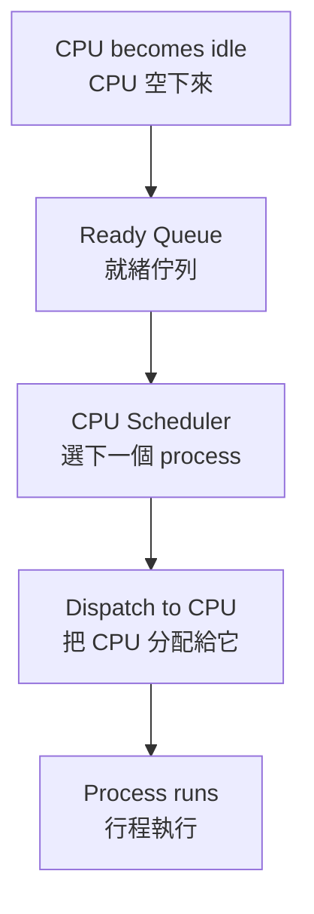

所以 CPU scheduling 的第一個核心問題是：

> Ready Queue 裡有很多 process 時，OS 要根據什麼規則選下一個？

這也是後面 FCFS、SJF、Priority、Round Robin 全部在回答的問題。

---

### 5. 本輪最短記法

CPU Scheduling(處理器排班)：
當 CPU 空下來時，OS 從 Ready Queue 中選一個 process 來執行，目標是讓 CPU 不閒置，同時兼顧不同效能指標。

CPU-I/O Burst Cycle(CPU-I/O 分割週期)：
Process 通常在 CPU Burst 和 I/O Burst 之間交替；I/O-bound 通常 CPU burst 短，CPU-bound 通常 CPU burst 長。

Short-term Scheduler(短程排班程式)：
負責在 Ready Queue 中選出下一個要使用 CPU 的 process。

---

### 6. 常見錯法

錯法 1：以為 process 一開始跑就會一路用 CPU 到結束。
修正：process 常常會等待 I/O；等待期間 CPU 可以拿去跑別的 process。

錯法 2：把 CPU Scheduler 和 Long-term Scheduler 混在一起。
修正：CPU Scheduler / Short-term Scheduler 是高頻率地從 Ready Queue 選下一個跑 CPU 的 process；Long-term Scheduler 是控制哪些 process 被帶入 ready queue，頻率較低。這點期中考古也出現過。

錯法 3：以為 scheduling 只是在追求 CPU utilization。
修正：CPU utilization 很重要，但後面還會同時考慮 response time、waiting time、turnaround time、throughput 等標準；這會在 PDF viewer page 10 ~ 11 正式處理。


### 所以 CPU bound process 和 IO bound process 是兩種不同的 process 嗎?

不是「兩種完全不同的 process 種族」，而是 **同一種 Process(行程) 依照它的 workload behavior(工作負載行為) 分成兩種傾向**。

**重點：I/O-bound 和 CPU-bound 是分類標籤，不是 process 的固定身分。**

---

#### 1. 正確理解

一個 process 可以被描述成：

| 分類                            | 代表它大部分時間花在哪裡 | CPU Burst 特徵         |
|---------------------------------|--------------------------|------------------------|
| I/O-bound Process(I/O 密集行程) | 等 I/O 比計算多          | 很多短 CPU Burst       |
| CPU-bound Process(CPU 密集行程) | 計算比等 I/O 多          | 較少但很長的 CPU Burst |

講義 Chapter 6 說，process 會在 CPU Burst(CPU 分割) 和 I/O Burst(I/O 分割) 之間交替，而且 I/O-bound 程式特別多短 CPU Burst。 Chapter 3 也補充：I/O-bound process 花比較多時間做 I/O、很多短 CPU burst；CPU-bound process 花比較多時間做 computation、少數很長 CPU burst。

---

#### 2. 它不是永遠固定的

同一個程式在不同階段可能改變傾向。

例如影片剪輯軟體：

1. 讀取大型影片檔：偏 I/O-bound，因為在等硬碟或 SSD 讀資料。
2. 套濾鏡、轉碼、壓縮：偏 CPU-bound，因為一直在算。
3. 輸出檔案：又可能偏 I/O-bound，因為要寫入磁碟。

所以不能說「這個 process 天生就是 I/O-bound」或「天生就是 CPU-bound」。更精確是：

> 在某段執行期間，這個 process 的主要瓶頸偏向 I/O 或 CPU。

---

#### 3. 為什麼 OS 要分這兩類？

因為 scheduling(排班) 會受影響。

I/O-bound process 通常算一下就去等 I/O。如果 OS 很快讓它跑，它很快又會把 CPU 讓出來，然後去等 I/O，這樣可以讓 I/O 裝置也忙起來。

CPU-bound process 則可能一拿到 CPU 就跑很久，如果沒有適當排班，可能讓互動式或 I/O-bound process 等太久。

**考試寫法：**

```text
I/O-bound and CPU-bound processes are not different kinds of processes by nature. They are classifications based on how a process spends most of its time. An I/O-bound process spends more time waiting for or performing I/O and usually has many short CPU bursts, while a CPU-bound process spends more time doing computation and usually has fewer but longer CPU bursts.
```

### 所以這兩種 process 和 scheduling 到底有什麼關係?

它們跟 Scheduling(排班) 的關係是：**Scheduling 要決定「下一個 CPU 給誰」，而 I/O-bound / CPU-bound 會影響這個決定的好壞。**

**重點：I/O-bound 和 CPU-bound 不是為了分類好看，而是用來預測 process 會怎麼使用 CPU，進而影響排班策略。**

---

#### 1. CPU Scheduler 在做什麼？

CPU Scheduler(CPU 排班程式) 的任務是：

> 當 CPU 空下來時，從 Ready Queue(就緒佇列) 選一個 process 來執行。

講義說 CPU 閒置時，OS 必須從 ready queue 中選出一個行程，由 short-term scheduler / CPU scheduler 負責，並將 CPU 配置給它。

所以問題變成：

> Ready Queue 裡同時有 I/O-bound 和 CPU-bound process 時，要先給誰？

---

#### 2. 如果排班排得不好，會發生什麼？

假設 Ready Queue 裡有：

| Process | 類型      | 行為                           |
|---------|-----------|--------------------------------|
| P1      | CPU-bound | 會連續算很久                   |
| P2      | I/O-bound | 只需要 CPU 算一下，就會去等 I/O |
| P3      | I/O-bound | 只需要 CPU 算一下，就會去等 I/O |

如果排班讓 P1 先跑很久，P2、P3 就卡在 ready queue，結果是：

1. P2、P3 明明只需要一點 CPU 就能去啟動 I/O，卻一直等不到。
2. I/O 裝置可能閒著，因為 I/O-bound process 還沒被 CPU 推進到 I/O request。
3. 使用者感覺系統反應很慢。
4. CPU-bound process 一直佔 CPU，造成其他 process waiting time 變長。

這就是為什麼 scheduling 不能只看「誰先來」，還要看 process 的行為特徵。

---

#### 3. I/O-bound 通常適合比較快被服務

I/O-bound process 通常 CPU Burst(CPU 分割) 短，跑一下就會進入 I/O Burst(I/O 分割)。講義也提到 process 會在 CPU burst 和 I/O burst 之間交替，而且 I/O-bound 的程式特別多短 CPU burst。

所以如果 scheduler 早點讓 I/O-bound process 跑：

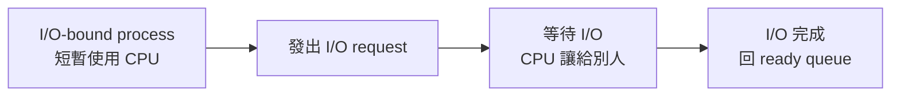

好處是：

* 它很快就會讓出 CPU。
* I/O 裝置可以早點開始工作。
* CPU 可以再拿去跑其他 process。
* 系統整體比較不會閒置。

**重點：讓 I/O-bound process 早點跑，常常可以讓 CPU 和 I/O 裝置同時忙起來。**

---

#### 4. CPU-bound 需要避免「霸佔 CPU」

!!! danger
    這邊說了 ==所以這兩種 process 和 scheduling 到底有什麼關係？== 的原因、和後面的關係。

CPU-bound process 通常 CPU Burst 長，代表它可以一直算很久。這不是壞事，但如果排班策略不限制它，它可能讓其他 process 等很久。

所以後面會出現幾種 scheduling 設計：

| 排班概念                            | 跟 I/O-bound / CPU-bound 的關係                                   |
|-------------------------------------|-------------------------------------------------------------------|
| FCFS(First-Come, First-Served)      | 如果 CPU-bound 先來，後面的短 I/O-bound process 可能等很久         |
| SJF(Shortest-Job-First)             | 偏好短 CPU burst，因此常對 I/O-bound 有利                          |
| SRTF(Shortest-Remaining-Time-First) | 可搶先版 SJF，短工作來了可以搶先長工作                             |
| RR(Round Robin)                     | 用 Time Quantum(時間片) 防止 CPU-bound 長期霸佔 CPU               |
| Priority Scheduling(優先權排班)     | 可以給互動式 / I/O-bound process 較高優先權，但可能造成 starvation |

---

#### 5. 最核心的因果關係

可以這樣記：

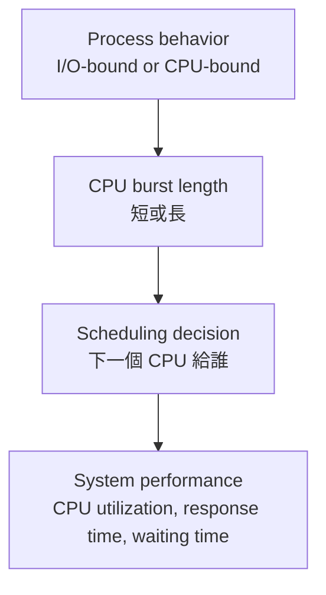

**必背：I/O-bound / CPU-bound 會影響 CPU burst 長度，而 CPU burst 長度會影響 scheduler 應該怎麼選 process。**

---

#### 6. 考試寫法

```text
I/O-bound and CPU-bound processes are important for CPU scheduling because they have different CPU burst patterns. I/O-bound processes usually have many short CPU bursts and frequently wait for I/O, while CPU-bound processes usually have fewer but longer CPU bursts. A good scheduler should keep both the CPU and I/O devices busy, improve response time, and prevent long CPU-bound processes from delaying short or interactive I/O-bound processes too much.
```

中文理解版：

**I/O-bound 常常只需要 CPU 一下下，就去等 I/O；CPU-bound 則會長時間用 CPU。Scheduler 如果懂這個差異，就能讓短 burst 的 process 快點跑、快點去做 I/O，同時避免長 burst 的 process 霸佔 CPU。**

第 9 次對話

## ⭐Preemptive Scheduling — CPU 什麼時候可以重新決定下一個行程？

講義位置：PDF viewer page 7 ~ PDF viewer page 8

### 1. 這個概念在解決什麼問題？

在單核心 CPU 上，同一個時間點只能有一個 `Process(行程)` 真正在 CPU 上跑。
所以 `CPU Scheduling(CPU 排班)` 要回答一個核心問題：

**現在 CPU 要不要繼續給目前這個 process？還是要改分配給別人？**

生活化例子：
想像一個服務櫃台。現在 A 客人正在辦事，後面 B、C、D 都在排隊。櫃台什麼時候需要重新決定「下一位是誰」？

可能是：

1. A 說：「我要去補文件，先暫停」。
2. A 被更緊急的事件打斷。
3. 某個原本去補文件的人回來了。
4. A 辦完離開。

OS 的 CPU 排班也是類似：只有在 process 狀態發生關鍵轉換時，才有機會重新排班。

### 2. Page 7 的四種 CPU scheduling decision 時機

講義列出 CPU 排班決策發生在四種情況：

| 編號 | 狀態轉換               | 直覺意思                                                     |
|------|------------------------|--------------------------------------------------------------|
| 1    | `Running → Waiting`    | 目前 process 自己不能跑了，例如等 I/O 或等 child process 結束 |
| 2    | `Running → Ready`      | 目前 process 還能跑，但被 interrupt 打斷，回到 ready queue     |
| 3    | `Waiting → Ready`      | 原本在等 I/O 的 process 等完了，回到 ready queue              |
| 4    | `Running → Terminated` | 目前 process 結束了                                          |

==其實就是 Ready 、 Running 、 Waiting 間的那幾個箭頭。==

用圖來看：

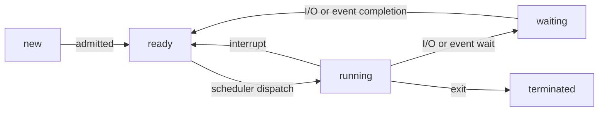

這張圖的重點不是背箭頭，而是要看懂：
**只要 CPU 目前的主人可能要換，scheduler 就可能被叫出來做決定。**

### 3. Nonpreemptive(不可搶先)：CPU 只能等目前 process 自己讓出來

`Nonpreemptive Scheduling(不可搶先排班)` 的核心規則是：

**一旦 CPU 分給某個 process，OS 不會硬把它趕下 CPU；除非它自己不能跑，或它結束。**

所以講義 page 8 說：情況 1 和 4 屬於 `Nonpreemptive(不可搶先)`。

為什麼？

情況 1：`Running → Waiting`
process 自己去等 I/O，所以它主動離開 CPU。

情況 4：`Running → Terminated`
process 結束了，所以 CPU 當然空出來。

這兩種都不是 OS 硬搶 CPU，而是目前 process 已經無法或不需要繼續使用 CPU。


!!! danger

    Q：你這邊說情況一和情況四不可搶先，是指情況一和情況四不可以搶先別人，還是別人不可以搶先情況一跟情況四?
    
    情況 1 和情況 4 被稱為 Nonpreemptive(不可搶先)，不是指「它們不可以搶先別人」，也不是指「別人不可以搶先它們」。

    它真正的意思是：

    在情況 1 和 4 裡，目前正在 running 的 process 並不是被 OS 強制搶下 CPU；而是它自己因為 waiting 或 terminated， ==主動／自然離開 CPU== 。


### 4. Preemptive(可搶先)：OS 可以把目前 process 趕回 ready queue

`Preemptive Scheduling(可搶先排班)` 的核心規則是：

**即使目前 process 還能跑，OS 也可以因為某些事件重新分配 CPU。**

講義 page 8 說：除了 1 和 4 之外，其他 scheduling 都是 `Preemptive(可搶先)`。

也就是：

情況 2：`Running → Ready`
目前 process 被 interrupt 打斷，回到 ready queue。這是最典型的搶先。

情況 3：`Waiting → Ready`
某個原本在等 I/O 的 process 回來了。這時 OS 可能重新比較誰比較該跑，例如高優先權 process 回來，就可能搶走 CPU。

### 5. 最容易混淆的地方：interrupt 不等於一定換人

這裡很重要。

`Interrupt(中斷)` 代表 CPU 被迫停下來進 kernel 處理事件；
但「中斷發生」不必然代表「最後一定換另一個 process 跑」。

比較精準地說：

* 在 `Preemptive Scheduling(可搶先排班)` 中，interrupt 給 OS 一個重新排班的機會。
* OS 檢查 ready queue 後，可能換人，也可能還是讓原本 process 繼續跑。
* 所以考試不要寫成「有 interrupt 就一定 context switch 到別的 process」。

這也是社群討論中常見的卡點：很多人會把「可以被搶先」誤解成「每次事件都一定會搶先」。比較安全的考試寫法是：**preemptive scheduling allows the OS to interrupt a running process and possibly choose another ready process to run.** ([Computer Science Stack Exchange][2])

### 6. Page 8 的 race condition 提醒

講義 page 8 還補一句：當很多 process 共用資料時，`Preemptive Scheduling(可搶先排班)` 可能造成 `Race Condition(競爭情況)`。

原因是：
如果 process A 正在改 shared variable ( ==然後 A 沒有處理 Synchronization(同步)== )，還沒改完就被搶先；process B 接著也去改同一份資料，就可能讓結果取決於執行交錯順序。
==(其實這和平行執行的 race condition 一樣)==

這不是說 preemptive scheduling 不好，而是說它需要搭配 `Synchronization(同步)` 機制，例如 lock、semaphore、mutex，來保護 shared data。

### 7. 最短記法

同一個概念，考試可以這樣記：

| 類型            | 判斷法                                                     |
|-----------------|------------------------------------------------------------|
| `Nonpreemptive` | CPU 只在 process 自己 blocking 或 terminate 時換人         |
| `Preemptive`    | OS 可以因 interrupt、time slice、priority 等原因重新分配 CPU |
| Page 7 四情況   | 1、4 是 nonpreemptive；2、3 是 preemptive 的典型來源          |

!!! danger

    ### 如果說 Running → Ready 是Preemptive，他可以強制正在core 的 process 出來我可以理解，但是 Waiting → Ready 完全不影響 core 內的 process 吧。

    你這個疑問是對的：**`Waiting → Ready` 本身確實沒有直接把正在 core 上跑的 process 拉出來。**

    但它會造成一件關鍵事情：

    **ready queue 的內容改變了，所以 OS 有機會重新比較「現在誰最該用 CPU」。**

    也就是說，`Waiting → Ready` 不是「搶先動作本身」，而是「可能觸發搶先判斷的事件」。

---

#### 1. 精準區分：直接搶先 vs 觸發重新排班

| 情況              | 發生什麼事                               | 是否直接動到目前 running process？ | 為什麼可能算 preemptive？                                             |
|-------------------|------------------------------------------|----------------------------------:|----------------------------------------------------------------------|
| `Running → Ready` | 目前 running process 被放回 ready queue  |                                是 | OS 直接把正在跑的 process 趕下 CPU                                   |
| `Waiting → Ready` | 某個等待 I/O 的 process 回到 ready queue |                                否 | 新回來的 process 可能比目前 running process 更該跑，OS 可能因此搶 CPU |

所以你的直覺要修正成：

**`Waiting → Ready` 不會直接搶 core；但在 preemptive scheduling 中，它可能導致 OS 搶走目前 running process 的 core。**

講義 Chapter 3 也有對應概念：ready queue 是保存「位於主記憶體中且就緒等待執行」的 process；scheduler 的工作就是從可用 process 中選一個配置 CPU。 另外，考古題的 preemptive priority round-robin 題也明講：如果 process 被更高優先權 process 搶先，被搶先的 process 會放到 queue 的尾端。

---

#### 2. 用例子看就很清楚

假設現在：

* `P1` 正在 CPU 上跑，priority = 10
* `P2` 原本在 `Waiting`，因為它在等 disk I/O
* `P2` priority = 50

時間點 `t = 20`：

1. `P1` 還在 core 上跑。
2. Disk I/O 完成，硬體發出 interrupt。
3. OS 進 kernel 處理這個 interrupt。
4. `P2` 從 `Waiting → Ready`。
5. Scheduler 重新看 ready queue：發現 `P2` priority 比 `P1` 高。
6. OS 把 `P1` 從 `Running → Ready`，讓 `P2` 進 `Running`。

真正被搶的是第 6 步的 `P1: Running → Ready`。
但「導火線」是第 4 步的 `P2: Waiting → Ready`。

所以課本把情況 3 放進 preemptive 的討論，是因為：

**在可搶先系統中，某個 process 變成 ready 之後，可能立刻搶走 CPU。**

UIC 的 OS course notes 也把 CPU scheduling decision 的情況 3 寫成：process 從 waiting state 變成 ready state，例如 I/O 完成或從 `wait()` 返回；而 preemptive scheduling 涵蓋這類重新排班時機。([cs.uic.edu][1]) NTU 的 OS 投影片也用更直覺的說法：preemptive scheduling 會在 process 進入 ready queue 或 running process 離開 running state 時被呼叫。([國立臺灣大學資訊工程學系][2])

---

#### 3. 什麼情況下 `Waiting → Ready` 不會真的搶？

如果新回來的 process 沒有更高優先權，或演算法規則不允許立刻搶，那就不會換人。

例如：

* `P1` 正在跑，priority = 50
* `P2` 從 waiting 回來，priority = 10

這時 `P2` 只是進 ready queue 排隊，`P1` 繼續跑。

所以考試寫法要避免太絕對：

錯誤寫法：
`Waiting → Ready preempts the running process.`

精準寫法：
`When a process moves from waiting to ready, the ready queue changes. In a preemptive scheduler, the OS may preempt the currently running process if the newly ready process should run according to the scheduling policy.`

---

#### 4. 一句話總結

**你說得對：`Waiting → Ready` 不直接影響 core 內的 process；但它會改變 ready queue，而 preemptive scheduler 可以因此重新排班，必要時再把目前 running process 搶下來。**

第 4 次對話

[1]: https://www.cs.uic.edu/~jbell/CourseNotes/OperatingSystems/5_CPU_Scheduling.html?utm_source=chatgpt.com "Operating Systems: CPU Scheduling"
[2]: https://www.csie.ntu.edu.tw/~ktw/uos/uos2005-Chp5.pdf?utm_source=chatgpt.com "Chapter 5 Process Scheduling"


!!! danger

    ### 所以 Waiting → Ready 可能會造成 Running → Ready 所以是 preemptive 嗎 ？

    對，**但要加一個精準限制**：

    **`Waiting → Ready` 之所以被歸到 preemptive 的情境，是因為它「可能導致」目前正在跑的 process 發生 `Running → Ready`；不是因為 `Waiting → Ready` 這個轉換本身就直接搶 CPU。**
    
    ==也就是說真正的 preemption(搶先本體) 是 `Running → Ready` ， `Waiting → Ready` 是觸發重新排班的事件，不是搶先本體。

---

#### 1. 正確因果鏈

假設：

* `P1` 正在 CPU 上跑：`Running`
* `P2` 原本在等 I/O：`Waiting`
* `P2` 的 I/O 完成後變成：`Ready`

這時只發生：

`P2: Waiting → Ready`

這一步本身沒有動到 core 裡的 `P1`。

但如果 scheduler 是 `Preemptive Scheduler(可搶先排班器)`，它會重新判斷：

> 現在 P2 回 ready queue 了，P2 是否比 P1 更該跑？

如果答案是是，例如 P2 priority 比 P1 高，或 P2 remaining time 比 P1 短，才會再發生：

`P1: Running → Ready`
`P2: Ready → Running`

所以完整流程是：

```text
P2: Waiting → Ready
        ↓
scheduler 重新比較
        ↓
若 P2 比 P1 更該跑
        ↓
P1: Running → Ready
P2: Ready → Running
```

講義 page 7 把 `Waiting → Ready` 列為 CPU scheduling decision 的情況之一；page 8 則說只有情況 1 和 4 是 nonpreemptive，其他 scheduling 是 preemptive。 這也和 UIC OS notes 的分類一致：如果排班只在 1 和 4 發生，就是 nonpreemptive；否則就是 preemptive。([cs.uic.edu][1])

---

#### 2. 你可以這樣記

**`Waiting → Ready` 是 preemptive 的 trigger，不是 preemption 本體。**

真正的 `Preemption(搶先)` 本體是：

`Running → Ready`

也就是目前正在 CPU 上跑的 process 被 OS 放回 ready queue。

---

#### 3. 考試最安全寫法

不要寫：

> Waiting → Ready directly preempts the running process.

這太絕對，容易被扣分。

應該寫：

> A transition from waiting to ready may trigger preemptive scheduling. If the newly ready process has higher priority, or should run according to the scheduling policy, the currently running process may be preempted and moved from running to ready.

中文理解版：

**`Waiting → Ready` 本身只是某個 process 回到 ready queue；但在可搶先排班中，這會讓 OS 有機會重新排班，若新回來的 process 更該跑，就會把目前 running process 搶下來。**

第 5 次對話

[1]: https://www.cs.uic.edu/~jbell/CourseNotes/OperatingSystems/5_CPU_Scheduling.html?utm_source=chatgpt.com "Operating Systems: CPU Scheduling"


### 考古錯題

Q:
A system uses preemptive priority scheduling. P1 is running with priority 20. P2 completes I/O and moves from waiting to ready with priority 50. Explain the sequence of state transitions that may happen, and identify which transition is the actual preemption.
[Generated: based on 講義_chapter 6_20240505.pdf／PDF viewer page 7 ~ 8]

ANS:
P1 原本正在執行，P2 原本在 waiting。當 P2 完成 I/O 後，P2 會從 Waiting → Ready，表示它已經可以被排程。因為 P2 的 priority 比 P1 高，所以在 preemptive priority scheduling 裡，OS 會重新比較目前 running process 和 ready queue 裡的 process。若 P2 應該優先執行，OS 會把 P1 從 Running → Ready，再讓 P2 從 Ready → Running。

!!! danger
    
    Priority 50 是指優先程度是 50 ，優先度越大，越優先。
    所以 50 比 20 優先。
    


## ⭐Dispatcher — scheduler 選完人之後，CPU 控制權怎麼真的交出去？

講義位置：PDF viewer page 9

### 1. Scheduler(排班器)和 Dispatcher(分派程式)不是同一件事

上一個知識點我們一直在講 scheduler 判斷「誰該跑」。
但 OS 不能只停在「決定誰該跑」，還要真的把 CPU 控制權交給那個 process。

所以可以這樣分：

| 元件                        | 負責的問題                       | 生活化例子                           |
|-----------------------------|----------------------------------|--------------------------------------|
| `CPU Scheduler(CPU 排班器)` | 下一個要跑誰？                    | 櫃台叫號系統決定下一位客人           |
| `Dispatcher(分派程式)`      | 怎麼真的把 CPU 交給那個 process？ | 櫃台人員真的把窗口切給下一位客人辦事 |

講義 page 9 說，dispatcher 是 CPU scheduling function 裡的另一個元件，負責把 CPU 控制權交給 scheduler 選到的 process。 UIC OS notes 也用同樣定義：dispatcher gives control of the CPU to the process selected by the scheduler。([cs.uic.edu][2])

### 2. Dispatcher 做三件事

講義 page 9 列出 dispatcher 的三個工作：

1. `Switching context(轉換內容 / 內容切換)`
   把舊 process 的狀態存起來，把新 process 的狀態載入。
   例如暫存器、program counter、stack pointer 等等。

2. `Switching to user mode(切換成使用者模式)`
   OS 做排班時在 kernel mode；但一般程式要回 user mode 跑。

3. `Jumping to the proper location(跳到使用者程式的適當位置)`
   新 process 不是從 main 重新開始，而是從它上次停下來的位置繼續跑。

用流程看：

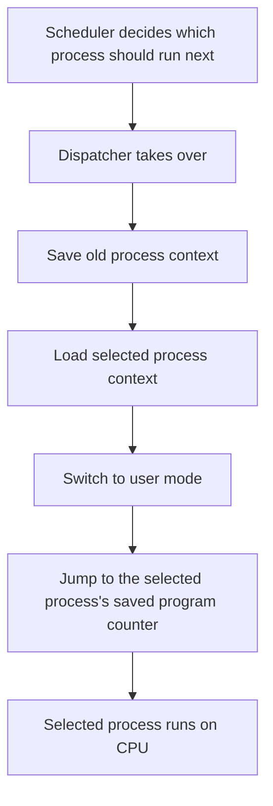

### 3. Dispatch Latency(分派延遲)：換人不是免費的

`Dispatch Latency(分派延遲)` 是：

**dispatcher 停止一個 process 並啟動另一個 process 所花的時間。**

講義 page 9 的定義是：time it takes for the dispatcher to stop one process and start another running。 外部教材也一致強調，dispatcher 每次 context switch 都會被呼叫，所以它應該越快越好。([cs.uic.edu][2])

這個概念很重要，因為：

* context switch 本身不是真正在執行使用者程式；
* 換人太頻繁會增加 overhead；
* 所以後面 Round Robin 的 time quantum 不能設太小，否則 CPU 花太多時間在切換 process，而不是做真正工作。

社群筆記常把 dispatch latency 直覺理解成 context-switch overhead，這個方向可以幫助記憶，但考試上要寫得更精準：它是 dispatcher 停止舊 process、啟動新 process 的時間，不只是單純「切換」兩個字。([Mr. Opengate][3])

### 4. 常見錯法

錯法一：把 scheduler 和 dispatcher 混在一起。
修正：scheduler 負責「選誰」；dispatcher 負責「交出 CPU 控制權」。

錯法二：以為 context switch 後 process 會從頭開始。
修正：dispatcher 會跳回 proper location，也就是該 process 被暫停時保存的位置。

錯法三：以為切換 process 沒成本。
修正：dispatch latency 是 overhead，後面會直接影響 RR 的 time quantum 設計。

### 5. 最短記法

| 名詞               | 最短記法                                   |
|--------------------|--------------------------------------------|
| `Scheduler`        | choose next process                        |
| `Dispatcher`       | give CPU to chosen process                 |
| `Context switch`   | save old state + load new state            |
| `Dispatch latency` | time to stop one process and start another |


## ⭐Scheduling Criteria — 我們怎麼判斷一個排班演算法好不好？

講義位置：PDF viewer page 10 ~ PDF viewer page 11

### 1. 這個概念在解決什麼問題？

前面我們學到 scheduler 會選下一個 process，但問題是：

**到底怎樣才算選得好？**

這就像排隊系統。
如果你開餐廳櫃台，你可以有不同目標：

* 想讓櫃台永遠忙碌，不要閒著。
* 想讓每小時服務最多客人。
* 想讓每個客人從進店到離店的總時間最短。
* 想讓大家在隊伍中等的時間最短。
* 想讓客人按下點餐機後最快看到第一個回應。

這些目標都合理，但它們可能互相衝突。OS 的 scheduling criteria 就是在定義這些「好」的標準。

### 2. CPU Utilization(CPU 使用率)：CPU 有多忙？

`CPU Utilization(CPU 使用率)` 是希望 CPU 盡可能忙碌。講義說理想上可從 0% 到 100%，實際系統中輕負荷約 40%，重負荷約 90%。

直覺：

**CPU 很貴，不希望它一直閒著。**

但注意：CPU utilization 高不一定代表使用者體驗好。
例如系統一直跑背景工作，CPU 很忙，但你打字很卡，這就不是好互動體驗。

### 3. Throughput(產量)：單位時間完成多少 process？

`Throughput(產量)` 是每單位時間完成的 process 數量。講義說，長 process 可能一小時只完成一個；短 process 可能每秒完成很多個。

直覺：

**餐廳一小時服務幾位客人。**

Throughput 越高，代表系統整體完成工作速度越高。
但如果只偏好短工作，長工作可能一直卡住，後面會牽涉 starvation。

### 4. Turnaround Time(回復時間)：從提交到完成總共花多久？

==也就是一個程式從「進到 Ready queue 中」到「真正被執行完」花的時間==

`Turnaround Time(回復時間)` 是某個 process 從進入系統到完成的總時間。講義說它包含：等待進主記憶體、在 ready queue 等待、CPU 執行、I/O 執行等時間總和。

最常用公式：

```text
Turnaround time = Completion time - Arrival time
```

直覺：

**你從拿號碼牌開始，到事情完全辦完離開，總共花多少時間。**

!!! danger
    ```text
    0      2      5      7      10
    |  P2  |  P1  |  P3  |  P1  |
    ```

    假設 P1：

    * `Arrival Time = 0`
    * 第一次執行：t=2 到 t=5
    * 第二次執行：t=7 到 t=10
    * `Completion Time = 10`

    那：

    `Turnaround Time(P1) = Completion Time - Arrival Time = 10 - 0 = 10`

    重點：

    **Turnaround Time 不用分段累加，直接看 P1 從到達到完成總共花多久。**


!!! danger
    Q：
    Arrival time 是啥

    ANS：
    Arrival Time(到達時間) 在 CPU scheduling 題目裡，通常指：
    
    process 進入 Ready Queue(就緒佇列)，開始有資格被 CPU scheduler 選來執行的 ==時間點== 。
    
    也就是說，它不是「程式被寫好」或「使用者想到要執行」的時間，而是題目模型中這個 process 已經到達排班系統、可以開始排隊等 CPU 的時間。
    


#### 為何 Turnaround Time 叫做 Turnaround 


`Turnaround Time` 叫 **turnaround**，重點不是「轉身」，而是 **周轉一圈、從送進去到拿回結果的總時間**。

```
turnaround：周轉時間、好轉、轉身、整備時間
├─ turn：轉、轉向、改變方向或狀態
└─ around：繞著、回到另一方向、四周
   ├─ a：在、向、處於某狀態
   └─ round：圓的、繞圈的
```

---

`turnaround` 在一般英文裡常用來表示一件工作「從接到到完成交付」要花多久；例如客戶問 freelancer「What is your turnaround?」通常是在問「你多久可以做完交件？」社群討論中也常把它理解成「某件任務通常需要多久完成」。([Reddit][1])

放到 OS scheduling 裡，process 的流程像這樣：

```text
process 進入系統 / arrive
        ↓
等待 CPU、執行、可能 I/O、再等待、再執行
        ↓
process 完成 / complete
```

所以 `Turnaround Time(周轉時間／回復時間)` 就是在問：

**這個 process 從進入系統開始，到最後完成離開，整個周轉一輪花了多久？**

講義 page 10 也把它定義成 process 從進入系統到完成所花的總時間，包含等待進入記憶體、ready queue 等待、CPU 執行、I/O 執行等時間。 其他 OS 教材也常寫成 `Turnaround Time = Completion Time - Arrival Time`。([Baeldung on Kotlin][2])


### 5. Waiting Time(等候時間)：在 ready queue 裡等 CPU 花多久？

`Waiting Time(等候時間)` 是 process 在 ready queue 裡等待所花的 ==時間總和== ，所以如果一個 Process 進入很多次 Ready queue ，同一個 Process 的 Waiting Time 就會一直增加。

它不包含正在 CPU 上跑的時間，也不包含 I/O 自己執行的時間。
只看：

**我已經 ready 了，但 CPU 還沒輪到我。**

常用關係：

```text
Waiting time = Turnaround time - CPU burst time
```

如果有多段 CPU burst / I/O burst，waiting time 是所有 ready queue 等待片段加總。

!!! danger

    ```text
    0      2      5      7      10
    |  P2  |  P1  |  P3  |  P1  |
    ```

    假設 P1：

    * `Arrival Time = 0`
    * 第一次執行：t=2 到 t=5
    * 第二次執行：t=7 到 t=10
    * `Completion Time = 10`

    P1 在 ready queue 裡等 CPU 的時間有兩段：

    * 第一次等待：t=0 到 t=2
    * 第二次等待：t=5 到 t=7

    所以：

    `Waiting Time(P1) = (2 - 0) + (7 - 5) = 2 + 2 = 4`

    重點：

    **Waiting Time 要累加所有「已經 ready，但還沒拿到 CPU」的時間。**


### 6. Response Time(反應時間)：從發出要求到第一次回應多久？

`Response Time(反應時間)` 在互動式系統很重要。講義定義為：從提出要求到第一個反應出現的間隔時間。

直覺：

**你點開 App，不是等它全部工作完成，而是看它多久先有畫面、先有回應。**

所以 response time 不等於 turnaround time：

| 指標              | 看哪段時間   |
|-------------------|--------------|
| `Response time`   | 到第一次反應 |
| `Turnaround time` | 到全部完成   |

!!! danger
    

    ```text
    0      2      5      7      10
    |  P2  |  P1  |  P3  |  P1  |
    ```

    假設 P1：

    * `Arrival Time = 0`
    * 第一次拿到 CPU：t=2
    * 第一次執行：t=2 到 t=5
    * 第二次執行：t=7 到 t=10
    * `Completion Time = 10`

    Response Time 只看：

    **P1 從 arrival 到第一次拿到 CPU，等了多久。**

    所以：

    `Response Time(P1) = First CPU Start Time - Arrival Time = 2 - 0 = 2`

    重點：

    **Response Time 只算第一次等待，不會把後面 t=5 到 t=7 的等待再加進去。**


### 7. 三個綜合版本

```text
0      2      5      7      10
|  P2  |  P1  |  P3  |  P1  |
```

假設 P1：

* `Arrival Time = 0`
* 第一次拿到 CPU：t=2
* 第一次執行：t=2 到 t=5
* 被切走後再次等待：t=5 到 t=7
* 第二次執行：t=7 到 t=10
* `Completion Time = 10`

三個指標分別是：

`Response Time(P1) = 2 - 0 = 2`

`Waiting Time(P1) = (2 - 0) + (7 - 5) = 4`

`Turnaround Time(P1) = 10 - 0 = 10`

可以整理成：

| 指標              | 算法                                   |                    結果 |
|-------------------|----------------------------------------|------------------------:|
| `Response Time`   | 第一次拿到 CPU - Arrival Time          |             `2 - 0 = 2` |
| `Waiting Time`    | 所有在 ready queue 裡等 CPU 的時間總和 | `(2 - 0) + (7 - 5) = 4` |
| `Turnaround Time` | Completion Time - Arrival Time         |           `10 - 0 = 10` |

最短記法：

**Response Time：第一次等多久。**
**Waiting Time：總共等 CPU 多久。**
**Turnaround Time：整個 process 從到達到完成花多久。**


### 8. Page 11 的最佳化方向

講義 page 11 把五個 criteria 整理成最佳化目標：

| Criteria        | 目標     |
|-----------------|----------|
| CPU utilization | maximize |
| Throughput      | maximize |
| Turnaround time | minimize |
| Waiting time    | minimize |
| Response time   | minimize |

最短記法：

**兩個越大越好：CPU utilization、throughput。
三個越小越好：turnaround time、waiting time、response time。**

### 9. 考試常見陷阱

第一，`Waiting time` 和 `Turnaround time` 不要混。
Waiting 只算 ready queue 等 CPU；turnaround 是整個從 arrival 到 completion。

第二，`Response time` 不等於完成時間。
Response 只看第一個反應，不看全部完成。

第三，criteria 會互相衝突。
例如非常頻繁切換 process 可能讓 response time 變好，但 dispatch latency / context switch overhead 變多，CPU utilization 可能變差。期末考古 Q1 就直接問這種 trade-off。

### 錯題：


!!! danger

    1.Explain how minimizing average turnaround time may conflict with minimizing maximum waiting time. Give one concrete scheduling example in words.  
        `[Adapted from: 期末考古_108／Q1(b) scheduling criteria conflicts]`
        
    ANS：
    為了降低 average turnaround time，scheduler 可能偏好短工作，因為短工作很快完成，可以拉低平均值。可是長工作可能一直被延後，造成 maximum waiting time 很大。
    
    ==注意:==
    如果真的要 minimizing maximum waiting time ，就要：
    不能一直選最短工作；必須讓「目前等最久的 process」優先權逐漸上升，等到它快變成最大等待者時，就要讓它跑。
        
    ---
        
        
    2.Explain how maximizing I/O device utilization may conflict with maximizing CPU utilization. Give one concrete example in words.  
        `[Adapted from: 期末考古_108／Q1(c) scheduling criteria conflicts]`

    ANS：
    I/O device utilization 和 CPU utilization 可能衝突。若 scheduler 偏好 CPU-bound process，CPU 可以長時間保持忙碌，因此 CPU utilization 可能提高；但因為這些 process 很少發出 I/O request，I/O device 可能閒置。相反地，若 scheduler 偏好 I/O-bound process，這些 process 會快速發出 I/O request，使 I/O device 保持忙碌；但它們的 CPU burst 很短，可能造成頻繁 context switch，或在很多 process 都等待 I/O 時讓 CPU 閒置，因此 CPU utilization 可能下降。
    

!!! danger

    conflict ： 衝突、矛盾
    
    conflict：衝突、爭執、相互矛盾
    ├─ con：一起、共同、相互
    └─ flict：打擊、撞擊、衝撞
    └─ flig / fligere：打、擊、撞

    
## ⭐FCFS Scheduling — 為什麼排班計算題要先從「誰先到誰先跑」開始？

講義位置：PDF viewer page 11 ~ PDF viewer page 12

### 1. FCFS(First-Come, First-Served，先來先服務)在解決什麼問題？

FCFS 是最直覺的排班規則：

**誰先進入 ready queue，誰就先拿 CPU。**

生活化例子就是排隊買便當。先排隊的人先點餐，後面的人不能因為餐比較簡單就插隊。

在 CPU scheduling 裡，意思是：

* process 進入 `ready queue(就緒佇列)`。
* scheduler 按照進入順序選下一個 process。
* 一旦選到某個 process，它通常會一路跑完這段 CPU burst。
* FCFS 本質上是 `nonpreemptive scheduling(不可搶先排班)` 的典型例子。

講義也說 FCFS 可以用 `FIFO queue(先進先出佇列)` 管理；process 進入 ready queue 後，PCB 會被接到 queue 尾端。

---

### 2. FCFS 的計算題流程

考試看到 FCFS，不要先想公式，先畫時間線。

假設有三個 process：

| Process | Arrival Time | CPU Burst |
|---------|-------------:|----------:|
| P1      |            0 |         4 |
| P2      |            1 |         3 |
| P3      |            2 |         2 |

FCFS 看的是 arrival 順序，所以順序是：

P1 → P2 → P3

Gantt chart：

```text
0      4      7      9
|  P1  |  P2  |  P3  |
```

這裡的時間點要這樣看：

* P1 從 0 跑到 4，所以 P1 completion time = 4。
* P2 從 4 跑到 7，所以 P2 completion time = 7。
* P3 從 7 跑到 9，所以 P3 completion time = 9。

---

### 3. 三個時間公式怎麼套？

我們前面已經練過三個公式，現在把它們放進 Gantt chart 題：

| Process | Arrival | Burst | First Start | Completion | Turnaround |   Waiting |  Response |
|---------|--------:|------:|------------:|-----------:|-----------:|----------:|----------:|
| P1      |       0 |     4 |           0 |          4 |  4 - 0 = 4 | 4 - 4 = 0 | 0 - 0 = 0 |
| P2      |       1 |     3 |           4 |          7 |  7 - 1 = 6 | 6 - 3 = 3 | 4 - 1 = 3 |
| P3      |       2 |     2 |           7 |          9 |  9 - 2 = 7 | 7 - 2 = 5 | 7 - 2 = 5 |

重點是：

`Turnaround Time = Completion Time - Arrival Time`

`Waiting Time = Turnaround Time - CPU Burst Time`

`Response Time = First CPU Start Time - Arrival Time`

在 FCFS 這種 nonpreemptive、單一 CPU burst 題目中，`Waiting Time` 和 `Response Time` 通常會一樣，因為每個 process 只等一次；一旦第一次拿到 CPU，就一路跑完。

---

### 4. FCFS 的優點與陷阱

FCFS 的優點是簡單、公平、容易實作。

但它有一個很大的陷阱：`convoy effect(車隊效應)`。


想像便當店第一個客人一次訂 100 個便當，後面 10 個人都只是買 1 個便當。因為 FCFS 不允許後面短工作插隊，所以大家都被前面那個大工作卡住。

!!! note
    Convoy effect(車隊效應) 叫這個名字，是因為它很像一整排車被前面一台慢車拖住。

在 CPU scheduling 裡也是一樣：

* 一個很長的 CPU-bound process 先到。
* 很多短的 I/O-bound process 後到。
* 短 process 明明很快就能完成，卻都被長 process 擋住。
* 平均 waiting time / response time 可能變差。

所以 FCFS 通常不是平均等待時間最好的演算法。外部 OS 課程筆記也用相同方向說明：FCFS 簡單，但 RR 是在 FCFS 基礎上加入 time quantum；SJF 在所有 process 同時到達時，通常可以得到比 FCFS 更短的 average waiting time。([伊利諾伊大學芝加哥分校計算機科學系][1])

---

### 5. 考試最短記法

FCFS：

**照 arrival order 排，不看 burst 長短，不看 priority。**

考 Gantt chart 時：

1. 先按 arrival order 排。
2. 畫出每段開始與結束時間。
3. 用 completion time 算 turnaround。
4. 用 turnaround 減 burst 算 waiting。
5. 若問 response time，就用第一次開始時間減 arrival。

## ⭐SJF Scheduling — 為什麼「短工作先做」通常能降低平均等待時間？

講義位置：PDF viewer page 12

### 1. SJF 在解決什麼問題？

!!! note

    SJF = Shortest-Job-First

    中文通常翻成：

    Shortest-Job-First(最短工作優先)


FCFS 的問題是：如果長工作先到，後面短工作會全部被卡住，形成 `convoy effect(車隊效應)`。

SJF 的想法是反過來：

**當 CPU 空下來時，先選 CPU burst 最短的 process。**

生活化例子：如果櫃台前有五個人，其中有人只要問一句話，有人要辦很久的文件。若目標是讓「平均完成時間」變短，通常會先處理很快就能完成的人。

這不是因為長工作不重要，而是因為短工作先完成，可以讓很多 process 的 completion time 提早，平均 waiting time / turnaround time 通常會下降。臺大 OS 投影片也把 nonpreemptive SJF 描述為 shortest next CPU burst first，並指出當 processes 都在 time 0 ready 時，SJF 可得到 minimum average waiting time。([國立臺灣大學資訊工程學系][1])

### 2. Nonpreemptive SJF 怎麼排？

本輪先學 `nonpreemptive SJF(不可搶先最短工作優先)`。

規則是：

1. CPU 空下來時，看目前 ready queue 裡有哪些 process。
2. 選 CPU burst 最短的 process。
3. 一旦開始執行，就讓它跑完整段 CPU burst。
4. 如果兩個 process 的 CPU burst 一樣，講義說用 FCFS 決定順序。

注意：SJF 不是「所有 process 裡最短的先跑」這麼粗糙，而是：

**在當下已經 arrived / ready 的 process 裡選最短的。**

如果某個很短的 process 還沒 arrival，它不能提前被選。

### 3. 用考古題 Q2 先示範 SJF

期末考古 Q2 的所有 process 都在 time 0 到達，資料是：

| Process | Burst Time |
|---------|-----------:|
| P1      |          2 |
| P2      |          1 |
| P3      |          8 |
| P4      |          4 |
| P5      |          5 |

因為全部 time 0 到達，所以 SJF 直接按照 burst time 由小到大排：

P2 → P1 → P4 → P5 → P3

Gantt chart：

```text
0    1    3    7    12    20
| P2 | P1 | P4 | P5 |  P3 |
```

接著一樣用：

`Turnaround Time = Completion Time - Arrival Time`

`Waiting Time = Turnaround Time - CPU Burst Time`

因為全部 arrival time = 0，所以每個 process 的 turnaround time 就等於 completion time。

### 4. 最容易錯的地方

SJF 最常錯在兩點：

第一，把「還沒到的短工作」也拿來排。這在有不同 arrival time 的題目會錯。

第二，把 SJF 和 SRTF 混在一起。
`SRTF(Shortest-Remaining-Time-First，最短剩餘時間優先)` 是 preemptive SJF；如果新到的 process 剩餘時間更短，可能搶先目前 running process。講義後面也有 preemptive SJF 的例子。

本輪先不碰 SRTF，只做 nonpreemptive SJF。

### 5. 最短記法

SJF：

**CPU 空下來時，從 ready queue 裡挑 CPU burst 最短的先跑；同長度就 FCFS。**


## ⭐Shortest-remaining-time-first — 可搶先版 SJF 到底怎麼決定誰先跑？

講義位置：PDF viewer page 14

### 1. 這個概念在解決什麼問題？

前面你已經會 `SJF(Shortest-Job-First，最短工作優先)`：CPU 空下來時，選 burst time 最短的 process。

但 p.14 加了兩個新條件：

1. 每個 process 不一定同時到達，也就是有不同的 `Arrival Time(到達時間)`。
2. 排程可以 `Preemptive(可搶先)`，也就是新的 process 到達時，可以把正在 CPU 上跑的 process 中斷。

所以問題變成：

**如果新的 process 進入 ready queue，而且它剩下要跑的時間比目前正在跑的 process 還短，要不要把目前的 process 搶下來？**

SRTF 的答案是：要。

---

### 2. 核心規則：永遠選「剩餘時間」最短的 process

`Shortest-remaining-time-first(SRTF，最短剩餘時間優先)` 可以看成：

**Preemptive SJF(可搶先版 SJF)**

它不是看原本的 burst time，而是看：

`Remaining Time(剩餘 CPU 時間)`

每次發生重要時間點時都要重新判斷：

1. 有新 process 到達。
2. 目前 process 跑完。
3. CPU 需要重新選下一個 process。

判斷規則是：

**在 ready queue 裡，包含目前正在 running 的 process，選 remaining time 最短者。**

生活化例子：你在排隊處理作業。你手上正在改一份還要 7 分鐘的作業，突然有人拿來一份只要 4 分鐘的作業。SRTF 會說：先停下現在這份，改 4 分鐘那份，因為它剩下更短。

---

### 3. 講義例題資料

p.14 的資料是：

| Process | Arrival Time | Burst Time |
|---------|-------------:|-----------:|
| P1      |            0 |          8 |
| P2      |            1 |          4 |
| P3      |            2 |          9 |
| P4      |            3 |          5 |

這題的關鍵不是直接排序 burst time，而是要沿著時間走。

---

### 4. Trace：每個時間點誰會搶誰？

先看時間線。

t = 0：只有 P1 到達，所以 P1 跑。
P1 原本 burst = 8，跑了 1 單位後，剩下 7。

t = 1：P2 到達，P2 burst = 4。
現在比較：P1 剩 7，P2 需要 4。
因為 P2 比 P1 短，所以 P2 搶先 P1。

t = 2：P3 到達，P3 burst = 9。
此時 P2 已跑 1 單位，P2 剩 3。
比較：P2 剩 3，P1 剩 7，P3 需要 9。
P2 最短，所以繼續跑。

t = 3：P4 到達，P4 burst = 5。
此時 P2 已跑 2 單位，P2 剩 2。
比較：P2 剩 2，P4 需要 5，P1 剩 7，P3 需要 9。
P2 還是最短，所以繼續跑。

t = 5：P2 完成。
剩下：P1 剩 7，P3 剩 9，P4 剩 5。
P4 最短，所以 P4 跑 t = 5 到 t = 10。

t = 10：P4 完成。
剩下：P1 剩 7，P3 剩 9。
P1 最短，所以 P1 跑 t = 10 到 t = 17。

t = 17：P1 完成。
最後 P3 跑 t = 17 到 t = 26。

---

### 5. Gantt Chart

```text
0     1     5      10     17      26
| P1  | P2  | P4   | P1   | P3    |
```

這個圖最容易錯的地方是：
**P1 不是從 0 一直跑到 8，因為 t = 1 時 P2 到達，而且 P2 的 burst 4 小於 P1 剩下的 7，所以 P1 被搶先。**

---

### 6. Waiting Time 怎麼算？

SRTF 題目最穩的算法是：

`Waiting Time = Completion Time - Arrival Time - Burst Time`

我們先列 completion time：

| Process | Arrival | Burst | Completion |    Waiting Time |
|---------|--------:|------:|-----------:|----------------:|
| P1      |       0 |     8 |         17 |  17 - 0 - 8 = 9 |
| P2      |       1 |     4 |          5 |   5 - 1 - 4 = 0 |
| P3      |       2 |     9 |         26 | 26 - 2 - 9 = 15 |
| P4      |       3 |     5 |         10 |  10 - 3 - 5 = 2 |

所以：

`Average Waiting Time = (9 + 0 + 15 + 2) / 4 = 26 / 4 = 6.5 msec`

這也對應講義 p.14 的 average waiting time = 6.5 msec。

---

### 7. 最短記法

SRTF 解題時你只要記這句：

**每次有新 process 到達或目前 process 結束，就比較所有 ready / running process 的 remaining time，選最短的。**

考試作答時不要只寫「選 burst time 最短」。
要寫「選 remaining time 最短」，因為這才是 SRTF 的核心。

---

### 8. 常見錯法

第一個錯法：把 SRTF 當成 nonpreemptive SJF。
也就是 P1 一開始跑，就讓 P1 跑完。這是錯的，因為 SRTF 可以被更短的新 process 搶先。

第二個錯法：新 process 到達時，用原本 burst time 比，不更新目前 process 的 remaining time。
例如 t = 3 時，P2 已經跑了 2 單位，所以 P2 剩 2，不是 4。

第三個錯法：waiting time 用分段硬加，結果漏掉某段等待。
比較安全的公式是：`Waiting Time = Completion - Arrival - Burst`。


## ⭐Priority Scheduling — CPU 要怎麼根據「重要性」決定誰先跑？

講義位置：PDF viewer page 12

### 1. Priority Scheduling(優先權排班)在解決什麼問題？

FCFS 只看誰先來，SJF 只看誰短。
但有些情況我們不只在乎「先到」或「短」，而是在乎：

**哪個 process 比較重要？**

生活化例子：醫院急診不會完全照排隊順序，也不一定先處理最快的病人，而是先處理「優先權最高」的病人。

在 OS 裡，`Priority Scheduling(優先權排班)` 的核心規則是：

**CPU 空下來時，選 priority 最高的 process 來執行。**

講義寫的是：

**The CPU is allocated to the process with the highest priority.**
也就是 CPU 分配給最高優先權的 process。

---

### 2. Priority 數字越小越高，還是越大越高？

這個不能靠直覺猜，**要看題目定義**。

常見有兩種：

| 題目定義                          | 意思                |
|-----------------------------------|---------------------|
| smaller integer = higher priority | 數字越小，優先權越高 |
| larger number = higher priority   | 數字越大，優先權越高 |

講義這一段採用：

**smallest integer = highest priority**
也就是數字越小，優先權越高。

期末考古 Q2 也明確說：

**a smaller priority number implies a higher priority**
所以這一題也是數字越小越高。

這點很重要，因為期末考古 Q3 反而是另一種方向：它說 `higher number indicating a higher relative priority`，也就是數字越大越高。

所以考試看到 priority 題，第一步不是排 Gantt chart，而是先圈出：

**priority 數字方向。**

---

### 3. 如果 priority 一樣怎麼辦？

講義說：

**具有相同優先順序的 process，按照 FCFS 排班。**

也就是 tie-break rule(平手規則)：

**priority 一樣時，誰先到 ready queue，誰先跑。**

以期末考古 Q2 來說：

| Process | Burst | Priority |
|---------|------:|---------:|
| P1      |     2 |        2 |
| P4      |     4 |        2 |

P1 和 P4 的 priority 都是 2。因為題目說所有 process 都在 time 0 到達，且 arrival order 是 P1, P2, P3, P4, P5，所以 P1 比 P4 早，平手時 P1 先於 P4。

注意：我這裡只是示範 tie-break，不是在直接解完整題。

---

### 4. Nonpreemptive Priority 和 Preemptive Priority 差在哪？

Priority Scheduling 可以分成兩種。

`Nonpreemptive Priority(不可搶先優先權排班)`：

CPU 空下來時，選最高 priority 的 process。
一旦它開始跑，就讓它跑完整個 CPU burst。
中途就算有更高 priority process 進來，也不會把它趕下 CPU。

`Preemptive Priority(可搶先優先權排班)`：

CPU 正在跑某個 process 時，如果有更高 priority 的 process 進入 ready queue，OS 可以搶先目前 running process，把 CPU 交給更高 priority 的 process。

期末考古 Q2 指定的是：

**nonpreemptive priority**
所以這題不會中途搶先。只要某個 process 開始跑，就一路跑完。

---

### 5. Priority Scheduling 的最大問題：Starvation(飢餓)

Priority Scheduling 可能造成 `Starvation(飢餓)`。

意思是：

**低 priority process 可能一直等不到 CPU。**

生活化例子：如果餐廳永遠先服務 VIP，而 VIP 一直進來，普通客人可能永遠吃不到。

講義也明確說 priority scheduling 的問題是 starvation，低 priority process 可能永遠不執行。解法是 `Aging(老化)`：隨著等待時間增加，逐漸提高 process 的 priority。

---

### 6. 非題目型示範：怎麼排 Nonpreemptive Priority？

假設所有 process 都在 time 0 到達，而且題目說：

**smaller priority number = higher priority**

| Process | Burst | Priority |
|---------|------:|---------:|
| A       |     4 |        3 |
| B       |     2 |        1 |
| C       |     3 |        2 |

排序步驟：

1. 先看 priority，不先看 burst。
2. priority 最小的是 B，所以 B 先跑。
3. 接著 C。
4. 最後 A。

Gantt chart：

```text
0    2    5    9
| B  | C  | A  |
```

重點：

Priority Scheduling 不是 SJF。
B 先跑不是因為它 burst 最短，而是因為它 priority 最高。這個例子剛好 B 也是最短，但判斷依據是 priority，不是 burst。

如果 priority 一樣，才用 FCFS。

---

### 7. 最短記法

Priority Scheduling：

**先看 priority，高者先跑；priority 一樣才 FCFS。**

Nonpreemptive priority：

**一旦開始跑，就跑完整段 CPU burst，不中途搶先。**

期末 Q2 特別記：

**數字越小，priority 越高。**


## ⭐Round Robin Scheduling — 為什麼每個 process 只能輪流拿一小段 CPU？

講義位置：PDF viewer page 12

### 1. RR(Round Robin，依序循環排班)在解決什麼問題？

FCFS 的問題是：一個長工作可能霸佔 CPU 太久。
SJF 的問題是：長工作可能一直被短工作延後。
Priority 的問題是：低優先權 process 可能 starvation。

`RR(Round Robin，依序循環排班)` 想解決的是：

**讓每個 ready process 都輪流拿到 CPU，不讓某個 process 一次佔太久。**

生活化例子：老師讓每個學生輪流問問題，每個人最多問 1 分鐘。時間到就換下一個，還沒問完的人排回隊伍尾端。

---

### 2. RR 的核心規則

RR 有一個關鍵參數：

`Time Quantum(時間量)`，也叫 `Time Slice(時間片段)`。

規則是：

1. ready queue 像 FCFS 一樣排隊。
2. CPU 給隊伍最前面的 process。
3. process 最多只能跑一個 time quantum。
4. 如果 process 在 quantum 內跑完，就離開。
5. 如果 quantum 到了還沒跑完，就被 preempted，剩餘部分排回 ready queue 尾端。
6. 換下一個 process 跑。

講義也說，RR 類似 FCFS，但加入可搶先規則；時間量結束後，process 會被 preempted 並加到 ready queue 尾端。

---

### 3. 非題目型示範：RR quantum = 1 怎麼跑？

假設所有 process 都在 time 0 到達，順序是 A, B, C：

| Process | Burst |
|---------|------:|
| A       |     3 |
| B       |     1 |
| C       |     2 |

`Time quantum = 1`

一開始 ready queue：

A, B, C

執行流程：

| 時間 | 執行 | 剩餘 burst | 下一步            |
|------|------|------------|-------------------|
| 0–1  | A    | A 剩 2     | A 沒跑完，排到尾端 |
| 1–2  | B    | B 剩 0     | B 完成            |
| 2–3  | C    | C 剩 1     | C 沒跑完，排到尾端 |
| 3–4  | A    | A 剩 1     | A 沒跑完，排到尾端 |
| 4–5  | C    | C 剩 0     | C 完成            |
| 5–6  | A    | A 剩 0     | A 完成            |

Gantt chart：

```text
0   1   2   3   4   5   6
| A | B | C | A | C | A |
```

這就是 RR 的核心：**不是誰短誰先、不是誰重要誰先，而是大家輪流拿 CPU。**

---

### 4. RR 最容易錯的地方

第一，忘記「沒跑完要排回尾端」。
不是直接繼續跑，也不是插回原位。

第二，忘記 process 完成後不用再排回去。
如果剩餘 burst 變 0，這個 process 就結束。

第三，把 quantum 當成「一定跑滿」。
如果 process 剩 0.5 個 quantum 就跑完，它可以提早結束，不需要硬跑滿。

第四，算 waiting time 時容易亂。
最穩的方法仍然是先找 completion time：

`Turnaround Time = Completion Time - Arrival Time`

`Waiting Time = Turnaround Time - Total CPU Burst Time`

RR 題目通常不建議一段一段加 waiting，因為很容易漏掉中間回 ready queue 的等待。

---

### 5. Time quantum 太大或太小會怎樣？

`Time quantum` 很大時，RR 會越來越像 FCFS，因為 process 可能一次就跑完。

`Time quantum` 很小時，response time 可能變好，大家很快都有機會拿到 CPU；但 context switch 次數會變多，overhead 可能變大。講義也提醒，quantum 太小時，必須相對於 context switch 夠大，不然 overhead 會太高。

---

### 6. 最短記法

RR：

**每個 process 輪流跑一個 quantum；沒跑完就排回 ready queue 尾端。**

算時間：

**先畫完整 Gantt chart → 找 completion time → 算 turnaround → 用 turnaround 減 burst 算 waiting。**

## ⭐Preemptive Priority + Round Robin — 當 priority 和 RR 同時出現時，誰先決定？

講義位置：PDF viewer page 12／考古題位置：期末考古 108 Q3

### 1. 這題在解決什麼問題？

前面 Q2 的演算法都比較單純：

* FCFS：誰先來誰先跑。
* SJF：CPU burst 短者先跑。
* Priority：priority 高者先跑。
* RR：大家輪流跑一個 quantum。

但期末考古 Q3 把兩種規則混在一起：

**先用 priority 決定哪一層可以跑；同 priority 之間再用 RR 輪流跑。**

也就是它不是單純 RR，也不是單純 priority，而是：

**Priority first, Round Robin within the same priority level.**

考古題 Q3 題幹明確說，這是 `preemptive, round-robin scheduling algorithm`，priority 數字越大代表 priority 越高，time quantum 是 10 units；如果 process 被更高 priority process preempted，被搶先的 process 會放到 queue 尾端。

---

### 2. 這題 priority 方向和 Q2 不一樣

這很重要。

Q2 的 nonpreemptive priority 是：

**smaller priority number = higher priority**

但 Q3 題幹改成：

**higher number = higher priority**

所以 Q3 裡：

| Priority 數字 | 優先權         |
|--------------:|----------------|
|            40 | 比 35 高       |
|            35 | 比 30 高       |
|            30 | 比 10 高       |
|            10 | 比 5 高        |
|             5 | 比 0 高        |
|             0 | idle task，最低 |

考試第一步一定要圈出 priority 方向，不能沿用 Q2 的方向。

---

### 3. Preemptive Priority 的規則

`Preemptive Priority(可搶先優先權排班)` 的核心是：

**如果新的 ready process priority 比目前 running process 更高，現在 running 的 process 會被搶先。**

例如：

* P2 正在跑，priority = 30。
* t=60 時，P4 arrival，priority = 35。
* 因為 35 > 30，所以 P4 可以搶先 P2。

這和前面 Q2 的 `nonpreemptive priority` 不一樣。Q2 一旦 process 開始跑，就跑完整段 burst；Q3 則可能中途被更高 priority process 打斷。

---

### 4. RR 在這題只作用於「同 priority」的 process

這題不是每個 process 都一起 RR。

正確規則是：

**先選目前 ready queue 中 priority 最高的那一組；如果同 priority 有多個 process，才用 RR quantum = 10 輪流。**

例如 P2 和 P3 都是 priority 30，所以如果目前沒有 priority 35 或 40 的 process，P2 和 P3 之間會用 RR 輪流跑。

但如果 priority 35 的 P4 出現，P4 會優先於 priority 30 的 P2/P3。

---

### 5. Idle task 什麼時候跑？

題目有一個 `Pidle`：

* priority = 0
* 不消耗 CPU resources
* 只有在沒有任何其他 available process 時才跑

所以如果 t=20 到 t=25 沒有任何真實 process ready，CPU 會跑 Pidle。
但是算 CPU utilization 時，Pidle 不算有效 CPU 工作。

---

### 6. 非題目型示範：混合規則怎麼判斷？

假設：

| Process | Priority | Burst | Arrival |
|---------|---------:|------:|--------:|
| A       |       20 |    15 |       0 |
| B       |       20 |    15 |       0 |
| C       |       30 |     5 |       8 |

Quantum = 10，數字越大 priority 越高。

流程：

| 時間   | 事件                        | 決策                     |
|--------|-----------------------------|--------------------------|
| t=0    | A、B 都 ready，priority 都 20 | 同 priority，用 RR，A 先跑 |
| t=8    | C arrival，priority 30       | C 比 A 高，所以 C 搶先 A  |
| t=8–13 | C 跑完                      | 回到 priority 20 的 A/B  |
| 之後   | A 和 B 同 priority          | 繼續用 RR                |

這就是 Q3 的核心思路：

**更高 priority 先決定能不能搶；同 priority 才用 RR。**

---

### 7. 最短記法

Q3 混合排班：

**先比 priority；高 priority 可搶先低 priority。同 priority 才 RR。**

Q3 特別記：

**priority 數字越大越高，quantum = 10，idle 只在沒人可跑時出現。**


## ⭐Multilevel Queue Scheduling — 為什麼 ready queue 要拆成好幾條隊伍？

講義位置：PDF viewer page 21 ~ PDF viewer page 22

### 1. 這個概念在解決什麼問題？

前面 FCFS、SJF、Priority、RR 都有一個共同假設：

**所有 ready process 都在同一條 ready queue 裡面排隊。**

可是實際作業系統裡，process 的性質差很多。例如：

* 有些是 `Interactive Process(互動式行程)`：使用者正在操作，需要快回應。
* 有些是 `Batch Process(整批作業)`：背景慢慢跑也可以。
* 有些是 `System Process(系統行程)`：可能比一般使用者程式更重要。

如果全部丟進同一條 ready queue，只用一種規則排，會很粗糙。

`Multilevel Queue Scheduling(多層佇列排班)` 的核心想法是：

**先把 process 分類到不同 queue，再分別對每個 queue 設計適合的排班規則。**

生活化例子：醫院不會讓急診、門診、領藥、批價全部排同一條隊。它會分不同櫃台，每個櫃台有自己的處理方式，櫃台之間還可能有優先順序。

---

### 2. p.21 的基本結構：Ready queue 被切成多條 queue

講義 p.21 說 ready queue 可以分成不同 queue，例如：

| Queue 類型         | 意思                                        |
|--------------------|---------------------------------------------|
| `Foreground(前景)` | 通常是 `Interactive(交談式／互動式)` process |
| `Background(背景)` | 通常是 `Batch(整批作業)` process            |

這裡的重點不是只有兩類，而是：

**不同類型的 process 不一定放在同一條 ready queue。**

所以 Multilevel Queue 的第一步是分類。

---

### 3. 每個 queue 可以有自己的 scheduling algorithm

講義 p.21 給的例子是：

| Queue      | Process 類型 | 可用排班法 |
|------------|--------------|------------|
| Foreground | interactive  | RR         |
| Background | batch        | FCFS       |

為什麼 foreground 常用 RR？

因為 interactive process 重視 `Response Time(反應時間)`，使用者希望很快看到反應。RR 讓每個 process 輪流拿到 CPU，比較不會有人等太久才第一次被執行。

為什麼 background 可用 FCFS？

因為 batch job 通常不是使用者正在盯著螢幕等結果，反應時間比較不敏感，用 FCFS 讓它照順序慢慢跑即可。

所以這裡的核心不是背「foreground = RR、background = FCFS」，而是理解：

**queue 裡面的演算法要配合該類 process 的需求。**

---

### 4. Queue 之間也要排班

有多條 queue 之後，OS 還要決定：

**現在 CPU 要先服務哪一條 queue？**

講義 p.21 提到兩種 queue 之間的排程方式：

第一種是 `Fixed-priority Scheduling(固定優先權排程)`。

例如永遠先服務 foreground queue；foreground 沒人時，才服務 background queue。

這樣 interactive process 反應快，但缺點是：如果 foreground 一直有人，background 可能一直餓死。

第二種是 `Time-slicing between queues(佇列之間分配 CPU 比例)`。

講義例子是：

| CPU 比例 | Queue              |
|---------:|--------------------|
|      80% | foreground，用 RR   |
|      20% | background，用 FCFS |

這種方法比較像「CPU 預算分配」。即使 foreground 很忙，background 至少還有 20% CPU 可以跑，比固定優先權更不容易餓死。

---

### 5. p.22 圖在表達什麼？

p.22 的圖把 queue 從高優先權到低優先權排開，大概是這個意思：

|       優先權順序 | Queue 類型                    |
|-----------------:|-------------------------------|
| highest priority | system processes              |
|                  | interactive processes         |
|                  | interactive editing processes |
|                  | batch processes               |
|  lowest priority | student processes             |

這張圖要你看到的是：

**Multilevel Queue 不只可以分 foreground/background，也可以分很多層，每一層代表不同類型與不同優先權。**

但注意：這是 `Multilevel Queue`，不是下一頁的 `Multilevel Feedback Queue`。

在 Multilevel Queue 裡，process 通常被永久分到某一個 queue；
下一頁 Multilevel Feedback Queue 才會允許 process 在 queue 之間移動。

---

### 6. 最容易混淆：Multilevel Queue vs Priority Scheduling

你可能會想：這不就 Priority Scheduling 嗎？

不完全一樣。

| 概念           | Priority Scheduling      | Multilevel Queue Scheduling          |
|----------------|--------------------------|--------------------------------------|
| 分類單位       | 每個 process 有 priority | process 被分到不同 queue             |
| 排班重點       | 選最高 priority process  | 先決定 queue，再決定 queue 內 process |
| queue 內演算法 | 通常沒有特別分多種       | 每個 queue 可有自己的演算法          |
| 例子           | P2 priority 1 先跑       | foreground 用 RR，background 用 FCFS  |

最短差別：

**Priority Scheduling 是 process 之間比 priority；Multilevel Queue 是先把 process 分群，每群可以用不同排班法。**

---

### 7. 最容易混淆：Multilevel Queue vs Multilevel Feedback Queue

這個先講最小必要差別，因為 p.23 才會正式教 `Multilevel Feedback Queue`。

| 概念                   | Multilevel Queue           | Multilevel Feedback Queue    |
|------------------------|----------------------------|------------------------------|
| process 能不能換 queue | 通常不能或不強調           | 可以                         |
| 核心想法               | 固定分類                   | 依行為動態調整               |
| 例子                   | foreground 永遠 foreground | CPU 用太久就降到低優先 queue |

p.21–22 你先記：

**Multilevel Queue = 多條固定用途 queue，每條 queue 可有自己的演算法。**

下一頁才是：

**Multilevel Feedback Queue = process 可以在 queue 之間移動。**

---

### 8. 最短記法

Multilevel Queue Scheduling：

**先分類成多條 ready queue；每條 queue 有自己的排班法；queue 之間再用固定優先權或 CPU 比例分配。**

考試寫法可以抓三層：

1. Ready queue is partitioned into several queues.
2. Each queue may use its own scheduling algorithm.
3. Scheduling must also be done among the queues.


## ⭐Multilevel Feedback-Queue Scheduling — 為什麼 process 可以在不同 queue 之間移動？

講義位置：PDF viewer page 23

### 1. 這個概念在解決什麼問題？

上一頁 `Multilevel Queue Scheduling(多層佇列排班)` 的想法是：

**先把 process 分到不同 queue，每個 queue 用不同排程法。**

但它有一個問題：如果 process 一開始被分錯，或 process 的行為改變了怎麼辦？

例如一個 process 一開始看起來像 interactive process，但後來開始長時間吃 CPU；或者一個 background process 等太久，完全沒有機會跑。

所以 `Multilevel Feedback-Queue Scheduling(多層回饋佇列排班)` 要解決的是：

**不要讓 process 永遠卡在同一層 queue，而是根據它的行為動態調整它的位置。**

生活化例子：餐廳排隊不是只有一條固定 VIP 隊和普通隊，而是看顧客狀況調整。例如有人點餐很久、佔櫃台太久，就先讓他去旁邊等；有人等太久了，就把他往前移。

---

### 2. 核心規則：process 可以在 queue 之間移動

p.23 最重要的一句是：

**Multilevel Feedback Queue allows a process to move between queues.**

這就是它和 Multilevel Queue 最大的差別。

| 類型                      | Process 可不可以換 queue？ | 核心想法         |
|---------------------------|---------------------------|------------------|
| Multilevel Queue          | 通常固定，不強調移動       | 固定分類         |
| Multilevel Feedback Queue | 可以移動                  | 根據行為動態調整 |

所以名字裡的 `Feedback(回饋)` 很重要：
系統會觀察 process 的行為，再回饋到排程決策。

---

### 3. CPU 用太久：往低優先 queue 移動

講義 p.23 說：

**一個 process 需要太長的 CPU 時間，就會排到低優先的 queue。** 

直覺是：如果一個 process 每次拿到 CPU 都跑很久，代表它比較像 CPU-bound process。
CPU-bound process 通常不需要快速互動回應，所以可以被放到較低優先 queue，讓 interactive process 先跑。

例如：

1. P1 一開始在高優先 queue。
2. P1 用完整個 time quantum 還沒結束。
3. 系統判斷它比較吃 CPU。
4. P1 被降到下一層較低優先 queue。

這叫做 `Demotion(降級)`。

---

### 4. 等太久：往高優先 queue 移動

講義 p.23 也說：

**在低優先 queue 等候太久的 process，隨著時間增長，也會漸漸移往高優先 queue。** 

這是在解決 `Starvation(飢餓)`。

如果低優先 queue 永遠被高優先 queue 壓住，低優先 process 可能永遠執行不到。
所以 MLFQ 會讓等太久的 process 慢慢往高優先 queue 移動。

這叫做 `Promotion(升級)`，概念上很像前面 Priority Scheduling 的 `Aging(老化)`。

---

### 5. 為什麼高優先 queue 常放 I/O-bound 或 interactive process？

講義 p.23 說高優先 queue 通常排的是 I/O 和交談式行程。

原因是這些 process 通常 CPU burst 很短，但需要快回應。

例如文字編輯器：

1. 使用者打一個字。
2. 程式只需要一小段 CPU time 更新畫面。
3. 然後又去等下一個鍵盤輸入。

這種 process 如果排在高優先 queue，就可以很快得到 CPU，使用者感覺系統很順。

---

### 6. 和前一頁 Multilevel Queue 的最短差別

| 概念                          | Multilevel Queue           | Multilevel Feedback Queue |
|-------------------------------|----------------------------|---------------------------|
| queue 是否多層                | 是                         | 是                        |
| 每層是否可有不同演算法        | 是                         | 是                        |
| process 是否能在 queue 間移動 | 通常不強調／固定分類        | 可以移動                  |
| 核心目的                      | 分類管理不同類型 process   | 依 process 行為動態調整   |
| 避免 starvation               | 可用 queue 間 time slicing | 可用 promotion / aging    |
| 對 CPU-bound process          | 固定在原 queue             | 用太久可能降級            |
| 對等太久 process              | 固定策略處理               | 等太久可能升級            |

最短記法：

**Multilevel Queue = 分很多隊。**
**Multilevel Feedback Queue = 分很多隊，而且 process 會依行為升降隊。**

---

### 7. 考試最常見寫法

如果考試問：What is multilevel feedback-queue scheduling?

可以寫：

Multilevel feedback-queue scheduling partitions the ready queue into multiple queues and allows processes to move between queues. A process that uses too much CPU time may be moved to a lower-priority queue, while a process that waits too long in a lower-priority queue may be moved to a higher-priority queue to prevent starvation.

---

### 8. 常見錯法

第一，把 MLFQ 當成 Multilevel Queue。
只寫「有很多 queue」不夠，因為 MLFQ 的重點是 process 可以移動。

第二，把「降級」和「升級」寫反。
CPU 用太久 → 降到低優先 queue。
等太久 → 升到高優先 queue。

第三，把它當成單純 Priority Scheduling。
MLFQ 不是只給每個 process 一個 priority number，而是用多層 queue 加上動態移動。

## ⭐Thread Scheduling — 執行緒到底是在跟誰競爭 CPU？

講義位置：PDF viewer page 24


### 1. 這個概念在解決什麼問題？

前面我們都在講 `Process Scheduling(行程排班)`，也就是 OS 從 ready queue 裡選 process 來用 CPU。

但 p.24 開始講 `Thread Scheduling(執行緒排班)`。

問題變成：

**如果一個 process 裡面有很多 threads，這些 threads 是跟誰競爭 CPU？**

答案有兩層：

1. 有些 thread 只跟同一個 process 裡的其他 thread 競爭。
2. 有些 thread 會跟整個系統中的所有 thread 競爭。

這就是 p.24 的 `PCS` 和 `SCS`。

---

### 2. PCS(Process-contention scope，行程競爭範圍)

`PCS(Process-contention scope，行程競爭範圍)` 的意思是：

**thread 只在同一個 process 內部競爭 CPU time。**


!!! note

    為什麼叫 `Process-contention scope`？

    `Process-contention scope(PCS，行程競爭範圍)` 這個名字要拆成三段看：

    | 字           | 這裡的意思                        |
    |--------------|-----------------------------------|
    | `Process`    | 競爭範圍被限制在同一個 process 裡 |
    | `Contention` | threads 在競爭 CPU time           |
    | `Scope`      | 競爭的範圍                        |

    所以它不是在說：

    **process 跟 process 競爭。**

    而是在說：

    **同一個 process 裡面的 user-level threads 彼此競爭 CPU time。**
    


講義 p.24 說，在多對一或多對多模型中，user-level thread 會透過 thread library 被排班到可用的 LWP 上；因為 CPU 競爭發生在同一個 process 的 threads 之間，所以稱為 PCS。

生活化例子：

一間公司有很多部門，每個部門內部自己排誰先用會議室。
PCS 就像「只在自己部門裡排隊」，不是全公司一起搶。

所以 PCS 的競爭範圍是：

**同一個 process 裡的 threads。**

---

### 3. SCS(System-contention scope，系統競爭範圍)

`SCS(System-contention scope，系統競爭範圍)` 的意思是：

**thread 會和整個系統中的其他 kernel threads 競爭 CPU time。**

講義 p.24 說，kernel threads 被排班到實體 CPU 上執行，需要作業系統排班，因此屬於 SCS；這種 thread 會與系統中所有 processes 的所有 threads 競爭 CPU time。

生活化例子：

SCS 就像不是只在自己部門排隊，而是整間公司所有人一起搶同一批會議室。

所以 SCS 的競爭範圍是：

**整個 system 裡的 threads。**

---

### 4. PCS vs SCS 的核心差別

| 比較點       | PCS                         | SCS                       |
|--------------|-----------------------------|---------------------------|
| 全名         | Process-contention scope    | System-contention scope   |
| 中文         | 行程競爭範圍                | 系統競爭範圍              |
| 誰負責排班   | thread library              | operating system kernel   |
| 跟誰競爭     | 同一個 process 內的 threads | 系統內所有 kernel threads |
| 常見情境     | user-level threads          | kernel-level threads      |
| 競爭範圍大小 | 小                          | 大                        |

最短差別：

**PCS 是 process 內部競爭；SCS 是整個系統競爭。**

---

### 5. 為什麼這個重要？

因為 thread scheduling 不是只問「哪個 thread 先跑」，還要問：

**這個 thread 有沒有資格直接被 OS 排到 CPU 上？**

在 PCS 裡，user-level thread 通常先由 thread library 排到 LWP 上，OS 不一定直接看見每個 user thread。

在 SCS 裡，kernel thread 是 OS 看得見、可直接排到實體 CPU 上的單位。

所以 SCS 通常比較能讓 OS 做全系統資源分配，例如把 thread 移到不同 CPU 上平衡負載；但 PCS 可能比較簡化、成本較低。

---

### 6. 常見錯法

第一，把 PCS 說成「process 和 process 競爭」。
不是。PCS 是 **同一個 process 裡的 threads 彼此競爭**。

第二，把 SCS 說成「同一個 process 裡的 threads 競爭」。
那是 PCS。SCS 是 **整個系統的 threads 競爭**。

第三，把 user-level thread 和 kernel-level thread 混在一起。
p.24 的核心是：user-level thread 的排班可能由 thread library 管理；kernel thread 則由 OS kernel 排到實體 CPU 上。

---

### 7. 最短記法

PCS：

**同 process 內部 threads 競爭。**

SCS：

**整個 system 中所有 kernel threads 競爭。**


## ⭐Pthread Scheduling API — Pthread 怎麼指定 PCS 或 SCS？

講義位置：PDF viewer page 25 ~ PDF viewer page 27

### 1. 這個概念在解決什麼問題？

p.24 先告訴我們兩種競爭範圍：

* `PCS(Process-contention scope)`：thread 和同一個 process 內的 threads 競爭。
* `SCS(System-contention scope)`：thread 和整個 system 的 threads 競爭。

p.25 ~ 27 接著問：

**如果我們寫 Pthread 程式，要怎麼指定一個 thread 使用 PCS 還是 SCS？**

答案是：

**在建立 thread 之前，先設定 thread attribute。**

也就是你不是等 thread 建好後才決定，而是先準備一份 `pthread_attr_t`，設定好 scope，再拿這份 attribute 去 `pthread_create()`。

---

### 2. p.25 的兩個常數

講義 p.25 給了兩個設定：

| Pthread scope 常數      | 使用的排班範圍 |
|-------------------------|----------------|
| `PTHREAD_SCOPE_PROCESS` | 使用 PCS       |
| `PTHREAD_SCOPE_SYSTEM`  | 使用 SCS       |

所以最短對應是：

`PTHREAD_SCOPE_PROCESS` → PCS → same-process competition

`PTHREAD_SCOPE_SYSTEM` → SCS → system-wide competition

這裡最容易錯的是看到 `PROCESS` 就以為是 process 在競爭。不是。它還是 threads 在競爭，只是競爭範圍是 process 內部。

---

### 3. p.26 ~ 27 程式碼的核心流程

講義的 API 範例大概是在做這件事：

1. 宣告 thread ID 陣列：`pthread_t tid[NUM_THREADS]`
2. 宣告 attribute：`pthread_attr_t attr`
3. 初始化 attribute：`pthread_attr_init(&attr)`
4. 設定 scope：`pthread_attr_setscope(&attr, PTHREAD_SCOPE_SYSTEM)`
5. 設定 scheduling policy：`pthread_attr_setschedpolicy(&attr, SCHED_OTHER)`
6. 用這份 attr 建立 threads：`pthread_create(&tid[i], &attr, runner, NULL)`
7. 用 `pthread_join()` 等每個 thread 結束

這裡最重要的是第 3、4、6 步：

**先初始化 attr → 設定 scope → create thread 時把 attr 傳進去。**

---

### 4. 最小必要 code 片段

這段是核心，不需要背整份程式：

```c
pthread_attr_t attr;

pthread_attr_init(&attr);
pthread_attr_setscope(&attr, PTHREAD_SCOPE_SYSTEM);

pthread_create(&tid[i], &attr, runner, NULL);
```

意思是：

* `pthread_attr_t attr`：準備一份 thread 屬性設定。
* `pthread_attr_init(&attr)`：先初始化，否則 attr 不一定有合法預設值。
* `pthread_attr_setscope(&attr, PTHREAD_SCOPE_SYSTEM)`：設定這些 thread 使用 SCS。
* `pthread_create(..., &attr, ...)`：建立 thread 時使用這份設定。

如果改成：

```c
pthread_attr_setscope(&attr, PTHREAD_SCOPE_PROCESS);
```

那就是指定 PCS。

---

### 5. `scope` 和 `policy` 不要混在一起

p.26 程式碼還有這行：

```c
pthread_attr_setschedpolicy(&attr, SCHED_OTHER);
```

這和 scope 不一樣。

| 設定     | 問題            | 例子                                             |
|----------|-----------------|--------------------------------------------------|
| `scope`  | 跟誰競爭 CPU？   | `PTHREAD_SCOPE_PROCESS` / `PTHREAD_SCOPE_SYSTEM` |
| `policy` | 用哪種排班策略？ | `SCHED_OTHER` / FIFO / RR 等                     |

所以：

* `pthread_attr_setscope()` 是設定競爭範圍。
* `pthread_attr_setschedpolicy()` 是設定排班政策。

考試若問 PCS/SCS，不要回答成 `SCHED_OTHER`；那是另一個概念。

---

### 6. 為什麼設定在 `pthread_create()` 前？

因為 `attr` 是建立 thread 時讀取的設定。

生活化例子：你要辦學生證，照片、姓名、系所要在送件前填好。送件之後才說「我想改成另一個系」就不是這個流程的重點。

對應到 Pthread：

**先設定 attr，再用 attr 建立 thread。**

所以流程順序是：

`init attr → set scope / policy → create thread → join thread`

---

### 7. 常見錯法

第一，把 `PTHREAD_SCOPE_PROCESS` 解釋成「process 跟 process 競爭」。
錯。它是 threads 在同一個 process 內競爭。

第二，把 `PTHREAD_SCOPE_SYSTEM` 解釋成「每個 process 競爭」。
不精準。它是 thread 和 system 中其他 threads 競爭。

第三，忘記 `pthread_attr_init()`。
通常要先初始化 attribute，再設定 scope。

第四，把 `scope` 和 `policy` 混在一起。
`scope` 問競爭範圍；`policy` 問排班策略。

---

### 8. 最短記法

Pthread scope：

**`PTHREAD_SCOPE_PROCESS` = PCS = same process 內 threads 競爭。**

**`PTHREAD_SCOPE_SYSTEM` = SCS = system-wide threads 競爭。**

API 流程：

**init attr → set scope → create thread with attr**

## ⭐Multiple-Processor Scheduling — CPU 不只一顆時，排班多了哪些問題？

講義位置：PDF viewer page 28 ~ 31

### 1. 這個章節在解決什麼問題？

前面我們講的 CPU Scheduling，大多是假設：

**系統裡只有一個 CPU，所以 Scheduler(排班程式)只要決定「下一個誰用 CPU」。**

但現在進入 `Multiple-Processor Scheduling(多處理器排班)`，問題變成：

**如果系統有多個 CPU / Core，要怎麼分配 process 或 thread 給不同 CPU 執行？**

這時候排班不只問：

「誰先跑？」

還要問：

1. 哪一顆 processor 負責排班？
2. process 要不要固定在同一顆 processor 上？
3. 如果某些 processor 太忙、某些太閒，要不要搬工作？
4. 多核心裡 memory stall 時，可不可以讓別的 thread 補上？

---

### 2. AMP vs SMP：誰負責排班？

講義 p.28 先講兩種多處理器排班方法：`Asymmetric Multiprocessing(非對稱多元處理)` 和 `Symmetric Multiprocessing(對稱多元處理，SMP)`。

`Asymmetric Multiprocessing(AMP)` 的想法是：

**只有一顆 processor 負責所有 scheduling decision(排班決策) 和 I/O 處理，其他 processors 只負責跑 user code。**

生活化例子：
一間餐廳只有一位店長安排所有座位與出餐順序，其他員工只照店長分配做事。

優點是簡單，因為只有一顆 processor 會碰系統資料，所以比較少 shared data(共享資料) 競爭問題。

缺點是那顆 master processor 可能變成瓶頸。

---

`Symmetric Multiprocessing(SMP)` 的想法是：

**每顆 processor 都可以自己排班。**

講義說，在 SMP 中，每個 processor 自行排班；所有 process 可以放在共同的 `ready queue(就緒佇列)`，也可以每顆 processor 有自己的 `private queue(私人佇列)`。排班時，每顆 processor 的 scheduler 會檢查 ready queue，然後選一個 process 執行。

生活化例子：
不是只有店長安排座位，而是每個櫃台都可以自己從排隊人潮裡叫下一位客人。

---

### 3. SMP 的兩種 queue 設計

SMP 常見有兩種 ready queue 設計：

| 設計                             | 意思                                 | 好處                  | 問題                                           |
|----------------------------------|--------------------------------------|-----------------------|------------------------------------------------|
| Common ready queue(共同就緒佇列) | 所有 processor 從同一個 queue 抓工作 | 比較容易平均分配工作  | 多顆 processor 同時碰同一個 queue，可能需要同步 |
| Private queue(私人佇列)          | 每顆 processor 有自己的 queue        | 減少共用 queue 的競爭 | 可能有些 processor 很忙、有些很閒               |

這裡會連到 p.30 的 `Load Balancing(負載平衡)`。

---

### 4. Processor Affinity：為什麼 OS 不喜歡 process 一直換 CPU？

講義 p.29 說，多數 SMP 系統會試著避免 process 從一顆 processor 移到另一顆 processor，盡量讓 process 保持在同一顆 processor 上。這叫做 `Processor Affinity(處理器親和性)`。

核心原因是：

**cache(快取) 裡可能已經有這個 process 需要的資料。**

如果 process 原本在 CPU 1 跑，CPU 1 的 cache 可能已經存了它常用的資料。
如果突然把它移到 CPU 2，CPU 2 的 cache 沒有那些資料，就容易發生 `cache miss(快取未命中)`，要重新從 memory 抓資料，效能會變差。

生活化例子：
你原本在 A 書桌寫報告，筆、資料夾、電腦都在 A 桌。突然叫你換到 B 桌，你不是不能工作，但你要重新拿工具、找資料，會浪費時間。

所以 processor affinity 的精神是：

**盡量讓同一個 process 留在同一顆 processor 上，利用 cache locality(快取區域性)。**

---

### 5. Soft Affinity vs Hard Affinity

講義 p.29 又分成兩種 affinity：`Soft Affinity(軟性親和性)` 和 `Hard Affinity(硬性親和性)`。

| 類型          | 意思                                                |
|---------------|-----------------------------------------------------|
| Soft Affinity | OS 會「盡量」讓 process 留在同一顆 processor，但不保證 |
| Hard Affinity | 明確指定 process 不能移到其他 processor             |

`Soft Affinity` 像是：

「我們盡量安排你坐同一個座位，但必要時還是會換。」

`Hard Affinity` 像是：

「你只能坐這個座位，不能換。」

講義也提到，有些系統如 Linux 支援 hard affinity 的 system call，允許指定 process 不能轉移到其他 processor。

---

### 6. Load Balancing：為什麼有時候又必須搬工作？

這裡會出現一個衝突：

Processor Affinity 想要：

**process 不要亂換 CPU。**

Load Balancing 想要：

**每顆 CPU 的工作量要平均。**

講義 p.30 說，在 SMP 系統中，`Load Balancing(負載平衡)` 企圖讓所有 processor 的工作量均衡，而且通常在每個 processor 有 private queue 的系統中特別需要做。

生活化例子：
每個櫃台都有自己的隊伍。如果 1 號櫃台排 30 人，2 號櫃台沒人，那系統就很浪費。這時候就需要把人從忙的隊伍移到空的隊伍。

---

### 7. Push Migration vs Pull Migration

講義 p.30 給兩種 migration(遷移)：

| 類型           | 誰主動？             | 做什麼？                                                                   |
|----------------|---------------------|---------------------------------------------------------------------------|
| Push Migration | 系統或監控機制主動  | 定期檢查每顆 processor 的負載，把工作從太忙的 processor 推給其他 processor |
| Pull Migration | 閒置 processor 主動 | 閒置 processor 從忙碌 processor 那邊拉工作過來                            |

最短記法：

**Push = 忙的那邊被推走工作。**
**Pull = 閒的那邊主動拉工作。**

---

### 8. Multicore Processor：為什麼多核心會讓排班更複雜？

講義 p.31 說，多核心處理器可能讓排班問題更複雜。原因是當一個 processor 存取 memory 時，等待資料可用的時間可能很顯著，因此可以利用等待時間讓其他 thread 執行。

重點是：

**CPU 不一定一直在算，有時候它在等 memory。**

如果一個 thread 正在等 memory 資料，CPU core 其實有一段時間沒有真正做 compute。
如果系統能在這段 memory stall cycle 裡用其他 core 去執行其他 thread，就能提高資源利用率。


講義 p.31 的圖也在表達 `compute cycle` 和 `memory stall cycle` 交錯出現：當一個 thread 卡在 memory stall 時，可以讓其他 thread 接著使用執行資源。

!!! danger

    強調什麼？

    p.31 放在 `Multicore Processor(多核心處理器)` 底下，不是因為：

    **只有多核心才會 memory stall。**

    而是因為：

    **多核心／多執行緒環境讓 scheduler 要考慮如何利用這些等待時間，安排其他 thread 執行，讓整體 processor resource utilization(處理器資源利用率) 更好。**

    也就是：

    - `memory stall` 本身：單核心、多核心都會有。
        
    - `利用其他 thread 補上等待時間`：在多核心／多執行緒系統中更有意義，也讓排班更複雜。

---

### 9. 四個概念的關係圖

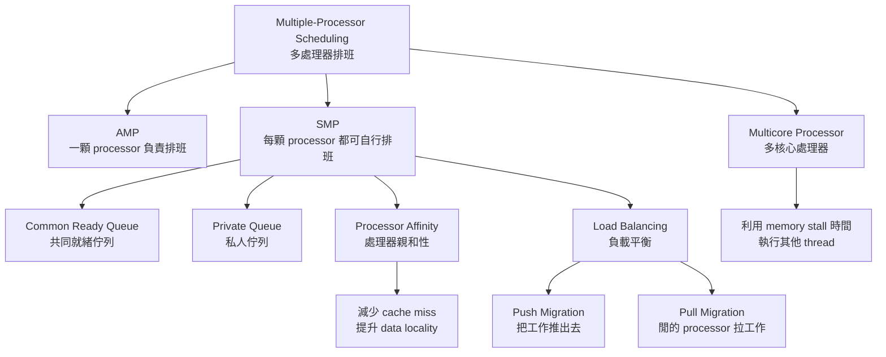

---

### 10. 最短記法

`AMP(非對稱多元處理)`：
**一顆 processor 管排班，其他 processor 只跑 user code。**

`SMP(對稱多元處理)`：
**每顆 processor 都能自己排班。**

`Processor Affinity(處理器親和性)`：
**盡量讓 process 留在同一顆 processor 上，減少 cache miss。**

`Soft Affinity(軟性親和性)`：
**盡量不搬，但必要時可以搬。**

`Hard Affinity(硬性親和性)`：
**指定不能搬到其他 processor。**

`Load Balancing(負載平衡)`：
**讓每顆 processor 工作量平均。**

`Push Migration`：
**系統把工作從忙的 processor 推出去。**

`Pull Migration`：
**閒的 processor 從忙的 processor 拉工作。**

`Multicore Processor(多核心處理器)`：
**排班要考慮 memory stall，讓其他 thread 利用等待時間執行。**


## ⭐Real-Time CPU Scheduling — 即時系統最怕什麼？

講義位置：PDF viewer page 32


### 1. 這個概念在解決什麼問題？

前面的一般排班演算法，例如 `FCFS`、`SJF`、`RR`，常常在意：

* 平均等多久？
* CPU 使用率高不高？
* response time 好不好？

但 `Real-Time CPU Scheduling(即時 CPU 排班)` 的核心問題不太一樣。

它最在意的是：

**某個重要工作能不能在 deadline(期限) 前被執行？**

生活化例子：

如果你在看影片，晚個 0.5 秒可能只是卡一下，還能接受。
但如果是汽車煞車控制、飛機控制、醫療儀器，晚 0.5 秒可能就不能接受。

所以 real-time scheduling 的重點不是「平均表現好不好」，而是：

**能不能準時反應。**

---

### 2. Soft Real-Time System(軟即時系統)

講義 p.32 說：

`Soft real-time systems(軟即時系統)` 不保證關鍵的 real-time process 一定會被排程，只保證它比不關鍵的 process 優先處理。

意思是：

**系統會盡量優先處理重要工作，但不保證一定準時。**

例如：

* 影音播放
* 視訊通話
* 線上遊戲

如果偶爾慢一點，體驗會變差，但通常不是災難。

所以 soft real-time 的關鍵字是：

**priority over non-critical processes, but no strict guarantee.**

---

### 3. Hard Real-Time System(硬即時系統)

講義 p.32 說：

`Hard real-time systems(硬即時系統)` 中，任務一定會在期限前被排程執行。

意思是：

**系統必須保證任務在 deadline 前完成。**

例如：

* 飛機控制系統
* 汽車安全控制
* 醫療生命維持設備
* 工業控制系統

這種情況不是「盡量快」，而是：

**不能錯過 deadline。**

所以 hard real-time 的關鍵字是：

**deadline guarantee.**

---

### 4. Soft vs Hard 的最短差別

| 類型             | 核心意思                      | 錯過 deadline 的後果      |
|------------------|-------------------------------|---------------------------|
| `Soft real-time` | 重要工作優先，但不保證一定準時 | 效能下降、體驗變差         |
| `Hard real-time` | 必須保證 deadline 前完成      | 系統失敗，可能造成嚴重後果 |

最短記法：

**Soft = 優先但不保證。**
**Hard = 必須保證。**

---

### 5. Interrupt Latency(中斷延遲)

講義 p.32 說：

`Interrupt latency(中斷延遲)` 是：

**從 interrupt request(中斷要求) 抵達，到 interrupt service routine / interrupt handler(中斷服務常式／中斷處理程式) 開始執行之間的時間。** 

生活化例子：

你按服務鈴，到店員真的開始處理你這個鈴聲，中間經過的時間就是 interrupt latency。

對 OS 來說：

1. 外部事件發生，例如硬體發出 interrupt。
2. CPU / OS 需要停下目前流程(至少要保存 PC、status register 等必要狀態，之後才能回來繼續跑)，準備處理 interrupt。
3. interrupt handler 開始執行。

從 1 到 3 的時間，就是 interrupt latency。

!!! note
    中斷來了，CPU 不能馬上跳過去嗎？

    不能完全馬上。

    原因通常包含這些：

    | 原因                         | 意思                                                            |
    |------------------------------|-----------------------------------------------------------------|
    | 目前指令要先完成             | CPU 通常不能在一條 machine instruction(機器指令) 的中間隨便切走 |
    | 要保存目前狀態               | 至少要保存 PC、status register 等必要狀態，之後才能回來繼續跑     |
    | 要切到 kernel mode           | 中斷處理屬於 OS / hardware control，要進入 kernel mode           |
    | 要找 interrupt handler       | CPU / OS 要根據 interrupt vector 找到對應的中斷處理程式         |
    | 可能暫時不能中斷             | 某些 critical kernel section 可能暫時 disable interrupt         |
    | 可能正在處理更高優先權的中斷 | 低優先權 interrupt 可能要等高優先權 interrupt 處理完            |

    這些事情加起來，就是 interrupt latency。

---

### 6. Dispatch Latency(分派延遲)

講義 p.32 說：

`Dispatch latency(分派延遲)` 是：

**從把目前正在跑的 process 踢出 processor，到切換成另一個 process 執行所造成的延遲。** 

也就是：

**OS 已經知道該換人了，但真正把 CPU 交給 real-time process 還需要時間。**

這會包含：

* 停止目前 process
* context switch
* dispatcher 把 CPU 交給新 process
* 切到正確位置開始跑

生活化例子：

店員已經知道下一位客人是急件，但他還要先把現在手上的文件收掉、櫃台清空、切換資料，下一位才真的開始被服務。這段就是 dispatch latency。

---

### 7. Conflict Phase of Dispatch Latency

講義 p.32 還特別列出 `conflict phase of dispatch latency`，包含兩件事：

1. 空出在 `kernel mode(核心模式)` 執行的 process。
2. 釋放低優先權 process 所佔有的資源。

這裡的核心問題是：

**高優先權 real-time process 想跑，但可能被目前 kernel mode 裡的工作或低優先權 process 佔住的資源卡住。**


!!! note

    `kernel mode` 是一種執行狀態，不是一種事件

    `kernel mode(核心模式)` 表示 CPU 正在執行 OS kernel 的程式碼，具有較高權限。

    process 進入 kernel mode 的常見原因包含：

    | 進入 kernel mode 的原因       | 例子                                          |
    |-------------------------------|-----------------------------------------------|
    | `System call(系統呼叫)`       | 程式呼叫 `read()`、`write()`、`open()`、`fork()` |
    | `Interrupt(中斷)`             | 鍵盤、網路卡、timer interrupt                   |
    | `Exception / trap(例外／陷入)` | page fault、除以 0、非法指令                    |
    | kernel 內部工作               | OS 正在處理排程、driver、memory management      |

    所以：

    **system call 是進入 kernel mode 的其中一種原因，但 kernel mode 不只來自 system call。**


例如：

低優先權 process 拿著某個 lock 或 resource。
高優先權 real-time process 需要那個 resource 才能跑。
那高優先權 process 就算 priority 高，也可能被卡住。

這就是 real-time scheduling 很在意 latency 的原因。

---

### 8. Main Objective(主要目標)：最小化延遲

講義 p.32 最後寫：

**Main objective: minimize latency(最小化延遲)。** 

因為 real-time 系統重點是準時反應，所以系統要盡量降低：

* `Interrupt latency`
* `Dispatch latency`

如果這兩個 latency 太大，real-time process 就算 priority 很高，也可能太晚開始執行。

---

### 9. 用一條時間線理解

!!! danger
    下面那張圖不錯
    
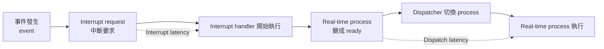

這張圖的重點是：

**real-time process 不只是要 priority 高，還要讓「從事件發生到真正執行」中間的延遲夠小。**

!!! danger
    
    也就是說：
    
    這兩個 latency 會讓 ==事件處理開始變晚== ，以及讓 real-time process 真正拿到 CPU 變晚。所以 real-time 系統要 minimize latency


---

### 10. 最短記法

`Soft real-time system`：

**重要工作優先，但不保證 deadline。**

`Hard real-time system`：

**必須保證 deadline 前完成。**

`Interrupt latency`：

**中斷來了，到中斷處理程式開始執行的時間。**

`Dispatch latency`：

**決定要換 process，到新 process 真正開始跑的時間。**

`Real-time scheduling main objective`：

**minimize latency。**

## ⭐Priority-based Scheduling — 即時系統為什麼需要「優先權＋可搶先」？

講義位置：PDF viewer page 33 ~ 34

### 1. 這個概念在解決什麼問題？

p.32 我們剛學到 real-time system 最怕的是：

**重要事件太晚處理，導致 real-time task 錯過 deadline。**

所以 p.33 接著問：

**如果某個 real-time process 很重要，OS 要怎麼讓它比一般 process 更快拿到 CPU？**

答案就是：

**用 `Priority-based Preemptive Scheduling(基於優先權的可搶先排程)`。**

意思是：

1. real-time process 會被給比較高的 priority。
2. 如果高優先權 real-time process 變成 ready，它可以搶先目前低優先權 process。
3. 這樣可以縮短 real-time process 等 CPU 的時間。

---

### 2. 為什麼一定要「可搶先」？

假設低優先權 process 正在 CPU 上執行，突然一個高優先權 real-time process 變成 ready。

如果系統是 `nonpreemptive(不可搶先)`：

**高優先權 real-time process 必須等低優先權 process 自己放掉 CPU。**

這樣可能太晚，甚至錯過 deadline。

如果系統是 `preemptive(可搶先)`：

**高優先權 real-time process 可以把低優先權 process 趕下 CPU，自己先執行。**

所以 real-time scheduling 需要 preemptive，是因為：

**deadline 不會等你慢慢排隊。**

---

### 3. Soft Real-Time OS 怎麼做？

講義 p.33 說，`Linux`、`Windows`、`Solaris` 提供 `Soft real-time(軟即時)`，這些 OS 會給 real-time process 最高的 scheduling priority。Windows 例如有 32 種 priority levels，其中 16~31 保留給高優先權 process。

這裡要注意：

**給最高 priority 不等於保證 deadline。**

這就是 soft real-time 的特色：

| 系統類型         | 做法                             | 是否保證 deadline |
|------------------|----------------------------------|-------------------|
| `Soft real-time` | 給 real-time process 高 priority | 不保證            |
| `Hard real-time` | 必須保證 task 在 deadline 前完成 | 保證              |

所以 p.33 的重點是：

**一般 OS 可以提高 real-time process 的 priority，讓它比較快被排程，但這通常仍屬於 soft real-time，不是 hard guarantee。**

---

### 4. Hard Real-Time 為什麼更嚴格？

講義 p.34 說：

**`Hard real-time system(硬即時系統)` 必須保證期限前完成工作。** 

這代表 hard real-time 不是只說：

「我會盡量讓你先跑。」

而是要能說：

「我保證你在 deadline 前完成。」

因此 hard real-time 會需要更精確的分析，例如：

* task 多久來一次？
* 每次需要多少 CPU time？
* deadline 是什麼時候？
* CPU utilization 是否足夠？
* 優先權怎麼設定才不會錯過 deadline？

這些會接到 p.35 的 `Rate-Monotonic Scheduling` 和 p.37 的 `EDF`。

---

### 5. Periodic Task(週期性任務)

p.34 開始定義 real-time scheduling 很常見的任務形式：

**`Periodic task(週期性任務)`：固定週期性地需要 CPU。**

生活例子：

汽車控制系統可能每 10 ms 讀一次感測器、計算一次煞車控制。
這種任務不是只來一次，而是：

**每隔固定時間就要來一次。**

講義 p.34 定義 periodic task 有三個參數：`processing time t`、`deadline d`、`period p`，且 `0 ≤ t ≤ d ≤ p`。

---

### 6. t、d、p 是什麼？

| 符號 | 英文              | 中文     | 意思                                |
|------|-------------------|----------|-------------------------------------|
| `t`  | `processing time` | 處理時間 | 這個 task 每次執行需要多少 CPU time |
| `d`  | `deadline`        | 期限     | 這次 task 最晚要在什麼時間前完成    |
| `p`  | `period`          | 週期     | 每隔多久這個 task 會再次出現        |

例如：

某個感測器 task：

* `p = 50 ms`：每 50 ms 來一次。
* `t = 20 ms`：每次需要 20 ms CPU time。
* `d = 50 ms`：每次必須在下一次週期前完成。

那就代表：

**這個 task 每 50 ms 出現一次，每次要花 20 ms 處理，而且 deadline 是 50 ms 內。**

---

### 7. 為什麼 `0 ≤ t ≤ d ≤ p`？

這個不等式很重要。

`0 ≤ t`：
處理時間不能是負的。

`t ≤ d`：
任務需要的 CPU time 不能比 deadline 還長。
如果 `t > d`，代表它需要 20 ms 才能做完，但 deadline 只有 10 ms，單獨一個 task 就不可能準時完成。

`d ≤ p`：
deadline 通常不能比下一次週期還晚。
因為週期性任務會一直來，如果這次還沒完成，下一次又來了，系統會越堆越亂。

所以：

**t 是工作量，d 是期限，p 是多久來一次。**

---

### 8. Rate of Periodic Task 是什麼？

講義 p.34 說：

**`Rate of periodic task = 1/p`。** 

`Rate(速率)` 的意思是：

**這個 task 出現得多頻繁。**

如果 `p` 越小，代表越常出現，所以 rate 越高。

例如：

| period p | rate 1/p | 直覺       |
|----------|----------|------------|
| 10 ms    | 1/10     | 很常來     |
| 100 ms   | 1/100    | 比較不常來 |

所以：

**period 越短，rate 越高。**

這會接到下一頁 `Rate-Monotonic Scheduling`：
週期越短的 task，通常會被給更高 priority。

但這是 p.35 的內容，本則先不正式展開。

---

### 9. 最短記法

`Priority-based Preemptive Scheduling`：

**real-time process 給高 priority，而且高 priority 可以搶先低 priority。**

`Soft real-time`：

**給 real-time process 最高 priority，但不保證 deadline。**

`Hard real-time`：

**必須保證 deadline 前完成。**

`Periodic task`：

**固定週期性需要 CPU 的任務。**

`t`：

**每次需要多少 CPU time。**

`d`：

**最晚什麼時候要完成。**

`p`：

**每隔多久來一次。**

`rate = 1/p`：

**period 越短，task 出現越頻繁，rate 越高。**


### 錯題(hard real-time)：

Q:
Explain why giving a real-time process the highest scheduling priority does not necessarily mean that the system is hard real-time.
[Generated: 依據 PDF viewer page 33 ~ 34]

ANS:
給 real-time process 最高 priority 不代表系統就是 hard real-time。因為最高 priority 只表示該 process 會比其他 process 優先被排程，甚至可以搶先低優先權 process，但不保證一定能在 deadline 前完成。Soft real-time OS 可能給 real-time process 最高 priority，但 hard real-time system 必須保證 deadline 前完成。


## ⭐Rate-Monotonic Scheduling — 週期越短，為什麼優先權越高？

講義位置：PDF viewer page 35 ~ 36

### 1. 這個概念在解決什麼問題？

前面 p.34 我們學到 `Periodic Task(週期性任務)` 有三個參數：

| 符號 | 意思                           |
|------|--------------------------------|
| `t`  | 每次需要的 CPU processing time |
| `d`  | deadline                       |
| `p`  | period，也就是多久來一次        |

現在 p.35 的問題是：

**如果有多個 periodic tasks，誰的 priority 應該比較高？**

`Rate-Monotonic Scheduling(RM，速率單調排程)` 的答案是：

**period 越短，priority 越高。**

因為 period 越短，代表這個 task 越常出現，也通常越需要快速反應。

---

### 2. Rate-Monotonic 的核心規則

講義 p.35 說，RM 的 priority 是根據 period 的倒數決定，也就是根據 `rate = 1/p` 決定。`Shorter periods = higher priority`，`Longer periods = lower priority`。

所以：

| period `p` | rate `1/p` | priority |
|-----------:|-----------:|----------|
|         小 |         大 | 高       |
|         大 |         小 | 低       |

最短記法：

**p 越小 → rate 越大 → priority 越高。**

---

### 3. 為什麼叫 Rate-Monotonic？

!!! danger

    `Rate(速率)` 是 `1/p`，代表 task 出現頻率。

    `Monotonic(單調)` 的意思是：

    **priority 會隨著 rate 單調變化。**

    更白話：

    **rate 越高，priority 就越高。**

所以 `Rate-Monotonic Scheduling` 不是「看 deadline 誰早」，而是：

**看 period 誰短，也就是看 rate 誰高。**

這點很重要，因為下一頁的 `EDF(Earliest Deadline First)` 才是看 deadline。

---

### 4. p.35 成功範例

講義 p.35 的例子是：

| Task | Period `p` | Processing time `t` |
|------|-----------:|--------------------:|
| `P1` |         50 |                  20 |
| `P2` |        100 |                  35 |

因為：

* `P1` 的 period = 50
* `P2` 的 period = 100

所以：

**P1 period 比較短，因此 P1 priority 比 P2 高。**

講義也算 CPU utilization：

`CPU utilization = 20/50 + 35/100 = 0.75`。

意思是：

* P1 每 50 單位時間需要 20 單位 CPU
* P2 每 100 單位時間需要 35 單位 CPU
* 總需求是 0.75 顆 CPU

因為 0.75 < 1，所以從總 CPU 工作量來看，CPU 理論上有足夠時間。


!!! danger

    CPU utilization 計算方式：
    
    共同時間軸：

    time:  0                    50                   100
        |--------------------|--------------------|

    P1 release:
        R                    R                    R
        每 50 單位時間來一次，每次需要 t=20 CPU time

    P2 release:
        R                                         R
        每 100 單位時間來一次，每次需要 t=35 CPU time
        
        
    因為 100 是 50 和 100 的共同週期，也就是 `LCM(50,100)=100`。

    在 `0 ~ 100` 內，pattern 會完整重複一次：

    | Task | Period `p` | 每次 CPU time `t` | `0 ~ 100` 出現幾次 | CPU 需求 |
    |------|------------|-------------------|--------------------|----------|
    | P1   | 50         | 20                | 2 次               | 40       |
    | P2   | 100        | 35                | 1 次               | 35       |

    所以：

    `CPU utilization = (40 + 35) / 100 = 75/100 = 0.75`

    這等價於：

    `20/50 + 35/100 = 0.4 + 0.35 = 0.75`


    ==也就是說 t / p 是在算單位時間內會有多少時間執行，並且是算重複的。==
    假設 0.5 秒的週期會執行 0.2 秒，也就是說 1 秒會執行 0.4 秒，這樣就重複兩次了。

---

### 5. 用時間線看 p.35

假設 P1、P2 都從 t=0 開始 release，RM 會讓 P1 優先。

```mermaid
gantt
    title Rate-Monotonic Scheduling Example
    dateFormat  X
    axisFormat %s
    section CPU
    P1 :0, 20
    P2 :20, 50
    P1 :50, 70
    P2 :70, 75
    Idle :75, 100
```

這張圖的直覺是：

1. t=0，P1 和 P2 都 ready，但 P1 period 較短，所以 P1 先跑。
2. P1 跑完後，P2 跑。
3. t=50，P1 下一次又來了，因為 P1 priority 高，所以搶先 P2。
4. P2 之後補完剩下的時間。
5. 兩者都可以在自己的 deadline 前完成。

---

### 6. p.36：為什麼 utilization < 1 還可能 miss deadline？

這是這頁最重要的陷阱。

講義 p.36 的例子是：

| Task | Period `p` | Processing time `t` |
|------|-----------:|--------------------:|
| `P1` |         50 |                  25 |
| `P2` |         80 |                  35 |

CPU utilization：

`25/50 + 35/80 = 0.94`

雖然 0.94 < 1，但講義說：

**P2 cannot meet its deadline.** 


這代表：

**CPU 總工作量小於 1，不代表 RM 一定能排得出來。**

原因是 RM 固定讓 period 短的 P1 priority 較高。
所以 P2 可能一直被 P1 插隊，導致 P2 雖然總工作量看起來不超過 CPU，但仍然太晚完成。


!!! note

    這就是 priority-based preemptive scheduling(基於優先權的可搶先排程) 本身不保證 hard real-time(硬即時) 的實例，如[錯題hard-real-time](#錯題hard-real-time)。

---

### 7. 用 p.36 時間線看 P2 怎麼 miss deadline

因為：

* `P1 period = 50`，所以 P1 priority 高。
* `P2 period = 80`，所以 P2 priority 低。

排程大概會變成：

```mermaid
gantt
    title Missing Deadline with Rate-Monotonic Scheduling
    dateFormat  X
    axisFormat %s
    section CPU
    P1 :0, 25
    P2 :25, 50
    P1 :50, 75
    P2 :75, 85
```

P2 第一次 release 在 t=0，deadline 在 t=80。
P2 需要 35 單位 CPU time。

但它只在：

* t=25 到 t=50 跑了 25 單位
* t=75 到 t=85 又跑 10 單位

所以 P2 完成時間是 t=85。

可是 P2 的 deadline 是 t=80。

因此：

**P2 miss deadline。**

---

### 8. 這個例子要學到什麼？

不要只看：

**CPU utilization < 1**

你還要看：

1. priority 規則怎麼排。
2. 高 priority task 會不會一直插隊。
3. 低 priority task 是否能在自己的 deadline 前累積足夠 CPU time。

所以 p.36 的核心教訓是：

**總 CPU 時間夠，不代表在 deadline 前的時間排列也夠。**

生活化例子：

你一天有 10 小時可以讀書，三科總共只需要 9.4 小時，看起來夠。
但如果某科小考一直插進來，導致另一科報告在截止前排不到足夠時間，那還是會遲交。

---

### 9. RM vs 前面 Priority-based 的關係

`Priority-based preemptive scheduling` 是大原則：

**priority 高的可以搶先 priority 低的。**

`Rate-Monotonic Scheduling` 是一種具體規則：

**用 period 決定 priority。period 越短，priority 越高。**

所以關係是：

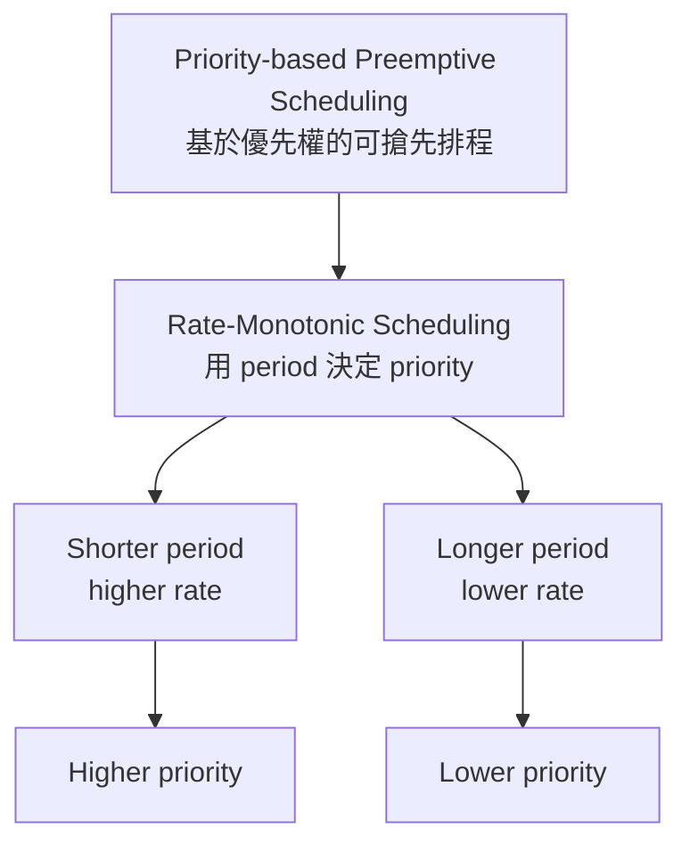

---

### 10. 最短記法

`Rate-Monotonic Scheduling(RM)`：

**period 越短，rate 越高，priority 越高。**

`RM` 的判斷順序：

1. 看每個 task 的 period `p`。
2. `p` 較小者 priority 較高。
3. 高 priority task 可以搶先低 priority task。
4. 檢查每個 task 是否在 deadline 前完成。

最重要陷阱：

**CPU utilization < 1 不保證 RM 一定不會 miss deadline。**


## ⭐Earliest Deadline First Scheduling — 為什麼 deadline 越早，priority 越高？

講義位置：PDF viewer page 37

### 1. 這個概念在解決什麼問題？

前面 `Rate-Monotonic Scheduling(RM)` 是用 **period 長短** 來決定 priority：

**period 越短 → rate 越高 → priority 越高**

但 RM 的問題是：
它固定讓 period 短的 task 優先，所以即使 CPU utilization < 1，低 priority task 還是可能 miss deadline。

所以 p.37 接著介紹另一種方法：

**不要固定看 period，而是動態看誰的 deadline 最早。**

這就是：

`Earliest Deadline First Scheduling(EDF，最早期限優先排程)`

講義 p.37 說，EDF 是根據 deadline 先後訂定 priority；期限越早，priority 越高；期限越晚，priority 越低。

---

### 2. EDF 的核心規則

EDF 的規則非常直覺：

**誰最急，誰先跑。**

也就是：

| 條件          | priority |
|---------------|----------|
| deadline 最早 | 最高     |
| deadline 較晚 | 較低     |

所以 EDF 的 priority 不是固定的。

同一個 task 在不同時間 release 出不同 job 時，priority 可能會變。

---

### 3. RM 和 EDF 最大差別

| 排程法 | priority 根據什麼決定 | priority 是否固定 |
|--------|-----------------------|-------------------|
| `RM`   | period / rate         | 通常固定          |
| `EDF`  | absolute deadline     | 動態改變          |

`RM` 看的是：

**這個 task 多常來一次。**

`EDF` 看的是：

**現在 ready 的 jobs 裡，誰最接近 deadline。**

所以 EDF 更像現實生活中的「趕死線」：

你不一定永遠先做每週作業。
如果明天有報告要交，就算它不是最常出現的任務，你也會先做報告。

---

### 4. 套講義 p.37 的例子

講義 p.37 用的資料是：

| Task | period | processing time |
|------|-------:|----------------:|
| P1   |     50 |              25 |
| P2   |     80 |              35 |

這組資料跟 p.36 RM miss deadline 的例子一樣。差別是：

* p.36 用 RM，所以 P1 因為 period 比較短，永遠 priority 高。
* p.37 用 EDF，所以每次都看「目前哪個 job 的 deadline 較早」。

講義 p.37 特別列出：

* `@50`，P2 繼續執行，因為 P2 的 deadline 是 80，P1 的 deadline 是 100。
* `@80`，P1 繼續執行，因為 P1 的 deadline 是 100，P2 的 deadline 是 160。
* `@100`，P1 取代 P2，因為 P1 的 deadline 是 150，P2 的 deadline 是 160。


---

### 5. 用時間線看 EDF 怎麼排

先假設每個 task 的 deadline = period。

在 t = 0：

* P1 第一次 job deadline = 50
* P2 第一次 job deadline = 80

所以 P1 先跑。

```text
0        25        50        60        80 85      100       125      145
|   P1   |    P2    |   P2   |    P1    |P1|  P2   |   P1   |   P2   |
```

更清楚地拆開：

|      時間 | 執行       | 原因                                             |
|----------:|------------|--------------------------------------------------|
|    0 ~ 25 | P1         | P1 deadline = 50，比 P2 deadline = 80 早          |
|   25 ~ 50 | P2         | P1 做完，P2 開始跑                                |
|    t = 50 | P2 繼續    | P2 deadline = 80，比新來的 P1 deadline = 100 早   |
|   50 ~ 60 | P2         | P2 跑完第一次 job                                |
|   60 ~ 80 | P1         | P1 第二次 job deadline = 100                     |
|    t = 80 | P1 繼續    | P1 deadline = 100，比新來的 P2 deadline = 160 早  |
|   80 ~ 85 | P1         | P1 第二次 job 跑完                               |
|  85 ~ 100 | P2         | P2 第二次 job 開始跑                             |
|   t = 100 | P1 搶先 P2 | 新來的 P1 deadline = 150，比 P2 deadline = 160 早 |
| 100 ~ 125 | P1         | P1 第三次 job 跑完                               |
| 125 ~ 145 | P2         | P2 第二次 job 跑完                               |

重點是：

**EDF 不是看 P1 period 比較短就永遠讓 P1 插隊。**
它每次都重新比較 deadline。

---

### 6. 為什麼 p.36 RM 會 miss，但 p.37 EDF 可以改善？

p.36 的 RM 是這樣：

```text
0        25       50       75        85
|   P1   |   P2   |   P1   |   P2   |
                              ↑
                         P2 deadline = 80
                         P2 尚未完成
```

RM 在 t = 50 時讓 P1 搶先，因為 P1 period 短，所以 P1 priority 固定比較高。結果 P2 deadline = 80，但 P2 到 85 才完成。

EDF 在 t = 50 時不會讓 P1 搶先 P2，因為：

* P2 目前 deadline = 80
* 新來的 P1 deadline = 100

所以 EDF 會說：

**P2 比較急，P2 繼續跑。**

這就是 EDF 的核心精神：

**不是誰本來 priority 高誰先跑，而是誰 deadline 最近誰先跑。**

---

### 7. 最短記法

`EDF(Earliest Deadline First)`：

**deadline 越早，priority 越高。**

`RM`：

**period 越短，priority 越高。**

差別：

**RM 看週期，EDF 看期限。**

考試最常寫：

`EDF assigns priorities according to deadlines. The task with the earliest deadline has the highest priority.`


## ⭐Algorithm Evaluation — 排班演算法到底要怎麼比較？

講義位置：PDF viewer page 38 ~ 40

### 1. 這個概念在解決什麼問題？

前面我們學了很多 scheduling algorithms(排班演算法)：

FCFS、SJF、Priority、RR、Multilevel Queue、Multilevel Feedback Queue、RM、EDF。

但接下來會遇到一個問題：

**哪一個演算法比較好？**

不能只說「SJF 好」或「RR 好」，因為「好」要看你在乎什麼：

| 你在乎的目標   | 可能適合的方向                     |
|----------------|------------------------------------|
| 平均等待時間短 | SJF 常常很好                       |
| 互動反應快     | RR 常常比較適合                    |
| 即時 deadline  | RM / EDF 這類 real-time scheduling |
| 公平性         | RR 或 aging-based priority         |

所以 `5.7 Algorithm Evaluation(演算法的評估)` 是在處理：

**如何用比較正式的方法評估 scheduling algorithm 的效能。**

講義 p.38 先介紹 `5.7.1 Deterministic Modeling(定量模式)`，p.40 接著介紹 `5.7.2 Queueing Model(佇列模式)` 和 `Little’s Formula`。 

---

### 2. Deterministic Modeling(定量模式)：拿一組固定工作量來比較

講義說，`deterministic modeling` 是取一個「特殊預定的工作量」，然後針對那一組 workload(工作量) 比較每種演算法的效能。

白話說：

**給你一組固定 process，然後叫你用 FCFS、SJF、RR、Priority 各排一次，再比較 average waiting time、turnaround time 等。**

也就是我們前面一直做的這種題目：

```text
Process   Burst Time   Priority
P1        2            2
P2        1            1
P3        8            4
P4        4            2
P5        5            3
```

然後題目問：

* 畫 Gantt chart
* 算 waiting time
* 算 turnaround time
* 比較哪個 average waiting time 最小

這種就是很典型的 `deterministic modeling`。

---

### 3. Deterministic Modeling 的優點與限制

`Deterministic Modeling(定量模式)` 的優點是：

**很具體，很適合考試。**

因為資料都給定了：

* arrival time
* burst time
* priority
* quantum
* scheduling rule

所以答案通常可以一步一步算出來。

但它的限制是：

**它只代表那一組 workload，不一定代表真實系統每天的情況。**

生活化例子：

如果你只拿「今天早上 9 點便利商店的客人」來比較兩種排隊方式，可能很精準，但它不一定代表晚上、假日、下雨天的人流。

所以 deterministic modeling 很適合：

**小範例、考試題、演算法規則比較。**

但不一定能完整代表真實系統。

---

### 4. Queueing Model(佇列模式)：不固定某一組 process，而是看平均行為

講義 p.40 說，很多系統每天執行的行程都不一樣，因此沒有固定的一組 process 和時間可以用 deterministic modeling；但可以定出 CPU burst 和 I/O burst 的分佈情形。這就進入 `Queueing Model(佇列模式)`。

也就是說：

`Deterministic Modeling` 問的是：

**這一組 process 怎麼排比較好？**

`Queueing Model` 問的是：

**長期平均來看，queue 裡大概會有幾個 process？平均等多久？到達率是多少？**

---

### 5. Little’s Formula 是什麼？

講義 p.40 給三個符號：

| 符號 | 意思                                              |
|------|---------------------------------------------------|
| `n`  | average queue length(平均佇列長度)                |
| `W`  | average waiting time in queue(平均在佇列等待時間) |
| `λ`  | average arrival rate into queue(平均到達率)       |

!!! danger

    λ = 平均 process 到達 queue 的速率。
    
    也就是
    
    每單位時間有多少 process 進入 queue。

然後給出 `Little’s Law`：

!!! danger

    `n = λ × W`

    意思是：

    **平均排隊人數 = 每秒進來幾個 × 每個平均等多久**

講義也說，在 steady state(穩定狀態) 下，離開 queue 的 process 數量會等於進入 queue 的 process 數量，因此有 `n = λ × W`，而且它對任何 scheduling algorithm 和 arrival distribution 都有效。

---

### 6. 為什麼 `n = λ × W` 很合理？

用生活例子想：

假設一家飲料店：

* 平均每分鐘來 3 個客人，也就是 `λ = 3 customers/min`
* 每個客人平均排隊 4 分鐘，也就是 `W = 4 min`

那平均隊伍裡會有幾個人？

就是：

`n = λ × W = 3 × 4 = 12`

直覺是：

**如果客人來得很快，而且每個人又等很久，那隊伍一定會很長。**

反過來：

如果你看到隊伍平均有 12 人，而且每分鐘來 3 人，那平均等待時間就是：

`W = n / λ = 12 / 3 = 4 min`

---

### 7. 套講義 p.40 的例子

!!! danger

    講義例子是：

    * 平均每秒有 7 個 process arrive
    * queue 裡平均有 14 個 process

    所以：

    `λ = 7 processes/second`
    `n = 14 processes`

    由 `n = λ × W`：

    `W = n / λ = 14 / 7 = 2 seconds`

    所以：

    **每個 process 平均在 queue 裡等 2 秒。**

這正是講義 p.40 的例子。

---

### 8. Deterministic Modeling vs Queueing Model

| 比較點   | Deterministic Modeling(定量模式)         | Queueing Model(佇列模式)                       |
|----------|------------------------------------------|------------------------------------------------|
| 核心想法 | 固定一組 process 來算                    | 用平均到達率、平均等待時間、平均佇列長度描述系統 |
| 常見輸出 | Gantt chart、waiting time、turnaround time | `n = λW`、平均等待時間                          |
| 適合情境 | 考試計算題、小型範例                      | 真實系統長期平均分析                           |
| 缺點     | 只代表特定 workload                      | 較抽象，不一定給出每個 process 的具體順序       |

最重要的差別是：

**Deterministic Modeling 是「給定一組 process，直接排一次」。**
**Queueing Model 是「不固定某一組 process，而是看長期平均」。**


!!! danger

    Deterministic Modeling(定量模式) 是用同一組固定 workload，套用不同 scheduling algorithms 來比較效能。Queueing Model(佇列模式) 則不是固定一組 process 來排一次，而是用平均到達率、平均等待時間、平均 queue 長度等統計量，分析系統的長期平均行為。

---

### 9. 關係圖

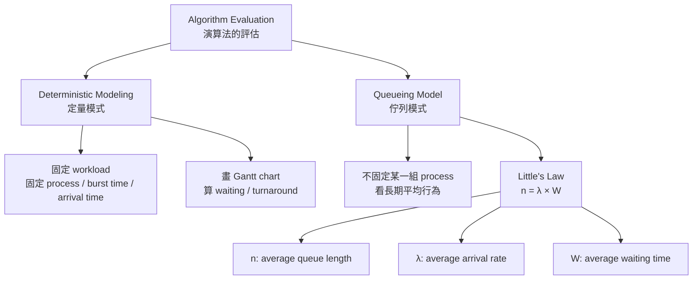

---

### 10. 最短記法

`Deterministic Modeling(定量模式)`：

**給一組固定 process，實際排一次，算效能。**

`Queueing Model(佇列模式)`：

**不固定某一組 process，而是用平均值描述 queue。**

`Little’s Law`：

**n = λ × W**

也就是：

**平均排隊數量 = 平均到達率 × 平均等待時間**


### workload 是啥

`Workload(工作負載)` 就是：

**丟給系統處理的一整組工作。**

在 CPU scheduling(中央處理器排班) 裡，`workload` 通常指：

**一組 processes，以及它們的相關條件。**


### 為何 Little’s Law 叫做 Little’s Law

`Little’s Law` 叫這個名字，不是因為它「很 little(小)」，而是因為它是由 **John D. C. Little** 證明並推廣成排隊理論中的重要定律，所以用他的姓氏 `Little` 命名。這類名稱叫做 `eponymous law(人名命名定律)`，就像 `Amdahl’s Law` 是用 Amdahl 命名、`Gustafson’s Law` 是用 Gustafson 命名。John Little 在 1961 年發表了 `A Proof for the Queuing Formula: L = λW`，也就是這個公式的證明。


### 錯題

!!! danger

    Q:
    Explain how average turnaround time and maximum waiting time can conflict in CPU scheduling.

    ANS:
    如果一個排程演算法想讓 average turnaround time(平均回復時間) 變小，它可能會優先處理短工作，讓很多短 process 很快完成。可是這樣可能讓某些長 process 一直等待，導致 maximum waiting time(最大等待時間) 變大。因此，降低平均 turnaround time 可能和降低最大 waiting time 發生衝突。
    
    
    
