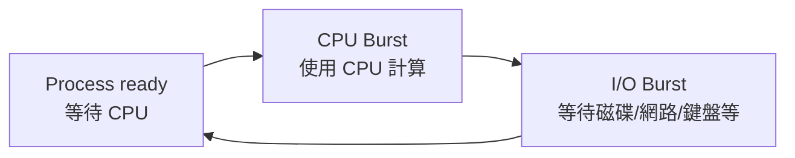
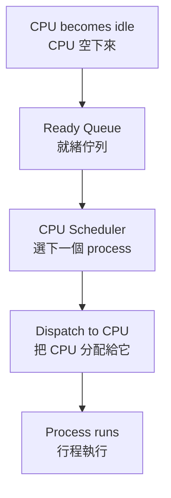
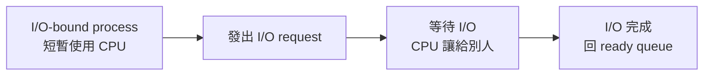
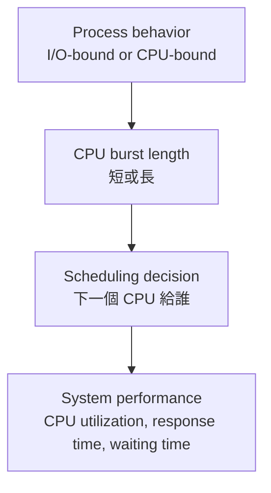
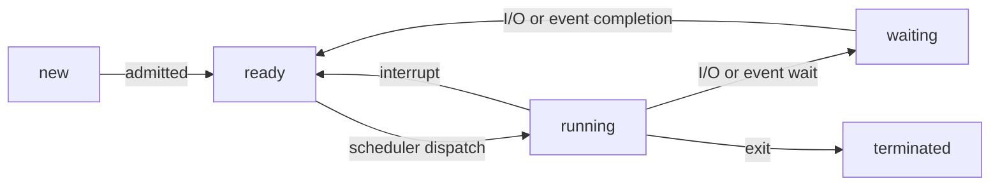
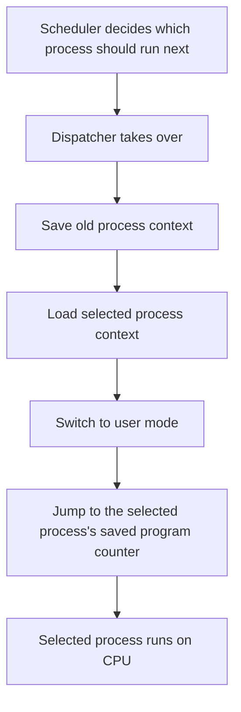

## ⭐CPU Scheduling — 為什麼作業系統需要替 CPU 決定下一個跑誰？

講義位置：PDF viewer page 1 ~ PDF viewer page 6／輔助：投影片 1 ~ 6

### 1. 這章真正處理的問題：CPU 不能空著，也不能同時跑所有 process

在單一處理器系統裡，同一瞬間只能有一個 Process(行程) 真正在 CPU 上 Running(執行)。如果有很多 process 都準備好了，它們不能全部同時跑，只能排隊等 CPU。講義的基本觀念是：Multiprogramming(多元程式規劃) 的目標，是盡量讓 CPU 一直有 process 可以執行，提高 CPU Utilization(CPU 使用率)。

生活化例子：
CPU 像一個只有一個窗口的便當店老闆。很多客人都準備點餐，但老闆一次只能服務一人。Scheduling(排班) 就是在決定：「下一個輪到誰？」

---

### 2. 為什麼 process 不是一直用 CPU？因為會在 CPU Burst 和 I/O Burst 之間交替

一個 process 的執行不是「從頭到尾都佔著 CPU」。它通常會在兩種時間段之間來回：

* CPU Burst(CPU 分割)：process 正在用 CPU 做計算
* I/O Burst(I/O 分割)：process 等待磁碟、鍵盤、網路、檔案、螢幕等 I/O


!!! danger "PEICD"
    
    Burst ： 爆裂
    
    Burst 之所以叫 **burst**，是因為它強調「一小段集中發生的活動」。

    在英文裡，**burst** 常有「突然出現、集中一陣子、然後停止或切換」的意思，例如：

    - a burst of rain：突然下一陣雨
        
    - a burst of activity：一小段密集活動
        
    - a burst of energy：突然一陣能量
        

    放到作業系統裡，**CPU Burst** 不是指 CPU 爆炸，也不是一定很快，而是指：

    > Process 連續使用 CPU 的那一段時間。

講義說明：行程執行由一個 CPU Burst 開始，接著是 I/O Burst，然後再回到 CPU Burst，再接 I/O Burst，如此交替。



重點不是背名詞，而是理解：
當某個 process 進入 I/O waiting 時，CPU 如果繼續等它，就浪費了。所以 OS 會把 CPU 分給另一個 ready process。

---

### 3. I/O-bound 和 CPU-bound 的直覺差異

這裡講義用 CPU Burst duration(CPU 分割時間長度) 的分佈來暗示一件事：大部分 process 的 CPU burst 很短，尤其 I/O-bound process 很常出現短 CPU burst。


!!! danger "PEICD"
    
    **bound** 在這裡不是「綁定」的意思，而是比較接近：

    > **受限於、卡在、瓶頸在……**

    所以：

    - **I/O-bound Process(I/O 密集行程)**：這個 process 的速度主要被 I/O 限制住。
        
    - **CPU-bound Process(CPU 密集行程)**：這個 process 的速度主要被 CPU 計算能力限制住。


我們先建立兩種 process 的直覺：

| 類型                          | 主要特徵                | 生活化例子          | 對 scheduling 的意義         |
| --------------------------- | ------------------- | -------------- | ------------------------ |
| I/O-bound Process(I/O 密集行程) | 常常等 I/O，CPU burst 短 | 一直問店員「資料到了沒」的人 | 需要快速回應，常影響 response time |
| CPU-bound Process(CPU 密集行程) | 長時間計算，CPU burst 長   | 坐下來做一大堆計算題的人   | 容易長時間佔 CPU               |

期中考古也直接問過 I/O-bound process 和 CPU-bound process 的差異，所以這個概念不只是背景，而是考試可輸出點。

---

### 4. CPU Scheduler 的核心任務：從 Ready Queue 選一個 process

當 CPU Idle(閒置) 時，OS 必須從 Ready Queue(就緒佇列) 中選出一個 process 來執行。這件事由 Short-term Scheduler(短程排班程式)，也就是 CPU Scheduler(CPU 排班程式) 負責。講義明確說：scheduler 會從記憶體中準備要執行的數個行程中選一個，並將 CPU 配置給它。

可以把流程想成：



所以 CPU scheduling 的第一個核心問題是：

> Ready Queue 裡有很多 process 時，OS 要根據什麼規則選下一個？

這也是後面 FCFS、SJF、Priority、Round Robin 全部在回答的問題。

---

### 5. 本輪最短記法

CPU Scheduling(處理器排班)：
當 CPU 空下來時，OS 從 Ready Queue 中選一個 process 來執行，目標是讓 CPU 不閒置，同時兼顧不同效能指標。

CPU-I/O Burst Cycle(CPU-I/O 分割週期)：
Process 通常在 CPU Burst 和 I/O Burst 之間交替；I/O-bound 通常 CPU burst 短，CPU-bound 通常 CPU burst 長。

Short-term Scheduler(短程排班程式)：
負責在 Ready Queue 中選出下一個要使用 CPU 的 process。

---

### 6. 常見錯法

錯法 1：以為 process 一開始跑就會一路用 CPU 到結束。
修正：process 常常會等待 I/O；等待期間 CPU 可以拿去跑別的 process。

錯法 2：把 CPU Scheduler 和 Long-term Scheduler 混在一起。
修正：CPU Scheduler / Short-term Scheduler 是高頻率地從 Ready Queue 選下一個跑 CPU 的 process；Long-term Scheduler 是控制哪些 process 被帶入 ready queue，頻率較低。這點期中考古也出現過。

錯法 3：以為 scheduling 只是在追求 CPU utilization。
修正：CPU utilization 很重要，但後面還會同時考慮 response time、waiting time、turnaround time、throughput 等標準；這會在 PDF viewer page 10 ~ 11 正式處理。


### 所以 CPU bound process 和 IO bound process 是兩種不同的 process 嗎?

不是「兩種完全不同的 process 種族」，而是 **同一種 Process(行程) 依照它的 workload behavior(工作負載行為) 分成兩種傾向**。

**重點：I/O-bound 和 CPU-bound 是分類標籤，不是 process 的固定身分。**

---

#### 1. 正確理解

一個 process 可以被描述成：

| 分類                          | 代表它大部分時間花在哪裡 | CPU Burst 特徵     |
| --------------------------- | ------------ | ---------------- |
| I/O-bound Process(I/O 密集行程) | 等 I/O 比計算多   | 很多短 CPU Burst    |
| CPU-bound Process(CPU 密集行程) | 計算比等 I/O 多   | 較少但很長的 CPU Burst |

講義 Chapter 6 說，process 會在 CPU Burst(CPU 分割) 和 I/O Burst(I/O 分割) 之間交替，而且 I/O-bound 程式特別多短 CPU Burst。 Chapter 3 也補充：I/O-bound process 花比較多時間做 I/O、很多短 CPU burst；CPU-bound process 花比較多時間做 computation、少數很長 CPU burst。

---

#### 2. 它不是永遠固定的

同一個程式在不同階段可能改變傾向。

例如影片剪輯軟體：

1. 讀取大型影片檔：偏 I/O-bound，因為在等硬碟或 SSD 讀資料。
2. 套濾鏡、轉碼、壓縮：偏 CPU-bound，因為一直在算。
3. 輸出檔案：又可能偏 I/O-bound，因為要寫入磁碟。

所以不能說「這個 process 天生就是 I/O-bound」或「天生就是 CPU-bound」。更精確是：

> 在某段執行期間，這個 process 的主要瓶頸偏向 I/O 或 CPU。

---

#### 3. 為什麼 OS 要分這兩類？

因為 scheduling(排班) 會受影響。

I/O-bound process 通常算一下就去等 I/O。如果 OS 很快讓它跑，它很快又會把 CPU 讓出來，然後去等 I/O，這樣可以讓 I/O 裝置也忙起來。

CPU-bound process 則可能一拿到 CPU 就跑很久，如果沒有適當排班，可能讓互動式或 I/O-bound process 等太久。

**考試寫法：**

```text
I/O-bound and CPU-bound processes are not different kinds of processes by nature. They are classifications based on how a process spends most of its time. An I/O-bound process spends more time waiting for or performing I/O and usually has many short CPU bursts, while a CPU-bound process spends more time doing computation and usually has fewer but longer CPU bursts.
```

### 所以這兩種 process 和 scheduling 到底有什麼關係?

它們跟 Scheduling(排班) 的關係是：**Scheduling 要決定「下一個 CPU 給誰」，而 I/O-bound / CPU-bound 會影響這個決定的好壞。**

**重點：I/O-bound 和 CPU-bound 不是為了分類好看，而是用來預測 process 會怎麼使用 CPU，進而影響排班策略。**

---

#### 1. CPU Scheduler 在做什麼？

CPU Scheduler(CPU 排班程式) 的任務是：

> 當 CPU 空下來時，從 Ready Queue(就緒佇列) 選一個 process 來執行。

講義說 CPU 閒置時，OS 必須從 ready queue 中選出一個行程，由 short-term scheduler / CPU scheduler 負責，並將 CPU 配置給它。

所以問題變成：

> Ready Queue 裡同時有 I/O-bound 和 CPU-bound process 時，要先給誰？

---

#### 2. 如果排班排得不好，會發生什麼？

假設 Ready Queue 裡有：

| Process | 類型        | 行為                   |
| ------- | --------- | -------------------- |
| P1      | CPU-bound | 會連續算很久               |
| P2      | I/O-bound | 只需要 CPU 算一下，就會去等 I/O |
| P3      | I/O-bound | 只需要 CPU 算一下，就會去等 I/O |

如果排班讓 P1 先跑很久，P2、P3 就卡在 ready queue，結果是：

1. P2、P3 明明只需要一點 CPU 就能去啟動 I/O，卻一直等不到。
2. I/O 裝置可能閒著，因為 I/O-bound process 還沒被 CPU 推進到 I/O request。
3. 使用者感覺系統反應很慢。
4. CPU-bound process 一直佔 CPU，造成其他 process waiting time 變長。

這就是為什麼 scheduling 不能只看「誰先來」，還要看 process 的行為特徵。

---

#### 3. I/O-bound 通常適合比較快被服務

I/O-bound process 通常 CPU Burst(CPU 分割) 短，跑一下就會進入 I/O Burst(I/O 分割)。講義也提到 process 會在 CPU burst 和 I/O burst 之間交替，而且 I/O-bound 的程式特別多短 CPU burst。

所以如果 scheduler 早點讓 I/O-bound process 跑：



好處是：

* 它很快就會讓出 CPU。
* I/O 裝置可以早點開始工作。
* CPU 可以再拿去跑其他 process。
* 系統整體比較不會閒置。

**重點：讓 I/O-bound process 早點跑，常常可以讓 CPU 和 I/O 裝置同時忙起來。**

---

#### 4. CPU-bound 需要避免「霸佔 CPU」

!!! danger "PEICD"
    這邊說了 ==所以這兩種 process 和 scheduling 到底有什麼關係？== 的原因、和後面的關係。

CPU-bound process 通常 CPU Burst 長，代表它可以一直算很久。這不是壞事，但如果排班策略不限制它，它可能讓其他 process 等很久。

所以後面會出現幾種 scheduling 設計：

| 排班概念                                | 跟 I/O-bound / CPU-bound 的關係                       |
| ----------------------------------- | ------------------------------------------------- |
| FCFS(First-Come, First-Served)      | 如果 CPU-bound 先來，後面的短 I/O-bound process 可能等很久      |
| SJF(Shortest-Job-First)             | 偏好短 CPU burst，因此常對 I/O-bound 有利                   |
| SRTF(Shortest-Remaining-Time-First) | 可搶先版 SJF，短工作來了可以搶先長工作                             |
| RR(Round Robin)                     | 用 Time Quantum(時間片) 防止 CPU-bound 長期霸佔 CPU         |
| Priority Scheduling(優先權排班)          | 可以給互動式 / I/O-bound process 較高優先權，但可能造成 starvation |

---

#### 5. 最核心的因果關係

可以這樣記：



**必背：I/O-bound / CPU-bound 會影響 CPU burst 長度，而 CPU burst 長度會影響 scheduler 應該怎麼選 process。**

---

#### 6. 考試寫法

```text
I/O-bound and CPU-bound processes are important for CPU scheduling because they have different CPU burst patterns. I/O-bound processes usually have many short CPU bursts and frequently wait for I/O, while CPU-bound processes usually have fewer but longer CPU bursts. A good scheduler should keep both the CPU and I/O devices busy, improve response time, and prevent long CPU-bound processes from delaying short or interactive I/O-bound processes too much.
```

中文理解版：

**I/O-bound 常常只需要 CPU 一下下，就去等 I/O；CPU-bound 則會長時間用 CPU。Scheduler 如果懂這個差異，就能讓短 burst 的 process 快點跑、快點去做 I/O，同時避免長 burst 的 process 霸佔 CPU。**

第 9 次對話

## ⭐Preemptive Scheduling — CPU 什麼時候可以重新決定下一個行程？

講義位置：PDF viewer page 7 ~ PDF viewer page 8

### 1. 這個概念在解決什麼問題？

在單核心 CPU 上，同一個時間點只能有一個 `Process(行程)` 真正在 CPU 上跑。
所以 `CPU Scheduling(CPU 排班)` 要回答一個核心問題：

**現在 CPU 要不要繼續給目前這個 process？還是要改分配給別人？**

生活化例子：
想像一個服務櫃台。現在 A 客人正在辦事，後面 B、C、D 都在排隊。櫃台什麼時候需要重新決定「下一位是誰」？

可能是：

1. A 說：「我要去補文件，先暫停」。
2. A 被更緊急的事件打斷。
3. 某個原本去補文件的人回來了。
4. A 辦完離開。

OS 的 CPU 排班也是類似：只有在 process 狀態發生關鍵轉換時，才有機會重新排班。

### 2. Page 7 的四種 CPU scheduling decision 時機

講義列出 CPU 排班決策發生在四種情況：

| 編號 | 狀態轉換                   | 直覺意思                                          |
| -- | ---------------------- | --------------------------------------------- |
| 1  | `Running → Waiting`    | 目前 process 自己不能跑了，例如等 I/O 或等 child process 結束 |
| 2  | `Running → Ready`      | 目前 process 還能跑，但被 interrupt 打斷，回到 ready queue |
| 3  | `Waiting → Ready`      | 原本在等 I/O 的 process 等完了，回到 ready queue         |
| 4  | `Running → Terminated` | 目前 process 結束了                                |

==其實就是 Ready 、 Running 、 Waiting 間的那幾個箭頭。==

用圖來看：



這張圖的重點不是背箭頭，而是要看懂：
**只要 CPU 目前的主人可能要換，scheduler 就可能被叫出來做決定。**

### 3. Nonpreemptive(不可搶先)：CPU 只能等目前 process 自己讓出來

`Nonpreemptive Scheduling(不可搶先排班)` 的核心規則是：

**一旦 CPU 分給某個 process，OS 不會硬把它趕下 CPU；除非它自己不能跑，或它結束。**

所以講義 page 8 說：情況 1 和 4 屬於 `Nonpreemptive(不可搶先)`。

為什麼？

情況 1：`Running → Waiting`
process 自己去等 I/O，所以它主動離開 CPU。

情況 4：`Running → Terminated`
process 結束了，所以 CPU 當然空出來。

這兩種都不是 OS 硬搶 CPU，而是目前 process 已經無法或不需要繼續使用 CPU。


!!! danger "PEICD"

    Q：你這邊說情況一和情況四不可搶先，是指情況一和情況四不可以搶先別人，還是別人不可以搶先情況一跟情況四?
    
    情況 1 和情況 4 被稱為 Nonpreemptive(不可搶先)，不是指「它們不可以搶先別人」，也不是指「別人不可以搶先它們」。

    它真正的意思是：

    在情況 1 和 4 裡，目前正在 running 的 process 並不是被 OS 強制搶下 CPU；而是它自己因為 waiting 或 terminated， ==主動／自然離開 CPU== 。


### 4. Preemptive(可搶先)：OS 可以把目前 process 趕回 ready queue

`Preemptive Scheduling(可搶先排班)` 的核心規則是：

**即使目前 process 還能跑，OS 也可以因為某些事件重新分配 CPU。**

講義 page 8 說：除了 1 和 4 之外，其他 scheduling 都是 `Preemptive(可搶先)`。

也就是：

情況 2：`Running → Ready`
目前 process 被 interrupt 打斷，回到 ready queue。這是最典型的搶先。

情況 3：`Waiting → Ready`
某個原本在等 I/O 的 process 回來了。這時 OS 可能重新比較誰比較該跑，例如高優先權 process 回來，就可能搶走 CPU。

### 5. 最容易混淆的地方：interrupt 不等於一定換人

這裡很重要。

`Interrupt(中斷)` 代表 CPU 被迫停下來進 kernel 處理事件；
但「中斷發生」不必然代表「最後一定換另一個 process 跑」。

比較精準地說：

* 在 `Preemptive Scheduling(可搶先排班)` 中，interrupt 給 OS 一個重新排班的機會。
* OS 檢查 ready queue 後，可能換人，也可能還是讓原本 process 繼續跑。
* 所以考試不要寫成「有 interrupt 就一定 context switch 到別的 process」。

這也是社群討論中常見的卡點：很多人會把「可以被搶先」誤解成「每次事件都一定會搶先」。比較安全的考試寫法是：**preemptive scheduling allows the OS to interrupt a running process and possibly choose another ready process to run.** ([Computer Science Stack Exchange][2])

### 6. Page 8 的 race condition 提醒

講義 page 8 還補一句：當很多 process 共用資料時，`Preemptive Scheduling(可搶先排班)` 可能造成 `Race Condition(競爭情況)`。

原因是：
如果 process A 正在改 shared variable ( ==然後 A 沒有處理 Synchronization(同步)== )，還沒改完就被搶先；process B 接著也去改同一份資料，就可能讓結果取決於執行交錯順序。
==(其實這和平行執行的 race condition 一樣)==

這不是說 preemptive scheduling 不好，而是說它需要搭配 `Synchronization(同步)` 機制，例如 lock、semaphore、mutex，來保護 shared data。

### 7. 最短記法

同一個概念，考試可以這樣記：

| 類型              | 判斷法                                              |
| --------------- | ------------------------------------------------ |
| `Nonpreemptive` | CPU 只在 process 自己 blocking 或 terminate 時換人       |
| `Preemptive`    | OS 可以因 interrupt、time slice、priority 等原因重新分配 CPU |
| Page 7 四情況      | 1、4 是 nonpreemptive；2、3 是 preemptive 的典型來源       |

!!! danger "PEICD"

    ### 如果說 Running → Ready 是Preemptive，他可以強制正在core 的 process 出來我可以理解，但是 Waiting → Ready 完全不影響 core 內的 process 吧。

    你這個疑問是對的：**`Waiting → Ready` 本身確實沒有直接把正在 core 上跑的 process 拉出來。**

    但它會造成一件關鍵事情：

    **ready queue 的內容改變了，所以 OS 有機會重新比較「現在誰最該用 CPU」。**

    也就是說，`Waiting → Ready` 不是「搶先動作本身」，而是「可能觸發搶先判斷的事件」。

---

#### 1. 精準區分：直接搶先 vs 觸發重新排班

| 情況                | 發生什麼事                              | 是否直接動到目前 running process？ | 為什麼可能算 preemptive？                                  |
| ----------------- | ---------------------------------- | ------------------------: | --------------------------------------------------- |
| `Running → Ready` | 目前 running process 被放回 ready queue |                         是 | OS 直接把正在跑的 process 趕下 CPU                           |
| `Waiting → Ready` | 某個等待 I/O 的 process 回到 ready queue  |                         否 | 新回來的 process 可能比目前 running process 更該跑，OS 可能因此搶 CPU |

所以你的直覺要修正成：

**`Waiting → Ready` 不會直接搶 core；但在 preemptive scheduling 中，它可能導致 OS 搶走目前 running process 的 core。**

講義 Chapter 3 也有對應概念：ready queue 是保存「位於主記憶體中且就緒等待執行」的 process；scheduler 的工作就是從可用 process 中選一個配置 CPU。 另外，考古題的 preemptive priority round-robin 題也明講：如果 process 被更高優先權 process 搶先，被搶先的 process 會放到 queue 的尾端。

---

#### 2. 用例子看就很清楚

假設現在：

* `P1` 正在 CPU 上跑，priority = 10
* `P2` 原本在 `Waiting`，因為它在等 disk I/O
* `P2` priority = 50

時間點 `t = 20`：

1. `P1` 還在 core 上跑。
2. Disk I/O 完成，硬體發出 interrupt。
3. OS 進 kernel 處理這個 interrupt。
4. `P2` 從 `Waiting → Ready`。
5. Scheduler 重新看 ready queue：發現 `P2` priority 比 `P1` 高。
6. OS 把 `P1` 從 `Running → Ready`，讓 `P2` 進 `Running`。

真正被搶的是第 6 步的 `P1: Running → Ready`。
但「導火線」是第 4 步的 `P2: Waiting → Ready`。

所以課本把情況 3 放進 preemptive 的討論，是因為：

**在可搶先系統中，某個 process 變成 ready 之後，可能立刻搶走 CPU。**

UIC 的 OS course notes 也把 CPU scheduling decision 的情況 3 寫成：process 從 waiting state 變成 ready state，例如 I/O 完成或從 `wait()` 返回；而 preemptive scheduling 涵蓋這類重新排班時機。([cs.uic.edu][1]) NTU 的 OS 投影片也用更直覺的說法：preemptive scheduling 會在 process 進入 ready queue 或 running process 離開 running state 時被呼叫。([國立臺灣大學資訊工程學系][2])

---

#### 3. 什麼情況下 `Waiting → Ready` 不會真的搶？

如果新回來的 process 沒有更高優先權，或演算法規則不允許立刻搶，那就不會換人。

例如：

* `P1` 正在跑，priority = 50
* `P2` 從 waiting 回來，priority = 10

這時 `P2` 只是進 ready queue 排隊，`P1` 繼續跑。

所以考試寫法要避免太絕對：

錯誤寫法：
`Waiting → Ready preempts the running process.`

精準寫法：
`When a process moves from waiting to ready, the ready queue changes. In a preemptive scheduler, the OS may preempt the currently running process if the newly ready process should run according to the scheduling policy.`

---

#### 4. 一句話總結

**你說得對：`Waiting → Ready` 不直接影響 core 內的 process；但它會改變 ready queue，而 preemptive scheduler 可以因此重新排班，必要時再把目前 running process 搶下來。**

第 4 次對話

[1]: https://www.cs.uic.edu/~jbell/CourseNotes/OperatingSystems/5_CPU_Scheduling.html?utm_source=chatgpt.com "Operating Systems: CPU Scheduling"
[2]: https://www.csie.ntu.edu.tw/~ktw/uos/uos2005-Chp5.pdf?utm_source=chatgpt.com "Chapter 5 Process Scheduling"


!!! danger "PEICD"

    ### 所以 Waiting → Ready 可能會造成 Running → Ready 所以是 preemptive 嗎 ？

    對，**但要加一個精準限制**：

    **`Waiting → Ready` 之所以被歸到 preemptive 的情境，是因為它「可能導致」目前正在跑的 process 發生 `Running → Ready`；不是因為 `Waiting → Ready` 這個轉換本身就直接搶 CPU。**
    
    ==也就是說真正的 preemption(搶先本體) 是 `Running → Ready` ， `Waiting → Ready` 是觸發重新排班的事件，不是搶先本體。

---

#### 1. 正確因果鏈

假設：

* `P1` 正在 CPU 上跑：`Running`
* `P2` 原本在等 I/O：`Waiting`
* `P2` 的 I/O 完成後變成：`Ready`

這時只發生：

`P2: Waiting → Ready`

這一步本身沒有動到 core 裡的 `P1`。

但如果 scheduler 是 `Preemptive Scheduler(可搶先排班器)`，它會重新判斷：

> 現在 P2 回 ready queue 了，P2 是否比 P1 更該跑？

如果答案是是，例如 P2 priority 比 P1 高，或 P2 remaining time 比 P1 短，才會再發生：

`P1: Running → Ready`
`P2: Ready → Running`

所以完整流程是：

```text
P2: Waiting → Ready
        ↓
scheduler 重新比較
        ↓
若 P2 比 P1 更該跑
        ↓
P1: Running → Ready
P2: Ready → Running
```

講義 page 7 把 `Waiting → Ready` 列為 CPU scheduling decision 的情況之一；page 8 則說只有情況 1 和 4 是 nonpreemptive，其他 scheduling 是 preemptive。 這也和 UIC OS notes 的分類一致：如果排班只在 1 和 4 發生，就是 nonpreemptive；否則就是 preemptive。([cs.uic.edu][1])

---

#### 2. 你可以這樣記

**`Waiting → Ready` 是 preemptive 的 trigger，不是 preemption 本體。**

真正的 `Preemption(搶先)` 本體是：

`Running → Ready`

也就是目前正在 CPU 上跑的 process 被 OS 放回 ready queue。

---

#### 3. 考試最安全寫法

不要寫：

> Waiting → Ready directly preempts the running process.

這太絕對，容易被扣分。

應該寫：

> A transition from waiting to ready may trigger preemptive scheduling. If the newly ready process has higher priority, or should run according to the scheduling policy, the currently running process may be preempted and moved from running to ready.

中文理解版：

**`Waiting → Ready` 本身只是某個 process 回到 ready queue；但在可搶先排班中，這會讓 OS 有機會重新排班，若新回來的 process 更該跑，就會把目前 running process 搶下來。**

第 5 次對話

[1]: https://www.cs.uic.edu/~jbell/CourseNotes/OperatingSystems/5_CPU_Scheduling.html?utm_source=chatgpt.com "Operating Systems: CPU Scheduling"


### 考古錯題

Q:
A system uses preemptive priority scheduling. P1 is running with priority 20. P2 completes I/O and moves from waiting to ready with priority 50. Explain the sequence of state transitions that may happen, and identify which transition is the actual preemption.
[Generated: based on 講義_chapter 6_20240505.pdf／PDF viewer page 7 ~ 8]

ANS:
P1 原本正在執行，P2 原本在 waiting。當 P2 完成 I/O 後，P2 會從 Waiting → Ready，表示它已經可以被排程。因為 P2 的 priority 比 P1 高，所以在 preemptive priority scheduling 裡，OS 會重新比較目前 running process 和 ready queue 裡的 process。若 P2 應該優先執行，OS 會把 P1 從 Running → Ready，再讓 P2 從 Ready → Running。

!!! danger "PEICD"
    
    Priority 50 是指優先程度是 50 ，優先度越大，越優先。
    所以 50 比 20 優先。
    


## ⭐Dispatcher — scheduler 選完人之後，CPU 控制權怎麼真的交出去？

講義位置：PDF viewer page 9

### 1. Scheduler(排班器)和 Dispatcher(分派程式)不是同一件事

上一個知識點我們一直在講 scheduler 判斷「誰該跑」。
但 OS 不能只停在「決定誰該跑」，還要真的把 CPU 控制權交給那個 process。

所以可以這樣分：

| 元件                       | 負責的問題                   | 生活化例子              |
| ------------------------ | ----------------------- | ------------------ |
| `CPU Scheduler(CPU 排班器)` | 下一個要跑誰？                 | 櫃台叫號系統決定下一位客人      |
| `Dispatcher(分派程式)`       | 怎麼真的把 CPU 交給那個 process？ | 櫃台人員真的把窗口切給下一位客人辦事 |

講義 page 9 說，dispatcher 是 CPU scheduling function 裡的另一個元件，負責把 CPU 控制權交給 scheduler 選到的 process。 UIC OS notes 也用同樣定義：dispatcher gives control of the CPU to the process selected by the scheduler。([cs.uic.edu][2])

### 2. Dispatcher 做三件事

講義 page 9 列出 dispatcher 的三個工作：

1. `Switching context(轉換內容 / 內容切換)`
   把舊 process 的狀態存起來，把新 process 的狀態載入。
   例如暫存器、program counter、stack pointer 等等。

2. `Switching to user mode(切換成使用者模式)`
   OS 做排班時在 kernel mode；但一般程式要回 user mode 跑。

3. `Jumping to the proper location(跳到使用者程式的適當位置)`
   新 process 不是從 main 重新開始，而是從它上次停下來的位置繼續跑。

用流程看：



### 3. Dispatch Latency(分派延遲)：換人不是免費的

`Dispatch Latency(分派延遲)` 是：

**dispatcher 停止一個 process 並啟動另一個 process 所花的時間。**

講義 page 9 的定義是：time it takes for the dispatcher to stop one process and start another running。 外部教材也一致強調，dispatcher 每次 context switch 都會被呼叫，所以它應該越快越好。([cs.uic.edu][2])

這個概念很重要，因為：

* context switch 本身不是真正在執行使用者程式；
* 換人太頻繁會增加 overhead；
* 所以後面 Round Robin 的 time quantum 不能設太小，否則 CPU 花太多時間在切換 process，而不是做真正工作。

社群筆記常把 dispatch latency 直覺理解成 context-switch overhead，這個方向可以幫助記憶，但考試上要寫得更精準：它是 dispatcher 停止舊 process、啟動新 process 的時間，不只是單純「切換」兩個字。([Mr. Opengate][3])

### 4. 常見錯法

錯法一：把 scheduler 和 dispatcher 混在一起。
修正：scheduler 負責「選誰」；dispatcher 負責「交出 CPU 控制權」。

錯法二：以為 context switch 後 process 會從頭開始。
修正：dispatcher 會跳回 proper location，也就是該 process 被暫停時保存的位置。

錯法三：以為切換 process 沒成本。
修正：dispatch latency 是 overhead，後面會直接影響 RR 的 time quantum 設計。

### 5. 最短記法

| 名詞                 | 最短記法                                       |
| ------------------ | ------------------------------------------ |
| `Scheduler`        | choose next process                        |
| `Dispatcher`       | give CPU to chosen process                 |
| `Context switch`   | save old state + load new state            |
| `Dispatch latency` | time to stop one process and start another |


## ⭐Scheduling Criteria — 我們怎麼判斷一個排班演算法好不好？

講義位置：PDF viewer page 10 ~ PDF viewer page 11

### 1. 這個概念在解決什麼問題？

前面我們學到 scheduler 會選下一個 process，但問題是：

**到底怎樣才算選得好？**

這就像排隊系統。
如果你開餐廳櫃台，你可以有不同目標：

* 想讓櫃台永遠忙碌，不要閒著。
* 想讓每小時服務最多客人。
* 想讓每個客人從進店到離店的總時間最短。
* 想讓大家在隊伍中等的時間最短。
* 想讓客人按下點餐機後最快看到第一個回應。

這些目標都合理，但它們可能互相衝突。OS 的 scheduling criteria 就是在定義這些「好」的標準。

### 2. CPU Utilization(CPU 使用率)：CPU 有多忙？

`CPU Utilization(CPU 使用率)` 是希望 CPU 盡可能忙碌。講義說理想上可從 0% 到 100%，實際系統中輕負荷約 40%，重負荷約 90%。

直覺：

**CPU 很貴，不希望它一直閒著。**

但注意：CPU utilization 高不一定代表使用者體驗好。
例如系統一直跑背景工作，CPU 很忙，但你打字很卡，這就不是好互動體驗。

### 3. Throughput(產量)：單位時間完成多少 process？

`Throughput(產量)` 是每單位時間完成的 process 數量。講義說，長 process 可能一小時只完成一個；短 process 可能每秒完成很多個。

直覺：

**餐廳一小時服務幾位客人。**

Throughput 越高，代表系統整體完成工作速度越高。
但如果只偏好短工作，長工作可能一直卡住，後面會牽涉 starvation。

### 4. Turnaround Time(回復時間)：從提交到完成總共花多久？

==也就是一個程式從「想被執行」到「真正被執行完」花的時間==

`Turnaround Time(回復時間)` 是某個 process 從進入系統到完成的總時間。講義說它包含：等待進主記憶體、在 ready queue 等待、CPU 執行、I/O 執行等時間總和。

最常用公式：

```text
Turnaround time = Completion time - Arrival time
```

直覺：

**你從拿號碼牌開始，到事情完全辦完離開，總共花多少時間。**


#### 為何 Turnaround Time 叫做 Turnaround 


`Turnaround Time` 叫 **turnaround**，重點不是「轉身」，而是 **周轉一圈、從送進去到拿回結果的總時間**。

```
turnaround：周轉時間、好轉、轉身、整備時間
├─ turn：轉、轉向、改變方向或狀態
└─ around：繞著、回到另一方向、四周
   ├─ a：在、向、處於某狀態
   └─ round：圓的、繞圈的
```

---

`turnaround` 在一般英文裡常用來表示一件工作「從接到到完成交付」要花多久；例如客戶問 freelancer「What is your turnaround?」通常是在問「你多久可以做完交件？」社群討論中也常把它理解成「某件任務通常需要多久完成」。([Reddit][1])

放到 OS scheduling 裡，process 的流程像這樣：

```text
process 進入系統 / arrive
        ↓
等待 CPU、執行、可能 I/O、再等待、再執行
        ↓
process 完成 / complete
```

所以 `Turnaround Time(周轉時間／回復時間)` 就是在問：

**這個 process 從進入系統開始，到最後完成離開，整個周轉一輪花了多久？**

講義 page 10 也把它定義成 process 從進入系統到完成所花的總時間，包含等待進入記憶體、ready queue 等待、CPU 執行、I/O 執行等時間。 其他 OS 教材也常寫成 `Turnaround Time = Completion Time - Arrival Time`。([Baeldung on Kotlin][2])


### 5. Waiting Time(等候時間)：在 ready queue 裡等 CPU 花多久？

`Waiting Time(等候時間)` 是 process 在 ready queue 裡等待所花的時間總和。

它不包含正在 CPU 上跑的時間，也不包含 I/O 自己執行的時間。
只看：

**我已經 ready 了，但 CPU 還沒輪到我。**

常用關係：

```text
Waiting time = Turnaround time - CPU burst time
```

如果有多段 CPU burst / I/O burst，waiting time 是所有 ready queue 等待片段加總。

!!! danger "PEC"


### 6. Response Time(反應時間)：從發出要求到第一次回應多久？

`Response Time(反應時間)` 在互動式系統很重要。講義定義為：從提出要求到第一個反應出現的間隔時間。

直覺：

**你點開 App，不是等它全部工作完成，而是看它多久先有畫面、先有回應。**

所以 response time 不等於 turnaround time：

| 指標                | 看哪段時間  |
| ----------------- | ------ |
| `Response time`   | 到第一次反應 |
| `Turnaround time` | 到全部完成  |

### 7. Page 11 的最佳化方向

講義 page 11 把五個 criteria 整理成最佳化目標：

| Criteria        | 目標       |
| --------------- | -------- |
| CPU utilization | maximize |
| Throughput      | maximize |
| Turnaround time | minimize |
| Waiting time    | minimize |
| Response time   | minimize |

最短記法：

**兩個越大越好：CPU utilization、throughput。
三個越小越好：turnaround time、waiting time、response time。**

### 8. 考試常見陷阱

第一，`Waiting time` 和 `Turnaround time` 不要混。
Waiting 只算 ready queue 等 CPU；turnaround 是整個從 arrival 到 completion。

第二，`Response time` 不等於完成時間。
Response 只看第一個反應，不看全部完成。

第三，criteria 會互相衝突。
例如非常頻繁切換 process 可能讓 response time 變好，但 dispatch latency / context switch overhead 變多，CPU utilization 可能變差。期末考古 Q1 就直接問這種 trade-off。
