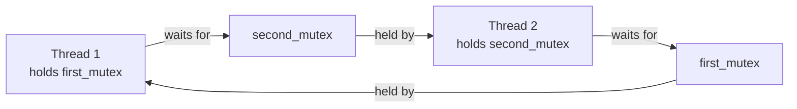
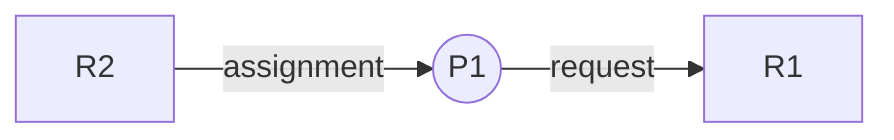
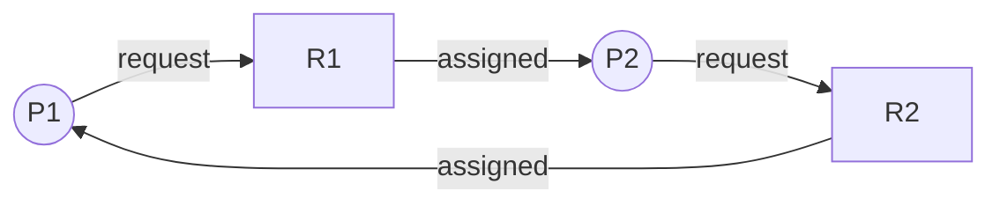
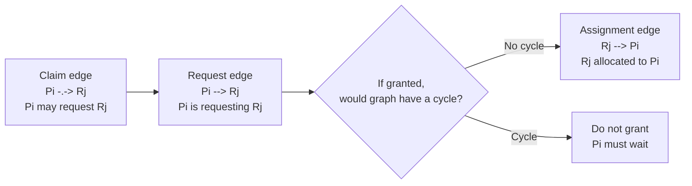
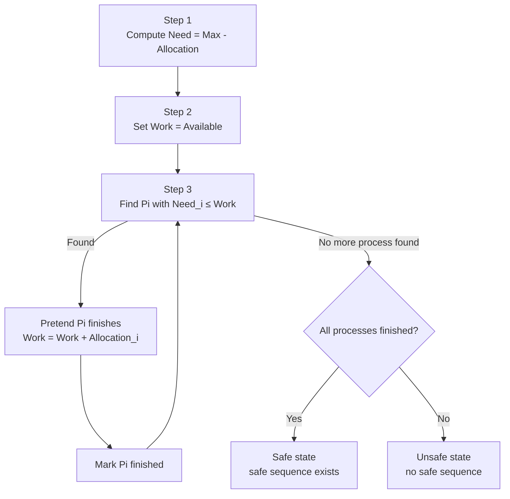

## ⭐Deadlock System Model — 行程怎麼用資源，才可能卡成死結？

講義位置：PDF viewer page 1 ~ 4

### 1. 這章在處理什麼問題？

Chapter 7 的主題是 `Deadlock(死結)`。講義 p.1 是章名，p.2 列出本章主線：`7.1 系統模型`、`7.2 死結的特性`、`7.3 處理死結的方法`、`7.4 預防死結`、`7.5 避免死結`、`7.6 死結的偵測`、`7.7 自死結恢復`。

這章真正要處理的問題是：

**如果多個 process / thread 都需要資源，而且每個人都拿著一些資源、等別人釋放其他資源，系統可能會卡住，誰都不能繼續。**

這種「大家互相等，結果沒有人能往前」的狀態，就是 `Deadlock(死結)`。

生活化例子：

兩個人各拿一支筷子，但每個人都還需要另一支筷子才吃得下去。
如果兩個人都不放下手上的筷子，就會變成：

**你等我放，我等你放，最後兩個人都卡住。**

---

### 2. 資源使用的三步驟：request → use → release

講義 p.3 說，在正常模式下，一個行程使用資源會照三個步驟：`request(要求)`、`use(使用)`、`release(釋放)`。

| 步驟            | 意思                                             |
|-----------------|--------------------------------------------------|
| `request(要求)` | process 要求某個資源；如果不能立刻拿到，就必須等待 |
| `use(使用)`     | process 拿到資源後，使用該資源                    |
| `release(釋放)` | process 用完後，把資源釋放出來                    |

最基本的流程是：


這個順序本身沒有問題。
問題出在：

**如果 process 已經拿到一些資源，但又去等另一個資源，而那個資源被別人拿著，就可能卡住。**

---

### 3. p.4 的 mutex 範例在表達什麼？

講義 p.4 給了兩個 thread 的 pseudo-code。第一個 thread 先 lock `first_mutex`，再 lock `second_mutex`；第二個 thread 則相反，先 lock `second_mutex`，再 lock `first_mutex`。

概念上是這樣：

| Thread     | 第一步              | 第二步              |
|------------|---------------------|---------------------|
| thread one | lock `first_mutex`  | lock `second_mutex` |
| thread two | lock `second_mutex` | lock `first_mutex`  |

危險狀況是：

1. thread one 先拿到 `first_mutex`。
2. thread two 先拿到 `second_mutex`。
3. thread one 想要 `second_mutex`，但 `second_mutex` 在 thread two 手上。
4. thread two 想要 `first_mutex`，但 `first_mutex` 在 thread one 手上。
5. 兩邊都不放，兩邊都等對方。

畫成圖就是：



這就是 deadlock 的直覺形式：

**Thread 1 等 Thread 2 釋放資源；Thread 2 又等 Thread 1 釋放資源。**

---

### 4. 為什麼 lock 順序很重要？

如果兩個 thread 都照同一個順序拿 lock，例如都先拿 `first_mutex`，再拿 `second_mutex`，就比較不容易形成互相卡住。

但 p.4 的例子是：

* Thread 1：`first_mutex → second_mutex`
* Thread 2：`second_mutex → first_mutex`

這叫做 **lock order inversion(鎖取得順序相反)**。

這種寫法很危險，因為它容易形成：

```text
A 拿著 X，等 Y
B 拿著 Y，等 X
```

一旦兩邊都不願意釋放目前拿到的資源，系統就會卡住。

---

### 5. 目前只先學直覺，下一頁才正式定義四個必要條件

這一頁先建立直覺：

**Deadlock 發生在多個 process / thread 互相等待資源，而且沒有人能繼續往前。**

下一個相鄰主線 p.5 會正式整理成四個 `necessary conditions(必要條件)`：

1. `Mutual Exclusion(互斥)`
2. `Hold and Wait(佔用與等候)`
3. `No Preemption(不可搶先)`
4. `Circular Wait(循環式等候)`

先不要急著背四個條件。
現在要先看懂 p.3 ~ p.4 的核心：

**資源是 request → use → release；如果兩個 thread 拿資源順序相反，就可能互相等到死。**

---

### 6. 最短記法

`Deadlock(死結)`：

**多個 process / thread 互相等對方釋放資源，結果大家都不能繼續。**

資源使用三步驟：

**request → use → release**

p.4 mutex 範例：

**Thread 1 拿 first 等 second；Thread 2 拿 second 等 first，所以卡住。**


## ⭐Necessary Conditions for Deadlock — 死結一定要同時滿足哪四個條件？

講義位置：PDF viewer page 5

### 1. 這個概念在解決什麼問題？

上一頁我們看到 deadlock 的直覺：

**Thread 1 拿 A 等 B；Thread 2 拿 B 等 A。**

p.5 把這件事整理成四個必要條件。講義說，下面四個狀況在系統中同時成立時，才會發生 deadlock。

也就是說：

**只要破壞其中一個條件，就可以防止 deadlock。**

---

### 2. Mutual Exclusion(互斥)

`Mutual Exclusion(互斥)` 是指：

**至少有一個資源不能同時被多個 process 使用。**

例如 mutex lock、印表機、某些不可共享裝置。

如果 P1 正在使用這個資源，P2 就必須等 P1 釋放後才能用。

生活例子：

一間只能一個人使用的廁所。
有人在裡面，其他人只能等。

---

### 3. Hold and Wait(佔用與等候)

`Hold and Wait(佔用與等候)` 是指：

**process 已經拿著至少一個資源，卻又在等待其他資源。**

這就是 deadlock 最直覺的核心。

例如：

P1 已經拿到 `first_mutex`，但還在等 `second_mutex`。

---

### 4. No Preemption(不可搶先)

`No Preemption(不可搶先)` 是指：

**資源不能被系統強制搶回來，只能等持有者自己釋放。**

例如 P1 拿著 mutex，OS 不會直接把這個 mutex 從 P1 手上硬搶走給 P2。

所以如果 P1 不釋放，P2 就只能等。

---

### 5. Circular Wait(循環式等候)

`Circular Wait(循環式等候)` 是指：

**等待關係形成一個圈。**

例如：

P1 等 P2 手上的資源，
P2 等 P3 手上的資源，
P3 又等 P1 手上的資源。

最小的圈就是：

P1 等 P2，P2 等 P1。

這就是 p.4 mutex 例子的本質。

---

### 6. 四個條件套回 p.4 mutex 範例

| 條件               | p.4 mutex 例子怎麼符合                     |
|--------------------|--------------------------------------------|
| `Mutual Exclusion` | mutex 一次只能被一個 thread 持有           |
| `Hold and Wait`    | thread 已持有一個 mutex，又等待另一個 mutex |
| `No Preemption`    | mutex 不能被強制從 thread 手上搶走         |
| `Circular Wait`    | Thread 1 等 Thread 2；Thread 2 等 Thread 1  |

所以 p.4 的例子會 deadlock，是因為這四個條件同時成立。

---

### 7. 最短記法

!!! danger

    死結四個必要條件：

    1. `Mutual Exclusion(互斥)`：資源不能共享。
    2. `Hold and Wait(佔用與等候)`：拿著一個，又等另一個。
    3. `No Preemption(不可搶先)`：資源不能被強制搶回。
    4. `Circular Wait(循環式等候)`：等待關係形成一個圈。

    最重要：

    **四個條件要同時成立，才會形成 deadlock。**


## ⭐Resource-Allocation Graph — 怎麼用圖看出 process 和 resource 的等待關係？

講義位置：PDF viewer page 6 ~ 8

### 1. 這個概念在解決什麼問題？

前面 p.5 我們知道 deadlock 需要四個條件，尤其是 `Circular Wait(循環式等候)`。

但如果系統裡有很多 process 和很多 resources，只靠文字很難看出誰在等誰。

所以 p.6 開始介紹：

`Resource-Allocation Graph(RAG，資源配置圖)`

它的用途是：

**把 process、resource、request、allocation 畫成圖，幫我們判斷是否可能形成 deadlock。**

---

### 2. 圖裡有兩種 vertices(頂點)

講義 p.6 說，Resource-Allocation Graph 有一組 vertices `V` 和一組 edges `E`，而 vertices 分成兩類：process 集合 `P = {P1, P2, ..., Pn}`，以及 resource type 集合 `R = {R1, R2, ..., Rm}`。

| 圖形元素            | 意思                                  |
|---------------------|---------------------------------------|
| `Pi`                | process，例如 P1、P2                    |
| `Rj`                | resource type，例如 R1、R2              |
| resource 裡的小黑點 | resource instances，也就是該資源有幾份 |

直覺：

* 圓圈通常代表 process。
* 方框通常代表 resource type。
* 方框裡的小點代表 resource instance。


#### instance 是啥意思

`instance` 的意思是：

**某一個 type(類型) 底下的具體一個東西。**

也可以翻成：

- `instance(實例)`
    
- `instance(個體)`
    
- `instance(具體單位)`
    

所以：

**type 是種類；instance 是這個種類底下的其中一份。**

---

### 3. 圖裡有兩種 edges(邊)

講義 p.6 定義兩種 directed edge(有方向的邊)：`request edge` 是 `Pi → Rj`，`assignment edge` 是 `Rj → Pi`。

| Edge                      | 方向      | 意思                                            |
|---------------------------|-----------|-------------------------------------------------|
| `Request edge(請求邊)`    | `Pi → Rj` | process Pi 正在要求 resource Rj                 |
| `Assignment edge(分配邊)` | `Rj → Pi` | resource Rj 的某個 instance 已分配給 process Pi |

最短理解：

**process 指向 resource：我想要它。**
**resource 指向 process：它已經被我拿到了。**

---

### 4. 用 Mermaid 表示最小例子

假設：

* P1 正在要求 R1。
* R2 已經分配給 P1。

可以畫成：



讀法是：

* `P1 → R1`：P1 正在等 R1。
* `R2 → P1`：P1 已經持有 R2。

---

### 5. 有 cycle 代表什麼？

在 Resource-Allocation Graph 中，cycle(循環) 是很重要的警訊。

因為 cycle 表示：

**有一串 process / resource 互相卡住。**

例如：



這代表：

* P1 等 R1，但 R1 被 P2 拿著。
* P2 等 R2，但 R2 被 P1 拿著。

所以形成：

`P1 → R1 → P2 → R2 → P1`

這就是 circular wait 的圖形版本。

---

### 6. 但有 cycle 一定是 deadlock 嗎？

這裡要小心，p.8 的圖示其實就在提醒這個陷阱。


p.8 左圖標成「含死結的資源配置圖」，下面列出循環，例如 `P1 → R1 → P2 → R3 → P3 → R2 → P1`。右圖則標成「含循環但無死結現象之資源配置圖」，雖然也有循環 `P1 → R1 → P3 → R2 → P1`，但因為 P4 之後可以釋放它所佔用的 R2 instance，讓 P3 取得資源並消除循環，所以不一定 deadlock。

所以判斷規則是：

| 情況                                                  | 結論                            |
|-------------------------------------------------------|---------------------------------|
| graph 沒有 cycle                                      | 一定沒有 deadlock               |
| graph 有 cycle，且每個 resource type 只有一個 instance | 一定 deadlock                   |
| graph 有 cycle，但某些 resource type 有多個 instances  | 可能 deadlock，也可能不 deadlock |

生活化例子：

如果廁所只有一間，A 拿鑰匙等 B，B 拿另一個必要鑰匙等 A，就一定卡住。
但如果某個資源其實有兩份，第三個人用完釋放其中一份，循環可能被解開，所以有 cycle 不一定代表真的死結。

---

### 7. 最短記法

`Resource-Allocation Graph(RAG)`：

**用圖表示 process 和 resource 的請求／分配關係。**

兩種邊：

1. `Pi → Rj`：request edge，Pi 正在等 Rj。
2. `Rj → Pi`：assignment edge，Rj 已分配給 Pi。

cycle 判斷：

1. 沒 cycle：一定沒有 deadlock。
2. 有 cycle + 每種 resource 只有一個 instance：一定 deadlock。
3. 有 cycle + resource 有多個 instances：不一定 deadlock。


### 錯題

!!! danger

    Q：
    In a resource-allocation graph, what do Pi → Rj and Rj → Pi mean?

    ANS：
    在 Resource-Allocation Graph(資源配置圖) 中，Pi → Rj 是 request edge(請求邊)，表示 ==process Pi 正在請求或等待 resource type Rj== 。Rj → Pi 是 assignment edge(分配邊)，表示 Rj 的某個 resource instance 已經分配給 Pi，也就是 Pi 目前持有該資源。
    
    


## ⭐Methods for Handling Deadlocks — 系統面對 deadlock 有哪三種策略？

講義位置：PDF viewer page 9

### 1. 這個概念在解決什麼問題？

前面我們知道 deadlock 是：

**process / thread 彼此持有資源，又等待彼此持有的資源，結果大家都無法繼續。**

現在 p.9 問的是：

**OS 面對 deadlock，到底可以怎麼處理？**

講義說理論上有三種方法：防止或避免死結、允許死結發生後再偵測與恢復、或忽視這個問題。

---

### 2. 方法一：Prevention / Avoidance(預防／避免)

第一種方法是：

**在 deadlock 發生前，就阻止系統進入 deadlock state。**

這裡又分兩個方向：

| 方法                            | 核心想法                                  |
|---------------------------------|-------------------------------------------|
| `Deadlock Prevention(死結預防)` | 破壞 deadlock 四個必要條件之一            |
| `Deadlock Avoidance(死結避免)`  | 在分配資源前先判斷是否安全，不安全就先不給 |

講義 p.9 說，`prevention` 是 ==確保死結必要條件至少有一項不會發生== ；`avoidance` 則 ==要求 OS 預先知道 process 一生中會要求與使用哪些資源== ，再決定每個 request 是否該等待。
    
 
!!! danger
   
    也就是說，Deadlock Prevention(死結預防) 不需要追蹤每個 process 一生中的最大資源需求，而是直接制定資源請求或資源分配規則，破壞 deadlock 的四個必要條件之一，讓 deadlock 無法形成。

    而 Deadlock Avoidance(死結避免) 是在 process 被 OS 接納並納入資源分配管理時，先取得或記錄它的最大可能資源需求。之後當 process 提出 resource request 時，OS 會根據目前的 available resources、allocation、need 等資訊，判斷如果現在分配資源，系統是否仍然維持 safe state。如果分配後仍 safe，就給資源；如果會變成 unsafe，就讓該 process 等待。
    

直覺差別：

`prevention` 像是從制度上禁止危險行為。
例如：規定所有人都必須照固定順序拿資源。

`avoidance` 像是每次申請資源前先做風險評估。
例如：你現在要借錢，銀行先算你借了之後會不會變成危險狀態。


---

### 3. 方法二：Detection and Recovery(偵測與恢復)

第二種方法是：

**允許 deadlock 發生，但系統要能偵測出來，然後恢復。**

意思是 OS 不一定一開始就禁止所有可能造成 deadlock 的行為。
它可以讓系統跑，之後定期檢查：

**現在是不是已經 deadlock？**

如果發現 deadlock，再採取 recovery(恢復)，例如：

* 終止某些 process。
* 搶回某些資源。
* 回復到較早的安全狀態。

這個方法的精神是：

**先讓系統正常跑；真的卡住再處理。**

---

### 4. 方法三：Ignore the Problem(忽視問題)

第三種方法是：

**假裝系統不會發生 deadlock。**

這聽起來很奇怪，但有些一般用途 OS 可能採用這種做法，因為 deadlock 可能很少發生，而完整處理 deadlock 的成本很高。

生活化例子：

你不會每天出門都穿防彈衣，因為風險很低、成本太高。
同樣地，如果 deadlock 很少發生，系統可能選擇不花大量成本處理。

但要注意：

**忽視問題不是代表 deadlock 不存在，而是系統選擇不主動處理它。**

---

### 5. 三種方法比較

| 方法                     | 發生前還是發生後？ | 核心做法                    | 成本                      |
|--------------------------|-------------------|-----------------------------|---------------------------|
| `Prevention / Avoidance` | 發生前            | 不讓系統進入 deadlock state | 較保守，可能降低資源利用率 |
| `Detection and Recovery` | 發生後            | 允許發生，偵測後恢復         | 需要偵測與恢復機制        |
| `Ignore`                 | 不主動處理        | 假裝沒有 deadlock           | 成本最低，但風險留著       |

---

### 6. 最短記法

處理 deadlock 三大策略：

1. **不要讓它發生**：prevention / avoidance。
2. **發生後再處理**：detection and recovery。
3. **假裝沒這回事**：ignore the problem。


## ⭐Deadlock Prevention — 如何破壞四個死結必要條件？

講義位置：PDF viewer page 10 ~ 11

### 1. 這個概念在解決什麼問題？

上一頁 p.9 說：

`Deadlock Prevention(死結預防)` 是用限制資源請求的方法，確保 deadlock 的必要條件至少有一個不會發生。p.10 接著明確說，prevention 的核心就是：

**想辦法破壞形成 deadlock 的四個條件。** 

所以這一節不是問：

**如果 deadlock 發生了怎麼辦？**

而是問：

**能不能一開始就制定規則，讓 deadlock 的四個條件無法同時成立？**

---

### 2. 破壞 Mutual Exclusion(互斥)

`Mutual Exclusion(互斥)` 的意思是：某些資源一次只能給一個 process 使用。

這個條件有時候很難破壞，因為有些資源本來就不能共享。

例如：

* mutex lock
* 印表機
* 某些硬體裝置
* 某些 critical section

講義 p.10 也說，對不可共享資源來說，mutual exclusion 條件必定成立。

所以 prevention 通常不會主要靠破壞 mutual exclusion，因為很多資源天生就需要互斥。

---

### 3. 破壞 Hold and Wait(佔用與等候)

`Hold and Wait(佔用與等候)` 是：

**process 手上已經拿著某些資源，又繼續等其他資源。**

要破壞它，方法是規定：

==**process 在要求一項資源時，不可以佔用任何其他資源。**==

講義 p.10 也寫，必須保證一個行程在要求一項資源時，不可以佔用任何其他資源；缺點是資源利用率低，而且可能有 starvation(餓死)。

生活化例子：

你要借新工具前，必須先把手上所有工具都還回去。
這樣就不會出現「我拿著 A 等 B」的狀態。

缺點是很浪費：

你明明還需要 A，卻被迫先還掉，之後還要重新拿。

---

### 4. 破壞 No Preemption(不可搶先)

`No Preemption(不可搶先)` 是：

**資源不能被系統強制搶回，只能等持有者自己釋放。**

要破壞它，方法是：

**如果 process 拿著一些資源，又要求其他無法立即分配的資源，那它目前持有的資源就會被釋放。**

講義 p.10 說，如果持有某些資源的 process 請求了不能立即分配的其他資源，那它當前持有的所有資源都會被釋放； ==等它能重新取得舊資源和新資源時== ，才重新啟動。

直覺：

你拿著 A，但你還想要 B。
如果 B 現在不能給你，系統就說：

**那你先把 A 也還回來，等 A 和 B 都能一起給你時再繼續。**

這樣可以避免你拿著 A 卡住別人。

---

### 5. 破壞 Circular Wait(循環式等候)

`Circular Wait(循環式等候)` 是：

**P1 等 P2，P2 等 P3，最後又有人等回 P1，形成一個圈。**

要破壞它，方法是：

**對所有資源做 total ordering(總排序)，並要求 process 只能依照遞增順序請求資源。**

講義 p.11 也是這樣寫：對所有資源總排序，要求每個 process 以遞增順序請求資源。

例如規定：

`R1 < R2 < R3`

那 process 只能：

`R1 → R2 → R3`

不能：

`R2 → R1`

這樣就不會出現 p.4 那種：

Thread 1：先拿 first，再拿 second。
Thread 2：先拿 second，再拿 first。

因為所有人都照同一個順序拿資源，就不容易形成等待圈。

---

### 6. 四種破壞方式整理

| 要破壞的條件       | Prevention 方法                 | 缺點／限制                    |
|--------------------|---------------------------------|------------------------------|
| `Mutual Exclusion` | 讓資源可共享                    | 很多資源天生不可共享，難做到  |
| `Hold and Wait`    | 要新資源時，不能持有其他資源     | 資源利用率低，可能 starvation |
| `No Preemption`    | 要不到新資源時，釋放目前持有資源 | 某些資源不適合被搶回         |
| `Circular Wait`    | 對資源排序，只能按遞增順序要求   | 限制程式設計彈性             |

---

### 7. 最短記法

`Deadlock Prevention(死結預防)`：

**破壞 deadlock 四個必要條件之一，讓四個條件無法同時成立。**

最常見、最好記的是：

**破壞 circular wait：規定所有 process 都照固定資源順序拿資源。**


### 破壞 Hold and Wait 和 破壞 No Preemption 到底差在哪裡？

!!! danger

    這兩個看起來都會「放掉資源」，但重點不同。

    | 方法                 | 什麼時候釋放？                                                                    | 核心差別                                   |
    |----------------------|----------------------------------------------------------------------------------|--------------------------------------------|
    | 破壞 `Hold and Wait` | 在提出新 request 前，規則就要求你不能持有其他資源(==只能同時要求所有需要的資源==) | 不允許「拿著資源又等待」這個狀態出現         |
    | 破壞 `No Preemption` | 已經提出 request，但新資源無法立即分配時，系統讓它釋放目前資源                     | 允許 request 發生，但要不到時把持有資源空出 |

    用一句話分：

    **Hold-and-wait prevention 是：要東西前，手上先清空。**  
    **No-preemption prevention 是：你要不到新東西時，手上的也先被收回。**
    
    


## ⭐Safe State — 什麼叫「現在分配資源仍然安全」？

講義位置：PDF viewer page 12 ~ 14

### 1. 這個概念在解決什麼問題？

上一個主線是 `Deadlock Prevention(死結預防)`：
**直接改資源取用規則，破壞 deadlock 的必要條件。**

==現在進入 `Deadlock Avoidance(死結避免)`==：
**不是一開始禁止很多行為，而是每次 process 要資源時，OS 先判斷「現在給它會不會讓系統走向危險」。**

所以 `safe state(安全狀態)` 要回答的問題是：

**如果現在這樣分配資源，系統是否仍然有一種順序，可以讓所有 process 最後都完成？**

講義 p.12 定義：如果系統能以某種順序把資源分配給各行程，並仍能避免 deadlock，這個狀態就叫 `safe state(安全狀態)`。p.13 接著說，當 process 要求可用資源時，系統必須判斷立刻給資源後是否仍是 safe state；若是就給，否則該 process 必須等待。

---

### 2. Safe state 的核心：存在一個 safe sequence

`Safe sequence(安全序列)` 是：

**有一個 process 完成順序，照這個順序走，每個 process 都能拿到剩下需要的資源、執行完、釋放資源，最後全部 process 都完成。**

白話說：

**現在雖然資源可能不夠所有人同時拿滿，但只要我們能安排出一個「誰先完成、誰再完成」的順序，讓每個人最後都能跑完，那就是 safe。**

生活例子：

你手上現在只有 3 支工具，但三個人總共還需要更多工具。
如果你能先讓需求最少的人完成，等他歸還工具後，再讓下一個人完成，最後大家都能完成，那目前狀態就是安全的。

---

### 3. Safe 不代表現在每個人都能立刻完成

這點很重要。

`Safe state` 不是說：

**所有 process 現在馬上都能拿到全部資源。**

而是說：

**存在一個完成順序，使得大家最後都能完成。**

所以 safe state 允許某些 process 先等一下。

講義 p.13 的說法就是：如果 `Pi` 的需求資源無法立即取得，`Pi` 可以等到前面的 `Pj` 完成；當 `Pj` 完成並釋放資源後，`Pi` 就可以取得需要的資源，執行、結束並釋放資源。

---

### 4. p.14 例子：12 台 tape drives

講義 p.14 給的是 12 個 tape drives 的例子：

| Process | Maximum needs | Current holds | Needs |
|---------|--------------:|--------------:|------:|
| P0      |            10 |             5 |     5 |
| P1      |             4 |             2 |     2 |
| P2      |             9 |             2 |     7 |

總共有 12 個 tape drives。
目前已經被拿走：

`5 + 2 + 2 = 9`

所以目前 `Available(可用資源)` 是：

`12 - 9 = 3`

現在看誰可以先完成：

| Process | Needs | Available = 3 時能不能先完成？ |
|---------|------:|-------------------------------|
| P0      |     5 | 不能                          |
| P1      |     2 | 可以                          |
| P2      |     7 | 不能                          |

所以先讓 `P1` 完成。
P1 完成後會釋放它目前持有的 2 個 tape drives，所以：

`Available = 3 + 2 = 5`

接著：

| Process | Needs | Available = 5 時能不能完成？ |
|---------|------:|-----------------------------|
| P0      |     5 | 可以                        |
| P2      |     7 | 不能                        |

所以讓 `P0` 完成。
P0 完成後釋放 5 個：

`Available = 5 + 5 = 10`

最後：

| Process | Needs | Available = 10 時能不能完成？ |
|---------|------:|------------------------------|
| P2      |     7 | 可以                         |

因此安全序列是：

`<P1, P0, P2>`

講義也明確寫這個 sequence 滿足 safe condition。

---

### 5. 用流程圖看 safe sequence


這張圖的重點是：

**不是一開始所有人都能完成，而是存在一條完成路線。**

---

### 6. Unsafe state 是什麼？

`Unsafe state(不安全狀態)` 是：

**找不到一個保證所有 process 都能完成的 safe sequence。**

注意：

**unsafe 不一定等於現在已經 deadlock。**

更精準說：

| 狀態             | 意思                                       |
|------------------|--------------------------------------------|
| `safe state`     | 一定可以找到某個完成順序，避免 deadlock     |
| `unsafe state`   | 找不到保證安全的完成順序，未來可能 deadlock |
| `deadlock state` | 已經卡住，沒有人能繼續                      |

講義 p.14 的 unsafe 例子是：如果 `P2` 又 request 並被多分配 1 個 tape drive，這會是錯誤分配，因為之後會導致 deadlock。

原本：

| Process | Current holds | Needs |
|---------|--------------:|------:|
| P0      |             5 |     5 |
| P1      |             2 |     2 |
| P2      |             2 |     7 |

如果又給 P2 1 個，變成：

| Process | Current holds | Needs |
|---------|--------------:|------:|
| P0      |             5 |     5 |
| P1      |             2 |     2 |
| P2      |             3 |     6 |

總持有：

`5 + 2 + 3 = 10`

所以：

`Available = 12 - 10 = 2`

此時 P1 need = 2，可以先完成，釋放 2 個，變成：

`Available = 4`

可是：

* P0 還需要 5
* P2 還需要 6

Available 只有 4，誰都不能完成。
所以這個分配會讓系統走向 unsafe，講義說錯誤在於同意 P2 多拿一個 tape drive。

---

### 7. Avoidance 的真正判斷

`Deadlock Avoidance(死結避免)` 不是問：

**現在有沒有 deadlock？**

而是問：

==**如果我現在給這個 request，系統還找不找得到 safe sequence？**==

如果找得到：

**可以給。**

如果找不到：

**不給，讓 process 等待。**

這就是 avoidance 跟 prevention 的差異：

| 方法         | 判斷方式                                |
|--------------|-----------------------------------------|
| `Prevention` | 事先制定規則，破壞 deadlock 條件         |
| `Avoidance`  | 每次 request 時，檢查給了之後是否仍 safe |

---

### 8. 最短記法

`Safe state(安全狀態)`：

**存在一個 process 完成順序，使得所有 process 最後都能完成，並避免 deadlock。**

`Safe sequence(安全序列)`：

**照這個順序讓 process 完成，每一步釋放的資源都足夠讓下一個 process 完成。**

`Unsafe state(不安全狀態)`：

**找不到保證安全的完成順序；不一定已經 deadlock，但可能導向 deadlock。**


### 為何 `Unsafe state(不安全狀態)` 說可能會 deadlock，但不代表一定會 deadlock。

!!! danger

    在 `Deadlock Avoidance(死結避免)` 裡，OS 不只看 process 現在實際要求多少資源，而是用一種保守分析來判斷：

    如果每個 process 未來都可能要求到它的 `remaining maximum need(剩餘最大需求)`，也就是 `Need = Max - Allocation`，系統是否仍然能安排出一個 `safe sequence(安全序列)`。

    所以 `safe state(安全狀態)` 的意思是：

    >即使按照每個 process ==最多== 還可能需要的資源來考慮，系統仍然找得到一個完成順序，讓所有 process 都能完成。

    如果找不到 safe sequence，系統就會判定目前是 `unsafe state(不安全狀態)`，意思是：

    **OS 無法保證之後一定能讓所有 process 完成，因此未來可能會 deadlock。**

    但 `unsafe state` 不代表未來一定 deadlock，因為實際上每個 process 不一定會真的要求到它宣告的最大需求，也可能提早釋放資源、少拿一些資源，或執行順序剛好沒有走到最壞情況。

    所以：

    **Unsafe state 不是 deadlock，而是「無法保證安全」的狀態。**
    
    
!!! note

    它有點像 Big-O 在分析時採保守上界／最壞情況思維。
    
    
    
    

## ⭐Resource-Allocation Graph Algorithm — 如何用圖在分配前避免 deadlock？

講義位置：PDF viewer page 15

### 1. 這個概念在解決什麼問題？

前面 `Safe State(安全狀態)` 的核心是：

**資源分配前，OS 要先判斷「如果現在給資源，系統還能不能保證安全」。**

p.15 換成圖的角度來做這件事。


也就是：

**process 要資源時，不是馬上給，而是先把圖更新看看會不會形成 cycle(循環)。如果給了會形成 cycle，就不要給，讓 process 等待。**

講義 p.15 說，只有當把 request edge 轉成 assignment edge 不會導致 resource-allocation graph 形成 cycle 時，才可以同意這個 request。

---

### 2. 先分清楚三種 edge(邊)

p.15 多了一個新東西：`claim edge(聲明邊)`。

你前面已經學過：

| Edge                      | 方向      | 意思               |
|---------------------------|-----------|--------------------|
| `request edge(請求邊)`    | `Pi → Rj` | Pi 現在正在要求 Rj |
| `assignment edge(分配邊)` | `Rj → Pi` | Rj 已經分配給 Pi   |

現在新增：

| Edge                 | 方向                 | 意思                 |
|----------------------|----------------------|----------------------|
| `claim edge(聲明邊)` | `Pi → Rj`，通常用虛線 | Pi 未來可能會請求 Rj |

所以三者差異是：

| 狀態              | 意思                              |
|-------------------|-----------------------------------|
| `claim edge`      | 可能會要，但現在還沒真的要         |
| `request edge`    | 現在真的提出 request，正在等       |
| `assignment edge` | 已經分配給 process，process 正持有 |

---

### 3. Claim edge 為什麼存在？

因為 avoidance 需要 OS 事先知道：

**process 可能會要求哪些 resource。**

所以一開始先畫 `claim edge`，表示：

**Pi 未來可能會要求 Rj。**

這不是說 Pi 現在正在等 Rj。
只是先把「可能需求」記在圖上。

生活例子：

你跟工具管理員說：

**我這個工作未來可能會借電鑽。**

這時管理員先記錄「你可能會借」，但還沒有真的把電鑽給你，也不是你正在等電鑽。

這就像 `claim edge`。

---

### 4. 三種 edge 的轉換流程

講義 p.15 的流程是：

1. 一開始有 `claim edge`：Pi 未來可能要 Rj。
2. Pi 真的 request Rj 時，`claim edge` 變成 `request edge`。
3. 如果 OS 判斷給了不會形成 cycle，就把 `request edge` 變成 `assignment edge`。
4. 如果會形成 cycle，就不給，Pi 等待。

可以畫成：



---

### 5. 為什麼「形成 cycle」就不能給？

因為在 resource-allocation graph 裡，cycle 代表：

**等待關係可能變成一個圈。**

例如：

P1 等 R1，而 R1 被 P2 拿著；
P2 又等 R2，而 R2 被 P1 拿著。

這種等待圈就是 circular wait 的圖形版本。

p.15 的 avoidance 規則是：

**不要讓 request edge 變成 assignment edge 後產生 cycle。**

也就是：

**不要讓系統走進可能造成 deadlock 的圖形狀態。**

---

### 6. 這和 safe state 的關係

p.12 ~ p.14 的 `safe state` 是用「完成順序」來想：

**有沒有一個 sequence 可以讓所有 process 完成？**

p.15 的 `Resource-Allocation Graph Algorithm` 是用「圖」來想：

**如果我現在分配這個 resource，圖上會不會出現 cycle？**

兩者都是 `Deadlock Avoidance(死結避免)`：

| 方法                                  | 判斷方式                            |
|---------------------------------------|-------------------------------------|
| `Safe state`                          | 給了之後，是否仍找得到 safe sequence |
| `Resource-Allocation Graph Algorithm` | 給了之後，圖上是否會形成 cycle       |

重點都是：

**分配前先檢查，不安全就先不給。**

---

### 7. 跟 Banker’s Algorithm 的銜接

p.15 是 `Resource-Allocation Graph Algorithm`，p.16 會進入 `Banker’s Algorithm(銀行家演算法)`。

這兩個都屬於 `Deadlock Avoidance`，但適用情境不同：

| 方法                                  | 大方向                                           |
|---------------------------------------|--------------------------------------------------|
| `Resource-Allocation Graph Algorithm` | 用圖和 cycle 判斷                                |
| `Banker’s Algorithm`                  | 用 Max、Allocation、Need、Available 計算 safe state |

p.16 特別說 Banker’s Algorithm 適用於「每個資源有多個 instances」的情況，並要求每個 process 事先聲明最大使用量。

所以你可以先記：

**p.15 是圖形版 avoidance；p.16 開始是矩陣／表格版 avoidance。**

---

### 8. 最短記法

`Claim edge(聲明邊)`：

**Pi 未來可能要求 Rj。**

`Request edge(請求邊)`：

**Pi 現在正在要求 Rj。**

`Assignment edge(分配邊)`：

**Rj 已經分配給 Pi。**

演算法核心：

**只有在 request edge 轉成 assignment edge 不會形成 cycle 時，OS 才能同意 request。**

### 錯題

Q：
Why should the OS deny a resource request if converting the request edge to an assignment edge would create a cycle?

ANS：
如果把 request edge 轉成 assignment edge 會形成 cycle，OS 應該拒絕這次 request，讓 process 等待。因為 cycle 代表可能形成 circular wait，進而導致 deadlock 風險；deadlock avoidance 的目的就是在分配前避免進入這種危險狀態。

### 問問題

!!! danger

    Q：
    所以防止 create a cycle 只是防只達到構成要素之一的 circular wait ，並不等於一定會 block，要 block 要其他的條件也達到才會對不對？

    A：
    你的理解方向是對的，但要分兩種圖

    你說：

    > 防止 create a cycle 只是防止達到構成要素之一的 circular wait，並不等於一定會 block，要 block 要其他的條件也達到才會。

    這句在**一般觀念上是對的**：  
    `Circular Wait(循環式等候)` 只是 deadlock 四個 necessary conditions(必要條件) 之一。要真的形成 deadlock，還需要 `Mutual Exclusion(互斥)`、`Hold and Wait(佔用與等候)`、`No Preemption(不可搶先)` 也同時成立。

    但在 `Resource-Allocation Graph(RAG，資源配置圖)` 裡，還要分：

    | 情況                                                    | cycle 代表什麼                           |
    |---------------------------------------------------------|------------------------------------------|
    | 一般 deadlock 必要條件                                  | cycle 只是四條件之一                     |
    | 單一 instance 的實際 RAG，只有 request / assignment edge | 有 cycle 通常就代表 deadlock             |
    | avoidance 用的 graph，含 claim edge                      | 有 cycle 代表 unsafe，不一定已經 deadlock |
    
    
    

## ⭐Banker’s Algorithm — OS 怎麼像銀行一樣判斷資源能不能借出去？

講義位置：PDF viewer page 16 ~ 19

### 1. 這個概念在解決什麼問題？

`Banker’s Algorithm(銀行家演算法)` 是 `Deadlock Avoidance(死結避免)` 的代表方法。

它在解決的問題是：

**process 要資源時，OS 要不要現在就給？**

不能只看：

**現在資源夠不夠。**

還要看：

==**給了之後，系統還能不能保持 safe state(安全狀態)。**==

這就像銀行借錢。銀行不是只看「現在保險庫裡有沒有錢」，還要看「借出去之後，是否仍有能力讓所有客戶在合理情況下完成提款」。所以叫 `Banker’s Algorithm`。

講義 p.16 說 Banker’s Algorithm 的條件包含：每個 resource 有多個 instances、每個 process 必須事先聲明最大使用量、process request resource 時可能必須等待、process 取得所有資源後必須在有限時間內完成並釋放資源。

---

### 2. Banker’s Algorithm 的四個基本假設

| 條件                               | 意思                                          |
|------------------------------------|-----------------------------------------------|
| ==每個 resource 有多個 instances== | 例如 A 有 10 份、B 有 5 份、C 有 7 份           |
| process 事先宣告最大需求           | OS 要知道每個 process 最多可能需要多少資源    |
| request 時可能等待                 | 就算目前資源夠，也可能因為給了會 unsafe 而不給 |
| 拿到所有資源後有限時間內完成並釋放 | 不然 safe sequence 的推理無法成立             |

最重要的是第二點：

**如果 OS 不知道 process 的 maximum need(最大需求)，就沒辦法判斷「給了之後還安不安全」。**

---

### 3. Banker’s Algorithm 的四張表

講義 p.17 定義了四個資料結構：`Available`、`Max`、`Allocation`、`Need`。

假設：

* `n` = process 數量
* `m` = resource type 數量

| 名稱         | 型態             | 意思                                      |
|--------------|------------------|-------------------------------------------|
| `Available`  | 長度 m 的 vector | 每種 resource 目前還剩多少可用 instances  |
| `Max`        | n × m matrix     | 每個 process 最多可能需要多少資源         |
| `Allocation` | n × m matrix     | 每個 process 目前已經拿到多少資源         |
| `Need`       | n × m matrix     | 每個 process 接下來最多還可能需要多少資源 |


!!! danger
    
    Allocation：分配；配置；撥款；配置量；資源分派

    Allocation：分配、配置
    ├─ al：加強、朝向
    ├─ loc：放置、位置
    │  └─ local：地方、位置相關
    ├─ ate：動詞化、使成為
    └─ ion：名詞化、行為、結果

核心公式：

`Need = Max - Allocation`

也就是：

**還需要多少 = 最多需要多少 - 已經拿到多少**

---

### 4. 用一個超小例子看 `Need = Max - Allocation`

假設只有一種資源 A。

| Process | Max | Allocation | Need |
|---------|----:|-----------:|-----:|
| P0      |   7 |          2 |    5 |
| P1      |   4 |          1 |    3 |

意思是：

* P0 最多需要 7 個 A，已經拿 2 個，所以最多還可能需要 5 個。
* P1 最多需要 4 個 A，已經拿 1 個，所以最多還可能需要 3 個。

所以 Banker’s Algorithm 不是只看 process 現在要求多少，而是看：

**如果未來它還要到 Need 這麼多，系統是否仍能安排大家完成。**

---

### 5. Safety Algorithm(安全性演算法)：檢查目前是不是 safe state

講義 p.18 的 `Safety Algorithm` 是用來回答：

**目前這個資源配置狀態是不是 safe？**

它用兩個暫存變數：

| 變數        | 意思                                             |
|-------------|--------------------------------------------------|
| `Work`      | 目前模擬中可用的資源數量，一開始等於 `Available`  |
| `Finish[i]` | process Pi 是否可以在模擬中完成，一開始都是 false |

流程是：

1. 設 `Work = Available`，所有 `Finish[i] = false`。
2. 找一個尚未完成的 Pi，使得 `Need_i ≤ Work`。
3. 如果找到，代表 Pi 可以完成；完成後釋放它已持有的資源，所以 `Work = Work + Allocation_i`，並把 `Finish[i] = true`。
4. 重複找下一個可以完成的 process。
5. 如果最後所有 `Finish[i] = true`，就是 safe state；否則不是 safe state。

直覺：

**先找一個現在資源夠它完成的人，讓它完成並歸還資源，再用歸還後的資源去幫下一個人完成。**

---

### 6. Safety Algorithm 的迷你示範

假設只有一種 resource A，目前：

`Available = 2`

| Process | Allocation | Need |
|---------|-----------:|-----:|
| P0      |          1 |    2 |
| P1      |          2 |    1 |
| P2      |          1 |    3 |

一開始：

`Work = 2`

先找 `Need ≤ Work` 的 process：

* P0 Need = 2，可以完成。
* P1 Need = 1，也可以完成。
* P2 Need = 3，暫時不行。

假設先選 P1：

P1 完成後釋放 Allocation = 2，所以：

`Work = 2 + 2 = 4`

接著 P0 Need = 2 可以完成，釋放 1：

`Work = 4 + 1 = 5`

最後 P2 Need = 3 可以完成。

所以其中一個 safe sequence 是：

`<P1, P0, P2>`

這代表目前狀態是 safe。

---

### 7. Resource-Request Algorithm(資源請求演算法)：process 要資源時怎麼判斷？

講義 p.19 的 `Resource-Request Algorithm` 是用來回答：

**Pi 現在提出 request，OS 能不能立刻給？**

它有三層檢查：

| 步驟 | 檢查                      | 失敗代表什麼                                  |
|------|---------------------------|-----------------------------------------------|
| 1    | `Request_i ≤ Need_i`      | request 超過自己事先宣告的最大需求，錯誤       |
| 2    | `Request_i ≤ Available`   | 目前資源不夠，Pi 必須等待                      |
| 3    | 假裝分配後跑 safety check | 若 safe 才真的給；若 unsafe 就不給並恢復舊狀態 |

講義 p.19 寫，如果 request 合理且資源可用，就先假裝分配：`Available = Available - Request_i`、`Allocation_i = Allocation_i + Request_i`、`Need_i = Need_i - Request_i`；如果 safe，就真的分配；如果 unsafe，Pi 必須等待，舊的 resource-allocation state 要恢復。

---

### 8. 三層檢查的直覺

假設 P1 事先說自己最多還會需要 5 個 A，也就是 `Need = 5`。

現在 P1 request 6 個 A：

* `Request ≤ Need` 不成立。
* 代表它超過自己宣告的最大需求。
* OS 直接視為錯誤。

如果 P1 request 3 個 A，但系統目前 Available 只有 2：

* `Request ≤ Need` 成立。
* `Request ≤ Available` 不成立。
* 代表不是違規，而是現在資源不夠，所以 P1 等待。

如果 P1 request 3 個 A，Available 也夠：

* 還不能馬上真的給。
* OS 要先假裝給它，再檢查系統是否仍 safe。
* safe 才給；unsafe 就不給。

最重要陷阱：

**資源夠，不代表一定可以給。還要檢查給了之後是否 safe。**

---

### 9. Banker’s Algorithm 和前一頁圖形演算法的差別

| 方法                                  | 適合情境                       | 判斷方式                                                 |
|---------------------------------------|--------------------------------|----------------------------------------------------------|
| `Resource-Allocation Graph Algorithm` | 通常用圖判斷 cycle             | request 變 assignment 後是否形成 cycle                   |
| `Banker’s Algorithm`                  | 每個 resource 有多個 instances | 用 `Available / Max / Allocation / Need` 檢查 safe state |

兩者都屬於 avoidance。

共通精神是：

**分配前先檢查，不安全就讓 process 等待。**

---

### 10. 最短記法

`Banker’s Algorithm`：

**process 要資源時，OS 先假裝分配，再檢查是否 still safe。**

四張表：

| 名稱         | 意思             |
|--------------|------------------|
| `Available`  | 目前剩多少       |
| `Max`        | 最多會要多少     |
| `Allocation` | 已經拿多少       |
| `Need`       | 還最多可能要多少 |

公式：

`Need = Max - Allocation`

三層 request 檢查：

1. `Request ≤ Need`
2. `Request ≤ Available`
3. 假裝分配後檢查 safe state


### Need = Max - Allocation，實際上 process 會主動提供的是哪個

實際上，在 `Banker’s Algorithm(銀行家演算法)` 的理論模型裡，process 主動提供的是兩種東西：

| 時間點                                            | process 提供什麼             | 對應資料  |
|---------------------------------------------------|------------------------------|-----------|
| process 進入系統／被納入 Banker’s Algorithm 管理時 | 宣告自己最多可能需要多少資源 | `Max`     |
| process 執行中真的想要資源時                      | 提出這次想拿多少資源         | `Request` |

而不是 process 主動提供 `Need`。

`Need` 是 OS 用公式算出來的：

`Need = Max - Allocation`

講義 p.16 說每個 process 必須事先聲明最大使用量；p.17 定義 `Max` 是 process 最多可能 request 的資源數量，`Allocation` 是目前已分配多少，`Need` 是還可能需要多少，且 `Need = Max - Allocation`；p.19 則定義 `Request_i` 是 process Pi 這次想要的 request vector。


## ⭐Banker’s Algorithm Example — 表格題到底怎麼一步一步跑？

講義位置：PDF viewer page 20 ~ 24

### 1. 這個範例在解決什麼問題？

前面 p.16 ~ p.19 我們學的是規則：

1. `Need = Max - Allocation`
2. `Safety Algorithm(安全性演算法)`：找 safe sequence
3. `Resource-Request Algorithm(資源請求演算法)`：process 要資源時，先檢查再假裝分配，再測 safe

p.20 ~ p.24 則是把這些規則真的套到表格上。

這類題目的核心不是背答案，而是會做三件事：

1. 算出 `Need`
2. 用 `Available / Work` 找 safe sequence
3. 對每個 request 判斷：`Request ≤ Need`、`Request ≤ Available`、假裝分配後是否 still safe

講義 p.20 給 5 個 processes、3 種 resources，分別是 A 有 10 個 instances、B 有 5 個 instances、C 有 7 個 instances，並給初始 `Allocation / Max / Available`。p.21 接著算出 `Need = Max - Allocation`，並指出 `<P1, P3, P4, P2, P0>` 是 safe sequence。

---

### 2. 初始表格：先看 `Allocation / Max / Available`

講義 p.20 的初始狀態是：

| Process | Allocation A B C | Max A B C |
|---------|-----------------:|----------:|
| P0      |            0 1 0 |     7 5 3 |
| P1      |            2 0 0 |     3 2 2 |
| P2      |            3 0 2 |     9 0 2 |
| P3      |            2 1 1 |     2 2 2 |
| P4      |            0 0 2 |     4 3 3 |

`Available = (3, 3, 2)`

意思是目前系統還剩：

* A 還有 3 個
* B 還有 3 個
* C 還有 2 個

---

### 3. 算 `Need = Max - Allocation`

逐列相減：

| Process |   Max | Allocation |  Need |
|---------|------:|-----------:|------:|
| P0      | 7 5 3 |      0 1 0 | 7 4 3 |
| P1      | 3 2 2 |      2 0 0 | 1 2 2 |
| P2      | 9 0 2 |      3 0 2 | 6 0 0 |
| P3      | 2 2 2 |      2 1 1 | 0 1 1 |
| P4      | 4 3 3 |      0 0 2 | 4 3 1 |

這和講義 p.21 的 `Need` 表一致。

最重要的是：

**Need 不是目前正在 request 的量，而是「最多還可能需要多少」。**

---

### 4. 用 Safety Algorithm 找 safe sequence

一開始：

`Work = Available = (3, 3, 2)`

現在找 `Need ≤ Work` 的 process。

| Step |   Work | 可以完成的 process   |                          完成後 Work |
|------|-------:|----------------------|-------------------------------------:|
| I    |  3 3 2 | P1，因為 Need = 1 2 2 | 3 3 2 + Allocation(P1) 2 0 0 = 5 3 2 |
| II   |  5 3 2 | P3，因為 Need = 0 1 1 |                5 3 2 + 2 1 1 = 7 4 3 |
| III  |  7 4 3 | P4，因為 Need = 4 3 1 |                7 4 3 + 0 0 2 = 7 4 5 |
| IV   |  7 4 5 | P2，因為 Need = 6 0 0 |               7 4 5 + 3 0 2 = 10 4 7 |
| V    | 10 4 7 | P0，因為 Need = 7 4 3 |              10 4 7 + 0 1 0 = 10 5 7 |

所以 safe sequence 是：

`<P1, P3, P4, P2, P0>`

這就是講義 p.21 的結論。

重點：

**不是每個 process 一開始都能完成，而是只要找得到一條完成順序，就算 safe state。**

---

### 5. Request 範例一：P1 request `(1, 0, 2)`

講義 p.22 問：

`P1 Request = (1, 0, 2)`

第一層：

`Request ≤ Need(P1)`

P1 原本 `Need = (1, 2, 2)`，所以：

`(1,0,2) ≤ (1,2,2)` 成立。

第二層：

`Request ≤ Available`

原本 `Available = (3,3,2)`，所以：

`(1,0,2) ≤ (3,3,2)` 成立。

第三層：假裝分配。

分配後：

| 項目           |                  新值 |
|----------------|----------------------:|
| Available      | 3 3 2 - 1 0 2 = 2 3 0 |
| Allocation(P1) | 2 0 0 + 1 0 2 = 3 0 2 |
| Need(P1)       | 1 2 2 - 1 0 2 = 0 2 0 |

接著跑 safety check。講義 p.22 說可以找到 safe sequence：

`<P1, P3, P4, P0, P2>`

所以：

**P1 request `(1,0,2)` 可以 grant。** 

---

### 6. Request 範例二：P4 request `(3, 3, 0)`

講義 p.23 問：

`P4 Request = (3, 3, 0)`

第一層：

P4 原本 `Need = (4, 3, 1)`，所以：

`(3,3,0) ≤ (4,3,1)` 成立。

第二層：

原本 `Available = (3,3,2)`，所以：

`(3,3,0) ≤ (3,3,2)` 成立。

第三層：假裝分配。

分配後：

| 項目           |                  新值 |
|----------------|----------------------:|
| Available      | 3 3 2 - 3 3 0 = 0 0 2 |
| Allocation(P4) | 0 0 2 + 3 3 0 = 3 3 2 |
| Need(P4)       | 4 3 1 - 3 3 0 = 1 0 1 |

這時 `Work = (0,0,2)`。

看每個 process 的 Need：

| Process |  Need | Need ≤ Work = 0 0 2？ |
|---------|------:|----------------------|
| P0      | 7 4 3 | 不行                 |
| P1      | 1 2 2 | 不行                 |
| P2      | 6 0 0 | 不行                 |
| P3      | 0 1 1 | 不行                 |
| P4      | 1 0 1 | 不行                 |

找不到任何 process 可以先完成。

所以這次 request 不能 grant。

講義 p.23 結論也寫：`Cannot`。

---

### 7. Request 範例三：P0 request `(0, 2, 0)` 的注意點

講義 p.24 寫：

`P0 Request = (0, 2, 0)`

並標示結論：

**Cannot, unsafe state is created.** 

但這裡我要誠實標記一個容易混淆處：

如果我們**只從 p.20 的原始 T0 表格直接重算**，`P0 request (0,2,0)` 似乎可以找到 safe sequence，例如先讓 P3、P1、P2、P0、P4 依序完成。因此 p.24 的結論比較像是接續某個前面已變動後的狀態來判斷，或講義表格／OCR 內容有省略造成脈絡不清。

所以本頁我們先抓住考試真正要會的規則：

**不能只看 `Request ≤ Available`，還要假裝分配後跑 safety check。**

至於 p.24 的表格細節，我會把它列為「講義可能有脈絡省略／需回頭對照原投影片」的待確認項，不把它拿來當本輪正式練習題，以免你背到矛盾答案。

---

### 8. Banker’s Algorithm 表格題的固定解題流程

這類題目你可以固定照這個順序寫：



Request 題則多三個檢查：

| 順序 | 檢查                      |
|------|---------------------------|
| 1    | `Request ≤ Need`          |
| 2    | `Request ≤ Available`     |
| 3    | 假裝分配後跑 safety check |

---

### 9. 最短記法

!!! danger

    Banker’s Algorithm 表格題：

    **先算 Need，再用 Work 找 safe sequence。**

    Request 題：

    **先看有沒有超過 Need，再看 Available 夠不夠，最後假裝分配後測 safe。**

    最重要陷阱：

    **Available 夠，不代表一定可以給；給了之後仍 safe，才可以給。**

