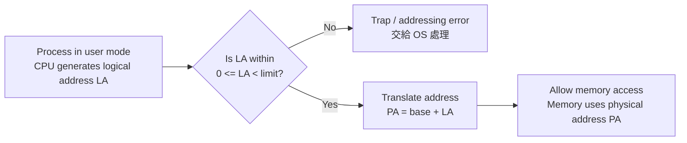
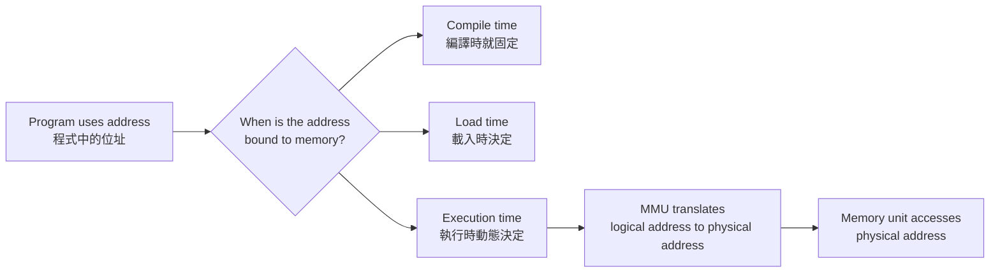
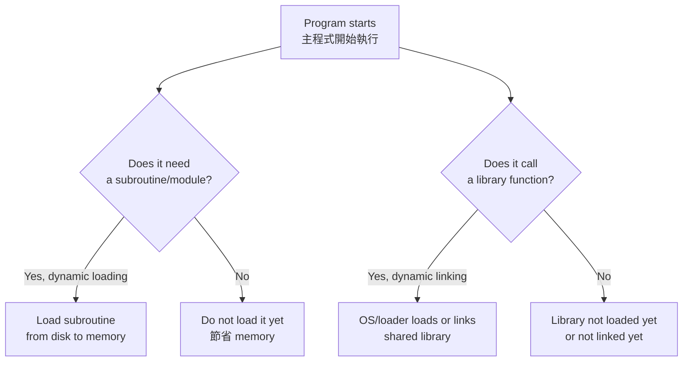
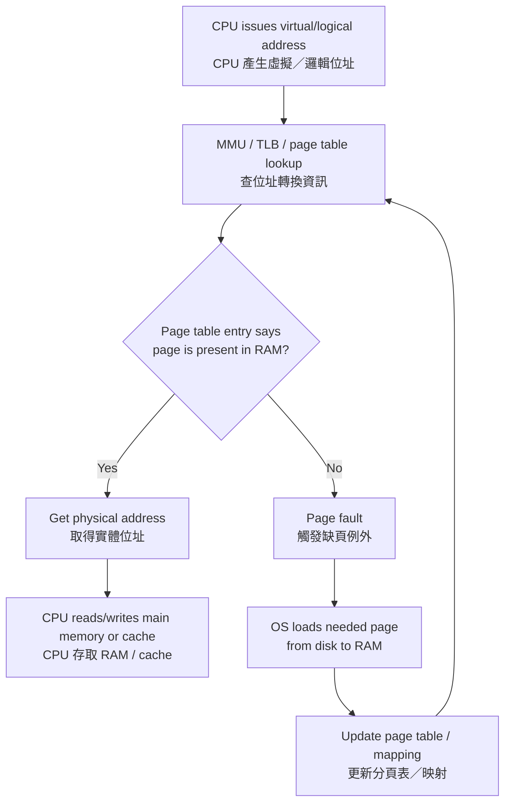
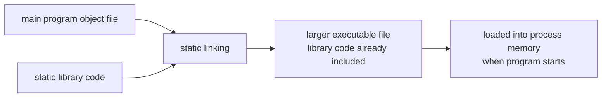
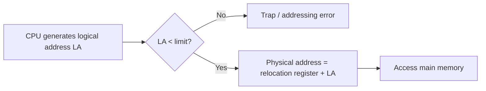
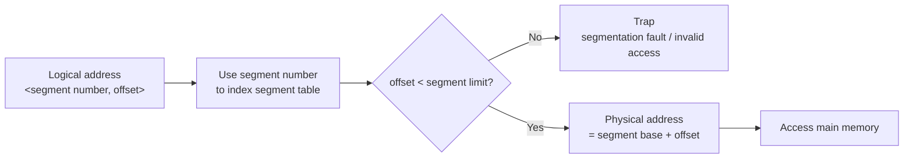
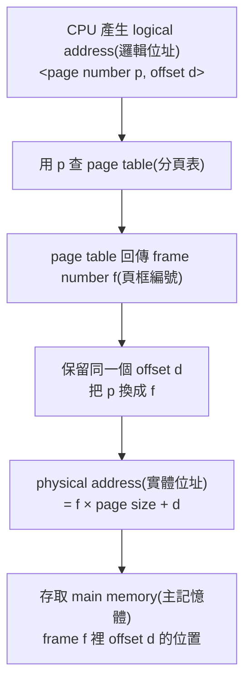

## ⭐Memory Management Background + Base and Limit Registers — 作業系統為什麼要管記憶體？

講義位置：PDF viewer page 3 ~ PDF viewer page 4

### 1. 這個知識點在解決什麼問題？

一個程式要執行，不能只待在 disk(磁碟) 裡；它必須被 brought into memory(載入記憶體)，放進某個 process(行程) 的記憶體空間中，CPU 才能執行它。講義也明確說，CPU 能直接存取的主要是 registers(暫存器) 和 main memory(主記憶體)，disk 不是 CPU 可直接拿來執行指令的地方。

生活化例子：
你可以把 disk 想成倉庫，main memory 想成工作桌，registers 想成你手上正在拿的工具。CPU 工作時不能每一步都跑去倉庫翻東西，所以程式和資料要先搬到工作桌附近。

---

### 2. Memory Management(記憶體管理)第一個核心矛盾：快、不夠快、又不能亂碰

講義 page 3 其實在建立三個限制：

1. Program must be brought into memory
   程式要執行，必須先從 disk 進入 memory。

2. Main memory can take many cycles
   CPU register 很快，可能一個 clock cycle 就能存取；main memory 慢很多，會造成 stall(停等)。

3. Protection of memory required
   OS 必須保護記憶體，避免一個 user process(使用者行程) 亂改別人的記憶體或 OS kernel(核心) 的資料。

所以 Chapter 8 不是只在問「資料放哪裡」，而是在問：

**如何讓每個 process 以為自己有一塊安全可用的記憶體，同時讓 CPU 能有效率地把 logical address(邏輯位址) 轉成真正的 physical address(實體位址)，又不能讓 process 越界亂碰？**

---

### 3. Base and Limit Registers(基底與界限暫存器)：最直覺的記憶體保護法

Base Register(基底暫存器) 可以想成「這個 process 的合法記憶體起點」。
Limit Register(界限暫存器) 可以想成「這個 process 合法使用的範圍大小」。

講義 page 4 寫到：一對 base and limit registers define the logical address space，而且 CPU 必須檢查 user mode 產生的每一次 memory access 是否介於 base 與 limit 所允許的範圍內。

用生活例子說：
假設學校借你一間實驗室，你可以用「第 30000 號櫃子開始，最多用 12000 格」。那麼：

* base = 30000
* limit = 12000
* 你能碰的範圍大約就是 30000 到 41999
* 你想碰 42000 以外，就違規，OS 要擋下來

---

### 4. 核心流程：CPU 每次記憶體存取都要過守門員

Base/Limit 的精神不是「相信程式自己守規矩」，而是硬體協助 OS 做檢查。

重點是：
**user mode 的 process 每次要碰 memory，都要先確認沒有越過自己的合法 logical address space(邏輯位址空間)。**

也就是：

**先檢查 logical address，再加 base 變 physical address。**

1. `LA < limit ?`
2. 若合法：`PA = base + LA`
3. 若不合法：trap to OS

!!! danger

    #### physical address 是啥

    `Physical address(實體位址)` 是：

    **RAM / main memory 硬體真正用來找到某個 byte 或 word 的位址。**

    也就是 memory unit(記憶體單元) 最後看到、拿去存取主記憶體的位置。

    講義 page 7 的定義是：CPU 產生的位址通常叫 `logical address(邏輯位址)`；memory unit 看到的位址，也就是載入到 `memory-address register(記憶體位址暫存器)` 的值，叫 `physical address(實體位址)`。

---

### 5. 最容易混淆的地方

第一個常見錯法是把 base 當成 limit。
Base 是起點，limit 是範圍或長度；不是終點。

第二個常見錯法是以為 CPU 直接相信 process 給的位址。
不對。講義強調 CPU 必須檢查 user mode 的每次 memory access。

第三個常見錯法是忘記這是「保護機制」，不是「效能最佳化機制」。
Base/Limit 的主要目的，是防止越界與互相破壞；但之後的 paging、TLB、cache 才會更明顯牽涉位址轉換與效能。

---

### 6. 中文理解版

Memory Management(記憶體管理)的起點是：程式必須載入主記憶體才能執行，但記憶體速度、空間與保護都有問題。Base and Limit Registers(基底與界限暫存器)是一種基本保護方法，用 base 記錄合法記憶體起點，用 limit 限制可用範圍；CPU 在 user mode 每次記憶體存取時都要檢查是否越界。

### 7. English Exam Version

Memory management is needed because a program must be loaded from disk into main memory before it can run, while the operating system must also ensure efficient access and memory protection. Base and limit registers provide a simple protection mechanism: the base register stores the starting physical address of a process, and the limit register defines the valid range of logical addresses. Every memory access generated in user mode must be checked to ensure that it falls within this allowed range.

### 8. 最短記法

**Program must be in memory to run. Base = start, Limit = legal range, CPU checks every user-mode memory access.**

### 為何叫做 logical ， logical 本身意義是什麼，和這裡有啥關聯

1.`logical` 本身的意思
    

`logical` 原本是 `logic(邏輯)` 的形容詞，基本意思是「跟推理規則、形式規則、抽象結構有關」。Merriam-Webster 對 `logical` 的定義包含「relating to logic」以及「formally true or valid」這類意思，也就是它不只是在說「合理」，而是在說「依某套規則成立」。[梅里亞姆-韋伯斯特詞典](https://www.merriam-webster.com/dictionary/logical?utm_source=chatgpt.com)

所以 `logical` 在電腦科學裡常常帶有這種語感：

**不是物理世界中的真實位置，而是某個抽象模型、規則系統、程式視角裡成立的位置或關係。**

---

2.跟 `logical address(邏輯位址)` 的關聯
    

講義說，CPU 產生的位址叫 `logical address(邏輯位址)`；memory unit(記憶體單元) 看到、真正送進 memory-address register 的位址叫 `physical address(實體位址)`。

講義\_chapter 8\_20240520

所以這裡的 `logical` 不是在說「這個 address 很合理」，而是在說：

**這個 address 是 process / program 的抽象位址規則裡的編號。**

也就是：

- `logical address`：程式世界裡的位址。
    
- `physical address`：RAM 硬體世界裡的位址。
    

社群問答裡也常用同一種說法：CPU 產生的 address 稱為 logical address，memory unit 看到的 address 稱為 physical address；若是 execution-time binding，兩者會不同，並透過 MMU 做轉換。[Stack Overflow](https://stackoverflow.com/questions/3697729/difference-between-logical-addresses-and-physical-addresses?utm_source=chatgpt.com)

### 錯題

!!! danger

    #### 1

    ##### Q:
    Explain why a program must be brought from disk into main memory before it can be executed by the CPU. Your answer must mention what the CPU can directly access.

    ##### 我寫的:
    必需要在 main memory 是因為如果在 disk 太慢了。

    ##### ANS:
    你說「disk 太慢」方向對，但考試版要更精準：CPU 不能直接從 disk 執行程式，CPU 可直接存取的是 registers(暫存器) 與 main memory(主記憶體)；disk 慢是原因之一，但不是唯一關鍵。講義 page 3 明確寫到程式必須從 disk 載入 memory 才能執行，而且 CPU 可直接存取的 storage 是 main memory 和 registers。

    #### 2

    ##### Q:
    Suppose a process has base = 30000 and limit = 12000. For each logical address, determine whether the access is legal or illegal, and briefly explain why:
    a. 0
    b. 11999
    c. 12000
    d. 15000

    ##### 我寫的：
    允許的範圍： 30000~41999，共 12000，都不合法，因為不在範圍30000~41999中

    ##### ANS：
    第 2 題錯在哪裡？
        

    你寫：

    「允許的範圍：30000～41999，共 12000，都不合法，因為不在範圍 30000～41999 中」

    這句其實抓到 **physical memory range(實體記憶體範圍)**，但題目問的是 **logical address(邏輯位址)**。

    在 base/limit 模型中：

    - `base = 30000`：這個 process 在 physical memory 的起點。
        
    - `limit = 12000`：這個 process 的 logical address 合法範圍大小。
        
    - 合法的 `logical address` 是 `0 ~ 11999`。
        
    - 轉成 physical address 時才加 base。
        

    所以正確判斷是：

    | logical address | 是否合法  | physical address | 原因                             |
    |-----------------|-----------|------------------|----------------------------------|
    | 0               | ✅ legal   | 30000            | 0 < 12000                        |
    | 11999           | ✅ legal   | 41999            | 11999 < 12000，是最後一格合法位址 |
    | 12000           | ❌ illegal | 不轉換           | 12000 不小於 limit，剛好越界      |
    | 15000           | ❌ illegal | 不轉換           | 15000 超過 limit                 |

    更精準地說：  
    **logical address 先檢查是否 `< limit`；合法後才做 `physical address = base + logical address`。**

    這也和講義 page 6 的說法一致：`local address` 必須與 `base register` 相加才會得到 `physical address`；page 7 則定義 CPU 產生的是 logical address，memory unit 看到的是 physical address。

    講義\_chapter 8\_20240520

    
    外部課程講義也用同樣定義：logical address 是 CPU 產生，也叫 virtual address；physical address 是 memory module 看到的位址。[ocw.nthu.edu.tw](https://ocw.nthu.edu.tw/ocw/upload/141/news/%E5%91%A8%E5%BF%97%E9%81%A0%E6%95%99%E6%8E%88%E4%BD%9C%E6%A5%AD%E7%B3%BB%E7%B5%B1_chap%EF%BC%908%EF%BC%BFOperating%20System%20Chap8%20Memory%20Management%EF%BC%BF.pdf?utm_source=chatgpt.com) 社群討論裡常見的混淆也正是「程式看到的位址」和「RAM 實際位置」混在一起。
    
    

## ⭐Address Binding — 程式的位址到底什麼時候變成真正的記憶體位置？

講義位置：PDF viewer page 5 ~ PDF viewer page 7

### 1. 這個概念在解決什麼問題？

程式寫出來時，裡面會有很多 address(位址)：例如某個變數在哪裡、某段 code 從哪裡開始執行。

但問題是：

!!! danger

    **程式還沒真的執行前，我們不一定知道它會被放到 ==main memory(主記憶體)== 的哪個位置。**

所以 `Address Binding(位址連結)` 在問：

**程式中的位址，要在什麼時候綁定成真正可執行／可存取的記憶體位置？**

講義 page 5 直接定義：Address Binding 是決定程式起始位置，也就是程式要在記憶體哪個地方開始執行。

---

### 2. 三種 Binding Time(連結時機)

### 2.1 Compile Time Binding(編譯時間連結)

在 compile time(編譯時間)，compiler(編譯器) 就決定程式將來執行的起始位址。

直覺例子：
像你在搬家前就指定「我一定要住 5000 號房」。如果到時候 5000 號房已經有人住，你就麻煩了。

缺點是：
如果那個位址被其他程式佔用，或之後想換位置，就要 recompile(重新編譯)。講義 page 5 也明確列這個缺點。

---

### 2.2 Load Time Binding(載入時間連結)

在 load time(載入時間)，由 linking loader / linkage editor 決定程式載入 memory 的起始位置。

!!! note
    Load Time Binding(載入時間連結) 的 load time(載入時間) 是指：

    程式從 disk 上的 executable file(可執行檔) 被 loader(載入器) 載入到 main memory(主記憶體)，準備成為可執行 process 的那個階段。

直覺例子：
你不是一開始就指定房號，而是到飯店 check-in 時，櫃台看哪間空房再安排你。

優點是比 compile time 彈性高。
但缺點是：程式一旦載入並開始執行，起始位址仍不能在執行期間改變。講義 page 5 也說，load time binding 支援 relocation(重定位)，但程式執行期間仍不可以改變起始位址。

---

### 2.3 Execution Time Binding(執行時間連結)

在 execution time(執行時間)，OS 可以在程式執行期間動態決定或調整程式起始位置，所以 ==又稱 `dynamic binding(動態連結／動態位址綁定)`==。

這需要額外硬體支援：`MMU(Memory-Management Unit，記憶體管理單元)`。

講義 page 6 說，execution time binding 由 OS 動態決定，需要 MMU；`Base Register(基底暫存器)` 記錄目前程式起始位址，`Local Address(區域位址)` 要和 base register 相加才會得到 physical address。

#### MMU(Memory-Management Unit，記憶體管理單元) 是啥？

MMU 主要做 address translation(位址轉換) 和 protection check(保護檢查)

假設：

base register = 14000
CPU 產生 logical address = 346

MMU 做的事就是：

physical address = base + logical address = 14000 + 346 = 14346

---

### 3. 為什麼 page 7 要接在 Address Binding 後面？

因為如果位址可以被轉換，我們就要分清楚兩種位址：

1. `Logical Address(邏輯位址)`：CPU / process 產生的位址。
2. `Physical Address(實體位址)`：memory unit 真正看到、真正拿去存取 RAM 的位址。

講義 page 7 明確定義：CPU 產生的位址通常稱為 logical address；記憶體單元看到的位址，也就是載入到 memory-address register 的數值，稱為 physical address。

所以 page 5～7 其實在講同一條故事：

**程式的位址何時決定？如果執行時才決定，就會出現 logical address 到 physical address 的轉換問題。**

---

### 4. 核心流程圖

---

### 5. 最短記法

`Address Binding` = **程式位址什麼時候變成記憶體位置**。

三種時機：

1. `Compile time`：編譯時固定，最不彈性。
2. `Load time`：載入時決定，執行期間不能改。
3. `Execution time`：執行時動態決定，最彈性，需要 MMU，效能較差。

### "Load time：載入時決定，執行期間不能改。"載入是指什麼時候

程式已經編譯好之後，準備被放進 main memory(主記憶體)、建立成 process(行程)、即將開始執行的那段時間。

## ⭐Dynamic Loading / Dynamic Linking — 程式一定要一開始全部載入嗎？

講義位置：PDF viewer page 8 ~ PDF viewer page 11

### 1. 這個概念在解決什麼問題？

前面 `Load-time binding(載入時間連結)` 比較像是在問：

**整個程式這次從記憶體哪裡開始執行？**

現在 `Dynamic Loading(動態載入)` 和 `Dynamic Linking(動態鏈結)` 問的是另一件事：

**程式裡不是每段 code、每個 library 都一定會用到，那可不可以等真的用到再載入或連結？**

生活化例子：
你去考試不會把整個書櫃搬進考場，你只會帶這次可能會用的筆記。Dynamic Loading / Linking 的精神也是：**不要一開始把所有東西都放進 main memory，等真的需要時再處理。**

---

### 2. Dynamic Loading(動態載入)

`Dynamic Loading(動態載入)` 是：

**主程式先在 main memory 執行；某個 subroutine(副程式) 真的被呼叫時，才把那個副程式從 disk / auxiliary storage 載入 main memory。**

講義 page 8 說，Dynamic Loading 是主程式呼叫副程式時，才將副程式由輔助記憶體載入主記憶體。

直覺例子：

你寫一個程式有：

1. 正常流程。
2. 錯誤處理流程。
3. 罕見功能流程。

如果錯誤處理流程 99% 時候不會用到，那一開始就把它載入 memory 可能浪費空間。Dynamic Loading 就是等真的發生錯誤、真的呼叫那段 code 時，再把它載入。

---

### 3. Dynamic Loading 的優缺點

優點：節省 `main memory(主記憶體)` 空間。講義 page 9 明確列出優點是節省 main memory 空間。

缺點：`programmer(程式設計者)` 負擔較大，因為要自己規劃什麼時候載入，而且可能拖長執行時間。講義 page 9 也說缺點是 programmer 的負擔、拖長執行時間。

最短理解：

**Dynamic Loading 省 memory，但比較麻煩，且用到時會有額外載入成本。**

---

### 4. Linking(鏈結)是什麼？

`Linking(鏈結)` 是把 library(函式庫) 或 object file(目的檔) 接到程式裡，讓程式可以呼叫那些 library code。

講義 page 10 說，函式庫是向其他程式提供服務的 code；library linking 是把一個或多個函式庫包括到程式中，分成 `Static Linking(靜態鏈結)` 與 `Dynamic Linking(動態鏈結)`。

---

### 5. Static Linking(靜態鏈結)

`Static Linking(靜態鏈結)` 是：

**在產生 executable file(可執行檔) 時，就把 library 的內容複製／整合進可執行檔。**

優點是執行時比較直接。
缺點是 executable file 會變大，需要更多系統資源，載入記憶體時也比較花時間。講義 page 10 明確列出靜態連結最大缺點是可執行檔太大，需要更多系統資源，裝入記憶體也消耗更多時間。

生活化例子：
你把整本工具書影印進自己的筆記本，筆記本就會很厚。

#### executable file 是啥

executable file 裡面大概有什麼？
    

你可以把 executable file 想成「已經打包好的程式搬家箱」。

裡面通常包含：

1. `text section / code section(程式碼區段)`  
    已經變成 CPU 能執行的 machine instructions(機器指令)。講義 Chapter 3 也說 text section contains the executable code，並且是從 program's executable file mapped into memory。
    
    講義\_chapter 3\_20240318
    
2. `data section(資料區段)`  
    已初始化的 global/static variables。
    
3. `metadata(中繼資訊)`  
    告訴 OS loader 怎麼把這個檔案放進 memory，例如入口點在哪、哪些段要載入、需要哪些 shared libraries。
    
4. `relocation / linking information(重定位／鏈結資訊)`  
    有些 executable file 需要 loader 在載入時修正位址或接上 library。

---

### 6. Dynamic Linking(動態鏈結) / Shared Library(共用函式庫)

`Dynamic Linking(動態鏈結)` 是：

**程式執行期間，某個 library module 真的被呼叫時，才由 OS 的 loader 把它載入 main memory。**

講義 page 11 說，Dynamic Linking 又稱 Shared Library，在程式執行期間，當某個模組真正被呼叫到時，才由 OS 裝載程式將其載入 main memory。

`Shared Library(共用函式庫)` 的重點是：

**多個 process 可以共用同一份 library copy，不需要每個 process 都載入一份。**

講義 page 11 也說，大多數情況下，同一時間多個應用可以使用一個函式庫的同一份拷貝，OS 不需要載入多個實例。

#### library copy 是啥

---

### 7. Dynamic Loading vs Dynamic Linking 差在哪？

| 比較         | Dynamic Loading                | Dynamic Linking                  |
|--------------|--------------------------------|----------------------------------|
| 主要對象     | 程式自己的 subroutine / module | library / shared library         |
| 誰負擔較明顯 | programmer 自己規劃            | OS / loader 支援較多             |
| 核心精神     | 用到副程式才載入               | 用到函式庫才鏈結／載入            |
| 目的         | 節省 memory                    | 節省 memory、支援 library sharing |

最容易混淆的地方是：
兩者都很像「用到才載入」，但 **Dynamic Loading 偏向程式模組載入策略；Dynamic Linking 偏向函式庫連結策略**。

---

### 8. 流程圖

---

### 9. 最短記法

`Dynamic Loading`：**副程式用到才載入。**

`Static Linking`：**函式庫先塞進 executable，檔案大。**

`Dynamic Linking / Shared Library`：**函式庫用到才載入，而且多個 process 可共用同一份。**

## 我覺得好混亂，從 p.3 開始，到底有哪些是被存到 main memory 中，到底有哪些只是映射而已？映射是指複製到 main memory 中嗎？還是只是知道實體位置之後直接讀取實體位置

1.先把最關鍵的結論講清楚

你現在混亂是正常的，因為這幾頁把三件不同層次的事混在一起講：

1. `Loading(載入)`：把程式碼／資料從 disk 帶進 `main memory(主記憶體)`，或建立之後可被帶進 memory 的關係。
2. `Linking(鏈結)`：把程式裡「我要呼叫某函式」這種 reference(引用)，接到真正的 code / library。
3. `Mapping(映射)`：建立「process 看到的 logical / virtual address」到「實體記憶體位置或 backing file」的對應關係。

最短答案：

**Mapping(映射)本身不是複製。**
它是「建立地址對照關係」。

但：

**如果 CPU 真的要執行或讀取某段 code/data，==那段內容最後一定要在 main memory 裡；如果還不在，就會由 OS 載入進 RAM 後再讀。==**

所以不是：

「知道 disk 實體位置後，CPU 直接讀 disk」。

而是：

「CPU 只能直接讀 main memory/registers；如果資料目前只在 disk，OS 必須先把它帶進 main memory。」講義 page 3 明確說 program must be brought from disk into memory 才能 run，且 CPU 能直接存取的 storage 只有 main memory 和 registers。

---

2.三個詞分開定義

### 2.1 Loading(載入)

`Loading` 解決的是：

**東西有沒有進入 main memory，或有沒有準備好被放進 process 可用的記憶體空間。**

例如：

* executable file 從 disk 載入 memory。
* dynamic loading 時，副程式被呼叫才從 auxiliary storage 載入 main memory。
* dynamic linking 時，shared library 被需要時才由 OS loader 載入 main memory。

講義 page 8 說 `Dynamic Loading(動態載入)` 是主程式呼叫副程式時，才將副程式由輔助記憶體載入主記憶體；同頁也說所有副程式以 relocatable load format 存在磁碟中，需要時載入主記憶體並更新行程位址表。

---

### 2.2 Linking(鏈結)

`Linking` 解決的是：

**程式裡的函式名稱／外部符號／library reference 要接到哪一段真正的 code。**

例如你的程式呼叫：

`printf()`

Linking 要處理的是：

「`printf` 這個名字到底接到哪個 library 裡的哪段機器碼？」

講義 page 10 說，library linking 是把一個或多個函式庫包括到程式中，分為 static linking 與 dynamic linking。

所以：

**Linking 不是等於載入 main memory。**
它的核心是「接引用」。

---

!!! danger
    ### 2.3 Mapping(映射)

    `Mapping` 解決的是：

    **process 看到的 address，要對應到哪個 physical memory 或哪個 file-backed object。**

    它不是直接複製。

    比較精準地說，mapping 是 OS / MMU 建立一份對照：

    | process 看到               | OS / MMU 對應到                              |
    |----------------------------|----------------------------------------------|
    | virtual address 0x400000   | physical frame A，或某 executable file 的某段 |
    | virtual address 0x7f...    | shared library 的某段 code                   |
    | virtual address stack area | process 自己的 stack pages                   |

Linux `mmap()` 的官方手冊也把 mapping 描述成「在 process 的 address space 建立 mapping」，而且 `munmap()` 是刪除指定 address range 的 mapping；這表示 mapping 是 address-space 關係，不是單純複製檔案。([man7.org][1])

---

3.你問的核心：映射是複製到 main memory 嗎？

答案要分兩層：

### 3.1 Mapping 本身不是複製

當 OS 說：

「把 shared library map 到 process address space」

意思不是立刻把整個 library 複製一份給這個 process。

它的意思是：

**這個 process 的某段 virtual address，之後如果被存取，應該對應到這個 library 的某些 code/data。**

也就是先建立關係。

---

### 3.2 但真的執行時，內容必須在 main memory

CPU 不能直接從 disk 執行 library code。
所以如果那一頁 library code 還不在 RAM，通常會發生 page fault，OS 再把那一頁從 disk 載入 RAM，更新 page table / mapping，然後 CPU 繼續執行。

因此比較正確的流程是：

所以不是：

**mapping = 複製。**

也不是：

**mapping = 知道 disk 位置後 CPU 直接讀 disk。**

而是：

**mapping = 建立地址對應；真正被 CPU 使用的 bytes 最後必須在 RAM。**

---

4.從 p.3 開始逐頁整理：哪些真的在 main memory？哪些只是關係？

### 4.1 PDF viewer page 3：Program must be brought into memory

這頁的意思最硬：

**程式要 run，就必須從 disk 被 brought into memory，而且 placed within a process。**

也就是：

| 東西                           | 是否在 main memory？                 | 說明                                      |
|--------------------------------|-------------------------------------|-------------------------------------------|
| 即將執行的 program code / data | 至少需要的部分要在 main memory      | CPU 只能直接存取 main memory 和 registers |
| disk 上的 executable file      | 不算正在被 CPU 直接執行             | 它只是來源                                |
| process                        | 需要有 memory image / address space | 才能被 CPU 執行                           |

講義 page 3 的核心就是：CPU 不能直接跑 disk 上的程式檔。

---

### 4.2 PDF viewer page 5～6：Address Binding

這裡不是在講「又載入了什麼新東西」，而是在講：

**程式位址什麼時候決定。**

| Binding 類型             | main memory 發生什麼？             | 重點                                                     |
|--------------------------|-----------------------------------|----------------------------------------------------------|
| `Compile-time binding`   | 執行前已假設固定 physical address | 位址太早固定                                             |
| `Load-time binding`      | 載入 main memory 時決定起始位置   | 載入時 relocation                                        |
| `Execution-time binding` | 執行中靠 MMU 動態轉換             | logical address 加 base / 或透過 MMU 轉 physical address |

page 6 說 `Base Register` 記錄目前程式起始位址，`local address` 要和 base register 相加才會得到 physical address。

所以 page 5～6 重點不是「copy 哪個檔案」，而是：

**process 內部位址要如何變成 main memory 的真正位置。**

---

### 4.3 PDF viewer page 7：Logical Address / Physical Address

這頁純粹是在定義兩種位址：

| 位址               | 是誰看到？          | 是否代表東西被複製？                |
|--------------------|--------------------|------------------------------------|
| `logical address`  | CPU / process 產生 | ❌ 不是複製，只是 process 視角的位址 |
| `physical address` | memory unit 看到   | ❌ 不是複製，是 RAM 真正被存取的位置 |

講義 page 7 說 CPU 產生的是 logical address，memory unit 看到的是 physical address。

所以這頁的「映射／轉換」是地址關係，不是搬資料。

---

### 4.4 PDF viewer page 8～9：Dynamic Loading

這裡就真的有「載入到 main memory」。

| 東西                                  | 一開始在 main memory 嗎？          | 什麼時候進 main memory？          |
|---------------------------------------|-----------------------------------|----------------------------------|
| 主程式                                | 是，主程式在 main memory 執行      | program start 時                 |
| 很少用到的 subroutine                 | 不一定                            | 被呼叫時才載入                   |
| relocatable load format 的 subroutine | 一開始在 disk / auxiliary storage | 需要時由 loader 載入 main memory |

講義 page 8 說，Dynamic Loading 是主程式執行中，需要呼叫其他程式時，先看它是否已在 memory；如果不是，就呼叫 relocatable linking loader，把所需程式載入 main memory，並更新行程位址表。

這句很重要：

**Dynamic Loading 不是只有 mapping，它真的會在需要時把副程式載入 main memory。**

---

### 4.5 PDF viewer page 10：Static Linking

`Static Linking(靜態鏈結)` 是：

**library code 在產生 executable file 時，就被放進 executable file。**

所以流程是：

所以 static linking 下：

| 東西         | 何時進 executable file？          | 何時進 main memory？              |
|--------------|----------------------------------|----------------------------------|
| library code | link time 就放進 executable file | executable 被載入時一起進 memory |

講義 page 10 說 static linking 會讓可執行檔太大，需要更多系統資源，裝入記憶體也消耗更多時間。

---

### 4.6 PDF viewer page 11：Dynamic Linking / Shared Library

`Dynamic Linking(動態鏈結)` 比較微妙，因為它同時有 mapping 和 loading。

講義 page 11 說：當某個模組被真正呼叫到時，才由 OS loader 將其載入 main memory；而多個應用可以使用一個函式庫的同一份拷貝，OS 不需要載入多個實例。

所以：

| 層次                 | 發生什麼                                                |
|----------------------|---------------------------------------------------------|
| process 視角         | shared library 被 map 到 process 的 address space       |
| physical memory 視角 | ==library code pages 可以只有一份，被多個 process 共用== |
| disk 視角            | library file 原本在 disk 上，例如 `.so` 或 `.dll`        |
| 執行時               | 真的需要的 pages 會在 RAM 中被 CPU 執行                 |

官方 Linux `ld.so` 文件也說 dynamic linker 會找出並載入程式需要的 shared objects，準備程式執行後再執行它。([man7.org][2])

---

5.用一張總表把「在 memory」和「映射」分清楚

| 章節頁面 | 名詞                             |       是複製／載入到 main memory 嗎？ |               是 mapping 嗎？ | 精準理解                                  |
|----------|----------------------------------|------------------------------------:|-----------------------------:|-------------------------------------------|
| p.3      | program brought into memory      |           ✅ 是，至少必要部分要進 RAM | 也會有 process address space | 不進 memory 不能跑                        |
| p.5      | compile-time binding             |                      ❌ 不是載入重點 |           ❌ 主要不是 mapping | 編譯時就固定位址                          |
| p.5      | load-time binding                |                    ✅ 載入時決定位址 |             可能建立位址配置 | 載入時 relocation                         |
| p.6      | execution-time binding           |                      不一定搬新資料 |                 ✅ 是地址轉換 | 執行中 logical → physical                 |
| p.7      | logical / physical address       |                        ❌ 不是搬資料 |            ✅ 是位址視角／轉換 | CPU 產生 logical，memory 看 physical       |
| p.8      | dynamic loading                  |              ✅ 需要時真的載入副程式 |         ✅ 也會更新行程位址表 | 用到才載入 subroutine                     |
| p.10     | static linking                   |         executable 載入時一起進 RAM |             較少強調 sharing | library code 已塞進 executable            |
| p.11     | dynamic linking / shared library |     ✅ 需要時 library pages 會進 RAM |         ✅ map 到多個 process | 多 process 共用同一份 physical code pages |
| p.12     | swapping                         | ✅/❌ process 可被搬出 RAM、再搬回 RAM |    可涉及 address space 狀態 | 不在 RAM 就不能直接執行                   |

---

6.你可以用「三層世界」理解

### 6.1 Disk 世界

這裡放：

* executable file
* shared library file
* relocatable load format 的 subroutine
* backing store / swap area

這些東西躺在 disk 上時，CPU 不能直接執行。

---

### 6.2 Process address space 世界

這是 process 自己看到的世界。

裡面可能有：

* code segment
* data segment
* heap
* stack
* mapped shared library region

注意：
**process address space 裡「看得到」某段 library，不代表每個 process 都真的有一份獨立 physical copy。**

---

### 6.3 Physical memory 世界

這是 RAM 真正存放 bytes 的地方。

裡面可能有：

* process 的 code/data/heap/stack pages
* shared library 的 code pages
* kernel 管理的 page cache
* page frames

真正 CPU 執行時，最後要靠 MMU 把 process 的 logical / virtual address 轉成 physical address，memory unit 才能存取。講義 page 7 的 logical / physical address 定義就是在講這個視角差異。

---

7.回答你最後那句：「知道實體位置之後直接讀取實體位置」嗎？

要分成 CPU 視角和 OS/MMU 視角。

### 7.1 CPU 執行程式時

程式通常產生 logical / virtual address。
CPU 搭配 MMU 轉成 physical address。
memory unit 用 physical address 存取 RAM。

這部分可以說：

**最後是讀 RAM 的 physical address。**

---

### 7.2 如果內容還在 disk

不能直接讀 disk 的 physical location 來執行。

正確流程是：

1. process 存取某個 virtual address。
2. MMU 查 mapping。
3. 如果 page 不在 RAM，觸發 page fault。
4. OS 從 disk 把對應 page 載入 RAM。
5. 更新 mapping。
6. CPU 重新執行該指令，這次從 RAM 讀 physical address。

所以：

**mapping 可以先存在，但真正使用時資料必須在 RAM。**

---

8.最短總結

你先記這三句就好：

1. `Loading`：把 code/data 從 disk 帶進 main memory，或讓它可被 process 使用。
2. `Linking`：把函式／library 的名字或引用，接到真正 code 的位置。
3. `Mapping`：建立 process address 到 physical memory / file-backed object 的對應；mapping 本身不是複製，但被 CPU 真正用到的內容最後必須在 RAM。

最重要的修正：

**shared library 不是「放在 process 外面，process 知道實體位置後直接去讀」。**
它是：

**被 map 到每個 process 的 address space；底層 physical memory 裡的 code pages 可以只有一份，由 OS/MMU 讓多個 process 共用。**

[1]: https://man7.org/linux/man-pages/man2/mmap.2.html?utm_source=chatgpt.com "mmap(2) - Linux manual page"
[2]: https://man7.org/linux/man-pages/man8/ld.so.8.html?utm_source=chatgpt.com "ld.so(8) - Linux manual page"

## ⭐Swapping — 記憶體不夠時，OS 能不能先把 process 暫時搬出去？

講義位置：PDF viewer page 12 ~ PDF viewer page 13

### 1. 這個概念在解決什麼問題？

前面我們一直說：

**program / process 必須在 main memory 裡，CPU 才能執行它。**

但問題是，==main memory 空間有限==。假設目前有很多 process，有些暫時不急著執行，OS 可以先把某個 process 從 main memory 搬到 disk 上的 `backing store(備份儲存區)`，讓出 RAM 給別的 process。之後需要它繼續執行時，再搬回 main memory。

這個動作就叫 `Swapping(置換)`。

講義 page 12 的定義是：process 必須在 memory 才能執行，但它可能暫時被 swapped out 到 backing store，之後再回到 memory 繼續執行。

---

### 2. Swapping 的核心流程

最重要的觀念：

**swapped out 的 process 不是消失，也不是終止，只是暫時不在 main memory。**

---

### 3. 誰負責 Swapping？

講義 page 12 寫：由 `mid-term scheduler(中程排班程式)` 負責。

這裡可以和 Chapter 6 的 scheduler 連起來：

* `short-term scheduler(CPU scheduler，短程排班程式)`：從 ready queue 選誰拿 CPU。
* `mid-term scheduler(中程排班程式)`：決定哪些 process 暫時 swap out / swap in，調整記憶體壓力與 multiprogramming degree。

所以 Swapping 不是 CPU 排班本身，而是比較偏「記憶體管理＋行程管理」的中程決策。

---

### 4. Swapping 和 Ready Queue 的關係

你前面問過「放進 main memory 是不是 ready queue」。現在可以更精準：

* 在 main memory 裡的 process，可能是 ready、running、waiting。
* 被 swapped out 的 process，不在 main memory，通常不能直接拿 CPU 執行。
* 要繼續執行前，必須先 swapped in 回 main memory。

所以：

**ready queue 裡的 process 通常已在 main memory；swapped-out process 不適合直接視為 ready-to-run。**

---

### 5. Swapping 的代價

Swapping 的主要代價是 I/O 很慢。

因為把 process 從 ==memory 搬到 backing store(secondary memory, disk)== ，再搬回來，涉及 disk / storage transfer。這通常比 CPU 計算慢很多，所以 Swapping 不能太頻繁。講義 page 13 標出 `swapping transfer time 計算`，表示這個主題的重點之一就是搬移資料的時間成本。

跨來源補充／一般教材背景，非目前講義內文：
實務上 swap time 大致和「要搬的 process 大小」與「storage transfer rate」有關。process 越大、磁碟越慢，swap cost 越高。

---

### 6. 最短記法

`Swapping` = **把暫時不用的 process 從 main memory 搬到 backing store，之後再搬回來繼續執行。**

`swapped out`：暫時離開 RAM。
`swapped in`：回到 RAM。
`mid-term scheduler`：負責決定 swap out / swap in。

## ⭐Contiguous Memory Allocation — OS 怎麼把一整塊連續 RAM 配給 process？

講義位置：PDF viewer page 14 ~ PDF viewer page 20

### 1. 這個概念在解決什麼問題？

`Contiguous Memory Allocation(連續記憶體配置)` 在問：

**如果一個 process 需要 N KB memory，OS 要怎麼從 RAM 裡找一整塊連續空間給它？**

這裡的「連續」很重要。
不是說「總共有 N KB 空洞就好」，而是要有一段連在一起的 free block(空閒區塊)。

講義 page 14 說，OS 會依據各個 process 的大小，找到一塊夠大的連續可用記憶體，配置給該 process 使用；OS 會用 linked list 管理 free blocks，稱為 `Available list / AV-list(可用串列)`。

生活化例子：
你要停一台遊覽車，需要一整排連續空位。停車場裡零散有 20 個空格沒用，仍然不代表你能停得進去，因為遊覽車需要連續空間。

---

### 2. Page 14 的 relocation / limit 其實是在補前面 base-limit 的正確版

講義 page 14 說：

* `Relocation register(重定位暫存器)` 裝的是 smallest physical address，也就是 process 這塊連續實體記憶體的起點。
* `Limit register(界限暫存器)` 裝的是 logical address 的範圍。
* 每個 logical address 必須小於 limit register。

所以正確流程是：

這也修正了你前面指出的問題：
不是拿 logical address 去比 `base ~ base + limit - 1`，而是先檢查 `LA < limit`，合法後才加 relocation/base。

---

### 3. Available list(可用串列)：OS 怎麼記錄空洞？

OS 需要知道現在 RAM 裡有哪些 free blocks，所以用 `Available list / AV-list` 記錄空閒區塊。

例如目前有這些 free blocks：

| Free block |   Size |
|------------|-------:|
| Block A    | 100 KB |
| Block B    | 500 KB |
| Block C    | 200 KB |
| Block D    | 300 KB |
| Block E    | 600 KB |

如果新 process 需要 212 KB，OS 要決定配哪一塊。這就是 page 15 的三個策略。

---

### 4. First Fit(最先配合)

`First Fit` 的規則是：

**從 AV-list head 開始找，遇到第一個 size >= n 的 free block 就配置。**

假設 process 需要 212 KB：

* 100 KB 不夠
* 500 KB 夠，所以直接用 500 KB
* 不再繼續找後面的 300 KB 或 600 KB

優點是找得快，因為不用看完整個 list。
缺點是前面容易留下很多小洞。

講義 page 15 對 First fit 的定義正是「從 AV list head 找，第一個 free block size >= n 就配置」。

---

### 5. Best Fit(最佳配合)

`Best Fit` 的規則是：

==**看所有 free blocks，找 size >= n 且最接近 n 的那一塊。**==

假設 process 需要 212 KB：

* 300 KB 夠，而且比 500 KB、600 KB 更接近 212 KB
* 所以 Best fit 會選 300 KB

直覺是：
「用剛剛好的洞，避免浪費大洞。」

但講義 page 15 提醒：長期而言會剩下很大的洞和很小的洞。小洞太小，後面可能根本沒 process 用得上。

---

### 6. Worst Fit(最差配合)

`Worst Fit` 的規則是：

**看所有 free blocks，找扣掉需求後剩最多的那一塊，也就是最大的洞。**

假設 process 需要 212 KB：

* 600 KB 剩 388 KB
* 500 KB 剩 288 KB
* 300 KB 剩 88 KB

Worst fit 選 600 KB。

直覺是：
「不要把小洞切得更破碎，從最大洞切，剩下來的洞比較可能還能用。」

講義 page 15 說 Worst fit 是找所有 free block 中 `size - n` 最大者，長期結果每個洞大小差不多。

!!! note
    之所以說 `size - n` 是為了保留 「放的下」 的意思。
    
---

### 7. Example 8.16：三種策略會選不同洞

講義 page 17 給的 free blocks 是：

`100 KB, 500 KB, 200 KB, 300 KB, 600 KB`

Processes 需求是：

`212 KB, 417 KB, 112 KB, 426 KB`

講義列出的結果是：

| 策略      | 配置結果                       |
|-----------|--------------------------------|
| First Fit | 500 KB, 600 KB, 200 KB, wait   |
| Best Fit  | 300 KB, 500 KB, 200 KB, 600 KB |
| Worst Fit | 600 KB, 500 KB, 300 KB, wait   |

這個例子要看出一件事：

**同樣的 free blocks 和 process requests，不同策略會造成不同剩餘空洞，最後可能影響後面的 process 能不能被配置。** 

---

### 8. External Fragmentation(外部碎裂)

!!! note
    這裡指的 Fragmentation 可以解釋成 memory waste(記憶體浪費)。

`External Fragmentation(外部碎裂)` 是：

**所有 free memory 加起來明明夠，但因為它們不連續，所以無法配置給需要一整塊連續空間的 process。**

例如：

| Free block |   Size |
|------------|-------:|
| A          | 100 KB |
| B          | 150 KB |
| C          | 180 KB |

總 free memory = 430 KB。
但如果 process 需要 300 KB 的連續空間，就不能配置，因為沒有任何單一 free block >= 300 KB。

講義 page 16 和 page 18 都強調：外部碎裂是因為總可用空間大於 process 需求，但空間不連續，所以無法配給該 process，造成 memory 空間閒置。

---

### 9. Compaction(壓縮／重整)

`Compaction(壓縮)` 是 external fragmentation 的解法之一：

**移動執行中的 process，把分散的小 free blocks 聚集成一塊大的連續空間。**

它很像磁碟重組。

但講義 page 19 也提醒兩個限制：

1. 很難在短時間內決定最佳壓縮策略。
2. process 必須是 `dynamic binding(動態位址綁定)` 才支援。

為什麼要 dynamic binding？
因為 process 被搬到 RAM 的新位置後，位址轉換要能跟著改。如果位址早就寫死，就不能隨便搬。

---

### 10. Internal Fragmentation(內部碎裂)

`Internal Fragmentation(內部碎裂)` 是另一種浪費：

**==OS 配給 process 的 memory 大於 process 真正需要的 memory== ，多出來那一小段 process 用不到，其他 process 也不能用。**

例如：

* OS 配給 process 一塊 4 KB
* process 實際只用 3.6 KB
* 剩下 0.4 KB 卡在這塊配置裡，別人不能用

這就叫 internal fragmentation。

!!! danger
    
    為何 OS 配給 process 的 memory 大於 process 真正需要的 memory？
    
    ---

    因為 **OS / hardware 很常不是照 process 精準需要的 byte 數配置，而是照某個 allocation unit(配置單位) 配置**。

    所以 process 可能只需要 `40 KB`，但系統的配置單位可能讓它拿到 `64 KB`、`100 KB`、或一整個 `4 KB page` 的倍數。這時 process 真正用得到的部分小於 OS 分給它的整塊，剩下那一段就變成 `Internal Fragmentation(內部碎裂)`。

    講義定義也是這樣：OS 配置給 process 的 memory 空間大於 process 真正所需，這些多出來的空間 process 用不到，也不能供其他 process 使用；而且講義也說 page size 越大，internal fragmentation 通常越嚴重。

    講義\_chapter 8\_20240520

    外部教材也用同樣說法：internal fragmentation 常見於 fixed-sized memory blocks，allocated block 比 process request 大時，沒用到的部分就閒置。

講義 page 20 說，OS 配置給 process 的 memory 空間大於 process 真正所需，這些多出來的空間 process 用不到，也無法供其他 process 使用，形成浪費。

---

### 11. External vs Internal 最短對照

| 類型                     | 浪費在哪裡                 | 一句話                    |
|--------------------------|----------------------------|---------------------------|
| `External Fragmentation` | process 外面的 free holes  | 總空間夠，但不連續         |
| `Internal Fragmentation` | process 被分配到的區塊裡面(==這區塊屬於 process ，但是 process 用不到==) | 分太大，裡面有用不到的零頭 |

最短記法：

**External = 洞在外面，不連續。**
**Internal = 浪費在裡面，配太大。**

## ⭐Segmentation — 為什麼不要把 process 只看成一整塊連續記憶體？

講義位置：PDF viewer page 21 ~ PDF viewer page 25

### 1. 這個概念在解決什麼問題？

前面 `Contiguous Memory Allocation(連續記憶體配置)` 把一個 process 看成「一整塊」：

一個 process 需要多少 memory，OS 就找一整段連續 free block 給它。

但實際上，程式設計者看程式時，不會只覺得它是一整條連續 bytes。我們通常會把程式想成不同部分：

1. `code(程式碼)`
2. `global variables(全域變數)`
3. `heap(堆積)`
4. `stack(堆疊)`
5. `standard C library(標準 C 函式庫)`

講義也列出 C 程式編譯後可能分成這些 segments。

所以 `Segmentation(分段)` 想解決的問題是：

**讓 memory 的 logical view(邏輯視角) 更接近使用者／程式設計者看程式的方式。**

---

### 2. Segmentation 的基本想法

`Segmentation(分段)` 不是把 process 當成一整塊，而是把 process 切成多個 logical segments(邏輯段)。

每個 segment 可以有自己的：

* `base(基底)`：這個 segment 在 main memory 的起始實體位置。
* `limit(界限)`：這個 segment 的長度。

所以 process 不再只有一組 base/limit，而是：

**每個 segment 都有一組 base/limit。**

講義說 OS 會替每個 process 準備 `segment table(分段表)`；`Segment-table length register(STLR)` 記錄各段大小，`Segment-table base register(STBR)` 記錄各段載入記憶體的起始位址。

---

### 3. Segment Table(分段表)在做什麼？

一個 logical address 在 segmentation 裡通常可以想成：

`<segment number, offset>`

!!! note
    offset：偏移量
    
    offset：位移、偏移量；抵銷、補償
    ├─ off：離開、偏離、分開
    └─ set：放置、設定、使處於某位置

例如：

`<2, 120>`

意思是：

「我要存取第 2 段裡面，距離該段開頭 120 bytes 的位置。」

Segment table 會告訴硬體：

| Segment | Base | Limit |
| ------: | ---: | ----: |
|       0 | 1000 |   400 |
|       1 | 5000 |  1000 |
|       2 | 9000 |   300 |

如果 address 是 `<2, 120>`：

1. 查 segment 2。
2. 檢查 offset `120 < limit 300`。
3. 合法，所以 physical address = `base 9000 + offset 120 = 9120`。

如果 address 是 `<2, 350>`：

1. 查 segment 2。
2. 檢查 offset `350 < limit 300` 不成立。
3. 越界，trap 給 OS。

---

### 4. Segmentation 位址轉換流程

這和前面的 base/limit 很像，但差別是：

**base/limit 從「整個 process 一組」變成「每個 segment 一組」。**

---

### 5. Segmentation 為什麼比較適合 sharing / protection？

==因為每個 segment 有語意。==

例如：

* code segment 可以設成 read-only。
* stack segment 可以設成 private。
* shared library segment 可以讓多個 process 共用。
* global variables segment 可以給每個 process 自己一份。

講義也說 segmentation 支援 memory sharing 和 protection，而且比 paging 容易實施，因為 paging 的某個 page 可能會混到不同需求的程式片段。

直覺例子：

如果你用「章節」管理一本書，要把第 3 章分享給別人很容易；但如果你用固定頁數切，每一頁可能剛好橫跨兩個章節，管理語意就沒那麼漂亮。

---

### 6. Segmentation 的優點

講義列出的優點包含：

1. 無 `Internal Fragmentation(內部碎裂)`。
2. 支援 memory sharing 和 protection，而且比 paging 容易實作。
3. 支援 dynamic loading 與 virtual memory。
4. Segmentation 和 paging 是獨立觀念，可以同時使用。

第一點要小心：
Segmentation 的 segment size 可以依照實際邏輯段大小配置，所以不像固定 page size 那樣容易在 block 內部留零頭，因此講義說它無 internal fragmentation。

---

### 7. Segmentation 的缺點

講義列出的缺點包含：

1. 有 `External Fragmentation(外部碎裂)`。
2. 記憶體存取時間較長。
3. 需要額外硬體支援。

為什麼有 external fragmentation？

因為每個 segment 本身仍需要連續配置。
如果一個 segment 需要 400 KB，但 free memory 分散成 `120 KB + 180 KB + 250 KB`，總量夠，卻沒有單一連續 free block 放得下，這仍然會 external fragmentation。

---

### 8. Segmentation 和 Contiguous Allocation 的差別

| 比較                     | Contiguous Allocation | Segmentation                  |
| ---------------------- | --------------------- | ----------------------------- |
| process 視角             | 整個 process 一整塊        | process 分成多個 logical segments |
| base/limit             | 整個 process 一組         | 每個 segment 一組                 |
| sharing/protection     | 粗粒度                   | 比較自然，因為每段有語意                  |
| internal fragmentation | 視配置方式而定               | 講義列為無 internal fragmentation  |
| external fragmentation | 有                     | 有，因為每段仍需連續空間                  |

---

### 9. 最短記法

`Segmentation` = **照程式邏輯切段，每段各自有 base/limit。**

位址形式：

`<segment number, offset>`

合法性：

`offset < limit`

轉換：

`physical address = segment base + offset`

優點：

**符合使用者 logical view，sharing/protection 容易，無 internal fragmentation。**

缺點：

**每段仍需連續配置，所以有 external fragmentation。**

### 所以 Segmentation 是把一個 process 分開，可以放到很多個 hole 嗎

對，**但要講精準一點**：

`Segmentation(分段)` 是把一個 `process(行程)` 拆成多個有意義的 `segments(段)`，例如 `code`、`global variables`、`heap`、`stack`、`standard C library`。這些不同 segments **可以分別放到 main memory 裡不同的 holes / free blocks**。講義也說 segmentation 讓記憶體的 logical 配置看法與使用者一致，並列出 C 程式可分成 code、global variables、heap、stack、standard C library 等段。

### sharing/protection 是啥
`sharing/protection` 是兩件事：

#### `Sharing(共享)`：**多個 process 可以共用同一段 memory 內容。**

多個 process 共用同一份 code segment 或 library segment。

例如 Process A 和 Process B 都使用同一份 standard C library(標準 C 函式庫)，像 printf()。

#### `Protection(保護)`：**OS / hardware 要限制誰可以讀、寫、執行某段 memory，避免亂存取或破壞別人的資料。**

例如：

| Segment             | 合理保護方式                         |
| ------------------- | ------------------------------ |
| code segment        | read + execute，不可 write        |
| stack segment       | private read/write             |
| heap segment        | private read/write             |
| shared library code | shared read + execute，不可 write |
| global variables    | 通常 private read/write          |

講義在 segmentation 優點中明確寫到：segmentation 支援 `memory sharing` 和 `protection`，而且比 paging 容易實施，原因是某些 page 可能會涵蓋到不同需求的程式片段；考古題 108 期末 Q9 也把「ability to share code across processes」列為比較項目。

### 所以為何 Segmentation 無 internal fragmentation？是因為和 Contiguous Memory Allocation 相比， OS 不會多給他空間嗎

對，你這句方向是正確的。

`Segmentation(分段)` 在講義模型中「無 internal fragmentation」，就是因為它**不是把一個固定大小 block / page 硬塞給 process 或 segment**，而是讓每個 segment 依照自己的 `limit(界限／長度)` 需要多大，就配置多大的連續空間。講義先定義 `Internal Fragmentation` 是「OS 配給 process 的 memory 空間大於 process 真正所需」，多出來的空間用不到也不能給別人用；接著在 segmentation 優點直接列出「無 internal fragmentation」。

###  錯題

!!! danger

    #### Q:
    Explain why segmentation can support memory sharing and protection more naturally than treating the whole process as one contiguous block.  
    `[Generated: 依據講義_chapter 8_20240520.pdf／PDF viewer page 21～25]`

    #### 我寫的:

    因為每隔 segment 都有語義，可以對於整個 segment 做規定。

    #### ANS:
    
    簡短：
    sharing 是多個 process 可以指到同一個 code/library segment；protection 是可以對 segment 設定 read/write/execute 等權限。
    
    詳細：
    Segmentation 比較容易支援 sharing/protection，因為每個 segment 有明確語義，例如 code、stack、heap、library。OS 可以針對整個 segment 設定規則，例如 code segment 可以 read/execute 但不能 write，library segment 可以讓多個 process 共享，而 stack/heap 通常是 private。

## ⭐Paging — 為什麼不用要求 process 或 segment 一整段連續放在 main memory？

講義位置：PDF viewer page 26 ~ PDF viewer page 33

### 1. Paging 在解決什麼問題？

前面 `Contiguous Memory Allocation(連續記憶體配置)` 的麻煩是：process 要找一大塊連續空間。

`Segmentation(分段)` 已經放寬一點：整個 process 不必連續，但每個 segment 本身仍要連續。

`Paging(分頁)` 再更徹底：

**把 process 切成固定大小的 pages，把 physical memory 切成同樣大小的 frames；每個 page 可以放進任何一個 free frame。**

所以 paging 的核心目的之一是：

**不要再要求一大段連續 hole，只要有足夠數量的 free frames，就可以放進去。**

講義也說 physical memory 是一組大小相等的 `frames(頁框)`，logical memory / user program 是一組大小相等的 `pages(頁面)`，且 page size 等於 frame size。 MIT OS notes 也用相同模型描述：把 process address space 切成固定大小的 pages，physical memory 切成同樣大小的 page frames，page 和 frame 大小相同。([MIT CSAIL][1])

---

### 2. Page(頁面) 和 Frame(頁框) 差在哪？

這兩個字很容易混。

| 名稱          | 屬於哪裡                          | 意思                     |
| ----------- | ----------------------------- | ---------------------- |
| `Page(頁面)`  | logical memory / process view | process 被切成的固定大小區塊     |
| `Frame(頁框)` | physical memory / RAM         | main memory 被切成的固定大小格子 |

最短分法：

**page 是 process 那邊的格子；frame 是 RAM 那邊的格子。**

例如 page size = frame size = 4 KB。

Process A 的 logical memory：

| Page   |   大小 |
| ------ | ---: |
| page 0 | 4 KB |
| page 1 | 4 KB |
| page 2 | 4 KB |

Physical memory：

| Frame   |   大小 |
| ------- | ---: |
| frame 0 | 4 KB |
| frame 1 | 4 KB |
| frame 2 | 4 KB |
| frame 3 | 4 KB |

Paging 要做的事就是：

**把 process 的 page 放進 RAM 的 frame。**

---

### 3. Page Table(分頁表)在做什麼？

因為 page 可以亂放，不一定連續，所以 OS / hardware 需要一張表記錄：

**這個 process 的第 p 頁現在放在 physical memory 的第幾個 frame。**

這張表叫：

`Page Table(分頁表)`

講義說每個 process 都有一個 page table，page table 儲存在 memory 中，執行時用 page table 資訊把 logical address 轉成 physical address。

例如：

| Page number | Frame number |
| ----------: | -----------: |
|           0 |            5 |
|           1 |            1 |
|           2 |            3 |
|           3 |            7 |

意思是：

* process 的 page 0 放在 physical memory 的 frame 5
* process 的 page 1 放在 frame 1
* process 的 page 2 放在 frame 3
* process 的 page 3 放在 frame 7

注意：page 0、1、2、3 在 logical memory 裡是連續的；但它們在 physical memory 裡可以放在 frame 5、1、3、7，完全不必連續。

---

### 4. Paging 的 logical address 長什麼樣子？

在 paging 裡，CPU 產生的 logical address 會被拆成兩部分：

`<page number, page offset>`

也就是：

`<p, d>`

| 欄位                | 用途                             |
| ----------------- | ------------------------------ |
| `p = page number` | 用來查 page table，找出 frame number |
| `d = page offset` | 表示在該 page 裡面偏移多少 byte          |

講義也說，logical address 的高位元是 page number，低位元是 page offset；`p` 是 page table 的 index，`d` 是 page 內部的 offset。

所以 paging 的位址轉換可以想成：

1. CPU 給 logical address `<p, d>`。
2. 用 `p` 查 page table。
3. 得到 frame number `f`。
4. physical address = `<f, d>`。

如果要換成十進位實體位址：

**physical address = frame number × page size + offset**

---

### 5. Paging 位址轉換流程

這裡最重要的是：

**offset 不會改。**

因為 page 和 frame 大小一樣，所以 page 內第 `d` 個 byte，搬到 frame 後還是 frame 內第 `d` 個 byte。

改變的是：

**page number 被翻譯成 frame number。**

---

### 6. 用一個小例子走一次

假設：

* page size = 4 bytes
* page table 如下：

| Page number | Frame number |
| ----------: | -----------: |
|           0 |            5 |
|           1 |            1 |
|           2 |            3 |
|           3 |            7 |

現在 CPU 產生 logical address：

`<2, 1>`

意思是：

**page 2 裡面 offset 1 的位置。**

轉換步驟：

1. `p = 2`，查 page table。
2. page 2 對應 frame 3。
3. `d = 1` 保持不變。
4. physical address = `<3, 1>`。
5. 若用十進位位址表示：`3 × 4 + 1 = 13`。

所以 `<2,1>` 不是直接去 physical memory 的第 2 頁，而是先查表，找到它真正所在的 frame。

---

### 7. 為什麼 Paging 沒有 External Fragmentation？

因為 paging 不要求 process 使用一大段連續 physical memory。

只要有足夠數量的 free frames，pages 就可以分散放進去。

例如 process 需要 3 pages，現在 RAM 有 free frames：

`frame 2, frame 9, frame 14`

即使這三個 frame 不連續，也可以放：

| Process page | Physical frame |
| -----------: | -------------: |
|       page 0 |        frame 9 |
|       page 1 |        frame 2 |
|       page 2 |       frame 14 |

所以 paging 解決 external fragmentation。講義也把「解決 external fragmentation」列為 paging 的優點。 CS StackExchange 上也常見同樣問法：paging 沒有 external fragmentation，是因為任一 free frame 都可以被配置給需要 frame 的 process；但 paging 仍可能有 internal fragmentation。([Computer Science Stack Exchange][2])

---

### 8. 那為什麼 Paging 會有 Internal Fragmentation？

因為 page / frame 是固定大小。

假設：

| 項目           |              大小 |
| ------------ | --------------: |
| page size    |            4 KB |
| process 實際需要 |           10 KB |
| OS 必須配置      | 3 pages = 12 KB |
| 最後浪費         |            2 KB |

前兩個 pages 用滿 8 KB，最後一個 page 只用 2 KB，但 OS 還是要配置整個 4 KB page / frame。

這多出的 2 KB 在 process 已經拿到的 page 裡面，別的 process 不能用，所以是：

`Internal Fragmentation(內部碎裂)`

講義也說 paging 的缺點是會有 internal fragmentation，而且 page size 越大越嚴重。 社群問答也常用 page boundary 解釋：如果 process 的需求沒有剛好落在 page boundary，最後一個 frame 可能不會被填滿，於是產生 internal fragmentation。([Computer Science Stack Exchange][2])

---

### 9. Paging 和 Segmentation 的第一層比較

| 比較                     | Segmentation                       | Paging                           |
| ---------------------- | ---------------------------------- | -------------------------------- |
| 切割單位                   | variable-sized segment             | fixed-sized page                 |
| 單位有沒有語意                | 有，像 code / heap / stack            | 通常沒有，只是固定大小格子                    |
| 單位本身大小                 | 不固定                                | 固定                               |
| 是否需要連續 physical memory | 每個 segment 本身要連續                   | page 可放任意 frame，不需要整個 process 連續 |
| external fragmentation | 有                                  | 無                                |
| internal fragmentation | 講義說無                               | 有，尤其最後一頁可能用不滿                    |
| 位址表                    | segment table：segment → base/limit | page table：page → frame          |

這裡先不要急著背整張表。最核心的是：

==**Segmentation 是照程式語意切；Paging 是照固定大小切。**==

---

### 10. 最短記法

`Paging` = **process 切 pages，RAM 切 frames，page table 記錄 page 放在哪個 frame。**

位址形式：

`<page number p, offset d>`

查表：

`p → frame number f`

轉換：

`<p, d> → <f, d>`

十進位 physical address：

`f × page size + d`

優點：

**沒有 external fragmentation，因為 pages 可以分散放到任意 free frames。**

缺點：

**有 internal fragmentation，因為 page/frame 固定大小，最後一頁可能用不滿。**

## ⭐Paging Address Bits — 位址需要幾個 bits 怎麼算？

講義位置：PDF viewer page 34 ~ PDF viewer page 35

### 1. 這題在問什麼？

PDF viewer page 34 的題目是：

一個 logical address space 有 `256 pages`，每個 page 是 `4 KB`，對應到 physical memory 的 `64 frames`。問：

1. `logical address(邏輯位址)` 需要幾個 bits？
2. `physical address(實體位址)` 需要幾個 bits？

這類題目不是問 page table 怎麼查，而是問：

**要表示「第幾頁／第幾框」加上「頁內 offset」總共需要幾個 bits。**

講義前面說 logical address 會分成 `page number + page offset`，其中高位元是 page number，低位元是 page offset；`p` 是 page table 的 index，`d` 是 page 內 offset。

---

### 2. 核心規則

如果有 `N pages`：

`page number bits = log2(N)`

如果有 `M frames`：

`frame number bits = log2(M)`

如果 page size 是 `S bytes`：

`offset bits = log2(S)`

所以：

`logical address bits = page number bits + offset bits`

`physical address bits = frame number bits + offset bits`

---

### 3. 用講義題目示範

題目：

* logical address space = `256 pages`
* page size = `4 KB`
* physical memory = `64 frames`

先算 offset：

`4 KB = 4096 bytes = 2^12 bytes`

所以：

`offset bits = 12`

再算 page number：

`256 pages = 2^8 pages`

所以：

`page number bits = 8`

因此：

`logical address bits = 8 + 12 = 20 bits`

再算 frame number：

`64 frames = 2^6 frames`

所以：

`frame number bits = 6`

因此：

`physical address bits = 6 + 12 = 18 bits`

---

### 4. 最短記法

!!! danger 

    `page number bits` 看有幾個 pages。
    `frame number bits` 看有幾個 frames。
    `offset bits` 看 page size。

    `logical address = page number bits + offset bits`

    `physical address = frame number bits + offset bits`

### 我看不懂，現在到底在算什麼？為何要這樣算

**我們現在不是在算某一個 address 轉換後的位置。**

我們現在是在算：

**一個 address 最少需要幾個 bits 才能表示完整範圍。**

換句話說，前面那種題目是在問：

> 給我 logical address `35`，它實際會跑到 physical address 哪裡？

現在這種題目是在問：

> 這個系統的 logical address / physical address 欄位，至少要設計成幾個 bits 才夠用？

### 之所以 `logical address = page number bits + offset bits` 是相加，是因為原本是相乘，但是計算指數就變成相加了嗎

1. 你的理解方向是對的，但要補一個更核心的說法
    

對，**從容量角度看，原本是相乘；轉成 bit 數時，因為在算 `log2`，所以變成相加。**

但更精準要同時記兩層：

1. **位址欄位本身是兩段串在一起**：`page number bits + offset bits`
    
2. **可表示的位置數量是兩段組合出來的總數**：`pages × page size`
    

講義也說 `logical address(邏輯位址)` 會拆成 `page number` 和 `page offset`，高位元是 page number，低位元是 offset；這正是「兩段 bit 欄位串接」的意思。

### 1024 pages 實際上是 0~1023 對不對

`1024 pages` 的意思是：

**總共有 1024 個 page 編號。**

因為電腦通常從 `0` 開始編號，所以範圍是：

`0 ~ 1023`

不是：

`1 ~ 1024`

### 題目練習

#### 第一題

==Q:==
1. A logical address space has `1024 pages`, and each page is `8 KB`. The physical memory has `256 frames`.  
    Calculate:  
    a. the number of bits required for the logical address  
    b. the number of bits required for the physical address  
    Show your calculation.

---

==ANS:==
`1024 pages = 2^10`，所以需要 `10 bits` 表示 page number。  
`8 KB = 8 × 2^10 bytes = 2^3 × 2^10 = 2^13 bytes`，所以需要 `13 bits` 表示 offset。  
因此：

`logical address bits = 10 + 13 = 23 bits`

physical memory 有 `256 frames = 2^8`，所以需要 `8 bits` 表示 frame number。  
page size 和 frame size 相同，所以 offset bits 一樣是 `13 bits`。  
因此：

`physical address bits = 8 + 13 = 21 bits`
    
    
#### 第二題    

==Q:==
2. A student says: “If the page size is larger, only the page number bits change; the offset bits stay the same.” Explain what is wrong with this statement.

---

==ANS:==
這句話錯在把 page size 的影響對象搞錯。`page size` 決定的是一個 page 裡面有多少 byte，因此會影響 `offset bits`。`page number bits` 是由 logical address space 裡總共有幾個 pages 決定，不是由每個 page 多大決定。