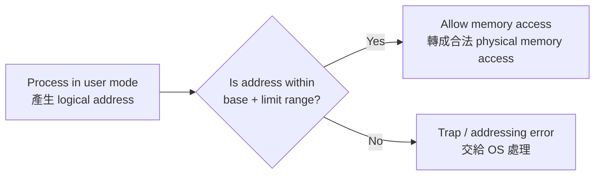

## ⭐Memory Management Background + Base and Limit Registers — 作業系統為什麼要管記憶體？

講義位置：PDF viewer page 3 ~ PDF viewer page 4

### 1. 這個知識點在解決什麼問題？

一個程式要執行，不能只待在 disk(磁碟) 裡；它必須被 brought into memory(載入記憶體)，放進某個 process(行程) 的記憶體空間中，CPU 才能執行它。講義也明確說，CPU 能直接存取的主要是 registers(暫存器) 和 main memory(主記憶體)，disk 不是 CPU 可直接拿來執行指令的地方。

生活化例子：
你可以把 disk 想成倉庫，main memory 想成工作桌，registers 想成你手上正在拿的工具。CPU 工作時不能每一步都跑去倉庫翻東西，所以程式和資料要先搬到工作桌附近。

---

### 2. Memory Management(記憶體管理)第一個核心矛盾：快、不夠快、又不能亂碰

講義 page 3 其實在建立三個限制：

1. Program must be brought into memory
   程式要執行，必須先從 disk 進入 memory。

2. Main memory can take many cycles
   CPU register 很快，可能一個 clock cycle 就能存取；main memory 慢很多，會造成 stall(停等)。

3. Protection of memory required
   OS 必須保護記憶體，避免一個 user process(使用者行程) 亂改別人的記憶體或 OS kernel(核心) 的資料。

所以 Chapter 8 不是只在問「資料放哪裡」，而是在問：

**如何讓每個 process 以為自己有一塊安全可用的記憶體，同時讓 CPU 能有效率地把 logical address(邏輯位址) 轉成真正的 physical address(實體位址)，又不能讓 process 越界亂碰？**

---

### 3. Base and Limit Registers(基底與界限暫存器)：最直覺的記憶體保護法

Base Register(基底暫存器) 可以想成「這個 process 的合法記憶體起點」。
Limit Register(界限暫存器) 可以想成「這個 process 合法使用的範圍大小」。

講義 page 4 寫到：一對 base and limit registers define the logical address space，而且 CPU 必須檢查 user mode 產生的每一次 memory access 是否介於 base 與 limit 所允許的範圍內。

用生活例子說：
假設學校借你一間實驗室，你可以用「第 30000 號櫃子開始，最多用 12000 格」。那麼：

* base = 30000
* limit = 12000
* 你能碰的範圍大約就是 30000 到 41999
* 你想碰 42000 以外，就違規，OS 要擋下來

---

### 4. 核心流程：CPU 每次記憶體存取都要過守門員

Base/Limit 的精神不是「相信程式自己守規矩」，而是硬體協助 OS 做檢查。

重點是：
**user mode 的 process 每次要碰 memory，都要先確認沒有越過自己的合法 logical address space(邏輯位址空間)。**

---

### 5. 最容易混淆的地方

第一個常見錯法是把 base 當成 limit。
Base 是起點，limit 是範圍或長度；不是終點。

第二個常見錯法是以為 CPU 直接相信 process 給的位址。
不對。講義強調 CPU 必須檢查 user mode 的每次 memory access。

第三個常見錯法是忘記這是「保護機制」，不是「效能最佳化機制」。
Base/Limit 的主要目的，是防止越界與互相破壞；但之後的 paging、TLB、cache 才會更明顯牽涉位址轉換與效能。

---

### 6. 中文理解版

Memory Management(記憶體管理)的起點是：程式必須載入主記憶體才能執行，但記憶體速度、空間與保護都有問題。Base and Limit Registers(基底與界限暫存器)是一種基本保護方法，用 base 記錄合法記憶體起點，用 limit 限制可用範圍；CPU 在 user mode 每次記憶體存取時都要檢查是否越界。

### 7. English Exam Version

Memory management is needed because a program must be loaded from disk into main memory before it can run, while the operating system must also ensure efficient access and memory protection. Base and limit registers provide a simple protection mechanism: the base register stores the starting physical address of a process, and the limit register defines the valid range of logical addresses. Every memory access generated in user mode must be checked to ensure that it falls within this allowed range.

### 8. 最短記法

**Program must be in memory to run. Base = start, Limit = legal range, CPU checks every user-mode memory access.**
