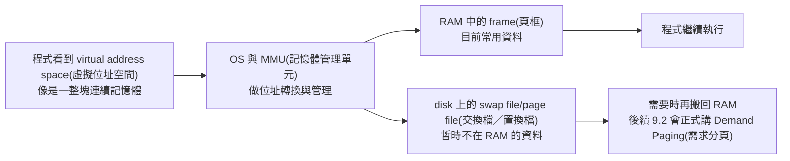
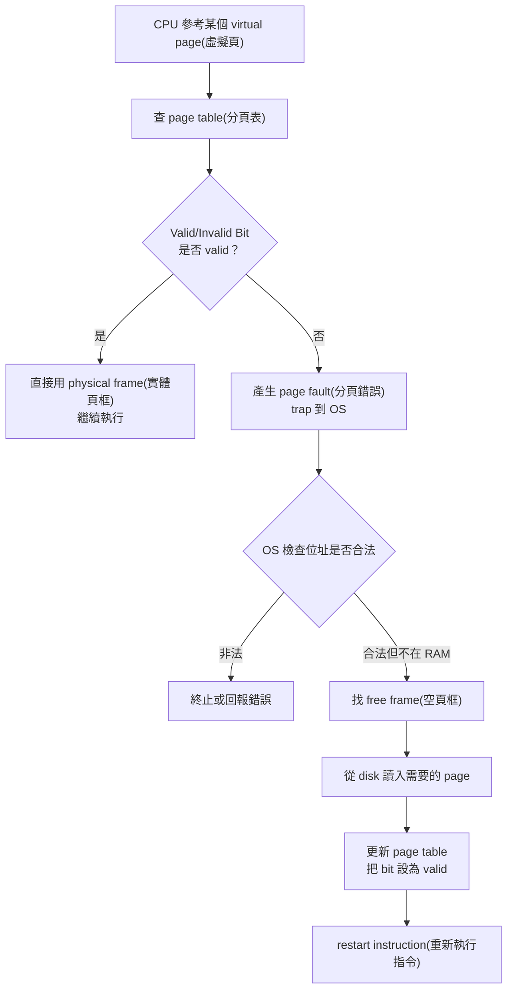
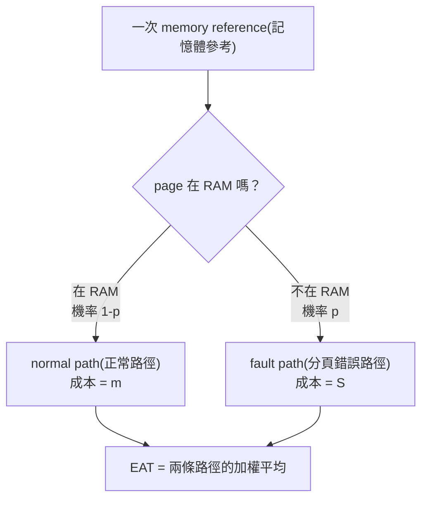
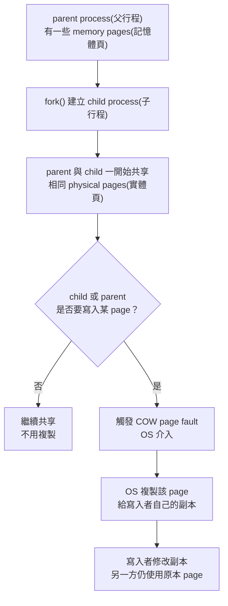
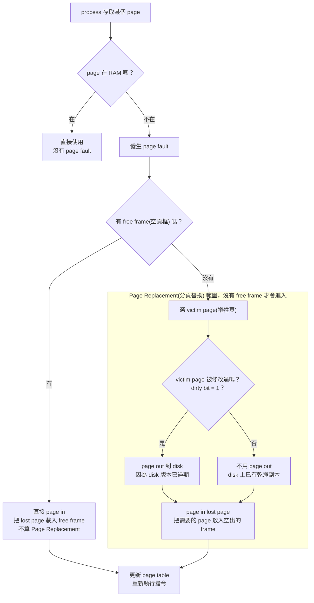

## ⭐Virtual Memory(虛擬記憶體) — 為什麼程式可以「以為」自己有很大的連續記憶體？

講義位置：PDF viewer page 3 ~ PDF viewer page 6

### 1. 這個概念在解決什麼問題？

先抓核心問題：**RAM(實體記憶體) 不夠大、不夠連續，但程式又希望看到一塊很大、很乾淨、很連續的記憶體空間。**

生活化例子：你在圖書館寫報告，桌面很小，但你有一個置物櫃。你正在看的書放桌上，不常看的書先放櫃子。你感覺自己「擁有很多書可以用」，但實際上桌面上同時只能放一部分。

在 OS(作業系統) 裡：

* 桌面就是 RAM(實體記憶體)。
* 置物櫃就是 disk(磁碟) 上的 swap file/page file(交換檔／置換檔)。
* 程式看到的「超大連續空間」就是 virtual address space(虛擬位址空間)。
* 真正放資料的位置可能在 RAM 的不同 frame(頁框)，也可能暫時在 disk 上。

講義對 Virtual Memory(虛擬記憶體) 的定位是：它把磁碟部分空間模擬成 RAM，使得應用程式能在 RAM 不足或多程式同時執行時仍可運作；程式看到的是連續可用的位址空間，但實際資料可能分散在實體記憶體碎片與磁碟上。

---

### 2. 程式看到的世界 vs. OS 管理的世界

程式通常不想知道資料到底在 RAM 哪一格，或是不是被暫時放到 disk。程式只想說：「我要存取我的某個位址。」

但 OS 背後做的事情是：

PDF viewer page 4 的圖示就是在畫這件事：左邊是 virtual memory(虛擬記憶體) 的 pages，中間是 physical memory(實體記憶體) 與 memory map，右邊是 disk，旁邊還有 process address space(行程位址空間) 的 stack/heap/data/code。這張圖的重點不是要你背圖，而是要看懂「程式位址空間」和「實際資料位置」被 OS 分開管理。

---

### 3. 為什麼這樣做有用？

!!! danger
    Virtual Memory(虛擬記憶體) 的好處，可以大概記一下：

    第一，**程式可用空間變大**。程式大小不再完全受限於實體 RAM 的大小。不是說 RAM 真的變大，而是 OS 可以把暫時不用的部分放到 disk。

    第二，**更多程式可以同時運行**。如果每個程式都必須完整塞進 RAM，多開幾個大型程式就會卡住；Virtual Memory(虛擬記憶體) 讓 OS 可以只保留目前需要的部分在 RAM。

    第三，**載入或置換時的 I/O 次數可以減少**。這句話先用直覺記：不要一次把整個程式都搬進 RAM，只在需要時搬必要部分，通常比較省搬運成本。細節會在 9.2 Demand Paging(需求分頁) 才正式展開。
    
    第四，可以 Shared Pages(共享分頁)。

    跨來源補充／一般系統經驗，非目前講義主線：Linux 社群文件常會討論 swap 與 `vm.swappiness` 這類調整，這對應到實務上「哪些頁面留在 RAM、哪些頁面可以被換出」的行為；社群使用者也常把 RAM 和 swap 都吃滿時的桌面卡死經驗描述成接近 thrashing(輾轉現象) 的現象。這些只幫你建立直覺，考試仍以講義主線為準。([Arch Wiki][1])

---

### 4. Shared Pages(共享分頁)：為什麼同一份函式庫不用每個行程都複製一份？

PDF viewer page 6 補了一個很重要的點：Virtual Memory(虛擬記憶體) 也允許不同 process(行程) 透過 shared pages(共享分頁) 共用函式庫。

生活化例子：很多人都在看同一本參考書，如果每個人都影印一整本，很浪費。比較好的做法是：大家共用同一本，只要不改它，就不需要複製。

在 OS 中，共享函式庫常常是 read-only code(唯讀程式碼)。多個 process 可以在自己的 virtual address space(虛擬位址空間) 中「看起來各自有一份 library」，但 page table(分頁表) 可以把它們指到同一批 physical frames(實體頁框)。

重點是：

* 每個 process 仍覺得自己有獨立的位址空間。
* 實際 RAM 不必重複存同一份唯讀 library code。
* 這是 Virtual Memory(虛擬記憶體) 的典型好處之一。

---

### 5. 這一輪最短記法

Virtual Memory(虛擬記憶體) 的一句話版本：

**讓 process(行程) 看到一個大的、連續的、自己的 virtual address space(虛擬位址空間)，但 OS 可以把實際資料分散放在 RAM frames(實體頁框) 與 disk swap(交換空間)，並支援 shared pages(共享分頁) 來節省記憶體。**

常見錯法：

| 錯誤說法                             | 為什麼錯                                                                  |
| -------------------------------- | --------------------------------------------------------------------- |
| Virtual memory 讓 RAM 真的變大        | RAM 沒變大，是 OS 用 disk 輔助，讓程式看到更大的抽象空間                                   |
| 程式看到連續，代表 RAM 中也一定連續             | 不一定；連續的是 virtual address space(虛擬位址空間)，實際 physical memory(實體記憶體) 可以分散 |
| shared library 一定每個 process 複製一份 | 不一定；read-only library code 可以用 shared pages(共享分頁) 共用                  |
| swap 越多效能一定越好                    | 不一定；swap 是救急與彈性，不是 RAM 的等速替代品                                         |

## ⭐Demand Paging(需求分頁) — 為什麼程式不用一開始全部載入 RAM？

講義位置：PDF viewer page 7 ~ PDF viewer page 11

### 1. Demand Paging(需求分頁) 在解決什麼問題？

9.1 說 virtual memory(虛擬記憶體) 可以讓程式看到很大的 address space(位址空間)。9.2 開始問更實際的問題：

**程式那麼大，OS 要不要一開始就把所有 pages(頁) 全部搬進 RAM？**

Demand Paging(需求分頁) 的答案是：**不要。只載入目前真的需要的 pages。**

講義定義是：Demand Paging(需求分頁) 以 paging(分頁) 為基礎，使用 lazy swapper(延遲置換者／懶載入策略)，程式執行之初不把所有 pages 載入 memory，只載入執行所需的 pages；如果發生 page fault(分頁錯誤)，再由 OS 處理。

生活化例子：搬家時你不會把所有箱子都打開放滿整間房，只會先打開今天要用的牙刷、衣服、電腦。其他箱子先放倉庫，需要時再拿。Demand Paging 就是這種「需要才搬」的策略。

---

### 2. Valid/Invalid Bit(有效／無效位元)：OS 怎麼知道 page 在不在 RAM？

要做 Demand Paging，page table(分頁表) 需要多一個 Valid/Invalid Bit(有效／無效位元)，用來表示 page 是否在 memory 中。講義 page 8 明確寫到：分頁表上多加 Valid/Invalid Bit，用來指示 page 是否在 memory 中。

簡化理解：

| Bit 狀態  | 意義                                                |
| ------- | ------------------------------------------------- |
| Valid   | 這個 page 目前在 physical memory(實體記憶體) 中，可以直接存取       |
| Invalid | 這個 page 目前不在 memory，若 process 存取它，就會觸發 page fault |

更精準地說，Invalid 有時也可能代表 illegal address(非法位址)，所以 OS 在 page fault handler(分頁錯誤處理程序) 裡還要檢查「這個位址到底是合法但不在 RAM，還是真的非法」。

---

### 3. Page Fault(分頁錯誤) 發生時，OS 做什麼？

Page fault 不是程式壞掉，而是「process 要用的 page 現在不在 RAM」。OS 會暫停目前指令，去把需要的 page 搬進來。

講義 page 9 的圖就是這個流程：reference(參用) 觸發 invalid 狀態後，trap(陷阱) 到作業系統，找到空框、載入需要的頁面、重新設定分頁表，最後重新啟始指令。

---

### 4. Demand Paging 的關鍵代價：Page Fault 很貴

Demand Paging 可以節省一開始載入的成本，但代價是：如果 page fault 太常發生，效能會非常差。

講義 page 10 定義 Page Fault Rate(分頁錯誤率)：

* `p = 0`：沒有 page fault。
* `p = 1`：每次 memory reference(記憶體參考) 都 fault。

Effective Access Time(EAT，有效存取時間)：

`EAT = (1 - p) × memory access + p × (page fault overhead + swap page out + swap page in + restart overhead)`

這個公式的核心直覺是：

* 大部分時候，如果 page 在 RAM，速度接近一般 memory access。
* 只要發生 page fault，就會牽涉 trap、disk I/O、page in/out、restart instruction，成本遠大於 RAM 存取。

講義例子：memory access time 是 200 ns，平均 page-fault service time 是 8 ms，若每 1000 次存取有 1 次 page fault，EAT 會變成 8.2 microseconds，約慢 40 倍。

跨來源補充／社群經驗，非目前講義主線：Linux 使用者社群常討論 swap、zram、zswap、swappiness，核心經驗都是一樣的：swap 可以增加彈性，但它不是和 RAM 一樣快的替代品；例如 Arch Wiki 把 swappiness 視為記憶體壓力下 kernel 在回收 file cache 與移動 pages 到 swap 之間的傾向設定，社群也常提醒 disk-based swap 或壓縮 swap 都有額外成本。([Arch Wiki][1])

---

### 5. 這一輪最短記法

Demand Paging(需求分頁) 的一句話版本：

**程式開始時不把所有 pages 載入 RAM；page table 用 Valid/Invalid Bit 記錄 page 是否在 memory，若 process 存取不在 memory 的合法 page，就產生 page fault，由 OS 把 page 從 disk 載入 RAM，再重新執行指令。**

常見錯法：

| 錯誤說法                 | 修正                                |
| -------------------- | --------------------------------- |
| Page fault 代表程式一定錯了  | 不一定；可能只是合法 page 還沒載入 RAM          |
| Demand paging 完全提升效能 | 不一定；如果 page fault rate 太高，效能會大幅下降 |
| Invalid bit 一律代表非法位址 | 不一定；也可能是合法 page 目前不在 memory       |
| Swap 可以當成 RAM 一樣用    | 不對；swap 主要提供彈性，速度通常遠慢於 RAM        |

### 公式要怎麼記？

#### 1. 你只要記一個核心句

**EAT(有效存取時間) = 一次 memory reference(記憶體參考) 的平均成本。**

所以它本質上是「加權平均」：

EAT=(1-p)m+pS

其中講義的 `p` 是 Page Fault Rate(分頁錯誤率)，`p = 0` 代表沒有 page fault，`p = 1` 代表每次 reference 都 fault；講義也用 `memory access time = 200 ns`、`average page-fault service time = 8 ms` 示範代入。

---

#### 2. 三個符號這樣背

| 符號  | 你要記的意思                            | 白話                              |
| --- | --------------------------------- | ------------------------------- |
| `p` | page fault rate(分頁錯誤率)            | 這次存取踩到「page 不在 RAM」的機率          |
| `m` | memory access time(記憶體存取時間)       | page 已經在 RAM，正常讀一次 RAM 的時間      |
| `S` | page fault service time(分頁錯誤服務時間) | page 不在 RAM 時，OS 處理整包 fault 的時間 |

---

#### 3. 最重要的觀念：一次存取只分成兩條路

所以不是「page fault 後又回去算 `(1-p)`」。

是：

**一開始就沒 fault → 算 `(1-p)m`。
一開始有 fault → 算 `pS`。**

---

#### 4. 講義展開式怎麼看

講義把 `S` 展開成：

`page fault overhead + swap page out + swap page in + restart overhead`

所以講義版本就是：

`EAT = (1-p)m + p(page fault overhead + swap out + swap in + restart overhead)`

你不用把每個字死背成唯一版本。考試最穩是記：

**`S` 就是 page fault 那條路的整包平均成本。**

---

#### 5. 為什麼 `p` 那邊不用再寫 `memory access`

考試記這句：

**因為講義的 `S` 已經把 fault path 當成整包平均成本；最後重新執行後的 RAM access 要嘛被包含在 `S` 裡，要嘛相對 disk I/O 太小而忽略。**

如果題目特別說 `S` 不包含最後那次 RAM access，才寫更精確版：

`EAT = (1-p)m + p(S+m)`

一般照講義寫：

`EAT = (1-p)m + pS`

---

#### 6. 最短背法

你可以直接背這四行：

**EAT 是平均一次記憶體存取要花多久。
沒 page fault：機率 `1-p`，成本 `m`。
有 page fault：機率 `p`，成本 `S`。
所以 `EAT = (1-p)m + pS`。**

### 錯題
!!! danger

    ==Q:==
    A process references virtual page 5. The page table says that page 5 is a legal page of the process, but its valid/invalid bit is invalid because the page is currently on disk, not in RAM. Describe the main steps the operating system takes to handle this page fault.

    ==Me:==
    OS 收到 page fault 之後，會執行 page swap，把某些 process 換下來換成需要的，然後再讓CPU重新使用記憶體。

    ==ANS:==
    OS 收到 page fault 之後，會執行 page swap，==找 free frame(空頁框)，若沒有 free frame，才選 victim page(犧牲頁) 做 page replacement(分頁替換)==，然後再讓CPU重新使用記憶體。
## ⭐Copy on Write(COW，寫入時複製) — 為什麼 fork 後不用立刻複製整個記憶體？

講義位置：PDF viewer page 12 ~ PDF viewer page 19

### 1. COW 在解決什麼問題？

核心問題是：

**如果兩個 process 暫時看到一樣的資料，我們真的要馬上複製一整份嗎？**

Copy on Write(COW，寫入時複製) 的答案是：**先不要複製。大家先共用同一份；等到有人要修改時，再替修改者複製一份。**

講義定義是：如果多個 caller(呼叫者) 同時要求相同資源，例如 memory(記憶體) 或 disk data(磁碟資料)，它們會先共同取得指向相同資源的指標；直到某個 caller 試圖修改內容時，系統才真正複製一份專用副本給它，其他 caller 仍看到原本資源。

生活化例子：Google 文件複製一份作業範本。大家一開始都看同一份範本，不需要每個人立刻複製。等某個人開始改內容時，系統才幫他產生自己的版本。

---

### 2. COW 的流程

這裡的 page fault 要小心：它不完全等於前面 Demand Paging 裡「page 不在 RAM」的 page fault。COW 常常是因為該 page 被標成 read-only/protected，當 process 嘗試寫入時觸發 fault，OS 再判斷這是 COW，要複製一份。

---

### 3. COW 的三個優點

講義列出三個好處：

| 優點                            | 意思                                        |
| ----------------------------- | ----------------------------------------- |
| Memory Efficiency(記憶體效率)      | 修改前先共享同一份資源，可以降低 memory overhead          |
| Performance Improvement(效能改善) | 延後 copy 到真的 write 時才做；如果很多頁根本沒被修改，就省掉複製成本 |
| Simplified Management(管理簡化)   | 避免複製那些可能永遠不會被修改的資源                        |

這就是為什麼 COW 很適合搭配 `fork()`：很多程式 `fork()` 後很快就 `exec()` 載入新程式，如果一開始就複製 parent 的整個 address space，會非常浪費。講義 page 14 也用 UNIX-like OS 的 `fork()` 說明：child 一開始共享 parent memory pages，只有修改時才 copy。

---

### 4. fork() 和 vfork() 的差異要怎麼看？

講義 page 16 ~ 19 給了一段 `glob=6`、`var=88` 的程式，並比較 `fork()` 與 `vfork()` 的輸出。重點如下：

| 比較                        | fork()                                                     | vfork()                                                 |
| ------------------------- | ---------------------------------------------------------- | ------------------------------------------------------- |
| Address Space(位址空間)       | child 有自己的 address space；概念上是 parent 的 copy，實務上可用 COW 延後複製 | child 暫時共享 parent address space，直到 `exec()` 或 `_exit()` |
| child 修改變數後 parent 是否看到改變 | 不會。講義輸出 parent 仍是 `glob=6, var=88`                         | 會。講義輸出 parent 變成 `glob=7, var=89`                       |
| 效能                        | 較慢，因為需要建立分離的 address space；但 COW 可降低實際複製成本                 | 較快，因為避免複製 address space                                 |
| 行為                        | parent 與 child 可並行                                         | parent 會被 block，直到 child 呼叫 `exec()` 或 `_exit()`        |

最容易考錯的是：**fork() 不是讓 child 直接改 parent 的變數。**
即使一開始物理頁可能因 COW 被共享，只要 child 要寫入，OS 就會幫 child 複製一份，所以 parent 的 `glob`、`var` 不會被 child 改掉。

!!! danger

    ==Q:==
    喔我懂了，所以 cow 是 fork 的，我以為這邊強調 vfork 是在說 vfork 會 cow。所以 fork 一開始共用，要改時 cow，然後 vfork 是一直共用？

    ==ANS:==
    對，**COW(Copy on Write，寫入時複製) 是在講一般 `fork()` 的最佳化實作**。

    但 `vfork()` 不是「一直共用」，更精準是：

    **`vfork()`：child 暫時共用 parent 的 address space(位址空間)，直到 child 呼叫 `exec()` 或 `_exit()`；期間 parent 會被 block/suspended(暫停)。**

    所以最準確記法是：

    | 呼叫 | 剛建立 child 時 | child 要寫入時 | parent 會不會看到 child 改變 |
    | --- | --- | --- | --- |
    | `fork()` | parent/child 是 separate memory spaces(分離記憶體空間)；Linux 實作上可先共用 physical pages | 觸發 COW，複製 page 給寫入者 | 不會 |
    | `vfork()` | child 暫時共用 parent address space，parent 暫停 | 不應該改；若改了，可能直接影響 parent | 會，像講義 `glob=7 var=89` |

---

### 5. COW 的缺點

COW 不是永遠免費。講義 page 15 提到兩個 drawbacks(缺點)：

| 缺點                  | 意思                                                      |
| ------------------- | ------------------------------------------------------- |
| Copy Overhead(複製成本) | 如果修改很頻繁，最後還是要一直 copy，COW 的好處會下降 (==但還是比整頁複製好==)                        |
| Complexity(複雜度)     | OS 要處理 reference counting(參考計數)、page faults、保護位元等，實作更複雜 |

所以 COW 的核心 trade-off 是：

**如果大多數資料只是讀、不改，COW 很省。
如果大量資料都會被改，COW 只是把複製成本延後，最後仍然要付。**

---

### 6. 最短記法

Copy on Write(COW) 一句話：

**先共享，不先複製；等有人 write(寫入) 時，才 copy(複製) 一份給寫入者。**

考試版：

**Copy-on-write allows processes to initially share the same physical pages. When one process attempts to modify a shared page, the operating system copies that page and gives the modifying process its own private copy.**

常見錯法：

| 錯誤說法                           | 修正                                           |
| ------------------------------ | -------------------------------------------- |
| fork() 一定馬上複製整個 parent memory  | 不一定；現代系統常用 COW 延後到 write 才複製                 |
| child 用 fork() 改變變數，parent 也會變 | 錯；fork() 下 parent 和 child 有分離的 address space |
| COW page fault 一定是 page 不在 RAM | 不一定；可能是 write-protection fault，用來觸發 copy     |
| COW 永遠提升效能                     | 不一定；如果大量頁面都被修改，copy overhead 仍然很大            |

## ⭐Page Replacement(分頁替換) — 沒有 free frame 時，OS 要犧牲誰？

講義位置：PDF viewer page 20 ~ PDF viewer page 22

### 1. 這個概念在解決什麼問題？

前面 Demand Paging(需求分頁) 說：page 不在 RAM 時會 page fault，OS 要把需要的 page 放進 memory。

但現在遇到新問題：

**如果 RAM 裡沒有 free frame(空頁框)，那新的 page 要放哪裡？**

Page Replacement(分頁替換) 就是在處理這件事：

**選一個目前在 RAM 裡的 victim page(犧牲頁) 換出去，空出 frame，再把現在需要的 lost page 放進來。**

講義 page 20 的定義就是：當 page fault 發生而 memory 沒有可用 page/frame 時，OS 必須執行 page replacement；OS 要選擇一個 victim page，將它 swap out/page out 到 disk，空出 frame，再將 lost page swap in/page in 到這個 frame。

---

### 2. Page Replacement 的基本流程

!!! danger
    只要有把某個 page 覆蓋、替換，就是 replacement，即使 Dirty = 0，他也被覆蓋(換)掉了

最核心判斷是這句：

**Page in 通常必要；page out 不一定必要。**

因為 page in 是把你現在需要的 lost page 放進 RAM，沒有它指令不能繼續。但 page out 只有在 victim page 被修改過時才需要。講義 page 21 也明確說：page out 和 page in 都是 disk I/O，很慢；page in 是必要的，但 page out 不一定必要，要看 victim page 是否曾被修改，利用 dirty bit 來判斷，藉此節省不必要的 I/O。

---

### 3. Dirty Bit(髒位元) 是什麼？

Dirty Bit(髒位元) 用來回答：

**RAM 裡這個 page 跟 disk 上的版本是不是一樣？**

| Dirty Bit | 意思                      | 替換時需不需要 page out？          |
| --------- | ----------------------- | -------------------------- |
| `0`       | page 沒被修改過，disk 上副本仍然正確 | 不需要 page out，直接丟掉 RAM 這份即可 |
| `1`       | page 被修改過，disk 上副本已經舊了  | 需要 page out，把新內容寫回 disk    |

生活化例子：你從雲端下載一份文件到本機。

如果你只是打開看，沒有修改，那關掉本機副本也沒關係，雲端上還是同一份。這像 dirty bit = 0。

如果你改了內容但還沒上傳，這時本機版本比較新，不能直接丟掉，要先存回雲端。這像 dirty bit = 1。

---

### 4. 為什麼 Page Replacement Algorithm(分頁替換演算法) 很重要？

page 22 開始說：Demand Paging 要解決兩個主要問題：

第一，Frame Allocation Algorithm(頁框配置演算法)：每個 process 要分幾個 frames？
第二，Page-Replacement Algorithm(分頁替換演算法)：沒有 free frame 時，要換掉哪個 page？

選 replacement algorithm 的目標通常是：**讓 page fault ratio(分頁錯誤率) 越低越好。**

接下來講義會照順序進入：

| 下一批主線項                            | 核心問題                                     |
| --------------------------------- | ---------------------------------------- |
| FIFO                              | 最早進 RAM 的 page 先犧牲，會不會有問題？               |
| Optimal                           | 如果能看未來，最佳 victim page 是誰？                |
| LRU                               | 用「最近最少使用」近似未來行為                          |
| LRU-approximation / Second Chance | LRU 太貴時，怎麼用 reference bit 近似？            |
| Enhanced Second Chance            | 怎麼同時考慮 reference bit 與 dirty bit，減少 I/O？ |

但本輪先不要急著算 FIFO/LRU，因為我們要先確定你真的會分辨：**page fault、有無 free frame、是否需要 page out、dirty bit 的角色。**

---

### 5. 最短記法

Page Replacement 一句話：

**Page fault 發生且沒有 free frame 時，OS 選一個 victim page；若 victim page 是 dirty，就先 page out，然後把需要的 lost page page in。**

常見錯法：

| 錯誤說法                            | 修正                                         |
| ------------------------------- | ------------------------------------------ |
| page fault 一定要 page replacement | 不一定；有 free frame 就不用 replacement           |
| page replacement 一定要 page out   | 不一定；victim page 若沒被修改，通常不用 page out        |
| page in 和 page out 都一樣可省        | page in 必要；page out 要看 dirty bit           |
| frame 越多 page fault 一定越少        | 對多數演算法直覺上常見，但 FIFO 可能有 Belady Anomaly，後面會講 |

!!! danger

    ### 所以這邊指的 page in 、page out 指的是把 frame n 裡面的(對應到的)page 換成其他的？

    對，**在 Page Replacement(分頁替換) 的情境下，最後效果可以理解成：把某個 frame n 裡原本放的 page 換成另一個 needed page。**

    但術語要更精準一點：

    **page in / page out 指的是 page 資料在 disk(磁碟) 和 RAM frame(實體頁框) 之間搬移，不是 frame 本身被搬移。**

    ### 所以 victim page 指的是在 frame 裡面的 page 對不對？

    對，**victim page(犧牲頁) 指的是「目前已經在某個 frame(頁框) 裡面的 page(頁)」**。

    更精準地說：

    **victim page = OS 在 page replacement(分頁替換) 時，從 RAM 的某個 frame 中選出來、準備移除的 resident page(駐留頁)。**
    
    ### lost page 是啥
    
    `lost page` 在這份講義的語境裡，就是：

    **造成 page fault(分頁錯誤) 的那個「目前不在 RAM，但 process 現在需要的 page」。**

    比較常見、比較標準的說法會是：

    - needed page(需要的頁)
        
    - missing page(缺失頁)
        
    - faulting page(造成 fault 的頁)
        
    - page to be brought in(要被載入的頁)
        

    講義 page 20 用 `lost page swap in(page in) 到此 frame`，意思就是：OS 先把 victim page(犧牲頁) 移出去空出 frame，再把「剛剛缺的那個 page」載入這個 frame。
    
    
    

## ⭐FIFO Page Replacement(先進先出分頁替換) — 沒有 free frame 時，最早進來的 page 先犧牲？

講義位置：PDF viewer page 23 ~ PDF viewer page 26

### 1. FIFO 在解決什麼問題？

前一輪我們解決的是：

**沒有 free frame 時，需要選一個 victim page。**

FIFO(First-In-First-Out，先進先出) 給的規則很簡單：

**最早被載入 RAM 的 page，最早被選成 victim page。**

講義 page 23 也是這樣定義：最先載入的 page 優先視為 victim page；它簡單、易於實作，但效果不一定好。

生活化例子：排隊買便當。誰最早進隊伍，誰最先被處理。FIFO 的 frame queue(頁框佇列) 也是這樣：最早進 RAM 的 page 排在最前面，下一次需要 replacement 時就先被踢出去。

---

### 2. FIFO 怎麼 trace？

FIFO trace 時，你要追兩件事：

| 要追的東西              | 意義                                |
| ------------------ | --------------------------------- |
| frames 目前放哪些 pages | 判斷 hit 還是 page fault              |
| FIFO order / queue | 判斷 page fault 且沒 free frame 時，要踢誰 |

!!! danger

    核心規則：

    1. 如果 referenced page 已經在 frames 裡：hit，不增加 page fault，也不改變 FIFO 順序。
    2. 如果 referenced page 不在 frames 裡，而且還有 free frame：page fault，把 page 放進空 frame，排到 FIFO queue 尾端。
    3. 如果 referenced page 不在 frames 裡，而且沒有 free frame：page fault，踢掉 FIFO queue 最前端，也就是最早進來的 page，再把新 page 放到 queue 尾端。

小示範：2 個 frames，reference string 是 `1, 2, 1, 3`

| 參考 page | 結果                        | frames | FIFO 順序 | page faults |
| ------: | ------------------------- | ------ | ------- | ----------: |
|       1 | fault，有 free frame        | [1, -] | 1       |           1 |
|       2 | fault，有 free frame        | [1, 2] | 1 → 2   |           2 |
|       1 | hit                       | [1, 2] | 1 → 2   |           2 |
|       3 | fault，沒 free frame，踢最早的 1 | ==[3, 2]== | ==2 → 3==   |           3 |

==注意 3 的 frames 和 FIFO 順序不一樣，FIFO 是 queue。==

注意第 3 步：`1` 被 hit，不代表它變年輕。
FIFO 不管最近有沒有用過，只管誰最早載入。

---

### 3. Belady Anomaly(貝拉迪異常) 是什麼？

直覺上，我們會以為：

**frame 越多，page fault 應該越少。**

但 FIFO 有一個反直覺現象：**frame 變多，page fault 反而可能增加。** 這叫 Belady Anomaly(貝拉迪異常)。講義 page 24 用序列 `1,2,3,4,1,2,5,1,2,3,4,5` 說明這件事；page 25 顯示 FIFO with 3 Frames 有 9 次 page faults，page 26 顯示 FIFO with 4 Frames 反而有 10 次 page faults。

這不是因為 frame 多本身不好，而是 FIFO 的 victim 選擇規則太笨：它只看「誰最早進來」，不管那個 page 最近是不是常被用。

所以考試看到 FIFO，要記：

**FIFO 簡單，但可能有 Belady Anomaly。**

---

### 4. FIFO 最短記法

FIFO 一句話：

**沒 free frame 時，踢掉最早載入 RAM 的 page。**

常見錯法：

| 錯誤說法                      | 修正                                              |
| ------------------------- | ----------------------------------------------- |
| FIFO hit 之後要把 page 移到最新   | 錯，那是 LRU 類型的想法；FIFO hit 不改順序                    |
| FIFO 一定 frame 越多 fault 越少 | 錯，FIFO 可能有 Belady Anomaly                       |
| FIFO 會看最近有沒有被使用           | 錯，FIFO 只看進入 RAM 的時間                             |
| FIFO 效果最差                 | 不一定；講義說效果差，但 page replacement 沒有固定「最差」，因為無法預知未來 |

!!! danger

    ### referenced page 是啥

    `referenced page` 就是：

    **process(行程) 這一次正在存取／要求使用的 page(頁)。**
    
    
