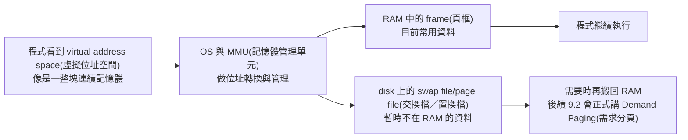
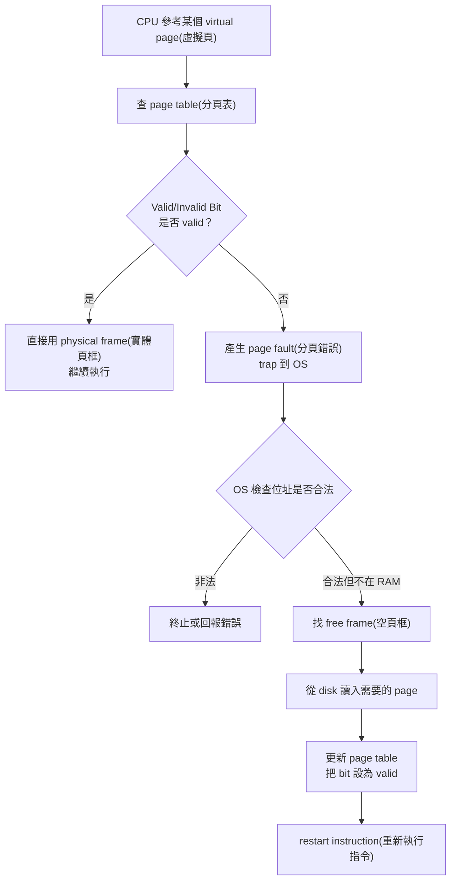
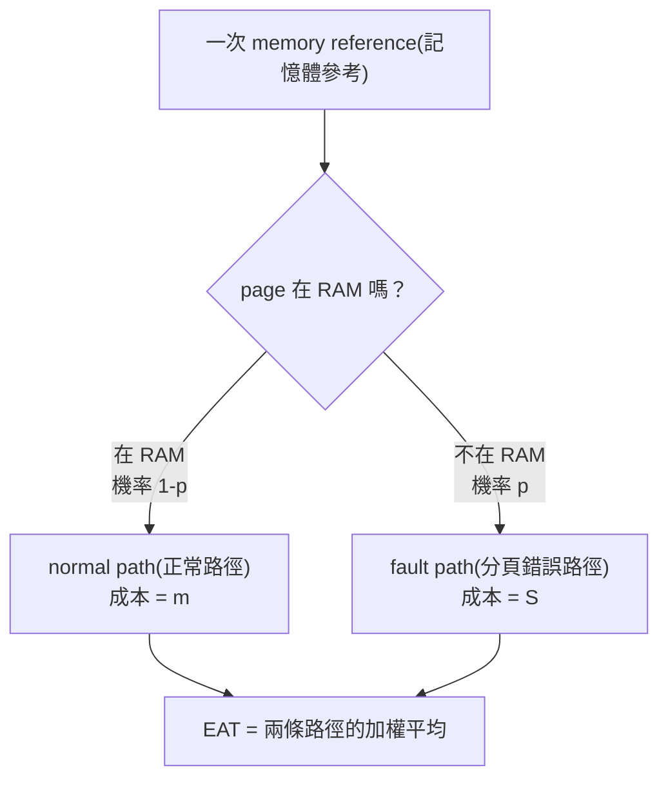
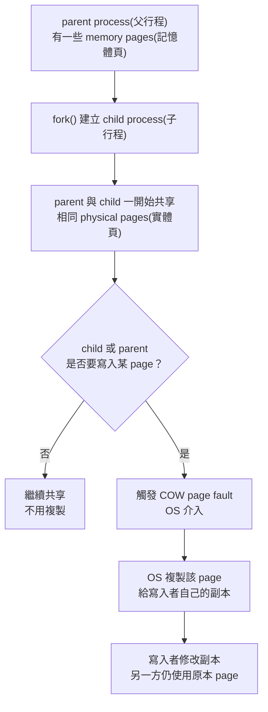
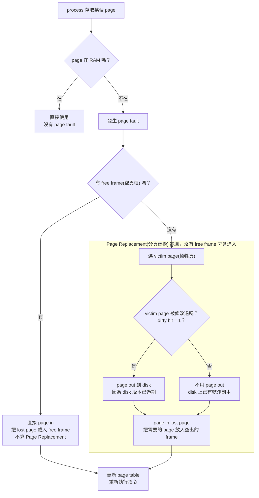
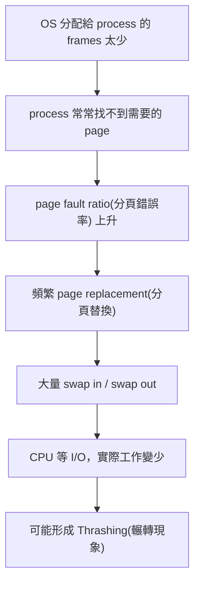
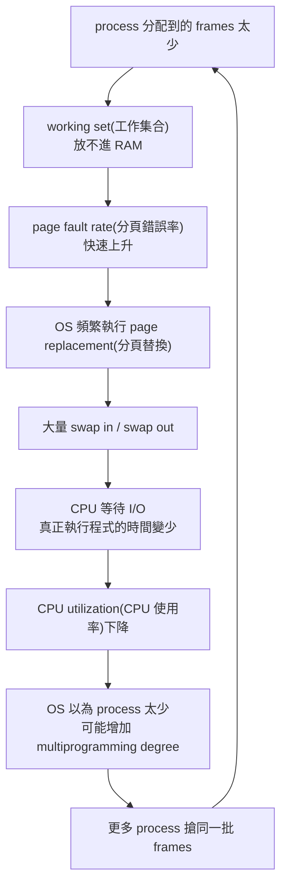

## ⭐Virtual Memory(虛擬記憶體) — 為什麼程式可以「以為」自己有很大的連續記憶體？

講義位置：PDF viewer page 3 ~ PDF viewer page 6

### 1. 這個概念在解決什麼問題？

先抓核心問題：**RAM(實體記憶體) 不夠大、不夠連續，但程式又希望看到一塊很大、很乾淨、很連續的記憶體空間。**

生活化例子：你在圖書館寫報告，桌面很小，但你有一個置物櫃。你正在看的書放桌上，不常看的書先放櫃子。你感覺自己「擁有很多書可以用」，但實際上桌面上同時只能放一部分。

在 OS(作業系統) 裡：

* 桌面就是 RAM(實體記憶體)。
* 置物櫃就是 disk(磁碟) 上的 swap file/page file(交換檔／置換檔)。
* 程式看到的「超大連續空間」就是 virtual address space(虛擬位址空間)。
* 真正放資料的位置可能在 RAM 的不同 frame(頁框)，也可能暫時在 disk 上。

講義對 Virtual Memory(虛擬記憶體) 的定位是：它把磁碟部分空間模擬成 RAM，使得應用程式能在 RAM 不足或多程式同時執行時仍可運作；程式看到的是連續可用的位址空間，但實際資料可能分散在實體記憶體碎片與磁碟上。

---

### 2. 程式看到的世界 vs. OS 管理的世界

程式通常不想知道資料到底在 RAM 哪一格，或是不是被暫時放到 disk。程式只想說：「我要存取我的某個位址。」

但 OS 背後做的事情是：

PDF viewer page 4 的圖示就是在畫這件事：左邊是 virtual memory(虛擬記憶體) 的 pages，中間是 physical memory(實體記憶體) 與 memory map，右邊是 disk，旁邊還有 process address space(行程位址空間) 的 stack/heap/data/code。這張圖的重點不是要你背圖，而是要看懂「程式位址空間」和「實際資料位置」被 OS 分開管理。

---

### 3. 為什麼這樣做有用？

!!! danger
    Virtual Memory(虛擬記憶體) 的好處，可以大概記一下：

    第一，**程式可用空間變大**。程式大小不再完全受限於實體 RAM 的大小。不是說 RAM 真的變大，而是 OS 可以把暫時不用的部分放到 disk。

    第二，**更多程式可以同時運行**。如果每個程式都必須完整塞進 RAM，多開幾個大型程式就會卡住；Virtual Memory(虛擬記憶體) 讓 OS 可以只保留目前需要的部分在 RAM。

    第三，**載入或置換時的 I/O 次數可以減少**。這句話先用直覺記：不要一次把整個程式都搬進 RAM，只在需要時搬必要部分，通常比較省搬運成本。細節會在 9.2 Demand Paging(需求分頁) 才正式展開。
    
    第四，可以 Shared Pages(共享分頁)。

    跨來源補充／一般系統經驗，非目前講義主線：Linux 社群文件常會討論 swap 與 `vm.swappiness` 這類調整，這對應到實務上「哪些頁面留在 RAM、哪些頁面可以被換出」的行為；社群使用者也常把 RAM 和 swap 都吃滿時的桌面卡死經驗描述成接近 thrashing(輾轉現象) 的現象。這些只幫你建立直覺，考試仍以講義主線為準。([Arch Wiki][1])

---

### 4. Shared Pages(共享分頁)：為什麼同一份函式庫不用每個行程都複製一份？

PDF viewer page 6 補了一個很重要的點：Virtual Memory(虛擬記憶體) 也允許不同 process(行程) 透過 shared pages(共享分頁) 共用函式庫。

生活化例子：很多人都在看同一本參考書，如果每個人都影印一整本，很浪費。比較好的做法是：大家共用同一本，只要不改它，就不需要複製。

在 OS 中，共享函式庫常常是 read-only code(唯讀程式碼)。多個 process 可以在自己的 virtual address space(虛擬位址空間) 中「看起來各自有一份 library」，但 page table(分頁表) 可以把它們指到同一批 physical frames(實體頁框)。

重點是：

* 每個 process 仍覺得自己有獨立的位址空間。
* 實際 RAM 不必重複存同一份唯讀 library code。
* 這是 Virtual Memory(虛擬記憶體) 的典型好處之一。

---

### 5. 這一輪最短記法

Virtual Memory(虛擬記憶體) 的一句話版本：

**讓 process(行程) 看到一個大的、連續的、自己的 virtual address space(虛擬位址空間)，但 OS 可以把實際資料分散放在 RAM frames(實體頁框) 與 disk swap(交換空間)，並支援 shared pages(共享分頁) 來節省記憶體。**

常見錯法：

| 錯誤說法                             | 為什麼錯                                                                  |
| -------------------------------- | --------------------------------------------------------------------- |
| Virtual memory 讓 RAM 真的變大        | RAM 沒變大，是 OS 用 disk 輔助，讓程式看到更大的抽象空間                                   |
| 程式看到連續，代表 RAM 中也一定連續             | 不一定；連續的是 virtual address space(虛擬位址空間)，實際 physical memory(實體記憶體) 可以分散 |
| shared library 一定每個 process 複製一份 | 不一定；read-only library code 可以用 shared pages(共享分頁) 共用                  |
| swap 越多效能一定越好                    | 不一定；swap 是救急與彈性，不是 RAM 的等速替代品                                         |

## ⭐Demand Paging(需求分頁) — 為什麼程式不用一開始全部載入 RAM？

講義位置：PDF viewer page 7 ~ PDF viewer page 11

### 1. Demand Paging(需求分頁) 在解決什麼問題？

9.1 說 virtual memory(虛擬記憶體) 可以讓程式看到很大的 address space(位址空間)。9.2 開始問更實際的問題：

**程式那麼大，OS 要不要一開始就把所有 pages(頁) 全部搬進 RAM？**

Demand Paging(需求分頁) 的答案是：**不要。只載入目前真的需要的 pages。**

講義定義是：Demand Paging(需求分頁) 以 paging(分頁) 為基礎，使用 lazy swapper(延遲置換者／懶載入策略)，程式執行之初不把所有 pages 載入 memory，只載入執行所需的 pages；如果發生 page fault(分頁錯誤)，再由 OS 處理。

生活化例子：搬家時你不會把所有箱子都打開放滿整間房，只會先打開今天要用的牙刷、衣服、電腦。其他箱子先放倉庫，需要時再拿。Demand Paging 就是這種「需要才搬」的策略。

---

### 2. Valid/Invalid Bit(有效／無效位元)：OS 怎麼知道 page 在不在 RAM？

要做 Demand Paging，page table(分頁表) 需要多一個 Valid/Invalid Bit(有效／無效位元)，用來表示 page 是否在 memory 中。講義 page 8 明確寫到：分頁表上多加 Valid/Invalid Bit，用來指示 page 是否在 memory 中。

簡化理解：

| Bit 狀態  | 意義                                                |
| ------- | ------------------------------------------------- |
| Valid   | 這個 page 目前在 physical memory(實體記憶體) 中，可以直接存取       |
| Invalid | 這個 page 目前不在 memory，若 process 存取它，就會觸發 page fault |

更精準地說，Invalid 有時也可能代表 illegal address(非法位址)，所以 OS 在 page fault handler(分頁錯誤處理程序) 裡還要檢查「這個位址到底是合法但不在 RAM，還是真的非法」。

---

### 3. Page Fault(分頁錯誤) 發生時，OS 做什麼？

Page fault 不是程式壞掉，而是「process 要用的 page 現在不在 RAM」。OS 會暫停目前指令，去把需要的 page 搬進來。

講義 page 9 的圖就是這個流程：reference(參用) 觸發 invalid 狀態後，trap(陷阱) 到作業系統，找到空框、載入需要的頁面、重新設定分頁表，最後重新啟始指令。

---

### 4. Demand Paging 的關鍵代價：Page Fault 很貴

Demand Paging 可以節省一開始載入的成本，但代價是：如果 page fault 太常發生，效能會非常差。

講義 page 10 定義 Page Fault Rate(分頁錯誤率)：

* `p = 0`：沒有 page fault。
* `p = 1`：每次 memory reference(記憶體參考) 都 fault。

Effective Access Time(EAT，有效存取時間)：

`EAT = (1 - p) × memory access + p × (page fault overhead + swap page out + swap page in + restart overhead)`

這個公式的核心直覺是：

* 大部分時候，如果 page 在 RAM，速度接近一般 memory access。
* 只要發生 page fault，就會牽涉 trap、disk I/O、page in/out、restart instruction，成本遠大於 RAM 存取。

講義例子：memory access time 是 200 ns，平均 page-fault service time 是 8 ms，若每 1000 次存取有 1 次 page fault，EAT 會變成 8.2 microseconds，約慢 40 倍。

跨來源補充／社群經驗，非目前講義主線：Linux 使用者社群常討論 swap、zram、zswap、swappiness，核心經驗都是一樣的：swap 可以增加彈性，但它不是和 RAM 一樣快的替代品；例如 Arch Wiki 把 swappiness 視為記憶體壓力下 kernel 在回收 file cache 與移動 pages 到 swap 之間的傾向設定，社群也常提醒 disk-based swap 或壓縮 swap 都有額外成本。([Arch Wiki][1])

---

### 5. 這一輪最短記法

Demand Paging(需求分頁) 的一句話版本：

**程式開始時不把所有 pages 載入 RAM；page table 用 Valid/Invalid Bit 記錄 page 是否在 memory，若 process 存取不在 memory 的合法 page，就產生 page fault，由 OS 把 page 從 disk 載入 RAM，再重新執行指令。**

常見錯法：

| 錯誤說法                 | 修正                                |
| -------------------- | --------------------------------- |
| Page fault 代表程式一定錯了  | 不一定；可能只是合法 page 還沒載入 RAM          |
| Demand paging 完全提升效能 | 不一定；如果 page fault rate 太高，效能會大幅下降 |
| Invalid bit 一律代表非法位址 | 不一定；也可能是合法 page 目前不在 memory       |
| Swap 可以當成 RAM 一樣用    | 不對；swap 主要提供彈性，速度通常遠慢於 RAM        |

### 公式要怎麼記？

#### 1. 你只要記一個核心句

**EAT(有效存取時間) = 一次 memory reference(記憶體參考) 的平均成本。**

所以它本質上是「加權平均」：

EAT=(1-p)m+pS

其中講義的 `p` 是 Page Fault Rate(分頁錯誤率)，`p = 0` 代表沒有 page fault，`p = 1` 代表每次 reference 都 fault；講義也用 `memory access time = 200 ns`、`average page-fault service time = 8 ms` 示範代入。

---

#### 2. 三個符號這樣背

| 符號  | 你要記的意思                            | 白話                              |
| --- | --------------------------------- | ------------------------------- |
| `p` | page fault rate(分頁錯誤率)            | 這次存取踩到「page 不在 RAM」的機率          |
| `m` | memory access time(記憶體存取時間)       | page 已經在 RAM，正常讀一次 RAM 的時間      |
| `S` | page fault service time(分頁錯誤服務時間) | page 不在 RAM 時，OS 處理整包 fault 的時間 |

---

#### 3. 最重要的觀念：一次存取只分成兩條路

所以不是「page fault 後又回去算 `(1-p)`」。

是：

**一開始就沒 fault → 算 `(1-p)m`。
一開始有 fault → 算 `pS`。**

---

#### 4. 講義展開式怎麼看

講義把 `S` 展開成：

`page fault overhead + swap page out + swap page in + restart overhead`

所以講義版本就是：

`EAT = (1-p)m + p(page fault overhead + swap out + swap in + restart overhead)`

你不用把每個字死背成唯一版本。考試最穩是記：

**`S` 就是 page fault 那條路的整包平均成本。**

---

#### 5. 為什麼 `p` 那邊不用再寫 `memory access`

考試記這句：

**因為講義的 `S` 已經把 fault path 當成整包平均成本；最後重新執行後的 RAM access 要嘛被包含在 `S` 裡，要嘛相對 disk I/O 太小而忽略。**

如果題目特別說 `S` 不包含最後那次 RAM access，才寫更精確版：

`EAT = (1-p)m + p(S+m)`

一般照講義寫：

`EAT = (1-p)m + pS`

---

#### 6. 最短背法

你可以直接背這四行：

**EAT 是平均一次記憶體存取要花多久。
沒 page fault：機率 `1-p`，成本 `m`。
有 page fault：機率 `p`，成本 `S`。
所以 `EAT = (1-p)m + pS`。**

### 錯題
!!! danger

    ==Q:==
    A process references virtual page 5. The page table says that page 5 is a legal page of the process, but its valid/invalid bit is invalid because the page is currently on disk, not in RAM. Describe the main steps the operating system takes to handle this page fault.

    ==Me:==
    OS 收到 page fault 之後，會執行 page swap，把某些 process 換下來換成需要的，然後再讓CPU重新使用記憶體。

    ==ANS:==
    OS 收到 page fault 之後，會執行 page swap，==找 free frame(空頁框)，若沒有 free frame，才選 victim page(犧牲頁) 做 page replacement(分頁替換)==，然後再讓CPU重新使用記憶體。
## ⭐Copy on Write(COW，寫入時複製) — 為什麼 fork 後不用立刻複製整個記憶體？

講義位置：PDF viewer page 12 ~ PDF viewer page 19

### 1. COW 在解決什麼問題？

核心問題是：

**如果兩個 process 暫時看到一樣的資料，我們真的要馬上複製一整份嗎？**

Copy on Write(COW，寫入時複製) 的答案是：**先不要複製。大家先共用同一份；等到有人要修改時，再替修改者複製一份。**

講義定義是：如果多個 caller(呼叫者) 同時要求相同資源，例如 memory(記憶體) 或 disk data(磁碟資料)，它們會先共同取得指向相同資源的指標；直到某個 caller 試圖修改內容時，系統才真正複製一份專用副本給它，其他 caller 仍看到原本資源。

生活化例子：Google 文件複製一份作業範本。大家一開始都看同一份範本，不需要每個人立刻複製。等某個人開始改內容時，系統才幫他產生自己的版本。

---

### 2. COW 的流程

這裡的 page fault 要小心：它不完全等於前面 Demand Paging 裡「page 不在 RAM」的 page fault。COW 常常是因為該 page 被標成 read-only/protected，當 process 嘗試寫入時觸發 fault，OS 再判斷這是 COW，要複製一份。

---

### 3. COW 的三個優點

講義列出三個好處：

| 優點                            | 意思                                        |
| ----------------------------- | ----------------------------------------- |
| Memory Efficiency(記憶體效率)      | 修改前先共享同一份資源，可以降低 memory overhead          |
| Performance Improvement(效能改善) | 延後 copy 到真的 write 時才做；如果很多頁根本沒被修改，就省掉複製成本 |
| Simplified Management(管理簡化)   | 避免複製那些可能永遠不會被修改的資源                        |

這就是為什麼 COW 很適合搭配 `fork()`：很多程式 `fork()` 後很快就 `exec()` 載入新程式，如果一開始就複製 parent 的整個 address space，會非常浪費。講義 page 14 也用 UNIX-like OS 的 `fork()` 說明：child 一開始共享 parent memory pages，只有修改時才 copy。

---

### 4. fork() 和 vfork() 的差異要怎麼看？

講義 page 16 ~ 19 給了一段 `glob=6`、`var=88` 的程式，並比較 `fork()` 與 `vfork()` 的輸出。重點如下：

| 比較                        | fork()                                                     | vfork()                                                 |
| ------------------------- | ---------------------------------------------------------- | ------------------------------------------------------- |
| Address Space(位址空間)       | child 有自己的 address space；概念上是 parent 的 copy，實務上可用 COW 延後複製 | child 暫時共享 parent address space，直到 `exec()` 或 `_exit()` |
| child 修改變數後 parent 是否看到改變 | 不會。講義輸出 parent 仍是 `glob=6, var=88`                         | 會。講義輸出 parent 變成 `glob=7, var=89`                       |
| 效能                        | 較慢，因為需要建立分離的 address space；但 COW 可降低實際複製成本                 | 較快，因為避免複製 address space                                 |
| 行為                        | parent 與 child 可並行                                         | parent 會被 block，直到 child 呼叫 `exec()` 或 `_exit()`        |

最容易考錯的是：**fork() 不是讓 child 直接改 parent 的變數。**
即使一開始物理頁可能因 COW 被共享，只要 child 要寫入，OS 就會幫 child 複製一份，所以 parent 的 `glob`、`var` 不會被 child 改掉。

!!! danger

    ==Q:==
    喔我懂了，所以 cow 是 fork 的，我以為這邊強調 vfork 是在說 vfork 會 cow。所以 fork 一開始共用，要改時 cow，然後 vfork 是一直共用？

    ==ANS:==
    對，**COW(Copy on Write，寫入時複製) 是在講一般 `fork()` 的最佳化實作**。

    但 `vfork()` 不是「一直共用」，更精準是：

    **`vfork()`：child 暫時共用 parent 的 address space(位址空間)，直到 child 呼叫 `exec()` 或 `_exit()`；期間 parent 會被 block/suspended(暫停)。**

    所以最準確記法是：

    | 呼叫 | 剛建立 child 時 | child 要寫入時 | parent 會不會看到 child 改變 |
    | --- | --- | --- | --- |
    | `fork()` | parent/child 是 separate memory spaces(分離記憶體空間)；Linux 實作上可先共用 physical pages | 觸發 COW，複製 page 給寫入者 | 不會 |
    | `vfork()` | child 暫時共用 parent address space，parent 暫停 | 不應該改；若改了，可能直接影響 parent | 會，像講義 `glob=7 var=89` |

---

### 5. COW 的缺點

COW 不是永遠免費。講義 page 15 提到兩個 drawbacks(缺點)：

| 缺點                  | 意思                                                      |
| ------------------- | ------------------------------------------------------- |
| Copy Overhead(複製成本) | 如果修改很頻繁，最後還是要一直 copy，COW 的好處會下降 (==但還是比整頁複製好==)                        |
| Complexity(複雜度)     | OS 要處理 reference counting(參考計數)、page faults、保護位元等，實作更複雜 |

所以 COW 的核心 trade-off 是：

**如果大多數資料只是讀、不改，COW 很省。
如果大量資料都會被改，COW 只是把複製成本延後，最後仍然要付。**

---

### 6. 最短記法

Copy on Write(COW) 一句話：

**先共享，不先複製；等有人 write(寫入) 時，才 copy(複製) 一份給寫入者。**

考試版：

**Copy-on-write allows processes to initially share the same physical pages. When one process attempts to modify a shared page, the operating system copies that page and gives the modifying process its own private copy.**

常見錯法：

| 錯誤說法                           | 修正                                           |
| ------------------------------ | -------------------------------------------- |
| fork() 一定馬上複製整個 parent memory  | 不一定；現代系統常用 COW 延後到 write 才複製                 |
| child 用 fork() 改變變數，parent 也會變 | 錯；fork() 下 parent 和 child 有分離的 address space |
| COW page fault 一定是 page 不在 RAM | 不一定；可能是 write-protection fault，用來觸發 copy     |
| COW 永遠提升效能                     | 不一定；如果大量頁面都被修改，copy overhead 仍然很大            |

## ⭐Page Replacement(分頁替換) — 沒有 free frame 時，OS 要犧牲誰？

講義位置：PDF viewer page 20 ~ PDF viewer page 22

### 1. 這個概念在解決什麼問題？

前面 Demand Paging(需求分頁) 說：page 不在 RAM 時會 page fault，OS 要把需要的 page 放進 memory。

但現在遇到新問題：

**如果 RAM 裡沒有 free frame(空頁框)，那新的 page 要放哪裡？**

Page Replacement(分頁替換) 就是在處理這件事：

**選一個目前在 RAM 裡的 victim page(犧牲頁) 換出去，空出 frame，再把現在需要的 lost page 放進來。**

講義 page 20 的定義就是：當 page fault 發生而 memory 沒有可用 page/frame 時，OS 必須執行 page replacement；OS 要選擇一個 victim page，將它 swap out/page out 到 disk，空出 frame，再將 lost page swap in/page in 到這個 frame。

---

### 2. Page Replacement 的基本流程

!!! danger
    只要有把某個 page 覆蓋、替換，就是 replacement，即使 Dirty = 0，他也被覆蓋(換)掉了

最核心判斷是這句：

**Page in 通常必要；page out 不一定必要。**

因為 page in 是把你現在需要的 lost page 放進 RAM，沒有它指令不能繼續。但 page out 只有在 victim page 被修改過時才需要。講義 page 21 也明確說：page out 和 page in 都是 disk I/O，很慢；page in 是必要的，但 page out 不一定必要，要看 victim page 是否曾被修改，利用 dirty bit 來判斷，藉此節省不必要的 I/O。

---

### 3. Dirty Bit(髒位元) 是什麼？

Dirty Bit(髒位元) 用來回答：

**RAM 裡這個 page 跟 disk 上的版本是不是一樣？**

| Dirty Bit | 意思                      | 替換時需不需要 page out？          |
| --------- | ----------------------- | -------------------------- |
| `0`       | page 沒被修改過，disk 上副本仍然正確 | 不需要 page out，直接丟掉 RAM 這份即可 |
| `1`       | page 被修改過，disk 上副本已經舊了  | 需要 page out，把新內容寫回 disk    |

生活化例子：你從雲端下載一份文件到本機。

如果你只是打開看，沒有修改，那關掉本機副本也沒關係，雲端上還是同一份。這像 dirty bit = 0。

如果你改了內容但還沒上傳，這時本機版本比較新，不能直接丟掉，要先存回雲端。這像 dirty bit = 1。

---

### 4. 為什麼 Page Replacement Algorithm(分頁替換演算法) 很重要？

page 22 開始說：Demand Paging 要解決兩個主要問題：

第一，Frame Allocation Algorithm(頁框配置演算法)：每個 process 要分幾個 frames？
第二，Page-Replacement Algorithm(分頁替換演算法)：沒有 free frame 時，要換掉哪個 page？

選 replacement algorithm 的目標通常是：**讓 page fault ratio(分頁錯誤率) 越低越好。**

接下來講義會照順序進入：

| 下一批主線項                            | 核心問題                                     |
| --------------------------------- | ---------------------------------------- |
| FIFO                              | 最早進 RAM 的 page 先犧牲，會不會有問題？               |
| Optimal                           | 如果能看未來，最佳 victim page 是誰？                |
| LRU                               | 用「最近最少使用」近似未來行為                          |
| LRU-approximation / Second Chance | LRU 太貴時，怎麼用 reference bit 近似？            |
| Enhanced Second Chance            | 怎麼同時考慮 reference bit 與 dirty bit，減少 I/O？ |

但本輪先不要急著算 FIFO/LRU，因為我們要先確定你真的會分辨：**page fault、有無 free frame、是否需要 page out、dirty bit 的角色。**

---

### 5. 最短記法

Page Replacement 一句話：

**Page fault 發生且沒有 free frame 時，OS 選一個 victim page；若 victim page 是 dirty，就先 page out，然後把需要的 lost page page in。**

常見錯法：

| 錯誤說法                            | 修正                                         |
| ------------------------------- | ------------------------------------------ |
| page fault 一定要 page replacement | 不一定；有 free frame 就不用 replacement           |
| page replacement 一定要 page out   | 不一定；victim page 若沒被修改，通常不用 page out        |
| page in 和 page out 都一樣可省        | page in 必要；page out 要看 dirty bit           |
| frame 越多 page fault 一定越少        | 對多數演算法直覺上常見，但 FIFO 可能有 Belady Anomaly，後面會講 |

!!! danger

    ### 所以這邊指的 page in 、page out 指的是把 frame n 裡面的(對應到的)page 換成其他的？

    對，**在 Page Replacement(分頁替換) 的情境下，最後效果可以理解成：把某個 frame n 裡原本放的 page 換成另一個 needed page。**

    但術語要更精準一點：

    **page in / page out 指的是 page 資料在 disk(磁碟) 和 RAM frame(實體頁框) 之間搬移，不是 frame 本身被搬移。**

    ### 所以 victim page 指的是在 frame 裡面的 page 對不對？

    對，**victim page(犧牲頁) 指的是「目前已經在某個 frame(頁框) 裡面的 page(頁)」**。

    更精準地說：

    **victim page = OS 在 page replacement(分頁替換) 時，從 RAM 的某個 frame 中選出來、準備移除的 resident page(駐留頁)。**
    
    ### lost page 是啥
    
    `lost page` 在這份講義的語境裡，就是：

    **造成 page fault(分頁錯誤) 的那個「目前不在 RAM，但 process 現在需要的 page」。**

    比較常見、比較標準的說法會是：

    - needed page(需要的頁)
        
    - missing page(缺失頁)
        
    - faulting page(造成 fault 的頁)
        
    - page to be brought in(要被載入的頁)
        

    講義 page 20 用 `lost page swap in(page in) 到此 frame`，意思就是：OS 先把 victim page(犧牲頁) 移出去空出 frame，再把「剛剛缺的那個 page」載入這個 frame。
    
    
    

## ⭐FIFO Page Replacement(先進先出分頁替換) — 沒有 free frame 時，最早進來的 page 先犧牲？

講義位置：PDF viewer page 23 ~ PDF viewer page 26

### 1. FIFO 在解決什麼問題？

前一輪我們解決的是：

**沒有 free frame 時，需要選一個 victim page。**

FIFO(First-In-First-Out，先進先出) 給的規則很簡單：

**最早被載入 RAM 的 page，最早被選成 victim page。**

講義 page 23 也是這樣定義：最先載入的 page 優先視為 victim page；它簡單、易於實作，但效果不一定好。

生活化例子：排隊買便當。誰最早進隊伍，誰最先被處理。FIFO 的 frame queue(頁框佇列) 也是這樣：最早進 RAM 的 page 排在最前面，下一次需要 replacement 時就先被踢出去。

---

### 2. FIFO 怎麼 trace？

FIFO trace 時，你要追兩件事：

| 要追的東西              | 意義                                |
| ------------------ | --------------------------------- |
| frames 目前放哪些 pages | 判斷 hit 還是 page fault              |
| FIFO order / queue | 判斷 page fault 且沒 free frame 時，要踢誰 |

!!! danger

    核心規則：

    1. 如果 referenced page 已經在 frames 裡：hit，不增加 page fault，也不改變 FIFO 順序。
    2. 如果 referenced page 不在 frames 裡，而且還有 free frame：page fault，把 page 放進空 frame，排到 FIFO queue 尾端。
    3. 如果 referenced page 不在 frames 裡，而且沒有 free frame：page fault，踢掉 FIFO queue 最前端，也就是最早進來的 page，再把新 page 放到 queue 尾端。

小示範：2 個 frames，reference string 是 `1, 2, 1, 3`

| 參考 page | 結果                        | frames | FIFO 順序 | page faults |
| ------: | ------------------------- | ------ | ------- | ----------: |
|       1 | fault，有 free frame        | [1, -] | 1       |           1 |
|       2 | fault，有 free frame        | [1, 2] | 1 → 2   |           2 |
|       1 | hit                       | [1, 2] | 1 → 2   |           2 |
|       3 | fault，沒 free frame，踢最早的 1 | ==[3, 2]== | ==2 → 3==   |           3 |

==注意 3 的 frames 和 FIFO 順序不一樣，FIFO 是 queue。==

注意第 3 步：`1` 被 hit，不代表它變年輕。
FIFO 不管最近有沒有用過，只管誰最早載入。

---

### 3. Belady Anomaly(貝拉迪異常) 是什麼？

直覺上，我們會以為：

**frame 越多，page fault 應該越少。**

但 FIFO 有一個反直覺現象：**frame 變多，page fault 反而可能增加。** 這叫 Belady Anomaly(貝拉迪異常)。講義 page 24 用序列 `1,2,3,4,1,2,5,1,2,3,4,5` 說明這件事；page 25 顯示 FIFO with 3 Frames 有 9 次 page faults，page 26 顯示 FIFO with 4 Frames 反而有 10 次 page faults。

這不是因為 frame 多本身不好，而是 FIFO 的 victim 選擇規則太笨：它只看「誰最早進來」，不管那個 page 最近是不是常被用。

所以考試看到 FIFO，要記：

**FIFO 簡單，但可能有 Belady Anomaly。**

---

### 4. FIFO 最短記法

FIFO 一句話：

**沒 free frame 時，踢掉最早載入 RAM 的 page。**

常見錯法：

| 錯誤說法                      | 修正                                              |
| ------------------------- | ----------------------------------------------- |
| FIFO hit 之後要把 page 移到最新   | 錯，那是 LRU 類型的想法；FIFO hit 不改順序                    |
| FIFO 一定 frame 越多 fault 越少 | 錯，FIFO 可能有 Belady Anomaly                       |
| FIFO 會看最近有沒有被使用           | 錯，FIFO 只看進入 RAM 的時間                             |
| FIFO 效果最差                 | 不一定；講義說效果差，但 page replacement 沒有固定「最差」，因為無法預知未來 |

!!! danger

    ### referenced page 是啥

    `referenced page` 就是：

    **process(行程) 這一次正在存取／要求使用的 page(頁)。**
    
    

## ⭐Optimal Page Replacement(最佳分頁替換) — 如果 OS 看得到未來，應該犧牲哪個 page？

講義位置：PDF viewer page 27

### 1. Optimal 在解決什麼問題？

前面 FIFO 的規則是：

**誰最早進 RAM，誰先被踢。**

但 FIFO 的問題是：它完全不管這個 page 等一下會不會馬上再用。所以 FIFO 可能把很快會用到的 page 換掉，造成更多 page fault。

Optimal Page Replacement(最佳分頁替換) 問的是：

**如果我們知道未來的 reference string(參考字串)，那現在要踢掉哪個 page 才最不容易造成未來 page fault？**

答案是：

**踢掉「未來最久都不會再被使用」的 page。**

講義寫法是：以將來長期不會使用的 page 視為 victim page；效果最佳、不會有 Belady Anomaly，但不可能辦到，因為它需要看未來。

外部作業系統教材也使用同樣定義，稱它為 OPT 或 MIN：replace the page that will not be used for the longest period of time，也就是替換未來最久不用的 page；它主要作為比較其他演算法的 benchmark(基準)。([cs.uic.edu][1])

---

### 2. Optimal 的核心規則

當發生 page fault 且沒有 free frame 時，Optimal 會看目前在 RAM 裡的每個 page：

| 目前在 RAM 的 page | 往未來看 | 判斷                      |
| -------------- | ---- | ----------------------- |
| 很快會再用到         | 不適合踢 | 踢掉會很快又 fault            |
| 很久以後才會用到       | 適合踢  | 可以撐比較久                  |
| 未來完全不再用        | 最適合踢 | 踢掉後不會再造成這個 page 的 fault |

所以一句話：

**Optimal 不是看「誰最早進來」，也不是看「誰最近最少用」，而是看「誰未來最晚再用」。**

---

### 3. 非題目型示範

假設有 3 個 frames，目前 RAM 裡是：

| Frame | Page |
| ----- | ---: |
| F1    |    1 |
| F2    |    2 |
| F3    |    3 |

接下來 process 要存取 page `4`，但 RAM 沒有 page `4`，所以 page fault，而且沒有 free frame，必須 replacement。

未來 reference string 剩下：

`2, 3, 2, 1, 5`

現在 RAM 裡的候選 victim 是 `1, 2, 3`。我們往未來看：

| 候選 victim | 未來下一次出現位置 | 解讀   |
| --------- | --------: | ---- |
| page 1    | 第 4 個才再出現 | 最晚才用 |
| page 2    | 第 1 個就再出現 | 很快要用 |
| page 3    | 第 2 個就再出現 | 很快要用 |

所以 Optimal 會踢掉 page `1`，把 page `4` 放進來。

結果：

| 操作前 frames  | referenced page | victim | 操作後 frames  |
| ----------- | --------------: | -----: | ----------- |
| `[1, 2, 3]` |             `4` |    `1` | `[4, 2, 3]` |

這就是 Optimal 的完整思路：**每次 fault 時，看未來，踢掉最晚才會用到的 page。**

---

### 4. 為什麼 Optimal 不可能實作？

因為真正的 OS 在程式執行時，通常不知道未來完整的 memory reference string。

OS 可以知道：

* 過去哪些 page 最近被用過。
* 現在 page table 裡有哪些 page。
* reference bit、dirty bit 等硬體狀態。

但 OS 不可能可靠知道：

**這個 process 接下來一定會照哪個 page 順序存取。**

所以 Optimal 很像「考試標準答案」或「理想上帝視角」：

* 實務上不能真的拿來當一般演算法。
* 但可以拿來當 benchmark，判斷 FIFO、LRU、Second Chance 等演算法離最佳結果差多少。

---

### 5. Optimal vs FIFO vs 下一個 LRU

| 演算法     | 看什麼         | victim page 是誰 | 問題             |
| ------- | ----------- | -------------- | -------------- |
| FIFO    | 過去：誰最早進 RAM | 最早載入的 page     | 可能踢掉馬上會用的 page |
| Optimal | 未來：誰最晚再用    | 未來最久不用的 page   | 實作上看不到未來       |
| LRU     | 過去：誰最久沒被用   | 最近最久沒用的 page   | 需要硬體或資料結構支援    |

這也是為什麼下一個主線會講 LRU(Least Recently-Used，最近最少使用)：
**LRU 嘗試用「過去很久沒用」去近似「未來可能也不會很快用」。**

---

### 6. 最短記法

Optimal Page Replacement 一句話：

**沒有 free frame 時，踢掉未來最久不會再被 reference(參考／存取) 的 page。**

常見錯法：

| 錯誤說法                       | 修正                      |
| -------------------------- | ----------------------- |
| Optimal 是實務上最好用的演算法        | 錯，它效果最佳，但通常無法實作，因為要知道未來 |
| Optimal 會踢掉最早進 RAM 的 page  | 錯，那是 FIFO               |
| Optimal 會踢掉最近最少使用的 page    | 錯，那是 LRU                |
| Optimal 可能有 Belady Anomaly | 講義說不會有 Belady Anomaly   |

## ⭐LRU Page Replacement(最近最少使用) — 如果看不到未來，就用過去近似未來？

講義位置：PDF viewer page 28 ~ PDF viewer page 29

### 1. LRU 在解決什麼問題？

Optimal(最佳分頁替換) 很強，因為它會看未來：

**未來最久不用誰，就踢誰。**

可是 OS 看不到未來，所以需要一個可實作的近似方法。LRU(Least Recently-Used，最近最少使用) 的想法是：

**如果一個 page 很久沒有被用過，那它接下來可能也比較不急著用。**

所以 LRU 的 victim page 是：

**最近最久沒有被 reference(參考／存取) 的 page。**

講義寫法是：LRU 以最近不常使用的 page 視為 victim page，效果不錯、不會有 Belady Anomaly，但製作成本高，需要硬體支援，例如 counter 或 stack。

---

### 2. LRU 和 FIFO、Optimal 的差別

| 演算法     | 看哪裡        | victim page 是誰    |
| ------- | ---------- | ----------------- |
| FIFO    | 載入 RAM 的時間 | 最早載入 RAM 的 page   |
| Optimal | 未來使用時間     | 未來最久才會用或不再用的 page |
| LRU     | 過去使用時間     | 最近最久沒被用過的 page    |

最容易混淆的是 FIFO 和 LRU：

**FIFO 看「誰最早進來」。**
**LRU 看「誰最久沒被用」。**

如果 page 很早進來，但剛剛才被用過：

* FIFO 可能會踢它。
* LRU 不會踢它，因為它最近才用過。

---

### 3. 非題目型示範

假設有 3 個 frames，目前在 RAM 裡：

| Page | 最近一次被使用的時間 |
| ---: | ---------: |
|    1 |     time 3 |
|    2 |     time 8 |
|    3 |     time 5 |

現在 reference page `4`，但 page `4` 不在 RAM，且沒有 free frame，所以要 replacement。

LRU 會看：

| 候選 page | 最近一次使用時間 | 判斷   |
| ------: | -------: | ---- |
|       1 |   time 3 | 最久沒用 |
|       2 |   time 8 | 最近才用 |
|       3 |   time 5 | 中間   |

所以 LRU 會換掉 page `1`。

重點是：LRU 不需要看未來，只看過去。

---

### 4. LRU 的兩種 implementation(實作方式)

講義列出兩種：Counter implementation(計數器實作) 與 Stack implementation(堆疊實作)。

| 實作方式                   | Page referenced 時                       | Replacement 時                |
| ---------------------- | --------------------------------------- | ---------------------------- |
| Counter implementation | 把目前 timestamp(時間戳記) 複製到該 page 的 counter | 移除 counter 最舊的 page          |
| Stack implementation   | 被 reference 的 page 移到 stack top(堆疊頂端)   | 移除 stack bottom(堆疊底端) 的 page |

生活化記法：

Counter 像每張圖書館借書卡都蓋「最後借閱日期」。要丟書時，丟最後借閱日期最久以前的那本。

Stack 像常用 App 排序。每次你打開某個 App，就把它移到最上面；最下面的 App 就是最久沒用的。

---

### 5. LRU 的成本問題

LRU 效果通常比 FIFO 合理，因為它會根據使用情況調整；但它的問題是：

**精確 LRU 很貴。**

因為每次 page 被 reference，你都要更新 counter 或 stack。講義也說 LRU 製作成本高，需要大量硬體支援。

所以後面才會出現 LRU-approximation(LRU 近似法)：

**不做完整精確 LRU，而是用 reference bit 等硬體資訊，便宜地近似 LRU。**

---

### 6. 最短記法

LRU 一句話：

**沒有 free frame 時，踢掉最近最久沒被使用的 page。**

常見錯法：

| 錯誤說法                | 修正                                  |
| ------------------- | ----------------------------------- |
| LRU 踢最早進 RAM 的 page | 錯，那是 FIFO                           |
| LRU 踢未來最久不用的 page   | 錯，那是 Optimal                        |
| LRU hit 不改狀態        | 錯，LRU hit 會更新「最近使用」狀態               |
| LRU 很容易精確實作         | 錯，精確 LRU 成本高，需要 counter、stack 或硬體支援 |

### 為何 LRU more expensive to implement than FIFO ？ FIFO 不是也需要硬體來記錄 order 嗎？

#### 1. 直接答案

你說得對：**FIFO 也要記錄 order(順序)**。但 FIFO 只需要記錄「page 載入 RAM 的先後順序」，而且通常只在 **page fault 並載入新 page** 時更新 queue(佇列)。

LRU 比 FIFO 貴，是因為 LRU 要記錄「每一次 page 被使用的最近時間」。也就是：

**FIFO 只在 page 被載入時記一次。
LRU 幾乎每次 memory reference(記憶體參考) 都要更新狀態。**

講義也這樣分：FIFO 是「最先載入的 page 優先視為 victim page」，簡單、易於實作；LRU 則需要 counter 或 stack，且製作成本高、需要大量硬體支援。 

---

#### 2. 用 hit 來看差別最清楚

假設 frames 裡已經有 `[1, 2, 3]`。

現在 reference page `2`，這是 hit。

| 演算法  | hit 時要不要更新順序？ | 原因                                                        |
| ---- | ------------: | --------------------------------------------------------- |
| FIFO |            不用 | FIFO 只管 page 什麼時候進 RAM；page `2` 被再用一次，不改變它進 RAM 的時間       |
| LRU  |             要 | LRU 要知道 page `2` 現在變成「最近剛用過」，所以必須更新 counter 或移到 stack top |

這就是成本差異。

FIFO 的 queue 只在 page fault 載入新 page 時變動；LRU 的 metadata(中繼資料) 每次 hit 也要變動。

---

#### 3. 為什麼 LRU 需要更多硬體或資料結構？

講義列兩種 LRU implementation(實作)：

| 實作                     | 每次 page referenced 時要做什麼          | replacement 時要做什麼                     | 貴在哪                                |
| ---------------------- | --------------------------------- | ------------------------------------- | ---------------------------------- |
| Counter implementation | 把目前 timestamp 複製到該 page 的 counter | 找 counter 最舊的 page，可能需要 linear search | 每次 reference 都要寫 counter；替換時還要找最小值 |
| Stack implementation   | 把被 reference 的 page 移到 stack top  | 移除 stack bottom                       | 每次 reference 都要移動資料結構              |

外部教材也用同樣說法：LRU 的 counter 方法會在每次 memory access 增加 counter，並把目前值存到該 page 的 page-table entry；stack 方法則是在 page 被 access 時，把它從 stack 中取出放到 top，bottom 就是 LRU page。([伊利諾伊大學芝加哥分校計算機科學系][1])

---

#### 4. 為什麼 FIFO 相對便宜？

FIFO 只需要維護一個「載入順序」queue：

1. page fault，載入新 page → 放到 queue 尾端。
2. 需要 replacement → 從 queue 前端拿 victim。
3. hit → 什麼都不用改。

所以 FIFO 的維護頻率低很多。外部教材也把 FIFO 描述成新 pages 載入後加到 queue tail，queue head 是下一個 victim；並明確說 FIFO simple and easy。([伊利諾伊大學芝加哥分校計算機科學系][1])

---

#### 5. 生活化例子

FIFO 像「誰最早進教室」：

你只要在每個人進教室時記一下順序。
之後他在教室裡講話、喝水、舉手，都不影響順序。

LRU 像「誰最久沒講話」：

每次有人講話，你都要更新「他剛剛講過」的紀錄。
所以不是只在進教室時記一次，而是每次互動都要更新。

這就是為什麼 LRU 比 FIFO 貴。

---

#### 6. 最短記法

**FIFO 要記 order，但只記「進 RAM 的順序」。**

**LRU 要記 recency，而且每次 reference 都要更新。**

所以考試可以寫：

**LRU is more expensive than FIFO because FIFO only needs to maintain the order in which pages enter memory, while LRU must update recency information on every memory reference, using counters, timestamps, or a stack/list.**

[1]: https://www.cs.uic.edu/~jbell/CourseNotes/OperatingSystems/9_VirtualMemory.html "Operating Systems: Virtual Memory"

### 錯題

!!! danger

    ==Q:==
    In LRU page replacement, suppose the current frames are `[1, 2, 3]`. Page `1` was last used at time 4, page `2` at time 9, and page `3` at time 6. The next referenced page is `4`, and there is no free frame. Which page should be replaced, and why?

    ==Me:==
    2，因為他最早之前用的。

    ==Ans:==
    1，因為他最早之前用的。

    ==注意：==
    time 是使用的時間點，不是多久前，所以越小是越久之前。
    
    
    

## ⭐LRU-approximation(LRU 近似換頁法) — LRU 太貴時，怎麼用 bit 便宜模仿？

講義位置：PDF viewer page 33 ~ PDF viewer page 37

### 1. 為什麼需要 LRU-approximation？

前面我們說精確 LRU 很貴，因為每次 page referenced(頁面被參考／存取) 都要更新 counter、timestamp 或 stack/list。

所以 9.4.5 的核心問題是：

**如果精確記錄「誰最近最少使用」太貴，有沒有比較便宜的近似方法？**

答案是用硬體提供的 Reference Bit(參考位元) 和 Modification Bit / Dirty Bit(修改位元／髒位元) 做近似。

Reference Bit 的直覺是：

| Reference Bit | 白話意思     |
| ------------: | -------- |
|           `1` | 最近有被使用過  |
|           `0` | 最近沒有被使用過 |

所以它不是精確時間戳，但可以提供一點「最近有沒有用」的線索。這也是 Second Chance / Clock 類演算法的核心；外部 OS 教材也把 Second Chance 描述為 FIFO 加上 reference bit：reference bit = 1 代表最近被使用，reference bit = 0 代表最近沒使用。([GeeksforGeeks][1])

---

### 2. Additional Reference Bits(額外參考位元法)

Additional Reference Bits 的想法是：
**不要只留 1 個 reference bit，而是定期把 reference bit 的歷史記錄進一個 8-bit register(8 位元暫存器)。**

講義規則是：

1. 每個 page 保存一個 8-bit byte。
2. 每隔一段時間，例如 100 ms，timer interrupt(計時器中斷) 讓 OS 執行更新。
3. OS 把該 page 目前的 reference bit 放到 8-bit register 的最高位。
4. 原本 register 右移一位，最低位被丟掉。
5. register 數值越大，代表越近期、越常被使用。

講義例子：

| Register   | 解讀                            |
| ---------- | ----------------------------- |
| `00000000` | 前 8 個時間區段都沒被使用                |
| `11111111` | 每個時間區段至少被使用一次                 |
| `11000100` | 比 `01110111` 更常／更近期被使用，因為高位較大 |

這裡要注意：它不是精確 LRU，但比單一 reference bit 有更多歷史資訊。

---

### 3. Second Chance Algorithm(第二次機會替換法)

Second Chance 是：

**FIFO + Reference Bit。**

它仍然有 circular queue(環狀佇列)，像 FIFO 一樣依序檢查 page；但它不會直接踢掉 queue 前端，而是先看 reference bit：

| 檢查到的 page           | 動作                                      |
| ------------------- | --------------------------------------- |
| reference bit = `0` | 最近沒用，直接選為 victim page                   |
| reference bit = `1` | 給 second chance，把 bit 清成 `0`，跳過它，繼續看下一個 |

講義 page 34 寫得很明確：需要 replacement 時，演算法沿著 circular queue 順時針檢查；若 page 的 reference bit 是 0，代表最近沒用，就選它；若 reference bit 是 1，就清成 0，然後移到下一個 page；持續到找到 reference bit = 0 的 page 為止。

外部教材也用同樣規則描述 Clock / Second Chance：若 R = 1，清為 0 並讓指標前進；重複直到找到 R = 0 的 page。([TutorialsPoint][2])

---

### 4. Second Chance 非題目型示範

假設現在有 4 個 frames，clock hand(時鐘指標) 指向 page `1`：

| Queue 順序 | Page | Reference Bit |
| -------: | ---: | ------------: |
|   hand → |    1 |             1 |
|          |    2 |             1 |
|          |    3 |             0 |
|          |    4 |             1 |

現在發生 page fault，沒有 free frame，要找 victim。

流程：

|     檢查 | Reference Bit | 動作                                  |
| -----: | ------------: | ----------------------------------- |
| page 1 |             1 | 給 second chance，清成 0，hand 移到 page 2 |
| page 2 |             1 | 給 second chance，清成 0，hand 移到 page 3 |
| page 3 |             0 | 選 page 3 當 victim                   |

結果：page `3` 被替換。page `1`、page `2` 因為最近有用過，所以先逃過一次。

Second Chance 的核心不是「永遠不踢 bit = 1 的 page」，而是：

**bit = 1 只保護它一輪；清成 0 之後，如果下一輪還沒有再被使用，之後還是可能被踢。**

---

### 5. Enhanced Second Chance(加強第二次機會替換法)

Enhanced Second Chance 的目的不是只減少 page faults，而是更明確地：**減少 I/O。**

它同時看兩個 bit：

* Reference Bit(R)：最近有沒有用過？
* Modification Bit / Dirty Bit(M)：有沒有被修改過？如果替換時 M = 1，通常要 page out 寫回 disk。

講義 page 37 給出 class 排序，越上面越容易成為 victim page：

| Class | `(R, M)` | 意思         | 適合當 victim 的程度          |
| ----: | -------- | ---------- | ----------------------- |
|     0 | `(0, 0)` | 最近沒用，也沒被修改 | 最適合，替換成本最低              |
|     1 | `(0, 1)` | 最近沒用，但被修改過 | 可以替換，但要 page out，I/O 較貴 |
|     2 | `(1, 0)` | 最近用過，沒被修改  | 不太想替換，可能很快再用            |
|     3 | `(1, 1)` | 最近用過，也被修改過 | 最不想替換，可能再用且替換要寫回 disk   |

所以 Enhanced Second Chance 的最短判斷是：

**先找最近沒用的，再優先找乾淨的。**

---

### 6. 三個方法的關係

| 方法                        | 用到什麼資訊                     | 核心目標                         |
| ------------------------- | -------------------------- | ---------------------------- |
| Additional Reference Bits | reference bit 的時間歷史        | 更接近 LRU 的「最近使用程度」            |
| Second Chance             | FIFO queue + reference bit | 避免 FIFO 直接踢掉最近用過的 page       |
| Enhanced Second Chance    | reference bit + dirty bit  | 不只考慮最近使用，也考慮 page out I/O 成本 |

講義 page 36 也說 Second Chance 的好處是改善 FIFO，因為它會考慮 page 是否最近被使用，而且實作相對簡單、在複雜度與效能之間取得平衡。

---

### 7. 最短記法

LRU-approximation 一句話：

**用少量 bit 便宜地近似「最近有沒有使用」，不要真的每次都維護完整 LRU。**

Second Chance 一句話：

**遇到 reference bit = 1 的 page，清成 0 並跳過；遇到 0 才替換。**

Enhanced Second Chance 一句話：

**照 `(R, M)` 選 victim：`(0,0)` 最好，`(1,1)` 最差。**

常見錯法：

| 錯誤說法                                    | 修正                                                                      |
| --------------------------------------- | ----------------------------------------------------------------------- |
| reference bit = 1 代表永遠不能換               | 錯，只是給一次 second chance，之後清成 0                                            |
| dirty bit 決定最近有沒有使用                     | 錯，dirty bit 決定是否被修改、替換時是否要 page out                                     |
| Second Chance 完全等於 LRU                  | 錯，它只是 LRU approximation                                                 |
| Enhanced Second Chance 只看 reference bit | 錯，它同時看 reference bit 與 modification/dirty bit                           |
| `(0,1)` 比 `(1,0)` 更差                    | 依講義 class 排序，`(0,1)` 比 `(1,0)` 更容易被選，因為它最近沒用；但它比 `(0,0)` 貴，因為 dirty 要寫回 |

## ⭐9.5 Allocation of Frames — OS 要怎麼把有限的 page frames 分給多個 processes？

講義位置：PDF viewer page 38 ~ PDF viewer page 40

### 1. 這個知識點在解決什麼問題？

前面 9.4 我們一直在問：

「某個 process 已經拿到固定數量 frames 時，page fault 發生後要踢誰？」

這是 page replacement(分頁替換) 的問題。

但 9.5 換成另一個更上層的問題：

「系統裡有很多 processes，同時都想用 RAM。OS 要先決定每個 process 分到幾個 page frames。」

也就是：

| 問題                               | 屬於哪一節                    |
| -------------------------------- | ------------------------ |
| page fault 後要換掉哪個 page？          | 9.4 Page Replacement     |
| 每個 process 一開始或動態上應該分到幾個 frames？ | 9.5 Allocation of Frames |

生活化例子：
9.4 像是你已經分到一個 4 格書架，現在新書來了，要決定丟掉哪一本。
9.5 像是圖書館總共有 100 格書架，要先決定每個人分幾格。

---

### 2. frame 數量越多，page fault ratio 通常越低，但不是無限給

講義說一般來說，process 分配到的 frame 越多，page fault ratio(分頁錯誤率) 越低。原因很直覺：你給一個 process 的 RAM 格子越多，它能留在 RAM 裡的 pages 越多，下次再用到同一頁時就比較不會 page fault。

但不能無限給，因為有兩個限制：

| 限制                              | 由什麼決定                            | 意思                        |
| ------------------------------- | -------------------------------- | ------------------------- |
| maximum number of frames(最大頁框數) | physical memory size(實體記憶體大小)    | RAM 總共就那麼大                |
| minimum number of frames(最少頁框數) | instruction architecture(機器指令結構) | 至少要能讓一條 instruction 順利執行完 |

最少 frame 數最容易考概念題。它不是隨便訂的，而是因為：

如果一條 instruction 執行到一半就 page fault，這條 instruction 通常要 restart(重新執行)。所以 OS 至少要給 process 足夠的 frames，讓一條 instruction 需要的 memory accesses 能完成。

講義例子是 IF - ID - EX - MEM - WB pipeline，其中 IF 一定要存取 memory，MEM、WB 也可能需要 memory access，所以最少 frame 數可以是 3。

---

### 3. Fixed Allocation(固定配置)：先決定每個 process 拿多少

Fixed Allocation(固定配置) 的核心是：

每個 process 分到一個預先決定好的 frame 數量，之後不管它實際需要多少，數量不變。

這種方法簡單，但缺點是可能不公平或浪費：

| 情況                   | 問題                  |
| -------------------- | ------------------- |
| 小 process 分太多 frames | 浪費 frames           |
| 大 process 分太少 frames | page fault ratio 很高 |
| process 行為變了         | 固定數量不會跟著變           |

---

### 4. Equal Allocation(同等分配)：大家平均分

Equal Allocation(同等分配) 是 fixed allocation 的最簡單版本：

如果有 `m` 個 frames，要分給 `n` 個 processes，每個 process 約拿 `m/n` 個 frames。

講義例子：
如果有 93 個 frames 和 5 個 processes，每個 process 可以分到 18 個 frames，剩下 3 個 frames 當 free-frame buffer pool(空白頁框緩衝庫存)。

這個方法的核心優點是：簡單。
核心缺點是：沒看 process 大小。

例如：

| process |      實際需要 |
| ------- | --------: |
| P1      |  10 pages |
| P2      | 200 pages |

如果兩者都分 18 frames，P1 可能夠用甚至浪費，P2 可能一直 page fault。

---

### 5. Proportional Allocation(比例配置)：大的 process 拿比較多

Proportional Allocation(比例配置) 的核心是：

process 越大，分到越多 frames。

講義公式是：

`ai ≈ (si / S) × m`

意思如下：

| 符號   | 意思                                |
| ---- | --------------------------------- |
| `si` | process `Pi` 的 size(大小)           |
| `S`  | 所有 processes 的 size 總和，也就是 `Σ si` |
| `m`  | 可分配的 frames 總數                    |
| `ai` | process `Pi` 應分到的 frames 數        |

這個公式的直覺是：

「你佔總需求的幾成，就拿總 frames 的幾成。」

例如總共有 100 frames：

| process | size |
| ------- | ---: |
| P1      |   10 |
| P2      |   30 |
| P3      |   60 |

總 size `S = 100`，所以：

| process | 算法               | 分到 frames |
| ------- | ---------------- | --------: |
| P1      | `(10/100) × 100` |        10 |
| P2      | `(30/100) × 100` |        30 |
| P3      | `(60/100) × 100` |        60 |

外部課程筆記也用相同說法：equal allocation 是每個 process 得到 `m/n` frames，proportional allocation 則依 process size 的比例分配 frames；這和本講義內容一致。([伊利諾伊大學芝加哥分校計算機科學系][1])

---

### 6. Priority Allocation(優先權配置)：重要 process 拿比較多

Priority Allocation(優先權配置) 是：

高 priority(優先權) 的 process 分到更多 frames。

它的想法不是「大的人拿多」，而是「重要的人拿多」。

例如：

| process | size | priority | 可能配置           |
| ------- | ---: | -------: | -------------- |
| P1      |    大 |        低 | 不一定最多          |
| P2      |    中 |        高 | 可能分更多          |
| P3      |    小 |       最高 | 可能被保障足夠 frames |

這常用在系統希望某些工作更穩定、更快完成的情境，例如互動式 process 或高優先權服務。

---

### 7. 這節和 9.6 Thrashing 的關係

9.5 的 frame allocation 會直接影響 9.6 的 Thrashing(輾轉現象)。

核心因果鏈是：

所以 9.5 不是單純背名詞，而是在鋪 9.6：

如果每個 process 都拿太少 frames，大家都一直 page fault，系統就會忙著搬 pages，而不是執行真正的程式。

---

### 8. 最短記法

9.5 可以這樣背：

| 名詞                      | 最短記法                       |
| ----------------------- | -------------------------- |
| Allocation of Frames    | OS 決定每個 process 拿幾個 frames |
| Minimum frames          | 至少要讓一條 instruction 能完成     |
| Maximum frames          | 受 physical RAM 限制          |
| Equal allocation        | 平均分，`m/n`                  |
| Proportional allocation | 按 size 比例分，`ai ≈ (si/S)×m` |
| Priority allocation     | 按 priority 分，高優先權拿更多       |

## ⭐Thrashing(輾轉現象) — 為什麼 frames 太少會讓整台系統越跑越慢？

講義位置：PDF viewer page 41 ~ PDF viewer page 46

### 1. Thrashing(輾轉現象)在解決什麼問題？

`Thrashing(輾轉現象)` 要解釋的是：

為什麼明明系統有很多 process 在跑，但 CPU 反而常常 idle(閒置)，整體效能變很差？

直覺例子：
想像你寫作業時，桌上只能放 1 張紙，但你每 10 秒就需要換另一張講義。你大部分時間不是在寫作業，而是在「收紙、找紙、拿紙、放紙」。這就像 OS 一直做 swap in/out，而不是讓 CPU 執行真正的程式。

講義的說法是：如果 process 被分配到的 frame 不足，就會經常 page fault，接著必須做 page replacement。若採 global replacement policy，還可能把其他 process 的 page 換出去，造成其他 process 也 page fault，最後所有 process 都忙著處理 page fault 與 swap in/out。

---

### 2. Thrashing 的核心因果鏈

最重要的是這條惡性循環：

frames 太少 → page fault 變多 → swap 變多 → CPU 變閒 → OS 可能引入更多 process → frames 更不夠 → page fault 更多。

所以 thrashing 不是單一 process 慢而已，而是整個系統被 page fault 拖垮。

---

### 3. 解法一：降低 Multiprogramming Degree(多工程度)

`Multiprogramming degree(多工程度)` 就是同時放進 memory 裡競爭 CPU 與 frames 的 process 數量。

如果太多 process 同時在 memory 裡，每個 process 分到的 frames 就太少。這時候一個直接解法是：

減少同時活躍的 process 數量，讓剩下的 process 每個人拿到比較多 frames。

生活化講法：
桌子太小時，不是叫 10 個人一起擠著寫作業，而是先讓 3 個人寫完，再換下一批。這樣每個人桌面空間夠，反而整體更快。

---

### 4. 解法二：用 Page Fault Ratio(分頁錯誤率)控制 frame 分配

講義提到可以設定 page fault ratio 的上限與下限。核心規則如下：

| 狀況                     | OS 判斷                 | 動作                      |
| ---------------------- | --------------------- | ----------------------- |
| page fault ratio 太高    | process 的 frames 不夠   | 多分配 frames 給它           |
| page fault ratio 太低    | process 的 frames 可能太多 | 拿走多餘 frames 給其他 process |
| page fault ratio 在合理範圍 | frame 分配大致 OK         | 維持目前配置                  |

這個方法的直覺是：
不要硬背每個 process 該拿幾個 frames，而是觀察「它會不會一直 page fault」。page fault 太多就表示它桌面太小，要加桌面空間；page fault 太少可能代表桌面空間太奢侈，可以挪一點給別人。

---

### 5. 解法三：Working Set Model(工作集合模型)

`Working set(工作集合)` 是一個 process 在最近一段時間內實際用到的 pages 集合。講義說 working set model 會預估各 process 在不同執行時期所需的 frame 數目，並提供足夠 frames 來防止 thrashing。這個想法建立在 locality(區域性)上：process 通常會重複使用最近用過的附近資料。

講義有兩種 locality：

| 類型                       | 中文意思               | 例子                                |
| ------------------------ | ------------------ | --------------------------------- |
| Temporal locality(時間區域性) | 現在用過的東西，短時間內可能再用   | loop、subroutine、counter、stack     |
| Spatial locality(空間區域性)  | 現在用的位置附近，短時間內可能也會用 | array、sequential code、global data |

所以 working set model 的精神是：

不要問「process 總共有多少 pages」，而是問「它最近真正活躍使用的 pages 有哪些」。

如果 OS 能讓 process 的 working set 大部分留在 RAM，就能大幅減少 page fault。

---

### 6. Working Set Window(工作集合視窗)

講義設定一個 `working set window size Δ`，意思是只看最近 Δ 次記憶體存取，或最近 Δ 個時間單位內被 reference(參考)過的 pages。

例如 reference string：

`1, 2, 3, 4, 1, 2, 5`

若 `Δ = 4`，在第 7 次 reference 到 page 5 時，我們看最近 4 次 reference：

`4, 1, 2, 5`

所以 working set 是：

`{1, 2, 4, 5}`

注意：working set 是集合，所以重複出現只算一次。

---

### 7. Page-Fault Frequency, PFF(分頁錯誤頻率)

`PFF(Page-Fault Frequency，分頁錯誤頻率)` 是比 working set 更直接的控制法。它不一定先估 working set，而是直接看 page fault rate 是否太高或太低。

核心規則：

| PFF 狀況 | 意義                | OS 動作       |
| ------ | ----------------- | ----------- |
| PFF 太高 | process 缺 frames  | 給更多 frames  |
| PFF 太低 | process frames 太多 | 回收一些 frames |
| PFF 合理 | 分配穩定              | 不動或小調整      |

考試上你可以把 `PFF` 記成「用 page fault rate 當溫度計」。
太高代表發燒，frames 不夠；太低代表資源可能過剩。

---

### 8. 最短記法

Thrashing 的最短記法：

frames 太少 → page fault 太多 → swap 太多 → CPU idle → OS 可能加更多 process → 更嚴重。

解法最短記法：

降低 multiprogramming degree，或用 page fault ratio / PFF / working set model 讓每個 process 拿到足夠 frames。

### global replacement policy 是啥

#### 1\. 直接答案

`Global replacement policy(全域替換策略)` 的意思是：

當某個 process 發生 `page fault(分頁錯誤)`，而且沒有 `free frame(空頁框)` 時，OS 選 `victim page(犧牲頁)` 的範圍不是只限於這個 process 自己的 pages，而是可以從「所有 process 的 pages」裡面挑一個換出去。講義寫到：global allocation 會在所有 processes 的所有 pages 中選 page 來 replace，所以 page fault 發生時，任何 process 的 page 都可能被替換。

chapter 9\_20240527

---

#### 2\. 跟 Local Replacement Policy(區域替換策略)的差別

假設目前有：

| Process | frames 裡的 pages |
| --- | --- |
| P1 | A, B, C |
| P2 | X, Y, Z |

現在 P1 要用 page D，但 D 不在 RAM，發生 `page fault`。

`Local replacement policy(區域替換策略)`：  
P1 只能從自己的 A, B, C 裡面選一個踢掉。

`Global replacement policy(全域替換策略)`：  
P1 可以從 A, B, C, X, Y, Z 裡面選一個踢掉，所以可能踢掉 P2 的 page，例如 X。

### 我看不懂 Working Set Model(工作集合模型) 是啥

第 4 次對話

#### 1. 一句話版本

`Working Set Model(工作集合模型)` 是 OS 用來估計：

「某個 process 最近正在用哪幾個 pages，所以至少應該給它幾個 frames，才不會一直 page fault。」

講義的定義是：在最近 `Δ` 個 time units / memory references 內，被 process 參考過的 pages 集合，叫 `working set(工作集合)`；這個集合的 page 數量叫 `WSS(working set size，工作集合大小)`。講義也說它用來預估各 process 在不同執行時期需要多少 frames，避免 `thrashing(輾轉現象)`。

---

#### 2. 生活化理解

想像你在讀書桌上寫作業。

你書包裡可能有 20 本書，但你現在真正會用的可能只有：

| 角色          | 記憶體類比                  |
| ----------- | ---------------------- |
| 書包裡所有書      | process 的所有 pages      |
| 桌面大小        | physical frames        |
| 最近正在用的幾本書   | working set            |
| 桌面放不下就一直翻書包 | page fault / thrashing |

`Working Set Model` 的想法就是：

不要把 process 所有 pages 都放進 RAM，因為太浪費；
但也不能給太少 frames，否則它會一直 page fault。
所以 OS 觀察「最近一段時間真的用過哪些 pages」，把這些 pages 當成目前應該保留在 RAM 的核心集合。

---

#### 3. Δ 到底是什麼？

`Δ(working set window，工作集合視窗)` 就是「往前看多久」。

例如 page reference string 是：

`1, 2, 3, 4, 1, 2, 5, 1, 2, 3, 4, 5`

假設 `Δ = 4`，意思是每個時間點都只看「最近 4 次 page reference」。

| 時間點 | 最近 4 次 reference | Working set | WSS |
| --- | ---------------- | ----------- | --- |
| t4  | 1, 2, 3, 4       | {1,2,3,4}   | 4   |
| t5  | 2, 3, 4, 1       | {1,2,3,4}   | 4   |
| t7  | 4, 1, 2, 5       | {1,2,4,5}   | 4   |
| t12 | 2, 3, 4, 5       | {2,3,4,5}   | 4   |

注意：working set 是「集合」，所以重複出現不重複算。
例如最近 4 次是 `1, 2, 1, 2`，working set 是 `{1,2}`，不是 4 個 pages。

講義範例也用 `Δ = 4` 來看 `1,2,3,4,1,2,5,...` 這串 reference，並在 t7 得到 `{1,2,4,5}`、t12 得到 `{2,3,4,5}`。

---

#### 4. 它到底拿來幹嘛？

它主要拿來解決這個問題：

「每個 process 到底要給幾個 frames 才夠？」

如果某 process 的 `WSS = 5`，代表它最近活躍使用 5 個不同 pages。
那 OS 最好至少給它 5 個 frames。
如果只給 2 個 frames，它就會一直把剛踢掉的 page 又叫回來，造成大量 page fault。

更正式一點：

`WSS_i` = process i 目前 working set 裡有幾個 pages。
`D = Σ WSS_i` = 所有 process 目前總共需要的 frames。

如果 `D <= total frames`：
系統大致撐得住，可以讓這些 processes 繼續跑。

如果 `D > total frames`：
代表目前 RAM 放不下所有 process 的 working set，thrashing 風險很高。這時 OS 應該降低 `multiprogramming degree(多道程式程度)`，例如暫停或 swap out 某些 process。Stanford OS 課程也用同樣觀念描述：若所有 runnable threads/processes 的 working sets 總和超過 memory size，就應該暫時停止執行一部分，避免 thrashing。([Stanford University][1])

---

#### 5. 跟 Page Replacement(分頁替換)的關係

Working Set Model 不是單純在問「下一個 victim page 是誰」。

它比較像是在問：

「哪些 pages 是這個 process 最近真正需要的？哪些 pages 可以被犧牲？」

所以它的替換直覺是：

在 working set 裡面的 pages：最近正在用，盡量不要踢。
不在 working set 裡面的 pages：最近沒用到，比較適合當 victim page。

講義也寫到：當需要 replacement 時，OS 會找不在 working set 裡的 pages，因為 working set 外的 pages 比較不可能很快再被需要。

---

#### 6. 最容易混淆的地方

`working set` 不是 process 的所有 pages。
它只代表「最近這段時間活躍用到的 pages」。

`working set` 也不完全等於 RAM 裡目前真的有的 pages。
它是 OS 希望保留在 RAM 裡的目標集合；如果 RAM 不夠，working set 裡的 page 也可能不在 RAM，然後就會 page fault。

`WSS` 不是固定值。
process 跑到不同階段，working set 會變。例如一開始跑初始化 code，可能用 pages `{1,2,3}`；後來進入大型迴圈，可能變成 `{7,8,9,10}`。

社群討論裡常見錯法是把每個時間點的 working set size 全部加總，然後拿去判斷 thrashing；這樣通常不是 working set model 的核心用法。我們通常是在某個時間點看每個 process 當下的 WSS，再把各 process 的 WSS 加總。([Stack Overflow][2])

---

#### 7. 最短記法

`Working Set Model`：

「看 process 最近 Δ 時間內用過哪些 pages，這些 pages 就是它現在真正需要的 working set；WSS 就是它現在大概要多少 frames。若所有 process 的 WSS 總和超過 RAM frames，就容易 thrashing。」

考試版：

Working set model estimates the set of pages actively used by a process during the most recent Δ time units. The size of this set, WSS, is used to decide how many frames the process should receive. If the total demand of all working sets exceeds available frames, the system may suffer thrashing and should reduce the degree of multiprogramming.

[1]: https://web.stanford.edu/~ouster/cgi-bin/cs140-winter12/lecture.php?topic=thrashing&utm_source=chatgpt.com "Thrashing and Working Sets - Stanford University"
[2]: https://stackoverflow.com/questions/39884407/working-set-size-if-thrashing-occurs?utm_source=chatgpt.com "Working Set Size- if thrashing occurs - Stack Overflow"

### PFR 和 PFF 有差嗎

| 名稱    | 中文                                | 重點                                            | 你要怎麼記          |
| ----- | --------------------------------- | --------------------------------------------- | -------------- |
| `PFR` | Page Fault Rate / Ratio(分頁錯誤率／比率) | 數值本身，例如 `p = page faults / memory references` | 拿來算 EAT        |
| `PFF` | Page-Fault Frequency(分頁錯誤頻率)      | 一種控制方法，看 fault 太高或太低來調整 frames                | 拿來防止 thrashing |

總而言之 PFR 就像是速度、時間一樣，只是一個數值， PFF 是一個控制方法，看 fault 太高或太低來調整 frames。