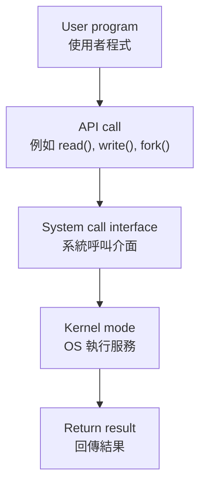
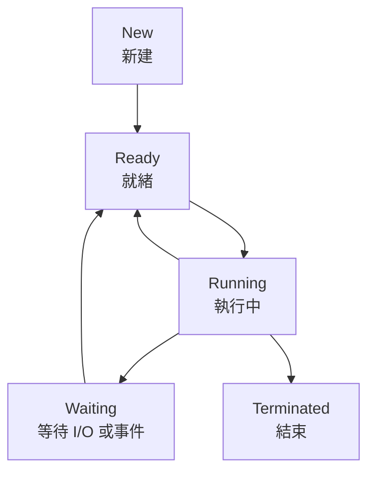
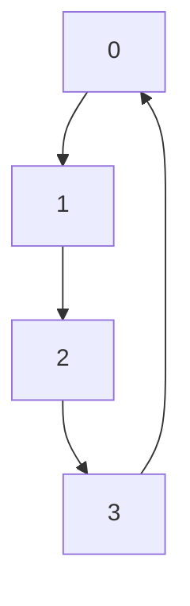
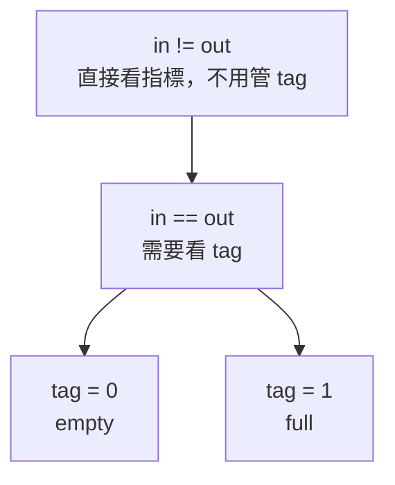
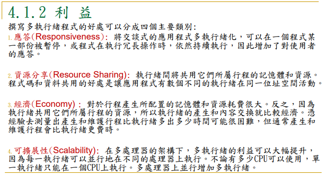
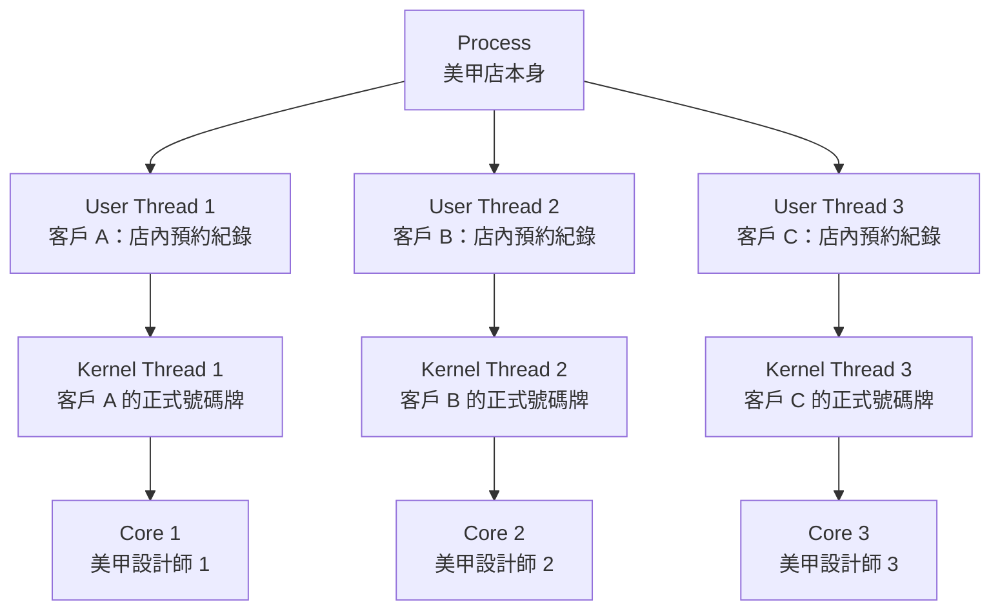
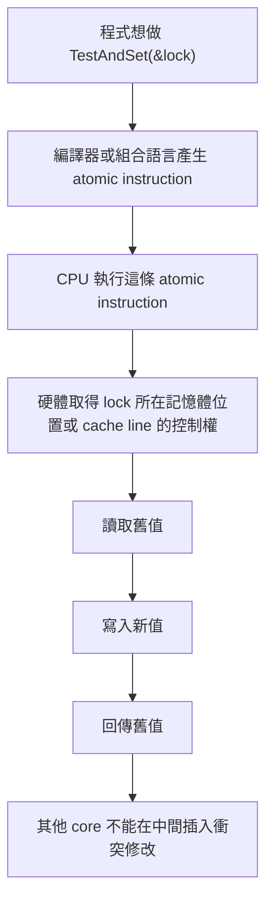

# 期中考重點


## 英文

### Web browser

網頁瀏覽器

### coordinates
協調

### among

在 ... 之間

ex.The operating system controls and coordinates the use of hardware among application programs and users.

### typically

通常、一般來說（副詞）

I feel relaxed because meetings typically start at 9 a.m.

### Polling

polling：輪詢；民意調查（進行中）
├─ poll：投票、調查、逐一詢問
└─ ing：正在進行、動名詞


### poll

投票、民意調查；詢問、徵詢意見；逐一檢查（技術）

### rather than

而不是


### instead of


而不是

### classified

被分類的、歸類的（形容詞／過去分詞）


A compiler is best classified as hardware because it uses CPU and memory?(False)


### Caching

快取機制／快取動作

把常用資料先複製到 cache 裡，之後比較快拿到的「做法／過程」

### absent

不存在

A cache miss means the requested data is absent from the cache and may need to be copied from a lower level of the memory hierarchy.

### intervention

參與

### transfers

傳輸


### clustered

群聚的；成群的；集中分布的

Clustered system

### hot-standby

熱備援

Asymmetric clustering：
一台機器處於 hot-standby mode(熱待機)，負責監督；其他機器執行 application

### identical

完全相同


A student says:
“A clustered system and a multiprocessor system are identical because both involve multiple processing units.”
(Incorrect. A multiprocessor system has multiple processors within one system, while a clustered system connects multiple independent systems through a network.)

### prevent

預防；阻止；防止；避免

Incorrect. Timer interrupts help the OS regain control, support scheduling, and prevent a program from running forever.

### infrastructure

基礎設施

infrastructure：基礎設施
├─ infra：在下方、基礎
├─ structure：結構
│  ├─ struct：建造、組成
│  └─ ure：名詞字尾（狀態、結果）

### Platform

平台；月台；講台；政綱

platform：平台
├─ plat：平的、平面
└─ form：形狀、形式

PaaS | Platform as a Service | 平台服務 | 給你部署程式的平台 

### Message-passing

message-passing：訊息傳遞
├─ message：訊息
│  ├─ mess：送出、派送（詞源相關）
│  └─ age：名詞字尾、結果或狀態
└─ passing：傳遞、通過
   ├─ pass：通過、傳送
   └─ ing：動名詞／進行狀態
   
   
### common

常見、共同


### strengths and weaknesses

優點與缺點

strengths and weaknesses：優點與缺點
├─ strengths：優點、強項
│  ├─ strength：力量、優點
│  │  ├─ strong：強的
│  │  └─ th：名詞字尾（狀態）
│  └─ s：複數
├─ and：和
└─ weaknesses：缺點、弱點
   ├─ weakness：弱點
   │  ├─ weak：弱的
   │  └─ ness：名詞字尾（狀態）
   └─ es：複數


### Blocking

阻擋

### communication

通訊

communication：溝通
├─ com：一起、共同
├─ mun：服務、分享（詞源 related to give/share）
├─ ic：形容詞化
├─ ate：動詞化
└─ ion：名詞化、行為或結果

### organize

組織

### Interprocess

interprocess：行程間的
├─ inter：之間、在…之間
└─ process：行程、處理程序
   ├─ pro：向前
   ├─ cess（cede/ceed/cess）：行進、進行


### interfere

干涉；妨礙；干擾


interfere：干涉
├─ inter：之間、在…之間
└─ fere（fer）：帶來、承載（carry）

### compare

比較

### transition


轉變、轉換；過渡；過渡期；（影片或簡報的）轉場


Which transition usually happens when the CPU scheduler selects a process from the ready queue?


### associated

相關


### CPU-bound process

CPU 密集型行程


CPU-bound process：CPU 密集型行程
├─ CPU：中央處理器
├─ bound：被限制於、受約束
│  ├─ boun：邊界（語源概念）
│  └─ d：形容詞結尾
└─ process：行程、程序
   ├─ pro：向前
   ├─ cess：行走、進行
   └─ ss：名詞結尾


### concept


概念；觀念；想法；構想

concept：概念
├─ con：一起、全部
└─ cept：拿、抓住


### CPU bursts


指在作業系統中，一個程式連續使用 CPU 處理計算的那一段時間，直到它需要等待（例如 I/O）才停止。常見於課堂（如排程演算法）、系統設計討論（分析效能）、或閱讀流程圖時。常搭配 CPU burst time、short/long CPU burst。語氣偏技術性；不適合用來描述整個程式執行時間（那應區分為 total execution time）。容易誤用在「等待時間」，那應是 I/O burst。

所有翻譯：

CPU 執行區段；CPU 運算區段；處理器運作片段；CPU 計算時間段


CPU bursts：CPU 執行區段
├─ CPU：中央處理器（Central Processing Unit）
└─ bursts：爆發（複數）
   ├─ burst：突然發生、爆發
   └─ s：複數


### instead of

而不是

instead of：而不是
├─ in：在…裡、處於
├─ stead：位置、位置上的替代
└─ of：介系詞，表示關聯


### Zombie

殭屍

### orphan


孤兒

### Scalability


scalability：可擴展性、擴充能力
├─ scale：規模；按比例調整；擴大或縮小
│  └─ scale：階梯、刻度、等級、規模
├─ able：能夠……的、可……的
│  └─ -able：形容詞字尾，表示「可以被……的」
└─ ity：性質、狀態
   └─ -ity：名詞字尾，表示「……的性質」
   
   
可擴展性 | Scalability      | 多核心上 threads 可平行執行，提高效率    


### Briefly

briefly：簡短地
├─ brief：簡短的；短時間的；摘要
│  └─ brief：短的、簡要的
└─ ly：以……方式；副詞字尾
   └─ -ly：把形容詞變成副詞


英文例句：I felt relaxed because I could briefly introduce the topic.
中文翻譯：我可以簡短地介紹主題，所以覺得很輕鬆。


### maps A to B


把 A 對應到 B

### corresponding

corresponding：相對應的、相應的
├─ cor：一起、共同、互相
│  └─ co：一起、共同
├─ respond：回應、對應
│  ├─ re：回、向後、再
│  └─ spond：承諾、回答、回應
└─ ing：形容詞化或現在分詞，表示「正在……的」或「具有……性質的」


### compromise

is a compromise between A and B
是在 A 和 B 之間的折衷方案
compromise 這裡不是「妥協」的負面意思，而是「折衷方案」。


compromise：妥協；折衷方案；危及
├─ com：一起、共同
│  └─ co：一起、共同
├─ pro：向前、提出
├─ mis：送出、放出
└─ e：字尾，形成名詞或動詞的拼寫結尾，本身語意較弱


### argument

引數

argue：爭論

In `pthread_create()`, which argument specifies the function that the new thread will execute?

A. The third argument  
B. The first argument  
C. The compiler name  
D. The process ID only


### pass

傳遞

In the following code, what is passed to the runner function?

在下面的程式碼中，什麼東西被傳給 runner 函式？


### separate

分開、單獨的

The delivery fee is a separate cost.

運費是一筆單獨的成本。

### status

狀態；狀況；身分；地位；進度；法律地位；系統狀態

status：狀態；身分；地位
├─ stat：站立、放置、處於某種位置或情況
└─ us：名詞結尾，表示狀態或結果，常見於拉丁來源字

### introduce overhead

引入、帶來

額外成本、額外負擔、額外開銷

Creating too many threads can reduce performance because thread creation, scheduling, and context switching introduce overhead.


### reasonable


reasonable：合理的、可以接受的
├─ reason：理由、理性、推理
└─ able：形容詞字尾，表示「能夠……的、具有……性質的」

### approach


英文例句：I felt relieved when the team chose a clear approach.
中文翻譯：當團隊選了一個清楚的方法時，我鬆了一口氣。


approach：方法；接近；處理
├─ ap：朝向、靠近，ad 的變體
│  └─ ad：朝向、往……去
└─ proach：靠近、接近，來自「更近」的概念

### chunk


chunk：大塊；區塊；一部分
└─ chunk：不可再可靠拆解的詞根，表示一大塊或一個較大的部分


### inefficient

inefficient：沒效率的、效率低的
├─ in：不、否定
├─ ef：向外、完成，ex 的變體
│  └─ ex：向外、出來
├─ fic：做、製造
└─ ient：形容詞字尾，表示「具有……性質的、能夠……的」
   ├─ i：連接母音
   └─ ent：形容詞字尾，表示「正在……的、具有……性質的」

effect：效果；影響

### Mutex Lock


mutex：互斥鎖
├─ mut：來自 mutual，互相的、彼此的
│  └─ mutual：相互的、彼此的
│     ├─ mutu：互相、彼此交換，拉丁來源，不是現代常用自由詞根
│     └─ al：形容詞字尾，表示「……的」
└─ ex：來自 exclusion，排除、排斥
   └─ exclusion：排除、排斥
      ├─ ex：向外、排出
      ├─ clus：關閉、關起，與 exclude / close 相關
      └─ ion：名詞字尾，表示行為、結果或狀態


### bounded 

bounded：有界限的、受限制的
├─ bound：界限、邊界；限制
└─ ed：形容詞或過去分詞字尾，表示「被……的、具有……狀態的」


### entry


entry：進入；入口；項目
├─ entr：進入、走進
│  └─ enter：進入
│     ├─ en：進入、使進入，in 的變體
│     └─ ter：跨過、走入，字源連結不完全透明
└─ y：名詞字尾，表示行為、結果或事物


### runtime

執行階段


### reduction


#### `reduction` 是什麼意思？

**Reduction(歸約)** 的意思是：

> 把很多個值，透過某種運算，合併成一個值。

例如：

1 + 2 + 3 + 4 + 5 = 15

這就是一種 reduction，因為很多數字最後被「歸約」成一個總和


#### 為什麼寫成 `reduction(+:sum)`？

格式是：


reduction(operator : variable)

所以：


reduction(+:sum)

### nested loops


巢狀迴圈


nested loops：巢狀迴圈
├─ nested：巢狀的、嵌套的
│  ├─ nest：巢、窩；放在裡面
│  └─ ed：形容詞或過去分詞字尾，表示「被……的、具有……狀態的」
└─ loops：迴圈
   ├─ loop：圈、環；程式中重複執行的一段流程
   └─ s：複數字尾，表示兩個以上


## OS 定義

OS 定義成兩個重要角色：

1. **Resource Allocator(資源分配者)**  
    管理 CPU time、Memory space、File-storage space、I/O devices，並在多個程式搶資源時做分配。
    
2. **Control Program(控制程式)**  
    控制程式執行，避免錯誤或不當使用電腦。


Operating System service(作業系統服務) 是 OS 提供給使用者或程式的功能，例如：

- User interface(使用者介面)
    
- Program execution(程式執行)
    
- I/O operations(輸出入作業)
    
- File-system manipulation(檔案系統操作)
    
- Communications(通訊)
    
- Error detection(錯誤偵測)
    
- Resource allocation(資源分配)
    
- Protection and security(保護與安全)


## Computer System Structure(電腦系統結構)

Computer System(電腦系統) 通常分成四個部分：

1. Hardware(硬體)
提供基本計算資源，例如 CPU、Memory(記憶體)、I/O devices(輸出入設備)。

2. Operating System(作業系統)
控制與協調硬體資源的使用。

3. Application Program(應用程式)
定義如何使用系統資源來解決使用者問題，例如 word processor、compiler、web browser、database system、video game。

4. User(使用者)
可以是人、機器或其他電腦。

## Computer System Operation(電腦系統操作)

Computer System Operation(電腦系統操作) 的基本概念：

1. **CPU and I/O devices can execute concurrently**  
    CPU 和 I/O devices 可以同時工作。
    
2. **Device controller(設備控制器)**  
    每種設備通常由 device controller 負責控制。
    
3. **Local buffer(本地緩衝區)**  
    Device controller 有自己的 local buffer，資料會在 main memory(主記憶體) 和 local buffer 之間移動。
    
4. **Interrupt(中斷)**  
    當 device controller 完成操作後，會透過 interrupt 通知 CPU。
    
5. **Interrupt vector(中斷向量)**  
    Interrupt vector 是一張表，裡面放不同 interrupt service routine(中斷服務程序) 的位址。
    
6. **Trap(陷阱)**  
    Trap 是 software-generated interrupt(軟體產生的中斷)，通常由錯誤或 system call(系統呼叫) 造成，例如除以 0、記憶體錯誤、程式請求 OS 服務。


## Locality(區域性)

Caching 之所以有效，是因為程式通常有 Locality(區域性)。

| 類型 | 意思 | 例子 |
| --- | --- | --- |
| Temporal Locality(時間區域性) | 最近用過的東西，很可能很快再用 | 迴圈變數 `i`、重複執行的迴圈指令 |
| Spatial Locality(空間區域性) | 剛用過位置附近的東西，很可能很快被用 | 陣列 `a[0]`, `a[1]`, `a[2]` 連續存取 |


## Cache Line(快取列)


Cache line(快取列) 是 CPU cache 一次搬資料的最小單位。

例如 cache line = 64 bytes，CPU 要讀 `array[0]` 時，可能不只把 `array[0]` 搬進 cache，而是把附近一整段連續資料一起搬進來。

所以：

```C
array\[0\], array\[1\], array\[2\], array\[3\]
```

如果它們在記憶體中連續排列，讀 `array[0]` 時，後面的元素可能也一起進 cache。這就是 Spatial Locality(空間區域性) 對效能有幫助的原因。

>C/C++ 的二維陣列通常是 row-major order(列優先儲存)。

也就是：


```C
int a\[2\]\[3\];
```

記憶體排列大概是：
```c
a\[0\]\[0\], a\[0\]\[1\], a\[0\]\[2\], a\[1\]\[0\], a\[1\]\[1\], a\[1\]\[2\]
```

>主流 CPU cache 的 cache line 多為 64 Byte


## Cache Hit / Cache Miss


| 術語                | 意思                   |
| ----------------- | -------------------- |
| Cache Hit(快取命中)   | 要找的資料已經在快取裡，直接用      |
| Cache Miss(快取未命中) | 快取沒有，要去較慢的儲存層拿，再放進快取 |


如果 cache 沒有， main memory 也沒有，從secondary storage 拿到資料後，通常先放進 main memory(RAM)(Page Fault)，再由 CPU cache 從 RAM 載入需要的 cache line。


## I/O Structure(輸出入結構) 、 DMA


常見兩種處理方式：

| 方式 | 說明 | 缺點／特色 |
| --- | --- | --- |
| Polling(輪詢) | CPU 或 OS 反覆檢查 I/O 是否完成 | 可能浪費 CPU 時間 |
| Interrupt(中斷) | I/O 完成後由 device controller 通知 CPU | CPU 可先做其他工作 |

**DMA(Direct Memory Access)** 用於高速 I/O device。  
Device controller 可以直接把資料區塊從 buffer storage 傳到 main memory，不需要 CPU 逐 byte 介入。

重點：

1. DMA 適合大量資料傳輸
    
2. CPU 不必負責每個 byte 的搬移
    
3. 每個 block 通常只產生一次 interrupt，而不是每個 byte 都 interrupt
    
4. 可以提高 I/O 效率並減少 CPU 負擔

>CPU / OS 設定 DMA 傳輸，device controller 負責大量資料搬移，完成後再用 interrupt 通知 CPU。


## 電腦系統

想成一間餐廳：

| 架構                         | 生活化比喻                 |
| -------------------------- | --------------------- |
| Single-processor system    | 只有一位廚師                |
| Multiprocessor system      | 多位廚師共用同一個廚房           |
| Asymmetric multiprocessing | 有一位主廚分配工作，其他廚師照做      |
| Symmetric multiprocessing  | 每位廚師地位類似，都可以處理工作      |
| Clustered system           | 多間餐廳彼此連線、共享某些資源，提高可靠度 |


multiprocessor(多處理器系統) 是指同一個電腦系統裡面有多個 CPU / processor / core，共用同一套記憶體、匯流排、周邊裝置。

| 類型                                       | 是幾台電腦？ | 有幾個 CPU / core？ | 記憶體關係                |
| ---------------------------------------- | -----: | --------------: | -------------------- |
| single processor / uniprocessor(單一處理器系統) |    1 台 |          1 個處理器 | 1 套記憶體               |
| multiprocessor(多處理器系統)                   |    1 台 |   多個 CPU / core | 通常共享同一套主記憶體          |
| clustered system(集成式系統)                  |     多台 |       每台各自有 CPU | 各電腦通常各自有記憶體，可能共享儲存裝置 |


Clustered system

多台獨立電腦透過網路連接，常共享 storage(儲存裝置)，目標通常是提高 availability(可用性) 或 reliability(可靠性)。

生活化例子：  
不是一間廚房裡多位廚師，而是好幾間分店彼此連線；其中一間出問題，其他分店還能支援服務。

---

Asymmetric vs Symmetric clustering

| 類型 | 重點 |
| --- | --- |
| Asymmetric clustering | 一台機器 hot-standby(熱待機) 監督，其他機器執行應用 |
| Symmetric clustering | 所有機器都執行應用，也互相監督 |


###  Multiprogramming(多元程式規劃)

Multiprogramming 的目的：

> Keep CPU busy by having several jobs in memory.

也就是記憶體裡同時放多個 job/process，當某個 process 等 I/O 時，OS 可以切去執行另一個 process。

重點不是「真的同一瞬間一顆 CPU 跑多個程式」，而是：

> 單一 CPU 透過快速切換，讓 CPU 使用率提高。

---

###  Timesharing / Multitasking(分時／多工)

Timesharing 是 multiprogramming 的延伸。

Multiprogramming 重點是提高 CPU utilization。  
Timesharing 重點是讓使用者覺得系統有互動性。

例如你同時開瀏覽器、VS Code、終端機。  
CPU 其實在不同 process 間快速切換，但你感覺它們「好像同時在跑」。

講義提到 response time(反應時間) 通常應該小於 1 秒，這是互動式系統很在意的指標。

講義\_chapter 1\_20240218

---

###  Dual-mode operation(雙模式運作)

為了避免 user program(使用者程式) 亂碰硬體或 OS 核心資料，電腦通常有兩種模式：

| 模式 | 權限 | 說明 |
| --- | --- | --- |
| User mode(使用者模式) | 權限較低 | 一般應用程式執行的模式 |
| Kernel mode(核心模式) | 權限較高 | OS kernel 執行、可操作硬體與特權指令 |

生活化例子：

User mode 像一般顧客，只能在餐廳用餐區活動。  
Kernel mode 像店長或廚房主管，可以進廚房、開保險箱、調度資源。

當 user program 需要 OS 服務，例如讀檔、I/O、配置記憶體，通常會透過 **System call(系統呼叫)** 進入 kernel mode。

---

### Timer(計時器)

Timer 的目的：

> Prevent a user program from running forever and never returning control to the operating system.

也就是防止某個程式無限迴圈霸佔 CPU。

OS 可以設定 timer，時間到就產生 interrupt，讓 OS 重新取得控制權，進行排班或終止超時程式。


## OS Resource Management Overview


**Process Management(行程管理)**  
Process(行程) 是正在執行中的程式。OS 要負責 process / thread scheduling、process creation/deletion、suspend/resume、synchronization、communication、deadlock handling。

講義\_chapter 1\_20240218

**Main Memory Management(主記憶體管理)**  
OS 要記錄哪些 memory 正在被使用、誰在使用、何時分配與回收 memory。

講義\_chapter 1\_20240218

**Storage Management(儲存體管理)**  
OS 將實體儲存裝置抽象成 logical storage unit，也就是 File(檔案)，並負責檔案與目錄建立、刪除、備份、磁碟排班等。

講義\_chapter 1\_20240218

**I/O System(I/O 系統)**  

I/O subsystem(I/O 子系統) 是 OS(作業系統) 裡面專門負責管理 input/output devices(輸入／輸出裝置) 的一整組機制。

包含 buffering(緩衝)、caching(快取)、spooling、device-driver interface、specific device drivers。

講義\_chapter 1\_20240218

**Protection and Security(保護與安全)**  
確保檔案、memory segment、CPU、其他資源只能由被授權的 process 適當操作。


### spooling 是啥


Spooling(排存／假離線) 是什麼？

Spooling(Simultaneous Peripheral Operation On-Line，排存／假離線) 是 OS(作業系統) 管理 I/O(輸入／輸出) 的一種方法：

先把要給慢速裝置處理的資料，暫時存到一個 queue(佇列) 或 buffer(緩衝區) 裡，等裝置有空再慢慢處理。

最經典例子是 printer(印表機)。

假設你同時開了三個程式，都要列印：

Word 要印 10 頁
PDF 要印 3 頁
瀏覽器要印 1 頁

印表機很慢，而且一次只能印一份。
如果沒有 spooling(排存)，程式可能要一直等印表機印完，才能繼續做事。


| 名詞            | 重點                      | 例子        |
| ------------- | ----------------------- | --------- |
| Buffering(緩衝) | 解決速度差，暫存資料              | 網路影片先載入一段 |
| Spooling(排存)  | 把多個 I/O 工作排隊，讓慢裝置一個一個處理 | 多份文件排隊列印  |


## Cloud computing

Cloud computing(雲端計算) 是透過 Network(網路) 提供：

1. Computing service(運算服務)
    
2. Storage service(儲存服務)
    
3. Application service(應用程式服務)
    

講義 Chapter 1 明確提到 cloud computing 是透過網路提供 computing、storage、applications 的服務。

###  Cloud deployment models(雲端部署模型)

| 類型 | 中文 | 重點 |
| --- | --- | --- |
| Public cloud | 公有雲 | 對外提供給一般使用者或企業 |
| Private cloud | 私有雲 | 組織內部自己使用 |
| Hybrid cloud | 混合雲 | 結合 public cloud 和 private cloud |

---


###  Cloud service models(雲端服務模型)

| 類型 | 全名 | 提供什麼 | 生活化理解 |
| --- | --- | --- | --- |
| SaaS | Software as a Service | 應用程式服務 | 直接用軟體，例如 Gmail、Google Docs |
| PaaS | Platform as a Service | 平台服務 | 給你部署程式的平台 |
| IaaS | Infrastructure as a Service | 基礎設施服務 | 租 VM、storage、network |


## ch2 開始


## OS services 

> What kind of services does an operating system provide?

要背清單：

- User interface
    
- Program execution
    
- I/O operations
    
- File-system manipulation
    
- Communications
    
- Error detection
    
- Resource allocation
    
- Accounting
    
- Protection and security

## System Calls and Parameter Passing(系統呼叫與參數傳遞)

### 直覺版

Application Program(應用程式) 不能直接亂碰硬體或 OS 核心資源。

例如 Chrome 想讀檔案，它不能自己直接去硬碟亂翻，而是要跟 OS 說：

> 「請幫我開這個檔案。」

這個「向 OS 請求服務」的動作就是 **System call(系統呼叫)**。

---

### 正式定義

**System call(系統呼叫)** 是程式使用 OS services(作業系統服務) 的介面。

常見例子：

| 需求         | 可能的 system call 類型 |
| ---------- | ------------------ |
| 建立 process | process control    |
| 開啟檔案       | file management    |
| 讀寫裝置       | device management  |
| 行程間通訊      | communication      |
| 設定權限       | protection         |

重點：

> User program 通常透過 API，例如 POSIX API、Win32 API、Java API，間接呼叫 system call。

---

### 為什麼 system call 會牽涉 user mode / kernel mode？

一般程式在 **User mode(使用者模式)**。
但真正執行 OS 服務時，常需要進入 **Kernel mode(核心模式)**。

流程可以想成：



---

###  三種 System Call 參數傳遞方式

考古可能直接問：

> Describe three general methods used to pass parameters to the operating system during system calls.

要背三種：

| 方法                             | 說明                                              |
| ------------------------------ | ----------------------------------------------- |
| Registers(暫存器)                 | 把參數直接放進 CPU registers                           |
| Memory block / table(記憶體區塊／表格) | 參數放在 memory block，然後把 block address 放進 register |
| Stack(堆疊)                      | 程式把參數 push 到 stack，OS 再 pop 取出                  |


## Interprocess Communication, IPC(行程間通訊)

兩種 IPC 模型

| 方法                 | 比喻        | 對應 IPC          |
| ------------------ | --------- | --------------- |
| 共同編輯同一份 Google Doc | 兩人共享同一份內容 | Shared memory   |
| 用 Line 傳訊息         | 一人傳、一人收   | Message passing |


###  Shared-memory model(共享記憶體模型)

兩個或多個 process(行程) 建立一塊共同可存取的 memory region(記憶體區域)，之後透過這塊區域交換資料。

優點：

> 速度快，因為資料可以在 memory speed(記憶體速度) 下交換。

缺點：

> 需要處理 synchronization(同步) 與 conflict/race condition(衝突／競爭情況)，否則可能資料不一致。

---

### Message-passing model(訊息傳遞模型)

Process 不共享同一塊記憶體，而是用 send(message) / receive(message) 傳送訊息。

優點：

> 對小量資料很方便，較容易實作，也比較不需要處理共享記憶體衝突。

缺點：

> 大量資料時可能較慢，因為訊息可能需要複製或經過 kernel 管理。


---

### Message queue(訊息佇列)

Message queue(訊息佇列) 是 Message passing(訊息傳遞) 常用的一種實作機制。

重點不是 process 直接共享同一塊 memory，而是把 message 放進一個 queue(佇列) 裡，由另一個 process 取出。

生活化例子：

> Message queue 像櫃台信箱。  
> Process A 把信放進信箱，Process B 再從信箱取出來。  
> A 和 B 不需要直接碰彼此的記憶體。

基本流程：

```text
Process A  --send(message)-->  Message queue  --receive(message)-->  Process B
```

在作業系統中，message queue 通常由 kernel(核心) 管理。Process 透過 system call 或 IPC API 把 message 放入 queue，另一個 process 再從 queue 取出 message。

和 Shared memory 的差異：

| 比較 | Message queue / Message passing | Shared memory |
| --- | --- | --- |
| 資料交換方式 | 把 message 放進 queue，再由對方接收 | 共同讀寫同一塊 memory region |
| 是否共享記憶體 | 通常不直接共享同一塊 memory | 會共享同一塊 memory |
| Kernel 角色 | 通常會介入 send / receive 或 queue 管理 | 建立 shared memory 後，資料交換可較少經過 kernel |
| 優點 | 小資料方便、較容易實作、比較不容易直接產生共享記憶體衝突 | 速度快，適合大量資料 |
| 缺點 | 大量資料可能較慢，因為 message 可能需要複製或經過 kernel | 需要 synchronization，否則可能 race condition |

一句話記法：

> Message queue 是 Message passing 的「排隊收發信箱」；Shared memory 是多個 process 共用同一張白板。

---
## Message passing 進階

### Direct communication(直接通訊)

Direct communication 是 sender(傳送者) 和 receiver(接收者) 直接指定對方。

例如：

```text
send(P, message)
receive(Q, message)
```

意思是：

- send(P, message)：把 message 傳給 process P
- receive(Q, message)：從 process Q 接收 message

---

### Indirect communication(間接通訊)

Indirect communication 是透過 mailbox(信箱) 或 port(埠) 傳訊息。

例如：

```text
send(A, message)
receive(A, message)
```

意思是：

- send(A, message)：把 message 放進 mailbox A
- receive(A, message)：從 mailbox A 取 message

Message queue 可以理解成 indirect communication 裡常見的 mailbox / port 類概念：sender 把 message 放到某個 queue，receiver 再從該 queue 取出 message。

生活化例子：

| 類型 | 例子 |
| --- | --- |
| Direct communication | 你直接 Line 某個同學 |
| Indirect communication | 你把文件放到班級雲端資料夾，其他人去拿 |
| Message queue | 你把文件放到櫃台收件匣，下一位同學照順序取件 |

---

## ch 3 開始

## Process Concept and Process Memory Layout

>**Program(程式)** 是放在磁碟上的靜態檔案。  
>**Process(行程)** 是正在執行中的程式。

生活化例子：

| 概念 | 例子 |
| --- | --- |
| Program | 食譜放在書架上 |
| Process | 廚師正在照食譜煮菜 |

同一個 program 可以產生多個 process。  
例如你開兩個 Chrome 視窗，它們可能對應不同 process。

---

###  正式定義

**Process(行程)** 是正在執行中的程式。它不只是程式碼，還包含目前執行狀態，例如 Program Counter(程式計數器)、CPU registers(暫存器)、Stack(堆疊)、Data section(資料區段)、Heap(堆積) 等。講義 Chapter 3 明確說 process 是正在執行的程式，並包含 PC、registers、stack、data section、heap 等內容。

講義\_chapter 3\_20240318

---

###   Process memory layout

一個 process 通常包含：

| 區域 | 中文 | 放什麼 |
| --- | --- | --- |
| Text section | 程式碼區 | executable code |
| Data section | 資料區 | global variables、static variables |
| Stack | 堆疊 | function calls、local variables、parameters、return address |
| Heap | 堆積 | dynamically allocated memory，例如 `malloc()` / `new` |


### Data section vs stack/heap


>差異是"會不會在程式執行執行期間死掉"。


---

###  Stack vs Heap


這是考古高機率題，110 考古 Q8 直接問：

> What is the difference between stack memory and heap memory?
> 
> 考古\_110

重點比較：

| 比較 | Stack | Heap |
| --- | --- | --- |
| 管理方式 | compiler / runtime 自動管理 | programmer 手動管理 |
| 常放內容 | local variables、function parameters、return address | dynamic data structures、objects、malloc/new 配置資料 |
| 速度 | 通常較快 | 通常較慢 |
| 大小 | 較小、固定限制較明顯 | 較大，可動態成長 |
| 常見問題 | stack overflow | memory leak、fragmentation、heap overflow |

生活化例子：

Stack 像一疊盤子，最後放上去的最先拿走，符合 LIFO。  
Heap 像倉庫，你可以到處租空間，但要記得自己歸還，不然就會 memory leak。


#### Memory leak 是什麼？

Memory leak(記憶體洩漏) 是指：

程式向 Heap(堆積) 申請了一塊記憶體，但用完後沒有釋放，導致那塊記憶體一直被佔著，不能再被正常使用。


生活化例子：

想像你去圖書館借了一個置物櫃。

你把東西拿走了，但忘記把鑰匙還給櫃台。  
櫃子其實空了，可是系統以為它還被你佔用，別人也不能用。

這就是 memory leak 的感覺：

> 記憶體明明不再需要，但程式沒有釋放，所以系統仍然認為它被佔用。


## Process State(行程狀態) 與 Process Control Block, PCB(行程控制表)


### Process State(行程狀態) 是什麼？

Process 執行時不會永遠都在 running。
它可能剛被建立、正在等 CPU、正在執行、等待 I/O、或已經結束。

常見五種狀態：

| State      | 中文  | 意思                       |
| ---------- | --- | ------------------------ |
| New        | 新建  | process 正在被建立            |
| Ready      | 就緒  | process 已準備好，正在等 CPU     |
| Running    | 執行中 | process 正在 CPU 上執行       |
| Waiting    | 等待  | process 正在等待事件，例如 I/O 完成 |
| Terminated | 結束  | process 已完成執行            |

---

###   狀態轉換直覺圖



重點轉換：

| 轉換                   | 原因                                     |
| -------------------- | -------------------------------------- |
| New → Ready          | process 建立完成，進入 ready queue            |
| Ready → Running      | CPU scheduler 選中它                      |
| Running → Waiting    | 發出 I/O request 或等待事件                   |
| Waiting → Ready      | I/O 或事件完成                              |
| Running → Ready      | 被 interrupt 或 time quantum 到，被 preempt |
| Running → Terminated | process 執行完畢                           |

---

###   PCB 是什麼？

**Process Control Block, PCB(行程控制表)** 是 OS 用來記錄 process 狀態的資料結構。

可以想成 process 的「個人檔案」。

PCB 通常包含：

| PCB 內容                        | 說明                                 |
| ----------------------------- | ---------------------------------- |
| Process state                 | 目前狀態，例如 ready / running / waiting  |
| Program counter               | 下一個要執行的 instruction address        |
| CPU registers                 | 暫存器內容                              |
| CPU scheduling information    | priority、queue pointer 等           |
| Memory-management information | base / limit register、page table 等 |
| Accounting information        | CPU 使用時間、帳號資訊                      |
| I/O status information        | open files、I/O device 狀態           |

講義 Chapter 3 說 PCB 會記錄 process state、program counter、CPU registers、priority、memory-management information、accounting information、open files 等資訊。


## Process Scheduling(行程排班) 與 Scheduling Queues(排班佇列)

OS 像遊樂園的工作人員，process 像遊客。

不同狀態的 process 會排在不同隊伍：

| 隊伍           | 生活例子         | OS 對應                         |
| ------------ | ------------ | ----------------------------- |
| Job queue    | 所有想入園的人      | 系統裡所有 process                 |
| Ready queue  | 已經入園、等著玩設施的人 | 在 memory 中、準備好等 CPU 的 process |
| Device queue | 排隊等廁所或餐廳的人   | 等 I/O device 的 process        |

CPU scheduler 像工作人員從 ready queue 挑下一個人去玩設施，也就是讓 process 上 CPU 執行。

---

###  Scheduling Queues(排班佇列)

常見三種：

| Queue                    | 中文          | 放什麼                                   |
| ------------------------ | ----------- | ------------------------------------- |
| Job queue                | 工作佇列        | 系統中所有 process                         |
| Ready queue              | 就緒佇列        | 在 main memory 中，已準備好、等待 CPU 的 process |
| Device queue / I/O queue | 裝置佇列／I/O 佇列 | 等待特定 I/O device 的 process             |

---

###   Schedulers(排班程式)

| Scheduler             | 中文                     | 主要功能                                        | 執行頻率 |
| --------------------- | ---------------------- | ------------------------------------------- | ---- |
| Long-term scheduler   | 長期排班程式 / Job scheduler | 決定哪些 process 被帶入 ready queue                | 較低   |
| Short-term scheduler  | 短期排班程式 / CPU scheduler | 從 ready queue 選下一個 process 執行               | 很高   |
| Medium-term scheduler | 中期排班程式                 | 把 process 暫時 swap out / swap in，以調整記憶體與競爭程度 | 中等   |

---

###  最常考差異

**Short-term scheduler(短期排班程式)**
重點是快，因為它很常執行。它從 ready queue 選 process 分配 CPU。

**Long-term scheduler(長期排班程式)**
重點是控制 **degree of multiprogramming(多元程式規劃程度)**，也就是系統中同時有多少 process 進入 memory / ready queue。

**Medium-term scheduler(中期排班程式)**
重點是 **swapping(交換)**，可以把 process 從 memory 移到 disk，之後再移回來繼續執行。


### 對應關係

>Ready queue 對應 Ready state。
Device queue 通常對應 Waiting state 中「正在等 I/O device」的那一類。


## I/O-bound / CPU-bound 行程與 Context Switch(內容切換)

**I/O-bound process(I/O 密集型行程)**：

> 花比較多時間在等待 I/O，例如讀檔、網路、鍵盤、磁碟。

特色：

* 很常發出 I/O request
* CPU burst 通常較短
* 常在 Running 和 Waiting 之間切換

例子：

* 下載檔案
* 等使用者輸入
* 資料庫讀磁碟

---

###  CPU-bound process

**CPU-bound process(CPU 密集型行程)**：

> 花比較多時間在做計算，很少請求 I/O。

特色：

* 很少發出 I/O request
* CPU burst 通常較長
* 會長時間使用 CPU

例子：

* 大量數學運算
* 影片編碼
* 矩陣運算
* AI 模型推論或訓練中的計算部分

---

### Context Switch

**Context switch(內容切換)** 是：

> CPU 從一個 process 切換到另一個 process 時，OS 必須保存舊 process 的狀態，並載入新 process 的狀態。

要保存 / 載入的內容通常在 PCB 裡，例如：

* Program counter
* CPU registers
* Process state
* Scheduling information
* Memory-management information

重要觀念：

> Context switch 是 overhead(額外負擔)，因為切換期間 CPU 沒有在執行真正有用的 user program 工作。
> 簡單來說就是要寫作業時，花了30分鐘拿作業，這30分鐘就是 overhead 。

講義 Chapter 3 說 context switch 需要保存目前 process 的 context，再載入新 process 的保存狀態；這是 overhead。


## 行程產生：fork、exec、wait


### fork() 是什麼？

`fork()` 會建立一個新的 process。

原本的 process 叫：

> **Parent process(父行程)**

新建立的 process 叫：

> **Child process(子行程)**

重點：

> `fork()` 之後，parent 和 child 都會從 `fork()` 之後的地方繼續執行。

生活化例子：

你影印一份作業。
影印前只有一份，影印後有兩份，而且兩份都會繼續往下寫。

---

### fork() 的回傳值

`fork()` 最重要的是回傳值不同：

| 情況             | `fork()` 回傳值 | 意思             |
| -------------- | -----------: | -------------- |
| Child process  |            0 | 代表自己是 child    |
| Parent process |         大於 0 | 回傳 child 的 PID |
| Error          |           -1 | fork 失敗        |

講義 Chapter 3 也明確列出：`fork()` 在 child 回傳 0，在 parent 回傳大於 0，在錯誤時回傳 -1。

---

###  exec() 是什麼？

`exec()` 會把目前 process 的 memory space 替換成新的 program。

重點：

> `fork()` 是產生 child process。
> `exec()` 是讓某個 process 載入並執行新程式。

常見組合：

```c
pid = fork();

if (pid == 0) {
    exec(...);   // child loads a new program
} else {
    wait(NULL);  // parent waits for child
}
```


exec() 成功後，這些會被新的 program 內容取代。

例如 child 原本是 shell 的副本：
```
Process 2001
Text: shell 的機器碼
Data: shell 的資料
Heap: shell 的 heap
Stack: shell 的 stack
PC: shell 下一行要執行的位置
```
執行：
```
execlp("/bin/ls", "ls", NULL);
```
之後：
```
Process 2001
Text: ls 的機器碼
Data: ls 的資料
Heap: ls 的 heap
Stack: ls 啟動用的新 stack
PC: ls 的程式入口點
```
這就是「替換」。


---

### wait() 是什麼？

`wait()` 讓 parent process 等 child process 結束。

如果 parent 沒有 `wait()` child，child 結束後可能變成 **Zombie process(僵屍行程)**。

如果 parent 先結束，而 child 還在跑，child 會變成 **Orphan process(孤兒行程)**，通常會被 `init` 或系統中的類似 process 接管。講義 Chapter 3 也說 terminated process 沒有 parent waiting 時會是 zombie；parent terminated 時 child process 會成為 orphan。

---

### fork 題最重要規則

每次 `fork()` 都會讓「目前存在的每個 process」各自再產生一個 child。

所以：

```c
fork();
fork();
fork();
```


!!! danger  "背"
    如果中間沒有條件限制，最後 process 數量是：
    ```text
    2^3 = 8 processes
    ```
    
    因為一個 fork() 會分割兩次，並留下原本的，所以是 2^n 個。

{ width="60%" }

若每個 process 都印一次，就會印 8 次。


### fork 題的最核心規則

每次遇到 `fork()`：

> **目前存在的每個 process 都會分裂成 2 個 process。**

所以如果沒有條件限制：

| fork 次數 | process 數量 |
| ------: | ---------: |
|     1 次 |          2 |
|     2 次 |          4 |
|     3 次 |          8 |
|     n 次 |         2ⁿ |

---

###  但印出次數不一定只看最後 process 數

如果程式是這樣：

```c
fork();
printf("A\n");

fork();
printf("B\n");
```

要分段算：

1. 第一次 `fork()` 後有 2 個 process，所以 `"A"` 印 2 次。
2. 第二次 `fork()` 是由目前 2 個 process 各自 fork，所以變成 4 個 process，因此 `"B"` 印 4 次。

所以總印出：

```text
A 印 2 次
B 印 4 次
```


如圖：
{width="50%"}


考古 110 的 fork 題就是這種「每個 fork 後面都有 printf」的變形。

---

###  fork 回傳值再提醒

| Process |  `fork()` 回傳值 |
| ------- | ------------: |
| Child   |             0 |
| Parent  | child PID，正整數 |
| Error   |            -1 |

這會影響條件判斷題，例如：

```c
if (fork() == 0) {
    printf("child\n");
}
```

這種情況只有 child 會印。


## Zombie Process(僵屍行程) 與 Orphan Process(孤兒行程)


###  Zombie process 是什麼？

當 **child process 已經結束**，但 **parent process 還沒呼叫 `wait()` 來回收它的結束資訊**，這個 child 就會變成 **Zombie process**。

重點：

> child 已經死掉了，但 process table 裡還留著它的紀錄。

生活化例子：
像學生已經畢業離校，但學校行政系統還沒辦退學／畢業手續，所以名單上還卡著一筆紀錄。

---

###   Orphan process 是什麼？

當 **parent process 先結束**，但 **child process 還在執行**，這個 child 就變成 **Orphan process**。

之後它通常會被 `init` 或系統中的對應行程接管。

重點：

> parent 先死，child 還活著。

生活化例子：
像小朋友還在活動，但原本帶隊老師先離開了，所以改由另一位老師接手。

---

###  最容易混淆的差別

| 類型     | parent 狀態       | child 狀態 | 核心特徵                 |
| ------ | --------------- | -------- | -------------------- |
| Zombie | 還活著，但沒 `wait()` | 已結束      | child 留下殘存紀錄         |
| Orphan | 已結束             | 還活著      | child 被別的 process 接管 |


一句話記法：

!!! danger "背"
    Zombie = child terminated, parent still alive, but parent has not yet called wait().
    Orphan = parent terminated, child still alive.

講義 Chapter 3 對 Zombie / Orphan 也有這個核心定義。


## 環狀佇列問題／生產者消費者共享資料


###   直覺版

Producer(生產者) 一直往 buffer 放資料。
Consumer(消費者) 一直從 buffer 拿資料。

如果 buffer 是 circular queue(環狀佇列)，通常用兩個指標：

* `in`：下一個要放的位置
* `out`：下一個要拿的位置

問題是：

> 只看 `in` 和 `out`，有時候很難分辨 buffer 是 **empty(空)** 還是 **full(滿)**。

因為兩種情況都可能出現：

```text
in == out
```

---

###   原始寫法的問題

考古題那種原始寫法通常是：

* empty：`in == out`
* full：`(in + 1) % BUFFER_SIZE == out`

這種寫法是正確的，但會有一個代價：

> **永遠浪費一格。**

因為它故意保留一個空格，避免 full 和 empty 都變成 `in == out` 時無法區分。

所以如果 `BUFFER_SIZE = 10`，實際只能放 **9** 個元素。
如果 `N = 8`，實際只能放 **7** 個元素。

---

###   怎麼解？

常見兩種解法：

####   用 count

額外維護目前 buffer 裡有幾個元素。

* `count == 0` → empty
* `count == BUFFER_SIZE` → full

####   用 tag / flag

額外用一個 `tag` 來區分：

* `in == out && tag == 0` → empty
* `in == out && tag == 1` → full

你自己的筆記就是用 **tag** 來避免浪費一格，讓 `N = 8` 時真的能放滿 8 個元素。

---

###   考試最短答案骨架

如果題目問：

> What is the problem of the circular queue problem?

可以先答：

> **The original circular queue solution wastes one buffer slot, because it uses `(in + 1) % BUFFER_SIZE == out` to represent full and `in == out` to represent empty. Therefore, the buffer can use only BUFFER_SIZE − 1 slots.**

如果題目再問：

> How to solve it?

可以答：

> **Use an additional variable such as a count or a tag/flag to distinguish full from empty, so the queue can use all BUFFER_SIZE slots.**

---

### 看代碼

#### 1. 代碼講解

原始 circular queue 只有兩個指標：

* `in`：下一個要放的位置
* `out`：下一個要拿的位置

原始寫法通常是：

* **empty**：`in == out`
* **full**：`(in + 1) % N == out`

這樣的好處是簡單，但缺點是：

> **會浪費一格。**

因為它必須故意保留一個空格，才能避免 full 和 empty 都變成 `in == out`。講義也明確寫了：這個解法正確，但只能用 `BUFFER_SIZE - 1` 個元素。

---

#### 2. 原始 Producer / Consumer 核心代碼

這是考古題那種原始版核心：

```c
#define N 8
int buffer[N];
int in = 0;
int out = 0;
```

##### 2.1 Producer

```c
int nextProduced;

while (1) {
    /* produce nextProduced */

    while ( ((in + 1) % N) == out ) {
        ;   // buffer full
    }

    buffer[in] = nextProduced;
    in = (in + 1) % N;
}
```

##### 2.2 Consumer

```c
int nextConsumed;

while (1) {
    while (in == out) {
        ;   // buffer empty
    }

    nextConsumed = buffer[out];
    out = (out + 1) % N;
}
```

---

#### 3. 這段到底哪裡有問題？

關鍵不是它「錯」，而是它：

> **正確，但會浪費一格。**

例如 `N = 8`：

* 理論上 buffer 有 8 格
* 但原始寫法最多只能放 **7** 個元素

因為第 8 格必須保留，否則你無法區分：

```c
in == out
```

到底代表：

* empty
* 還是 full

這就是 110 考古第 7 題的核心。

---

#### 4. 解法一：count 解法

這是最直觀的作法：
額外加一個變數 `count`，表示目前 buffer 裡有幾個元素。

---

##### 4.1 共享資料

```c
#define N 8
int buffer[N];
int in = 0;
int out = 0;
int count = 0;
```

---

##### 4.2 Producer 重點代碼

```c
int nextProduced;

while (1) {
    /* produce nextProduced */

    while (count == N) {
        ;   // buffer full
    }

    buffer[in] = nextProduced;
    in = (in + 1) % N;
    count++;
}
```

---

##### 4.3 Consumer 重點代碼

```c
int nextConsumed;

while (1) {
    while (count == 0) {
        ;   // buffer empty
    }

    nextConsumed = buffer[out];
    out = (out + 1) % N;
    count--;
}
```

---

##### 4.4 為什麼 count 解法可行？

因為現在 full / empty 不再只靠 `in` 和 `out` 判斷，而是靠 `count`：

* `count == 0` → empty
* `count == N` → full

所以 `N = 8` 就真的可以放滿 8 格。

---

##### 4.5 count 解法的優缺點

優點：

* 很直觀
* 最容易講清楚
* 考試好寫

缺點：

* 多一個共享變數 `count`
* 在真正並行環境下，`count++` / `count--` 也會有 **race condition(競爭情況)**，所以如果真的同時跑 producer / consumer，仍要搭配 synchronization，例如 mutex / semaphore。講義 Chapter 5 也正是用 producer-consumer 的 `count` 例子說明 race condition。

---

#### 5. 解法二：tag / flag 解法

這就是你作業筆記裡用的版本。核心想法是：

> 當 `in == out` 時，再多看一個 `tag` 來判斷到底是 empty 還是 full。

---

##### 5.1 共享資料

```c
#define N 8
int buffer[N];
int in = 0;
int out = 0;
int tag = 0;   // 0: empty, 1: full (when in == out)
```

---


詳細請看：[Tag 太抽象了，我們直接看詳細一點](#tag-太抽象了我們直接看詳細一點)

##### 5.2 Producer 重點代碼

```c
int nextProduced;

while (1) {
    /* produce nextProduced */

    while (in == out && tag == 1) {
        ;   // buffer full
    }

    buffer[in] = nextProduced;
    in = (in + 1) % N;

    if (in == out) {
        tag = 1;
    }
}
```

---

##### 5.3 Consumer 重點代碼

```c
int nextConsumed;

while (1) {
    while (in == out && tag == 0) {
        ;   // buffer empty
    }

    nextConsumed = buffer[out];
    out = (out + 1) % N;

    if (out == in) {
        tag = 0;
    }
}
```

---

##### 5.4 為什麼 tag 解法可行？

因為現在：

* `in == out && tag == 0` → empty
* `in == out && tag == 1` → full

這樣就不用再故意浪費一格，所以 `N = 8` 時可以真的放 8 個。
這也是你筆記中「原本只放到 [0]~[6]，修改後可放到 [0]~[7]」的重點。

---

#### 6. count 解法 vs tag 解法，怎麼選？

##### 6.1 如果是考試簡答

我會建議你優先寫：

* **先講原始解法浪費一格**
* 再講 **count** 或 **tag** 任一種解法

因為老師要看的是你有沒有抓到核心：

> full 和 empty 會混淆，所以要多一個額外資訊。

---

##### 6.2 如果是實作作業

兩個都能用：

* **count**：直觀、好懂
* **tag**：很貼近你作業寫法，也很適合拿來回答「如何不浪費一格」

---

#### 7. 考試可直接背的英文骨架

如果考古問：

> What is the problem of the circular queue problem? How to solve it?

你可以寫：

```text
The original circular queue solution wastes one buffer slot.
It uses in == out to represent an empty buffer and (in + 1) % N == out to represent a full buffer, so only N - 1 slots can be used.

One solution is to add a count variable.
Then count == 0 means empty and count == N means full.

Another solution is to add a tag (or flag).
When in == out, tag = 0 can mean empty and tag = 1 can mean full.
```

---

#### 8. 你要特別小心的一點

上面這些 code 主要是在解：

> **full / empty ambiguity(滿和空無法區分)**

但如果題目進一步問真正的同步問題，那還要再處理：

* mutual exclusion(互斥)
* race condition(競爭情況)

也就是 Producer / Consumer 真正並行時，要再搭配：

* mutex
* semaphore

那就會接到 Chapter 5 的 bounded-buffer problem。

---

#### 9. 你現在先記這一句就夠了

> **原始 circular queue 不是錯，而是會浪費一格。**
> **解法就是多加一個資訊來區分 full 和 empty，例如 count 或 tag。**

如果你要，我下一則可以直接幫你整理成「考古第 7 題可手寫版答案」，包含：
**中文簡答 + 英文簡答 + Producer/Consumer 重點代碼**。

### Tag 太抽象了，我們直接看詳細一點

我把它拆成「**你真的會在腦中看到它怎麼跑**」的版本。

先糾正一個小地方：這裡比較精確是 **環狀佇列(circular queue)**，不是圓盤。
但你說的「圓盤上怎麼轉」那個畫面其實很好用，我們就把 buffer 想成一圈格子。講義的原始 circular queue 與你作業的 tag 解法都在這個架構上。 

---

#### 1. 先抓住核心：tag 不是一直都重要

**最重要的一句話：**

> `tag` 只有在 `in == out` 的時候才有意義。

因為：

* 如果 `in != out`，我們光看 `in` 和 `out` 就知道現在不是「空到完全沒有東西」也不是「滿到完全繞一圈」。
* 只有當 `in == out` 時，才會出現歧義：

  * 可能是 **空**
  * 也可能是 **滿**

所以 `tag` 的工作不是「永遠描述整個 queue 狀態」，而是：

> **專門在 `in == out` 這個尷尬時刻，告訴你它到底是空還是滿。**

---

#### 2. 不用 tag 時，為什麼會浪費一格？

原始設計：

* empty：`in == out`
* full：`(in + 1) % N == out`

它故意不讓 `in` 真的追上 `out`，因為一旦追上去就分不出是空還是滿。

所以它只好保留一格不使用。
這就是「浪費一格」。

---

#### 3. 有 tag 時，規則改成什麼？

我們多一個變數：

```c
int tag = 0;
```

約定：

* `in == out && tag == 0` → **empty**
* `in == out && tag == 1` → **full**

也就是說：

* 指標重合時，tag 幫你判斷
* 指標不重合時，tag 不重要

---

#### 4. 用一個最小例子跑一次：N = 4

假設環狀 buffer 有 4 格：

```text
index:   0   1   2   3
```

我們把它想成一圈：



初始狀態：

```text
in = 0
out = 0
tag = 0
```

因為 `in == out && tag == 0`，所以這時候是 **空**。

---

#### 5. 一步一步看 Producer 怎麼動

---

##### 5.1 放入第 1 個元素 A

Producer 做：

1. 把 A 放到 `buffer[in]`，也就是 `buffer[0]`
2. `in = (in + 1) % 4 = 1`

現在：

```text
buffer: [A, _, _, _]
in = 1
out = 0
tag = 0
```

這時候 `in != out`，所以根本不用看 tag。
queue 顯然不是空，也不是滿。

---

##### 5.2 放入第 2 個元素 B

放到 `buffer[1]`，然後 `in = 2`

```text
buffer: [A, B, _, _]
in = 2
out = 0
tag = 0
```

---

##### 5.3 放入第 3 個元素 C

放到 `buffer[2]`，然後 `in = 3`

```text
buffer: [A, B, C, _]
in = 3
out = 0
tag = 0
```

---

##### 5.4 放入第 4 個元素 D

放到 `buffer[3]`，然後：

```text
in = (3 + 1) % 4 = 0
```

現在發現：

```text
in == out
```

這就進入歧義區了。
到底是空還是滿？

這時候 Producer 知道一件事：

> 我剛剛明明是「成功放了一個元素」之後才變成 `in == out`

所以它要做：

```c
if (in == out) tag = 1;
```

變成：

```text
buffer: [A, B, C, D]
in = 0
out = 0
tag = 1
```

現在因為 `in == out && tag == 1`，所以這是 **滿**。

---

#### 6. 再看 Consumer 怎麼動

現在 queue 是滿的：

```text
buffer: [A, B, C, D]
in = 0
out = 0
tag = 1
```

---

##### 6.1 消費第 1 個元素 A

Consumer 讀取：

```text
buffer[out] = buffer[0] = A
```

然後：

```text
out = (0 + 1) % 4 = 1
```

現在：

```text
buffer: [A, B, C, D]   // 實體值還在，但邏輯上 A 已經被取走
in = 0
out = 1
tag = 1
```

這時候你可能會問：

> 奇怪，tag 還是 1，不會有問題嗎？

**不會。**

因為現在 `in != out`，所以 tag 根本不參與判斷。

也就是說：

> **tag 可以暫時保持舊值，只要 `in != out` 就不會誤判。**

這點很重要，很多人就是在這裡覺得抽象。

---

##### 6.2 再消費 B、C

持續拿：

* 拿 B：`out = 2`
* 拿 C：`out = 3`

都還是 `in != out`，所以不需要理 tag。

---

##### 6.3 最後消費 D

拿掉最後一個元素 D 之後：

```text
out = (3 + 1) % 4 = 0
```

現在又出現：

```text
in == out
```

此時 Consumer 知道：

> 我剛剛是「成功拿走一個元素」之後才變成 `in == out`

所以這次 `in == out` 代表的是 **空**，不是滿。

因此它要做：

```c
if (out == in) tag = 0;
```

現在變成：

```text
in = 0
out = 0
tag = 0
```

也就是：

* `in == out && tag == 0` → **empty**

---

#### 7. 你可以把 tag 理解成「最後一次讓兩指標重合的是誰」

這是最直覺的心法。

當 `in == out` 時：

* 如果是 **Producer** 最後讓它們重合，代表剛塞滿
  → `tag = 1`
* 如果是 **Consumer** 最後讓它們重合，代表剛拿空
  → `tag = 0`

所以 tag 很像一個「最後裁判紀錄」。

---

#### 8. 整個流程表，看一次就通

以 `N = 4` 為例：

| 動作    | in | out | tag | 狀態    |
| ----- | -: | --: | --: | ----- |
| 初始    |  0 |   0 |   0 | empty |
| put A |  1 |   0 |   0 | 有 1 個 |
| put B |  2 |   0 |   0 | 有 2 個 |
| put C |  3 |   0 |   0 | 有 3 個 |
| put D |  0 |   0 |   1 | full  |
| get A |  0 |   1 |   1 | 有 3 個 |
| get B |  0 |   2 |   1 | 有 2 個 |
| get C |  0 |   3 |   1 | 有 1 個 |
| get D |  0 |   0 |   0 | empty |

你會看到：

* `tag = 1` 並不代表永遠是滿
* `tag = 0` 也不代表永遠是空

**只有 `in == out` 時，tag 才真正決定狀態。**

---

#### 9. 對應到代碼，哪兩行最關鍵？

##### 9.1 Producer

```c
while (in == out && tag == 1) {
    ;   // full
}

buffer[in] = nextProduced;
in = (in + 1) % N;

if (in == out) {
    tag = 1;
}
```

意思是：

* 如果兩指標重合而且 tag=1，表示滿，不能再放
* 放完後如果又重合，代表現在是滿，所以把 tag 設成 1

---

##### 9.2 Consumer

```c
while (in == out && tag == 0) {
    ;   // empty
}

nextConsumed = buffer[out];
out = (out + 1) % N;

if (out == in) {
    tag = 0;
}
```

意思是：

* 如果兩指標重合而且 tag=0，表示空，不能再拿
* 拿完後如果又重合，代表現在是空，所以把 tag 設成 0

---

#### 10. 為什麼這樣就不浪費一格？

因為現在「滿」和「空」都允許出現：

```text
in == out
```

但靠 `tag` 可以分開：

* `in == out && tag == 0` → 空
* `in == out && tag == 1` → 滿

所以你不需要像原始版本那樣硬留一格空位來避開歧義。

這就是你作業裡「N=8 可以真的放滿 8 個」的原因。

---

#### 11. 最容易卡住的誤解

##### 11.1 誤解一：tag 一直都在描述狀態

不是。

正確是：

> tag 只在 `in == out` 的時候才負責裁決。

---

##### 11.2 誤解二：消費一個元素後 tag 沒改，會不會錯？

不會。

因為只要 `in != out`，狀態就已經不模糊，tag 就算還保持舊值也沒關係。

---

##### 11.3 誤解三：tag 是不是在記錄元素數量？

不是。

它不告訴你「有幾個元素」，它只告訴你：

> 當兩指標重疊時，現在是空還是滿。

---

#### 12. 你現在只要記這句話

> **tag 是專門用來解決 `in == out` 時「到底是空還是滿」的裁判。**

---

#### 13. 一個超短版本總結



---


## Thread(執行緒) 概念與多執行緒優點


###  直覺版：Process vs Thread

Process(行程) 像一間公司。
Thread(執行緒) 像公司裡的員工。

同一間公司裡的員工：

* 各自有自己的工作進度
* 各自有自己的筆記本
* 但共享公司的辦公室、檔案櫃、資源

對應到電腦：

| 概念      | 自己擁有                         | 共享                    |
| ------- | ---------------------------- | --------------------- |
| Process | 自己的 address space            | 通常不直接共享其他 process 的資源 |
| Thread  | Thread ID、PC、registers、stack | code、data、heap、files  |

---

###  Thread 是什麼？

Thread(執行緒) 是 CPU 使用的基本單位。


!!! danger "背"

    一個 thread 通常包含：

    1. Thread ID
    2. Program Counter(程式計數器)
    3. Registers(暫存器) (組語會用到的那些)
    4. Stack(堆疊)

同一個 process 裡的多個 threads 會共享：

1. Code section
2. Data section
3. Heap
4. Open files
5. 其他 process resources

---

###  Thread vs Process 最重要差異

| 比較                | Process             | Thread                               |
| ----------------- | ------------------- | ------------------------------------ |
| 資源                | 通常有獨立 address space | 同一 process 內共享資源                     |
| 建立成本              | 較高                  | 較低                                   |
| Context switch 成本 | 較高                  | 通常較低                                 |
| 通訊                | 常需 IPC              | 因共享 address space，溝通較方便              |
| 風險                | 隔離較好                | 一個 thread 出錯可能影響同 process 其他 threads |

---

###  多執行緒的四大優點

考古整理有問：

> List the four major categories of the benefits of multithreaded programming. Briefly explain each.

!!! danger "背"
    四大優點是：

    | 優點   | 英文               | 重點                                        |
    | ---- | ---------------- | ----------------------------------------- |
    | 應答性  | Responsiveness   | 某個 thread 卡住時，程式其他部分仍可回應                  |
    | 資源共享 | Resource sharing | threads 共享同一 process 的 memory 和 resources |
    | 經濟性  | Economy          | 建立與切換 thread 比 process 便宜                 |
    | 可擴展性 | Scalability      | 多核心上 threads 可平行執行，提高效率                   |

    考古整理也列出這四類：responsiveness、resource sharing、economy、utilization of multiprocessor architecture。
    
    可擴展性(講多一點)：當硬體有更多 CPU cores(核心) 或 processors(處理器) 時，程式可以利用這些核心，把多個 thread 分散到不同核心上執行，讓效能提升。





### 所以多核心不只可以跑多個process也可以跑多個thread嗎？同一個 process 的 thread 可以在不同的核心跑嗎

對，多核心不只可以同時跑多個 process(行程)，也可以同時跑多個 thread(執行緒)。

而且：

>同一個 process 裡的不同 threads，可以在不同 CPU cores 上同時執行。


## 多核心程式挑戰＋資料平行／任務平行


**Multicore Programming Challenges + Data Parallelism / Task Parallelism**
**多核心程式挑戰＋資料平行／任務平行**

這一段在 Chapter 4 講義中直接列出五個多核心程式挑戰：Dividing activities、Balance、Data splitting、Data dependency、Testing and debugging；同一段也講 Data parallelism 和 Task parallelism。

考古整理也有直接題：

> Multicore systems present certain challenges for multithreaded programming. Briefly describe these challenges.
> Distinguish between data and task parallelism. 

---

###  直覺版

多核心不是「有很多核心就自動變快」。

就像做小組報告：

* 你要先把工作切開
* 每個人工作量要差不多
* 資料要分好
* 如果某個人的部分依賴另一個人，就要協調順序
* 最後還要測試、除錯

多核心程式也是一樣。

---

###  五個 Multicore Programming Challenges

!!! danger "背"

    | Challenge             | 中文    | 重點                  |
    | --------------------- | ----- | ------------------- |
    | Dividing activities   | 切割活動  | 把程式切成可以平行執行的任務      |
    | Balance               | 平衡    | 每個核心的工作量要差不多        |
    | Data splitting        | 資料分割  | 把資料分給不同核心處理         |
    | Data dependency       | 資料相依性 | 如果任務之間互相依賴，要同步      |
    | Testing and debugging | 測試與除錯 | 平行程式有很多執行順序，bug 更難抓 |

---

###   Data Parallelism vs Task Parallelism

#### Data parallelism(資料平行)

同一個操作，套用到不同資料。

例子：

```c
C[i] = A[i] + B[i];
```

把陣列切成四段：

* Thread 1 算第 0～249 筆
* Thread 2 算第 250～499 筆
* Thread 3 算第 500～749 筆
* Thread 4 算第 750～999 筆

每個 thread 都做同一件事：加法。
只是處理的資料不同。

---

#### Task parallelism(任務平行)

不同 thread 做不同任務。

例子：瀏覽器

* Thread 1 顯示網頁
* Thread 2 下載圖片
* Thread 3 播放音訊
* Thread 4 處理使用者輸入

每個 thread 做的事情不同。

---

###  最容易混淆的地方

!!! danger "背"

    | 概念               | 判斷法              |
    | ---------------- | ---------------- |
    | Data parallelism | 同一種工作，不同資料       |
    | Task parallelism | 不同工作，可能處理相同或不同資料 |

一句話記法：

> **Data parallelism = same operation on different data.**
> **Task parallelism = different operations on possibly different tasks.**

### 同步是啥意思
 
在作業系統裡，Synchronization(同步) 不是指「大家同時做事」，而是指：

>協調多個 process/thread 的執行順序，避免它們同時亂改同一份 shared data(共享資料)，造成錯誤結果。


## Thread 的四個優點和五個挑戰

Four benefits of multithreaded programming
Five challenges of multicore programming


!!! danger "背"


    ### 1. Four Benefits of Multithreaded Programming

    | Benefit          | 中文   | 核心意思                                               |
    | ---------------- | ---- | -------------------------------------------------- |
    | Responsiveness   | 應答性  | 程式某部分被 blocked(阻塞) 時，其他 thread 仍可繼續執行，讓應用程式保持回應    |
    | Resource Sharing | 資源共享 | threads 共享同一 process 的 memory 和 resources |
    | Economy          | 經濟性  | 建立與切換 thread 通常比 process 便宜    |
    | Scalability      | 可擴展性 | 多核心上 threads 可平行執行，提高效率 |

    ---

    ### 2. Five Challenges of Multicore Programming

    | Challenge             | 中文    | 核心意思                                    |
    | --------------------- | ----- | --------------------------------------- |
    | Dividing Activities   | 切割活動  | 把程式切成可以平行執行的任務                         |
    | Balance               | 平衡    | 每個 task 的工作量要差不多，避免有些核心很忙、有些核心閒著       |
    | Data Splitting        | 資料分割  | 把資料分給不同核心或 threads 處理                   |
    | Data Dependency       | 資料相依性 | 如果任務之間互相依賴，就要處理同步問題 |
    | Testing and Debugging | 測試與除錯 | 平行程式有很多可能的執行順序，bug 比單執行緒更難找              |

---

###  最短背法

```text
Four benefits:
Responsiveness, Resource Sharing, Economy, Scalability

Five challenges:
Dividing Activities, Balance, Data Splitting, Data Dependency, Testing and Debugging
```


## User Threads(使用者執行緒) 與 Kernel Threads(核心執行緒)


**User Threads and Kernel Threads**
**User Threads(使用者執行緒) 與 Kernel Threads(核心執行緒)**

這是 Chapter 4 後面接多執行緒模式的前置知識。講義有明確區分 user threads 是由 user-level thread library 管理，而 kernel threads 是由 OS kernel 支援與排程。

### User Threads 是什麼？

**User threads(使用者執行緒)** 是在 user space(使用者空間) 由 thread library 管理的 threads。

常見例子：

* POSIX Pthreads
* Win32 threads
* Java threads

重點：

| 特性               | 說明                                                         |
| ---------------- | ---------------------------------------------------------- |
| 管理者              | User-level thread library                                  |
| 是否需要 kernel 直接管理 | 通常不需要                                                      |
| 建立與切換成本          | 較低、較快                                                      |
| 缺點               | 如果底層只有一個 kernel thread，某個 thread blocking 可能讓整個 process 卡住 |
| 多核心利用            | 視 thread model 而定，不一定能真正平行跑在多核心                            |

---

###  Kernel Threads 是什麼？

**Kernel threads(核心執行緒)** 是由 OS kernel 管理與排程的 threads。

重點：

| 特性           | 說明                                             |
| ------------ | ---------------------------------------------- |
| 管理者          | Operating system kernel                        |
| 建立與切換成本      | 較高                                             |
| 優點           | kernel 可以把不同 threads 排到不同 CPU cores 上          |
| blocking I/O | 一個 thread blocking 時，其他 kernel threads 仍可能繼續執行 |
| 例子           | Windows、Linux、macOS 等一般作業系統都支援                 |

---

###  最容易考的比較

| 比較                   | User Thread        | Kernel Thread         |
| -------------------- | ------------------ | --------------------- |
| 管理位置                 | User space         | Kernel space          |
| 建立成本                 | 較低                 | 較高                    |
| 切換成本                 | 較低                 | 較高                    |
| Kernel 是否知道每個 thread | 不一定                | 知道                    |
| 多核心平行能力              | 不一定好               | 通常較好                  |
| Blocking 問題          | 可能一個 blocking 全部卡住 | 通常只有該 thread blocking |


詳細一點：

| 比較                    | User-level thread management               | Kernel-level thread management          |
| --------------------- | ------------------------------------------ | --------------------------------------- |
| 管理者                   | Thread library / runtime                   | OS kernel                               |
| 建立成本                  | 建立 user-level thread 資料結構與 stack，通常較低      | 建立 kernel 可排程實體與 kernel 資料結構，通常較高       |
| 切換成本                  | Library 在 user space 內切換 user threads，通常較低 | Kernel scheduler 切換 kernel threads，通常較高 |
| Kernel 是否看得到每條 thread | 看 threading model，不一定                      | 看得到                                     |
| 多核心平行能力               | 取決於是否映射到多個 kernel threads                  | Kernel 可以直接排程到不同 cores                  |
| Blocking I/O          | 若底層只有一個 kernel thread，可能全卡                 | 通常只卡該 kernel thread                     |

這裡的 Kernel(核心) 指的是：

>Operating System Kernel(作業系統核心)，也就是作業系統裡最核心、最有權限、負責管理硬體與系統資源的部分。


一句話記法：

> **User threads are managed by a user-level library, while kernel threads are managed and scheduled by the operating system kernel.**


### 幫我把 thread 比喻成一個客戶，core 比喻成美甲設計師，然後類比一下 One-to-One model ，在 usre thread 時，thread 做了什麼，在 kernel thread 時，thread 做了什麼。


#### 1. 類比設定

我們先固定比喻：

| OS 概念            | 美甲店比喻                      |
| ---------------- | -------------------------- |
| Thread(執行緒)      | 客戶                         |
| CPU Core         | 美甲設計師                      |
| User Thread      | 店內預約系統裡的「客戶紀錄」             |
| Kernel Thread    | 店長排班系統裡可正式安排給設計師服務的「客戶號碼牌」 |
| Thread library   | 櫃台／店內預約系統                  |
| Kernel scheduler | 店長／總排班系統                   |
| CPU execution    | 美甲設計師正在幫客戶做指甲              |

講義說 User Threads(使用者執行緒) 是由 user-level thread library 管理，Kernel Threads(核心執行緒) 是由 Kernel 支援與排程；One-to-One model 是每個 user thread 對應一個 kernel thread。

---

#### 2. One-to-One model 的美甲店類比

##### 2.1 User Thread 階段：客戶在店內預約系統登記

假設你寫：

```c
pthread_create(&tid, NULL, runner, NULL);
```

用美甲店比喻就是：

> 有一位新客戶進入店內預約系統。

這時候 **User Thread** 做的事情像是：

| User Thread 做的事           | 美甲店比喻          |
| ------------------------- | -------------- |
| 建立 thread 的抽象紀錄           | 櫃台建立客戶資料       |
| 記錄這個 thread 要跑哪個 function | 記錄客戶要做哪種美甲     |
| 記錄 thread 狀態與資料           | 記錄客戶目前等候、需求、備註 |
| 由 thread library 管理       | 由店內櫃台系統管理      |

所以 **User Thread** 重點是：

> 這個客戶已經在「程式自己的管理系統」裡出現了。

但此時如果 Kernel 完全不知道它，這個客戶還不能真正被「美甲設計師排班系統」正式安排。

---

#### 3. Kernel Thread 階段：客戶被登記到店長排班系統

One-to-One model 會讓：

```text
一個 User Thread 對應一個 Kernel Thread
```

用美甲店比喻：

> 每一個店內預約客戶，都會拿到一張店長排班系統正式承認的號碼牌。

這時候 **Kernel Thread** 做的事情像是：

| Kernel Thread 做的事          | 美甲店比喻                   |
| -------------------------- | ----------------------- |
| 讓 OS kernel 看得到這條 thread   | 店長正式知道這位客戶              |
| 讓 scheduler 可以排程它          | 店長可以安排客戶給設計師            |
| 可以分配到 CPU core             | 可以安排給某位美甲設計師            |
| 可以在 blocking 時不拖累其他 thread | 這位客戶等材料時，其他客戶仍可由其他設計師服務 |
| 可以支援 multicore execution   | 多位設計師可同時服務多位客戶          |

所以 **Kernel Thread** 重點是：

> 這個客戶已經被「OS 的正式排班系統」看見，可以真的被安排到某個 core 上執行。

---

#### 4. 用圖看 One-to-One model



這就是 One-to-One model：

> 每一位「店內客戶紀錄」都有一張「正式排班號碼牌」，所以店長可以把不同客戶安排給不同設計師同時服務。

---

#### 5. 對於同一個 thread，它在 user thread / kernel thread 時分別代表什麼？

這裡要非常精準：

> 不是同一個 thread 先變成 user thread，再變成 kernel thread。
> 而是同一個「邏輯上的客戶」在兩套系統裡有兩種表示。

| 層級            | 同一個 thread 的意義                 |
| ------------- | ------------------------------ |
| User Thread   | 程式／thread library 看到的客戶紀錄      |
| Kernel Thread | OS kernel 看到、可以排程到 core 的正式號碼牌 |

用美甲店講：

> 客戶 A 本人只有一個。
> 但櫃台系統有「客戶 A 的預約資料」，店長排班系統有「客戶 A 的正式號碼牌」。
> 不是客戶 A 變成兩個人，而是同一個客戶在不同管理層級有不同紀錄。

---

#### 6. User Thread 時，thread「做了什麼」？

用比喻說：

> 客戶在櫃台登記需求，進入店內預約系統。

對應 OS：

```text
User thread is created and managed by the user-level thread library.
```

它負責的是：

* 表示「我有一條工作要做」
* 記錄要執行的 function
* 有自己的 stack / PC / registers 等 thread 狀態
* 由 thread library 管理

但如果沒有對應 kernel thread，kernel 可能不知道這位客戶的細節。

---

#### 7. Kernel Thread 時，thread「做了什麼」？

用比喻說：

> 客戶拿到正式號碼牌，店長可以把他排給某位美甲設計師服務。

對應 OS：

```text
Kernel thread is the schedulable entity managed by the OS kernel.
```

它負責的是：

* 讓 kernel 看得到這條 thread
* 讓 kernel scheduler 可以排程它
* 讓它可以被分配到 CPU core
* 讓 blocking / waiting 狀態能由 kernel 管理
* 讓多核心可以真正平行執行多條 threads

---

#### 8. 最關鍵一句話

你可以這樣記：

> **User Thread = 客戶在店內櫃台系統的預約紀錄。**
> **Kernel Thread = 客戶在店長排班系統裡的正式號碼牌。**
> **Core = 真正服務客戶的美甲設計師。**

One-to-One model 就是：

> **每一個預約客戶都有一張正式號碼牌，所以每個客戶都可以被店長直接安排給不同設計師服務。**

---

#### 9. 考試版英文

```text
In the one-to-one model, each user thread maps to one kernel thread.
A user thread is the thread abstraction managed by the user-level thread library.
A kernel thread is the schedulable entity managed by the operating system kernel.
This model allows the kernel to schedule different threads on different CPU cores, so it supports better multicore execution and blocking behavior.
```

用你的比喻翻成直覺版就是：

> 每個客戶在櫃台系統有一筆預約資料，也在店長排班系統有一張正式號碼牌，因此店長可以把不同客戶安排給不同美甲設計師同時服務。
 
 
## Multithreading Models(多執行緒模型)


這一段就是回答：

> User threads 和 kernel threads 之間到底怎麼對應？

Chapter 4 講義列出三個主要模型：

1. Many-to-One model
2. One-to-One model
3. Many-to-Many model
   另外還有 Two-level model。


###   Many-to-One model

很多 User Threads 對應到一個 Kernel Thread。

```text
Many User Threads → One Kernel Thread
```

用你的美甲店比喻：

> 櫃台有很多客戶紀錄，但店長正式排班系統只看到一張號碼牌。

結果：

| 特性   | 說明                         |
| ---- | -------------------------- |
| 優點   | User-level 管理成本低           |
| 缺點 1 | 一個 thread blocking，可能全部卡住  |
| 缺點 2 | 不能真正利用多核心平行執行              |
| 原因   | Kernel 只看到一個 kernel thread |

---

###  One-to-One model

一個 User Thread 對應一個 Kernel Thread。

```text
One User Thread → One Kernel Thread
```

用你的美甲店比喻：

> 每個客戶紀錄都有自己的正式號碼牌，店長可以把不同客戶排給不同美甲設計師。

結果：

| 特性   | 說明                                 |
| ---- | ---------------------------------- |
| 優點 1 | 支援多核心平行                            |
| 優點 2 | 一個 thread blocking，不一定卡住其他 threads |
| 缺點   | 建立太多 threads 會有 kernel overhead    |
| 例子   | Linux、Windows 常見是這類概念              |

---

###   Many-to-Many model

很多 User Threads 對應到多個 Kernel Threads。

```text
Many User Threads → Some Kernel Threads
```

用美甲店比喻：

> 櫃台有很多客戶紀錄，店長有多張正式號碼牌，但不一定每個客戶都有專屬號碼牌。

結果：

| 特性 | 說明                                 |
| -- | ---------------------------------- |
| 優點 | 比 many-to-one 更能利用多核心              |
| 優點 | 比 one-to-one 較能控制 kernel thread 數量 |
| 缺點 | 實作較複雜                              |

---

###   最短比較

| Model        | 對應關係                                | 重點                          |
| ------------ | ----------------------------------- | --------------------------- |
| Many-to-One  | 多個 user threads → 1 個 kernel thread | 便宜但不能真正多核心，blocking 問題嚴重    |
| One-to-One   | 1 個 user thread → 1 個 kernel thread | 多核心支援好，但 kernel overhead 較高 |
| Many-to-Many | 多個 user threads → 多個 kernel threads | 折衷，彈性高但複雜                   |


## Thread Libraries and Pthreads(執行緒函式庫與 Pthreads)

這段開始會進入 code 題。Chapter 4 講義說 Thread library 提供 programmer 建立與管理 threads 的 API，Pthreads 是 POSIX 標準定義的 thread creation 和 synchronization API；講義也列出 `pthread_create()`、`pthread_join()`、`pthread_exit()` 等常用 API。

###  Thread Library 是什麼？

Thread Library(執行緒函式庫) 就是：

> 提供程式設計師建立、管理、等待、結束 threads 的 API。

常見例子：

| Thread Library | 常見系統                 |
| -------------- | -------------------- |
| Pthreads       | UNIX / Linux / macOS |
| Win32 threads  | Windows              |
| Java threads   | Java / JVM           |

---

###  Pthreads 常用 API

| API                | 功能             |
| ------------------ | -------------- |
| `pthread_create()` | 建立 thread      |
| `pthread_join()`   | 等待某個 thread 結束 |
| `pthread_exit()`   | 結束目前 thread    |
| `pthread_self()`   | 取得目前 thread ID |
| `pthread_cancel()` | 嘗試取消另一個 thread |

---

###  `pthread_create()` 重點

函式原型：

```c
int pthread_create(
    pthread_t *thread,
    pthread_attr_t *attr,
    void *(*thread_function)(void *),
    void *arg
);
```

四個參數：

| 參數                                 | 意思                       |
| ---------------------------------- | ------------------------ |
| `pthread_t *thread`                | 存放建立出來的 thread ID        |
| `pthread_attr_t *attr`             | thread 屬性；可用 `NULL` 表示預設 |
| `void *(*thread_function)(void *)` | thread 要執行的 function     |
| `void *arg`                        | 傳給 thread function 的參數   |

---

###  `pthread_join()` 重點

```c
pthread_join(tid, NULL);
```

意思是：

> main thread 等 `tid` 這條 thread 執行完再繼續。

如果沒有 `pthread_join()`，main thread 可能先結束，導致其他 threads 還沒完成就被終止。

---

###  編譯指令

Pthreads 程式通常要：

```bash
gcc -o test test.c -lpthread
```

或常見寫法：

```bash
gcc test.c -o test -pthread
```

講義使用的是 `-lpthread`。


### Pthread


#### pthread_create() 格式


```C
int pthread_create(
    pthread_t *thread,
    pthread_attr_t *attr,
    void *(*start_routine)(void *),
    void *arg
);
```

| 名稱                            | 用途                                                                                                                                          |
| ------------------------------- | --------------------------------------------------------------------------------------------------------------------------------------------- |
| pthread_t *thread,              | 給 Thread，<br>當建立成功的話 Thread 會把 ID 存進去                                                                                           |
| pthread_attr_t *attr,           | (比較沒用)最常見入門寫法都是傳 NULL，表示用預設值。像 stack size、detach state 之類才會用到自訂 attributes。這是 POSIX 與實務教學的一般用法。 |
| void *(*start_routine)(void *), | 執行的函數的名稱                                                                                                                              |
| void *arg                       | 傳給函數的數值                    也就是void *(*start_routine)(void *)裡面的  void *                                                                                                    |

以圖片為例


#### 範例：計算結果放在 sum 中。
```c
#include <stdio.h>
#include <pthread.h>
#include <stdlib.h>
#include <string.h>

int sum;

void *runner(void *param);

int main(int argc, char *argv[]) {
    pthread_attr_t attr;
    pthread_t tid;

    if (argc != 2) {
        printf("using command %s <integer>\n", argv[1]);
        exit(1);
    }

    pthread_attr_init(&attr);
    pthread_create(&tid, &attr, runner, argv[1]); 
    pthread_join(tid, NULL);

    printf("sum: %d\n", sum);

    return 0;
}

void *runner(void *param) {   // param = argv[1]
    int i, upper = atoi((char *)param);    
    sum = 0;

    for (i = 1; i <= upper; i++) {
        sum = sum + i;
    }

    pthread_exit(0);
}
```


在 terminal 輸入：

```txt
./test 10
```


會計算：
```
sum = 1 + 2 + 3 + ... + 10 = 55
```

會輸出：

```txt
sum: 55
```

那麼：

| 變數 | 值 |
| --- | --- |
| `argc` | 2 |
| `argv[0]` | `"./test"` |
| `argv[1]` | `"5"` |

pthread_create 把數字 `argv[1]` 傳給了 void *runner(void *param) ，最後計算結果累加在全域的 sum


#### 範例：計算結果用 return 的

```c
#include <stdio.h>
#include <pthread.h>
#include <stdlib.h>

void *runner(void *param);

int main(int argc, char *argv[]) {
    pthread_t tid;
    pthread_attr_t attr;
    void *result;
    int *ans;

    if (argc != 2) {
        printf("usage: %s <integer>\n", argv[0]);
        return 1;
    }

    pthread_attr_init(&attr);
    pthread_create(&tid, &attr, runner, argv[1]);

    pthread_join(tid, &result);   // 把 thread 的回傳值接回來

    ans = (int *)result;
    printf("平方總和 = %d\n", *ans);

    free(ans);
    return 0;
}

void *runner(void *param) {
    int upper = atoi((char *)param);
    int *sum = malloc(sizeof(int));
    *sum = 0;

    for (int i = 1; i <= upper; i++) {
        *sum += i * i;
    }

    pthread_exit(sum);
}
```

pthread_create 把數字 `argv[1]` 傳給了 void *runner(void *param) ，最後計算結果return，被`pthread_join(tid, &result); `接收，`&result`是創建數值別名，所以最後 result 是結果。


如果輸入：

```txt
./test 3
```

會計算：

```txt
1² + 2² + 3² = 1 + 4 + 9 = 14
```

最後輸出：
```
平方總和 = 14
```


### 錯題

Question 5 — Mixed

A student creates a thread with `pthread_create()` but does not call `pthread_join()` before `main()` finishes. What is a possible problem?

A(正解). The main thread may finish before the created thread completes.  
B(我選的). The created thread becomes a zombie process immediately.  
C. The CPU is physically replaced.  
D. The thread automatically turns into a circular queue.

\[Source: 講義\_chapter 4\_20240401／pthread\_join\]


題目：

> A student creates a thread with `pthread_create()` but does not call `pthread_join()` before `main()` finishes. What is a possible problem?

正確答案是：

> **A. The main thread may finish before the created thread completes.**

你答 **B. The created thread becomes a zombie process immediately.**
這裡錯在把 **thread** 和 **process** 的概念混在一起了。

---

#### 為什麼不是 zombie process？

**Zombie process(僵屍行程)** 是 Chapter 3 的 process 概念：

> Child process 已經結束，但 parent process 還沒 `wait()` 回收它的狀態。

但 `pthread_create()` 建立的是：

> thread，不是 process。

所以它不會因為沒有 `pthread_join()` 就直接變成 **zombie process**。

---

####  那沒有 `pthread_join()` 真正的問題是什麼？

假設：

```c
pthread_create(&tid, &attr, runner, argv[1]);

printf("main ends\n");
return 0;
```

如果 main thread 很快結束，整個 process 可能直接結束，其他 thread 也可能還沒跑完就被迫停止。

所以 `pthread_join()` 的作用是：

```c
pthread_join(tid, NULL);
```

意思是：

> main thread 等 `tid` 這條 thread 執行完成後，才繼續往下走。

像美甲店比喻：

* `pthread_create()`：櫃台安排一位客戶開始做美甲。
* `pthread_join()`：店長等這位客戶做完，才關店。
* 沒有 `pthread_join()`：店長可能直接關店，客戶還沒做完就被中斷。


###  Pthread code。

####  `pthread_create()`

```c
pthread_create(&tid, &attr, runner, argv[1]);
```

意思是：

> 建立一條 thread，讓它執行 `runner()`，並把 `argv[1]` 傳給 `runner()`。

四個參數：

| 參數        | 意思                  |
| --------- | ------------------- |
| `&tid`    | 存新 thread ID        |
| `&attr`   | thread 屬性           |
| `runner`  | thread 要跑的 function |
| `argv[1]` | 傳給 function 的參數     |

---

####  `pthread_join()`

```c
pthread_join(tid, NULL);
```

意思是：

> 呼叫者等 `tid` 這條 thread 結束。

如果第二個參數不是 `NULL`：

```c
pthread_join(tid, &result);
```

意思是：

> 接收 thread 用 `pthread_exit()` 回傳的值。

---

####   `pthread_exit()`

```c
pthread_exit(sum);
```

意思是：

> 結束目前 thread，並把 `sum` 這個指標回傳給 `pthread_join()`。

如果 thread 回傳的是 `malloc()` 配置的記憶體，main thread 用完後要 `free()`。


### 代碼講解

```c
int *sum = malloc(sizeof(int));
*sum = 0;

for (int i = 1; i <= upper; i++) {
    *sum += i * i;
}
```

int *sum ： 宣告一個指標變數，指向 malloc(sizeof(int));給的位置。
*sum ： 解碼(取值)。


##  Multiple Pthreads and Work Partitioning(多個 Pthreads 與工作切分)

這段會接到 Chapter 4 講義裡的 vector addition、matrix multiplication、thread 數量過多、thread overhead 等內容。講義中有示範建立多個 threads，也有說明如果 thread 數量過多，建立與切換 overhead 可能反而讓 parallel version 比 sequential version 慢。

### 為什麼要多個 threads？

如果有很多資料要處理，例如：

```c
C[i] = A[i] + B[i];
```

我們可以把陣列切成幾段，讓不同 threads 各自處理一段。

例如 `N = 1000`，`NUM_THREADS = 4`：

| Thread   | 負責範圍        |
| -------- | ----------- |
| Thread 0 | `0 ~ 249`   |
| Thread 1 | `250 ~ 499` |
| Thread 2 | `500 ~ 749` |
| Thread 3 | `750 ~ 999` |

這就是前面講過的 **Data parallelism(資料平行)**：

> **Same operation on different subsets of data.**

---

###  為什麼不是 thread 越多越好？

因為建立 thread 也有成本。

如果你為每一個元素都建立一條 thread：

```c
for (i = 0; i < N; i++) {
    pthread_create(...);
}
```

當 `N` 很大時，可能會產生太多 threads。

問題包括：

| 問題                         | 說明                      |
| -------------------------- | ----------------------- |
| Thread creation overhead   | 建立 thread 本身要時間         |
| Context switching overhead | threads 太多會增加切換成本       |
| Memory overhead            | 每個 thread 都需要 stack 等資源 |
| Scheduling overhead        | OS 要管理很多 threads        |
| Performance may get worse  | 平行版本可能比循序版本慢            |

講義的 vector addition 範例中，建立大量 threads 的版本反而比 sequential version 慢；後面改成用固定數量 threads 分段處理後，效能才改善。

---

###  考試核心句

你可以記：

> **Using too many threads may reduce performance because thread creation, scheduling, memory usage, and context switching introduce overhead. A better approach is to divide the data into chunks and assign each chunk to a limited number of threads.**

### 錯題


Question 3 — Variation

If N = 1000, NUM_THREADS = 4, and chunk_size = 250, which range should Thread 2 process?

A. 500 <= i < 750
B. 250 <= i < 500
C. 0 <= i < 250
D. 750 <= i < 1000

[Generated: 依據本輪知識點]


第 3 題講解：Thread 2 的範圍

題目：

> If `N = 1000`, `NUM_THREADS = 4`, and `chunk_size = 250`, which range should Thread 2 process?

我們這裡用的是 **0-based thread ID**：

| Thread ID | start | end | 實際處理範圍 |
| --- | --- | --- | --- |
| Thread 0 | `0 * 250 = 0` | `250` | `0 <= i < 250` |
| Thread 1 | `1 * 250 = 250` | `500` | `250 <= i < 500` |
| Thread 2 | `2 * 250 = 500` | `750` | `500 <= i < 750` |
| Thread 3 | `3 * 250 = 750` | `1000` | `750 <= i < 1000` |

所以正確答案是：

> **A. `500 <= i < 750`**

你選 B：

> `250 <= i < 500`

這是 **Thread 1** 的範圍，不是 Thread 2。


## Implicit Threading and OpenMP(隱性執行緒與 OpenMP)

Chapter 4 講義目錄明確列出 **4.5 Implicit Threading**，位置在 Thread Libraries 之後、Thread Issues 之前，所以它是 Chapter 4 主線中應該回補的小節。

講義也說 Implicit Threading 的重點是：當 thread 數量增加，explicit threads(顯式執行緒) 的正確性變難，因此改由 compiler(編譯器) 和 run-time libraries(執行時函式庫) 建立與管理 threads，而不是由 programmer(程式設計師) 手動管理；方法包含 Thread Pools、OpenMP、Grand Central Dispatch。


### 直覺版：OpenMP 在解決什麼？

之前我們用 Pthreads 寫多執行緒時，要自己做這些事：

```c
pthread_create(...);
pthread_join(...);
```

也就是你自己手動「開 thread、分配工作、等 thread 結束」。

OpenMP 的想法比較像：

> 我在程式碼前面加一個提示，告訴 compiler / runtime：「這段可以平行化，請你幫我開 threads。」

所以 OpenMP 是一種 **Implicit Threading(隱性執行緒)**：

| 類型                            | 誰管理 thread？                     |
| ----------------------------- | ------------------------------- |
| Pthreads / explicit threading | Programmer 自己管理                 |
| OpenMP / implicit threading   | Compiler + runtime library 幫忙管理 |

---

### OpenMP 是什麼？

**OpenMP(Open Multi-Processing)** 是一組 compiler directives(編譯器指令) 和 API，用來讓 C / C++ / FORTRAN 程式比較容易加入 parallelism(平行化)。講義也明確說 OpenMP 支援 shared-memory environments(共享記憶體環境)，並用 parallel regions(可平行執行的程式區塊) 來描述可平行化的區域。

最常見語法長這樣：

```c
#pragma omp parallel
{
    printf("Hello world!\n");
}
```

意思是：

> 這個 `{ ... }` 區塊會被多個 threads 平行執行。

---

###  `#pragma omp parallel`

最小範例：

```c
#include <stdio.h>
#include <omp.h>

int main() {
    omp_set_num_threads(4);

    #pragma omp parallel
    {
        printf("Hello world!\n");
    }

    return 0;
}
```

分段看：

| 程式碼                       | 意思               |
| ------------------------- | ---------------- |
| `#include <omp.h>`        | 使用 OpenMP API    |
| `omp_set_num_threads(4);` | 希望使用 4 個 threads |
| `#pragma omp parallel`    | 接下來的區塊平行執行       |
| `{ printf(...); }`        | 每個 thread 都會執行一次 |

所以可能輸出：

```text
Hello world!
Hello world!
Hello world!
Hello world!
```

順序不一定固定，因為多個 threads 平行執行時，誰先印出不保證。

---

### `#pragma omp parallel for`

這是更常考的形式：

```c
#pragma omp parallel for
for (int i = 0; i < N; i++) {
    c[i] = a[i] + b[i];
}
```

意思是：

> 把 `for` 迴圈的不同 iterations(迭代) 分給多個 threads 執行。

例如：

```c
for (int i = 0; i < 8; i++) {
    c[i] = a[i] + b[i];
}
```

如果用 4 個 threads，可能概念上像這樣：

| Thread   | 可能負責的 i |
| -------- | ------- |
| Thread 0 | `0, 1`  |
| Thread 1 | `2, 3`  |
| Thread 2 | `4, 5`  |
| Thread 3 | `6, 7`  |


!!! danger "背"
    基本上是會盡量平均分配的連續區間


這和前面 Pthreads 的 vector addition 很像，但差別是：

| Pthreads               | OpenMP                       |
| ---------------------- | ---------------------------- |
| 自己寫 `pthread_create()` | 用 `#pragma omp parallel for` |
| 自己切 chunk              | runtime 幫忙分配                 |
| 自己 `pthread_join()`    | parallel region 結束時會同步       |

---

### 常見混淆點

| 混淆點                            | 正確觀念                                                            |
| ------------------------------ | --------------------------------------------------------------- |
| OpenMP 不是 thread               | OpenMP 是幫你管理 threads 的工具                                        |
| `parallel` 和 `parallel for` 一樣 | 不一樣；`parallel` 平行執行區塊，`parallel for` 平行化迴圈                      |
| OpenMP 適合所有系統                  | 主要適合 shared-memory systems                                      |
| 加了 OpenMP 一定變快                 | 不一定，仍有 thread creation、synchronization、parallel region overhead |
| 多個 threads 印東西順序固定             | 不固定，平行執行順序通常不可預測                                                |

## OpenMP 指令與子句

這段是程序型概念，所以先看最小必要程式碼，再出題。

---

###   OpenMP 基本格式

OpenMP 常見格式是：

```c
#pragma omp directive [clause]
```

可以拆成兩部分：

| 部分          | 意思                       |
| ----------- | ------------------------ |
| `directive` | 你要 OpenMP 做什麼            |
| `clause`    | 補充怎麼做、變數怎麼處理、thread 怎麼分配 |

講義也列出 `#pragma omp directive [clause]`，其中 directive 包含 `parallel`、`for` 等，clause 包含 `private`、`shared`、`reduction`、`schedule` 等。 

---

###   `parallel` directive

```c
#pragma omp parallel
{
    printf("Hello world!\n");
}
```

意思是：

> 這個 block 會被多個 threads 執行。

如果有 4 個 threads，可能印出 4 次 `Hello world!`。

---

###   `for` directive

```c
#pragma omp parallel
{
    #pragma omp for
    for (int i = 0; i < 10; i++) {
        Test(i);
    }
}
```

意思是：

> 先建立 parallel region，再把 `for` loop 的 iterations 分給 threads。

---

###   `parallel for`

這是常見簡寫：

```c
#pragma omp parallel for
for (int i = 0; i < 10; i++) {
    Test(i);
}
```

意思等於：

> 建立 threads，並把 `for` loop 的 iterations 分配給這些 threads。

講義也有列出 `#pragma omp parallel for` 與 `#pragma omp parallel { #pragma omp for ... }` 兩種寫法。

---

###   `private(j)` 為什麼重要？

看這段：

```c
int i, j;

#pragma omp parallel for
for (i = 0; i < N; i++) {
    for (j = 0; j < N; j++) {
        printf("i:%d, j:%d\n", i, j);
    }
}
```

問題在 `j`。

!!! danger "背"
    `i` 是 OpenMP 平行化迴圈的 index，通常每個 thread 會自己處理不同的 `i`。
    但 `j` 是外面宣告的 shared variable，如果多個 threads 同時改同一個 `j`，就可能互相干擾。

所以講義的修正版是：

```c
#pragma omp parallel for private(j)
for (i = 0; i < N; i++) {
    for (j = 0; j < N; j++) {
        printf("i:%d, j:%d\n", i, j);
    }
}
```

`private(j)` 的意思是：

> 每個 thread 都有自己的 `j`，避免互相干擾。

講義也用這個 `Find the error` 例子示範，錯誤版沒有 `private(j)`，解法是加上 `private(j)`。

!!! danger "背"
    但其實就是把 j 宣告為區域變數 (int j)，也就是：
    ```c
    #pragma omp parallel for
    for (i = 0; i < N; i++) {
        for (int j = 0; j < N; j++) {
            printf("i:%d, j:%d\n", i, j);
        }
    }
    ```

---

###   本輪先記這三句

```text
directive = 要 OpenMP 做什麼。
clause = 補充 OpenMP 怎麼做。
private(x) = 每個 thread 各自有一份 x。
```

## OpenMP atomic and reduction(OpenMP 原子操作與歸約)

這段是 Procedure-based Concept(程序型概念)，所以先看 code，再出題。

---

###  問題：多個 threads 同時更新同一個變數

看這段：

```c
int sum = 0;

#pragma omp parallel for
for (int i = 0; i < N; i++) {
    sum += a[i];
}
```

表面上是把陣列 `a[]` 的值加總到 `sum`。

但問題是：

```c
sum += a[i];
```

不是保證 atomic(原子) 的一步。它可能包含：

```text
1. read sum
2. add a[i]
3. write sum back
```

如果多個 threads 同時做這件事，就可能發生 race condition(競爭情況)。

---

###  `atomic` 解法

OpenMP 可以用：

```c
#pragma omp atomic
sum += a[i];
```

完整寫法：

```c
int sum = 0;

#pragma omp parallel for
for (int i = 0; i < N; i++) {
    #pragma omp atomic
    sum += a[i];
}
```

意思是：

> 每次更新 `sum` 時，讓這個更新動作變成 atomic，避免多個 threads 同時改壞 `sum`。

講義也列出 `atomic` 的目的在於避免變數被同時修改而造成計算結果錯誤。

---

###  `reduction` 解法

更常見、更適合加總的寫法是：

```c
int sum = 0;

#pragma omp parallel for reduction(+:sum)
for (int i = 0; i < N; i++) {
    sum += a[i];
}
```

`reduction(+:sum)` 的意思是：

> 每個 thread 先有自己的 private `sum`，各自加總，最後再用 `+` 合併成一個總結果。

直覺例子：

| Thread   | 自己算的 partial sum |
| -------- | ---------------: |
| Thread 0 |               10 |
| Thread 1 |               20 |
| Thread 2 |               30 |
| Thread 3 |               40 |

最後合併：

```text
sum = 10 + 20 + 30 + 40 = 100
```

---

### `atomic` vs `reduction`

| 比較   | `atomic`                | `reduction`            |
| ---- | ----------------------- | ---------------------- |
| 用途   | 保護單次 shared variable 更新 | 做加總、乘積、最大值、最小值等歸約      |
| 做法   | 每次更新都鎖住或原子化             | 每個 thread 先算自己的副本，最後合併 |
| 適合情境 | 單一簡單更新                  | 平行加總、平行統計              |
| 效能   | 可能因為每次都同步而較慢            | 通常更適合大量加總              |

---

### 最短記法

```text
atomic = 保護一次 shared variable 更新。
reduction = 每個 thread 先算自己的部分，最後合併。
```

### 為什麼 reduction 通常比 atomic 適合加總？

####   `atomic` 的問題

```c
#pragma omp parallel for
for (int i = 0; i < N; i++) {
    #pragma omp atomic
    sum += a[i];
}
```

這樣是正確的，因為每次更新 `sum` 都被保護。

但問題是：

> 每一圈都要同步一次。

如果 `N = 1,000,000`，就可能同步一百萬次。
所以雖然結果正確，但效能可能很差。

---

####  `reduction` 的做法

```c
#pragma omp parallel for reduction(+:sum)
for (int i = 0; i < N; i++) {
    sum += a[i];
}
```

`reduction(+:sum)` 的做法是：

1. 每個 thread 先有自己的 private `sum`
2. 每個 thread 自己算一部分
3. 迴圈結束後，再把所有 partial sums 加起來

所以它不是每一圈都搶同一個 `sum`，而是：

```text
Thread 0: partial sum
Thread 1: partial sum
Thread 2: partial sum
Thread 3: partial sum
↓
最後合併
```

因此對平行加總來說，`reduction` 通常比 `atomic` 更適合。


## OpenMP limitations / common mistakes

OpenMP 很方便，但不是加上 `#pragma omp parallel for` 就一定比較快或一定正確。講義列出的限制包含：OpenMP 主要用於 shared-memory systems、細粒度工作可能因 thread creation 和 synchronization overhead 而降低效能、shared data 若處理不當可能造成 data races 或 deadlocks。

### 常見錯誤一：工作太小

```c
#pragma omp parallel for
for (int i = 0; i < 10; i++) {
    a[i] = b[i] + c[i];
}
```

如果 loop 太小，平行化 overhead 可能比實際計算還大。

直覺：
本來只是搬 10 顆小石頭，結果你找 16 個人來開會分工，開會時間比搬石頭還久。

---

### 常見錯誤二：shared variable 沒保護

```c
int sum = 0;

#pragma omp parallel for
for (int i = 0; i < N; i++) {
    sum += a[i];
}
```

這會有 race condition。
修法通常是：

```c
#pragma omp parallel for reduction(+:sum)
```

或：

```c
#pragma omp atomic
sum += a[i];
```

但大量加總通常 `reduction` 更適合。

---

### 常見錯誤三：以為輸出順序固定

```c
#pragma omp parallel for
for (int i = 0; i < 8; i++) {
    printf("%d ", i);
}
```

輸出順序不保證是：

```text
0 1 2 3 4 5 6 7
```

因為不同 threads 可能用不同順序執行 iterations。

### 題目問：Why is OpenMP mainly designed for shared-memory systems?

**OpenMP 主要設計給 shared-memory systems(共享記憶體系統)，因為 OpenMP 的 threads 通常在同一個 process 或同一個共享位址空間中執行。這些 threads 可以直接存取相同的陣列、變數和記憶體資料，所以 OpenMP 才能用 `parallel for`、`private`、`shared`、`atomic`、`reduction` 等方式管理平行運算。若是 distributed-memory system(分散式記憶體系統)，不同機器或節點沒有共享同一塊記憶體，OpenMP 就不能直接使用，通常要改用 message passing 類型的方法。**


## OpenMP `collapse` clause(OpenMP 折疊子句)


這是 Procedure-based Concept(程序型概念)，所以先看程式碼，再出題。

### 沒有 `collapse`：通常只平行化外層 loop

講義前面先給這種 nested loops(巢狀迴圈)：

```c
int i, j;

#pragma omp parallel for private(j)
for (i = 0; i < N; i++) {
    for (j = 0; j < N; j++) {
        printf("i:%d, j:%d\n", i, j);
    }
}
```

這裡 `private(j)` 是為了讓每個 thread 有自己的 `j`，避免 `j` 被多個 threads 互相干擾。講義也註明這種寫法是 **parallelize only the outer loop**，也就是通常只把外層 `i` 迴圈分給 threads。

假設：

```c
#define N 4
```

總共有：

```text
i = 0,1,2,3
j = 0,1,2,3
```

也就是 `4 × 4 = 16` 個 `(i, j)` 組合。

但如果只平行化外層 `i`，OpenMP 主要分配的是這 4 個外層 iterations：

```text
i = 0
i = 1
i = 2
i = 3
```

每個 `i` 裡面的 `j = 0~3` 仍然是該 thread 自己跑完。

---

### 有 `collapse(2)`：把兩層 loop 合併後一起平行化

講義的 `collapse(2)` 範例是：

```c
int i, j;

#pragma omp parallel for collapse(2)
for (i = 0; i < N; i++) {
    for (j = 0; j < N; j++) {
        printf("i:%d, j:%d\n", i, j);
    }
}
```

`collapse(2)` 的意思是：

> 把 2 層 nested loops 合併成一個大的 iteration space(迭代空間)，再分配給多個 threads。

以 `N = 4` 來看，本來是：

```text
for i = 0~3
    for j = 0~3
```

加上 `collapse(2)` 後，OpenMP 會概念上把它看成 16 個工作：

```text
(i,j) =
(0,0), (0,1), (0,2), (0,3),
(1,0), (1,1), (1,2), (1,3),
(2,0), (2,1), (2,2), (2,3),
(3,0), (3,1), (3,2), (3,3)
```

然後把這 16 個 `(i, j)` 工作分給 threads。

---

### 生活化比喻

想像你有 4 排座位，每排 4 個座位要檢查。

**沒有 `collapse(2)`：**

> 只把「排」分給工作人員。
> 每個人拿到一排後，自己檢查那排的 4 個座位。

**有 `collapse(2)`：**

> 把所有 16 個座位攤平成一張清單，直接把 16 個座位分給工作人員。

所以 `collapse(2)` 比較適合：

* 巢狀迴圈很多總工作量
* 只平行化外層 loop 時工作分配不夠細
* 想讓 OpenMP 把多層迴圈的 iteration 一起分配

---

### 最短記法

```text
parallel for = 通常平行化緊接著的外層 for。
collapse(2) = 把 2 層巢狀 for 合併成一個大迭代空間再平行化。
```

---

### 常見陷阱

| 錯誤想法                          | 正確觀念                                                         |
| ----------------------------- | ------------------------------------------------------------ |
| `collapse(2)` 是建立 2 個 threads | 不是，`2` 代表折疊 2 層 loop                                         |
| `collapse(2)` 會保證輸出順序         | 不會，parallel execution 順序通常不固定                                |
| 沒有 `collapse` 就不能跑內層 loop     | 可以跑，只是通常只有外層 loop 被分配給 threads                               |
| `collapse(2)` 可以取代所有同步        | 不行，它只處理 loop iteration 分配，不處理 shared variable race condition |

## OpenMP 的 private(j)、collapse(2) 比較


### 1. 小筆記：`private(j)` vs `collapse(2)`

#### 1.1 `private(j)` 的用途

`private(j)` 是在處理 **變數共用問題**。

如果 `j` 宣告在平行區外面：

```c
int i, j;

#pragma omp parallel for
for (i = 0; i < N; i++) {
    for (j = 0; j < M; j++) {
        work(i, j);
    }
}
```

這裡多個 threads 可能會同時修改同一個 `j`，導致 `j` 的值互相干擾。

所以加上：

```c
#pragma omp parallel for private(j)
```

意思是：

> 每個 thread 都有自己的 `j`，避免多個 threads 共用同一個 `j`。

一句話：

> **`private(j)` 解決的是 j 被共用造成的變數干擾問題。**

---

#### 1.2 `collapse(2)` 的用途

`collapse(2)` 是在處理 **巢狀迴圈的工作分配問題**。

```c
#pragma omp parallel for collapse(2)
for (int i = 0; i < N; i++) {
    for (int j = 0; j < M; j++) {
        work(i, j);
    }
}
```

`collapse(2)` 的意思是：

> 把兩層 nested loops(巢狀迴圈) 合併成一個大的 iteration space(迭代空間)。

如果外層有 `N` 次、內層有 `M` 次，概念上會產生：

```text
N × M 個 iteration pairs
```

例如 `N = 4`、`M = 5`：

```text
4 × 5 = 20 個 (i, j) iteration pairs
```

然後 OpenMP 再把這些 iteration pairs 分配給現有 threads。

一句話：

> **`collapse(2)` 解決的是兩層迴圈一起平行化與工作分配的問題。**

---

### 2. 你的主要盲點修正

#### 2.1 盲點一：把 `collapse(2)` 當成解決 `j` 共用問題

錯誤理解：

```text
collapse(2) 讓 j 不再共用，所以數值不會錯。
```

正確理解：

```text
private(j) 才是讓每個 thread 有自己的 j。
collapse(2) 是把兩層迴圈合併成一個大迭代空間。
```

---

#### 2.2 盲點二：把 `n × m` 個 iteration pairs 說成 `n × m` 個 threads

錯誤理解：

```text
collapse(2) 會產生 n × m 個 threads。
```

正確理解：

```text
collapse(2) 會產生 n × m 個 iteration pairs，
再把這些工作分配給目前可用的 threads。
```

thread 數量不是由 `collapse(2)` 決定，而是由 OpenMP runtime、`omp_set_num_threads()`、環境變數或系統可用核心數決定。

---

### 3. 對照表

| 語法            | 解決的問題                 | 核心意思                                   |
| ------------- | --------------------- | -------------------------------------- |
| `private(j)`  | 變數 `j` 被多個 threads 共用 | 每個 thread 有自己的 `j`                     |
| `collapse(2)` | 只平行化外層 loop 可能工作分配不夠細 | 把兩層 loop 攤平成 `N × M` 個 iteration pairs |

---

### 4. 最終記法

```text
private(j)
= variable scope problem
= 每個 thread 一份 j
= 避免 j 共用干擾

collapse(2)
= loop distribution problem
= 把兩層巢狀迴圈攤平成 N × M 個 iteration pairs
= 再分配給現有 threads
```

---

### 5. 英文考試版

```text
private(j) gives each thread its own private copy of j, so the threads do not interfere with each other when updating j.

collapse(2) collapses two nested loops into one larger iteration space. For an N × M nested loop, it creates N × M iteration pairs that can be distributed among the available threads. It does not create N × M threads.
```

這兩個概念在講義 OpenMP 巢狀迴圈範例中是分開出現的：`private(j)` 用來修正內層變數共享問題，而 `collapse(2)` 用來平行化內外兩層迴圈。


## Race Condition(競爭情況) 與 Mutex Lock(互斥鎖)

這是 Chapter 4 後半接 Chapter 5 Synchronization 的重要橋接點。

你前面已經學過：

* threads 共享 code / data / heap / files
* 多個 threads 可以同時執行
* thread 太多會有 overhead

接下來要處理：

> 多個 threads 同時改同一個 shared variable 時，可能會發生錯誤結果。

###   Race Condition 是什麼？

**Race condition(競爭情況)** 是指：

> 多個 threads / processes 同時存取並修改 shared data，最後結果取決於執行順序。

例如：

```c
counter++;
```

看起來是一行，但底層大概可拆成三步：

```text
1. read counter
2. counter + 1
3. write counter back
```

如果兩個 threads 同時做 `counter++`，可能發生：

```text
counter 原本是 0

Thread A 讀到 0
Thread B 讀到 0
Thread A 算出 1 並寫回
Thread B 算出 1 並寫回

最後 counter = 1
```

但正確應該是：

```text
counter = 2
```

這就是 race condition。

---

### 為什麼需要 Mutex Lock？

**Mutex Lock(互斥鎖)** 的目的：

> 讓同一時間只有一個 thread 可以進入 critical section(臨界區間)。

Critical section 是：

> 會存取 shared data 的程式區段。

例如：

```c
pthread_mutex_lock(&mutex);
counter++;
pthread_mutex_unlock(&mutex);
```

意思是：

1. 先拿鎖
2. 修改 shared variable
3. 放鎖

這樣其他 thread 要改 `counter` 時，就必須等目前這個 thread 改完。

---

###  沒有 mutex vs 有 mutex

#### 沒有 mutex

```c
counter++;
```

可能兩個 threads 同時改，造成結果錯誤。

#### 有 mutex

```c
pthread_mutex_lock(&mutex);
counter++;
pthread_mutex_unlock(&mutex);
```

一次只允許一個 thread 改，所以結果比較安全。


## Critical-Section Problem Requirements(臨界區間問題的三個要求)

這是 Chapter 5 Synchronization 的核心。講義明確列出 critical-section problem 的解法必須滿足三個要求：

1. Mutual Exclusion(互斥)
2. Progress(進行)
3. Bounded Waiting(限制等待) 

### 什麼是 Critical Section？

**Critical section(臨界區間)** 是會存取 shared data(共享資料) 的程式區段。

例如：

```c
pthread_mutex_lock(&mutex);

counter++;   // critical section

pthread_mutex_unlock(&mutex);
```

真正危險的是 `counter++`，因為它會讀取、修改、寫回 shared variable。

---

### Mutual Exclusion(互斥)

意思是：

> 如果一個 thread / process 正在 critical section 裡，其他 thread / process 不能同時進入自己的 critical section。

生活例子：

> 廁所一次只能一個人使用。有人在裡面，其他人要等。

這是最基本條件。
如果沒有 mutual exclusion，就可能發生 race condition。

---

### Progress(進行)

意思是：

> 如果現在沒有人在 critical section，而有一些 thread 想進去，那系統應該能決定下一個誰進去，不能無限拖延。

生活例子：

> 廁所空著，而且有人在外面排隊，不能一直不讓任何人進去。

Progress 主要避免：

> 明明 critical section 是空的，但大家都卡住進不去。

---

### Bounded Waiting(限制等待)

意思是：

> 一個 thread 提出進入 critical section 的請求後，其他 thread 能插隊進入的次數必須有限。

生活例子：

> 你排廁所，別人可以先用幾次，但不能永遠讓別人插隊，害你永遠進不去。

Bounded waiting 是為了避免 starvation(飢餓)。

---

### 三個要求最短記法

!!! danger "背"

    | Requirement      | 中文   | 核心問題                     |
    | ---------------- | ---- | ------------------------ |
    | Mutual Exclusion | 互斥   | 不能兩個同時進 critical section |
    | Progress         | 進行   | 沒人在裡面時，要能選出下一個           |
    | Bounded Waiting  | 限制等待 | 不能讓某個 thread 永遠等不到       |

### starvation 是啥意思

starvation：飢餓狀態；飢餓；資源長期得不到的狀態
├─ starv：挨餓、缺乏到無法維持
│  └─ starve：挨餓；使缺乏；使餓死
└─ ation：名詞字尾，表示行為、結果或狀態
   ├─ at：形成動作或狀態概念的連接成分
   └─ ion：名詞化，表示行為、結果或狀態
   
**Starvation(飢餓)** 是指：

> 一個 process / thread 一直想取得某個資源或進入 critical section(臨界區間)，但因為其他 process / thread 一直被優先處理，導致它可能永遠等不到。

注意：  
這裡的「餓死」不是程式真的死亡，而是：

> **它一直等、一直等、一直沒有機會執行。**

I felt worried when the lost dog began to starve.
當那隻走失的狗開始挨餓時，我很擔心。


## Peterson’s Solution(Peterson 解法)

這是 Chapter 5 的 software solution(軟體解法)。


!!! danger "背"
    用來解兩個 process 的 critical-section problem。


Peterson’s Solution 用兩個共享變數：

```c
boolean flag[2];
int turn;
```

###  `flag[i]` 是什麼？

```c
flag[i] = true;
```

意思是：

> Process `Pi` 想要進入 critical section。

生活化比喻：

> 你舉手說：「我想進廁所。」

---

###  `turn` 是什麼？

```c
turn = j;
```

意思是：

> 如果兩個 process 都想進入 critical section，就讓對方 `Pj` 優先。

生活化比喻：

> 你跟對方都想進廁所時，你說：「如果我們同時想進，那先讓你。」

---

### Peterson’s Solution 的基本結構

對 process `Pi` 來說，另一個 process 是 `Pj`：

```c
do {
    flag[i] = true;                 // 說自己要
    turn = j;                       // 權限給對方，先讓對方 (可達到 bounded waiting)

    while (flag[j] && turn == j)    // 如果對方要，而且對方有權限(對方沒有要就不會停)
        ;

    /* critical section */

    flag[i] = false;                // 說自己不用了

    /* remainder section */
} while (true);
```

---

###  為什麼可以互斥？

如果 `Pi` 和 `Pj` 同時想進去：

```c
flag[i] = true;
flag[j] = true;
```

這時候看 `turn`。

* 如果 `turn == j`，代表 `Pi` 讓 `Pj` 先進，`Pi` 等。
* 如果 `turn == i`，代表 `Pj` 讓 `Pi` 先進，`Pj` 等。

所以不會兩個同時進 critical section。


##  Peterson’s Solutio nand  Critical-Section Problem Requirements

它是要解兩個 process 的 **critical-section problem(臨界區間問題)**。

也就是：

> 兩個 process 都可能想進入 critical section，但同一時間只能讓一個進去。

---

###  程式骨架再看一次

對 `Pi` 來說，另一個 process 是 `Pj`：

```c
do {
    flag[i] = true;      // Pi wants to enter
    turn = j;            // give Pj priority

    while (flag[j] && turn == j)
        ;                // wait

    /* critical section */

    flag[i] = false;     // Pi leaves

    /* remainder section */
} while (true);
```

---

###  為什麼滿足 Mutual Exclusion(互斥)？

如果 `Pi` 和 `Pj` 都想進去：

```c
flag[i] = true;
flag[j] = true;
```

這時候只看 `turn`。

* 如果 `turn == j`，`Pi` 會等，`Pj` 可以進。
* 如果 `turn == i`，`Pj` 會等，`Pi` 可以進。

`turn` 不可能同時等於 `i` 又等於 `j`，所以兩個 process 不會同時進 critical section。

---

### 為什麼滿足 Progress(進行)？

如果 `Pi` 想進，而 `Pj` 不想進：

```c
flag[j] == false
```

那麼 `Pi` 的等待條件：

```c
while (flag[j] && turn == j)
```

會變成 false，所以 `Pi` 可以進入 critical section。

直覺：

> 如果對方沒有要進，就不需要等對方。

---

###  為什麼滿足 Bounded Waiting(限制等待)？

如果兩個都想進，`turn` 會決定誰先進。

當一個 process 離開 critical section 時，它會設定：

```c
flag[i] = false;
```

這會讓另一方有機會進入。

所以不會出現某個 process 永遠被插隊。

直覺：

> 如果兩人都想進，`turn` 會讓其中一人先進；出去後會放下 `flag`，另一人就能進。


## Synchronization Hardware Code Reading

前面 Peterson’s Solution 是用軟體變數 `flag[]` 和 `turn` 來協調。

Synchronization Hardware(同步硬體) 的想法是：

> 直接靠硬體提供一個 atomic instruction(原子指令)，讓「檢查 lock」和「修改 lock」不能被中斷。

生活例子：

> 不是大家自己寫紙條排隊，而是門鎖本身保證「看門有沒有鎖」和「把門鎖上」是同一個不可插隊的動作。

---

### `TestAndSet` code reading

#### `TestAndSet` 定義

講義概念如下，我把語法修成正常 C-like pseudo-code：

```c
boolean TestAndSet(boolean *target) {
    boolean rv = *target;
    *target = true;
    return rv;
}
```

逐行看：

| 程式碼                     | 意思                   |
| ----------------------- | -------------------- |
| `boolean rv = *target;` | 先讀取 `target` 原本的值    |
| `*target = true;`       | 把 `target` 設成 `true` |
| `return rv;`            | 回傳原本的值               |

最重要：

> 這三步必須是 atomic(原子) 的。
> 也就是不能做到一半被別的 thread / process 插進來。

---

#### 用 `TestAndSet` 做 lock

```c
do {
    while (TestAndSet(&lock))
        ;   // do nothing

    /* critical section */

    lock = false;

    /* remainder section */
} while (true);
```

假設：

```text
lock = false 代表 lock 可用
lock = true 代表 lock 被占用
```

---

#### 情況一：lock 原本是 `false`

```text
lock = false
```

執行：

```c
TestAndSet(&lock)
```

會做：

```text
1. rv = false
2. lock = true
3. return false
```

所以：

```c
while (false)
```

不會等待，process 可以進入 critical section。

結果是：

```text
這個 process 成功拿到 lock。
```

---

#### 情況二：lock 原本是 `true`

```text
lock = true
```

執行：

```c
TestAndSet(&lock)
```

會做：

```text
1. rv = true
2. lock = true
3. return true
```

所以：

```c
while (true)
```

process 會一直卡在迴圈裡。

這叫：

> `busy waiting(忙碌等待)` 或 `spinlock(自旋鎖)`。

---

#### `TestAndSet` 最短記法

```text
TestAndSet = 回傳 lock 舊值，並把 lock 設成 true。
回傳 false → 原本沒人拿 lock → 可以進 critical section。
回傳 true → 原本有人拿 lock → 繼續等。
```

---

### `compare_and_swap` code reading

#### `compare_and_swap` 定義

講義概念如下：

```c
int compare_and_swap(int *value, int expected, int new_value) {
    int temp = *value;

    if (*value == expected)
        *value = new_value;

    return temp;
}
```

逐行看：

| 程式碼                       | 意思               |
| ------------------------- | ---------------- |
| `int temp = *value;`      | 先記住 `value` 原本的值 |
| `if (*value == expected)` | 如果目前值等於期待值       |
| `*value = new_value;`     | 就把它改成新值          |
| `return temp;`            | 回傳原本的值           |

重點：

> `compare + update` 必須 atomic。
> 也就是「比較」和「修改」中間不能被插隊。

---

#### 用 `compare_and_swap` 做 lock

```c
do {
    while (compare_and_swap(&lock, 0, 1) != 0)
        ;   // do nothing

    /* critical section */

    lock = 0;

    /* remainder section */
} while (true);
```

假設：

```text
lock = 0 代表 lock 可用
lock = 1 代表 lock 被占用
```

---

#### 情況一：lock 原本是 `0`

```text
lock = 0
```

執行：

```c
compare_and_swap(&lock, 0, 1)
```

意思是：

> 如果 `lock` 現在是 `0`，就改成 `1`。

過程：

```text
1. temp = 0
2. lock == expected，所以 lock = 1
3. return 0
```

所以：

```c
while (0 != 0)
```

是 false，不等待，可以進入 critical section。

---

#### 情況二：lock 原本是 `1`

```text
lock = 1
```

執行：

```c
compare_and_swap(&lock, 0, 1)
```

過程：

```text
1. temp = 1
2. lock != expected，所以不修改
3. return 1
```

所以：

```c
while (1 != 0)
```

是 true，繼續等待。

---

#### `compare_and_swap` 最短記法

```text
compare_and_swap(&lock, 0, 1)
= 如果 lock 是 0，就改成 1
= 回傳 lock 舊值

回傳 0 → 成功拿到 lock
回傳非 0 → lock 原本被占用，繼續等
```

---

### `TestAndSet` vs `compare_and_swap`

| 比較          | `TestAndSet`                | `compare_and_swap`                           |
| ----------- | --------------------------- | -------------------------------------------- |
| 核心動作        | 讀舊值，然後設成 `true`             | 如果舊值等於 expected，才改成 new value                |
| 回傳值         | 舊的 `lock` 值                 | 舊的 `lock` 值                                  |
| 成功拿 lock 條件 | 回傳 `false`                  | 回傳 `0`                                       |
| 等待條件        | `while (TestAndSet(&lock))` | `while (compare_and_swap(&lock, 0, 1) != 0)` |
| 共同點         | 都需要 atomic                  | 都需要 atomic                                   |

---

### 常見陷阱

| 錯誤想法                            | 正確觀念                                 |
| ------------------------------- | ------------------------------------ |
| `TestAndSet` 回傳新值               | 它回傳舊值                                |
| `compare_and_swap` 一定會修改值       | 只有目前值等於 `expected` 才修改               |
| `while (...) ;` 代表 process 睡覺   | 不是，是 busy waiting，仍可能消耗 CPU          |
| 這只是普通 C function                | 講義寫成 function 是方便理解；真正重點是硬體保證 atomic |
| `lock = false` / `lock = 0` 不重要 | 很重要，這是 release lock                  |


### 到底為何要說是硬體原子化


!!! danger "背"
    這一章節很重要，究竟為何叫做硬體原子化
    > 提問：
    > 所以實際上不是透過組合語言，那所以組合語言也會呼叫一個原子化指令的意思嗎，然後那個指令就會直接執行原子化的電路，那個電路會直接讀取、修改、回傳一條龍服務。


    
    
    
#### 你的理解很接近正確

可以這樣理解：

> **組合語言本身不是原子化的來源；組合語言只是寫出／呼叫 CPU 提供的 atomic instruction(原子指令)。真正保證原子化的是 CPU 硬體與記憶體一致性機制。**

所以你的「一條龍服務」比喻是對的，但要稍微修正成：

```text
Assembly instruction
→ CPU 解碼成硬體操作
→ CPU / cache coherence 保證這個 read-modify-write 對其他 core 看起來不可分割
→ 回傳舊值或結果
```

講義層級只說「現代機器提供 special atomic hardware instructions」以及 `Atomic = non-interruptable`，沒有再深入到 CPU 電路怎麼實作。

---

#### 組合語言到底扮演什麼角色？

假設高階語言概念上寫：

```c
while (TestAndSet(&lock))
    ;
```

實際上可能會被轉成類似：

```asm
atomic_test_and_set lock
```

或某種 CPU 架構支援的 atomic instruction。

但這裡要注意：

> 組合語言不是「呼叫函式」那種 call，而是直接寫出 CPU 指令。
> CPU 看到那條指令後，就用硬體規則執行它。

所以更精準地說：

```text
C / pseudo-code：描述我要 TestAndSet
Assembly：用某條 CPU atomic instruction 表達這件事
CPU hardware：真正執行不可分割的 read-modify-write
```

---

#### 「電路一條龍」可以這樣想

你可以想成：



你的說法：

> 那個指令就會直接執行原子化的電路，那個電路會直接讀取、修改、回傳一條龍服務。

大方向正確。更精準一點是：

> 它不一定是一個單純的「單一電路」瞬間完成，可能牽涉 CPU 指令、cache line ownership、cache coherence protocol、memory bus 或 lock prefix 等機制；但對程式來說，它呈現出來的效果就是一個不可分割的一條龍操作。

---

#### 為什麼普通 C code 做不到？

普通 C code：

```c
boolean rv = *target;
*target = true;
return rv;
```

這三步對 CPU 來說可能是多個普通 load / store 指令：

```text
load target
store true to target
return old value
```

中間別的 thread 可能插進來。

但 atomic instruction 會讓這整段對外看起來像：

```text
atomic {
    old = lock;
    lock = true;
    return old;
}
```

也就是「中間狀態不開放給別人插隊」。

---

#### 最終記法

```text
TestAndSet 的 pseudo-code：
描述它做什麼。

Assembly：
可能用來表示 CPU 的 atomic instruction。

真正的 atomic：
由 CPU / hardware / cache coherence 保證。

效果：
讀舊值 + 寫新值 + 回傳舊值
對其他 threads / cores 來說不可被切開。
```

一句話：

> **組合語言不是原子化的原因；組合語言只是寫出那條原子指令。真正讓它原子化的是 CPU 硬體對那條指令的保證。**


## Bounded-waiting Mutual Exclusion with TestAndSet() 

### 本輪必要知識快速複習

普通 `TestAndSet` lock 像是大家一起搶門：

```c
while (TestAndSet(&lock))
    ;

/* critical section */

lock = false;
```

它可以保證：

```text
mutual exclusion：同一時間只有一個 process 進 critical section
```

但它**不保證**：

```text
bounded waiting：每個等待者都會在有限次內輪到
```

因為 lock 一釋放，所有 process 又一起搶，某個 process 可能一直被插隊。

---

### Bounded-waiting 版本的核心


!!! danger "背"

    這邊變數搞懂應該就可以了
    
    這頁多了兩個變數：

    | 變數           | 意思                                    |
    | ------------ | ------------------------------------- |
    | `waiting[i]` | `Pi` 是否正在等待進 critical section         |
    | `key`        | `Pi` 自己本地變數，用來記錄是否「還沒取得進入權」             |
    | `lock`       | shared lock，`false` 表示可用，`true` 表示被占用 |
    | `j`          | 離開 critical section 時，用來找下一個等待者       |

核心概念：

```text
不是讓大家亂搶 lock，
而是離開 critical section 的 process 會沿著環狀順序找下一個 waiting[j] == true 的 process，
然後指定它可以進入。
```

---

### 關鍵 code 先看一次

```c
do {
    waiting[i] = true;
    key = true;

    while (waiting[i] && key)
        key = test_and_set(&lock);

    waiting[i] = false;

    /* critical section */

    j = (i + 1) % n;

    while ((j != i) && !waiting[j])
        j = (j + 1) % n;

    if (j == i)
        lock = false;
    else
        waiting[j] = false;

    /* remainder section */

} while (true);
```

最重要的兩段：

#### 入口等待

```c
while (waiting[i] && key)
    key = test_and_set(&lock);
```

停止等待有兩種可能：

!!! danger "背(先看下面的)"

    | 停止原因                  | 意思                                      |
    | --------------------- | --------------------------------------- |
    | `key == false`        | 自己成功用 `test_and_set` 拿到 lock            |
    | `waiting[i] == false` | 前一個離開 critical section 的 process 指定輪到自己 |

---

#### 離開時找下一位

```c
j = (i + 1) % n;

while ((j != i) && !waiting[j])
    j = (j + 1) % n;

if (j == i)
    lock = false;
else
    waiting[j] = false;
```

意思是：

!!! danger "背"


    | 情況            | 動作                                |
    | ------------- | --------------------------------- |
    | 找不到任何等待者      | `lock = false`，直接釋放 lock (讓所有之後觸發`while (waiting[i] && key)key = test_and_set(&lock);`的人可以進入，透過`test_and_set(&lock)`從 lock 拿到 0 ，丟給 key，然後阻止 `while (waiting[i] && key)`觸發)         |
    | 找到下一個等待者 `Pj` | `waiting[j] = false`，指定 `Pj` 可以進入(那個正在等待的人原本卡在`while (waiting[i] && key)`，`waiting[j] = false`之後就解鎖了，這樣目的是在不解鎖 `lock` 的情況下直接指定下一個人，防止其他人拿到 `lock`) |


