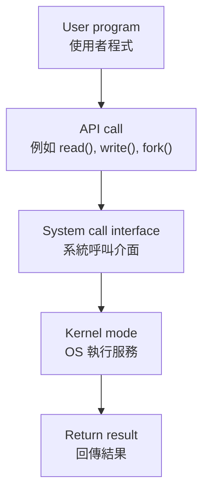
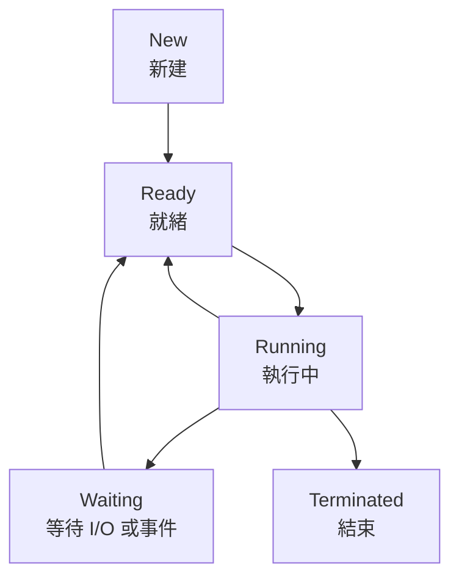
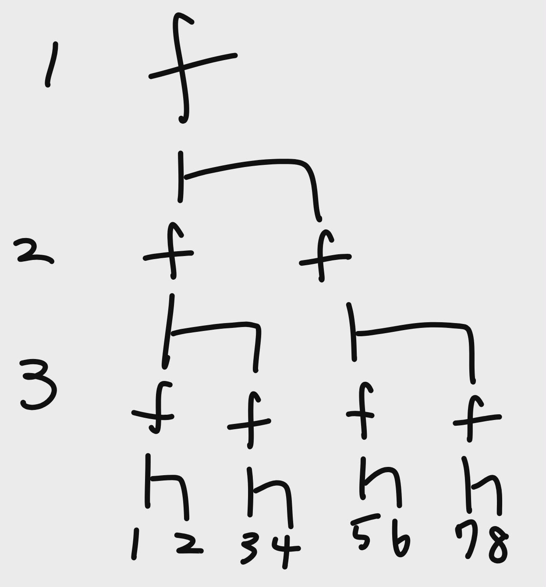
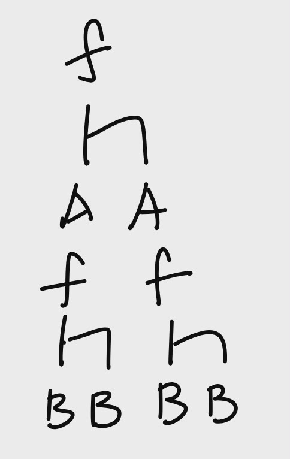
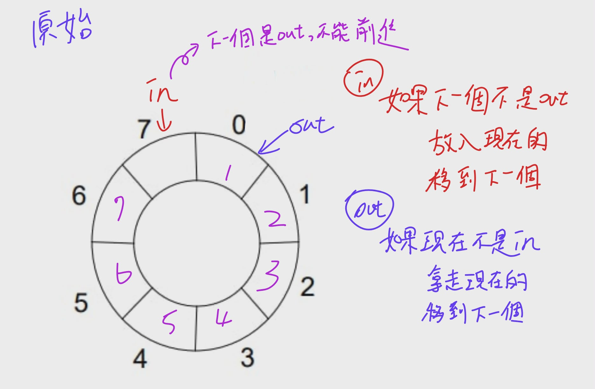
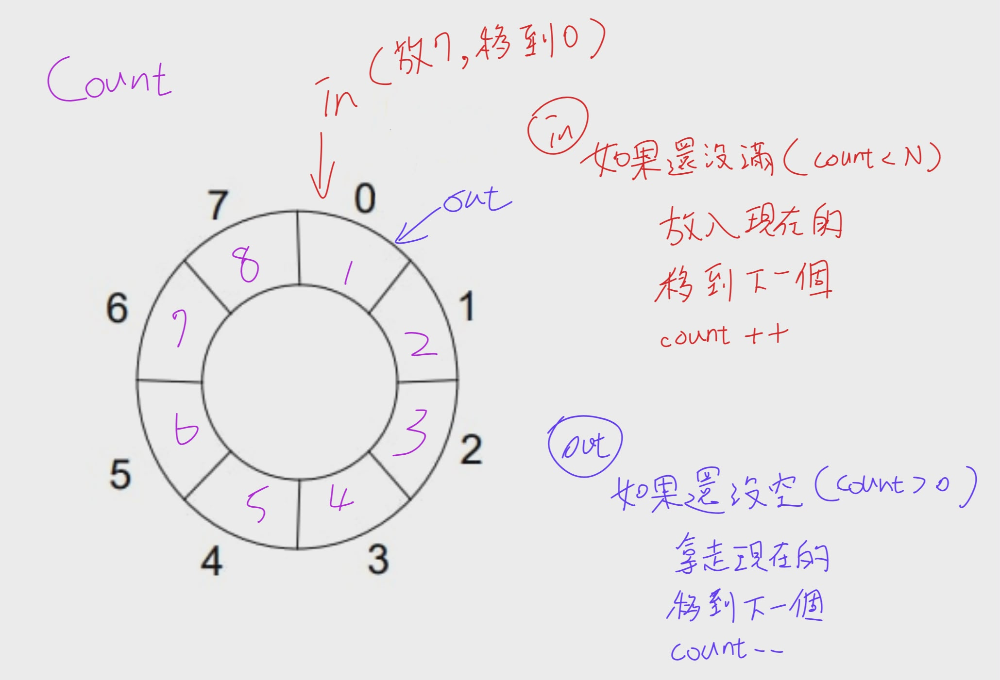
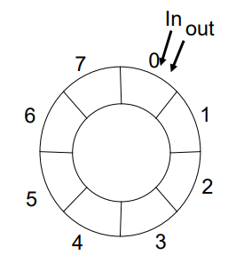
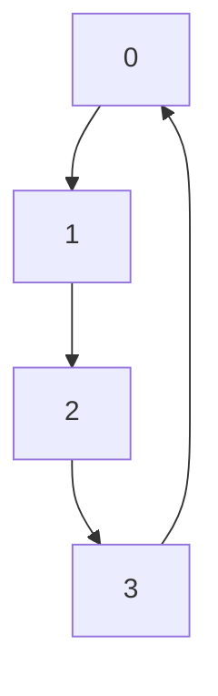
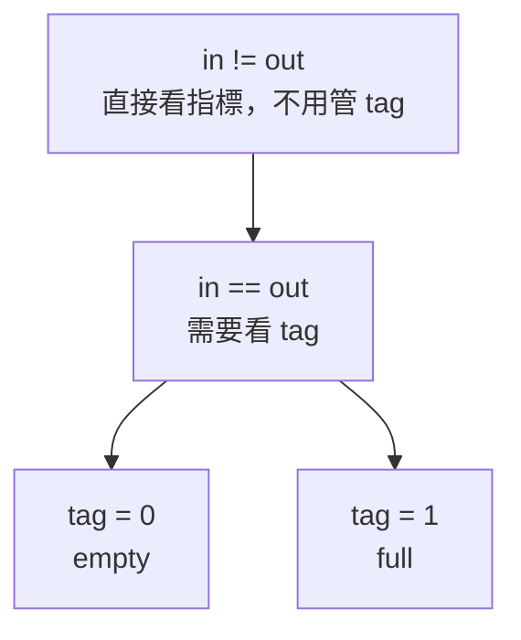

# 期中考重點


## 英文

### Web browser

網頁瀏覽器

### coordinates
協調

### among

在 ... 之間

ex.The operating system controls and coordinates the use of hardware among application programs and users.

### typically

通常、一般來說（副詞）

I feel relaxed because meetings typically start at 9 a.m.

### Polling

polling：輪詢；民意調查（進行中）
├─ poll：投票、調查、逐一詢問
└─ ing：正在進行、動名詞


### poll

投票、民意調查；詢問、徵詢意見；逐一檢查（技術）

### rather than

而不是


### instead of


而不是

### classified

被分類的、歸類的（形容詞／過去分詞）


A compiler is best classified as hardware because it uses CPU and memory?(False)


### Caching

快取機制／快取動作

把常用資料先複製到 cache 裡，之後比較快拿到的「做法／過程」

### absent

不存在

A cache miss means the requested data is absent from the cache and may need to be copied from a lower level of the memory hierarchy.

### intervention

參與

### transfers

傳輸


### clustered

群聚的；成群的；集中分布的

Clustered system

### hot-standby

熱備援

Asymmetric clustering：
一台機器處於 hot-standby mode(熱待機)，負責監督；其他機器執行 application

### identical

完全相同


A student says:
“A clustered system and a multiprocessor system are identical because both involve multiple processing units.”
(Incorrect. A multiprocessor system has multiple processors within one system, while a clustered system connects multiple independent systems through a network.)

### prevent

預防；阻止；防止；避免

Incorrect. Timer interrupts help the OS regain control, support scheduling, and prevent a program from running forever.

### infrastructure

基礎設施

infrastructure：基礎設施
├─ infra：在下方、基礎
├─ structure：結構
│  ├─ struct：建造、組成
│  └─ ure：名詞字尾（狀態、結果）

### Platform

平台；月台；講台；政綱

platform：平台
├─ plat：平的、平面
└─ form：形狀、形式

PaaS | Platform as a Service | 平台服務 | 給你部署程式的平台 

### Message-passing

message-passing：訊息傳遞
├─ message：訊息
│  ├─ mess：送出、派送（詞源相關）
│  └─ age：名詞字尾、結果或狀態
└─ passing：傳遞、通過
   ├─ pass：通過、傳送
   └─ ing：動名詞／進行狀態
   
   
### common

常見、共同


### strengths and weaknesses

優點與缺點

strengths and weaknesses：優點與缺點
├─ strengths：優點、強項
│  ├─ strength：力量、優點
│  │  ├─ strong：強的
│  │  └─ th：名詞字尾（狀態）
│  └─ s：複數
├─ and：和
└─ weaknesses：缺點、弱點
   ├─ weakness：弱點
   │  ├─ weak：弱的
   │  └─ ness：名詞字尾（狀態）
   └─ es：複數


### Blocking

阻擋

### communication

通訊

communication：溝通
├─ com：一起、共同
├─ mun：服務、分享（詞源 related to give/share）
├─ ic：形容詞化
├─ ate：動詞化
└─ ion：名詞化、行為或結果

### organize

組織

### Interprocess

interprocess：行程間的
├─ inter：之間、在…之間
└─ process：行程、處理程序
   ├─ pro：向前
   ├─ cess（cede/ceed/cess）：行進、進行


### interfere

干涉；妨礙；干擾


interfere：干涉
├─ inter：之間、在…之間
└─ fere（fer）：帶來、承載（carry）

### compare

比較

### transition


轉變、轉換；過渡；過渡期；（影片或簡報的）轉場


Which transition usually happens when the CPU scheduler selects a process from the ready queue?


### associated

相關


### CPU-bound process

CPU 密集型行程


CPU-bound process：CPU 密集型行程
├─ CPU：中央處理器
├─ bound：被限制於、受約束
│  ├─ boun：邊界（語源概念）
│  └─ d：形容詞結尾
└─ process：行程、程序
   ├─ pro：向前
   ├─ cess：行走、進行
   └─ ss：名詞結尾


### concept


概念；觀念；想法；構想

concept：概念
├─ con：一起、全部
└─ cept：拿、抓住


### CPU bursts


指在作業系統中，一個程式連續使用 CPU 處理計算的那一段時間，直到它需要等待（例如 I/O）才停止。常見於課堂（如排程演算法）、系統設計討論（分析效能）、或閱讀流程圖時。常搭配 CPU burst time、short/long CPU burst。語氣偏技術性；不適合用來描述整個程式執行時間（那應區分為 total execution time）。容易誤用在「等待時間」，那應是 I/O burst。

所有翻譯：

CPU 執行區段；CPU 運算區段；處理器運作片段；CPU 計算時間段


CPU bursts：CPU 執行區段
├─ CPU：中央處理器（Central Processing Unit）
└─ bursts：爆發（複數）
   ├─ burst：突然發生、爆發
   └─ s：複數


### instead of

而不是

instead of：而不是
├─ in：在…裡、處於
├─ stead：位置、位置上的替代
└─ of：介系詞，表示關聯


### Zombie

殭屍

### orphan


孤兒


## OS 定義

OS 定義成兩個重要角色：

1. **Resource Allocator(資源分配者)**  
    管理 CPU time、Memory space、File-storage space、I/O devices，並在多個程式搶資源時做分配。
    
2. **Control Program(控制程式)**  
    控制程式執行，避免錯誤或不當使用電腦。


Operating System service(作業系統服務) 是 OS 提供給使用者或程式的功能，例如：

- User interface(使用者介面)
    
- Program execution(程式執行)
    
- I/O operations(輸出入作業)
    
- File-system manipulation(檔案系統操作)
    
- Communications(通訊)
    
- Error detection(錯誤偵測)
    
- Resource allocation(資源分配)
    
- Protection and security(保護與安全)


## Computer System Structure(電腦系統結構)

Computer System(電腦系統) 通常分成四個部分：

1. Hardware(硬體)
提供基本計算資源，例如 CPU、Memory(記憶體)、I/O devices(輸出入設備)。

2. Operating System(作業系統)
控制與協調硬體資源的使用。

3. Application Program(應用程式)
定義如何使用系統資源來解決使用者問題，例如 word processor、compiler、web browser、database system、video game。

4. User(使用者)
可以是人、機器或其他電腦。

## Computer System Operation(電腦系統操作)

Computer System Operation(電腦系統操作) 的基本概念：

1. **CPU and I/O devices can execute concurrently**  
    CPU 和 I/O devices 可以同時工作。
    
2. **Device controller(設備控制器)**  
    每種設備通常由 device controller 負責控制。
    
3. **Local buffer(本地緩衝區)**  
    Device controller 有自己的 local buffer，資料會在 main memory(主記憶體) 和 local buffer 之間移動。
    
4. **Interrupt(中斷)**  
    當 device controller 完成操作後，會透過 interrupt 通知 CPU。
    
5. **Interrupt vector(中斷向量)**  
    Interrupt vector 是一張表，裡面放不同 interrupt service routine(中斷服務程序) 的位址。
    
6. **Trap(陷阱)**  
    Trap 是 software-generated interrupt(軟體產生的中斷)，通常由錯誤或 system call(系統呼叫) 造成，例如除以 0、記憶體錯誤、程式請求 OS 服務。


## Locality(區域性)

Caching 之所以有效，是因為程式通常有 Locality(區域性)。

| 類型 | 意思 | 例子 |
| --- | --- | --- |
| Temporal Locality(時間區域性) | 最近用過的東西，很可能很快再用 | 迴圈變數 `i`、重複執行的迴圈指令 |
| Spatial Locality(空間區域性) | 剛用過位置附近的東西，很可能很快被用 | 陣列 `a[0]`, `a[1]`, `a[2]` 連續存取 |


## Cache Line(快取列)


Cache line(快取列) 是 CPU cache 一次搬資料的最小單位。

例如 cache line = 64 bytes，CPU 要讀 `array[0]` 時，可能不只把 `array[0]` 搬進 cache，而是把附近一整段連續資料一起搬進來。

所以：

```C
array\[0\], array\[1\], array\[2\], array\[3\]
```

如果它們在記憶體中連續排列，讀 `array[0]` 時，後面的元素可能也一起進 cache。這就是 Spatial Locality(空間區域性) 對效能有幫助的原因。

>C/C++ 的二維陣列通常是 row-major order(列優先儲存)。

也就是：


```C
int a\[2\]\[3\];
```

記憶體排列大概是：
```c
a\[0\]\[0\], a\[0\]\[1\], a\[0\]\[2\], a\[1\]\[0\], a\[1\]\[1\], a\[1\]\[2\]
```

>主流 CPU cache 的 cache line 多為 64 Byte


## Cache Hit / Cache Miss


| 術語                | 意思                   |
| ----------------- | -------------------- |
| Cache Hit(快取命中)   | 要找的資料已經在快取裡，直接用      |
| Cache Miss(快取未命中) | 快取沒有，要去較慢的儲存層拿，再放進快取 |


如果 cache 沒有， main memory 也沒有，從secondary storage 拿到資料後，通常先放進 main memory(RAM)(Page Fault)，再由 CPU cache 從 RAM 載入需要的 cache line。


## I/O Structure(輸出入結構) 、 DMA


常見兩種處理方式：

| 方式 | 說明 | 缺點／特色 |
| --- | --- | --- |
| Polling(輪詢) | CPU 或 OS 反覆檢查 I/O 是否完成 | 可能浪費 CPU 時間 |
| Interrupt(中斷) | I/O 完成後由 device controller 通知 CPU | CPU 可先做其他工作 |

**DMA(Direct Memory Access)** 用於高速 I/O device。  
Device controller 可以直接把資料區塊從 buffer storage 傳到 main memory，不需要 CPU 逐 byte 介入。

重點：

1. DMA 適合大量資料傳輸
    
2. CPU 不必負責每個 byte 的搬移
    
3. 每個 block 通常只產生一次 interrupt，而不是每個 byte 都 interrupt
    
4. 可以提高 I/O 效率並減少 CPU 負擔

>CPU / OS 設定 DMA 傳輸，device controller 負責大量資料搬移，完成後再用 interrupt 通知 CPU。


## 電腦系統

想成一間餐廳：

| 架構                         | 生活化比喻                 |
| -------------------------- | --------------------- |
| Single-processor system    | 只有一位廚師                |
| Multiprocessor system      | 多位廚師共用同一個廚房           |
| Asymmetric multiprocessing | 有一位主廚分配工作，其他廚師照做      |
| Symmetric multiprocessing  | 每位廚師地位類似，都可以處理工作      |
| Clustered system           | 多間餐廳彼此連線、共享某些資源，提高可靠度 |


multiprocessor(多處理器系統) 是指同一個電腦系統裡面有多個 CPU / processor / core，共用同一套記憶體、匯流排、周邊裝置。

| 類型                                       | 是幾台電腦？ | 有幾個 CPU / core？ | 記憶體關係                |
| ---------------------------------------- | -----: | --------------: | -------------------- |
| single processor / uniprocessor(單一處理器系統) |    1 台 |          1 個處理器 | 1 套記憶體               |
| multiprocessor(多處理器系統)                   |    1 台 |   多個 CPU / core | 通常共享同一套主記憶體          |
| clustered system(集成式系統)                  |     多台 |       每台各自有 CPU | 各電腦通常各自有記憶體，可能共享儲存裝置 |


Clustered system

多台獨立電腦透過網路連接，常共享 storage(儲存裝置)，目標通常是提高 availability(可用性) 或 reliability(可靠性)。

生活化例子：  
不是一間廚房裡多位廚師，而是好幾間分店彼此連線；其中一間出問題，其他分店還能支援服務。

---

Asymmetric vs Symmetric clustering

| 類型 | 重點 |
| --- | --- |
| Asymmetric clustering | 一台機器 hot-standby(熱待機) 監督，其他機器執行應用 |
| Symmetric clustering | 所有機器都執行應用，也互相監督 |


###  Multiprogramming(多元程式規劃)

Multiprogramming 的目的：

> Keep CPU busy by having several jobs in memory.

也就是記憶體裡同時放多個 job/process，當某個 process 等 I/O 時，OS 可以切去執行另一個 process。

重點不是「真的同一瞬間一顆 CPU 跑多個程式」，而是：

> 單一 CPU 透過快速切換，讓 CPU 使用率提高。

---

###  Timesharing / Multitasking(分時／多工)

Timesharing 是 multiprogramming 的延伸。

Multiprogramming 重點是提高 CPU utilization。  
Timesharing 重點是讓使用者覺得系統有互動性。

例如你同時開瀏覽器、VS Code、終端機。  
CPU 其實在不同 process 間快速切換，但你感覺它們「好像同時在跑」。

講義提到 response time(反應時間) 通常應該小於 1 秒，這是互動式系統很在意的指標。

講義\_chapter 1\_20240218

---

###  Dual-mode operation(雙模式運作)

為了避免 user program(使用者程式) 亂碰硬體或 OS 核心資料，電腦通常有兩種模式：

| 模式 | 權限 | 說明 |
| --- | --- | --- |
| User mode(使用者模式) | 權限較低 | 一般應用程式執行的模式 |
| Kernel mode(核心模式) | 權限較高 | OS kernel 執行、可操作硬體與特權指令 |

生活化例子：

User mode 像一般顧客，只能在餐廳用餐區活動。  
Kernel mode 像店長或廚房主管，可以進廚房、開保險箱、調度資源。

當 user program 需要 OS 服務，例如讀檔、I/O、配置記憶體，通常會透過 **System call(系統呼叫)** 進入 kernel mode。

---

### Timer(計時器)

Timer 的目的：

> Prevent a user program from running forever and never returning control to the operating system.

也就是防止某個程式無限迴圈霸佔 CPU。

OS 可以設定 timer，時間到就產生 interrupt，讓 OS 重新取得控制權，進行排班或終止超時程式。


## OS Resource Management Overview


**Process Management(行程管理)**  
Process(行程) 是正在執行中的程式。OS 要負責 process / thread scheduling、process creation/deletion、suspend/resume、synchronization、communication、deadlock handling。

講義\_chapter 1\_20240218

**Main Memory Management(主記憶體管理)**  
OS 要記錄哪些 memory 正在被使用、誰在使用、何時分配與回收 memory。

講義\_chapter 1\_20240218

**Storage Management(儲存體管理)**  
OS 將實體儲存裝置抽象成 logical storage unit，也就是 File(檔案)，並負責檔案與目錄建立、刪除、備份、磁碟排班等。

講義\_chapter 1\_20240218

**I/O System(I/O 系統)**  

I/O subsystem(I/O 子系統) 是 OS(作業系統) 裡面專門負責管理 input/output devices(輸入／輸出裝置) 的一整組機制。

包含 buffering(緩衝)、caching(快取)、spooling、device-driver interface、specific device drivers。

講義\_chapter 1\_20240218

**Protection and Security(保護與安全)**  
確保檔案、memory segment、CPU、其他資源只能由被授權的 process 適當操作。


### spooling 是啥


Spooling(排存／假離線) 是什麼？

Spooling(Simultaneous Peripheral Operation On-Line，排存／假離線) 是 OS(作業系統) 管理 I/O(輸入／輸出) 的一種方法：

先把要給慢速裝置處理的資料，暫時存到一個 queue(佇列) 或 buffer(緩衝區) 裡，等裝置有空再慢慢處理。

最經典例子是 printer(印表機)。

假設你同時開了三個程式，都要列印：

Word 要印 10 頁
PDF 要印 3 頁
瀏覽器要印 1 頁

印表機很慢，而且一次只能印一份。
如果沒有 spooling(排存)，程式可能要一直等印表機印完，才能繼續做事。


| 名詞            | 重點                      | 例子        |
| ------------- | ----------------------- | --------- |
| Buffering(緩衝) | 解決速度差，暫存資料              | 網路影片先載入一段 |
| Spooling(排存)  | 把多個 I/O 工作排隊，讓慢裝置一個一個處理 | 多份文件排隊列印  |


## Cloud computing

Cloud computing(雲端計算) 是透過 Network(網路) 提供：

1. Computing service(運算服務)
    
2. Storage service(儲存服務)
    
3. Application service(應用程式服務)
    

講義 Chapter 1 明確提到 cloud computing 是透過網路提供 computing、storage、applications 的服務。

###  Cloud deployment models(雲端部署模型)

| 類型 | 中文 | 重點 |
| --- | --- | --- |
| Public cloud | 公有雲 | 對外提供給一般使用者或企業 |
| Private cloud | 私有雲 | 組織內部自己使用 |
| Hybrid cloud | 混合雲 | 結合 public cloud 和 private cloud |

---


###  Cloud service models(雲端服務模型)

| 類型 | 全名 | 提供什麼 | 生活化理解 |
| --- | --- | --- | --- |
| SaaS | Software as a Service | 應用程式服務 | 直接用軟體，例如 Gmail、Google Docs |
| PaaS | Platform as a Service | 平台服務 | 給你部署程式的平台 |
| IaaS | Infrastructure as a Service | 基礎設施服務 | 租 VM、storage、network |


## ch2 開始


## OS services 

> What kind of services does an operating system provide?

要背清單：

- User interface
    
- Program execution
    
- I/O operations
    
- File-system manipulation
    
- Communications
    
- Error detection
    
- Resource allocation
    
- Accounting
    
- Protection and security

## System Calls and Parameter Passing(系統呼叫與參數傳遞)

### 直覺版

Application Program(應用程式) 不能直接亂碰硬體或 OS 核心資源。

例如 Chrome 想讀檔案，它不能自己直接去硬碟亂翻，而是要跟 OS 說：

> 「請幫我開這個檔案。」

這個「向 OS 請求服務」的動作就是 **System call(系統呼叫)**。

---

### 正式定義

**System call(系統呼叫)** 是程式使用 OS services(作業系統服務) 的介面。

常見例子：

| 需求         | 可能的 system call 類型 |
| ---------- | ------------------ |
| 建立 process | process control    |
| 開啟檔案       | file management    |
| 讀寫裝置       | device management  |
| 行程間通訊      | communication      |
| 設定權限       | protection         |

重點：

> User program 通常透過 API，例如 POSIX API、Win32 API、Java API，間接呼叫 system call。

---

### 為什麼 system call 會牽涉 user mode / kernel mode？

一般程式在 **User mode(使用者模式)**。
但真正執行 OS 服務時，常需要進入 **Kernel mode(核心模式)**。

流程可以想成：



---

###  三種 System Call 參數傳遞方式

考古可能直接問：

> Describe three general methods used to pass parameters to the operating system during system calls.

要背三種：

| 方法                             | 說明                                              |
| ------------------------------ | ----------------------------------------------- |
| Registers(暫存器)                 | 把參數直接放進 CPU registers                           |
| Memory block / table(記憶體區塊／表格) | 參數放在 memory block，然後把 block address 放進 register |
| Stack(堆疊)                      | 程式把參數 push 到 stack，OS 再 pop 取出                  |


## Interprocess Communication, IPC(行程間通訊)

兩種 IPC 模型

| 方法                 | 比喻        | 對應 IPC          |
| ------------------ | --------- | --------------- |
| 共同編輯同一份 Google Doc | 兩人共享同一份內容 | Shared memory   |
| 用 Line 傳訊息         | 一人傳、一人收   | Message passing |


###  Shared-memory model(共享記憶體模型)

兩個或多個 process(行程) 建立一塊共同可存取的 memory region(記憶體區域)，之後透過這塊區域交換資料。

優點：

> 速度快，因為資料可以在 memory speed(記憶體速度) 下交換。

缺點：

> 需要處理 synchronization(同步) 與 conflict/race condition(衝突／競爭情況)，否則可能資料不一致。

---

### Message-passing model(訊息傳遞模型)

Process 不共享同一塊記憶體，而是用 send(message) / receive(message) 傳送訊息。

優點：

> 對小量資料很方便，較容易實作，也比較不需要處理共享記憶體衝突。

缺點：

> 大量資料時可能較慢，因為訊息可能需要複製或經過 kernel 管理。


---

### Message queue(訊息佇列)

Message queue(訊息佇列) 是 Message passing(訊息傳遞) 常用的一種實作機制。

重點不是 process 直接共享同一塊 memory，而是把 message 放進一個 queue(佇列) 裡，由另一個 process 取出。

生活化例子：

> Message queue 像櫃台信箱。  
> Process A 把信放進信箱，Process B 再從信箱取出來。  
> A 和 B 不需要直接碰彼此的記憶體。

基本流程：

```text
Process A  --send(message)-->  Message queue  --receive(message)-->  Process B
```

在作業系統中，message queue 通常由 kernel(核心) 管理。Process 透過 system call 或 IPC API 把 message 放入 queue，另一個 process 再從 queue 取出 message。

和 Shared memory 的差異：

| 比較 | Message queue / Message passing | Shared memory |
| --- | --- | --- |
| 資料交換方式 | 把 message 放進 queue，再由對方接收 | 共同讀寫同一塊 memory region |
| 是否共享記憶體 | 通常不直接共享同一塊 memory | 會共享同一塊 memory |
| Kernel 角色 | 通常會介入 send / receive 或 queue 管理 | 建立 shared memory 後，資料交換可較少經過 kernel |
| 優點 | 小資料方便、較容易實作、比較不容易直接產生共享記憶體衝突 | 速度快，適合大量資料 |
| 缺點 | 大量資料可能較慢，因為 message 可能需要複製或經過 kernel | 需要 synchronization，否則可能 race condition |

一句話記法：

> Message queue 是 Message passing 的「排隊收發信箱」；Shared memory 是多個 process 共用同一張白板。

---
## Message passing 進階

### Direct communication(直接通訊)

Direct communication 是 sender(傳送者) 和 receiver(接收者) 直接指定對方。

例如：

```text
send(P, message)
receive(Q, message)
```

意思是：

- send(P, message)：把 message 傳給 process P
- receive(Q, message)：從 process Q 接收 message

---

### Indirect communication(間接通訊)

Indirect communication 是透過 mailbox(信箱) 或 port(埠) 傳訊息。

例如：

```text
send(A, message)
receive(A, message)
```

意思是：

- send(A, message)：把 message 放進 mailbox A
- receive(A, message)：從 mailbox A 取 message

Message queue 可以理解成 indirect communication 裡常見的 mailbox / port 類概念：sender 把 message 放到某個 queue，receiver 再從該 queue 取出 message。

生活化例子：

| 類型 | 例子 |
| --- | --- |
| Direct communication | 你直接 Line 某個同學 |
| Indirect communication | 你把文件放到班級雲端資料夾，其他人去拿 |
| Message queue | 你把文件放到櫃台收件匣，下一位同學照順序取件 |

---

## ch 3 開始

## Process Concept and Process Memory Layout

>**Program(程式)** 是放在磁碟上的靜態檔案。  
>**Process(行程)** 是正在執行中的程式。

生活化例子：

| 概念 | 例子 |
| --- | --- |
| Program | 食譜放在書架上 |
| Process | 廚師正在照食譜煮菜 |

同一個 program 可以產生多個 process。  
例如你開兩個 Chrome 視窗，它們可能對應不同 process。

---

###  正式定義

**Process(行程)** 是正在執行中的程式。它不只是程式碼，還包含目前執行狀態，例如 Program Counter(程式計數器)、CPU registers(暫存器)、Stack(堆疊)、Data section(資料區段)、Heap(堆積) 等。講義 Chapter 3 明確說 process 是正在執行的程式，並包含 PC、registers、stack、data section、heap 等內容。

講義\_chapter 3\_20240318

---

###   Process memory layout

一個 process 通常包含：

| 區域 | 中文 | 放什麼 |
| --- | --- | --- |
| Text section | 程式碼區 | executable code |
| Data section | 資料區 | global variables、static variables |
| Stack | 堆疊 | function calls、local variables、parameters、return address |
| Heap | 堆積 | dynamically allocated memory，例如 `malloc()` / `new` |


### Data section vs stack/heap


>差異是"會不會在程式執行執行期間死掉"。


---

###  Stack vs Heap


這是考古高機率題，110 考古 Q8 直接問：

> What is the difference between stack memory and heap memory?
> 
> 考古\_110

重點比較：

| 比較 | Stack | Heap |
| --- | --- | --- |
| 管理方式 | compiler / runtime 自動管理 | programmer 手動管理 |
| 常放內容 | local variables、function parameters、return address | dynamic data structures、objects、malloc/new 配置資料 |
| 速度 | 通常較快 | 通常較慢 |
| 大小 | 較小、固定限制較明顯 | 較大，可動態成長 |
| 常見問題 | stack overflow | memory leak、fragmentation、heap overflow |

生活化例子：

Stack 像一疊盤子，最後放上去的最先拿走，符合 LIFO。  
Heap 像倉庫，你可以到處租空間，但要記得自己歸還，不然就會 memory leak。


#### Memory leak 是什麼？

Memory leak(記憶體洩漏) 是指：

程式向 Heap(堆積) 申請了一塊記憶體，但用完後沒有釋放，導致那塊記憶體一直被佔著，不能再被正常使用。


生活化例子：

想像你去圖書館借了一個置物櫃。

你把東西拿走了，但忘記把鑰匙還給櫃台。  
櫃子其實空了，可是系統以為它還被你佔用，別人也不能用。

這就是 memory leak 的感覺：

> 記憶體明明不再需要，但程式沒有釋放，所以系統仍然認為它被佔用。


## Process State(行程狀態) 與 Process Control Block, PCB(行程控制表)


### Process State(行程狀態) 是什麼？

Process 執行時不會永遠都在 running。
它可能剛被建立、正在等 CPU、正在執行、等待 I/O、或已經結束。

常見五種狀態：

| State      | 中文  | 意思                       |
| ---------- | --- | ------------------------ |
| New        | 新建  | process 正在被建立            |
| Ready      | 就緒  | process 已準備好，正在等 CPU     |
| Running    | 執行中 | process 正在 CPU 上執行       |
| Waiting    | 等待  | process 正在等待事件，例如 I/O 完成 |
| Terminated | 結束  | process 已完成執行            |

---

###   狀態轉換直覺圖



重點轉換：

| 轉換                   | 原因                                     |
| -------------------- | -------------------------------------- |
| New → Ready          | process 建立完成，進入 ready queue            |
| Ready → Running      | CPU scheduler 選中它                      |
| Running → Waiting    | 發出 I/O request 或等待事件                   |
| Waiting → Ready      | I/O 或事件完成                              |
| Running → Ready      | 被 interrupt 或 time quantum 到，被 preempt |
| Running → Terminated | process 執行完畢                           |

---

###   PCB 是什麼？

**Process Control Block, PCB(行程控制表)** 是 OS 用來記錄 process 狀態的資料結構。

可以想成 process 的「個人檔案」。

PCB 通常包含：

| PCB 內容                        | 說明                                 |
| ----------------------------- | ---------------------------------- |
| Process state                 | 目前狀態，例如 ready / running / waiting  |
| Program counter               | 下一個要執行的 instruction address        |
| CPU registers                 | 暫存器內容                              |
| CPU scheduling information    | priority、queue pointer 等           |
| Memory-management information | base / limit register、page table 等 |
| Accounting information        | CPU 使用時間、帳號資訊                      |
| I/O status information        | open files、I/O device 狀態           |

講義 Chapter 3 說 PCB 會記錄 process state、program counter、CPU registers、priority、memory-management information、accounting information、open files 等資訊。


## Process Scheduling(行程排班) 與 Scheduling Queues(排班佇列)

OS 像遊樂園的工作人員，process 像遊客。

不同狀態的 process 會排在不同隊伍：

| 隊伍           | 生活例子         | OS 對應                         |
| ------------ | ------------ | ----------------------------- |
| Job queue    | 所有想入園的人      | 系統裡所有 process                 |
| Ready queue  | 已經入園、等著玩設施的人 | 在 memory 中、準備好等 CPU 的 process |
| Device queue | 排隊等廁所或餐廳的人   | 等 I/O device 的 process        |

CPU scheduler 像工作人員從 ready queue 挑下一個人去玩設施，也就是讓 process 上 CPU 執行。

---

###  Scheduling Queues(排班佇列)

常見三種：

| Queue                    | 中文          | 放什麼                                   |
| ------------------------ | ----------- | ------------------------------------- |
| Job queue                | 工作佇列        | 系統中所有 process                         |
| Ready queue              | 就緒佇列        | 在 main memory 中，已準備好、等待 CPU 的 process |
| Device queue / I/O queue | 裝置佇列／I/O 佇列 | 等待特定 I/O device 的 process             |

---

###   Schedulers(排班程式)

| Scheduler             | 中文                     | 主要功能                                        | 執行頻率 |
| --------------------- | ---------------------- | ------------------------------------------- | ---- |
| Long-term scheduler   | 長期排班程式 / Job scheduler | 決定哪些 process 被帶入 ready queue                | 較低   |
| Short-term scheduler  | 短期排班程式 / CPU scheduler | 從 ready queue 選下一個 process 執行               | 很高   |
| Medium-term scheduler | 中期排班程式                 | 把 process 暫時 swap out / swap in，以調整記憶體與競爭程度 | 中等   |

---

###  最常考差異

**Short-term scheduler(短期排班程式)**
重點是快，因為它很常執行。它從 ready queue 選 process 分配 CPU。

**Long-term scheduler(長期排班程式)**
重點是控制 **degree of multiprogramming(多元程式規劃程度)**，也就是系統中同時有多少 process 進入 memory / ready queue。

**Medium-term scheduler(中期排班程式)**
重點是 **swapping(交換)**，可以把 process 從 memory 移到 disk，之後再移回來繼續執行。


### 對應關係

>Ready queue 對應 Ready state。
Device queue 通常對應 Waiting state 中「正在等 I/O device」的那一類。


## I/O-bound / CPU-bound 行程與 Context Switch(內容切換)

**I/O-bound process(I/O 密集型行程)**：

> 花比較多時間在等待 I/O，例如讀檔、網路、鍵盤、磁碟。

特色：

* 很常發出 I/O request
* CPU burst 通常較短
* 常在 Running 和 Waiting 之間切換

例子：

* 下載檔案
* 等使用者輸入
* 資料庫讀磁碟

---

###  CPU-bound process

**CPU-bound process(CPU 密集型行程)**：

> 花比較多時間在做計算，很少請求 I/O。

特色：

* 很少發出 I/O request
* CPU burst 通常較長
* 會長時間使用 CPU

例子：

* 大量數學運算
* 影片編碼
* 矩陣運算
* AI 模型推論或訓練中的計算部分

---

### Context Switch

**Context switch(內容切換)** 是：

> CPU 從一個 process 切換到另一個 process 時，OS 必須保存舊 process 的狀態，並載入新 process 的狀態。

要保存 / 載入的內容通常在 PCB 裡，例如：

* Program counter
* CPU registers
* Process state
* Scheduling information
* Memory-management information

重要觀念：

> Context switch 是 overhead(額外負擔)，因為切換期間 CPU 沒有在執行真正有用的 user program 工作。
> 簡單來說就是要寫作業時，花了30分鐘拿作業，這30分鐘就是 overhead 。

講義 Chapter 3 說 context switch 需要保存目前 process 的 context，再載入新 process 的保存狀態；這是 overhead。


## 行程產生：fork、exec、wait


### fork() 是什麼？

`fork()` 會建立一個新的 process。

原本的 process 叫：

> **Parent process(父行程)**

新建立的 process 叫：

> **Child process(子行程)**

重點：

> `fork()` 之後，parent 和 child 都會從 `fork()` 之後的地方繼續執行。

生活化例子：

你影印一份作業。
影印前只有一份，影印後有兩份，而且兩份都會繼續往下寫。

---

### fork() 的回傳值

`fork()` 最重要的是回傳值不同：

| 情況             | `fork()` 回傳值 | 意思             |
| -------------- | -----------: | -------------- |
| Child process  |            0 | 代表自己是 child    |
| Parent process |         大於 0 | 回傳 child 的 PID |
| Error          |           -1 | fork 失敗        |

講義 Chapter 3 也明確列出：`fork()` 在 child 回傳 0，在 parent 回傳大於 0，在錯誤時回傳 -1。

---

###  exec() 是什麼？

`exec()` 會把目前 process 的 memory space 替換成新的 program。

重點：

> `fork()` 是產生 child process。
> `exec()` 是讓某個 process 載入並執行新程式。

常見組合：

```c
pid = fork();

if (pid == 0) {
    exec(...);   // child loads a new program
} else {
    wait(NULL);  // parent waits for child
}
```


exec() 成功後，這些會被新的 program 內容取代。

例如 child 原本是 shell 的副本：
```
Process 2001
Text: shell 的機器碼
Data: shell 的資料
Heap: shell 的 heap
Stack: shell 的 stack
PC: shell 下一行要執行的位置
```
執行：
```
execlp("/bin/ls", "ls", NULL);
```
之後：
```
Process 2001
Text: ls 的機器碼
Data: ls 的資料
Heap: ls 的 heap
Stack: ls 啟動用的新 stack
PC: ls 的程式入口點
```
這就是「替換」。


---

### wait() 是什麼？

`wait()` 讓 parent process 等 child process 結束。

如果 parent 沒有 `wait()` child，child 結束後可能變成 **Zombie process(僵屍行程)**。

如果 parent 先結束，而 child 還在跑，child 會變成 **Orphan process(孤兒行程)**，通常會被 `init` 或系統中的類似 process 接管。講義 Chapter 3 也說 terminated process 沒有 parent waiting 時會是 zombie；parent terminated 時 child process 會成為 orphan。

---

### fork 題最重要規則

每次 `fork()` 都會讓「目前存在的每個 process」各自再產生一個 child。

所以：

```c
fork();
fork();
fork();
```


!!! danger  "重點"
    如果中間沒有條件限制，最後 process 數量是：
    ```text
    2^3 = 8 processes
    ```
    
    因為一個 fork() 會分割兩次，並留下原本的，所以是 2^n 個。

{ width="60%" }

若每個 process 都印一次，就會印 8 次。


### fork 題的最核心規則

每次遇到 `fork()`：

> **目前存在的每個 process 都會分裂成 2 個 process。**

所以如果沒有條件限制：

| fork 次數 | process 數量 |
| ------: | ---------: |
|     1 次 |          2 |
|     2 次 |          4 |
|     3 次 |          8 |
|     n 次 |         2ⁿ |

---

###  但印出次數不一定只看最後 process 數

如果程式是這樣：

```c
fork();
printf("A\n");

fork();
printf("B\n");
```

要分段算：

1. 第一次 `fork()` 後有 2 個 process，所以 `"A"` 印 2 次。
2. 第二次 `fork()` 是由目前 2 個 process 各自 fork，所以變成 4 個 process，因此 `"B"` 印 4 次。

所以總印出：

```text
A 印 2 次
B 印 4 次
```


如圖：
{width="50%"}


考古 110 的 fork 題就是這種「每個 fork 後面都有 printf」的變形。

---

###  fork 回傳值再提醒

| Process |  `fork()` 回傳值 |
| ------- | ------------: |
| Child   |             0 |
| Parent  | child PID，正整數 |
| Error   |            -1 |

這會影響條件判斷題，例如：

```c
if (fork() == 0) {
    printf("child\n");
}
```

這種情況只有 child 會印。


## Zombie Process(僵屍行程) 與 Orphan Process(孤兒行程)


###  Zombie process 是什麼？

當 **child process 已經結束**，但 **parent process 還沒呼叫 `wait()` 來回收它的結束資訊**，這個 child 就會變成 **Zombie process**。

重點：

> child 已經死掉了，但 process table 裡還留著它的紀錄。

生活化例子：
像學生已經畢業離校，但學校行政系統還沒辦退學／畢業手續，所以名單上還卡著一筆紀錄。

---

###   Orphan process 是什麼？

當 **parent process 先結束**，但 **child process 還在執行**，這個 child 就變成 **Orphan process**。

之後它通常會被 `init` 或系統中的對應行程接管。

重點：

> parent 先死，child 還活著。

生活化例子：
像小朋友還在活動，但原本帶隊老師先離開了，所以改由另一位老師接手。

---

###  最容易混淆的差別

| 類型     | parent 狀態       | child 狀態 | 核心特徵                 |
| ------ | --------------- | -------- | -------------------- |
| Zombie | 還活著，但沒 `wait()` | 已結束      | child 留下殘存紀錄         |
| Orphan | 已結束             | 還活著      | child 被別的 process 接管 |


一句話記法：

!!! danger "重點"
    Zombie = child terminated, parent still alive, but parent has not yet called wait().
    Orphan = parent terminated, child still alive.

講義 Chapter 3 對 Zombie / Orphan 也有這個核心定義。


## 環狀佇列問題／生產者消費者共享資料


###   直覺版

Producer(生產者) 一直往 buffer 放資料。
Consumer(消費者) 一直從 buffer 拿資料。

如果 buffer 是 circular queue(環狀佇列)，通常用兩個指標：

* `in`：下一個要放的位置
* `out`：下一個要拿的位置

問題是：

> 只看 `in` 和 `out`，有時候很難分辨 buffer 是 **empty(空)** 還是 **full(滿)**。

因為兩種情況都可能出現：

```text
in == out
```

---

###   原始寫法的問題

考古題那種原始寫法通常是：

* empty：`in == out`
* full：`(in + 1) % BUFFER_SIZE == out`

這種寫法是正確的，但會有一個代價：

> **永遠浪費一格。**

因為它故意保留一個空格，避免 full 和 empty 都變成 `in == out` 時無法區分。

所以如果 `BUFFER_SIZE = 10`，實際只能放 **9** 個元素。
如果 `N = 8`，實際只能放 **7** 個元素。

---

###   怎麼解？

常見兩種解法：

####   用 count

額外維護目前 buffer 裡有幾個元素。

* `count == 0` → empty
* `count == BUFFER_SIZE` → full

####   用 tag / flag

額外用一個 `tag` 來區分：

* `in == out && tag == 0` → empty
* `in == out && tag == 1` → full

你自己的筆記就是用 **tag** 來避免浪費一格，讓 `N = 8` 時真的能放滿 8 個元素。

---

###   考試最短答案骨架

如果題目問：

> What is the problem of the circular queue problem?

可以先答：

> **The original circular queue solution wastes one buffer slot, because it uses `(in + 1) % BUFFER_SIZE == out` to represent full and `in == out` to represent empty. Therefore, the buffer can use only BUFFER_SIZE − 1 slots.**

如果題目再問：

> How to solve it?

可以答：

> **Use an additional variable such as a count or a tag/flag to distinguish full from empty, so the queue can use all BUFFER_SIZE slots.**

---

### 看代碼

#### 1. 代碼講解

原始 circular queue 只有兩個指標：

* `in`：下一個要放的位置
* `out`：下一個要拿的位置

原始寫法通常是：

* **empty**：`in == out`
* **full**：`(in + 1) % N == out`

這樣的好處是簡單，但缺點是：

> **會浪費一格。**

因為它必須故意保留一個空格，才能避免 full 和 empty 都變成 `in == out`。講義也明確寫了：這個解法正確，但只能用 `BUFFER_SIZE - 1` 個元素。

---

#### 2. 原始 Producer / Consumer 核心代碼

這是考古題那種原始版核心：

```c
#define N 8
int buffer[N];
int in = 0;
int out = 0;
```

##### 2.1 Producer

```c
int nextProduced;

while (1) {
    /* produce nextProduced */

    while ( ((in + 1) % N) == out ) {
        ;   // buffer full
    }

    buffer[in] = nextProduced;
    in = (in + 1) % N;
}
```

##### 2.2 Consumer

```c
int nextConsumed;

while (1) {
    while (in == out) {
        ;   // buffer empty
    }

    nextConsumed = buffer[out];
    out = (out + 1) % N;
}
```

---

#### 3. 這段到底哪裡有問題？

關鍵不是它「錯」，而是它：

> **正確，但會浪費一格。**

例如 `N = 8`：

* 理論上 buffer 有 8 格
* 但原始寫法最多只能放 **7** 個元素

因為第 8 格必須保留，否則你無法區分：

```c
in == out
```

到底代表：

* empty
* 還是 full

這就是 110 考古第 7 題的核心。

---

#### 4. 解法一：count 解法

這是最直觀的作法：
額外加一個變數 `count`，表示目前 buffer 裡有幾個元素。

---

##### 4.1 共享資料

```c
#define N 8
int buffer[N];
int in = 0;
int out = 0;
int count = 0;
```

---

##### 4.2 Producer 重點代碼

```c
int nextProduced;

while (1) {
    /* produce nextProduced */

    while (count == N) {
        ;   // buffer full
    }

    buffer[in] = nextProduced;
    in = (in + 1) % N;
    count++;
}
```

---

##### 4.3 Consumer 重點代碼

```c
int nextConsumed;

while (1) {
    while (count == 0) {
        ;   // buffer empty
    }

    nextConsumed = buffer[out];
    out = (out + 1) % N;
    count--;
}
```

---

##### 4.4 為什麼 count 解法可行？

因為現在 full / empty 不再只靠 `in` 和 `out` 判斷，而是靠 `count`：

* `count == 0` → empty
* `count == N` → full

所以 `N = 8` 就真的可以放滿 8 格。

---

##### 4.5 count 解法的優缺點

優點：

* 很直觀
* 最容易講清楚
* 考試好寫

缺點：

* 多一個共享變數 `count`
* 在真正並行環境下，`count++` / `count--` 也會有 **race condition(競爭情況)**，所以如果真的同時跑 producer / consumer，仍要搭配 synchronization，例如 mutex / semaphore。講義 Chapter 5 也正是用 producer-consumer 的 `count` 例子說明 race condition。

---

#### 5. 解法二：tag / flag 解法

這就是你作業筆記裡用的版本。核心想法是：

> 當 `in == out` 時，再多看一個 `tag` 來判斷到底是 empty 還是 full。

---

##### 5.1 共享資料

```c
#define N 8
int buffer[N];
int in = 0;
int out = 0;
int tag = 0;   // 0: empty, 1: full (when in == out)
```

---


詳細請看：[Tag 太抽象了，我們直接看詳細一點](#tag-太抽象了我們直接看詳細一點)

##### 5.2 Producer 重點代碼

```c
int nextProduced;

while (1) {
    /* produce nextProduced */

    while (in == out && tag == 1) {
        ;   // buffer full
    }

    buffer[in] = nextProduced;
    in = (in + 1) % N;

    if (in == out) {
        tag = 1;
    }
}
```

---

##### 5.3 Consumer 重點代碼

```c
int nextConsumed;

while (1) {
    while (in == out && tag == 0) {
        ;   // buffer empty
    }

    nextConsumed = buffer[out];
    out = (out + 1) % N;

    if (out == in) {
        tag = 0;
    }
}
```

---

##### 5.4 為什麼 tag 解法可行？

因為現在：

* `in == out && tag == 0` → empty
* `in == out && tag == 1` → full

這樣就不用再故意浪費一格，所以 `N = 8` 時可以真的放 8 個。
這也是你筆記中「原本只放到 [0]~[6]，修改後可放到 [0]~[7]」的重點。

---

#### 6. count 解法 vs tag 解法，怎麼選？

##### 6.1 如果是考試簡答

我會建議你優先寫：

* **先講原始解法浪費一格**
* 再講 **count** 或 **tag** 任一種解法

因為老師要看的是你有沒有抓到核心：

> full 和 empty 會混淆，所以要多一個額外資訊。

---

##### 6.2 如果是實作作業

兩個都能用：

* **count**：直觀、好懂
* **tag**：很貼近你作業寫法，也很適合拿來回答「如何不浪費一格」

---

#### 7. 考試可直接背的英文骨架

如果考古問：

> What is the problem of the circular queue problem? How to solve it?

你可以寫：

```text
The original circular queue solution wastes one buffer slot.
It uses in == out to represent an empty buffer and (in + 1) % N == out to represent a full buffer, so only N - 1 slots can be used.

One solution is to add a count variable.
Then count == 0 means empty and count == N means full.

Another solution is to add a tag (or flag).
When in == out, tag = 0 can mean empty and tag = 1 can mean full.
```

---

#### 8. 你要特別小心的一點

上面這些 code 主要是在解：

> **full / empty ambiguity(滿和空無法區分)**

但如果題目進一步問真正的同步問題，那還要再處理：

* mutual exclusion(互斥)
* race condition(競爭情況)

也就是 Producer / Consumer 真正並行時，要再搭配：

* mutex
* semaphore

那就會接到 Chapter 5 的 bounded-buffer problem。

---

#### 9. 你現在先記這一句就夠了

> **原始 circular queue 不是錯，而是會浪費一格。**
> **解法就是多加一個資訊來區分 full 和 empty，例如 count 或 tag。**

如果你要，我下一則可以直接幫你整理成「考古第 7 題可手寫版答案」，包含：
**中文簡答 + 英文簡答 + Producer/Consumer 重點代碼**。

### Tag 太抽象了，我們直接看詳細一點

我把它拆成「**你真的會在腦中看到它怎麼跑**」的版本。

先糾正一個小地方：這裡比較精確是 **環狀佇列(circular queue)**，不是圓盤。
但你說的「圓盤上怎麼轉」那個畫面其實很好用，我們就把 buffer 想成一圈格子。講義的原始 circular queue 與你作業的 tag 解法都在這個架構上。 

---

#### 1. 先抓住核心：tag 不是一直都重要

**最重要的一句話：**

> `tag` 只有在 `in == out` 的時候才有意義。

因為：

* 如果 `in != out`，我們光看 `in` 和 `out` 就知道現在不是「空到完全沒有東西」也不是「滿到完全繞一圈」。
* 只有當 `in == out` 時，才會出現歧義：

  * 可能是 **空**
  * 也可能是 **滿**

所以 `tag` 的工作不是「永遠描述整個 queue 狀態」，而是：

> **專門在 `in == out` 這個尷尬時刻，告訴你它到底是空還是滿。**

---

#### 2. 不用 tag 時，為什麼會浪費一格？

原始設計：

* empty：`in == out`
* full：`(in + 1) % N == out`

它故意不讓 `in` 真的追上 `out`，因為一旦追上去就分不出是空還是滿。

所以它只好保留一格不使用。
這就是「浪費一格」。

---

#### 3. 有 tag 時，規則改成什麼？

我們多一個變數：

```c
int tag = 0;
```

約定：

* `in == out && tag == 0` → **empty**
* `in == out && tag == 1` → **full**

也就是說：

* 指標重合時，tag 幫你判斷
* 指標不重合時，tag 不重要

---

#### 4. 用一個最小例子跑一次：N = 4

假設環狀 buffer 有 4 格：

```text
index:   0   1   2   3
```

我們把它想成一圈：



初始狀態：

```text
in = 0
out = 0
tag = 0
```

因為 `in == out && tag == 0`，所以這時候是 **空**。

---

#### 5. 一步一步看 Producer 怎麼動

---

##### 5.1 放入第 1 個元素 A

Producer 做：

1. 把 A 放到 `buffer[in]`，也就是 `buffer[0]`
2. `in = (in + 1) % 4 = 1`

現在：

```text
buffer: [A, _, _, _]
in = 1
out = 0
tag = 0
```

這時候 `in != out`，所以根本不用看 tag。
queue 顯然不是空，也不是滿。

---

##### 5.2 放入第 2 個元素 B

放到 `buffer[1]`，然後 `in = 2`

```text
buffer: [A, B, _, _]
in = 2
out = 0
tag = 0
```

---

##### 5.3 放入第 3 個元素 C

放到 `buffer[2]`，然後 `in = 3`

```text
buffer: [A, B, C, _]
in = 3
out = 0
tag = 0
```

---

##### 5.4 放入第 4 個元素 D

放到 `buffer[3]`，然後：

```text
in = (3 + 1) % 4 = 0
```

現在發現：

```text
in == out
```

這就進入歧義區了。
到底是空還是滿？

這時候 Producer 知道一件事：

> 我剛剛明明是「成功放了一個元素」之後才變成 `in == out`

所以它要做：

```c
if (in == out) tag = 1;
```

變成：

```text
buffer: [A, B, C, D]
in = 0
out = 0
tag = 1
```

現在因為 `in == out && tag == 1`，所以這是 **滿**。

---

#### 6. 再看 Consumer 怎麼動

現在 queue 是滿的：

```text
buffer: [A, B, C, D]
in = 0
out = 0
tag = 1
```

---

##### 6.1 消費第 1 個元素 A

Consumer 讀取：

```text
buffer[out] = buffer[0] = A
```

然後：

```text
out = (0 + 1) % 4 = 1
```

現在：

```text
buffer: [A, B, C, D]   // 實體值還在，但邏輯上 A 已經被取走
in = 0
out = 1
tag = 1
```

這時候你可能會問：

> 奇怪，tag 還是 1，不會有問題嗎？

**不會。**

因為現在 `in != out`，所以 tag 根本不參與判斷。

也就是說：

> **tag 可以暫時保持舊值，只要 `in != out` 就不會誤判。**

這點很重要，很多人就是在這裡覺得抽象。

---

##### 6.2 再消費 B、C

持續拿：

* 拿 B：`out = 2`
* 拿 C：`out = 3`

都還是 `in != out`，所以不需要理 tag。

---

##### 6.3 最後消費 D

拿掉最後一個元素 D 之後：

```text
out = (3 + 1) % 4 = 0
```

現在又出現：

```text
in == out
```

此時 Consumer 知道：

> 我剛剛是「成功拿走一個元素」之後才變成 `in == out`

所以這次 `in == out` 代表的是 **空**，不是滿。

因此它要做：

```c
if (out == in) tag = 0;
```

現在變成：

```text
in = 0
out = 0
tag = 0
```

也就是：

* `in == out && tag == 0` → **empty**

---

#### 7. 你可以把 tag 理解成「最後一次讓兩指標重合的是誰」

這是最直覺的心法。

當 `in == out` 時：

* 如果是 **Producer** 最後讓它們重合，代表剛塞滿
  → `tag = 1`
* 如果是 **Consumer** 最後讓它們重合，代表剛拿空
  → `tag = 0`

所以 tag 很像一個「最後裁判紀錄」。

---

#### 8. 整個流程表，看一次就通

以 `N = 4` 為例：

| 動作    | in | out | tag | 狀態    |
| ----- | -: | --: | --: | ----- |
| 初始    |  0 |   0 |   0 | empty |
| put A |  1 |   0 |   0 | 有 1 個 |
| put B |  2 |   0 |   0 | 有 2 個 |
| put C |  3 |   0 |   0 | 有 3 個 |
| put D |  0 |   0 |   1 | full  |
| get A |  0 |   1 |   1 | 有 3 個 |
| get B |  0 |   2 |   1 | 有 2 個 |
| get C |  0 |   3 |   1 | 有 1 個 |
| get D |  0 |   0 |   0 | empty |

你會看到：

* `tag = 1` 並不代表永遠是滿
* `tag = 0` 也不代表永遠是空

**只有 `in == out` 時，tag 才真正決定狀態。**

---

#### 9. 對應到代碼，哪兩行最關鍵？

##### 9.1 Producer

```c
while (in == out && tag == 1) {
    ;   // full
}

buffer[in] = nextProduced;
in = (in + 1) % N;

if (in == out) {
    tag = 1;
}
```

意思是：

* 如果兩指標重合而且 tag=1，表示滿，不能再放
* 放完後如果又重合，代表現在是滿，所以把 tag 設成 1

---

##### 9.2 Consumer

```c
while (in == out && tag == 0) {
    ;   // empty
}

nextConsumed = buffer[out];
out = (out + 1) % N;

if (out == in) {
    tag = 0;
}
```

意思是：

* 如果兩指標重合而且 tag=0，表示空，不能再拿
* 拿完後如果又重合，代表現在是空，所以把 tag 設成 0

---

#### 10. 為什麼這樣就不浪費一格？

因為現在「滿」和「空」都允許出現：

```text
in == out
```

但靠 `tag` 可以分開：

* `in == out && tag == 0` → 空
* `in == out && tag == 1` → 滿

所以你不需要像原始版本那樣硬留一格空位來避開歧義。

這就是你作業裡「N=8 可以真的放滿 8 個」的原因。

---

#### 11. 最容易卡住的誤解

##### 11.1 誤解一：tag 一直都在描述狀態

不是。

正確是：

> tag 只在 `in == out` 的時候才負責裁決。

---

##### 11.2 誤解二：消費一個元素後 tag 沒改，會不會錯？

不會。

因為只要 `in != out`，狀態就已經不模糊，tag 就算還保持舊值也沒關係。

---

##### 11.3 誤解三：tag 是不是在記錄元素數量？

不是。

它不告訴你「有幾個元素」，它只告訴你：

> 當兩指標重疊時，現在是空還是滿。

---

#### 12. 你現在只要記這句話

> **tag 是專門用來解決 `in == out` 時「到底是空還是滿」的裁判。**

---

#### 13. 一個超短版本總結



---