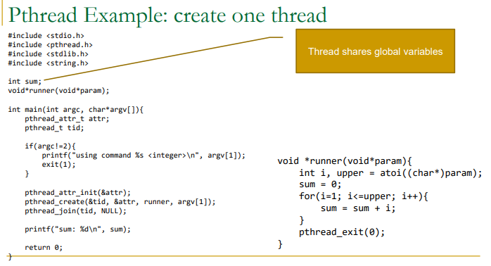
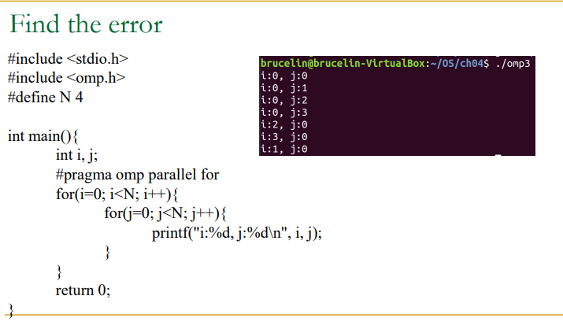
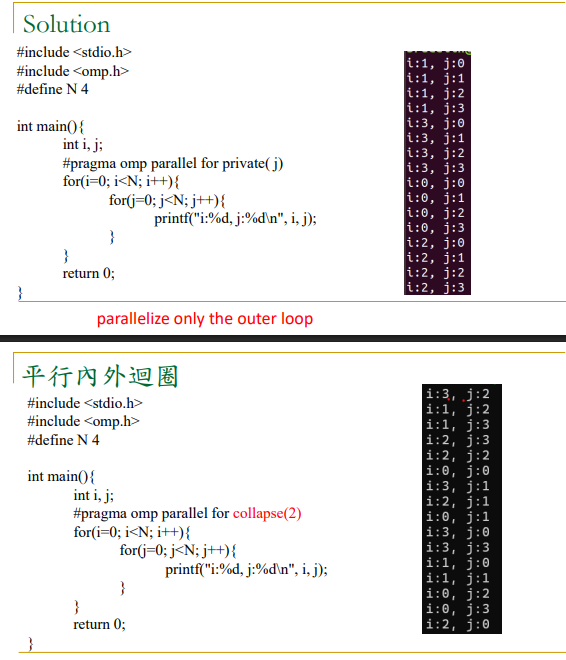

# 期中考重點

# fork() 到底在做什麼

回傳值有三種

- `-1`：失敗
- `0`：現在這段程式是在 child
- `>0`：現在這段程式是在 parent，而且這個值是 child 的 PID

```c
pid_t pid = fork();

if (pid < 0) {
    // fork 失敗
} else if (pid == 0) {
    // child 走這裡
} else {
    // parent 走這裡，pid 是 child 的 PID
}
```

- getpid() 自己的 id
- getppid() parent 的 id


### 範例程式


```c
#include <stdint.h>
#include <stdio.h>
#include <unistd.h>
#include <sys/wait.h>

int main() {
    int x = 10;

    // fork() 在子行程回傳 0，在父行程回傳子行程的 PID。
    pid_t pid = fork();

    if (pid < 0) {
        // fork 失敗
        printf("fork failed\n");
    } else if (pid == 0) {
        //子行程
        x += 5;
        // self_pid: 目前子行程自己的 ID；parent_pid: 這個子行程的父行程 ID。
        printf("Child: x = %d (self_pid=%jd, parent_pid=%jd)\n",
               x,
               (intmax_t)getpid(),
               (intmax_t)getppid());  // Child: x = 15
    } else {
        //父行程，此時 pid 是子行程的 ID。
        wait(NULL);
        x += 20;
        // self_pid: 目前父行程自己的 ID；parent_pid: 啟動此程式的上一層行程 ID；
        // child_pid: fork() 在父行程回傳的子行程 ID。
        printf("Parent: x = %d (self_pid=%jd, parent_pid=%jd, child_pid=%jd)\n",
               x,
               (intmax_t)getpid(),
               (intmax_t)getppid(),
               (intmax_t)pid); // Parent: x = 30
    }

    return 0;
}
```

```txt title="輸出"
Child: x = 15 (self_pid=5786, parent_pid=5785)
Parent: x = 30 (self_pid=5785, parent_pid=3836, child_pid=5786)
```


# Pthread




## pthread_create() 格式


```C
int pthread_create(
    pthread_t *thread,
    pthread_attr_t *attr,
    void *(*start_routine)(void *),
    void *arg
);
```

| 名稱                            | 用途                                                                                                                                          |
| ------------------------------- | --------------------------------------------------------------------------------------------------------------------------------------------- |
| pthread_t *thread,              | 給 Thread，<br>當建立成功的話 Thread 會把 ID 存進去                                                                                           |
| pthread_attr_t *attr,           | (比較沒用)最常見入門寫法都是傳 NULL，表示用預設值。像 stack size、detach state 之類才會用到自訂 attributes。這是 POSIX 與實務教學的一般用法。 |
| void *(*start_routine)(void *), | 執行的函數的名稱                                                                                                                              |
| void *arg                       | 傳給函數的數值                    也就是void *(*start_routine)(void *)裡面的  void *                                                                                                    |

以圖片為例


## 範例：計算結果放在 sum 中。
```c
#include <stdio.h>
#include <pthread.h>
#include <stdlib.h>
#include <string.h>

int sum;

void *runner(void *param);

int main(int argc, char *argv[]) {
    pthread_attr_t attr;
    pthread_t tid;

    if (argc != 2) {
        printf("using command %s <integer>\n", argv[1]);
        exit(1);
    }

    pthread_attr_init(&attr);
    pthread_create(&tid, &attr, runner, argv[1]); 
    pthread_join(tid, NULL);

    printf("sum: %d\n", sum);

    return 0;
}

void *runner(void *param) {   // param = argv[1]
    int i, upper = atoi((char *)param);    
    sum = 0;

    for (i = 1; i <= upper; i++) {
        sum = sum + i;
    }

    pthread_exit(0);
}
```


在 terminal 輸入：

```txt
./test 5
```

那麼：

| 變數 | 值 |
| --- | --- |
| `argc` | 2 |
| `argv[0]` | `"./test"` |
| `argv[1]` | `"5"` |

pthread_create 把數字 `argv[1]` 傳給了 void *runner(void *param) ，最後計算結果累加在全域的 sum


## 範例：計算結果用 return 的

```c
#include <stdio.h>
#include <pthread.h>
#include <stdlib.h>

void *runner(void *param);

int main(int argc, char *argv[]) {
    pthread_t tid;
    pthread_attr_t attr;
    void *result;
    int *ans;

    if (argc != 2) {
        printf("usage: %s <integer>\n", argv[0]);
        return 1;
    }

    pthread_attr_init(&attr);
    pthread_create(&tid, &attr, runner, argv[1]);

    pthread_join(tid, &result);   // 把 thread 的回傳值接回來

    ans = (int *)result;
    printf("平方總和 = %d\n", *ans);

    free(ans);
    return 0;
}

void *runner(void *param) {
    int upper = atoi((char *)param);
    int *sum = malloc(sizeof(int));
    *sum = 0;

    for (int i = 1; i <= upper; i++) {
        *sum += i * i;
    }

    pthread_exit(sum);
}
```

pthread_create 把數字 `argv[1]` 傳給了 void *runner(void *param) ，最後計算結果return，被`pthread_join(tid, &result); `接收，`&result`是創建數值別名，所以最後 result 是結果。

# OpenMP






1. private：變數要不要每個 thread 各自一份
2. collapse：幾層 loop 要一起拿來分工
3. 在裡面宣告，不要在外面宣告