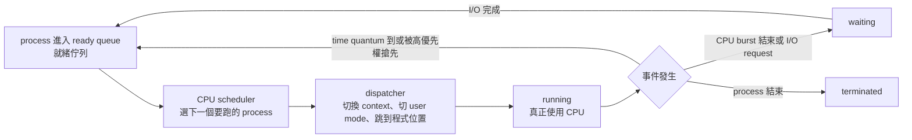
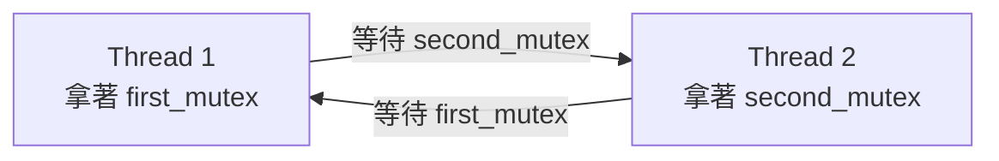
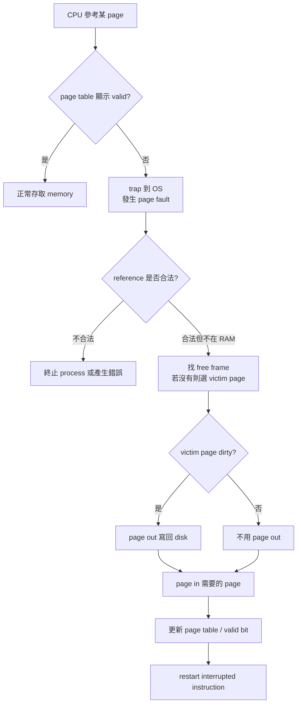
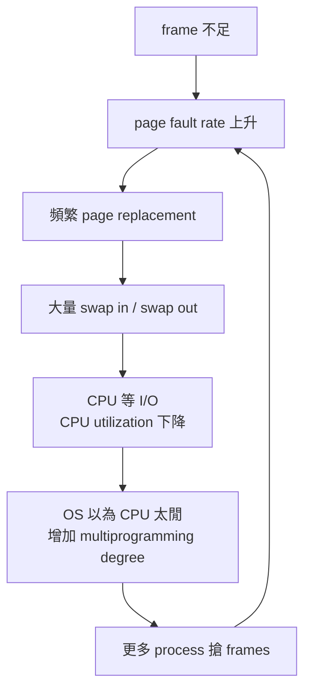

[GPT:Link](https://chatgpt.com/g/g-p-6a0bd25bb708819188cbb8599446277c-peicd-re-zuo-ye-xi-tong/c/6a2937be-9fa4-83a4-9c2b-a3115fbaa2c2)

#### 1. 來源狀態與整理策略

我這份總覽是用三層資料交叉整理：第一層是你上傳的 Ch6～Ch9 講義 PDF；第二層是你提供的 PEICD100 筆記網站，網站目錄明確列出電機作業系統 Ch6、Ch7、Ch8、Ch9，以及期末考重點 ch6～ch9；第三層是 108 期末考古題，該考古題包含 scheduling criteria、CPU scheduling、priority round-robin、starvation、dynamic priority、Banker’s Algorithm、memory organization schemes、page replacement counter 題型。([PEICD100][1])  

這份不是照講義順序逐頁教，而是「考前總覽」。重點放在你看完後能快速恢復：定義、公式、流程、比較表、考古題輸出模板、常見錯法。

---

#### 2. Ch6 Process Scheduling(行程排班)

#### 2.1 這章在解決什麼問題

Ch6 的核心問題是：CPU 一次只能跑一個 process/thread，但系統裡有很多 ready process，所以 OS 必須決定「下一個誰跑、跑多久、什麼情況換人」。講義先從 single processor、multiprogramming、CPU burst / I/O burst、CPU scheduler、preemptive scheduling、dispatcher 開始，再進入 scheduling criteria、FCFS、SJF、SRTF、Priority、RR、Multilevel Queue、Multilevel Feedback Queue、thread scheduling、多處理器排班、real-time scheduling、queueing model / Little’s Formula。 ([PEICD100][2])

---

#### 2.2 最核心 mental model

CPU scheduling(排班)可以用一句話記：

「CPU scheduler 從 ready queue 挑人；dispatcher 真的把 CPU 交出去；不同 algorithm 只是挑人的規則不同。」

流程如下：

---

#### 2.3 CPU Burst / I/O Burst

Process 的生命不是一直吃 CPU，而是在 CPU burst(CPU 分割) 和 I/O burst(I/O 分割) 之間交替。I/O-bound process 通常有很多短 CPU burst；CPU-bound process 通常有較長 CPU burst。這會影響 scheduling：interactive / I/O-bound 通常希望 response time 好，CPU-bound 則要避免長時間霸佔 CPU。講義也指出多元程式規劃的目的，是讓 CPU 盡量保持有 process 可跑，以提高 CPU utilization。

必背：

| 概念        | 意思                      | 考試陷阱                    |
| --------- | ----------------------- | ----------------------- |
| CPU burst | process 真正在 CPU 上執行的時間段 | 不是整個 process 的執行時間      |
| I/O burst | process 等 I/O 的時間段      | 在 I/O 時通常不佔 CPU         |
| I/O-bound | CPU burst 短、常等 I/O      | 適合快點服務，避免互動卡住           |
| CPU-bound | CPU burst 長             | 若不限制，可能拖慢 response time |

---

#### 2.4 CPU Scheduler vs Dispatcher

| 元件                                   | 做什麼                                     | 最短記法     |
| ------------------------------------ | --------------------------------------- | -------- |
| CPU Scheduler / Short-term Scheduler | 從 ready queue 選下一個 process              | 「選人」     |
| Dispatcher                           | context switch、切 user mode、跳到程式位置       | 「交棒」     |
| Dispatch Latency                     | dispatcher 停掉舊 process 到啟動新 process 的時間 | 「換人不是免費」 |

考試如果問「scheduler 和 dispatcher 差在哪」：

中文考試版：
Scheduler 負責決定下一個執行的 process；dispatcher 負責實際完成 CPU 控制權轉移，包括 context switch、切換到 user mode，以及跳到使用者程式正確位置。Dispatch latency 是這個交接所花的時間。

英文考試版：
The CPU scheduler selects the next process from the ready queue, while the dispatcher actually transfers control of the CPU to that process by performing a context switch, switching to user mode, and jumping to the proper location in the user program.

---

#### 2.5 Preemptive vs Nonpreemptive Scheduling

CPU scheduling decision 有四種時機：

| 編號 | 狀態變化                 | 是否可能需要重新排班  |
| -- | -------------------- | ----------- |
| 1  | running → waiting    | 非搶先也會發生     |
| 2  | running → ready      | 可搶先核心情境     |
| 3  | waiting → ready      | 可能觸發可搶先重新排班 |
| 4  | running → terminated | 非搶先也會發生     |

講義重點：1 和 4 屬於 nonpreemptive；其他情況屬於 preemptive。不可搶先代表 CPU 一旦給 process，就等它結束或自願進入 waiting 才換；可搶先代表 OS 可以因 interrupt、time quantum、高優先權到達等理由重新決定誰跑。

常見錯法：

| 錯法                                      | 修正                                                       |
| --------------------------------------- | -------------------------------------------------------- |
| waiting → ready 沒碰到 CPU，所以不是 preemptive | waiting → ready 本身不是搶 CPU，但它可能觸發重新排班，進而讓 running → ready |
| interrupt 一發生一定換人                       | interrupt 只是給 OS 重新排班的機會，不保證一定換人                         |
| preemptive 一定比較好                        | 不一定；它可能造成 race condition，也有 context switch overhead      |

---

#### 2.6 Scheduling Criteria(排班評定標準)

講義列出 CPU utilization、throughput、turnaround time、waiting time、response time，並給出最佳化方向：maximize CPU utilization、maximize throughput、minimize turnaround time、minimize waiting time、minimize response time。

| 指標              | 中文      | 定義                             | 最佳化方向 |
| --------------- | ------- | ------------------------------ | ----- |
| CPU Utilization | CPU 使用率 | CPU 忙碌比例                       | 越高越好  |
| Throughput      | 產量      | 單位時間完成幾個 process               | 越高越好  |
| Turnaround Time | 回復時間    | completion time - arrival time | 越低越好  |
| Waiting Time    | 等候時間    | 在 ready queue 等 CPU 的總時間       | 越低越好  |
| Response Time   | 反應時間    | arrival/request 到第一次回應         | 越低越好  |

計算題公式：

| 量               | 公式                             |
| --------------- | ------------------------------ |
| Completion Time | process 完成時間                   |
| Turnaround Time | Completion Time - Arrival Time |
| Waiting Time    | Turnaround Time - Burst Time   |
| Response Time   | First Run Time - Arrival Time  |
| CPU Utilization | Busy Time / Total Time         |

考古題高頻衝突題：

| 衝突                                              | 考試答法                                                                                                                     |
| ----------------------------------------------- | ------------------------------------------------------------------------------------------------------------------------ |
| CPU utilization vs response time                | 為了讓 CPU 不閒置，可能讓 batch job 長時間跑，互動 process response 變差；若頻繁搶先改善 response，又增加 context switch overhead，CPU utilization 可能下降。 |
| average turnaround time vs maximum waiting time | SJF 可降低平均 turnaround，但長工作可能等很久，maximum waiting time 變大；若為了限制最大等待時間而讓長工作也定期跑，平均 turnaround 可能變差。                          |
| I/O utilization vs CPU utilization              | 若偏向讓 I/O-bound process 先跑，可增加 I/O 裝置忙碌，但 CPU 可能因頻繁切換或等待而效率下降；若偏向 CPU-bound，CPU 忙但 I/O 裝置可能閒置。                            |

---

#### 2.7 FCFS(First-Come, First-Served)

規則：誰先進 ready queue，誰先跑。Nonpreemptive。可用 FIFO queue 實作。

優點：簡單、公平直覺。
缺點：Convoy Effect(護航效應)。如果一個長 process 先到，後面很多短 process 都被卡住，平均 waiting time 可能很差。

計算題流程：

1. 依 arrival order 排 Gantt chart。
2. 標 completion time。
3. 算 turnaround time。
4. 算 waiting time。

---

#### 2.8 SJF(Shortest Job First) 與 SRTF(Shortest Remaining Time First)

SJF 規則：CPU 空時，選下一個 CPU burst 最短的 process；若一樣長，通常用 FCFS tie-break。SRTF 是 preemptive SJF，每次有新 process 到達時，檢查誰的 remaining time 最短。講義 SRTF 例題加入不同 arrival time 與 preemption，考試重點就是能畫 Gantt chart 並計算平均 waiting time。

| 演算法  | 是否搶先          | 比較對象             |
| ---- | ------------- | ---------------- |
| SJF  | Nonpreemptive | 下一個 CPU burst 長度 |
| SRTF | Preemptive    | 剩餘 CPU burst 長度  |

必背：

| 優點                                                   | 缺點                                 |
| ---------------------------------------------------- | ---------------------------------- |
| 通常最小化 average waiting time / average turnaround time | 需要知道或預測 CPU burst；長工作可能 starvation |

常見錯法：

| 錯法                 | 修正                                  |
| ------------------ | ----------------------------------- |
| SJF 每一秒都重新選        | Nonpreemptive SJF 不會搶目前正在跑的 process |
| SRTF 看 total burst | SRTF 看 remaining time               |
| arrival time 忘記考慮  | 還沒到的 process 不能被排                   |

---

#### 2.9 Priority Scheduling(優先權排班)

Priority Scheduling 規則：CPU 分配給 priority 最高的 process；相同 priority 通常用 FCFS。講義版本常見設定是 smaller integer = higher priority，但考古題可能反過來說 larger priority number = higher priority，所以題目一定要先看 priority 方向。講義也指出 priority scheduling 可為 preemptive 或 nonpreemptive，問題是 starvation，解法是 aging。

| 考試檢查點         | 你要做什麼                                       |
| ------------- | ------------------------------------------- |
| priority 數字方向 | 先看題幹：small number high 還是 large number high |
| 是否 preemptive | 新高優先權到達是否搶 CPU                              |
| tie-break     | 同 priority 通常 FCFS 或 RR，看題幹                 |
| starvation    | 低 priority process 可能永遠跑不到                  |
| aging         | 等越久 priority 越高，防 starvation                |

---

#### 2.10 RR(Round Robin)

RR 是為 time-sharing system 設計的 preemptive scheduling。每個 process 最多跑一個 time quantum；時間到還沒結束，就 preempt 並放回 ready queue 尾端。講義指出 time quantum 太大會接近 FIFO；太小則 context switch overhead 太高，且 quantum 通常需遠大於 context switch time。

| Time Quantum | 結果                               |
| ------------ | -------------------------------- |
| 太大           | 接近 FCFS / FIFO，response time 可能差 |
| 太小           | context switch 太頻繁，overhead 高    |
| 適中           | response time 較好，公平輪流            |

RR 計算題必背流程：

1. ready queue 初始照 arrival order。
2. 每次取 queue front。
3. 跑 min(quantum, remaining time)。
4. 跑完若未完成，放 queue tail。
5. 新 process 到達時插入 queue tail。
6. 若題目有 priority，先看 priority，再在同 priority 內 RR。

---

#### 2.11 Preemptive Priority + RR 混合題

108 期末考古題有一題是 preemptive priority + round-robin，題幹指定 higher number = higher priority、quantum = 10、idle task priority = 0，且若被更高 priority process preempt，preempted process 放到 queue 尾端。這類題要先用 priority 分層，再對同 priority 內做 RR。

考試規則模板：

| 情況                     | 動作                    |
| ---------------------- | --------------------- |
| 更高 priority process 到達 | 立刻搶先目前 process        |
| 同 priority 多個 process  | 用 RR 輪流               |
| 沒有任何 process ready     | 跑 Pidle               |
| process quantum 用完但沒完成 | 回到該 priority queue 尾端 |
| process 完成             | 記 completion time     |

---

#### 2.12 Starvation(飢餓)

108 考古題問哪些 scheduling algorithm could result in starvation，選項包含 FCFS、SJF、RR、Priority。

最安全答法：

| Algorithm | 是否可能 starvation | 原因                           |
| --------- | --------------- | ---------------------------- |
| FCFS      | 通常不會            | 先到先服務，排到就會跑                  |
| RR        | 通常不會            | 每個 ready process 輪流拿 quantum |
| SJF       | 可能              | 短工作一直來，長工作可能一直被延後            |
| Priority  | 可能              | 高優先權一直來，低優先權可能永遠等            |
| 解法        | Aging           | 等越久 priority 越高              |

---

#### 2.13 Dynamic Priority Scheduling 考古題

108 考古題 dynamic priority 題：等待時 priority 以 α 變化，執行時 priority 以 β 變化，所有 process 進 ready queue 時 priority = 0，larger number = higher priority。題目問 β > α > 0 與 α < β < 0 會變成什麼 scheduling。

理解法：

| 條件        | 直覺                                                            | 結果                |
| --------- | ------------------------------------------------------------- | ----------------- |
| β > α > 0 | running 的 priority 增加比 waiting 更快，所以跑過的人越來越有優勢                | FCFS-like，先跑者會一直跑 |
| α < β < 0 | waiting 和 running priority 都下降，但 waiting 降得更快；剛進來 priority 最高 | LIFO-like，新來者優先   |

最短記法：
「看誰 priority 成長比較快；如果正在跑的人越跑越強，就不容易被搶；如果新來的 priority 最高，就像後來先服務。」

---

#### 2.14 Multilevel Queue vs Multilevel Feedback Queue

| 比較            | Multilevel Queue                  | Multilevel Feedback Queue       |
| ------------- | --------------------------------- | ------------------------------- |
| Queue 是否固定    | process 固定在某 queue                | process 可在 queue 間移動            |
| 核心目的          | 把不同類型 process 分開管                 | 用行為回饋調整優先權                      |
| 典型規則          | foreground 用 RR，background 用 FCFS | CPU 用太久往低優先 queue；等太久往高優先 queue |
| Starvation 風險 | 低優先 queue 可能餓死                    | aging / feedback 可緩解            |

最短記法：
Multilevel Queue 是「分班但不轉班」；MLFQ 是「依表現升降班」。

---

#### 2.15 Thread Scheduling：PCS vs SCS

| 名稱  | 全名                       | 競爭範圍                         | 誰在排            |
| --- | ------------------------ | ---------------------------- | -------------- |
| PCS | Process-contention scope | 同一 process 內 user threads 競爭 | Thread library |
| SCS | System-contention scope  | 全系統 kernel threads 競爭 CPU    | OS kernel      |

考試最短答法：
PCS 是同一 process 內部的 thread 彼此競爭；SCS 是所有 system-level threads 彼此競爭 CPU。

---

#### 2.16 Multiple-Processor Scheduling

| 概念                              | 必背                                                   |
| ------------------------------- | ---------------------------------------------------- |
| AMP(Asymmetric Multiprocessing) | 一顆 master CPU 負責排班與系統工作，其他 CPU 執行 user code          |
| SMP(Symmetric Multiprocessing)  | 每顆 CPU 都可 self-scheduling                            |
| Common ready queue              | 所有 CPU 共用一條 queue，簡單但可能 lock contention              |
| Per-processor queue             | 每顆 CPU 有自己的 queue，cache affinity 好但可能 load imbalance |
| Processor Affinity              | process 盡量留在原 CPU，因為 cache 還有資料                      |
| Soft Affinity                   | OS 盡量維持，但不保證                                         |
| Hard Affinity                   | 明確限制 process 可跑哪些 CPU                                |
| Load Balancing                  | 讓各 CPU 負載接近                                          |
| Push Migration                  | 系統主動把工作推到較閒 CPU                                      |
| Pull Migration                  | 閒 CPU 主動拉工作                                          |

---

#### 2.17 Real-Time Scheduling

講義 real-time scheduling 提到即時系統需要 priority-based preemptive scheduling；soft real-time 系統會給 real-time process 較高 scheduling priority，hard real-time 必須保證 deadline 前完成；週期性工作有 processing time t、deadline d、period p，且 0 ≤ t ≤ d ≤ p，rate = 1 / p。

| 演算法                            | 規則                                       |
| ------------------------------ | ---------------------------------------- |
| RMS(Rate-Monotonic Scheduling) | period 越短，priority 越高；static priority    |
| EDF(Earliest Deadline First)   | deadline 越早，priority 越高；dynamic priority |
| Proportional Share             | 依比例分配 CPU time                           |

EDF 最短記法：
「誰 deadline 最近，誰 priority 最高。」講義 EDF 也以 deadline 先後訂定 priority。

---

#### 2.18 Little’s Formula

講義 Ch6 5.7.2 Queueing Model 給 Little’s Formula：
n = λ × W。n 是 average queue length，W 是 average waiting time in queue，λ 是 average arrival rate into queue；在 steady state 下，離開 queue 的 process 數等於進入 queue 的 process 數。

公式變形：

| 要求                   | 公式        |
| -------------------- | --------- |
| average queue length | n = λW    |
| average waiting time | W = n / λ |
| arrival rate         | λ = n / W |

單位陷阱：
λ 若是「每秒 7 個」，W 就用秒；λ 若是「每分鐘 30 個」，W 就用分鐘。

---

#### 2.19 Ch6 必背總表

| 題型                       | 必背輸出                                         |
| ------------------------ | -------------------------------------------- |
| Gantt chart              | arrival、burst、priority、quantum、preemptive 規則 |
| Turnaround time          | completion - arrival                         |
| Waiting time             | turnaround - burst                           |
| Response time            | first run - arrival                          |
| CPU utilization          | busy time / total elapsed time               |
| Starvation               | SJF / Priority 可能；RR / FCFS 通常不會             |
| Priority 題               | 先看數字方向                                       |
| RR 題                     | time quantum 到就回 ready queue 尾端              |
| Preemptive Priority + RR | priority 先決定，同 priority 才 RR                 |
| Criteria conflict        | 一定要寫 trade-off，不要只背定義                        |
| Little’s Law             | n = λW                                       |

---

#### 3. Ch7 Deadlock(死結)

#### 3.1 這章在解決什麼問題

Ch7 的核心問題是：process 使用 resource 時，本來會依 request → use → release 的正常順序運作，但如果多個 process 互相拿著對方需要的 resource，就可能全部卡住。講義 Ch7 範圍包含系統模型、死結特性、處理死結方法、預防、避免、偵測、恢復。 ([PEICD100][3])

---

#### 3.2 Resource 使用三步驟

| 步驟      | 意思                             |
| ------- | ------------------------------ |
| Request | process 要求 resource；若不能立即給，就等待 |
| Use     | process 使用 resource            |
| Release | process 釋放 resource            |

最短記法：
「死結不是 resource 壞掉，而是大家照規則 request/use/release，卻形成互相等待。」

---

#### 3.3 四個 Deadlock Necessary Conditions(死結必要條件)

死結發生必須四個條件同時成立。講義列為 mutual exclusion、hold and wait、no preemption、circular wait。

| 條件               | 中文    | 意思                                   | 破壞方式                               |
| ---------------- | ----- | ------------------------------------ | ---------------------------------- |
| Mutual Exclusion | 互斥    | 至少有一種 resource 一次只能給一個 process       | 對不可共享資源通常很難破壞                      |
| Hold and Wait    | 佔用與等候 | process 拿著某些 resource，同時等其他 resource | 要求 process 不能邊拿邊等                  |
| No Preemption    | 不可搶先  | resource 不能被 OS 強制拿走                 | 若 request 失敗，就釋放已持有 resource       |
| Circular Wait    | 循環式等候 | P0 等 P1，P1 等 P2，最後 Pn 等 P0           | 對 resource 做 total ordering，照遞增順序拿 |

最短記法：
「互斥、拿著等、不能搶、繞一圈。」

---

#### 3.4 Mutex 範例直覺

如果 thread one 先 lock A 再 lock B，而 thread two 先 lock B 再 lock A，就可能：

這就是 circular wait。考試寫時要指出：兩個 thread 都 hold 一個 mutex 並 wait for 另一個 mutex，而且 mutex 是 nonsharable，不能被強制 preempt。

---

#### 3.5 Resource-Allocation Graph(資源配置圖)

講義定義 Resource-Allocation Graph 包含 process vertices、resource vertices、request edge、assignment edge。

| 圖上元素                    | 意思                     |
| ----------------------- | ---------------------- |
| Process vertex Pi       | process                |
| Resource vertex Rj      | resource type          |
| Rj 裡面的點                 | resource instances     |
| Request edge Pi → Rj    | Pi 正在要求 Rj             |
| Assignment edge Rj → Pi | Rj 的某 instance 已分配給 Pi |

Cycle 判斷：

| 情況                             | Cycle 代表什麼                  |
| ------------------------------ | --------------------------- |
| 每種 resource type 只有一個 instance | 有 cycle 就是 deadlock         |
| 某些 resource type 有多個 instances | 有 cycle 不一定 deadlock，只代表有風險 |

最短記法：
「單 instance：cycle = deadlock；多 instance：cycle 只是可能 deadlock。」

---

#### 3.6 Handling Deadlocks(處理死結三策略)

講義列三種處理方法：預防/避免讓系統不進入死結；允許死結發生再偵測與恢復；忽視問題。

| 方法                     | 核心想法                | 成本                  |
| ---------------------- | ------------------- | ------------------- |
| Prevention             | 破壞四必要條件之一           | 限制強，資源利用率可能低        |
| Avoidance              | 每次分配前檢查是否仍 safe     | 需要知道 max demand     |
| Detection and Recovery | 允許 deadlock，之後偵測並恢復 | 偵測與恢復成本             |
| Ignore                 | 假裝不會發生              | 現實系統常見取捨，但考試要知道不是解決 |

---

#### 3.7 Deadlock Prevention(預防死結)

| 要破壞的條件           | 方法                           | 缺點                                            |
| ---------------- | ---------------------------- | --------------------------------------------- |
| Mutual Exclusion | 讓 resource 可共享               | 對 mutex、printer 等不可共享資源通常不可行                  |
| Hold and Wait    | process 要資源時不可持有其他資源；或一次申請全部 | resource utilization 低，可能 starvation          |
| No Preemption    | request 失敗時釋放已持有資源           | 對 CPU register/memory 可行，對 printer/mutex 未必合理 |
| Circular Wait    | resource type 編號，要求依遞增順序申請   | 限制程式設計彈性                                      |

考試最常問 circular wait prevention：
對所有 resource type 設定 total ordering，process 只能依遞增順序 request resources，因此不可能形成循環等待。

---

#### 3.8 Deadlock Avoidance(避免死結)：Safe State

Safe state(安全狀態)不是「現在沒有 deadlock」而已，而是「存在至少一個 safe sequence，讓所有 process 都能依序完成」。講義定義：系統能用某種順序把 resource 分配給各 process 並仍避免 deadlock，就稱為 safe state。

| 狀態       | 意思                    |
| -------- | --------------------- |
| Safe     | 有 safe sequence，保證能完成 |
| Unsafe   | 不保證能完成，但不一定已 deadlock |
| Deadlock | 已經互相等待，無法前進           |

最短記法：
Safe ⊂ Not Deadlocked。
Unsafe ≠ Deadlock，但 unsafe 可能走向 deadlock。

---

#### 3.9 Banker’s Algorithm 必背資料結構

Banker’s Algorithm 核心矩陣：

| 名稱                      | 意思                  |
| ----------------------- | ------------------- |
| Available[j]            | 目前可用的 Rj instance 數 |
| Max[i][j]               | Pi 最多可能需要多少 Rj      |
| Allocation[i][j]        | Pi 目前已拿多少 Rj        |
| Need[i][j]              | Pi 還可能需要多少 Rj       |
| Need = Max - Allocation | 必背公式                |

講義明確給 Need = Max - Allocation，並用 Work、Finish 做 safety algorithm。

---

#### 3.10 Safety Algorithm 流程

Banker’s safety algorithm：

1. Work = Available。
2. Finish[i] = false for all processes。
3. 找一個 Finish[i] = false 且 Need_i ≤ Work 的 process。
4. 若找到，假設它完成：Work = Work + Allocation_i，Finish[i] = true。
5. 重複 3～4。
6. 如果所有 Finish 都 true，safe；否則 unsafe。

視覺化：

```mermaid
flowchart TD
    A[初始化<br>Work = Available<br>Finish 全 false] --> B{找得到<br>Finish=false 且 Need <= Work<br>的 process?}
    B -->|找得到 Pi| C[Pi 可完成<br>Work = Work + Allocation_i<br>Finish_i = true]
    C --> B
    B -->|找不到| D{所有 Finish 都 true?}
    D -->|是| E[Safe state<br>存在 safe sequence]
    D -->|否| F[Unsafe state<br>沒有可完成序列]
```

考試輸出模板：

中文：
先計算 Need = Max - Allocation。令 Work = Available，依序尋找 Need ≤ Work 的 process。每找到一個 process，就將它的 Allocation 加回 Work，並把該 process 放入 safe sequence。若最後所有 process 都能完成，狀態 safe；否則 unsafe。

英文：
Compute Need = Max - Allocation. Initialize Work = Available and Finish[i] = false. Repeatedly find a process whose Need is no greater than Work. If found, assume it finishes, add its Allocation back to Work, and append it to the safe sequence. If all processes can finish, the state is safe; otherwise, it is unsafe.

---

#### 3.11 Resource-Request Algorithm

給 Pi 的 Request_i 時，三關檢查：

| 步驟 | 條件                                   | 不通過代表                        |
| -- | ------------------------------------ | ---------------------------- |
| 1  | Request_i ≤ Need_i                   | 超過最大宣告，error                 |
| 2  | Request_i ≤ Available                | 目前資源不夠，Pi must wait          |
| 3  | Pretend allocate 後跑 safety algorithm | 若 safe 才真的給；unsafe 就回復舊狀態並等待 |

講義 resource-request algorithm 明確寫出：如果 safe 則配置給 Pi；如果 unsafe 則 Pi must wait，並恢復舊 resource-allocation state。

---

#### 3.12 Banker’s Algorithm 變動題：Increase / Decrease Available / Max / Process

108 考古題 Q8 問如果用 Banker’s Algorithm 控制 deadlock，哪些長期變化可以安全做、條件是什麼。

| 變動                           | 是否安全 | 條件／理由                                          |
| ---------------------------- | ---- | ---------------------------------------------- |
| Increase Available           | 安全   | 可用資源變多，不會讓原 safe state 變 unsafe                |
| Decrease Available           | 有條件  | 必須重新跑 safety algorithm，仍 safe 才可               |
| Increase Max for one process | 有條件  | Need 可能變大，必須重新檢查 safe                          |
| Decrease Max for one process | 安全   | 最大需求變小，不會增加風險                                  |
| Increase number of processes | 有條件  | 新 process 的 Max/Allocation 會改變系統狀態，需重新檢查 safe  |
| Decrease number of processes | 通常安全 | process 結束會釋放 resource；但若是移除/kill 未正確回收，要看回收狀態 |

最短記法：
「讓資源變多或需求變少通常安全；讓資源變少、需求變大、process 變多要重跑 safety。」

---

#### 3.13 Deadlock Detection(死結偵測)

如果系統允許 deadlock 發生，就需要 detection algorithm 和 recovery scheme。單一 instance resource type 可以用 wait-for graph：節點是 process，Pi → Pj 表示 Pi 等 Pj；若圖中有 cycle，就存在 deadlock。講義也提到偵測 cycle 的演算法時間複雜度可為 O(n²)。

| Resource instance 情況      | 偵測方式                                                                      |
| ------------------------- | ------------------------------------------------------------------------- |
| 每種 resource 只有一個 instance | Wait-for graph，找 cycle                                                    |
| 每種 resource 有多個 instance  | 類似 Banker safety 的 detection algorithm，用 Available / Allocation / Request |

---

#### 3.14 Deadlock Recovery(死結恢復)

常見恢復方式：

| 方法                  | 做法                                    | 考試要寫的 trade-off                  |
| ------------------- | ------------------------------------- | -------------------------------- |
| Process termination | 終止所有 deadlocked processes，或一次終止一個直到解除 | 快但可能損失大量工作                       |
| Resource preemption | 從某些 process 搶回 resource               | 要選 victim、rollback、避免 starvation |

Recovery 三個關鍵字：

| 關鍵字              | 意思                      |
| ---------------- | ----------------------- |
| Victim selection | 選誰被殺或被搶                 |
| Rollback         | process 回到安全 checkpoint |
| Starvation       | 同一 process 不可一直當 victim |

---

#### 3.15 Ch7 必背總表

| 題型                        | 必背輸出                                                          |
| ------------------------- | ------------------------------------------------------------- |
| 四必要條件                     | mutual exclusion, hold and wait, no preemption, circular wait |
| Resource-allocation graph | request edge、assignment edge、instance、cycle 判斷                |
| Prevention                | 破壞四條件之一                                                       |
| Avoidance                 | 要知道 Max；只允許保持 safe 的 request                                  |
| Safe state                | 有 safe sequence                                               |
| Unsafe state              | 不保證能完成，但不一定 deadlock                                          |
| Banker safety             | Need = Max - Allocation；Work / Finish；找 Need ≤ Work           |
| Request algorithm         | Request ≤ Need、Request ≤ Available、pretend allocate + safety  |
| Detection                 | single instance 用 wait-for graph cycle                        |
| Recovery                  | kill process 或 resource preemption                            |

---

#### 4. Ch8 Memory Management Strategies(記憶體管理策略)

#### 4.1 這章在解決什麼問題

Ch8 的核心問題是：process 要執行必須進入 memory，但 CPU 只能直接存取 main memory/register，而 memory access 比 register 慢，還需要 protection，避免 process 亂碰別人的記憶體。講義 Ch8 範圍包含背景、swapping、contiguous allocation、paging、page table structure、segmentation、Intel Pentium 範例。 ([PEICD100][4])

---

#### 4.2 Base and Limit Registers

Base and Limit Registers 是最直覺的 memory protection：

| Register       | 作用                                                                     |
| -------------- | ---------------------------------------------------------------------- |
| Base register  | process 可用記憶體範圍的起始 physical address                                    |
| Limit register | logical address space 大小／範圍                                            |
| 檢查             | CPU 每次 user mode memory access 都要檢查 address 是否在 base 和 base + limit 之間 |

考試寫法：
Base and limit registers define the logical address space of a process. The CPU checks every user-mode memory access to ensure it is within the allowed range; otherwise, a trap occurs.

---

#### 4.3 Address Binding(位址連結)

Address Binding 是「程式裡的位址什麼時候變成真正 physical address」的問題。講義分 compile time、load time、execution time。

| Binding Time           | 誰決定             | 是否可搬家          | 缺點                          |
| ---------------------- | --------------- | -------------- | --------------------------- |
| Compile Time Binding   | compiler        | 不可搬            | 位址變了要 recompile             |
| Load Time Binding      | loader / linker | 載入時可重定位；執行後不可搬 | execution time 沒用到的模組可能也先載入 |
| Execution Time Binding | OS + MMU        | 執行期間可動態改       | 需要硬體支援，performance 較差       |

最短記法：
Compile time：編譯時決定。
Load time：載入時決定。
Execution time：執行中才決定，需要 MMU。

---

#### 4.4 Logical Address vs Physical Address

| 位址               | 誰看到              | 意思                                    |
| ---------------- | ---------------- | ------------------------------------- |
| Logical Address  | CPU / process 產生 | 程式以為自己在用的位址                           |
| Physical Address | memory unit 看到   | 真正在 RAM 上的位址                          |
| MMU              | 中間轉換器            | 把 logical address 轉成 physical address |

講義例子中 relocation register = 14000，logical address = 346，physical address = 14346。最短記法：
physical = relocation/base + logical。

---

#### 4.5 Dynamic Loading vs Dynamic Linking

| 概念                               | 誰負責                           | 何時載入                   | 目的                             |
| -------------------------------- | ----------------------------- | ---------------------- | ------------------------------ |
| Dynamic Loading                  | programmer 規劃，OS 提供 loader 支援 | 副程式真的被呼叫時              | 節省 memory，但 programmer 負擔較高    |
| Dynamic Linking / Shared Library | OS loader 支援                  | library routine 真正被呼叫時 | 多個 process 可共享同一份 library copy |

講義指出 dynamic linking / shared library 讓同一時間多個應用可使用同一份 library copy，OS 不需要載入多個實例。

---

#### 4.6 Swapping(置換)

Swapping 是把 process 暫時 swap out 到 backing store，之後再 swap in 回 memory 繼續執行。講義指出 swapping 由 mid-term scheduler 負責，且會牽涉 transfer time 計算。

最短記法：
「memory 不夠或需要調整 multiprogramming 時，把 process 暫時搬到 disk，再搬回來。」

---

#### 4.7 Contiguous Memory Allocation(連續記憶體配置)

OS 找一塊夠大的連續 free block 給 process。管理 free blocks 的 list 叫 Available List / Free List。

配置策略：

| 策略        | 規則                        | 常見結果         |
| --------- | ------------------------- | ------------ |
| First Fit | 從頭找第一個 size ≥ n 的 block   | 快，可能留下碎洞     |
| Best Fit  | 找 size ≥ n 且最接近 n 的 block | 可能留下很多很小洞    |
| Worst Fit | 找剩餘空間最大的 block            | 洞大小較平均，但不保證好 |

講義例題：free blocks 100KB, 500KB, 200KB, 300KB, 600KB，processes 需要 212KB, 417KB, 112KB, 426KB；First fit、Best fit、Worst fit 會給出不同配置結果。

---

#### 4.8 Fragmentation(斷裂)

| 名稱                     | 中文   | 原因                                       | 哪些方法會有                             |
| ---------------------- | ---- | ---------------------------------------- | ---------------------------------- |
| External Fragmentation | 外部斷裂 | 總 free memory 夠，但不連續，所以不能用               | contiguous allocation、segmentation |
| Internal Fragmentation | 內部斷裂 | 分配出去的 block/page 比 process 實際需求大，多的部分用不到 | paging、固定大小配置                      |

講義外部斷裂定義：所有可用記憶體空間總和大於某 process 需要，但因不連續而無法配置，造成 memory 閒置。講義也提到 50-percent rule：在某些 first fit 統計分析下，可能有約三分之一記憶體無法利用。

解法：

| 問題                     | 解法           | 條件                           |
| ---------------------- | ------------ | ---------------------------- |
| External fragmentation | Compaction   | process 必須支援 dynamic binding |
| External fragmentation | Paging       | 用固定大小 page/frame 避免需連續空間     |
| Internal fragmentation | 減少 page size | 但 page table 會變大             |
| Page table 太大          | 增加 page size | 但 internal fragmentation 變嚴重 |

---

#### 4.9 Paging(分頁)

Paging 的核心是：logical memory 切成 pages，physical memory 切成 frames；page size = frame size。Process 不需要連續放在 physical memory。

講義 paging 優點：解決 external fragmentation、支援 sharing、支援 protection、支援 dynamic loading 與 virtual memory；缺點是 internal fragmentation、logical address 轉 physical address 使有效存取時間較長、需要額外硬體與 page table。

| 名稱               | 意思                                         |
| ---------------- | ------------------------------------------ |
| Page             | logical memory 的固定大小區塊                     |
| Frame            | physical memory 的固定大小區塊                    |
| Page Table       | 每個 process 一份，用 page number 找 frame number |
| Page Number p    | logical address 高位                         |
| Offset d         | page 內偏移量                                  |
| Physical Address | frame number + offset                      |

講義公式：若 logical address space = 2^m，page size = 2^n bytes，則 page number 佔高位 m-n bits，offset 佔低位 n bits。

最短記法：
「page number 查表，offset 原封不動。」

---

#### 4.10 TLB 與 Effective Access Time

Paging 若每次都先查 page table 再存 memory，會變成兩次 memory access。TLB(Translation Lookaside Buffer) 是快速快取最近用過的 page table entries。

必背：

| 情況       | 存取成本                            |
| -------- | ------------------------------- |
| TLB hit  | 查 TLB + 存 memory                |
| TLB miss | 查 TLB + 查 page table + 存 memory |

常見 EAT 公式：

EAT = α × hit_time_path + (1 - α) × miss_time_path

若題目簡化為 TLB lookup time = ε，memory access time = m，hit ratio = α：

EAT = α(ε + m) + (1 - α)(ε + 2m)

---

#### 4.11 Page Table Structure(分頁表結構)

講義 Ch8 8.6 提到 hierarchical / multilevel paging，目的在 page table size 太大且稀疏時，把 page table 再分頁，只抓需要的 page table 進 memory。

| 結構                                      | 目的                                     |
| --------------------------------------- | -------------------------------------- |
| Hierarchical Paging / Multilevel Paging | 解決 page table 太大、太稀疏                   |
| Hashed Page Table                       | 適合大位址空間，用 hash 找 page entry            |
| Inverted Page Table                     | 系統只有一張表，以 physical frame 為中心，省空間但查找較複雜 |

---

#### 4.12 Segmentation(分段)

Segmentation 是把 process 依使用者邏輯切成 code、global variables、heap、stack、library 等 segment。每個 segment 長度可不同，logical address = segment number + offset。講義指出 segmentation 讓 logical 配置看法與使用者一致，OS 會替每個 process 準備 segment table，STLR 記錄段大小，STBR 記錄 segment table base。

| Segment table 欄位 | 意思                                                |
| ---------------- | ------------------------------------------------- |
| Base             | 該 segment 在 physical memory 的起始位置                 |
| Limit            | 該 segment 長度                                      |
| Offset 檢查        | 若 offset ≥ limit，trap；否則 physical = base + offset |

Segmentation 優缺點：

| 優點                                   | 缺點                       |
| ------------------------------------ | ------------------------ |
| 無 internal fragmentation             | 有 external fragmentation |
| 支援 sharing / protection 較直覺          | memory access 較長         |
| 符合使用者對程式結構的看法                        | 需要額外硬體                   |
| 可支援 dynamic loading / virtual memory |                          |

講義也明確列 segmentation 無 internal fragmentation、支援 memory sharing/protection，但有 external fragmentation。

---

#### 4.13 Contiguous vs Segmentation vs Paging 考古題比較

108 期末考古題 Q9 要比較 contiguous memory allocation、pure segmentation、pure paging 在 external fragmentation、internal fragmentation、ability to share code across processes 上的差異。

| 比較項                    | Contiguous Allocation                   | Pure Segmentation                | Pure Paging                                     |
| ---------------------- | --------------------------------------- | -------------------------------- | ----------------------------------------------- |
| External Fragmentation | 有                                       | 有                                | 無                                               |
| Internal Fragmentation | 不一定；若剛好給 exact size 可無，若固定 partition 則有 | 無                                | 有，最後一頁可能沒用滿                                     |
| Code Sharing           | 不易／通常不支援                                | 支援，因 segment 有語意，例如 code segment | 支援，不同 page table entry 可指向同一 frame              |
| Protection             | base/limit 粗粒度                          | segment-level，較符合程式結構            | page-level，用 protection bit / valid-invalid bit |
| 考試最短句                  | 連續配置怕外部洞                                | 分段符合程式邏輯但仍需連續段                   | 分頁固定大小，解外部斷裂但有內部斷裂                              |

---

#### 4.14 Intel Pentium：Paged Segmentation

講義 8.7 Intel Pentium 是 paged segment memory management：先分段、再分頁。user program 由 segments 組成，每個 segment 又由 pages 組成；目的保有 segmentation 的使用者邏輯視角與 sharing/protection 優點，同時用 paging 避免 segmentation 的 external fragmentation。

最短記法：
「Pentium：先 segment，再 page；用 segmentation 表達程式邏輯，用 paging 解決外部斷裂。」

---

#### 4.15 Ch8 必背總表

| 題型                                   | 必背輸出                                          |
| ------------------------------------ | --------------------------------------------- |
| Base/Limit                           | 每次 user-mode memory access 檢查範圍               |
| Address Binding                      | compile / load / execution time 差異            |
| Logical vs Physical                  | CPU 產生 logical，memory 看到 physical，MMU 轉換      |
| Dynamic Loading                      | routine 被呼叫才載入，programmer 負擔較高                |
| Dynamic Linking                      | library routine 被呼叫才 link/load，可共享 library    |
| Swapping                             | swap out 到 backing store，再 swap in            |
| First/Best/Worst Fit                 | 三種 free block 選法                              |
| External Fragmentation               | 總空間夠但不連續                                      |
| Internal Fragmentation               | 分配出去但用不到的空間                                   |
| Paging                               | page number 查 page table，offset 不變            |
| Segmentation                         | segment number 查 base/limit，offset 必須小於 limit |
| Contiguous vs Segmentation vs Paging | 期末考古 Q9 必背表                                   |
| Intel Pentium                        | 先分段再分頁                                        |

---

#### 5. Ch9 Virtual Memory(虛擬記憶體管理)

#### 5.1 這章在解決什麼問題

Ch9 的核心問題是：讓程式以為自己有一大塊連續且足夠的 memory，但 OS 實際上只把需要的 pages 放在 RAM，其餘放在 disk / backing store，需要時再搬進來。講義 Ch9 範圍包含 virtual memory、demand paging、copy-on-write、page replacement、frame allocation、thrashing、memory-mapped files、kernel memory allocation 等。 ([PEICD100][5])

---

#### 5.2 Virtual Memory(虛擬記憶體)

Virtual Memory 的核心直覺：

| 程式以為                    | OS 實際做                             |
| ----------------------- | ---------------------------------- |
| 我有一大塊連續 memory          | logical address space 可以很大且連續      |
| 我的 pages 都在 memory      | 只有需要的 pages 在 RAM                  |
| memory 不夠也能跑            | 不常用的 pages 可放到 disk / swap file    |
| 不同 process 可以共享 library | shared pages 可指向相同 physical frames |

講義指出 virtual memory 可用 disk 的部分空間模擬 RAM，讓應用程式認為自己擁有連續可用的位址空間，但實際上可能被分散在 physical memory 和外部磁碟中。

---

#### 5.3 Demand Paging(需求分頁)

Demand Paging：一開始不把所有 pages 載入 memory，只在真正需要時載入。講義說 demand paging 以 paging 為基礎，採 lazy swapper 技巧，只載入執行所需 pages；若發生 page fault，由 OS 處理。

Valid/Invalid Bit：

| Bit     | 意思                     |
| ------- | ---------------------- |
| valid   | page 在 memory 中，且可合法存取 |
| invalid | page 不在 memory，或非法存取   |

---

#### 5.4 Page Fault(分頁錯誤) 流程

Page fault 發生時，OS 大致流程：

必背句：
Page fault 很貴，因為可能需要 trap、找 frame、page out、page in、更新 page table、restart instruction。

---

#### 5.5 Effective Access Time(EAT)

講義給 Page Fault Rate p，0 ≤ p ≤ 1，且 EAT：

EAT = (1 - p) × memory access

* p × (page fault overhead + swap page out + swap page in + restart overhead)

講義例子：memory access time = 200 ns，average page-fault service time = 8 ms，因此 EAT = 200 + p × 7,999,800；若 1000 次 access 有 1 次 page fault，EAT = 8.2 microseconds，slowdown by factor of 40。

考試最短記法：
「p 很小也很可怕，因為 page fault service time 是 disk I/O 等級，遠大於 memory access。」

---

#### 5.6 Copy-on-Write(COW)

COW 是最佳化策略：多個 caller / process 一開始共享同一份 resource/page，直到有人要 write 時才真正 copy 一份。講義指出 COW 共享相同資源直到某呼叫者試圖修改，系統才建立專用副本。

| 情境            | fork()                            | vfork()                         |
| ------------- | --------------------------------- | ------------------------------- |
| Address space | child 初始可共享 parent pages，寫入時 copy | child 可能共享 parent address space |
| child 修改變數    | parent 通常看不到修改                    | parent 可能看得到修改                  |
| 考試重點          | COW 節省 memory，write 才複製           | vfork 較危險，child 修改可影響 parent    |

最短記法：
「COW：read 共享，write 才 copy。」

---

#### 5.7 Page Replacement(分頁替換)

當 page fault 發生且沒有 free frame，就要選 victim page。講義指出 demand paging 需要解決 frame allocation algorithm 和 page-replacement algorithm，選 replacement algorithm 通常希望 lowest page-fault rate。

Dirty Bit 重點：
page out 不一定必要；若 victim page 沒被修改，不必寫回 disk，可省 I/O。講義明確說 page in 必要，但 page out 視 victim page 是否被修改，用 dirty bit 判斷。

---

#### 5.8 FIFO Page Replacement

FIFO：最早載入 memory 的 page 先當 victim。簡單但效果可能差。講義指出 FIFO 可能有 Belady Anomaly：frames 變多，page fault ratio 反而上升。

必背：

| 優點       | 缺點               |
| -------- | ---------------- |
| 簡單、容易實作  | 可能換掉常用 page      |
| 只需維護載入順序 | 有 Belady Anomaly |

---

#### 5.9 Optimal Page Replacement

Optimal：選「未來最久不會再用」的 page 當 victim。講義指出效果最佳、不會有 Belady Anomaly，但不可能實作，因為需要知道未來。

考試用途：
Optimal 通常是理論下限，用來比較其他 algorithm。

---

#### 5.10 LRU(Least Recently Used)

LRU：選「最近最久沒用」的 page 當 victim。講義指出 LRU 效果不錯、不會有 Belady Anomaly，但製作成本高，需要 counter 或 stack 等硬體支援。

| 演算法     | 看哪個方向    |
| ------- | -------- |
| FIFO    | 看過去誰最早進來 |
| Optimal | 看未來誰最久不用 |
| LRU     | 看過去誰最久沒用 |

最短記法：
FIFO 看進場時間；LRU 看最近使用時間；Optimal 看未來。

---

#### 5.11 Second-Chance / Clock Algorithm

Second-Chance 是 FIFO 的改良，用 reference bit 給 page 第二次機會：

| Reference bit | 動作                        |
| ------------- | ------------------------- |
| 0             | 可換掉                       |
| 1             | 清成 0，放到隊尾或 clock hand 繼續找 |

Clock Algorithm 用 circular queue 實作 second chance。
最短記法：「R=1 代表最近用過，先饒它一次。」

---

#### 5.12 Counting Algorithms：LFU / MFU

| Algorithm | Victim | 直覺                   | 問題                      |
| --------- | ------ | -------------------- | ----------------------- |
| LFU       | 使用次數最少 | 少用的 page 比較不重要       | 新 page 剛進來 count 小，容易被換 |
| MFU       | 使用次數最多 | count 小可能代表剛進來，未來還會用 | 不一定準                    |

---

#### 5.13 Frame Allocation(頁框配置)

講義提到要執行 demand paging，除了 replacement algorithm，還要決定每個 process 分幾個 frames。講義列 equal allocation、proportional allocation、priority allocation；proportional allocation 依 process size 分配，公式近似 ai = (si / S) × m。

| 方法                      | 規則                               |
| ----------------------- | -------------------------------- |
| Equal Allocation        | m 個 frames、n 個 processes，每個約 m/n |
| Proportional Allocation | process 越大，分越多 frames            |
| Priority Allocation     | priority 越高，分越多 frames           |

Proportional Allocation 公式：

| 符號              | 意思                               |
| --------------- | -------------------------------- |
| si              | process Pi 的 virtual memory size |
| S               | 所有 si 總和                         |
| m               | 總 frames                         |
| ai              | Pi 分到的 frames                    |
| ai = si / S × m | proportional allocation          |

---

#### 5.14 Global vs Local Replacement

| Policy             | Victim 來源                       | 優點              | 缺點                          |
| ------------------ | ------------------------------- | --------------- | --------------------------- |
| Global Replacement | 所有 process 的 pages 都可被選         | 彈性高，frame 可動態流動 | process 互相影響，可能造成 thrashing |
| Local Replacement  | 只從 faulting process 自己的 pages 選 | 隔離性好            | frames 不能彈性借用，可能效率差         |

---

#### 5.15 Thrashing(輾轉現象)

Thrashing 是 Ch9 超高頻概念。講義說，如果 process 分配到的 frames 不足，就常 page fault；若用 global replacement，process 可能互相搶 frames，最後所有 process 都忙著 swap in/out，CPU idle。CPU idle 時 OS 可能誤以為應增加 multiprogramming degree，讓更多 process 進入系統，thrashing 更嚴重。

Thrashing 因果鏈：

考試最短答法：
Thrashing occurs when processes do not have enough frames, causing frequent page faults and excessive paging I/O. As a result, the CPU becomes idle while the system is busy swapping pages. Increasing the degree of multiprogramming can make thrashing worse because more processes compete for the same frames.

---

#### 5.16 Page-Fault Frequency(PFF)

PFF 是用 page fault rate 控制 frames：

| 情況                            | OS 動作                 |
| ----------------------------- | --------------------- |
| page fault rate > upper bound | 給 process 更多 frames   |
| page fault rate < lower bound | 從 process 拿走多餘 frames |
| 在上下界之間                        | 維持                    |

講義也指出可以利用 page fault ratio 控制防止 thrashing。

---

#### 5.17 Working Set Model

Working Set Model 用 locality 解釋 process 近期需要哪些 pages。講義定義 working set 是最近 Δ time units / window 中 process reference 過的 pages；working set size(WSS) 是其中 page/frame 個數。若要 replace page，應優先找不在 working set 內的 pages。

| 概念                | 意思                                                  |
| ----------------- | --------------------------------------------------- |
| Temporal Locality | 最近用過的 page 可能很快再用，例如 loop、subroutine、counter、stack  |
| Spatial Locality  | 附近 page 可能也會被用，例如 array、sequential code、global data |
| Δ / window size   | 觀察最近多久或幾次 reference                                 |
| Working Set       | 最近 window 內用過的不同 pages                              |
| WSS               | working set size                                    |

考試流程題：
給 reference string 和 window Δ，working set 就是「最近 Δ 個 references 中出現過的不同 pages」。

---

#### 5.18 Memory-Mapped Files

Memory-mapped file 把 file I/O 映射成 memory access。Process 可以用 memory load/store 方式讀寫 file；OS 透過 paging 把 file 的部分內容載入 memory。

必背：

| 優點           | 意思                                |
| ------------ | --------------------------------- |
| I/O 介面簡化     | 讀寫 file 像讀寫 memory                |
| 可共享          | 多個 process map 同一 file，可能共享 pages |
| Lazy loading | 真的 access 到某部分才 page in           |

---

#### 5.19 Kernel Memory Allocation

常見 kernel memory allocation 包含 Buddy System 與 Slab Allocation：

| 方法              | 核心                                       |
| --------------- | ---------------------------------------- |
| Buddy System    | 以 2 的次方大小切割與合併 memory blocks             |
| Slab Allocation | 預先為常用 kernel objects 建立 cache，減少配置/初始化成本 |

必背差異：
Buddy system 解決不同大小 block 的切割與合併；slab allocation 適合頻繁配置固定型別 kernel objects。

---

#### 5.20 108 期末考古 Q10：Page Replacement Counter 題

108 考古題 Q10 要你定義一個 page-replacement algorithm：每個 page frame 有 counter，代表有多少 pages associated with that frame；replacement 時找 counter 最小的 frame，並回答 initial value、何時增加、何時減少、如何選 victim，以及給 reference string 算 page faults，還要算 optimal 最少 page faults。

這題不是標準 FIFO/LRU 題，而是「根據題意設計 algorithm」。考試答法要完整回答四點：

| 小題               | 必答                                                        |
| ---------------- | --------------------------------------------------------- |
| initial value    | counters 初始設 0                                            |
| when increased   | page 被放入某 frame / associated with frame 時增加               |
| when decreased   | page 不再 associated / 被移除時減少                               |
| victim selection | 選 counter 最小的 frame；tie 用固定規則如 FIFO / lowest frame number |
| page fault count | 要逐步 trace reference string                                |
| optimal          | 用未來最久不用原則算理論最小 faults                                     |

---

#### 5.21 Ch9 必背總表

| 題型               | 必背輸出                                                                                       |
| ---------------- | ------------------------------------------------------------------------------------------ |
| Virtual memory   | 程式以為有大且連續的 address space；實際 pages 可分散在 RAM/disk                                            |
| Demand paging    | lazy loading，只載入需要 pages                                                                   |
| Page fault       | trap → validate → find frame/victim → page out if dirty → page in → update table → restart |
| EAT              | (1-p) × memory access + p × page fault service                                             |
| COW              | read 共享，write 才 copy                                                                       |
| FIFO             | 最早進來先換；可能 Belady anomaly                                                                   |
| Optimal          | 換未來最久不用；最佳但不能實作                                                                            |
| LRU              | 換最近最久沒用；成本高                                                                                |
| Second Chance    | R=1 先給第二次機會                                                                                |
| Frame allocation | equal / proportional / priority                                                            |
| Global vs Local  | global 彈性高但 process 互相影響；local 隔離高                                                         |
| Thrashing        | frames 不足 → page faults 多 → swap I/O 多 → CPU idle → more multiprogramming → 更糟             |
| Working set      | 最近 Δ window 中用過的不同 pages                                                                   |
| PFF              | fault rate 高給 frames，低收回 frames                                                            |

---

#### 6. Ch6～Ch9 跨章整合表

| 大主題          | Ch6                                      | Ch7                                    | Ch8                                | Ch9                                       |
| ------------ | ---------------------------------------- | -------------------------------------- | ---------------------------------- | ----------------------------------------- |
| 核心資源         | CPU                                      | Resource / lock / device               | Physical memory                    | Frames / pages / disk backing store       |
| 核心問題         | CPU 下一個給誰                                | 大家互等怎麼辦                                | process memory 怎麼保護與配置             | RAM 不夠怎麼假裝夠                               |
| 主要資料結構       | ready queue、Gantt chart                  | RAG、wait-for graph、Allocation/Max/Need | page table、segment table、free list | page table、frame table、working set        |
| 高頻公式         | turnaround、waiting、response、Little’s Law | Need = Max - Allocation                | page number / offset               | EAT、proportional allocation、WSS           |
| 主要 trade-off | utilization vs response / fairness       | prevention 限制 vs utilization           | fragmentation vs overhead          | page fault rate vs memory usage           |
| 考古題型         | Gantt chart、criteria conflict、starvation | Banker safety、Banker 變動題               | memory scheme comparison           | page replacement trace / algorithm design |

---

#### 7. 必背公式集中區

| 章節  | 公式                                                                                         |
| --- | ------------------------------------------------------------------------------------------ |
| Ch6 | Turnaround Time = Completion Time - Arrival Time                                           |
| Ch6 | Waiting Time = Turnaround Time - Burst Time                                                |
| Ch6 | Response Time = First Run Time - Arrival Time                                              |
| Ch6 | CPU Utilization = CPU Busy Time / Total Time                                               |
| Ch6 | Little’s Law: n = λW                                                                       |
| Ch7 | Need = Max - Allocation                                                                    |
| Ch7 | Banker safety: Work starts as Available; finish process if Need ≤ Work; Work += Allocation |
| Ch8 | physical address = base + logical address                                                  |
| Ch8 | logical address = page number p + offset d                                                 |
| Ch8 | if page size = 2^n, offset has n bits                                                      |
| Ch8 | if logical address space = 2^m, page number has m - n bits                                 |
| Ch9 | EAT = (1-p) × memory access + p × page fault service                                       |
| Ch9 | proportional allocation: ai = si / S × m                                                   |
| Ch9 | WSS = number of distinct pages in recent Δ window                                          |

---

#### 8. 考古題高風險清單

| 考古題                             | 對應章節 | 你要會什麼                                                                                        |
| ------------------------------- | ---- | -------------------------------------------------------------------------------------------- |
| Q1 Scheduling Criteria Conflict | Ch6  | 用 trade-off 文字說明，不只是背定義                                                                      |
| Q2 FCFS/SJF/Priority/RR Gantt   | Ch6  | 畫 Gantt chart，算 turnaround/waiting                                                           |
| Q3 Preemptive Priority + RR     | Ch6  | priority 先決定，同 priority 才 RR；算 CPU utilization                                               |
| Q4 Starvation                   | Ch6  | SJF / Priority 可能 starvation                                                                 |
| Q5 Dynamic Priority             | Ch6  | 看 α、β 對 waiting/running priority 的影響                                                         |
| Q7 Banker Safety                | Ch7  | 算 Need，找 safe sequence 或證明 unsafe                                                            |
| Q8 Banker Changes               | Ch7  | Increase Available / Decrease Max 通常安全；Decrease Available / Increase Max / Add process 要重新檢查 |
| Q9 Memory Scheme Comparison     | Ch8  | contiguous / segmentation / paging 比 external/internal fragmentation 與 sharing               |
| Q10 Page Replacement Counter    | Ch9  | 自訂 replacement algorithm + trace page faults + optimal faults                                |

---

#### 9. 最後 30 分鐘複習順序

#### 9.1 第一輪：背公式與判斷句

先背這 12 句：

1. Scheduler 選人，dispatcher 交棒。
2. Turnaround = completion - arrival。
3. Waiting = turnaround - burst。
4. Response = first run - arrival。
5. SJF/SRTF 可能餓死長工作。
6. Priority 可能餓死低 priority，aging 可解。
7. Deadlock 四條件：互斥、佔用等候、不可搶先、循環等候。
8. Safe state 是有 safe sequence；unsafe 不等於 deadlock。
9. Banker：Need = Max - Allocation。
10. Paging 無 external fragmentation，但有 internal fragmentation。
11. Segmentation 無 internal fragmentation，但有 external fragmentation。
12. Thrashing 是 frame 不足造成大量 page fault 與 swap I/O，CPU 反而 idle。

---

#### 9.2 第二輪：看比較表

最該背的三張表：

| 表                                              | 位置       |
| ---------------------------------------------- | -------- |
| Scheduling algorithms 比較                       | 2.7～2.12 |
| Deadlock prevention / avoidance / detection 比較 | 3.6～3.14 |
| Contiguous / Segmentation / Paging 比較          | 4.13     |

---

#### 9.3 第三輪：練輸出模板

你考前至少要能不用看講義寫出這些模板：

1. Scheduling criteria conflict：每題都寫「為了 A，可能犧牲 B」加具體例子。
2. Gantt chart：先畫時間線，再算 completion / turnaround / waiting。
3. Banker：Need、Work、Finish、safe sequence。
4. Memory scheme comparison：external / internal / sharing 三欄。
5. Page replacement：每次 reference 判斷 hit/fault，fault 才選 victim。

---

#### 10. 一頁版極限濃縮

Ch6：
CPU scheduling 是 ready queue 選人問題。Scheduler 選 process，dispatcher 交出 CPU。Preemptive 是 OS 可重新排班並可能搶 CPU；nonpreemptive 是 process 自己讓出 CPU 才換。Criteria：CPU utilization / throughput 越高越好；turnaround / waiting / response 越低越好。FCFS 簡單但 convoy effect；SJF 平均等待低但可能 starvation；SRTF 是 preemptive SJF；Priority 看題幹 priority 方向，可能 starvation，aging 可解；RR 用 quantum 輪流跑，quantum 太大像 FCFS，太小 overhead 高。Multilevel Queue 固定分隊；MLFQ 可升降隊。Little’s Law：n = λW。

Ch7：
Deadlock 要四條件同時成立：mutual exclusion、hold and wait、no preemption、circular wait。RAG 中 Pi → Rj 是 request，Rj → Pi 是 assignment；單 instance 有 cycle 就 deadlock，多 instance 有 cycle 不一定 deadlock。處理死結：prevention、avoidance、detection/recovery、ignore。Prevention 是破壞四條件之一。Avoidance 用 safe state；safe state 是存在 safe sequence。Banker：Need = Max - Allocation；Work = Available；找 Need ≤ Work 的 process，完成後 Work += Allocation。Request 要先檢查 Request ≤ Need、Request ≤ Available，再假裝分配並跑 safety。

Ch8：
Memory management 要讓 process 能進 memory、CPU 能存取、又不能亂碰別人。Base/limit 做保護。Address binding 有 compile/load/execution time。Logical address 是 CPU 產生，physical address 是 memory 看到，MMU 轉換。Dynamic loading 是 routine 被呼叫才載入；dynamic linking/shared library 是 library routine 被呼叫才 link/load，可共享。Contiguous allocation 用 first/best/worst fit，但有 external fragmentation。Paging 把 logical memory 切 pages、physical memory 切 frames；page number 查 page table，offset 不變；無 external fragmentation，有 internal fragmentation。Segmentation 符合程式邏輯，無 internal fragmentation，但有 external fragmentation。Pentium 是先 segmentation 再 paging。

Ch9：
Virtual memory 讓 process 以為有大且連續 address space；實際 pages 可在 RAM 或 disk。Demand paging 是需要時才載入 page。Page fault 流程：trap、檢查是否合法、找 frame/victim、dirty 才 page out、page in、更新 page table、restart。EAT = (1-p)×memory access + p×page fault service。COW 是 read 共享、write 才 copy。FIFO 換最早進來，可能 Belady anomaly；Optimal 換未來最久不用，最佳但不能實作；LRU 換最近最久沒用，效果好但成本高；Second chance 用 reference bit。Frame allocation 有 equal/proportional/priority。Global replacement 彈性高但 process 互相影響；local replacement 隔離高。Thrashing 是 frames 不足造成 page fault 爆量、swap I/O 爆量、CPU idle，OS 若增加 multiprogramming 會更糟。Working set 是最近 Δ window 用過的不同 pages；PFF 高給 frames，低收回 frames。

[1]: https://peicd100.github.io/university-notes/ "PEICD100"
[2]: https://peicd100.github.io/university-notes/md/114-2/%E9%9B%BB%E6%A9%9F_%E4%BD%9C%E6%A5%AD%E7%B3%BB%E7%B5%B1/ch%206.html "Ch 6 - PEICD100"
[3]: https://peicd100.github.io/university-notes/md/114-2/%E9%9B%BB%E6%A9%9F_%E4%BD%9C%E6%A5%AD%E7%B3%BB%E7%B5%B1/ch%207.html "Ch 7 - PEICD100"
[4]: https://peicd100.github.io/university-notes/md/114-2/%E9%9B%BB%E6%A9%9F_%E4%BD%9C%E6%A5%AD%E7%B3%BB%E7%B5%B1/ch%208.html "Ch 8 - PEICD100"
[5]: https://peicd100.github.io/university-notes/md/114-2/%E9%9B%BB%E6%A9%9F_%E4%BD%9C%E6%A5%AD%E7%B3%BB%E7%B5%B1/ch%209.html "Ch 9 - PEICD100"
