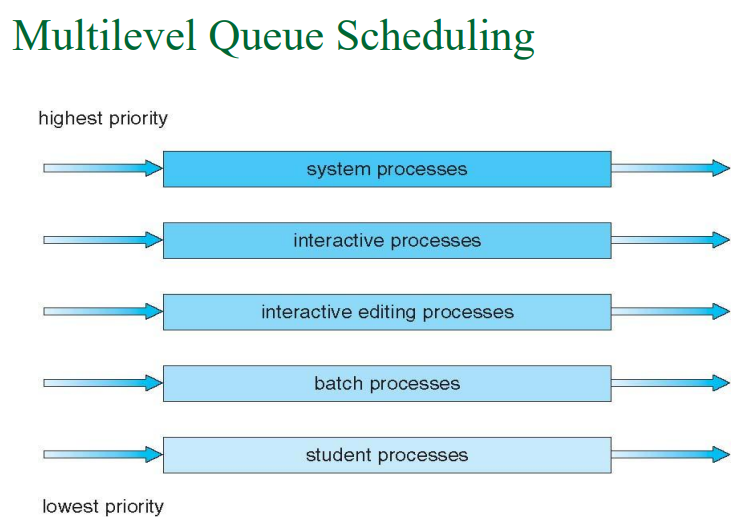

## preemptive scheduling(可搶先排班) 和 nonpreemptive scheduling(不可搶先排班)

!!! danger

    | 編號 | 狀態轉換                 | 例子                     | 直覺                                  |
    | -: | -------------------- | ---------------------- | ----------------------------------- |
    |  1 | running → waiting    | process 發出 I/O request | 它自己不能繼續用 CPU，所以 OS 必須換人             |
    |  2 | running → ready      | interrupt(中斷) 發生       | 它還能跑，但 OS 把它拉回 ready queue          |
    |  3 | waiting → ready      | I/O 完成                 | 有新的 process 回到 ready queue，可能需要重新判斷 |
    |  4 | running → terminated | process 結束             | 它不需要 CPU 了，所以 OS 必須換人               |


    只要是 `→ ready` 的都是 preemptive scheduling(可搶先排班)，所以 2 和 3 是 preemptive，1 和 4 是 nonpreemptive。

## Dispatcher — scheduler 選好 process 之後，誰真的把 CPU 交出去？

!!! danger

    Dispatcher 主要做三件事：

    | 動作                      | 中文理解                 | 為什麼需要                           |
    | ----------------------- | -------------------- | ------------------------------- |
    | switching context       | context switch(內容切換) | 儲存舊 process 的狀態，載入新 process 的狀態 |
    | switching to user mode  | 切回 user mode(使用者模式)  | OS 不能一直留在 kernel mode 執行使用者程式   |
    | jump to proper location | 跳到使用者程式正確位置          | 讓新 process 從上次停下來的位置繼續跑         |

    scheduler 負責選誰；dispatcher 負責交接 CPU 給他。

## Scheduling Criteria — 我們怎麼判斷一個排班演算法好不好？

!!! danger

    ```text
    0      2      5      7      10
    |  P2  |  P1  |  P3  |  P1  |
    ```

    假設 P1：

    * `Arrival Time = 0`
    * 第一次拿到 CPU：t=2
    * 第一次執行：t=2 到 t=5
    * 被切走後再次等待：t=5 到 t=7
    * 第二次執行：t=7 到 t=10
    * `Completion Time = 10`

    三個指標分別是：

    `Response Time(P1) = 2 - 0 = 2`

    `Waiting Time(P1) = (2 - 0) + (7 - 5) = 4`

    `Turnaround Time(P1) = 10 - 0 = 10`

    可以整理成：

    | 指標              | 算法                                   |                    結果 |
    |-------------------|----------------------------------------|------------------------:|
    | `Response Time`   | 第一次拿到 CPU - Arrival Time          |             `2 - 0 = 2` |
    | `Waiting Time`    | 所有在 ready queue 裡等 CPU 的時間總和 | `(2 - 0) + (7 - 5) = 4` |
    | `Turnaround Time` | Completion Time - Arrival Time         |           `10 - 0 = 10` |

    最短記法：

    **Response Time：第一次等多久。**
    **Waiting Time：總共等 CPU 多久。**
    **Turnaround Time：整個 process 從到達到完成花多久。**

### 考古題

!!! danger

    ==Q:==
    Discuss how CPU utilization and response time can conflict in a CPU scheduling system. Give one concrete example.
    [Adapted from: 期末考古_108_HTML化.html／Q1 Scheduling criteria conflicts；對應講義：講義_chapter 6_20240505.pdf／PDF viewer page 10／Scheduling Criteria]

    ==Me:(可用)==
    因為如果要高回應率，就要一直切換 process，就會導致大量 overhead，使 CPU 使用率很低。


    ==ANS:==
    為了降低 response time(反應時間)，排班器可能會讓互動式或新到達的 process 更快取得 CPU，因此會增加 preemption 或 context switch 的頻率。可是 context switch 本身不是真正在執行使用者程式，而是排班成本；如果切換太頻繁，CPU 花在切換上的時間變多，真正用來執行 process 的時間比例下降，因此可能降低 CPU utilization(CPU使用率)。

    ---

    ==Q:==
    Suppose a scheduler is tuned so that many processes finish quickly, making the average turnaround time look low. However, one unlucky process waits for a very long time before it receives enough CPU service. Explain how minimizing average turnaround time can conflict with minimizing maximum waiting time.


    ==Me:(可用)==
    因為如果要 minimizing average turnaround time，就會讓 OS 優先選執行時間比較短的 process，進而導致執行時間比較長的 process 等待很久，很後面才執行甚至餓死，所以會與 minimizing maximum waiting time。


    ==ANS:==
    為了 minimize average turnaround time(最小化平均回復時間)，scheduler 可能會優先執行短工作，因為短工作很快完成，可以把整體平均完成時間壓低。但這會讓長工作一直排在後面，使 maximum waiting time(最大等待時間) 變大；若系統持續有新的短工作進來，長工作甚至可能發生 starvation(飢餓)。

    ---

    ==Q:==
    Suppose a system has both I/O-bound processes and CPU-bound processes. A scheduler can favor I/O-bound processes to keep I/O devices busy, or favor CPU-bound processes to keep the CPU busy. Explain how I/O device utilization can conflict with CPU utilization.


    ==Me:(可用)==
    因為如果高 I/O 使用率就意味著會一直切換 process，一直 context switch，導致大量的時間都花在 process 切換，CPU的使用率就會降低。


    ==ANS:==
    為了 maximize I/O device utilization(最大化 I/O 裝置使用率)，scheduler 可能偏向讓 I/O-bound process 快速取得 CPU，讓它們很快發出 I/O request，使 I/O 裝置保持忙碌。但這些 process 通常 CPU burst 很短，可能造成較頻繁的阻塞、喚醒與 context switch，也可能讓 CPU 沒有足夠長的 CPU-bound work 可執行，導致 CPU utilization 下降。相反地，若只追求 maximize CPU utilization，scheduler 可能偏向讓 CPU-bound process 長時間占用 CPU，CPU 很忙，但 I/O-bound process 較少被推進到發出 I/O request，I/O device utilization 可能下降。

    ---


    ==Q:==
    Rewrite item (c) in 2–4 sentences. Explain both directions of the conflict: how optimizing for I/O device utilization can reduce CPU utilization, and how optimizing for CPU utilization can reduce I/O device utilization. Do not rely only on context-switch overhead.


    ==Me:(可用)==
    因為如果高 I/O device utilization ，會優先執行 I/O bound process，導致每次 CPU 都只用一點點就切換到下一個 process，CPU 會花大量時間在 context switch，導致 cpu 使用率下降。

    如果高CPU使用率代表OS會優先選擇 CPU bound process，process 會花較多時間在 CPU burst，讓I/O裝置使用率下降。


    ==ANS:==
    為了提高 I/O device utilization，OS 可能會優先執行 I/O-bound process，讓它們快速發出 I/O request，使 I/O 裝置保持忙碌。但 I/O-bound process 通常 CPU burst 很短，會很快進入 I/O waiting，可能造成較頻繁的 context switch，或讓 CPU 沒有足夠長時間的工作可執行，因此 CPU utilization 可能下降。

    相反地，如果 OS 為了提高 CPU utilization 而偏向執行 CPU-bound process，這些 process 會花較長時間在 CPU burst 上，使 CPU 維持忙碌；但它們較少發出 I/O request，因此 I/O device utilization 可能下降。

    ---


## FCFS — OS 只照「誰先進 ready queue」排班會發生什麼事？

!!! danger

    ==Q==

    Consider the following processes.

    | Process | Arrival time | CPU burst |
    | --- | --- | --- |
    | P1 | 0 | 7 |
    | P2 | 2 | 4 |
    | P3 | 4 | 1 |

    Using nonpreemptive FCFS scheduling, draw the Gantt chart and compute the response time, waiting time, and turnaround time for each process.  
    \[Generated: 依據本輪講義知識點／FCFS\]


    ==ANS==

    0    7    11   12
    | p1 | p2 | p3 |


    {response time, waiting time, turnaround time}
    p1:0,0,7
    p2:7-2=5,5,9
    p3:11-4=7,7,8

    ==要記得減去 arrival time==


## Multilevel Queue Scheduling — 為什麼 ready queue 要分成好幾條隊伍？

!!! danger

    


    兩層決策：queue 內怎麼排、queue 之間怎麼排

    這裡最重要的是不要只問「哪個 process 先跑」，而要分成兩層看。

    第一層是 intra-queue scheduling(queue 內排班)：同一條 queue 裡面怎麼排？

    例如：

    | Queue | 裡面可能放誰 | Queue 內演算法 |
    | --- | --- | --- |
    | Foreground queue ==前景== | interactive processes | RR |
    | Background queue ==背景== | batch processes | FCFS |

    第二層是 inter-queue scheduling(queue 之間排班)：CPU 要先服務哪一條 queue？

    講義列出兩種典型方式：固定優先權排程，或用比例分配，例如 80% CPU 給 foreground 的 RR、20% CPU 給 background 的 FCFS。

    講義\_chapter 6\_20240505

    這個分類也和網路公開作業系統課程講義中的說法一致：queue 內可以各自用不同演算法，queue 之間則常見 fixed-priority 或 time slice between queues，例如 foreground 80%、background 20%。[國立臺灣大學資訊工程學系](https://www.csie.ntu.edu.tw/~ktw/uos/uos2005-Chp5.pdf?utm_source=chatgpt.com)

## Multilevel Feedback Queue Scheduling — 系統怎麼用「行為回饋」調整 process 的優先隊伍？

!!! danger

    ### 核心規則：太常吃 CPU 就下降，等太久就上升

    我們可以用兩個方向記：

    | 行為 | 系統判斷 | MLFQ 反應 |
    | --- | --- | --- |
    | process 用了很長的 CPU time | 比較像 CPU-bound process | 降到 lower-priority queue(低優先佇列) |
    | process 經常很快讓出 CPU，常在等 I/O | 比較像 interactive / I/O-bound process | 留在或靠近 higher-priority queue(高優先佇列) |
    | process 在低優先 queue 等太久 | 有 starvation 風險 | 往 higher-priority queue 提升 |

    生活化比喻：  
    高優先 queue 像「快速服務窗口」，適合一下子就能處理完的人；低優先 queue 像「大型案件窗口」，給會佔用很久的人。但如果大型案件窗口有人排太久，系統也要偶爾把他拉上來處理，不然他會永遠等不到。

    只要題目說 process 可以在 queues 之間移動，那就不是單純 MLQ，而是 MLFQ。


## Thread Scheduling — 執行緒到底是跟誰競爭 CPU？

!!! danger

    PCS(Process-contention scope，行程競爭範圍)、SCS(System-contention scope，系統競爭範圍)

    | 名稱  | 誰在排班？          | 跟誰競爭？                  | 常見對應                      |
    | --- | -------------- | ---------------------- | ------------------------- |
    | PCS | thread library | 同一個 process 內的 threads | user-level threads 排到 LWP |
    | SCS | OS kernel      | 系統內所有 kernel threads   | kernel-level scheduling   |


## Earliest Deadline First Scheduling(EDF)

!!! danger

    ==Q:==
    所以在 EDF ，只要使用率小於 1 ，就一定不會有process 超過 deadline 對不對？

    ==ANS:==

    不可以無條件這樣說。比較精準是：

    **在單一 CPU、preemptive EDF(可搶先 EDF)、週期性工作彼此獨立、每個 job 的 relative deadline(相對期限) 等於 period(週期)、忽略 context switch overhead(內容切換成本) 的理想模型下，總 CPU utilization(使用率) ≤ 1，EDF 就可以排出不 miss deadline 的排程。**


## Little’s Formula 怎麼算？

!!! danger

    | 符號 | 意思                                       |
    | -- | ---------------------------------------- |
    | n  | average queue length(平均佇列長度)             |
    | W  | average waiting time in queue(平均在佇列等待時間) |
    | λ  | average arrival rate into queue(平均抵達率)   |


    Little’s Law 的標準形式常寫作 L = λW，也就是平均系統內數量等於平均抵達率乘上平均停留時間；講義這裡用 n 表示 queue 裡的平均數量，用 W 表示 queue 裡的等待時間。原始 Little’s Law 文獻也把平均等待時間、平均系統內項目數與 arrival rate(抵達率)連在一起。

    | 條件                     |              數值 |
    | ---------------------- | --------------: |
    | 平均每秒抵達 process 數 λ     | 7 processes/sec |
    | 平均 queue 裡 process 數 n |    14 processes |
    | 要求                     |               W |


    因為：

    n = λ × W

    所以：

    W = n / λ = 14 / 7 = 2 seconds

    也就是每個 process 平均在 queue 裡等待 2 秒


    ==平均排隊人數 = 平均每秒進來幾人 × 每人平均等多久。==


### 考古

!!! danger

    ### ==Q:==
    Draw the Gantt charts and compute the turnaround time and waiting time for each process under the four scheduling algorithms below.

    Process data:

    | Process | Burst time | Priority |
    | --- | --- | --- |
    | P1 | 2 | 2 |
    | P2 | 1 | 1 |
    | P3 | 8 | 4 |
    | P4 | 4 | 2 |
    | P5 | 5 | 3 |

    Assumptions:

    All processes arrive at time 0.

    Arrival order is P1, P2, P3, P4, P5.

    For `nonpreemptive priority scheduling`, a smaller priority number means higher priority.

    For ties, use FCFS order.

    For `RR`, use time quantum = 1.

    Tasks:

    1. Draw the Gantt chart for FCFS.
    2. Draw the Gantt chart for SJF.
    3. Draw the Gantt chart for nonpreemptive priority scheduling.
    4. Draw the Gantt chart for RR with quantum = 1.
    5. For each algorithm, compute the turnaround time of each process.
    6. For each algorithm, compute the waiting time of each process.
    7. State which algorithm gives the minimum average waiting time.

    ==ANS:==
    FCFS
    0    2    3    11   15   20  
    / p1 / p2 / p3 / p4 / p5 /

    turnaround time,waiting time:
    p1:2,0
    p2:3,2
    p3:11,3
    p4:15,11
    p5:20,15

    average waition time = 31/5 = 6.2

    ---


    SJF
    0    1    3    7    12   20
    / p2 / p1 / p4 / p5 / p3 /


    turnaround time,waiting time:
    p1:3,1
    p2:1,0
    p3:20,12
    p4:7,3
    p5:12,7

    average waition time = 23/5 = 4.6


    ---

    nonpreemptive priority scheduling.

    0    1    3    7    12   20
    / p2 / p1 / p4 / p5 / p3 /


    turnaround time,waiting time:
    p1:3,1
    p2:1,0
    p3:20,12
    p4:7,3
    p5:12,7

    average waition time = 23/5 = 4.6

    ---

    RR with quantum = 1
    0    1    2    3    4    5    6    7    8    9    10   11   12   13   14   15   16   17   18   19   20
    / p1 / p2 / p3 / p4 / p5 / p1 / p3 / p4 / p5 / p3 / p4 / p5 / p3 / p4 / p5 / p3 / p5 / p3 / p3 / p3 /
                                  |

    turnaround time,waiting time:
    p1:6,4
    p2:2,1
    p3:20,12
    p4:14,10
    p5:17,12

    average waition time = 39/5 = 7.8

    ---

    Minimum average waiting time: SJF and nonpreemptive priority scheduling， average waiting time = 4.6

    ----


    ### ==Q:==

    Using the following preemptive priority round-robin scheduling rule, draw the Gantt chart, then compute the turnaround time, waiting time, and CPU utilization rate.


    Rules:

    | Rule | Meaning |
    | --- | --- |
    | Higher priority number | Higher priority |
    | Time quantum | 10 units |
    | Same priority | Use round-robin order |
    | Higher-priority arrival | Immediately preempts the current process |
    | Preempted process | Placed at the end of its queue |
    | Pidle | Priority 0, runs only when no real process is available |
    | CPU utilization | Pidle time does not count as useful CPU work |

    Process table:

    | Thread | Priority | Burst | Arrival |
    | --- | --- | --- | --- |
    | P1 | 40 | 20 | 0 |
    | P2 | 30 | 25 | 25 |
    | P3 | 30 | 25 | 30 |
    | P4 | 35 | 15 | 60 |
    | P5 | 5 | 10 | 100 |
    | P6 | 10 | 10 | 105 |

    Please answer in this format:

    1. Gantt chart
    2. Completion time of each process
    3. Turnaround time of each process
    4. Waiting time of each process
    5. CPU utilization rate


    ==ANS:==

    用目前 HTML 轉錄保留的 printed value：**P3 burst = 25**。該檔也有註記說 P3 burst 附近有手寫痕跡，但不可靠，所以這輪先依 printed table 計算。

    期末考古\_108\_HTML化

    ```
    0    10   20   25   35   45   55   60   70   75   80   90   100  105  115  120| P1 | P1 |Idle| P2 | P3 | P2 | P3 | P4 | P4 | P2 | P3 |Idle| P5 | P6 | P5 |
    ```

    關鍵切點是：

    time 60：P4 到達，priority 35 > P2/P3 的 30，所以**立刻搶先**。  
    time 105：P6 到達，priority 10 > P5 的 5，所以**立刻搶先**。

    ---

    #### 3\. 正確 Completion / Turnaround / Waiting time

    | Process | Arrival | Burst | Completion time | Turnaround time = C - A | Waiting time = T - B |
    | --- | --- | --- | --- | --- | --- |
    | P1 | 0 | 20 | 20 | 20 | 0 |
    | P2 | 25 | 25 | 80 | 55 | 30 |
    | P3 | 30 | 25 | 90 | 60 | 35 |
    | P4 | 60 | 15 | 75 | 15 | 0 |
    | P5 | 100 | 10 | 120 | 20 | 10 |
    | P6 | 105 | 10 | 115 | 10 | 0 |

    所以正確答案是：

    Completion time：P1=20, P2=80, P3=90, P4=75, P5=120, P6=115

    Turnaround time：P1=20, P2=55, P3=60, P4=15, P5=20, P6=10

    Waiting time：P1=0, P2=30, P3=35, P4=0, P5=10, P6=0

    ---

    #### 4\. CPU utilization rate

    Idle time 有兩段：

    20–25：5 units  
    90–100：10 units

    所以 total idle time = 15，total time = 120。

    CPU busy time = 120 - 15 = 105。

    CPU utilization rate = 105 / 120 = **87.5%**


