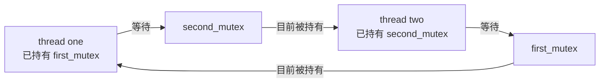
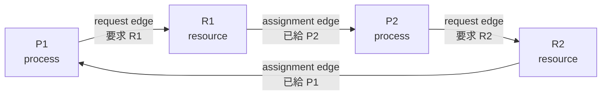
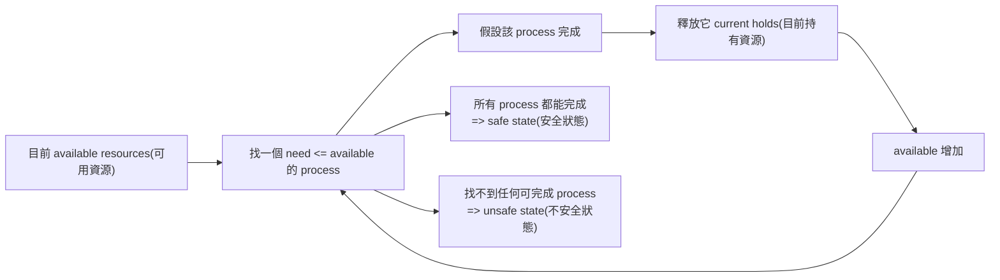
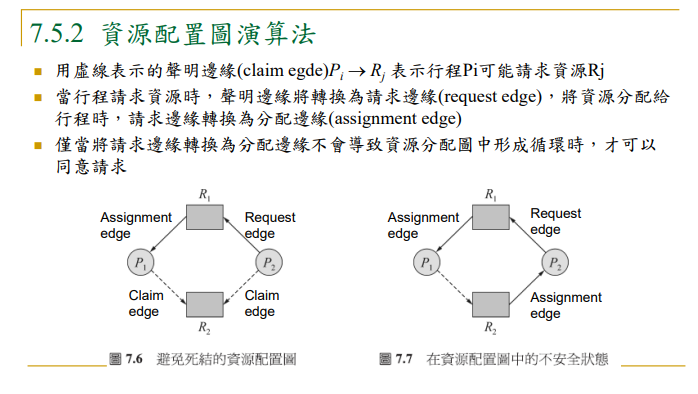
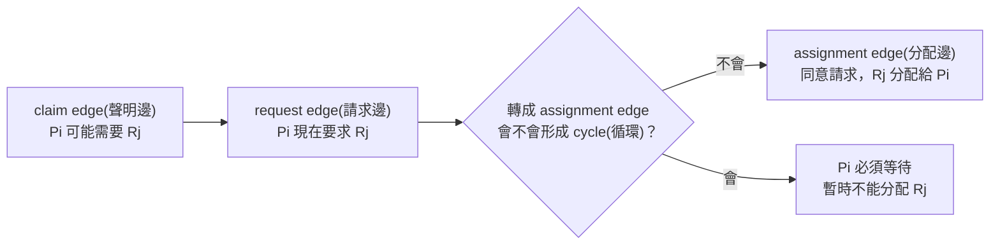
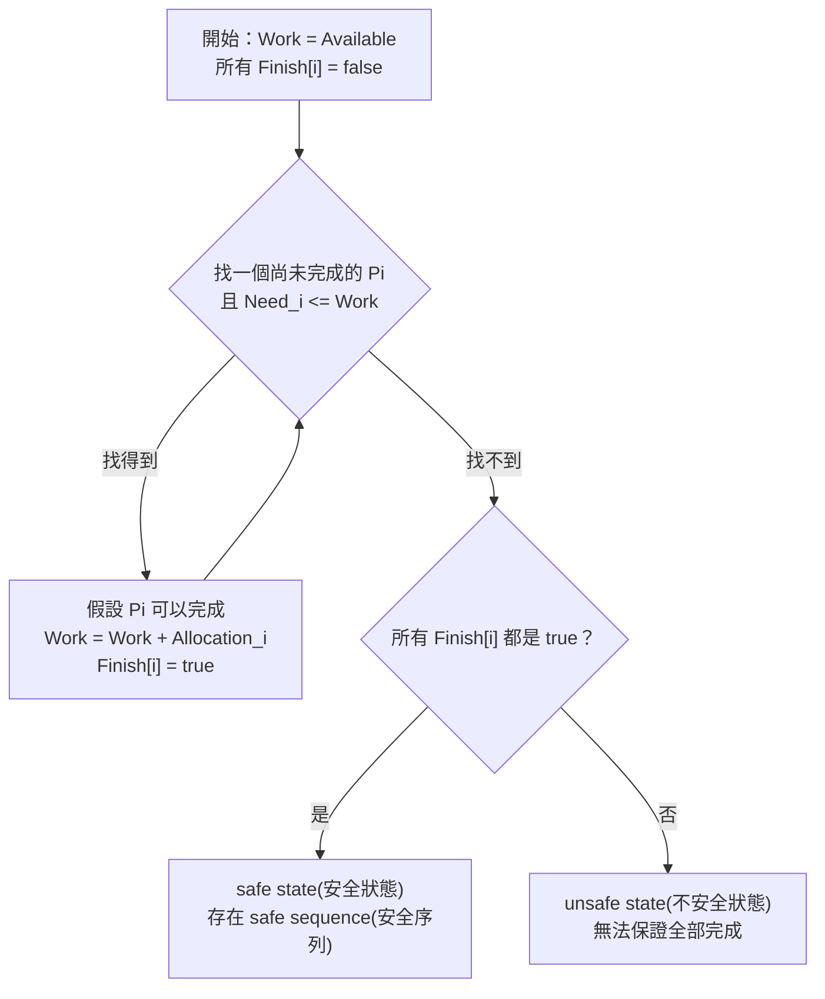
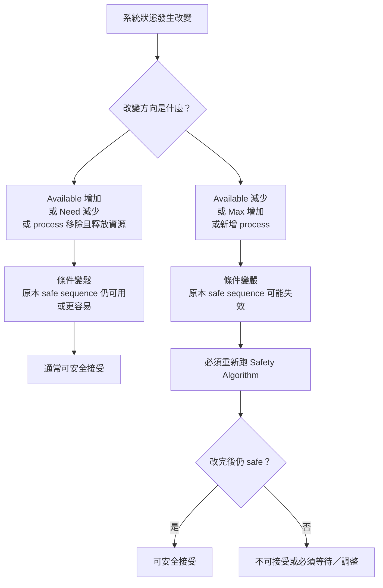

## ⭐Deadlock 的基本模型 — 為什麼行程照正常規則拿資源，反而會卡死？

講義位置：PDF viewer page 3 ~ PDF viewer page 5

### 1. 這一段在解決什麼問題？

這一章的核心問題不是「程式壞掉」而已，而是：

某些行程都照規矩要求資源、使用資源、釋放資源，為什麼系統還是可能進入一種大家都等不到、也沒有人能往前走的狀態？

講義先給一個最基本的資源使用生命週期：`request(要求)`、`use(使用)`、`release(釋放)`。也就是行程不能憑空使用資源，必須先要求；拿到後才使用；用完再釋放。若要求不能立刻被允許，行程就必須等待。

生活化例子：兩個人要煮飯。A 先拿鍋子，再等刀子；B 先拿刀子，再等鍋子。每個人都沒有違規，因為他們只是「拿到一個工具後，等待另一個工具」。但如果兩個人都不願意先放下手上的工具，就會卡住。

這就是 Deadlock(死結) 的直覺：不是沒有人想做事，而是每個人都在等別人先釋放某個東西。

---

### 2. 講義的 mutex 範例：相反順序拿 lock 會製造死結風險

PDF viewer page 4 給了兩個 thread 的程式片段：thread one 先鎖 `first_mutex` 再鎖 `second_mutex`；thread two 則先鎖 `second_mutex` 再鎖 `first_mutex`。

最小化後，重點長這樣：

```c
// thread one
lock(first_mutex);
lock(second_mutex);
// do work
unlock(second_mutex);
unlock(first_mutex);

// thread two
lock(second_mutex);
lock(first_mutex);
// do work
unlock(first_mutex);
unlock(second_mutex);
```

這段 code 的危險點不是 `lock()` 本身，而是「拿鎖順序不一致」。

若執行順序剛好變成：

| 時間 | thread one                     | thread two                    | 結果                            |
| -- | ------------------------------ | ----------------------------- | ----------------------------- |
| t1 | 拿到 `first_mutex`               | 尚未動作                          | `first_mutex` 被 thread one 佔用 |
| t2 | 等 `second_mutex`               | 拿到 `second_mutex`             | 兩邊各拿一個                        |
| t3 | 等 thread two 釋放 `second_mutex` | 等 thread one 釋放 `first_mutex` | 互相等待，卡住                       |

這個表就是 Deadlock(死結) 的最小心智模型：每個行程手上都有一部分資源，同時又在等別人手上的資源。

---
!!! danger 

    ### 3. 四個必要條件：死結不是單一原因，而是四個條件同時成立

    講義列出 Deadlock(死結) 發生的四個必要條件：`mutual exclusion(互斥)`、`hold and wait(佔用與等候)`、`no preemption(不可搶先)`、`circular wait(循環式等候)`。講義說這四種狀況同時成立時，才構成死結問題發生的充要條件。


    | 條件                     | 中文直覺            | 對應 mutex 例子                                     |
    | ---------------------- | --------------- | ----------------------------------------------- |
    | `Mutual Exclusion(互斥)` | 一次只能一個人用        | 一個 mutex 同時只能被一個 thread 持有                      |
    | `Hold and Wait(佔用與等候)` | 手上拿著 A，還在等 B    | thread one 拿著 `first_mutex` 等 `second_mutex`    |
    | `No Preemption(不可搶先)`  | 不能硬搶別人手上的資源     | OS 不能隨便把 mutex 從 thread 手上奪走                    |
    | `Circular Wait(循環式等候)` | A 等 B，B 等 A，形成圈 | thread one 等 thread two；thread two 等 thread one |

    最重要的不變量是：**只破壞其中一個條件，就可以防止死結形成。**

    例如：若強制所有 thread 都必須先拿 `first_mutex` 再拿 `second_mutex`，就破壞了 `circular wait(循環式等候)`。這也是後面 `Deadlock Prevention(死結預防)` 會用到的核心想法。

---

### 4. Mermaid 視覺化：兩個 thread 如何互相卡住



讀法很簡單：箭頭如果形成「等候圈」，而且資源又不能被搶走，就會卡死。這裡不是 CPU 不夠快，也不是某個 thread 忘記工作，而是系統狀態本身形成互相等待。

---

### 5. 常見錯法

第一個常見錯法：以為只要有等待就是死結。這不對。等待可能只是暫時的，例如 thread one 等一下 `second_mutex`，如果 thread two 很快釋放，那就不是死結。

第二個常見錯法：以為只要有 mutex 就一定會死結。這也不對。mutex 只是互斥資源；真正危險的是「多個 mutex 被不同 thread 以不一致順序持有與等待」。

第三個常見錯法：只背四個名詞，卻無法對照到實際情境。考試通常不是只問你列出四條，而是給你一段情境或程式，問哪些條件成立、要怎麼破壞其中一條。

---

### 6. 最短記法

Deadlock(死結) 的最短判斷句：

「有人拿著資源不放，又等別人手上的資源；資源不能被硬搶，而且等待關係形成一圈。」

英文考試版可以寫成：

A deadlock can occur when processes hold resources while waiting for other resources, the resources cannot be preempted, at least one resource is non-sharable, and the waiting relationship forms a circular chain.


## ⭐Resource-Allocation Graph(資源配置圖) — 怎麼把「誰拿著誰、誰在等誰」畫成可以判斷死結的圖？

講義位置：PDF viewer page 6 ~ PDF viewer page 8

### 1. 這一段在解決什麼問題？

上一段我們用文字說明 deadlock(死結) 的四個必要條件。但只用文字時，很容易漏掉「等待關係有沒有形成圈」。

`Resource-Allocation Graph(資源配置圖)` 就是把系統狀態畫成 graph(圖)，讓我們可以視覺化：

* 哪些 process(行程) 存在？
* 哪些 resource type(資源型式) 存在？
* process 正在 request(要求) 哪個資源？
* resource 已經 assignment(分配) 給哪個 process？
* 等待關係是否形成 cycle(循環)？

講義 page 6 定義 graph 由 vertices(頂點) 與 edges(邊) 組成，頂點分成 process set `P = {P1, P2, ..., Pn}` 與 resource set `R = {R1, R2, ..., Rm}`。

---

### 2. 兩種邊：request edge(要求邊) 與 assignment edge(分配邊)

資源配置圖最重要的是箭頭方向。

| 邊                      | 方向        | 中文意思                                          |
| ---------------------- | --------- | --------------------------------------------- |
| `request edge(要求邊)`    | `Pi → Rj` | process `Pi` 正在等待 resource `Rj`               |
| `assignment edge(分配邊)` | `Rj → Pi` | resource `Rj` 的某個 instance 已經分配給 process `Pi` |

講義 page 6 直接列出：`request edge` 是 `Pi → Rj`，`assignment edge` 是 `Rj → Pi`。

最短記法：

`process → resource`：我想要它。
`resource → process`：它已經給我了。

---

### 3. instance(實例)：一種資源可能不只一份

講義 page 7 標出 `instance`，page 8 的圖中，resource 方框裡面的小黑點就是 instances(實例)。意思是：同一種 resource type 可能有多份。

例如 `R2` 有兩個小黑點，代表 `R2` 有兩個 instances。這很重要，因為「有 cycle(循環)」不一定永遠代表 deadlock(死結)。如果某個 resource type 有多個 instances，cycle 可能被其他 process 釋放資源後解除。講義 page 8 右圖就是「含循環但無死結現象」的資源配置圖，因為 `P4` 可以釋放 `R2` 的 instance，之後再分配給 `P3` 以消除此循環。

---

### 4. 怎麼用圖判斷 deadlock 風險？

先用一個簡化版圖來看：



這張圖的等待路徑是：

`P1 → R1 → P2 → R2 → P1`

這是一個 cycle(循環)。直覺上就是：

P1 在等 R1，但 R1 給了 P2；P2 在等 R2，但 R2 給了 P1。
所以 P1 等 P2，P2 又等 P1。

---

### 5. Cycle(循環) 的考試判斷規則

這裡要小心，不能把「有 cycle」直接粗暴地等於「一定 deadlock」。

| 情況                                             | 判斷                                 |
| ---------------------------------------------- | ---------------------------------- |
| graph 沒有 cycle                                 | 不會有 deadlock                       |
| graph 有 cycle，且每個 resource type 都只有一個 instance | 有 deadlock                         |
| graph 有 cycle，但某些 resource type 有多個 instances  | 可能 deadlock，也可能不是 deadlock，需要進一步判斷 |

講義 page 8 特別放了兩張圖：左圖是「含死結的資源配置圖」，右圖是「含循環但無死結現象之資源配置圖」。這正是在提醒我們：cycle 是重要警訊，但多 instance 時不能只靠 cycle 下結論。

---

### 6. 常見錯法

第一個錯法：把箭頭方向看反。
`Pi → Rj` 不是資源給 process，而是 process 正在要求資源。`Rj → Pi` 才是資源已分配給 process。

第二個錯法：看到 cycle 就直接說 deadlock。
如果每個 resource type 都只有一個 instance，這樣通常可以；但如果有多個 instances，就要看是否仍有 process 可以完成並釋放資源。

第三個錯法：忽略 resource 方框裡的小黑點。
小黑點代表 instance 數量，是判斷 cycle 是否必然造成 deadlock 的關鍵。

---

### 7. 最短記法

`Resource-Allocation Graph(資源配置圖)` 的三句考試記法：

1. `Pi → Rj` means `Pi` is requesting `Rj`.
2. `Rj → Pi` means an instance of `Rj` has been allocated to `Pi`.
3. A cycle implies a deadlock only when each resource type has a single instance; with multiple instances, a cycle may or may not imply deadlock.


## ⭐Handling Deadlocks(處理死結的方法) — 系統遇到死結問題時，有哪三種基本策略？

講義位置：PDF viewer page 9

### 1. 這一段在解決什麼問題？

前面我們已經學會兩件事：

第一，deadlock(死結) 什麼時候會發生。
第二，怎麼用 resource-allocation graph(資源配置圖) 看出等待關係是否形成 cycle(循環)。

接下來 page 9 問的是另一個層次的問題：

如果系統可能發生 deadlock，作業系統到底要採取什麼政策？

講義列出三種理論上的處理方法：

!!! danger

    | 方法                              | 中文直覺   | 系統態度                   |
    | ------------------------------- | ------ | ---------------------- |
    | `Prevention / Avoidance(預防或避免)` | 事前管控   | 不讓系統進入 deadlock 狀態     |
    | `Detection and Recovery(偵測與恢復)` | 事後處理   | 允許 deadlock 發生，但偵測後再恢復 |
    | `Ignore the problem(忽視問題)`      | 假裝不會發生 | 不特別處理 deadlock         |

    講義 page 9 明確列出這三種方法：可以用協議防止或避免死結、可以允許系統進入死結後偵測並恢復、也可以忽視問題並假裝沒有發生過死結。

---

!!! danger

    ### 2. Prevention(預防) 與 Avoidance(避免) 的差別

    這兩個很容易混在一起，但考試常會問比較。

    `Deadlock Prevention(死結預防)` 的想法是：直接破壞 deadlock 的四個必要條件之一。
    也就是前面學過的四條：`mutual exclusion(互斥)`、`hold and wait(佔用與等候)`、`no preemption(不可搶先)`、`circular wait(循環式等候)`。只要強制讓其中一條不成立，就不可能發生 deadlock。

    `Deadlock Avoidance(死結避免)` 的想法比較精細：系統先知道 process 生命週期中可能需要哪些資源，然後每次 process 要求資源時，OS 判斷「現在給它，未來會不會變危險」。如果給了之後仍安全，就給；如果可能進入不安全狀態，就讓它等。講義 page 9 也說 avoidance 需要 OS 預先取得行程生命期會要求與使用哪些資源，才能決定每個 request 是否該等待。

    生活化例子：

    `Prevention(預防)` 像是規定：「每個人進實驗室前，只能一次借齊所有工具，不然不能開始。」這會破壞 `hold and wait(佔用與等候)`，但可能浪費工具。

    `Avoidance(避免)` 像是管理員每次有人借工具時，都先算一下：「如果現在借出去，剩下工具還夠不夠讓所有人最後都完成？」如果不夠，就暫時不借。

---

### 3. Detection and Recovery(偵測與恢復)

第二種策略比較務實：系統可以允許 deadlock 發生，但要能偵測出來，然後做 recovery(恢復)。

這表示 OS 不一定事前阻止所有危險狀態，而是定期或在需要時檢查系統是否已經 deadlock。如果真的 deadlock，就用某些方法恢復，例如終止某些 process，或回收資源。

這個方法的 trade-off(取捨) 是：

事前限制比較少，所以系統平常可能比較自由；但一旦 deadlock 發生，恢復成本可能很高。

---

### 4. Ignore the problem(忽視問題)

第三種策略看起來很奇怪：假裝系統沒有發生 deadlock。

但它反映的是工程取捨：如果 deadlock 很少發生，而處理 deadlock 的成本很高，系統可能選擇不特別處理。某些一般用途系統可能寧可讓使用者或管理員手動處理，例如重啟程式或重開機。

這不是說 deadlock 不存在，而是系統設計上選擇不花成本處理。

---

!!! danger

    ### 5. 最短記法

    三種處理 deadlock 的方法可以這樣背：

    `Prevention/Avoidance`：事前不要讓 deadlock 發生。
    `Detection/Recovery`：事後發現 deadlock，再處理。
    `Ignore`：不處理，假裝它不會發生。

英文考試版：

There are three general ways to handle deadlocks. The system can prevent or avoid deadlocks so that it never enters a deadlocked state. It can allow deadlocks to occur, detect them, and recover from them. Alternatively, it can ignore the problem and pretend that deadlocks never occur.


## ⭐Deadlock Prevention(預防死結) — 如果 deadlock 需要四個條件同時成立，那我們能不能故意破壞其中一個？

講義位置：PDF viewer page 10 ~ PDF viewer page 11

### 1. 這一節在解決什麼問題？

前面我們已經知道，deadlock(死結) 不是單一原因造成的，而是四個條件同時成立才會發生：

| 條件                     | 意思                        |
| ---------------------- | ------------------------- |
| `Mutual Exclusion(互斥)` | 某些資源一次只能給一個 process 使用    |
| `Hold and Wait(佔用與等候)` | process 已拿著一些資源，又在等其他資源   |
| `No Preemption(不可搶先)`  | OS 不能強制把資源從 process 手上搶回來 |
| `Circular Wait(循環式等候)` | 等待關係形成一個環                 |

`Deadlock Prevention(預防死結)` 的核心原理很簡單：

只要 deadlock 必須四個條件同時成立，那我們就設計規則，故意讓至少一個條件永遠不成立。

講義 page 10 說 7.4 的目標就是「想辦法破壞形成 deadlock 的四個條件」，並分別討論 `mutual exclusion`、`hold and wait`、`no preemption`；page 11 接著討論 `circular wait`。

---

### 2. 破壞 Mutual Exclusion(互斥)：通常很難

`Mutual Exclusion(互斥)` 是說某些資源不能同時給多人使用。

例如：

印表機一次只能真正印一份工作。
mutex lock(互斥鎖) 一次只能被一個 thread 持有。
某些硬體裝置一次只能服務一個 process。

如果資源本來就是 `nonsharable resource(不可共用資源)`，那 mutual exclusion 幾乎無法破壞。你不能硬說「這台印表機同時印十個人的文件」，因為實體上做不到。

所以這一條常常不是最好下手的地方。

---

### 3. 破壞 Hold and Wait(佔用與等候)：不要讓 process 邊拿邊等

`Hold and Wait(佔用與等候)` 的危險是：

process 手上已經拿著一些資源，然後又去等別的資源。

生活化例子：

一個人先拿走剪刀，然後等膠水；另一個人先拿走膠水，然後等剪刀。兩個人都不放手，就卡住。

預防方法是設計規則：

一個 process 要求資源時，不可以已經持有其他資源。

常見做法可以想成兩種：

| 做法              | 直覺                |
| --------------- | ----------------- |
| 一開始一次申請全部資源     | 要嘛全部拿到再開始，要嘛先不要開始 |
| 要申請新資源前，先釋放手上資源 | 不准一邊拿著舊資源一邊等新資源   |

缺點也很明顯：

資源利用率低，因為 process 可能很早就拿走一堆暫時用不到的資源。
可能 starvation(飢餓)，因為某個 process 一直等不到「全部資源同時可用」的時機。

講義 page 10 也列出 `hold and wait` 的預防方式：要求 process 在請求資源時不可佔用其他資源，並指出缺點是資源利用率低且可能 starvation。

---

### 4. 破壞 No Preemption(不可搶先)：拿不到新資源，就先吐回舊資源

`No Preemption(不可搶先)` 是說：

資源不能被 OS 強制拿回來，只能等 process 自己用完後釋放。

要破壞它，就反過來制定規則：

如果 process 已經持有某些資源，現在又請求其他資源，但新資源不能立刻分配，那它目前持有的資源也要先釋放。

直覺例子：

你已經拿著剪刀，現在想借膠水，但膠水借不到。規則要求你不能繼續拿著剪刀乾等，而是要先把剪刀放回去。等到剪刀和膠水都能重新取得時，再繼續做事。

這可以減少「我拿著你要的，你拿著我要的」的僵局。

但它不適用所有資源。像 CPU register(暫存器)、memory state(記憶體狀態) 這類可以儲存與恢復的東西比較可能處理；但印表機印到一半，通常不能很漂亮地「搶先收回」。

---

### 5. 破壞 Circular Wait(循環式等候)：資源排序，只能照順序申請

`Circular Wait(循環式等候)` 是最常見、也最考試友善的預防方法。

做法是：

對所有 resource type(資源型式) 編一個全域順序，然後規定每個 process 只能依遞增順序要求資源。

例如資源排序如下：

| 順序 | 資源   |
| -: | ---- |
|  1 | `R1` |
|  2 | `R2` |
|  3 | `R3` |

那 process 可以先要求 `R1` 再要求 `R2`，也可以先要求 `R2` 再要求 `R3`，但不能已經拿著 `R3` 又回頭要求 `R1`。

為什麼這能防止 cycle？

因為 cycle 的本質是「繞一圈回到起點」。
但如果所有 request 都只能往資源編號越來越大的方向走，就不可能繞回較小的資源編號，因此不會形成 circular wait。

講義 page 11 明確說：為了確保 circular wait 條件不成立，可以對所有資源做總排序，並要求每個 process 以遞增順序請求資源。

---

### 6. 四種 prevention 方法的考試整理

| 被破壞的條件             | 預防策略                   | 主要代價                 |
| ------------------ | ---------------------- | -------------------- |
| `Mutual Exclusion` | 讓資源可共用                 | 對不可共用資源通常做不到         |
| `Hold and Wait`    | 不准 process 持有資源時再等其他資源 | 資源利用率低，可能 starvation |
| `No Preemption`    | 拿不到新資源時，釋放已持有資源        | 不適合所有資源，恢復成本可能高      |
| `Circular Wait`    | 對資源排序，只能依遞增順序請求        | 限制程式彈性，資源申請順序可能不自然   |

最短記法：

`Prevention(預防)` = 破壞四條件之一。
其中考試最常問的直覺是：

`Hold and wait`：不要邊拿邊等。
`Circular wait`：資源排序，不准繞圈。


### Hold and Wait(佔用與等候) 和 No Preemption(不可搶先) 預防方式有差嗎？

!!! danger

    #### 1\. 直接答案

    `Hold and Wait(佔用與等候)` 的預防法是：**不准 process 在已經拿著資源的狀態下，再去等另一個資源**。也就是從一開始就禁止「邊拿邊等」這種狀態。講義寫法是：行程要求一項資源時，不可以佔用任何其他資源；缺點是資源利用率低、可能 starvation(餓死)。

    `No Preemption(不可搶先)` 的預防法是：**允許 process 先拿著某些資源去要求新資源；但如果新資源拿不到，就把它目前持有的資源釋放掉**。講義寫法是：如果持有某些資源的行程請求其他不能立即分配的資源，它當前持有的所有資源會被釋放，之後等它能重新取得舊資源與新資源時才重新啟動。

    網路教材也用同樣的四條 deadlock 必要條件來區分：`Hold and Wait` 是「拿著一個資源又等待另一個」，`No Preemption` 是「資源不能被強制拿走，只能自願釋放」。

    #### 2\. 用同一個例子看差異

    假設：

    `P1` 已經拿到 `A`，現在想要 `B`，但 `B` 被 `P2` 拿著。

    | 方法 | 會怎麼處理 `P1`？ | 破壞哪個 deadlock 條件？ |
    | --- | --- | --- |
    | `Hold and Wait` 預防 | 這種狀態一開始就不該發生。`P1` 要嘛一開始同時要求 `A+B`，要嘛先放掉 `A`，才可以要求 `B`。 | 破壞 `Hold and Wait(佔用與等候)` |
    | `No Preemption` 預防 | 可以讓 `P1` 先拿著 `A` 去要求 `B`；但如果 `B` 拿不到，就強制 `P1` 釋放 `A`。 | 破壞 `No Preemption(不可搶先)` |

    所以最短判斷是：

    `Hold and Wait`：**不准你拿著舊資源等新資源。**

    `No Preemption`：**你可以先拿著舊資源去要新資源，但要不到就把舊資源吐出來。**

    也就是說 `Hold and Wait(佔用與等候)` 是「只能一次拿或都不拿」，`No Preemption(不可搶先)` 是「可以持有的時候去要新資源，」
    
    


## ⭐Safe State(安全狀態) — 為什麼系統不只看「現在有沒有 deadlock」？

講義位置：PDF viewer page 12～14

### 1. 這個概念在解決什麼問題？

`Deadlock Prevention(死結預防)` 是直接設規則，讓某個死結必要條件不可能成立。

`Deadlock Avoidance(死結避免)` 比較細緻：它不是完全禁止 process 拿資源，而是每次分配前先問：

「如果我現在把資源給你，未來是否還有一條安全路徑，讓所有 process 都能完成？」

所以 `Safe State(安全狀態)` 的核心不是「現在有沒有卡住」，而是「從現在開始，有沒有一個完成順序，可以讓所有 process 都跑完」。講義在 page 12 定義：系統能以某種順序分配資源給各行程且仍能避免死結，就稱為 safe state。

生活化例子：假設我們有一間實驗室，只有 12 台儀器。每個學生目前借了一些儀器，未來還可能需要更多。老師要判斷「現在再借出去一台」會不會讓大家最後都卡住。不是看現在誰有沒有儀器，而是看有沒有一種順序：先讓某個需求少的人完成並歸還，接著下一個人完成，再下一個人完成。

---

### 2. Safe Sequence(安全序列) 是什麼？

`Safe sequence(安全序列)` 是一個 process 完成順序：

`<P1, P0, P2>`

它的意思不是系統真的一定照這順序排程，而是證明「至少存在一條可行路線」。

判斷方式：

1. 看目前 `Available(可用資源)` 是否足以滿足某個 process 的剩餘需求。
2. 如果可以，假設它完成並釋放目前持有的資源。
3. 把釋放的資源加回 available。
4. 重複，直到所有 process 都能完成。

如果存在這種順序，狀態就是 `safe(安全)`；如果不存在，就叫 `unsafe(不安全)`。講義 page 13 也是用「存在一個序列」來描述 safe condition。



---

### 3. 講義 page 14 的直覺例子

講義例子如下：

| Process | Maximum needs | Current holds | Needs |
| ------- | ------------: | ------------: | ----: |
| P0      |            10 |             5 |     5 |
| P1      |             4 |             2 |     2 |
| P2      |             9 |             2 |     7 |

系統共有 12 台 tape drives，目前被持有 `5 + 2 + 2 = 9` 台，所以 `Available = 3`。

判斷：

| 步驟 | Available | 可完成者               | 完成後釋放 | New Available |
| -- | --------: | ------------------ | ----: | ------------: |
| 1  |         3 | P1，因為 need 2 <= 3  |     2 |             5 |
| 2  |         5 | P0，因為 need 5 <= 5  |     5 |            10 |
| 3  |        10 | P2，因為 need 7 <= 10 |     2 |            12 |

所以 safe sequence 是：

`<P1, P0, P2>`

因此這是 `safe state(安全狀態)`。講義 page 14 也用同一個 sequence `<P1, P0, P2>` 作為 safe example。

---

### 4. Unsafe State(不安全狀態) 不等於「現在已經 deadlock」

這裡很容易混淆：

`Deadlock(死結)`：現在已經卡住。
`Unsafe state(不安全狀態)`：現在不一定卡住，但如果繼續照某些請求分配，可能走到 deadlock。

所以 `unsafe` 比 `deadlock` 更早警告。它像是開車看到前面路越來越窄：車還沒撞上，但如果繼續開，就可能卡死。

講義 page 14 的 unsafe 例子是：如果在某時刻把額外一台 tape drive 分給 `P2`，狀態會變成 unsafe，講義直接標註該請求是 mistake。

---

### 5. 最短記法

考試遇到 `safe state` 題，直接照這四步：

1. 算 `Need = Max - Allocation`。
2. 找 `Need <= Available` 的 process。
3. 假設它完成，`Available += Allocation`。
4. 若全部 process 都能完成，就是 safe；否則 unsafe。

目前先學「安全狀態的概念與手算邏輯」。真正的 `Banker’s Algorithm(銀行家演算法)` 會在後面 page 16～19 正式變成完整演算法。

!!! danger

    ### 為何證明「至少存在一條可行路線」就能夠是 safe state？我可能不照著這個可行路線執行就 deadlock 了不是嗎？

    safe state 的保證不是「任何亂拿都安全」，而是「只要管理者繼續控管，不把系統推進危險狀態，就有辦法避免 deadlock」。

    像借工具前先想：「我現在把工具借出去之後，後面大家還有沒有一套確定能收尾的方法？」如果找不到任何確定有救的安排，就先拒絕這次借出。

    這就是 safe state(安全狀態)：不是保證大家怎麼亂拿都不會出事，而是每次做決定前，都要確認「後面至少有一條能全員完成並歸還資源的路」。


## ⭐Resource-Allocation Graph Algorithm — 單一資源實例時，怎麼避免系統走進不安全的循環？

講義位置：PDF viewer page 15



### 1. 這個演算法在解決什麼問題？

前面我們已經知道：在 `Resource-Allocation Graph(資源配置圖)` 裡，如果每種資源都只有一個 instance(實例)，只要出現 cycle(循環)，就會形成 deadlock。

但 `Deadlock Avoidance(死結避免)` 想做的事情不是「等死結出現再處理」，而是在 process 要資源的那一刻先問：

這個 request 如果現在答應，會不會讓圖形成 cycle？

如果會，就先不給；如果不會，才給。

講義這頁的核心規則是：只有當把 `request edge(請求邊)` 轉成 `assignment edge(分配邊)` 不會造成 cycle 時，才可以同意該 request。

---

### 2. 三種 edge(邊) 的意義

`Claim edge(聲明邊)`：`Pi → Rj`

意思是：`Pi` 未來「可能會」請求 `Rj`。它通常用虛線表示。這不是現在正在等，只是先聲明最大可能需求。講義說 `claim edge Pi → Rj` 表示 process `Pi` 可能請求 resource `Rj`。

`Request edge(請求邊)`：`Pi → Rj`

意思是：`Pi` 現在真的在請求 `Rj`，但還沒有拿到。

`Assignment edge(分配邊)`：`Rj → Pi`

意思是：`Rj` 已經分配給 `Pi`，也就是 `Pi` 目前正在持有這個資源。

---

### 3. Edge 轉換流程

流程是這樣：



用生活化例子看：你可以把資源想成實驗室器材。`claim edge(聲明邊)` 像是學生先登記「我這學期可能會用顯微鏡」；`request edge(請求邊)` 是他現在真的來借；`assignment edge(分配邊)` 是器材已經借給他。管理員在借出去前要先檢查：借出去後會不會造成大家互相等器材，最後沒人能完成實驗。

---

### 4. 為什麼這只適合「每種 resource type 只有一個 instance」？

這點很重要。

`Resource-Allocation Graph Algorithm(資源配置圖演算法)` 的 cycle 檢查在「每種 resource type 只有一個 instance」時很直覺：有 cycle 就代表互相卡住。

但如果一種 resource 有多個 instances，圖上有 cycle 不一定等於 deadlock，因為可能有其他 instance 之後會釋放出來。這就是為什麼下一個主線會進入 `Banker’s Algorithm(銀行家演算法)`：它處理的是每種資源可以有多個 instances 的情況。講義後續也接著列出 Banker’s Algorithm 的特性，例如每個資源有多個 instances、每個 process 必須事先聲明最大使用量。

---

### 5. 最短記法

`Claim edge`：未來可能要。

`Request edge`：現在正在要。

`Assignment edge`：已經拿到了。

`Resource-Allocation Graph Algorithm`：先假裝把 request 變 assignment；如果會造成 cycle，就不能給。


## ⭐Banker’s Algorithm — 作業系統怎麼在分配資源前先判斷「借出去會不會危險」？

講義位置：PDF viewer page 16 ~ PDF viewer page 25

### 1. 這個演算法在解決什麼問題？

前面 `Resource-Allocation Graph Algorithm(資源配置圖演算法)` 適合每種資源只有一個 instance(實例) 的情況；但真實系統常常是「同一種資源有多個 instance」，例如有 10 台 tape drive、5 個印表機、7 個某類 I/O 裝置。

`Banker’s Algorithm(銀行家演算法)` 的核心想法像銀行借錢：
銀行不是只看「現在有沒有錢借你」，還要看「借你之後，我是否還能讓所有客戶在某種順序下都完成需求」。作業系統也是一樣，不只檢查 `Available(目前可用資源)` 夠不夠，還要檢查「假裝分配後是否仍是 `safe state(安全狀態)`」。

講義 p16 說明它的前提：每種資源可以有多個 instances、每個 process 必須事先聲明最大需求量、請求資源時可能必須等待、取得所有資源後要在有限時間內完成並釋放資源。

---

!!! danger

    ### 2. 四個資料結構：Available、Max、Allocation、Need

    Banker’s Algorithm 需要四張帳本：

    | 名稱           | 中文理解                      | 考試意義                      |
    | ------------ | ------------------------- | ------------------------- |
    | `Available`  | 系統手上現在還剩多少資源              | 可以立刻拿來分配的資源數              |
    | `Max`        | 每個 process 最多可能需要多少資源     | process 一開始宣告的最大需求        |
    | `Allocation` | 每個 process 目前已經拿到多少資源     | 已分配出去、正在被持有的資源            |
    | `Need`       | 每個 process 還可能再需要多少資源才能完成 | `Need = Max - Allocation` |

    最重要的不變量是：

    `Need = Max - Allocation`

    這句話的生活化意思是：
    某 process 最多可能要 7 個 A，現在已經拿了 2 個 A，那它最多還可能再要 5 個 A。

    講義 p17 正是用這四個資料結構定義 Banker’s Algorithm 的輸入狀態。

---

### 3. Safety Algorithm：判斷目前狀態是不是 safe state

`Safety Algorithm(安全性演算法)` 的問題是：

「照現在的資源狀態，有沒有一種 process 完成順序，可以讓全部 process 都跑完？」

它不是在問「現在全部 process 能不能立刻跑完」。它問的是：「能不能找到一個順序，讓某些 process 先完成、釋放資源，接著讓其他 process 完成？」

核心流程如下：



這裡的 `Work` 可以想成「目前手上可用資源，加上已完成 process 歸還的資源」。
每完成一個 process，就把它原本持有的 `Allocation_i` 加回來，代表它釋放資源。

講義 p18 的 Safety Algorithm 就是這個流程：初始化 `Work = Available`，找 `Need_i <= Work` 且未完成的 process，完成後把 `Allocation_i` 加回 `Work`，最後若所有 `Finish[i]` 都是 true，系統就是 safe state。

---

### 4. Resource-Request Algorithm：某次請求能不能立刻同意？

!!! danger

    `Resource-Request Algorithm(資源請求演算法)` 處理的是單一 process 的一次請求，例如 `P1` 現在要求 `(1,0,2)`。

    它分成三層檢查：

    | 檢查                       | 問題                      | 失敗代表                      |
    | ------------------------ | ----------------------- | ------------------------- |
    | `Request_i <= Need_i`    | process 有沒有超過自己宣告的最大需求？ | 超過最大宣告，error              |
    | `Request_i <= Available` | 系統現在手上資源夠不夠？            | 資源不夠，process 等待           |
    | 假裝分配後跑 Safety Algorithm  | 分配後是否仍 safe？            | 若 unsafe，process 等待，恢復舊狀態 |
    
    ==注意！是小於等於==
    
    第三層最容易考：
    不是 `Available` 夠就一定可以給。還要「假裝先給它」，更新三個東西：

    | 更新項            | 更新方式                                      |
    | -------------- | ----------------------------------------- |
    | `Available`    | `Available = Available - Request_i`       |
    | `Allocation_i` | `Allocation_i = Allocation_i + Request_i` |
    | `Need_i`       | `Need_i = Need_i - Request_i`             |
    
    ==也就是兩個檢查的被減(Need、Available)，Allocation 被加==


    然後再跑 `Safety Algorithm`。
    如果 safe，才真的分配；如果 unsafe，就讓 process 等待，並把舊狀態復原。

    講義 p19 正是這樣定義：若 request 沒超過 need、目前 available 也夠，就先 pretend to allocate；若 safe 才配置，若 unsafe 則 process must wait，並恢復舊狀態。

---

### 5. 常見錯法

第一個錯法：只看 `Request <= Available` 就說可以給。
這不夠，因為 Banker’s Algorithm 還要檢查「給了之後是否仍 safe」。

第二個錯法：把 `unsafe state` 直接等於 `deadlock`。
`unsafe state` 是「不能保證安全完成」，可能導致 deadlock；`deadlock` 是「現在已經卡住」。

第三個錯法：Safety Algorithm 中忘記把完成 process 的 `Allocation` 加回 `Work`。
這會讓你誤判很多 safe state 為 unsafe state。

第四個錯法：算 `Need` 時方向寫反。
永遠是 `Need = Max - Allocation`，不是 `Allocation - Max`。

---

### 6. 最短記法

判斷目前狀態是否 safe：
算 `Need = Max - Allocation`，找 `Need_i <= Work` 的 process，完成它，`Work += Allocation_i`，重複直到所有 process 完成；若能完成全部，就是 safe。

判斷某次 request 可不可以 grant：
先檢查 `Request <= Need`，再檢查 `Request <= Available`，再假裝分配並跑 Safety Algorithm；safe 才 grant，unsafe 就 wait 並 restore old state。


## ⭐Banker’s Algorithm 的系統變動題 — 系統資料變了，怎麼判斷還安不安全？

講義位置：講義_chapter 7_20240505.pdf／PDF viewer page 16～19；考古題位置：期末考古_108／Q8／source page 3

### 1. 這題真正問的不是「算 safe sequence」，而是「變動會讓條件變鬆還是變嚴」

我們先把 Banker’s Algorithm 想成一個「保守放款員」。

它手上有三種資料：

| 變數                        | 直覺               |
| ------------------------- | ---------------- |
| `Available`               | 銀行櫃台現在還有多少現金     |
| `Allocation`              | 已經借給每個客戶多少錢      |
| `Max`                     | 每個客戶一開始聲明最多可能借多少 |
| `Need = Max - Allocation` | 客戶還可能再借多少才會完成    |

只要某個變動讓系統「資源更多」或「未來需求更少」，它通常不會讓原本 safe 的狀態變壞。

只要某個變動讓系統「資源更少」或「未來需求更多」，它可能讓原本 safe 的狀態變成 unsafe，所以必須重新跑 Safety Algorithm。

---

### 2. 最核心的不變量：safe state 只在乎「能不能排出一條完成順序」

Q8 的每一小題都可以用同一個規則判斷：

> 改完之後，是否仍存在一個 safe sequence，可以讓所有剩下的 process 完成？

如果答案一定是「原本的 safe sequence 還能用，甚至更容易完成」，那就可以安全地做。

如果答案是「原本的 safe sequence 可能失效」，那就不能無條件說安全，必須重新跑 Safety Algorithm。

---

### 3. 單調變好 vs 單調變壞

這題最好用 `monotonicity(單調性)` 來想。

`Available` 變大：Work 起點變大，原本做得到的 sequence 仍然做得到。

`Need` 變小：每個 process 更容易被滿足，原本做得到的 sequence 仍然做得到。

`Available` 變小：Work 起點變小，原本第一個能完成的 process 可能不能完成。

`Need` 變大：某 process 變得更難滿足，原本 safe sequence 可能卡住。

新增 process：多了一個需要被完成的對象，可能卡住。

移除 process：少了一個需要被完成的對象，通常只會更容易；若移除時也釋放它持有的資源，會更安全。

---

### 4. 判斷流程圖



---

### 5. 非題目型示範

假設原本有一個 safe sequence：

`<P1, P3, P0>`

如果現在只是「多買了 2 台印表機」，也就是 `Available` 增加，那 `<P1, P3, P0>` 原本就能跑，現在資源更多，當然還是能跑。

但如果現在「壞掉 2 台印表機」，也就是 `Available` 減少，那原本第一個可以完成的 `P1` 可能突然不夠資源，所以不能直接說安全。這時候一定要重新跑 Safety Algorithm。

---

### 6. 考試最短記法

遇到 Q8 這類題，不要直接背六條，而是先分成兩類：

| 類型   | 改變                        | 判斷                           |
| ---- | ------------------------- | ---------------------------- |
| 條件變鬆 | 資源變多、需求變少、process 變少且釋放資源 | 通常安全                         |
| 條件變嚴 | 資源變少、需求變多、新增 process      | 必須重新跑 safety check；safe 才可接受 |


### 考古題

!!! danger


    #### ==Q:==

    For each of the following changes in a system controlled by the Banker’s Algorithm, state whether it can be made safely. If it is always safe, explain why. If it is only conditionally safe, state the condition.

    a. Increase Available because new resources are added.
    b. Decrease Available because some resources are permanently removed from the system.
    c. Increase Max for one process because the process wants more resources than originally declared.
    d. Decrease Max for one process because the process decides it does not need as many resources.
    e. Increase the number of processes.
    f. Decrease the number of processes.


    ==Me:==

    a.永遠安全，因為增加資源只會變得更安全。
    b.有條件的安全，減少資源不能確保還是可以處於 safe state。
    c.有條件的安全，增加 max 等同於增加 need，不能確保還是可以處於 safe state。
    d.永遠安全，因為減少 max 代表會減少 need ，會變得更安全。
    e.有條件的安全，增加的 process 可能 need 超過 available，所以不能確保還是可以處於 safe state。
    f.有條件的安全，減少 process 可能會因為減少釋放 allocation 導致無法執行完，所以不能確保還是可以處於 safe state。

    ==ANS:==
    f 的寫錯，他是永遠安全，如果沒有這個 process ，他的 allocation 會被歸還給系統，所以一定可以。
    畢竟 allocation 是"持有"，他只是拿走了資源


    ==參考==

    | 小題                              |     判定 | 批改          | 評語                                                                                 |
    | ------------------------------- | -----: | ----------- | ---------------------------------------------------------------------------------- |
    | a. Increase `Available`         |      ✅ | 正確          | 資源增加只會讓原本能完成的順序更容易完成。                                                              |
    | b. Decrease `Available`         |      ✅ | 正確          | 不能保證仍 safe；條件是減少後重新跑 Safety Algorithm 仍 safe。                                      |
    | c. Increase `Max`               |      ✅ | 正確          | `Max` 增加會使 `Need` 增加，所以必須重新檢查 safe state。                                          |
    | d. Decrease `Max`               | ✅ / ⚠️ | 幾乎正確        | 要補一句：新的 `Max` 不能小於目前已經分配的 `Allocation`，否則狀態本身不合法。                                  |
    | e. Increase number of processes | ✅ / ⚠️ | 概念正確，理由可更精準 | 不是只看新增 process 的 `Need <= Available`，而是加入後整個系統仍要有 safe sequence。                   |
    | f. Decrease number of processes | ❌ / ⚠️ | 這題要修正       | 正常情況下「process 減少並釋放它持有的資源」是安全的；若資源沒有被釋放，那其實是「Available 減少」或資源遺失，不是單純 process 數量減少。 |


!!! danger
    #### ==Q:==

    Use Banker’s Algorithm to answer all three parts. Show the `Need` matrix first. Then show your `Work` updates and one valid safe sequence if the state is safe.

    Initial state:

    | Process | Allocation A B C D | Max A B C D |
    | --- | --- | --- |
    | P0 | 2 0 0 1 | 4 2 1 2 |
    | P1 | 3 1 2 1 | 5 2 5 2 |
    | P2 | 2 1 0 3 | 2 3 1 6 |
    | P3 | 1 3 1 2 | 1 4 2 4 |
    | P4 | 1 4 3 2 | 3 6 6 5 |

    Available = `(3, 3, 2, 1)`

    Tasks:

    1. Illustrate that the system is in a safe state by demonstrating an order in which the processes may complete.
        
    2. If a request from P1 arrives for `(1, 1, 0, 0)`, can the request be granted immediately? Explain by using Banker’s Algorithm.
        
    3. If a request from P4 arrives for `(0, 0, 2, 0)`, can the request be granted immediately? Explain by using Banker’s Algorithm.
        


    ==ANS:==

    | Process | Allocation A B C D | Max A B C D | Need    |
    |---------|-------------------:|------------:|---------|
    | P0      |            2 0 0 1 |     4 2 1 2 | 2 2 1 1 |
    | P1      |            3 1 2 1 |     5 2 5 2 | 2 1 3 1 |
    | P2      |            2 1 0 3 |     2 3 1 6 | 0 2 1 3 |
    | P3      |            1 3 1 2 |     1 4 2 4 | 0 1 1 2 |
    | P4      |            1 4 3 2 |     3 6 6 5 | 2 2 3 3 |

    Available = {3 3 2 1}

    P0:{2 2 1 1}<={3 3 2 1} -> {3 3 2 1}+{2 0 0 1} = {5 3 2 2}
    P3:{0 1 1 2}<={5 3 2 2} -> {5 3 2 2}+{1 3 1 2} = {6 6 3 4}
    P1:{2 1 3 1}<={6 6 3 4} -> {6 6 3 4}+{3 1 2 1} = {9 7 5 5}
    P2:{0 2 1 3}<={9 7 5 5} -> {9 7 5 5}+{2 1 0 3} = {11 8 5 8}
    P4:{2 2 3 3}<={11 8 5 8} -> {11 8 5 8}+{1 4 3 2} = {12 12 8 10}

    是 safe state，safe sequence = `<P0,P3,P1,P2,P4>`

    ---

    4. P1-request {1 1 0 0} <  P1-need {2 1 3 1}
    5. P1-request {1 1 0 0} <  Available {3 3 2 1}

    P1-need = {2 1 3 1} - {1 1 0 0} = {1 0 3 1}         //先改兩個剛剛小於等於的(小於等於才能減)
    Available = {3 3 2 1} - {1 1 0 0} = {2 2 2 1}       //先改兩個剛剛小於等於的(小於等於才能減)
    P1-Allocation = {3 1 2 1} + {1 1 0 0} = {4 2 2 1}   //再改加上的

    | Process | Allocation A B C D | Max A B C D | Need    |
    |---------|-------------------:|------------:|---------|
    | P0      |            2 0 0 1 |     4 2 1 2 | 2 2 1 1 |
    | P1      |            4 2 2 1 |     5 2 5 2 | 1 0 3 1 |
    | P2      |            2 1 0 3 |     2 3 1 6 | 0 2 1 3 |
    | P3      |            1 3 1 2 |     1 4 2 4 | 0 1 1 2 |
    | P4      |            1 4 3 2 |     3 6 6 5 | 2 2 3 3 |


    Available = {2 2 2 1}

    P0:{2 2 1 1}<={2 2 2 1} -> {2 2 2 1}+{2 0 0 1} = {4 2 2 2}
    P3:{0 1 1 2}<={4 2 2 2} -> {4 2 2 2}+{1 3 1 2} = {5 5 3 4}
    P1:{1 0 3 1}<={5 5 3 4} -> {5 5 3 4}+{4 2 2 1} = {9 7 5 5}       //改的是 P1，所以 P1 之後的計算會長的一模一樣
    P2:{0 2 1 3}<={9 7 5 5} -> {9 7 5 5}+{2 1 0 3} = {11 8 5 8}
    P4:{2 2 3 3}<={11 8 5 8} -> {11 8 5 8}+{1 4 3 2} = {12 12 8 10}

    允許請求，因為是 safe state，safe sequence = `<P0,P3,P1,P2,P4>`

    ---

    1. P4-request {0 0 2 0} < P4-need {2 2 3 3}
    2. P4-request {0 0 2 0} < Available {3 3 2 1}

    P4-need = {2 2 3 3}-{0 0 2 0} = {2 2 1 3}
    Available = {3 3 2 1}-{0 0 2 0} = {3 3 0 1}
    P4-Allocation = {1 4 3 2}+{0 0 2 0} = {1 4 5 2}

    | Process | Allocation A B C D | Max A B C D | Need    |
    |---------|-------------------:|------------:|---------|
    | P0      |            2 0 0 1 |     4 2 1 2 | 2 2 1 1 |
    | P1      |            3 1 2 1 |     5 2 5 2 | 2 1 3 1 |
    | P2      |            2 1 0 3 |     2 3 1 6 | 0 2 1 3 |
    | P3      |            1 3 1 2 |     1 4 2 4 | 0 1 1 2 |
    | P4      |            1 4 5 2 |     3 6 6 5 | 2 2 1 3 |


    Available = {3 3 0 1}

    沒有任何 Process 小於 {3 3 0 1}。


    不允許請求，因為處於 unsafe state，不存在 safe sequence。


### "有條件安全"是啥意思

「有條件安全」的意思是：

**這個變動本身不是永遠安全，也不是永遠不安全；要看你做完這個變動之後，系統重新跑一次 Safety Algorithm(安全性演算法)，還找不找得到 safe sequence(安全序列)。**