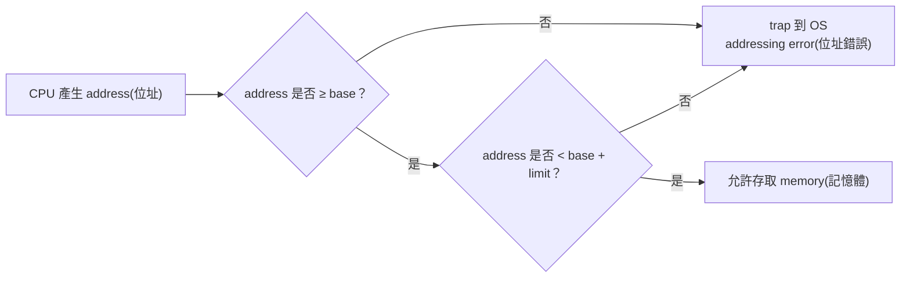

## ⭐記憶體管理背景與 Base/Limit — OS 為什麼不能讓程式隨便碰記憶體？

講義位置：PDF viewer page 3 ~ PDF viewer page 4

### 1. 這一章在處理什麼問題？

Chapter 8 的大問題是：**程式要執行，一定要進入 memory(記憶體)，但 memory 是大家共用的，所以 OS 必須決定「放哪裡、怎麼保護、怎麼轉換位址、怎麼有效利用空間」。**

講義 p.3 先給幾個核心事實：

| 講義事實                                                               | 直覺意思                                           |
| ------------------------------------------------------------------ | ---------------------------------------------- |
| Program must be brought into memory                                | 程式放在 disk(磁碟) 上不能直接跑，必須載入 memory 才能執行          |
| Main memory and registers are only storage CPU can access directly | CPU 真正能直接碰的是 register(暫存器) 與 main memory(主記憶體) |
| Register access is very fast; main memory can take many cycles     | register 很快，memory 慢很多，所以需要 cache(快取) 幫忙       |
| Protection is required                                             | 不可以讓一個 process(行程) 亂讀亂寫別人的記憶體或 OS 的記憶體         |

生活化一點想：memory 像宿舍，每個 process 都住一間房。CPU 像管理員。沒有保護機制時，一個 process 可能拿鑰匙亂開別人的房間，甚至闖進 OS 的管理室。Memory management(記憶體管理) 就是在規定：誰住哪裡、鑰匙怎麼檢查、越界怎麼處理。

---

### 2. Base and Limit Registers(基底與界限暫存器)在保護什麼？

p.4 的重點是：**用一組 base register(基底暫存器) 和 limit register(界限暫存器) 定義某個 user process 可以合法碰的 logical address space(邏輯位址空間)。**

最核心規則：

| 名稱                    | 作用                                           |
| --------------------- | -------------------------------------------- |
| Base Register(基底暫存器)  | 記錄這個 process 在 physical memory(實體記憶體) 中的起始位置 |
| Limit Register(界限暫存器) | 記錄這個 process 可以使用的範圍大小                       |
| CPU check(檢查)         | 每次 user mode(使用者模式) 記憶體存取都要檢查是否落在合法範圍內       |

p.4 的圖示大意是：CPU 產生一個 address(位址) 後，硬體會先檢查它是否在 base 與 base+limit 的範圍內；合法才讓它進 memory，不合法就 trap(陷入) 到 OS，通常是 addressing error(位址錯誤)。

---

### 3. 用一個最小例子看懂

假設某 process 的合法區間如下：

| 暫存器            |      值 |
| -------------- | -----: |
| Base Register  | 300040 |
| Limit Register | 120900 |

這代表它可以碰的 physical address(實體位址) 大致是：

| 合法範圍            | 說明                     |
| --------------- | ---------------------- |
| 300040 ~ 420939 | 從 base 開始，最多 limit 這麼長 |

所以：

| CPU 想碰的位址 | 判斷  | 原因                          |
| --------: | --- | --------------------------- |
|    300100 | 合法  | 在 base 之後，而且還沒超過 base+limit |
|    420000 | 合法  | 仍在範圍內                       |
|    250000 | 不合法 | 小於 base，可能碰到 OS 或別的 process |
|    500000 | 不合法 | 超過這個 process 的界限            |

最短記法：**base 決定起點，limit 決定長度；每次 memory access 都要檢查是否越界。**

---

### 4. 這裡最容易錯的點

第一個常見錯法是把 base 和 limit 都當成「絕對位址」。比較正確的理解是：base 是起始 physical address，而 limit 是可用範圍大小，不是結束位址本身。

第二個常見錯法是以為這只是軟體規則。其實講義 p.4 的重點是 CPU 每次在 user mode 產生 memory access 時都必須檢查，這需要硬體支援，否則只靠程式自律沒有保護力。

第三個常見錯法是只背「保護 memory」，但不知道保護誰。它保護三件事：保護 OS 不被 user process 改壞、保護 process 之間互不侵犯、保護 process 自己不亂跑到不該碰的範圍。



---

### 5. 考試輸出方式

這一頁通常不會只問你背定義，而是問你：

| 題型                     | 你要會輸出什麼                                                |
| ---------------------- | ------------------------------------------------------ |
| Concept explanation    | 說明 base/limit 如何保護記憶體                                  |
| Boundary check         | 給 base、limit、address，判斷是否合法                            |
| Error diagnosis        | 指出某個 process 為什麼會 trap                                 |
| Compare later concepts | 後面會拿它和 relocation register、paging、segmentation 的保護方式比較 |

目前考古題 Q9 會比較 contiguous allocation、segmentation、paging 在 external fragmentation、internal fragmentation、code sharing 上的差異；這跟 Chapter 8 高度相關，但要等我們照講義走到 p.14 以後，處理完 contiguous memory allocation、paging、segmentation 才能正式練。


## ⭐Address Binding — 程式的位址到底什麼時候被決定？

講義位置：PDF viewer page 5 ~ PDF viewer page 6

### 1. 這個概念在解決什麼問題？

Address Binding(位址連結)在問一個很實際的問題：

**程式寫好的時候，裡面會有很多 address(位址)。但它最後被放到 memory(記憶體) 的哪個位置，不一定一開始就知道。那這些位址要什麼時候變成真正可用的記憶體位置？**

生活化例子：你寫程式時像是在寫「我要住 A 房間」。但真正入住時，宿舍管理員可能說：「A 房滿了，你改住 3 樓 307。」Address Binding 就是在決定：這個「改住哪裡」是在編譯時就決定、載入時決定，還是執行中動態決定。

---

### 2. Compile-time Binding(編譯時間連結)

Compile-time binding 是由 compiler(編譯器) 在 compile time(編譯時間) 就決定程式將來的起始位址。講義 p.5 說，這種方式的問題是：如果決定好的位址已經有其他程式在執行，或之後想改程式起始位址，就必須 recompile(重新編譯)。

它的直覺是：還沒搬家前，地址就被寫死了。

| 特性    | 說明                   |
| ----- | -------------------- |
| 由誰決定  | compiler(編譯器)        |
| 何時決定  | compile time(編譯時間)   |
| 位址可否改 | 幾乎不能改                |
| 缺點    | 位置不彈性，換位置要 recompile |

---

### 3. Load-time Binding(載入時間連結)

Load-time binding 是由 linking loader 或 linkage editor 在 load time(載入時間) 決定。程式不一定從固定位置開始，因此支援 relocation(重定位)。但講義也提到缺點：即使 execution time(執行時間) 沒有呼叫到的模組，也可能需要先 linking、allocation、loading，會浪費時間與記憶體；而且程式執行期間仍不能改變起始位址。

它的直覺是：搬家那一刻才決定你住哪間，但搬進去之後就不能再換房。

| 特性   | 說明                         |
| ---- | -------------------------- |
| 由誰決定 | loader/linkage editor      |
| 何時決定 | load time(載入時間)            |
| 優點   | 比 compile-time binding 彈性高 |
| 缺點   | 執行中不能改起始位置；可能先載入沒用到的模組     |

---

### 4. Execution-time Binding(執行時間連結)／Dynamic Binding(動態連結)

Execution-time binding 是由 OS 在 execution time(執行時間) 動態決定，又稱 dynamic binding。講義 p.6 說它需要 Memory-Management Unit, MMU(記憶體管理單元) 這類額外硬體支援。p.6 也說 Base Register(基底暫存器) 記錄目前程式的起始位址，Local Address(區域位址) 要和 base register 相加，才得到 physical address(實體位址)。

最小流程：

| 步驟 | 動作                                               |
| -- | ------------------------------------------------ |
| 1  | CPU 產生 local address(區域位址)                       |
| 2  | MMU 讀 base register(基底暫存器)                       |
| 3  | physical address = base register + local address |
| 4  | memory 用 physical address 實際存取資料                 |

例如：

| base register | local address | physical address |
| ------------: | ------------: | ---------------: |
|         14000 |           346 |            14346 |

所以 p.6 圖上的重點不是只背「dynamic binding 很彈性」，而是要知道：**程式執行時看到的位址可以先是 local/logical 形式，真正送到 memory 前再由硬體轉成 physical address。**

---

### 5. 三種 Binding 的核心差異

| Binding 時機     | 誰決定起始位址               | 彈性 | 代價                         |
| -------------- | --------------------- | -- | -------------------------- |
| Compile time   | compiler              | 最低 | 換位置通常要 recompile           |
| Load time      | loader/linkage editor | 中等 | 執行中不能移動；可能預先載入沒用到的模組       |
| Execution time | OS + MMU              | 最高 | 需要硬體支援，執行較慢，performance 較差 |

最短記法：

**越晚 binding，彈性越高；越晚 binding，硬體與執行成本也越高。**

---

### 6. 常見錯法

第一個錯法是把 Address Binding(位址連結)跟 Dynamic Linking(動態鏈結)混在一起。Address Binding 是在問「位址何時決定」；Dynamic Linking 是後面會講的「library(函式庫)何時連結／載入」。兩者名字都有 dynamic，但核心問題不同。

第二個錯法是把 base register 當成保護用的唯一概念。這裡 p.6 的 base register 更偏向 relocation(重定位)：local address 加 base 得到 physical address。p.4 的 base/limit 則偏向保護合法範圍。這兩個會在後面連續記憶體配置再次合流。

第三個錯法是以為 execution-time binding 一定最好。它彈性最高，但講義明確列出缺點：程式執行較慢、performance 較差，因為每次位址轉換都需要額外硬體與步驟。


## ⭐Logical Address vs Physical Address — CPU 想到的位址和記憶體看到的位址為什麼不一定一樣？

講義位置：PDF viewer page 7

### 1. 這個概念在解決什麼問題？

上一頁 Address Binding(位址連結)剛講完：程式執行時，CPU 產生的位址可能要經過 MMU(記憶體管理單元)轉換，才會變成真正送到 memory(記憶體)的位址。

所以 p.7 接著問的是：

**CPU 產生的 address(位址)，和 memory 實際看到的 address，是不是同一個東西？**

答案是：不一定。

講義 p.7 定義：

| 名稱                     | 講義意思                                                | 直覺理解           |
| ---------------------- | --------------------------------------------------- | -------------- |
| Logical Address(邏輯位址)  | CPU 所產生的位址                                          | 程式「以為自己在用」的位址  |
| Physical Address(實體位址) | memory unit 所看到的位址，也就是放入 memory-address register 的值 | 實體記憶體「真的收到」的位址 |

講義 p.7 明確說，CPU 所產生的位址通常稱為 logical address，而記憶體單元所看到的位址通常稱為 physical address。

---

### 2. 為什麼需要分成兩種位址？

原因是 OS 不想讓程式直接知道或控制自己在 physical memory(實體記憶體)中的真正位置。

生活化例子：你寄包裹時只寫「收件人：王小明，宿舍 A 棟」。你不一定知道物流中心最後怎麼把包裹路由到哪個貨架、哪台車、哪個分撥點。對你來說是「邏輯地址」，對物流系統來說才有「實體位置」。

同理：

| 角色                    | 看到的位址            |
| --------------------- | ---------------- |
| CPU / program         | logical address  |
| MMU / memory hardware | physical address |

這樣 OS 可以把 process(行程)搬來搬去、做 relocation(重定位)、做 protection(保護)、甚至後面做 paging(分頁)與 virtual memory(虛擬記憶體)。

---

### 3. 用 p.7 圖示重新看一次轉換

p.7 圖示中有：

| 元件／數值                       | 意思                 |
| --------------------------- | ------------------ |
| logical address = 346       | CPU 產生的位址          |
| relocation register = 14000 | 目前 process 的起始實體位置 |
| physical address = 14346    | memory 最後看到的位址     |

轉換規則是：

physical address = relocation register + logical address

所以：

| relocation register | logical address | physical address |
| ------------------: | --------------: | ---------------: |
|               14000 |             346 |            14346 |

注意：這裡的重點不是加法很難，而是**同一個程式看到的 346，不代表實體記憶體真的用 346。真正送進 memory 的可能是 14346。**

---

### 4. 最容易混淆的地方

第一個錯法：把 logical address 誤以為是假的、不重要的位址。其實對程式來說，它就是程式正常使用的位址；只是 memory hardware 最後不一定直接用它。

第二個錯法：以為 physical address 是 CPU 一開始就產生的。依照 p.7 的定義，CPU 產生的是 logical address；memory unit 看到的是 physical address。中間可能經過 MMU 或 relocation register 轉換。

第三個錯法：把這一頁和前一頁割裂。其實 p.7 是 p.6 execution-time binding 的延伸：p.6 說 local address 加 base register 得 physical address；p.7 正式把 CPU 產生的 address 稱為 logical address，把 memory 看到的 address 稱為 physical address。

最短記法：

**CPU 產生 logical address；memory 看到 physical address；MMU 負責中間轉換。**


!!! danger

    ### MMU(Memory-Management Unit，記憶體管理單元) 是啥？

    MMU 主要做 address translation(位址轉換) 和 protection check(保護檢查)

    假設：

    base register = 14000
    CPU 產生 logical address = 346

    MMU 做的事就是：

    physical address = base + logical address = 14000 + 346 = 14346
    


## ⭐Dynamic Loading — 為什麼程式不要一開始就把所有東西都載入記憶體？

講義位置：PDF viewer page 8 ~ PDF viewer page 9

### 1. 這個概念在解決什麼問題？

Dynamic Loading(動態載入)要解決的是：**有些 library(函式庫)或 subroutine(副程式)不一定會用到，如果一開始全部載入 main memory(主記憶體)，會浪費記憶體空間。**

想像一個程式有錯誤處理模組：
正常情況下根本不會發生錯誤，所以錯誤處理模組可能完全不會被呼叫。若程式一開始就把它載入記憶體，就會浪費空間。

Dynamic Loading 的想法是：

> 主程式先執行；等到真的需要某個副程式或 library 時，才把那個部分從 disk(磁碟)載入 main memory。

講義 p.8 說明，Dynamic Loading 是由 programmer(程式設計師)在程式執行過程中動態決定要載入哪些 libraries，而且不需要 OS 特別支援；OS 只提供一些函式庫讓 programmer 實作動態載入。

---

### 2. Dynamic Loading 的基本流程

流程可以想成 5 步：

| 步驟 | 發生什麼事                                                                     |
| -- | ------------------------------------------------------------------------- |
| 1  | 主程式已經在 main memory 中執行                                                    |
| 2  | 主程式呼叫某個副程式                                                                |
| 3  | 系統先檢查該副程式是否已經在 memory 裡                                                   |
| 4  | 若不在 memory，就呼叫 relocatable linking loader(可重定位鏈結載入程式)                     |
| 5  | loader 把需要的程式載入 main memory，更新 process address table(行程位址表)，再把控制權交給新載入的程式 |

講義也提到，這些副程式會以 relocatable load format(可重定位載入格式)存放在 disk 中；需要時才載入。

---

### 3. 最小例子：錯誤處理副程式

==假設== 一個程式有兩個部分：

==這邊只是要說假設一個程式有兩個部分，負責處理錯誤的程式不會一開始就載入，出錯時，需要用到用來解決錯誤的時候才會載入==

| 程式部分                   |      使用頻率 | 是否一開始載入      |
| ---------------------- | --------: | ------------ |
| main program(主程式)      |     一定會執行 | 是            |
| error_handler(錯誤處理副程式) | 只有出錯時才會用到 | 不一定，等真的出錯再載入 |

如果程式正常執行，`error_handler` 完全不載入 memory。
如果程式發生錯誤，主程式才呼叫 loader，把 `error_handler` 載入 memory。

這樣的好處是：**不常用的 code 不會一開始就佔用 main memory。**

---

### 4. 優點與缺點

Dynamic Loading 的優點是節省 main memory 空間。講義 p.9 也提到，programmer 可以呼叫 loader，因此彈性較高。

但缺點也很明顯：

| 面向                         | 說明                                   |
| -------------------------- | ------------------------------------ |
| Programmer burden(程式設計師負擔) | 需要 programmer 自己規劃哪些部分何時載入           |
| Execution time(執行時間)       | 需要時才載入，可能拖長執行時間                      |
| 歷史性方法                      | 講義提到它是較古老的方法，例如 MS-DOS Overlay files |

所以 Dynamic Loading 的核心 trade-off(取捨)是：

> 省 memory，但增加 programmer 負擔，也可能讓執行變慢。

---

### 5. 最短記法

Dynamic Loading(動態載入)：**程式執行中，真的呼叫到某個 library/subroutine 時，才把它載入 memory。**

考試寫法可以抓三句：

1. It loads a routine only when it is called.
2. It saves main memory space.
3. It increases programmer burden and may slow down execution.


## ⭐Linking、Static Linking、Dynamic Linking — 函式庫到底什麼時候被放進程式裡？

講義位置：PDF viewer page 10 ~ PDF viewer page 11

### 1. 這個概念在解決什麼問題？

上一個知識點 Dynamic Loading(動態載入)問的是：「某個 routine 什麼時候才載入 memory？」

現在 p.10 ~ p.11 問的是另一個更偏程式組裝的問題：

**程式要使用 library(函式庫)時，library 的 code 是什麼時候被接到程式裡？**

講義先區分 library 和 executable file(可執行檔)：

| 名稱                    | 意思                          |
| --------------------- | --------------------------- |
| Executable file(可執行檔) | 可以獨立執行的程式                   |
| Library(函式庫)          | 不是獨立程式，而是提供其他程式使用的 code 或服務 |

所以 Linking(鏈結)就是：

**把一個或多個 library 包含到程式中，讓程式可以呼叫那些 library 的功能。**

講義 p.10 說 Linking 有兩種主要形式：Static Linking(靜態鏈結)與 Dynamic Linking(動態鏈結)。

---

### 2. Static Linking(靜態鏈結)：先塞進 executable

Static Linking 的做法是：

**在 link time(鏈結時間)，linker(鏈結器)就把 static library 的內容加入 executable program(可執行程式)中。**

也就是說，程式還沒真正執行前，library code 就已經被包進 executable 裡。

直覺例子：

你要交作業時，把所有可能用到的附件全部印出來，直接裝訂進同一本報告。之後帶著這本報告就可以獨立使用，不必再去找附件。

優點是簡單、執行時不太需要再找外部 library。
但講義 p.10 強調它的主要缺點是：

**產生的 executable file 會太大，裝入 memory 時需要更多系統資源，也會消耗更多時間。**

---

### 3. Dynamic Linking(動態鏈結)：真的呼叫到才由 OS 載入

Dynamic Linking 又稱 Shared Library(共用函式庫)。它的做法是：

**程式執行期間，當某個 module(模組)真的被呼叫時，才由 OS 的 loader 把它載入 main memory。**

這裡和 Static Linking 最大差異是：library code 不會一開始就完整塞進每個 executable。

講義 p.11 也提到例子：

| 系統           | Dynamic Linking 的常見名稱     |
| ------------ | ------------------------- |
| Windows      | DLL(dynamic link library) |
| UNIX / Linux | Shared Library            |

Dynamic Linking 的重要優點是：多個 application(應用程式)可以共用同一份 library copy，所以 OS 不需要為每個程式都載入一份重複的 library。

---

### 4. Static Linking vs Dynamic Linking

| 比較點           | Static Linking(靜態鏈結)     | Dynamic Linking(動態鏈結)        |
| ------------- | ------------------------ | ---------------------------- |
| library 何時處理  | link time 就加入 executable | execution time 真的呼叫到才載入      |
| executable 大小 | 較大                       | 較小                           |
| memory 使用     | 多個程式可能各帶一份 library code  | 多個程式可共享同一份 library           |
| 講義強調缺點／優點     | 缺點是 executable 太大、載入耗資源  | 優點是 shared library 可避免多份重複載入 |

最短比較：

**Static Linking 是「先包進 executable」；Dynamic Linking 是「執行時呼叫到才載入，而且可以共享」。**

---

### 5. Dynamic Loading vs Dynamic Linking 最容易混

這兩個名字很像，而且都會出現「執行時才載入」，但講義分成兩個點講，考試也很容易混。

| 比較點     | Dynamic Loading(動態載入)         | Dynamic Linking(動態鏈結)                 |
| ------- | ----------------------------- | ------------------------------------- |
| 核心問題    | routine 什麼時候載入 memory？        | library 什麼時候被鏈結／載入？                   |
| 主要負責者   | programmer 規劃，呼叫 loader       | OS loader 處理 shared library           |
| OS 特別支援 | 講義說不需要 OS 特別支援                | 需要 OS 支援 shared library 載入與共享         |
| 主要優點    | 沒用到的 routine 不佔 main memory   | 多個 application 可共享同一份 library         |
| 常見例子    | error-handling routine 需要時才載入 | Windows DLL、UNIX/Linux Shared Library |

最短記法：

**Dynamic Loading 偏「程式設計師手動安排載入」；Dynamic Linking 偏「OS 幫多個程式共享函式庫」。**

!!! danger

    ### Binding、Linking、Loading 要怎麼區分

    #### 1\. 直接區分法

    最短記法：

    **Binding 問「位址在哪裡？」**  
    **Linking 問「函式庫怎麼接進程式？」**  
    **Loading 問「程式／模組什麼時候被搬進 main memory？」**

    ---

    #### 2\. 三者比較表

    | 名詞 | 中文 | 核心問題 | 你要抓的關鍵字 | 最容易混的地方 |
    | --- | --- | --- | --- | --- |
    | `Binding` | 位址連結 | 程式的起始位址什麼時候決定？ | address、starting address、base、MMU、relocation | 不要把它寫成「載入函式庫」 |
    | `Linking` | 鏈結／連結 | library code 怎麼被接到程式？ | library、static library、shared library、executable | 不要把它寫成「決定程式起始位址」 |
    | `Loading` | 載入 | code / routine / process 什麼時候進 main memory？ | load、main memory、disk、loader | 不要把它寫成「鏈結函式庫」 |

    講義中 `Address Binding(位址連結)` 明確是在講「決定程式起始位置，也就是程式要在記憶體哪個地方開始執行」，而且有 compile time、load time、execution time 三種時期。
        
    


## ⭐Swapping — 記憶體不夠時，process 可以暫時搬去哪裡？

講義位置：PDF viewer page 12 ~ PDF viewer page 13

### 1. 這個概念在解決什麼問題？

Swapping(置換)要解決的問題是：

**Process(行程)必須在 main memory(主記憶體)中才能執行，但 main memory 空間有限，所以 OS 可以把暫時不用的 process 搬出去，之後再搬回來繼續執行。**

講義 p.12 的核心敘述是：

* 一個 process 必須在 memory 中才能執行。
* 但 process 可以暫時被 swapped out 到 backing store(備份儲存體)。
* 之後再 swapped in 回 memory，繼續執行。
* 這件事由 mid-term scheduler(中程排班器)負責。

直覺例子：

你的書桌很小，只能放幾本正在看的書。暫時不用的書可以先放回書櫃；等需要時再拿回桌上。
在 OS 裡：

| 類比     | OS 對應         |
| ------ | ------------- |
| 書桌     | main memory   |
| 書櫃     | backing store |
| 把書放回書櫃 | swap out      |
| 把書拿回書桌 | swap in       |

---

### 2. Swap out 與 swap in

Swapping 有兩個方向：

| 動作       | 意思                                       |
| -------- | ---------------------------------------- |
| swap out | 把 process 從 main memory 搬到 backing store |
| swap in  | 把 process 從 backing store 搬回 main memory |

注意：
Swapping 不是把 process 刪掉，也不是 process 結束。
它只是讓 process 暫時離開 main memory，之後還可以回來繼續執行。

所以考試常見寫法是：

**Swapping temporarily moves a process out of main memory to a backing store and later brings it back into memory for continued execution.**

---

### 3. 為什麼 Swapping 很花時間？

!!! danger

    p.13 接著算 swapping transfer time(置換傳輸時間)。

    核心公式很直覺：

    **transfer time = process size / transfer rate**

    也就是：

    | 量             | 意思                            |
    | ------------- | ----------------------------- |
    | process size  | 要搬出去或搬回來的 process 大小          |
    | transfer rate | disk / backing store 每秒能傳多少資料 |
    | transfer time | 搬一次需要多久                       |

    講義 p.13 的範例是：

    * process size = 10 MB
    * backing store transfer rate = 40 MB/s
    * 不考慮 disk seek time
    * average latency time = 8 ms

    先算純傳輸時間：

    `10 MB / 40 MB/s = 1/4 s = 250 ms`

    再加上 latency：

    `250 ms + 8 ms = 258 ms`

    這是一次方向的時間，也就是：

    | 動作          |     時間 |
    | ----------- | -----: |
    | swap out 一次 | 258 ms |
    | swap in 一次  | 258 ms |

    因為完整交換通常是雙向的：一個 process 換出，另一個 process 換入。
    所以總 swapping time：

    `258 ms × 2 = 516 ms`

    講義 p.13 的結論也是總共需要 516 ms。

---

### 4. 最小非題目型示範

假設有一個 process 大小是 20 MB，backing store transfer rate 是 100 MB/s，latency 是 5 ms。

先算一次 transfer time：

`20 MB / 100 MB/s = 0.2 s = 200 ms`

加上 latency：

`200 ms + 5 ms = 205 ms`

若只問一次 swap out：答案是 `205 ms`。
若問完整 swap out + swap in：答案是：

`205 ms × 2 = 410 ms`

重點是不要漏掉題目問的是「單向」還是「雙向」。

---

### 5. 常見錯法

| 錯法                          | 為什麼錯                                   |
| --------------------------- | -------------------------------------- |
| 把 swapping 當成 process 結束    | Swapping 只是暫時搬出 memory，之後可搬回來繼續執行      |
| 忘記 backing store            | process 不是搬到「空氣中」，而是搬到 backing store   |
| 忘記 mid-term scheduler       | 講義明確說 swapping 由 mid-term scheduler 負責 |
| transfer time 只算一次，但題目問完整交換 | 若題目說 swap out + swap in，就要乘 2          |
| 把 ms 和 s 混在一起               | `1 s = 1000 ms`，單位要先統一                 |


## ⭐Contiguous Memory Allocation — OS 要怎麼把一個 process 放進連續的實體記憶體？

講義位置：PDF viewer page 14

### 1. 這個概念在解決什麼問題？

Contiguous Memory Allocation(連續記憶體配置)要解決的問題是：

**當一個 process 要放進 main memory 時，OS 要找一整塊「連續」且夠大的 free memory block 給它使用。**

這裡的關鍵字是 **contiguous(連續)**。

也就是說，如果一個 process 需要 200 KB，OS 不能隨便找 100 KB + 100 KB 兩塊分散的洞湊起來。
在 contiguous allocation 裡，OS 要找的是一整段連續的 200 KB 空間。

講義 p.14 說，OS 會依據 process 的大小，找一塊夠大的連續可用記憶體配置給它；而 free blocks 會用 Linked List(鏈結串列)管理，稱為 Available list。

---

### 2. Available list(可用串列)：OS 怎麼記住哪裡還有空間？

OS 需要知道 main memory 裡有哪些 free blocks(可用區塊)。

所以它會維護一份 Available list：

| 項目             | 意思                                      |
| -------------- | --------------------------------------- |
| Free block     | 目前還沒被 process 使用的記憶體區塊                  |
| Available list | OS 用來記錄 free blocks 的 Linked List       |
| 配置動作           | OS 從 Available list 找一塊夠大的連續區塊給 process |

直覺例子：

你要在停車場找一個位置停大巴士。
大巴士不能分成兩半停，所以你要找的是一整排夠長的連續空位，不是零散空位總和夠就好。

---

### 3. 為什麼還需要 relocation register 和 limit register？

Contiguous allocation 還有一個大問題：

**如果每個 process 都被放在實體記憶體的某一段，那要怎麼防止它亂存取別人的記憶體或 OS 的記憶體？**

講義 p.14 用 relocation-register scheme 來做 protection(保護)：

| 暫存器                 | 功能                                             |
| ------------------- | ---------------------------------------------- |
| Relocation register | 存放這個 process 在 physical memory 中的最小起始位址        |
| Limit register      | 存放這個 process 的 logical address range，也就是它能用的範圍 |
| 檢查規則                | 每個 logical address 必須小於 limit register         |

所以邏輯是：

1. CPU 產生 logical address。
2. OS / hardware 檢查 logical address 是否小於 limit。
3. 如果合法，就用 relocation register 加上 logical address，得到 physical address。
4. 如果不合法，就代表 process 想碰超出自己範圍的記憶體，應該阻止。

---

### 4. 最小非題目型示範

假設某 process 被放在 physical memory 的起點 `10000`，大小範圍是 `3000`。

所以：

| 暫存器                 |     值 |
| ------------------- | ----: |
| Relocation register | 10000 |
| Limit register      |  3000 |

這代表合法 logical address 是：

`0 ~ 2999`

如果 CPU 產生 logical address `2500`：

`physical address = 10000 + 2500 = 12500`

這是合法的。

但如果 CPU 產生 logical address `3200`：

`3200 >= 3000`

這超過 limit，所以不合法，不能轉成 physical address。

---

### 5. 最短記法

Contiguous Memory Allocation：

**OS 找一塊夠大的連續 free block 給 process；Available list 記錄 free blocks；relocation register 決定起點，limit register 決定可用範圍。**

最容易錯的是：

**總 free memory 夠，不代表 contiguous allocation 一定能配置；它需要一整塊連續空間。**

這個錯法會在後面 external fragmentation(外部斷裂)正式處理。


## ⭐First Fit、Best Fit、Worst Fit — OS 要怎麼從 Available list 裡選一塊洞？

講義位置：PDF viewer page 15 ~ PDF viewer page 17

### 1. 這個概念在解決什麼問題？

上一頁 p.14 已經說：Contiguous Memory Allocation(連續記憶體配置)需要 OS 找一塊夠大的連續 free block 給 process。

現在 p.15 問的是：

**如果 Available list 裡有很多塊 free blocks，OS 到底要選哪一塊？**

這就是記憶體配置策略。講義列出三種：

| 策略        | 中文   | 核心規則                                                         |
| --------- | ---- | ------------------------------------------------------------ |
| First fit | 最先配合 | 從 Available list 的 head 開始找，遇到第一個 `free block size >= n` 就配置 |
| Best fit  | 最佳配合 | 搜尋所有 free blocks，找「夠大且最接近 n」的那一塊                             |
| Worst fit | 最差配合 | 搜尋所有 free blocks，找配置後剩最多空間，也就是 `size - n` 最大的那一塊             |

這裡的 `n` 是 process 需要的 memory size。

---

### 2. First fit(最先配合)

First fit 的直覺是：

**從 Available list 前面開始找，第一個夠大的洞就用。**

例子：

Available list 依序是：

| 順序 | Free block |
| -: | ---------: |
|  1 |     100 KB |
|  2 |     500 KB |
|  3 |     200 KB |
|  4 |     300 KB |
|  5 |     600 KB |

Process 需要 `212 KB`。

First fit 會從前面開始看：

| Free block | 是否夠 212 KB？ |
| ---------: | ----------- |
|     100 KB | 不夠          |
|     500 KB | 夠，直接選它      |

所以 First fit 選 `500 KB`。

重點：First fit 不一定選最小夠用的，它只選「第一個夠用的」。

---

### 3. Best fit(最佳配合)

Best fit 的直覺是：

**全部看完，選剛好最接近需求的那一塊。**

同樣 process 需要 `212 KB`，free blocks 是：

`100 KB, 500 KB, 200 KB, 300 KB, 600 KB`

夠大的有：

| Free block |   剩餘空間 |
| ---------: | -----: |
|     500 KB | 288 KB |
|     300 KB |  88 KB |
|     600 KB | 388 KB |

Best fit 會選剩最少、最接近 212 KB 的 `300 KB`。

講義也提醒：Best fit 長期而言會剩下很大的洞和很小的洞。

---

### 4. Worst fit(最差配合)

Worst fit 的直覺是：

**全部看完，選最大的洞，讓剩下的洞也盡量還有一定大小。**

同樣 process 需要 `212 KB`：

| Free block |   剩餘空間 |
| ---------: | -----: |
|     500 KB | 288 KB |
|     300 KB |  88 KB |
|     600 KB | 388 KB |

Worst fit 選 `600 KB`，因為 `600 - 212 = 388 KB` 最大。

講義說 Worst fit 長期結果是每個洞大小差不多。

---

### 5. p.16 的立即缺點：還是會有 external fragmentation

不管用 First fit、Best fit 還是 Worst fit，本質仍然是 contiguous allocation，所以仍會遇到 External Fragmentation(外部碎裂)。

External Fragmentation 的直覺是：

**總可用空間明明夠，但因為不連續，所以 process 還是放不進去。**

例如：

| Free block |
| ---------: |
|     100 KB |
|     100 KB |
|     100 KB |

總 free memory 是 `300 KB`，但如果 process 需要一整塊 `250 KB`，它仍然不能被配置，因為沒有任何一塊連續 free block 達到 `250 KB`。

p.16 也提醒：配置後剩下的極小 Free Blocks 仍會留在 Available list 裡，這會增加 Search Time(搜尋時間)與記錄成本。

---

### 6. p.17 Example 8.16：講義範例怎麼看？

講義 p.17 給的 free blocks 是：

`100 KB, 500 KB, 200 KB, 300 KB, 600 KB`

Processes 依序需要：

`212 KB, 417 KB, 112 KB, 426 KB`

講義列出的結果是：

| 策略        | 講義列出的配置結果                        |
| --------- | -------------------------------- |
| First fit | `500 KB, 600 KB, 200 KB, wait`   |
| Best fit  | `300 KB, 500 KB, 200 KB, 600 KB` |
| Worst fit | `600 KB, 500 KB, 300 KB, wait`   |

這裡要注意一個考試風險：講義 p.17 是用「被選到的原始 free block 大小」呈現結果，沒有展開每次配置後剩餘 hole 的完整 AV-list trace。若考題要求你「更新 Available list」或「列出每一步剩餘 free blocks」，就必須依題目條件追蹤 remainder；若考題只問講義這種配置結果，就照講義的表示法列出被選到的 block。

最短記法：

**First fit 看順序，Best fit 看最接近，Worst fit 看剩最多。**


## ⭐Fragmentation — 為什麼記憶體總量夠，OS 還是可能放不下 process？

講義位置：PDF viewer page 18 ~ PDF viewer page 20

### 1. Fragmentation(斷裂)在解決什麼問題？

前面 p.15 ~ p.17 講的是 OS 怎麼選 free block：First fit、Best fit、Worst fit。

現在 p.18 ~ p.20 要問更根本的問題：

**即使 OS 很努力分配記憶體，為什麼記憶體還是會被浪費？**

這種浪費就叫 Fragmentation(斷裂)。

它有兩種核心型態：

| 類型                     | 中文   | 浪費發生在哪裡                              |
| ---------------------- | ---- | ------------------------------------ |
| External Fragmentation | 外部斷裂 | process 外面：free memory 被切成很多不連續小洞    |
| Internal Fragmentation | 內部斷裂 | process 裡面：OS 配給 process 的空間比它真正需要的多 |

---

### 2. External Fragmentation(外部斷裂)

External Fragmentation(外部斷裂)的定義是：

**所有可用記憶體空間總和大於某個 process 所需空間，但因為這些 free blocks 不連續，所以無法配置給該 process，造成 memory 閒置。**

直覺例子：

| Free block |
| ---------: |
|     100 KB |
|     200 KB |
|     300 KB |

總 free memory 是：

`100 + 200 + 300 = 600 KB`

如果某 process 需要 `400 KB`，總量明明夠，但沒有任何一塊單獨的 contiguous free block 達到 `400 KB`。

所以配置失敗。

這就是 external fragmentation。

最短記法：

**總量夠，但不連續，所以放不下。**

---

### 3. 50-percent rule(百分之五十規則)

講義 p.18 提到 50-percent rule(百分之五十規則)。

它的意思是：

如果有 `N` 個已配置區間，因為 fragmentation 可能額外損失大約 `0.5N` 的空間，所以大約三分之一的記憶體可能沒有被利用。

你不需要把它想成精準公式題；這裡的重點是：

**External fragmentation 不是小問題，它可能造成相當比例的記憶體被浪費。**

考試寫概念時可以說：

**The 50-percent rule states that for N allocated blocks, about 0.5N additional blocks may be lost due to fragmentation, so roughly one-third of memory may be unusable.**

!!! danger

    N 是有分配，可能有 0.5N 沒分配，總共是 1.5N ，0.5N 在 1.5N裡面佔了 1/3，所以總空間會有 1/3 沒有被利用

---

### 4. Compaction(壓縮／緊縮)

p.19 給第一種解法：Compaction(壓縮)。

Compaction 的概念類似磁碟重組：

**移動執行中的 process，把分散的 free blocks 聚集成一塊夠大的連續 free block。**

例如原本是：

| 區塊          |
| ----------- |
| Process A   |
| Free 100 KB |
| Process B   |
| Free 200 KB |
| Process C   |
| Free 300 KB |

Compaction 後可以變成：

| 區塊          |
| ----------- |
| Process A   |
| Process B   |
| Process C   |
| Free 600 KB |

這樣原本放不下 `400 KB` process，現在就放得下了。

但 Compaction 有兩個問題：

| 問題                           | 說明                             |
| ---------------------------- | ------------------------------ |
| 很難快速決定最佳壓縮策略                 | 要移動哪些 process、移去哪裡，不一定容易       |
| process 必須支援 dynamic binding | 因為 process 在執行中被搬位置，位址必須能動態重定位 |

這裡要連回前面 p.5 ~ p.6 的 Address Binding：
如果 process 的 physical location 在執行中可能改變，就需要 execution-time binding / dynamic binding 支援。

---

### 5. Page memory management(分頁式記憶體管理)作為方向

p.19 也列出 Page memory management 作為解決方向。

這裡先只抓一個直覺，不展開 paging 細節：

**如果不要求 process 一定要放在一整塊連續 physical memory，就可以避開 external fragmentation。**

也就是說，contiguous allocation 的根本限制是「一定要連續」。
Page memory management 的方向是把 process 切成固定大小的 pieces，分散放到不同 frames，之後再靠位址轉換讓 process 看起來仍可正常執行。

但 paging 的完整機制還沒到本輪主線，後面會依講義順序處理；本輪只先把它記為「解 external fragmentation 的方向」。

---

### 6. Internal Fragmentation(內部斷裂)

p.20 換成另一種浪費：Internal Fragmentation(內部斷裂)。

Internal Fragmentation 的定義是：

**OS 配置給 process 的 memory 空間大於 process 真正需要的空間，多出來的空間 process 用不到，也不能給其他 process 使用，所以形成浪費。**

直覺例子：

假設 OS 每次都以 `4 KB` 為單位配置 memory。
某 process 實際只需要 `10 KB`。

OS 不能剛好給 `10 KB`，可能要給：

`12 KB`

那多出來的：

`12 KB - 10 KB = 2 KB`

就在 process 配置區內部浪費掉。這就是 internal fragmentation。

最短記法：

**給太多，多出來的在 process 裡面浪費。**

---

### 7. External vs Internal：最重要比較

| 比較點   | External Fragmentation            | Internal Fragmentation               |
| ----- | --------------------------------- | ------------------------------------ |
| 浪費位置  | process 外面                        | process 裡面                           |
| 核心原因  | free blocks 分散、不連續                | 配置單位大於實際需求                           |
| 典型句子  | 總 free memory 夠，但沒有一塊連續空間夠大       | allocated memory 大於 requested memory |
| 解法方向  | compaction、page memory management | 減少 page size 可降低浪費                   |
| 代價／限制 | compaction 難且需要 dynamic binding   | page size 太小會讓 page table 變大         |

p.20 也給一個重要 trade-off：

* 減少 page size 可以降低 internal fragmentation。
* 加大 page size 可以減少 page table 的大小。

所以 page size 不是越小越好，也不是越大越好。
它是在「內部浪費」與「page table 大小」之間取平衡。


## ⭐Segmentation — OS 怎麼用「程式本來的區段」來管理記憶體？

講義位置：PDF viewer page 21 ~ PDF viewer page 25

### 1. Segmentation(分段)在解決什麼問題？

前面 contiguous allocation(連續配置)把 process 當成「一整塊」記憶體來配置。

Segmentation(分段)換一個角度：

**程式本來就不是一團混在一起的東西，而是由不同 logical parts(邏輯部分)組成。**

!!! danger

    例如 C 程式編譯後，常見可以分成：

    | Segment(段)         | 中文理解      |
    | ------------------ | --------- |
    | code               | 程式指令      |
    | global variables   | 全域變數      |
    | heap memory        | 動態配置區     |
    | stack memory       | 函式呼叫與區域變數 |
    | standard C library | 標準函式庫     |

所以 Segmentation 的核心直覺是：

**讓記憶體配置方式比較接近使用者／程式設計師看程式的方式。**

也就是說，程式不再只是一條從 `0` 開始一路往後的單一 logical address space，而是由多個 segment 組成。

---

### 2. Segment table(分段表)：每一段都要記錄 base 和 limit

在 Segmentation 中，每個 process 會有一張 segment table(分段表)。

每一個 segment table entry(分段表項目)至少要有兩個欄位：

| 欄位                     | 中文       | 作用                        |
| ---------------------- | -------- | ------------------------- |
| segment base           | 分段基底值    | 這一段在 main memory 中的實際起始位址 |
| segment limit / length | 分段界限值／長度 | 這一段的大小，也就是 offset 最多能到哪裡  |

這跟前面 relocation register / limit register 很像，但差別是：

!!! danger

    * 前面 contiguous allocation 是整個 process 一組 base / limit。
    * Segmentation 是每個 segment 各有自己的 base / limit。

所以 logical address(邏輯位址)不再只是一個數字，而通常可以看成：

`<segment number, offset>`

意思是：

* `segment number`：我要找第幾段？
* `offset`：我要找該段內第幾個位置？

---

### 3. STBR 和 STLR：OS 怎麼找到 segment table？

講義 p.21 提到兩個 register(暫存器)：

| Register | 中文                            | 功能                                          |
| -------- | ----------------------------- | ------------------------------------------- |
| STBR     | Segment-table base register   | 記錄 segment table 在記憶體中的起始位置                 |
| STLR     | Segment-table length register | 記錄 segment table 的長度，也就是有多少 segment entries |

直覺上：

* STBR 告訴硬體：「這個 process 的 segment table 在哪裡？」
* STLR 告訴硬體：「這個 process 有幾個 segment，不要查超出範圍的 segment number。」

所以檢查 logical address `<s, d>` 時，至少有兩層合法性：

1. `s` 必須是合法 segment number，不能超過 segment table 長度。
2. `d` 必須小於該 segment 的 limit / length。

---

### 4. Segment address translation(分段位址轉換)

Segmentation 的 address translation(位址轉換)規則是：

給 logical address：

`<s, d>`

其中：

* `s` = segment number
* `d` = offset

查 segment table：

| Segment | Base | Length |
| ------: | ---: | -----: |
|       s | base | length |

判斷方式：

1. 如果 `d >= length`，代表 offset 超出該 segment 範圍，是 illegal reference，會 trap to operating system。
2. 如果 `d < length`，代表合法，physical address = `base + d`。

注意：通常合法 offset 範圍是：

`0 ~ length - 1`

所以若 length = `600`，合法 offset 是 `0 ~ 599`。
offset = `600` 本身不合法。

---

!!! danger

    ### 5. 非題目型示範：先看一個簡化版

    假設 segment table 是：

    | Segment | Base | Length |
    | ------: | ---: | -----: |
    |       0 | 1000 |    300 |
    |       1 | 5000 |     80 |

    現在 logical address 是 `<0, 250>`：

    * 查 segment `0`：base = `1000`，length = `300`
    * offset = `250`
    * 因為 `250 < 300`，合法
    * physical address = `1000 + 250 = 1250`

    所以 `<0, 250>` 轉成 physical address `1250`。

    再看 `<1, 80>`：

    * 查 segment `1`：base = `5000`，length = `80`
    * offset = `80`
    * 因為合法 offset 是 `0 ~ 79`
    * `80 >= 80`，不合法

    所以 `<1, 80>` 是 illegal reference，trap to operating system。

    這個示範的關鍵是：

    **不是拿所有 segment 的總長度判斷，而是用指定 segment 自己的 length 判斷 offset。**

---

### 6. Segmentation 的優點

講義 p.23 列出 Segmentation 的優點：

| 優點                                          | 為什麼                                                  |
| ------------------------------------------- | ---------------------------------------------------- |
| 無 internal fragmentation                    | segment 是依照 logical unit 配置，較不會有固定大小配置單位造成的內部浪費      |
| 支援 memory sharing 和 protection，且比 paging 容易 | 因為 code、library、stack 等 segment 本來就有不同用途，可以針對整段共享或保護 |
| 可支援 dynamic loading 與 virtual memory        | segment 可以作為動態載入與虛擬記憶體的管理單位                          |
| segmentation 和 paging 是獨立概念，可同時使用           | 後面可以出現 segmented paging 之類混合設計                       |

比較直覺的說法：

**Segmentation 的好處是「語意清楚」：一段 code、一段 heap、一段 stack，OS 比較容易針對不同用途做 sharing / protection。**

---

### 7. Segmentation 的缺點

講義 p.23 也列出缺點：

| 缺點                         | 為什麼                                            |
| -------------------------- | ---------------------------------------------- |
| 可能有 external fragmentation | 每個 segment 大小不固定，而且各 segment 仍需要連續配置           |
| memory access time 較長      | 位址轉換需要查 segment table、檢查 limit、加 base          |
| 需要額外硬體支援                   | 需要支援 segment table、base / limit checking 等硬體機制 |

這裡最重要的是：

**Segmentation 解決了 internal fragmentation，但仍可能有 external fragmentation。**

原因是 segment 大小不是固定的，而且單一 segment 本身仍要放在一段連續 physical memory 裡。

---

### 8. 最短記法

Segmentation = 把 process 按照程式邏輯切成多個 segment，每個 segment 有自己的 base 和 limit。

Address translation：

`<segment number, offset>`

若 `offset < limit`：

`physical address = base + offset`

若 `offset >= limit`：

illegal reference，trap to OS。

優缺點最短比較：

* 優點：無 internal fragmentation，sharing / protection 較容易。
* 缺點：有 external fragmentation，access time 較長，需要額外硬體。


## ⭐Paging — OS 如何把 process 拆成固定大小的 pages 來配置記憶體？

講義位置：PDF viewer page 26 ~ PDF viewer page 35

### 1. Paging(分頁)在解決什麼問題？

前面學過的 contiguous allocation(連續配置)和 segmentation(分段)都有一個共同麻煩：

**它們都可能需要某一段連續 physical memory(實體記憶體)。**

Paging(分頁)的核心想法是：

**不要再要求整個 process 或整個 segment 放在連續空間；把 logical memory 和 physical memory 都切成固定大小的小塊。**

兩邊名稱不同：

| 記憶體種類                  | 切出來的小塊名稱  | 大小   |
| ---------------------- | --------- | ---- |
| Logical memory(邏輯記憶體)  | Page(頁面)  | 固定大小 |
| Physical memory(實體記憶體) | Frame(頁框) | 固定大小 |

重點是：

**page size = frame size**

所以一個 process 的 page 0、page 1、page 2 不需要放在 physical memory 的連續位置。它們可以被放到任意可用 frames 中。

---

### 2. Page table(分頁表)：記錄 page 對應到哪個 frame

每個 process 都有自己的 page table(分頁表)。

Page table 的功能是：

**把 logical address 裡面的 page number 轉成 physical memory 裡面的 frame number。**

直覺上：

| Page number | Frame number |
| ----------: | -----------: |
|           0 |            5 |
|           1 |            6 |
|           2 |            1 |
|           3 |            2 |

意思是：

* process 的 page 0 放在 frame 5
* process 的 page 1 放在 frame 6
* process 的 page 2 放在 frame 1
* process 的 page 3 放在 frame 2

所以 logical memory 看起來是連續的 pages，但 physical memory 裡面可以是分散的 frames。

這就是 Paging 能解決 external fragmentation(外部斷裂)的原因：
**只要有足夠數量的 free frames，不需要它們連續。**

---

### 3. Logical address 怎麼拆？

Paging 中，CPU 產生的 logical address(邏輯位址)會被拆成兩個部分：

| 欄位          | 符號  | 意義                          |
| ----------- | --- | --------------------------- |
| page number | `p` | 第幾個 page，用來查 page table     |
| page offset | `d` | page 內部位移，不會被 page table 改掉 |

所以 logical address 可以寫成：

`<p, d>`

轉換流程是：

1. CPU 產生 logical address `<p, d>`。
2. 用 `p` 查 page table，找到 frame number `f`。
3. physical address 變成 `<f, d>`。

注意：offset `d` 保持不變。
Paging 只把 `page number p` 換成 `frame number f`。

---

### 4. Page size 與 address bits 的關係

講義 p.32 給的核心規則是：

如果 logical address space 大小是 `2^m`，page size 是 `2^n bytes`：

* offset 需要 `n` bits，因為一個 page 內有 `2^n` 個 byte 位置。
* page number 需要 `m - n` bits。
* logical address 總共是 `m` bits。

也就是：

| 部分                    |    bits |
| --------------------- | ------: |
| page number           | `m - n` |
| page offset           |     `n` |
| total logical address |     `m` |

例如 page size = `4 KB = 4096 bytes = 2^12 bytes`。
所以 offset 需要 `12 bits`。

---

### 5. 非題目型示範：位元數怎麼算？

假設：

* logical address space 有 `256 pages`
* page size = `4 KB`
* physical memory 有 `64 frames`

先算 logical address bits：

* `256 pages = 2^8 pages`，所以 page number 需要 `8 bits`
* `4 KB = 4096 bytes = 2^12 bytes`，所以 offset 需要 `12 bits`
* logical address bits = `8 + 12 = 20 bits`

再算 physical address bits：

* `64 frames = 2^6 frames`，所以 frame number 需要 `6 bits`
* frame size = page size = `4 KB = 2^12 bytes`，所以 offset 仍然是 `12 bits`
* physical address bits = `6 + 12 = 18 bits`

這個題型的關鍵是：

**logical address 用 page number + offset；physical address 用 frame number + offset。**

---

### 6. 非題目型示範：decimal address 怎麼拆成 page number 和 offset？

假設：

* page size = `1 KB = 1024 bytes`
* logical address = `3085`

計算：

* page number = `3085 // 1024 = 3`
* offset = `3085 % 1024 = 13`

所以 logical address `3085` 對應：

`page number = 3, offset = 13`

原因是：

* page 0：位址 `0 ~ 1023`
* page 1：位址 `1024 ~ 2047`
* page 2：位址 `2048 ~ 3071`
* page 3：位址 `3072 ~ 4095`

`3085` 落在 page 3，而且距離 page 3 開頭 `3072` 差 `13`。

---

!!! danger

    ### 7. Paging 的優點與缺點

    講義 p.28 ~ p.29 列出 Paging 的優缺點。

    優點：

    | 優點                                  | 原因                                                     |
    | ----------------------------------- | ------------------------------------------------------ |
    | 解決 external fragmentation           | process 的 pages 不需要放在連續 frames                         |
    | 支援 sharing                          | 不同 processes 的 pages 可以對應到同一個 frame                    |
    | ==支援 protection==                       | ==page table 可加 protection bit，例如 read-only 或 read/write== |
    | 支援 dynamic loading 與 virtual memory | page 可作為載入與虛擬記憶體管理單位                                   |

    缺點：

    | 缺點                                      | 原因                                  |
    | --------------------------------------- | ----------------------------------- |
    | 有 internal fragmentation                | 最後一個 page 可能沒有用滿                    |
    | page size 越大，internal fragmentation 越嚴重 | 配置單位越大，尾端浪費可能越大                     |
    | memory effective access time 較長         | logical address 要轉 physical address |
    | 需要額外硬體支援                                | 需要 page table translation 等硬體協助     |

    最容易混淆的是：

    **Paging 解決 external fragmentation，但會造成 internal fragmentation。**

    這剛好和 Segmentation 很適合比較：

    | 方法           | External fragmentation | Internal fragmentation |
    | ------------ | ---------------------- | ---------------------- |
    | Segmentation | 有                      | 無                      |
    | Paging       | 無                      | 有                      |

---

### 8. 最短記法

Paging = logical memory 切成 pages，physical memory 切成 frames，且 `page size = frame size`。

Address translation：

`<p, d> → page table[p] = f → <f, d>`

Page number 會轉成 frame number；offset 不變。

位元數：

* page size = `2^n bytes` → offset = `n bits`
* logical pages = `2^k pages` → page number = `k bits`
* physical frames = `2^r frames` → frame number = `r bits`

優缺點：

* 優點：解決 external fragmentation，支援 sharing/protection。
* 缺點：有 internal fragmentation，存取時間較長，需要額外硬體。


## ⭐Free Frames — OS 要把 process 的 pages 放進 memory 時，怎麼知道哪些 frames 可以用？

講義位置：PDF viewer page 36

### 1. Free-frame list(空閒頁框清單)在解決什麼問題？

前面你已經會算：

`page number → page table → frame number`

但還有一個更前面的問題：

**process 剛要進入 memory 時，OS 要去哪裡找空的 frames？**

答案是：OS 會維護一份 `free-frame list(空閒頁框清單)`。

它記錄目前 physical memory 中哪些 frames 是空的，可以拿來放 process 的 pages。

---

### 2. p.36 圖的流程

講義 p.36 的圖分成 Before allocation 和 After allocation。

Before allocation：

* new process 有 page 0、page 1、page 2、page 3。
* free-frame list 中有可用 frames，例如 14、13、18、20、15。
* 這些 frames 不一定連續。

After allocation：

* OS 從 free-frame list 拿 frames 給 new process 的 pages。
* 例如：

  * page 0 → frame 14
  * page 1 → frame 13
  * page 2 → frame 18
  * page 3 → frame 20
* page table 會被建立成上述 mapping。
* 已被使用的 frames 會從 free-frame list 移除，所以剩下的 free-frame list 只保留尚未使用的 frame，例如 15。

重點是：**page 0、1、2、3 不需要放在連續 frames，只要每個 page 都能拿到一個 free frame 即可。**

---

### 3. 為什麼這延續 Paging 解決 external fragmentation 的精神？

在 contiguous allocation 中，process 需要一整塊連續 free memory。

但在 paging 中，process 只需要「足夠數量的 free frames」。

假設 process 有 4 pages，OS 不需要找 4 個連續 frames，只需要找 4 個 free frames。

所以：

* free frames 可以是 14、13、18、20。
* 不必是 13、14、15、16 這種連續排列。
* page table 會負責記錄「哪個 page 放在哪個 frame」。

這就是 paging 的核心優勢：**用 page table 把分散的 frames 串成 process 看起來連續的 logical memory。**

---

### 4. 非題目型示範

假設一個 process 有 3 pages：

* page 0
* page 1
* page 2

目前 free-frame list 是：

| 順序 | Free frame |
| -: | ---------: |
|  1 |          8 |
|  2 |          2 |
|  3 |         11 |
|  4 |          6 |

OS 可以拿前三個 free frames 來配置：

| Page number | Frame number |
| ----------: | -----------: |
|           0 |            8 |
|           1 |            2 |
|           2 |           11 |

配置後：

* page table 記錄 `0→8, 1→2, 2→11`
* free-frame list 剩下 frame 6
* process 的 pages 在 physical memory 中仍然不連續，但可以正常執行

---

### 5. 最短記法

`free-frame list` = OS 用來記錄目前哪些 physical frames 是空的。

配置 paging 時，OS 從 free-frame list 拿 free frames 給 process 的 pages，並更新 page table。

Paging 不要求連續 frames，只要求 free frames 數量足夠。

## ⭐TLB — Paging 為什麼需要加速 page table 查表？

講義位置：PDF viewer page 37

### 1. 問題：Paging 會讓 memory access 變慢

在 paging 裡，CPU 產生的 logical address 會被拆成：

`<page number p, offset d>`

原本沒有 paging 時，CPU 可能直接拿 physical address 去 access memory。

但有 paging 後，多了一步：

1. 用 page number `p` 去查 page table。
2. 找到對應的 frame number `f`。
3. 把 `<f, d>` 組成 physical address。
4. 再去 physical memory 存取資料。

問題是：**page table 本身也在 memory 裡**。
所以一次資料存取可能變成：

* 先 access memory 查 page table。
* 再 access memory 取真正的資料。

這會讓有效 memory access time 變長。

---

### 2. TLB 是什麼？

`TLB(Translation Look-aside Buffer)` 是一個很小、很快的硬體快取，用來暫存最近用過的 page table entries。

講義寫它是 `CAM(Content-Addressable Memory)` 或 `fully associated cache`。意思是它可以用 page number 很快地找出對應的 frame number。

你可以把 TLB 想成：

> page table 的高速小抄。

不是每次都去翻完整 page table，而是先看小抄裡有沒有這個 page number。

---

### 3. TLB hit 和 TLB miss

CPU 產生 logical address `<p, d>` 後，硬體會先拿 page number `p` 查 TLB。

如果 TLB 裡有 `p → f`：

這叫 `TLB hit`。
直接得到 frame number `f`，形成 physical address `<f, d>`，然後 access physical memory。

如果 TLB 裡沒有 `p`：

這叫 `TLB miss`。
必須去查 page table，找到 `p → f`，再形成 physical address `<f, d>`。之後通常會把這個 mapping 放進 TLB，讓下次同一個 page 被用到時比較快。

---

### 4. 非題目型示範

假設 CPU 產生 logical address：

`<page number = 2, offset = 100>`

TLB 目前有：

| Page number | Frame number |
| ----------: | -----------: |
|           0 |            5 |
|           2 |            9 |
|           4 |            1 |

因為 TLB 裡有 `page 2 → frame 9`，所以這是 `TLB hit`。

physical address 會變成：

`<frame number = 9, offset = 100>`

若 page size 是 1024 bytes，則 physical address 數值是：

`9 × 1024 + 100 = 9316`

這次不需要先去 memory 查 page table，所以比較快。

---

### 5. TLB miss 示範

假設 CPU 產生：

`<page number = 3, offset = 80>`

TLB 目前只有：

| Page number | Frame number |
| ----------: | -----------: |
|           0 |            5 |
|           2 |            9 |
|           4 |            1 |

TLB 裡沒有 page 3，所以是 `TLB miss`。

接著去查 page table：

| Page number | Frame number |
| ----------: | -----------: |
|           0 |            5 |
|           1 |            6 |
|           2 |            9 |
|           3 |            7 |

查到 `page 3 → frame 7`，所以 physical address 是：

`<frame number = 7, offset = 80>`

若 page size 是 1024 bytes，physical address 數值是：

`7 × 1024 + 80 = 7248`

---

### 6. 最短記法

`TLB` = page table 的高速快取。

`TLB hit`：TLB 找到 `p → f`，直接形成 `<f, d>`。
`TLB miss`：TLB 找不到，必須查 page table，再形成 `<f, d>`。

TLB 的目的：減少每次 address translation 都要查 memory 中 page table 的成本。


!!! danger

    ### 所以 TLB(Translation Look-aside Buffer) 只是一個類似 cache 一樣，輔助加速的東西對不對，實際上資料還是在 main memory。

    對，你的理解正確

    `TLB(Translation Look-aside Buffer)` 本質上就是一個**輔助加速查表的硬體快取**。

    但要講精準一點：

    **TLB 快取的是「位址轉換結果」，不是 process 的實際資料。**

    也就是它存的是：

    `page number p → frame number f`

    不是存 page 裡面的 instruction/data(指令／資料)。
    
    
### TLB 本身是一個硬體對不對？他是 SRAM 嗎？

#### 1\. 對，但考試上要講得更精準

可以說 `TLB` 通常是用高速硬體記憶體實作，底層常是 `SRAM` 類型，不是 `DRAM`。

但更精準的說法是：

`TLB` 是一種 **associative cache(關聯式快取)**，常用 `CAM(Content-Addressable Memory，內容可定址記憶體)` 或類似關聯式硬體來快速比對 `page number`。

#### 2\. 為什麼不能只說它是 SRAM？

因為 `SRAM` 強調的是「儲存元件很快」；但 `TLB` 的重點不只是快，還要能快速判斷：

「這個 `page number` 是否已經在 TLB 裡？」

所以 TLB 通常需要類似 `CAM` 的平行比對能力。


## ⭐Paging Protection and Sharing — paging 除了位址轉換，還能幫 OS 控制什麼？

講義位置：PDF viewer page 38 ~ PDF viewer page 39

### 1. Protection(保護)：OS 要防止 process 亂碰不該碰的 page

前面我們已經知道，paging 會把 logical address(邏輯位址) 拆成：

`page number p + offset d`

然後用 page table(分頁表) 查：

`page p → frame f`

但這裡有一個新問題：**process 產生的 page number 一定都合法嗎？**

不一定。

例如一個 process 實際只需要 page 0 ~ page 5，但 CPU 可能因為 bug、惡意程式、陣列越界，產生 page 6 或 page 7 的 logical address。這時候 OS 不能讓它真的去查 frame、碰 main memory，否則它可能會碰到別人的記憶體或 OS 的記憶體。

所以 page table entry(分頁表項目) 不只記錄 frame number，也可以記錄 protection bit，其中本頁講的是：

`valid-invalid bit(有效／無效位元)`

直覺上：

| bit             | 意思                                            | access 結果                |
| --------------- | --------------------------------------------- | ------------------------ |
| `valid` / `v`   | 這個 page 屬於此 process 的合法 logical address space | 可以繼續轉成 physical address  |
| `invalid` / `i` | 這個 page 不屬於此 process 可合法使用範圍                  | 觸發 trap / illegal access |

所以流程是：

1. CPU 產生 logical address。
2. MMU 取出 page number。
3. 查 page table。
4. 先看 valid-invalid bit。
5. 若是 `v`，才用 frame number + offset 算 physical address。
6. 若是 `i`，直接 trap，不准存取。

### 2. p.38 圖的核心意思：frame number 有值不代表可以用

講義 p.38 的圖中，page table 大意是：

| page number | frame number | valid-invalid bit |
| ----------- | -----------: | ----------------- |
| 0           |            2 | v                 |
| 1           |            3 | v                 |
| 2           |            4 | v                 |
| 3           |            7 | v                 |
| 4           |            8 | v                 |
| 5           |            9 | v                 |
| 6           |            0 | i                 |
| 7           |            0 | i                 |

重點不是 page 6、page 7 的 frame 欄位是不是 0。重點是它們的 bit 是 `i`。

也就是說：

* page 0 ~ page 5：合法，可以轉址。
* page 6 ~ page 7：不合法，不能轉址。
* invalid page 的 frame 欄位不要拿來算 physical address。

常見錯法是看到 page 6 對到 frame 0，就直接算 physical address。這是錯的。只要 valid-invalid bit 是 `i`，就已經被 OS 擋掉了。

### 3. Sharing(共享)：不同 process 的 page table 可以指到同一批 frame

p.39 講的是：paging 可以讓不同 process 共享同一份 code。

想像三個 process 都在跑同一個 editor 程式。每個 process 都需要：

* `ed 1`
* `ed 2`
* `ed 3`
* 自己的 data

如果完全不共享，每個 process 都要各放一份 editor code，很浪費 memory。

paging 的做法是：讓每個 process 有自己的 page table，但它們的 code pages 可以 map 到相同 physical frames。

講義 p.39 的圖大意是：

| process | code page mapping                           | data page mapping |
| ------- | ------------------------------------------- | ----------------- |
| P1      | ed1 → frame 3, ed2 → frame 4, ed3 → frame 6 | data1 → frame 1   |
| P2      | ed1 → frame 3, ed2 → frame 4, ed3 → frame 6 | data2 → frame 7   |
| P3      | ed1 → frame 3, ed2 → frame 4, ed3 → frame 6 | data3 → frame 2   |

所以：

* `ed1 / ed2 / ed3` 是共享 code。
* `data1 / data2 / data3` 是各 process 私有資料。
* 每個 process 看起來都有自己的程式碼，但實體記憶體裡 code 只存一份。

這就是 pure paging 在考古題 Q9 常會問的 `ability to share code(共享程式碼能力)`。

### 4. 為什麼 code 能共享，但 data 通常不能直接共享？

code 如果是 read-only(唯讀) 或 reentrant code(可重入程式碼)，多個 process 共用同一份比較安全，因為大家只是讀同一段指令，不會互相改壞。

但 data 通常是每個 process 自己的狀態。例如：

* P1 正在編輯 A 檔案。
* P2 正在編輯 B 檔案。
* P3 正在編輯 C 檔案。

它們雖然執行同一份 editor code，但各自的檔案內容、游標位置、變數狀態不同，所以 data pages 不能全部指到同一份 frame。否則一個 process 改資料，其他 process 也會被影響。


!!! danger


    ### 5. 這一頁和前面 fragmentation 比較的連結

    到目前為止，三種 memory allocation 可以這樣先記：

    | 方法                    | external fragmentation | internal fragmentation | sharing code                 |
    | --------------------- | ---------------------- | ---------------------- | ---------------------------- |
    | contiguous allocation | 有                      | 通常不作為主要特徵              | 不方便                          |
    | segmentation          | 有                      | 通常沒有                   | 可以，且語意上自然                    |
    | paging                | 沒有                     | 有                      | 可以，靠 page table 指到同一批 frames |

    這裡要小心：paging 沒有 external fragmentation，不代表完全沒有浪費。paging 仍可能有 internal fragmentation，因為最後一個 page 可能沒有用滿。


## ⭐Hierarchical Paging / Multilevel Paging — page table 太大、太稀疏時怎麼辦？

講義位置：PDF viewer page 40 ~ PDF viewer page 41

### 1. 問題：單層 page table 可能太大，而且很多格根本用不到

前面我們學過：每個 process 有自己的 `page table(分頁表)`，用來把：

`page number → frame number`

但問題是，logical address space(邏輯位址空間) 可以很大。
如果使用 single-level page table(單層分頁表)，OS 可能要為整個 logical address space 準備一大張 page table。

可是很多 process 實際上只用到一小部分位址空間，例如：

* code 區用一些 pages
* heap 區用一些 pages
* stack 區用一些 pages
* 中間大量 logical pages 根本沒用到

所以單層 page table 的問題是：

> page table size 太大，而且很稀疏。

講義 p.40 直接把 multilevel paging 的目的寫成：解決 page table size 太大、太稀疏的問題。

### 2. 核心想法：Paging the page table，把 page table 自己也分頁

`Hierarchical paging(階層式分頁)` 或 `Multilevel paging(多層分頁)` 的核心想法是：

> 不要把整張 page table 都一次放進 memory，而是把 page table 本身也切成 pages。

也就是講義寫的：

`Paging the page table`

直覺類比：

單層 page table 像是一本超厚通訊錄，裡面很多頁都是空的。
多層 page table 則像是先查目錄，再只翻你真的需要的那一小本分冊。

所以 OS 不需要把所有 second-level page tables 都放進 memory，只要把目前會用到的部分放進 memory 即可。

### 3. Two-level paging 的位址切法

在 p.41 的 two-level 32-bit paging architecture 裡，logical address 被切成三段：

| 欄位   |     位元數 | 用途                                |
| ---- | ------: | --------------------------------- |
| `p1` | 10 bits | 查 outer page table(外層分頁表)         |
| `p2` | 10 bits | 查 second-level page table(第二層分頁表) |
| `d`  | 12 bits | page offset(頁內偏移量)                |

所以 32-bit logical address 變成：

`p1 | p2 | d`

而不是以前單層 paging 的：

`p | d`

差別是：原本一個大 page number `p`，現在拆成 `p1` 和 `p2` 兩段。

### 4. 為什麼是 10 bits、10 bits、12 bits？

這裡要接回前面的 page size。

如果 page size 是 `4 KB`：

`4 KB = 4096 bytes = 2^12 bytes`

所以 offset `d` 需要 12 bits。

32-bit logical address 剩下：

`32 - 12 = 20 bits`

這 20 bits 原本都會是 page number。
在 two-level paging 裡，講義把它拆成：

`10 bits + 10 bits`

也就是：

* `p1`：10 bits，可以指到 `2^10 = 1024` 個外層項目。
* `p2`：10 bits，可以指到某個 second-level page table 裡的 `2^10 = 1024` 個 entries。
* `d`：12 bits，表示 page 內的位置。

講義圖上也標了 `2^10 × 4 = 4K`，意思是如果每個 page table entry 是 4 bytes，那麼 `2^10` 個 entries 剛好佔 4 KB，也就是一個 page 的大小。

### 5. 位址轉換流程

Two-level paging 的轉換流程是：

1. CPU 產生 logical address。
2. MMU 把 logical address 拆成 `<p1, p2, d>`。
3. 用 `p1` 查 outer page table。
4. outer page table 找到某個 second-level page table 的位置。
5. 用 `p2` 查該 second-level page table。
6. 找到 frame number `f`。
7. 用 `f` 和 offset `d` 組成 physical address。

所以流程可以記成：

`p1 → 找第二層 page table`

`p2 → 找 frame number`

`d → 保持不變，當作 frame 內 offset`

### 6. 非題目型示範

假設 page size 是 `4 KB = 4096 bytes`，logical address 已經被拆成：

`p1 = 2, p2 = 5, d = 300`

outer page table：

| p1 | 指到哪個 second-level table |
| -: | ----------------------- |
|  2 | Table A                 |

Table A：

| p2 | frame number |
| -: | -----------: |
|  5 |           17 |

轉換流程：

先用 `p1 = 2` 找到 `Table A`。
再用 `p2 = 5` 到 `Table A` 找到 `frame 17`。
offset `d = 300` 不變。

所以 physical address 是：

`17 × 4096 + 300 = 69932`

### 7. 常見錯法

第一個錯法：把 `p1` 當成 frame number。
`p1` 不是 frame number，它只是拿來查 outer page table。

第二個錯法：查到 outer page table 就停。
outer page table 只會告訴你去哪一個 second-level page table，還沒有真正找到 frame。

第三個錯法：以為 multilevel paging 會讓 address translation 一定更快。
它主要解決的是 page table 太大、太稀疏的 memory 空間問題；但多查一層 page table，理論上可能增加存取成本，所以實作上通常還是需要 TLB 來加速。

### 8. 最短記法

`Hierarchical paging` = 把 page table 自己也分頁。

`p1`：查外層表。
`p2`：查第二層表。
`d`：offset，不變。

目的：減少巨大且稀疏 page table 必須整張常駐 memory 的浪費。

### 錯題

!!! danger

    #### ==Q:==
    In a two-level paging system with 4-KB pages and 4-byte page table entries, explain why one page table page can contain 2^10 entries. Your answer should show the calculation.

    ==ANS==
    現在是 page1 -> page2 -> frame，他說 page size = 4KB，代表中間的 page2 的總量也是 4KB，然後他說有 4-byte 個 entry，所以意思是他的寬度是 4，那他想要問高度是多少？(有多少個 entry)

    所以答案是 4096(總量)/4(寬度) = 1024(高度) -> 2^10。

    最主要的原因是因為  page1(10bit) -> page2(10bit) -> frame(10bit)， page2 會被切成很多的 entry 用來對應 frame。
    
    ==延伸==
    所以實際上這 4byte會存什麼？
    
    `4-byte page table entry(PTE)` 最重要、最核心會存的是：

    **frame number(頁框號碼)**

    也就是這個 virtual page / logical page 實際被放到 physical memory 的哪一個 frame。

    所以最簡化可以想成：

    | Page Table Entry 的內容 | 作用 |
    | --- | --- |
    | frame number | 告訴 MMU 這個 page 對應到哪個 physical frame |
    | control bits / status bits | 記錄這個 page 是否有效、可不可讀寫、是否被修改過等狀態 |
    
    


## ⭐Hash Page Table — 位址空間很大時，page table 要怎麼快速查？

講義位置：PDF viewer page 42 ~ PDF viewer page 43

### 1. 這個問題從哪裡來？

前一輪的 `Hierarchical Paging(階層式分頁)` 是在解決：

> page table 太大、太稀疏，所以不要整張都放進 memory。

這一輪的 `Hash Page Table(雜湊分頁表)` 也是在處理大型位址空間的 page table 問題，尤其是講義 p.42 提到的：

> 位址空間大於 32 位元時，常見方法之一是使用 hash page table。

直覺上，如果 address space 很大，page number 的範圍也很大。你不想做一張巨大陣列式 page table，因為很多 page number 可能根本沒用到。

所以 hash page table 的核心想法是：

> 不用 page number 直接當巨大 table index，而是把 page number 丟進 hash function，找到某個 bucket，再在 bucket 裡找真正的 page number。

### 2. Hash Page Table 的基本資料結構

講義 p.42 說，每一個 hash table entry 會連到一串 linked list(鏈結串列)。
每個 linked list node(節點) 有三個欄位：

| 欄位                           | 作用                                     |
| ---------------------------- | -------------------------------------- |
| virtual page number(虛擬分頁號碼)  | 記錄這個 node 對應哪一個 logical / virtual page |
| mapped frame number(對映的頁框號碼) | 記錄該 virtual page 實際放在哪個 physical frame |
| next pointer(下一節點指標)         | 指向同一個 bucket 中下一個 node                 |

為什麼需要 linked list？因為不同的 page number 經過 hash function 後，可能得到同一個 bucket address。這叫 hash collision(雜湊碰撞)。

所以同一個 bucket 裡可能有多個 page mappings，要用 linked list 串起來。

### 3. 位址轉換流程

在一般 paging 中，logical address 仍可拆成：

`<p, d>`

其中：

* `p` 是 page number。
* `d` 是 offset。

Hash page table 的查找流程是：

1. CPU 產生 logical address `<p, d>`。
2. MMU / OS 對 `p` 做 hash function。
3. hash function 算出 bucket address。
4. 到該 bucket 的 linked list 中搜尋。
5. 逐一比較 node 裡的 virtual page number 是否等於 `p`。
6. 如果找到相同的 `p`，取出該 node 的 frame number `f`。
7. 用 `f` 和 offset `d` 組成 physical address。
8. 如果整條 linked list 都找不到 `p`，代表沒有有效 mapping，通常會導致 fault / invalid access 類型的處理。

講義 p.43 的重點就是這個流程：把 logical address 中的 `p(page #)` 經過 hashing function 得到 bucket address，再到 bucket 的 linked list 搜尋符合的 page number，取得 frame number。

### 4. 非題目型示範

假設 page size 是 `100 bytes`，logical address 是：

`<p = 25, d = 30>`

hash function 是：

`h(p) = p mod 4`

所以：

`h(25) = 25 mod 4 = 1`

代表我們要去 hash table 的 bucket 1 找。

假設 bucket 1 的 linked list 是：

| node | virtual page number | frame number | next |
| ---- | ------------------: | -----------: | ---- |
| A    |                   9 |            4 | B    |
| B    |                  25 |            7 | null |

查找流程：

先看 node A：virtual page number 是 9，不是 25，所以繼續往下一個 node。
再看 node B：virtual page number 是 25，符合。
所以取得 frame number `f = 7`。

最後：

`physical address = 7 × 100 + 30 = 730`

### 5. 常見錯法

第一個錯法：以為 hash function 算出來的 bucket address 就是 frame number。
這是錯的。bucket 只是「去哪一串 linked list 找資料」的位置，不是 physical frame。

第二個錯法：進入 bucket 後，不比較 virtual page number。
這也是錯的。因為 hash collision 可能讓多個不同 page number 進入同一個 bucket，所以一定要逐一比較 node 裡的 virtual page number。

第三個錯法：把 linked list 中第一個 node 直接當答案。
這也不安全。第一個 node 可能不是你要的 page number，要找到 page number 相等的 node 才能取 frame number。

### 6. 和 Hierarchical Paging 的差別

| 方法                  | 主要想法                                                             | 適合解決的問題                         |
| ------------------- | ---------------------------------------------------------------- | ------------------------------- |
| Hierarchical Paging | 把 page table 本身分成多層                                              | 避免巨大且稀疏的 page table 全部常駐 memory |
| Hash Page Table     | 用 hash function 把 page number 導到 bucket，再用 linked list 找 mapping | 位址空間很大時，避免建立超巨大線性 page table    |

兩者都在處理 large address space(大型位址空間) 下 page table 太大的問題，只是資料結構不同。


## ⭐Inverted Page Table — page table 能不能不要每個 process 一張？

講義位置：PDF viewer page 44 ~ PDF viewer page 46

### 1. 這個概念在解決什麼問題？

前面的 paging 設計大多是「每個 process 一張 page table」。
問題是：如果每個 process 的 logical address space 都很大，就算實際用到的 pages 不多，page table 仍可能非常大。

`Inverted Page Table(反轉分頁表)` 的想法是反過來：

> 不再以 virtual pages 為主建立 page table，而是以 physical memory 的 frames 為主建立一張 global page table。

也就是說，傳統 page table 問的是：

> 某個 process 的 page p 放在哪個 frame？

Inverted page table 反過來問：

> 這個 physical frame 現在被哪個 process 的哪個 page 佔用？

### 2. 傳統 page table vs inverted page table

| 類型                                   | table 的主要對象                           | entry 數量大致取決於      |
| ------------------------------------ | ------------------------------------- | ------------------ |
| conventional single-level page table | virtual address space / logical pages | virtual pages 數量   |
| inverted page table                  | physical memory / frames              | physical frames 數量 |

這是 inverted page table 最重要的地方：
它的 entry 數量不是跟著每個 process 的 virtual address space 長大，而是跟著 physical memory 有多少 frames 決定。

所以如果 physical memory 比 virtual address space 小很多，inverted page table 可以大幅降低 page table size。

### 3. 每個 entry 記錄什麼？

講義 p.44 說，每個 inverted page table entry 會記錄這個 frame 被誰佔用，形式是：

`<Process id, Page No>`

意思是：

| 欄位           | 意義                          |
| ------------ | --------------------------- |
| `Process id` | 哪一個 process 擁有這個 page       |
| `Page No`    | 該 process 的哪一個 virtual page |
| entry 位置本身   | 對應到哪一個 physical frame       |

注意：在 inverted page table 中，entry 的位置通常就代表 frame number。
例如 entry 10 表示 frame 10，裡面若記錄 `<P3, page 7>`，意思是：

> physical frame 10 目前存放 process P3 的 virtual page 7。

### 4. 查找流程

假設 CPU 產生 logical address：

`<process id = P3, page number = 7, offset = 120>`

系統要找：

> P3 的 page 7 到底在哪個 physical frame？

在 inverted page table 中，因為 table 是以 frame 為主，不是以 page number 為 index，所以不能直接用 page number 進去查。最直覺的做法是搜尋整張 inverted page table，找哪一個 entry 記錄 `<P3, 7>`。

如果 entry 10 記錄 `<P3, 7>`，就代表：

`frame number = 10`

最後 physical address 就是：

`frame number × page size + offset`

### 5. 優點：大幅降低 page table size

Inverted page table 的最大優點是：

> 大幅降低 page table size。

因為它只需要一張 global page table，而且 entry 數量等於 physical frames 數量。

講義 p.45 ~ p.46 的 Exercise 8.16 就在比較這件事：

假設：

* logical address = 32 bits
* page size = 4 KB = `2^12 bytes`
* physical memory = 512 MB = `2^29 bytes`

conventional single-level page table：

* offset 需要 12 bits
* page number 需要 `32 - 12 = 20 bits`
* 所以 entries = `2^20`

inverted page table：

* physical memory 有 `512 MB / 4 KB`
* 也就是 `2^29 / 2^12 = 2^17`
* 所以 entries = `2^17 = 128K`

這就是為什麼 inverted page table 可以比較小：它只跟 physical frames 數量有關。

### 6. 缺點：搜尋慢，而且不支援 memory sharing

講義 p.44 列出兩個主要缺點。

第一個缺點是 searching inverted page table 會耗時。
因為它不是每個 process 的 page number 直接對應一格，而是要找哪一個 frame entry 記錄了 `<Process id, Page No>`。如果單純線性搜尋，會很慢，所以講義也說可以用 hash 增加搜尋速度。

第二個缺點是無法支援 memory sharing。
原因是 inverted page table 的一個 frame entry 通常只記錄一組 `<Process id, Page No>`。但 memory sharing 可能需要多個 processes 的不同 virtual pages 指到同一個 physical frame。這種「多個 virtual mappings 對同一個 frame」在 inverted page table 中比較不自然，因此講義直接列為缺點。

### 7. 非題目型示範

假設 page size = `100 bytes`，inverted page table 如下：

| frame number | entry content  |
| -----------: | -------------- |
|            0 | `<P1, page 2>` |
|            1 | `<P2, page 4>` |
|            2 | `<P3, page 7>` |
|            3 | `<P1, page 9>` |

現在 CPU 產生 logical address：

`<process id = P3, page number = 7, offset = 40>`

查找流程：

先在 inverted page table 中找 `<P3, page 7>`。
找到它在 frame 2。
所以 physical address 是：

`2 × 100 + 40 = 240`

### 8. 最短記法

`Conventional page table`：以 virtual page 為主。
`Inverted page table`：以 physical frame 為主。

傳統表大小看 virtual pages。
反轉表大小看 physical frames。

優點：page table size 變小。
缺點：搜尋較慢，可用 hash 加速；memory sharing 不容易支援。


## ⭐Page Number and Offset Programming Problem — 怎麼把一個位址拆成 page number 和 offset？

講義位置：PDF viewer page 47

### 1. 這頁在解決什麼問題？

前面我們已經學過 paging 的位址拆法：

一個 logical address(邏輯位址) 可以拆成：

`<page number, offset>`

p.47 把這件事變成 programming problem(程式題)：
給你一個 32-bit virtual memory address，page size 固定是 4 KB，要你輸出：

1. `page number`
2. `offset`

### 2. 最重要公式

因為 page size = 4 KB = 4096 bytes。

所以：

`page number = address // 4096`

`offset = address % 4096`

其中：

| 符號   | 意義                        |
| ---- | ------------------------- |
| `//` | integer division(整數除法)，取商 |
| `%`  | modulo(取餘數)，取除不盡的部分       |

直覺是：
`page number` 問「這個 address 落在第幾個 page」。
`offset` 問「它在該 page 內偏移多少 bytes」。

### 3. 講義範例示範

講義 p.47 的範例輸入是：

`19986`

因為 page size = 4096：

`19986 // 4096 = 4`

`19986 % 4096 = 3602`

所以輸出會是：

`page number = 4`

`offset = 3602`

這代表 address 19986 位於 page 4，並且在 page 4 裡面偏移 3602 bytes。

### 4. 寫成程式邏輯

最小必要 pseudo-code 是：

```text
page_size = 4096
address = input number

page_number = address // page_size
offset = address % page_size

print page_number
print offset
```

若用 C 語言思路，核心就是兩行：

```c
page_number = address / 4096;
offset = address % 4096;
```

這裡 `/` 在整數型別下就是 integer division。

### 5. 常見錯法

第一個錯法：把 4 KB 寫成 4000。
在記憶體裡，4 KB 通常是 `4 × 1024 = 4096 bytes`，不是 4000 bytes。

第二個錯法：page number 和 offset 反過來。
商是 page number，餘數是 offset。

第三個錯法：忘記 offset 一定小於 page size。
如果 page size 是 4096，offset 必須在 `0 ~ 4095` 之間。

## ⭐Multi-Level Page Table Structure in 64-bit Systems — 64-bit 位址太大時，頁表層級為什麼要增加？

講義位置：PDF viewer page 48 ~ PDF viewer page 49

### 1. 這頁在解決什麼問題？

前面 p.40 ~ p.41 已經講過：32-bit address space 若 page table 太大，可以用 two-level paging(二層分頁) 把 page table 拆開。

但到 64-bit system 時，address space 理論上大到非常誇張。講義 p.48 說，理論上 64-bit 可以 address 到 `2^64` 個位置，也就是 `16 EiB`。如果還想用單層或太少層的 page table，page table 會大到不實用。

所以 64-bit 系統需要更深的 multi-level page table(多層頁表)。

### 2. 但實務上不一定真的用滿 64-bit

講義 p.48 提到，x86-64 常見實作通常使用 48-bit addressing，而不是完整 64-bit virtual address space。

48-bit 可以 address 到：

`2^48 bytes = 256 TiB`

這已經非常大，所以現代 x86-64 常用 48-bit virtual address，再搭配 4-level page table(四層頁表)。

### 3. 48-bit virtual address 怎麼切？

講義 p.49 的圖把 48-bit virtual address 切成：

| 欄位     |    bits | 功能                                |
| ------ | ------: | --------------------------------- |
| P4     |  9 bits | 查第 4 層，也就是最高層 page table          |
| P3     |  9 bits | 查第 3 層 page table                 |
| P2     |  9 bits | 查第 2 層 page table                 |
| P1     |  9 bits | 查第 1 層 page table，最後找到 frame/page |
| offset | 12 bits | page 內部位移                         |

合計：

`9 + 9 + 9 + 9 + 12 = 48 bits`

這就是講義圖中每層 9 bits，加上最後 12-bit offset 的核心。

### 4. 為什麼每層是 9 bits？

因為 page size 通常是 4KB：

`4KB = 4096 bytes = 2^12 bytes`

所以 offset 需要 12 bits。

剩下的 48 - 12 = 36 bits 用來查 page table。若分成四層，剛好：

`36 ÷ 4 = 9 bits`

每一層 9 bits 可以表示：

`2^9 = 512 entries`

也就是每一層 page table 可以有 512 個 entries。

### 5. CR3 register 在圖中做什麼？

講義 p.49 圖中有 `CR3 register`。它的功能是指向最上層的 page table，也就是 P4 table。

整個查詢流程可以理解成：

CPU 給 48-bit virtual address。
先用 CR3 找到 P4 table。
用 P4 bits 選 P4 entry。
P4 entry 指到 P3 table。
用 P3 bits 選 P3 entry。
P3 entry 指到 P2 table。
用 P2 bits 選 P2 entry。
P2 entry 指到 P1 table。
用 P1 bits 選 P1 entry。
最後 P1 entry 找到實際的 physical page/frame，再加上 offset。

offset 不參與查表，它永遠只是「page 裡面第幾個 byte」。

### 6. 最容易錯的地方

第一個錯法是把 64-bit 系統誤以為一定用完整 64-bit virtual address。講義這裡強調的是 x86-64 常見實作使用 48-bit addressing。

第二個錯法是忘記 offset 仍然由 page size 決定。4KB page 就是 12-bit offset，不會因為系統變 64-bit 就變成 64-bit offset。

第三個錯法是把 P4/P3/P2/P1 當成 frame number。它們不是 frame number，而是每一層 page table 的 index(索引)。


### 考古題

#### ==Q:==

!!! danger

    Compare the main memory organization schemes of contiguous memory allocation, pure segmentation, and pure paging with respect to the following issues:

    external fragmentation
    internal fragmentation
    ability to share code across processes

    Answer in a comparison table, and briefly explain each row.

    ==ANS:==

    | 比較項                                    | contiguous memory allocation                                             | pure segmentation                                                                         | pure paging                                                          |
    | -------------------------------------- | ------------------------------------------------------------------------ | ----------------------------------------------------------------------------------------- | -------------------------------------------------------------------- |
    | external fragmentation                 | 有。因為每個 process 需要一塊 contiguous memory，長時間配置與釋放後會產生很多不連續的小洞。              | 有。因為每個 segment 仍需要在 physical memory 中找到一塊 contiguous space，所以也會產生 external fragmentation。 | 無。因為 process 的 pages 可以放到任意 free frames，不需要整個 process 連續配置。          |
    | internal fragmentation                 | 不一定。若 allocation 剛好等於 process 需求，則沒有；若採固定 partition 或配置時有 rounding，可能會有。 | 無或很少。因為 segment 是 variable-size，大小可依照 code、data、stack 等 logical unit 的實際需求配置。             | 有。因為 page/frame size 固定，process 最後一個 page 通常不會剛好填滿。                  |
    | ability to share code across processes | 不容易。因為整個 process 通常被視為一塊 contiguous region，缺乏細粒度 sharing。                | 可以。不同 processes 的 segment tables 可以讓某些 code segments 指向相同 physical memory。                | 可以。不同 processes 的 page tables 可以讓某些 code pages 指向相同 physical frames。 |
