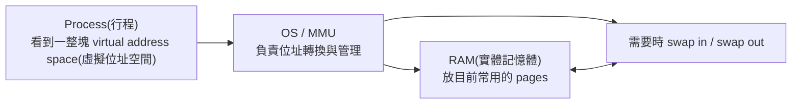
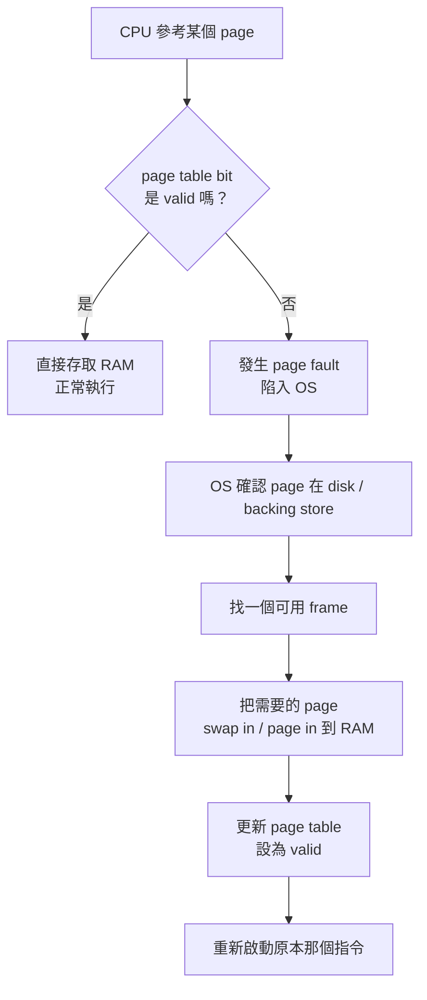
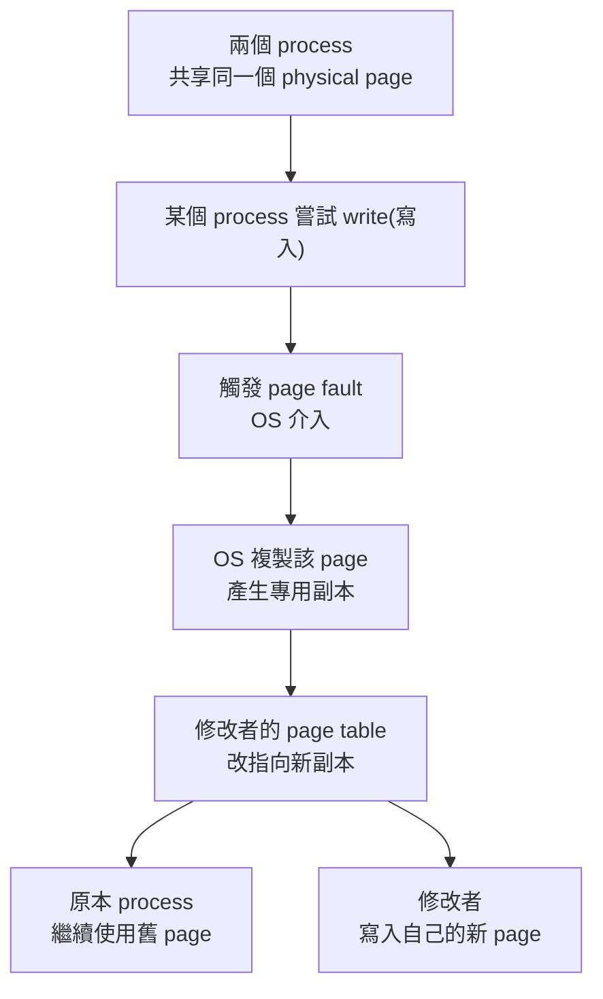
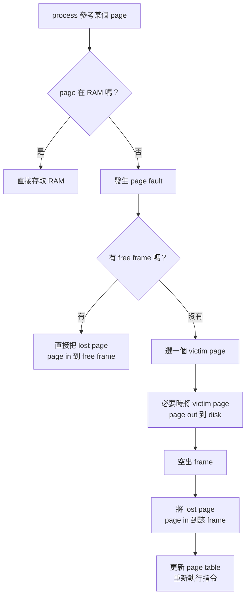

## ⭐Virtual Memory(虛擬記憶體) — 為什麼程式可以以為自己有一大塊連續記憶體？

講義位置：PDF viewer page 3 ~ PDF viewer page 6

### 1. Chapter 9 這章在處理什麼問題？

Chapter 9 的核心問題是：**RAM(實體記憶體) 不夠大、不夠連續，但程式還是想像自己擁有一整塊連續、很大的記憶體空間。**

講義目錄顯示 Chapter 9 後面會依序講 Background(背景)、Demand Paging(需求分頁)、Copy-on-write(寫入時複製)、Page Replacement(分頁替換)、Frame Allocation(頁框配置)、Thrashing(輾轉現象) 等主題。也就是說，這章不是只在講「記憶體變大」，而是在講：**OS 如何讓有限 RAM 看起來像比較大的記憶體，同時控制效能成本。** 來源：

---

### 2. Virtual Memory(虛擬記憶體) 的核心直覺

可以把 RAM 想成你的書桌，把 disk(磁碟) 想成書櫃。

你正在讀很多本書，但書桌放不下全部。比較聰明的做法不是把所有書都堆在桌上，而是：

1. 目前會用到的幾頁放在桌上，也就是 RAM。
2. 暫時不用的資料先放回書櫃，也就是 disk。
3. 等真的需要時，再把那幾頁拿回桌上。

Virtual Memory(虛擬記憶體) 就是在做類似的事。講義定義它是記憶體管理技術，會把 disk 的一部分空間模擬成 RAM，使得程式在 RAM 不足或多程式同時執行時仍可運作。程式會以為自己有一個連續完整的 address space(位址空間)，但實際上資料可能分散在 RAM 的不同 physical fragments(實體碎片)，也可能暫存在 disk 上。來源：

---

### 3. 這個「假裝連續」是怎麼做到的？

Virtual Memory(虛擬記憶體) 的重點不是「真的把 RAM 變大」，而是建立一層抽象：

講義 PDF viewer page 4 說，Virtual Memory 在磁碟內以 swap file / page file(交換檔／置換檔) 存在；當多個應用程式載入且 RAM 不足時，OS 會把一些在 RAM 上閒置較久的程式或資料搬到 disk 上，讓出空間給正在載入或正在執行的程式；之後需要時再從 disk swap 回來。來源：

這裡最重要的不變量是：

**Process(行程) 看到的是 virtual address space；硬體和 OS 真正管理的是 RAM frame(實體頁框) 與 disk 上的備份位置。**

---

### 4. Virtual Memory(虛擬記憶體) 的三個好處

講義列出三個主要優點：

| 好處         | 中文理解                           |
| ---------- | ------------------------------ |
| 程式可用空間變大   | 程式大小不再直接受限於目前 RAM 可用空間         |
| 更多程式可同時執行  | RAM 可以只放目前需要的部分，讓多個 process 共存 |
| I/O 次數可能減少 | 不必一開始把整個程式或所有資料都載進 RAM         |

來源：

但是要注意一個常見錯法：
**Virtual Memory 不是免費把電腦變快。**
如果常常需要從 disk 把資料換進換出，會變慢。因為 disk I/O 比 RAM 存取慢很多。這個效能問題後面會在 Demand Paging(需求分頁)、Page Fault(分頁錯誤)、Page Replacement(分頁替換)、Thrashing(輾轉現象) 裡正式處理。

---

### 5. Shared Pages(共享分頁)：為什麼不同程式可以共享函式庫？

PDF viewer page 6 說，除了把 physical memory(實體記憶體) 和 logical memory(邏輯記憶體) 分開，Virtual Memory 也允許透過 shared pages(共享分頁) 讓不同行程共享函式庫。來源：

生活化理解：
假設 Chrome、VS Code、某個終端機程式都需要同一份系統函式庫。沒有共享時，每個 process 都各放一份，RAM 很浪費。使用 shared pages 時，多個 process 的 page table 可以指向同一份 physical frame，大家讀同一份 library code。

最短理解：

**同一份 read-only library code，不需要每個 process 都複製一份；多個 process 可以映射到同一份實體頁面。**

---

### 6. 這頁最容易混淆的地方

| 容易混淆                            | 正確觀念                                                                    |
| ------------------------------- | ----------------------------------------------------------------------- |
| Virtual Memory = RAM 真的變大       | 錯。它是用 disk 輔助 RAM，讓 process 看到較大的 virtual address space                 |
| Process 看到的位址 = RAM 真實位置        | 錯。Process 看到 virtual/logical address，OS/MMU 再映射到 physical memory 或 disk |
| Swap 一定讓系統變快                    | 錯。Swap 可讓系統「能跑」，但大量 swap 會拖慢效能                                          |
| Shared library 是每個 process 各存一份 | 不一定。Virtual Memory 可用 shared pages 讓多個 process 共用同一份 library page       |

---

### 7. 本輪最短記法

Virtual Memory(虛擬記憶體)：
**讓 process 以為自己有一大塊連續記憶體；實際上 OS 把資料分散放在 RAM 與 disk，需要時再換進換出。**

英文考試版：

Virtual memory separates the process’s virtual address space from physical memory. A process can appear to have a large contiguous address space, while its pages may actually reside in physical memory or on disk and are moved between them as needed.

## ⭐Demand Paging(需求分頁) — 為什麼程式一開始不用把所有 pages 都載入 RAM？

講義位置：PDF viewer page 7 ~ PDF viewer page 11

### 1. Demand Paging(需求分頁) 在解決什麼問題？

上一輪我們說 Virtual Memory(虛擬記憶體) 的大方向是：process 看到很大的 virtual address space，但資料可以分散在 RAM 和 disk。

現在 Demand Paging(需求分頁) 要回答更具體的問題：

**程式開始執行時，到底要不要把整個程式的所有 pages 都載入 RAM？**

Demand Paging 的答案是：**不要。只載入目前真的需要執行的 pages。**

講義 PDF viewer page 7 說，Demand Paging 以 paging(分頁) 為基礎，採用 lazy swapper(懶惰交換器) 技巧；程式執行之初不把全部 pages 載入 memory，只載入執行所需的 pages，如果發生 page fault(分頁錯誤)，再由 OS 處理。

生活化例子：
你要準備期末考，不會一開始把整本教科書每一頁都攤在桌上。你只會先打開現在要讀的章節。讀到下一章時，才把下一章翻出來。Demand Paging 就是 OS 版的「用到才拿」。

---

### 2. Valid/Invalid Bit(有效／無效位元)：OS 怎麼知道 page 在不在 RAM？

Demand Paging 需要一個判斷機制：CPU 參考某個 page 時，OS 要知道這個 page 現在是不是已經在 RAM 中。

所以講義 PDF viewer page 8 說，page table(分頁表) 上多加一個 Valid/Invalid Bit(有效／無效位元)，用來指示 page 是否在 memory 中。

| Bit 狀態  | 意義                                                  |
| ------- | --------------------------------------------------- |
| Valid   | 這個 page 目前在 RAM，可以直接存取                              |
| Invalid | 這個 page 目前不在 RAM，可能在 disk；若 CPU 要用它，就會造成 page fault |

最重要的因果關係是：

**CPU 參考到 invalid page → 不能直接讀 RAM → 觸發 page fault → OS 介入處理。**

---

### 3. Page Fault(分頁錯誤) 的流程

Page Fault 不是「程式壞掉」的意思。
在 Demand Paging 中，page fault 很常是正常機制：代表「你要用的 page 現在不在 RAM，所以 OS 要把它載進來」。

PDF viewer page 9 的圖示在說明處理 page fault 的步驟：CPU 參用某頁，發現該頁不在 memory，觸發 interrupt/trap(中斷／陷入)，OS 找到該頁在 backing store(備用儲存體／disk) 的位置，把需要的那一頁載入 physical memory(實體記憶體) 的空白欄，更新 page table，最後重新啟動指令。

這裡有一個很重要的考試陷阱：

**page fault 後要 restart instruction(重新啟動指令)，因為原本那次 memory access 還沒有成功完成。**

---

### 4. Demand Paging 的優點與代價

Demand Paging 的好處很直覺：

| 優點               | 原因                   |
| ---------------- | -------------------- |
| RAM 使用較省         | 不用一開始載入所有 pages      |
| 程式啟動可較快          | 只載入必要 pages          |
| 可同時放更多 processes | 每個 process 只放目前需要的部分 |

但代價也很大：
**只要 page fault 太多，效能會急速變差。**

因為 RAM access 很快，但 page fault 需要 OS trap、disk I/O、swap in，甚至可能 swap out victim page，成本遠高於一般 memory access。

---

### 5. Effective Access Time(EAT，有效存取時間)

PDF viewer page 10 給出 Page Fault Rate(分頁錯誤率) `p` 的範圍：

`0 ≤ p ≤ 1`

* `p = 0`：沒有 page fault。
* `p = 1`：每次 memory reference 都 page fault。

EAT(有效存取時間) 的概念是：
**平均一次 memory access 到底要花多久？**

公式是：

`EAT = (1 - p) × memory access + p × (page fault overhead + swap page out + swap page in + restart overhead)`

來源：

直覺上可以看成兩種情況加權平均：

| 情況                        |      機率 | 成本                           |
| ------------------------- | ------: | ---------------------------- |
| page 已在 RAM               | `1 - p` | 一般 memory access             |
| page 不在 RAM，發生 page fault |     `p` | trap + disk I/O + restart，超慢 |

PDF viewer page 11 的例子使用：

* memory access time = 200 ns
* average page-fault service time = 8 ms
* 若 1000 次中有 1 次 page fault，EAT = 8.2 μs，約慢 40 倍。

這代表一個核心觀念：

**page fault rate 只要一點點，也可能讓平均存取時間變超慢，因為 disk I/O 成本比 RAM 大太多。**

---

### 6. 本輪最短記法

Demand Paging(需求分頁)：
**程式一開始不載入全部 pages，只載入需要的 pages；若 CPU 參考到不在 RAM 的 page，就發生 page fault，由 OS 從 disk 載入該 page、更新 page table，然後重跑原指令。**

英文考試版：

Demand paging loads pages into memory only when they are needed. If a process references a page that is not currently in memory, a page fault occurs. The OS locates the page on disk, brings it into a free frame, updates the page table, and restarts the interrupted instruction.

## ⭐Copy-on-write(COW，寫入時複製) — 為什麼 fork 後不用立刻複製整份記憶體？

講義位置：PDF viewer page 12 ~ PDF viewer page 19

### 1. COW 在解決什麼問題？

COW(Copy-on-write，寫入時複製) 想解決的是：

**如果兩個 process 一開始看到的資料一樣，我們一定要馬上複製一整份嗎？**

答案是：不一定。

講義 PDF viewer page 12 說，在 COW 策略中，如果多個呼叫者同時要求相同資源，例如記憶體或磁碟上的資料，他們會共同取得相同的指標指向相同資源；直到某個呼叫者試圖修改資源內容時，系統才真的複製一份專用副本。

生活化例子：
你和同學共用一份 Google Docs 筆記。如果你們都只是看，不需要複製兩份。只有當你想改內容，而且不能影響對方那份時，系統才幫你做一份自己的副本。

---

### 2. COW 的核心規則

COW 的核心規則可以背成一句話：

**先共享，等有人要寫入時才複製。**

| 狀況                    | OS 的做法                               |
| --------------------- | ------------------------------------ |
| 只是 read(讀取)           | 多個 process 可以共享同一份 physical page     |
| 有 process 要 write(寫入) | 觸發 page fault，OS 複製該 page，讓寫入者改自己的副本 |
| 複製後                   | 修改者看到新副本，其他 process 繼續看到原本 page      |

這裡要注意：
COW 不是永遠不複製，而是 **delay copy(延後複製)**。如果永遠沒有人修改，就省掉複製成本；如果真的有人修改，才支付複製成本。

---

### 3. COW 和 page fault 的關係

COW 常用 page fault 來實作。

概念上，OS 可以把共享 page 暫時標成 read-only(唯讀)。兩個 process 都可以讀，但任何一方要寫入時，就會因為寫入唯讀 page 而觸發 page fault。OS 看到這是 COW fault，就不是把程式殺掉，而是：

講義 PDF viewer page 14 的 fork scenario 也是這個邏輯：parent process 呼叫 `fork()` 後，child process 一開始共享 parent 的 memory pages；如果 child 修改 page，會發生 page fault，OS 會為 child 建立該 page 的 copy，child 修改自己的副本，而 parent 繼續使用原本 page。

---

### 4. 為什麼 COW 對 fork() 很重要？

`fork()` 會建立 child process。直覺上，child process 好像需要一整份 parent process 的記憶體副本。

但如果 child process fork 後馬上 `exec()` 載入新程式，那一開始複製整份記憶體就很浪費。COW 的做法是：

1. `fork()` 後，parent 和 child 先共享相同 physical pages。
2. 只要雙方只是 read，就不用複製。
3. 有一方 write 某個 page 時，只複製那一個被修改的 page。
4. 這樣可以節省 memory overhead(記憶體額外負擔)，也能改善 performance(效能)。

講義 PDF viewer page 12 也列出 COW 的好處：sharing until modification 可以降低 memory overhead；延後 copy operation 可以提升效能，尤其在 reads 比 writes 多的系統中很有用。

---

### 5. COW 的缺點

COW 不是免費的。講義 PDF viewer page 15 列出兩個 drawback(缺點)：

| 缺點            | 原因                                              |
| ------------- | ----------------------------------------------- |
| Copy overhead | 如果修改很頻繁，最後還是一直複製，COW 的好處會下降 (==但還是會比一開始就 copy 還要省==)                    |
| Complexity    | 實作需要小心處理 reference counting(參考計數) 和 page faults |

來源：

最短理解：
**Read 多、write 少時，COW 很省；write 很頻繁時，會一直觸發 copy，成本就上來。**

---

### 6. fork() 和 vfork() 的輸出差異

講義 PDF viewer page 16 ~ 18 用 `glob = 6`、`var = 88` 的程式比較 `fork()` 和 `vfork()`。child 會執行：

`glob++; var++;`

結果差異是：

| 呼叫方式      | child 印出         | parent 最後印出      | 原因                                                   |
| --------- | ---------------- | ---------------- | ---------------------------------------------------- |
| `fork()`  | `glob=7, var=89` | `glob=6, var=88` | parent 和 child 有分離的 address space；child 修改不影響 parent |
| `vfork()` | `glob=7, var=89` | `glob=7, var=89` | child 暫時共享 parent address space，child 修改對 parent 可見  |

講義 PDF viewer page 18 明確給出輸出：`vfork()` 時 parent 看到 `glob=7, var=89`；`fork()` 時 parent 仍看到 `glob=6, var=88`，並說明使用 `vfork()` 時子程序可以修改父程序記憶體空間中的資料，這些修改對父程序可見。PDF viewer page 19 也整理：`fork()` creates a separate copy of the parent’s address space；`vfork()` shares the parent’s address space until `exec()` or `_exit()`。

這裡的考試陷阱是：

**fork() 的 child 改變自己的 glob/var，不代表 parent 的 glob/var 也被改。**

---

### 7. 本輪最短記法

Copy-on-write(COW，寫入時複製)：
**多個 process 一開始先共享同一份 page；只要只是讀取就不複製，等某個 process 要寫入時，才透過 page fault 讓 OS 複製該 page，讓修改者改自己的副本。**

英文考試版：

Copy-on-write allows processes to initially share the same physical pages. A page is copied only when one process attempts to modify it. The write triggers a page fault, the OS creates a private copy for the writer, updates the page table, and preserves the original page for the other processes.

## ⭐Page Replacement(分頁替換) — RAM 滿了但又發生 page fault 時，OS 要怎麼辦？

講義位置：PDF viewer page 20 ~ PDF viewer page 22

### 1. 這個概念在解決什麼問題？

前面 Demand Paging(需求分頁) 說：process 不需要一開始把所有 pages 都放進 RAM，用到某個不在 RAM 的 page 時，發生 page fault，再把該 page 從 disk 載入 RAM。

可是現在多了一個問題：

**如果發生 page fault 時，RAM 裡已經沒有 free frame(空閒頁框) 了，OS 要把新 page 放哪裡？**

這就是 Page Replacement(分頁替換) 要解決的問題。

講義 PDF viewer page 20 說：當 page fault 發生且 memory 沒有可用 page/frame 時，OS 必須執行 page replacement；OS 需要選一個 victim page(犧牲頁)，把它 swap out/page out 到 disk，空出 frame，再把 lost page swap in/page in 到這個 frame。

---

### 2. Page Replacement 的核心流程

Page Replacement 可以背成四步：

1. 發生 page fault。
2. OS 發現沒有 free frame。
3. OS 選一個 victim page。
4. 把 victim page 移出，空出 frame，再把需要的 lost page 載入。

流程如下：

這裡的關鍵不是「有 page fault 就一定替換」。
正確說法是：

**page fault + 沒有 free frame → 才需要 page replacement。**

---

### 3. page in 一定必要，page out 不一定必要

講義 PDF viewer page 21 很重要，因為它補了一個效能陷阱：

* `page in`：一定必要，因為 OS 必須把 lost page 載入 memory。
* `page out`：不一定必要，要看 victim page 是否被修改過。
* `dirty bit(髒位元)`：用來判斷 victim page 是否曾被修改。

| victim page 狀態 | dirty bit | OS 是否需要 page out？ | 原因                                  |
| -------------- | --------: | ----------------- | ----------------------------------- |
| 沒有被修改過         |         0 | 不需要               | disk 上原本那份仍然是最新的，直接丟掉 RAM copy 即可   |
| 曾被修改過          |         1 | 需要                | RAM 裡的內容比 disk 新，必須先寫回 disk，否則資料會遺失 |

這點很常考觀念題：

**不是每次 page replacement 都要做兩次 disk I/O。**
`page in` 必要；`page out` 只有在 victim page 是 dirty 時才必要。

---

### 4. victim page 的選擇會影響 page fault ratio

Page Replacement 真正困難的地方是：

**OS 到底該選哪一個 page 當 victim page？**

如果選得好，之後比較不容易再 fault。
如果選得差，剛換出去的 page 可能馬上又被用到，於是又 page fault。

講義 PDF viewer page 22 說，Demand Paging 要先解決兩個主要問題：

1. `frame-allocation algorithm(頁框配置演算法)`：每個 process 要分幾個 frames？
2. `page-replacement algorithm(分頁替換演算法)`：RAM 滿時，要換掉哪一個 page？

講義也說，不同 page-replacement algorithms 有很多種，選擇時一般希望選 page fault ratio(分頁錯誤率) 最低的那一個。

所以你可以這樣分：

| 問題                     | 對應演算法                      |
| ---------------------- | -------------------------- |
| 每個 process 分多少 frames？ | frame-allocation algorithm |
| frame 滿了，要換掉哪個 page？   | page-replacement algorithm |

---

### 5. 本輪先不要急著算 FIFO / LRU

PDF viewer page 23 開始會進入 FIFO(First-In-First-Out，先進先出) 法則，後面還有 Optimal Page Replacement(最佳分頁替換)、LRU(Least Recently-Used，最近最少使用)、LRU approximation(近似 LRU) 等演算法。

這些是下一批程序型內容，會需要 trace page reference string(追蹤頁面參考序列)，不能直接跳過示範就出計算題。

本輪先把最核心的「什麼時候需要 page replacement」與「dirty bit 如何省 I/O」學穩。

---

### 6. 英文考試版

Page replacement is needed when a page fault occurs and there is no free frame in physical memory. The OS selects a victim page, removes it from memory if necessary, and loads the required page into the freed frame. The victim page only needs to be written back to disk if it has been modified, which is determined by the dirty bit. A good page-replacement algorithm tries to minimize the page fault ratio.

## ⭐FIFO(First-In-First-Out，先進先出) — 如果一定要換掉一個 page，最簡單的選法是什麼？

講義位置：PDF viewer page 23 ~ PDF viewer page 26

### 1. FIFO 在解決什麼問題？

上一輪我們學到：如果 page fault 發生，而且沒有 free frame，OS 必須選一個 victim page(犧牲頁)。

FIFO(First-In-First-Out，先進先出) 就是一種非常直覺的 victim page 選法：

**最早被載入 RAM 的 page，最先被換出去。**

也就是說，FIFO 不管這個 page 最近有沒有被使用，只看它「進來的時間」。講義寫到 FIFO 的規則是「最先載入的 page 優先視為 victim page」，優點是簡單、易於實作，但效果通常不佳。

---

### 2. FIFO 的操作規則

FIFO 可以想成一個 queue(佇列)：

| 動作                        | FIFO 怎麼處理                  |
| ------------------------- | -------------------------- |
| 新 page 被載入 RAM            | 放到 queue 尾端                |
| page hit                  | page 已在 RAM，不改變 FIFO 順序    |
| page fault 且沒有 free frame | 換掉 queue 最前端，也就是最早進來的 page |
| 換入新 page                  | 新 page 放到 queue 尾端         |

最容易錯的是第二點：

**FIFO 的 page hit 不會讓該 page 變年輕。**

這和後面 LRU(Least Recently-Used，最近最少使用) 不一樣。FIFO 只記「誰最早進來」，不記「誰最近用過」。

---

### 3. 非題目型示範：用 3 個 frames trace FIFO

假設有 3 個 frames，reference string(頁面參考序列) 是：

`1, 2, 3, 1, 4`

我們一步一步看：

| Step | Reference | Hit / Fault | Frames after access | 說明                     |
| ---: | --------: | ----------- | ------------------- | ---------------------- |
|    1 |         1 | Fault       | [1, -, -]           | RAM 空，載入 1             |
|    2 |         2 | Fault       | [1, 2, -]           | RAM 還有 free frame，載入 2 |
|    3 |         3 | Fault       | [1, 2, 3]           | RAM 還有 free frame，載入 3 |
|    4 |         1 | Hit         | [1, 2, 3]           | 1 已在 RAM；FIFO 順序不變     |
|    5 |         4 | Fault       | [4, 2, 3]           | RAM 滿了，換掉最早進來的 1       |

這個例子故意讓你看到 FIFO 的缺點：

雖然 step 4 才剛用過 page 1，但 step 5 還是把 page 1 換掉，因為 FIFO 只看進來時間，不看最近使用時間。

---

### 4. Belady Anomaly(貝拉迪異常)

一般直覺會覺得：

**frames 越多，page faults 應該越少。**

但 FIFO 有一個反直覺現象叫 Belady Anomaly(貝拉迪異常)：

**給 process 更多 frames，page fault ratio 反而可能上升。**

講義用這個 reference string 示範 FIFO 可能發生 Belady Anomaly：

`1, 2, 3, 4, 1, 2, 5, 1, 2, 3, 4, 5`

講義的 FIFO example 顯示：

| Frames 數量 | FIFO page faults |
| --------: | ---------------: |
|  3 frames |                9 |
|  4 frames |               10 |

也就是說，4 個 frames 反而比 3 個 frames 更糟。這就是 Belady Anomaly。

---

### 5. FIFO 的考試陷阱

FIFO 常見錯法有三個：

| 錯法                      | 為什麼錯                                   |
| ----------------------- | -------------------------------------- |
| page hit 後把該 page 移到最新  | 這是 LRU 的想法，不是 FIFO                     |
| frames 比較多就一定比較少 faults | FIFO 可能有 Belady Anomaly                |
| 看到 page fault 就替換       | 如果還有 free frame，直接載入，不需要替換 victim page |

最短記法：

**FIFO：誰最早進來，誰最先出去；hit 不改順序；可能有 Belady Anomaly。**

---

### 6. 英文考試版

FIFO page replacement selects the page that has been in memory the longest as the victim page. It is simple to implement because it only needs to track the loading order of pages. However, FIFO does not consider recent usage, so a recently used page may still be replaced if it was loaded earliest. FIFO can also suffer from Belady’s anomaly, where increasing the number of frames may increase the number of page faults.

## ⭐Optimal Page Replacement(最佳頁替換) — 如果真的知道未來，應該換掉哪一頁？

講義位置：PDF viewer page 27

### 1. 這個概念在解決什麼問題？

前面 FIFO(先進先出) 的問題是：它只看「誰最早進來」，完全不管那個 page 等一下會不會馬上再用。

Optimal Page Replacement(最佳頁替換) 想問的是：

「如果 OS 能知道未來的 reference string，要怎麼選 victim page 才會讓 page fault 最少？」

答案是：換掉**未來最久不會再被使用**的 page；如果某個 page 未來完全不會再用，那它就是最好的 victim page。講義也明確寫出 Optimal 以「將來長期不會使用的 page」作為 victim page，效果最佳，不會有 Belady Anomaly，但實際上不可能做到，因為它需要知道未來。

### 2. Optimal 的核心規則

當發生 page fault，而且 memory 中沒有 free frame 時：

1. 看目前 frames 裡有哪些 pages。
2. 往 reference string 的「未來」看。
3. 找出哪一個 page 最晚才會再被用到。
4. 把那個 page 當作 victim page。
5. 若某個 page 未來再也不會被用到，優先換掉它。

注意：Optimal 只在 page fault 且需要 replacement 時選 victim。若是 hit，就跟 FIFO 一樣，不需要 replacement。

### 3. 小示範

假設目前 frames 內有：

| Frame 內容 | 未來 reference string 中下一次出現位置 |
| -------- | ---------------------------- |
| page 1   | 很快會用到                        |
| page 2   | 更晚才會用到                       |
| page 3   | 未來不再使用                       |

現在發生 page fault，需要載入 page 4。

Optimal 會選 page 3 當 victim，因為 page 3 未來不再使用。這比 FIFO 更聰明，因為 FIFO 可能只因為 page 1 最早進來就換掉 page 1，但 page 1 可能等一下馬上又要用。

### 4. 為什麼 Optimal 很重要但不能實作？

Optimal 很重要，因為它提供一個「理論最佳標準」：其他演算法，例如 FIFO、LRU、Second-Chance，可以拿來跟 Optimal 比較，看自己離最佳狀態差多少。

但它不能實作，因為真正的 OS 在執行當下不知道未來的 page reference string。也就是說，Optimal 是 benchmark(基準)，不是 practical algorithm(實用演算法)。

### 5. 和 FIFO 的差異

| 比較點              | FIFO                   | Optimal                 |
| ---------------- | ---------------------- | ----------------------- |
| victim page 選擇依據 | 最早載入 memory 的 page     | 未來最久不會再使用的 page         |
| 是否看未來            | 不看                     | 看                       |
| 是否容易實作           | 很容易                    | 實際上不能實作                 |
| 效果               | 可能差，可能有 Belady Anomaly | 理論最佳，不會有 Belady Anomaly |

## ⭐LRU(Least Recently-Used，最近最少使用) — 如果不能看未來，那能不能用「最近使用紀錄」猜未來？

講義位置：PDF viewer page 28 ~ PDF viewer page 32

### 1. LRU 在解決什麼問題？

Optimal Page Replacement(最佳頁替換) 的想法很強：看未來，換掉未來最晚才會用到的 page。
但問題是：真正的 OS 不知道未來。

所以 LRU(Least Recently-Used，最近最少使用) 改用一個比較實際的猜法：

**如果一個 page 最近很久都沒被使用，那它接下來也比較可能暫時用不到。**

因此 LRU 的 victim page 選擇規則是：

**換掉最近最久沒有被使用的 page。**

講義寫到 LRU 是以「最近不常使用的 page」作為 victim page，效果不錯，不會有 Belady Anomaly，但製作成本高，通常需要 Counter 或 Stack 等硬體／資料結構支援。

---

### 2. LRU 和 FIFO 的最大差別

FIFO(先進先出) 看的是「誰最早進來」。

LRU 看的是「誰最近最久沒用」。

這兩者在 page hit 時差異最大：

| 情況                        | FIFO         | LRU             |
| ------------------------- | ------------ | --------------- |
| page fault 且有 free frame  | 載入 page      | 載入 page         |
| page fault 且沒有 free frame | 換掉最早載入的 page | 換掉最近最久沒使用的 page |
| page hit                  | 不改變替換順序      | 會更新最近使用紀錄       |
| 是否看未來                     | 不看           | 不看              |
| 是否用過去紀錄                   | 幾乎不用         | 會用最近使用紀錄        |

所以你要特別記住：

**LRU 的 hit 會影響未來替換順序；FIFO 的 hit 不會。**

---

### 3. 非題目型示範：3 frames 下追蹤 LRU

假設有 3 個 frames，reference string 是：

`1, 2, 3, 1, 4`

我們追蹤時，除了 frames 內容，也要記「誰最近最久沒用」。

| Step | Reference | Hit / Fault | Frames after access | LRU 判斷                  |
| ---: | --------: | ----------- | ------------------- | ----------------------- |
|    1 |         1 | Fault       | [1, -, -]           | 載入 1                    |
|    2 |         2 | Fault       | [1, 2, -]           | 載入 2                    |
|    3 |         3 | Fault       | [1, 2, 3]           | 載入 3                    |
|    4 |         1 | Hit         | [1, 2, 3]           | 1 剛被使用，變成最近使用           |
|    5 |         4 | Fault       | [1, 4, 3]           | 在 1、2、3 中，2 最久沒用，所以換掉 2 |

注意這裡和 FIFO 不一樣。
如果是 FIFO，step 5 會換掉 page 1，因為 1 最早進來。
但如果是 LRU，step 4 剛 hit page 1，所以 page 1 不該被換掉；LRU 會換掉 page 2。

---

### 4. Counter implementation(計數器實作)

講義列出一種 LRU implementation(實作方式)：Counter implementation。

概念是：

每次 page 被 referenced(參考) 時，把目前時間戳記 time stamp 複製到該 page 的 counter。
當需要 replacement(替換) 時，找 counter 最舊的 page 移除。

| 動作       | Counter implementation 怎麼做        |
| -------- | --------------------------------- |
| page 被參考 | 把目前 time stamp 放到該 page 的 counter |
| 需要替換     | 移除 counter 最舊的 page               |
| 成本       | 需要 linear search(線性搜尋)，成本高        |

這就是為什麼 LRU 效果不錯，但實作成本比 FIFO 高。

---

### 5. Stack implementation(堆疊實作)

講義也列出 Stack implementation。

概念是：

每次 page 被 referenced 時，把該 page 移到 stack top(堆疊頂端)。
越靠近 top，代表越最近使用；越靠近 bottom，代表越久沒使用。
需要 replacement 時，移除 stack bottom(堆疊底端) 的 page。

| Stack 位置     | 意義                           |
| ------------ | ---------------------------- |
| stack top    | 最近使用的 page                   |
| stack bottom | 最近最久沒使用的 page，也就是 LRU victim |

所以 Stack implementation 的最短記法是：

**hit 或 fault 載入後，都要把該 page 移到 top；replacement 時換掉 bottom。**

---

### 6. LRU 的考試陷阱

| 常見錯法            | 為什麼錯                                 |
| --------------- | ------------------------------------ |
| 把 LRU 當 FIFO    | FIFO 看載入時間；LRU 看最近使用時間               |
| page hit 後不更新順序 | LRU 的 hit 會更新最近使用紀錄                  |
| 以為 LRU 要看未來     | 看未來的是 Optimal；LRU 只看過去               |
| 只寫「換掉最少使用」      | LRU 是最近最少使用，不是總次數最少使用                |
| 忘記實作成本          | LRU 效果不錯，但需要 Counter 或 Stack 支援，成本較高 |

---

### 7. 英文考試版

LRU page replacement selects as the victim page the page that has not been used for the longest time in the past. Unlike FIFO, LRU updates the replacement order whenever a page is referenced, including on a page hit. LRU approximates future behavior by using recent past behavior. It usually performs well and does not suffer from Belady’s anomaly, but it is costly to implement because it requires hardware or data-structure support such as counters or stacks.

### 用 stack 實作的一個例子

#### 1. 用一個小例子看 Stack implementation(堆疊實作)

先約定：

**stack 左邊是 bottom(最久沒用)，右邊是 top(最近使用)。**

假設有 3 個 frames，reference string 是：

`1, 2, 3, 2, 4, 3`

一開始 stack 是空的。

| Step | Reference | Hit / Fault | Stack 狀態，bottom → top | 說明                                     |
| ---: | --------: | ----------- | --------------------- | -------------------------------------- |
|    1 |         1 | Fault       | `[1]`                 | 載入 1，1 放到 top                          |
|    2 |         2 | Fault       | `[1, 2]`              | 載入 2，2 放到 top                          |
|    3 |         3 | Fault       | `[1, 2, 3]`           | 載入 3，3 放到 top                          |
|    4 |         2 | Hit         | `[1, 3, 2]`           | 2 被使用，所以把 2 移到 top                     |
|    5 |         4 | Fault       | `[3, 2, 4]`           | stack 滿了，bottom 是 1，所以換掉 1，再把 4 放到 top |
|    6 |         3 | Hit         | `[2, 4, 3]`           | 3 被使用，所以把 3 移到 top                     |

---

#### 2. 重點直覺

Stack implementation(堆疊實作) 不是在說 physical frames(實體 frame) 真的長得像堆疊，而是用 stack 來記錄「最近使用順序」。

最重要三句：

1. **每次 page 被 referenced，不管 hit 或 fault，都要把它移到 top。**
2. **top 是最近使用，bottom 是最近最久沒使用。**
3. **需要 replacement 時，移除 bottom。**

---

#### 3. 和 FIFO 最大差別

剛剛 Step 4 reference 到 page 2 是 hit。

在 FIFO(先進先出)：hit 不改順序。
在 LRU stack implementation：hit 會把 page 2 移到 top。

所以 LRU 的 stack 會一直根據「最近誰被用過」更新。這就是 LRU 和 FIFO 在 trace 題最容易混淆的地方。

## ⭐LRU-approximation(LRU 近似換頁法) — 如果真正的 LRU 太貴，OS 要怎麼便宜地模仿它？

講義位置：PDF viewer page 33 ~ PDF viewer page 37

### 1. 這個概念在解決什麼問題？

剛剛學的 LRU(Least Recently-Used，最近最少使用) 很合理：換掉最近最久沒用的 page。

但問題是：真正精準的 LRU 很貴。
因為 OS 要精準知道每個 page 最近一次被用到的時間，可能需要大量 counter、stack、硬體支援與搜尋成本。

所以 LRU-approximation(LRU 近似換頁法) 的核心問題是：

**能不能不要完整記錄精準時間，但仍然大概知道哪些 page 最近比較常被用？**

講義在這一段介紹三種相關方法：

| 方法                                 | 核心想法                                           |
| ---------------------------------- | ---------------------------------------------- |
| Additional Reference Bits(額外參考位元法) | 用 reference bit 的歷史紀錄近似「最近有沒有被用」               |
| Second-Chance Algorithm(第二次機會替換法)  | FIFO 加上 reference bit，給最近用過的 page 第二次機會        |
| Enhanced Second-Chance(加強第二次機會)    | 同時看 reference bit 與 modification bit，減少 I/O 成本 |

講義指出 additional reference bits 會定期記錄 reference bit，Second-Chance 以 FIFO 為基礎並搭配 Reference Bit，而 Enhanced Second-Chance 使用 `(Reference Bit, Modification Bit)` 作為 victim page 的選擇依據。

### 2. Additional Reference Bits(額外參考位元法)

這個方法的直覺是：

不要只記「這一刻有沒有被用過」，而是記「最近幾段時間有沒有被用過」。

講義的做法是：每一個 page 維護一個 8-bit byte。每隔一段時間，例如 100ms，OS 透過 timer interrupt(計時器中斷) 更新這個 byte：

1. 把目前的 reference bit 移入最高位元。
2. 原本其他位元全部右移一位。
3. 最低位元被丟掉。

這樣一來，這個 8-bit 值就像 page 最近使用紀錄的「歷史摘要」。

例如：

| Register value | 意義                                   |
| -------------- | ------------------------------------ |
| `00000000`     | 最近 8 段時間都沒被使用                        |
| `11111111`     | 最近 8 段時間每段至少被使用過一次                   |
| `11000100`     | 比 `01110111` 更常被用，因為高位元較大，代表較近時間內有使用 |

最短記法：

**reference bit shift register 越大，表示越近期、越常被使用；越小越像 victim。**

### 3. Second-Chance Algorithm(第二次機會替換法)

Second-Chance Algorithm(第二次機會替換法) 可以理解成：

**FIFO + Reference Bit。**

FIFO 原本很粗暴：誰最早進來，誰先出去。
Second-Chance 說：等一下，如果這個 page 最近被使用過，就先不要換掉它，給它第二次機會。

規則如下：

1. pages 排成 circular queue(環狀佇列)。
2. replacement 發生時，clock hand(時鐘指標) 從目前位置開始檢查。
3. 若 page 的 reference bit = 0：表示最近沒被用，選它當 victim。
4. 若 page 的 reference bit = 1：表示最近被用過，將 reference bit 清為 0，clock hand 往下一格。
5. 持續檢查，直到找到 reference bit = 0 的 page。

講義也說明：若 page 的 reference bit 是 1，就給它 second chance，先清成 0，然後繼續往下一個 page；直到找到 reference bit 為 0 的 page 才替換。

### 4. 非題目型示範：Second-Chance 怎麼選 victim？

假設目前 circular queue 是：

| Clock hand 檢查順序 | Page | Reference Bit |
| --------------: | ---: | ------------: |
|               1 |    A |             1 |
|               2 |    B |             1 |
|               3 |    C |             0 |
|               4 |    D |             1 |

現在發生 page fault，需要選 victim。

Second-Chance 的流程：

| 檢查                     | 結果                       |
| ---------------------- | ------------------------ |
| 檢查 A，reference bit = 1 | 給第二次機會，把 A 的 bit 清成 0，跳過 |
| 檢查 B，reference bit = 1 | 給第二次機會，把 B 的 bit 清成 0，跳過 |
| 檢查 C，reference bit = 0 | C 最近沒被用，選 C 當 victim     |

最後 victim page 是 C。

注意：A 和 B 沒有永遠安全，只是這一輪得到 second chance。下次如果又被檢查到而 reference bit 還是 0，就可能被換掉。

### 5. Enhanced Second-Chance(加強第二次機會)

Second-Chance 只看 reference bit，但它沒有考慮一件很重要的事：

**victim page 如果被修改過，就要寫回 disk，會多一次 I/O。**

所以 Enhanced Second-Chance(加強第二次機會) 同時看兩個 bit：

| Bit                          | 意義                  |
| ---------------------------- | ------------------- |
| Reference Bit                | 最近有沒有被使用            |
| Modification Bit / Dirty Bit | 有沒有被修改過，是否需要寫回 disk |

講義將 `(Reference Bit, Modification Bit)` 分成四類，越上面越適合當 victim：

|   Class | `(R, M)` | 意義         | 適合當 victim 的程度          |
| ------: | -------- | ---------- | ----------------------- |
| Class 0 | `(0, 0)` | 最近沒用，也沒修改  | 最適合，替換成本最低              |
| Class 1 | `(0, 1)` | 最近沒用，但被修改過 | 可以換，但要 page out 寫回 disk |
| Class 2 | `(1, 0)` | 最近有用，沒修改   | 不太想換，可能快再用到             |
| Class 3 | `(1, 1)` | 最近有用，也被修改過 | 最不想換，可能快再用且替換成本高        |

最短記法：

**Enhanced Second-Chance 優先選低 class，因為它想同時避免換掉最近用過的 page，也想減少 page out I/O。**

### 6. 三個方法的比較

| 方法                        | 看什麼資訊                            | 優點              | 缺點                    |
| ------------------------- | -------------------------------- | --------------- | --------------------- |
| Additional Reference Bits | 多段時間的 reference bit 歷史           | 比單一 bit 更接近 LRU | 仍然只是近似                |
| Second-Chance             | FIFO queue + reference bit       | 比 FIFO 聰明，實作仍簡單 | 只知道最近有沒有被用，不知道精準時間    |
| Enhanced Second-Chance    | reference bit + modification bit | 顧到最近使用與 I/O 成本  | 判斷比 Second-Chance 多一層 |

### 7. 常見錯法

| 常見錯法                               | 正確觀念                                             |
| ---------------------------------- | ------------------------------------------------ |
| 以為 Second-Chance 是真正 LRU           | 它只是近似 LRU，本質上仍以 FIFO queue 為基礎                   |
| reference bit = 1 就永遠不會被換          | 錯，只是先清成 0 給一次機會，下次可能被換                           |
| Enhanced 只看 reference bit          | 錯，Enhanced 同時看 reference bit 和 modification bit  |
| `(1,0)` 比 `(0,1)` 更適合換             | 講義排序中 `(0,1)` 優先於 `(1,0)`，因為最近沒用比最近有用更適合當 victim |
| 忘記 dirty / modification bit 影響 I/O | 被修改過的 page 替換前通常需要寫回 disk                        |

### 8. 英文考試版

LRU approximation tries to approximate true LRU without maintaining exact recency information. Additional reference bits periodically record the reference bit into a shift register to estimate recent usage history. Second-Chance page replacement is based on FIFO plus a reference bit: if the reference bit is 1, the page is given a second chance and the bit is cleared; if the reference bit is 0, the page is selected as the victim. Enhanced Second-Chance uses both the reference bit and the modification bit, preferring pages in lower classes such as `(0,0)` because they have not been used recently and do not need to be written back to disk.

!!! danger

    ### 考古題

    #### ==Q:==

    (Q1)
    A page-replacement algorithm should reduce the number of page faults by distributing heavily used pages evenly over memory. Suppose each page frame has a counter that records the number of pages associated with that frame. When replacement is needed, the system searches for the page frame with the smallest counter.

    Define a page-replacement algorithm based on this idea. Your answer must specify:

    1. the initial value of each frame counter,
    2. when a counter is increased,
    3. when a counter is decreased, and
    4. how the victim page is selected.

    ---
    (Q2)

    Using the algorithm you defined in Question 1, compute how many page faults occur for the following reference string with four page frames. Start with all four frames empty.

    Reference string:

    `1, 2, 3, 4, 5, 3, 4, 1, 6, 7, 8, 7, 8, 9, 7, 8, 9, 5, 4, 5, 4, 2`

    Show enough of your trace to justify your page-fault count.

    (Q3)
    For the same reference string and four page frames, what is the minimum number of page faults under Optimal Page Replacement? Briefly explain how Optimal selects victim pages.

    Reference string:

    `1, 2, 3, 4, 5, 3, 4, 1, 6, 7, 8, 7, 8, 9, 7, 8, 9, 5, 4, 5, 4, 2`

    ==ANS:==
    1. the initial value of each frame counter: 0
    2. when a counter is increased: 當 frame 被 replacement 時，或是一開始載入空 frame 時
    3. when a counter is decreased: 無
    4. how the victim page is selected: counter 最小的；如果相同，選較前面的 frame，也就是 index 較小的 frame。

    ---

    4 frame

    | number | frame | counter |
    | -----: | ----- | ------- |
    |      1 | 1---  | 1,0,0,0 |
    |      2 | 12--  | 1,1,0,0 |
    |      3 | 123-  | 1,1,1,0 |
    |      4 | 1234  | 1,1,1,1 |
    |      5 | 5234  | 2,1,1,1 |
    |      3 | hit   | 2,1,1,1 |
    |      4 | hit   | 2,1,1,1 |
    |      1 | 5134  | 2,2,1,1 |
    |      6 | 5164  | 2,2,2,1 |
    |      7 | 5167  | 2,2,2,2 |
    |      8 | 8167  | 3,2,2,2 |
    |      7 | hit   | 3,2,2,2 |
    |      8 | hit   | 3,2,2,2 |
    |      9 | 8967  | 3,3,2,2 |
    |      7 | hit   | 3,3,2,2 |
    |      8 | hit   | 3,3,2,2 |
    |      9 | hit   | 3,3,2,2 |
    |      5 | 8957  | 3,3,3,2 |
    |      4 | 8954  | 3,3,3,3 |
    |      5 | hit   | 3,3,3,3 |
    |      4 | hit   | 3,3,3,3 |
    |      2 | 2954  | 4,3,3,3 |

    page fault: 13

    ---

    4 frame

    | number | frame |
    | -----: | ----- |
    |      1 | 1---  |
    |      2 | 12--  |
    |      3 | 123-  |
    |      4 | 1234  |
    |      5 | 1534  |
    |      3 | hit   |
    |      4 | hit   |
    |      1 | hit   |
    |      6 | 6534  |
    |      7 | 7534  |
    |      8 | 7584  |
    |      7 | hit   |
    |      8 | hit   |
    |      9 | 7589  |
    |      7 | hit   |
    |      8 | hit   |
    |      9 | hit   |
    |      5 | hit   |
    |      4 | 4589  |
    |      5 | hit   |
    |      4 | hit   |
    |      2 | 2589  |

    page fault: 11

## ⭐Allocation of Frames(頁框配置法則) — OS 有很多 processes 時，frame 要怎麼分才合理？

講義位置：PDF viewer page 38 ~ PDF viewer page 40

### 1. 這個概念在解決什麼問題？

前面 9.4 Page Replacement(分頁替換) 問的是：

**如果 memory 滿了，要換掉哪一個 page？**

現在 9.5 Allocation of Frames(頁框配置法則) 問的是另一個更前面的問題：

**每個 process 一開始應該拿到多少 frames？**

這很重要，因為 page replacement 是「已經分到 frame 之後，frame 不夠時怎麼換」。但 frame allocation 是「多個 process 同時存在時，OS 要怎麼分配 physical memory frames」。

講義說 frame allocation 是 OS 將 physical memory frames 分給各個 running processes 的策略；一般來說，一個 process 分到越多 frames，page fault ratio 通常越低。

直覺是：

| 分到的 frames | 結果                          |
| ---------: | --------------------------- |
|         太少 | 常常 page fault，process 變慢    |
|         適中 | 可以穩定執行                      |
|         太多 | 可能浪費 memory，讓其他 process 不夠用 |

所以這個知識點的核心不是「越多越好」，而是：

**OS 要在多個 process 之間分配有限 frames，避免某些 process 太少而一直 page fault，也避免某些 process 拿太多造成浪費。**

### 2. 最少與最多 frame 數

講義指出，每個 process 可分配的 frame 數有 minimum(最少數目)與 maximum(最多數目)限制，兩者都和硬體因素有關。

maximum number of frames(最多 frame 數) 很直覺：

**受 physical memory size(實體記憶體大小)限制。**

因為實體記憶體總共就那麼多 frames，不可能分出超過總量的 frames。

minimum number of frames(最少 frame 數) 比較容易考：

**受 machine instruction structure(機器指令結構)限制。**

原因是：一個 instruction(指令)執行過程中可能需要多次 memory access(記憶體存取)。如果 process 分到的 frames 太少，可能連一個指令都無法順利執行完，因為指令執行到一半就一直 page fault，甚至重啟後又 fault。

講義例子是 IF - ID - EX - MEM - WB：

| 階段  | 是否可能 memory access |
| --- | ------------------ |
| IF  | 一定需要抓 instruction  |
| MEM | 可能需要存取 memory      |
| WB  | 可能需要寫回 memory      |

所以講義例子中 minimum frames 是 3。

### 3. Fixed Allocation(固定配置)

Fixed Allocation(固定配置) 是最簡單的想法：

**每個 process 一開始拿到固定數量的 frames，之後不管需求怎麼變，數量都不變。**

優點：簡單、容易管理。
缺點：不彈性。小 process 可能拿太多，大 process 可能拿太少。

例如：有 4 個 process，每個固定拿 10 frames。
就算某個 process 很小，它還是拿 10；某個 process 很大，也只能拿 10。

### 4. Equal Allocation(同等配置)

Equal Allocation(同等配置) 是 fixed allocation 的一種常見版本。

假設有 `m` 個 frames、`n` 個 processes，最簡單的方法就是每個 process 分到大約 `m/n` 個 frames。

講義例子：如果有 93 個 frames 和 5 個 processes，每個 process 可以分到 18 個 frames，剩下 3 個 frames 可以作為 free-frame buffer(空白頁框緩衝區)。

所以：

| 總 frames | processes | 每個 process | 剩下 |
| -------: | --------: | ---------: | -: |
|       93 |         5 |         18 |  3 |

這種方法公平但不一定合理，因為 process 大小不同。

### 5. Proportional Allocation(比例配置)

Proportional Allocation(比例配置) 是用 process size(行程大小)來決定 frame 數量。

如果某個 process 比較大，它理論上需要比較多 pages，因此應該分到比較多 frames。

講義公式是：

`ai ≈ (si / S) × m`

其中：

| 符號   | 意義                                 |
| ---- | ---------------------------------- |
| `si` | process `pi` 的 virtual memory size |
| `S`  | 所有 process size 的總和，也就是 `Σ si`     |
| `m`  | 可用 frames 總數                       |
| `ai` | 分給 process `pi` 的 frames 數         |

例如有 60 frames，三個 process size 分別是 10、20、30，總 size 是 60。

| Process | size |        allocation |
| ------- | ---: | ----------------: |
| P1      |   10 | `(10/60)×60 = 10` |
| P2      |   20 | `(20/60)×60 = 20` |
| P3      |   30 | `(30/60)×60 = 30` |

這比 equal allocation 更合理，因為大 process 會拿比較多 frames。

### 6. Priority Allocation(優先權配置)

Priority Allocation(優先權配置) 是用 process priority(優先權)來分配 frames。

核心想法：

**高 priority process 比低 priority process 更應該拿到足夠 frames，因為它更重要或更急。**

講義說 Higher-priority processes are given more frames，讓它們有足夠資源可以更有效率執行。

注意：priority allocation 不一定只看 size。
一個 process 可能很小但 priority 很高，因此 OS 仍可能給它較多 frames，避免它一直 page fault。

### 7. 常見錯法

| 常見錯法                                       | 正確觀念                                                                 |
| ------------------------------------------ | -------------------------------------------------------------------- |
| 以為 frame 越多一定永遠越好                          | 對單一 process 通常 page fault ratio 會下降，但整體 system memory 是有限的           |
| 把 page replacement 和 frame allocation 混在一起 | allocation 決定每個 process 拿幾個 frames；replacement 決定 memory 滿時換掉哪個 page |
| 以為 minimum frames 是任意設定                    | minimum frames 受 instruction 可能需要的 memory access 次數影響                |
| 以為 equal allocation 最公平所以最好                | equal 很簡單，但忽略 process size 與 priority                                |
| proportional allocation 忘記除以總 size         | 必須先算 `S = Σ si`，再用比例分配                                               |

### 8. 英文考試版

Frame allocation is the strategy used by the operating system to allocate physical memory frames among running processes. In general, allocating more frames to a process reduces its page fault ratio, but physical memory is limited. The maximum number of frames is limited by the size of physical memory, while the minimum number of frames depends on the machine instruction structure, because an instruction must have enough frames to complete its required memory accesses.

Equal allocation gives each process approximately the same number of frames. Proportional allocation assigns frames according to the size or memory requirement of each process. Priority allocation gives more frames to higher-priority processes.

## ⭐Thrashing(輾轉現象) — 為什麼所有 process 都在忙，但 CPU 反而閒著？

講義位置：PDF viewer page 41 ~ PDF viewer page 46

### 1. Thrashing 在解決什麼問題？

前面我們講 frame allocation(頁框配置)：每個 process 要分到多少 frames。
現在 Thrashing(輾轉現象) 是在講：

**如果 process 分到的 frames 太少，整個系統會怎麼崩壞？**

Thrashing 的直覺畫面是：

| 現象                     | 表面看起來            | 真正問題                     |
| ---------------------- | ---------------- | ------------------------ |
| 很多 processes 都在跑       | 系統好像很忙           | 其實大家都在處理 page fault      |
| disk I/O 很頻繁           | swap in/out 一直發生 | CPU 沒有真正執行 useful work   |
| OS 想提高 CPU utilization | 又加入更多 process    | memory 更不夠，thrashing 更嚴重 |

講義的核心因果鏈是：process 分到 frames 不足 → page fault 很頻繁 → 必須 page replacement → 若使用 global replacement，process 可能搶走其他 process 的 pages → 其他 process 也開始 page fault → 大家都在 swap in/out → CPU idle。
!!! danger
    ### 2. Global Replacement 為什麼會讓 Thrashing 擴散？

    Global replacement policy(全域替換策略) 的意思是：

    **當某個 process page fault，需要找 victim page 時，可以從所有 processes 的 pages 裡面挑 victim。**

    這很危險。假設 P1 frame 不夠，P1 發生 page fault。OS 為了幫 P1 空出 frame，可能把 P2 的 page 換出去。接著 P2 執行時也 page fault，P2 又可能搶 P3 的 page。最後變成：

    P1 搶 P2，P2 搶 P3，P3 搶 P1。

    這不是正常的 page replacement，而是全系統互相拖累。每個 process 都在搶 frame，但沒有 process 有足夠 working memory 可以穩定執行。

### 3. 第一個解法：降低 Multiprogramming Degree

Multiprogramming degree(多工度) 是同時留在系統中競爭 memory/CPU 的 process 數量。

Thrashing 發生時，一個直覺解法是：

**不要再塞更多 process 進來，反而要降低 multiprogramming degree。**

也就是暫時把一些 process swap out 或暫停，讓留下來的 process 分到足夠 frames。這樣 page fault ratio 下降，CPU 才能重新做真正的 useful work。

這裡常見錯法是以為「CPU idle，所以應該加入更多 processes」。
但在 thrashing 狀態下，CPU idle 不是因為 process 不夠，而是因為 memory 不夠、page fault 太多。加入更多 processes 只會讓 memory 更擠。

### 4. 第二個解法：Page Fault Ratio Control

Page fault ratio control(分頁錯誤率控制) 的想法很直接：

**OS 設定 page fault ratio 的上限與下限，讓每個 process 的 page fault ratio 維持在合理範圍內。**

| 狀態                    | 代表什麼              | OS 應該怎麼做                |
| --------------------- | ----------------- | ----------------------- |
| page fault ratio > 上限 | process frames 太少 | 多分配 frames 給它           |
| page fault ratio < 下限 | process frames 太多 | 拿走一些 frames 給其他 process |
| 介於上下限                 | frame 數量大致合理      | 維持配置                    |

這個方法的重點是：不要讓 process 少到一直 fault，也不要讓 process 多拿 frames 造成浪費。講義在 PFF(Page-Fault Frequency) 也用同樣邏輯：thrashing 有高 page fault rate，所以要控制 page fault rate；太高代表需要更多 frames，太低代表 frames 太多。

### 5. 第三個解法：Working Set Model

Working set model(工作集模型) 是比較精緻的解法。它的核心問題是：

**一個 process 在目前這段時間真正需要哪些 pages？**

因為 process 的 memory access(記憶體存取) 通常有 locality(區域性)：

| Locality                 | 意思                  | 例子                                |
| ------------------------ | ------------------- | --------------------------------- |
| Temporal locality(時間區域性) | 現在用過的東西，短時間內可能再用    | loop、subroutine、counter、stack     |
| Spatial locality(空間區域性)  | 現在用到的附近位址，短時間內可能也會用 | array、sequential code、global data |

Working set 就是最近一段 window 裡 process 存取過的不同 pages 集合。講義說 OS 設定 working set window size `t` 或 `Δ`，看最近 `t` 次記憶體存取中出現過哪些不同 pages，這些 pages 就形成 working set； ==working set 的大小稱為 WSS(working set size)== 。

### 6. Working Set 的例子

講義例子使用 reference string：

`1, 2, 3, 4, 1, 2, 5, 1, 2, 3, 4, 5`

假設 working set window `Δ = 4`，也就是每次只看最近 4 次 page references。

| 時間點 | 最近 4 次 references | Working set  |
| --- | ----------------- | ------------ |
| t4  | 1, 2, 3, 4        | {1, 2, 3, 4} |
| t7  | 4, 1, 2, 5        | {1, 2, 4, 5} |
| t12 | 2, 3, 4, 5        | {2, 3, 4, 5} |

注意：working set 是「集合」，所以重複出現的 page 只算一次。講義同一個例子也列出 t7 的 working set 是 `{1,2,4,5}`，t12 的 working set 是 `{2,3,4,5}`。

### 7. Working Set 如何防止 Thrashing？

Working set model 的使用方式是：

**OS 估計每個 process 目前的 WSS，然後盡量提供足夠 frames。**

如果一個 process 的 WSS 是 4，但 OS 只給它 2 個 frames，它就很可能一直 page fault。
如果 OS 給它至少接近 WSS 的 frames，process 才能保留目前活躍 pages，page fault ratio 才會下降。

Page replacement 也可以利用 working set：

**需要 replacement 時，優先找不在 working set 裡的 pages，因為它們近期比較不可能再用到。**

這和 LRU 的直覺很像，但 working set 更強調「最近一段 window 內活躍的 pages」。

### 8. 最短記法

Thrashing(輾轉現象)：frames 太少 → page faults 太多 → processes 互搶 pages → swap in/out 太多 → CPU idle。

Page fault ratio control：
太高 → 給更多 frames。
太低 → 拿走多餘 frames。

Working set model：
最近 `Δ` 次 memory references 中出現過的不同 pages 集合。
WSS 越大，process 目前越需要更多 frames。

