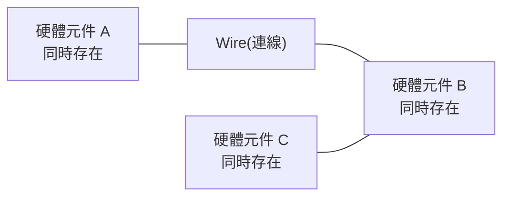
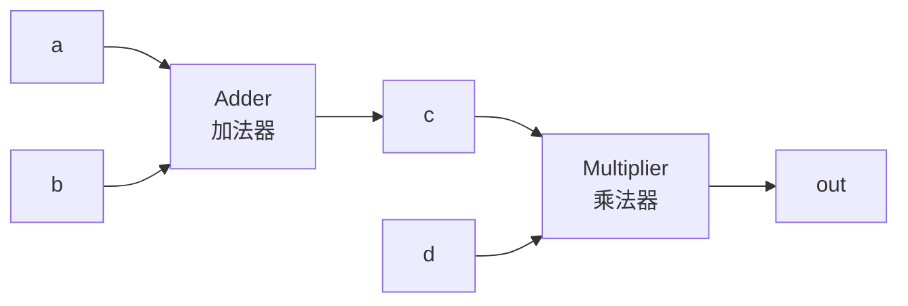
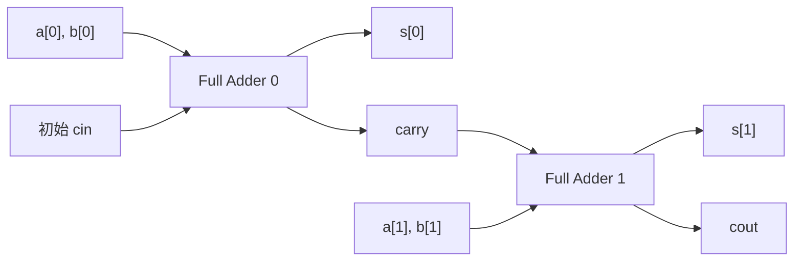
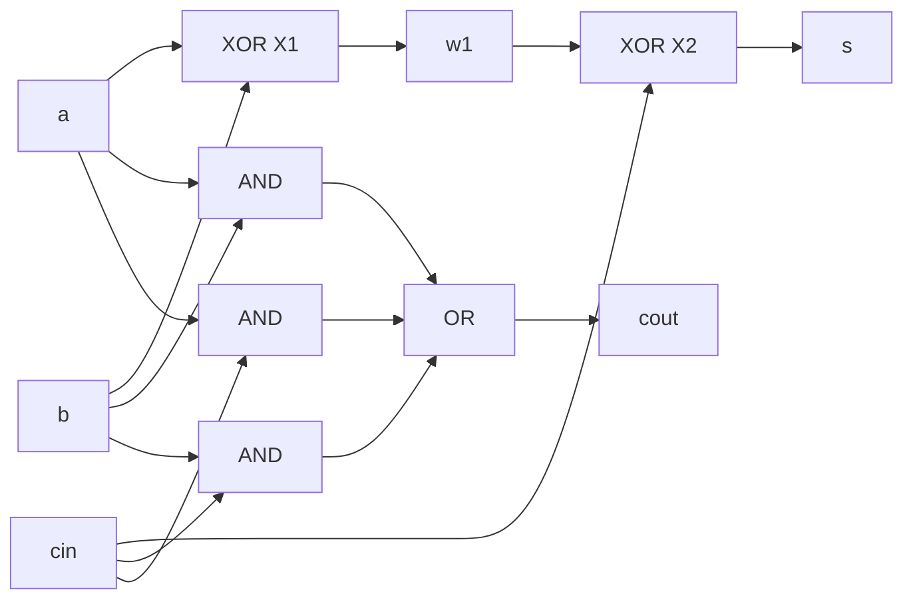
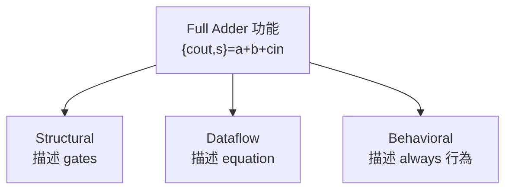
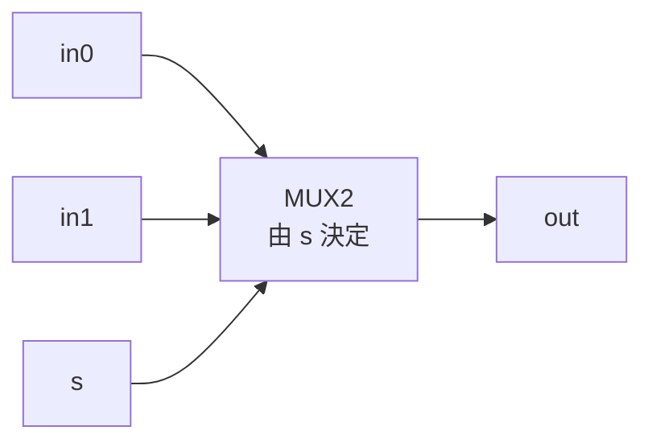
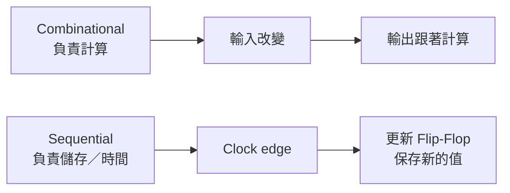
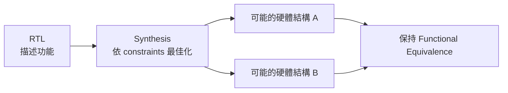

```text
TEXT HANDOFF | STATE={GOAL=從第2堂課的正課開始複習HDL並略過前段HW1說明; STAGE=Session=02正課起點; COMPLETED=HW1說明段依使用者明確要求跳過、不計為正課複習完成; VERIFIED=逐字稿_02於教授明確說continue our class後進入ch01正課，先總覽三種modeling、Verilog module架構與hardware parallelism; NEEDS_REVIEW=三種modeling概念、module組成、parallel hardware mental model; CURRENT=Session02 L459-L565; NEXT=完成本知識點練習後進入Full Adder三種modeling; BLOCKER=NONE; EVIDENCE=逐字稿Session02 L459-L565＋ch01投影片p4-p10} | PLAN={THIS_RESPONSE=從正課第一個自然知識點開始教Verilog整體架構與硬體平行性; EXPECTED_NEXT=批改練習後接Full Adder} | Phase A — Internal Control Surface（控制面輸出） | TURN=第 1 次對話 | PROMPT=1.16.1 | REFRESH=MANUAL_REFRESH_CONFIRMED | REFRESH_REMINDER=NONE | STATE={MainlineMode=Transcript; MainlineSource=逐字稿_02_0915_說明作業1.txt; Locator=Session02/L459-L565; KP=Verilog整體架構與Parallel Hardware Mental Model; Boundary=已核對L459-L565，後續轉入Full Adder例題; Transcript={File=逐字稿_02_0915_說明作業1.txt; Session=02; SessionSource=FilenamePrefix; WithinSessionOrder=NA; Span=L459-L565; Coverage=PARTIAL_FOR_SESSION/FULL_FOR_CURRENT_SPAN; TeachingState=TAUGHT_CORE; Signals=Explanation+Emphasis; Scope=三種modeling總覽、module結構、parallel coding、declaration基本概念; Correction=老師口頭曾把parameter說錯後立即自我修正; ASR=精確語法以ch01投影片校準; Residual=下一主題為Full Adder三種modeling}; Reference={Aligned=講義_ch01 p4-p10; PrecisionStatus=HIGH}; Practice={LearningObjective=能建立Verilog描述硬體而非逐行執行程式的mental model，並辨識module各組成; Modality=Classification+CodeReading+Explanation; ExpectedArtifact=文字答案; AcceptedSubmission=中文或英文; RequiredModality=NO; TaskOrigin=Generated; SourceReopened=NA; SourceIdentity=NA; ContentFidelity=GENERATED; SourceMatch=NA; AssessmentFidelity=Learning; SubmissionStatus=NOT_SUBMITTED}; AdjQueue=Full Adder定義→Structural/Dataflow/Behavioral modeling; ExerciseDebt=OPEN; TeachingMainlineDebt=後續正課內容尚未處理; AssessmentRequirementDebt=HW1相關內容依使用者要求DEFERRED; ReferenceResolutionDebt=NONE_HIGH_PRIORITY; PastExamDebt=對三種modeling有直接題但尚未到原題校準階段; Weakness=NONE; Coverage=本知識點教學待本輪輸出、能力尚未驗證; Completion=NOT_COMPLETE; Evidence=Transcript L459-L565+Slides p4-p10; Blockers=NONE; NextLegal=本KP練習→Full Adder} | PLAN={ThisResponse=教學並輸出3個Practice Tasks; ExpectedDebtChange=Exercise task output可完成，能力通過待作答; ExpectedNext=批改後進入Full Adder}
```

## ⭐Verilog 的整體架構與 Parallel Hardware(平行硬體) — 為什麼不能用寫 C/C++ 的腦袋讀 HDL？

主線位置：Teacher Transcript／`逐字稿_02_0915_說明作業1.txt`／Session=02／L459–L565
對齊參考：`講義_ch01_Verilog structural and dataflow modeling`／PDF viewer page 4–10

你指定跳過前面的作業介紹，所以我們從教授明確回到「正課」的地方開始。老師先說接下來兩週會處理 `Structural Modeling(結構式建模)`、`Dataflow Modeling(資料流建模)`、`Behavioral Modeling(行為式建模)`，以及 testbench、system task、compiler directive、operator、data type、module/port 等 Verilog 基礎。

### 1. 先建立整門 Verilog 最重要的 Mental Model(心智模型)

老師這裡反覆強調的核心不是某個語法，而是：

> **Verilog 描述的是「存在的硬體」，不是 CPU 接下來要逐行執行的指令。**

這句話會影響你後面幾乎所有觀念。

Software(軟體)通常想：

```text
第 1 行執行
↓
第 2 行執行
↓
第 3 行執行
```

Hardware(硬體)則應該想：



老師直接說：「這些硬體你寫出來之後，它們是會同時存在的」，因此 RTL 中的 concurrent hardware(並行硬體)不是「跑完一行再跑下一行」。

---

### 2. 為什麼這兩段 Verilog 代表相同硬體？

老師使用的例子是：

```verilog
assign c   = a + b;
assign out = c * d;
```

交換順序：

```verilog
assign out = c * d;
assign c   = a + b;
```

在這個例子中，兩者描述的是同一個硬體連接關係。正式投影片也明確寫著 Hardware programming is basically parallel coding，且這類 code 的 order does NOT matter。

為什麼？

不要把它看成：

```text
先算 c
再算 out
```

而要把它看成：



你只是用兩行 `assign` 描述：

$$
c=a+b
$$

以及

$$
out=c\times d
$$

Adder(加法器)和 Multiplier(乘法器)都實際存在，`c` 是把它們連起來的 wire/net(連線)。

所以把兩個 `assign` 在檔案中的上下順序交換，沒有改變這張電路圖。

---

### 3. 一個非常重要的防誤解

現在老師講的「order does not matter」是在建立 **concurrent hardware(並行硬體)** 的概念。

不要現在就自行推論成：

> 「所以 Verilog 裡任何地方所有 statement(敘述)的順序永遠都沒差。」

這會錯。

後面進入 `always block`、`blocking assignment (=)`、`nonblocking assignment (<=)` 時，還會進一步細分規則。

**目前只先牢牢記住：HDL 的第一層 mental model 是硬體並行存在。**

---

### 4. 一個 Verilog Module(模組)大致有哪些東西？

老師接著用整張架構圖介紹一個 Verilog module。

正式講義把它拆成：

1. `Declaration(宣告)`

   * input / output
   * parameter
   * data type
2. `Structural Model(結構式模型)`

   * module instantiation
3. `Dataflow Model(資料流模型)`

   * continuous assignment
4. `Behavior Model(行為式模型)`

   * procedural assignment

最後以 `endmodule` 結束。

可把它先想成：

```text
module ...
    ↓
宣告「這塊硬體有哪些接腳與內部訊號」
    ↓
描述「這塊硬體裡有哪些東西、怎麼運作」
    ↓
endmodule
```

老師也明確說，一般 code 中可能同時出現 structural、dataflow、behavioral 這些部分；不是規定一個 module 只能選其中一種。

---

### 5. `module` 到底是什麼？

先看講義範例：

```verilog
module M (P1, P2, P3, P4);

input P1, P2;
output [7:0] P3;
inout P4;

...

endmodule
```

老師暫時用「有點像 C/C++ function」來幫初學者理解，但馬上提醒這只是入門類比。

比較準確的想法是：

> `module` 定義一種 Hardware Component(硬體元件)。

例如：

```text
module adder
```

意思近似：

> 「我要定義一種叫 adder 的硬體。」

裡面的 `input` / `output` 則是它跟外界連接的 ports(連接埠)。

---

### 6. Port(連接埠)與 Bit Width(位元寬度)

老師接著解釋：

```verilog
input P1, P2;
```

沒有寫範圍時，目前可以先視為各自 **1 bit**。

而：

```verilog
output [7:0] P3;
```

表示：

```text
P3[7]
P3[6]
P3[5]
P3[4]
P3[3]
P3[2]
P3[1]
P3[0]
```

總共有：

$$
7-0+1=8\text{ bits}
$$

老師就是用這個例子說明 `P3` 是一組 8-bit output。

而：

```verilog
inout P4;
```

表示該 port 可以雙向使用。

目前最重要先會讀：

```text
[MSB:LSB]
```

例如：

```verilog
[31:0]
```

就是 32 bits。

---

### 7. 三種 Modeling Method(建模方法)先只建立輪廓

老師在這一段先給三種方法的角色，後面 Full Adder 才正式示範。

#### 7.1 Structural Modeling(結構式建模)

核心動作：

```text
instantiate module
```

也就是把某個已定義的 module **實體化成硬體**。

老師說 structural 常用在呼叫自己先前寫好的其他 module。

心智模型：

> 「這塊硬體是由哪些小硬體組起來的？」

---

#### 7.2 Dataflow Modeling(資料流建模)

核心 keyword：

```verilog
assign
```

例如：

```verilog
assign y = a + b;
```

心智模型：

> 「這條 output signal(輸出訊號)由哪些 input signal 經過什麼運算得到？」

老師明確說 Dataflow Modeling 基本上就是用 `assign` 描述這類計算。

---

#### 7.3 Behavioral Modeling(行為式建模)

核心結構：

```verilog
always ...
begin
    ...
end
```

心智模型：

> 「告訴 Verilog 這個硬體在某些條件下應該表現出什麼行為。」

老師目前只先建立概念，`always` 的真正規則稍後才會深入。

---

### 8. 第一個核心整理

先不要背一堆 syntax，先把這四句刻住：

| 看到什麼                     | 第一反應             |
| ------------------------ | ---------------- |
| `module`                 | 我正在定義一種硬體        |
| `assign`                 | 我正在描述訊號之間的連續資料關係 |
| instantiate 某 module     | 我正在放一份實際硬體       |
| 多個 concurrent statements | 不要先入為主認為它們是逐行執行  |

而三種 Modeling：

```text
Structural → 描述「怎麼組」
Dataflow   → 描述「怎麼算」
Behavioral → 描述「怎麼表現」
```

下一個實際授課知識點就是老師拿 **1-bit Full Adder(一位元全加器)**，真正用這三種方法各寫一次。

### 9. Practice Tasks(練習任務)

#### 9.1 Task 1

**Consider the following two Verilog descriptions. Do they represent the same hardware in the context taught so far? Explain why.**

```verilog
// Version A
assign c   = a + b;
assign out = c * d;

// Version B
assign out = c * d;
assign c   = a + b;
```

請回答：

`Same / Different + 原因`

#### 9.2 Task 2

**Classify each item as Declaration, Structural Modeling, Dataflow Modeling, or Behavioral Modeling.**

A.

```verilog
input [7:0] a;
```

B.

```verilog
assign y = a + b;
```

C.

```verilog
FA u0 (...);
```

D.

```verilog
always @(...)
begin
    ...
end
```

作答格式：

`A = ___, B = ___, C = ___, D = ___`

#### 9.3 Task 3

**Read the following port declarations and determine the width and direction of each port.**

```verilog
input        P1;
input  [3:0] P2;
output [7:0] P3;
inout        P4;
```

請填：

```text
P1: direction = ___, width = ___ bit(s)
P2: direction = ___, width = ___ bit(s)
P3: direction = ___, width = ___ bit(s)
P4: direction = ___, width = ___ bit(s)
```
```text
TEXT HANDOFF | STATE={GOAL=從第2堂正課依實際授課主線複習HDL; STAGE=Session=02正課／Full Adder; COMPLETED=前一知識點「Verilog整體架構與Parallel Hardware」之練習依使用者明確要求全部算對，Learning Practice視為通過且無Weakness；未據此宣稱Exam/PastExam Fidelity; VERIFIED=逐字稿正課下一自然知識點為1-bit Full Adder定義與三種modeling，之後才轉MUX2; NEEDS_REVIEW=Full Adder的carry、truth table、Structural/Dataflow/Behavioral差異、sensitivity list; CURRENT=Session02 L577-L676; NEXT=MUX2三種modeling; BLOCKER=NONE; EVIDENCE=逐字稿L577-L676＋ch01 p11-p14} | PLAN={THIS_RESPONSE=教Full Adder與三種modeling並安排code-oriented練習; EXPECTED_NEXT=批改/依使用者指示後進入MUX2} | Phase A — Internal Control Surface（控制面輸出） | TURN=第 1 次對話 | PROMPT=1.16.1 | REFRESH=MANUAL_REFRESH_CONFIRMED | REFRESH_REMINDER=NONE | STATE={MainlineMode=Transcript; MainlineSource=逐字稿_02_0915_說明作業1.txt; Locator=Session02/L577-L676; KP=Full Adder與三種Modeling Methods; Boundary=已核對，後續明確切換MUX2; Transcript={File=逐字稿_02_0915_說明作業1.txt; Session=02; SessionSource=FilenamePrefix; WithinSessionOrder=NA; Span=L577-L676; Coverage=FULL_FOR_CURRENT_SPAN; TeachingState=TAUGHT_CORE; Signals=Explanation+HomeworkRelation; Scope=FA定義、carry chain、truth table、Dataflow、Behavioral、Sensitivity List，Structural於正課快速承接先前內容; Correction=投影片dataflow建議式缺少等號，老師口頭明確更正; ASR=精確Boolean式與code以ch01講義校準; Residual=下一主題MUX2}; Reference={Aligned=ch01 PDF viewer p11-p14; PrecisionStatus=HIGH}; Practice={LearningObjective=能解釋FA並讀寫三種modeling、正確理解sensitivity list; Modality=CodeReading+CodeWriting; ExpectedArtifact=Verilog/短答; AcceptedSubmission=文字或code; RequiredModality=YES_FOR_CODE_SKILL; TaskOrigin=Generated; SourceReopened=NA; SourceIdentity=NA; ContentFidelity=GENERATED; SourceMatch=NA; AssessmentFidelity=Learning; SubmissionStatus=NOT_SUBMITTED}; AdjQueue=MUX2→Combinational vs Sequential; ExerciseDebt=OPEN; TeachingMainlineDebt=後續正課尚未處理; AssessmentRequirementDebt=三種modeling寫code能力尚未以artifact展示; ReferenceResolutionDebt=NONE; PastExamDebt=存在直接三種modeling題，尚未清償; Weakness=NONE; Coverage=前一KP learning通過，本KP開始; Completion=PREVIOUS_KP_COMPLETE_CURRENT_KP_NOT_COMPLETE; Evidence=使用者明確要求前題全部算對＋Transcript/Slides; Blockers=NONE; NextLegal=本KP練習→MUX2} | PLAN={ThisResponse=完整教學Full Adder並輸出3個Practice Tasks; ExpectedDebtChange=Exercise task輸出後待使用者artifact驗證code能力; ExpectedNext=MUX2}
```

## ⭐1. Full Adder(全加器) — 為什麼 1-bit 加法還需要 `cin` 與 `cout`？

主線位置：Teacher Transcript／`逐字稿_02_0915_說明作業1.txt`／Session=02／L577–L676
對齊參考：`講義_ch01_Verilog structural and dataflow modeling`／PDF viewer page 11–14

### 1.1 先從問題開始：1 bit + 1 bit 為什麼不夠放？

假設：

$$
a=1,\qquad b=1
$$

相加得到：

$$
1+1=2=10_2
$$

問題來了：輸入各只有 1 bit，但結果可能需要 **2 bits**。

因此 Full Adder(全加器)把結果拆成：

$$
\{cout,s\}
$$

其中：

* `s` = Sum(和)，目前這一位的結果
* `cout` = Carry-out(進位輸出)，送給更高一位

所以當：

$$
a=1,\ b=1,\ cin=0
$$

就得到：

$$
\{cout,s\}=10_2
$$

也就是：

$$
cout=1,\qquad s=0
$$

老師正是用 `1 + 1 = 10₂` 解釋為什麼一個 Full Adder 需要獨立的 `cout`。

---

### 1.2 那 `cin` 又是什麼？

因為多位元加法不是每一位彼此獨立。

例如：

```text
   1 1
 + 0 1
 -----
```

最低位：

$$
1+1=10_2
$$

會產生一個進位 `1`。

這個進位不能消失，它必須送到**下一個 bit**：



所以核心關係是：

$$
cout_i \rightarrow cin_{i+1}
$$

老師也明確把多位元 Full Adder 描述成「上一個 bit 的 `C_out` 變成下一個 bit 的 `C_in`」。

這就是後面 `Ripple Carry Adder(漣波進位加法器)` 的基本概念。

---

### 1.3 Full Adder 的 Truth Table(真值表)

Full Adder 有三個 1-bit input：

$$
a,\ b,\ cin
$$

因此輸入組合數：

$$
2^3=8
$$

講義列出的 truth table 為：

| `a` | `b` | `cin` | `s` | `cout` |
| --: | --: | ----: | --: | -----: |
|   0 |   0 |     0 |   0 |      0 |
|   0 |   0 |     1 |   1 |      0 |
|   0 |   1 |     0 |   1 |      0 |
|   0 |   1 |     1 |   0 |      1 |
|   1 |   0 |     0 |   1 |      0 |
|   1 |   0 |     1 |   0 |      1 |
|   1 |   1 |     0 |   0 |      1 |
|   1 |   1 |     1 |   1 |      1 |

其實不用死背這張表。

你只要記：

$$
a+b+cin
$$

最大值是：

$$
1+1+1=3=11_2
$$

然後把二進位結果拆成：

$$
\boxed{\{cout,s\}=a+b+cin}
$$

這個式子會非常重要。

---

### 1.4 Boolean Function(布林函數)

講義給出的正式表示為：

$$
s=a\oplus b\oplus cin
$$

以及：

$$
cout=(a\land b)\lor(b\land cin)\lor(a\land cin)
$$

也就是：

```verilog
s    = a ^ b ^ cin;
cout = (a & b) | (b & cin) | (a & cin);
```

講義 page 11 就是以這兩個 Boolean functions 定義 Full Adder。

但老師後面更偏好你理解：

```verilog
{cout, s} = a + b + cin;
```

原因是它直接表達「我要做加法」，可讀性更高。

---

### 1.5 Structural Modeling(結構式建模)

Structural 的意思是：

> 我直接告訴 Verilog：這個 Full Adder 是由哪些 gates(邏輯閘)接出來的。

依講義結構：

```verilog
module FA_structure (
    input  a, b, cin,
    output s, cout
);

wire w1, w2, w3, w4;

xor X1 (w1, a, b);
xor X2 (s,  w1, cin);

and A1 (w2, a, b);
and A2 (w3, b, cin);
and A3 (w4, a, cin);

or O1 (cout, w2, w3, w4);

endmodule
```

這裡：

```verilog
xor X1 (w1, a, b);
```

不是「呼叫 XOR function 算一次」。

它的意思是：

> 實體化一顆 XOR gate，instance name(實例名稱)叫 `X1`。

整個電路就是：



講義正式說 Structural Modeling 是 instantiate lower-level gates/modules，這個 FA 由 XOR、AND、OR 組成。

最短記法：

> **Structural = 我告訴你「硬體怎麼接」。**

---

### 1.6 Dataflow Modeling(資料流建模)

Dataflow 不再逐顆 gate 描述，而是描述「訊號之間的數學／邏輯關係」。

講義版本：

```verilog
module FA_dataflow (
    input  a, b, cin,
    output s, cout
);

assign s =
    (a ^ b) ^ cin;

assign cout =
    (a & b) |
    (b & cin) |
    (a & cin);

endmodule
```

`assign` 是 `Continuous Assignment(連續指定)`。

也就是只要 RHS(right-hand side，等號右側)的 input 改變，硬體輸出就會依這個關係更新。

講義也推薦更直接的寫法：

```verilog
assign {cout, s} = a + b + cin;
```

這裡的：

```verilog
{cout, s}
```

是 `Concatenation(串接)`。

因為 `cout` 與 `s` 都是 1 bit：

$$
\{cout,s\}
$$

合起來就是 2-bit signal。

左邊 `cout` 是 MSB(Most Significant Bit，最高有效位元)，右邊 `s` 是 LSB(Least Significant Bit，最低有效位元)。

所以：

```verilog
assign {cout, s} = a + b + cin;
```

其實就是非常漂亮地表示：

$$
\boxed{\text{2-bit result}=a+b+cin}
$$

Dataflow 的正式講義重點就是 operator + `assign`。

另外有一個重要的 `Teacher Correction(老師更正)`：投影片上的建議寫法少了一個 `=`，老師上課有當場指出「這邊少一個等號」。正確應是：

```verilog
assign {cout, s} = a + b + cin;
```

不是：

```verilog
assign {cout, s} a + b + cin;
```

老師有明確口頭修正這個投影片 typo。

---

### 1.7 Behavioral Modeling(行為式建模)

第三種是描述 high-level behavior(高階行為)。

講義使用：

```verilog
module FA_behavior (
    input a, b, cin,
    output reg s, cout
);

always @(a or b or cin)
begin
    {cout, s} = a + b + cin;
end

endmodule
```

Behavioral Modeling 使用：

```verilog
always
```

而 `always` 裡面的 assignment 是：

`Procedural Assignment(程序式指定)`。

因此講義特別指出，在傳統 Verilog 語法中這裡 LHS(left-hand side，等號左側)要宣告為 `reg`。

注意：

> 這裡宣告 `reg` **不代表一定會合成出 Flip-Flop(正反器)**。

目前這個 Full Adder 還是在描述 combinational behavior(組合邏輯行為)。

真正會不會形成 storage element(儲存元件)，之後老師會再用 coding pattern 解釋。

---

### 1.8 `Sensitivity List(敏感度列表)` 是什麼？

這是這段的新觀念。

看：

```verilog
always @(a or b or cin)
```

括號裡：

```text
a
b
cin
```

就是 `Sensitivity List(敏感度列表)`。

老師的解釋是：

> 當 sensitivity list 中任一訊號發生變化，這個 `always` block 就會重新執行。

例如：

```text
a: 0 → 1
```

會觸發。

或者：

```text
b: 1 → 0
```

也會觸發。

或者：

```text
cin: 0 → 1
```

也會觸發。

老師特別指出，這三個正好都是：

```verilog
{cout, s} = a + b + cin;
                  ↑ ↑   ↑
```

RHS 上會影響結果的 signals。

因此 combinational logic 中很重要的直覺是：

> **會影響輸出的輸入變數，都應該能觸發重新計算。**

老師在正課中正式把這些訊號稱作 `sensitivity list`，並說通常會把 RHS variables 都放進去。

---

### 1.9 三種寫法其實在描述同一件事情

你現在要建立的是這張對照：

| 方法         | 你告訴 Verilog 什麼 | Full Adder 寫法的核心             |
| ---------- | -------------- | ---------------------------- |
| Structural | 實際 gates 怎麼接   | `xor`, `and`, `or` instances |
| Dataflow   | 訊號的數學／邏輯關係     | `assign {cout,s} = ...`      |
| Behavioral | 什麼條件下執行什麼行為    | `always @(...)`              |

三者的 abstraction level(抽象程度)不同，但功能可以完全相同。



老師也說 Full Adder 可以有不同 circuit implementation，只要最後 function 正確即可。

這點很重要：

> **Functionally Equivalent(功能等價) 不代表內部描述方式一定一樣。**

---

### 1.10 考試先記這個版本

第一堂課老師曾明確提醒「三種 modeling technique」很可能成為考試形式，甚至舉例可能要求你對一個 adder 分別寫三種 modeling。

所以這個知識點不能只做到「看得懂」。

至少要會：

```text
Structural → 看得懂／會 instantiate
Dataflow   → 會用 assign
Behavioral → 會用 always + sensitivity list
```

而最重要的一行是：

```verilog
{cout, s} = a + b + cin;
```

它同時把：

`carry`、`concatenation`、`bit width`、`adder function`

四個概念串起來。

---

### 1.11 Practice Tasks(練習任務)

#### 1.11.1 Task 1

**For a 1-bit full adder, determine `cout` and `s`.**

給定：

```text
a   = 1
b   = 0
cin = 1
```

請回答：

```text
cout = ?
s    = ?
```

並用：

$$
a+b+cin
$$

快速驗證。

#### 1.11.2 Task 2

**Identify the modeling method used by each code segment.**

A.

```verilog
xor X1(w1, a, b);
xor X2(s, w1, cin);
```

B.

```verilog
assign {cout, s} = a + b + cin;
```

C.

```verilog
always @(a or b or cin)
begin
    {cout, s} = a + b + cin;
end
```

作答：

```text
A = ___
B = ___
C = ___
```

#### 1.11.3 Task 3

**Write a complete 1-bit full-adder module using Dataflow Modeling.**

條件：

```text
inputs : a, b, cin
outputs: s, cout
```

Required Modality：Verilog code

你可以直接寫完整：

```verilog
module ...
...
endmodule
```


```text
TEXT HANDOFF | STATE={GOAL=從第2堂正課依實際授課主線複習HDL; STAGE=Session=02正課／MUX2; COMPLETED=前一知識點Full Adder教學已完成，上一輪練習依使用者明確要求全部算對；因Code Task原為Required Modality，僅視為Learning Practice答對，不宣稱實際code artifact能力或Exam/PastExam Fidelity已驗證; VERIFIED=逐字稿下一自然知識點為MUX2，老師快速示範三種modeling後立即轉Combinational vs Sequential; NEEDS_REVIEW=MUX2 select邏輯、conditional operator、三種modeling可讀性; CURRENT=Session02 L675-L687; NEXT=Combinational Logic vs Sequential Logic; BLOCKER=NONE; EVIDENCE=逐字稿L675-L687＋ch01 p15-p16} | PLAN={THIS_RESPONSE=依老師實際深度快速教完MUX2並安排輕量練習; EXPECTED_NEXT=批改或依使用者指示後進入Combinational vs Sequential} | Phase A — Internal Control Surface（控制面輸出） | TURN=第 2 次對話 | PROMPT=1.16.1 | REFRESH=NO_REFRESH_MAIN_INTENT_IS_CONTINUE | REFRESH_REMINDER=NONE | STATE={MainlineMode=Transcript; MainlineSource=逐字稿_02_0915_說明作業1.txt; Locator=Session02/L675-L687; KP=MUX2三種Modeling; Boundary=已核對，L688起明確轉Combinational vs Sequential; Transcript={File=逐字稿_02_0915_說明作業1.txt; Session=02; SessionSource=FilenamePrefix; WithinSessionOrder=NA; Span=L675-L687; Coverage=FULL_FOR_CURRENT_SPAN; TeachingState=TAUGHT_BRIEF; Signals=Explanation+Scope; Scope=MUX2功能、Structural/Dataflow/Behavioral快速比較、sensitivity list、conditional operator; Correction=NONE_EXPLICIT; ASR=逐字稿一處select敘述與正式truth table相反，依Precision Authority保留為口語/ASR不一致; Residual=下一主題Combinational vs Sequential}; Reference={Aligned=ch01 PDF viewer p15-p16; PrecisionStatus=HIGH_WITH_SLIDE_TYPO_NOTE}; Practice={LearningObjective=能依select判斷MUX2輸出並辨識較可讀的Dataflow/Behavioral寫法; Modality=Trace+CodeReading; ExpectedArtifact=短答; AcceptedSubmission=中文或英文; RequiredModality=NO; TaskOrigin=Generated; SourceReopened=NA; SourceIdentity=NA; ContentFidelity=GENERATED; SourceMatch=NA; AssessmentFidelity=Learning; SubmissionStatus=NOT_SUBMITTED}; AdjQueue=Combinational vs Sequential; ExerciseDebt=OPEN; TeachingMainlineDebt=後續正課尚未處理; AssessmentRequirementDebt=三種modeling實際code artifact能力仍未獨立驗證; ReferenceResolutionDebt=MUX2投影片Dataflow第一行疑似typo已由同頁truth table/conditional/behavioral code交叉解析; PastExamDebt=三種modeling直接題仍未清償; Weakness=NONE; Coverage=FA learning視為答對，MUX2開始; Completion=PREVIOUS_KP_LEARNING_PASSED_CURRENT_KP_NOT_COMPLETE; Evidence=使用者明確要求算對＋Transcript/Slides; Blockers=NONE; NextLegal=MUX2輕量練習→Combinational vs Sequential} | PLAN={ThisResponse=完成TAUGHT_BRIEF深度MUX2教學並輸出2題; ExpectedDebtChange=Exercise Task輸出後待作答/使用者明確處理; ExpectedNext=Combinational vs Sequential}
```

## ⭐MUX2(Multiplexer，二對一多工器) — 怎麼用一個 `select` 決定哪個輸入送到輸出？

主線位置：Teacher Transcript／`逐字稿_02_0915_說明作業1.txt`／Session=02／L675–L687
對齊參考：`講義_ch01_Verilog structural and dataflow modeling`／PDF viewer page 15–16

這一段老師明確說 **不深入講**，主要把 MUX2 當第二個例子，讓你再看一次三種 `Modeling(建模)` 的差異；講完就直接進入下一個大主題 `Combinational vs. Sequential Logic`。

### 1. MUX2 到底在做什麼？

MUX2 有：

* `in0`
* `in1`
* `s`：Select Signal(選擇訊號)
* `out`

規則極簡單：

$$
s=0 \Rightarrow out=in0
$$

$$
s=1 \Rightarrow out=in1
$$

正式講義的 Truth Table(真值表)也是這個關係。

可以把它想像成電子開關：



---

### 2. Boolean Function(布林函數)

當 `s=0` 時，希望 `in0` 通過；因此要搭配：

$$
\overline{s}
$$

當 `s=1` 時，希望 `in1` 通過。

所以：

$$
\boxed{out=(in0\land \overline{s})\lor(in1\land s)}
$$

講義 page 15 就是這個公式。

例如：

$$
s=0,\ in0=1,\ in1=0
$$

則：

$$
out=(1\cdot1)+(0\cdot0)=1
$$

也就是選 `in0`。

---

### 3. Structural Modeling(結構式建模)

直接用 gate：

```verilog
wire sb, w0, w1;

not NOT1(sb, s);
and A0(w0, in0, sb);
and A1(w1, in1, s);
or  O1(out, w0, w1);
```

邏輯就是：

```text
sb = NOT s

w0 = in0 AND sb
w1 = in1 AND s

out = w0 OR w1
```

也就是直接把剛剛的 Boolean expression 拆成實際 NOT、AND、OR gates。講義 page 16 將這列為 Structural Modeling。

老師這裡順便給了一個實務觀點：

> 用一顆一顆 primitive gate 寫功能通常太 low-level、可讀性較差；他更常在「instantiate 自己寫好的 module」時使用 Structural Modeling。

---

### 4. Dataflow Modeling(資料流建模)：`?:`

MUX 最漂亮的寫法之一就是：

```verilog
assign out = s ? in1 : in0;
```

這是 `Conditional Operator(條件運算子)`：

```text
condition ? true_value : false_value
```

所以：

```text
s ? in1 : in0
```

等於：

```text
s == 1 → in1
s == 0 → in0
```

這其實就是「MUX」本身的語意。

講義 page 16 也直接把這種寫法標成 suggested。

---

### 5. Behavioral Modeling(行為式建模)

Behavioral 就直接把行為寫成人類很好懂的：

```verilog
always @(in0 or in1 or s)
begin
    if (s == 1)
        out = in1;
    else
        out = in0;
end
```

讀起來就是：

> 如果 `s=1`，選 `in1`；否則選 `in0`。

Sensitivity List(敏感度列表)為：

```text
in0, in1, s
```

因為三者任一改變，都可能讓 `out` 改變。老師也特別點出這份 sensitivity list。

---

### 6. 這頁教材有一個要小心的地方

正式講義 page 16 的 Dataflow code 文字解析顯示：

```verilog
assign s = (in0 & (~s)) | (in1 & s);
```

但同一頁的註解版明確寫：

```verilog
assign out = s ? in1 : in0;
```

而前一頁 truth table 與 Behavioral code 也都表示被指定的是 `out`。因此這裡的 `assign s = ...` 與其餘來源不一致；依本課 `Precision Authority(精確內容權威)` 交叉核對，學習時應以：

```verilog
assign out = (in0 & (~s)) | (in1 & s);
```

來理解。

逐字稿裡也有一處口頭敘述把 `s=0/1` 所選輸入說反，但老師同一段指向的正式 truth table、conditional operator 與 behavioral code 是一致的，所以不採用那句矛盾口述作精確規則。

---

### 7. 三種寫法的差別再收斂一次

同一個：

$$
out=s?in1:in0
$$

可以寫成：

```text
Structural
↓
NOT + AND + AND + OR gates
```

```text
Dataflow
↓
assign out = s ? in1 : in0;
```

```text
Behavioral
↓
if (s == 1) out = in1;
else        out = in0;
```

功能一樣，只是 abstraction level(抽象層級)不同。

而老師這裡的重點其實是：

> **對這種單純功能關係，Dataflow / Behavioral 通常比逐顆 gate 的 Structural 更直觀。**

### 8. Practice Tasks(練習任務)

#### 8.1 Task 1

**Determine the output of the MUX2.**

```text
in0 = 0
in1 = 1
s   = 1
```

`out = ?`

#### 8.2 Task 2

**Complete the Dataflow statement.**

```verilog
assign out = ___ ? ___ : ___;
```

目標規則：

```text
s = 0 → out = in0
s = 1 → out = in1
```

只要回 Task 1、2 即可。


```text
TEXT HANDOFF | STATE={GOAL=從第2堂正課依實際授課主線複習HDL; STAGE=Session=02正課／Combinational vs Sequential; COMPLETED=MUX2屬TAUGHT_BRIEF，上一輪練習依使用者明確要求全部算對，Learning Practice視為通過且無Weakness；不宣稱Exam/PastExam Fidelity; VERIFIED=逐字稿接續正式進入Combinational/Sequential並延伸到老師稱為全課最重要之一的coding-pattern整理表; NEEDS_REVIEW=Combinational/Sequential、assign/always、wire/reg、=/<=、continuous/procedural、always@(*); CURRENT=Session02 L689-L783; NEXT=休息後Module Definition與Ports; BLOCKER=NONE; EVIDENCE=逐字稿L689-L783＋ch01 p17-p19} | PLAN={THIS_RESPONSE=教清Combinational/Sequential與三種核心coding pattern並安排3題; EXPECTED_NEXT=依使用者作答或指定後進入Module Definition} | Phase A — Internal Control Surface（控制面輸出） | TURN=第 3 次對話 | PROMPT=1.16.1 | REFRESH=NO_REFRESH_MAIN_INTENT_IS_CONTINUE | REFRESH_REMINDER=NONE | STATE={MainlineMode=Transcript; MainlineSource=逐字稿_02_0915_說明作業1.txt; Locator=Session02/L689-L783; KP=Combinational vs Sequential＋核心Coding Pattern Table; Boundary=已核對至老師宣布休息，後續轉Module Definition; Transcript={File=逐字稿_02_0915_說明作業1.txt; Session=02; SessionSource=FilenamePrefix; WithinSessionOrder=NA; Span=L689-L783; Coverage=FULL_FOR_CURRENT_SPAN; TeachingState=TAUGHT_CORE; Signals=Explanation+Emphasis; Scope=組合/循序邏輯、storage、clock cycle、always@(*)、assign、wire/reg、blocking/nonblocking、continuous/procedural; Correction=NONE_EXPLICIT; ASR=低風險; Residual=老師於本段收束後休息}; Reference={Aligned=ch01 PDF viewer p17-p19; PrecisionStatus=HIGH_WITH_ONE_SOURCE_CONFLICT}; Practice={LearningObjective=能依電路需求選擇三種核心Verilog pattern與正確LHS datatype/operator; Modality=Classification+CodeCompletion; ExpectedArtifact=文字/code; AcceptedSubmission=中文英文或Verilog; RequiredModality=NO; TaskOrigin=Generated; SourceReopened=NA; SourceIdentity=NA; ContentFidelity=GENERATED; SourceMatch=NA; AssessmentFidelity=Learning; SubmissionStatus=NOT_SUBMITTED}; AdjQueue=Module Definition→Ports; ExerciseDebt=OPEN; TeachingMainlineDebt=後續正課尚未處理; AssessmentRequirementDebt=NONE_NEW; ReferenceResolutionDebt=LOW：p17 clocked例子使用=，但p18-p19與老師反覆口頭規則為<=，保留此來源不一致; PastExamDebt=P0_DEFERRED：考古題A-Q6直接考blocking/nonblocking synthesis，但詳細語意尚未正式展開; Weakness=NONE; Coverage=MUX2 learning通過，本KP開始; Completion=PREVIOUS_KP_COMPLETE_CURRENT_KP_NOT_COMPLETE; Evidence=使用者明確要求前題算對＋Transcript/Slides; Blockers=NONE; NextLegal=本KP練習→Module Definition} | PLAN={ThisResponse=完成本核心知識點並輸出3題; ExpectedDebtChange=Exercise Task輸出後待處理; ExpectedNext=Module Definition}}
```

## ⭐Combinational Logic vs. Sequential Logic — 這張表為什麼幾乎決定你 Verilog 該怎麼寫？

主線位置：Teacher Transcript／`逐字稿_02_0915_說明作業1.txt`／Session=02／L689–L783
對齊參考：`講義_ch01_Verilog structural and dataflow modeling`／PDF viewer page 17–19

老師在這段把前面散落的名詞全部收斂成一張規則表，而且直接把它稱作「整門課最重要的部分」之一。核心不是背十幾個名詞，而是看到你想描述的硬體後，能立刻決定該用哪種 coding pattern。

---

### 1. 第一刀：Combinational(組合邏輯) vs. Sequential(循序邏輯)

`Combinational Logic(組合邏輯)`主要負責 computation(計算)。它沒有 Flip-Flop(正反器)或 Latch(鎖存器)這類儲存元件；輸入一改變，計算結果就跟著反映。

`Sequential Logic(循序邏輯)`則有 storage element(儲存元件)，老師這裡主要以 Flip-Flop 說明。它可以保留先前的資料，因此除了「現在輸入是什麼」，還牽涉「前一個 clock cycle 存了什麼」。

最簡化的心智模型：



老師形容 Flip-Flop 很像「一面一面的牆」：資料跑到牆前面，要等 `clock edge(時脈邊緣)` 才往下一段推。這就是為什麼 Verilog debugging(除錯)時要很在意「第幾個 clock cycle 每個 register 裡到底存什麼」。

---

### 2. Pattern A：`assign` → Combinational

最簡單的形式：

```verilog
wire c;
assign c = a + b;
```

這堂課的規則表把它整理成：

| 項目           | 規則                          |
| ------------ | --------------------------- |
| Modeling     | Dataflow Modeling(資料流建模)    |
| Assignment   | Continuous Assignment(連續指定) |
| LHS datatype | `wire`                      |
| Logic        | Combinational               |
| Operator     | `=`                         |

老師特別強調：

```verilog
assign [wire] = ...
```

看到 `assign`，左邊在傳統 Verilog 就要用 `wire`。

為什麼叫 `Continuous Assignment`？

因為你可以把它想成真正接著一條硬體線：

```text
a,b 改變
  ↓
加法器的輸出跟著改
  ↓
c 跟著改
```

沒有在等 clock。

---

### 3. Pattern B：`always @(*)` → 也是 Combinational

例如：

```verilog
reg c;

always @(*) begin
    c = a + b;
end
```

這也是在描述組合邏輯，但換成 `Behavioral Modeling(行為式建模)`。

規則表：

| 項目           | 規則                           |
| ------------ | ---------------------------- |
| Modeling     | Behavioral                   |
| Assignment   | Procedural Assignment(程序式指定) |
| LHS datatype | `reg`                        |
| Logic        | Combinational                |
| Operator     | Blocking Assignment `=`      |

所以：

```text
assign       → LHS 用 wire
always block → LHS 用 reg
```

這是老師要求現階段直接掌握的 Verilog syntax rule。

---

### 4. `always @(*)` 的 `*` 到底是什麼？

前面 Full Adder 我們寫過：

```verilog
always @(a or b or cin)
```

如果 block 很大，裡面用了十幾個 input，你一個一個寫 sensitivity list 很容易漏。

因此可以寫：

```verilog
always @(*)
```

按照老師這堂課的說法，`*` 就讓你不用手動列出會影響計算的 RHS signals；老師甚至說他大約 99% 的情況都直接使用這種寫法。

例如：

```verilog
always @(*) begin
    y = a + b + c + d;
end
```

就不用寫：

```verilog
always @(a or b or c or d)
```

---

### 5. Pattern C：`always @(posedge clk)` → Sequential

這是第三個、也是完全不同角色的 pattern：

```verilog
reg q;

always @(posedge clk) begin
    q <= d;
end
```

`posedge` = Positive Edge(正緣)，也就是：

```text
clk: 0 → 1
```

只有碰到這個 edge，block 才觸發。

這堂課的規則表是：

| 項目           | 規則                           |
| ------------ | ---------------------------- |
| Modeling     | Behavioral                   |
| Assignment   | Procedural                   |
| LHS datatype | `reg`                        |
| Logic        | Sequential                   |
| Operator     | Non-blocking Assignment `<=` |

老師目前要求先記：

```text
Combinational always @(*) → =
Sequential clocked always → <=
```

而且他特別說 **blocking / non-blocking 名稱背後真正的原因現在先不深入**，之後還會再教；此處先掌握 coding rule。

---

### 6. 這三個 Pattern 必須變成本能

整張核心表可以壓成：

| 你想描述什麼                 | Pattern                 | LHS datatype | Assignment        |
| ---------------------- | ----------------------- | ------------ | ----------------- |
| 簡單 Combinational       | `assign ...`            | `wire`       | `=`               |
| 較複雜 Combinational      | `always @(*)`           | `reg`        | `=` Blocking      |
| Sequential / Flip-Flop | `always @(posedge clk)` | `reg`        | `<=` Non-blocking |

正式講義 page 18–19 就是這張整理表；老師要求至少一定要會讀這張表。

最短口訣：

```text
assign          → wire → =
always @(*)     → reg  → =
always @(clock) → reg  → <=
```

---

### 7. Continuous vs. Procedural 不要被名字搞亂

看到：

```verilog
assign y = ...
```

叫做：

`Continuous Assignment(連續指定)`。

看到：

```verilog
always @(...)
```

裡面的 assignment 則叫：

`Procedural Assignment(程序式指定)`。

所以：

```text
Dataflow Modeling  ↔ Continuous Assignment
Behavioral Modeling ↔ Procedural Assignment
```

老師特別說這些名詞看起來很多，但其實是在從不同角度描述同一組 coding categories；理解彼此對應，比死背字面更重要。

---

### 8. Combinational 同一個功能，可以用兩種方式寫

例如 MUX：

Dataflow：

```verilog
wire out;
assign out = s ? in1 : in0;
```

Behavioral：

```verilog
reg out;

always @(*) begin
    if (s == 1)
        out = in1;
    else
        out = in0;
end
```

兩者都可以描述 **Combinational Logic**。

所以不要產生這個錯誤觀念：

```text
Dataflow = Combinational
Behavioral = Sequential
```

這是錯的。

正確是：

```text
Dataflow + assign
→ 通常是 Combinational

Behavioral + always @(*)
→ 可以是 Combinational

Behavioral + clock-edge always
→ 可以是 Sequential
```

---

### 9. 一個來源不一致要特別留下來

講義 page 17 的 clocked 範例文字用了：

```verilog
always @(posedge clk)
    c = a + b;
```

但緊接著 page 18–19 的總整理表，以及老師本堂反覆口頭強調的 coding rule 都是：

```verilog
always @(posedge clk)
    c <= a + b;
```

也就是 Sequential / Flip-Flop 使用 `Non-blocking Assignment (<=)`。這裡我不把 page 17 的 `=` 靜默改掉；它和後續正式整理表存在來源不一致。本輪依老師重複強調的規則表學習 `<=`，並保留這個來源差異。 

---

### 10. Debug(除錯)時怎麼用這個 Mental Model？

老師這裡還給了一個非常實用的想法：

如果你預期：

```text
cycle 6 → output 應該出現答案
```

結果 waveform 顯示：

```text
cycle 7 → 才出現答案
```

那代表你的 timing / stored state 跟預期錯了一個 cycle。

所以除錯時不是只問：

> 「這個式子算得對不對？」

還要問：

> 「這個值應該在哪一個 clock cycle 被存進哪個 Flip-Flop？」

這就是 Sequential Logic 和普通軟體思考差最多的地方之一。

另外，考古題 A 第 6 題確實直接考到 Blocking / Non-blocking 與 Shift Register 的 synthesis 結果；但老師目前只教到基本 coding rule，還沒深入 blocking/non-blocking 的執行語意，所以這題先登記，暫時不拿來反客為主。

### 11. Practice Tasks(練習任務)

#### 11.1 Task 1

**Classify each block as Combinational or Sequential Logic.**

A.

```verilog
assign y = a & b;
```

B.

```verilog
always @(*) begin
    y = a & b;
end
```

C.

```verilog
always @(posedge clk) begin
    y <= d;
end
```

作答：

```text
A = ___
B = ___
C = ___
```

#### 11.2 Task 2

**Complete the coding-rule table.**

| Pattern                 | LHS datatype | Assignment |
| ----------------------- | ------------ | ---------- |
| `assign y = ...`        | ___          | `=`        |
| `always @(*)`           | ___          | ___        |
| `always @(posedge clk)` | ___          | ___        |

#### 11.3 Task 3

**Choose the correct Verilog pattern for this requirement:**

> Register `q` must capture the value of `d` on every positive clock edge.

請從下列三個選一個：

```verilog
// A
assign q = d;

// B
always @(*) begin
    q = d;
end

// C
always @(posedge clk) begin
    q <= d;
end
```

只要回 `1、2、3` 的答案即可。


```text
TEXT HANDOFF | STATE={GOAL=從第2堂正課依實際授課主線複習HDL; STAGE=Session=02正課／Module Definition與Synthesis Mental Model; COMPLETED=前一知識點Combinational/Sequential與核心Coding Pattern之練習依使用者明確要求全部算對，Learning Practice視為通過且無Weakness；不宣稱Blocking/Non-blocking考古題或Exam Fidelity已完成; VERIFIED=老師休息後明確說後續內容會較快帶過，接著複習Module Definition、Truth Table/Waveform、SystemVerilog logic與Synthesis functional equivalence，之後切換MUX4; NEEDS_REVIEW=module/ports/bit-width、RTL宣告與實際合成硬體之差異、functional equivalence; CURRENT=Session02 L807-L823; NEXT=MUX4與case/default coding style; BLOCKER=NONE; EVIDENCE=逐字稿L807-L823＋ch01 p20-p22} | PLAN={THIS_RESPONSE=依TAUGHT_BRIEF深度整理Module Definition與Synthesis Mental Model並安排2題輕量練習; EXPECTED_NEXT=進入MUX4與default/latch規則} | Phase A — Internal Control Surface（控制面輸出） | TURN=第 4 次對話 | PROMPT=1.16.1 | REFRESH=NO_REFRESH_MAIN_INTENT_IS_CONTINUE | REFRESH_REMINDER=NONE | STATE={MainlineMode=Transcript; MainlineSource=逐字稿_02_0915_說明作業1.txt; Locator=Session02/L807-L823; KP=Module Definition+Waveform/Synthesis+Functional Equivalence; Boundary=已核對，後續轉MUX4 Structural Modeling; Transcript={File=逐字稿_02_0915_說明作業1.txt; Session=02; SessionSource=FilenamePrefix; WithinSessionOrder=NA; Span=L807-L823; Coverage=FULL_FOR_CURRENT_SPAN; TeachingState=TAUGHT_BRIEF; Signals=Explanation+Scope; Scope=module declaration、port方向與bit width、truth table/waveform驗證、SystemVerilog logic簡介、synthesis可能改變實體結構但維持function; Correction=NONE; ASR=低風險; Residual=下一主題MUX4}; Reference={Aligned=ch01 PDF viewer p20-p22; PrecisionStatus=HIGH}; Practice={LearningObjective=能讀module port宣告並區分HDL datatype宣告與實際synthesized hardware; Modality=CodeReading+TrueFalseExplanation; ExpectedArtifact=短答; AcceptedSubmission=中文或英文; RequiredModality=NO; TaskOrigin=Generated; SourceReopened=NA; SourceIdentity=NA; ContentFidelity=GENERATED; SourceMatch=NA; AssessmentFidelity=Learning; SubmissionStatus=NOT_SUBMITTED}; AdjQueue=MUX4→Half Adder→8-bit Adder→Latch/FF; ExerciseDebt=OPEN; TeachingMainlineDebt=後續正課尚未處理; AssessmentRequirementDebt=NONE_NEW; ReferenceResolutionDebt=NONE_HIGH_PRIORITY; PastExamDebt=Blocking/Non-blocking P0仍DEFERRED; Weakness=NONE; Coverage=前一KP learning通過，本KP開始; Completion=PREVIOUS_KP_COMPLETE_CURRENT_KP_NOT_COMPLETE; Evidence=使用者明確要求前題算對＋Transcript/Slides; Blockers=NONE; NextLegal=本KP輕量練習→MUX4} | PLAN={ThisResponse=完成TAUGHT_BRIEF教學並輸出2題; ExpectedDebtChange=Exercise Task輸出後待處理; ExpectedNext=MUX4}}
```

## ⭐Module Definition 與 Synthesis — 你寫的 `reg`、`wire` 就等於最後晶片裡真的長那樣嗎？

主線位置：Teacher Transcript／`逐字稿_02_0915_說明作業1.txt`／Session=02／L807–L823
對齊參考：`講義_ch01_Verilog structural and dataflow modeling`／PDF viewer page 20–22

老師休息回來後先說，前一張 coding-style table 已經提前講掉很多後面內容，所以接下來幾頁會**快速帶過**，不是重新完整展開。

### 1. `module` 是一個 Hardware Component(硬體元件)的介面

正式講義示範：

```verilog
module myCPU (
    input         Reset, Clock,
    input  [31:0] Address,
    inout  [31:0] Data,
    output        R_Wb
);
```

這種寫法把 Port Direction(連接埠方向)、Bit Width(位元寬度)直接合併在 module declaration 裡。

你讀這段 code 時，不是在問「CPU 下一步執行什麼」，而是在讀：

| Port      | Direction |   Width |
| --------- | --------- | ------: |
| `Reset`   | input     |   1 bit |
| `Clock`   | input     |   1 bit |
| `Address` | input     | 32 bits |
| `Data`    | inout     | 32 bits |
| `R_Wb`    | output    |   1 bit |

這就是這一頁真正要你會的事情：**看得懂一塊硬體的外部介面。**

---

### 2. Truth Table、Waveform、Synthesis Result 是同一設計的不同觀察方式

老師接著把同一段 combinational code 從三個角度看：

```text
RTL / Boolean relation
        ↓
Truth Table
        ↓
Waveform
        ↓
Synthesis 後的硬體
```

如果有三個 1-bit input：

$$
A,B,C
$$

就有：

$$
2^3=8
$$

種 input combinations。老師說可以把 `000、001、010、011...` 全部列出來，再確認 waveform 的 output 是否和 truth table 一致；這就是 simulation/debug 時常做的事情。

Mental Model：

> Truth Table 告訴你「所有輸入下應該得到什麼答案」；Waveform 告訴你「模擬過程中訊號實際怎麼變」。

---

### 3. 很重要：`reg` 這個名字不保證最後一定是一顆 Physical Register

老師在這裡特別想打破一個直覺。

傳統 Verilog 可能因語法規則寫：

```verilog
reg y;

always @(*) begin
    y = a & b;
end
```

但這是 **Combinational Logic(組合邏輯)**。

所以即使 source code 裡叫 `reg`，synthesis tool 看到它不需要儲存狀態，最後並不一定生成 Flip-Flop/Register storage。

老師的重點是：

> **Source-level datatype(程式碼資料型別) 和 Synthesized Hardware(實際合成出的電路) 不是可以只靠名稱一對一判定的。** 

這和前面那張表並不矛盾：

```text
always block 的 LHS
→ Verilog 語法上宣告 reg

但

是否真的有 Flip-Flop
→ 看你的電路行為／coding pattern 與 synthesis
```

這個差異非常值得記住。

---

### 4. 為什麼老師順便提 SystemVerilog 的 `logic`？

老師這裡沒有要正式教 SystemVerilog，只是用它來說明：

> 傳統 Verilog 中你現在必須學 `wire` 與 `reg` 的語法分類；SystemVerilog 在很多這類使用情境會使用 `logic`，讓寫法較統一。

所以目前考試／課堂主線還是先照 Verilog 規則：

```text
assign      → wire
always      → reg
```

不要因為聽到 `logic` 就把前一張表忘掉。

老師明確說這裡只是 SystemVerilog coding style 的簡介，不會在這裡正式教 SystemVerilog。

---

### 5. Functional Equivalence(功能等價) 是什麼？

這是這段最有價值的新觀念。

假設你有兩種電路：

```text
Circuit A：Ripple Carry Adder
Circuit B：Carry Lookahead Adder
```

內部 schematic(電路圖)可能完全不同。

但如果對所有合法 input：

$$
Output_A=Output_B
$$

我們就可以說它們：

$$
\boxed{\text{Functionally Equivalent}}
$$

也就是**功能等價**。

老師說 synthesis tool 會根據 constraint(限制條件)選擇實際實作，因此你的 RTL 描述和最後 gate-level structure 不需要長得完全一樣；重點是保持正確功能。

正式講義對 32-bit adder 也直接指出，實際硬體實作會受到 Delay(延遲)、Area(面積)、Power(功耗) constraint 影響，例如 Ripple Carry 較慢但較小，而 Carry Lookahead 較快但較大。

所以要分成兩層：



你寫 HDL 的目標，不是手工決定每一顆 transistor 最後一定長在哪裡，而是給 synthesis tool 足夠且正確的硬體描述。

---

### 6. 這段只需要留下三個觀念

第一，`module` 是硬體介面，ports 要會讀方向與 bit width。

第二：

$$
\texttt{reg declaration}\not\Rightarrow\text{一定有 physical flip-flop}
$$

真正硬體要看 coding behavior 與 synthesis。

第三：

$$
\text{不同硬體結構}\neq\text{不同功能}
$$

只要 input/output behavior 一致，就可能是 Functionally Equivalent(功能等價)。

老師講完這段後，下一個實際授課內容就是 **MUX4(四對一多工器)**，並開始帶到一個後面非常重要的 coding rule：`case` 為什麼最好一定寫 `default`，以及漏條件為什麼會產生 `latch`。

### 7. Practice Tasks(練習任務)

#### 7.1 Task 1

**Read the following module interface.**

```verilog
module X (
    input        clk,
    input  [7:0] a,
    output [8:0] y,
    inout  [3:0] bus
);
```

請填：

```text
clk: direction = ___, width = ___
a:   direction = ___, width = ___
y:   direction = ___, width = ___
bus: direction = ___, width = ___
```

#### 7.2 Task 2

**True or False, and briefly explain:**

> If a signal is declared as `reg` in Verilog, synthesis must always generate a physical flip-flop for that signal.

回答 `True / False + 一句原因` 即可。


```text
TEXT HANDOFF | STATE={GOAL=從第2堂正課依實際授課主線複習HDL; STAGE=Session=02正課／MUX4與case/default; COMPLETED=前一知識點Module Definition與Synthesis Mental Model之練習依使用者明確要求全部算對，Learning Practice視為通過且無Weakness；不宣稱正式Exam/PastExam Fidelity; VERIFIED=逐字稿下一自然知識點為MUX4三種modeling，老師雖快速帶過MUX4本身，但明確強調case最好寫default，避免漏條件後合成出unintended latch; NEEDS_REVIEW=MUX4階層結構、nested ?:、case、default與條件完整性; CURRENT=Session02 L825-L847; NEXT=Half Adder→8-bit Adder→Latch正式說明; BLOCKER=NONE; EVIDENCE=逐字稿L825-L847＋ch01 p23-p24} | PLAN={THIS_RESPONSE=教MUX4與case/default coding rule並安排3題; EXPECTED_NEXT=Half Adder與8-bit Adder} | Phase A — Internal Control Surface（控制面輸出） | TURN=第 5 次對話 | PROMPT=1.16.1 | REFRESH=NO_REFRESH_MAIN_INTENT_IS_CONTINUE | REFRESH_REMINDER=NONE | STATE={MainlineMode=Transcript; MainlineSource=逐字稿_02_0915_說明作業1.txt; Locator=Session02/L825-L847; KP=MUX4三種Modeling＋case/default防Latch規則; Boundary=已核對，L849起切換Half Adder; Transcript={File=逐字稿_02_0915_說明作業1.txt; Session=02; SessionSource=FilenamePrefix; WithinSessionOrder=NA; Span=L825-L847; Coverage=FULL_FOR_CURRENT_SPAN; TeachingState=TAUGHT_BRIEF+TAUGHT_CORE_CODING_STYLE; Signals=Explanation+Emphasis+Scope; Scope=MUX2組MUX4、Dataflow nested conditional、Behavioral case/if-else、default避免漏條件與latch; Correction=NONE; ASR=低風險; Residual=下一主題Half Adder}; Reference={Aligned=ch01 PDF viewer p23-p24; PrecisionStatus=HIGH}; Practice={LearningObjective=能讀MUX4的select規則、辨識三種modeling並用case/default保持combinational完整性; Modality=Trace+CodeReading+CodeCompletion; ExpectedArtifact=短答/code; AcceptedSubmission=中文英文或Verilog; RequiredModality=NO; TaskOrigin=Generated; SourceReopened=NA; SourceIdentity=NA; ContentFidelity=GENERATED; SourceMatch=NA; AssessmentFidelity=Learning; SubmissionStatus=NOT_SUBMITTED}; AdjQueue=Half Adder→8-bit Adder→Latch→Flip-Flop/Register/Reset; ExerciseDebt=OPEN; TeachingMainlineDebt=後續正課尚未處理; AssessmentRequirementDebt=NONE_NEW; ReferenceResolutionDebt=NONE_HIGH_PRIORITY; PastExamDebt=既有P0仍DEFERRED; Weakness=NONE; Coverage=前一KP learning通過，本KP開始; Completion=PREVIOUS_KP_COMPLETE_CURRENT_KP_NOT_COMPLETE; Evidence=使用者明確要求前題算對＋Transcript/Slides; Blockers=NONE; NextLegal=本KP練習→Half Adder} | PLAN={ThisResponse=完成MUX4與default教學並輸出3題; ExpectedDebtChange=Exercise Task輸出後待處理; ExpectedNext=Half Adder}}
```

## ⭐MUX4 與 `case/default` — 為什麼一個「漏掉的條件」可能把組合邏輯變成 Latch？

主線位置：Teacher Transcript／`逐字稿_02_0915_說明作業1.txt`／Session=02／L825–L847
對齊參考：`講義_ch01_Verilog structural and dataflow modeling`／PDF viewer page 23–24

老師對 MUX4 本身講得很快，但在這裡第一次很明確地丟出一條之後會一直用到的 coding rule：

> 寫 `case` 時，最好養成寫 `default` 的習慣，避免條件不完整而合成出你本來沒打算要的 `Latch(鎖存器)`。

---

### 1. MUX4 是什麼？

MUX4(4-to-1 Multiplexer，四對一多工器)有四個 data inputs：

```text
d0
d1
d2
d3
```

因為要從 4 個輸入選 1 個：

$$
4=2^2
$$

所以需要 **2-bit select signal**：

```text
s[1:0]
```

規則是：

| `s`  | `y`  |
| ---- | ---- |
| `00` | `d0` |
| `01` | `d1` |
| `10` | `d2` |
| `11` | `d3` |

---

### 2. Structural Modeling：3 個 MUX2 就能組成 MUX4

老師先讓你想像：

```text
d0 ─┐
    MUX2 ─┐
d1 ─┘     │
          MUX2 → y
d2 ─┐     │
    MUX2 ─┘
d3 ─┘
```

第一層有兩個 MUX2：

* 一個在 `d0 / d1` 中選
* 一個在 `d2 / d3` 中選

第二層再用一個 MUX2 從兩個第一層結果中選一個。

所以總共：

$$
\boxed{3\text{ 個 MUX2}}
$$

老師就是用這個例子說明 Structural Modeling(結構式建模)如何由 lower-level component 組成 higher-level component。

---

### 3. Dataflow Modeling：Nested Conditional Operator

前面 MUX2：

```verilog
assign y = s ? d1 : d0;
```

MUX4 可以把 `?:` 疊起來。

一個可讀的寫法是：

```verilog
assign y =
    s[1] ?
        (s[0] ? d3 : d2) :
        (s[0] ? d1 : d0);
```

讀法：

如果：

```text
s[1] = 1
```

就在 `d2/d3` 這組選。

如果：

```text
s[1] = 0
```

就在 `d0/d1` 這組選。

然後 `s[0]` 再決定那一組裡選左還是右。

老師說這就是用多層 `question mark + colon` 寫 MUX4 的 Dataflow Modeling。

---

### 4. Behavioral Modeling：`case`

這種「一個 selector 有好幾種值」的情況，很適合：

```verilog
reg y;

always @(*) begin
    case (s)
        2'b00: y = d0;
        2'b01: y = d1;
        2'b10: y = d2;
        2'b11: y = d3;
        default: y = 1'b0;
    endcase
end
```

`case (s)` 的意思就是：

> 根據 `s` 現在是哪個值，執行對應 branch(分支)。

老師也指出，Behavioral Modeling 不一定非得 `case`，也可以用 nested `if-else`；只要描述的 function 相同，synthesis 後可以是功能等價的硬體。

---

### 5. 奇怪的地方：明明 2-bit 只有四種，為什麼還要 `default`？

你可能會想：

```text
00
01
10
11
```

明明全寫完了。

那：

```verilog
default:
```

是不是多餘？

**以現在這份完整 2-bit 設計來說，功能上確實可能用不到。**

但老師要求你養成這個 coding style，是為了防止之後 design 被修改。

例如原本：

```verilog
input [1:0] s;
```

日後改成：

```verilog
input [2:0] s;
```

現在就有：

$$
2^3=8
$$

種可能：

```text
000
001
010
011
100
101
110
111
```

如果你忘了新增後面幾種 case，硬體就遇到一個問題：

> 「沒有符合任何 branch 時，`y` 到底應該是多少？」

---

### 6. 為什麼漏條件會產生 Latch？

看這段：

```verilog
always @(*) begin
    if (en)
        y = d;
end
```

假設：

```text
en = 1
```

很好：

```text
y = d
```

但：

```text
en = 0
```

怎麼辦？

你沒有告訴硬體 `y` 應該是多少。

Synthesis tool 只好解讀成：

> `en=0` 時，請把 `y` **之前的值保留下來**。

而「保留之前的值」就是需要 Memory(記憶)。

於是就可能形成：

$$
\boxed{\text{Latch}}
$$

這就是老師現在先預告的核心因果：

```text
Combinational block
       ↓
沒有把所有 condition 寫齊
       ↓
某些情況沒有指定 output
       ↓
output 必須記住 previous value
       ↓
需要 storage
       ↓
產生 unintended latch
```

老師在 MUX4 的 `case` 說明中明確提醒：條件少寫時會形成 latch，因此強烈建議寫 `default`。

---

### 7. 所以 `default` 的真正用途

你可以把：

```verilog
default: y = 1'b0;
```

理解成：

> 即使出現其他沒想到的 selector value，我也明確告訴你 `y` 要是多少。

如此一來：

```text
每種 condition
→ y 都有明確新值
→ 不需要保留舊值
→ 不需要 latch
```

注意這裡的核心不是：

> 「所有 `case` 沒 `default` 都一定錯。」

老師的實務建議是：

> **為了安全的 combinational coding style，最好養成 case 寫 default 的習慣。**

---

### 8. `if-else` 也完全一樣

不只是 `case`。

如果：

```verilog
always @(*) begin
    if (sel)
        y = a;
    else
        y = b;
end
```

所有情況都有 output：

```text
sel=1 → y=a
sel=0 → y=b
```

沒問題。

但：

```verilog
always @(*) begin
    if (sel)
        y = a;
end
```

少了：

```verilog
else
```

那 `sel=0` 時 `y` 沒被指定，這正是之後老師正式講 Latch 時會再強調的危險寫法。

---

### 9. 先記這個防 Latch 口訣

對 **Combinational Behavioral Code**：

```text
if   → 想到 else
case → 想到 default
```

背後不是語法潔癖，而是：

$$
\boxed{\text{所有可能條件都要明確決定 output}}
$$

如此才不需要「記住上一個值」。

---

### 10. 這一段真正要會什麼？

MUX4 本身老師沒有要求你在這裡深入 gate implementation。

你更應該留下三件事：

1. `MUX4 = 3 × MUX2` 是 Structural mental model。
2. 多層 `?:` 可以寫 Dataflow MUX。
3. `case` / `if-else` 寫 combinational logic 時，要確保 **all possible conditions are covered**，否則可能產生 unintended latch。

下一段老師會快速帶過 `Half Adder(半加器)` 和 `8-bit Adder`，接著就正式進入 **Latch / Flip-Flop / Register / Reset**。

### 11. Practice Tasks(練習任務)

#### 11.1 Task 1

**Determine the MUX4 output.**

```text
d0 = 0
d1 = 1
d2 = 0
d3 = 1
s  = 2'b10
```

`y = ?`

#### 11.2 Task 2

**Will the following combinational code risk inferring a latch? Explain briefly.**

```verilog
always @(*) begin
    if (sel)
        y = a;
end
```

作答：

`Yes / No + 原因`

#### 11.3 Task 3

**Complete the missing branch to make the combinational `case` safer and fully specified.**

```verilog
always @(*) begin
    case (s)
        2'b00: y = d0;
        2'b01: y = d1;
        2'b10: y = d2;
        2'b11: y = d3;
        ____________
    endcase
end
```

只要回 1、2、3 即可。


```text
TEXT HANDOFF | STATE={GOAL=從第2堂正課依實際授課主線複習HDL; STAGE=Session=02正課／Half Adder與8-bit Adder; COMPLETED=前一知識點MUX4與case/default之練習依使用者明確要求全部算對，Learning Practice視為通過且無Weakness；不宣稱正式Exam/PastExam Fidelity; VERIFIED=逐字稿接續快速帶過Half Adder與8-bit Adder，L861起正式切換Latch; NEEDS_REVIEW=Half Adder缺少Cin、HA/FA差異、bit-vector、8-bit加法的9-bit結果與{Co,S}; CURRENT=Session02 L849-L859; NEXT=Latch與unintended latch; BLOCKER=NONE; EVIDENCE=逐字稿L849-L859＋ch01 p25-p26} | PLAN={THIS_RESPONSE=依TAUGHT_BRIEF深度整理Half Adder與8-bit Adder並安排2題輕量練習; EXPECTED_NEXT=Latch} | Phase A — Internal Control Surface（控制面輸出） | TURN=第 6 次對話 | PROMPT=1.16.1 | REFRESH=NO_REFRESH_MAIN_INTENT_IS_CONTINUE | REFRESH_REMINDER=NONE | STATE={MainlineMode=Transcript; MainlineSource=逐字稿_02_0915_說明作業1.txt; Locator=Session02/L849-L859; KP=Half Adder+8-bit Adder; Boundary=已核對，L861轉Latch; Transcript={File=逐字稿_02_0915_說明作業1.txt; Session=02; SessionSource=FilenamePrefix; WithinSessionOrder=NA; Span=L849-L859; Coverage=FULL_FOR_CURRENT_SPAN; TeachingState=TAUGHT_BRIEF; Signals=Explanation+Scope; Scope=HA與FA差異、兩個HA可構成FA之概念、8-bit vector adder與carry-out; Correction=NONE; ASR=低風險; Residual=下一主題Latch}; Reference={Aligned=ch01 PDF viewer p25-p26; PrecisionStatus=HIGH}; Practice={LearningObjective=能區分HA/FA並讀懂8-bit adder的bit width與concatenation; Modality=Calculation+CodeCompletion; ExpectedArtifact=短答/code; AcceptedSubmission=中文英文或Verilog; RequiredModality=NO; TaskOrigin=Generated; SourceReopened=NA; SourceIdentity=NA; ContentFidelity=GENERATED; SourceMatch=NA; AssessmentFidelity=Learning; SubmissionStatus=NOT_SUBMITTED}; AdjQueue=Latch→Flip-Flop→Register→Reset; ExerciseDebt=OPEN; TeachingMainlineDebt=後續正課尚未處理; AssessmentRequirementDebt=NONE_NEW; ReferenceResolutionDebt=NONE; PastExamDebt=P0_A-Q1_16bitAdder_DIRECT_BUT_DEFERRED_BY_MAINLINE_PRIORITY; Weakness=NONE; Coverage=前一KP learning通過，本KP開始; Completion=PREVIOUS_KP_COMPLETE_CURRENT_KP_NOT_COMPLETE; Evidence=使用者明確要求前題算對＋Transcript/Slides; Blockers=NONE; NextLegal=本KP練習→Latch} | PLAN={ThisResponse=完成TAUGHT_BRIEF教學並輸出2題; ExpectedDebtChange=Exercise Task輸出後待處理; ExpectedNext=Latch}
```

## ⭐Half Adder(半加器) 與 8-bit Adder — 為什麼最低位不一定需要 `cin`？

主線位置：Teacher Transcript／`逐字稿_02_0915_說明作業1.txt`／Session=02／L849–L859
對齊參考：`講義_ch01_Verilog structural and dataflow modeling`／PDF viewer page 25–26

老師這一段明確說不會深入講，重點是快速分清 `Half Adder(半加器)` 與 `Full Adder(全加器)`，再把同樣的加法概念擴張到 multi-bit vector(多位元向量)。

### 1. Half Adder 比 Full Adder 少了什麼？

Full Adder 有三個輸入：

$$
a,\ b,\ cin
$$

Half Adder 只有：

$$
a,\ b
$$

也就是：

$$
\boxed{\text{Half Adder 沒有 }cin}
$$

為什麼合理？

因為在多位元加法的 **LSB(最低有效位元)**，前面沒有更低一位可以送 carry 過來，所以一開始未必需要 `cin`。老師就是用這個理由說明 Half Adder。

---

### 2. Half Adder 的 Truth Table

講義的正式表格是：

| `a` | `b` | `sum` | `cout` |
| --: | --: | ----: | -----: |
|   0 |   0 |     0 |      0 |
|   0 |   1 |     1 |      0 |
|   1 |   0 |     1 |      0 |
|   1 |   1 |     0 |      1 |

所以：

$$
sum=a\oplus b
$$

$$
cout=a\land b
$$

在 Verilog 可以寫成：

```verilog
assign sum  = a ^ b;
assign cout = a & b;
```

或者直接延續前面 Full Adder 的心智模型：

```verilog
assign {cout, sum} = a + b;
```

---

### 3. Half Adder 與 Full Adder 最簡單的比較

|               | Half Adder  | Full Adder  |
| ------------- | ----------- | ----------- |
| Inputs        | `a, b`      | `a, b, cin` |
| Outputs       | `sum, cout` | `sum, cout` |
| 能接受前一位 carry？ | 否           | 是           |
| 常見直覺位置        | 最低位         | 後續各位        |

老師另外提到一個結構上的概念：

$$
\boxed{\text{1 Full Adder 可以由 2 個 Half Adders 組成}}
$$

但他沒有在這堂展開電路細節，所以目前知道這個關係即可。

---

### 4. 從 1 bit 直接擴張成 8-bit Adder

前面如果完全用 Structural Modeling，你可能會想：

```text
FA0 → FA1 → FA2 → ... → FA7
```

一級一級傳 carry。

但老師接著說，平常如果只是要描述一個 8-bit 加法器，可以直接使用 bit-vector(位元向量)。

例如：

```verilog
input  [7:0] A;
input  [7:0] B;
output [7:0] S;
output       Co;

assign {Co, S} = A + B;
```

這也是講義 page 26 的正式範例。

---

### 5. `[7:0]` 要馬上看成 8 bits

```verilog
[7:0]
```

包含：

$$
7,6,5,4,3,2,1,0
$$

所以共有：

$$
8\text{ bits}
$$

其中：

$$
S[7]=MSB
$$

$$
S[0]=LSB
$$

這是之後看任何 bus(匯流排)都要有的直覺。

---

### 6. 為什麼要 `{Co, S}`？

兩個 8-bit unsigned values 相加，結果可能需要多一個 carry bit。

例如：

$$
255+1=256
$$

8-bit 最大只能表示：

$$
11111111_2=255
$$

而：

$$
256=1\,00000000_2
$$

需要 **9 bits**。

因此：

```text
Co = 第 9 bit
S  = 低 8 bits
```

所以：

```verilog
{Co, S}
```

總寬度就是：

$$
1+8=9\text{ bits}
$$

這和前面的 1-bit Full Adder 完全是同一個 mental model：

```text
1-bit adder:
{cout, sum}

8-bit adder:
{Co, S}
```

只是資料寬度放大而已。

---

### 7. 這一段最重要的抽象化

你現在應該看到 HDL 的一個好處：

如果 specification(規格)只要求「做 8-bit 加法」，不一定要手動描述八顆 Full Adder。

可以直接描述功能：

```verilog
assign {Co, S} = A + B;
```

至於最後 synthesis 要怎麼實作實際 adder structure，前一段已經講過，可能由工具依 constraints 選擇。

但老師也提醒：

> 如果是作業，仍然要照作業指定的 modeling method 寫，不能因為簡短寫法存在就忽略題目要求。

---

### 8. 兩個常見混淆

第一個是把 Half Adder 說成「沒有 `cout`」。這是錯的；它仍然有 `cout`，少的是 **`cin`**。

第二個是只宣告：

```verilog
output [7:0] S;
```

然後忘記 8-bit 加法有可能產生第 9 個 carry bit，所以課堂範例另外使用：

```verilog
output Co;
```

下一個主線就是這堂課更重要的 **Latch(鎖存器)**：老師會正式解釋「為什麼漏寫 `else` 或漏掉 `case` condition，硬體就會被迫記住舊值」。

### 9. Practice Tasks(練習任務)

#### 9.1 Task 1

**For a Half Adder, determine the outputs.**

```text
a = 1
b = 1
```

請回答：

```text
sum  = ?
cout = ?
```

[Generated: Half Adder learning check]

#### 9.2 Task 2

**Complete the 8-bit Dataflow Adder.**

```verilog
module add8 (
    input  [7:0] A,
    input  [7:0] B,
    output [7:0] S,
    output       Co
);

assign __________ = __________;

endmodule
```

目標是保留 8-bit sum 與額外的 carry-out。

[Generated: 8-bit adder learning check]

只要回 Task 1、2 即可。


```text id="n3f0rb"
TEXT HANDOFF | STATE={GOAL=從第2堂正課依實際授課主線複習HDL; STAGE=Session=02正課／Latch; COMPLETED=前一知識點Half Adder與8-bit Adder之練習依使用者明確要求全部算對，Learning Practice視為通過且無Weakness；不宣稱正式Exam/PastExam Fidelity; VERIFIED=逐字稿L861起正式強調Latch是本課應避免的storage element，主要陷阱是不完整if/case導致保留previous value；L871起切換Flip-Flop; NEEDS_REVIEW=Latch行為、為何缺else會記住舊值、intentional vs unintended latch; CURRENT=Session02 L861-L869; NEXT=Flip-Flop; BLOCKER=NONE; EVIDENCE=逐字稿L861-L869＋ch01 p27} | PLAN={THIS_RESPONSE=正式教Latch與unintended latch因果並安排3題; EXPECTED_NEXT=Flip-Flop} | Phase A — Internal Control Surface（控制面輸出） | TURN=第 7 次對話 | PROMPT=1.16.1 | REFRESH=NO_REFRESH_MAIN_INTENT_IS_CONTINUE | REFRESH_REMINDER=NONE | STATE={MainlineMode=Transcript; MainlineSource=逐字稿_02_0915_說明作業1.txt; Locator=Session02/L861-L869; KP=Latch與Incomplete Assignment; Boundary=已核對，L871起Flip-Flop; Transcript={File=逐字稿_02_0915_說明作業1.txt; Session=02; SessionSource=FilenamePrefix; WithinSessionOrder=NA; Span=L861-L869; Coverage=FULL_FOR_CURRENT_SPAN; TeachingState=TAUGHT_CORE; Signals=Explanation+Emphasis; Scope=Latch保留舊值、if/case條件不完整導致Latch、課程coding style要求避免unintended latch; Correction=NONE; ASR=低風險; Residual=下一主題Flip-Flop}; Reference={Aligned=ch01 PDF viewer p27; PrecisionStatus=HIGH}; Practice={LearningObjective=能從Behavioral code判斷何時會infer latch並理解其storage原因; Modality=CodeReading+Trace+CodeRepair; ExpectedArtifact=短答/code; AcceptedSubmission=中文英文或Verilog; RequiredModality=NO; TaskOrigin=Generated; SourceReopened=NA; SourceIdentity=NA; ContentFidelity=GENERATED; SourceMatch=NA; AssessmentFidelity=Learning; SubmissionStatus=NOT_SUBMITTED}; AdjQueue=Flip-Flop→Register→Reset→FSM Preview; ExerciseDebt=OPEN; TeachingMainlineDebt=後續正課尚未處理; AssessmentRequirementDebt=NONE_NEW; ReferenceResolutionDebt=NONE; PastExamDebt=相關FF/Sequential題存在但Latch直接題目前UNKNOWN; Weakness=NONE; Coverage=前一KP learning通過，本KP開始; Completion=PREVIOUS_KP_COMPLETE_CURRENT_KP_NOT_COMPLETE; Evidence=使用者明確要求前題算對＋Transcript/Slides; Blockers=NONE; NextLegal=本KP練習→Flip-Flop} | PLAN={ThisResponse=完成Latch核心教學並輸出3題; ExpectedDebtChange=Exercise Task輸出後待處理; ExpectedNext=Flip-Flop}
```

## ⭐Latch(鎖存器) — 為什麼「沒有指定輸出」竟然會變成一個記憶元件？

主線位置：Teacher Transcript／`逐字稿_02_0915_說明作業1.txt`／Session=02／L861–L869
對齊參考：`講義_ch01_Verilog structural and dataflow modeling`／PDF viewer page 27

這裡老師正式把前面 MUX4 提過的危險情況拉出來講：在這門課中，**Latch 通常是你不小心寫出來、而且應該避免的東西**。老師強調 `if-else` 或 `case` 條件沒有覆蓋完整時，synthesis 可能推導出 Latch。

---

### 1. Latch 真正解決的是「保存舊資料」

正式講義對 Latch 的描述是：

* control signal active 時，把 input 傳到 output；
* control signal inactive 時，output 保留之前的值。

可以想成一扇有控制開關的門。

假設：

* `D` = data input
* `G` = gate/control
* `Q` = output

當：

$$
G=1
$$

門打開：

$$
Q \leftarrow D
$$

當：

$$
G=0
$$

門關起來：

$$
Q \leftarrow Q_{\text{previous}}
$$

最關鍵的是第二句：

> `Q` 不是被指定成 0 或 1，而是要**記住之前的 Q**。

一旦要記住 previous value，就不是純粹的 Combinational Logic(組合邏輯)了。

---

### 2. 講義裡真正的 Latch 長什麼樣？

講義 page 27：

```verilog id="7qdwik"
module latch (D, G, Q, QN);
input wire D, G;
output reg Q, QN;

always @(D or G)
begin
    if (G)
    begin
        Q  <= D;
        QN <= ~D;
    end
end

endmodule
```

這裡**故意沒有 `else`**。

因為這次不是 coding mistake，而是真的想要：

```text id="g4s63j"
G = 1 → 更新 Q
G = 0 → Q 保持舊值
```

所以「沒有 else」剛好描述了 storage behavior(儲存行為)。

---

### 3. 問題是：你本來想寫 Combinational Logic，卻不小心寫成 Latch

假設你想寫：

```text id="mbp1hn"
如果 en=1 → y=d
如果 en=0 → y=0
```

正確應該明確把兩種情況都寫出來：

```verilog id="x3vs2c"
always @(*) begin
    if (en)
        y = d;
    else
        y = 1'b0;
end
```

現在所有情況都有值：

```text id="53vwip"
en=1 → y=d
en=0 → y=0
```

完全不需要記憶。

---

### 4. 但如果漏了 `else`

```verilog id="mx9fse"
always @(*) begin
    if (en)
        y = d;
end
```

那就出現一個問題。

當：

```text id="vc0pht"
en = 0
```

你沒有告訴 Verilog：

```text id="axrb4r"
y = ?
```

Synthesis tool 要讓硬體在這個情況下仍有合理行為，只能解讀成：

```text id="w22i0u"
y 保持 previous value
```

因此：

$$
\boxed{\text{需要保存 previous }y}
$$

所以：

$$
\boxed{\text{推導出 Latch}}
$$

這就是最重要的因果鏈：

```text id="u9ax4r"
Combinational always block
        ↓
某些 condition 沒有 assignment
        ↓
那些 condition 下 output 必須維持舊值
        ↓
需要 memory
        ↓
infer latch
```

老師就是用這個角度解釋為什麼缺少 `else` 或漏掉 `case` branch 會形成 Latch。

---

### 5. `case` 也是完全一樣

例如：

```verilog id="i8pceg"
always @(*) begin
    case (s)
        2'b00: y = a;
        2'b01: y = b;
        2'b10: y = c;
    endcase
end
```

那：

```text id="mxcbsy"
s = 2'b11
```

時，`y` 沒有新值。

於是：

```text id="vr2p6t"
y → 保留原值 → 需要 storage → latch
```

所以前面老師才建議：

```verilog id="5gcxtv"
default: y = ...;
```

重點並不是 `default` 這個字本身，而是：

$$
\boxed{\text{所有可能的 condition 都必須決定 output}}
$$

---

### 6. Intentional Latch 和 Unintended Latch 要分開

這是最容易混淆的點。

#### Intentional Latch(刻意設計的 Latch)

你真的想要：

```text id="urdcws"
G=1 → 更新
G=0 → 保留舊值
```

那缺少 `else` 是故意的。

#### Unintended Latch(非預期 Latch)

你本來想寫：

```text id="zo2nj2"
單純 combinational calculation
```

結果忘記其中一些 conditions。

Synthesis 被迫替你加 storage。

這才是老師這堂課一直叫你避免的東西。

老師表示 Latch 的 timing 較難掌握，因此本課 coding style 會要求盡量避免非預期 Latch；他也提醒如果 synthesis 或 gate-level simulation 出現奇怪問題，要優先檢查條件是否沒寫完整。

---

### 7. 為什麼 Latch 的 Timing(時序)比較麻煩？

Combinational Logic 很直觀：

```text id="szacte"
input change
    ↓
經過邏輯延遲
    ↓
output change
```

Flip-Flop 之後我們會看到也很清楚：

```text id="wrbfbl"
指定 clock edge
    ↓
更新 Q
```

Latch 則是：

```text id="4l9erl"
control active 的一整段期間
    ↓
D 可以持續影響 Q
```

所以它不是單一 clock edge 更新，而是在 gate active 的期間呈現 level-sensitive(電位敏感)行為。

老師這裡沒有深入展開完整 latch timing analysis；本堂要求先掌握「比較難控制，所以不要不小心 infer 出來」。

---

### 8. 最重要的 Coding Style

你目前可以先把它變成反射動作：

```text id="3lk9mu"
寫 if
→ 立刻想：else 呢？

寫 case
→ 立刻想：所有 case 都有嗎？
→ default 呢？
```

如果目標是 Combinational Logic：

$$
\boxed{\text{每一條可能執行路徑都要對 output assignment}}
$$

注意，這比死背「一定要有 else/default」更精確。

例如：

```verilog id="mwx06m"
always @(*) begin
    y = 1'b0;       // 先給 default value
    if (en)
        y = d;
end
```

即使沒有寫 `else`，`en=0` 時 `y` 仍然已經有：

```verilog id="4awir6"
y = 1'b0;
```

因此也不需要保留 previous value。

所以真正規則是：

> **不能讓任何可能路徑上的 output 沒有被指定。**

---

### 9. 這段和下一段的銜接

Latch 是 Storage Element(儲存元件)，但老師說這門課通常不要主動用它。

接下來的 **Flip-Flop(正反器)** 才是這門課 Sequential Logic(循序邏輯)主要使用的儲存元件。老師在 Latch 講完後立即切到 Flip-Flop，並開始介紹 `posedge / negedge` 與 clock edge。

### 10. Practice Tasks(練習任務)

#### 10.1 Task 1

**Does this code infer a latch? Explain why.**

```verilog id="eefnzw"
always @(*) begin
    if (enable)
        q = d;
end
```

請回答：

```text id="tyjgqp"
Yes / No
Reason: ...
```

[Generated: latch inference check]

#### 10.2 Task 2

**Does this code still risk inferring a latch?**

```verilog id="t41mmh"
always @(*) begin
    y = 1'b0;

    if (enable)
        y = d;
end
```

請回答 `Yes / No + 一句原因`。

[Generated: complete-assignment-path check]

#### 10.3 Task 3

**Repair the following combinational code so that all possible values of `s` assign `y`.**

```verilog id="2avl00"
always @(*) begin
    case (s)
        2'b00: y = a;
        2'b01: y = b;
        2'b10: y = c;
    endcase
end
```

只需補上必要的一行。

[Generated: unintended-latch repair]

只要回 1、2、3 即可。
```text
TEXT HANDOFF | STATE={GOAL=依Session02實際授課主線複習HDL; STAGE=Flip-Flop; COMPLETED=Latch教學與上一輪練習依使用者明確要求全部算對，Learning Practice視為通過且無Weakness；Required Assessment Artifact尚未宣稱完成; CURRENT=Session02 L871-L889; NEXT=Register→Reset; BLOCKER=NONE} | PLAN={THIS_RESPONSE=教D Flip-Flop的edge-triggered行為、posedge/negedge與Q保持規則，最後安排3題Generated練習; EXPECTED_NEXT=Register} | Phase A — Internal Control Surface（控制面輸出） | TURN=第 1 次對話 | PROMPT=1.16.1 | REFRESH=MANUAL_PROMPT_REFRESH | REFRESH_REMINDER=NONE | STATE={MainlineMode=Transcript; MainlineSource=逐字稿_02_0915_說明作業1.txt; Locator=Session02/L871-L889; KP=Flip-Flop; Boundary=已核對，L891開始Register; Transcript={File=逐字稿_02_0915_說明作業1.txt; Session=02; SessionSource=FilenamePrefix; WithinSessionOrder=NA; Span=L871-L889; Coverage=FULL_FOR_CURRENT_SPAN; TeachingState=TAUGHT_CORE; Signals=Explanation; Scope=FF由edge觸發、posedge/negedge依spec、D在active edge更新Q、其他時間Q保持; Correction=NONE; ASR=低風險; Residual=Register}; Reference={Aligned=ch01 PDF viewer p28; PrecisionStatus=HIGH}; Practice={LearningObjective=理解edge-triggered storage並能trace Q; Modality=Classification+Trace; ExpectedArtifact=短答; AcceptedSubmission=中文或英文; RequiredModality=NO; TaskOrigin=Generated; SourceReopened=NA; SourceIdentity=NA; ContentFidelity=GENERATED; SourceMatch=NA; AssessmentFidelity=Learning; SubmissionStatus=NOT_SUBMITTED}; AdjQueue=Register→Reset→FSM Preview; ExerciseDebt=OPEN; TeachingMainlineDebt=後續Session02內容; AssessmentRequirementDebt=NONE_NEW; ReferenceResolutionDebt=NONE; PastExamDebt=A-Q4為直接P0但4.2–4.4涉及Reset，整題延後至Reset教完; Weakness=NONE; Completion=PREVIOUS_LATCH_KP_COMPLETE_CURRENT_FF_KP_NOT_COMPLETE; Evidence=使用者明確要求前題算對＋逐字稿與p28; Blockers=NONE; NextLegal=FF練習→Register} | PLAN={ThisResponse=FF必要知識包＋3題Generated Practice; ExpectedDebtChange=題目輸出後待使用者作答/算對; ExpectedNext=Register}
```

## ⭐Flip-Flop(正反器) — 為什麼資料只在 Clock Edge(時脈邊緣)被「拍下來」？

主線位置：Teacher Transcript／`逐字稿_02_0915_說明作業1.txt`／Session=02／L871–L889
對齊參考：`講義_ch01_Verilog structural and dataflow modeling`／PDF viewer page 28

你剛才問的「Latch 和 FF 差異是不是 `posedge clock`」正好就是這段主線的核心：更精確地說，Latch 是 Level-sensitive(電位敏感)，而 Flip-Flop 是 Edge-triggered(邊緣觸發)。老師接著正式用 D Flip-Flop 說明這件事。

### 1. D Flip-Flop 的工作規則

以 Positive-edge-triggered FF(正緣觸發正反器)為例：

```verilog
always @(posedge clk)
begin
    Q <= D;
end
```

意思不是：

> `clk=1` 的整段期間，`Q` 都跟著 `D`。

而是：

> 只有 `clk` 從 `0 → 1` 的那個瞬間，才把當下的 `D` 存進 `Q`。

講義也明確寫：FF 在 clock edge 時把 input 傳到 output，其他時間保持 previous output。

---

### 2. 可以把 FF 想成「相機快門」

假設 `posedge` 是按快門的瞬間。

在兩次快門之間，`D` 可以一直改：

```text
D: 0 → 1 → 0 → 1 → ...
```

但 `Q` 不理它。

只有：

```text
clk 發生 posedge
```

那一瞬間，FF 拍下：

```text
Q ← 當下的 D
```

然後 Q 一直保存這個值，直到下一個 active edge。

---

### 3. `Q[n+1]` 是什麼？

老師在這裡開始用：

$$
Q_{n+1}
$$

表示「下一個 clock cycle 的 Q」。

對一個 D FF，在有效的 clock edge：

$$
\boxed{Q_{n+1}=D}
$$

假設目前：

```text
Q = 0
```

第一次 `posedge` 到來時：

```text
D = 1
```

於是：

```text
Q = 1
```

接著 `D` 即使馬上變回 `0`：

```text
D = 0
```

只要下一個 `posedge` 還沒來：

```text
Q 還是 1
```

直到下一個 `posedge`，才重新取樣。老師就是這樣描述：在 `posedge` 更新成 D，其他情況維持前一個 time step 的 Q。

---

### 4. 不一定是 `posedge`

FF 也可以寫：

```verilog
always @(negedge clk)
```

此時有效邊緣就是：

```text
1 → 0
```

所以真正的規則是：

$$
\boxed{\text{FF = Edge-triggered}}
$$

到底採用：

```text
posedge
```

還是：

```text
negedge
```

要依 Design Specification(設計規格)決定。老師也特別提醒作業/spec 怎麼要求就怎麼寫。

---

### 5. 再跟 Latch 對一次

|      | Latch           | Flip-Flop                |
| ---- | --------------- | ------------------------ |
| 敏感方式 | Level-sensitive | Edge-triggered           |
| 更新時機 | Enable 有效的一整段期間 | 指定 edge 的瞬間              |
| 例子   | `G=1` 時 D 可影響 Q | `posedge clk` 時 `Q <= D` |
| 其他時間 | 保存舊值            | 保存舊值                     |

所以兩者**都有記憶能力**。

差別不是「一個會記、一個不會記」，而是：

$$
\boxed{\text{什麼時候允許更新}}
$$

---

### 6. 為什麼 Sequential Logic 常用 `<=`？

這裡延續前面老師的重要 coding-style table：

```verilog
always @(posedge clk)
    Q <= D;
```

Clocked Sequential Logic(時脈式循序邏輯)使用 Non-blocking Assignment(非阻塞賦值)：

```text
<=
```

目前先把它當成課程固定 pattern：

```text
Combinational always @(*) → =
Clocked always @(posedge/negedge clk) → <=
```

更深的 Blocking / Non-blocking 行為差異老師此處還沒有正式展開，所以先不超前。

---

### 7. 一個完整 Trace 範例

假設初始：

```text
Q = 0
```

而 FF 是：

```verilog
always @(posedge clk)
    Q <= D;
```

依序發生：

| Event              |  D | Q after event |
| ------------------ | -: | ------------: |
| 初始                 |  0 |             0 |
| D 改成 1，但沒有 posedge |  1 |             0 |
| `posedge clk`      |  1 |             1 |
| D 改成 0，但沒有 posedge |  0 |             1 |
| `negedge clk`      |  0 |             1 |
| 下一個 `posedge clk`  |  0 |             0 |

所以看到 FF waveform 時，第一件事情就是：

> **先找 active clock edges，再看那一瞬間 D 是多少。**

不要一路追著 D 跑。

---

### 8. 下一個概念：Register

老師講完單一 FF 後，下一句就是：

> 一個 FF 可以看成 1-bit storage；多個 FF 並排起來就是多 bit Register(暫存器)。

所以下一部分會從：

```text
1-bit FF
```

擴張成：

```text
4-bit / N-bit Register
```

### 9. Practice Tasks(練習任務)

#### 9.1 Task 1

**When does `q` update in the following circuit?**

```verilog
always @(posedge clk)
    q <= d;
```

A. Whenever `d` changes
B. While `clk` is high
C. Only at the rising edge of `clk`
D. Only at the falling edge of `clk`

[Generated: FF trigger check]

#### 9.2 Task 2

**Trace the flip-flop. Assume the initial value is `q = 0`.**

```text
Before first posedge: d = 1
First posedge occurs
Then d changes to 0
A negedge occurs
```

請回答：

```text
q after first posedge = ?
q after d changes to 0 = ?
q after negedge = ?
```

[Generated: FF state-trace check]

#### 9.3 Task 3

**True or False:**

> For a positive-edge-triggered D flip-flop, if `d` changes between two rising edges, `q` must immediately follow `d`.

請回答 `True / False + 一句原因`。

[Generated: Latch-vs-FF distinction check]

只要回 1、2、3 即可。
```text
TEXT HANDOFF | STATE={GOAL=依Session02實際授課主線複習HDL; STAGE=Register; COMPLETED=前一知識點Flip-Flop之Generated練習依使用者明確要求全部算對，Learning Practice視為通過且無Weakness；不宣稱PastExam Fidelity; CURRENT=Session02 L891; NEXT=Reset; BLOCKER=NONE} | PLAN={THIS_RESPONSE=依TAUGHT_BRIEF深度教Register與reg datatype/physical register差異，安排2題輕量練習; EXPECTED_NEXT=Reset與Async/Sync Reset} | Phase A — Internal Control Surface（控制面輸出） | TURN=第 1 次對話 | PROMPT=1.16.1 | REFRESH=MANUAL_PROMPT_REFRESH | REFRESH_REMINDER=NONE | STATE={MainlineMode=Transcript; MainlineSource=逐字稿_02_0915_說明作業1.txt; Locator=Session02/L891; KP=Register; Boundary=已核對，L893起切換Reset; Transcript={File=逐字稿_02_0915_說明作業1.txt; Session=02; SessionSource=FilenamePrefix; WithinSessionOrder=NA; Span=L891; Coverage=FULL_FOR_CURRENT_SPAN; TeachingState=TAUGHT_BRIEF; Signals=Explanation; Scope=1-bit FF可視為1-bit register，多個FF組成multi-bit register，4-bit register對應4個FF，且Verilog reg datatype名稱不可直接等同實體register; Correction=NONE; ASR=低風險; Residual=Reset}; Reference={Aligned=ch01 PDF viewer p29; PrecisionStatus=HIGH_FOR_CONCEPT}; Practice={LearningObjective=理解Register與FF數量/位寬關係並區分reg語法型別與實體暫存器; Modality=CodeReading+TrueFalse; ExpectedArtifact=短答; AcceptedSubmission=中文或英文; RequiredModality=NO; TaskOrigin=Generated; SourceReopened=NA; SourceIdentity=NA; ContentFidelity=GENERATED; SourceMatch=NA; AssessmentFidelity=Learning; SubmissionStatus=NOT_SUBMITTED}; AdjQueue=Reset→FSM Preview; ExerciseDebt=OPEN; TeachingMainlineDebt=後續Session02主線; AssessmentRequirementDebt=NONE_NEW; ReferenceResolutionDebt=NONE; PastExamDebt=A-Q4仍DEFERRED直到Reset完整教完; Weakness=NONE; Completion=PREVIOUS_FF_KP_COMPLETE_CURRENT_REGISTER_KP_NOT_COMPLETE; Evidence=使用者明確要求前題算對＋逐字稿L891＋slide p29; Blockers=NONE; NextLegal=Register練習→Reset} | PLAN={ThisResponse=Register必要知識包＋2題Generated Practice; ExpectedDebtChange=題目輸出後待使用者作答/算對; ExpectedNext=Reset}
```

## ⭐Register(暫存器) — 多個 Flip-Flop 怎麼一起存一個多 bit 資料？

主線位置：Teacher Transcript／`逐字稿_02_0915_說明作業1.txt`／Session=02／L891
對齊參考：`講義_ch01_Verilog structural and dataflow modeling`／PDF viewer page 29

老師這段講得很短：**一個 Flip-Flop 可以看成 1-bit Register；多個 Flip-Flop 並排，就形成 multi-bit Register(多位元暫存器)**。例如 4-bit Register，實體上就是 4 個 Flip-Flop。

### 1. 最直接的關係

可以先記：

$$
\boxed{1\text{-bit Register} \approx 1\text{ 個 FF}}
$$

所以：

$$
\boxed{4\text{-bit Register} \approx 4\text{ 個 FF}}
$$

$$
\boxed{8\text{-bit Register} \approx 8\text{ 個 FF}}
$$

每個 FF 負責保存一個 bit。

例如一個 4-bit value：

```text
Q[3] Q[2] Q[1] Q[0]
```

可以想成：

```text
FF3   FF2   FF1   FF0
 │     │     │     │
Q[3]  Q[2]  Q[1]  Q[0]
```

四個 FF 通常共用同一個 clock，所以會在同一個 active edge 一起更新。

---

### 2. Verilog 寫法就是把 1-bit FF 擴成 Vector(向量)

前面 1-bit FF：

```verilog
always @(posedge clk)
    q <= d;
```

把資料改成 4 bits，就可以寫成：

```verilog
reg  [3:0] q;
wire [3:0] d;

always @(posedge clk)
    q <= d;
```

這裡：

```text
d[3:0]
```

有 4 bits。

所以在每一個 `posedge clk`：

```text
q[3] ← d[3]
q[2] ← d[2]
q[1] ← d[1]
q[0] ← d[0]
```

等價於四個 FF 同時取樣。

---

### 3. 例如這個時刻

假設 clock 上升緣到來之前：

```text
d = 4'b1011
q = 4'b0000
```

發生：

```text
posedge clk
```

之後：

```text
q = 4'b1011
```

接著即使 `d` 變成：

```text
d = 4'b0100
```

只要還沒有下一個 `posedge`：

```text
q 仍然 = 4'b1011
```

和單一 FF 的規則完全一樣，只是一次保存很多 bits。

---

### 4. 很重要：`reg` 不等於一定有實體 Register

老師在這裡特別提醒一件之前也提過的事情：

> Verilog 的 `reg` 也是一個 datatype(資料型別名稱)，不能看到 `reg` 就直接斷定一定會合成實體 Register。

例如：

```verilog
reg y;

always @(*) begin
    y = a & b;
end
```

`y` 雖然宣告成 `reg`，但這是 Combinational Logic(組合邏輯)，不代表一定有 Flip-Flop。

相反地：

```verilog
reg q;

always @(posedge clk) begin
    q <= d;
end
```

這裡因為描述的是 **edge-triggered storage behavior**，才會合成 FF。

所以判斷實體硬體時，真正要看：

$$
\boxed{\text{Behavior / coding pattern}}
$$

而不是只看：

```text
reg
```

---

### 5. 一句話總結

把 FF 想成「一個只能存 1 bit 的小格子」：

```text
1 個 FF → 1 bit
8 個 FF → 8-bit Register
32 個 FF → 32-bit Register
```

而所有格子在同一個 clock edge 一起把輸入存進去。

下一段老師就會解決一個新問題：

> **Register 剛開機時裡面到底是 0 還是 1？**

答案是：你不能假設，所以需要 `Reset(重置)`。

### 6. Practice Tasks(練習任務)

#### 6.1 Task 1

**Consider the following register:**

```verilog
reg [7:0] q;

always @(posedge clk)
    q <= d;
```

1. How many bits can `q` store?
2. Conceptually, how many 1-bit flip-flops are needed?

[Generated: Register width check]

#### 6.2 Task 2

**True or False:**

> If a signal is declared as `reg [3:0] q`, synthesis must always create four physical flip-flops.

請回答 `True / False + 一句原因`。

[Generated: `reg` datatype vs. physical register check]

只要回 1、2 即可。


```text
TEXT HANDOFF | STATE={GOAL=依Session02實際授課主線複習HDL; STAGE=Reset; COMPLETED=前一知識點Register之Generated練習依使用者明確要求全部算對，Learning Practice視為通過且無Weakness；未宣稱正式Assessment/PastExam Fidelity; CURRENT=Session02 L893-L913; NEXT=Session02 FSM僅PREVIEW_ONLY，正式FSM留Session03; BLOCKER=NONE} | PLAN={THIS_RESPONSE=教Reset用途、Asynchronous/Synchronous Reset、code與timing差異，安排3題Generated練習; EXPECTED_NEXT=完成Reset後做Session02邊界檢查再進Session03} | Phase A — Internal Control Surface（控制面輸出） | TURN=第 1 次對話 | PROMPT=1.16.1 | REFRESH=MANUAL_PROMPT_REFRESH | REFRESH_REMINDER=NONE | STATE={MainlineMode=Transcript; MainlineSource=逐字稿_02_0915_說明作業1.txt; Locator=Session02/L893-L913; KP=Reset+Async_vs_Sync_Reset; Boundary=已核對，L915開始FSM且老師明確留至next class; Transcript={File=逐字稿_02_0915_說明作業1.txt; Session=02; SessionSource=FilenamePrefix; WithinSessionOrder=NA; Span=L893-L913; Coverage=FULL_FOR_CURRENT_SPAN; TeachingState=TAUGHT_CORE+ORAL_SUPPLEMENT; Signals=Explanation+HistoricalExamSignal(CurrentExamUncertain); Scope=reset建立已知初始狀態、4'd0/4'b0000、async/sync sensitivity list與timing差異; Correction=NONE; ASR=低風險; Residual=FSM_PREVIEW_ONLY}; Reference={Aligned=ch01 PDF viewer p30; PrecisionStatus=HIGH_FOR_ASYNC_CODE，SYNC主要由逐字稿口授}; Practice={LearningObjective=能分辨async/sync reset並依clock/reset事件追蹤Q; Modality=Classification+TimingTrace+CodeReading; ExpectedArtifact=短答; AcceptedSubmission=中文英文或Verilog; RequiredModality=NO; TaskOrigin=Generated; SourceReopened=NA; SourceIdentity=NA; ContentFidelity=GENERATED; SourceMatch=NA; AssessmentFidelity=Learning; SubmissionStatus=NOT_SUBMITTED}; AdjQueue=FSM_PREVIEW_ONLY→Session03正式FSM; ExerciseDebt=OPEN; TeachingMainlineDebt=Reset待本輪處理; AssessmentRequirementDebt=NONE_CURRENT_CONFIRMED; ReferenceResolutionDebt=NONE; PastExamDebt=A-Q4_P0_DIRECT_FF+ASYNC/SYNC_RESET_DEFERRED_UNTIL_CURRENT_KP_PASSED; Weakness=NONE; Completion=PREVIOUS_REGISTER_KP_COMPLETE_CURRENT_RESET_KP_NOT_COMPLETE; Evidence=使用者明確要求Register題算對＋本輪重讀Transcript/slide; Blockers=NONE; NextLegal=Reset教學與練習} | PLAN={ThisResponse=Reset必要知識包＋3題Generated Practice; ExpectedDebtChange=輸出練習後待使用者處理; ExpectedNext=Session02收束}
```

## ⭐Reset(重置) — 為什麼 Register 一開始不能直接假設是 0？

主線位置：Teacher Transcript／`逐字稿_02_0915_說明作業1.txt`／Session=02／L893–L913
對齊參考：`講義_ch01_Verilog structural and dataflow modeling`／PDF viewer page 30

### 1. Reset 先解決「初始值不知道」的問題

Flip-Flop/Register 會保存狀態，但電路剛開始運作時，不能直接假設每個 FF 都自然是 `0`。

老師的說法是：如果起始狀態沒有先整理好，可能是 unknown；而 unknown 再參與後續計算，結果也可能繼續是 unknown。因此常用 `Reset(重置)` 把暫存器帶到一個已知初始狀態，例如全部清成 `0`。

例如一個 4-bit register：

```verilog
q <= 4'd0;
```

和：

```verilog
q <= 4'b0000;
```

在這個例子代表相同的 4-bit 零值。

---

### 2. Asynchronous Reset(非同步重置)

講義 page 30 的例子是：

```verilog
always @(posedge clk or posedge reset)
begin
    if (reset)
        q <= 4'd0;
    else
        q <= d;
end
```

重點看 Sensitivity List(敏感列表)：

```verilog
posedge clk or posedge reset
```

它有兩種事件都可以觸發 `always`：

```text
clk  發生 posedge
或
reset 發生 posedge
```

所以只要 `reset` 從 `0 → 1`，**不需要等下一個 clock edge**，就可以進入 block 並執行 reset。講義的正式 async reset pattern 也是如此。

核心：

$$
\boxed{\text{Async reset 不必等 clock edge 才能生效}}
$$

---

### 3. Synchronous Reset(同步重置)

老師接著口頭比較另一種寫法；這部分是實際授課內容，但 page 30 沒有完整列出 synchronous code。

概念寫法：

```verilog
always @(posedge clk)
begin
    if (reset)
        q <= 4'd0;
    else
        q <= d;
end
```

注意 sensitivity list 裡只有：

```verilog
posedge clk
```

沒有：

```verilog
posedge reset
```

因此 `reset` 自己改變時，這個 `always` block **不會因此被觸發**。

它要等到：

```text
posedge clk
```

發生時，才進來檢查：

```verilog
if (reset)
```

老師就是用「reset 是否出現在 sensitivity list」來區分兩者。

所以：

$$
\boxed{\text{Sync reset 要等 active clock edge 才會被採樣}}
$$

---

### 4. 真正差異用 Timing(時序)最好懂

假設：

```text
目前 q = 4'b1010
```

Clock 的上升緣在：

```text
t=10, 20, 30...
```

但 reset 很短，只在：

```text
t=12 ~ 15
```

之間是 `1`。

也就是 reset 完全沒有碰到任何 `posedge clk`。

#### Asynchronous Reset

當 `t=12`：

```text
reset: 0 → 1
```

本身就是觸發事件。

因此：

```text
q → 0000
```

不用等到 `t=20`。

#### Synchronous Reset

`reset=1` 的期間：

```text
t=12 ~ 15
```

完全沒有 clock posedge。

等到 `t=20` 時，reset 已經回到 `0`。

所以 FF 根本沒有在有效 clock edge 看見：

```text
reset = 1
```

因此這個很短的 reset pulse 可能完全沒有造成 reset。這正是老師拿來說明 async/sync timing 差異的情境。

---

### 5. 一張表直接記

| 特性                             | Asynchronous Reset             | Synchronous Reset |
| ------------------------------ | ------------------------------ | ----------------- |
| Sensitivity list               | `posedge clk or posedge reset` | `posedge clk`     |
| `reset` 一變化就能觸發？               | 是                              | 否                 |
| 需要等 clock edge？                | 不需要                            | 需要                |
| 很短的 reset pulse 沒碰到 clock edge | 仍可 reset                       | 可能 miss           |
| 更新正常資料 `d`                     | clock edge                     | clock edge        |

最重要的判斷方式不是背名字，而是**看 sensitivity list**。

---

### 6. 不要記成「Async 一定比較好」

老師說在他描述的常見情境中，Asynchronous Reset 比較常使用，理由是外部 reset pulse 不一定能保證剛好跨到 clock posedge。

但老師也立刻補充：

> 不能簡單說哪一種比較好；兩者用途不同。

所以考試若問差異，不要答：

```text
Async 比 Sync 好。
```

應答：

```text
兩者觸發條件與 timing behavior 不同；
實際選擇依 design requirement。
```

---

### 7. 老師的 Exam Signal 要怎麼解讀？

老師特別說，在他以前任教／學習環境中，**Synchronous vs. Asynchronous Reset，包括 Verilog code 與 waveform，是期中／期末常見的重要內容**。

但他也明確說，當時目前這門課的考卷還沒出，所以**不確定本次考試是否會考**。

因此目前合理分類是：

```text
歷史上強烈考試訊號
≠
保證這次一定考
```

但它很值得學熟，尤其是：

1. 看 code 分辨 async/sync。
2. 自己寫出兩種 sensitivity list。
3. 看 waveform 判斷短 reset pulse 是否成功。

---

### 8. 最短記法

看到：

```verilog
always @(posedge clk or posedge reset)
```

想：

$$
\boxed{\text{Async}}
$$

看到：

```verilog
always @(posedge clk)
```

裡面再：

```verilog
if (reset)
```

想：

$$
\boxed{\text{Sync}}
$$

一句話：

> **Async：reset 自己就能叫醒 FF。
> Sync：reset 要等 clock 叫醒 FF，才會被檢查。**

### 9. Practice Tasks(練習任務)

#### 9.1 Task 1

**Classify each reset as asynchronous or synchronous.**

A.

```verilog
always @(posedge clk or posedge rst) begin
    if (rst)
        q <= 0;
    else
        q <= d;
end
```

B.

```verilog
always @(posedge clk) begin
    if (rst)
        q <= 0;
    else
        q <= d;
end
```

回答：

```text
A = ?
B = ?
```

[Generated: Reset classification]

#### 9.2 Task 2

**Assume `q = 1`. A short active-high reset pulse occurs entirely between two rising clock edges. What happens?**

回答：

```text
Asynchronous reset: q = ?
Synchronous reset: q = ?
```

並各用一句話說明原因。

[Generated: Reset timing trace]

#### 9.3 Task 3

**True or False:**

> A synchronous reset takes effect immediately when `reset` changes from 0 to 1, even if no active clock edge occurs.

請回答 `True / False + 一句原因`。

[Generated: Sync-reset timing check]

只要回 1、2、3 即可。
