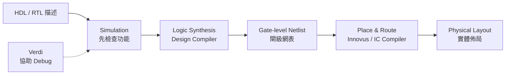
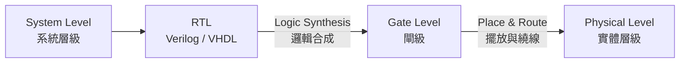
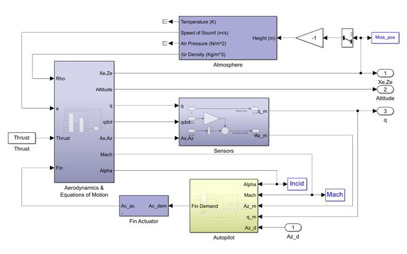
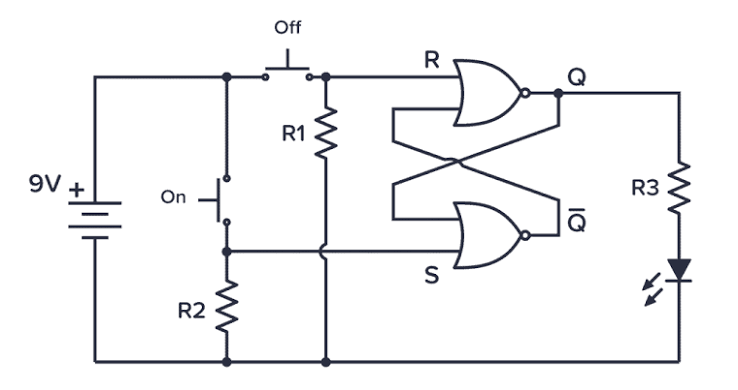

# ch00

第 1 次對話

```text
Phase A — Internal Control Surface（控制面輸出） | TURN=1 | PROMPT=Manual Refresh v1.13.0；Project version=UNKNOWN | REFRESH=ACCEPTED；學習狀態重新建立於 ch00 起點，未把未驗證內容標成完成 | STATE={Mainline=講義_ch00_introduction.pdf；Locator=投影片頁碼/PDF viewer page 1–9；KP=Course Information + EDA Tool Map；Boundary=1–9 VERIFIED，page 10 為 Overview 新段落起點；Parent=Course Information；Source=Lecture Mainline + Teacher Transcript Overlay；SourceInventory=講義_ch00_introduction.pdf + 逐字稿_第1堂_0908_範圍ch00_introduction.txt 已核對，考古題/標準答案目前未提供；Transcript={File=逐字稿_第1堂_0908_範圍ch00_introduction.txt；Session=第1堂；Span=lines 13–117；Align=HIGH；Coverage=pages 1–9 relevant span checked；Signals=Explanation+Emphasis+Homework+Scope；Scope=EDA tools 先認識類型、後續再深入；Correction=NONE found；Conflict=NONE affecting current KP；Residual=PASS for current boundary}；AdjQueue=pages 1–9 current → page 10 next；ExerciseDebt=尚未產生（本則教完必要知識後產生並預計同則出題）；LectureAdjDebt=NONE beyond active boundary；TeacherTranscriptDebt=NONE for current boundary；PastExamDebt=UNKNOWN（考古題來源目前未提供）；Weakness=NONE yet；Coverage=pages 1–9 source checked，尚未經使用者練習驗證；Completion=NO；Evidence=Lecture pages 1–9 + Transcript lines 13–117；Blockers=NONE for teaching；NextLegal=完成本輪練習並達最低標準後進入 pages 10–12 Design Hierarchy} | PLAN={ThisResponse=依講義 pages 1–9 重構 Course Orientation/EDA tools，整合老師 coding-style 與工具角色強調，最後出 2 題英文自足開放題；ExpectedDebtChange=Exercise Debt 以實際輸出題目清償，但知識點 Completion 等使用者作答後才能判定；ExpectedNext=批改後若通過則進 pages 10–12}
```

## ⭐Course Information & EDA Tool Map — 這堂 HDL 課到底在學什麼，寫完 code 之後又會發生什麼？

講義位置：投影片頁碼 1～9（PDF viewer page 1～9）

### 1. 先抓住整門課的主軸

Ch0 一開始 pages 1～9 大部分是課程資訊，但不能全部當行政頁面跳掉，因為其中已經埋了整學期的三條主線：

**Verilog、VHDL、Logic Synthesis(邏輯合成)**。講義明確把這三項列為課程 Topics；後續時程則從 Verilog 的不同 modeling(建模)方法一路走到 logic synthesis/design flow，再進 VHDL。

老師口頭上又補了一個很重要的 mental model(心智模型)：這門課雖然會「寫程式」，但不要把 HDL 當成普通的 C/C++。老師特別強調 `coding style(編碼風格)`，原因是你寫的 HDL 最終是在描述硬體結構；這件事後面整學期會一直重複。

所以目前先記：

**Software(軟體)：在告訴處理器「要做哪些指令」。**

**HDL：在描述「我要什麼硬體」。**

後面我們會把這個差異講得非常精確；現在先建立這個方向就好。

---

### 2. Verilog、VHDL、Logic Synthesis 分別扮演什麼角色？

講義列出兩種 HDL：

* `Verilog`
* `VHDL`

老師說本課會以 **Verilog 為主要內容**，再補充 VHDL，並解釋兩者差異；老師用「有點像 C 與 C++」來降低第一次看到兩種語言的心理負擔，重點是兩者很多硬體核心觀念相通。

第三項 `Logic Synthesis(邏輯合成)` 可以先粗略想成：

> 你用 HDL 寫出較高層次的硬體描述，然後讓工具把它轉換成更低層次的硬體表示。

老師目前用 software 的 `compile(編譯)` 來做直覺類比；真正 RTL、gate-level(閘級) 的關係會在後面的投影片正式展開，所以這裡先不要超前學細節。

---

### 3. EDA Tools — 不需要先背品牌，要先知道「每一類工具負責什麼」

`EDA(Electronic Design Automation，電子設計自動化)` 就是協助完成數位硬體設計、驗證、合成與實體實作的一整套軟體工具。

投影片 page 8 給的工具角色可以整理成：

///danger|工具

| 類別                       | 講義中的工具                             | 現階段要知道的功能                                                     |
| ------------------------ | ---------------------------------- | ------------------------------------------------------------- |
| HDL Simulation(HDL 模擬)   | ==VCS==、NC-Verilog、==ModelSim==、Verilog-XL | 模擬 Verilog/VHDL 設計                                            |
| Logic Synthesis(邏輯合成)    | ==Design Compiler==                    | 將 RTL 合成為 gate netlist：邏輯閘(閘級網表)                                  |
| Timing / Powe：實體佈局設計r Analysis  | Design Compiler、==PrimeTime==          | 做 timing/power 相關分析；投影片將 PrimeTime 列於 dynamic timing analysis |
| Debug(除錯)                | ==Verdi==                              | 協助 debug                                                      |
| FPGA Flow                | ==Xilinx Vivado==                      | FPGA 的 simulation 與 synthesis                                 |
| Place & Route(P&R，擺放與繞線) | ==Innovus==、IC Compiler                | 從 gate netlist：邏輯閘 產生 physical layout(實體佈局)                       |
| Memory Generation        | SRAM Memory ：實體佈局設計Compiler               | 產生 SRAM 相關設計                                                  |

///


這些角色都是 page 8 直接列出的內容。

目前**不要用死背工具名稱的方式學**。先把它想成一條加工線：



核心因果關係是：

**你不需要徒手把大量邏輯閘與 layout 全畫出來，而是先把較高層次的 HDL 寫好，再讓 EDA tools 往下轉換。**

老師在逐字稿中也把流程濃縮成兩個大步驟：`synthesis(合成)` 與後面的 `layout(實體佈局)`，而且特別提醒中間會反覆做 verification(驗證)。

---

### 4. Teacher Emphasis — 為什麼老師一直強調 Coding Style？

這是 pages 1～9 裡真正值得你現在就記住的東西。

老師說，寫 HDL 時「每寫一行 code」要帶著它最後會對應到實際硬體／電路的想法；因此 HDL 不是只追求「模擬結果現在看起來對」，而是要考慮這種寫法最後會描述出什麼硬體。

這也是之後你學 Verilog 最容易踩坑的來源。

例如在軟體中，你看到：

`x = a + b`

很自然會想：「CPU 執行這個加法。」

但 HDL 的思考方式應逐漸改成：

**「這段描述最後會對應出什麼 datapath(資料路徑)、adder(加法器)、register(暫存器)、wire(訊號線)？」**

現在不要求你能畫出電路，但從今天開始，每看到 HDL code，都要慢慢養成一句反射：

> **What hardware am I describing?**

這正是老師說會在整門課反覆強調的方向。

---

### 5. 課程負擔：只需要知道這堂課不是「只考語法」

講義評分是：

**Homework 60% + Exams 40%**，共有 5 份主要作業加 1 份 bonus homework；題目一路會做到 pipelined unit、RISC CPU、image edge detection、CNN acceleration。

老師也直接提醒作業 loading 很重，而且第一次接觸 HDL 會花不少時間在 debug 與熟悉 server 環境。

因此這堂課的學習目標不能是：

「背完 Verilog syntax 就好。」

而應是：

**能把硬體架構想清楚 → 寫成合理 HDL → 用工具 simulation/debug → 讓後續 design flow 能走下去。**

---

### 6. 這 9 頁現在真正要記的最短版本

先只留下三個核心印象：

**第一，HDL 是用來描述 hardware(硬體) 的，不要把它當成一般 software programming。**

**第二，這堂課主要學 Verilog，也會學 VHDL，以及 HDL 如何經過 logic synthesis 等 EDA flow 變成硬體。**

**第三，工具名稱可以之後再熟，但角色一定要分清楚：Simulation → Synthesis → P&R；Debug 工具則幫你找問題。**

Pages 1～9 到這裡已完整納入本輪；下一個技術主題才會正式進到 page 10 的 `Overview`，接著是 `Design Hierarchy`。目前先不超前。

### 7. Open-ended Questions(開放式練習)

#### 7.1 Question 1

An HDL design team has the following tool bank:

* VCS
* Design Compiler
* Verdi
* Innovus
* IC Compiler

Match one appropriate tool to each task below, and briefly state why:

1. Simulate an HDL design.
2. Convert RTL into a gate-level netlist：邏輯閘.
3. Debug the design.
4. Perform placement and routing to create a phy：實體佈局設計sical layout.

[Generated: 依據講義 ch00 投影片頁碼 8；Teacher Transcript Overlay：第1堂 EDA tools 區段]

#### 7.2 Question 2

A student says:

> “HDL is basically just another programming language like C. As long as the program produces the correct output, I do not need to think about what hardware the code represents.”

Based on the course introduction, explain what is wrong or incomplete about this statement.

[Generated: 依據講義 ch00 投影片頁碼 4–8；Teacher Emphasis Signal：第1堂 coding style / physical-circuit mental model]

可直接用中文或英文回答：

1. `1→...，2→...，3→...，4→...`，再簡短說明
2. 2～4 句解釋即可


第 1 次對話

```text
Phase A — Internal Control Surface（控制面輸出） | TURN=1 | PROMPT=Manual Prompt Refresh v1.13.0；Project version=UNKNOWN | REFRESH=ACCEPTED；只重置對話提醒計數，既有學習 State 不重置 | STATE={Mainline=講義_ch00_introduction.pdf；Locator=PDF viewer page 1–9；KP=Course Information + EDA Tool Map；Boundary=1–9 VERIFIED；Parent=Course Information；Source=Lecture Mainline + Teacher Transcript Overlay；SourceInventory=講義PDF + 第1堂逐字稿 + 新增考古題HTML；Transcript={File=逐字稿_第1堂_0908_範圍ch00_introduction.txt；Session=第1堂；Span=lines13–117；Align=HIGH；Coverage=pages1–9；Signals=Explanation+Emphasis+Homework+Scope；Scope=high-level introduction；Correction=NONE；Conflict=NONE；Residual=PASS}；AdjQueue=page10 Overview→page11 Design Hierarchy→page12 Different Levels of Hardware Design；ExerciseDebt=0（前輪2題已實際輸出）；LectureAdjDebt=0 for pages1–9；TeacherTranscriptDebt=0；PastExamDebt=新考古題來源已提供，尚需本則完成局部對應檢查；Weakness=NONE；Coverage=pages1–9已教、使用者答案已收到；Completion=PARTIAL/PENDING GRADING；Evidence=前輪題目實際輸出+本輪使用者作答；Blockers=本則批改與Past Exam Gate；NextLegal=若達最低通過標準則進入pages10–12} | PLAN={ThisResponse=批改Q1/Q2→整合新考古題來源→若通過則前進相鄰主線pages10–12並完成必要知識包與英文開放題；ExpectedDebtChange=pages1–9預期完成，pages10–12新Exercise Debt以本則實際出題清償；ExpectedNext=使用者作答pages10–12題目後再決定是否進page13}
```

#### 1. 上一輪批改

| 題目                   | 結果 | 評語                                                   |
| -------------------- | -- | ---------------------------------------------------- |
| 1.1 HDL simulation   | ✅  | 你寫的 `vsc` 應修正為 **VCS**；工具角色答對。                       |
| 1.2 RTL → gate-level | ✅  | 你寫的 `Design Computer` 應修正為 **Design Compiler**；概念答對。 |
| 1.3 Debug            | ✅  | `Verdi` 正確。                                          |
| 1.4 Place & Route    | ✅  | `Innovus` 正確。                                        |
| 2                    | ✅  | 核心觀念正確，而且已抓到「HDL code 對應硬體」這個老師真正重視的 mental model。   |

講義 page 8 確實把 VCS 列為 HDL simulation 工具、Design Compiler 用於 RTL 到 gate netlist：邏輯閘 的 logic synthesis、Verdi 用於 debug，而 Innovus / IC Compiler 用於 P&R。：實體佈局設計

---

#### 2. 第 2 題中文修正版

你的回答可以整理成：

> HDL 不只是要讓功能輸出正確；`synthesizable HDL(可合成 HDL)` 最後會對應成實際硬體電路，因此寫 code 時還要思考這段 code 會描述、合成出什麼 hardware structure(硬體結構)，以及它對 timing、power 等硬體特性的影響。

老師第一堂就是反覆強調「每寫一行 HDL，都要想到它會 map 到實際電路」，而且 HDL 不只要 compile，實際訊號傳遞還涉及 timing analysis。

你提到的「效能、面積、速度、功耗」方向沒有問題；只是 `performance(效能)` 與 `speed(速度)` 在這裡有部分重疊，而 `PPA` 的完整概念是後面講義才會正式展開，所以這一題最重要的答案仍然是：

**不能只用 software 的「output 對就好」思維；必須知道 HDL 正在描述什麼硬體。**

#### 3. 英文考試版

> HDL does not merely describe operations to be executed like a software program. Synthesizable HDL describes hardware that can be mapped to physical circuits, so a designer must consider what hardware structure the code represents, not only whether the simulated output is correct.

---

#### 4. 考古題檢查結果

新提供的考古題已納入來源。其題目索引目前主要是三種 modeling methods、flip-flop、clock-gating、blocking/non-blocking、signed/shift、pipeline、RCA、dot product 與 code tracing，沒有看到直接針對目前 pages 1–9「EDA 工具角色辨識」的題目。

考古題裡確實有後續會要求你畫 `expected synthesis results` 的題型，但它綁定的是 Clock-Gating 等後面尚未正式教過的內容，因此現在不能提前拿來考你。

所以這一輪你已達最低通過標準，不需要原地追加同型題，依講義相鄰主線前進。

## ⭐Design Hierarchy & Hardware Design Levels — 為什麼硬體設計要分成不同抽象層級？

講義位置：PDF viewer page 10 ~ 12／輔助：投影片頁碼 10–12

### 1. 核心問題：為什麼不能直接從最底層開始畫？

假設今天要設計一顆 CPU。

如果直接要求你：

> 「請把 CPU 裡所有 logic gates(邏輯閘)、線路以及 physical layout(實體佈局)全部畫出來。」

幾乎沒辦法管理。

所以工程設計會使用 `Abstraction(抽象化)`：

> **先在高層只想「功能與架構」，再一步一步轉成更具體的硬體。**

這就是 `Design Hierarchy(設計階層)` 的核心。

---

### 2. Page 11：Software 與 Hardware 都有自己的階層

Page 11 左邊的圖把 Software(軟體)一路往下：

**Applications**
→ `Higher-Level Language Program`，例如 C
→ Compiler
→ `Assembly Language`
→ Assembler
→ `Machine Language`

而到了 SW/HW 的交界，machine language 最終需要由硬體來 `Machine Interpretation(機器解讀)`。

圖的硬體部分則有：

**Hardware Architecture Description**
→ `Architecture Implementation(架構實作)`
→ **Logic Circuit Description**

其中投影片直接舉：

* Architecture description：`block diagram(方塊圖)`
* Logic circuit description：`circuit schematic diagram(電路原理圖)`。

注意一個很重要的誤區：

> 這張圖不是說「compiler 把 machine code 轉成 block diagram」。

它是在告訴你：

**Software 有自己的抽象階層；Hardware 也有自己的抽象階層。**

---

### 3. Block Diagram 和 Schematic 到底差在哪？

老師對這張圖的口頭解釋很重要。

老師說 `block diagram(方塊圖)` 比較 high-level，通常先用它來描述設計，再根據這個架構去寫 HDL；而 `schematic diagram(電路原理圖)` 則是更低層、比較具體的電路表示。

例如 CPU 高階架構可以先畫：

```text
Register File → ALU → Memory
```

這時你只在意：

> 有哪些大功能模組？
> 資料怎麼流？

而不是先畫：

```text
AND gate
OR gate
MUX
Flip-Flop
...
```

所以：

**Block Diagram：我要哪些大的硬體功能。**

**Schematic：這些功能實際由哪些電路元件組成。**

老師甚至把 block diagram 類比成某種 `specification(規格)`：先知道客戶希望晶片完成什麼，再依架構寫 HDL。

---

### 4. Page 12：硬體設計的四個 Level

Page 12 正式把 Hardware Design 分成四層：

| 從高到低 | Level                                  | 講義例子                    |
| ---- | -------------------------------------- | ----------------------- |
| 1    | `System Level(系統層級)`                   | C、SystemC、SystemVerilog |
| 2    | `RTL(Register Transfer Level，暫存器傳輸層級)` | **Verilog、VHDL**        |
| 3    | `Gate Level(閘級)`                       | logic gates 與它們的連線      |
| 4    | `Physical Level(實體層級)`                 | physical layout         |

這張表你之後會一直用到。

最重要的是：

> **這堂 HDL 課主要讓你寫的是 RTL。**

老師逐字稿也直接說：

> RTL 就是這堂課要教的層級，Verilog 和 VHDL 都是在這個層級使用。

---

### 5. 那我們剛剛問的 Synthesis 和 P&R 放在哪裡？

現在你前面問的兩個名詞就全部接起來了：



講義 page 12 明確寫：

**RTL → Logic Synthesis → Gate Level**

工具例子：

* Design Compiler
* Vivado synthesis

再來：

**Gate Level → P&R → Physical Level**

工具例子：

* IC Compiler
* Innovus。

所以你現在可以把先前的問題合成一句：

> **Synthesis 決定「要有哪些 gates/cells 與邏輯連線」；P&R 再決定這些元件實際放哪、線實際怎麼走。**

---

### 6. Front-end 和 Back-end 也從這裡分開

老師口頭上把這兩段分成：

**Front-end(前端)：RTL → Gate Level**

**Back-end(後端)：Gate Level → Physical Level，主要經過 P&R**

而 Design Compiler 負責前面的 synthesis；Innovus / IC Compiler 負責後面的 P&R。

所以看到：

> `Front-end cell-based design flow`

先想到：

**RTL / synthesis / gate-level**

看到：

> `Back-end cell-based design flow`

先想到：

**P&R / physical layout**

---

### 7. 目前最容易搞混的三件事

第一個：

**Verilog/VHDL ≠ gate-level。**

在這份講義目前的分類裡：

> **Verilog/VHDL → RTL level。**

第二個：

**Logic Synthesis ≠ Physical Layout。**

Synthesis 只走到：

> **RTL → Gate Level**

之後還需要 P&R 才往 Physical Level 走。

第三個：

**Block Diagram ≠ Circuit Schematic。**

前者是在描述高階 architecture；後者則更接近具體 logic circuit。

---

### 8. 最短記法

這四個字一定要先熟：

> **System → RTL → Gate → Physical**

然後再加兩座橋：

> **RTL —Synthesis→ Gate**

> **Gate —P&R→ Physical**

以及這門課的位置：

> **Verilog / VHDL = RTL**

### 9. Open-ended Questions(開放式練習)

#### 9.1 Question 1

Arrange the following hardware design levels from the highest level of abstraction to the lowest:

* Gate level
* Physical level
* Register Transfer Level (RTL)
* System level

Then give one example of a language or representation associated with each level according to the lecture.

[Generated: 依據講義 ch00 PDF viewer pages 10–12]


///danger|英文單字

### associated
associated：相關的、有關聯的
└─ associate：使產生關聯、聯繫
   ├─ as-：朝向、加入（歷史上由 ad- 同化而來）
   └─ soci-：同伴、夥伴、聯結
      └─ -ate：形成動詞
         └─ -ed：過去分詞；形成「被聯繫的」概念

### abstraction
abstraction：抽象化、抽象
└─ abstract：抽取、抽象化
   ├─ abs-：離開、從……分離
   └─ tract：拉、拖
      └─ -ion：形成名詞，表示行為、過程或結果
///

#### 9.2 Question 2

A designer writes a hardware module in Verilog. The design is then processed by Synopsys Design Compiler, producing a gate-level netlist：邏輯閘. After that, Cadence Innovus performs placement and routing.
：實體佈局設計
Answer the following:

1. What design level is the original Verilog description?
2. What design level is the output of Design Compiler?
3. What design level is produced after placement and routing?
4. Which transformation is called logic synthesis?
5. Which transformation belongs to the back-end design flow?

[Generated: 依據講義 ch00 PDF viewer page 12；Teacher Transcript Overlay：第1堂 Design Hierarchy / design-level 區段]

/// danger | 英文單字

Synopsys：新思科技
Cadence Innovus：Cadence Innovus 是一款由 Cadence Design Systems 推出的旗艦級數位積體電路（IC）實體設計與布線（Place and Route, P&R）軟體工具


///


#### 9.3 Question 3

A student says, “A hardware block diagram and a circuit schematic are basically the same thing because both describe hardware.”

Explain why this statement is incomplete. Also explain why a designer may create a block diagram before writing HDL code.

[Generated: 依據講義 ch00 PDF viewer page 11；Teacher Explanation Signal：第1堂 Design Hierarchy 區段]

可用中文或英文回答：`1.` 排序＋例子；`2.` 依 1～5 作答；`3.` 2～4 句即可。


/// danger | 英文單字

### hardware block diagram：硬體方塊圖
hardware block diagram：硬體方塊圖
├─ hardware：硬體
├─ block：方塊、功能區塊
└─ diagram：圖表、示意圖


### schematic：示意圖
schematic：示意圖；示意的
└─ schema：圖式、架構、形式
   └─ -ic：與……有關的、具有……性質的


   
### basically：基本上
basically：基本上、大致上
└─ basic：基本的、基礎的
   ├─ base：基礎、底部
   └─ -ic：形成形容詞
      └─ -ally：形成副詞


///


第 1 次對話

```text id="l66g8d"
Phase A — Internal Control Surface（控制面輸出） | TURN=1 | PROMPT=v1.13.0 | REFRESH=ACCEPTED | STATE={Mainline=講義_ch00_introduction.pdf; Locator=PDF viewer pages10–12 completed at minimum-pass level; KP=Design Hierarchy & Hardware Design Levels; Boundary=pages10–12 verified; Parent=Overview; Source=Lecture+Teacher Transcript+PastExamInventory; SourceInventory=主線講義+第1堂逐字稿+考古題HTML已發現; Transcript={File=逐字稿_第1堂_0908_範圍ch00_introduction.txt; Session=第1堂; Span=lines109–156; Align=HIGH; Coverage=已整合; Signals=Explanation+Scope; Scope=high-level introduction; Correction=NONE; Conflict=NONE; Residual=已核對目前KP}; AdjQueue=next PDF viewer page13; ExerciseDebt=0; LectureAdjDebt=0; TeacherTranscriptDebt=0 for pages10–12; PastExamDebt=0 direct for pages10–12 in currently indexed exams; Weakness=back-end曾混淆但已補正; Coverage=pages10–12 lecture+transcript+3 questions+grading; Completion=COMPLETE for pages10–12 minimum standard; Evidence=講義pages11–12+逐字稿對齊+Q9.1–Q9.3作答與補正; Blockers=NONE; NextLegal=PDF viewer page13 Digital vs. Analog Design} | PLAN={ThisResponse=正式進入page13 Digital vs. Analog Design；Boundary先核對pages13–16後判定page13獨立收束，page14已切換Combinational vs Sequential；整合逐字稿lines157–187附近high-level Scope；PastExam Quick Check=目前索引未見direct digital-vs-analog題；教必要知識包並出2題; ExpectedDebtChange=產生並同則清償page13 ExerciseDebt; ExpectedNext=批改通過後進PDF viewer page14}
```

## ⭐Digital vs. Analog Design — 數位電路和類比電路到底差在哪？

講義位置：PDF viewer page 13

### 1. 先抓最核心差異：Digital 看 0/1，Analog 看連續的電壓／電流

講義把 IC design(積體電路設計)先分成兩大類：

* `Digital IC Design(數位積體電路設計)`
* `Analog IC Design(類比積體電路設計)`

其中 Digital Design 的核心是：

> **主要把訊號抽象成 logic 0 與 logic 1。**

Analog Design 則是：

> **直接處理 voltage(電壓)、current(電流)等連續物理量。**

這正是 page 13 的主要分類。

你可以先用一個很直覺的例子：

假設某條線現在是 `0.73 V`。

對 Analog Design 來說：

> `0.73 V` 本身是多少，就可能非常重要。

但對 Digital Design 來說，通常更關心的是：

> 這個電壓最後被數位電路判定成 `0` 還是 `1`？

所以：

> **Analog 在乎「到底是多少」。**
> **Digital 在乎「屬於哪個邏輯狀態」。**

---

### 2. Digital Design 為什麼適合用 HDL？

講義說 Digital IC 通常：

> 從 high-level HDL 開始，然後經由 `Logic Synthesis(邏輯合成)` 與 `Place & Route(P&R，擺放與繞線)` 做出最後的 IC。

這就和你前面學到的流程接起來：

**Verilog / VHDL**

→ `RTL`

→ `Logic Synthesis`

→ `Gate Level`

→ `P&R`

→ `Physical Level`

因為數位設計已經把大量底層電壓細節抽象成：

> `0 / 1`

所以我們才能在比較高的 abstraction level(抽象層級)，用 HDL 描述大型電路。

這門課也就是主要走這一側。老師在逐字稿中直接說：

> 這堂課主要是教 Digital IC Design，也就是以 0 和 1 的 logic 為主。

---

### 3. Analog Design 在做什麼？


/// danger | 英文單字

analog：類比的；類似物
└─ analog：現代英文中不宜再可靠拆解
   └─ 歷史核心：依比例、對應、相似

   

///


Analog Design 不把所有訊號簡化成單純的 0 和 1。

它可能真的要考慮：

* 電壓是多少？
* 電流是多少？
* 訊號大小如何變化？
* 雜訊影響如何？
* transistor(電晶體)的電路行為如何？

講義因此說 Analog IC Design 通常：

> 從 `circuit(電路)` 與 `layout(佈局)` 開始，而不是像這堂數位 HDL 課從高階 HDL 開始。

所以目前可以先形成這個對比：

| Digital IC       | Analog IC                        |
| ---------------- | -------------------------------- |
| 主要抽象成 0 / 1      | 處理電壓／電流                          |
| 常從 HDL 開始        | 常從 circuit / layout 開始           |
| 會用 synthesis、P&R | 更直接處理 transistor/circuit/layout  |
| 這堂 HDL 課的主要方向    | 通常是其他 electronics / analog IC 課程 |

老師在這裡也是刻意只做 high-level introduction(高階介紹)，沒有要求第一堂就深入 Analog Design 細節。

---

### 4. Digital 和 Analog 怎麼互相溝通？

這頁還提到兩個很重要的介面：

* `ADC(Analog-to-Digital Converter，類比數位轉換器)`
* `DAC(Digital-to-Analog Converter，數位類比轉換器)`

///danger|英文單字

converter：轉換器
└─ convert：轉換、轉變
   └─ -er：執行某動作的人或裝置
   
///

你可以把它們想成兩個世界的翻譯官。

例如麥克風收到聲音後，產生的是 Analog signal(類比訊號)：

**聲音**
→ Analog voltage
→ **ADC**
→ Digital data
→ 數位電路處理

反過來，如果數位晶片算出一組數值，最後要控制喇叭產生真實聲音：

**Digital data**
→ **DAC**
→ Analog voltage
→ 喇叭

所以：

> **ADC：Analog → Digital**

> **DAC：Digital → Analog**

這兩個方向不要背反。

---

### 5. 為什麼 Sensor(感測器)附近常遇到 Analog？

講義特別提到 Analog 常出現在 `Input/Output(I/O，輸入輸出)` interface，例如 sensors。

原因很好理解。

現實世界本身很多東西都是連續的，例如：

* 溫度：26.1°C、26.2°C……
* 光強度
* 聲音
* 壓力
* 電壓

Sensor 量到這些物理量之後，通常先形成 Analog signal。

但 CPU、數位邏輯、Verilog 電路喜歡處理：

> 0 / 1 組成的 digital data

所以中間常需要 ADC。

例如：

**溫度**
→ sensor
→ analog voltage
→ ADC
→ binary number
→ Digital IC

---

### 6. 一個容易誤會的地方：Digital 不代表晶片裡真的不存在 Analog physics

目前課程需要你用「0 / 1」理解 Digital Design。

但不要誤解成：

> ❌ 數位電路裡的真實電壓永遠只有精確的 0 V 和 1 V。

實體晶片當然還是靠 voltage、current、充放電等物理現象運作。

只是對 **Digital Design 的邏輯抽象**而言，我們把它解讀成：

> `logic 0 / logic 1`

老師也提到，實體訊號在晶片上傳遞、充電與放電需要時間，所以即使是 Digital Design，最後仍然會涉及 timing analysis(時序分析)。

目前你只要抓：

> **Digital 是把底層連續物理世界抽象成離散的邏輯狀態。**

就可以了。

---

### 7. 和你前面學的 System → RTL → Gate → Physical 怎麼接？

這兩個分類是在回答**不同問題**。

`Digital vs. Analog` 是在問：

> **「這是哪一類 IC design？」**

而：

`System → RTL → Gate → Physical`

是在問：

> **「這個硬體設計目前位於哪個 abstraction level？」**

所以不要混成同一條階層。

例如：

> Digital IC 可以有 RTL Level、Gate Level、Physical Level。

不是：

> ❌ Digital → RTL → Analog → Gate

這完全是兩種不同維度的分類。

---

### 8. 最短記法

先把這四句背熟：

> **Digital：主要看 0 / 1。**

> **Analog：主要看 voltage / current。**

> **ADC：Analog → Digital。**

> **DAC：Digital → Analog。**

再加一條這堂課的定位：

> **這堂 HDL 課主要是 Digital IC Design。**

老師這一段明確說第一堂只要求先有 impression(概念)，後面的課程還會再細講這些核心觀念。

### 9. Open-ended Questions(開放式練習)

#### 9.1 Question 1

Explain the main difference between digital IC design and analog IC design. In your answer, mention what type of signals each design mainly considers and how their typical design starting points differ.

[Generated: 依據講義_ch00_introduction.pdf／PDF viewer page 13]

///danger|英文單字
### typical
typical：典型的、有代表性的
└─ type：類型、典型
   └─ -ical：形成形容詞，表示「與……有關的、具有……特徵的」
   
### starting
starting：開始的、正在開始
└─ start：開始、啟動
   └─ -ing：形成現在分詞、動名詞或形容詞形式


///

#### 9.2 Question 2

A temperature sensor produces a continuously varying voltage, but a digital processing circuit accepts binary data. What type of converter should be placed between the sensor and the digital circuit? Explain why.

[Generated: 依據講義_ch00_introduction.pdf／PDF viewer page 13]


///danger|英文單字
varying voltage

varying voltage：變化的電壓
├─ varying：變化的、變動的
│  ├─ vary：改變、變化
│  └─ -ing：形成現在分詞／形容詞形式
└─ voltage：電壓

///


1. 中文或英文皆可
2. 每題簡短回答＋理由即可


數位IC是只有0和1
類比是連續的數字
數位IC會先設計從RTL開始，類比可能就會先考慮電路和佈局

----

用 ADC，因為要把類比訊號轉換為數位訊號，讓偵測器得到的數值給數位電路


第 1 次對話

```text
Phase A — Internal Control Surface（控制面輸出） | TURN=1 | PROMPT=v1.13.0 | REFRESH=ACCEPTED | STATE={Mainline=講義_ch00_introduction.pdf; Locator=PDF viewer page13; KP=Digital vs. Analog Design; Boundary=page13 verified，page14已切換新核心問題; Parent=Overview; Source=Lecture+Teacher Transcript+PastExamInventory; SourceInventory=主線講義+第1堂逐字稿+考古題HTML已發現; Transcript={File=逐字稿_第1堂_0908_範圍ch00_introduction.txt; Session=第1堂; Span=lines157–187附近; Align=HIGH; Coverage=已整合page13重點; Signals=Explanation+Scope; Scope=第一堂只要求high-level impression; Correction=NONE; Conflict=NONE; Residual=局部已核對}; AdjQueue=page13批改→page14 Combinational vs. Sequential Logic; ExerciseDebt=0（page13兩題已輸出且本輪收到作答）; LectureAdjDebt=0 for page13; TeacherTranscriptDebt=0 for page13; PastExamDebt=目前索引未見Digital-vs-Analog直接題; Weakness=NONE confirmed before grading; Coverage=page13 teaching+2 answers received; Completion=PARTIAL（待本則批改）; Evidence=講義page13+逐字稿對齊+Q9.1/Q9.2答案已收到; Blockers=NONE apparent; NextLegal=若批改通過則直接相鄰PDF viewer page14} | PLAN={ThisResponse=先批改page13兩題；若達最低標準則Commit page13完成並正式進入page14 Combinational vs. Sequential Logic；Natural Boundary=page14，page15已切換IC Design Flows；Transcript對齊=HIGH且老師明示本頁只需high-level impression；考古題A-Q4/A-Q6與Sequential相關但需要後續詳細Verilog內容，現在不提前使用；教必要知識包並出2題; ExpectedDebtChange=page13完成，page14產生並同則清償ExerciseDebt; ExpectedNext=批改page14後進page15}
```

#### 1. Page 13 批改

| 題目                            | 結果 | 評語                                                        |
| ----------------------------- | -- | --------------------------------------------------------- |
| Q9.1 Digital vs. Analog       | ✅  | 核心差異、Digital 從 RTL/HDL 開始、Analog 從 circuit/layout 開始，都答對。 |
| Q9.2 Sensor → digital circuit | ✅  | `ADC(Analog-to-Digital Converter，類比數位轉換器)` 與理由都正確。        |

你這兩題已達這一頁老師要求的 high-level 理解程度。講義確實把 Digital IC 定位為主要考慮 logic 0/1、通常從 high-level HDL 開始；Analog IC 則考慮 voltage/current，通常從 circuit/layout 開始。

第二題也完全正確：Sensor 的連續類比訊號若要送給數位電路，使用 `ADC` 轉成 digital signal。

#### 2. 中文修正版

可以寫得更精確一點：

> `Digital IC Design(數位積體電路設計)` 主要以 logic 0 與 logic 1 描述訊號，通常由 HDL/RTL 開始設計，再經過 synthesis 與 P&R。
> `Analog IC Design(類比積體電路設計)` 處理連續變化的 voltage/current，通常直接從 circuit 與 layout 層級開始設計。
>
> 當 sensor 產生連續的 analog voltage，而後端是 digital circuit 時，需要使用 `ADC` 將 analog signal 轉成 digital data。

#### 3. 英文考試版

> Digital IC design mainly considers logic 0 and 1 and usually starts from high-level HDL/RTL. Analog IC design considers continuous voltage and current and usually starts from circuit and layout design.
>
> An ADC is required between an analog sensor and a digital circuit because it converts the continuously varying analog signal into digital data.

Page 13 可以視為通過，接著走直接相鄰的 page 14。

## ⭐Combinational vs. Sequential Logic — 電路為什麼有些「只算」，有些還要「記住」？

講義位置：PDF viewer page 14

/// danger|英文單字

### Combinational
combinational：組合的
└─ combination：組合
   └─ combine：結合、組合
      └─ -ation：形成名詞，表示組合的行為或結果
         └─ -al：形成形容詞，表示「與……有關的」

### Sequential
sequential：循序的、按順序的
└─ sequence：順序、序列
   └─ -ial：形成形容詞，表示「與……有關的」

///


### 1. 最核心差別：有沒有 Storage Element(儲存元件)

這一頁把數位邏輯分成：

* `Combinational Logic(組合邏輯)`
* `Sequential Logic(循序邏輯)`

講義的正式區分是：

> `Combinational Logic`：pure feed-forward datapath，而且 **沒有 flip-flop 或 latch**。
> `Sequential Logic`：含有 `latch` 或 `flip-flop` 等 storage elements。

因此第一個最重要的判斷方式就是：

> **Combinational：沒有記憶。**
> **Sequential：有記憶。**

---

### 2. Combinational Logic：現在輸入什麼，現在就算什麼

例如一個 adder：

```verilog
assign c = a + b;
```

講義就拿這個當 `Combinational Logic` 的例子。

假設：

* `a = 3`
* `b = 4`

那：

* `c = 7`

如果下一刻改成：

* `a = 8`
* `b = 2`

那：

* `c = 10`

它不需要知道：

> 「剛剛 a 和 b 是多少？」

它只看**目前的 input**。

可以先記成：

> **Output = function(current inputs)**

例如：

* adder
* AND / OR logic
* comparator
* multiplexer

這些都很常屬於 combinational logic。

---

### 3. 為什麼叫 Combinational？

因為 output 是由「目前 input 的 combination(組合)」決定。

例如：

| a | b | AND output |
| - | - | ---------- |
| 0 | 0 | 0          |
| 0 | 1 | 0          |
| 1 | 0 | 0          |
| 1 | 1 | 1          |

只要知道現在的 `a`、`b`，就能知道 output。

不用問：

> 「上個 clock 是什麼？」

所以它**沒有 history(歷史狀態)**。

---

### 4. Sequential Logic：除了現在輸入，還跟「之前記住的東西」有關

Sequential Logic 裡面有：

* `Flip-Flop(正反器)`
* `Latch(鎖存器)`

這些可以保存 state/data。

所以 output 或下一步行為不只受到現在 input 影響，也可能受到：

> **previous state(先前狀態)**

///danger|重要
#### 為什麼叫 `Sequential Logic(循序邏輯)`？

因為這種電路的行為會跟：

> **前一個 state(狀態) → 下一個 state → 再下一個 state**

這種「狀態的先後順序」有關。

也就是它不是只看「現在 input 是什麼」，還會受到：

> **之前儲存了什麼**

影響。

講義 page 14 說 Sequential Logic 裡有 `latch`、`flip-flop` 這類 storage elements(儲存元件)。
///


影響。

例如一個 register：

假設某個 clock edge 時：

> `D = 5`

Flip-Flop 把 `5` 記住。

即使後來 `D` 改成 `9`，只要還沒到下一個指定的 clock event，裡面的 stored value 仍可能維持 `5`。

這就是「記憶」。

---

### 5. Clock 在 Sequential Logic 裡為什麼重要？

講義的 sequential 範例使用：

```verilog
always @(posedge clk)
    c <= a + b;
```


先不要管這段 Verilog 的完整語法，後面會正式學。

目前只要理解：

> `posedge clk` = 在 clock 的 rising edge(上升緣)發生某件事。

所以 Sequential Logic 常有「**什麼時候更新資料**」這件事。

而 Combinational Logic 比較像：

> input 一變 → 經過電路 propagation delay(傳播延遲) → output 跟著變。

老師在逐字稿裡也用很 high-level 的方式說：

* combinational part 主要是 computation(計算)
* sequential part 主要與 timing(時序)相關。

老師同時明確說這一頁目前只是 introduction，細節後面還會再講，所以現在不要求你深入 blocking/non-blocking、flip-flop coding 等語法。

---

### 6. 用「計算機＋筆記本」類比

想像你正在算數學。

`Combinational Logic` 像計算機：

> 輸入 `3 + 4`
> → 顯示 `7`

它不需要記住你上一次算 `10 + 20`。

`Sequential Logic` 則像：

> **計算機 + 筆記本**

除了做計算之外，它還能把某個結果保存下來，之後再使用。

所以大型 digital system 通常兩種都需要：

> **Combinational Logic 負責算。**
> **Sequential Logic 負責存／控制資料何時往下一步走。**

---

### 7. Feed-forward 是什麼意思？

講義說 Combinational Logic 是：

> `pure feed-forward datapath`。

///danger|翻譯
#### 中文怎麼翻？
`pure feed-forward datapath`

比較自然可以翻成：

> **純前饋資料路徑**

拆開就是：

- `pure` = 純粹的
    
- `feed-forward` = 前饋
    
- `datapath` = 資料路徑

#### 為何叫 `feed-forward`？

關鍵是：

> **訊號只往前傳。**

例如：

```
Input → AND → ADDER → MUX → Output
```

訊號一路：

> 左 → 右  
> 前面 → 後面

沒有把後面的結果再存起來，回頭影響下一次運算。

///

白話就是：

> 訊號一路從 input 往 output 傳，不靠 storage element 記住先前狀態。也就是 ==沒有把後面的結果再存起來，回頭影響下一次運算。==

例如：

```text
a,b → Adder → MUX → output
```

一路往前。

目前最重要的不是硬背 `feed-forward`，而是理解：

> **沒有 Flip-Flop / Latch 去保存 state。**

---

### 8. 一個很重要的精確化

不要背成：

> ❌ Combinational = 沒有時間

實體 combinational circuit 當然也需要時間讓 signal 傳過 gates。

真正的區別是：

> **Combinational 沒有 storage state。**

而 Sequential：

> **有 storage elements，因此能保存 state。**

這跟你前面老師講的 timing analysis 也相容：實際的 gate signal 傳輸本來就需要時間。

---

### 9. 目前最短記法

直接背這組：

> **Combinational = 計算，沒有記憶。**

> **Sequential = 儲存／狀態，有記憶。**

判斷題看到：

> Flip-Flop / Latch

優先想到：

> **Sequential Logic**

看到：

```verilog
assign y = ...
```

而且只是目前 input 的直接邏輯運算，通常想到：

> **Combinational Logic**

這一頁老師只要求建立這個 high-level mental model，詳細 Verilog coding 後面再學。

### 10. Open-ended Questions(開放式練習)

#### 10.1 Question 1

A circuit computes `y = (a & b) | c` directly from its current inputs and contains no flip-flops or latches.

Is this combinational logic or sequential logic? Explain the key reason.

[Generated: 依據講義_ch00_introduction.pdf／PDF viewer page 14]

#### 10.2 Question 2

Circuit A calculates a sum directly from its current inputs. Circuit B stores a value in a flip-flop and updates the stored value on a clock edge.

Which circuit is combinational logic and which is sequential logic? Explain the role of the storage element.

[Generated: 依據講義_ch00_introduction.pdf／PDF viewer page 14]

1. 中文或英文皆可
2. 每題簡短回答＋理由即可


combinational ，因為他沒有記憶裝置

--

A 是combinational ，B是sequential，因為前者沒有用記憶裝置，後者有


第 1 次對話

```text
Phase A — Internal Control Surface（控制面輸出） | TURN=1 | PROMPT=v1.13.0 | REFRESH=ACCEPTED | STATE={Mainline=講義_ch00_introduction.pdf; Locator=PDF viewer page14; KP=Combinational vs. Sequential Logic; Boundary=page14 verified，page15切換IC Design Flows; Parent=Overview; Source=Lecture+Teacher Transcript+PastExamInventory; SourceInventory=主線講義+第1堂逐字稿+考古題HTML已發現; Transcript={File=逐字稿_第1堂_0908_範圍ch00_introduction.txt; Session=第1堂; Span=對應page14之combinational/sequential區段; Align=HIGH; Coverage=已整合; Signals=Explanation+Scope; Scope=第一堂僅要求high-level impression，細節後續再教; Correction=NONE; Conflict=NONE; Residual=無高優先殘留}; AdjQueue=page14批改→page15 IC Design Flows; ExerciseDebt=0（page14兩題已輸出，本輪收到答案）; LectureAdjDebt=0; TeacherTranscriptDebt=0 for page14; PastExamDebt=考古題A-Q4/A-Q6涉及後續FF與blocking/nonblocking細節，現階段不提前清償; Weakness=NONE apparent; Coverage=page14教學+兩題答案已收到; Completion=PARTIAL待本則批改; Evidence=講義page14+逐字稿對齊+Q10.1/Q10.2答案; Blockers=NONE apparent; NextLegal=若批改通過則PDF viewer page15} | PLAN={ThisResponse=批改page14；若達最低標準則正式進入page15 IC Design Flows；Natural Boundary=page15，page16為新divider；Transcript Align=HIGH，老師重點為full-custom vs cell-based ASIC vs FPGA且本課主要cell-based/FPGA；PastExam Quick Check=目前索引未見直接IC-design-flow題；教必要知識包並出3題; ExpectedDebtChange=page14完成，page15產生並同則清償ExerciseDebt; ExpectedNext=批改page15後進page16/17}
```

#### 1. Page 14 批改

| 題目    | 結果 | 評語                                                                                 |
| ----- | -- | ---------------------------------------------------------------------------------- |
| Q10.1 | ✅  | `Combinational Logic(組合邏輯)` 判斷正確；關鍵理由就是沒有 Flip-Flop/Latch 等 storage element(儲存元件)。 |
| Q10.2 | ✅  | A = combinational、B = sequential，理由正確。B 因為有 Flip-Flop 保存 state(狀態)。                |

你的核心判斷已經對了。講義 page 14 正是用「Combinational 沒有 flip-flops/latches；Sequential 有 storage elements」來區分兩者。

#### 2. 中文修正版

> `Combinational Logic(組合邏輯)` 沒有記憶元件，output 主要由目前 input 決定。
> `Sequential Logic(循序邏輯)` 含有 Flip-Flop 或 Latch 等記憶元件，因此可以保存 state，之後的行為會受到先前狀態影響。

#### 3. 英文考試版

> Circuit A is combinational logic because it has no storage elements. Circuit B is sequential logic because it contains a flip-flop that stores state.

Page 14 這一輪已達老師第一堂要求的 high-level 理解程度，可以進入相鄰的 page 15。

## ⭐IC Design Flows — 同樣是做晶片，為什麼有 Full-custom、ASIC、FPGA 三條路？

講義位置：PDF viewer page 15

### 1. 這頁在分什麼？

Page 15 把 IC design flow 分成三類：

1. `Full-custom Design(全客製化設計)`
2. `Cell-based ASIC Design(標準單元式 ASIC 設計)`
3. `FPGA Design(FPGA 設計)`


這三個不是在分：

> System / RTL / Gate / Physical

而是在分：

> **「你打算用哪一種方法把設計做出來？」**

---

### 2. Full-custom：幾乎每個細節自己畫

`Full-custom(全客製化)` 可以想成：

> **手工訂製。**

講義說 design entry(設計輸入)直接從：

* circuit schematic(電路原理圖)
* layout(佈局)
* transistor 的 W/L

開始。

老師也補充說，這種方法要畫很多 metal、semiconductor、width、length 等細節，非常耗時間，所以比較適合：

> **small circuits(小型電路)** 或需要高度最佳化的 circuit。

可以類比成：

> 不是用現成 LEGO，而是連每一塊磚頭的形狀都自己做。

---

### 3. Cell-based ASIC：用現成 cells 拼大型數位晶片

這是你前面一直在學的主流程。

講義說：

* design entry：`Verilog/VHDL`
* tools：HDL simulation、logic synthesis、P&R、post-layout simulation
* 適合 large digital systems(大型數位系統)。

大概就是：

> Verilog / VHDL
> → RTL
> → Synthesis
> → Gate-level netlist：邏輯閘
> → P&R
> → Physical layout：實體佈局設計

為什麼叫 `cell-based`？

因為你不是每顆 transistor 都自己手刻，而是使用很多已經設計好的 `standard cells(標準單元)`，例如：

* AND
* OR
* MUX
* Flip-Flop

讓 EDA tools 幫你組合。

老師說大型 IC 可能有 millions/billions of gates，不可能全部用 full-custom 手畫，因此大型數位系統需要這種自動化方法。

---

### 4. ASIC 到底是什麼？

`ASIC = Application-Specific Integrated Circuit(特殊應用積體電路)`。

這頁講的是：

> `cell-based (ASIC)`

也就是用 HDL + synthesis + P&R 做出一顆針對特定用途設計的真正 IC。

例如：

* AI accelerator
* image processor
* network processor

晶片完成 fabrication(製造)之後，內部硬體基本上就是固定的。

/// danger|英文

fabrication
fabrication：製造、製作
└─ fabricate：製造、製作
   └─ -ion：形成名詞，表示動作、過程或結果

///

---

### 5. FPGA：晶片已經先做好，你再「設定」它

FPGA 最大不同：

> **晶片本體已經先製造好了。**

講義直接寫：

> `FPGA (on pre-fabricated chip)`
> `re-programmable`

而且適合：

> quick prototyping of large digital systems。

所以你還是可以：

> 寫 Verilog / VHDL

但最後不是送去做一顆新 ASIC，而是：

> 把你的設計配置到現成 FPGA 上。

老師第一堂用很白話的方式說：

> 寫好 HDL → 用 FPGA vendor 的 EDA tool compile → 燒到 FPGA board 上，就可以執行。

---

### 6. ASIC 跟 FPGA 最大差別

可以先這樣記：

| Cell-based ASIC               | FPGA               |
| ----------------------------- | ------------------ |
| 最後真的製造一顆自己的晶片                 | 使用已經製造好的可程式化晶片     |
| ASIC flow 要做到 physical layout | 不需要自己產生一顆新的實體晶片    |
| 製造後硬體固定                       | 可以 re-program      |
| 適合最終產品、大量生產                   | 適合快速 prototype(原型) |

注意一個細節：

老師口語說 FPGA「不用 layout」；在這堂 Introduction 的 high-level 語境，意思是：

> **你不用像 ASIC 一樣自己完成晶片 physical layout 再送 foundry 製造。**

目前先這樣理解即可，不延伸進 FPGA 內部 implementation 細節。

---

### 7. 三者最重要的 trade-off

///danger|英文
trade-off(取捨／權衡)
///

把它們想成三種「蓋房子」方式：

**Full-custom：**

> 每個零件都自己訂做。
> 自由度最高，但最慢、最麻煩。

**Cell-based ASIC：**

> 使用標準化零件，自動化組合。
> 適合大型數位 IC。

**FPGA：**

> 房子本體已經蓋好了，你重新配置房間用途。
> 最快、可重設，但不是完全自由地重新製造晶片。

---

### 8. 本課在哪裡？

講義 page 15 把：

> `cell-based (ASIC)` → related course: HDL

而老師也說這門課主要會介紹：

> **cell-based 與 FPGA**，Full-custom 只是帶過。 

所以這一頁真正要你建立的是：

> **Full-custom：手刻**
> **ASIC：HDL → synthesis → P&R → 做成晶片**
> **FPGA：HDL → 配置到現成可程式化晶片**

### 9. Open-ended Questions(開放式練習)

#### 9.1 Question 1

A designer wants to build a very large digital chip using Verilog, logic synthesis, and place-and-route tools. Which IC design flow is the most appropriate: full-custom, cell-based ASIC, or FPGA? Explain why.

[Generated: 依據講義_ch00_introduction.pdf／PDF viewer page 15]

#### 9.2 Question 2

Compare full-custom design and cell-based ASIC design in terms of design entry and the type of circuit each method is mainly suitable for.

[Generated: 依據講義_ch00_introduction.pdf／PDF viewer page 15]

///danger|英文

appropriate：適當的、合適的
└─ 歷史來源 Latin appropriare：使成為自己的、使適合
   ├─ ad-：朝向
   └─ propri-：自己的、特有的
      └─ -ate：形成動詞／形容詞形式


in terms of：就……而言、在……方面
├─ in：在……之中／以……方式
├─ terms：表達或衡量某事的面向、方式
└─ of：關於、屬於


suitable：合適的、適合的
└─ suit：適合、符合需要
   └─ -able：能夠……的、適合……的
   
   
design entry(設計起點／設計輸入)
///

#### 9.3 Question 3

A team needs to test a new digital design quickly and expects to modify the hardware implementation many times. Why might an FPGA be more suitable than manufacturing an ASIC at this stage?

///danger|英文
implementation：實作 
expects：預期
///

[Generated: 依據講義_ch00_introduction.pdf／PDF viewer page 15]

1. 中文或英文皆可
2. 每題簡短回答＋理由即可


cell-based ASIC

--

full-custom 從 layout 開始設計
asic 從 rtl 開始設計，前者適合小電路追求極致效能，後者適合大電路

--

FPGA 比較適合，因為他晶片是做好的，只要輸入電路就好，適合一直修改。

第 1 次對話

```text
Phase A — Internal Control Surface（控制面輸出） | TURN=1 | PROMPT=v1.13.0 | REFRESH=ACCEPTED | STATE={Mainline=講義_ch00_introduction.pdf; Locator=PDF viewer page15; KP=IC Design Flows; Boundary=page15 verified，page16為Design on Different Levels分隔頁; Parent=Overview; Source=Lecture+Teacher Transcript+PastExamInventory; SourceInventory=主線講義+第1堂逐字稿+考古題HTML已發現; Transcript={File=逐字稿_第1堂_0908_範圍ch00_introduction.txt; Session=第1堂; Span=lines200–227附近; Align=HIGH; Coverage=page15主要訊號已整合; Signals=Explanation+Scope; Scope=本課主要cell-based與FPGA，full-custom為高階介紹; Correction=NONE; Conflict=NONE; Residual=無高優先殘留}; AdjQueue=page15批改→page16分隔頁核對→pages17–18 Typical Cell-Based Design Flow; ExerciseDebt=0（page15三題已輸出並收到作答）; LectureAdjDebt=0 for page15; TeacherTranscriptDebt=0 for page15; PastExamDebt=目前未見直接IC-design-flow題; Weakness=Q9.1理由略省略但Q9.2/Q9.3顯示核心概念穩定; Coverage=page15 lecture+transcript+3 answers; Completion=PARTIAL待本則批改; Evidence=講義page15+逐字稿+Q9.1–Q9.3答案; Blockers=NONE apparent; NextLegal=page16 divider後pages17–18} | PLAN={ThisResponse=批改page15；達最低標準後核對page16分隔頁並正式進入pages17–18 Typical Cell-Based Design Flow；Natural Boundary=pages17–18，page19切換Hardware vs Software；Transcript Align=HIGH，整合RTL→gate→physical→fabrication/package；出3題; ExpectedDebtChange=page15完成，pages17–18 ExerciseDebt同則清償; ExpectedNext=批改pages17–18後進page19}
```

#### 1. Page 15 批改

| 題目   | 結果 | 評語                                                                                                                              |
| ---- | -- | ------------------------------------------------------------------------------------------------------------------------------- |
| Q9.1 | ✅  | `Cell-based ASIC` 判斷正確。原題有要求理由，你這題理由省略了，但 Q9.2 已證明你理解其適合大型數位電路與 RTL 起點，所以不需要重練。                                                 |
| Q9.2 | ✅  | 核心正確。更精確地說，Full-custom 的 design entry 是 **circuit schematic + layout with W/L**，不是只有 layout；Cell-based ASIC 則由 Verilog/VHDL 開始。 |
| Q9.3 | ✅  | 正確。FPGA 已是 `pre-fabricated chip(預先製造好的晶片)`，可重新程式化，所以很適合快速 prototype 與反覆修改。                                                      |

講義確實寫 Full-custom 適合 optimized small/analog circuits；Cell-based ASIC 從 Verilog/VHDL 開始，適合 large digital systems；FPGA 則是 pre-fabricated、re-programmable，適合 quick prototyping。

#### 2. 中文修正版

Q1：

> 應選擇 `Cell-based ASIC Design(標準單元式 ASIC 設計)`，因為它可以從 Verilog/VHDL 開始，利用 logic synthesis 與 P&R 等 EDA tools 自動化處理大型數位系統。

Q2：

> `Full-custom Design(全客製化設計)` 從 circuit schematic 與 transistor W/L、layout 等低階細節開始，主要適合小型且需要高度最佳化的電路或 analog circuits。
> `Cell-based ASIC Design` 則從 Verilog/VHDL 開始，主要適合大型數位系統。

Q3：

> FPGA 已經是製造完成且可以重新程式化的晶片，因此設計修改後可以重新編譯並配置進 FPGA，不需要每次修改都重新製造一顆 ASIC，所以適合快速 prototype 與反覆修改。

老師逐字稿也強調 Full-custom 要手動畫非常多細節、很耗時間；大型數位 IC 不可能每個 gate 都手畫，因此本課主要放在 Cell-based 與 FPGA。

#### 3. 英文考試版

> **Q1:** Cell-based ASIC design is appropriate because it starts from Verilog/VHDL and uses logic synthesis and place-and-route tools, making it suitable for large digital systems.
>
> **Q2:** Full-custom design starts from circuit schematics and layout with transistor W/L and is mainly suitable for optimized small or analog circuits. Cell-based ASIC design starts from Verilog/VHDL and is mainly suitable for large digital systems.
>
> **Q3:** An FPGA is pre-fabricated and re-programmable, so the hardware design can be modified and reconfigured quickly without manufacturing a new ASIC.

Page 15 已達最低通過標準。

Page 16 是 **Design on Different Levels** 的分隔頁，沒有額外定義或例題；已核對後直接進入相鄰 pages 17–18。

## ⭐Typical Cell-Based Design Flow — RTL 最後到底怎麼變成一顆真的晶片？

講義位置：PDF viewer page 17 ~ PDF viewer page 18

### 1. Page 17：先從抽象描述一路降到 Gate

Page 17 給的主線是：

> `System → RTL → Gate → Transistors`

其中最關鍵的轉換就是：

> `RTL --Logic Synthesis--> Gate Level`

講義明確寫：

> logic synthesis，例如 Synopsys Design Compiler，用來把 RTL convert into gate-level。

所以你前面整理的：

> `RTL --Synthesis--> Gate`

完全正確。

---

### 2. `RTL` 到底是什麼？

在這堂課裡，你主要會寫：

* Verilog
* VHDL

它們描述的是 `RTL(Register-Transfer Level，暫存器傳輸層級)`。

你在 RTL 階段通常在說：

> 「資料要怎麼算、怎麼在 registers 之間傳。」

還不是在手動畫每一顆 transistor。

老師也再次說，這門課主要就是 RTL level，而 RTL 經過 Design Compiler 後會變成 gate-level code。

---

### 3. `Synthesis` 做什麼？

你剛剛問過這個，「Synthesis 是動作嗎？」答案就是 **是**。

可以記成：

> **Input：RTL code**
> **動作：Synthesis**
> **Output：Gate-level netlist：邏輯閘**

例如：：實體佈局設計

> RTL 裡寫「做一個加法器」

經過 synthesis 後，工具會把它實現成一些實際可用的 cells/gates 以及彼此的連線。

所以：

> `RTL --Synthesis--> Gate-level netlist：邏輯閘`

---：實體佈局設計

### 4. Page 18：Gate 有了，還要決定「放哪裡、線怎麼走」

Page 18 接著講：

> `floorplan → layout → chip → package`

以及：

> `Placement & Routing (P&R)`

工具例子：

* Innovus
* IC Compiler


這就是：

> `Gate-level netlist：邏輯閘 --P&R--> Physical layout`

你可以理解成：：實體佈局設計

`Gate-level netlist：邏輯閘` 告訴你：

> 有哪些 cell、誰跟誰相連。：實體佈局設計

但它還沒有完整回答：

> 這顆 cell 在晶片左上還是右下？
> 實際 metal wire 怎麼繞？

這些是 P&R 要處理的。

---

### 5. `Placement` 和 `Routing` 分別是什麼？

`Placement(擺放)`：

> 決定每個 standard cell 實際放在哪裡。

`Routing(繞線)`：

> 決定這些 cells 之間實際的金屬線怎麼連。

所以：

> **Placement = 元件放哪裡**
> **Routing = 線怎麼走**

最後得到：

> `Physical layout(實體佈局)`

老師也把 physical layout 類比成晶片的 blueprint(藍圖)。

---

### 6. 有 Layout 還不是實體晶片

這裡很容易混：

> ❌ Physical layout = 已經拿到晶片

不是。

`Physical layout` 還是一份設計資料／晶片製造藍圖。

接下來才是：

> `Layout --Fabrication--> Chip`

講義 page 18 把 `fabrication(製造)` 的例子寫成：

> 台積電 TSMC


老師也說，把 layout 送給 fabrication factory，例如 TSMC，工廠才會真的把它製造成 chip。

---

### 7. Chip 做出來之後還有 `Packaging`

裸晶片做出來後，還需要：

> `Packaging(封裝)`

講義的例子是：

> 日月光 ASE


封裝的作用之一，是讓晶片可以透過外部 pins/connections 和外界交換訊號。

///danger|重要

所以完整的 high-level flow 可以串成：

> **RTL**
> → `Synthesis`
> → **Gate-level netlist：邏輯閘**
> → `P&R`
> → **Physical layout**：實體佈局設計
> → `Fabrication`
> → **Chip**
> → `Packaging`
> → **Packaged chip**

///

---

### 8. 哪些是「設計狀態」，哪些是「動作」？

這個你前面已經抓到重點了：

| 名稱                 | 類型        |
| ------------------ | --------- |
| RTL                | 設計表示／層級   |
| Synthesis          | **動作／流程** |
| Gate-level netlist：邏輯閘 | 設計表示／產物   |
| P&R                | **動作／流程** |
| Physical layout    | 設計：實體佈局設計表示／產物   |
| Fabrication        | **製造動作**  |
| Chip               | 實體產物      |
| Packaging          | **封裝動作**  |
| Packaged chip      | 最後的實體產物   |

最值得背的是：

> **RTL --Synthesis→ Gate --P&R→ Physical --Fabrication→ Chip**

---

### 9. Front-end / Back-end 對回來

老師前面已經用這堂課的 high-level 語境區分：

> `RTL → Gate`：front-end
> `Gate → Physical`：back-end

尤其 back-end 主要對應 P&R。

所以你目前可以把整個概念壓縮成：

> **Front-end：描述「我要什麼硬體」，做到 gate-level。**

> **Back-end：決定「這些硬體實際在晶片哪裡、怎麼連」，做到 physical layout。**

### 10. Open-ended Questions(開放式練習)

#### 10.1 Question 1

A digital design is currently described in RTL Verilog. What process converts it into a gate-level netlist：邏輯閘, and what type of information does the resulting netlist：邏輯閘 mainly describe?
：實體佈局設計
[Generated: 依據講義_ch00：實體佈局設計_introduction.pdf／PDF viewer page 17]

#### 10.2 Question 2

A gate-level netlist：邏輯閘 already specifies the cells and their logical connections. What additional work is performed during pla：實體佈局設計cement and routing, and what is the main output of this process?

[Generated: 依據講義_ch00_introduction.pdf／PDF viewer page 18]

/// danger|英文

### specifies

```
specifies：指定、明確指出
└─ specify：指定、具體說明
   └─ -s：第三人稱單數現在式
```

現代英文學習上，直接以 **specify** 為核心最可靠。

它與你在工程中很常看到的：

**specific** → 明確的、特定的  
**specification** → 規格、規格說明  
**spec / specs** → 規格  
**specify** → 指定、明確說明

### connections


connections：連接、連接關係
└─ connection：連接、關聯
   └─ connect：連接
      └─ -ion：形成名詞，表示動作、狀態或結果
         └─ -s：複數

最實用的是直接記這條：

connect → 動詞：連接
connection → 名詞：連接
connections → 複數：多個連接

例如：

Connect A to B.
→ 把 A 接到 B。

///

#### 10.3 Question 3

Put the following items in the correct order and identify which ones are processes: `chip`, `RTL`, `fabrication`, `physical layout`, `synthesis`, `gate-level netlist：邏輯閘`, `P&R`.

[Generated: 依據講義_ch00_i：實體佈局設計ntroduction.pdf／PDF viewer page 17–18]

1. 中文或英文皆可
2. 每題簡短回答＋理由即可


合成，主要描述邏輯閘如何接。

--

在繞線佈局的期間會決定位置和如何拉線，繞線佈局完之後會形成 physical layout

--

RTL
synthesis
gate-level netlist：邏輯閘
P&R
physical layout：實體佈局設計
fabrication
chip

第 1 次對話

```text
Phase A — Internal Control Surface（控制面輸出） | TURN=1 | PROMPT=v1.13.0 | REFRESH=ACCEPTED | STATE={Mainline=講義_ch00_introduction.pdf; Locator=PDF viewer pages17–18; KP=Typical Cell-Based Design Flow; Boundary=pages17–18 verified，page19切換Hardware vs. Software; Parent=Design on Different Levels; Source=Lecture+Teacher Transcript+PastExamInventory; SourceInventory=主線講義+第1堂逐字稿+考古題HTML已發現; Transcript={File=逐字稿_第1堂_0908_範圍ch00_introduction.txt; Session=第1堂; Span=對應RTL→gate→physical→fabrication之區段; Align=HIGH; Coverage=主要流程已整合; Signals=Explanation+Scope; Scope=high-level introduction; Correction=NONE; Conflict=NONE; Residual=無高優先殘留}; AdjQueue=pages17–18批改→page19 Hardware vs. Software; ExerciseDebt=0（3題已輸出且本輪收到答案）; LectureAdjDebt=0; TeacherTranscriptDebt=0 for pages17–18; PastExamDebt=目前未見此流程直接題; Weakness=NONE apparent; Coverage=pages17–18 lecture+transcript+3 answers; Completion=PARTIAL待本則批改; Evidence=講義pages17–18+逐字稿+Q10.1–Q10.3答案; Blockers=NONE apparent; NextLegal=page19 Hardware vs. Software} | PLAN={ThisResponse=批改pages17–18；若通過則正式進入page19 Hardware vs. Software；Boundary=page19，page20切換HDL；Teacher Scope=本頁老師僅快速比較、不深入；重點為abstraction hierarchy、compiler vs synthesizer、CPU execution vs chip implementation，以及Always think hardware architecture；出3題; ExpectedDebtChange=pages17–18完成，page19 ExerciseDebt同則清償; ExpectedNext=批改page19後進page20}
```

#### 1. Pages 17–18 批改

| 題目    | 結果 | 評語                                                                                  |
| ----- | -- | ----------------------------------------------------------------------------------- |
| Q10.1 | ✅  | 正確。`Synthesis(邏輯合成)` 把 RTL 轉成 `gate-level netlist：邏輯閘(閘級網表)`；網表主要描述 cells/gates 與彼此的連線。 |
| Q10.2 | ✅  | 正確。`Plac：實體佈局設計ement(擺放)` 決定元件位置，`Routing(繞線)` 決定實體連線，最後得到 `physical layout(實體佈局)`。        |
| Q10.3 | ✅  | 順序完全正確，而且三個 process 也都放在正確位置。                                                       |

Page 17 明確寫 `logic synthesis` 將 RTL 轉成 gate-level；Page 18 接著是 `placement & routing`、`fabrication`、`packaging`。

#### 2. 中文修正版

你第三題可以整理成這個非常值得背的版本：

> `RTL --Synthesis→ Gate-level netlist：邏輯閘 --P&R→ Physical layout --Fabrication→ Chip`
：實體佈局設計
其中：

* `RTL`：設計描述
* `Synthesis`：轉換動作
* `Gate-level netlist：邏輯閘`：閘級表示
* `P&R`：實體實現動作
* `Physical layout`：晶片製造：實體佈局設計藍圖
* `Fabrication`：實際製造
* `Chip`：實體晶片

#### 3. 英文考試版

> RTL is converted into a gate-level netlist：邏輯閘 by logic synthesis. Placement and routing then convert the gate-level design into a physical layout. Finall：實體佈局設計y, fabrication manufactures the physical chip.

你這個流程已經掌握，pages 17–18 可以通過。

## ⭐Hardware vs. Software — 為什麼 Verilog 不能用寫 C 的腦袋來想？

講義位置：PDF viewer page 19

### 1. 這一頁真正想告訴你什麼？

Page 19 表面上是一張 Software 與 Hardware 的比較表，但最重要的是最下面紅字：

> **Always think of hardware architecture when writing HDL codes!!!**
> **Better to have an architecture diagram before coding.**


也就是：

> **寫 HDL 時，你不是單純在「寫一串指令」，而是在描述一個硬體架構。**

這是整堂 HDL 很重要的 mental model(心智模型)。

---

### 2. Software 和 Hardware 都有不同 Abstraction Level(抽象層級)

講義把兩邊放在一起比較。

Software 大致是：

> Application program
> → flow chart
> → C
> → assembly
> → binary machine code

Hardware 大致是：

> Digital system design
> → function block diagram
> → Verilog
> → logic
> → circuit
> → layout


越往下：

> 越接近真正實體機器／電路。

這跟你之前學的：

> System → RTL → Gate → Physical

其實是同一種「從抽象到具體」的觀念。

---

### 3. C 和 Verilog 最不能混在一起的地方

講義直接放：

> `C (sequential)`
> `Verilog (parallel)`


這裡目前先建立一個 high-level 印象：

`C` 常用「程式執行順序」來想：

> 第一個動作 → 第二個動作 → 第三個動作

但 `Verilog` 描述的是 hardware：

> 很多硬體元件本來就可以同時存在、同時工作。

所以不能看到兩行 HDL，就下意識認為：

> 「上面那行一定先執行，下面那行一定後執行。」

**這個 parallel(平行)的細節，講義 page 27 才會正式展開；目前不要提前把所有 Verilog 語法都套成同一規則。**

老師後面也特別強調，hardware coding 與 software 最大的差異之一就是 parallel behavior，而且這在 homework 很容易造成 bug。 

---

### 4. Compiler 跟 Logic Synthesizer 不一樣

Software 這邊：

> C --Compiler→ machine code

講義工具例子：

> `gcc`

Hardware 這邊：

> RTL/Verilog --Logic Synthesizer→ hardware implementation / gate-level design

工具例子：

> `Synopsys Design Compiler`


看起來兩者都像「compile」，但產物本質不同。

Software compiler：

> 把程式轉成 **CPU 要執行的 instructions(指令)**。

Hardware synthesizer：

> 把 HDL 描述轉成 **實際要建出的硬體結構**。

這個差別非常重要。

---

### 5. Software 最後「在哪裡執行」？

講義 Software 的 execution 寫：

> `CPU`

意思是：

> Software 本身最後是一串 instruction，由 CPU 去執行。

例如你寫 C：

> C code → compiler → machine code → CPU 執行

CPU 本身早就存在。

---

### 6. Hardware 則是在「做出硬體本身」

Hardware 這邊不是：

> 把 Verilog 丟給 CPU 一行一行執行。

而是最後可能：

* `Tape-out chip (IC)`
* 或放到 `pre-fabricated FPGA chip`


所以你可以理解：

> **Software：在既有 CPU 上跑。**

> **HDL：描述你想要的硬體，最後形成 ASIC 或配置進 FPGA。**

這就是為什麼 HDL 雖然「看起來像程式語言」，思考方式卻不能完全照 C。

---

### 7. 為什麼寫 HDL 前最好畫 Architecture Diagram？

假設你想做：

> `out = (a + b) × c`

寫 C 時，你可能先想到：

> 先算 `a+b`，再乘 `c`。

但寫 HDL 時更重要的是先想：

> 我要幾個 adder？
> 我要 multiplier 嗎？
> 中間需要 register 嗎？
> 資料從哪裡流到哪裡？

例如先在腦中有：

```text
a ──┐
    Adder ──→ Multiplier ──→ out
b ──┘            ↑
                 c
```

再寫 HDL。

這就是講義所說：

> **Better to have an architecture diagram before coding.** 

---

### 8. PPA 也會影響硬體怎麼被做出來

Page 19 在 Hardware tool 那列還提到 synthesizer 的 constraints：

* `delay`
* `power`
* `area`


也就是你寫的 RTL 並不是只有：

> 「功能對不對？」

還可能需要考慮：

* `Performance(效能／速度)`
* `Power(功耗)`
* `Area(面積)`

這也是硬體設計和一般 software programming 思考方式很不一樣的地方。

---

### 9. 最短記法

這頁最值得記四句：

> **C 描述 CPU 要執行的程式。**

> **Verilog 描述要實現的硬體。**

> **Compiler 產生 instructions；Synthesizer 產生 hardware structure。**

> **寫 HDL 前先想 architecture，不要只想 code。**

老師對這張 Software/Hardware comparison 本身沒有在第一堂深入展開，而是說可以回去看投影片；因此目前掌握上述 high-level distinction 即可。

### 10. Open-ended Questions(開放式練習)

#### 10.1 Question 1

What is the main conceptual difference between compiling a C program and synthesizing Verilog HDL? Describe what each process ultimately produces or implements.

[Generated: 依據講義_ch00_introduction.pdf／PDF viewer page 19]

///danger|英文單字

conceptual
conceptual：概念上的、概念性的
└─ concept：概念、想法
   └─ -ual：形成形容詞，表示「與……有關的」

ultimately
ultimately：最終、終究
└─ ultimate：最終的、最後的
   └─ -ly：形成副詞，表示「以……方式／在……意義上」

///


#### 10.2 Question 2

Why is it recommended to think about the hardware architecture, or draw an architecture diagram, before writing HDL code?

[Generated: 依據講義_ch00_introduction.pdf／PDF viewer page 19]

#### 10.3 Question 3

A student says: “Verilog is just another programming language like C, so I can always understand the design by reading the statements from top to bottom as sequential instructions.”

Explain why this mental model is inappropriate for HDL at a high level.

[Generated: 依據講義_ch00_introduction.pdf／PDF viewer page 19]

///danger|英文單字
mental model

最常用譯義：心智模型
簡短定義：你在腦中建立的一套「某個東西是怎麼運作的」簡化理解。
使用時機：當你學習硬體、軟體、數學或其他複雜概念時，大腦通常不會記住所有細節，而會建立一個簡化的內部模型，幫助你理解、預測與推理。例如學習 combinational 與 sequential logic 時，你可以建立「combinational 不記狀態；sequential 會保存狀態」的 mental model。Cognitive science（認知科學）本身就關注人如何在心中表示事實與可能性；HCI / UX 領域也常用 mental model 描述使用者對系統運作方式的內在理解。

///

1. 中文或英文皆可
2. 每題簡短回答＋理由即可


前者是編譯成多個指令，後者是合成邏輯閘。

--

因為電路可以看成很多個模組，如果畫好電路架構可以更清楚的實作

--

錯，HDl有些部分是平行的，不能單純像是C一樣看成循序的指令


第 1 次對話

```text
Phase A — Internal Control Surface（控制面輸出） | TURN=1 | PROMPT=v1.13.0 | REFRESH=ACCEPTED | STATE={Mainline=講義_ch00_introduction.pdf; Locator=PDF viewer page19; KP=Hardware vs. Software; Boundary=page19 verified，page20切換Hardware Description Language; Parent=Overview; Source=Lecture+Teacher Transcript+PastExamInventory; SourceInventory=主線講義+第1堂逐字稿+考古題HTML已發現; Transcript={File=逐字稿_第1堂_0908_範圍ch00_introduction.txt; Session=第1堂; Span=lines215–259附近; Align=HIGH; Coverage=page19老師明確因時間僅快速帶過，page20起進入HDL/Verilog/VHDL; Signals=Explanation+Scope; Scope=page19不深入，page20為概觀; Correction=NONE; Conflict=NONE; Residual=目前無高優先殘留}; AdjQueue=page19批改→page20 Hardware Description Language; ExerciseDebt=0（page19三題已實際輸出並收到作答）; LectureAdjDebt=0; TeacherTranscriptDebt=0 for page19; PastExamDebt=目前索引未見page19直接題; Weakness=NONE; Coverage=page19 lecture+transcript+3 answers; Completion=PARTIAL待本則批改; Evidence=page19講義+逐字稿+Q10.1–Q10.3作答; Blockers=NONE; NextLegal=PDF viewer page20 Hardware Description Language} | PLAN={ThisResponse=批改page19三題；答案若通過則正式進入page20；Boundary=page20，page21已切換Quick History of HDLs；整合逐字稿對Verilog/VHDL用途與地域差異之說明；講清HDL由simulation發展到synthesizable design、higher abstraction、RTL simulation、logic synthesis、Verilog/VHDL標準；出2題; ExpectedDebtChange=page19完成，page20 ExerciseDebt同則產生並清償; ExpectedNext=批改page20後進page21}
```

#### 1. Page 19 批改

| 題目    | 結果 | 評語                                                                                                      |
| ----- | -- | ------------------------------------------------------------------------------------------------------- |
| Q10.1 | ✅  | 正確。`Compiler(編譯器)` 主要把 C 程式轉成 CPU 可執行的指令；`Synthesis(邏輯合成)` 則把 HDL 轉成硬體結構，例如 `gate-level netlist：邏輯閘(閘級網表)`。 |
| Q10.2 | ✅  | 正確。先畫 `architecture diagram(架構圖)` 能先釐清模組、資料流與硬體連接，再實：實體佈局設計作 HDL。                                              |
| Q10.3 | ✅  | 正確，而且你寫「有些部分是平行的」比直接說「全部 Verilog 都是平行」更安全；後面會再正式區分不同 coding constructs。                                 |

Page 19 確實把 software 的 `compiler` 與 hardware 的 `logic synthesizer` 對照，並強調寫 HDL 前應先想到 hardware architecture。

#### 2. 中文修正版

第一題可以再精確一點：

> C 程式經過 `Compiler(編譯器)` 後，主要產生供 CPU 執行的 machine instructions(機器指令)；Verilog 經過 `Synthesis(邏輯合成)` 後，則產生對應的硬體結構，例如 `gate-level netlist：邏輯閘(閘級網表)`。

第二題：：實體佈局設計

> 因為 HDL 是在描述硬體架構，所以先畫好架構圖，可以先確認需要哪些模組、模組如何連接，以及資料如何流動，再依照架構寫 HDL。

第三題：

> 不能把 Verilog 單純視為像 C 一樣由上而下執行的循序指令，因為 HDL 描述的是同時存在的硬體，許多硬體行為具有 parallelism(平行性)。

#### 3. 英文考試版

> A C compiler translates software into instructions executed by a CPU, while HDL synthesis translates an RTL description into a hardware structure such as a gate-level netlist：邏輯閘.

> An architecture diagram ：實體佈局設計helps the designer understand the required hardware modules, connections, and data flow before writing HDL code.

> HDL describes hardware rather than a simple sequence of software instructions, so many hardware operations may occur in parallel.

你三題都通過，因此 page 19 可以完成，合法進入相鄰的 page 20。

## ⭐Hardware Description Language — HDL 為什麼一開始是拿來模擬，後來又可以拿來「做硬體」？

講義位置：PDF viewer page 20

### 1. HDL 原本不是拿來製造硬體的

講義第一個重點是：

> HDL originally for purpose of simulation

也就是 HDL 最早主要是拿來**描述一個硬體，然後模擬它會怎麼動**。

你可以把它想成：

> 我先用文字描述一顆還不存在的電路，讓電腦模擬這顆電路的行為。

所以：

**HDL ≠ 一開始就是 synthesis language(合成語言)。**

---

### 2. 後來才出現 synthesizable HDL

講義接著寫：

> later for design
> only synthesizable subset of HDL


這句非常重要。

HDL 裡有一些寫法可以：

> `Synthesis(邏輯合成)` → 變成真正硬體。

但也有一些寫法只是為了：

> `Simulation(模擬)` → 不一定能變成硬體。

所以要分：

* `Synthesizable(可合成)`：可以轉成實體硬體結構。
* `Non-synthesizable(不可合成)`：可用於模擬，但不能直接實現成硬體。

這個差別後面學 Verilog 時會一直遇到。

---

### 3. 為什麼 HDL 很有用？因為不用從 transistor 開始畫

講義說 HDL：

> allows design to be described at a higher abstract level


也就是你可以寫：

`a + b`

而不用自己一顆一顆畫 transistor(電晶體)。

因此設計者可以先專注：

> 「我要這顆電路做什麼？」

之後再交給 synthesis tool(合成工具)把高階描述往下轉。

---

### 4. 可以很早做 Functional Verification(功能驗證)

講義寫：

> functional verification can be done early in the design cycle
> `(RTL simulation)`


也就是晶片甚至還沒：

* P&R
* fabrication
* 真的做出來

你就已經可以用：

> `RTL Simulation(RTL 模擬)`

檢查：

> 這個設計的邏輯功能是不是我想要的？

這樣如果設計錯誤，可以很早發現。

---

### 5. HDL 怎麼真的變成 Gate Level？

講義直接寫：

> logic synthesis tools, such as Synopsys Design Compiler, automatically convert design into gate-level netlist：邏輯閘

：實體佈局設計

就是你剛剛已經熟悉的：

`RTL → Synthesis → Gate-level netlist：邏輯閘`

例如工具：：實體佈局設計

> `Synopsys Design Compiler`

因此現在可以把整個概念串起來：

`HDL/RTL description → RTL simulation → Synthesis → Gate-level netlist：邏輯閘`

注意：：實體佈局設計

* `RTL simulation`：在**驗證功能**。
* `Synthesis`：在**產生硬體結構**。

兩個不是同一件事。

---

### 6. Verilog 與 VHDL

這堂課主要會看到兩種 HDL：

* `Verilog HDL`
* `VHDL`

講義列出的標準是：

* Verilog：`IEEE 1364`
* VHDL：`IEEE 1076` 

老師口頭上補充的主要 mental model 是：

* 台灣、許多美國公司較常看到 Verilog。
* 歐洲則較常看到 VHDL。
* 因此課程兩種都介紹。

老師另外提到 SystemVerilog，但說本課主要仍以 Verilog 為核心；這是 `Teacher-only Oral Supplement(老師口頭補充)`，不是 page 20 投影片原文。

---

### 7. 一個最重要的流程區分

現在你要很清楚這兩條：

**只模擬：**

`RTL → Simulation → 看結果是否正確`

**做成硬體：**

`RTL → Synthesis → Gate-level netlist：邏輯閘`

所以：：實體佈局設計

> **Simulation 不會把 RTL 變成 gates。**

> **Synthesis 才會。**

這是很常混的地方。

---

### 8. 最短記法

Page 20 背這五句就夠：

> HDL 最早主要用於 `Simulation(模擬)`。

> 後來只有其中 `synthesizable subset(可合成子集)` 能拿來實現硬體。

> HDL 讓我們可以在較高的 `abstraction level(抽象層級)` 描述硬體。

> `RTL simulation` 用來提早驗證功能。

> `Synthesis` 把 RTL 轉成 `gate-level netlist：邏輯閘`。

Page 21 已經轉成 `Quick History of HDLs`，是在回答「：實體佈局設計各 HDL 的歷史」，所以 page 20 的自然邊界在本頁收束。

### 9. Open-ended Questions(開放式練習)

#### 9.1 Question 1

What is the difference between RTL simulation and logic synthesis? State the main purpose of each one and what synthesis produces.

[Generated: 依據講義_ch00_introduction.pdf／PDF viewer page 20]

#### 9.2 Question 2

Why does the lecture state that only a “synthesizable subset” of HDL can be used for hardware design? Explain what this means.

[Generated: 依據講義_ch00_introduction.pdf／PDF viewer page 20]

1. 中文或英文皆可。
2. 每題簡短回答＋理由即可。


一個用來模擬功能，一個用來轉換成邏輯閘，前者不需要變成邏輯閘，後者換產生邏輯閘。 


他是說可合成子集可以用來做電路設計，因為他可以合成為邏輯閘，但是模擬就不行，他不能用來變成邏輯閘


第 2 次對話

```text
Phase A — Internal Control Surface（控制面輸出） | TURN=2 | PROMPT=v1.13.0 | REFRESH=NO（最新訊息主要意圖為作答；後附Prompt不重置） | STATE={Mainline=講義_ch00_introduction.pdf; Locator=PDF viewer page20; KP=Hardware Description Language; Boundary=page20 verified，page21切換HDL history; Parent=Overview; Source=Lecture+Teacher Transcript+PastExamInventory; SourceInventory=主線講義+第1堂逐字稿+考古題HTML已發現; Transcript={File=逐字稿_第1堂_0908_範圍ch00_introduction.txt; Session=第1堂; Span=lines244–333附近; Align=HIGH; Coverage=page20 synthesizable/non-synthesizable與Verilog/VHDL補充已整合; Signals=Explanation+Scope; Scope=概觀; Correction=NONE; Conflict=NONE for page20; Residual=無高優先殘留}; AdjQueue=page20批改→pages21–25 HDL history/comparison; ExerciseDebt=0（page20兩題已輸出且收到作答）; LectureAdjDebt=0; TeacherTranscriptDebt=0 for page20; PastExamDebt=目前考古題索引未見page20直接題; Weakness=NONE; Coverage=page20 lecture+transcript+2 answers; Completion=PARTIAL待本則批改; Evidence=講義page20+逐字稿synthesizable/non-synthesizable說明+Q9.1/Q9.2作答; Blockers=NONE; NextLegal=PDF viewer pages21–25 Quick History/Verilog/VHDL comparison} | PLAN={ThisResponse=批改page20兩題；通過後依自然邊界正式處理pages21–25；page26已切換Different Modeling Techniques；整合逐字稿歷史/地域說明並標記逐字稿「VHDL older, Verilog newer」與投影片年代之未解衝突，精確年代依講義；PastExam Quick Check=目前索引未見history/comparison直接題，但modeling題屬page26以後不得提前；教必要比較並出2題; ExpectedDebtChange=page20完成；pages21–25 ExerciseDebt同則產生並清償; ExpectedNext=批改通過後進page26 Different Modeling Techniques}
```

#### 1. Page 20 批改

| 題目   | 結果 | 評語                                                                                                              |
| ---- | -- | --------------------------------------------------------------------------------------------------------------- |
| Q9.1 | ✅  | 正確。`RTL simulation(RTL模擬)` 用來檢查功能；`Logic synthesis(邏輯合成)` 則把可合成 HDL 轉成硬體結構，輸出更精確地說是 `gate-level netlist：邏輯閘(閘級網表)`。 |
| Q9.2 | ✅  | 核心正確。你已抓到 `synthesizable：實體佈局設計(可合成)` = 能映射成實體硬體；`non-synthesizable(不可合成)` = 不能直接映射成實體晶片，通常用於測試。                       |

講義確實區分「原本用於 simulation」與「後來只有 synthesizable subset 可拿來設計」，並指出 synthesis tool 會轉成 `gate-level netlist：邏輯閘`。

#### 2. 有一個用詞要稍微修正：實體佈局設計

你第二題說：

> 「但是模擬就不行，他不能用來變成邏輯閘」

概念方向對，但最好不要把 **simulation(模擬)** 和 **non-synthesizable code(不可合成程式碼)** 當成同一個東西。

比較精確是：

* `Simulation` 是一個**動作／驗證流程**。
* `Non-synthesizable code` 是一種**程式碼類型**。
* 可合成程式碼其實也可以拿去 simulation。
* 只是不可合成程式碼**不能經 synthesis 映射成真正硬體**。

老師也明確說，可合成 code 最後可以 map 到實體晶片；不可合成 code 通常拿來 testing，例如 `testbench(測試平台)`。

#### 3. 中文修正版

第一題：

> `RTL simulation(RTL模擬)` 的目的是檢查 RTL 的功能是否正確，本身不會產生邏輯閘；`Logic synthesis(邏輯合成)` 則把可合成的 RTL 描述轉換成 `gate-level netlist：邏輯閘(閘級網表)`。
：實體佈局設計
第二題：

> HDL 只有其中的 `synthesizable subset(可合成子集)` 能用來實現硬體，因為這些程式碼可以經過 synthesis 映射成實際的邏輯電路。`Non-synthesizable code(不可合成程式碼)` 則通常只用於 simulation 或 testing，不能直接變成實體硬體。

#### 4. 英文考試版

> RTL simulation is used to verify the functionality of an RTL design, while logic synthesis converts synthesizable RTL code into a gate-level netlist：邏輯閘.

> ：實體佈局設計Only the synthesizable subset of HDL can be mapped to real hardware. Non-synthesizable HDL constructs can be used for simulation and testing, but they cannot be directly synthesized into physical hardware.

兩題都達到最低通過標準，因此 page 20 可以完成。

## ⭐History and Comparison of Verilog and VHDL — 為什麼會有兩種 HDL，而且這堂課兩個都教？

講義位置：PDF viewer page 21 ~ PDF viewer page 25

### 1. 這幾頁真正要懂的，不是死背所有年份

Pages 21–25 是一個連續的知識點：

* page 21：HDL 的快速歷史
* page 22：Verilog 歷史
* page 23：VHDL 歷史
* page 24：Verilog / VHDL 特性比較
* page 25：兩者在不同地區與既有程式碼中的使用情形

到了 page 26，講義已正式切換到 `Different Modeling Techniques(不同建模技術)`，因此這一輪自然邊界是 pages 21–25。 

這幾頁最重要的 mental model 是：

> **Verilog 與 VHDL 都是標準化 HDL，都能做 simulation 與 synthesis；只是語言風格與歷史使用環境不同。**

---

### 2. HDL 是逐漸從「只能模擬」走向「可以拿來設計」

早期的 ISP 約在 1977 年，投影片特別寫：

> `Simulation, but no synthesis`

後來 Abel 主要針對 programmable logic devices(可程式化邏輯裝置)，再往後才出現 Verilog 與 VHDL。

所以這其實正好延續 page 20：

**早期：**

Simulation

↓

**後來：**

Simulation + Synthesis

這也是 HDL 從「描述電路行為」進一步變成「拿來設計硬體」的重要發展。

---

### 3. Verilog 的特性

講義描述 Verilog：

* 類似 Pascal / C。
* 較 efficient and easy to write。
* page 24 又進一步說它比較 `simpler(簡潔)`：

  * syntax 較少
  * constructs 較少
  * 比較像 C。 

所以如果你本來有 C 的背景，看到 Verilog 語法時可能會有一點熟悉感。

但要記得我們前面已經學過：

> **像 C 的是 syntax(語法外觀)，不代表 execution model(執行模型) 也像 C。**

HDL 描述的是硬體，不能因此把它想成普通 C 程式。

---

### 4. VHDL 的特性

講義說 VHDL：

* 類似 Ada。
* 比較 general，但也比較 verbose(冗長)。
* 對 large, complex systems(大型複雜系統) 有較好的支援。
* 對 modularization(模組化) 的支援較強。 

所以最簡化的比較可以記：

|      | Verilog   | VHDL                                     |
| ---- | --------- | ---------------------------------------- |
| 語法感覺 | 比較簡潔、較像 C | 比較詳細、較 verbose                           |
| 講義強調 | simpler   | 較適合 large/complex systems、modularization |
| 本課   | 會教        | 也會教                                      |

不要把這張表理解成：

> 「Verilog 不能設計大型系統。」

講義不是這個意思；它只是在做兩種語言風格的相對比較。

---

### 5. 兩種語言都是 IEEE standard HDL

講義 page 24 很明確：

> Both are IEEE “standard” HDL languages.

而且 `EDA(Electronic Design Automation，電子設計自動化)` tools 對兩種語言都提供 simulation 與 synthesis 的 front-end。

我們前面出現過的標準：

* Verilog → `IEEE 1364`
* VHDL → `IEEE 1076`

所以不是：

> Verilog 能合成，VHDL 只能模擬。❌

而是：

> **兩者都可以作為數位硬體設計 HDL。**

---

### 6. 為什麼兩個都還存在？Legacy code 與地域差異

講義 page 25 給的使用分布是：

* Verilog：Silicon Valley、Japan、Taiwan
* VHDL：IBM、Intel、TI、Europe、Korea
* 很多環境同時存在兩者，尤其有 `legacy code(既有舊程式碼)` 與 `IP block(IP模組)`。

老師的口頭重點也與這裡一致：

> 台灣與歐洲使用習慣不同，所以希望大家兩個都學；IBM、Intel 也仍有不少 VHDL code。

也就是你未來進公司，不一定可以說：

> 「我只想用我最喜歡的 HDL。」

因為公司可能已經累積很多舊的：

* Verilog modules
* VHDL modules
* IP blocks

你需要讀得懂既有設計。

///danger|英文

IP block 是什麼？

IP block(Intellectual Property block，智慧財產模組) 可以先理解成：

別人已經設計好、驗證好的硬體功能模組，你可以直接拿來放進自己的晶片設計裡，不必從零開始寫。

///

---

### 7. 一個 Transcript Conflict(逐字稿衝突) 要特別記錄

這裡有一個小衝突。

逐字稿中老師口頭說：

> VHDL is older and Verilog is newer.


但講義 page 21 寫的是：

* Verilog：circa **1985**
* VHDL：circa **1987**。

而且 pages 22–23 的歷史頁也分別列出 Verilog 與 VHDL 的年代。

老師並沒有明確說「投影片錯了」，所以依我們的來源規則：

> **精確年代以講義為準。**

因此目前不要背：

> 「VHDL 一定比 Verilog 老。」

在這份教材中，應依投影片的正式年代資料。

---

### 8. 最短記法

這五句最值得記：

> Verilog 與 VHDL 都是標準 HDL。

> 兩者都可以做 simulation 與 synthesis。

> Verilog 較簡潔、較像 C。

> VHDL 較 verbose，講義強調其 modularization 與大型系統支援。

> 兩者都還存在，與地域、legacy code、IP blocks 有關。

目前考古題索引中，直接出現的是後續 `modeling techniques(建模技術)`、flip-flop、clock-gating 等題型，未看到要求背這段 HDL 歷史年份的直接題；因此本輪以理解比較為主，不提前拿 page 26 後面的 modeling 考古題來練。

### 9. Open-ended Questions(開放式練習)

#### 9.1 Question 1

Compare Verilog and VHDL according to the lecture. Mention at least one characteristic of each language and explain why both languages are still useful in industry.

[Generated: 依據講義_ch00_introduction.pdf／PDF viewer pages 21–25]


///danger|英文
characteristic 

characteristic：特性、特徵；典型的
├─ character：特徵、性質（此字族的核心）
└─ -istic：形成表示「具有……特徵」的形容詞／名詞形式


///

#### 9.2 Question 2

A company has new Verilog designs but also maintains many old VHDL modules and reusable IP blocks. Explain why an engineer may still need to understand both Verilog and VHDL.

[Generated: 依據講義_ch00_introduction.pdf／PDF viewer pages 24–25]

1. 中文或英文皆可。
2. 每題簡短回答＋理由即可。


較模組化/較簡潔，因為已經寫好可重復用的程式可能是 VHDL，但是公司現在用 Verilog，然後可能也會因為不同國家而用不同語言

--

因為公司裡面可能存在寫好可重復用的程式可能是 VHDL，但是公司現在用 Verilog


第 1 次對話

```text
Phase A — Internal Control Surface（控制面輸出） | TURN=1 | PROMPT=v1.13.0 | REFRESH=YES（最新訊息含完整Prompt；僅重置提醒計數，學習State不重置） | STATE={Mainline=講義_ch00_introduction.pdf; Locator=PDF viewer pages21–25; KP=History and Comparison of Verilog and VHDL; Boundary=pages21–25已核對; Parent=Overview; Source=Lecture+Teacher Transcript; SourceInventory=主線講義+第1堂逐字稿+考古題來源已發現; Transcript={File=逐字稿_第1堂_0908_範圍ch00_introduction.txt; Session=第1堂; Span=對應VHDL/Verilog比較與後續parallel coding; Align=HIGH; Coverage=pages21–25重要訊號已整合; Signals=Explanation; Scope=概觀; Correction=NONE; Conflict=NONE; Residual=目前無高優先殘留}; AdjQueue=pages21–25兩題待本輪批改→page26 divider→page27 Parallel Coding; ExerciseDebt=0（pages21–25題目已輸出）; LectureAdjDebt=0; TeacherTranscriptDebt=0; PastExamDebt=pages21–25目前未見直接考古題; Weakness=NONE; Coverage=pages21–25已教待作答驗證; Completion=PARTIAL; Evidence=講義pages24–25+前輪正式題已輸出; Blockers=待本輪批改; NextLegal=若全對則page26→page27} | PLAN={ThisResponse=批改兩題；若達最低標準，完成pages21–25並進入相鄰page26 divider與page27 Parallel Coding，教完後出正式題; ExpectedDebtChange=pages21–25完成、page27產生並同輪清償ExerciseDebt; ExpectedNext=等待page27題目作答}
```

#### 1. 批改

| 題目         | 結果 | 評語                                                                                                                             |
| ---------- | -- | ------------------------------------------------------------------------------------------------------------------------------ |
| Question 1 | ✅  | 正確。你有抓到兩個主要比較：`Verilog` 較簡潔、`VHDL` 較強調 modularization(模組化)，也正確說明兩者並存與 `legacy code(舊有程式碼)`、`IP block(智慧財產模組)` 以及不同地區／公司歷史生態有關。 |
| Question 2 | ✅  | 正確。公司即使現在新設計主要使用 Verilog，也可能保留大量已驗證的 VHDL IP，不需要全部重寫。                                                                          |

講義確實寫到 Verilog「較簡單、syntax 與 constructs 較少」，而 VHDL 對 modularization(模組化)支援較好；下一頁則列出地區使用差異，以及兩種語言並存的原因包括 `legacy code` 和 `IP block`。 

一個小修正：你說「不同國家而用不同語言」概念方向對，但更精確可以說「不同地區與公司的歷史／產業生態有所偏好」，不是某個國家規定只能使用某種 HDL。老師逐字稿也特別以台灣、歐洲，以及 IBM、Intel 仍有大量 VHDL code 作為說明。

#### 2. 中文修正版

**Question 1：**

VHDL 對大型複雜系統與 modularization(模組化)有較好的支援，而 Verilog 的語法較簡潔、比較像 C。實務上兩種語言可能同時存在，因為不同公司與地區有不同的歷史使用習慣，而且公司通常會保留既有的 `legacy code(舊有程式碼)` 與已驗證的 `IP blocks(智慧財產模組)`。

**Question 2：**

即使一家公司目前的新設計主要使用 Verilog，它仍可能擁有大量以 VHDL 寫成且已驗證的 reusable IP blocks(可重複使用 IP 模組)。因此公司通常會繼續使用這些 VHDL 模組，而不是全部重新用 Verilog 寫一次。

#### 3. 英文考試版

**Question 1：**

VHDL provides better support for modularization and large complex systems, while Verilog is simpler and has fewer syntax constructs. Both languages may coexist because of regional and company history, legacy code, and reusable IP blocks.

**Question 2：**

A company may use Verilog for new designs while still keeping reusable and verified IP blocks written in VHDL. Reusing these existing blocks is usually more practical than rewriting them.

兩題皆通過，因此 pages 21–25 已達目前這個 introduction(導論)深度的最低通過標準。

## ⭐Parallel Coding in Hardware Coding — 為什麼 HDL 不能像 C 一樣從上往下看？

講義位置：PDF viewer page 27

PDF viewer page 26 只是 `Different Modeling Techniques(不同建模技巧)` 的分隔頁；相鄰的 page 27 才開始第一個實質重點。

### 1. 最重要的 Mental Model(心智模型)

這頁要你建立一個非常重要的直覺：

> **你寫 HDL 時，不是在寫「CPU 接下來要依序執行的指令」，而是在描述「有哪些硬體同時存在」。**

講義直接寫：

* hardware programming 基本上是 parallel coding(平行編碼)
* 在這個例子的 concurrent code(並行程式碼)中，程式碼出現順序不影響硬體。

老師也反覆強調這件事，而且特別說這是作業很容易出 bug 的地方。 

### 2. 看這個 Verilog 例子

講義的第一種寫法：

```verilog
assign c   = a + b;
assign out = c * d;
```

第二種：

```verilog
assign out = c * d;
assign c   = a + b;
```

在這頁的 `continuous assignment(連續指定)` 情境下，兩者描述的是同一組硬體：

* 一個 adder(加法器)：產生 `c = a + b`
* 一個 multiplier(乘法器)：產生 `out = c * d`

不是「先建加法器，再建乘法器」。

而是：

> **兩個硬體單元都存在，持續根據自己的輸入產生輸出。**

所以把兩個 `assign` 的文字順序交換，不會因此改變成另一組硬體。

### 3. 為什麼跟 C 不一樣？

假設軟體寫：

```c
c = a + b;
out = c * d;
```

CPU 會先執行第一行，把新的值存入 `c`，然後第二行讀取這個新的 `c`。

因此：

`out = (a + b) * d`

但如果交換：

```c
out = c * d;
c = a + b;
```

第一行使用的是**原本的 `c`**，第二行才更新它。

所以軟體中：

> **statement order(敘述順序)通常會改變結果。**

講義也直接用 `old_c` 與 `new_c` 說明這個差異。

### 4. 不要把「平行」理解成 CPU 同時跑兩條指令

這裡的意思不是：

> 有一顆 CPU 同時執行兩行 Verilog。

而是：

> **這兩行 Verilog 分別描述了兩塊實際同時存在的電路。**

你可以把：

```verilog
assign c   = a + b;
assign out = c * d;
```

想成：

`a,b → [Adder] → c → [Multiplier] → out`

其中 multiplier 還有另一個輸入 `d`。

所以 HDL 最重要的思考方式仍然是：

> **Code → Hardware Architecture(硬體架構)**

而不是：

> **Code → instruction sequence(指令序列)**

### 5. 目前這頁要記到什麼程度？

老師特別說，這個平行概念對 homework(作業)非常重要，因為很多 bug 會來自把 HDL 誤當成軟體的 sequential execution(循序執行)。

不過目前只要先掌握 page 27 的範圍：

> **不同的 concurrent hardware descriptions(並行硬體描述)同時代表存在的硬體；不要單靠文字上下順序推斷先後執行。**

之後課程還會教不同 coding style(編碼風格)以及更精確的 sequential / procedural semantics(程序式語意)，所以現在不要把「所有情況下所有 HDL statement 的順序永遠都沒差」過度泛化。老師在這裡也明確說後面會再教怎麼正確 coding。

### 6. 最短記法

**Software(軟體)：**

`code order → execution order`

**HDL 這頁的 concurrent coding(並行編碼)：**

`code → hardware`

所以看到兩個 `assign` 時，優先想：

> **「這兩行各自在描述什麼電路？」**

而不是：

> **「哪一行先跑？」**

### 7. Open-ended Questions(開放式練習)

#### 7.1 Question 1

Consider the following Verilog code:

```verilog
assign x = a & b;
assign y = x | c;
```

If the two `assign` statements are exchanged in textual order, does the described hardware change? Explain your reasoning in terms of hardware structure rather than software execution order.


/// danger|英文
exchanged 
exchanged：交換了、被交換的
└─ exchange：交換、互換
   └─ -ed：過去式／過去分詞

rather than
rather than：而不是、而非
├─ rather：在此帶有「更傾向於前者」的概念
└─ than：引出另一個被比較的選項

///

[Generated: 依據講義_ch00_introduction.pdf／PDF viewer page 27]

#### 7.2 Question 2

Consider the following two software code fragments, where `x` initially has the value 5:

```c
/* Fragment A */
x = a + b;
y = x * d;
```

```c
/* Fragment B */
y = x * d;
x = a + b;
```

Explain why the statement order can change the value computed for `y` in software, and contrast this with the concurrent Verilog `assign` statements discussed above.

/// danger|英文
contrast
contrast：對比、差異；形成對比
└─ contrast：現代英文中不宜再可靠拆解
   └─ 歷史核心：彼此相對、站在另一邊
///

[Generated: 依據講義_ch00_introduction.pdf／PDF viewer page 27]

1. 中文或英文短答皆可。
2. 請說明理由，不只回答「會／不會」。


不會，因為他們在硬體上是平行的，這兩個指令是描述硬體不是循序的指令。

--

因為這指令是循序的，並非描述電路，不是平行的。和 assign 不一樣


第 1 次對話

```text
Phase A — Internal Control Surface（控制面輸出） | TURN=1 | PROMPT=v1.13.0 | REFRESH=YES（最新訊息含完整Prompt且同時包含page27作答；僅重置提醒計數，不重置學習State） | STATE={Mainline=講義_ch00_introduction.pdf; Locator=PDF viewer page27; KP=Parallel Coding in Hardware Coding; Boundary=page27已核對且page28切換至Simulation; Parent=Different Modeling Techniques; Source=Lecture+Teacher Transcript; SourceInventory=主線講義+第1堂逐字稿+考古題來源已發現; Transcript={File=逐字稿_第1堂_0908_範圍ch00_introduction.txt; Session=第1堂; Span=parallel coding與simulation相關區段; Align=HIGH; Coverage=page27重要Explanation+Homework Signal已整合; Signals=Explanation+Homework Emphasis; Scope=後續coding style再細教; Correction=NONE; Conflict=NONE; Residual=page27目前無高優先殘留}; AdjQueue=page27待本輪批改→page28 Simulation→page29 divider; ExerciseDebt=0（page27正式題已輸出）; LectureAdjDebt=0; TeacherTranscriptDebt=0; PastExamDebt=page27目前未見直接考古題; Weakness=NONE; Coverage=page27已教待作答驗證; Completion=PARTIAL; Evidence=講義page27+逐字稿對齊+正式題7.1~7.2已輸出; Blockers=待本輪批改; NextLegal=若通過則page28} | PLAN={ThisResponse=批改page27兩題；若達最低標準則完成page27並正式教page28 Simulation，整合synthesizable design block與non-synthesizable stimulus/testbench，最後出題; ExpectedDebtChange=page27完成，page28 ExerciseDebt同輪產生並清償; ExpectedNext=等待page28題目作答}
```

#### 1. 批改

| 題目         | 結果 | 評語                                                                                                             |
| ---------- | -- | -------------------------------------------------------------------------------------------------------------- |
| Question 1 | ✅  | 正確。你抓到 `assign` 在這裡是在描述同時存在的硬體，不是照文字順序執行的 instruction(指令)，因此交換兩個 continuous assignments(連續指定)的文字順序不改變所描述的硬體結構。 |
| Question 2 | ✅  | 正確。軟體中的 statement(敘述)通常依順序執行，因此先後順序可能改變 `y` 使用的是舊 `x` 還是新 `x`；這與 page 27 的 concurrent `assign` 不同。             |

講義 page 27 明確把 hardware coding 描述為 parallel coding，並說該例中 code order 不影響硬體描述；相對地，software programming 通常是 sequential，順序會影響結果。 

#### 2. 中文修正版

**Question 1：**

不會。這兩個 `assign` statement(指定敘述)是 concurrent(並行)的，它們是在描述同時存在的硬體電路，而不是一個先執行、另一個後執行的軟體指令，因此交換文字順序不會改變硬體結構。

**Question 2：**

軟體通常依 statement order(敘述順序)循序執行，所以如果先計算 `y = x * d`，會用到原本的 `x`；如果先執行 `x = a + b`，則 `y` 會使用更新後的 `x`。這與 Verilog 的 concurrent `assign` 不同，後者是在描述同時存在的硬體關係。

#### 3. 英文考試版

**Question 1：**

No. The two `assign` statements are concurrent hardware descriptions rather than sequential software instructions. Exchanging their textual order does not change the described hardware structure.

**Question 2：**

Software statements are usually executed sequentially, so changing their order can determine whether `y` uses the old or updated value of `x`. Concurrent Verilog `assign` statements describe hardware that operates simultaneously rather than a sequential instruction sequence.

page 27 兩題皆通過。

## ⭐Simulation — 為什麼測試電路的 code 不一定要能真的做成硬體？

講義位置：PDF viewer page 28

### 1. Simulation(模擬)在做什麼？

`Simulation(模擬)` 的目的就是：

> **在真的做出晶片之前，先用軟體模擬硬體的行為，確認輸出是不是符合預期。**

講義 page 28 直接寫：

* `Verify the hardware design`
* `Design block` 必須用 synthesizable HDL code(可合成 HDL 程式碼)
* `Stimulus block` 負責施加輸入並比較實際輸出與預期結果，而且可以使用 non-synthesizable HDL code(不可合成 HDL 程式碼)。

### 2. Design block(設計模組) vs. Stimulus block(刺激／測試模組)

最重要的是分成兩邊：

| 部分                                      | 作用                | 是否需要可合成  |
| --------------------------------------- | ----------------- | -------- |
| `Design block(設計模組)`                    | 真正要被做成電路的功能       | **要**    |
| `Stimulus block / Testbench(刺激模組／測試平台)` | 餵輸入、檢查輸出、協助 debug | **不一定要** |

例如你真的要設計一個 adder(加法器)：

```verilog
assign sum = a + b;
```

這是真正電路功能，所以最後應該能透過 synthesis(合成)變成硬體。

但 testbench 可能會做：

```verilog
#10;
$display("sum = %d", sum);
```

`#10` 代表模擬時等待，`$display` 代表在模擬器裡印東西。

這些東西是拿來**測試**的，不代表晶片裡真的有「等待 10 ns 的指令」或「螢幕列印器」。

### 3. 為什麼 Testbench 可以 non-synthesizable(不可合成)？

因為 testbench 本來就**不是要變成晶片的一部分**。

老師逐字稿的說法很直接：

* synthesizable code 最後可以 map 到 real physical chip(真實晶片)
* non-synthesizable code 通常拿來 testing(測試)
* main/core program 應該 synthesizable
* testbench 可以包含很多 non-synthesizable code。

老師還舉 `print` 為例：你 debug 時很想把資訊印在螢幕上，但實際晶片本身並沒有一個「幫你在電腦螢幕 print」的硬體，所以這類 code 不能直接合成成晶片。

### 4. 一個完整小例子

假設我們真正要做的是 AND gate(及閘)：

```verilog
module my_and(
    input a,
    input b,
    output y
);
assign y = a & b;
endmodule
```

這個 `my_and` 是 `Design Under Test, DUT(待測設計)`，是真正要變成硬體的東西。

Testbench 可以寫：

```verilog
module testbench;
reg a, b;
wire y;

my_and dut(a, b, y);

initial begin
    a = 0; b = 0;
    #10;
    a = 1; b = 1;
    #10;
    $display("y = %b", y);
end
endmodule
```

你要分清：

* `my_and`：真正的硬體
* `testbench`：測試環境
* `#10`、`$display`：模擬方便用，不代表要做成真正硬體

### 5. 最容易搞混的地方

不要記成：

> non-synthesizable code 不能執行。

錯。

它可以在 **simulator(模擬器)** 裡執行。

真正意思是：

> **non-synthesizable code 不能直接轉換成對應的實體邏輯電路。**

所以：

`simulation 可用 ≠ synthesis 可用`

而：

`synthesizable → 可以做設計、可以往實體電路走`

`non-synthesizable → 常用於 testbench、debug、產生 stimulus`

老師後面也把 testing 稱為 simulation，並說 testbench 會餵資料進 RTL code，再觀察 waveform(波形)做 debug。

### 6. 最短記法

**Design block：**

> 我要「做成電路」 → 要 synthesizable

**Testbench：**

> 我要「測這個電路」 → 可以 non-synthesizable

最短一句：

> **DUT 要能造出來；testbench 只要能測它。**

### 7. Open-ended Questions(開放式練習)

#### 7.1 Question 1

A Verilog project contains two parts:

```verilog
assign y = a & b;
```

and

```verilog
#10;
$display("y = %b", y);
```

Which part must be synthesizable, and which part may be non-synthesizable? Explain why.

[Generated: 依據講義_ch00_introduction.pdf／PDF viewer page 28]

#### 7.2 Question 2

A testbench generates several input patterns, applies them to a hardware design, and compares the design output with the expected result.

Explain why the testbench itself does not need to become physical hardware, while the design block does.

[Generated: 依據講義_ch00_introduction.pdf／PDF viewer page 28]

1. 中文或英文短答皆可。
2. 請說明「為什麼」。


前者是描述電路，所以是可以合成的，後者是用來模擬的，不用也不能合成邏輯閘

testbench 是用測試模擬的，用來確認輸入和輸出正確，所以不需要變成硬體。而design block就需要變成硬體，因為他就是用來設計硬體的


第 1 次對話

```text
Phase A — Internal Control Surface（控制面輸出） | TURN=1 | PROMPT=v1.13.0 | REFRESH=YES（最新訊息含完整Prompt且同時包含page28作答；僅重置提醒計數，不重置學習State） | STATE={Mainline=講義_ch00_introduction.pdf; Locator=PDF viewer page28; KP=Simulation; Boundary=page28已核對，page29為Design Flows and Logic Synthesis分隔頁; Parent=Different Modeling Techniques; Source=Lecture+Teacher Transcript; SourceInventory=主線講義+第1堂逐字稿+考古題來源已發現; Transcript={File=逐字稿_第1堂_0908_範圍ch00_introduction.txt; Session=第1堂; Span=約lines141-175; Align=HIGH; Coverage=Synthesizable/Non-synthesizable+Testbench+Simulation已整合; Signals=Explanation; Scope=三階段simulation在後續flow承接; Correction=NONE; Conflict=NONE; Residual=目前無高優先殘留}; AdjQueue=page28待本輪批改→page29分隔頁→page30 Typical Design Flow; ExerciseDebt=0（page28正式題已輸出）; LectureAdjDebt=0; TeacherTranscriptDebt=0; PastExamDebt=page28目前未找到直接對應; Weakness=NONE; Coverage=page28已教待作答驗證; Completion=PARTIAL; Evidence=page28講義+逐字稿+Questions7.1~7.2; Blockers=待本輪批改; NextLegal=若通過則確認page29並進入page30} | PLAN={ThisResponse=批改page28；若通過則完成page28、確認page29分隔頁並正式教page30 Typical Design Flow，整合三階段simulation與ASIC/FPGA差異後出題; ExpectedDebtChange=page28完成，page30 ExerciseDebt產生並同輪清償; ExpectedNext=等待page30題目作答}
```

#### 1. 批改結果

| 題目         | 結果 | 評語                                                                                                                                   |
| ---------- | -- | ------------------------------------------------------------------------------------------------------------------------------------ |
| Question 1 | ✅  | 正確。`assign y = a & b` 描述真正的硬體功能，因此設計本體需要是 `synthesizable(可合成)`；`#10`、`$display` 是 simulation/testbench 用途，不需要、而且這類語句本身不能直接合成成對應邏輯硬體。 |
| Question 2 | ✅  | 正確。你已經抓到最核心的區分：`testbench(測試平台)` 是拿來產生刺激、檢查輸出，不是產品晶片的一部分；`design block(設計模組)` 則是最後真正要被實作成硬體的設計。                                      |

講義 page 28 明確區分 `Design block` 必須使用 synthesizable HDL，而 `Stimulus block` 可以使用 non-synthesizable HDL。

#### 2. 中文修正版

**Question 1：**

前者描述真正的硬體邏輯，所以必須是 `synthesizable(可合成)`，才能轉換成實際的邏輯電路。後者的 `#10` 與 `$display` 是供 `simulation(模擬)` 與 `debug(除錯)` 使用的 testbench 語句，不需要被做成硬體，而且這些語句不能直接合成成對應的邏輯閘。

**Question 2：**

`Testbench(測試平台)` 的工作是產生測試輸入、觀察並比較輸出，確認 design 是否正確，因此 testbench 本身不需要成為實體硬體。`Design block(設計模組)` 則描述真正要實作的電路，因此必須能被 synthesis(合成)成硬體。

#### 3. 英文考試版

**Question 1：**

The first part describes actual hardware logic and therefore must be synthesizable. The second part is used for simulation and debugging; statements such as `#10` and `$display` do not need to be synthesized and cannot be directly mapped into corresponding logic hardware.

**Question 2：**

A testbench is used to generate input stimuli and verify the outputs of a design, so it does not need to become physical hardware. The design block represents the actual circuit to be implemented and therefore must be synthesizable.

兩題都通過，page 28 可以完成。

page 29 本身是 **「Design Flows and Logic Synthesis」的分隔頁**，沒有額外概念需要單獨練習；下一個實質主線內容就是 page 30。

## ⭐Typical Design Flow — RTL 寫完之後，到底要經過哪些步驟才能變成晶片？

講義位置：PDF viewer page 30

### 1. 先看整條主幹

page 30 把數位硬體設計流程分成：

**Front-end(前端)：**

`RTL coding/simulation → Synthesis → Gate-level simulation`

**Back-end(後端，ASIC)：**

`Place and Route → Post-layout simulation → Tapeout`

而 FPGA 的後端則是：

`Mapping and implementation → pre-fabricated FPGA chip`

講義就是這樣區分 front-end、ASIC back-end 與 FPGA back-end。

可以先把它記成：

`RTL → 合成 → Gate → P&R → Layout → Tapeout`

但中間會穿插好幾次 **Simulation(模擬)**。

### 2. 第一階段：RTL coding + RTL simulation

你先寫：

`Verilog/VHDL → RTL`

例如設計一顆加法器。

這時候還沒有真的產生 gate netlist，而是先用 testbench 測 RTL：

**RTL simulation(暫稱 RTL 模擬)**

目的：

> 先確認「功能邏輯」對不對。

例如：

你設計的是 `y = a + b`，那就餵很多 `a`、`b`，看看 `y` 是否真的等於兩者相加。

老師也特別說，testbench 把 data 餵進 RTL，再透過 waveform(波形)觀察與 debug。

### 3. 第二階段：Synthesis(邏輯合成)

功能大致正確後：

`RTL --Synthesis--> Gate-level netlist：邏輯閘`

注意你之前問過的分類：：實體佈局設計

* `RTL`：representation(表示形式)
* `Synthesis`：**action/process(轉換動作)**
* `Gate-level netlist：邏輯閘`：新的 representation

也就是：：實體佈局設計

> synthesis 把你描述的 RTL 電路，轉成 logic gates / standard cells 所組成的 gate-level design。

之後再做：

`Gate-level simulation(閘級模擬)`

講義稱它為 `post-synthesis simulation(合成後模擬)`。

### 4. 第三階段：ASIC 的 P&R

如果走 `ASIC`：

`Gate-level netlist：邏輯閘 → Place and Route(P&R) → Physical layout`
：實體佈局設計
其中：

* `Place(擺放)`：決定 standard cells 放在哪裡
* `Route(繞線)`：決定 cell 之間的實體金屬線怎麼接

然後再做：

`Post-layout simulation(佈局後模擬)`

最後才是：

`Tapeout(下線) → Foundry(晶圓代工廠)`

講義以 TSMC 作為 foundry 例子。

### 5. 所以為什麼要測不只一次？

這是這頁最值得理解的地方。

因為設計一直在被轉換：

`RTL`
↓ synthesis
`Gate-level netlist：邏輯閘`
↓ P&R
`Layout`：實體佈局設計

所以每轉換一次，都想確認：

> 「我轉完之後，功能還是不是原本那一個？」

老師逐字稿直接整理成三個 simulation 階段：

1. RTL-level simulation
2. Gate-level / pre-layout simulation
3. Layout-level / post-layout simulation

而且同一個 testbench 概念可以在不同階段拿來驗證設計。

可以把它想成你寫報告：

> 原稿 → 轉檔 → 排版 → 印刷

每經過一次轉換，都再檢查一次，避免最後才發現東西壞掉。

### 6. ASIC 和 FPGA 在後端哪裡不同？

這頁特別拆成兩條。

**ASIC：**

`P&R → post-layout simulation → tapeout → foundry`

最後是真的製造一顆自己的 chip。

**FPGA：**

晶片本身已經是 `pre-fabricated(預先製造)` 的，所以你的設計是 mapping / implementation 到 FPGA 已存在的 programmable resources(可程式化資源)上。

老師口頭說「FPGA 不用做 layout」，這裡要按照他的授課意圖理解成：

> **你不用像 ASIC 一樣自己做一顆客製化 IC 的 physical layout 然後 tapeout 給晶圓廠。**

但 FPGA 工具內部仍然會處理 placement/routing 到 FPGA fabric；老師後面其實也提到 FPGA 仍有 placement 等限制。

### 7. 最短記法

先記這條：

**ASIC：**

`RTL → Simulation → Synthesis → Gate → Simulation → P&R → Layout → Simulation → Tapeout`

一句話：

> **寫 RTL → 測 → 合成 → 測 → 做實體版圖 → 再測 → 製造。**

而且要分清楚：

* `Simulation` = **驗證**
* `Synthesis` = **RTL → Gate**
* `P&R` = **Gate → Physical implementation**
* `Tapeout` = **把完成的 IC layout 送去製造**

### 8. Open-ended Questions(開放式練習)

#### 8.1 Question 1

Put the following steps of a typical ASIC design flow in the correct order and briefly explain what each transformation does:

* Place and Route
* RTL coding
* Tapeout
* Logic synthesis
* Gate-level netlist：邏輯閘
* Physical layout
：實體佈局設計
[Generated: 依據講義_ch00_introduction.pdf／PDF viewer page 30]

///danger|英文
transformation
transformation：轉變、轉換
└─ transform：使轉變、轉換
   ├─ trans-：跨越、從一邊到另一邊
   └─ form：形式、形態
      └─ -ation：形成名詞，表示動作、過程或結果
      
///

#### 8.2 Question 2

A design passes RTL simulation. After logic synthesis, why might engineers perform another simulation on the gate-level design instead of immediately proceeding to fabrication?

[Generated: 依據講義_ch00_introduction.pdf／PDF viewer page 30]

#### 8.3 Question 3

Explain one major difference between the ASIC back-end flow and the FPGA implementation flow. Your answer should mention whether a custom chip must be fabricated.

[Generated: 依據講義_ch00_introduction.pdf／PDF viewer page 30]

1. 中文或英文作答皆可。
2. 第 1 題直接寫順序＋每一步作用即可。


RTL coding：寫verilog
Logic synthesis：轉換成邏輯閘
Gate-level netlist：邏輯閘
Place and Route：決定擺放和接線
Physical layout：實體佈局設計
Tapeout：送去製造

--

因為每一次轉換可能都會讓功能出問題，所以需要再模擬驗證

--

前者需要設計好之後送去製造，後者是已經製造好的，所以不需要製造及佈局


transformation 

--

--

第 1 次對話

```text
Phase A — Internal Control Surface（控制面輸出） | TURN=1 | PROMPT=v1.13.0 | REFRESH=YES | STATE={Mainline=講義_ch00_introduction.pdf; Locator=PDF viewer page30; KP=Typical Design Flow; Boundary=page30已核對; Parent=Design Flows and Logic Synthesis; Source=Lecture+Teacher Transcript; SourceInventory=主線講義+第1堂逐字稿+考古題來源已發現; Transcript={File=逐字稿_第1堂_0908_範圍ch00_introduction.txt; Session=第1堂; Span=design flow與多階段verification區段; Align=HIGH; Coverage=已核對; Signals=Explanation; Scope=high-level; Correction=NONE; Conflict=NONE; Residual=無高優先殘留}; AdjQueue=page30答案待批改→page31~34; ExerciseDebt=0; LectureAdjDebt=0; TeacherTranscriptDebt=0; PastExamDebt=page30目前未找到直接對應; Weakness=NONE; Coverage=page30已教學且正式題已輸出; Completion=PARTIAL; Evidence=講義page30+逐字稿+正式Questions已輸出; Blockers=使用者答案待批改; NextLegal=批改後若通過則page31~34} | PLAN={ThisResponse=批改page30三題；若達最低標準則完成page30並依主線進入page31~34 RTL Logic Synthesis自然邊界、教學後出正式題; ExpectedDebtChange=page30完成，建立並同則清償page31~34 Exercise Debt; ExpectedNext=等待page31~34作答}
```

#### 1. page 30 批改

| 題目         | 結果 | 評語                                                                                                                                                                                           |
| ---------- | -- | -------------------------------------------------------------------------------------------------------------------------------------------------------------------------------------------- |
| Question 1 | ✅  | 流程與每一步角色都抓對。`Gate-level netlist(閘級網表)`再精確一點是「邏輯閘**以及它們的連接關係**」。                                                                                                                              |
| Question 2 | ✅  | 核心正確：不同階段都要再做 `verification(驗證)`。但不是說 EDA 每轉換一次就「很可能把功能轉壞」，而是每一階段會引入新的實作資訊，因此必須確認功能、timing 等仍符合要求。                                                                                           |
| Question 3 | ✅  | 講義層級上答對：ASIC 要做到 physical layout、送 foundry；FPGA 是 pre-fabricated。需補一個精確點：FPGA 不需要做**客製 IC 的 physical layout/tapeout/fabrication**，但 FPGA 工具內部仍會做 mapping、placement/routing 等 implementation。 |

page 30 本身把 ASIC front-end 列為 RTL coding/simulation → synthesis → gate-level simulation，ASIC back-end 為 P&R → post-layout simulation → tapeout；FPGA 則是在已製造好的 FPGA 上做 mapping/implementation。

你的 Question 2 也符合老師實際授課：老師明確說 RTL、gate-level、layout level 都要做 simulation；若 verification 出錯，通常要回 RTL 找 bug 再重走流程。

#### 2. 中文修正版

**Question 1**

`RTL coding(暫存器傳輸層撰寫)`：用 Verilog/VHDL 描述硬體。
`Logic synthesis(邏輯合成)`：將 RTL 轉成 `gate-level netlist(閘級網表)`。
`Gate-level netlist`：描述有哪些邏輯閘／standard cells，以及它們如何互相連接。
`Place and Route(P&R，擺放與繞線)`：決定元件實際放置位置及其連線。
`Physical layout(實體佈局)`：完成晶片的實體幾何佈局。
`Tapeout(下線)`：將完成的設計交給 foundry(晶圓代工廠)製造。

**Question 2**

不同設計階段加入的資訊不同，因此每一階段都必須重新驗證。例如 RTL simulation 主要確認功能，而 gate-level／post-layout simulation 還能檢查實作後的行為與 timing 是否符合要求。

**Question 3**

ASIC 必須完成 P&R、physical layout，最後 tapeout 給 foundry 製造；FPGA 本身已經製造完成，因此不需要進行客製晶片的 tapeout 與 fabrication，而是將 HDL 設計 mapping／implementation 到 FPGA 既有資源上。

#### 3. 英文考試版

**Question 1:**
RTL coding describes the hardware in Verilog or VHDL. Logic synthesis converts RTL into a gate-level netlist, which contains logic gates or cells and their interconnections. Place-and-route determines the physical locations and routing of the cells. The resulting physical layout is then taped out to a foundry for fabrication.

**Question 2:**
Verification is performed at multiple stages because each implementation stage introduces additional design information. RTL simulation mainly verifies functionality, while gate-level and post-layout simulations can further verify the implemented design and its timing behavior.

**Question 3:**
An ASIC requires physical implementation, tapeout, and fabrication by a foundry. An FPGA is already fabricated, so the HDL design is mapped and implemented onto the existing programmable resources instead of manufacturing a new chip.

三題都達到最低通過標準，所以 page 30 可以完成；下一個相鄰主線是 page 31。

## ⭐RTL Logic Synthesis — 為什麼我們寫 RTL，而不是自己一顆一顆接邏輯閘？

講義位置：PDF viewer page 31 ~ PDF viewer page 34

### 1. HDL 的核心價值：提高 abstraction level(抽象層級)

page 31 的重點是：

> 我們可以在較高階的 `RTL(Register Transfer Level，暫存器傳輸層)` 描述硬體，再交給 `logic synthesis tool(邏輯合成工具)` 自動產生 gate-level netlist。

所以你不需要自己寫：

「這裡放 AND、那裡放 OR、這兩顆怎麼接……」

而是可以寫比較接近功能的 HDL，再讓 synthesizer 幫你往低階轉。講義明確把 gate-level netlist 定義成 logic gates 以及它們的 interconnections。

老師也特別強調，真正困難的低階 gate 組合交給 synthesizer；學生最重要的是把 RTL 寫好。

### 2. RTL → synthesizer → gate-level

page 32 給了一個非常重要的類比：

`RTL → synthesizer → gate-level`

類似：

`C program → compiler → assembly program`

也就是：

* RTL：人比較容易理解的高階硬體描述。
* `Synthesizer(合成器)`：負責轉換。
* Gate-level：更接近實際硬體實作的低階表示。

但注意：這只是**轉換流程的類比**。HDL 最後描述的是硬體，不代表 HDL 就像 C 一樣循序執行。

### 3. Functional verification 與 Timing verification 不一樣

page 33 明確分成：

* `RTL simulation` → `Function verification(功能驗證)`
* `Gate-level simulation` → `Timing verification(時序驗證)` 

可以先記成：

**RTL 階段：**

> 「算出來的答案對不對？」

**Gate-level 階段：**

> 「真的用這些 gates 做出來後，速度／delay 會不會有問題？」

所以你前面回答「為什麼要一直 simulation」時，如果加上這一層就更完整了。

### 4. 同一份 RTL，不一定合成成同一套 gates

這是 page 34 的新重點。

假設完全相同的 Verilog：

工具可能根據不同 `constraints(限制條件)` 產生不同 gate-level implementation：

* 希望速度更快 → 可能使用較多硬體、較大的電路。
* 希望面積更小 → 可能接受較慢的實作方式。

講義直接說，RTL 可能因使用者的 `area/speed constraints(面積／速度限制)` 而合成出不同 gate-level results。

老師也口頭補充：你可以告訴 Design Compiler「我要快」或「我要面積小」，工具就根據 constraints 做 optimization(最佳化)。

所以：

> **RTL 決定「要做什麼功能」；constraints 會影響「用什麼硬體方式去實現」。**

### 5. 為什麼自然邊界到 page 34？

page 31～34 都在回答同一個核心問題：

> **RTL 如何透過 logic synthesis 變成 gate-level hardware？**

其中 page 31 講 HDL 的重要性、page 32 講轉換關係、page 33 講 synthesis 與 verification、page 34 講 constraints 對合成結果的影響。

到 page 35 才正式切換成另一個核心問題：`ASIC vs. FPGA Design Flows`。

### 6. 最短記法

**三句先背熟：**

1. `RTL --synthesis--> gate-level netlist`
2. `RTL simulation → functionality；gate-level simulation → timing`
3. `Same RTL + different constraints → possibly different hardware`

### 7. Open-ended Questions(開放式練習)

#### 7.1 Question 1

Why do hardware designers usually write RTL code instead of manually describing every logic gate and every gate connection?

[Generated: 依據講義_ch00_introduction.pdf／PDF viewer page 31–33]

#### 7.2 Question 2

A designer has finished an RTL design and verified that its functional outputs are correct in RTL simulation. Why may gate-level verification still be necessary after logic synthesis?

[Generated: 依據講義_ch00_introduction.pdf／PDF viewer page 33]

#### 7.3 Question 3

Two designers synthesize exactly the same RTL code. Designer A emphasizes high speed, while Designer B emphasizes small chip area. Can their synthesized gate-level circuits be different? Explain why.

[Generated: 依據講義_ch00_introduction.pdf／PDF viewer page 34]

///danger|英文

emphasizes 
emphasizes：強調、著重
└─ emphasize：強調、使突出
   └─ -s：第三人稱單數現在式
///

1. 中文或英文短答
2. 中文或英文短答
3. 中文或英文短答


因為寫出所有的gate太難了，所以用高層次抽象畫的 RTL 來寫比較快、簡單，低階的事情交給電腦就好。

--

因為功能驗證完了還會需要驗證 timing

--

可能會不一樣，因為高速可能就會大面積，小面積的話速度可能就會變慢。

第 1 次對話

```text
Phase A — Internal Control Surface（控制面輸出） | TURN=1 | PROMPT=v1.13.0 | REFRESH=ACCEPTED | STATE={Mainline=講義_ch00_introduction.pdf; Locator=PDF viewer page31~34; KP=RTL Logic Synthesis; Boundary=page31~34已核對，page35切換ASIC vs. FPGA Design Flows; Parent=Design Flows and Logic Synthesis; Source=Lecture+Teacher Transcript; SourceInventory=主線講義+第1堂逐字稿+考古題來源已發現; Transcript={File=逐字稿_第1堂_0908_範圍ch00_introduction.txt; Session=第1堂; Span=lines365~412附近; Align=HIGH; Coverage=RTL abstraction、synthesis、constraints已整合; Signals=Explanation; Scope=high-level; Correction=NONE; Conflict=NONE; Residual=目前無高優先殘留}; AdjQueue=page31~34批改→page35 ASIC vs. FPGA Design Flows→page36 RTL coding vs. synthesized results; ExerciseDebt=0（page31~34三題已輸出並收到作答）; LectureAdjDebt=0 for page31~34; TeacherTranscriptDebt=0 for page31~34; PastExamDebt=目前未建立直接債務; Weakness=NONE apparent; Coverage=page31~34 lecture+transcript+Q7.1~Q7.3答案; Completion=PARTIAL待本則批改; Evidence=講義page31~34+逐字稿+使用者三題答案; Blockers=NONE apparent; NextLegal=批改後若通過則page35} | PLAN={ThisResponse=批改page31~34；達最低標準後正式進入page35 ASIC vs. FPGA Design Flows；自然邊界=page35，page36切換coding對硬體結果；整合FPGA mapping與老師Scope；出3題; ExpectedDebtChange=page31~34完成，page35 Exercise Debt同則清償; ExpectedNext=等待page35作答}
```

#### 1. PDF viewer page 31～34 批改

| 題目         | 結果 | 評語                                                                               |
| ---------- | -- | -------------------------------------------------------------------------------- |
| Question 1 | ✅  | 完全抓到 abstraction(抽象化)的目的：不用人工描述大量 gates，RTL 讓人負責高階設計，低階轉換交給 synthesizer。         |
| Question 2 | ✅  | 正確。RTL 主要先做 functional verification(功能驗證)，合成後還需要檢查 gate-level 的 timing(時序)。      |
| Question 3 | ✅  | 正確，而且你已經掌握 `trade-off(取捨)`：不同 area/speed constraints 可以導致不同 gate-level hardware。 |

page 33 明確區分 RTL simulation 的功能驗證與 gate-level simulation 的 timing verification；page 34 則指出，同一 RTL 可能因 area/speed constraints 產生不同 gate-level 結果。

#### 2. 中文修正版

**Question 1：**
因為大型數位電路包含大量邏輯閘，如果逐顆描述 gates 與連線會非常複雜。因此設計者使用較高抽象層級的 RTL 描述硬體功能，再由 `logic synthesizer(邏輯合成器)` 自動產生較低階的 gate-level implementation。

**Question 2：**
RTL simulation 確認功能是否正確，但 synthesis 後產生實際 gate-level implementation，因此仍需要進一步確認 timing 是否符合要求。

**Question 3：**
可以。同一份 RTL 在不同 `constraints(限制條件)` 下可能被最佳化成不同硬體。例如追求較高速度可能使用較多硬體資源，而追求較小面積可能接受較低的速度。

老師也強調 synthesis 可以根據速度、面積等 constraints 做 optimization(最佳化)。

#### 3. 英文考試版

**Question 1:**
Designers use RTL because manually describing every gate and interconnection in a large circuit is too complicated. RTL provides a higher level of abstraction, while synthesis tools automatically generate the lower-level gate implementation.

**Question 2:**
RTL simulation mainly verifies functionality. After synthesis, gate-level verification is still required to check the timing behavior of the synthesized hardware.

**Question 3:**
Yes. The same RTL code may be synthesized into different gate-level circuits under different area and speed constraints because the synthesis tool optimizes the implementation according to those constraints.

三題都達最低通過標準，因此 PDF viewer page 31～34 可以完成。接下來是直接相鄰的 page 35。

## ⭐ASIC vs. FPGA Design Flows — 同樣寫 HDL，最後到底差在哪？

講義位置：PDF viewer page 35

### 1. 共同起點：兩者都可以從 HDL 開始

這頁第一個重點其實是「**ASIC 和 FPGA 並不是從完全不同的語言開始**」。

兩者都可以使用 HDL，例如 Verilog/VHDL，作為 `design entry(設計輸入)`。

所以：

* 寫 Verilog ≠ 一定是在做 ASIC。
* 寫 Verilog ≠ 一定是在做 FPGA。

真正的差別主要出現在後面的 **implementation target(實作目標)**。

### 2. ASIC：我要製造一顆新的晶片

ASIC 的流程大致可以想成：

`HDL → synthesis → gate-level netlist → P&R → physical layout → fabrication`

它會利用對應製程的 `standard cell library(標準元件庫)`，經過 synthesis 與 P&R 產生最終 physical layout，然後交給 `IC foundry(晶圓代工廠)`製造。

而且一旦 tapeout 並製造成晶片之後，硬體功能基本上就固定了，不能像 FPGA 那樣換一份 HDL 就重新改成功能完全不同的硬體。

### 3. FPGA：不是製造新晶片，而是把設計「塞進」已存在的晶片

這就是你之前問的：

**FPGA 的 `mapping(映射)` 到底是什麼？**

FPGA 本身早就製造好了，裡面已經存在很多可程式化硬體資源，例如：

* `LUT(Look-Up Table，查找表)`
* `flip-flop(正反器)`
* programmable routing(可程式化連線)
* 以及一些 FPGA 裡既有的特殊硬體資源

你寫了一個 HDL 電路之後，FPGA tool 要回答：

> 「你描述的這個邏輯，要用這顆 FPGA 裡面的哪些現成資源來實現？」

這個把 HDL／合成後的邏輯對應到特定 FPGA 既有硬體資源的過程，就是這裡所說的 `mapping(映射)`。

講義的原句就是 FPGA toolkit 使用 synthesis tool，把 HDL **map 到某一顆 particular pre-fabricated FPGA chip**。

### 4. 用一個極簡例子理解 mapping

假設 HDL 表示：

`Z = A AND B`

ASIC 的想法比較像：

> 我要利用 standard cells 做出這個功能，最後形成 physical layout，再製造成我的晶片。

FPGA 的想法則是：

> FPGA 已經在桌上了。我去找 FPGA 裡面可用的 programmable resource，設定其中某個 LUT，讓它表現成 `A AND B`。

所以 FPGA 的 mapping **不是把 Verilog 變成一顆新的 AND gate 製造出來**。

而是：

> 把你想要的邏輯功能，對應到 FPGA 內已存在的 programmable hardware resources(可程式化硬體資源)。

這部分的具體 LUT 說明屬於一般硬體背景補充；本頁講義本身只要求理解「map HDL to a particular pre-fabricated FPGA chip」。

### 5. 為什麼 FPGA 不需要 foundry？

///danger|英文
#### Foundry(晶圓代工廠) 是什麼？

`Foundry(晶圓代工廠)` 就是**幫你把設計好的 IC 真正製造成實體晶片的工廠**。

你可以把 ASIC 流程想成：

**你負責設計晶片 → Foundry 負責把它做出來**
///


因為 FPGA 是 `pre-fabricated(預先製造)` 的晶片。

因此使用者不是：

> 「設計 → 台積電幫我造一顆新的晶片」

而是：

> 「設計 → 把設計 implement 到已經存在的 FPGA」

所以講義直接列：

* FPGA：do not need IC foundry
* FPGA：re-programmable 

這也就是 FPGA 很適合 `quick prototyping(快速原型開發)` 的原因。

### 6. 一個容易誤會的地方：FPGA 到底有沒有 P&R？

這裡需要把老師上課的說法和精確概念分清楚。

老師這堂課的教學說法是：FPGA 不用走 ASIC 那套 back-end，主要把 HDL map 到 FPGA core；而且這學期主要仍以 ASIC 為主。

但你不要把它背成：

> 「FPGA 完全沒有 placement/routing。」

比較精確的理解是：

**FPGA 不需要做「客製 IC 的 physical layout → tapeout → foundry fabrication」。**

FPGA 工具仍然要決定你的邏輯使用晶片內哪些 programmable resources，以及晶片內部如何連接，只是這是在**已經製造好的 FPGA 架構裡 implementation**，不是設計一顆新的 ASIC physical layout。

這樣就不會和前面老師講的 high-level 簡化產生衝突。

### 7. ASIC vs. FPGA 一張表記住

|                 | ASIC                 | FPGA                             |
| --------------- | -------------------- | -------------------------------- |
| Design entry    | HDL                  | HDL                              |
| 晶片是否已經存在        | ❌ 要設計並製造             | ✅ 已 pre-fabricated               |
| Synthesis       | ✅                    | ✅                                |
| 最終實作            | 產生客製 physical layout | Mapping／implementation 到 FPGA 資源 |
| Foundry         | ✅ 需要                 | ❌ 不需要                            |
| Tapeout 後改功能    | ❌ 不可重新程式化            | —                                |
| Re-programmable | ❌                    | ✅                                |
| 適合              | 最終客製 IC              | Quick prototyping                |

這就是 page 35 的完整比較。

### 8. 最短記法

**ASIC：**

`HDL → 做出一顆新的晶片`

**FPGA：**

`HDL → mapping 到一顆已經做好的晶片`

再記一句：

> `Mapping = 把你的邏輯對應到 FPGA 已存在的 programmable resources。`

page 36 已切換到「不同 RTL coding 為什麼會得到不同 synthesized hardware」，所以不屬於 page 35 這個自然邊界。

### 9. Open-ended Questions(開放式練習)

#### 9.1 Question 1

Both an ASIC design and an FPGA design may start from the same HDL description. What is the major difference in their final implementation targets?

[Generated: 依據講義_ch00_introduction.pdf／PDF viewer page 35]

#### 9.2 Question 2

A designer writes HDL for a circuit and implements it on an already manufactured FPGA. Explain what “mapping” means in this situation. Does the designer need an IC foundry to manufacture a new chip for this design?

[Generated: 依據講義_ch00_introduction.pdf／PDF viewer page 35]

#### 9.3 Question 3

Why is an FPGA generally easier to modify for a new hardware function after the first implementation, while an ASIC cannot simply be changed to a completely different hardware function after tapeout?

[Generated: 依據講義_ch00_introduction.pdf／PDF viewer page 35]

1. 中文或英文短答
2. 中文或英文短答
3. 中文或英文短答


前者是為了客製化，後者是為了大量測試

--

mapping 是把我需要的電路對應到FPGA已經有的資源上，所以不需要再做新的晶片。

--

因為FPGA的晶片是已經製做好的，只要改設定就好，但是ASIC是每次都要做新晶片，所以不容易更改


第 2 次對話

```text
Phase A — Internal Control Surface（控制面輸出） | TURN=2 | PROMPT=v1.13.0 | REFRESH=NO（最新訊息主要意圖為作答，完整Prompt不觸發刷新） | STATE={Mainline=講義_ch00_introduction.pdf; Locator=PDF viewer page35; KP=ASIC vs. FPGA Design Flows; Boundary=page35已核對，page36切換新核心問題; Parent=Design Flows and Logic Synthesis; Source=Lecture+Teacher Transcript; SourceInventory=主線講義+第1堂逐字稿+考古題來源已發現; Transcript={File=逐字稿_第1堂_0908_範圍ch00_introduction.txt; Session=第1堂; Span=lines395–434; Align=HIGH; Coverage=ASIC/FPGA差異與FPGA mapping已整合; Signals=Explanation+Scope; Scope=本課主要ASIC，FPGA為高階介紹; Correction=NONE; Conflict=NONE; Residual=無高優先殘留}; AdjQueue=page35三題待批改→page36 RTL coding vs. synthesized results; ExerciseDebt=0（page35三題已實際輸出）; LectureAdjDebt=0 for page35; TeacherTranscriptDebt=0 for page35; PastExamDebt=目前未建立page35直接債務; Weakness=NONE; Coverage=page35已教且題目已出，使用者本輪已作答待批改; Completion=PARTIAL; Evidence=講義page35+逐字稿+三題作答; Blockers=本輪批改結果; NextLegal=若page35通過則page36} | PLAN={ThisResponse=批改page35三題；若全數通過則正式處理相鄰page36，依老師Scope Signal只教高階核心並出1題; ExpectedDebtChange=page35完成、page36 Exercise Debt以本輪題目清償; ExpectedNext=等待page36題目作答}
```

#### 1. Page 35 批改

| 題目                      | 結果 | 評語                                                                  |
| ----------------------- | -- | ------------------------------------------------------------------- |
| Q1 ASIC vs. FPGA        | ✅  | 正確。你抓到 ASIC 的客製化與 FPGA 的快速原型、可重新編程差異。                               |
| Q2 FPGA mapping         | ✅  | 正確。`mapping(映射)` 就是把 HDL 所描述的功能對應到 FPGA **既有的可程式化硬體資源**。            |
| Q3 為什麼 FPGA 比 ASIC 容易修改 | ✅  | 正確。FPGA 改的是 configuration(組態)；ASIC tape-out 後硬體結構已固定，要改通常必須重新設計與製造。 |

三題都通過。講義明確指出 FPGA 是把 HDL map 到已製造好的 FPGA chip，且可重新編程；ASIC 則需 P&R、foundry 製造，tape-out 後不能重新編成其他硬體功能。

#### 2. 中文修正版

1. **ASIC vs. FPGA：**
   ASIC 適合需要高度客製化的硬體設計；FPGA 使用已製造好的可程式化晶片，因此適合快速原型驗證，也能透過重新設定實作不同硬體功能。

2. **FPGA mapping：**
   `Mapping(映射)` 是把 HDL 描述的硬體功能配置到 FPGA 內既有的 logic resources(邏輯資源) 上，因此不需要為每個設計重新製造晶片。

3. **修改能力：**
   FPGA 可以重新設定內部資源，因此修改設計相對容易；ASIC 一旦 tape-out 並製造成晶片，實體電路結構就固定，若有重大修改通常需要重新製造。

#### 3. 英文考試版

1. **ASIC is suitable for customized hardware designs, while FPGA is suitable for rapid prototyping because it is pre-fabricated and re-programmable.**

2. **FPGA mapping maps an HDL design onto the existing programmable resources of a pre-fabricated FPGA chip.**

3. **An FPGA can be re-programmed by changing its configuration, while an ASIC has fixed hardware after tape-out and fabrication.**

## ⭐RTL Coding vs. Synthesized Results — 為什麼功能一樣，寫法不同仍可能做出不同硬體？

講義位置：PDF viewer page 36

### 1. 這頁真正要你記什麼？

這頁只有一個最重要的觀念：

> **Different codings may result in different hardware.**

也就是說，你寫 HDL 時不能只有「這段 code 功能對不對」的軟體思維，還要想：

**「Synthesis(合成)之後，這段 code 可能變成什麼硬體？」**

投影片也直接寫：

* `different codings result in different hardware`
* `always guess what hardware is synthesized during coding` 

這其實和前面老師一直強調的觀念連起來：

**寫 HDL ≠ 寫一般程式；你是在描述硬體 architecture(架構)。**

### 2. 最直覺的例子：兩顆 Adder 還是一顆 Adder？

投影片左邊有兩種寫法。

第一種概念：

```verilog
if (a == 1)
    Z = A + B;
else
    Z = A + C;
```

直覺上可以形成：

**兩個 adder(加法器) + 一個 mux(多工器)**

因為：

* 一邊算 `A+B`
* 一邊算 `A+C`
* 最後由 `a` 選結果

另一種寫法先選：

```verilog
if (a == 1)
    aux = B;
else
    aux = C;

Z = A + aux;
```

直覺上可以形成：

**一個 mux + 一個 adder**

因為先從 `B/C` 選一個，再只做一次加法。

所以功能可以相同，但你描述的 architecture(架構) 不同，硬體資源使用也可能不同。投影片就是用這些 code/diagram 對照來呈現這件事。

### 3. 為什麼老師這堂課沒有深入？

這裡有一個重要的 `Teacher Scope Signal(老師範圍訊號)`。

老師看到 page 36 時明確說這只是 example，而且細節很多，所以：

**“let's skip this slide.”** 

因此現在你不用研究：

* synthesis tool 到底做哪些最佳化
* 每段 code 最終一定會變成哪幾顆 gate
* multiplier、shift、adder 的詳細最佳化

目前只要建立這個 mental model：

**寫 HDL 時，要想自己正在描述什麼硬體，而不是只看程式功能。**

### 4. 一個重要補充：實際結果也受到 synthesis tool 影響

前一頁附近老師也提過，synthesis tool 會依照 `constraints(限制條件)` 做 optimization(最佳化)，例如：

* 希望速度快
* 希望面積小

同一個 RTL 在不同 constraint 下，gate-level result 也可能不同。

所以完整觀念是：

**RTL coding style + synthesis constraints → 影響最後的 synthesized hardware**

### 5. 最短記法

**寫 Verilog 時，不只問「功能對不對」，還要問「這會合成成什麼硬體？」**

### 6. Open-ended Questions(開放式練習)

#### 6.1 Question 1

Two RTL descriptions produce the same input-output behavior, but one description suggests two adders followed by a multiplexer, while the other selects an operand first and then uses only one adder. Why can these two descriptions lead to different synthesized hardware, and what should a hardware designer think about while writing RTL?

[Generated: 依據講義_ch00_introduction.pdf／PDF viewer page 36]

可用中文或英文短答。


因為兩個寫法會造成不同的電路，而設計師要考量面積和速度