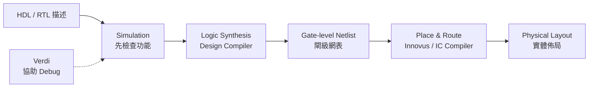
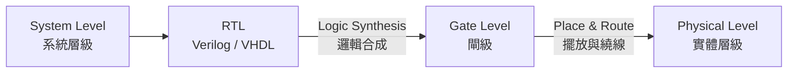

# ch00

第 1 次對話

```text
Phase A — Internal Control Surface（控制面輸出） | TURN=1 | PROMPT=Manual Refresh v1.13.0；Project version=UNKNOWN | REFRESH=ACCEPTED；學習狀態重新建立於 ch00 起點，未把未驗證內容標成完成 | STATE={Mainline=講義_ch00_introduction.pdf；Locator=投影片頁碼/PDF viewer page 1–9；KP=Course Information + EDA Tool Map；Boundary=1–9 VERIFIED，page 10 為 Overview 新段落起點；Parent=Course Information；Source=Lecture Mainline + Teacher Transcript Overlay；SourceInventory=講義_ch00_introduction.pdf + 逐字稿_第1堂_0908_範圍ch00_introduction.txt 已核對，考古題/標準答案目前未提供；Transcript={File=逐字稿_第1堂_0908_範圍ch00_introduction.txt；Session=第1堂；Span=lines 13–117；Align=HIGH；Coverage=pages 1–9 relevant span checked；Signals=Explanation+Emphasis+Homework+Scope；Scope=EDA tools 先認識類型、後續再深入；Correction=NONE found；Conflict=NONE affecting current KP；Residual=PASS for current boundary}；AdjQueue=pages 1–9 current → page 10 next；ExerciseDebt=尚未產生（本則教完必要知識後產生並預計同則出題）；LectureAdjDebt=NONE beyond active boundary；TeacherTranscriptDebt=NONE for current boundary；PastExamDebt=UNKNOWN（考古題來源目前未提供）；Weakness=NONE yet；Coverage=pages 1–9 source checked，尚未經使用者練習驗證；Completion=NO；Evidence=Lecture pages 1–9 + Transcript lines 13–117；Blockers=NONE for teaching；NextLegal=完成本輪練習並達最低標準後進入 pages 10–12 Design Hierarchy} | PLAN={ThisResponse=依講義 pages 1–9 重構 Course Orientation/EDA tools，整合老師 coding-style 與工具角色強調，最後出 2 題英文自足開放題；ExpectedDebtChange=Exercise Debt 以實際輸出題目清償，但知識點 Completion 等使用者作答後才能判定；ExpectedNext=批改後若通過則進 pages 10–12}
```

## ⭐Course Information & EDA Tool Map — 這堂 HDL 課到底在學什麼，寫完 code 之後又會發生什麼？

講義位置：投影片頁碼 1～9（PDF viewer page 1～9）

### 1. 先抓住整門課的主軸

Ch0 一開始 pages 1～9 大部分是課程資訊，但不能全部當行政頁面跳掉，因為其中已經埋了整學期的三條主線：

**Verilog、VHDL、Logic Synthesis(邏輯合成)**。講義明確把這三項列為課程 Topics；後續時程則從 Verilog 的不同 modeling(建模)方法一路走到 logic synthesis/design flow，再進 VHDL。

老師口頭上又補了一個很重要的 mental model(心智模型)：這門課雖然會「寫程式」，但不要把 HDL 當成普通的 C/C++。老師特別強調 `coding style(編碼風格)`，原因是你寫的 HDL 最終是在描述硬體結構；這件事後面整學期會一直重複。

所以目前先記：

**Software(軟體)：在告訴處理器「要做哪些指令」。**

**HDL：在描述「我要什麼硬體」。**

後面我們會把這個差異講得非常精確；現在先建立這個方向就好。

---

### 2. Verilog、VHDL、Logic Synthesis 分別扮演什麼角色？

講義列出兩種 HDL：

* `Verilog`
* `VHDL`

老師說本課會以 **Verilog 為主要內容**，再補充 VHDL，並解釋兩者差異；老師用「有點像 C 與 C++」來降低第一次看到兩種語言的心理負擔，重點是兩者很多硬體核心觀念相通。

第三項 `Logic Synthesis(邏輯合成)` 可以先粗略想成：

> 你用 HDL 寫出較高層次的硬體描述，然後讓工具把它轉換成更低層次的硬體表示。

老師目前用 software 的 `compile(編譯)` 來做直覺類比；真正 RTL、gate-level(閘級) 的關係會在後面的投影片正式展開，所以這裡先不要超前學細節。

---

### 3. EDA Tools — 不需要先背品牌，要先知道「每一類工具負責什麼」

`EDA(Electronic Design Automation，電子設計自動化)` 就是協助完成數位硬體設計、驗證、合成與實體實作的一整套軟體工具。

投影片 page 8 給的工具角色可以整理成：

| 類別                       | 講義中的工具                             | 現階段要知道的功能                                                     |
| ------------------------ | ---------------------------------- | ------------------------------------------------------------- |
| HDL Simulation(HDL 模擬)   | VCS、NC-Verilog、ModelSim、Verilog-XL | 模擬 Verilog/VHDL 設計                                            |
| Logic Synthesis(邏輯合成)    | Design Compiler                    | 將 RTL 合成為 gate netlist(閘級網表)                                  |
| Timing / Power Analysis  | Design Compiler、PrimeTime          | 做 timing/power 相關分析；投影片將 PrimeTime 列於 dynamic timing analysis |
| Debug(除錯)                | Verdi                              | 協助 debug                                                      |
| FPGA Flow                | Xilinx Vivado                      | FPGA 的 simulation 與 synthesis                                 |
| Place & Route(P&R，擺放與繞線) | Innovus、IC Compiler                | 從 gate netlist 產生 physical layout(實體佈局)                       |
| Memory Generation        | SRAM Memory Compiler               | 產生 SRAM 相關設計                                                  |

這些角色都是 page 8 直接列出的內容。

目前**不要用死背工具名稱的方式學**。先把它想成一條加工線：



核心因果關係是：

**你不需要徒手把大量邏輯閘與 layout 全畫出來，而是先把較高層次的 HDL 寫好，再讓 EDA tools 往下轉換。**

老師在逐字稿中也把流程濃縮成兩個大步驟：`synthesis(合成)` 與後面的 `layout(實體佈局)`，而且特別提醒中間會反覆做 verification(驗證)。

---

### 4. Teacher Emphasis — 為什麼老師一直強調 Coding Style？

這是 pages 1～9 裡真正值得你現在就記住的東西。

老師說，寫 HDL 時「每寫一行 code」要帶著它最後會對應到實際硬體／電路的想法；因此 HDL 不是只追求「模擬結果現在看起來對」，而是要考慮這種寫法最後會描述出什麼硬體。

這也是之後你學 Verilog 最容易踩坑的來源。

例如在軟體中，你看到：

`x = a + b`

很自然會想：「CPU 執行這個加法。」

但 HDL 的思考方式應逐漸改成：

**「這段描述最後會對應出什麼 datapath(資料路徑)、adder(加法器)、register(暫存器)、wire(訊號線)？」**

現在不要求你能畫出電路，但從今天開始，每看到 HDL code，都要慢慢養成一句反射：

> **What hardware am I describing?**

這正是老師說會在整門課反覆強調的方向。

---

### 5. 課程負擔：只需要知道這堂課不是「只考語法」

講義評分是：

**Homework 60% + Exams 40%**，共有 5 份主要作業加 1 份 bonus homework；題目一路會做到 pipelined unit、RISC CPU、image edge detection、CNN acceleration。

老師也直接提醒作業 loading 很重，而且第一次接觸 HDL 會花不少時間在 debug 與熟悉 server 環境。

因此這堂課的學習目標不能是：

「背完 Verilog syntax 就好。」

而應是：

**能把硬體架構想清楚 → 寫成合理 HDL → 用工具 simulation/debug → 讓後續 design flow 能走下去。**

---

### 6. 這 9 頁現在真正要記的最短版本

先只留下三個核心印象：

**第一，HDL 是用來描述 hardware(硬體) 的，不要把它當成一般 software programming。**

**第二，這堂課主要學 Verilog，也會學 VHDL，以及 HDL 如何經過 logic synthesis 等 EDA flow 變成硬體。**

**第三，工具名稱可以之後再熟，但角色一定要分清楚：Simulation → Synthesis → P&R；Debug 工具則幫你找問題。**

Pages 1～9 到這裡已完整納入本輪；下一個技術主題才會正式進到 page 10 的 `Overview`，接著是 `Design Hierarchy`。目前先不超前。

### 7. Open-ended Questions(開放式練習)

#### 7.1 Question 1

An HDL design team has the following tool bank:

* VCS
* Design Compiler
* Verdi
* Innovus
* IC Compiler

Match one appropriate tool to each task below, and briefly state why:

1. Simulate an HDL design.
2. Convert RTL into a gate-level netlist.
3. Debug the design.
4. Perform placement and routing to create a physical layout.

[Generated: 依據講義 ch00 投影片頁碼 8；Teacher Transcript Overlay：第1堂 EDA tools 區段]

#### 7.2 Question 2

A student says:

> “HDL is basically just another programming language like C. As long as the program produces the correct output, I do not need to think about what hardware the code represents.”

Based on the course introduction, explain what is wrong or incomplete about this statement.

[Generated: 依據講義 ch00 投影片頁碼 4–8；Teacher Emphasis Signal：第1堂 coding style / physical-circuit mental model]

可直接用中文或英文回答：

1. `1→...，2→...，3→...，4→...`，再簡短說明
2. 2～4 句解釋即可


第 1 次對話

```text
Phase A — Internal Control Surface（控制面輸出） | TURN=1 | PROMPT=Manual Prompt Refresh v1.13.0；Project version=UNKNOWN | REFRESH=ACCEPTED；只重置對話提醒計數，既有學習 State 不重置 | STATE={Mainline=講義_ch00_introduction.pdf；Locator=PDF viewer page 1–9；KP=Course Information + EDA Tool Map；Boundary=1–9 VERIFIED；Parent=Course Information；Source=Lecture Mainline + Teacher Transcript Overlay；SourceInventory=講義PDF + 第1堂逐字稿 + 新增考古題HTML；Transcript={File=逐字稿_第1堂_0908_範圍ch00_introduction.txt；Session=第1堂；Span=lines13–117；Align=HIGH；Coverage=pages1–9；Signals=Explanation+Emphasis+Homework+Scope；Scope=high-level introduction；Correction=NONE；Conflict=NONE；Residual=PASS}；AdjQueue=page10 Overview→page11 Design Hierarchy→page12 Different Levels of Hardware Design；ExerciseDebt=0（前輪2題已實際輸出）；LectureAdjDebt=0 for pages1–9；TeacherTranscriptDebt=0；PastExamDebt=新考古題來源已提供，尚需本則完成局部對應檢查；Weakness=NONE；Coverage=pages1–9已教、使用者答案已收到；Completion=PARTIAL/PENDING GRADING；Evidence=前輪題目實際輸出+本輪使用者作答；Blockers=本則批改與Past Exam Gate；NextLegal=若達最低通過標準則進入pages10–12} | PLAN={ThisResponse=批改Q1/Q2→整合新考古題來源→若通過則前進相鄰主線pages10–12並完成必要知識包與英文開放題；ExpectedDebtChange=pages1–9預期完成，pages10–12新Exercise Debt以本則實際出題清償；ExpectedNext=使用者作答pages10–12題目後再決定是否進page13}
```

#### 1. 上一輪批改

| 題目                   | 結果 | 評語                                                   |
| -------------------- | -- | ---------------------------------------------------- |
| 1.1 HDL simulation   | ✅  | 你寫的 `vsc` 應修正為 **VCS**；工具角色答對。                       |
| 1.2 RTL → gate-level | ✅  | 你寫的 `Design Computer` 應修正為 **Design Compiler**；概念答對。 |
| 1.3 Debug            | ✅  | `Verdi` 正確。                                          |
| 1.4 Place & Route    | ✅  | `Innovus` 正確。                                        |
| 2                    | ✅  | 核心觀念正確，而且已抓到「HDL code 對應硬體」這個老師真正重視的 mental model。   |

講義 page 8 確實把 VCS 列為 HDL simulation 工具、Design Compiler 用於 RTL 到 gate netlist 的 logic synthesis、Verdi 用於 debug，而 Innovus / IC Compiler 用於 P&R。

---

#### 2. 第 2 題中文修正版

你的回答可以整理成：

> HDL 不只是要讓功能輸出正確；`synthesizable HDL(可合成 HDL)` 最後會對應成實際硬體電路，因此寫 code 時還要思考這段 code 會描述、合成出什麼 hardware structure(硬體結構)，以及它對 timing、power 等硬體特性的影響。

老師第一堂就是反覆強調「每寫一行 HDL，都要想到它會 map 到實際電路」，而且 HDL 不只要 compile，實際訊號傳遞還涉及 timing analysis。

你提到的「效能、面積、速度、功耗」方向沒有問題；只是 `performance(效能)` 與 `speed(速度)` 在這裡有部分重疊，而 `PPA` 的完整概念是後面講義才會正式展開，所以這一題最重要的答案仍然是：

**不能只用 software 的「output 對就好」思維；必須知道 HDL 正在描述什麼硬體。**

#### 3. 英文考試版

> HDL does not merely describe operations to be executed like a software program. Synthesizable HDL describes hardware that can be mapped to physical circuits, so a designer must consider what hardware structure the code represents, not only whether the simulated output is correct.

---

#### 4. 考古題檢查結果

新提供的考古題已納入來源。其題目索引目前主要是三種 modeling methods、flip-flop、clock-gating、blocking/non-blocking、signed/shift、pipeline、RCA、dot product 與 code tracing，沒有看到直接針對目前 pages 1–9「EDA 工具角色辨識」的題目。

考古題裡確實有後續會要求你畫 `expected synthesis results` 的題型，但它綁定的是 Clock-Gating 等後面尚未正式教過的內容，因此現在不能提前拿來考你。

所以這一輪你已達最低通過標準，不需要原地追加同型題，依講義相鄰主線前進。

## ⭐Design Hierarchy & Hardware Design Levels — 為什麼硬體設計要分成不同抽象層級？

講義位置：PDF viewer page 10 ~ 12／輔助：投影片頁碼 10–12

### 1. 核心問題：為什麼不能直接從最底層開始畫？

假設今天要設計一顆 CPU。

如果直接要求你：

> 「請把 CPU 裡所有 logic gates(邏輯閘)、線路以及 physical layout(實體佈局)全部畫出來。」

幾乎沒辦法管理。

所以工程設計會使用 `Abstraction(抽象化)`：

> **先在高層只想「功能與架構」，再一步一步轉成更具體的硬體。**

這就是 `Design Hierarchy(設計階層)` 的核心。

---

### 2. Page 11：Software 與 Hardware 都有自己的階層

Page 11 左邊的圖把 Software(軟體)一路往下：

**Applications**
→ `Higher-Level Language Program`，例如 C
→ Compiler
→ `Assembly Language`
→ Assembler
→ `Machine Language`

而到了 SW/HW 的交界，machine language 最終需要由硬體來 `Machine Interpretation(機器解讀)`。

圖的硬體部分則有：

**Hardware Architecture Description**
→ `Architecture Implementation(架構實作)`
→ **Logic Circuit Description**

其中投影片直接舉：

* Architecture description：`block diagram(方塊圖)`
* Logic circuit description：`circuit schematic diagram(電路原理圖)`。

注意一個很重要的誤區：

> 這張圖不是說「compiler 把 machine code 轉成 block diagram」。

它是在告訴你：

**Software 有自己的抽象階層；Hardware 也有自己的抽象階層。**

---

### 3. Block Diagram 和 Schematic 到底差在哪？

老師對這張圖的口頭解釋很重要。

老師說 `block diagram(方塊圖)` 比較 high-level，通常先用它來描述設計，再根據這個架構去寫 HDL；而 `schematic diagram(電路原理圖)` 則是更低層、比較具體的電路表示。

例如 CPU 高階架構可以先畫：

```text
Register File → ALU → Memory
```

這時你只在意：

> 有哪些大功能模組？
> 資料怎麼流？

而不是先畫：

```text
AND gate
OR gate
MUX
Flip-Flop
...
```

所以：

**Block Diagram：我要哪些大的硬體功能。**

**Schematic：這些功能實際由哪些電路元件組成。**

老師甚至把 block diagram 類比成某種 `specification(規格)`：先知道客戶希望晶片完成什麼，再依架構寫 HDL。

---

### 4. Page 12：硬體設計的四個 Level

Page 12 正式把 Hardware Design 分成四層：

| 從高到低 | Level                                  | 講義例子                    |
| ---- | -------------------------------------- | ----------------------- |
| 1    | `System Level(系統層級)`                   | C、SystemC、SystemVerilog |
| 2    | `RTL(Register Transfer Level，暫存器傳輸層級)` | **Verilog、VHDL**        |
| 3    | `Gate Level(閘級)`                       | logic gates 與它們的連線      |
| 4    | `Physical Level(實體層級)`                 | physical layout         |

這張表你之後會一直用到。

最重要的是：

> **這堂 HDL 課主要讓你寫的是 RTL。**

老師逐字稿也直接說：

> RTL 就是這堂課要教的層級，Verilog 和 VHDL 都是在這個層級使用。

---

### 5. 那我們剛剛問的 Synthesis 和 P&R 放在哪裡？

現在你前面問的兩個名詞就全部接起來了：



講義 page 12 明確寫：

**RTL → Logic Synthesis → Gate Level**

工具例子：

* Design Compiler
* Vivado synthesis

再來：

**Gate Level → P&R → Physical Level**

工具例子：

* IC Compiler
* Innovus。

所以你現在可以把先前的問題合成一句：

> **Synthesis 決定「要有哪些 gates/cells 與邏輯連線」；P&R 再決定這些元件實際放哪、線實際怎麼走。**

---

### 6. Front-end 和 Back-end 也從這裡分開

老師口頭上把這兩段分成：

**Front-end(前端)：RTL → Gate Level**

**Back-end(後端)：Gate Level → Physical Level，主要經過 P&R**

而 Design Compiler 負責前面的 synthesis；Innovus / IC Compiler 負責後面的 P&R。

所以看到：

> `Front-end cell-based design flow`

先想到：

**RTL / synthesis / gate-level**

看到：

> `Back-end cell-based design flow`

先想到：

**P&R / physical layout**

---

### 7. 目前最容易搞混的三件事

第一個：

**Verilog/VHDL ≠ gate-level。**

在這份講義目前的分類裡：

> **Verilog/VHDL → RTL level。**

第二個：

**Logic Synthesis ≠ Physical Layout。**

Synthesis 只走到：

> **RTL → Gate Level**

之後還需要 P&R 才往 Physical Level 走。

第三個：

**Block Diagram ≠ Circuit Schematic。**

前者是在描述高階 architecture；後者則更接近具體 logic circuit。

---

### 8. 最短記法

這四個字一定要先熟：

> **System → RTL → Gate → Physical**

然後再加兩座橋：

> **RTL —Synthesis→ Gate**

> **Gate —P&R→ Physical**

以及這門課的位置：

> **Verilog / VHDL = RTL**

### 9. Open-ended Questions(開放式練習)

#### 9.1 Question 1

Arrange the following hardware design levels from the highest level of abstraction to the lowest:

* Gate level
* Physical level
* Register Transfer Level (RTL)
* System level

Then give one example of a language or representation associated with each level according to the lecture.

[Generated: 依據講義 ch00 PDF viewer pages 10–12]

#### 9.2 Question 2

A designer writes a hardware module in Verilog. The design is then processed by Synopsys Design Compiler, producing a gate-level netlist. After that, Cadence Innovus performs placement and routing.

Answer the following:

1. What design level is the original Verilog description?
2. What design level is the output of Design Compiler?
3. What design level is produced after placement and routing?
4. Which transformation is called logic synthesis?
5. Which transformation belongs to the back-end design flow?

[Generated: 依據講義 ch00 PDF viewer page 12；Teacher Transcript Overlay：第1堂 Design Hierarchy / design-level 區段]

#### 9.3 Question 3

A student says, “A hardware block diagram and a circuit schematic are basically the same thing because both describe hardware.”

Explain why this statement is incomplete. Also explain why a designer may create a block diagram before writing HDL code.

[Generated: 依據講義 ch00 PDF viewer page 11；Teacher Explanation Signal：第1堂 Design Hierarchy 區段]

可用中文或英文回答：`1.` 排序＋例子；`2.` 依 1～5 作答；`3.` 2～4 句即可。
