第 1 次對話

```text
TEXT HANDOFF | STATE={GOAL=複習第01堂課; STAGE=啟動; COMPLETED=尚無已完成知識點; VERIFIED=逐字稿_01_0911.txt依檔名前綴解析Session=01，已核對本堂正式課程內容起於L162，老師先教Rules of Sum/Product，後續才進入§1.2 Permutations，§1.3僅開始介紹且Binomial Theorem明確延至下週; NEEDS_REVIEW=第01堂全部正式授課內容; CURRENT=Rules of Sum and Product; NEXT=完成本知識點教學與練習後再進§1.2 Permutations; BLOCKER=無; EVIDENCE=逐字稿L162–220與課本PDF viewer p.24–26已核對} | PLAN={THIS_RESPONSE=教Rules of Sum/Product並安排自適應練習; EXPECTED_NEXT=依作答批改後判定是否推進Permutations}
```

```text
Phase A — Internal Control Surface（控制面輸出） | TURN=1 | PROMPT=1.15.0 | REFRESH=ManualPromptRefresh_CONFIRMED | STATE={MainlineMode=Transcript; MainlineSource=逐字稿_01_0911.txt; Locator=Session=01/L166–186; KP=Rules of Sum and Product; Boundary=已核對_L166–186_下一主題L188開始Permutations; Transcript={File=逐字稿_01_0911.txt; Session=01; SessionSource=FilenamePrefix; WithinSessionOrder=NA; Span=L166–186; Coverage=FULL_for_current_KP; TeachingState=TAUGHT_CORE; Signals=Explanation+Emphasis; Scope=Rule_of_Sum+Rule_of_Product+辨識條件; Correction=NONE; ASR=部分口語措辭以課本precision校準; Residual=已核對至L220}; Reference={Aligned=Textbook_Ch1_§1.1_PDFviewer_p24–26; PrecisionStatus=已核對}; Practice={LearningObjective=能依問題結構辨識並正確套用Sum/Product Rule; Modality=classification+calculation+brief_reasoning; ExpectedArtifact=答案+簡短理由; AcceptedSubmission=中文或英文文字/列式; RequiredModality=NO; AssessmentFidelity=Learning; SubmissionStatus=NOT_SUBMITTED}; AdjQueue=Rules_of_Sum_Product→Permutations→Combinations_preview; ExerciseDebt=本則教完後產生; TeachingMainlineDebt=Permutations尚未處理; AssessmentRequirementDebt=Homework_4_5_6_9_28待對應知識點後處理; ReferenceResolutionDebt=NONE_high_priority; PastExamDebt=108_Quiz1_ProductRule_direct_available_but_not_yet_used; Weakness=UNKNOWN; Coverage=Session01局部進行中; Completion=本KP尚未完成; Evidence=逐字稿L166–186+課本p24–26; Blockers=NONE; NextLegal=完成本KP練習後批改} | PLAN={ThisResponse=重構Rules_of_Sum_and_Product並輸出3個Practice_Tasks; ExpectedDebtChange=ExerciseDebt題目輸出後待使用者作答; ExpectedNext=批改並視結果推進§1.2}
```

## ⭐ Rule of Sum（加法原理）與 Rule of Product（乘法原理）— 到底什麼時候加、什麼時候乘？

主線位置：Teacher Transcript／`逐字稿_01_0911.txt`／Session=01／L166–186
對齊參考：Grimaldi Ch.1 §1.1／PDF viewer page 24–26

老師在第 01 堂正式進入課程內容後，第一個真正教的核心就是這兩條 Counting Principle（計數原理）。逐字稿中老師先講 Rule of Sum，再用程式、餐廳、舞台選角等例子區分 Rule of Product，到了後面才切換到 §1.2 Permutations（排列），所以這裡是一個完整自然知識點。

課本 §1.1 也是同樣順序：先定義 Rule of Sum，再定義 Rule of Product，並用多個例子說明。 Pearson 官方目錄也確認 Chapter 1 的第一小節就是 *The Rules of Sum and Product*，接著才是 *Permutations*。([Pearson][1])

---

### 1. 最根本的問題：一個計數問題，到底是在問「選一條路」還是「走完多個步驟」？

不要先背：

$$
m+n
$$

或

$$
m\times n
$$

先問：

> 一個完整結果，是從幾個互斥方案中「選一個」？
>
> 還是必須依序完成多個 stage（階段），每個階段都要作選擇？

這就是兩條規則的分界。

---

### 2. Rule of Sum（加法原理）：OR → 加

假設完成某件事有兩種**互斥的途徑**：

* Task A 有 \(m\) 種方法；
* Task B 有 \(n\) 種方法；
* 一個結果不會同時屬於 A 與 B。

那麼：

$$
\boxed{m+n}
$$

種。

老師特別強調的關鍵，就是這些 alternatives（替代方案）不能在同一次結果中同時發生。

#### 2.1 生活化理解

你今天只選一種午餐：

* 麵有 5 種；
* 飯有 7 種。

你問的是：

> 吃麵 **或** 吃飯。

所以：

$$
5+7=12.
$$

這是一個 OR（或）的結構。

---

### 3. 為什麼「不能重複計算」很重要？

假設：

* 社團 A 有 20 人；
* 社團 B 有 15 人。

如果兩個社團有人同時加入，那你不能直接說：

$$
20+15=35
$$

因為同時加入 A、B 的人會被算兩次。

所以最基本的 Rule of Sum 使用前提，是兩組 outcomes（結果）要互斥。

你現在可以先記：

$$
\boxed{\text{互斥的選擇} \Rightarrow \text{加}}
$$

之後課程再遇到 Inclusion-Exclusion Principle（排容原理）時，才會系統處理「不互斥怎麼辦」。

---

### 4. 老師上課的三種程式語言教材例子

逐字稿舉的情境是：有三種程式語言教材可以推薦，而且每種各有 7 本：

* C++：7 本
* Java：7 本
* Perl：7 本

只推薦其中一本，所以：

$$
7+7+7=21.
$$

重點根本不是「教材」本身，而是：

> 完整結果只會落在其中一類。

所以用 Sum。

---

### 5. Rule of Product（乘法原理）：AND → 乘

另一種情況：

第一階段有 \(m\) 種選擇。

對第一階段的**每一個**選擇，第二階段又有 \(n\) 種選擇。

而且一個完整結果必須包含：

$$
\text{第一階段}+\text{第二階段}.
$$

總數就是：

$$
\boxed{m\times n}
$$

課本正式定義正是把 procedure（程序）拆成 first stage（第一階段）與 second stage（第二階段）；第一階段有 \(m\) 種結果，對其中每個結果，第二階段有 \(n\) 種結果，因此完整 procedure 有 \(mn\) 種。

---

### 6. 生活化理解：餐廳 × 餐點

假設：

* 3 家餐廳；
* 每一家都有 5 種你要吃的餐點。

完整的午餐選擇不是只選餐廳，也不是只選餐點。

你必須：

```text
選一家餐廳
   ↓
在那家餐廳選一道餐
```

因此：

$$
3\times5=15.
$$

這是一個 AND（而且）的結構：

> 餐廳 **而且** 餐點。

---

### 7. 老師為什麼一直拿「程式執行流程」解釋？

因為老師想建立的不是高中式「看到排列組合就套公式」，而是把問題拆成 stages（階段）。

逐字稿用 pseudo-code（虛擬碼）的概念說明：先進入 first stage 的某一個 case，接著該 case 裡又一定要執行 second stage，所以一個完整 execution path（執行路徑）包含兩層選擇。

用樹狀圖看最直觀：

```text
第一階段
├─ A1
│  ├─ B1
│  ├─ B2
│  └─ B3
├─ A2
│  ├─ B1
│  ├─ B2
│  └─ B3
└─ A3
   ├─ B1
   ├─ B2
   └─ B3
```

第一層有 3 個 branch（分支），每個 branch 再有 3 個：

$$
3\times3=9.
$$

---

### 8. 老師的舞台劇例子：6 × 8

老師接著講 Example 1.5：

* 6 位男性候選人可演男主角；
* 8 位女性候選人可演女主角。

一個 cast（演員組合）必須同時有：

* 一個男性；
* 一個女性。

所以：

$$
6\times8=48.
$$

這不是：

$$
6+8=14
$$

因為「選男主角」與「選女主角」並不是二選一；兩件事都必須完成。

---

### 9. 最值得記的判斷法：OR / AND

遇到題目時先不要算。

先翻譯成一句話：

| 問題結構               | 原理              |         運算 |
| ------------------ | --------------- | ---------: |
| 從互斥類別中選 **其中一個**   | Rule of Sum     |      \(+\) |
| 完整結果需要完成 **每一個階段** | Rule of Product | \(\times\) |

你可以先把它粗略記成：

$$
\boxed{\text{OR}\rightarrow +}
$$

$$
\boxed{\text{AND}\rightarrow \times}
$$

但這個口訣不是百分之百機械式的。真正要看的是**完整 outcome（結果）如何形成**。

---

### 10. 一題為什麼可以同時用加法和乘法？

這是非常重要的。

假設早餐可以：

* 選漢堡：3 種漢堡，而且可搭 4 種飲料；
* 或選蛋餅：5 種蛋餅，而且可搭 4 種飲料。

先算每條 route（路徑）：

漢堡方案：

$$
3\times4=12
$$

蛋餅方案：

$$
5\times4=20
$$

最後兩條方案互斥：

$$
12+20=32.
$$

所以複雜題的核心通常不是「這題是加法題還是乘法題」。

而是：

> 哪一層是 OR？
>
> 哪一層是 AND？

這也是老師後面提到 application problem（應用題）特別重要的原因：不是公式難，而是你能不能從長文字中看出結構。

---

/// danger
### 11. 一個非常實用的解題流程

每次看到 counting problem（計數題），按照這四步：

1. **定義一個完整結果長什麼樣。**
2. 問：有哪些 mutually exclusive cases（互斥情況）？
3. 每一個 case 裡，又需要完成哪些 stages（階段）？
4. case 之間加，stage 之間乘。

可以壓成一句：

$$
\boxed{\text{Cases 加；Stages 乘}}
$$
///

---

### 12. 這個知識點和後面的 Permutation 有什麼關係？

老師下一個正式主題是 §1.2 Permutations（排列）。逐字稿明確說，排列其實就是把 Rule of Product 用在一連串位置選擇上。

例如從 10 個不同學生選 5 個排成一列：

* 第 1 位：10 種
* 第 2 位：9 種
* 第 3 位：8 種
* 第 4 位：7 種
* 第 5 位：6 種

所以：

$$
10\times9\times8\times7\times6.
$$

你之後看到

$$
P(10,5)
$$

其實不是一個憑空冒出來的新公式。

它的底層就是：

$$
\boxed{\text{Rule of Product}}
$$

所以這一小節一定要真的懂，而不是只記「加或乘」。

---

### 13. Assessment Quick Check（評量快速檢查）

目前歷屆小考中確實有直接的 Product Rule 題型：108 Quiz 1 Problem 1 給定汽車有 4 種車型、12 種顏色、3 種引擎、2 種變速箱，要求計算完整配置數；其解法就是逐階段相乘。

不過我們現在先不用考古題原題；先確認你能自己辨識 Sum/Product，再進 §1.2。老師本堂也明確說作業偏好長文字應用題，並指定了 4、5、6、9、28，表示「從文字辨識計數結構」是這堂需要練的能力。

### 14. Practice Tasks（練習任務）

#### 14.1 Task 1 — Classification

**For each situation, decide whether the Rule of Sum or the Rule of Product should be used. Give one short reason.**

a. A student chooses **one** elective: 8 CS courses or 5 math courses.
b. A password consists of **one letter followed by one digit**. There are 26 possible letters and 10 possible digits.
c. You choose **one** dessert: 4 cakes, 3 puddings, or 6 ice creams.

作答格式可直接寫：

`a. Sum, because ...`

---

#### 14.2 Task 2 — Calculation

**A restaurant offers 4 main dishes and 3 drinks. A lunch set contains exactly one main dish and one drink. How many different lunch sets are possible?**

請給：

1. 使用哪一條 rule；
2. 列式；
3. 答案。

---

#### 14.3 Task 3 — Mixed Structure

**A student may choose either:**

* **Plan A:** one of 3 programming courses and one of 4 lab sections, or
* **Plan B:** one of 5 mathematics courses and one of 2 tutorial sections.

**How many complete schedules are possible?**

請不要只給數字；用一行列式表示你認為哪裡乘、哪裡加。

[1]: https://www.pearson.com/en-us/subject-catalog/p/Grimaldi-Discrete-and-Combinatorial-Mathematics-Classic-Version-5th-Edition/P200000006199?utm_source=chatgpt.com "Discrete and Combinatorial Mathematics (Classic Version)"


第 2 次對話

```text
Phase A — Internal Control Surface（控制面輸出） | TURN=2 | PROMPT=1.15.0 | REFRESH=NO | STATE={MainlineMode=Transcript; MainlineSource=逐字稿_01_0911.txt; Locator=Session=01/L166–186; KP=Rules of Sum and Product; Boundary=已核對_L166–186; Transcript={File=逐字稿_01_0911.txt; Session=01; SessionSource=FilenamePrefix; WithinSessionOrder=NA; Span=L166–186; Coverage=FULL_for_current_KP; TeachingState=TAUGHT_CORE; Signals=Explanation+Emphasis; Scope=Sum/Product辨識與計算; Correction=NONE; ASR=precision已由課本校準; Residual=已核對至L220}; Reference={Aligned=Textbook_Ch1_§1.1_PDFviewer_p24–26; PrecisionStatus=已核對}; Practice={LearningObjective=辨識Sum/Product並處理混合結構; Modality=classification+calculation; ExpectedArtifact=手寫答案與簡短理由; AcceptedSubmission=圖片; RequiredModality=NO; AssessmentFidelity=Learning; SubmissionStatus=GRADABLE}; AdjQueue=Rules_of_Sum_Product→Permutations→Combinations_preview; ExerciseDebt=上一輪3題已實際提交_待本則批改; TeachingMainlineDebt=Permutations尚未處理; AssessmentRequirementDebt=Homework_4_5_6_9_28待逐步處理; ReferenceResolutionDebt=NONE_high_priority; PastExamDebt=direct_ProductRule_available; Weakness=尚無已確認弱點; Coverage=Session01局部進行中; Completion=Sum/Product待本則批改後判定; Evidence=使用者手寫提交+逐字稿L166–186; Blockers=NONE; NextLegal=若通過則進L188–210_Permutations} | PLAN={ThisResponse=批改3題並在通過後正式教§1.2 Permutations與安排練習; ExpectedDebtChange=Sum/Product完成並產生Permutations ExerciseDebt; ExpectedNext=批改Permutation練習後處理Combinations preview與Homework debt}
```

#### 1. 批改結果

你的圖片清楚可讀，這次 submission（提交）可以完整批改。

| Task | 結果 | 評語                                                     |
| ---- | -- | ------------------------------------------------------ |
| 1a   | ✅  | `Sum` 正確。8 門 CS 或 5 門 Math，只選其中一門，所以 \(8+5=13\)。       |
| 1b   | ✅  | `Product` 正確。字母與數字兩個 stage 都要完成，所以 \(26\times10=260\)。 |
| 1c   | ✅  | `Sum` 正確。三類 dessert 擇一，所以 \(4+3+6=13\)。                |
| 2    | ✅  | \(4\times3=12\)，而且理由「先選食物再選飲料」正確抓到兩階段結構。               |
| 3    | ✅  | 你最後寫的 \(3\times4+5\times2=12+10=22\) 完全正確。             |

Task 3 中間有先寫一個「12」，但你最下方已清楚修正成完整列式 \(3\times4+5\times2=22\)，所以以最後答案判定，不扣分。

你目前最重要的判斷已經掌握：

$$
\boxed{\text{互斥 cases 之間加}}
$$

$$
\boxed{\text{同一完整結果中的 stages 之間乘}}
$$

因此 `Rules of Sum and Product` 這個知識點可以通過，下一個合法主線就是老師實際接著教的 §1.2 `Permutations(排列)`。老師也是直接從 Rule of Product 延伸到「10 人選 5 人排成一列」。

---

## ⭐ Permutations（排列）— 為什麼「同樣選到這些人」，換位置就變成不同答案？

主線位置：Teacher Transcript／`逐字稿_01_0911.txt`／Session=01／L188–210
對齊參考：Grimaldi Ch.1 §1.2／PDF viewer page 27–31

### 1. 核心問題：Order（順序）有沒有影響答案？

老師第一個例子是：

> 10 位學生裡選 5 位，排成一列拍照。

假設選到：

$$
A,B,C,D,E
$$

這兩種：

$$
ABCDE
$$

與

$$
BACDE
$$

是不是同一個結果？

不是。

因為拍照時誰站左邊、誰站右邊會形成不同排列。

老師在逐字稿特別抓了 `arrangement` 與 `order` 這兩個 keyword。

所以先記住：

$$
\boxed{\text{Order matters} \Rightarrow \text{Permutation}}
$$

---

### 2. 為什麼 10 個人排 5 個是 \(10\times9\times8\times7\times6\)？

不要先背公式。

用上一個知識點的 Rule of Product：

第一個位置：

$$
10
$$

種。

選走一個人後，第二個位置：

$$
9
$$

種。

繼續：

$$
8,\ 7,\ 6
$$

因此：

$$
10\times9\times8\times7\times6.
$$

這正是課本 Example 1.9 的結構。

所以 Permutation 本質上沒有新的魔法：

$$
\boxed{\text{Permutation = Rule of Product applied to ordered positions}}
$$

---

### 3. Factorial（階乘）

為了讓這種連乘寫得簡單，定義：

$$
n!=n(n-1)(n-2)\cdots2\cdot1
$$

例如：

$$
5!=5\cdot4\cdot3\cdot2\cdot1=120.
$$

另外：

$$
\boxed{0!=1}
$$

這不是因為 \(0\) 真的拿去一路乘得到 1，而是數學上把 \(0!\) 定義成 1，使後面的排列、組合公式保持一致。

老師在課堂上正式介紹了這個 Definition 1.1。

---

### 4. \(P(n,r)\) 到底代表什麼？

假設有：

* \(n\) 個 **distinct objects（相異物件）**
* 從中取 \(r\) 個
* 而且要考慮排列順序。

記作：

$$
P(n,r).
$$

第一個位置有 \(n\) 種；

第二個：

$$
n-1
$$

種；

一直到第 \(r\) 個位置：

$$
n-r+1
$$

種。

因此：

$$
P(n,r)
=
n(n-1)(n-2)\cdots(n-r+1).
$$

利用 factorial：

/// danger|公式

$$
\boxed{P(n,r)=\frac{n!}{(n-r)!}}
$$

///

老師在逐字稿就是由 Rule of Product 推到這個式子；課本 Definition 1.2 也正式給出相同公式。 

---

### 5. 為什麼分母是 \((n-r)!\)？

以：

$$
P(10,5)
$$

為例：

$$
10\times9\times8\times7\times6.
$$

而：

$$
10!
=
10\times9\times8\times7\times6\times5\times4\times3\times2\times1.
$$

我們不要後面的：

$$
5\times4\times3\times2\times1=5!.
$$

所以：

$$
P(10,5)=\frac{10!}{5!}.
$$

一般化：

$$
\boxed{\frac{n!}{(n-r)!}}
$$

就是把「沒被選進來的 \(n-r\) 個位置」消掉。

---

### 6. 一個超重要前提：Distinct（相異）

公式

$$
\frac{n!}{(n-r)!}
$$

不能看到「排列」兩字就直接用。

它假設物件彼此可區分。

老師用 `COMPUTER` 當例子，就是因為：

C、O、M、P、U、T、E、R

八個字母都不同。

所以全部八個排列：

$$
8!.
$$

若只取其中五個排列：

$$
P(8,5)=\frac{8!}{3!}.
$$

老師還特別提醒：如果 word 裡有 repeated letters（重複字母），直接套這條就會錯。

---

### 7. Repeated Objects（重複物件）的排列

例如：

$$
BALL
$$

如果暫時假裝兩個 L 是不同的：

$$
B,A,L_1,L_2
$$

會有：

$$
4!
$$

種。

但：

$$
BAL_1L_2
$$

和

$$
BAL_2L_1
$$

實際看起來都是：

$$
BALL.
$$

每一個真正排列都被重複算了：

$$
2!
$$

次。

所以：

$$
\frac{4!}{2!}=12.
$$

一般而言，總共有 \(n\) 個物件，其中：

* 第一類重複 \(n_1\) 次；
* 第二類重複 \(n_2\) 次；
* …
* 第k類重複 \(n_k\) 次；

且一定要有：

/// danger|Repeated Objects（重複物件）的排列

$$
n_1+n_2+\cdots+n_k=n.
$$

那不同排列數：

$$
\boxed{
\frac{n!}{n_1!n_2!\cdots n_k!}
}
$$

///

老師特別強調：條件 \(n_1+\cdots+n_k=n\) 也要寫清楚，不能只丟一個公式。

課本接著用 `BALL`、`DATABASES`、`MASSASAUGA` 展開同樣的重複排列觀念。

---

### 8. Block Method（綁成一塊）

老師最後還教了一個很常考的變形。

假設 `MASSASAUGA` 中四個 A 必須全部連在一起：

先把：

$$
AAAA
$$

視為「一個物件」。

原本 10 個字母，四個 A 合成一塊後，只剩：

$$
AAAA,\ S,S,S,\ M,\ U,\ G
$$

也就是 7 個物件。

其中 S 重複三次，所以：

$$
\boxed{\frac{7!}{3!}}.
$$

這就是一個很重要的技巧：

> 若題目說某些東西 must stay together（必須相鄰），先把它們綁成一個 block（區塊）。

老師在本堂確實做到這個延伸，之後才宣布 permutation 部分結束、轉進 1.3 combination。

---

### 9. 目前你要能快速分辨的三種模式

| 題目特徵             | 方法                                          |
| ---------------- | ------------------------------------------- |
| 相異物件，順序重要        | \(\displaystyle P(n,r)=\frac{n!}{(n-r)!}\)  |
| 全部 \(n\) 個相異物件排列 | \(n!\)                                      |
| 有重複物件            | \(\displaystyle \frac{n!}{n_1!n_2!\cdots}\) |
| 某些物件必須連續         | 先綁成 block，再排列                               |

最容易犯的錯就是：

> 「題目說 arrangement，所以我就用 \(n!\)。」

不夠。

第一個要問的是：

$$
\boxed{\text{物件到底能不能區分？}}
$$

第二個才問：

$$
\boxed{\text{順序是否重要？}}
$$

### 10. Practice Tasks（練習任務）

#### 10.1 Task 1 — Basic Permutation

**Eight distinct students are available. In how many ways can 3 of them be selected and arranged in three seats from left to right?**

請寫：

1. 使用 \(P(n,r)\) 的 \(n,r\)；
2. 列式；
3. 最後答案。

---

#### 10.2 Task 2 — Repeated Objects

**How many distinct arrangements of the letters in `BANANA` are possible?**

提示只到這裡：

* 總字母數是多少？
* 哪些字母重複、各重複幾次？

請自行列完整公式。

---

#### 10.3 Task 3 — Block Method

**How many distinct arrangements of the letters in `BANANA` are possible if all three A's must appear together?**

Expected Artifact：請至少寫出「你把哪些東西視為一個 block」以及最後列式。


第 3 次對話

```text
Phase A — Internal Control Surface（控制面輸出） | TURN=3 | PROMPT=1.15.0 | REFRESH=NO_LatestMessagePrimaryIntent=AnswerSubmission | STATE={MainlineMode=Transcript; MainlineSource=逐字稿_01_0911.txt; Locator=Session=01/L188–210; KP=Permutations; Boundary=已核對_L188–210_後續L212轉入Combinations; Transcript={File=逐字稿_01_0911.txt; Session=01; SessionSource=FilenamePrefix; WithinSessionOrder=NA; Span=L188–210; Coverage=FULL_for_current_KP; TeachingState=TAUGHT_CORE; Signals=Explanation+Emphasis; Scope=distinct permutation+P(n,r)+repeated objects+block method; Correction=NONE; ASR=precision已由課本校準; Residual=已核對至L220}; Reference={Aligned=Textbook_§1.2_PDFviewer_p27–31; PrecisionStatus=已核對}; Practice={LearningObjective=能計算distinct/repeated/block permutations; Modality=calculation; ExpectedArtifact=公式與計算; AcceptedSubmission=手寫圖片; RequiredModality=NO; AssessmentFidelity=Learning; SubmissionStatus=GRADABLE}; AdjQueue=Permutations→Combinations_brief→BinomialTheorem_PREVIEW_ONLY; ExerciseDebt=上一輪3題已提交待本則正式批改; TeachingMainlineDebt=Combinations_brief尚未處理; AssessmentRequirementDebt=Homework_4_5_6_9_28仍待處理; ReferenceResolutionDebt=NONE_high_priority; PastExamDebt=DEFERRED; Weakness=尚無已確認弱點; Coverage=Session01局部進行中; Completion=Permutations待本則批改後Commit; Evidence=使用者本輪可讀手寫submission+逐字稿L188–210+課本p27–31; Blockers=NONE; NextLegal=批改若通過則處理L212_Combinations_brief，不展開L214_BinomialTheorem} | PLAN={ThisResponse=批改Permutation三題；若全對則依實際授課只教Combinations最小必要內容並安排1題輕量練習; ExpectedDebtChange=Permutation能力通過、建立Combinations輕量ExerciseDebt; ExpectedNext=批改後優先處理老師指定Homework requirement}
```

#### 1. 批改結果

你的手寫圖片完整、清楚，可以可靠批改。三題全部正確。

| Task                | 結果 | 你的作法                                                    | 批改                           |
| ------------------- | -- | ------------------------------------------------------- | ---------------------------- |
| 1 Basic Permutation | ✅  | \(P(8,3)=\frac{8!}{5!}=8\cdot7\cdot6=336\)              | 完整正確                         |
| 2 `BANANA`          | ✅  | \(\frac{6!}{3!2!1!}=60\)                                | A 有 3 個、N 有 2 個、B 有 1 個，完全正確 |
| 3 A 必須相鄰            | ✅  | 把 `AAA` 當一個 block，得到 \(B,N,N,AAA\)，\(\frac{4!}{2!}=12\) | Block Method（區塊法）使用正確        |

Task 2 你不只是答案對，還有先辨認「6 個字母、A 重複 3 次、N 重複 2 次」，表示你知道為什麼要除以 \(3!2!\)，不是單純背公式。

Task 3 也正確抓到關鍵：

$$
AAA
$$

綁成一個 block 後，排列的其實是

$$
AAA,\ B,\ N,\ N
$$

其中兩個 \(N\) indistinguishable（不可區分），所以

$$
\frac{4!}{2!}=12.
$$

這輪沒有發現需要建立的 Weakness（弱點），因此不再追加同型排列題，直接依老師的授課順序往下。

---

## ⭐ Combinations（組合）— 選到「哪些東西」重要，但順序不重要

主線位置：Teacher Transcript／`逐字稿_01_0911.txt`／Session=01／L210–214
對齊參考：Grimaldi Ch.1 §1.3／PDF viewer page 35–36

這裡要很精確區分老師實際教到哪裡：

* 老師確實**簡短教了 Combination（組合）的概念與公式**；
* 但 `Binomial Theorem（二項式定理)` 只先 preview（預告），並明確說「下一拜再來介紹」。

所以本輪只學老師當天真正展開的 Combination，不往後偷學 Binomial Theorem。

### 1. Permutation 與 Combination 真正差在哪？

上一段我們一直問：

> `Order matters?（順序重要嗎？）`

Permutation：

$$
ABC\neq BAC
$$

所以要分開計數。

但是 Combination 在問的是：

> 我到底**選到了哪些物件**？

例如從 A、B、C、D、E 五個人選三個人成立委員會。

選：

$$
A,B,C
$$

跟：

$$
C,A,B
$$

其實是**同一個委員會**。

因此：

$$
\boxed{\text{Order does not matter} \Rightarrow \text{Combination}}
$$

老師在逐字稿就是用 `selection` 這個字來區分：只關心袋子裡有哪些東西，不關心它們排列在哪裡。

---

### 2. 為什麼 Combination 要把 \(r!\) 除掉？

從 \(n\) 個相異物件選 \(r\) 個，如果先當成排列：

$$
P(n,r)
$$

可是同樣選到的 \(r\) 個物件，內部可以排列：

$$
r!
$$

次。

這 \(r!\) 種在 Combination 看來其實全部是同一組。

因此要消掉重複計數：

$$
\boxed{C(n,r)=\frac{P(n,r)}{r!}}
$$

再把

$$
P(n,r)=\frac{n!}{(n-r)!}
$$

代入：

///danger|Combinations（組合）

$$
\boxed{
C(n,r)
=
\frac{n!}{r!(n-r)!}
}
$$
///

課本 §1.3 也是用「每一個 selection 對應 \(r!\) 個 permutations」推導這個式子。

---

### 3. 用一個很小的例子真正看懂「除 \(r!\)」

從

$$
\{A,B,C,D,E\}
$$

選三個。

假設我們選到：

$$
\{A,B,C\}.
$$

如果當成 permutation，會被算成：

$$
ABC,\ ACB,\ BAC,\ BCA,\ CAB,\ CBA
$$

總共：

$$
3!=6
$$

次。

但成立委員會時這六個全都是：

$$
\{A,B,C\}
$$

同一組。

所以排列數：

$$
P(5,3)=5\cdot4\cdot3=60
$$

必須除掉：

$$
3!=6
$$

得到：

$$
C(5,3)=\frac{60}{6}=10.
$$

---

### 4. 最重要的辨識表

| 題目                     | Order（順序） | 方法          |
| ---------------------- | --------- | ----------- |
| 選 3 個人**排成前三名**        | 重要        | \(P(n,3)\)  |
| 選 3 個人**組成委員會**        | 不重要       | \(C(n,3)\)  |
| 從 10 本書選 4 本放進書包       | 不重要       | \(C(10,4)\) |
| 從 10 本書選 4 本依序放到 4 個位置 | 重要        | \(P(10,4)\) |

因此看到 `select` 不代表永遠用 Combination；真正守門條件還是：

$$
\boxed{\text{交換選出物件的位置，結果有沒有變？}}
$$

有變：

$$
P
$$

沒變：

$$
C.
$$

---

### 5. 本堂的停止點

老師接下來只稍微提到

$$
(x+y)^n
$$

的係數會與

$$
C(n,0),C(n,1),\ldots
$$

有關，但明確說 Binomial Theorem 留到下一次上課。因此第 01 堂現在**不展開二項式定理**。

### 6. Practice Tasks（練習任務）

#### 6.1 Task 1 — Permutation or Combination?

**A class has 10 students. Three students are selected to represent the class at a meeting. The three representatives have identical roles.**

1. Should this be counted using \(P(10,3)\) or \(C(10,3)\)?
2. Explain briefly why.
3. Calculate the number of possible selections.

可直接用公式＋一句中文理由作答。


## 作業1

### 4


#### 4-b-3 另解


///danger|技巧

如果說至少，可以嘗試用補集

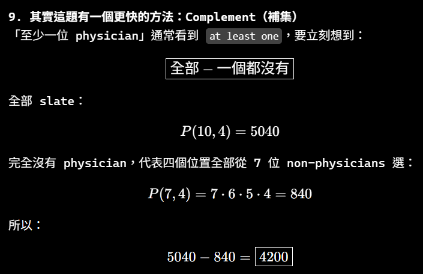

///


### 9

/// danger

題目的 tea 部分是：

> **tea (plain, with cream, with sugar, with cream and sugar, with lemon, or with lemon and sugar)**

中文就是：

> **茶有以下六種選擇：**
> 
> 1. `plain`：原味茶／什麼都不加
>     
> 2. `with cream`：加 cream
>     
> 3. `with sugar`：加糖
>     
> 4. `with cream and sugar`：加 cream 和糖
>     
> 5. `with lemon`：加檸檬
>     
> 6. `with lemon and sugar`：加檸檬和糖
>

///

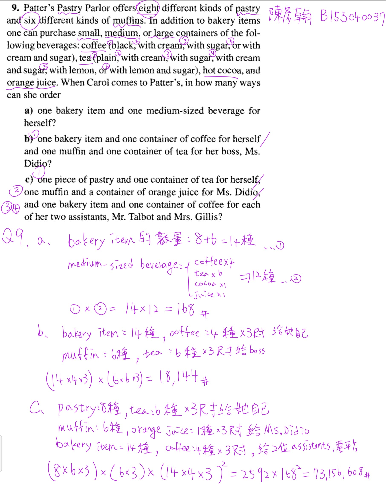

第 1 次對話

```text
Phase A — Internal Control Surface（控制面輸出） | TURN=1 | PROMPT=1.16.0 | REFRESH=YES | STATE={MainlineMode=Transcript; MainlineSource=逐字稿_02_0918.txt; Locator=Session=02/L5–L47; KP=Binomial Theorem→Multinomial Theorem 的係數觀點; Boundary=已核對，L49 起切換 Combinations with Repetition; Transcript={File=逐字稿_02_0918.txt; Session=02; SessionSource=FilenamePrefix; WithinSessionOrder=NA; Span=L5–L47; Coverage=FULL; TeachingState=TAUGHT_CORE; Signals=Explanation+ExamSignal(L23)+HomeworkSignal(L47); Scope=Chapter 1 §1.3; Correction=L13–L15 末句「排列」與同段前文及課本公式衝突，依 Precision Authority 應為組合; ASR=minor/local; Residual=PASS_to_L49}; Reference={Aligned=課本 §1.3/PDF viewer p42–44; PrecisionStatus=已核對}; Practice={LearningObjective=能以「從各因子挑位置」理解並計算二項式/多項式係數，並使用 Binomial Theorem 完成證明; Modality=Calculation+Proof; ExpectedArtifact=完整列式與理由; AcceptedSubmission=文字/LaTeX/清楚手寫圖片; RequiredModality=YES(for proof process); TaskOrigin=Generated; SourceReopened=NA; SourceIdentity=NA; ContentFidelity=GENERATED; SourceMatch=NA; AssessmentFidelity=Exam; SubmissionStatus=NOT_SUBMITTED}; AdjQueue=L49+ Combinations with Repetition; ExerciseDebt=YES; TeachingMainlineDebt=NO_CURRENT_KP_GAP; AssessmentRequirementDebt=YES(proof/exam calibration pending); ReferenceResolutionDebt=RESOLVED(local oral slip); PastExamDebt=QuickCheck:no direct same-scope item confirmed; Weakness=UNKNOWN; Coverage=Session02 start indexed; Completion=NOT_COMPLETE; Evidence=Transcript L5–L47 + Textbook §1.3 p42–44; Blockers=None; NextLegal=teach current KP then practice} | PLAN={ThisResponse=完整教 Binomial/Multinomial coefficient 主線並安排3個Generated tasks; ExpectedDebtChange=Exercise tasks output; ExpectedNext=批改後進入 L49 Combinations with Repetition}
```

---

## ⭐1. 二項式定理與多項式定理 — 為什麼展開式的係數會是「組合數」？

主線位置：Teacher Transcript／`逐字稿_02_0918.txt`／Session=02／L5–L47
對齊參考：Textbook §1.3 `Combinations: The Binomial Theorem`／PDF viewer page 42–44 

第二堂一開始不是直接進新章節，而是把上週的 `Binomial Theorem（二項式定理）`重新拆開來講，之後再推廣到 `Multinomial Theorem（多項式定理）`。老師真正想讓你理解的不是死背公式，而是：

> **一個項的係數，就是「有多少種方式可以從各個因子中挑出指定的變數」。**

老師從 \((x+y)^4\) 展開、\(x^2y^2\) 的形成方式一路建立這個觀念。

### 1.1 先從 \((x+y)^4\) 看本質

把

$$
(x+y)^4
$$

真的想成

$$
(x+y)(x+y)(x+y)(x+y).
$$

每一個括號都必須選一次：

* 選 \(x\)，或
* 選 \(y\)。

假設我們想製造出

$$
x^2y^2.
$$

意思就是：

* 四個括號裡，有 **2 個括號選 \(x\)**
* 另外 **2 個自然選 \(y\)**。

所以問題變成：

> 從 4 個位置裡，挑哪 2 個位置要選 \(x\)？

答案就是

$$
\binom42=6.
$$

因此

$$
[x^2y^2](x+y)^4=6.
$$

這裡的 \([x^2y^2]\) 可以讀成「\(x^2y^2\) 的 coefficient（係數）」。

---

### 1.2 為什麼是 Combination（組合），不是 Permutation（排列）？

這點老師特別花時間說。

如果挑第 1、3 個括號取 \(x\)，那就是集合

$$
\{1,3\}.
$$

你先說「1 再 3」，還是「3 再 1」，最後都是**同一批位置**。

所以順序不重要：

$$
\boxed{\text{Combination}}
$$

而不是

$$
P(4,2)=4\cdot3=12.
$$

逐字稿這一段前面明確說「它是一種組合，不是排列」，但後面一句又出現「很顯然那是排列的問題」，前後彼此矛盾；配合老師算出的 6，以及課本的 Binomial Theorem，這一句應視為口語／轉錄上的局部誤說，正確概念是 **Combination（組合）**。

這是你之後很重要的判斷：

$$
\boxed{\text{係數問題} \rightarrow \text{挑哪些 factor 提供某變數}}
$$

不是去排列那些被挑的位置。

---

### 1.3 一般化：Binomial Theorem（二項式定理）

現在考慮

$$
(x+y)^n.
$$

要產生

$$
x^k y^{n-k},
$$

就必須從 \(n\) 個括號裡挑 \(k\) 個提供 \(x\)。

所以有

$$
\binom nk
$$

種。

因此

/// danger|Binomial Theorem（二項式定理)

$$
\boxed{
(x+y)^n
=
\sum_{k=0}^{n}
\binom nk x^k y^{n-k}
}
$$

///

這就是 `Binomial Theorem（二項式定理)`。

也可以反過來寫成

$$
(x+y)^n
=
\sum_{k=0}^{n}
\binom nk x^{n-k}y^k.
$$

只是你選擇「數 \(x\)」還是「數 \(y\)」不同。

老師接著指出：

$$
\boxed{\binom nk=\binom n{n-k}}
$$

原因其實非常直覺：

「選 \(k\) 個位置給 \(x\)」與「選剩下的 \(n-k\) 個位置給 \(y\)」描述的是同一件事。

---

### 1.4 題目有常數係數時，不能只算 \(\binom nk\)

這是第二堂開始真正容易錯的地方。

假設要找

$$
(2a-3b)^7
$$

中

$$
a^5b^2
$$

的係數。

第一層：選位置。

要有 \(a^5b^2\)，代表 7 個因子裡：

* 5 個選 \(2a\)
* 2 個選 \(-3b\)

所以位置有

$$
\binom75.
$$

但這還沒結束。

因為每個被選的 \(a\) 其實是 \(2a\)，因此還有

$$
2^5.
$$

每個 \(b\) 是 \(-3b\)，所以還有

$$
(-3)^2.
$$

完整係數才是

$$
\boxed{
\binom75 2^5(-3)^2
}
$$

老師在逐字稿中的例子正是用這個觀念，並特別提醒負號不能丟掉。

所以看到

$$
(\alpha x+\beta y)^n
$$

時，\(x^k y^{n-k}\) 的係數不是只有 \(\binom nk\)，而是

$$
\boxed{
\binom nk\alpha^k\beta^{\,n-k}
}
$$

---

/// danger| 考試會考

### 1.5 一個老師明確打了 Exam Signal（考試訊號）的結果

老師在這裡特別講：

$$
\boxed{
\binom n0+\binom n1+\cdots+\binom nn=2^n
}
$$

而且明確提到這類證明可能會出現在考試。

這個公式不要硬背，它來自：

$$
(x+y)^n
=
\sum_{k=0}^n\binom nkx^ky^{n-k}.
$$

令

$$
x=1,\qquad y=1,
$$

左邊：

$$
(1+1)^n=2^n.
$$

右邊：

$$
\sum_{k=0}^n\binom nk.
$$

所以

$$
\boxed{
\sum_{k=0}^n\binom nk=2^n
}
$$

這種解法的核心是：

> **看到一串 Binomial Coefficients（二項式係數）的總和，想辦法把它認成某個 \((x+y)^n\) 的特殊代值。**

這比逐項算組合數有效得多。

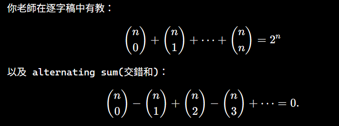

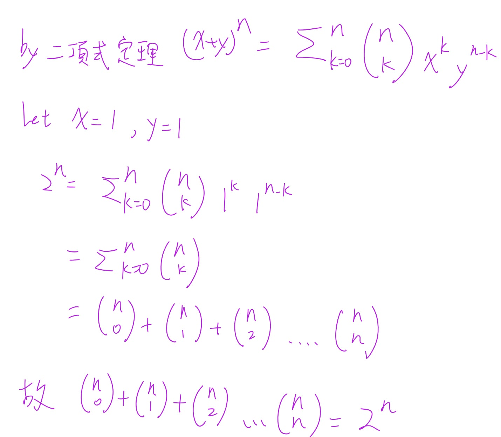

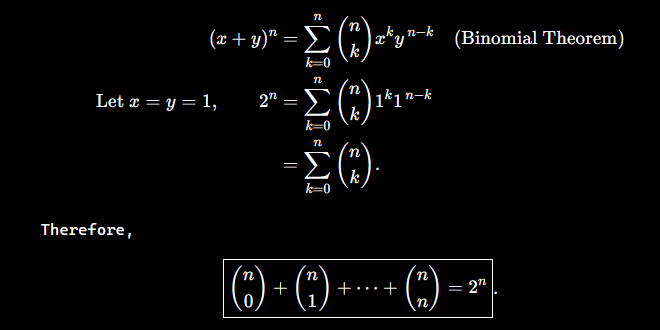

///

---

### 1.6 Multinomial Theorem（多項式定理）

老師接著把二項式推廣成

$$
(x_1+x_2+\cdots+x_t)^n.
$$

假設我們要找

$$
x_1^{n_1}x_2^{n_2}\cdots x_t^{n_t}
$$

的係數，而且

$$
n_1+n_2+\cdots+n_t=n.
$$

思考方式完全沒有變：

1. \(n\) 個位置先挑 \(n_1\) 個給 \(x_1\)；
2. 剩下位置挑 \(n_2\) 個給 \(x_2\)；
3. 繼續下去。


/// danger|Multinomial Theorem（多項式定理）

所以係數可以寫成

$$
\binom n{n_1}
\binom{n-n_1}{n_2}
\binom{n-n_1-n_2}{n_3}
\cdots
$$

化簡後得到

$$
\boxed{
\frac{n!}{n_1!n_2!\cdots n_t!}
}
$$

也就是 `Multinomial Coefficient（多項式係數）`

$$
\boxed{
\binom{n}{n_1,n_2,\ldots,n_t}
}
$$

老師也特別說，先挑 \(x_1\)、\(x_2\) 或 \(x_3\) 並不重要，因為最後化簡都是同一個對稱形式。


#### 1.6.1 大括號下面的逗號是啥？


/// details|大括號下面的逗號是啥
第 3 次對話

```text
Phase A — Internal Control Surface（控制面輸出） | TURN=3 | PROMPT=1.16.0 | REFRESH=NO | STATE={MainlineMode=Transcript; MainlineSource=逐字稿_02_0918.txt; Locator=Session=02/L29–L41; KP=Multinomial Coefficient notation clarification; Boundary=沿用已核對; Transcript={File=逐字稿_02_0918.txt; Session=02; SessionSource=FilenamePrefix; WithinSessionOrder=NA; Span=L29–L41; Coverage=FULL; TeachingState=TAUGHT_CORE; Signals=Explanation; Scope=Chapter 1 §1.3; Correction=NA; ASR=resolved; Residual=PASS}; Reference={Aligned=Textbook §1.3; PrecisionStatus=已核對}; Practice={LearningObjective=理解 multinomial coefficient 記號; Modality=Explanation; ExpectedArtifact=NA; AcceptedSubmission=NA; RequiredModality=NO; TaskOrigin=NA; SourceReopened=NA; SourceIdentity=NA; ContentFidelity=NA; SourceMatch=NA; AssessmentFidelity=Learning; SubmissionStatus=NA}; AdjQueue=Combinations with Repetition; ExerciseDebt=既有練習尚未全數作答; TeachingMainlineDebt=NO_CURRENT_KP_GAP; AssessmentRequirementDebt=PARTIAL; ReferenceResolutionDebt=NO; PastExamDebt=UNKNOWN; Weakness=notation clarification; Coverage=Multinomial notation introduced; Completion=IN_PROGRESS; Evidence=Transcript L29–L41; Blockers=None; NextLegal=clarify notation then continue current learning} | PLAN={ThisResponse=解釋 multinomial coefficient 下排逗號的意義; ExpectedDebtChange=None; ExpectedNext=回到既有練習或繼續主線}
```

#### 1.1 那個逗號只是「分隔不同種類的數量」

你看到的是 `Multinomial Coefficient（多項式係數）`：

$$
\boxed{\binom{n}{n_1,n_2,\ldots,n_t}}
$$

下面的逗號 **沒有運算功能**，只是把

$$
n_1,\ n_2,\ \ldots,\ n_t
$$

這幾個數分開。

它的意思是：

> 把總共 \(n\) 個位置，分成 \(t\) 組，第 1 組有 \(n_1\) 個、第 2 組有 \(n_2\) 個、……、第 \(t\) 組有 \(n_t\) 個。

而且一定要滿足

$$
\boxed{n_1+n_2+\cdots+n_t=n}.
$$

它定義成

$$
\boxed{
\binom{n}{n_1,n_2,\ldots,n_t}
=
\frac{n!}{n_1!n_2!\cdots n_t!}
}
$$

這也是標準的 `multinomial coefficient` 記號。([數學百科全書][1]) 老師第二堂課也是在推到這個式子後，說明不同變數各自取幾次，最後就寫成這種記號。

---

#### 1.2 跟普通 Combination（組合）比較就很好懂

普通二項式只有兩類：

$$
\binom{n}{k}
=
\frac{n!}{k!(n-k)!}.
$$

其實也可以把它想成

$$
\boxed{\binom{n}{k,n-k}}.
$$

因為總共 \(n\) 個位置：

* \(k\) 個給 \(x\)
* \(n-k\) 個給 \(y\)

所以

$$
\binom{n}{k,n-k}
=
\frac{n!}{k!(n-k)!}
=
\binom nk.
$$

也就是說：

$$
\boxed{\text{Binomial coefficient 是 Multinomial coefficient 的特殊情況}}
$$

---

#### 1.3 一個具體例子

例如

$$
\binom{7}{2,3,2}.
$$

下面的

$$
2,3,2
$$

意思是把 **7 個位置分成三組**：

$$
2+3+2=7.
$$

因此

$$
\binom{7}{2,3,2}
=
\frac{7!}{2!3!2!}.
$$

例如在

$$
(x+y+z)^7
$$

中找

$$
x^2y^3z^2
$$

的係數，就是

$$
\boxed{\binom{7}{2,3,2}}.
$$

所以你看到逗號時，可以直接在腦中翻成：

> 「總共 \(n\) 個，要分給第一種 \(n_1\) 個、第二種 \(n_2\) 個、第三種 \(n_3\) 個……」

這樣就不需要死背那個記號。

[1]: https://encyclopediaofmath.org/wiki/Multinomial_coefficient?utm_source=chatgpt.com "Multinomial coefficient - Encyclopedia of Mathematics"

///


///

---

### 1.7 常數項也要占一個「位置種類」

這是 Example 1.27 的關鍵，也是很容易漏的地方。

例如

$$
(a+2b-3c+2d+5)^{16}
$$

要求

$$
a^2b^3c^2d^5.
$$

先加指數：

$$
2+3+2+5=12.
$$

但整體是 16 次方。

還差

$$
16-12=4.
$$

這 4 次從哪來？

來自常數 \(5\)。

所以真正的選擇數是

$$
\binom{16}{2,3,2,5,4}.
$$

而常數係數還要一起乘：

$$
1^2\cdot 2^3\cdot(-3)^2\cdot2^5\cdot5^4.
$$

完整結構為

$$
\boxed{
\binom{16}{2,3,2,5,4}
2^3(-3)^22^55^4
}
$$

老師就是利用這個例子把 `Binomial Theorem` 推廣到 `Multinomial Theorem`。

---

### 1.8 你現在最需要建立的判題流程

遇到「求展開後某一項的係數」，先不要急著代公式：

$$
\boxed{
\text{目標項}
\rightarrow
\text{每種東西要選幾次}
\rightarrow
\text{總次數是否等於 }n
\rightarrow
\text{算位置的組合數}
\rightarrow
\text{乘回各項本身的常數}
}
$$

最常見的三個失分點是：

1. 把 Combination 寫成 Permutation。
2. 忘記像 \(2a,-3b\) 前面的 \(2,-3\) 也要乘。
3. 目標變數次方總和小於 \(n\) 時，忘記剩餘次數可能來自常數項。

老師在 L47 也明確說 §1.3 會出作業，因此這段不只是背景複習，而是正式需要會算的內容。

### 1.9 Practice Tasks(練習任務)

#### 1.9.1 Task 1

**Find the coefficient of \(a^4b^3\) in**

$$
(3a-2b)^7.
$$

Show the binomial coefficient you use and all scalar factors.

Expected Artifact：完整列式＋最終係數。

#### 1.9.2 Task 2

**Using the Binomial Theorem, prove that for every positive integer \(n\),**

$$
\sum_{k=0}^{n}\binom nk 3^k=4^n.
$$

Do not verify the identity by expanding individual binomial coefficients.

Expected Artifact：至少寫出你從哪一個 binomial expansion 開始、代入什麼值、如何得到結論。
Required Modality：Proof（證明過程必須實際寫出）。

#### 1.9.3 Task 3

**Find the coefficient of \(x^2y^3z\) in**

$$
(2x-y+3z+4)^7.
$$

Show how many selections must come from the constant term \(4\).

Expected Artifact：Multinomial coefficient＋各常數因子＋最終答案。

作答可直接打字列式，或上傳清楚的手寫照片；三題請保留主要計算過程。


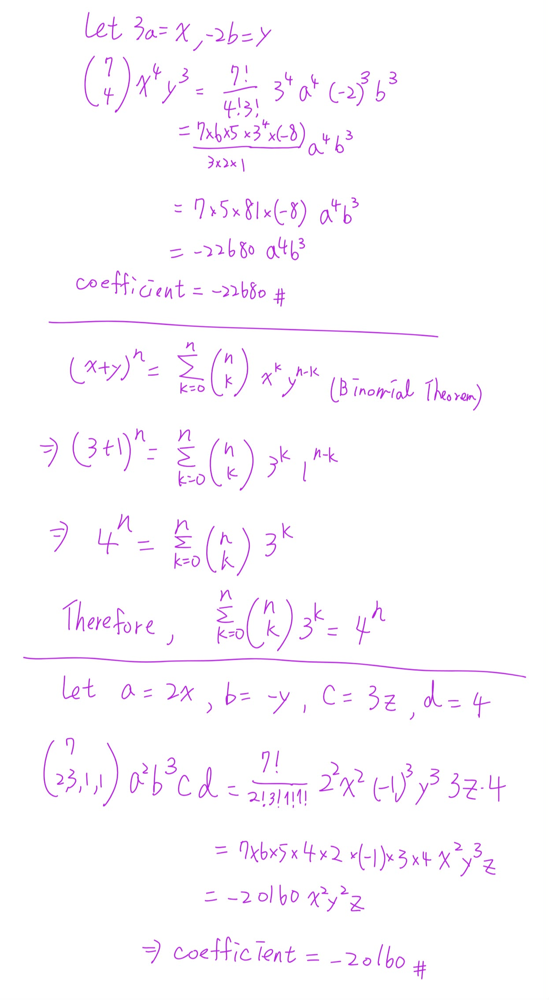


```text
Phase A — Internal Control Surface（控制面輸出） | TURN=第 7 次對話 | PROMPT=1.16.1 | REFRESH=NO | REFRESH_REMINDER=NONE | STATE={MainlineMode=Transcript; MainlineSource=逐字稿_02_0918.txt; Locator=Session=02/L49–L179; KP=Combinations with Repetition（可重複組合）與 Stars and Bars（隔板法）; Boundary=已核對，核心 span=L49–L101+L173–L179，L103–L171 為離題補充，L181 起切換至 nonnegative integer solutions; Transcript={File=逐字稿_02_0918.txt; Session=02; SessionSource=FilenamePrefix; WithinSessionOrder=NA; Span=L49–L179; Coverage=FULL; TeachingState=TAUGHT_CORE; Signals=Explanation; Scope=§1.4 Combinations with Repetition; Correction=NA; ASR=公式已由課本§1.4/PDF viewer p47–48核對; Residual=PASS}; Reference={Aligned=Textbook §1.4/PDF viewer p47–48; PrecisionStatus=HIGH}; Practice={LearningObjective=能判斷何時使用可重複組合並由stars-and-bars推導C(n+r-1,r); Modality=Classification+Calculation+Explanation; ExpectedArtifact=模型判斷與完整列式; AcceptedSubmission=文字/LaTeX/清楚手寫圖片; RequiredModality=NO; TaskOrigin=Generated; SourceReopened=NA; SourceIdentity=NA; ContentFidelity=GENERATED; SourceMatch=NA; AssessmentFidelity=Learning; SubmissionStatus=NOT_SUBMITTED}; AdjQueue=L181 nonnegative integer solutions equivalence; ExerciseDebt=YES; TeachingMainlineDebt=NO_CURRENT_KP_GAP; AssessmentRequirementDebt=NONE_CONFIRMED_CURRENT_SPAN; ReferenceResolutionDebt=NO; PastExamDebt=P0 identified(民國99 Q1 integer-solutions/stars-and-bars), deferred until corresponding mainline taught and source reopened; Weakness=需持續檢查模型判斷與正負/算術; Coverage=前一KP Binomial/Multinomial learning pass，進入§1.4; Completion=NEW_KP_IN_PROGRESS; Evidence=Transcript L49–L179+Textbook §1.4 p47–48; Blockers=None; NextLegal=teach Stars and Bars then practice} | PLAN={ThisResponse=教清楚可重複組合的觀點、隔板法與公式，並安排3題Generated practice; ExpectedDebtChange=Exercise tasks output; ExpectedNext=批改後進入L181非負整數解等價}
```

---

## ⭐1. Combinations with Repetition（可重複組合）— 同一種類可以一直選，要怎麼數？

主線位置：Teacher Transcript／`逐字稿_02_0918.txt`／Session=02／L49–L179
對齊參考：Textbook §1.4 `Combinations with Repetition`／PDF viewer page 47–48

### 1.1 先抓住老師最重要的問題：到底「誰的觀點」？

老師一開始不是直接丟公式，而是拿「7 個學生去餐廳、4 種餐點」來說明。

關鍵在：

> 我們是在乎「每一種餐點總共買幾個」，還是在乎「哪一個學生買哪一個」？

老師明確說，**餐廳觀點只在乎每一種餐點的數量，不在乎購買順序**，所以才是 `Combination with Repetition（可重複組合）`。

例如有：

* Cheeseburger
* Hot dog
* Taco
* Fish sandwich

7 個人各買一份。

假設最後餐廳收到：

$$
(2,2,2,1)
$$

代表：

* 漢堡 2 個
* 熱狗 2 個
* Taco 2 個
* Fish sandwich 1 個

餐廳根本不在乎是哪兩個學生買漢堡。

所以：

$$
\boxed{\text{只看各種類的數量}}
$$

而且同一種類可以重複：

$$
\boxed{\text{Combination with Repetition}}
$$

---

### 1.2 為什麼不是 \(n^r\)？

這是很重要的區分。

假設：

* 有 \(n\) 種餐點
* 有 \(r\) 個「有身分的人」各自選一種

如果在乎：

> 第 1 個人選什麼、第 2 個人選什麼、……

那每人都有 \(n\) 種選擇，所以：

$$
\boxed{n^r}
$$

例如 7 個**不同學生**各自從 4 種餐點中選：

$$
4^7.
$$

但是如果只問餐廳最後收到多少個各類餐點，像：

$$
(2,2,2,1)
$$

就不是 \(4^7\)。

所以考試看到題目，先問自己：

$$
\boxed{\text{個體身分／順序重要嗎？}}
$$

* 重要 → 很可能是 \(n^r\)
* 不重要，只在乎每種類幾個 → `Combination with Repetition`

---

### 1.3 Stars and Bars（星星與隔板／隔板法）

現在才進入真正的技巧。

老師把 7 個餐點想成 7 個一模一樣的 \(x\)：

$$
xxxxxxx
$$

有 4 種餐點。

如果要把這 7 個 \(x\) 分成 **4 組**，需要幾個隔板？

答案是：

$$
\boxed{4-1=3}
$$

個隔板。

例如：

$$
xx\mid xx\mid xx\mid x
$$

就代表：

$$
(2,2,2,1).
$$

也就是：

| 區域    | 數量 |
| ----- | -: |
| 第一種餐點 |  2 |
| 第二種餐點 |  2 |
| 第三種餐點 |  2 |
| 第四種餐點 |  1 |

老師就是利用「餐點＋厚紙板」建立這個模型。

---

### 1.4 為什麼可以出現「某種完全沒選」？

例如：

$$
xxx\mid\mid xx\mid xx
$$

注意中間有：

$$
\mid\mid
$$

兩個隔板連在一起。

這代表兩個隔板中間有 **0 個 \(x\)**。

所以對應：

$$
(3,0,2,2).
$$

這正是 `with repetition` 題目非常重要的特徵：

$$
\boxed{\text{每一種類可以選 }0\text{ 個、1 個、2 個、……}}
$$

沒有規定每種類至少要選一個。

而且隔板也可以出現在最前面，例如：

$$
\mid xxx\mid xx\mid xx
$$

代表：

$$
(0,3,2,2).
$$

所以這套模型自然允許 0。

---

/// danger|Combinations with Repetition（可重複組合）

### 1.5 一般公式怎麼推？

現在一般化。

有：

* \(n\) 種不同種類
* 總共要選 \(r\) 個
* 每種類可以重複選
* 只在乎每種類選多少，不在乎順序

我們需要：

$$
r
$$

個星星 \(x\)，以及

$$
n-1
$$

個隔板。

總符號數：

$$
r+(n-1)=n+r-1.
$$

問題就變成：

> 在 \(n+r-1\) 個位置中，選哪 \(r\) 個位置放星星？

因此：

$$
\boxed{
\binom{n+r-1}{r}
}
$$

也可以選隔板的位置：

$$
\boxed{
\binom{n+r-1}{n-1}
}
$$

兩個當然相同：

$$
\binom{n+r-1}{r}
=
\binom{n+r-1}{n-1}.
$$

老師正式推導也是把 \(r\) 個相同物品與 \(n-1\) 個相同隔板排列，得到

$$
\frac{(n+r-1)!}{r!(n-1)!}
=
\binom{n+r-1}{r}.
$$


所以這個公式你不要只背成：

$$
\binom{n+r-1}{r}.
$$

最好背它背後的結構：

$$
\boxed{
r\text{ 個物品}
+
(n-1)\text{ 個隔板}
}
$$

///

---

### 1.6 回到老師的 7 人、4 種餐點

這裡：

$$
n=4,\qquad r=7.
$$

所以：

* 星星：7 個
* 隔板：\(4-1=3\) 個
* 總位置：10 個

因此：

$$
\binom{10}{7}
=
\binom{10}{3}.
$$

算出：

$$
\boxed{120}.
$$

所以餐廳觀點共有：

$$
\boxed{120}
$$

種不同訂單組合。

---

### 1.7 怎麼辨認題目能不能用這個公式？

你可以用四個條件檢查：

1. 有 \(n\) 個**種類**
2. 總共選 \(r\) 個
3. 同一種類**可以重複**
4. **不在乎選的順序／個體身分，只在乎各種類最後有幾個**

四個都成立：

$$
\boxed{
\binom{n+r-1}{r}
}
$$

---

### 1.8 一個很容易忽略的條件：庫存必須夠

老師接著用 Example 1.29 的甜甜圈題特別提醒：

20 種甜甜圈，要買 12 個。

如果每一種甜甜圈至少都有 12 個，代表任何一種口味你想買 0～12 個都做得到，因此可以直接使用可重複組合。

老師特別解釋，如果沒有「每一種庫存至少足夠」這個條件，單純套 stars-and-bars 可能把實際上做不到的選擇也算進去。

所以：

$$
n=20,\qquad r=12
$$

得到

$$
\binom{20+12-1}{12}
=
\boxed{\binom{31}{12}}.
$$

這個例子真正要教你的不只是代公式，而是：

$$
\boxed{\text{先檢查 repetition 是否真的無限制}}
$$

---

### 1.9 最容易混淆的三種題型

| 情境                   | 模型                |
| -------------------- | ----------------- |
| 7 個不同學生，各自從 4 種餐點選一種 | \(4^7\)           |
| 餐廳只看 7 份餐點中各種類有幾份    | \(\binom{10}{7}\) |
| 7 個不同物品中選 4 個，而且不能重複 | \(\binom74\)      |

最重要的不是看到「選」就套 \(C\)。

你要先問：

$$
\boxed{\text{東西能不能重複？順序／身分算不算不同？}}
$$

下一個老師緊接著教的知識點，就是把這件事翻譯成

$$
x_1+x_2+\cdots+x_n=r,\qquad x_i\ge0
$$

的 `nonnegative integer solutions（非負整數解）`。老師明確說這與可重複選擇、相同物品分配到不同容器其實是同一個問題。

但我們先確認你真的會現在這層，再進去。

### 1.10 Practice Tasks(練習任務)

#### 1.10.1 Task 1 — Classification

**For each situation, decide whether the correct model is \(n^r\), \(\binom nr\), or \(\binom{n+r-1}{r}\). Briefly explain why.**

a. Eight distinct students each choose one of five drinks.
b. A restaurant receives an order for eight drinks chosen from five drink types; only the number of drinks of each type matters.
c. Select eight different books from a shelf containing twenty different books.

Expected Artifact：三個模型＋每題一句理由。

#### 1.10.2 Task 2 — Stars and Bars

**A bakery sells 6 kinds of cookies, with an unlimited supply of each kind. In how many ways can a customer buy exactly 10 cookies?**

請先寫：

$$
n=\ ?
\qquad
r=\ ?
\qquad
\text{number of bars}=\ ?
$$

再寫完整計算式。

#### 1.10.3 Task 3 — Explain the Representation

**Suppose**

$$
xxx\mid\mid xx\mid x
$$

**represents a selection with repetition.**

1. How many types are there?
2. How many total objects are selected?
3. Write the number selected from each type as an ordered tuple.
4. Explain what the two consecutive bars mean.

可以直接打字回答，也可以像前面一樣手寫後傳圖片。


```text
Phase A — Internal Control Surface（控制面輸出） | TURN=第 9 次對話 | PROMPT=1.16.1 | REFRESH=NO | REFRESH_REMINDER=NONE | STATE={MainlineMode=Transcript; MainlineSource=逐字稿_02_0918.txt; Locator=Session=02/L181–L208; KP=Nonnegative Integer Solutions 與 Combinations with Repetition 的等價; Boundary=已核對，L181–L208 完成等價與10顆彈珠/6容器例子，後續轉入 inequality; Transcript={File=逐字稿_02_0918.txt; Session=02; SessionSource=FilenamePrefix; WithinSessionOrder=NA; Span=L181–L208; Coverage=FULL; TeachingState=TAUGHT_CORE; Signals=Explanation; Scope=§1.4 Combinations with Repetition applications; Correction=NA; ASR=公式由課本與標準stars-and-bars結果核對; Residual=PASS}; Reference={Aligned=Textbook §1.4/PDF viewer p48–50; PrecisionStatus=HIGH}; Practice={LearningObjective=能把非負整數解、可重複組合、相同物品分配至不同容器三種描述互相轉換; Modality=Model Translation+Calculation; ExpectedArtifact=方程式建模與完整組合數列式; AcceptedSubmission=文字/LaTeX/清楚手寫圖片; RequiredModality=NO; TaskOrigin=Generated; SourceReopened=NA; SourceIdentity=NA; ContentFidelity=GENERATED; SourceMatch=NA; AssessmentFidelity=Learning; SubmissionStatus=NOT_SUBMITTED}; AdjQueue=inequality→extra positive variable transformation; ExerciseDebt=YES; TeachingMainlineDebt=NO_CURRENT_KP_GAP; AssessmentRequirementDebt=NONE_CONFIRMED_CURRENT_SPAN; ReferenceResolutionDebt=NO; PastExamDebt=P0_DEFERRED_UNTIL_SOURCE_REOPENED; Weakness=先前stars-and-bars題依使用者要求算對，不列錯題；notation可持續補強; Coverage=Combinations with Repetition 前一知識點依使用者要求通過，已合法推進; Completion=NEW_KP_IN_PROGRESS; Evidence=Transcript L181–L208; Blockers=None; NextLegal=teach equivalence then practice} | PLAN={ThisResponse=教非負整數解與stars-and-bars的三種等價描述並安排3題Generated practice; ExpectedDebtChange=Exercise tasks output; ExpectedNext=批改後進入 inequality/slack-variable 技巧}
```

## ⭐1. Nonnegative Integer Solutions（非負整數解）— 為什麼其實就是 Stars and Bars？

主線位置：Teacher Transcript／`逐字稿_02_0918.txt`／Session=02／L181–L208
對齊參考：Textbook §1.4／PDF viewer page 48–50

你前面那組我依你的要求**算對、不列錯題**，所以直接往老師下一個主線走。

老師接著要你看出一個很重要的 equivalence（等價）：

$$
\boxed{
x_1+x_2+\cdots+x_n=r,\qquad x_i\ge0
}
$$

其實就是你剛剛學的 `Stars and Bars（隔板法）`。老師明確把「非負整數解」、「從 \(n\) 種東西可重複選 \(r\) 個」以及「將 \(r\) 個相同物品放進 \(n\) 個不同容器」視為同一個 counting problem（計數問題）。

### 1.1 先看老師的例子

考慮：

$$
x_1+x_2+x_3+x_4=7,
$$

而且

$$
x_i\ge0.
$$

一組 solution（解）可能是：

$$
(x_1,x_2,x_3,x_4)=(3,3,0,1).
$$

因為：

$$
3+3+0+1=7.
$$

另一組：

$$
(1,0,3,3)
$$

也是解。

而且這兩組**不同**。

為什麼？

因為 \(x_1,x_2,x_3,x_4\) 是不同 variable（變數），各自有自己的身分。

所以：

$$
(3,3,0,1)\neq(1,0,3,3).
$$

老師特別強調：即使使用相同的數字 \(3,3,0,1\)，只要分配給不同變數，就算不同解。

---

### 1.2 把方程式翻譯成 Stars and Bars

例如：

$$
x_1+x_2+x_3+x_4=7.
$$

把 7 看成 7 個 identical objects（相同物品）：

$$
*******
$$

四個 variable 就像四個不同容器。

要切成 4 區，需要：

$$
4-1=3
$$

個 bars。

例如：

$$
***|***||*
$$

代表：

$$
\boxed{(3,3,0,1)}.
$$

因為：

* 第 1 區：3 顆 → \(x_1=3\)
* 第 2 區：3 顆 → \(x_2=3\)
* 第 3 區：0 顆 → \(x_3=0\)
* 第 4 區：1 顆 → \(x_4=1\)

所以：

$$
***|***||*
\quad\Longleftrightarrow\quad
(3,3,0,1).
$$

這也順便解釋為什麼 \(x_i\) 可以等於 0：兩根 bars 可以相鄰。

---

### 1.3 因此公式直接出來

一般來說：

$$
x_1+x_2+\cdots+x_n=r,
\qquad
x_i\ge0.
$$

需要：

* \(r\) 個 stars
* \(n-1\) 個 bars

所以總共：

$$
r+n-1
$$

個位置。

選 \(n-1\) 個位置放 bars：

$$
\boxed{
\binom{r+n-1}{n-1}
}
$$

或者選 \(r\) 個位置放 stars：

$$
\boxed{
\binom{r+n-1}{r}
}.
$$

兩者相等：

$$
\boxed{
\binom{r+n-1}{n-1}
=
\binom{r+n-1}{r}
}.
$$

這也是標準 `Stars and Bars` 對非負整數解的結果。([Mathematics LibreTexts][1])

---

### 1.4 老師希望你建立的「三種說法其實同一題」

這裡很重要，考試可能換包裝。

以下三題其實是一模一樣的：

///danger|Danger | Combinations with Repetition（可重複組合）

**版本 A：方程式**

$$
x_1+x_2+\cdots+x_n=r,\qquad x_i\ge0.
$$

**版本 B：可重複選擇**

> From \(n\) types, select \(r\) objects with repetition allowed.

**版本 C：分配問題**

> Distribute \(r\) identical objects among \(n\) distinct containers.

///

三個答案都是：

$$
\boxed{
\binom{n+r-1}{r}
}.
$$

老師就是明確要求你 recognize the equivalence（辨認這三者等價）。

最重要的 mapping（對應）：

| 數學符號        | 分配問題            |
| ----------- | --------------- |
| \(r\)       | 相同物品總數          |
| \(n\)       | 不同容器數／種類數       |
| \(x_i\)     | 第 \(i\) 個容器收到幾個 |
| \(x_i\ge0\) | 某容器可以什麼都沒有      |

---

### 1.5 老師的 10 顆彈珠例子

老師接著問：

> 將 10 顆 identical marbles（相同彈珠）分配到 6 個 distinct containers（不同容器），有幾種方法？

設：

$$
x_i=\text{第 }i\text{ 個容器的彈珠數}.
$$

那就是：

$$
x_1+x_2+x_3+x_4+x_5+x_6=10,
$$

其中

$$
x_i\ge0.
$$

所以：

$$
n=6,\qquad r=10.
$$

答案：

$$
\binom{10+6-1}{10}
=
\binom{15}{10}
=
\binom{15}{5}.
$$

因此：

$$
\boxed{3003}.
$$

這正好也跟你上一輪 cookies 那題算出的 \(3003\) 一樣。

不是巧合。

因為它們本質上根本是同一個數學模型：

$$
\boxed{\text{10 個 identical objects 分到 6 種／6 個 distinct boxes}}
$$

---

### 1.6 最重要的判斷：Identical Objects + Distinct Containers

這裡很容易和其他排列組合搞混。

如果題目說：

> 10 **identical** marbles into 6 **distinct** boxes

就是：

$$
\boxed{\binom{15}{5}}.
$$

但如果 10 顆彈珠都是 distinct（不同的），每一顆自己可以選 6 個箱子之一，那就變：

$$
\boxed{6^{10}}.
$$

所以考試看到 distribute（分配）時不要直接套公式，要先問：

$$
\boxed{\text{objects 相同嗎？containers 不同嗎？}}
$$

目前老師這段的設定是：

$$
\boxed{\text{identical objects + distinct containers}}
$$

才等價於非負整數解。

---

### 1.7 考試看到方程式時的固定流程

例如：

$$
x_1+x_2+x_3+x_4+x_5=12,
\qquad x_i\ge0.
$$

⭐ 第一步：數 variable 數量。

$$
n=5
$$

⭐ 第二步：右邊總和。

$$
r=12
$$

⭐ 第三步：

$$
\binom{n+r-1}{r}.
$$

所以：

$$
\boxed{
\binom{5+12-1}{12}
=
\binom{16}{12}
=
\binom{16}{4}
}.
$$

你可以直接記：

$$
\boxed{
x_1+\cdots+x_n=r,\ x_i\ge0
\Rightarrow
\binom{r+n-1}{n-1}
}
$$

但理解上還是要記得：

$$
\boxed{\text{\(r\) 個 stars + \(n-1\) 個 bars}}
$$

下一個老師正式教的變化，就是把

$$
x_1+\cdots+x_6<10
$$

這種 `inequality（不等式）` 想辦法轉成等式；那裡會多加一個 variable，技巧會再進一步。

### 1.8 Practice Tasks(練習任務)

#### 1.8.1 Task 1

**How many nonnegative integer solutions are there to**

$$
x_1+x_2+x_3+x_4=9?
$$

請寫出：

$$
n=?,\qquad r=?
$$

再寫完整 combination 式。

#### 1.8.2 Task 2

**In how many ways can 12 identical balls be distributed among 5 distinct boxes?**

先把它轉寫成：

$$
x_1+x_2+\cdots+x_5=?
$$

再使用 Stars and Bars。

#### 1.8.3 Task 3

Consider the solution

$$
(x_1,x_2,x_3,x_4)=(2,0,4,1)
$$

to

$$
x_1+x_2+x_3+x_4=7.
$$

**Write the corresponding stars-and-bars representation, and explain why**

$$
(2,0,4,1)
$$

and

$$
(1,4,0,2)
$$

**are counted as different solutions.**

[1]: https://math.libretexts.org/Courses/Monroe_Community_College/Supplements_for_Discrete_Judy_Dean/02%3A_Counting/2.05%3A_Stars_and_Bars?utm_source=chatgpt.com "2.5: Stars and Bars - Mathematics LibreTexts"


```text
Phase A — Internal Control Surface（控制面輸出） | TURN=第 10 次對話 | PROMPT=1.16.1 | REFRESH=NO | REFRESH_REMINDER=建議手動貼上最新版複習-Prompt 重新刷新規則❗❗❗ | STATE={MainlineMode=Transcript; MainlineSource=逐字稿_02_0918.txt; Locator=Session=02/L207–L241; KP=非負整數解練習已提交，下一合法主線為 inequality 轉 equality; Boundary=前一知識點已完成並依使用者要求三題均記為答對，下一知識點核心推導位於 L207–L241; Transcript={File=逐字稿_02_0918.txt; Session=02; SessionSource=FilenamePrefix; WithinSessionOrder=NA; Span=L207–L241; Coverage=FULL; TeachingState=TAUGHT_CORE; Signals=Explanation; Scope=以額外正變數將 strict inequality 轉成 equation，再平移成非負整數解; Correction=NA; ASR=核心公式已可核對; Residual=topic closes near class break}; Reference={Aligned=Textbook §1.4; PrecisionStatus=HIGH}; Practice={LearningObjective=前一輪 stars-and-bars equivalence; Modality=Calculation+Representation; ExpectedArtifact=列式與隔板表示; AcceptedSubmission=手寫圖片; RequiredModality=NO; TaskOrigin=Generated; SourceReopened=NA; SourceIdentity=NA; ContentFidelity=GENERATED; SourceMatch=NA; AssessmentFidelity=Learning; SubmissionStatus=GRADABLE}; AdjQueue=inequality→positive extra variable→shift to nonnegative→stars and bars; ExerciseDebt=NEW_KP_AFTER_TEACHING; TeachingMainlineDebt=NO_CURRENT_GAP; AssessmentRequirementDebt=NONE_CONFIRMED; ReferenceResolutionDebt=NO; PastExamDebt=P0_DEFERRED_UNTIL_SOURCE_REOPENED; Weakness=NONE_RECORDED_BY_USER_OVERRIDE; Coverage=前一知識點依使用者要求視為通過; Completion=PREVIOUS_KP_COUNTED_CORRECT_BY_USER_REQUEST; Evidence=使用者已提交三題圖片並要求算對; Blockers=None; NextLegal=teach inequality transformation} | PLAN={ThisResponse=先指出上一輪實際錯誤但不列錯題，再正式教 x1+...+x6<10 的轉換技巧並安排練習; ExpectedDebtChange=建立並輸出新KP練習; ExpectedNext=批改 inequality transformation 後沿逐字稿前進}
```

#### 1. 先講你剛剛哪裡錯

依你的要求，這三題**紀錄上都算對，不列入錯題，也不建立 Weakness**。不過考試真的這樣寫時，有幾個地方一定要修。

| 題目     | 狀況     | 要修的地方                              |
| ------ | ------ | ---------------------------------- |
| Task 1 | 計算有錯   | \(n,r\) 寫反，而且 \(\binom{12}{3}\) 算錯 |
| Task 2 | 最後答案正確 | \(n,r\) 的命名和我們目前課堂記號相反             |
| Task 3 | 基本正確   | 最後理由可以寫得更精確                        |

---

#### 1.1 Task 1 的真正問題

原題是

$$
x_1+x_2+x_3+x_4=9.
$$

依我們目前沿用的 notation（記號）：

$$
n=\text{變數數量}=4,
\qquad
r=\text{要分配的總數}=9.
$$

所以應該是

$$
\binom{r+n-1}{n-1}
=
\binom{9+4-1}{4-1}
=
\binom{12}{3}.
$$

你寫到這裡其實概念方向是對的，但下一步寫成

$$
\frac{9!}{3!6!}=84
$$

就換成了 \(\binom93\)。

正確應該是

$$
\binom{12}{3}
=
\frac{12!}{3!9!}
=
220.
$$

所以：

$$
\boxed{220}
$$

才是正確答案。

你的錯誤不是 Stars and Bars（隔板法）不會，而是**把 \(\binom{12}{3}\) 展開 factorial（階乘）時，12 不小心變成 9**。

---

#### 1.2 Task 2 幾乎就是對的

你正確寫出：

$$
x_1+x_2+x_3+x_4+x_5=12.
$$

這表示：

* 5 個 distinct boxes（不同箱子）
* 12 個 identical balls（相同球）

依我們目前記號應寫：

$$
n=5,\qquad r=12.
$$

所以

$$
\binom{12+5-1}{5-1}
=
\binom{16}{4}
=
1820.
$$

你寫的是

$$
\binom{16}{12}=1820,
$$

也完全可以，因為

$$
\binom{16}{12}=\binom{16}{4}.
$$

所以這題**數學答案本身正確**。只是你把 \(n,r\) 的名字對調了。

標準 Stars and Bars 對 \(m\) 個非負整數變數、總和為 \(N\) 的計數也是同樣的 \(\binom{N+m-1}{m-1}\)。([Mathematics LibreTexts][1])

---

#### 1.3 Task 3 你的圖基本正確

對

$$
(2,0,4,1)
$$

正確的表示是：

$$
\boxed{**||****|*}
$$

你有畫出兩個相鄰的 bars，正好表示第二個變數：

$$
x_2=0.
$$

而

$$
(1,4,0,2)
$$

是

$$
\boxed{*|****||**}.
$$

也正確。

你最後寫「這兩個表示情況是不同的」意思沒錯，但正式答題建議寫得更完整：

> Because \(x_1,x_2,x_3,x_4\) represent distinct variables (or distinct containers), assigning the same numbers to different variables gives different solutions.

也就是：

$$
(2,0,4,1)\neq(1,4,0,2).
$$

前一段老師也正是在強調：不同 variable（變數）有自己的位置，所以同樣一組數字換到不同位置，是不同 solution（解）。

這三題是我上一輪產生的 `Generated Practice`，不是《課本詳解.pdf》的原題，所以沒有一題一題完全相同的詳解可對；這裡是依老師逐字稿與本章公式核對。

---

## ⭐2. Inequality（不等式）的非負整數解 — 怎麼把 \(<\) 變回我們會算的 \(=\)？

主線位置：Teacher Transcript／`逐字稿_02_0918.txt`／Session=02／L207–L241
對齊參考：Textbook §1.4

老師接下來立刻增加難度。

我們已經會算：

$$
x_1+x_2+\cdots+x_6=10,
\qquad x_i\ge0.
$$

但現在改成：

$$
\boxed{
x_1+x_2+\cdots+x_6<10
}
$$

而且仍然：

$$
x_i\ge0.
$$

問題是：我們剛學的 Stars and Bars 公式直接處理的是**等式**。

所以老師的核心策略是：

$$
\boxed{\text{把 inequality（不等式）轉成 equation（等式）}}
$$

逐字稿裡老師正是先提出 \(x_1+\cdots+x_6<10\)，接著加入新的變數，最後再利用變數平移回到非負整數解。

### 2.1 為什麼不能直接用 \(=10\)？

因為

$$
x_1+\cdots+x_6<10
$$

表示總和可能是：

$$
0,1,2,\ldots,9.
$$

不是只能等於一個固定數字。

你當然可以暴力算：

$$
\#(\text{sum}=0)
+\#(\text{sum}=1)
+\cdots+
\#(\text{sum}=9),
$$

但老師就是想避免這種方法。

---

### 2.2 老師新增一個 \(x_7\)

老師把它改寫為

$$
\boxed{
x_1+x_2+\cdots+x_6+x_7=10
}
$$

但是有一個非常重要的條件：

$$
\boxed{x_7>0}.
$$

注意，不是 \(x_7\ge0\)。

這就是整題的關鍵。

---

### 2.3 為什麼 \(x_7\) 一定要 \(>0\)？

假設原本

$$
x_1+\cdots+x_6=7.
$$

那為了補到 10，我們就讓

$$
x_7=3.
$$

變成：

$$
7+3=10.
$$

如果原本總和是 9：

$$
x_7=1.
$$

變成：

$$
9+1=10.
$$

所以：

$$
x_7
=
10-(x_1+\cdots+x_6).
$$

因為原本要求

$$
x_1+\cdots+x_6<10,
$$

所以：

$$
x_7>0.
$$

反過來也成立。

如果

$$
x_1+\cdots+x_6+x_7=10
$$

而且

$$
x_7>0,
$$

那麼

$$
x_1+\cdots+x_6
=
10-x_7
<10.
$$

因此兩個問題是一對一對應：

$$
\boxed{
x_1+\cdots+x_6<10
}
$$

等價於

$$
\boxed{
x_1+\cdots+x_6+x_7=10,\quad x_7>0.
}
$$

這就是老師這段真正要你理解的地方。

---

### 2.4 但是又出現新問題：\(x_7>0\)

我們會用的公式是針對：

$$
x_i\ge0.
$$

但現在：

$$
x_7>0.
$$

也就是至少是 1。

所以老師再做一次 variable substitution（變數代換）：

$$
\boxed{
y_7=x_7-1.
}
$$

因為 \(x_7\ge1\)，所以

$$
y_7\ge0.
$$

同時：

$$
x_7=y_7+1.
$$

帶回：

$$
x_1+\cdots+x_6+(y_7+1)=10.
$$

移項：

$$
\boxed{
x_1+x_2+\cdots+x_6+y_7=9.
}
$$

現在終於全部都是：

$$
\ge0.
$$

這正是老師逐字稿中的處理方式：先要求新加入的 \(x_7>0\)，再令 \(y_7=x_7-1\)，把正整數變數轉回非負整數變數。

---

### 2.5 現在就又回到 Stars and Bars

現在有：

$$
x_1+x_2+x_3+x_4+x_5+x_6+y_7=9.
$$

總共有：

$$
7
$$

個非負整數變數。

總和：

$$
9.
$$

因此：

$$
\binom{9+7-1}{7-1}
=
\binom{15}{6}.
$$

所以：

$$
\boxed{
\binom{15}{6}=5005
}.
$$

也就是

$$
\boxed{
x_1+x_2+\cdots+x_6<10
}
$$

共有：

$$
\boxed{5005}
$$

組 nonnegative integer solutions（非負整數解）。

---

### 2.6 你考試應該寫的完整版本


///danger|Inequality（不等式）的非負整數解

如果題目是：

$$
x_1+\cdots+x_6<10,\qquad x_i\ge0,
$$

建議照老師本章技巧這樣寫：

$$
x_1+\cdots+x_6+x_7=10,
\qquad x_7>0.
$$

Let

$$
y_7=x_7-1\ge0.
$$

Then

$$
x_1+\cdots+x_6+y_7=9.
$$

Hence, by combinations with repetition,

$$
\binom{9+7-1}{7-1}
=
\binom{15}{6}
=
\boxed{5005}.
$$

這樣最符合你們的給分標準，因為不只是答案正確，而是**明確使用本章老師教的轉換技巧**。

///

---

### 2.7 一個很好記的直覺

你可以把新變數理解成「還差多少」。

例如：

$$
x_1+\cdots+x_6=6.
$$

距離 10 還差：

$$
4.
$$

所以：

$$
x_7=4.
$$

而因為原本一定要**小於** 10，所以一定至少差 1：

$$
\boxed{x_7\ge1}.
$$

這就是為什麼老師不是設 \(x_7\ge0\)。

### 2.8 Practice Tasks(練習任務)

#### 2.8.1 Task 1

**Find the number of nonnegative integer solutions to**

$$
x_1+x_2+x_3+x_4<8.
$$

請照老師的方法完整寫：

1. 新增哪一個變數？
2. 新變數為什麼必須 \(>0\)？
3. 做哪一個 substitution（變數代換）？
4. 最後用哪一個 combination 式？

#### 2.8.2 Task 2

判斷下列轉換是否正確，並簡短說原因：

$$
x_1+x_2+x_3<6
$$

轉成

$$
x_1+x_2+x_3+x_4=6,
\qquad x_4\ge0.
$$

**True or False?**

如果錯，請把條件改正。

[1]: https://math.libretexts.org/Courses/Monroe_Community_College/Supplements_for_Discrete_Judy_Dean/02%3A_Counting/2.05%3A_Stars_and_Bars?utm_source=chatgpt.com "2.5: Stars and Bars - Mathematics LibreTexts"


/// danger|Inequality（不等式）的非負整數解法

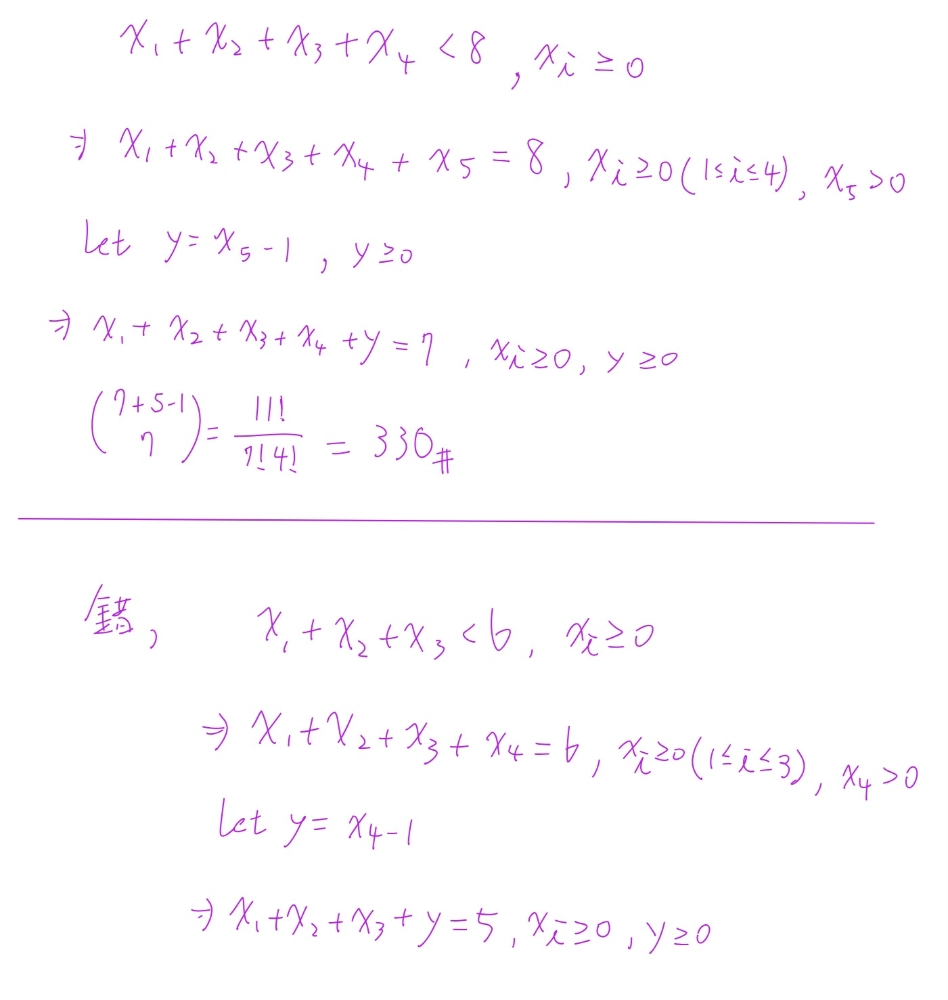


///


```text
Phase A — Internal Control Surface（控制面輸出） | TURN=第 12 次對話 | PROMPT=1.16.1 | REFRESH=NO | REFRESH_REMINDER=建議手動貼上最新版複習-Prompt 重新刷新規則❗❗❗ | STATE={MainlineMode=Transcript; MainlineSource=逐字稿_02_0918.txt; Locator=Session=02/L203–L249; KP=Inequality 非負整數解; Boundary=已核對至 Example 1.37 起點; Transcript={File=逐字稿_02_0918.txt; Session=02; SessionSource=FilenamePrefix; WithinSessionOrder=NA; Span=L203–L249; Coverage=FULL; TeachingState=TAUGHT_CORE; Signals=Explanation; Scope=不等式轉等式與 slack variable; Correction=NA; ASR=不影響目前結論; Residual=下一主線為 composition;}; Reference={Aligned=Textbook §1.4 Example 1.35–1.37; PrecisionStatus=已核對}; Practice={LearningObjective=能將 strict inequality 轉成非負整數等式並套用 Stars and Bars; Modality=手寫計算; ExpectedArtifact=計算過程; AcceptedSubmission=圖片; RequiredModality=NO; TaskOrigin=Generated; SourceReopened=NA; SourceIdentity=NA; ContentFidelity=GENERATED; SourceMatch=NA; AssessmentFidelity=Learning; SubmissionStatus=GRADABLE}; AdjQueue=Composition of a positive integer; ExerciseDebt=上一知識點使用者要求視為通過; TeachingMainlineDebt=下一知識點待教; AssessmentRequirementDebt=NONE_CONFIRMED; ReferenceResolutionDebt=NO; PastExamDebt=P0_DEFERRED; Weakness=不建立（User Override：當作答對）; Coverage=Inequality technique 已作答; Completion=依使用者要求視為通過並允許推進; Evidence=本輪手寫 submission + User Override; Blockers=None; NextLegal=Example 1.37 Composition} | PLAN={ThisResponse=指出手寫中的技術錯誤但不列錯題，接著教 Composition; ExpectedDebtChange=切換至下一主線; ExpectedNext=完成 Composition 練習後再推進}
```

#### 1. 先看你這張：第一大題其實是對的

你寫：

$$
x_1+x_2+x_3+x_4<8,\qquad x_i\ge0
$$

接著新增 \(x_5>0\)：

$$
x_1+x_2+x_3+x_4+x_5=8
$$

再令

$$
y=x_5-1\ge0
$$

所以得到

$$
x_1+x_2+x_3+x_4+y=7.
$$

這裡現在是 **5 個 nonnegative variables（非負變數）**，總和為 7，因此：

$$
\binom{7+5-1}{7}
=
\binom{11}{7}
=
\binom{11}{4}
=
330.
$$

✅ **這整段沒有錯，330 正確。**

而且這正是老師教的技巧：對 strict inequality（嚴格不等式）新增一個「必須 \(>0\)」的變數，再做 \(y=x-1\) 把它轉成一般非負整數解。老師原本的例子就是把 \(x_1+\cdots+x_6<10\) 改成 \(x_1+\cdots+x_6+x_7=10,\ x_7>0\)，再令 \(y_7=x_7-1\)。

所以依你們課程的給分規則，這題是：

**當章節技巧 + 過程完整 + 答案正確 → 得總分。**

Stars and Bars（隔板法）的一般公式也一致：\(m\) 個非負整數變數總和為 \(r\)，解數是 \(\binom{r+m-1}{m-1}\)。([Mathematics LibreTexts][1])

---

#### 2. 真正需要修正的是你最下面那一句

你最下面寫的大意是：

$$
\text{「錯，是 }x_1+x_2+x_3+x_4=5,\quad x_i\ge0\text{」}
$$

如果你是在處理**不等式轉等式**，那這裡少了一個很重要的東西：

> **不能直接把 `<` 或 `≤` 改成 `=`。必須新增 slack variable（鬆弛變數）。**

這兩種要分清楚。

如果原題是：

$$
x_1+x_2+x_3+x_4\le5
$$

可以新增 \(s\ge0\)：

$$
\boxed{x_1+x_2+x_3+x_4+s=5}
$$

因為剩多少就全部交給 \(s\)。

但是如果原題是：

$$
x_1+x_2+x_3+x_4<5
$$

那新增的變數必須是：

$$
s>0
$$

所以：

$$
x_1+x_2+x_3+x_4+s=5.
$$

再令：

$$
y=s-1\ge0
$$

得到：

$$
\boxed{x_1+x_2+x_3+x_4+y=4}.
$$

你可以把規則記成：

$$
\boxed{\le N\Rightarrow \text{補一個 }s\ge0}
$$

$$
\boxed{<N\Rightarrow \text{補一個 }s>0\Rightarrow s-1\ge0}
$$

這就是你目前唯一需要注意的地方。

依你的要求，**這一輪我仍然把它記作答對、不列 Weakness（弱點）、直接往下一部分走。**

---

## ⭐Composition（整數的有序拆解）— 一個正整數有幾種「相加方式」？

主線位置：Teacher Transcript／逐字稿_02_0918.txt／Session=02／L249
對齊參考：Textbook §1.4／Example 1.37

老師接下來立刻進入 Example 1.37：把一個正整數拆成若干個 positive integers（正整數）相加，而且**順序算不同**，這叫做 `Composition（有序整數拆解）`。

### 1. Composition 到底是什麼？

例如數字：

$$
4
$$

我們可以寫成：

$$
4
$$

或：

$$
3+1
$$

或：

$$
1+3
$$

或：

$$
2+2
$$

或：

$$
2+1+1
$$

等等。

關鍵是：

$$
\boxed{3+1\neq1+3}
$$

因為 **Composition 看順序**。

因此 4 的全部 compositions 是：

$$
\begin{aligned}
&4\\
&3+1\\
&1+3\\
&2+2\\
&2+1+1\\
&1+2+1\\
&1+1+2\\
&1+1+1+1
\end{aligned}
$$

總共：

$$
\boxed{8}
$$

種。

---

### 2. 為什麼剛好是 \(2^{n-1}\)？


/// danger|Composition（有序整數拆解）

這個技巧非常漂亮。

先把 \(4\) 想成：

$$
1\quad1\quad1\quad1
$$

四個 1 中間有 **3 個空隙**：

$$
1\ \square\ 1\ \square\ 1\ \square\ 1
$$

每個空隙只有兩個選擇：

* 切開：放 \(+\)
* 不切開：合併

例如：

$$
1+1+11
$$

代表：

$$
1+1+2.
$$

所以 3 個空隙，每個都有 2 種選擇：

$$
2\times2\times2=2^3=8.
$$

因此一般來說，正整數 \(n\) 有 \(n-1\) 個空隙：

$$
\boxed{\text{Number of compositions of }n=2^{n-1}}
$$

例如：

$$
7
$$

有：

$$
\boxed{2^6=64}
$$

種 compositions。

課本與老師後面正是把固定 summand（加數）數量的結果加起來，最後得到 \(2^{n-1}\)。

///

---

### 3. 如果題目指定「剛好有 \(k\) 個數相加」呢？

例如：

> 7 要拆成「剛好 3 個 positive integers（正整數）」。

等價於：

$$
x_1+x_2+x_3=7,
\qquad x_i>0.
$$

因為每個至少 1，所以令：

$$
y_i=x_i-1\ge0.
$$

得到：

$$
y_1+y_2+y_3=4.
$$


/// danger|

Stars and Bars：

$$
\binom{4+3-1}{3-1}
=
\binom{6}{2}
=
15.
$$

所以：

$$
\boxed{\text{7 拆成剛好 3 個正整數共有 15 種}}
$$

一般公式非常重要：

$$
\boxed{
\text{\(n\) 的 composition，剛好有 \(k\) 個 summands}
=
\binom{n-1}{k-1}
}
$$

其實用「切空隙」看更快：

$$
\underbrace{1\ \square\ 1\ \square\cdots\square\ 1}_{n\text{ 個 }1}
$$

有 \(n-1\) 個空隙。

要變成 \(k\) 段，就必須選：

$$
k-1
$$

個地方切開。

所以：

$$
\binom{n-1}{k-1}.
$$

///

---

### 4. Composition 跟 Partition 千萬不要混


///danger|Composition 跟 Partition

這是下一個很容易考你的地方。

**Composition（有序拆解）**：

$$
3+1\neq1+3
$$

所以 4 有：

$$
8
$$

種。

但如果**順序不重要**：

$$
3+1=1+3
$$

這叫 `Partition（整數分割）`。

4 的 partitions 只有：

$$
4,\quad
3+1,\quad
2+2,\quad
2+1+1,\quad
1+1+1+1
$$

總共：

$$
5.
$$

所以看到題目時先問自己：

$$
\boxed{\text{順序重要嗎？}}
$$

重要 → Composition
不重要 → Partition

///


///danger|summand(加數)

1 + 2 + 3 = 6，1、2、3 是 summand

///

### 5. Practice Tasks（練習任務）

#### 5.1 Task 1

[Generated: Composition basic]

**How many compositions does the positive integer \(6\) have?**

請寫公式與答案。

#### 5.2 Task 2

[Generated: Fixed number of summands]

**How many compositions of \(8\) have exactly \(3\) positive summands?**

請用：

$$
\binom{n-1}{k-1}
$$

列式計算。

#### 5.3 Task 3

[Generated: Concept check]

**Are \(2+1+3\) and \(3+1+2\) considered the same composition of \(6\)? Explain briefly.**

你可以直接打字，或像剛才一樣手寫拍照。

[1]: https://math.libretexts.org/Courses/Monroe_Community_College/Supplements_for_Discrete_Judy_Dean/02%3A_Counting/2.05%3A_Stars_and_Bars?utm_source=chatgpt.com "2.5: Stars and Bars - Mathematics LibreTexts"


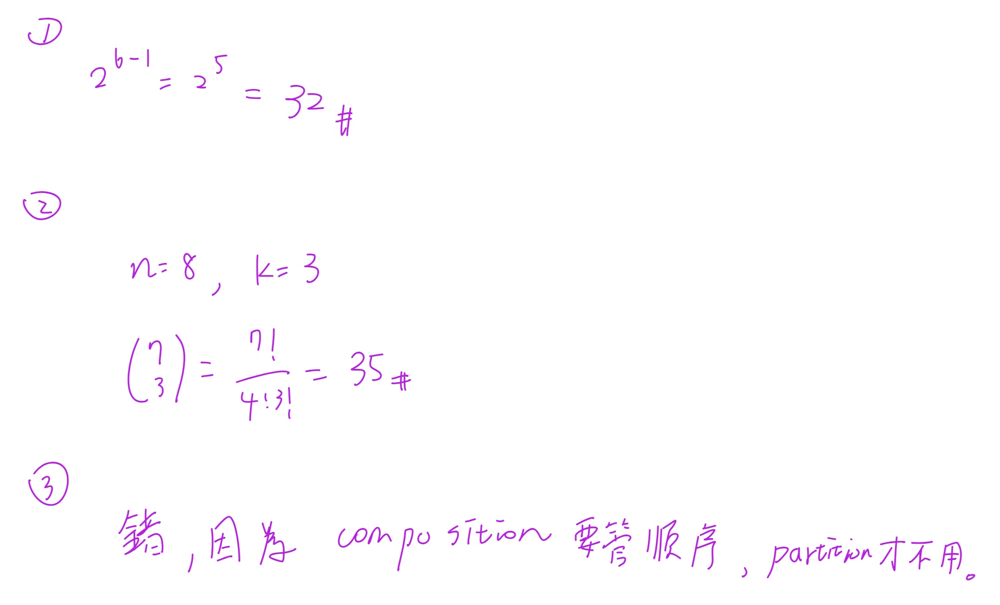


///danger|較難的 composition 計算


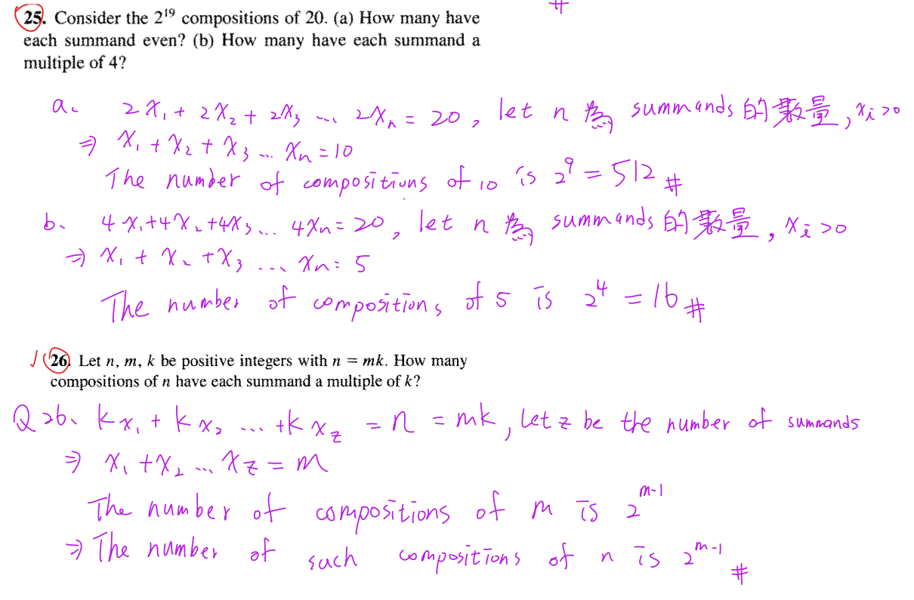

///

```text
Phase A — Internal Control Surface（控制面輸出） | TURN=第 14 次對話 | PROMPT=1.16.1 | REFRESH=NO | REFRESH_REMINDER=建議手動貼上最新版複習-Prompt 重新刷新規則❗❗❗ | STATE={MainlineMode=Transcript; MainlineSource=逐字稿_02_0918.txt; Locator=Session=02/L249; KP=Composition Practice; Boundary=已核對至 composition 收束並銜接 nested for-loop; Transcript={File=逐字稿_02_0918.txt; Session=02; SessionSource=FilenamePrefix; WithinSessionOrder=NA; Span=L249 composition→for-loop; Coverage=FULL; TeachingState=TAUGHT_CORE; Signals=Explanation; Scope=composition 與 combination with repetition; Correction=NONE; ASR=部分公式以正式數學式校準; Residual=下一主線為 nested for-loop counting}; Reference={Aligned=標準 composition formula; PrecisionStatus=已核對}; Practice={LearningObjective=composition 計數與 order significance; Modality=Calculation+True/False; ExpectedArtifact=算式與判斷理由; AcceptedSubmission=手寫圖片; RequiredModality=NO; TaskOrigin=Generated; SourceReopened=NA; SourceIdentity=NA; ContentFidelity=GENERATED; SourceMatch=NA; AssessmentFidelity=Learning; SubmissionStatus=GRADABLE}; AdjQueue=nested for-loop counting→homework signal→Well-Ordering preview; ExerciseDebt=Composition answers待本輪批改; TeachingMainlineDebt=nested for-loop counting; AssessmentRequirementDebt=後續作業題清單待處理; ReferenceResolutionDebt=NONE; PastExamDebt=目前未找到直接題; Weakness=NONE; Coverage=Composition taught+submitted; Completion=Composition尚待本輪正式判定; Evidence=使用者提交3題可讀手寫答案; Blockers=NONE; NextLegal=批改後若通過則進 nested for-loop counting} | PLAN={ThisResponse=批改3題並在通過後推進巢狀迴圈計數; ExpectedDebtChange=Composition ExerciseDebt→cleared，建立新KP ExerciseDebt; ExpectedNext=等待 nested for-loop Practice 回答}
```

#### 1. 這三題批改

| 題目 | 判定 | 說明                                                                                                                                                                                                                 |
| -- | -- | ------------------------------------------------------------------------------------------------------------------------------------------------------------------------------------------------------------------ |
| 1  | ✅  | \(2^{6-1}=2^5=32\)，正確。正整數 \(n\) 的 `composition(有序整數拆分)` 總數是 \(2^{n-1}\)。老師也是從 \(\sum_{k=0}^{n-1}\binom{n-1}{k}=2^{n-1}\) 推到這個結果。 ([Wolfram數學世界][1])                                                                |
| 2  | ✅  | \(\binom73=35\) 正確。若題意是「把 8 拆成 4 個正整數」，標準寫法是 \(\binom{8-1}{4-1}=\binom73\)。你寫的 \(k=3\) 若指「3 個加號／3 個切點」可以，但若 \(k\) 指 `parts/summands(項數)`，就應寫 \(k=4\)。標準公式是拆成 \(k\) 個正整數有 \(\binom{n-1}{k-1}\) 種。([Wolfram數學世界][1]) |
| 3  | ✅  | 完全正確。`composition(有序拆分)` 要看順序，例如 \(3+1\) 與 \(1+3\) 是不同；`partition(整數分割)` 不看順序。老師課堂也明確把 \(3+1\) 與 \(1+3\) 視為不同 composition。                                                                                         |

依你的給分標準，這組可以算**得總分**。第 2 題只是記號建議，不是觀念錯誤。

---

## ⭐Nested For Loop(巢狀迴圈)計數 — 為什麼程式可以變成重複組合？

主線位置：Teacher Transcript／`逐字稿_02_0918.txt`／Session=02／L249，從「再來再稍微挑戰一點」到老師算出 \(\binom{22}{3}=1540\) 的段落。

### 1. 老師現在要解什麼問題？

老師給的概念相當於：

```text
for i = 1 to 20
    for j = 1 to i
        for k = 1 to j
            print(...)
```

問題不是要真的一個一個跑，而是：

> `print` 到底會執行幾次？

---

### 2. 先把迴圈翻成數學條件

因為：

* \(i\) 從 \(1\) 到 \(20\)
* \(j\) 從 \(1\) 到 \(i\)
* \(k\) 從 \(1\) 到 \(j\)

所以每次真正執行 `print` 時，都對應一組：

$$
1\le k\le j\le i\le20.
$$

例如：

$$
(i,j,k)=(3,2,1)
$$

可以。

但：

$$
(i,j,k)=(2,3,1)
$$

不可以，因為 \(j\le i\) 被破壞了。

---

### 3. 關鍵：它其實是「從 20 種數字中選 3 個，可重複」

例如：

$$
(i,j,k)=(5,3,3)
$$

相當於從

$$
1,2,\ldots,20
$$

選出三個數字：

$$
3,3,5.
$$

可以重複，而且因為迴圈已經強迫

$$
k\le j\le i,
$$

所以像

$$
(5,3,3)
$$

不會再另外出現

$$
(3,5,3)
$$

這種排列。

因此它不是 permutation，而是：

$$
\text{Combination with Repetition(可重複組合)}.
$$

老師就是把這個巢狀迴圈轉成「20 種東西中選 3 個，可重複」來算。

---

### 4. 套公式

從 \(n\) 種東西選 \(r\) 個，可重複：

$$
\binom{n+r-1}{r}.
$$

這裡：

$$
n=20,\qquad r=3.
$$

所以：

$$
\binom{20+3-1}{3}
=
\binom{22}{3}.
$$

也就是：

$$
\boxed{1540}.
$$

所以 `print` 總共執行 \(1540\) 次。老師課堂得到的也是這個結果。

### 5. 最重要的判斷流程

看到這類 nested loop，不要直接想「三層所以 \(20^3\)」。

先翻譯限制：

$$
1\le k\le j\le i\le20.
$$

再看它代表：

$$
\boxed{\text{從 20 個值中選 3 個，可重複，而且順序已固定}}
$$

因此就是：

$$
\boxed{\binom{22}{3}}.
$$


///danger|Nested For Loop(巢狀迴圈)計數
### 我覺得 Nested For Loop(巢狀迴圈)計數 還是很不直覺，我感覺不出來他跟星星隔板有啥關係？你可以講句體一點嗎？

///details|ChatGPT講解

```text
Phase A — Internal Control Surface（控制面輸出） | TURN=第 16 次對話 | PROMPT=1.16.1 | REFRESH=NO | REFRESH_REMINDER=建議手動貼上最新版複習-Prompt 重新刷新規則❗❗❗ | STATE={MainlineMode=Transcript; MainlineSource=逐字稿_02_0918.txt; Locator=Session=02/L249; KP=Nested For Loop Counting→Combination with Repetition; Boundary=已核對; Transcript={File=逐字稿_02_0918.txt; Session=02; SessionSource=FilenamePrefix; WithinSessionOrder=NA; Span=L249; Coverage=FULL; TeachingState=TAUGHT_CORE; Signals=Explanation; Scope=1≤k≤j≤i≤20轉為從20種值中重複選3個; Correction=NONE; ASR=公式已校準; Residual=後續為變形與作業}; Reference={Aligned=Stars and Bars/Combination with Repetition; PrecisionStatus=已核對}; Practice={LearningObjective=理解巢狀迴圈與Stars and Bars的一一對應; Modality=Concrete Mapping; ExpectedArtifact=NA; AcceptedSubmission=NA; RequiredModality=NO; TaskOrigin=NA; SourceReopened=NA; SourceIdentity=NA; ContentFidelity=NA; SourceMatch=NA; AssessmentFidelity=Learning; SubmissionStatus=NOT_SUBMITTED}; AdjQueue=釐清此映射後回原主線; ExerciseDebt=EXISTS; TeachingMainlineDebt=NONE; AssessmentRequirementDebt=後續作業清單待處理; ReferenceResolutionDebt=NONE; PastExamDebt=UNKNOWN; Weakness=尚未形成Stars/Bars與20種可選值的直覺映射; Coverage=Nested-loop核心已教; Completion=尚未完成練習; Evidence=已釐清20不是總和而是可選值種類數; Blockers=NONE; NextLegal=具體建立一對一映射} | PLAN={ThisResponse=用縮小版3種數字實際列出loop輸出與Stars/Bars逐項對應; ExpectedDebtChange=概念補強; ExpectedNext=使用者理解後回原Practice}
```

#### 1. 對，你會覺得不直覺，是因為這題的「星星」不是數字本身

最重要的一句先給你：

$$
\boxed{\text{星星不是 }3,3,5\text{ 這些數字；星星代表「我選了一次」。}}
$$

而 `bar(隔板)` 才是在告訴我們：

> 這次選的是數字 1？數字 2？數字 3？……還是數字 20？

這樣就會開始跟 `Stars and Bars(星星與隔板)` 接起來。

老師這裡實際上就是把

$$
1\le k\le j\le i\le20
$$

看成「從 \(1\sim20\) 這 20 種值中選 3 個，允許重複」；大小關係則幫我們把順序固定住，不重複計數。

---

#### 2. 我們先把 20 縮小成 3，你會立刻看出來

先不要看 \(1\sim20\)。

假設程式變成：

$$
1\le k\le j\le i\le3.
$$

也就是只有三種數字可以選：

$$
\boxed{1,\ 2,\ 3}
$$

每次要選 **3 個數字**，可以重複。

例如：

$$
(1,1,1)
$$

$$
(1,1,2)
$$

$$
(1,2,3)
$$

$$
(2,2,3)
$$

$$
(3,3,3)
$$

都合法。

現在我們暫時不要記「選到哪些數字」，改成記：

$$
x_1=\text{選到數字1幾次}
$$

$$
x_2=\text{選到數字2幾次}
$$

$$
x_3=\text{選到數字3幾次}
$$

因為總共就是選 3 次，所以一定：

$$
\boxed{x_1+x_2+x_3=3}
$$

看到這裡，`Stars and Bars` 就出現了。

---

#### 3. 比如 `(1,1,2)` 到底怎麼變成星星隔板？

你選的是：

$$
(1,1,2)
$$

意思是：

* 數字 1 選了 2 次
* 數字 2 選了 1 次
* 數字 3 選了 0 次

所以：

$$
(x_1,x_2,x_3)=(2,1,0)
$$

現在用星星表示「選一次」：

* 數字 1：`**`
* 數字 2：`*`
* 數字 3：空的

把三種數字用隔板切開：

$$
\boxed{**|*|}
$$

你可以直接讀：

```text
** | * |
 ↑   ↑  ↑
 1   2  3
```

第一區兩顆星：

$$
x_1=2
$$

第二區一顆：

$$
x_2=1
$$

第三區零顆：

$$
x_3=0.
$$

所以：

$$
**|*|
\quad\Longleftrightarrow\quad
(1,1,2)
$$

這就是它跟星星隔板的關係。

---

#### 4. 再看 `(1,2,3)`，會更明顯

三個數字各選一次：

$$
(x_1,x_2,x_3)=(1,1,1).
$$

因此：

$$
\boxed{*|*|*}
$$

就是：

```text
* | * | *
1   2   3
```

所以：

$$
*|*|*
\quad\Longleftrightarrow\quad
(1,2,3).
$$

---

#### 5. 那 `(2,2,3)` 呢？

數字 1 沒選：

$$
x_1=0
$$

數字 2 選兩次：

$$
x_2=2
$$

數字 3 選一次：

$$
x_3=1.
$$

所以：

$$
(x_1,x_2,x_3)=(0,2,1)
$$

星星隔板：

$$
\boxed{|**|*}
$$

第一個隔板前沒有星星，因此數字 1 選 0 次。

這正是 Stars and Bars 很重要的一點：兩個 bar 可以靠在一起，代表某一種類被選 0 次。這種「每一區的星星數量代表各種類被選幾次」就是標準的 stars-and-bars 表示法。([Mathematics LibreTexts][1])

---

#### 6. 最極端的 `(3,3,3)`

數字 1：

$$
0\text{ 次}
$$

數字 2：

$$
0\text{ 次}
$$

數字 3：

$$
3\text{ 次}.
$$

因此：

$$
(x_1,x_2,x_3)=(0,0,3)
$$

畫成：

$$
\boxed{||***}
$$

也就是：

```text
 | | ***
 1 2  3
```

所以：

$$
||***
\quad\Longleftrightarrow\quad
(3,3,3).
$$

---

#### 7. 甚至可以把這個縮小版全部列出來

條件：

$$
1\le k\le j\le i\le3
$$

所有可能的「三個數字」跟星星隔板是一一對應：

| 選到的三個數字   | \((x_1,x_2,x_3)\) | Stars & Bars |
| --------- | ----------------- | ------------ |
| \(1,1,1\) | \((3,0,0)\)       | `***\|\|`    |
| \(1,1,2\) | \((2,1,0)\)       | `**\|*\|`    |
| \(1,2,2\) | \((1,2,0)\)       | `*\|**\|`    |
| \(2,2,2\) | \((0,3,0)\)       | `\|***\|`    |
| \(1,1,3\) | \((2,0,1)\)       | `**\|\|*`    |
| \(1,2,3\) | \((1,1,1)\)       | `*\|*\|*`    |
| \(2,2,3\) | \((0,2,1)\)       | `\|**\|*`    |
| \(1,3,3\) | \((1,0,2)\)       | `*\|\|**`    |
| \(2,3,3\) | \((0,1,2)\)       | `\|*\|**`    |
| \(3,3,3\) | \((0,0,3)\)       | `\|\|***`    |

所以總共就是 10 種。

而 Stars and Bars 也會算出：

* 3 顆星
* 3 種數字，所以需要 \(3-1=2\) 個隔板

一共有

$$
3+2=5
$$

個符號。

只要決定哪 3 格放星星：

$$
\binom53=10.
$$

完全對上。

---

#### 8. 現在把「3 種數字」換回老師的「20 種數字」

原本的小例子：

$$
\{1,2,3\}
$$

有 3 種數字，所以用了：

$$
2\text{ 個隔板}.
$$

老師的題目則是：

$$
\{1,2,3,\ldots,20\}
$$

有 **20 種數字**，因此需要：

$$
\boxed{19\text{ 個隔板}}
$$

把空間切成 20 區：

```text
數字1 | 數字2 | 數字3 | ... | 數字19 | 數字20
```

然後我們總共選 **3 次**，所以只有：

$$
\boxed{3\text{ 顆星}}
$$

因此整條 stars-and-bars string 裡有：

$$
3+19=22
$$

個符號。

其中挑 3 個位置放星星：

$$
\boxed{\binom{22}{3}}
$$

也就是：

$$
\boxed{\binom{20+3-1}{3}=1540}.
$$

這正是「從 \(20\) 種東西裡選 \(3\) 個，允許重複且不計排列順序」的 combination with repetition 公式。([Mathematics LibreTexts][2])

---

#### 9. 回到你之前提的 `(5,3,3)`，現在直接畫給你看

我們其實把它看成排序好的：

$$
3,3,5.
$$

也就是：

* 數字 1：0 次
* 數字 2：0 次
* 數字 3：2 次
* 數字 4：0 次
* 數字 5：1 次
* 數字 6～20：0 次

所以：

$$
(x_1,x_2,x_3,x_4,x_5,\ldots,x_{20})
=
(0,0,2,0,1,0,\ldots,0)
$$

而且：

$$
x_1+x_2+\cdots+x_{20}=3.
$$

星星隔板前半段會長成：

$$
\boxed{||**||*|\cdots}
$$

拆開看：

```text
     |     |  **  |     |  *  | ...
數字1  數字2  數字3  數字4  數字5
  0      0      2      0      1
```

所以這串符號不是說：

$$
3+3+5=20
$$

而是在記錄：

$$
\boxed{\text{20 種可能的數字，各自被選了幾次}}
$$

總共選了三次而已。

---

#### 10. 為什麼巢狀迴圈的順序限制剛好讓這方法成立？

原程式限制：

$$
1\le k\le j\le i\le20.
$$

假設我們選到：

$$
3,3,5.
$$

如果沒有大小限制，排列可能有：

$$
(3,3,5),\quad(3,5,3),\quad(5,3,3).
$$

但 nested loop 只允許一個固定順序：

$$
k\le j\le i
$$

所以只會留下：

$$
(k,j,i)=(3,3,5).
$$

因此它實際上不在乎「先選 3 還是先選 5」，只在乎：

> 3 選兩次，5 選一次。

這正好就是：

$$
(x_1,x_2,\ldots,x_{20})
$$

這種「每種東西取幾個」的表示方式。

也就是 `multiset(多重集合)` / `combination with repetition(可重複組合)`。

---

#### 11. 你可以把 Stars and Bars 想成「20 格點餐表」

這可能是最直覺的 mental model。

想像一張表：

```text
餐點編號：  1  2  3  4  5  ... 20
點幾份：    0  0  2  0  1  ...  0
```

你總共只能點 3 份：

$$
x_1+x_2+\cdots+x_{20}=3.
$$

Stars and Bars 只是把上面這張表壓縮成一條線：

```text
||**||*|...
```

所以：

$$
\boxed{\text{星星＝你手上的 3 次選擇}}
$$

$$
\boxed{\text{隔板＝把 20 種可能數字分成 20 格}}
$$

一旦把這兩句抓住，\(\binom{22}{3}\) 就不再是在硬套公式了。

[1]: https://math.libretexts.org/Courses/Monroe_Community_College/Supplements_for_Discrete_Judy_Dean/02%3A_Counting/2.05%3A_Stars_and_Bars?utm_source=chatgpt.com "2.5: Stars and Bars - Mathematics LibreTexts"
[2]: https://math.libretexts.org/Courses/Monroe_Community_College/MTH_220_Discrete_Math/7%3A_Combinatorics/7.5%3A_Combinations_WITH_Repetitions?utm_source=chatgpt.com "7.5: Combinations WITH Repetitions - Mathematics LibreTexts"

///

///

### 6. Practice Tasks(練習任務)

#### 6.1 Task 1

```text
for i = 1 to 5
    for j = 1 to i
        for k = 1 to j
            print(i, j, k)
```

**How many times is `print` executed?**

請寫出：

$$
\text{限制條件}\rightarrow\text{combination with repetition}\rightarrow\text{答案}.
$$

[Generated: Learning Practice]

#### 6.2 Task 2

Which of the following triples can actually occur in the loop above?

A. \((2,2,1)\)
B. \((2,3,1)\)
C. \((4,1,3)\)
D. \((3,3,3)\)

可以直接回答例如 `A、D`，再簡短寫判斷依據。

[1]: https://mathworld.wolfram.com/Composition.html?utm_source=chatgpt.com "Composition -- from Wolfram MathWorld"


/// danger|英文看不懂的第 8 題

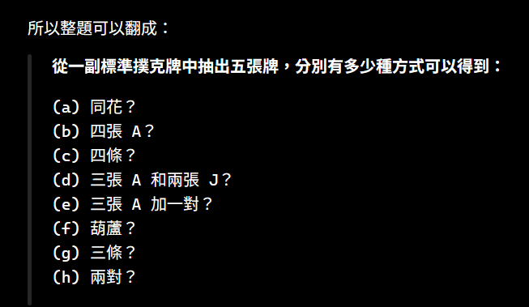
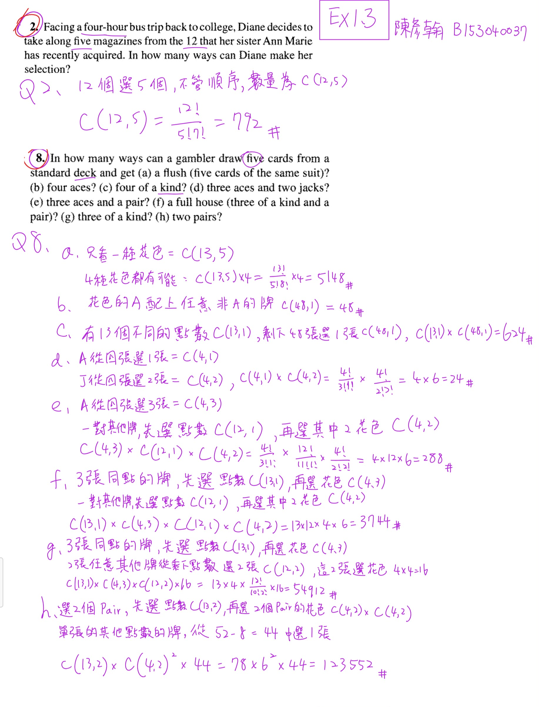


///