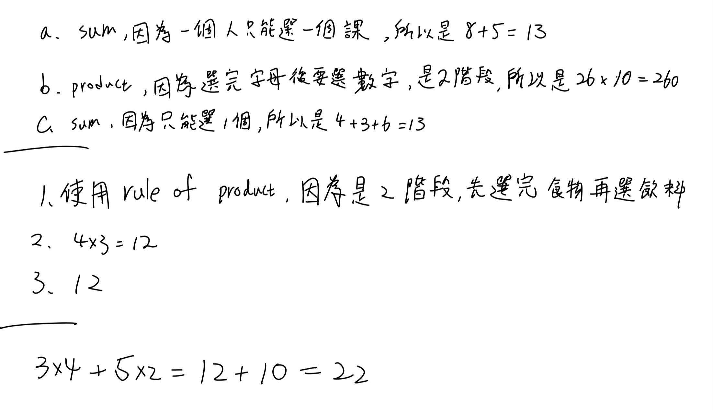
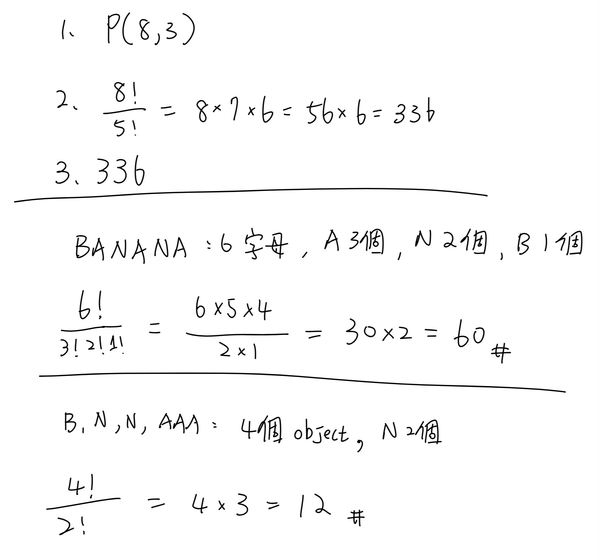
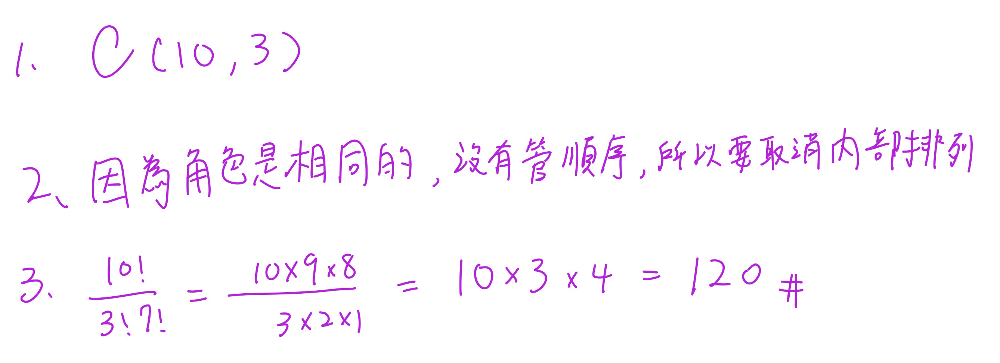

第 1 次對話

```text
TEXT HANDOFF | STATE={GOAL=複習第01堂課; STAGE=啟動; COMPLETED=尚無已完成知識點; VERIFIED=逐字稿_01_0911.txt依檔名前綴解析Session=01，已核對本堂正式課程內容起於L162，老師先教Rules of Sum/Product，後續才進入§1.2 Permutations，§1.3僅開始介紹且Binomial Theorem明確延至下週; NEEDS_REVIEW=第01堂全部正式授課內容; CURRENT=Rules of Sum and Product; NEXT=完成本知識點教學與練習後再進§1.2 Permutations; BLOCKER=無; EVIDENCE=逐字稿L162–220與課本PDF viewer p.24–26已核對} | PLAN={THIS_RESPONSE=教Rules of Sum/Product並安排自適應練習; EXPECTED_NEXT=依作答批改後判定是否推進Permutations}
```

```text
Phase A — Internal Control Surface（控制面輸出） | TURN=1 | PROMPT=1.15.0 | REFRESH=ManualPromptRefresh_CONFIRMED | STATE={MainlineMode=Transcript; MainlineSource=逐字稿_01_0911.txt; Locator=Session=01/L166–186; KP=Rules of Sum and Product; Boundary=已核對_L166–186_下一主題L188開始Permutations; Transcript={File=逐字稿_01_0911.txt; Session=01; SessionSource=FilenamePrefix; WithinSessionOrder=NA; Span=L166–186; Coverage=FULL_for_current_KP; TeachingState=TAUGHT_CORE; Signals=Explanation+Emphasis; Scope=Rule_of_Sum+Rule_of_Product+辨識條件; Correction=NONE; ASR=部分口語措辭以課本precision校準; Residual=已核對至L220}; Reference={Aligned=Textbook_Ch1_§1.1_PDFviewer_p24–26; PrecisionStatus=已核對}; Practice={LearningObjective=能依問題結構辨識並正確套用Sum/Product Rule; Modality=classification+calculation+brief_reasoning; ExpectedArtifact=答案+簡短理由; AcceptedSubmission=中文或英文文字/列式; RequiredModality=NO; AssessmentFidelity=Learning; SubmissionStatus=NOT_SUBMITTED}; AdjQueue=Rules_of_Sum_Product→Permutations→Combinations_preview; ExerciseDebt=本則教完後產生; TeachingMainlineDebt=Permutations尚未處理; AssessmentRequirementDebt=Homework_4_5_6_9_28待對應知識點後處理; ReferenceResolutionDebt=NONE_high_priority; PastExamDebt=108_Quiz1_ProductRule_direct_available_but_not_yet_used; Weakness=UNKNOWN; Coverage=Session01局部進行中; Completion=本KP尚未完成; Evidence=逐字稿L166–186+課本p24–26; Blockers=NONE; NextLegal=完成本KP練習後批改} | PLAN={ThisResponse=重構Rules_of_Sum_and_Product並輸出3個Practice_Tasks; ExpectedDebtChange=ExerciseDebt題目輸出後待使用者作答; ExpectedNext=批改並視結果推進§1.2}
```

## ⭐ Rule of Sum（加法原理）與 Rule of Product（乘法原理）— 到底什麼時候加、什麼時候乘？

主線位置：Teacher Transcript／`逐字稿_01_0911.txt`／Session=01／L166–186
對齊參考：Grimaldi Ch.1 §1.1／PDF viewer page 24–26

老師在第 01 堂正式進入課程內容後，第一個真正教的核心就是這兩條 Counting Principle（計數原理）。逐字稿中老師先講 Rule of Sum，再用程式、餐廳、舞台選角等例子區分 Rule of Product，到了後面才切換到 §1.2 Permutations（排列），所以這裡是一個完整自然知識點。

課本 §1.1 也是同樣順序：先定義 Rule of Sum，再定義 Rule of Product，並用多個例子說明。 Pearson 官方目錄也確認 Chapter 1 的第一小節就是 *The Rules of Sum and Product*，接著才是 *Permutations*。([Pearson][1])

---

### 1. 最根本的問題：一個計數問題，到底是在問「選一條路」還是「走完多個步驟」？

不要先背：

$$
m+n
$$

或

$$
m\times n
$$

先問：

> 一個完整結果，是從幾個互斥方案中「選一個」？
>
> 還是必須依序完成多個 stage（階段），每個階段都要作選擇？

這就是兩條規則的分界。

---

### 2. Rule of Sum（加法原理）：OR → 加

假設完成某件事有兩種**互斥的途徑**：

* Task A 有 \(m\) 種方法；
* Task B 有 \(n\) 種方法；
* 一個結果不會同時屬於 A 與 B。

那麼：

$$
\boxed{m+n}
$$

種。

老師特別強調的關鍵，就是這些 alternatives（替代方案）不能在同一次結果中同時發生。

#### 2.1 生活化理解

你今天只選一種午餐：

* 麵有 5 種；
* 飯有 7 種。

你問的是：

> 吃麵 **或** 吃飯。

所以：

$$
5+7=12.
$$

這是一個 OR（或）的結構。

---

### 3. 為什麼「不能重複計算」很重要？

假設：

* 社團 A 有 20 人；
* 社團 B 有 15 人。

如果兩個社團有人同時加入，那你不能直接說：

$$
20+15=35
$$

因為同時加入 A、B 的人會被算兩次。

所以最基本的 Rule of Sum 使用前提，是兩組 outcomes（結果）要互斥。

你現在可以先記：

$$
\boxed{\text{互斥的選擇} \Rightarrow \text{加}}
$$

之後課程再遇到 Inclusion-Exclusion Principle（排容原理）時，才會系統處理「不互斥怎麼辦」。

---

### 4. 老師上課的三種程式語言教材例子

逐字稿舉的情境是：有三種程式語言教材可以推薦，而且每種各有 7 本：

* C++：7 本
* Java：7 本
* Perl：7 本

只推薦其中一本，所以：

$$
7+7+7=21.
$$

重點根本不是「教材」本身，而是：

> 完整結果只會落在其中一類。

所以用 Sum。

---

### 5. Rule of Product（乘法原理）：AND → 乘

另一種情況：

第一階段有 \(m\) 種選擇。

對第一階段的**每一個**選擇，第二階段又有 \(n\) 種選擇。

而且一個完整結果必須包含：

$$
\text{第一階段}+\text{第二階段}.
$$

總數就是：

$$
\boxed{m\times n}
$$

課本正式定義正是把 procedure（程序）拆成 first stage（第一階段）與 second stage（第二階段）；第一階段有 \(m\) 種結果，對其中每個結果，第二階段有 \(n\) 種結果，因此完整 procedure 有 \(mn\) 種。

---

### 6. 生活化理解：餐廳 × 餐點

假設：

* 3 家餐廳；
* 每一家都有 5 種你要吃的餐點。

完整的午餐選擇不是只選餐廳，也不是只選餐點。

你必須：

```text
選一家餐廳
   ↓
在那家餐廳選一道餐
```

因此：

$$
3\times5=15.
$$

這是一個 AND（而且）的結構：

> 餐廳 **而且** 餐點。

---

### 7. 老師為什麼一直拿「程式執行流程」解釋？

因為老師想建立的不是高中式「看到排列組合就套公式」，而是把問題拆成 stages（階段）。

逐字稿用 pseudo-code（虛擬碼）的概念說明：先進入 first stage 的某一個 case，接著該 case 裡又一定要執行 second stage，所以一個完整 execution path（執行路徑）包含兩層選擇。

用樹狀圖看最直觀：

```text
第一階段
├─ A1
│  ├─ B1
│  ├─ B2
│  └─ B3
├─ A2
│  ├─ B1
│  ├─ B2
│  └─ B3
└─ A3
   ├─ B1
   ├─ B2
   └─ B3
```

第一層有 3 個 branch（分支），每個 branch 再有 3 個：

$$
3\times3=9.
$$

---

### 8. 老師的舞台劇例子：6 × 8

老師接著講 Example 1.5：

* 6 位男性候選人可演男主角；
* 8 位女性候選人可演女主角。

一個 cast（演員組合）必須同時有：

* 一個男性；
* 一個女性。

所以：

$$
6\times8=48.
$$

這不是：

$$
6+8=14
$$

因為「選男主角」與「選女主角」並不是二選一；兩件事都必須完成。

---

### 9. 最值得記的判斷法：OR / AND

遇到題目時先不要算。

先翻譯成一句話：

| 問題結構               | 原理              |         運算 |
| ------------------ | --------------- | ---------: |
| 從互斥類別中選 **其中一個**   | Rule of Sum     |      \(+\) |
| 完整結果需要完成 **每一個階段** | Rule of Product | \(\times\) |

你可以先把它粗略記成：

$$
\boxed{\text{OR}\rightarrow +}
$$

$$
\boxed{\text{AND}\rightarrow \times}
$$

但這個口訣不是百分之百機械式的。真正要看的是**完整 outcome（結果）如何形成**。

---

### 10. 一題為什麼可以同時用加法和乘法？

這是非常重要的。

假設早餐可以：

* 選漢堡：3 種漢堡，而且可搭 4 種飲料；
* 或選蛋餅：5 種蛋餅，而且可搭 4 種飲料。

先算每條 route（路徑）：

漢堡方案：

$$
3\times4=12
$$

蛋餅方案：

$$
5\times4=20
$$

最後兩條方案互斥：

$$
12+20=32.
$$

所以複雜題的核心通常不是「這題是加法題還是乘法題」。

而是：

> 哪一層是 OR？
>
> 哪一層是 AND？

這也是老師後面提到 application problem（應用題）特別重要的原因：不是公式難，而是你能不能從長文字中看出結構。

---

/// danger
### 11. 一個非常實用的解題流程

每次看到 counting problem（計數題），按照這四步：

1. **定義一個完整結果長什麼樣。**
2. 問：有哪些 mutually exclusive cases（互斥情況）？
3. 每一個 case 裡，又需要完成哪些 stages（階段）？
4. case 之間加，stage 之間乘。

可以壓成一句：

$$
\boxed{\text{Cases 加；Stages 乘}}
$$
///

---

### 12. 這個知識點和後面的 Permutation 有什麼關係？

老師下一個正式主題是 §1.2 Permutations（排列）。逐字稿明確說，排列其實就是把 Rule of Product 用在一連串位置選擇上。

例如從 10 個不同學生選 5 個排成一列：

* 第 1 位：10 種
* 第 2 位：9 種
* 第 3 位：8 種
* 第 4 位：7 種
* 第 5 位：6 種

所以：

$$
10\times9\times8\times7\times6.
$$

你之後看到

$$
P(10,5)
$$

其實不是一個憑空冒出來的新公式。

它的底層就是：

$$
\boxed{\text{Rule of Product}}
$$

所以這一小節一定要真的懂，而不是只記「加或乘」。

---

### 13. Assessment Quick Check（評量快速檢查）

目前歷屆小考中確實有直接的 Product Rule 題型：108 Quiz 1 Problem 1 給定汽車有 4 種車型、12 種顏色、3 種引擎、2 種變速箱，要求計算完整配置數；其解法就是逐階段相乘。

不過我們現在先不用考古題原題；先確認你能自己辨識 Sum/Product，再進 §1.2。老師本堂也明確說作業偏好長文字應用題，並指定了 4、5、6、9、28，表示「從文字辨識計數結構」是這堂需要練的能力。

### 14. Practice Tasks（練習任務）

#### 14.1 Task 1 — Classification

**For each situation, decide whether the Rule of Sum or the Rule of Product should be used. Give one short reason.**

a. A student chooses **one** elective: 8 CS courses or 5 math courses.
b. A password consists of **one letter followed by one digit**. There are 26 possible letters and 10 possible digits.
c. You choose **one** dessert: 4 cakes, 3 puddings, or 6 ice creams.

作答格式可直接寫：

`a. Sum, because ...`

---

#### 14.2 Task 2 — Calculation

**A restaurant offers 4 main dishes and 3 drinks. A lunch set contains exactly one main dish and one drink. How many different lunch sets are possible?**

請給：

1. 使用哪一條 rule；
2. 列式；
3. 答案。

---

#### 14.3 Task 3 — Mixed Structure

**A student may choose either:**

* **Plan A:** one of 3 programming courses and one of 4 lab sections, or
* **Plan B:** one of 5 mathematics courses and one of 2 tutorial sections.

**How many complete schedules are possible?**

請不要只給數字；用一行列式表示你認為哪裡乘、哪裡加。

[1]: https://www.pearson.com/en-us/subject-catalog/p/Grimaldi-Discrete-and-Combinatorial-Mathematics-Classic-Version-5th-Edition/P200000006199?utm_source=chatgpt.com "Discrete and Combinatorial Mathematics (Classic Version)"





第 2 次對話

```text
Phase A — Internal Control Surface（控制面輸出） | TURN=2 | PROMPT=1.15.0 | REFRESH=NO | STATE={MainlineMode=Transcript; MainlineSource=逐字稿_01_0911.txt; Locator=Session=01/L166–186; KP=Rules of Sum and Product; Boundary=已核對_L166–186; Transcript={File=逐字稿_01_0911.txt; Session=01; SessionSource=FilenamePrefix; WithinSessionOrder=NA; Span=L166–186; Coverage=FULL_for_current_KP; TeachingState=TAUGHT_CORE; Signals=Explanation+Emphasis; Scope=Sum/Product辨識與計算; Correction=NONE; ASR=precision已由課本校準; Residual=已核對至L220}; Reference={Aligned=Textbook_Ch1_§1.1_PDFviewer_p24–26; PrecisionStatus=已核對}; Practice={LearningObjective=辨識Sum/Product並處理混合結構; Modality=classification+calculation; ExpectedArtifact=手寫答案與簡短理由; AcceptedSubmission=圖片; RequiredModality=NO; AssessmentFidelity=Learning; SubmissionStatus=GRADABLE}; AdjQueue=Rules_of_Sum_Product→Permutations→Combinations_preview; ExerciseDebt=上一輪3題已實際提交_待本則批改; TeachingMainlineDebt=Permutations尚未處理; AssessmentRequirementDebt=Homework_4_5_6_9_28待逐步處理; ReferenceResolutionDebt=NONE_high_priority; PastExamDebt=direct_ProductRule_available; Weakness=尚無已確認弱點; Coverage=Session01局部進行中; Completion=Sum/Product待本則批改後判定; Evidence=使用者手寫提交+逐字稿L166–186; Blockers=NONE; NextLegal=若通過則進L188–210_Permutations} | PLAN={ThisResponse=批改3題並在通過後正式教§1.2 Permutations與安排練習; ExpectedDebtChange=Sum/Product完成並產生Permutations ExerciseDebt; ExpectedNext=批改Permutation練習後處理Combinations preview與Homework debt}
```

#### 1. 批改結果

你的圖片清楚可讀，這次 submission（提交）可以完整批改。

| Task | 結果 | 評語                                                     |
| ---- | -- | ------------------------------------------------------ |
| 1a   | ✅  | `Sum` 正確。8 門 CS 或 5 門 Math，只選其中一門，所以 \(8+5=13\)。       |
| 1b   | ✅  | `Product` 正確。字母與數字兩個 stage 都要完成，所以 \(26\times10=260\)。 |
| 1c   | ✅  | `Sum` 正確。三類 dessert 擇一，所以 \(4+3+6=13\)。                |
| 2    | ✅  | \(4\times3=12\)，而且理由「先選食物再選飲料」正確抓到兩階段結構。               |
| 3    | ✅  | 你最後寫的 \(3\times4+5\times2=12+10=22\) 完全正確。             |

Task 3 中間有先寫一個「12」，但你最下方已清楚修正成完整列式 \(3\times4+5\times2=22\)，所以以最後答案判定，不扣分。

你目前最重要的判斷已經掌握：

$$
\boxed{\text{互斥 cases 之間加}}
$$

$$
\boxed{\text{同一完整結果中的 stages 之間乘}}
$$

因此 `Rules of Sum and Product` 這個知識點可以通過，下一個合法主線就是老師實際接著教的 §1.2 `Permutations(排列)`。老師也是直接從 Rule of Product 延伸到「10 人選 5 人排成一列」。

---

## ⭐ Permutations（排列）— 為什麼「同樣選到這些人」，換位置就變成不同答案？

主線位置：Teacher Transcript／`逐字稿_01_0911.txt`／Session=01／L188–210
對齊參考：Grimaldi Ch.1 §1.2／PDF viewer page 27–31

### 1. 核心問題：Order（順序）有沒有影響答案？

老師第一個例子是：

> 10 位學生裡選 5 位，排成一列拍照。

假設選到：

$$
A,B,C,D,E
$$

這兩種：

$$
ABCDE
$$

與

$$
BACDE
$$

是不是同一個結果？

不是。

因為拍照時誰站左邊、誰站右邊會形成不同排列。

老師在逐字稿特別抓了 `arrangement` 與 `order` 這兩個 keyword。

所以先記住：

$$
\boxed{\text{Order matters} \Rightarrow \text{Permutation}}
$$

---

### 2. 為什麼 10 個人排 5 個是 \(10\times9\times8\times7\times6\)？

不要先背公式。

用上一個知識點的 Rule of Product：

第一個位置：

$$
10
$$

種。

選走一個人後，第二個位置：

$$
9
$$

種。

繼續：

$$
8,\ 7,\ 6
$$

因此：

$$
10\times9\times8\times7\times6.
$$

這正是課本 Example 1.9 的結構。

所以 Permutation 本質上沒有新的魔法：

$$
\boxed{\text{Permutation = Rule of Product applied to ordered positions}}
$$

---

### 3. Factorial（階乘）

為了讓這種連乘寫得簡單，定義：

$$
n!=n(n-1)(n-2)\cdots2\cdot1
$$

例如：

$$
5!=5\cdot4\cdot3\cdot2\cdot1=120.
$$

另外：

$$
\boxed{0!=1}
$$

這不是因為 \(0\) 真的拿去一路乘得到 1，而是數學上把 \(0!\) 定義成 1，使後面的排列、組合公式保持一致。

老師在課堂上正式介紹了這個 Definition 1.1。

---

### 4. \(P(n,r)\) 到底代表什麼？

假設有：

* \(n\) 個 **distinct objects（相異物件）**
* 從中取 \(r\) 個
* 而且要考慮排列順序。

記作：

$$
P(n,r).
$$

第一個位置有 \(n\) 種；

第二個：

$$
n-1
$$

種；

一直到第 \(r\) 個位置：

$$
n-r+1
$$

種。

因此：

$$
P(n,r)
=
n(n-1)(n-2)\cdots(n-r+1).
$$

利用 factorial：

$$
\boxed{P(n,r)=\frac{n!}{(n-r)!}}
$$

老師在逐字稿就是由 Rule of Product 推到這個式子；課本 Definition 1.2 也正式給出相同公式。 

---

### 5. 為什麼分母是 \((n-r)!\)？

以：

$$
P(10,5)
$$

為例：

$$
10\times9\times8\times7\times6.
$$

而：

$$
10!
=
10\times9\times8\times7\times6\times5\times4\times3\times2\times1.
$$

我們不要後面的：

$$
5\times4\times3\times2\times1=5!.
$$

所以：

$$
P(10,5)=\frac{10!}{5!}.
$$

一般化：

$$
\boxed{\frac{n!}{(n-r)!}}
$$

就是把「沒被選進來的 \(n-r\) 個位置」消掉。

---

### 6. 一個超重要前提：Distinct（相異）

公式

$$
\frac{n!}{(n-r)!}
$$

不能看到「排列」兩字就直接用。

它假設物件彼此可區分。

老師用 `COMPUTER` 當例子，就是因為：

C、O、M、P、U、T、E、R

八個字母都不同。

所以全部八個排列：

$$
8!.
$$

若只取其中五個排列：

$$
P(8,5)=\frac{8!}{3!}.
$$

老師還特別提醒：如果 word 裡有 repeated letters（重複字母），直接套這條就會錯。

---

### 7. Repeated Objects（重複物件）的排列

例如：

$$
BALL
$$

如果暫時假裝兩個 L 是不同的：

$$
B,A,L_1,L_2
$$

會有：

$$
4!
$$

種。

但：

$$
BAL_1L_2
$$

和

$$
BAL_2L_1
$$

實際看起來都是：

$$
BALL.
$$

每一個真正排列都被重複算了：

$$
2!
$$

次。

所以：

$$
\frac{4!}{2!}=12.
$$

一般而言，總共有 \(n\) 個物件，其中：

* 第一類重複 \(n_1\) 次；
* 第二類重複 \(n_2\) 次；
* …
* 第k類重複 \(n_k\) 次；

且一定要有：

$$
n_1+n_2+\cdots+n_k=n.
$$

那不同排列數：

$$
\boxed{
\frac{n!}{n_1!n_2!\cdots n_k!}
}
$$

老師特別強調：條件 \(n_1+\cdots+n_k=n\) 也要寫清楚，不能只丟一個公式。

課本接著用 `BALL`、`DATABASES`、`MASSASAUGA` 展開同樣的重複排列觀念。

---

### 8. Block Method（綁成一塊）

老師最後還教了一個很常考的變形。

假設 `MASSASAUGA` 中四個 A 必須全部連在一起：

先把：

$$
AAAA
$$

視為「一個物件」。

原本 10 個字母，四個 A 合成一塊後，只剩：

$$
AAAA,\ S,S,S,\ M,\ U,\ G
$$

也就是 7 個物件。

其中 S 重複三次，所以：

$$
\boxed{\frac{7!}{3!}}.
$$

這就是一個很重要的技巧：

> 若題目說某些東西 must stay together（必須相鄰），先把它們綁成一個 block（區塊）。

老師在本堂確實做到這個延伸，之後才宣布 permutation 部分結束、轉進 1.3 combination。

---

### 9. 目前你要能快速分辨的三種模式

| 題目特徵             | 方法                                          |
| ---------------- | ------------------------------------------- |
| 相異物件，順序重要        | \(\displaystyle P(n,r)=\frac{n!}{(n-r)!}\)  |
| 全部 \(n\) 個相異物件排列 | \(n!\)                                      |
| 有重複物件            | \(\displaystyle \frac{n!}{n_1!n_2!\cdots}\) |
| 某些物件必須連續         | 先綁成 block，再排列                               |

最容易犯的錯就是：

> 「題目說 arrangement，所以我就用 \(n!\)。」

不夠。

第一個要問的是：

$$
\boxed{\text{物件到底能不能區分？}}
$$

第二個才問：

$$
\boxed{\text{順序是否重要？}}
$$

### 10. Practice Tasks（練習任務）

#### 10.1 Task 1 — Basic Permutation

**Eight distinct students are available. In how many ways can 3 of them be selected and arranged in three seats from left to right?**

請寫：

1. 使用 \(P(n,r)\) 的 \(n,r\)；
2. 列式；
3. 最後答案。

---

#### 10.2 Task 2 — Repeated Objects

**How many distinct arrangements of the letters in `BANANA` are possible?**

提示只到這裡：

* 總字母數是多少？
* 哪些字母重複、各重複幾次？

請自行列完整公式。

---

#### 10.3 Task 3 — Block Method

**How many distinct arrangements of the letters in `BANANA` are possible if all three A's must appear together?**

Expected Artifact：請至少寫出「你把哪些東西視為一個 block」以及最後列式。




第 3 次對話

```text
Phase A — Internal Control Surface（控制面輸出） | TURN=3 | PROMPT=1.15.0 | REFRESH=NO_LatestMessagePrimaryIntent=AnswerSubmission | STATE={MainlineMode=Transcript; MainlineSource=逐字稿_01_0911.txt; Locator=Session=01/L188–210; KP=Permutations; Boundary=已核對_L188–210_後續L212轉入Combinations; Transcript={File=逐字稿_01_0911.txt; Session=01; SessionSource=FilenamePrefix; WithinSessionOrder=NA; Span=L188–210; Coverage=FULL_for_current_KP; TeachingState=TAUGHT_CORE; Signals=Explanation+Emphasis; Scope=distinct permutation+P(n,r)+repeated objects+block method; Correction=NONE; ASR=precision已由課本校準; Residual=已核對至L220}; Reference={Aligned=Textbook_§1.2_PDFviewer_p27–31; PrecisionStatus=已核對}; Practice={LearningObjective=能計算distinct/repeated/block permutations; Modality=calculation; ExpectedArtifact=公式與計算; AcceptedSubmission=手寫圖片; RequiredModality=NO; AssessmentFidelity=Learning; SubmissionStatus=GRADABLE}; AdjQueue=Permutations→Combinations_brief→BinomialTheorem_PREVIEW_ONLY; ExerciseDebt=上一輪3題已提交待本則正式批改; TeachingMainlineDebt=Combinations_brief尚未處理; AssessmentRequirementDebt=Homework_4_5_6_9_28仍待處理; ReferenceResolutionDebt=NONE_high_priority; PastExamDebt=DEFERRED; Weakness=尚無已確認弱點; Coverage=Session01局部進行中; Completion=Permutations待本則批改後Commit; Evidence=使用者本輪可讀手寫submission+逐字稿L188–210+課本p27–31; Blockers=NONE; NextLegal=批改若通過則處理L212_Combinations_brief，不展開L214_BinomialTheorem} | PLAN={ThisResponse=批改Permutation三題；若全對則依實際授課只教Combinations最小必要內容並安排1題輕量練習; ExpectedDebtChange=Permutation能力通過、建立Combinations輕量ExerciseDebt; ExpectedNext=批改後優先處理老師指定Homework requirement}
```

#### 1. 批改結果

你的手寫圖片完整、清楚，可以可靠批改。三題全部正確。

| Task                | 結果 | 你的作法                                                    | 批改                           |
| ------------------- | -- | ------------------------------------------------------- | ---------------------------- |
| 1 Basic Permutation | ✅  | \(P(8,3)=\frac{8!}{5!}=8\cdot7\cdot6=336\)              | 完整正確                         |
| 2 `BANANA`          | ✅  | \(\frac{6!}{3!2!1!}=60\)                                | A 有 3 個、N 有 2 個、B 有 1 個，完全正確 |
| 3 A 必須相鄰            | ✅  | 把 `AAA` 當一個 block，得到 \(B,N,N,AAA\)，\(\frac{4!}{2!}=12\) | Block Method（區塊法）使用正確        |

Task 2 你不只是答案對，還有先辨認「6 個字母、A 重複 3 次、N 重複 2 次」，表示你知道為什麼要除以 \(3!2!\)，不是單純背公式。

Task 3 也正確抓到關鍵：

$$
AAA
$$

綁成一個 block 後，排列的其實是

$$
AAA,\ B,\ N,\ N
$$

其中兩個 \(N\) indistinguishable（不可區分），所以

$$
\frac{4!}{2!}=12.
$$

這輪沒有發現需要建立的 Weakness（弱點），因此不再追加同型排列題，直接依老師的授課順序往下。

---

## ⭐ Combinations（組合）— 選到「哪些東西」重要，但順序不重要

主線位置：Teacher Transcript／`逐字稿_01_0911.txt`／Session=01／L210–214
對齊參考：Grimaldi Ch.1 §1.3／PDF viewer page 35–36

這裡要很精確區分老師實際教到哪裡：

* 老師確實**簡短教了 Combination（組合）的概念與公式**；
* 但 `Binomial Theorem（二項式定理)` 只先 preview（預告），並明確說「下一拜再來介紹」。

所以本輪只學老師當天真正展開的 Combination，不往後偷學 Binomial Theorem。

### 1. Permutation 與 Combination 真正差在哪？

上一段我們一直問：

> `Order matters?（順序重要嗎？）`

Permutation：

$$
ABC\neq BAC
$$

所以要分開計數。

但是 Combination 在問的是：

> 我到底**選到了哪些物件**？

例如從 A、B、C、D、E 五個人選三個人成立委員會。

選：

$$
A,B,C
$$

跟：

$$
C,A,B
$$

其實是**同一個委員會**。

因此：

$$
\boxed{\text{Order does not matter} \Rightarrow \text{Combination}}
$$

老師在逐字稿就是用 `selection` 這個字來區分：只關心袋子裡有哪些東西，不關心它們排列在哪裡。

---

### 2. 為什麼 Combination 要把 \(r!\) 除掉？

從 \(n\) 個相異物件選 \(r\) 個，如果先當成排列：

$$
P(n,r)
$$

可是同樣選到的 \(r\) 個物件，內部可以排列：

$$
r!
$$

次。

這 \(r!\) 種在 Combination 看來其實全部是同一組。

因此要消掉重複計數：

$$
\boxed{C(n,r)=\frac{P(n,r)}{r!}}
$$

再把

$$
P(n,r)=\frac{n!}{(n-r)!}
$$

代入：

$$
\boxed{
C(n,r)
=
\frac{n!}{r!(n-r)!}
}
$$

課本 §1.3 也是用「每一個 selection 對應 \(r!\) 個 permutations」推導這個式子。

---

### 3. 用一個很小的例子真正看懂「除 \(r!\)」

從

$$
\{A,B,C,D,E\}
$$

選三個。

假設我們選到：

$$
\{A,B,C\}.
$$

如果當成 permutation，會被算成：

$$
ABC,\ ACB,\ BAC,\ BCA,\ CAB,\ CBA
$$

總共：

$$
3!=6
$$

次。

但成立委員會時這六個全都是：

$$
\{A,B,C\}
$$

同一組。

所以排列數：

$$
P(5,3)=5\cdot4\cdot3=60
$$

必須除掉：

$$
3!=6
$$

得到：

$$
C(5,3)=\frac{60}{6}=10.
$$

---

### 4. 最重要的辨識表

| 題目                     | Order（順序） | 方法          |
| ---------------------- | --------- | ----------- |
| 選 3 個人**排成前三名**        | 重要        | \(P(n,3)\)  |
| 選 3 個人**組成委員會**        | 不重要       | \(C(n,3)\)  |
| 從 10 本書選 4 本放進書包       | 不重要       | \(C(10,4)\) |
| 從 10 本書選 4 本依序放到 4 個位置 | 重要        | \(P(10,4)\) |

因此看到 `select` 不代表永遠用 Combination；真正守門條件還是：

$$
\boxed{\text{交換選出物件的位置，結果有沒有變？}}
$$

有變：

$$
P
$$

沒變：

$$
C.
$$

---

### 5. 本堂的停止點

老師接下來只稍微提到

$$
(x+y)^n
$$

的係數會與

$$
C(n,0),C(n,1),\ldots
$$

有關，但明確說 Binomial Theorem 留到下一次上課。因此第 01 堂現在**不展開二項式定理**。

### 6. Practice Tasks（練習任務）

#### 6.1 Task 1 — Permutation or Combination?

**A class has 10 students. Three students are selected to represent the class at a meeting. The three representatives have identical roles.**

1. Should this be counted using \(P(10,3)\) or \(C(10,3)\)?
2. Explain briefly why.
3. Calculate the number of possible selections.

可直接用公式＋一句中文理由作答。


